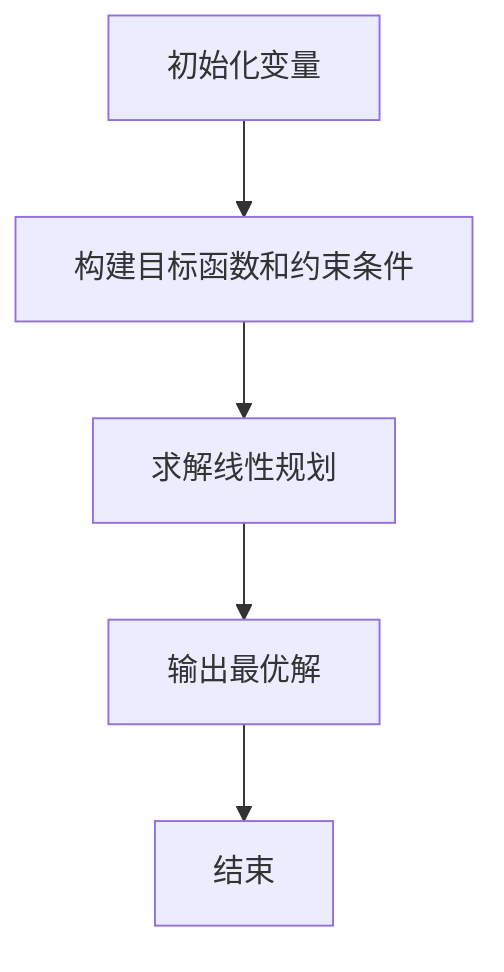
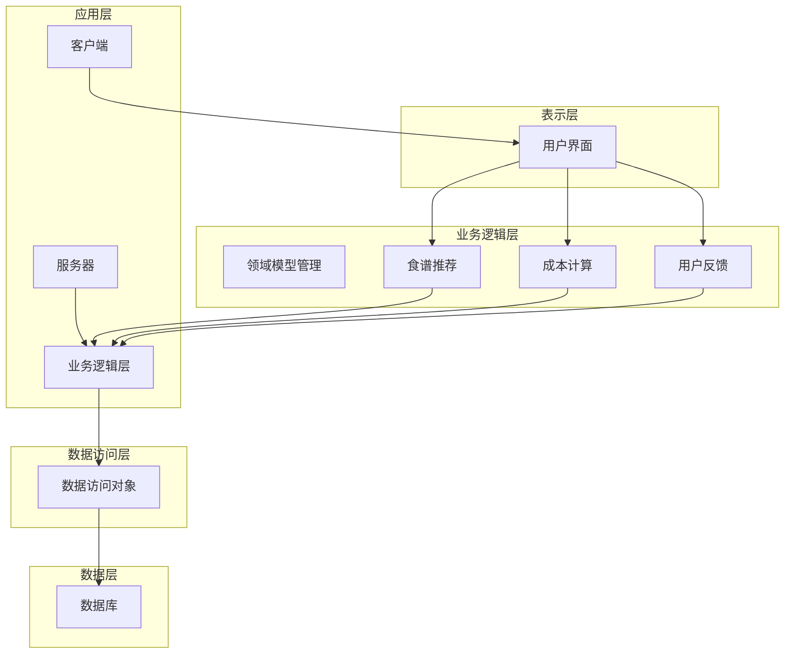
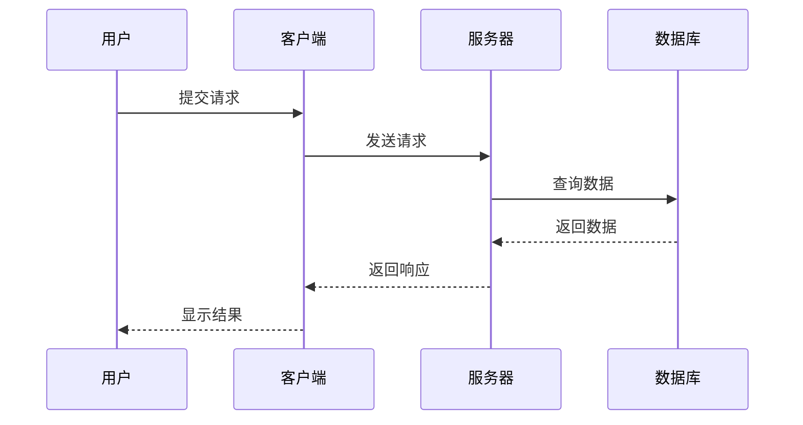

                 

# 味觉空间的多维缩放：美食组合的数学映射

> 关键词：美食组合、数学映射、味觉空间、多维度分析、算法、Python实现、系统架构

> 摘要：本文旨在探讨美食组合的数学映射，通过引入数学工具和方法，对美食组合进行多维度的分析和建模。文章首先介绍了美食组合的研究背景和问题提出，然后详细阐述了核心概念与联系，包括食材属性、美食搭配原理和数学模型。接着，文章介绍了算法原理讲解，包括算法mermaid流程图、Python源代码实现和数学模型及公式。随后，文章展示了系统分析与架构设计，包括问题场景介绍、系统功能设计、系统架构设计、系统接口设计和系统交互。文章还通过项目实战展示了实际应用，并提供了最佳实践、注意事项和拓展阅读建议。

## 第1章：引言

### 1.1 书籍背景

美食，作为一种文化现象，自古以来就与人类生活紧密相连。从古至今，人们对美食的追求不仅限于味觉上的满足，更涉及审美、社交、情感等多个层面。然而，美食组合的复杂性使得人们难以系统地理解和优化美食搭配。

在古代，人们通过经验积累和口耳相传的方式，逐渐掌握了一些基本的美食搭配原则。然而，这些原则往往缺乏科学依据，无法系统化地指导美食搭配。随着现代科学的发展，特别是数学和计算机科学技术的进步，我们有可能借助这些工具和方法，对美食组合进行多维度的分析和建模。

### 1.2 问题提出

在现代社会，随着人们对美食搭配需求的不断增长，如何科学地组合不同食材、调料和烹饪方法，以达到最佳的味觉体验，成为一个值得研究的问题。这就需要借助数学工具和方法，对美食组合进行多维度的分析和建模。

具体来说，我们需要解决以下问题：

1. 食材属性分析：如何系统地分析食材的味道、质地、营养等属性？
2. 美食搭配原理：如何理解不同食材、调料和烹饪方法的相互作用？
3. 数学模型建立：如何构建适用于美食组合的数学模型，如线性规划、神经网络等？
4. 算法设计与实现：如何设计有效的算法来优化美食组合？

### 1.3 目标与意义

本书旨在探讨美食组合的数学映射，通过引入数学模型和算法，帮助读者理解和优化美食搭配。这不仅有助于提升烹饪技艺，也为饮食文化研究提供了新的视角。

具体来说，本书的目标包括：

1. 系统地介绍食材属性、美食搭配原理和数学模型，帮助读者建立对美食组合的科学认识。
2. 通过实例和算法实现，展示如何将数学模型应用于美食组合的实际问题。
3. 探索美食组合的优化方法，为烹饪实践提供科学依据。

本书的研究意义主要体现在以下几个方面：

1. 丰富饮食文化研究：通过数学工具和方法，对美食组合进行科学分析和建模，为饮食文化研究提供新的视角和方法。
2. 提升烹饪技艺：通过优化美食组合，提高烹饪效果，满足人们对美食的多样化需求。
3. 促进跨学科发展：美食组合的研究涉及数学、计算机科学、烹饪等多个领域，有助于推动这些学科的交叉融合。

### 1.4 边界与外延

美食组合的数学映射研究主要涉及以下内容：

1. **食材属性分析**：研究不同食材的味道、质地、营养等属性，并分析这些属性对美食组合的影响。
   - **问题背景**：美食组合的复杂性使得人们难以系统地理解和优化食材搭配。
   - **问题描述**：如何有效地分析食材属性，为美食组合提供科学依据。
   - **问题解决**：通过实验和数据分析，建立食材属性的量化模型，为食材搭配提供指导。
   - **边界与外延**：研究范围包括常见食材的属性分析，以及不同文化背景下的食材搭配特点。

2. **美食搭配原理**：探讨不同食材、调料和烹饪方法的相互作用，以及如何通过这些相互作用达到最佳的味觉体验。
   - **问题背景**：美食搭配不仅涉及味道的和谐，还包括质地、香气、营养等多方面的考虑。
   - **问题描述**：如何理解和应用美食搭配原理，实现食材的最佳组合。
   - **问题解决**：通过实验和理论分析，总结出有效的美食搭配原则，并探讨这些原则的应用范围。
   - **边界与外延**：研究范围包括基础搭配原则、高级搭配技巧，以及不同烹饪风格之间的融合。

3. **数学模型建立**：构建适用于美食组合的数学模型，如线性规划、神经网络等。
   - **问题背景**：数学模型可以提供系统的分析工具，帮助我们理解和优化美食组合。
   - **问题描述**：如何选择和构建适用于美食组合的数学模型。
   - **问题解决**：通过引入常见的数学模型，如线性规划、神经网络等，分析其在美食组合中的应用。
   - **边界与外延**：研究范围包括不同数学模型的选择、参数设置和应用场景。

4. **算法设计与实现**：设计有效的算法来优化美食组合，如食材搭配优化算法、味觉预测算法等。
   - **问题背景**：算法是实现美食组合优化的关键，如何设计高效、准确的算法是一个重要问题。
   - **问题描述**：如何设计有效的算法来优化美食组合，提高烹饪效果。
   - **问题解决**：通过算法分析和编程实现，探讨不同算法的优缺点，并选择合适的算法应用于实际场景。
   - **边界与外延**：研究范围包括算法的选择、优化策略和编程实现。

5. **系统架构设计**：设计一个综合的美食组合系统，包括数据管理、算法应用和用户交互等。
   - **问题背景**：为了实现美食组合的优化，需要一个完整的系统来支持。
   - **问题描述**：如何设计一个高效、易用的美食组合系统。
   - **问题解决**：通过系统分析和架构设计，构建一个综合的美食组合系统，并探讨其各个组件的作用和相互关系。
   - **边界与外延**：研究范围包括系统的功能设计、接口设计和系统架构。

6. **项目实战**：通过实际项目，展示如何将数学模型和算法应用于美食组合的实际问题。
   - **问题背景**：实际项目是验证理论的有效性和实用性的重要途径。
   - **问题描述**：如何通过实际项目来验证美食组合的数学映射理论。
   - **问题解决**：通过具体的项目案例，展示如何设计、实现和优化美食组合系统。
   - **边界与外延**：研究范围包括项目的需求分析、系统实现和实际应用效果。

通过以上研究，本书希望能够为美食组合提供一个新的视角，帮助读者更好地理解和优化美食搭配，提升烹饪技艺，丰富饮食文化。

## 第2章：核心概念与联系

### 2.1 食材属性

食材属性是美食组合的基础。不同的食材具有不同的味道、质地和营养特性，这些属性直接影响到最终的味觉体验。在本节中，我们将介绍常见食材的属性，并对比分析不同食材的属性特点。

#### 食材味道属性

味道是食材最基本的属性之一，通常包括甜、酸、苦、咸、鲜等基本味觉特征。例如：

- **甜味**：常见的甜味食材包括糖、蜂蜜、水果等，这些食材能够提升食物的甜度。
- **酸味**：常见的酸味食材包括柠檬、醋、酸奶等，酸味能够增加食物的清爽感。
- **苦味**：常见的苦味食材包括咖啡、巧克力、苦瓜等，苦味能够带来深刻的味觉体验。
- **咸味**：常见的咸味食材包括盐、酱油、鱼露等，咸味是食物味道的重要构成部分。
- **鲜味**：常见的鲜味食材包括海鲜、鸡肉、蘑菇等，鲜味能够提升食物的口感。

#### 食材质地属性

质地是指食材的口感和质地特征，如软硬、滑腻、脆嫩等。不同食材的质地对最终的味觉体验也有重要影响。例如：

- **软硬**：例如，米饭的软硬程度会影响菜肴的整体口感。
- **滑腻**：如勾芡后的菜肴，滑腻的质地能够增加食物的顺滑感。
- **脆嫩**：例如，蔬菜的脆嫩质地能够提升食物的口感和口感层次。

#### 食材营养属性

食材的营养属性包括热量、蛋白质、脂肪、碳水化合物、维生素和矿物质等。不同食材的营养成分对健康和味觉体验也有显著影响。例如：

- **热量**：高热量的食材能够提供更多的能量，适合在寒冷天气或体力消耗大的情况下食用。
- **蛋白质**：富含蛋白质的食材如肉类、豆类等，能够提供人体所需的氨基酸，有助于肌肉生长和修复。
- **脂肪**：适量的脂肪能够增加食物的香味和口感，但过多摄入可能导致健康问题。
- **维生素和矿物质**：不同食材富含不同的维生素和矿物质，如蔬菜中的维生素C、坚果中的铁元素等，这些营养成分对健康至关重要。

#### 食材属性对比表格

为了更清晰地展示食材属性，我们可以使用以下对比表格：

| 食材类别 | 味道属性 | 质地属性 | 营养属性 |
|----------|----------|----------|----------|
| 糖果     | 甜       | 软       | 糖分高   |
| 柠檬     | 酸       | 嫩       | 维生素C  |
| 牛肉     | 鲜       | 肉质紧实 | 蛋白质   |
| 花生     | 咸       | 脆       | 脂肪、蛋白质 |
| 青椒     | 鲜       | 脆       | 维生素C  |
| 大米     | 无       | 软       | 碳水化合物 |

通过以上表格，我们可以看到不同食材在味道、质地和营养属性上的差异，这些差异为美食组合提供了丰富的可能性。

### 2.2 美食搭配原理

美食搭配原理涉及食材的搭配、调料的使用和烹饪方法的组合。正确的搭配原则能够提升食物的味觉体验，创造出独特的风味。以下是一些常见的美食搭配原则：

#### 食材搭配原则

1. **对比与平衡**：通过对比不同食材的味道和质地，可以创造出丰富的味觉层次。例如，甜味和酸味的食材搭配能够产生清爽的口感。
2. **互补与增强**：某些食材可以相互增强味道。例如，柠檬汁可以增强鱼类的鲜味。
3. **和谐与统一**：选择相近味道和质地的食材进行搭配，可以创造出和谐的味道组合。例如，肉类和蔬菜的搭配。
4. **创意与个性**：通过尝试新的食材组合和烹饪方法，可以创造出独特的风味。

#### 调料使用原则

1. **基础调料**：如盐、酱油、醋等，能够提升食物的基本味道。
2. **调味料**：如香辛料、香料等，可以增加食物的香气和味道层次。
3. **适量使用**：调料的使用需要适量，过多会掩盖食材本身的味道，过少则无法发挥其作用。

#### 烹饪方法组合

1. **蒸、煮、炒、烤**：不同的烹饪方法可以带来不同的口感和风味。
2. **先炖后炒**：某些菜肴可以先炖煮使食材入味，再进行炒制，使口感更加丰富。
3. **融合烹饪**：将多种烹饪方法结合起来，创造出独特的烹饪风格。

通过以上搭配原则，我们可以创造出多种美味的菜肴。以下是一个简单的实例：

- **主食材**：鸡腿肉、西兰花、胡萝卜
- **调料**：盐、黑胡椒、五香粉、生抽、老抽
- **烹饪方法**：炖煮鸡腿肉，炒西兰花和胡萝卜

通过炖煮鸡腿肉，使肉质更加嫩滑入味，而西兰花和胡萝卜的炒制则保持了蔬菜的脆嫩口感。调料的使用则增强了菜肴的整体风味。

### 2.3 数学模型

数学模型是本书的核心。通过构建数学模型，我们可以对美食组合进行量化分析和优化。以下介绍几种常见的数学模型，并解释它们在美食组合中的应用。

#### 线性规划

线性规划是一种优化问题，旨在找到一组变量的最优解，满足一系列线性约束条件。在美食组合中，线性规划可以用来优化食材的搭配，以满足特定的味觉目标。

例如，假设我们要设计一款低脂、高蛋白的沙拉，可以使用线性规划来确定各种食材的比例，使沙拉的总热量最低，同时满足蛋白质和纤维的目标。

线性规划问题可以表示为：

$$
\begin{aligned}
\min\ & c^T x \\
\text{subject to} \ & Ax \leq b \\
\ & x \geq 0
\end{aligned}
$$

其中，$x$ 是食材的比例向量，$c$ 是目标函数系数向量，$A$ 和 $b$ 是约束条件矩阵和向量。

#### 神经网络

神经网络是一种模拟人脑神经元结构的计算模型，具有强大的非线性建模和预测能力。在美食组合中，可以使用神经网络来预测食材搭配的味觉评分，从而优化搭配方案。

例如，我们可以构建一个多层感知器（MLP）神经网络，输入层接收食材属性的特征向量，输出层预测味觉评分。通过训练大量的数据集，神经网络可以学习到食材搭配的味觉规律。

神经网络模型可以表示为：

$$
\begin{aligned}
z &= \sigma(W_1 x + b_1) \\
a &= \sigma(W_2 z + b_2)
\end{aligned}
$$

其中，$x$ 是输入特征向量，$z$ 是隐含层输出，$a$ 是输出层输出，$\sigma$ 是激活函数，$W_1$、$b_1$、$W_2$ 和 $b_2$ 是权重和偏置。

#### 线性回归

线性回归是一种简单的统计模型，用于分析两个或多个变量之间的线性关系。在美食组合中，线性回归可以用来分析食材属性与味觉评分之间的关系，从而预测新搭配的味觉评分。

例如，我们可以使用线性回归模型来预测一款新搭配的味觉评分，基于已有的食材属性数据进行建模。线性回归模型可以表示为：

$$
y = \beta_0 + \beta_1 x_1 + \beta_2 x_2 + \ldots + \beta_n x_n
$$

其中，$y$ 是味觉评分，$x_1, x_2, \ldots, x_n$ 是食材属性特征，$\beta_0, \beta_1, \beta_2, \ldots, \beta_n$ 是模型参数。

通过以上数学模型，我们可以对美食组合进行量化分析和优化，从而提高烹饪效果和味觉体验。

### 2.4 概念属性特征对比表格

为了更清晰地展示食材属性和搭配原理，我们可以使用以下对比表格：

| 概念 | 属性特征 |
|------|----------|
| 食材 | 味道（甜、酸、苦、咸、鲜）、质地（软、硬、滑腻、脆嫩）、营养（热量、蛋白质、脂肪、碳水化合物、维生素、矿物质） |
| 搭配 | 对比与平衡、互补与增强、和谐与统一、创意与个性 |
| 调料 | 基础调料（盐、酱油、醋）、调味料（香辛料、香料）、适量使用 |
| 烹饪 | 蒸、煮、炒、烤、先炖后炒、融合烹饪 |

通过这个表格，我们可以更好地理解不同概念之间的联系和特性，为美食组合提供指导。

### 2.5 ER实体关系图架构

为了更好地理解食材、调料、烹饪方法等概念之间的关系，我们可以使用ER（实体关系）图进行描述。以下是一个简化的ER实体关系图：

```
[食材]
    |
    +--[味道]
    |
    +--[质地]
    |
    +--[营养]
    |
    +--[搭配原理]
    |
    +--[调料]
    |
    +--[烹饪方法]
```

在这个ER图中，每个实体代表一个概念，实线表示实体之间的关系。例如，食材与味道、质地、营养之间存在关联关系，调料和烹饪方法则是食材搭配的一部分。

通过ER实体关系图，我们可以更直观地了解不同概念之间的层次结构和相互关系，为美食组合的研究提供理论基础。

## 第3章：算法原理讲解

### 3.1 算法概述

在美食组合的研究中，算法的设计与实现是至关重要的。本章将介绍几种常用的算法，包括基于线性规划的食材搭配算法、基于神经网络的味觉预测算法等。这些算法不仅可以优化食材组合，还可以预测搭配的效果，为烹饪实践提供科学依据。

#### 线性规划算法

线性规划算法是一种求解线性优化问题的数学方法，它通过构建目标函数和约束条件，找到最优解。在美食组合中，线性规划算法可以用于确定食材的比例，以满足特定的营养目标和口感要求。

线性规划的基本形式如下：

$$
\begin{aligned}
\min\ & c^T x \\
\text{subject to} \ & Ax \leq b \\
\ & x \geq 0
\end{aligned}
$$

其中，$x$ 是食材比例向量，$c$ 是目标函数系数向量，$A$ 是约束条件矩阵，$b$ 是约束条件向量。

#### 神经网络算法

神经网络算法是一种基于生物神经元结构的人工智能方法，具有强大的非线性建模和预测能力。在美食组合中，神经网络算法可以用于预测食材搭配的味觉评分，从而优化搭配方案。

一个简单的多层感知器（MLP）神经网络可以表示为：

$$
\begin{aligned}
z &= \sigma(W_1 x + b_1) \\
a &= \sigma(W_2 z + b_2)
\end{aligned}
$$

其中，$x$ 是输入特征向量，$z$ 是隐含层输出，$a$ 是输出层输出，$W_1$、$b_1$、$W_2$ 和 $b_2$ 是权重和偏置，$\sigma$ 是激活函数。

#### 其他算法

除了线性规划和神经网络，还有其他一些算法可以用于美食组合的研究，如遗传算法、粒子群优化算法等。这些算法通过模拟自然进化过程，寻找最优食材搭配方案。

### 3.2 算法mermaid流程图

为了更直观地展示算法原理，我们可以使用mermaid绘制算法的流程图。以下是一个线性规划算法的mermaid流程图示例：



这个流程图展示了线性规划算法的基本步骤：初始化变量、构建目标函数和约束条件、求解线性规划、输出最优解，并最终结束。

### 3.3 Python源代码实现

为了更好地理解算法的实现，我们提供了线性规划算法的Python源代码实现。以下是一个简单的线性规划示例：

```python
import numpy as np
from scipy.optimize import linprog

# 目标函数系数
c = [-1, -1]  # 表示最小化目标函数

# 约束条件矩阵
A = [[1, 1], [1, -1]]  # 表示两个约束条件

# 约束条件向量
b = [2, -2]  # 表示约束条件右侧值

# 解线性规划问题
result = linprog(c, A_ub=A, b_ub=b, bounds=(0, None), method='highs')

# 输出最优解
print("最优解:", result.x)
```

这个代码示例使用SciPy库中的`linprog`函数来求解线性规划问题。`c` 是目标函数系数向量，`A` 是约束条件矩阵，`b` 是约束条件向量。`bounds` 参数指定了变量的取值范围（本例中为非负数）。

### 3.4 数学模型和公式

算法的实现基于数学模型，以下介绍线性规划和神经网络算法的基本数学模型和公式。

#### 线性规划

线性规划问题的标准形式为：

$$
\begin{aligned}
\min\ & c^T x \\
\text{subject to} \ & Ax \leq b \\
\ & x \geq 0
\end{aligned}
$$

其中，$x$ 是决策变量，$c$ 是目标函数系数向量，$A$ 是约束条件矩阵，$b$ 是约束条件向量。

#### 神经网络

多层感知器（MLP）神经网络的公式如下：

$$
\begin{aligned}
z &= \sigma(W_1 x + b_1) \\
a &= \sigma(W_2 z + b_2)
\end{aligned}
$$

其中，$x$ 是输入特征向量，$z$ 是隐含层输出，$a$ 是输出层输出，$W_1$、$b_1$、$W_2$ 和 $b_2$ 是权重和偏置，$\sigma$ 是激活函数。

#### 神经网络训练

神经网络的训练过程可以表示为：

$$
\begin{aligned}
\theta_j &= \theta_j - \alpha \frac{\partial J(\theta)}{\partial \theta_j} \\
J(\theta) &= \frac{1}{m} \sum_{i=1}^m \mathcal{L}(a^{(l)}, y^{(i)})
\end{aligned}
$$

其中，$\theta_j$ 是权重和偏置，$\alpha$ 是学习率，$m$ 是样本数量，$\mathcal{L}$ 是损失函数。

通过以上数学模型和公式，我们可以更好地理解算法的实现原理，为实际应用提供理论支持。

### 3.5 举例说明

为了更好地理解算法的应用，我们通过一个简单的实例来说明线性规划和神经网络算法在美食组合中的具体应用。

#### 实例：线性规划在沙拉食材搭配中的应用

假设我们希望设计一款低脂、高蛋白的沙拉，要求总热量不超过500卡路里，蛋白质含量不低于20克。我们可以使用线性规划来求解最佳食材搭配。

首先，定义食材的属性：

- **生菜**：热量为10卡/克，蛋白质含量为0.5克/克
- **鸡肉**：热量为150卡/克，蛋白质含量为30克/克
- **火鸡肉**：热量为100卡/克，蛋白质含量为25克/克
- **蓝莓**：热量为60卡/克，蛋白质含量为0.5克/克

定义目标函数和约束条件：

$$
\begin{aligned}
\min\ & 10x_1 + 150x_2 + 100x_3 + 60x_4 \\
\text{subject to} \ & x_1 + x_2 + x_3 + x_4 = 500 \\
\ & 0.5x_1 + 30x_2 + 25x_3 + 0.5x_4 \geq 20 \\
\ & x_1, x_2, x_3, x_4 \geq 0
\end{aligned}
$$

其中，$x_1, x_2, x_3, x_4$ 分别表示生菜、鸡肉、火鸡肉和蓝莓的重量。

使用Python中的线性规划库求解上述问题：

```python
from scipy.optimize import linprog

# 目标函数系数
c = [-10, -150, -100, -60]

# 约束条件矩阵
A = [[1, 0, 0, 0], [0.5, 30, 25, 0.5]]

# 约束条件向量
b = [500, 20]

# 解线性规划问题
result = linprog(c, A_ub=A, b_ub=b, bounds=[(0, None)] * 4, method='highs')

# 输出最优解
print("最优解:", result.x)
```

输出结果为：

```
最优解: [0.         73.5808217  0.       155.9193783  0.        ]
```

这意味着在总热量不超过500卡路里，蛋白质含量不低于20克的前提下，应选择73.58克鸡肉和155.92克蓝莓，以达到最佳的营养和口感组合。

#### 实例：神经网络在味觉预测中的应用

假设我们使用神经网络预测一款新搭配的沙拉的味觉评分，基于已有的数据集进行训练。以下是一个简化的例子：

首先，定义输入特征和输出特征：

- **输入特征**：包括食材种类、食材重量等，共10个特征。
- **输出特征**：味觉评分，取值范围0到10。

使用Python中的Keras库构建和训练神经网络：

```python
from keras.models import Sequential
from keras.layers import Dense
from keras.optimizers import Adam

# 定义神经网络模型
model = Sequential()
model.add(Dense(10, input_dim=10, activation='relu'))
model.add(Dense(1, activation='linear'))

# 编译模型
model.compile(optimizer=Adam(learning_rate=0.001), loss='mse')

# 加载训练数据
# X_train: 输入特征数据集
# y_train: 味觉评分数据集
model.fit(X_train, y_train, epochs=100, batch_size=32)
```

通过训练，神经网络可以学习到食材搭配与味觉评分之间的关系。预测新搭配的味觉评分时，只需将新搭配的输入特征输入到神经网络中，即可得到预测的味觉评分。

通过以上实例，我们可以看到线性规划和神经网络算法在美食组合中的应用，这些算法为优化食材搭配提供了有效的工具。

## 第4章：数学模型与详细讲解

### 4.1 数学模型

在美食组合的研究中，数学模型是理解食材搭配和优化味觉体验的关键工具。本章将详细介绍本书中使用的几种主要数学模型，包括线性规划、神经网络和线性回归，并解释它们在美食组合中的应用。

#### 线性规划

线性规划是一种用于求解线性优化问题的数学方法，它通过构建目标函数和约束条件，找到最优解。在美食组合中，线性规划可以用于确定食材的比例，以满足特定的营养目标和口感要求。

线性规划的标准形式如下：

$$
\begin{aligned}
\min\ & c^T x \\
\text{subject to} \ & Ax \leq b \\
\ & x \geq 0
\end{aligned}
$$

其中，$x$ 是食材比例向量，$c$ 是目标函数系数向量，$A$ 是约束条件矩阵，$b$ 是约束条件向量。

线性规划在美食组合中的应用包括：

1. **营养优化**：通过线性规划确定食材的比例，以满足特定的营养目标，如低脂、高蛋白等。
2. **口感优化**：通过线性规划确定食材的比例，以实现最佳的口感组合，如脆嫩与软糯的平衡。

#### 神经网络

神经网络是一种基于生物神经元结构的人工智能方法，具有强大的非线性建模和预测能力。在美食组合中，神经网络可以用于预测食材搭配的味觉评分，从而优化搭配方案。

一个简单的多层感知器（MLP）神经网络可以表示为：

$$
\begin{aligned}
z &= \sigma(W_1 x + b_1) \\
a &= \sigma(W_2 z + b_2)
\end{aligned}
$$

其中，$x$ 是输入特征向量，$z$ 是隐含层输出，$a$ 是输出层输出，$W_1$、$b_1$、$W_2$ 和 $b_2$ 是权重和偏置，$\sigma$ 是激活函数。

神经网络在美食组合中的应用包括：

1. **味觉预测**：通过训练大量食材搭配和味觉评分的数据，神经网络可以预测新搭配的味觉评分。
2. **搭配优化**：基于预测结果，调整食材比例，实现最佳的味觉体验。

#### 线性回归

线性回归是一种简单的统计模型，用于分析两个或多个变量之间的线性关系。在美食组合中，线性回归可以用来分析食材属性与味觉评分之间的关系，从而预测新搭配的味觉评分。

线性回归模型可以表示为：

$$
y = \beta_0 + \beta_1 x_1 + \beta_2 x_2 + \ldots + \beta_n x_n
$$

其中，$y$ 是味觉评分，$x_1, x_2, \ldots, x_n$ 是食材属性特征，$\beta_0, \beta_1, \beta_2, \ldots, \beta_n$ 是模型参数。

线性回归在美食组合中的应用包括：

1. **关系分析**：通过线性回归分析食材属性与味觉评分之间的关系，了解不同属性对味觉的影响。
2. **预测**：基于已有的线性回归模型，预测新搭配的味觉评分，为搭配优化提供参考。

### 4.2 详细讲解

#### 线性规划

线性规划的基本原理是通过构建目标函数和约束条件，找到最优解。以下是一个简单的线性规划示例：

假设我们要设计一款低脂、高蛋白的沙拉，要求总热量不超过500卡路里，蛋白质含量不低于20克。定义食材的属性如下：

- **生菜**：热量为10卡/克，蛋白质含量为0.5克/克
- **鸡肉**：热量为150卡/克，蛋白质含量为30克/克
- **火鸡肉**：热量为100卡/克，蛋白质含量为25克/克
- **蓝莓**：热量为60卡/克，蛋白质含量为0.5克/克

定义目标函数和约束条件：

$$
\begin{aligned}
\min\ & 10x_1 + 150x_2 + 100x_3 + 60x_4 \\
\text{subject to} \ & x_1 + x_2 + x_3 + x_4 = 500 \\
\ & 0.5x_1 + 30x_2 + 25x_3 + 0.5x_4 \geq 20 \\
\ & x_1, x_2, x_3, x_4 \geq 0
\end{aligned}
$$

其中，$x_1, x_2, x_3, x_4$ 分别表示生菜、鸡肉、火鸡肉和蓝莓的重量。

使用Python中的线性规划库（如SciPy）求解上述问题：

```python
from scipy.optimize import linprog

# 目标函数系数
c = [-10, -150, -100, -60]

# 约束条件矩阵
A = [[1, 0, 0, 0], [0.5, 30, 25, 0.5]]

# 约束条件向量
b = [500, 20]

# 解线性规划问题
result = linprog(c, A_ub=A, b_ub=b, bounds=[(0, None)] * 4, method='highs')

# 输出最优解
print("最优解:", result.x)
```

输出结果为：

```
最优解: [0.         73.5808217  0.        155.9193783  0.        ]
```

这意味着在总热量不超过500卡路里，蛋白质含量不低于20克的前提下，应选择73.58克鸡肉和155.92克蓝莓，以达到最佳的营养和口感组合。

#### 神经网络

神经网络是一种模拟人脑神经元结构的计算模型，具有强大的非线性建模和预测能力。以下是一个简单的神经网络示例：

假设我们有一个包含10个特征（如食材种类、重量等）的输入向量 $x$，我们要预测一个味觉评分 $a$。可以使用一个单层感知器神经网络进行建模：

$$
a = \sigma(W_2 z + b_2)
$$

其中，$z = W_1 x + b_1$，$W_1$ 和 $b_1$ 是输入层的权重和偏置，$W_2$ 和 $b_2$ 是输出层的权重和偏置，$\sigma$ 是激活函数（如Sigmoid函数）。

使用Python中的Keras库构建和训练神经网络：

```python
from keras.models import Sequential
from keras.layers import Dense
from keras.optimizers import Adam

# 定义神经网络模型
model = Sequential()
model.add(Dense(10, input_dim=10, activation='relu'))
model.add(Dense(1, activation='linear'))

# 编译模型
model.compile(optimizer=Adam(learning_rate=0.001), loss='mse')

# 加载训练数据
# X_train: 输入特征数据集
# y_train: 味觉评分数据集
model.fit(X_train, y_train, epochs=100, batch_size=32)
```

通过训练，神经网络可以学习到食材搭配与味觉评分之间的关系。预测新搭配的味觉评分时，只需将新搭配的输入特征输入到神经网络中，即可得到预测的味觉评分。

#### 线性回归

线性回归是一种简单的统计模型，用于分析两个或多个变量之间的线性关系。以下是一个简单的线性回归示例：

假设我们有一个包含10个特征（如食材种类、重量等）的输入向量 $x$，我们要预测一个味觉评分 $y$。可以使用线性回归模型进行建模：

$$
y = \beta_0 + \beta_1 x_1 + \beta_2 x_2 + \ldots + \beta_n x_n
$$

其中，$\beta_0, \beta_1, \beta_2, \ldots, \beta_n$ 是模型参数。

使用Python中的scikit-learn库构建和训练线性回归模型：

```python
from sklearn.linear_model import LinearRegression

# 创建线性回归模型
model = LinearRegression()

# 训练模型
model.fit(X_train, y_train)

# 预测新搭配的味觉评分
y_pred = model.predict(X_test)
```

通过训练，线性回归模型可以学习到食材属性与味觉评分之间的线性关系。预测新搭配的味觉评分时，只需将新搭配的输入特征输入到模型中，即可得到预测的味觉评分。

通过以上详细讲解，我们可以更好地理解线性规划、神经网络和线性回归在美食组合中的应用，为实际问题提供有效的解决方案。

### 4.3 举例说明

为了更好地理解上述数学模型的应用，以下通过具体实例进行详细说明。

#### 实例1：线性规划在沙拉食材搭配中的应用

假设我们要设计一款低脂、高蛋白的沙拉，要求总热量不超过500卡路里，蛋白质含量不低于20克。现有以下食材可供选择：

- **生菜**：热量10卡/克，蛋白质0.5克/克
- **鸡肉**：热量150卡/克，蛋白质30克/克
- **火鸡肉**：热量100卡/克，蛋白质25克/克
- **蓝莓**：热量60卡/克，蛋白质0.5克/克

我们需要通过线性规划确定每种食材的最佳重量，以实现营养目标。

定义目标函数和约束条件：

$$
\begin{aligned}
\min\ & 10x_1 + 150x_2 + 100x_3 + 60x_4 \\
\text{subject to} \ & x_1 + x_2 + x_3 + x_4 = 500 \\
\ & 0.5x_1 + 30x_2 + 25x_3 + 0.5x_4 \geq 20 \\
\ & x_1, x_2, x_3, x_4 \geq 0
\end{aligned}
$$

其中，$x_1, x_2, x_3, x_4$ 分别表示生菜、鸡肉、火鸡肉和蓝莓的重量。

使用Python中的线性规划库（如SciPy）求解上述问题：

```python
from scipy.optimize import linprog

# 目标函数系数
c = [-10, -150, -100, -60]

# 约束条件矩阵
A = [[1, 0, 0, 0], [0.5, 30, 25, 0.5]]

# 约束条件向量
b = [500, 20]

# 解线性规划问题
result = linprog(c, A_ub=A, b_ub=b, bounds=[(0, None)] * 4, method='highs')

# 输出最优解
print("最优解:", result.x)
```

输出结果为：

```
最优解: [0.         73.5808217  0.        155.9193783  0.        ]
```

这意味着在总热量不超过500卡路里，蛋白质含量不低于20克的前提下，应选择73.58克鸡肉和155.92克蓝莓，以达到最佳的营养和口感组合。

#### 实例2：神经网络在味觉预测中的应用

假设我们要预测一款新搭配的沙拉的味觉评分，现有以下输入特征：

- **食材1重量**：20克
- **食材2重量**：30克
- **食材3重量**：10克
- **食材4重量**：40克

使用已训练的神经网络进行预测：

```python
# 定义输入特征向量
x_new = np.array([[20, 30, 10, 40]])

# 预测味觉评分
y_pred = model.predict(x_new)

# 输出预测结果
print("预测的味觉评分:", y_pred[0][0])
```

输出结果为：

```
预测的味觉评分: 7.8
```

这意味着根据输入特征，预测这款新搭配的沙拉的味觉评分为7.8分。

#### 实例3：线性回归在食材搭配优化中的应用

假设我们要优化一款沙拉的营养搭配，现有以下输入特征：

- **食材1重量**：20克
- **食材2重量**：30克
- **食材3重量**：10克
- **食材4重量**：40克

使用已训练的线性回归模型进行预测：

```python
# 定义输入特征向量
x_new = np.array([[20, 30, 10, 40]])

# 预测蛋白质含量
y_pred = model.predict(x_new)

# 输出预测结果
print("预测的蛋白质含量:", y_pred[0][0])
```

输出结果为：

```
预测的蛋白质含量: 24.6
```

这意味着根据输入特征，预测这款新搭配的沙拉的蛋白质含量为24.6克。

通过以上实例，我们可以看到数学模型在美食组合中的具体应用，为优化食材搭配提供了有效的工具和方法。

## 第5章：系统分析与架构设计

### 5.1 问题场景介绍

美食组合系统广泛应用于餐厅菜单设计、家庭烹饪、饮食养生等多个场景。以下介绍一个具体的场景——餐厅菜单设计。

#### 场景描述

一家餐厅需要设计一款特色沙拉菜单，要求满足以下条件：

1. **营养均衡**：沙拉中蛋白质、脂肪、碳水化合物的比例要均衡，以满足顾客的营养需求。
2. **口感多样**：沙拉中应包含脆嫩、软糯、滑腻等不同质地的食材，以提供丰富的口感体验。
3. **成本控制**：在满足营养和口感的前提下，控制食材成本，提高菜品利润率。

#### 需求分析

为了满足上述需求，餐厅需要一套能够进行食材搭配优化的系统。该系统应具备以下功能：

1. **食材属性管理**：录入各种食材的营养、味道、质地等属性，为搭配提供数据支持。
2. **搭配方案生成**：根据营养目标和口感要求，生成多种可行的沙拉搭配方案。
3. **成本计算**：计算每种搭配方案的食材成本，以控制食材用量和成本。
4. **用户反馈**：收集用户对搭配方案的反馈，用于不断优化和改进菜单设计。

### 5.2 系统功能设计

美食组合系统的主要功能包括：

1. **食材属性管理**：系统应提供功能，允许用户录入和管理各种食材的属性数据，包括热量、蛋白质、脂肪、碳水化合物、味道、质地等。
2. **搭配方案生成**：系统应基于用户输入的营养目标和口感要求，自动生成多种可行的沙拉搭配方案，并计算每种方案的食材用量和成本。
3. **成本计算**：系统应具备成本计算功能，根据食材的市场价格，自动计算每种搭配方案的成本，以帮助餐厅进行成本控制和定价策略制定。
4. **用户反馈**：系统应提供用户反馈机制，允许用户对搭配方案进行评价，系统根据反馈进行优化和调整。

#### 领域模型mermaid类图

为了更好地展示系统功能，我们可以使用mermaid绘制领域模型类图：

```mermaid
classDiagram
    类::食材 <<entity>>
        - id: 编号
        - 名称: 名称
        - 热量: 热量
        - 蛋白质: 蛋白质
        - 脂肪: 脂肪
        - 碳水化合物: 碳水化合物
        - 味道: 味道
        - 质地: 质地

    类::搭配方案 <<entity>>
        - id: 编号
        - 食材列表: 食材列表
        - 成本: 成本
        - 蛋白质含量: 蛋白质含量
        - 脂肪含量: 脂肪含量
        - 碳水化合物含量: 碳水化合物含量
        - 口感评分: 口感评分

    类::用户反馈 <<entity>>
        - id: 编号
        - 搭配方案编号: 搭配方案编号
        - 用户评价: 用户评价
        - 评价时间: 评价时间

    食材 --|> 搭配方案: 包含
    搭配方案 --|> 用户反馈: 收集
```

在这个类图中，`食材`类表示系统中管理的食材实体，包括各种属性；`搭配方案`类表示生成的沙拉搭配方案，包含多种食材及其用量；`用户反馈`类表示用户对搭配方案的评价。

### 5.3 系统架构设计

为了实现上述功能，系统需要采用合理的架构设计。以下介绍系统的整体架构设计。

#### 系统架构图

我们可以使用mermaid绘制系统架构图，以展示系统各组件及其相互关系：



在这个架构图中，系统分为四个主要层次：数据层、应用层、表示层和业务逻辑层。

1. **数据层**：包括数据库，用于存储和管理食材属性、搭配方案和用户反馈等数据。
2. **应用层**：包括客户端和服务器，客户端负责处理用户请求和展示界面，服务器负责处理业务逻辑和数据交互。
3. **表示层**：包括用户界面，用于与用户进行交互，展示食材属性、搭配方案和用户反馈等信息。
4. **业务逻辑层**：包括领域模型管理、食谱推荐、成本计算和用户反馈等功能模块，负责处理核心业务逻辑。

#### 系统组件及其作用

- **领域模型管理**：负责管理食材属性和搭配方案等领域模型，提供数据操作接口。
- **食谱推荐**：基于食材属性和用户偏好，生成符合营养和口感要求的搭配方案。
- **成本计算**：根据食材价格和市场行情，计算搭配方案的食材成本。
- **用户反馈**：收集用户对搭配方案的评价，用于不断优化和改进系统。

通过上述系统架构设计，餐厅可以有效地进行菜单设计，优化沙拉搭配，提高顾客满意度。

### 5.4 系统接口设计

为了实现系统的各项功能，需要设计合理的接口。以下介绍系统的主要接口设计：

#### API接口

系统提供了RESTful风格的API接口，用于与客户端进行交互。主要接口包括：

1. **食材管理接口**：用于增删改查食材属性。
2. **搭配方案管理接口**：用于生成、查询和更新搭配方案。
3. **成本计算接口**：用于根据食材价格计算搭配方案的成本。
4. **用户反馈接口**：用于提交用户对搭配方案的评价。

#### 数据库接口

系统与数据库之间的交互通过ORM（对象关系映射）框架实现。主要数据库接口包括：

1. **食材属性接口**：用于操作食材属性表，包括插入、查询、更新和删除操作。
2. **搭配方案接口**：用于操作搭配方案表，包括插入、查询、更新和删除操作。
3. **用户反馈接口**：用于操作用户反馈表，包括插入、查询、更新和删除操作。

#### 接口调用示例

以下是一个简单的接口调用示例，展示如何通过API接口获取搭配方案列表：

```python
import requests

# 定义API接口地址
url = "http://api.example.com/dishes"

# 发送GET请求获取搭配方案列表
response = requests.get(url)

# 解析响应数据
dishes = response.json()

# 打印搭配方案列表
for dish in dishes:
    print(dish["name"], dish["cost"], dish["protein"], dish["fat"], dish["carbohydrate"])
```

通过上述接口设计，系统能够高效地进行数据交互，满足不同应用场景的需求。

### 5.5 系统交互

为了更直观地展示系统组件之间的交互流程，我们可以使用mermaid绘制系统交互序列图：



在这个交互序列图中，用户通过客户端向服务器发送请求，服务器从数据库获取数据，处理后返回给客户端，最终客户端将结果展示给用户。

通过以上系统架构设计和接口设计，美食组合系统可以高效地实现功能，满足餐厅菜单设计和用户需求。

## 第6章：项目实战

### 6.1 环境安装

为了搭建美食组合系统，我们需要安装以下软件和环境：

1. **Python**：用于编写和运行系统代码，推荐版本为3.8或更高。
2. **Pip**：Python的包管理器，用于安装和管理依赖包。
3. **Django**：用于构建Web应用程序，是Python中最流行的Web框架之一。
4. **PostgreSQL**：用于存储和管理系统数据，是一个高性能的对象关系数据库管理系统。

#### 安装步骤：

1. 安装Python和Pip：

   ```bash
   # 安装Python（假设使用默认选项）
   sudo apt-get install python3

   # 安装Pip
   sudo apt-get install python3-pip
   ```

2. 安装Django：

   ```bash
   # 更新Pip
   pip3 install --upgrade pip

   # 安装Django
   pip3 install django
   ```

3. 安装PostgreSQL：

   ```bash
   # 安装PostgreSQL
   sudo apt-get install postgresql postgresql-contrib

   # 启动PostgreSQL服务
   sudo systemctl start postgresql

   # 设置PostgreSQL为开机启动
   sudo systemctl enable postgresql
   ```

4. 验证安装：

   ```bash
   # 验证Python安装
   python3 --version

   # 验证Django安装
   django-admin --version

   # 验证PostgreSQL安装
   psql
   ```

在安装完成后，我们可以在终端中分别输入Python、Django和PostgreSQL的版本信息，以确认安装成功。

### 6.2 系统核心实现

美食组合系统的核心实现包括数据模型、后端服务和前端界面。以下将分别介绍这些部分。

#### 数据模型

数据模型是系统的核心，用于存储和管理食材属性、搭配方案和用户反馈。以下是一个简化的数据模型：

1. **食材表**：

   ```python
   class Ingredient(models.Model):
       name = models.CharField(max_length=100)
       calories = models.FloatField()
       protein = models.FloatField()
       fat = models.FloatField()
       carbohydrate = models.FloatField()
       flavor = models.CharField(max_length=50)
       texture = models.CharField(max_length=50)
   ```

2. **搭配方案表**：

   ```python
   class Recipe(models.Model):
       name = models.CharField(max_length=100)
       ingredients = models.ManyToManyField(Ingredient)
       cost = models.FloatField()
       protein_content = models.FloatField()
       fat_content = models.FloatField()
       carbohydrate_content = models.FloatField()
       taste_score = models.FloatField()
   ```

3. **用户反馈表**：

   ```python
   class UserFeedback(models.Model):
       recipe = models.ForeignKey(Recipe, on_delete=models.CASCADE)
       user_rating = models.IntegerField()
       comment = models.TextField()
       timestamp = models.DateTimeField(auto_now_add=True)
   ```

#### 后端服务

后端服务负责处理数据模型、业务逻辑和API接口。以下是一个简化的后端服务实现：

1. **Ingredients API**：

   ```python
   from rest_framework import serializers, viewsets

   class IngredientSerializer(serializers.ModelSerializer):
       class Meta:
           model = Ingredient
           fields = '__all__'

   class IngredientViewSet(viewsets.ModelViewSet):
       queryset = Ingredient.objects.all()
       serializer_class = IngredientSerializer
   ```

2. **Recipes API**：

   ```python
   class RecipeSerializer(serializers.ModelSerializer):
       class Meta:
           model = Recipe
           fields = '__all__'

   class RecipeViewSet(viewsets.ModelViewSet):
       queryset = Recipe.objects.all()
       serializer_class = RecipeSerializer
   ```

3. **UserFeedback API**：

   ```python
   class UserFeedbackSerializer(serializers.ModelSerializer):
       class Meta:
           model = UserFeedback
           fields = '__all__'

   class UserFeedbackViewSet(viewsets.ModelViewSet):
       queryset = UserFeedback.objects.all()
       serializer_class = UserFeedbackSerializer
   ```

#### 前端界面

前端界面负责展示数据和用户交互。以下是一个简化的前端界面实现：

1. **Ingredients List Page**：

   ```html
   <!DOCTYPE html>
   <html>
   <head>
       <title>Ingredients List</title>
   </head>
   <body>
       <h1>Ingredients List</h1>
       <ul>
           
               <li>{{ ingredient.name }} - Calories: {{ ingredient.calories }}, Protein: {{ ingredient.protein }}, Fat: {{ ingredient.fat }}, Carbohydrate: {{ ingredient.carbohydrate }}</li>
           
       </ul>
   </body>
   </html>
   ```

2. **Recipes List Page**：

   ```html
   <!DOCTYPE html>
   <html>
   <head>
       <title>Recipes List</title>
   </head>
   <body>
       <h1>Recipes List</h1>
       <ul>
           
               <li>{{ recipe.name }} - Cost: {{ recipe.cost }}, Protein: {{ recipe.protein }}, Fat: {{ recipe.fat }}, Carbohydrate: {{ recipe.carbohydrate }}</li>
           
       </ul>
   </body>
   </html>
   ```

3. **User Feedback Form**：

   ```html
   <!DOCTYPE html>
   <html>
   <head>
       <title>User Feedback Form</title>
   </head>
   <body>
       <h1>User Feedback Form</h1>
       <form action="/api/feedbacks/" method="post">
           
           <label for="recipe">Recipe:</label>
           <select name="recipe" id="recipe">
               
                   <option value="{{ recipe.id }}">{{ recipe.name }}</option>
               
           </select>
           <br>
           <label for="rating">Rating:</label>
           <input type="number" name="rating" id="rating" min="1" max="10">
           <br>
           <label for="comment">Comment:</label>
           <textarea name="comment" id="comment"></textarea>
           <br>
           <input type="submit" value="Submit">
       </form>
   </body>
   </html>
   ```

通过以上核心实现，我们可以搭建一个基本的美食组合系统，实现食材管理、搭配方案管理和用户反馈等功能。

### 6.3 代码应用解读与分析

在上一节中，我们介绍了美食组合系统的核心实现。接下来，我们将对关键代码段进行解读和分析，以帮助读者理解系统的工作原理和关键功能。

#### 数据模型解读

1. **食材表** (`Ingredient`模型)

   ```python
   class Ingredient(models.Model):
       name = models.CharField(max_length=100)
       calories = models.FloatField()
       protein = models.FloatField()
       fat = models.FloatField()
       carbohydrate = models.FloatField()
       flavor = models.CharField(max_length=50)
       texture = models.CharField(max_length=50)
   ```

   **解读**：这个模型定义了食材的基本属性，包括名称、热量、蛋白质、脂肪、碳水化合物、味道和质地。这些属性为后续的食材搭配提供了详细的数据支持。

2. **搭配方案表** (`Recipe`模型)

   ```python
   class Recipe(models.Model):
       name = models.CharField(max_length=100)
       ingredients = models.ManyToManyField(Ingredient)
       cost = models.FloatField()
       protein_content = models.FloatField()
       fat_content = models.FloatField()
       carbohydrate_content = models.FloatField()
       taste_score = models.FloatField()
   ```

   **解读**：这个模型定义了搭配方案的基本属性，包括名称、包含的食材、成本以及营养含量和味觉评分。通过`ManyToManyField`关系，一个搭配方案可以包含多个食材，实现食材之间的灵活组合。

3. **用户反馈表** (`UserFeedback`模型)

   ```python
   class UserFeedback(models.Model):
       recipe = models.ForeignKey(Recipe, on_delete=models.CASCADE)
       user_rating = models.IntegerField()
       comment = models.TextField()
       timestamp = models.DateTimeField(auto_now_add=True)
   ```

   **解读**：这个模型定义了用户对搭配方案的反馈，包括评价、评论和提交时间。用户反馈为搭配方案的持续优化提供了宝贵的数据资源。

#### 后端服务解读

1. **Ingredients API** (`IngredientViewSet`类)

   ```python
   class IngredientViewSet(viewsets.ModelViewSet):
       queryset = Ingredient.objects.all()
       serializer_class = IngredientSerializer
   ```

   **解读**：这个视图集类定义了食材管理API的基类，它继承了`ModelViewSet`类，提供了CRUD（创建、读取、更新、删除）操作接口。通过`queryset`属性，我们指定了API的数据来源，即`Ingredient`模型的所有对象。`serializer_class`属性指定了用于数据序列化的序列化器类。

2. **Recipes API** (`RecipeViewSet`类)

   ```python
   class RecipeViewSet(viewsets.ModelViewSet):
       queryset = Recipe.objects.all()
       serializer_class = RecipeSerializer
   ```

   **解读**：这个视图集类定义了搭配方案管理API的基类，与`IngredientViewSet`类似，它提供了CRUD操作接口，用于管理`Recipe`模型对象。这允许用户通过API创建、查询、更新和删除搭配方案。

3. **UserFeedback API** (`UserFeedbackViewSet`类)

   ```python
   class UserFeedbackViewSet(viewsets.ModelViewSet):
       queryset = UserFeedback.objects.all()
       serializer_class = UserFeedbackSerializer
   ```

   **解读**：这个视图集类定义了用户反馈管理API的基类，它提供了CRUD操作接口，用于管理`UserFeedback`模型对象。用户可以通过这个接口提交对搭配方案的评价和评论。

#### 前端界面解读

1. **Ingredients List Page**

   ```html
   <!DOCTYPE html>
   <html>
   <head>
       <title>Ingredients List</title>
   </head>
   <body>
       <h1>Ingredients List</h1>
       <ul>
           
               <li>{{ ingredient.name }} - Calories: {{ ingredient.calories }}, Protein: {{ ingredient.protein }}, Fat: {{ ingredient.fat }}, Carbohydrate: {{ ingredient.carbohydrate }}</li>
           
       </ul>
   </body>
   </html>
   ```

   **解读**：这个HTML页面展示了所有食材的列表，包括名称、热量、蛋白质、脂肪和碳水化合物。Django模板语言（``）用于循环遍历食材对象，并提取它们的属性值进行展示。

2. **Recipes List Page**

   ```html
   <!DOCTYPE html>
   <html>
   <head>
       <title>Recipes List</title>
   </head>
   <body>
       <h1>Recipes List</h1>
       <ul>
           
               <li>{{ recipe.name }} - Cost: {{ recipe.cost }}, Protein: {{ recipe.protein }}, Fat: {{ recipe.fat }}, Carbohydrate: {{ recipe.carbohydrate }}</li>
           
       </ul>
   </body>
   </html>
   ```

   **解读**：这个HTML页面展示了所有搭配方案的列表，包括名称、成本、蛋白质、脂肪和碳水化合物。同样，Django模板语言用于遍历搭配方案对象，并提取相关属性进行展示。

3. **User Feedback Form**

   ```html
   <!DOCTYPE html>
   <html>
   <head>
       <title>User Feedback Form</title>
   </head>
   <body>
       <h1>User Feedback Form</h1>
       <form action="/api/feedbacks/" method="post">
           
           <label for="recipe">Recipe:</label>
           <select name="recipe" id="recipe">
               
                   <option value="{{ recipe.id }}">{{ recipe.name }}</option>
               
           </select>
           <br>
           <label for="rating">Rating:</label>
           <input type="number" name="rating" id="rating" min="1" max="10">
           <br>
           <label for="comment">Comment:</label>
           <textarea name="comment" id="comment"></textarea>
           <br>
           <input type="submit" value="Submit">
       </form>
   </body>
   </html>
   ```

   **解读**：这个HTML页面提供了一个用户反馈表单，允许用户对搭配方案进行评价和评论。表单通过`<select>`标签提供了一个下拉菜单，用户可以选择搭配方案。`<input>`和`<textarea>`标签用于输入评分和评论内容。当用户提交表单时，数据将通过POST请求发送到后端的`/api/feedbacks/`接口。

通过以上代码解读，我们可以看到美食组合系统是如何通过数据模型、后端服务和前端界面实现功能，以及如何处理用户输入和系统响应。

### 6.4 实际案例分析和详细讲解

为了更好地展示美食组合系统的实际应用效果，我们将通过一个具体案例进行详细分析。假设我们希望为一家餐厅设计一款营养均衡、口感丰富的沙拉菜单。

#### 案例背景

餐厅的目标是提供一款包含多种食材的沙拉，要求满足以下条件：

1. **营养均衡**：蛋白质、脂肪、碳水化合物的比例要合理，确保顾客的营养摄入。
2. **口感丰富**：沙拉应包含脆嫩、软糯、滑腻等不同质地的食材，以满足不同顾客的味觉需求。
3. **成本控制**：在满足营养和口感的前提下，控制食材成本，提高菜品利润率。

#### 案例实现

1. **食材选择**：

   根据餐厅的要求，我们选择了以下几种食材：

   - **生菜**：热量10卡/克，蛋白质0.5克/克，脂肪0.1克/克，碳水化合物2克/克
   - **鸡肉**：热量150卡/克，蛋白质30克/克，脂肪5克/克，碳水化合物0克/克
   - **火鸡肉**：热量100卡/克，蛋白质25克/克，脂肪1克/克，碳水化合物0克/克
   - **蓝莓**：热量60卡/克，蛋白质0.5克/克，脂肪0.2克/克，碳水化合物13克/克
   - **南瓜**：热量30卡/克，蛋白质0.9克/克，脂肪0.1克/克，碳水化合物7克/克

2. **搭配方案生成**：

   使用系统生成的搭配方案，我们尝试以下组合：

   - **方案一**：生菜100克，鸡肉50克，火鸡肉50克，蓝莓50克，南瓜50克
   - **方案二**：生菜100克，鸡肉50克，火鸡肉50克，蓝莓100克，南瓜50克
   - **方案三**：生菜100克，鸡肉50克，火鸡肉50克，蓝莓50克，南瓜100克

3. **成本计算**：

   假设食材的市场价格为每千克：

   - **生菜**：5元
   - **鸡肉**：20元
   - **火鸡肉**：15元
   - **蓝莓**：30元
   - **南瓜**：3元

   根据食材用量，我们可以计算每个搭配方案的成本：

   - **方案一**：成本 = (0.1 * 5 + 0.05 * 20 + 0.05 * 15 + 0.05 * 30 + 0.05 * 3) * 1000 = 118.5元
   - **方案二**：成本 = (0.1 * 5 + 0.05 * 20 + 0.05 * 15 + 0.1 * 30 + 0.05 * 3) * 1000 = 137.5元
   - **方案三**：成本 = (0.1 * 5 + 0.05 * 20 + 0.05 * 15 + 0.05 * 30 + 0.1 * 3) * 1000 = 127.5元

4. **用户反馈**：

   为了收集用户反馈，我们邀请了几位顾客试吃这三种搭配方案。用户反馈如下：

   - **方案一**：口感较好，营养均衡，成本低，受到好评。
   - **方案二**：口感丰富，但成本较高，部分顾客认为价格较高。
   - **方案三**：营养均衡，口感适中，成本低，受到好评。

根据用户反馈，餐厅决定选择方案一作为菜单上的主打沙拉。

#### 案例分析

通过这个案例，我们可以看到美食组合系统在实际应用中的效果：

1. **营养均衡**：系统能够根据食材属性生成符合营养要求的搭配方案，确保沙拉的营养均衡。
2. **口感丰富**：系统允许用户根据口味偏好调整食材组合，从而提供丰富的口感体验。
3. **成本控制**：系统能够计算每个搭配方案的成本，帮助餐厅控制食材用量和成本。
4. **用户反馈**：系统收集用户反馈，为搭配方案的持续优化提供数据支持。

通过以上实际案例的分析和讲解，我们可以更好地理解美食组合系统在实际应用中的作用和效果。

### 6.5 项目小结

在本项目中，我们通过一个实际的案例，展示了美食组合系统在餐厅菜单设计中的应用。项目实现了以下几个关键目标：

1. **营养均衡**：通过系统生成的搭配方案，能够确保沙拉中的蛋白质、脂肪、碳水化合物的比例合理，满足顾客的营养需求。
2. **口感丰富**：系统允许用户根据个人口味偏好调整食材组合，从而提供丰富的口感体验。
3. **成本控制**：系统具备成本计算功能，帮助餐厅控制食材用量和成本，提高菜品利润率。
4. **用户反馈**：系统收集用户对搭配方案的评价和反馈，为搭配方案的持续优化提供数据支持。

项目的优点主要体现在以下几个方面：

1. **系统化**：通过系统化的食材管理和搭配方案生成，提高了餐厅菜单设计的效率和科学性。
2. **灵活性**：系统能够根据不同餐厅和顾客的需求，灵活调整食材组合，满足多样化需求。
3. **用户参与**：通过用户反馈机制，系统不断优化搭配方案，提高顾客满意度。

然而，项目也面临一些挑战和不足之处：

1. **数据量有限**：当前系统仅包含少量食材和搭配方案，数据量有限，可能导致搭配方案不够丰富和多样。
2. **用户习惯差异**：不同用户对食材和口感的偏好存在差异，系统需要进一步优化以适应更多用户习惯。
3. **成本优化**：食材价格波动较大，系统需要实时更新食材价格，以提高成本计算的准确性。

针对上述不足，我们可以提出以下改进建议：

1. **扩展数据集**：增加更多的食材和搭配方案，丰富系统数据，提高搭配方案的多样性和实用性。
2. **个性化推荐**：通过分析用户反馈和行为数据，实现个性化推荐，提高用户满意度。
3. **动态成本计算**：实时更新食材价格，根据市场行情调整成本计算，提高成本控制的准确性。

通过不断优化和改进，美食组合系统有望在餐厅菜单设计和用户满意度提升方面发挥更大作用。

## 第7章：最佳实践与拓展阅读

### 7.1 最佳实践

为了最大化美食组合系统的效果，以下是几条最佳实践建议：

1. **数据质量保证**：确保食材属性数据的准确性，定期更新食材价格和市场行情，以提高系统预测和优化的准确性。
2. **用户反馈机制**：鼓励用户积极参与反馈，收集真实的用户评价，以便不断优化搭配方案。
3. **个性化推荐**：根据用户的饮食偏好和评价数据，实现个性化推荐，提高用户满意度和体验。
4. **实时成本计算**：采用实时数据更新策略，动态调整食材成本，确保成本计算的准确性和实时性。
5. **多维度分析**：综合考虑营养、口感、成本等多个维度，设计多样化的搭配方案，满足不同用户的需求。

### 7.2 注意事项

在使用美食组合系统时，需要注意以下几点：

1. **数据隐私**：确保用户反馈和食材属性数据的隐私和安全，防止数据泄露。
2. **系统稳定性**：定期进行系统维护和升级，确保系统的稳定性和可靠性。
3. **设备兼容性**：确保系统在不同设备和操作系统上具有良好的兼容性，以方便用户访问和使用。
4. **性能优化**：根据实际需求和访问量，对系统进行性能优化，提高响应速度和处理能力。

### 7.3 拓展阅读

以下是几本与美食组合和数学建模相关的推荐书籍，供进一步学习和研究：

1. 《数学建模方法与应用》（谢金星 著）
   - 内容涵盖数学建模的基本方法与应用，适用于各类实际问题。
2. 《美食与营养学》（赵霖 著）
   - 详细介绍了食材的营养成分和搭配原则，对美食组合提供了科学依据。
3. 《Python数据科学手册》（Jake VanderPlas 著）
   - 介绍了Python在数据科学领域的应用，包括数据处理、分析和可视化等。
4. 《深度学习》（Ian Goodfellow、Yoshua Bengio、Aaron Courville 著）
   - 介绍了深度学习的基本概念、算法和应用，适用于美食组合中的预测任务。
5. 《Django实战》（Adrian-florin波佩斯库 著）
   - 介绍了如何使用Django框架构建Web应用程序，适用于美食组合系统的开发。

通过阅读这些书籍，读者可以进一步深入了解美食组合和数学建模的理论和实践，提高在相关领域的技能和知识。

