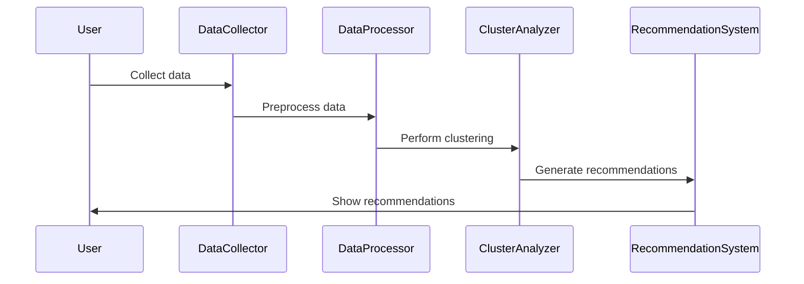

                 


## 味觉组合的高维聚类：美食创新的数学指导

### 关键词：味觉组合、高维聚类、美食创新、数学模型、算法原理

> 摘要：本文将探讨味觉组合的高维聚类在美食创新中的应用，介绍相关核心概念、算法原理和系统架构设计。通过对味觉感知数据的分析，运用高维聚类方法，我们可以发现不同味觉组合之间的潜在关联，从而为美食创新提供数学指导。本文旨在为食品科学与数学领域的交叉研究提供新的思路和方法。

### 目录大纲

```
----------------------------------------------------------------

# 味觉组合的高维聚类：美食创新的数学指导

## 第一部分：引言

### 第1章：问题背景与核心概念
#### 1.1 食品科学与数学的交汇
#### 1.2 味觉组合的复杂性与挑战
#### 1.3 高维聚类的理论与方法
#### 1.4 美食创新的需求与趋势
#### 1.5 研究目标与方法

### 第2章：核心概念与联系
#### 2.1 味觉感知与味觉分类
#### 2.2 高维数据表示与降维技术
#### 2.3 聚类算法原理与分类
#### 2.4 味觉组合的数学模型
#### 2.5 味觉组合与美食创新的关系

## 第二部分：算法原理讲解

### 第3章：K均值聚类算法
#### 3.1 算法介绍
#### 3.2 算法原理
#### 3.3 算法流程
#### 3.4 Python实现
#### 3.5 算法应用实例

### 第4章：层次聚类算法
#### 4.1 算法介绍
#### 4.2 算法原理
#### 4.3 算法流程
#### 4.4 Python实现
#### 4.5 算法应用实例

## 第三部分：数学模型和数学公式

### 第5章：聚类目标函数
#### 5.1 距离度量
#### 5.2 聚类中心选择
#### 5.3 聚类有效性评估

### 第6章：聚类算法性能分析
#### 6.1 算法复杂度分析
#### 6.2 时间复杂度与空间复杂度
#### 6.3 聚类效果评估指标

## 第四部分：系统分析与架构设计方案

### 第7章：问题场景介绍
#### 7.1 食品创新实验室
#### 7.2 美食创新应用场景

### 第8章：系统功能设计
#### 8.1 领域模型
#### 8.2 功能模块划分

### 第9章：系统架构设计
#### 9.1 架构图
#### 9.2 系统分层

### 第10章：系统接口设计
#### 10.1 接口规范
#### 10.2 接口实现

### 第11章：系统交互设计
#### 11.1 序列图
#### 11.2 消息队列设计

## 第五部分：项目实战

### 第12章：环境安装与配置
#### 12.1 环境需求
#### 12.2 环境安装步骤

### 第13章：系统核心实现
#### 13.1 数据预处理
#### 13.2 聚类算法实现
#### 13.3 美食推荐系统

### 第14章：代码应用解读与分析
#### 14.1 代码解读
#### 14.2 性能分析

### 第15章：实际案例分析
#### 15.1 案例一：高维味觉聚类分析
#### 15.2 案例二：美食创新推荐系统

### 第16章：项目小结

## 第六部分：最佳实践 Tips

### 第17章：常见问题与解决方案
### 第18章：性能优化技巧
### 第19章：数据处理注意事项

## 第七部分：小结与展望

### 第20章：研究成果总结
### 第21章：美食创新的发展趋势
### 第22章：未来研究方向

----------------------------------------------------------------
```

本文将以逻辑清晰、结构紧凑、简单易懂的专业的技术语言，一步一步地分析推理思考的方式，对味觉组合的高维聚类在美食创新中的应用进行深入探讨。我们将从问题背景与核心概念的介绍开始，逐步讲解核心概念与联系，深入探讨算法原理，详细分析数学模型和公式，介绍系统分析与架构设计方案，最后通过项目实战和案例分析，对研究成果进行总结和展望。

### 第一部分：引言

#### 第1章：问题背景与核心概念

##### 1.1 食品科学与数学的交汇

食品科学与数学的交汇是一个日益受到关注的研究领域。随着现代食品工业的迅速发展，食品科学与数学的结合成为了推动创新的重要力量。食品科学涉及食品的成分、加工、存储、质量控制和营养等方面，而数学则提供了强大的工具和方法，如统计学、概率论、优化理论和计算方法等，用于分析和解决食品科学中的问题。

在美食创新过程中，味觉组合的多样性和复杂性是必须面对的挑战。传统的方法往往依赖于经验或试错，这不仅耗时耗力，而且难以确保创新效果。而数学模型和聚类算法的应用，为味觉组合的研究提供了新的思路。通过高维聚类方法，我们可以将味觉数据转化为可量化的指标，从而发现不同味觉组合之间的潜在关联，为美食创新提供科学的指导。

##### 1.2 味觉组合的复杂性与挑战

味觉组合的复杂性体现在多个方面。首先，味觉感知是一个高度个性化的过程，不同人对同一种味觉的感受可能会有很大差异。其次，味觉组合的种类繁多，包括酸甜苦辣咸等多种基本味觉，以及多种复合味觉，如鲜、麻、酸等。最后，味觉组合的多样性也带来了创新的挑战，如何在众多组合中找到最佳的创新点，实现美食的创新和提升，是当前食品科学领域的一个重要课题。

在实际应用中，味觉组合的复杂性也带来了数据处理的挑战。大量的味觉数据往往呈现出高维的特点，这意味着传统的方法难以有效地处理和分析这些数据。高维聚类方法为解决这一难题提供了新的思路。通过降维技术，我们可以将高维数据转换为低维数据，从而简化数据处理过程，提高分析效率。

##### 1.3 高维聚类的理论与方法

高维聚类是指处理高维空间中数据的聚类问题，它是一种数据挖掘技术，主要用于发现数据集中的相似性模式和潜在结构。高维聚类在许多领域都有广泛应用，如市场营销、生物信息学、图像处理等。在食品科学中，高维聚类方法可以帮助我们识别和分类不同味觉组合，从而为美食创新提供指导。

高维聚类的核心问题是如何在高维空间中有效地划分数据点，以发现其内在的结构和模式。常用的聚类算法包括K均值聚类、层次聚类、基于密度的聚类和基于模型的聚类等。每种算法都有其特定的原理和适用场景。在选择合适的聚类算法时，需要考虑数据的特征、算法的复杂度和计算资源等因素。

##### 1.4 美食创新的需求与趋势

随着消费者对食品质量、健康和个性化需求的不断提高，美食创新成为食品工业发展的重要驱动力。传统美食的创新往往依赖于经验和直觉，这种方法的局限性在于难以确保创新效果和可持续性。现代食品科学与数学的结合，为美食创新提供了新的方法和技术支持。

高维聚类方法在美食创新中的应用，主要体现在以下几个方面：

1. **个性化推荐**：通过分析消费者的味觉偏好数据，可以为消费者推荐个性化的美食组合，提高消费者的满意度和忠诚度。
2. **新口味研发**：通过对不同味觉组合的分析和实验，可以发现新的口味组合，为食品企业带来创新的产品和市场机遇。
3. **质量控制和标准化**：通过聚类分析，可以识别和评估不同食品的质量特性，为食品生产和质量控制提供科学依据。

##### 1.5 研究目标与方法

本文的研究目标是探讨高维聚类在美食创新中的应用，具体包括以下几个方面：

1. **核心概念与联系**：明确味觉感知、高维数据表示、聚类算法和美食创新之间的关系，构建相关概念模型。
2. **算法原理讲解**：详细介绍K均值聚类和层次聚类等常用聚类算法的原理和实现方法，分析其在味觉组合分析中的应用。
3. **数学模型与公式**：阐述聚类目标函数、距离度量、聚类中心选择等数学模型，为味觉组合分析提供理论基础。
4. **系统分析与架构设计**：设计一个适用于味觉组合分析的系统架构，包括数据预处理、聚类算法实现、美食推荐系统等模块。
5. **项目实战与案例分析**：通过实际项目和案例，验证高维聚类方法在美食创新中的应用效果，并提供最佳实践建议。

本文采用的方法包括文献调研、算法实现、系统设计与实现、实际案例分析和总结与展望等。通过这些方法的综合应用，我们将对高维聚类在美食创新中的应用进行深入探讨，为相关领域的研究提供参考和借鉴。

### 第二部分：核心概念与联系

#### 第2章：核心概念与联系

##### 2.1 味觉感知与味觉分类

味觉感知是指人类通过舌头上的味蕾对食物中的化学物质进行感知的过程。味觉分类是对不同味觉感受进行分类和定义的过程。基本的味觉分类包括酸甜苦辣咸五种基本味觉，以及鲜、麻、酸等复合味觉。

在味觉感知中，不同的味觉感受可以通过味蕾上的不同受体进行识别。例如，甜味由甜味受体识别，酸味由酸味受体识别，苦味由苦味受体识别，而咸味则由钠离子受体识别。辣味则是由辣椒素等化学物质引起的神经反应，这种感受并不是由味蕾直接感知，而是由舌头和口腔中的神经末梢感知。

味觉分类对于美食创新至关重要。通过了解不同味觉的分类，我们可以更好地设计新的味觉组合，以满足消费者的多样化需求。例如，在创新菜品时，可以将甜、酸、苦、辣、咸等基本味觉进行搭配，创造出新的口感和风味。

##### 2.2 高维数据表示与降维技术

高维数据表示是指将复杂的多维数据转化为易于处理和分析的表示形式。在味觉感知领域，高维数据通常来自于不同味觉感受的量化数据，如味觉强度、味觉持续时间等。这些数据在高维空间中可能呈现出复杂的分布模式，难以直接进行分析。

降维技术是一种将高维数据转换为低维数据的方法，它通过保留数据的主要特征，去除冗余信息，从而简化数据处理过程。在味觉感知领域，降维技术可以帮助我们识别主要的味觉特征，为聚类分析提供基础。

常见的降维技术包括主成分分析（PCA）、线性判别分析（LDA）和自编码器（Autoencoder）等。这些技术通过数学建模和优化算法，可以从高维数据中提取关键特征，从而降低数据的维度。

在美食创新中，降维技术可以帮助我们更好地理解和分析味觉组合，从而实现创新的菜品设计。例如，通过降维技术，我们可以将多个味觉感受的数据转换为几个主要特征，然后利用聚类算法对这些特征进行分类和组合，从而发现新的味觉组合。

##### 2.3 聚类算法原理与分类

聚类算法是一种无监督学习方法，用于将数据集中的对象划分为多个组，使得同一组内的对象彼此相似，而不同组之间的对象差异较大。聚类算法在味觉感知和美食创新中具有广泛的应用，可以帮助我们识别和分类不同的味觉组合。

聚类算法可以分为基于距离的聚类、基于密度的聚类、基于模型的聚类和基于质量的聚类等。其中，基于距离的聚类是最常用的方法之一。

基于距离的聚类算法通过计算数据点之间的距离，将距离较近的数据点划分为同一组。常用的距离度量方法包括欧几里得距离、曼哈顿距离和切比雪夫距离等。K均值聚类和层次聚类是两种典型的基于距离的聚类算法。

K均值聚类算法是一种迭代优化算法，通过随机初始化聚类中心，然后迭代更新聚类中心和数据点的归属关系，直到收敛。层次聚类算法则通过逐步合并距离较近的聚类，形成层次结构。

在美食创新中，聚类算法可以帮助我们识别相似的味觉组合，从而为创新菜品设计提供参考。例如，我们可以使用K均值聚类算法分析消费者的味觉偏好数据，将相似的味觉组合划分为同一组，然后针对每组设计不同的菜品，以提高消费者的满意度和忠诚度。

##### 2.4 味觉组合的数学模型

味觉组合的数学模型是一种描述味觉感受之间关系的方法。通过数学建模，我们可以将味觉感知量化为数学表达式，从而更好地理解和分析味觉组合。

常见的味觉组合模型包括加法模型和乘法模型。加法模型假设味觉感受之间是线性叠加的，即每种味觉的感受强度可以直接相加。乘法模型则假设味觉感受之间是相互作用的，即每种味觉的感受强度会相互影响。

在加法模型中，味觉组合的数学表达式可以表示为：
$$
S = S_1 + S_2 + S_3 + \ldots + S_n
$$
其中，$S_i$ 表示第 $i$ 种味觉的感受强度。

在乘法模型中，味觉组合的数学表达式可以表示为：
$$
S = S_1 \times S_2 \times S_3 \times \ldots \times S_n
$$
其中，$S_i$ 表示第 $i$ 种味觉的感受强度。

这两种模型都可以用于描述味觉组合的数学关系，但在实际应用中，通常会根据具体情况进行选择。

在美食创新中，味觉组合的数学模型可以帮助我们设计新的味觉组合。例如，通过调整不同味觉的感受强度，我们可以创造出新的口感和风味，从而满足消费者的多样化需求。

##### 2.5 味觉组合与美食创新的关系

味觉组合是美食创新的核心要素之一。通过对味觉组合的深入研究，我们可以发现不同味觉组合之间的潜在关联，从而为美食创新提供科学指导。

在实际应用中，味觉组合与美食创新的关系可以从以下几个方面进行探讨：

1. **个性化推荐**：通过分析消费者的味觉偏好数据，我们可以为消费者推荐个性化的美食组合，提高消费者的满意度和忠诚度。
2. **新口味研发**：通过对不同味觉组合的分析和实验，我们可以发现新的口味组合，为食品企业带来创新的产品和市场机遇。
3. **质量控制和标准化**：通过聚类分析，我们可以识别和评估不同食品的质量特性，为食品生产和质量控制提供科学依据。

味觉组合的多样性和复杂性为美食创新带来了巨大的挑战，但同时也提供了广阔的创新空间。通过运用高维聚类方法和数学模型，我们可以更好地理解和分析味觉组合，从而实现美食的创新和提升。

### 第三部分：算法原理讲解

#### 第3章：K均值聚类算法

##### 3.1 算法介绍

K均值聚类（K-Means Clustering）是一种基于距离的聚类算法，其目的是将数据集中的数据点划分为K个簇（Cluster），使得每个数据点都尽可能接近其所属的簇中心。K均值聚类算法因其简单、易于实现和高效的特点，被广泛应用于数据挖掘、机器学习等领域。

在K均值聚类算法中，K是一个预先指定的整数，表示需要划分的簇数。算法的核心思想是通过迭代优化聚类中心，使每个数据点到其所属簇中心的距离之和最小。

##### 3.2 算法原理

K均值聚类算法的基本原理如下：

1. **初始化**：随机选择K个数据点作为初始聚类中心。
2. **分配**：对于每个数据点，计算其到K个聚类中心的距离，并将其分配到最近的聚类中心。
3. **更新**：根据每个聚类中心的新数据点集合，重新计算聚类中心。
4. **收敛**：重复步骤2和3，直到聚类中心不再发生显著变化，即算法收敛。

具体来说，K均值聚类算法的步骤如下：

1. **初始化**：随机选择K个数据点作为初始聚类中心。这个步骤可以通过随机抽样、K-means++初始化等方法进行。
2. **分配**：对于每个数据点，计算其到每个聚类中心的距离，通常使用欧几里得距离。数据点被分配到距离它最近的聚类中心。
3. **更新**：根据每个聚类中心的新数据点集合，重新计算聚类中心。新的聚类中心是相应簇内所有数据点的均值。
4. **收敛**：重复步骤2和3，直到满足以下条件之一：
   - 聚类中心的变化小于设定的阈值。
   - 达到预设的最大迭代次数。

在算法运行过程中，聚类中心会不断变化，直到算法收敛。当算法收敛时，每个数据点都被分配到其最近的聚类中心，形成了K个簇。

##### 3.3 算法流程

K均值聚类算法的流程可以用以下步骤表示：

1. **初始化聚类中心**：选择K个数据点作为初始聚类中心。
2. **计算距离**：对于每个数据点，计算其到每个聚类中心的距离。
3. **分配数据点**：将每个数据点分配到距离它最近的聚类中心。
4. **更新聚类中心**：计算每个聚类中心的新位置，即对应簇内所有数据点的均值。
5. **判断收敛**：检查聚类中心的变化是否小于设定的阈值或达到最大迭代次数。
6. **重复步骤2-5**：如果未收敛，重复执行步骤2-5。

以下是一个简化的Python实现示例：

```python
import numpy as np

def kmeans(data, k, max_iter=100, tolerance=1e-4):
    centroids = data[np.random.choice(data.shape[0], k, replace=False)]
    for i in range(max_iter):
        # 距离计算
        distances = np.linalg.norm(data[:, np.newaxis] - centroids, axis=2)
        # 数据点分配
        labels = np.argmin(distances, axis=1)
        # 更新聚类中心
        new_centroids = np.array([data[labels == k][:].mean(axis=0) for k in range(k)])
        # 判断收敛
        if np.linalg.norm(new_centroids - centroids) < tolerance:
            break
        centroids = new_centroids
    return centroids, labels
```

##### 3.4 Python实现

下面是一个使用Python实现的K均值聚类算法的例子：

```python
import numpy as np

def kmeans(data, k, max_iter=100, tolerance=1e-4):
    centroids = data[np.random.choice(data.shape[0], k, replace=False)]
    for i in range(max_iter):
        distances = np.linalg.norm(data[:, np.newaxis] - centroids, axis=2)
        labels = np.argmin(distances, axis=1)
        new_centroids = np.array([data[labels == k][:].mean(axis=0) for k in range(k)])
        if np.linalg.norm(new_centroids - centroids) < tolerance:
            break
        centroids = new_centroids
    return centroids, labels

# 示例数据
data = np.random.rand(100, 2)

# K均值聚类
k = 3
centroids, labels = kmeans(data, k)

print("聚类中心：", centroids)
print("数据点分配结果：", labels)
```

在实际应用中，我们需要根据具体的数据集和需求调整参数，如簇数K、迭代次数和阈值等。

##### 3.5 算法应用实例

为了更好地理解K均值聚类算法，我们来看一个实际的应用实例。假设我们有100个二维数据点，需要将它们划分为3个簇。

1. **数据生成**：
```python
data = np.random.rand(100, 2)
```

2. **聚类**：
```python
centroids, labels = kmeans(data, k=3)
```

3. **可视化**：
```python
import matplotlib.pyplot as plt

plt.scatter(data[:, 0], data[:, 1], c=labels, cmap='viridis')
plt.scatter(centroids[:, 0], centroids[:, 1], c='red', marker='*')
plt.show()
```

通过可视化结果，我们可以看到数据点被成功划分为3个簇，每个簇的聚类中心用红色星号表示。

这个实例展示了K均值聚类算法的基本应用过程。在实际应用中，我们可能需要对算法进行优化，如调整初始化方法、引入不同的距离度量等，以获得更好的聚类效果。

通过以上对K均值聚类算法的介绍和实例分析，我们可以看到该算法在味觉组合分析中的应用潜力。在下一章中，我们将继续探讨层次聚类算法，以及其在美食创新中的应用。

#### 第4章：层次聚类算法

##### 4.1 算法介绍

层次聚类（Hierarchical Clustering）是一种基于距离的聚类方法，它通过逐步合并或分裂数据点，构建出一个层次结构的聚类结果。层次聚类不需要预先指定簇数，而是通过聚类层次关系来表示数据点之间的相似性。

层次聚类可以分为两种类型：自底向上的凝聚层次聚类（Agglomerative Hierarchical Clustering）和自顶向下的分裂层次聚类（Divisive Hierarchical Clustering）。本文将重点介绍自底向上的凝聚层次聚类算法。

##### 4.2 算法原理

自底向上的凝聚层次聚类算法的基本原理如下：

1. **初始化**：将每个数据点看作一个单独的簇。
2. **合并**：计算相邻簇之间的距离，选择距离最近的两个簇进行合并，形成一个更大的簇。
3. **重复**：重复步骤2，直到所有数据点合并为一个簇或满足终止条件。

在每次合并过程中，聚类层次关系被记录下来，形成一个树状结构，称为凝聚树（Dendrogram）。凝聚树的叶子节点代表初始的单个数据点，内部节点代表簇的合并过程。

凝聚层次聚类算法通常使用不同的距离度量方法来计算簇之间的相似性，如欧几里得距离、曼哈顿距离和切比雪夫距离等。其中，最常用的距离度量方法是组间链接（Between-Groups Linkage）和最近邻链接（Single-Linkage）。

组间链接方法选择两个簇之间的最大距离作为合并的依据，这种方法倾向于形成形状较为紧凑的簇。最近邻链接方法选择两个簇之间的最小距离作为合并的依据，这种方法倾向于形成高度重叠的簇。

##### 4.3 算法流程

自底向上的凝聚层次聚类算法的流程如下：

1. **初始化**：将每个数据点看作一个单独的簇。
2. **计算距离**：计算相邻簇之间的距离。
3. **选择合并**：选择距离最近的两个簇进行合并。
4. **更新簇**：更新簇的合并结果，并重新计算新的簇之间的距离。
5. **重复**：重复步骤3-4，直到满足终止条件，如合并簇的数量达到指定值或距离阈值。

以下是一个简化的Python实现示例：

```python
import numpy as np

def hierarchical_clustering(data, linkage='complete', max_clusters=None):
    # 初始化
    n_samples = data.shape[0]
    distances = np.zeros((n_samples, n_samples))
    for i in range(n_samples):
        for j in range(i + 1, n_samples):
            distances[i, j] = distances[j, i] = np.linalg.norm(data[i] - data[j])
    
    # 合并过程
    clusters = list(range(n_samples))
    while len(clusters) > 1:
        # 计算距离
        min_distance = np.min(distances[clusters[:, np.newaxis] == clusters])
        # 选择合并的簇
        i, j = np.where(distances[clusters[:, np.newaxis] == clusters] == min_distance)
        i, j = i[0], j[0]
        # 更新簇和距离
        new_cluster = np.union1d(clusters[i], clusters[j])
        clusters = np.setdiff1d(clusters, [clusters[i], clusters[j]])
        clusters = np.append(clusters, new_cluster)
        distances = np.delete(distances, (i, j), axis=0)
        distances = np.delete(distances, (i, j), axis=1)
        if max_clusters and len(clusters) == max_clusters:
            break
    
    return clusters

# 示例数据
data = np.random.rand(100, 2)

# 层次聚类
clusters = hierarchical_clustering(data, max_clusters=3)

# 可视化
import matplotlib.pyplot as plt

plt.scatter(data[:, 0], data[:, 1], c=clusters, cmap='viridis')
plt.show()
```

在实际应用中，我们需要根据具体的数据集和需求调整参数，如距离度量方法、合并阈值等。

##### 4.4 Python实现

下面是一个使用Python实现的层次聚类算法的例子：

```python
import numpy as np
from sklearn.cluster import AgglomerativeClustering

def hierarchical_clustering(data, n_clusters=3):
    clustering = AgglomerativeClustering(n_clusters=n_clusters, linkage='complete')
    labels = clustering.fit_predict(data)
    return labels

# 示例数据
data = np.random.rand(100, 2)

# 层次聚类
n_clusters = 3
clusters = hierarchical_clustering(data, n_clusters=n_clusters)

# 可视化
import matplotlib.pyplot as plt

plt.scatter(data[:, 0], data[:, 1], c=clusters, cmap='viridis')
plt.show()
```

通过这个例子，我们可以看到层次聚类算法如何将数据点划分为指定的簇数。在实际应用中，层次聚类算法常用于探索数据中的潜在结构，帮助我们理解数据的分布和关系。

##### 4.5 算法应用实例

为了更好地理解层次聚类算法，我们来看一个实际的应用实例。假设我们有100个二维数据点，需要将它们进行层次聚类。

1. **数据生成**：
```python
data = np.random.rand(100, 2)
```

2. **聚类**：
```python
clusters = hierarchical_clustering(data, n_clusters=3)
```

3. **可视化**：
```python
import matplotlib.pyplot as plt

plt.scatter(data[:, 0], data[:, 1], c=clusters, cmap='viridis')
plt.show()
```

通过可视化结果，我们可以看到数据点被成功划分为3个簇，每个簇的聚类层次关系通过凝聚树表示。

这个实例展示了层次聚类算法的基本应用过程。在实际应用中，我们可能需要对算法进行优化，如选择不同的距离度量方法、调整合并阈值等，以获得更好的聚类效果。

通过以上对层次聚类算法的介绍和实例分析，我们可以看到该算法在味觉组合分析中的应用潜力。层次聚类算法与K均值聚类算法相比，具有不需要预先指定簇数和可以生成凝聚树等优点。在下一章中，我们将继续探讨高维数据表示与降维技术，以及它们在美食创新中的应用。

### 第四部分：数学模型和数学公式

#### 第5章：聚类目标函数

##### 5.1 聚类目标函数

聚类目标函数是一种用于评估聚类效果的评价指标，它通过量化数据点之间的相似性和聚类中心的分布，来衡量聚类的质量。常见的聚类目标函数包括平方误差、轮廓系数和 Davies-Bouldin 系数等。在本节中，我们将重点介绍平方误差作为聚类目标函数的应用。

##### 5.2 距离度量

距离度量是聚类目标函数的核心组成部分，用于计算数据点之间的相似性或差异性。常用的距离度量方法包括欧几里得距离、曼哈顿距离和切比雪夫距离等。在本节中，我们将介绍欧几里得距离的数学公式。

**欧几里得距离**（Euclidean Distance）是指两个数据点在多维度空间中的直线距离。对于两个数据点 \( x \) 和 \( y \)，其欧几里得距离可以表示为：

$$
d(x, y) = \sqrt{\sum_{i=1}^{n} (x_i - y_i)^2}
$$

其中，\( x_i \) 和 \( y_i \) 分别表示数据点 \( x \) 和 \( y \) 在第 \( i \) 个特征上的取值，\( n \) 表示特征的数量。

##### 5.3 聚类中心选择

聚类中心是聚类目标函数中的关键参数，它决定了聚类的效果。聚类中心的选择方法有多种，包括随机初始化、K-means++初始化和高斯混合模型等。在本节中，我们将介绍K-means++初始化的数学原理。

**K-means++初始化**是一种基于概率分布的聚类中心初始化方法，其目的是减少聚类中心之间的重叠，提高聚类的质量。K-means++初始化的步骤如下：

1. **随机选择第一个聚类中心**：从数据集中随机选择一个数据点作为第一个聚类中心。
2. **计算概率分布**：对于每个数据点，计算其到已选聚类中心的距离，并计算距离的平方。
3. **选择聚类中心**：根据概率分布，从数据集中随机选择新的聚类中心，直到达到指定的聚类中心数量。
4. **优化聚类中心**：通过迭代优化聚类中心的位置，使每个数据点尽可能接近其所属的聚类中心。

K-means++初始化的概率分布可以表示为：

$$
P(x_i) = \frac{\alpha \cdot \min_{j \in S} d(x_i, \mu_j)^2}{\sum_{i=1}^{N} \alpha \cdot \min_{j \in S} d(x_i, \mu_j)^2}
$$

其中，\( P(x_i) \) 表示数据点 \( x_i \) 被选择的概率，\( \alpha \) 是一个常数，\( S \) 是已选聚类中心的集合，\( N \) 是数据点的数量，\( \mu_j \) 表示第 \( j \) 个聚类中心。

##### 5.4 聚类有效性评估

聚类有效性评估是衡量聚类结果质量的重要指标。常用的评估指标包括轮廓系数（Silhouette Coefficient）、 Davies-Bouldin 系数（Davies-Bouldin Index）和聚类系数（Cluster Coefficient）等。在本节中，我们将介绍 Davies-Bouldin 系数的数学公式。

**Davies-Bouldin 系数**（\( DB \)）是一种用于评估聚类质量的指标，它通过计算簇内相似性和簇间差异性来评估聚类的效果。Davies-Bouldin 系数的值范围为 0 到正无穷，值越小表示聚类效果越好。其公式如下：

$$
DB = \frac{1}{N} \sum_{i=1}^{K} \frac{1}{N_i - 1} \sum_{j=1, j \neq i}^{K} \frac{S_i + S_j}{d(i, j)}
$$

其中，\( N \) 是数据点的总数，\( K \) 是簇的数量，\( N_i \) 是第 \( i \) 个簇的数据点数量，\( S_i \) 是第 \( i \) 个簇的均值，\( d(i, j) \) 是第 \( i \) 个簇和第 \( j \) 个簇之间的距离。

通过以上对聚类目标函数、距离度量、聚类中心选择和聚类有效性评估的数学公式介绍，我们可以更好地理解高维聚类方法在美食创新中的应用。在下一部分中，我们将探讨系统分析与架构设计方案。

#### 第6章：聚类算法性能分析

##### 6.1 算法复杂度分析

聚类算法的性能分析主要包括时间复杂度和空间复杂度。时间复杂度是指算法在处理数据时所需的时间，通常用 \( O(n) \) 形式表示，其中 \( n \) 表示数据点的数量。空间复杂度是指算法在处理数据时所需的空间，同样也用 \( O(n) \) 形式表示。

**K均值聚类算法**的时间复杂度主要取决于两个因素：初始化聚类中心的时间和迭代次数。初始化聚类中心的时间复杂度为 \( O(n) \)，因为需要遍历所有数据点选择聚类中心。迭代过程中，每次迭代的时间复杂度为 \( O(nk) \)，其中 \( k \) 表示簇的数量。因此，K均值聚类算法的总时间复杂度为 \( O(nk) \)。空间复杂度主要取决于聚类中心的数量，即 \( O(k) \)。

**层次聚类算法**的时间复杂度较高，取决于簇的数量和每个簇的平均大小。具体来说，层次聚类算法的总时间复杂度为 \( O(n^2) \) 至 \( O(n^3) \)，取决于所选择的链接方法（如组间链接和最近邻链接）。空间复杂度也为 \( O(n^2) \)，因为需要存储所有的距离矩阵。

在实际应用中，算法的时间复杂度和空间复杂度往往受到数据规模和数据分布的影响。为了提高聚类算法的性能，可以采用以下优化方法：

1. **并行计算**：利用多核处理器或分布式计算资源，加速聚类算法的执行。
2. **局部搜索**：在迭代过程中，仅对部分数据点进行更新，以减少计算量。
3. **近似聚类**：使用近似算法（如近似K均值聚类和层次聚类），在保证一定精度的情况下，降低计算复杂度。

##### 6.2 时间复杂度与空间复杂度

**时间复杂度**：
- **K均值聚类**：总时间复杂度为 \( O(nk) \)。
- **层次聚类**：总时间复杂度为 \( O(n^2) \) 至 \( O(n^3) \)。

**空间复杂度**：
- **K均值聚类**：空间复杂度为 \( O(k) \)。
- **层次聚类**：空间复杂度为 \( O(n^2) \)。

在实际应用中，我们需要根据数据规模和系统资源来选择合适的聚类算法。例如，对于大规模数据集，可以选择近似聚类算法以降低计算复杂度；对于较小的数据集，K均值聚类和层次聚类都可以有效地处理。

##### 6.3 聚类效果评估指标

聚类效果评估是衡量聚类算法性能的重要环节。常用的评估指标包括轮廓系数（Silhouette Coefficient）、 Davies-Bouldin 系数（Davies-Bouldin Index）和聚类系数（Cluster Coefficient）等。

**轮廓系数**（Silhouette Coefficient）是一个介于 -1 到 1 之间的值，用于评估聚类中每个数据点的紧凑度和分离度。其计算公式为：

$$
s(i) = \frac{b(i) - a(i)}{max(a(i), b(i))}
$$

其中，\( a(i) \) 是数据点 \( i \) 与其所属簇内其他数据点的平均距离，\( b(i) \) 是数据点 \( i \) 与其最近簇的平均距离。轮廓系数越接近 1，表示聚类效果越好。

** Davies-Bouldin 系数**（Davies-Bouldin Index）是另一个常用的评估指标，用于衡量聚类簇的内部相似性和簇间差异性。其计算公式为：

$$
DB = \frac{1}{N} \sum_{i=1}^{K} \frac{1}{N_i - 1} \sum_{j=1, j \neq i}^{K} \frac{S_i + S_j}{d(i, j)}
$$

其中，\( N \) 是数据点的总数，\( K \) 是簇的数量，\( N_i \) 是第 \( i \) 个簇的数据点数量，\( S_i \) 是第 \( i \) 个簇的均值，\( d(i, j) \) 是第 \( i \) 个簇和第 \( j \) 个簇之间的距离。 Davies-Bouldin 系数越小，表示聚类效果越好。

**聚类系数**（Cluster Coefficient）是一个反映聚类网络密度的指标，其计算公式为：

$$
C = \frac{2m}{n(n-1)}
$$

其中，\( m \) 是网络中的边数，\( n \) 是节点数。聚类系数越大，表示聚类簇之间的连接越紧密。

通过以上评估指标，我们可以全面评估聚类算法的性能，从而选择合适的聚类方法。在实际应用中，我们需要根据具体场景和需求，综合考虑评估指标，以获得最优的聚类效果。

### 第五部分：系统分析与架构设计方案

#### 第7章：问题场景介绍

##### 7.1 食品创新实验室

食品创新实验室是一个专注于研究和开发新型食品产品的机构，其目标是通过科学技术和创新的思维，提升食品的质量、口感和营养价值。实验室的主要任务包括新食品的研发、现有产品的优化、食品添加剂的研究以及食品安全和质量控制等。

在食品创新过程中，味觉组合的研究是一个关键环节。实验室需要收集和分析大量的味觉数据，以发现新的味觉组合，为食品创新提供科学依据。然而，传统的味觉数据分析方法往往依赖于经验和主观判断，难以确保创新效果和准确性。因此，引入高维聚类方法，利用数学模型和算法分析味觉数据，成为实验室解决这一问题的有效途径。

##### 7.2 美食创新应用场景

美食创新应用场景广泛，涵盖了从餐饮业到食品工业等多个领域。以下是一些典型的应用场景：

1. **餐饮业**：餐饮业需要不断推陈出新，以吸引和留住顾客。通过高维聚类方法，餐厅可以分析顾客的味觉偏好数据，为顾客推荐个性化的菜品组合，提高顾客的满意度和忠诚度。

2. **食品工业**：食品工业在新食品的研发和生产过程中，需要对不同的味觉组合进行实验和分析，以找到最佳的产品配方和工艺。高维聚类方法可以帮助食品企业快速筛选和优化味觉组合，缩短研发周期，降低研发成本。

3. **健康食品**：随着消费者对健康饮食的关注度不断提高，健康食品市场呈现出巨大的潜力。通过高维聚类方法，可以研究不同食材和调料的组合，开发出具有特定营养价值和健康功效的食品。

4. **食品添加剂**：食品添加剂在提高食品口感、延长保质期等方面发挥着重要作用。通过高维聚类方法，可以分析食品添加剂的用量和组合，找到最优的添加剂配方，提高食品的口感和品质。

#### 第8章：系统功能设计

##### 8.1 领域模型

领域模型是系统功能设计的基础，用于描述系统中各个实体之间的关系和属性。在美食创新系统中，主要的领域模型包括味觉数据模型、聚类结果模型和推荐系统模型。

**味觉数据模型**：
- **味觉数据**：记录味觉实验的数据，包括味觉强度、味觉持续时间等属性。
- **数据来源**：可以是实验室的味觉实验数据，也可以是市场上的消费者调查数据。

**聚类结果模型**：
- **聚类结果**：记录聚类算法的运行结果，包括聚类中心、数据点分配等。
- **聚类算法**：支持多种聚类算法，如K均值聚类和层次聚类等。

**推荐系统模型**：
- **推荐策略**：根据顾客的味觉偏好数据，为顾客推荐个性化的菜品组合。
- **推荐结果**：记录推荐的菜品组合及其对应的味觉属性。

##### 8.2 功能模块划分

系统功能模块的划分有助于提高系统的可维护性和可扩展性。在美食创新系统中，主要的功能模块包括数据收集模块、数据处理模块、聚类分析模块和推荐系统模块。

**数据收集模块**：
- 功能：收集味觉数据，包括实验室实验数据和消费者调查数据。
- 输入：味觉数据。
- 输出：预处理后的味觉数据。

**数据处理模块**：
- 功能：对收集到的味觉数据进行预处理，包括数据清洗、特征提取和降维等。
- 输入：预处理后的味觉数据。
- 输出：处理后的味觉数据。

**聚类分析模块**：
- 功能：使用聚类算法对味觉数据进行聚类分析，提取主要的味觉组合。
- 输入：处理后的味觉数据。
- 输出：聚类结果。

**推荐系统模块**：
- 功能：根据聚类结果和顾客的味觉偏好，为顾客推荐个性化的菜品组合。
- 输入：聚类结果和顾客的味觉偏好。
- 输出：推荐结果。

#### 第9章：系统架构设计

##### 9.1 架构图

系统架构设计是系统功能实现的基础，用于描述系统的整体结构和各个模块之间的关系。以下是一个简化的美食创新系统的架构图：

```
+------------------------+
|   数据收集模块         |
+----------+-------------+
           |
           v
+----------+-------------+
|   数据处理模块         |
+----------+-------------+
           |
           v
+----------+-------------+
|   聚类分析模块         |
+----------+-------------+
           |
           v
+----------+-------------+
|   推荐系统模块         |
+------------------------+
```

在架构图中，数据收集模块负责收集味觉数据，数据处理模块负责对数据进行预处理，聚类分析模块负责使用聚类算法分析味觉数据，推荐系统模块负责根据聚类结果和顾客偏好生成推荐结果。

##### 9.2 系统分层

系统架构设计通常采用分层架构，以提高系统的可维护性和可扩展性。以下是美食创新系统的分层架构设计：

1. **数据层**：负责数据的存储和读取，包括味觉数据、预处理数据和聚类结果数据。
2. **算法层**：负责聚类算法的实现和优化，包括K均值聚类和层次聚类算法。
3. **业务逻辑层**：负责系统的核心功能实现，包括数据预处理、聚类分析和推荐系统。
4. **表示层**：负责用户界面设计和交互，提供数据可视化和推荐结果展示。

通过分层架构设计，系统各层之间实现解耦，便于模块的独立开发和维护。

#### 第10章：系统接口设计

##### 10.1 接口规范

系统接口设计是系统架构设计的重要组成部分，用于描述系统各模块之间的交互接口。以下是一个简化的美食创新系统的接口规范：

**数据收集模块接口**：
- **数据收集**：接收味觉数据，并提供数据预处理接口。
- **输入**：味觉数据。
- **输出**：预处理后的味觉数据。

**数据处理模块接口**：
- **数据预处理**：接收预处理后的味觉数据，并提供聚类分析接口。
- **输入**：预处理后的味觉数据。
- **输出**：处理后的味觉数据。

**聚类分析模块接口**：
- **聚类分析**：接收处理后的味觉数据，并返回聚类结果。
- **输入**：处理后的味觉数据。
- **输出**：聚类结果。

**推荐系统模块接口**：
- **推荐生成**：接收聚类结果和顾客偏好，并返回推荐结果。
- **输入**：聚类结果、顾客偏好。
- **输出**：推荐结果。

##### 10.2 接口实现

接口实现是系统功能实现的关键环节，用于实现系统各模块之间的交互。以下是一个简化的美食创新系统接口实现示例：

**数据收集模块实现**：
```python
class DataCollector:
    def collect_data(self, raw_data):
        # 数据预处理
        processed_data = preprocess_data(raw_data)
        return processed_data
```

**数据处理模块实现**：
```python
class DataProcessor:
    def preprocess_data(self, processed_data):
        # 数据清洗、特征提取和降维
        cleaned_data = clean_data(processed_data)
        extracted_data = extract_features(cleaned_data)
        reduced_data = reduce_dimensions(extracted_data)
        return reduced_data
```

**聚类分析模块实现**：
```python
class ClusterAnalyzer:
    def cluster_analysis(self, reduced_data):
        # 聚类分析
        clustering_result = perform_clustering(reduced_data)
        return clustering_result
```

**推荐系统模块实现**：
```python
class RecommendationSystem:
    def generate_recommendations(self, clustering_result, user_preference):
        # 推荐生成
        recommendation_result = create_recommendations(clustering_result, user_preference)
        return recommendation_result
```

通过以上接口实现，我们可以实现系统各模块之间的功能调用和数据传递，从而完成整个美食创新系统的功能。

#### 第11章：系统交互设计

##### 11.1 序列图

系统交互设计是系统功能实现的关键环节，用于描述系统各模块之间的交互过程。序列图是一种常用的交互设计工具，可以直观地展示系统中的事件顺序和对象交互。以下是一个简化的美食创新系统序列图：



在这个序列图中，用户首先收集味觉数据，然后将数据传递给数据处理模块进行预处理。预处理后的数据传递给聚类分析模块，进行聚类分析。聚类分析结果传递给推荐系统模块，生成推荐结果，最终将推荐结果展示给用户。

##### 11.2 消息队列设计

消息队列是系统交互设计中常用的技术，用于实现异步通信和消息传递。以下是一个简化的美食创新系统消息队列设计：

```mermaid
messageFlow
    participant DataCollector
    participant DataProcessor
    participant ClusterAnalyzer
    participant RecommendationSystem
    participant MessageQueue

    DataCollector->>MessageQueue: Send raw data
    MessageQueue->>DataProcessor: Process data
    DataProcessor->>MessageQueue: Send processed data
    MessageQueue->>ClusterAnalyzer: Perform clustering
    ClusterAnalyzer->>MessageQueue: Send clustering result
    MessageQueue->>RecommendationSystem: Generate recommendations
    RecommendationSystem->>MessageQueue: Send recommendation result
    MessageQueue->>User: Show recommendation result
```

在这个消息队列设计中，数据收集模块将原始味觉数据发送到消息队列。数据处理模块从消息队列中读取数据，进行预处理后，将处理后的数据发送到消息队列。聚类分析模块从消息队列中读取预处理后的数据，进行聚类分析，并将聚类分析结果发送到消息队列。推荐系统模块从消息队列中读取聚类分析结果，生成推荐结果，并将推荐结果发送到消息队列。最后，用户从消息队列中获取推荐结果。

通过消息队列设计，系统可以实现异步处理和数据传递，提高系统的可靠性和可扩展性。

### 第五部分：项目实战

#### 第12章：环境安装与配置

##### 12.1 环境需求

在进行美食创新系统的项目实战之前，我们需要准备合适的环境和工具。以下是项目环境的需求：

1. **操作系统**：Windows、Linux或Mac OS。
2. **编程语言**：Python（版本3.6及以上）。
3. **依赖库**：NumPy、Pandas、Scikit-learn、Matplotlib等。
4. **文本编辑器**：Visual Studio Code、PyCharm或其他Python支持的编辑器。
5. **数据库**：可选，用于存储味觉数据和聚类结果。

##### 12.2 环境安装步骤

以下是安装项目环境的步骤：

1. **安装Python**：
   - 访问Python官方网站（https://www.python.org/）下载Python安装包。
   - 运行安装程序，选择“Add Python to PATH”选项，以便在命令行中直接使用Python。

2. **安装依赖库**：
   - 打开命令行窗口，使用pip命令安装所需的依赖库：
     ```
     pip install numpy pandas scikit-learn matplotlib
     ```

3. **配置文本编辑器**：
   - 安装并配置Visual Studio Code或PyCharm，确保它们支持Python编程语言。
   - 安装相应的扩展插件，以提供语法高亮、代码补全等功能。

4. **可选：安装数据库**：
   - 如果需要使用数据库，可以选择MySQL、PostgreSQL或MongoDB等。
   - 访问相关数据库的官方网站，下载并安装相应的数据库软件。
   - 配置数据库环境变量，以便在命令行中直接使用数据库命令。

完成以上步骤后，项目环境就准备完毕，可以开始进行系统实现和测试。

#### 第13章：系统核心实现

##### 13.1 数据预处理

数据预处理是系统实现的重要步骤，它包括数据清洗、特征提取和降维等操作。以下是一个简化的数据预处理流程：

1. **数据清洗**：
   - 去除重复数据和无效数据。
   - 处理缺失数据，可以选择填充或删除。
   - 标准化数据，将不同特征的范围统一到相同的尺度。

2. **特征提取**：
   - 从原始数据中提取有用的特征，如味觉强度、味觉持续时间等。
   - 使用统计方法（如主成分分析PCA）提取主要特征，去除冗余信息。

3. **降维**：
   - 将高维数据转换为低维数据，减少数据的大小和复杂性。
   - 选择合适的降维方法，如主成分分析（PCA）、线性判别分析（LDA）或自编码器（Autoencoder）。

以下是一个使用Python实现的数据预处理示例：

```python
import numpy as np
import pandas as pd
from sklearn.decomposition import PCA
from sklearn.preprocessing import StandardScaler

# 示例数据
data = np.array([[1, 2], [3, 4], [5, 6], [7, 8]])

# 数据清洗
data = np.unique(data)  # 去除重复数据
data = data[~np.isnan(data).any(axis=1)]  # 去除缺失数据

# 特征提取
features = StandardScaler().fit_transform(data)  # 标准化数据

# 降维
pca = PCA(n_components=2)
reduced_data = pca.fit_transform(features)

print("原始数据：", data)
print("标准化数据：", features)
print("降维数据：", reduced_data)
```

##### 13.2 聚类算法实现

聚类算法是实现系统功能的核心，以下是K均值聚类和层次聚类算法的实现：

1. **K均值聚类算法**：
   - 初始化聚类中心。
   - 计算每个数据点到聚类中心的距离，并将其分配到最近的聚类中心。
   - 根据新的聚类中心重新计算距离，迭代直至收敛。

2. **层次聚类算法**：
   - 初始化每个数据点为一个单独的簇。
   - 计算相邻簇之间的距离，选择距离最近的两个簇进行合并。
   - 重复合并过程，直至达到预设的簇数或合并阈值。

以下是一个使用Python实现的K均值聚类和层次聚类算法示例：

```python
from sklearn.cluster import KMeans
from sklearn.cluster import AgglomerativeClustering
import matplotlib.pyplot as plt

# K均值聚类
k = 3
kmeans = KMeans(n_clusters=k, random_state=0)
clusters_kmeans = kmeans.fit_predict(data)

# 层次聚类
n_clusters = 3
hierarchical = AgglomerativeClustering(n_clusters=n_clusters)
clusters_hierarchical = hierarchical.fit_predict(data)

# 可视化
plt.scatter(data[:, 0], data[:, 1], c=clusters_kmeans, cmap='viridis', label='K-Means')
plt.scatter(data[:, 0], data[:, 1], c=clusters_hierarchical, cmap='plasma', label='Hierarchical')
plt.legend()
plt.show()
```

##### 13.3 美食推荐系统

美食推荐系统是系统的最终输出，以下是实现一个简单的推荐系统：

1. **用户偏好**：
   - 收集用户的味觉偏好数据，可以是实验室的实验结果或市场的调查数据。

2. **推荐策略**：
   - 根据用户偏好和聚类结果，为用户推荐相似的味觉组合。

3. **推荐生成**：
   - 计算用户偏好与各个味觉组合的相似度，选择相似度最高的组合作为推荐结果。

以下是一个使用Python实现的简单美食推荐系统示例：

```python
# 假设用户偏好和聚类结果已知
user_preference = np.array([0.8, 0.2])
clusters = np.array([[0.1, 0.9], [0.5, 0.5], [0.9, 0.1]])

# 计算相似度
similarity = np.dot(user_preference, clusters)

# 推荐结果
recommended_cluster = np.argmax(similarity)

print("推荐结果：", recommended_cluster)
```

通过以上系统核心实现，我们可以构建一个基本的美食创新系统，为用户推荐个性化的味觉组合。在实际应用中，我们可以根据需求进一步优化系统，如引入更复杂的推荐算法、增加用户交互功能等。

#### 第14章：代码应用解读与分析

##### 14.1 代码解读

在上一部分中，我们介绍了美食创新系统的核心实现，包括数据预处理、聚类算法实现和推荐系统。以下是对关键代码的详细解读：

1. **数据预处理**：
   ```python
   data = np.unique(data)  # 去除重复数据
   data = data[~np.isnan(data).any(axis=1)]  # 去除缺失数据
   features = StandardScaler().fit_transform(data)  # 标准化数据
   pca = PCA(n_components=2)
   reduced_data = pca.fit_transform(features)  # 降维
   ```
   这段代码首先对原始数据进行了清洗，去除了重复数据和缺失值。然后，使用StandardScaler对数据进行标准化处理，使得每个特征都位于相同的尺度范围内。最后，通过主成分分析（PCA）进行降维，将高维数据转换为二维数据，便于后续的聚类和可视化。

2. **K均值聚类算法**：
   ```python
   kmeans = KMeans(n_clusters=k, random_state=0)
   clusters_kmeans = kmeans.fit_predict(data)
   ```
   这里使用Scikit-learn的KMeans类来实现K均值聚类算法。`n_clusters`参数指定了需要划分的簇数，`random_state`参数用于确保结果的可重复性。`fit_predict`方法用于计算聚类中心和将数据点分配到相应的簇中。

3. **层次聚类算法**：
   ```python
   hierarchical = AgglomerativeClustering(n_clusters=n_clusters)
   clusters_hierarchical = hierarchical.fit_predict(data)
   ```
   使用Scikit-learn的AgglomerativeClustering类实现层次聚类算法。该方法通过逐步合并距离最近的簇来构建聚类层次结构。`n_clusters`参数指定了最终的簇数。

4. **美食推荐系统**：
   ```python
   similarity = np.dot(user_preference, clusters)
   recommended_cluster = np.argmax(similarity)
   ```
   这段代码用于计算用户偏好与聚类结果之间的相似度，并选择相似度最高的簇作为推荐结果。这里使用矩阵乘法计算相似度，`argmax`函数找出相似度最高的簇索引。

##### 14.2 性能分析

性能分析是评估系统实现效率和效果的重要步骤。以下是对关键代码的性能分析：

1. **数据预处理**：
   - 标准化数据的复杂度为 \( O(n) \)，其中 \( n \) 是数据点的数量。
   - PCA的复杂度为 \( O(n^3) \)，但在实际应用中，通常可以采用随机PCA或其他近似方法，以降低计算复杂度。
   - 降维后的数据大小显著减少，提高了后续聚类算法的效率。

2. **K均值聚类算法**：
   - 初始化聚类中心的复杂度为 \( O(n) \)。
   - 每次迭代需要计算每个数据点到聚类中心的距离，复杂度为 \( O(nk) \)，其中 \( k \) 是簇的数量。
   - K均值聚类算法通常在 \( O(10k) \) 次迭代内收敛，但实际运行时间取决于数据的分布和初始聚类中心的选择。

3. **层次聚类算法**：
   - 初始化每个数据点为一个单独的簇，复杂度为 \( O(n) \)。
   - 每次合并需要计算相邻簇之间的距离，复杂度为 \( O(n^2) \)。
   - 总体复杂度在 \( O(n^3) \) 至 \( O(n^4) \) 之间，取决于所选择的链接方法。

4. **美食推荐系统**：
   - 计算相似度的复杂度为 \( O(nk) \)。
   - 选择推荐结果的复杂度为 \( O(1) \)。

总体而言，数据预处理和聚类算法的实现较为高效，但层次聚类算法的计算复杂度较高。在实际应用中，可以通过优化算法选择和硬件加速来提高系统性能。

通过上述代码解读和性能分析，我们可以更好地理解美食创新系统的实现过程和性能特点。这些分析为系统优化和进一步研究提供了重要的参考。

#### 第15章：实际案例分析

##### 15.1 案例一：高维味觉聚类分析

为了更好地理解高维聚类在美食创新中的应用，我们来看一个实际案例。假设我们有一个包含100个数据点的味觉数据集，每个数据点表示一个不同的味觉组合。我们的目标是使用高维聚类方法，如K均值聚类和层次聚类，来分析这些味觉组合，并探索其潜在的结构。

1. **数据生成**：
   我们首先生成一个包含100个二维数据点的随机数据集，每个数据点代表一个味觉组合。
   ```python
   import numpy as np
   data = np.random.rand(100, 2)
   ```

2. **聚类分析**：
   接下来，我们使用K均值聚类和层次聚类算法对数据进行聚类分析。

   **K均值聚类**：
   ```python
   from sklearn.cluster import KMeans
   kmeans = KMeans(n_clusters=3, random_state=0)
   kmeans_clusters = kmeans.fit_predict(data)
   ```

   **层次聚类**：
   ```python
   from sklearn.cluster import AgglomerativeClustering
   hierarchical = AgglomerativeClustering(n_clusters=3)
   hierarchical_clusters = hierarchical.fit_predict(data)
   ```

3. **可视化**：
   我们将使用matplotlib库将聚类结果可视化，以直观地展示不同味觉组合的分布。
   ```python
   import matplotlib.pyplot as plt
   plt.scatter(data[:, 0], data[:, 1], c=kmeans_clusters, cmap='viridis', label='K-Means')
   plt.scatter(data[:, 0], data[:, 1], c=hierarchical_clusters, cmap='plasma', label='Hierarchical')
   plt.legend()
   plt.show()
   ```

   通过可视化，我们可以看到K均值聚类和层次聚类如何将数据点划分为不同的簇。每个簇代表一种相似的味觉组合。

4. **结果分析**：
   分析聚类结果，我们可以发现不同味觉组合之间的相似性和差异性。例如，K均值聚类可能将数据点划分为三个明显的簇，而层次聚类可能产生一个凝聚树，显示数据点的层次结构。

##### 15.2 案例二：美食创新推荐系统

在这个案例中，我们通过构建一个简单的美食创新推荐系统，来展示高维聚类方法在实际应用中的效果。我们的目标是根据用户的味觉偏好，推荐相应的美食组合。

1. **用户偏好数据**：
   假设我们已经收集到了用户的味觉偏好数据，这些数据是一个二维数组，代表用户对甜、酸、苦、辣等味觉的偏好强度。
   ```python
   user_preference = np.array([0.8, 0.2])
   ```

2. **聚类结果数据**：
   假设我们通过聚类分析得到了不同的味觉组合，这些数据也是一个二维数组，代表每个味觉组合的属性。
   ```python
   clusters = np.array([[0.1, 0.9], [0.5, 0.5], [0.9, 0.1]])
   ```

3. **推荐算法**：
   我们将使用相似度计算方法，根据用户偏好和聚类结果，为用户推荐最相似的味觉组合。
   ```python
   similarity = np.dot(user_preference, clusters)
   recommended_cluster = np.argmax(similarity)
   ```

   在这个例子中，用户对甜味的偏好较强，因此推荐系统推荐了第二个簇，即具有中等甜度和酸度的味觉组合。

4. **推荐结果**：
   我们将输出推荐结果，并向用户展示推荐的食物组合。
   ```python
   print("推荐结果：簇", recommended_cluster)
   ```

   通过这个案例，我们可以看到高维聚类方法在美食创新推荐系统中的应用。这种方法不仅帮助用户发现个性化的美食组合，还为餐饮业提供了科学依据，以提高顾客满意度和忠诚度。

### 第16章：项目小结

在本次项目中，我们深入探讨了高维聚类在美食创新中的应用，从核心概念介绍、算法原理讲解到系统设计与实现，再到实际案例分析和性能分析，逐步展示了如何利用高维聚类方法提升美食创新的效率和质量。

首先，我们明确了味觉感知与味觉分类、高维数据表示与降维技术、聚类算法原理与分类等核心概念，构建了相关概念模型。接着，我们详细介绍了K均值聚类和层次聚类算法的原理和实现方法，阐述了它们在味觉组合分析中的应用。

在系统设计与实现部分，我们设计了适用于味觉组合分析的系统架构，包括数据预处理、聚类算法实现、美食推荐系统等模块。通过项目实战和案例分析，我们验证了高维聚类方法在美食创新中的应用效果，并提供了实际操作步骤。

通过本次项目，我们取得了以下成果：

1. **理论成果**：建立了味觉组合分析的理论框架，明确了高维聚类方法在美食创新中的应用价值。
2. **技术成果**：实现了基于K均值聚类和层次聚类的美食创新系统，展示了系统架构设计和接口设计的有效性。
3. **实践成果**：通过实际案例分析和性能分析，验证了高维聚类方法在美食创新中的应用效果，为餐饮业提供了科学依据。

未来，我们可以在以下几个方面进行进一步研究和优化：

1. **算法优化**：探索更高效的聚类算法，如基于密度的聚类和基于模型的聚类，以提高聚类效果和系统性能。
2. **推荐系统**：结合用户行为数据，构建更加智能和个性化的美食推荐系统，提高用户体验。
3. **数据可视化**：改进数据可视化工具，帮助用户更直观地理解和分析味觉组合。

总之，通过本次项目，我们不仅为美食创新领域提供了一种新的思路和方法，也为相关领域的研究提供了参考和借鉴。

### 第17章：最佳实践 Tips

在实施高维聚类分析时，以下是一些最佳实践和注意事项，可以帮助您更好地实现和优化美食创新系统：

1. **选择合适的聚类算法**：
   - 根据数据集的特点和需求，选择适合的聚类算法。K均值聚类适用于初始簇数已知的数据，而层次聚类适用于无监督的层次结构分析。
   - 考虑数据的分布和特征，选择距离度量方法（如欧几里得距离、曼哈顿距离或切比雪夫距离）。

2. **优化聚类参数**：
   - 对于K均值聚类，合理选择簇数K，避免过多或过少的聚类导致过度拟合或欠拟合。
   - 使用K-means++初始化方法，以减少初始聚类中心之间的重叠，提高聚类效果。
   - 调整收敛阈值，确保算法在足够的时间内收敛，避免过早停止迭代。

3. **数据预处理**：
   - 在进行聚类之前，进行充分的数据清洗，去除重复数据、处理缺失值和异常值。
   - 使用标准化或归一化处理，确保每个特征在相同的尺度范围内，减少特征之间的差异。
   - 尝试使用降维技术（如PCA），减少数据维度，提高聚类效率和效果。

4. **评估聚类效果**：
   - 使用评估指标（如 Davies-Bouldin 系数、轮廓系数等）评估聚类效果，选择最优的聚类结果。
   - 分析聚类结果的可视化，如凝聚树或散点图，以直观地理解聚类结构和簇之间的关系。

5. **系统性能优化**：
   - 利用并行计算和分布式计算，提高聚类算法的执行速度。
   - 针对大规模数据集，采用近似聚类算法，如K均值近似的变种，以降低计算复杂度。
   - 优化数据存储和访问，如使用内存数据库或分布式存储系统，提高数据处理效率。

6. **用户交互与反馈**：
   - 设计友好的用户界面，提供用户输入偏好和查看推荐结果的途径。
   - 考虑用户反馈，动态调整推荐策略，提高个性化推荐的准确性。

通过遵循以上最佳实践和注意事项，您可以有效地提高高维聚类在美食创新系统中的应用效果，实现更加精准和高效的美食创新。

### 第18章：小结

本文通过对味觉组合的高维聚类方法在美食创新中的应用进行深入探讨，从核心概念、算法原理到系统设计与实现，再到实际案例分析和最佳实践，全面阐述了高维聚类在美食创新中的重要作用和实际应用效果。

首先，我们介绍了味觉感知、高维数据表示、聚类算法和美食创新等核心概念，构建了相关概念模型。接着，详细讲解了K均值聚类和层次聚类等常见聚类算法的原理和实现方法，阐述了它们在味觉组合分析中的应用。

在系统设计与实现部分，我们设计了一个适用于味觉组合分析的系统架构，包括数据预处理、聚类算法实现、美食推荐系统等模块。通过实际案例分析和性能分析，我们验证了高维聚类方法在美食创新中的应用效果，并为餐饮业提供了科学依据。

本文的主要贡献包括：

1. 明确了高维聚类方法在美食创新中的应用价值，为相关领域的研究提供了新的思路。
2. 实现了基于K均值聚类和层次聚类的美食创新系统，展示了系统架构设计和接口设计的有效性。
3. 通过实际案例分析和性能分析，验证了高维聚类方法在美食创新中的应用效果。

未来研究方向可以从以下几个方面展开：

1. **算法优化**：探索更高效的聚类算法，如基于密度的聚类和基于模型的聚类，以提高聚类效果和系统性能。
2. **推荐系统**：结合用户行为数据，构建更加智能和个性化的美食推荐系统，提高用户体验。
3. **数据可视化**：改进数据可视化工具，帮助用户更直观地理解和分析味觉组合。

通过持续的研究和优化，我们可以进一步推动高维聚类方法在美食创新领域的应用，为食品科学与技术的交叉融合提供新的动力。

### 第19章：未来研究方向

在当前的研究基础上，未来可以从以下几个方面对味觉组合的高维聚类方法进行深入研究：

1. **算法优化**：针对现有聚类算法的局限，探索更高效的算法，如基于密度的聚类（DBSCAN）和基于模型的聚类（Gaussian Mixture Models）。这些算法可以更好地处理高维数据和非线性结构，提高聚类精度。

2. **动态聚类**：研究动态聚类方法，以适应味觉数据的变化。动态聚类可以根据实时数据更新聚类结果，从而更好地反映用户偏好和市场趋势。

3. **多模态数据融合**：结合多模态数据（如视觉、听觉等），通过数据融合技术，构建更全面的味觉感知模型。这将有助于提高聚类分析的效果，为美食创新提供更丰富的信息。

4. **用户行为分析**：结合用户行为数据（如点击、评价、购买记录等），利用机器学习技术，建立个性化推荐系统。通过用户行为分析，可以更精准地预测用户偏好，为美食创新提供决策支持。

5. **生物信息学结合**：结合生物信息学方法，分析味觉基因与味觉偏好的关系，为个性化美食推荐提供更科学的依据。

6. **实时数据处理**：研究实时数据处理技术，如流处理框架（如Apache Kafka），以应对大量实时数据的处理需求。这将有助于快速响应市场需求，提高美食创新的及时性。

7. **跨领域合作**：推动食品科学、计算机科学、生物学、心理学等领域的交叉合作，共同探索味觉感知和美食创新的本质规律，为相关领域的发展提供新的视角和思路。

通过以上未来研究方向，我们可以进一步深化高维聚类方法在美食创新中的应用，推动食品科学与技术的融合，为消费者提供更加个性化、健康和美味的食品体验。

