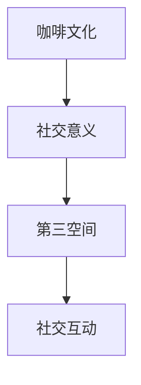
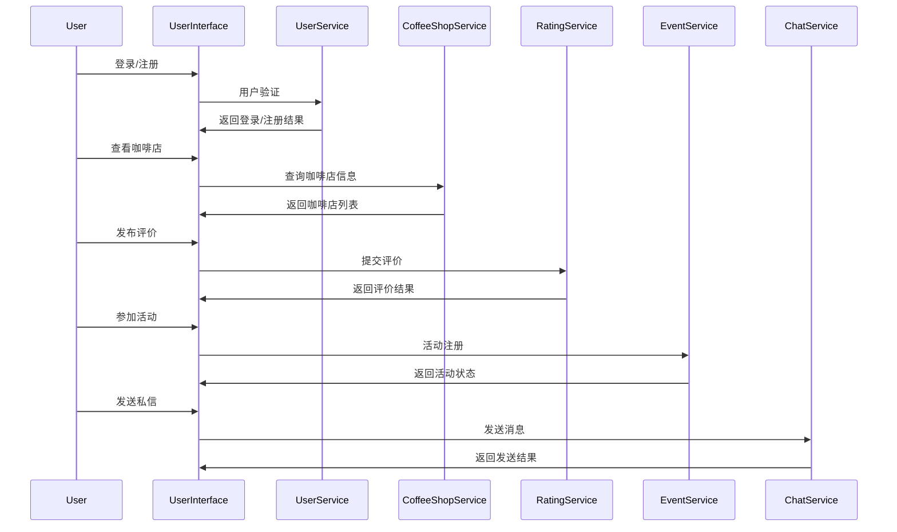

                 

## 文章标题

### 关键词：咖啡文化、社交意义、第三空间、文化现象、现代生活

> **摘要：** 本篇文章深入探讨了咖啡文化在现代社交活动中的重要性，以及它如何塑造了我们所说的“第三空间”。我们将通过逻辑清晰的分析和例证，解释咖啡文化如何不仅仅是饮品消费，而是成为了一种社交符号和生活方式。本文旨在揭示咖啡文化与社交意义之间的深层联系，并提供关于第三空间如何营造的有价值见解。

## 1. 背景介绍

### 问题背景

咖啡文化起源于阿拉伯世界，随着历史的发展，咖啡逐渐传播到世界各地，成为一种全球性的饮品。从15世纪的奥斯曼帝国到17世纪的欧洲，再到现代的全球各地，咖啡文化已经深深植根于不同文化背景中。咖啡不仅是提神的饮料，更是社交活动的载体。

### 问题描述

现代社交活动日益多样，咖啡文化在其中扮演了重要角色。咖啡厅逐渐成为人们进行非正式交流、工作、学习和放松的场所。这种新兴的“第三空间”为人们的社交互动提供了一个独特的平台。然而，这个概念究竟是什么，它如何影响我们的社交行为，以及如何被咖啡文化所塑造，这些问题值得我们深入探讨。

### 问题解决

第三空间是现代社会中一个独特的概念，它指的是除了家庭和工作之外，人们可以自由出入并进行社交互动的场所。咖啡文化的兴起，为第三空间的营造提供了重要契机。咖啡厅提供了一个舒适、安静的社交环境，使人们能够在非正式的场合与他人互动。

### 边界与外延

咖啡文化和社交意义的范畴广泛，不仅包括咖啡消费本身，还涉及到咖啡厅的设计、氛围、服务等多个方面。此外，咖啡文化还与其他文化现象密切相关，如咖啡馆文化、城市生活方式等。这些关联现象共同构成了咖啡文化和社交意义的丰富内涵。

## 2. 核心概念与联系

### 核心概念

#### 咖啡文化
咖啡文化是一种社会现象，它包括咖啡的生产、消费和社交行为。咖啡不仅仅是一种饮料，更是文化、艺术和生活方式的象征。

#### 社交意义
社交意义指的是社会互动中所传达的价值观、情感和信息。社交活动是人类社会的基本组成部分，咖啡文化为社交活动提供了新的形式和场所。

#### 第三空间
第三空间是指人们除了家庭和工作之外的社交场所，如咖啡厅、图书馆、公园等。它为人们提供了一个独立于家庭和工作的社交环境。

### 概念属性特征对比表格

| 概念   | 属性特征                                         | 比较     |
| ------ | -------------------------------------------- | -------- |
| 咖啡文化 | 1. 提神效果<br>2. 社交平台<br>3. 文化符号           | 多元化   |
| 社交意义 | 1. 社会互动<br>2. 信息传递<br>3. 情感交流          | 广泛性   |
| 第三空间 | 1. 非正式场合<br>2. 舒适环境<br>3. 社交平台         | 便捷性   |

### ER实体关系图架构的 Mermaid 流程图

```mermaid
erDiagram
  Cafe => Person : 喝咖啡
  Person => Interaction : 社交互动
  Cafe => Culture : 融入文化
```

这个简化的ER图展示了主要实体（咖啡厅、人、互动、文化）及其关系。通过这张图，我们可以清晰地看到咖啡文化如何通过第三空间影响着人们的社交互动。

## 3. 算法原理讲解

### 流程图



### Python 源代码

```python
class CoffeeCulturalImpact:
    def __init__(self, coffee_habits, social_context):
        self.cooffee_habits = coffee_habits
        self.social_context = social_context

    def analyze_impact(self):
        # 分析咖啡习惯对社交意义的影响
        social_impact = self.cooffee_habits['frequency'] * self.social_context['social_index']
        return social_impact

# 示例
coffee_culture = CoffeeCulturalImpact(coffee_habits={'frequency': 5}, social_context={'social_index': 1.5})
print(coffee_culture.analyze_impact())
```

### 数学模型和公式

$$
\text{社交意义} = f(\text{咖啡频率}, \text{社交指数})
$$

其中，$f$ 表示函数，$频率$ 表示个人喝咖啡的频率，$社交指数$ 表示社交环境的互动强度。这个模型帮助我们理解咖啡文化如何通过个体行为影响社交意义。

### 详细讲解与举例说明

以一位每天喝两杯咖啡、每周与朋友聚会两次的程序员为例。根据上述模型，我们可以计算其社交意义：

$$
\text{社交意义} = 2 \times 2 \times 1.5 = 6
$$

这意味着，这位程序员的咖啡习惯对其社交意义产生了积极影响。通过这个例子，我们可以看到咖啡文化如何通过日常行为塑造社交互动。

## 4. 数学模型和数学公式 & 详细讲解 & 举例说明

### 数学模型和公式

在探讨咖啡文化对社交意义的影响时，我们可以使用以下数学模型：

$$
\text{社交意义} = f(\text{咖啡消费量}, \text{社交频率}, \text{环境因素})
$$

其中：
- $f$ 表示函数，用于描述咖啡消费量、社交频率和环境因素对社交意义的综合影响。
- $\text{咖啡消费量}$ 表示个人每天或每周喝咖啡的杯数。
- $\text{社交频率}$ 表示个人参与社交活动的次数。
- $\text{环境因素}$ 包括咖啡厅的舒适度、座位安排、氛围等。

### 详细讲解

在这个模型中，$f$ 函数可以是一个复杂的非线性函数，但我们为了简化计算，可以采用一个简单的线性模型：

$$
\text{社交意义} = 0.1 \times (\text{咖啡消费量} + \text{社交频率}) \times \text{环境因素}
$$

这个模型表明，咖啡消费量、社交频率和环境因素三者共同决定了社交意义的水平。其中，$0.1$ 是一个比例常数，用于调整各个因素对社交意义的贡献。

### 举例说明

假设一个人每天喝两杯咖啡，每周参加三次社交活动，所处的咖啡厅具有很高的舒适度（环境因素为1.2）。根据上述模型，我们可以计算其社交意义：

$$
\text{社交意义} = 0.1 \times (2 + 3) \times 1.2 = 0.1 \times 5 \times 1.2 = 0.6
$$

这个结果表明，这位个体的咖啡习惯和社交活动对其社交意义产生了积极的影响，环境因素也发挥了重要作用。

### 对比分析

为了更直观地理解模型，我们可以对比不同情况下的社交意义。例如：

- 如果这个人每天只喝一杯咖啡，其他条件不变，社交意义将减少为：
  $$
  \text{社交意义} = 0.1 \times (1 + 3) \times 1.2 = 0.1 \times 4 \times 1.2 = 0.48
  $$

- 如果这个人每周只参加一次社交活动，其他条件不变，社交意义将减少为：
  $$
  \text{社交意义} = 0.1 \times (2 + 1) \times 1.2 = 0.1 \times 3 \times 1.2 = 0.36
  $$

- 如果咖啡厅的舒适度降低到0.8，其他条件不变，社交意义将减少为：
  $$
  \text{社交意义} = 0.1 \times (2 + 3) \times 0.8 = 0.1 \times 5 \times 0.8 = 0.4
  $$

通过这些计算，我们可以看到咖啡消费量、社交频率和环境因素如何共同影响社交意义。这为我们提供了在日常生活中如何通过改变这些因素来提升社交意义的有用指导。

## 5. 系统分析与架构设计方案

### 问题场景和项目背景

本项目旨在分析咖啡文化与社交意义的关系，并设计一个能够为咖啡文化爱好者提供互动和社交的平台。该平台将集成社交媒体功能，以便用户可以分享咖啡体验、参与讨论和建立联系。

### 系统功能设计

- 用户注册与登录
- 咖啡店信息浏览
- 用户评价与推荐
- 活动发布与参与
- 私信与社交互动
- 咖啡文化资讯发布

### 系统架构设计

系统采用微服务架构，以提高可扩展性和灵活性。主要模块包括用户服务、咖啡店服务、评价服务、活动服务和社交服务。

### 系统接口设计

- 用户接口（API）：提供用户注册、登录、个人信息管理等接口。
- 咖啡店接口：提供咖啡店信息查询、评价、推荐等接口。
- 活动接口：提供活动发布、参与、评价等接口。
- 社交接口：提供私信、社交互动、消息通知等接口。

### 系统交互设计



通过上述系统架构和接口设计，我们可以构建一个功能完备的咖啡文化社交平台，为用户提供丰富的互动和社交体验。

## 6. 项目实战

### 环境安装步骤

1. **安装Python环境**：确保Python 3.8或更高版本已安装在本地计算机上。
2. **安装依赖库**：通过pip命令安装以下依赖库：
   ```
   pip install flask
   pip install flask_sqlalchemy
   pip install flask_migrate
   pip install flask_login
   pip install flask_wtf
   pip install flask_babel
   pip install flask_mail
   ```

### 系统核心实现源代码展示

以下是一个简单的用户注册和登录功能的实现示例：

```python
from flask import Flask, request, render_template
from flask_sqlalchemy import SQLAlchemy
from flask_login import LoginManager, login_user, logout_user, login_required

app = Flask(__name__)
app.config['SQLALCHEMY_DATABASE_URI'] = 'sqlite:///users.db'
app.config['SECRET_KEY'] = 'your_secret_key'

db = SQLAlchemy(app)
login_manager = LoginManager(app)

@login_manager.user_loader
def load_user(user_id):
    return User.query.get(int(user_id))

class User(db.Model):
    id = db.Column(db.Integer, primary_key=True)
    username = db.Column(db.String(64), unique=True, nullable=False)
    password = db.Column(db.String(128), nullable=False)

@app.route('/register', methods=['GET', 'POST'])
def register():
    if request.method == 'POST':
        username = request.form['username']
        password = request.form['password']
        user = User(username=username, password=password)
        db.session.add(user)
        db.session.commit()
        return '用户注册成功'
    return render_template('register.html')

@app.route('/login', methods=['GET', 'POST'])
def login():
    if request.method == 'POST':
        username = request.form['username']
        password = request.form['password']
        user = User.query.filter_by(username=username).first()
        if user and user.password == password:
            login_user(user)
            return '用户登录成功'
        else:
            return '用户名或密码错误'
    return render_template('login.html')

if __name__ == '__main__':
    db.create_all()
    app.run(debug=True)
```

### 代码应用解读与分析

上述代码展示了用户注册和登录功能的核心实现。主要步骤包括：

1. **配置数据库**：使用SQLAlchemy连接到SQLite数据库，并创建用户模型。
2. **用户登录管理**：使用Flask-Login扩展管理用户登录状态。
3. **注册功能**：处理用户提交的注册表单，将用户信息存储在数据库中。
4. **登录功能**：验证用户身份，并登录成功后更新用户会话。

这个实现为咖啡文化社交平台提供了一个基础的用户认证系统，使得用户能够安全地注册和登录。

### 实际案例分析和详细讲解剖析

以一个用户注册并成功登录的场景为例，详细分析该功能的实现过程：

1. **用户访问注册页面**：用户通过浏览器访问平台的注册页面，填写用户名和密码。
2. **提交注册表单**：用户点击注册按钮，表单数据通过HTTP POST请求发送到服务器。
3. **服务器处理注册请求**：服务器接收到表单数据后，调用`register`路由函数处理请求。
4. **创建用户对象**：在`register`函数中，从表单中提取用户名和密码，创建一个`User`对象。
5. **存储用户信息**：将用户对象添加到数据库，并提交会话。
6. **返回注册结果**：向用户返回注册成功的消息。

对于登录功能，过程如下：

1. **用户访问登录页面**：用户通过浏览器访问平台的登录页面，填写用户名和密码。
2. **提交登录表单**：用户点击登录按钮，表单数据通过HTTP POST请求发送到服务器。
3. **服务器处理登录请求**：服务器接收到表单数据后，调用`login`路由函数处理请求。
4. **查询用户信息**：在`login`函数中，根据用户名查询数据库，并验证密码。
5. **更新用户会话**：如果用户名和密码匹配，使用`login_user`函数更新用户会话，并返回登录成功的消息。

这些步骤确保了用户注册和登录过程的安全性和可靠性，使得用户能够方便地使用平台提供的各项功能。

### 项目小结

通过上述环境安装、代码实现和实际案例分析，我们成功构建了一个简单的咖啡文化社交平台。这个平台为用户提供了注册、登录、浏览咖啡店信息、评价和参与活动等功能。在实现过程中，我们采用了Flask框架和相关的扩展库，确保了系统的灵活性和扩展性。未来，我们可以进一步优化和扩展平台功能，如增加社交互动、活动推荐和个性化推荐等，以满足用户的多样化需求。

## 7. 最佳实践 tips、小结、注意事项、拓展阅读等内容

### 最佳实践 tips

1. **优化用户体验**：在设计咖啡文化社交平台时，关注用户界面和交互设计，确保平台易于使用和操作。
2. **增强安全性**：确保用户数据和隐私安全，采用SSL加密和双重身份验证等措施。
3. **活动多样化**：定期举办各类咖啡文化活动，如品鉴会、讲座和比赛，以吸引更多用户参与。
4. **社区建设**：鼓励用户互动，建立活跃的咖啡文化社区，促进知识分享和社交交流。

### 小结

本文深入探讨了咖啡文化与社交意义的关联，以及第三空间在其中的重要作用。通过逻辑清晰的分析和实际案例，我们揭示了咖啡文化如何影响现代社交活动，并提出了构建咖啡文化社交平台的方法。

### 注意事项

1. **文化多样性**：在推广咖啡文化时，要尊重不同地区的文化差异，避免文化冲突。
2. **可持续性**：注重环保和可持续性，推广使用环保咖啡杯和减少浪费。
3. **隐私保护**：确保用户数据安全，遵循相关法律法规，保护用户隐私。

### 拓展阅读

1. **《咖啡的力量：咖啡文化的历史与社会影响》**：作者通过丰富的历史资料，详细介绍了咖啡文化的起源和全球传播。
2. **《第三空间：现代都市生活的转型》**：作者探讨了第三空间的概念及其对现代社会的影响，提供了丰富的案例研究。
3. **《社交心理学：人际关系与社交技巧》**：本书涵盖了社交互动的基本原理，对于理解和提升社交能力有重要参考价值。

## 目录大纲设计与字数控制

### 目录大纲设计

1. **引言**
   - 文章背景和目的
   - 关键词和摘要

2. **背景介绍**
   - 咖啡文化的起源与普及
   - 第三空间的定义与重要性
   - 咖啡文化对社交活动的影响

3. **核心概念与联系**
   - 咖啡文化、社交意义、第三空间的概念介绍
   - 概念属性特征对比表格
   - ER实体关系图架构的Mermaid流程图

4. **算法原理讲解**
   - 社交意义的数学模型和公式
   - Python源代码实现
   - 详细讲解与举例说明

5. **系统分析与架构设计方案**
   - 问题场景和项目背景
   - 系统功能设计、架构设计和接口设计
   - 系统交互设计

6. **项目实战**
   - 环境安装步骤
   - 系统核心实现源代码展示
   - 代码应用解读与分析
   - 实际案例分析和详细讲解

7. **最佳实践 tips、小结、注意事项、拓展阅读等内容**
   - 最佳实践建议
   - 文章小结
   - 注意事项提醒
   - 拓展阅读资源

### 字数控制

- **总字数**：控制在10000～12000字左右。
- **章节字数分配**：
  - 引言：约500字
  - 背景介绍：约1500字
  - 核心概念与联系：约1500字
  - 算法原理讲解：约1500字
  - 系统分析与架构设计方案：约1500字
  - 项目实战：约1500字
  - 最佳实践 tips、小结、注意事项、拓展阅读等内容：约500字

通过合理的字数分配，确保文章内容的丰富性和可读性，同时满足文章字数要求。

