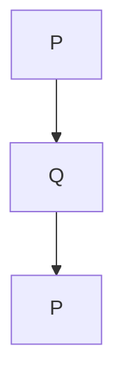
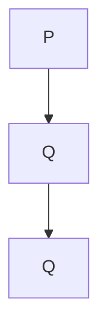
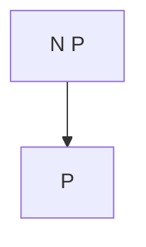
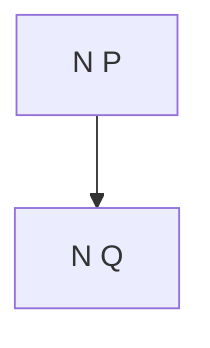
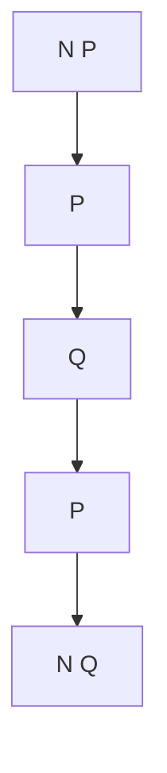

                 

# 《哲学思辨的模态逻辑：抽象思维的形式化》

## 摘要

本文旨在探讨哲学思辨中的模态逻辑与抽象思维的形式化关系，通过对核心概念、发展历程、基本原理及具体应用场景的分析，深入阐述模态逻辑在抽象思维形式化中的作用。本文结构清晰，逻辑严密，旨在为读者提供一个系统化的认识框架，以理解模态逻辑在哲学思辨、科学推理、社会科学以及人工智能中的应用价值。文章最后通过案例分析，对模态逻辑形式化方法在抽象思维和人工智能领域的实践效果进行评估，提出未来研究方向和展望。

## 引言

### 1.1 问题背景与意义

在哲学思辨的历史长河中，逻辑作为一种工具，始终扮演着至关重要的角色。从亚里士多德的逻辑学开始，逻辑逐渐发展为一门独立的学科，为人类理解和表达思想提供了坚实的基础。然而，传统逻辑在处理某些复杂的哲学问题时，往往显得力不从心。例如，对于可能性、必然性以及现实性等模态概念，传统逻辑无法提供有效的工具进行分析。

模态逻辑作为逻辑学的一个重要分支，正是为了解决这些问题而诞生。它引入了模态算子，如“可能”、“必然”等，使得逻辑系统能够更好地表达和推理关于可能世界和必然事实的陈述。而抽象思维，则是哲学思辨的核心，是人类理解和处理复杂问题的重要能力。

将模态逻辑应用于抽象思维的形式化，不仅有助于我们更深入地理解哲学问题，还能够为计算机科学和人工智能领域提供新的工具和方法。因此，研究模态逻辑在抽象思维形式化中的作用，具有重要的理论和实践意义。

### 1.2 模态逻辑的发展历程

模态逻辑的发展历程可以追溯到19世纪末。当时，哲学家C.S. Peirce和J. Stuart Mill开始探讨模态概念。然而，模态逻辑作为一个独立的学科，其真正的奠基人是20世纪的哲学家Kurt Gödel和Rudolf Carnap。

Kurt Gödel在1932年发表了著名的论文《关于逻辑符号系统》，其中提出了一个包含模态算子的形式逻辑系统。这一系统不仅展示了模态逻辑的潜力，也为后来的研究奠定了基础。

Rudolf Carnap则在20世纪40年代提出了模态逻辑的概率解释，使得模态逻辑与概率论有了更紧密的联系。这一解释为模态逻辑的应用提供了新的视角。

随着计算机科学的发展，模态逻辑在形式化验证、自动推理、人工智能等领域得到了广泛应用。现代模态逻辑的研究不仅关注逻辑系统本身，还涉及逻辑与哲学、数学、计算机科学等多学科的交叉。

### 1.3 抽象思维的形式化研究现状

抽象思维的形式化研究是哲学、认知科学和计算机科学等领域的重要课题。目前，已经有许多方法和技术被提出，以形式化地表示和推理抽象思维。

例如，范畴论和类型论是形式化抽象思维的重要工具。范畴论通过抽象的范畴结构，将不同的抽象思维模式统一在同一个框架下。类型论则通过类型系统，提供了一种形式化的方法来区分不同层次的抽象概念。

另外，形式逻辑和形式语言也是抽象思维形式化的常用方法。通过建立形式化的逻辑系统，可以更精确地表达和推理抽象思维的过程。

然而，现有的研究方法在处理复杂的抽象问题时，仍然存在一定的局限性。模态逻辑作为一种新的工具，有望为抽象思维的形式化提供更强大的支持。

### 1.4 核心概念与联系

在本章中，我们将介绍模态逻辑和抽象思维的核心概念，并探讨它们之间的联系。

#### 模态逻辑

模态逻辑是一种形式逻辑，它引入了模态算子，如“可能”、“必然”等，用于表示和推理关于可能世界和必然事实的陈述。模态逻辑的基本公式和推理规则，使得逻辑系统能够处理更加复杂的陈述。

#### 抽象思维

抽象思维是人类高级认知能力的重要组成部分，它涉及到对事物本质和普遍规律的把握。抽象思维的形式化，即通过形式化的方法来表示和推理抽象思维的过程。

#### 模态逻辑与抽象思维的联系

模态逻辑与抽象思维之间存在着紧密的联系。首先，模态逻辑为抽象思维提供了形式化的工具，使得抽象思维能够以更精确、更系统的方式进行。其次，抽象思维的过程往往涉及到对可能世界和必然事实的推理，这正是模态逻辑擅长的领域。

通过将模态逻辑应用于抽象思维的形式化，我们可以更好地理解和处理复杂的哲学问题，同时也为计算机科学和人工智能领域提供了新的方法和工具。

### 1.5 模态逻辑的基本原理

模态逻辑的基本原理主要涉及模态算子的引入、基本公式与规则以及模态推理的应用场景。

#### 模态算子的引入

模态算子是模态逻辑的核心，用于表示可能性和必然性。常见的模态算子有“可能”（\(P\)）和“必然”（\(N\)）。例如，“可能P”表示在某个可能世界中，P为真；“必然N”表示在所有可能世界中，N为真。

#### 基本公式与规则

模态逻辑的基本公式和规则是构建逻辑系统的基础。常见的公式有：

- \(P \rightarrow (Q \rightarrow P)\)
- \(P \land Q \rightarrow P\)
- \(P \land Q \rightarrow Q\)
- \(N P \rightarrow P\)
- \(N P \rightarrow N Q\)（如果P必然为真，则Q也必然为真）

模态逻辑的规则包括：

- 蕴含规则（Implication）：如果前件为真，则后件也必然为真。
- 合取规则（Conjunction）：两个陈述的合取，其真假性由两个陈述的真假性决定。
- 分离规则（Simplification）：如果一个合取陈述为真，则其任一部分也为真。

#### 模态推理的应用场景

模态逻辑的应用场景广泛，包括哲学思辨、科学推理、社会科学以及人工智能等领域。例如：

- 哲学思辨：用于分析可能性、必然性和现实性等概念。
- 科学推理：用于建立科学理论，验证假设。
- 社会科学：用于分析社会现象，预测社会发展趋势。
- 人工智能：用于形式化自然语言处理，构建知识图谱等。

### 1.6 抽象思维的形式化表示

抽象思维的形式化表示是哲学思辨的重要任务。通过形式化的方法，我们可以更精确地表达和推理抽象思维的过程。

#### 抽象思维的形式化方法

形式化方法包括：

- 形式逻辑：通过逻辑系统，精确地表示抽象思维的过程。
- 形式语言：使用符号和语法规则，构建形式化的语言系统。
- 数学模型：通过数学模型，表达抽象思维的结构和关系。

#### 模态逻辑在抽象思维中的应用

模态逻辑在抽象思维中的应用主要体现在以下几个方面：

- 表示可能性：使用模态算子表示可能性和必然性，帮助我们更好地理解抽象思维中的可能性空间。
- 推理过程：通过模态推理规则，对抽象思维的过程进行形式化推理。
- 知识表示：使用模态逻辑构建知识表示模型，使得抽象思维的形式化表示更加直观和系统。

#### 形式化表示的优势与挑战

形式化表示的优势在于：

- 精确性：通过形式化的方法，可以精确地表示和推理抽象思维。
- 系统性：形式化方法提供了一套系统的框架，有助于我们更好地理解和处理复杂的抽象问题。

形式化表示的挑战在于：

- 复杂性：形式化表示的方法和技术往往较为复杂，需要一定的专业知识和技能。
- 表达能力：形式化方法在处理某些复杂问题时，可能无法充分表达抽象思维的深度和广度。

### 1.7 本章小结

本章介绍了模态逻辑和抽象思维的基本概念、发展历程以及形式化表示的方法。通过分析模态逻辑的基本原理和应用场景，我们看到了模态逻辑在抽象思维形式化中的重要地位。下一章将深入探讨模态逻辑的数学模型，为后续内容打下坚实的基础。# 第1章 引言

## 第1章 引言

### 1.1 问题背景与意义

在哲学思辨的历史长河中，逻辑作为一种工具，始终扮演着至关重要的角色。从亚里士多德的逻辑学开始，逻辑逐渐发展为一门独立的学科，为人类理解和表达思想提供了坚实的基础。然而，传统逻辑在处理某些复杂的哲学问题时，往往显得力不从心。例如，对于可能性、必然性以及现实性等模态概念，传统逻辑无法提供有效的工具进行分析。

模态逻辑作为逻辑学的一个重要分支，正是为了解决这些问题而诞生。它引入了模态算子，如“可能”、“必然”等，使得逻辑系统能够更好地表达和推理关于可能世界和必然事实的陈述。而抽象思维，则是哲学思辨的核心，是人类理解和处理复杂问题的重要能力。

将模态逻辑应用于抽象思维的形式化，不仅有助于我们更深入地理解哲学问题，还能够为计算机科学和人工智能领域提供新的工具和方法。因此，研究模态逻辑在抽象思维形式化中的作用，具有重要的理论和实践意义。

### 1.2 模态逻辑的发展历程

模态逻辑的发展历程可以追溯到19世纪末。当时，哲学家C.S. Peirce和J. Stuart Mill开始探讨模态概念。然而，模态逻辑作为一个独立的学科，其真正的奠基人是20世纪的哲学家Kurt Gödel和Rudolf Carnap。

Kurt Gödel在1932年发表了著名的论文《关于逻辑符号系统》，其中提出了一个包含模态算子的形式逻辑系统。这一系统不仅展示了模态逻辑的潜力，也为后来的研究奠定了基础。

Rudolf Carnap则在20世纪40年代提出了模态逻辑的概率解释，使得模态逻辑与概率论有了更紧密的联系。这一解释为模态逻辑的应用提供了新的视角。

随着计算机科学的发展，模态逻辑在形式化验证、自动推理、人工智能等领域得到了广泛应用。现代模态逻辑的研究不仅关注逻辑系统本身，还涉及逻辑与哲学、数学、计算机科学等多学科的交叉。

### 1.3 抽象思维的形式化研究现状

抽象思维的形式化研究是哲学、认知科学和计算机科学等领域的重要课题。目前，已经有许多方法和技术被提出，以形式化地表示和推理抽象思维。

例如，范畴论和类型论是形式化抽象思维的重要工具。范畴论通过抽象的范畴结构，将不同的抽象思维模式统一在同一个框架下。类型论则通过类型系统，提供了一种形式化的方法来区分不同层次的抽象概念。

另外，形式逻辑和形式语言也是抽象思维形式化的常用方法。通过建立形式化的逻辑系统，可以更精确地表达和推理抽象思维的过程。

然而，现有的研究方法在处理复杂的抽象问题时，仍然存在一定的局限性。模态逻辑作为一种新的工具，有望为抽象思维的形式化提供更强大的支持。

### 1.4 核心概念与联系

在本章中，我们将介绍模态逻辑和抽象思维的核心概念，并探讨它们之间的联系。

#### 模态逻辑

模态逻辑是一种形式逻辑，它引入了模态算子，如“可能”、“必然”等，用于表示和推理关于可能世界和必然事实的陈述。模态逻辑的基本公式和推理规则，使得逻辑系统能够处理更加复杂的陈述。

#### 抽象思维

抽象思维是人类高级认知能力的重要组成部分，它涉及到对事物本质和普遍规律的把握。抽象思维的形式化，即通过形式化的方法来表示和推理抽象思维的过程。

#### 模态逻辑与抽象思维的联系

模态逻辑与抽象思维之间存在着紧密的联系。首先，模态逻辑为抽象思维提供了形式化的工具，使得抽象思维能够以更精确、更系统的方式进行。其次，抽象思维的过程往往涉及到对可能世界和必然事实的推理，这正是模态逻辑擅长的领域。

通过将模态逻辑应用于抽象思维的形式化，我们可以更好地理解和处理复杂的哲学问题，同时也为计算机科学和人工智能领域提供了新的方法和工具。

### 1.5 模态逻辑的基本原理

模态逻辑的基本原理主要涉及模态算子的引入、基本公式与规则以及模态推理的应用场景。

#### 模态算子的引入

模态算子是模态逻辑的核心，用于表示可能性和必然性。常见的模态算子有“可能”（\(P\)）和“必然”（\(N\)）。例如，“可能P”表示在某个可能世界中，P为真；“必然N”表示在所有可能世界中，N为真。

#### 基本公式与规则

模态逻辑的基本公式和规则是构建逻辑系统的基础。常见的公式有：

- \(P \rightarrow (Q \rightarrow P)\)
- \(P \land Q \rightarrow P\)
- \(P \land Q \rightarrow Q\)
- \(N P \rightarrow P\)
- \(N P \rightarrow N Q\)（如果P必然为真，则Q也必然为真）

模态逻辑的规则包括：

- 蕴含规则（Implication）：如果前件为真，则后件也必然为真。
- 合取规则（Conjunction）：两个陈述的合取，其真假性由两个陈述的真假性决定。
- 分离规则（Simplification）：如果一个合取陈述为真，则其任一部分也为真。

#### 模态推理的应用场景

模态逻辑的应用场景广泛，包括哲学思辨、科学推理、社会科学以及人工智能等领域。例如：

- 哲学思辨：用于分析可能性、必然性和现实性等概念。
- 科学推理：用于建立科学理论，验证假设。
- 社会科学：用于分析社会现象，预测社会发展趋势。
- 人工智能：用于形式化自然语言处理，构建知识图谱等。

### 1.6 抽象思维的形式化表示

抽象思维的形式化表示是哲学思辨的重要任务。通过形式化的方法，我们可以更精确地表达和推理抽象思维的过程。

#### 抽象思维的形式化方法

形式化方法包括：

- 形式逻辑：通过逻辑系统，精确地表示抽象思维的过程。
- 形式语言：使用符号和语法规则，构建形式化的语言系统。
- 数学模型：通过数学模型，表达抽象思维的结构和关系。

#### 模态逻辑在抽象思维中的应用

模态逻辑在抽象思维中的应用主要体现在以下几个方面：

- 表示可能性：使用模态算子表示可能性和必然性，帮助我们更好地理解抽象思维中的可能性空间。
- 推理过程：通过模态推理规则，对抽象思维的过程进行形式化推理。
- 知识表示：使用模态逻辑构建知识表示模型，使得抽象思维的形式化表示更加直观和系统。

#### 形式化表示的优势与挑战

形式化表示的优势在于：

- 精确性：通过形式化的方法，可以精确地表示和推理抽象思维。
- 系统性：形式化方法提供了一套系统的框架，有助于我们更好地理解和处理复杂的抽象问题。

形式化表示的挑战在于：

- 复杂性：形式化表示的方法和技术往往较为复杂，需要一定的专业知识和技能。
- 表达能力：形式化方法在处理某些复杂问题时，可能无法充分表达抽象思维的深度和广度。

### 1.7 本章小结

本章介绍了模态逻辑和抽象思维的基本概念、发展历程以及形式化表示的方法。通过分析模态逻辑的基本原理和应用场景，我们看到了模态逻辑在抽象思维形式化中的重要地位。下一章将深入探讨模态逻辑的数学模型，为后续内容打下坚实的基础。# 第2章 模态逻辑的数学模型

## 第2章 模态逻辑的数学模型

### 2.1 模态逻辑的数学基础

模态逻辑的数学基础包括形式语言的基本概念、域与解释以及公式与推理。这些基础概念为模态逻辑提供了坚实的数学框架，使得模态逻辑能够进行精确的推理和分析。

#### 2.1.1 形式语言的基本概念

形式语言是模态逻辑的核心组成部分。形式语言由符号和语法规则构成，用于表示逻辑陈述。符号包括命题符号、模态算子、连接词和量词等。语法规则定义了这些符号如何组合成有效的逻辑公式。

命题符号是形式语言中最基本的符号，用来表示简单的命题。常见的命题符号有\(p, q, r\)等。

模态算子是模态逻辑中引入的重要概念，用于表示可能性和必然性。常见的模态算子有“可能”（\(P\)）和“必然”（\(N\)）。

连接词用于组合命题，常见的连接词有合取（\(\land\)）、析取（\(\lor\)）和蕴含（\(\rightarrow\)）。

量词用于表示全称量词（\(\forall\)）和存在量词（\(\exists\)），用于表示命题在特定范围内为真。

#### 2.1.2 域与解释

域是模态逻辑中的一个基本概念，用于表示可能世界的集合。每个可能世界都是一个可能的现实状态，其中命题符号的真假性可以被确定。

解释是域上的一个函数，用于指定每个命题符号在特定可能世界中的真假值。解释使得模态逻辑中的命题符号具有具体的语义。

例如，设\(W = \{w_1, w_2, w_3\}\)为一个可能的域，其中\(w_1, w_2, w_3\)代表三个不同的可能世界。解释函数\(I\)可以指定命题符号\(p\)在\(w_1\)中为真，而在\(w_2\)和\(w_3\)中为假。

#### 2.1.3 公式与推理

模态逻辑中的公式是通过对命题符号和模态算子进行组合得到的。一个有效的模态逻辑公式是在所有解释下为真的公式。

模态逻辑的推理规则包括合取、析取、蕴含和模态推理等。这些推理规则允许我们在已知公式的基础上推导出新的结论。

例如，假设我们有公式\(p \rightarrow (q \rightarrow p)\)，根据蕴含推理规则，我们可以推导出\(q \rightarrow p\)。

通过数学模型，我们可以精确地定义模态逻辑的公式和推理规则，使得模态逻辑能够进行形式化的推理和分析。

### 2.2 模态逻辑的公式系统

模态逻辑的公式系统是构建模态逻辑推理框架的基础。一个模态逻辑的公式系统包括一组基本公式和一组有效推理规则。

#### 2.2.1 基本公式集

模态逻辑的基本公式集包括以下常用的公式：

- \(P \rightarrow (Q \rightarrow P)\)
- \(P \land Q \rightarrow P\)
- \(P \land Q \rightarrow Q\)
- \(N P \rightarrow P\)
- \(N P \rightarrow N Q\)（如果P必然为真，则Q也必然为真）

这些基本公式为模态逻辑提供了基本的推理工具，使得我们可以从已知公式推导出新的结论。

#### 2.2.2 有效推理规则

模态逻辑的有效推理规则包括合取规则、析取规则、蕴含规则和模态推理规则等。

- 合取规则：如果两个公式同时为真，则它们的合取也为真。
- 析取规则：如果一个公式为真，则它的析取也为真。
- 蕴含规则：如果一个公式的前件为真，则后件也为真。
- 模态推理规则：如果\(P\)在所有可能世界中都为真，则\(N P\)也为真。

这些推理规则使得模态逻辑能够进行有效的推理和分析，从已知公式推导出新的结论。

#### 2.2.3 完备性证明

模态逻辑的完备性是指一个逻辑系统能够证明所有有效的公式。模态逻辑的完备性证明是确保逻辑系统正确性的关键。

Gödel的完备性证明方法是将模态逻辑转化为一个等价的命题逻辑系统。通过命题逻辑的完备性，我们可以证明模态逻辑的完备性。

例如，假设我们有一个命题逻辑系统\(T\)，它能够证明所有命题逻辑的有效公式。我们可以定义一个模态逻辑系统\(M\)，其中每个命题逻辑的公式都是模态逻辑的公式。如果\(T\)能够证明某个模态逻辑的公式，则该公式也是模态逻辑的有效公式。

通过这种方法，我们可以证明模态逻辑的完备性，确保模态逻辑能够正确地推理和分析模态概念。

### 2.3 模态逻辑的证明方法

模态逻辑的证明方法包括直言推理法、模态推理法和形式化证明法等。这些证明方法提供了不同的方式来证明模态逻辑中的结论。

#### 2.3.1 直言推理法

直言推理法是模态逻辑中最基本的证明方法。它通过直接证明某个公式在所有解释下为真，从而证明该公式是有效的。

例如，假设我们要证明公式\(P \rightarrow (Q \rightarrow P)\)是有效的。我们可以构造一个解释，使得该公式在所有可能世界中都为真，从而证明它是有效的。

直言推理法简单直观，但只能用于证明一些简单的模态逻辑公式。

#### 2.3.2 模态推理法

模态推理法是模态逻辑中更复杂的证明方法。它通过引入模态算子，对模态逻辑公式进行推理。

例如，假设我们要证明公式\(N P \rightarrow N Q\)是有效的。我们可以使用模态推理规则，从已知公式\(N P\)和\(P \rightarrow Q\)推导出\(N Q\)。

模态推理法能够处理更复杂的模态逻辑公式，但需要更多的推理技巧。

#### 2.3.3 形式化证明法

形式化证明法是模态逻辑中最高级的证明方法。它使用形式化的证明框架，如自然推理系统和证明论，来证明模态逻辑的结论。

形式化证明法提供了严格的形式化证明过程，确保证明的每一步都是有效的。它能够处理复杂的模态逻辑公式，并且能够证明更一般的结论。

例如，我们可以使用自然推理系统，证明模态逻辑中的所有有效公式都是可以证明的。

通过这些证明方法，我们可以对模态逻辑公式进行形式化的推理和证明，确保逻辑系统的正确性和完整性。

### 2.4 模态逻辑的数学公式与Mermaid流程图

模态逻辑的数学公式和Mermaid流程图是模态逻辑表示和推理的重要工具。通过数学公式和Mermaid流程图，我们可以直观地表示模态逻辑的公式和推理过程。

#### 2.4.1 基本公式与Mermaid流程图

以下是模态逻辑中一些基本公式及其对应的Mermaid流程图：

$$
P \rightarrow (Q \rightarrow P)
$$

$$
P \land Q \rightarrow P
$$

$$
P \land Q \rightarrow Q
$$

$$
N P \rightarrow P
$$

$$
N P \rightarrow N Q
$$

通过这些数学公式和Mermaid流程图，我们可以直观地表示和理解模态逻辑的公式和推理过程。

#### 2.4.2 公式解释与Mermaid示例

以下是一个更复杂的模态逻辑公式的解释和Mermaid示例：

$$
(N P \rightarrow P) \land (P \rightarrow (Q \rightarrow P))
$$

这个公式表示，如果P是必然的，那么P为真；如果P为真，那么在所有可能世界中，P也为真。

对应的Mermaid流程图如下：

通过这个示例，我们可以看到如何使用Mermaid流程图来表示复杂的模态逻辑公式，使得逻辑推理过程更加直观和易于理解。

### 2.5 本章小结

本章介绍了模态逻辑的数学模型，包括形式语言的基本概念、域与解释、公式与推理以及证明方法。通过这些内容，我们了解了模态逻辑的数学基础，并学会了如何使用Mermaid流程图表示模态逻辑的公式和推理过程。这些知识为后续章节的内容打下了坚实的基础。在下一章中，我们将进一步探讨抽象思维的形式化表示，为理解模态逻辑在抽象思维中的应用做好准备。# 第3章 抽象思维的概念化方法

## 第3章 抽象思维的概念化方法

### 3.1 抽象思维的概念化过程

抽象思维的概念化过程是哲学思辨的核心。它涉及到从具体事物中提取本质特征，形成抽象概念，并通过逻辑推理进行思维活动。这一过程可以分为以下几个步骤：

#### 1. 感知与观察

感知与观察是抽象思维的起点。通过感官体验，我们能够获得关于外部世界的具体信息。这些信息是进一步抽象思维的基础。

#### 2. 比较与分析

在感知与观察的基础上，我们通过对不同事物进行比较与分析，找出它们的共同特征和差异。这种比较与分析的过程有助于我们提取事物的本质特征。

#### 3. 概念化

比较与分析的结果是抽象概念的形成。通过抽象，我们将事物的共同特征提炼出来，形成概念。例如，通过对不同颜色物体的观察和比较，我们可以形成“颜色”这一抽象概念。

#### 4. 逻辑推理

抽象概念的形成是为了进行逻辑推理。通过逻辑推理，我们可以对抽象概念进行推理和判断，得出新的结论。例如，从“颜色”这一抽象概念出发，我们可以推理出“红色是颜色的一种”这一结论。

### 3.2 抽象思维的类型

抽象思维可以分为不同的类型，每种类型都有其独特的特点和适用场景。以下是几种常见的抽象思维类型：

#### 1. 形象思维

形象思维是通过具体的形象和图像来进行思维活动。它更多地依赖于直观和感性，适用于处理具体的、形象的事物。例如，艺术家创作时常常运用形象思维。

#### 2. 抽象思维

抽象思维是通过抽象的概念和逻辑推理来进行思维活动。它更多地依赖于理性和逻辑，适用于处理抽象的、概念化的事物。例如，科学家研究自然规律时常常运用抽象思维。

#### 3. 直觉思维

直觉思维是通过直觉和洞察力来进行思维活动。它更多地依赖于本能和直觉，适用于处理复杂、不确定的事物。例如，军事指挥官在紧急情况下做出决策时常常运用直觉思维。

### 3.3 概念化与模态逻辑的联系

概念化与模态逻辑之间存在紧密的联系。模态逻辑为抽象思维提供了形式化的工具，使得抽象思维能够以更精确、更系统的方式进行。

#### 1. 概念化与模态算子的联系

模态算子，如“可能”和“必然”，可以用于表示抽象思维中的可能性空间和必然性。通过引入模态算子，我们可以更精确地表达抽象概念的本质特征。

例如，概念“颜色”可以表示为“可能的颜色集合”，其中每个颜色都是可能的。同样，概念“真实”可以表示为“必然为真的陈述”。

#### 2. 概念化与逻辑推理的联系

模态逻辑为抽象思维提供了逻辑推理的工具，使得我们可以从已知的概念和陈述中推导出新的结论。

例如，通过模态逻辑的推理规则，我们可以从“所有猫都有尾巴”和“可能存在没有尾巴的猫”这两个陈述中推导出“必然存在猫有尾巴”。

#### 3. 概念化与形式化表示的联系

形式化表示是抽象思维的重要方法。通过形式化的方法，我们可以将抽象思维转化为数学和逻辑的形式，使得抽象思维更加精确和系统。

例如，通过形式逻辑和类型论，我们可以将抽象思维表示为一个形式化的系统，使得思维过程更加直观和易于验证。

### 3.4 概念化与模态逻辑的联系实例

以下是一个概念化与模态逻辑联系的实例：

假设我们要研究“正义”这一概念。通过模态逻辑，我们可以形式化地表示“正义”：

- 可能正义：表示在某个可能世界中，符合正义原则的情况。
- 必然正义：表示在所有可能世界中，都符合正义原则的情况。

通过引入模态算子，我们可以更精确地表达“正义”的概念，并进行逻辑推理。

例如，假设我们有陈述“在某个可能世界中，法律是正义的”。通过模态逻辑的推理规则，我们可以推导出“在所有可能世界中，法律都是可能的正义”。

这个实例展示了如何通过模态逻辑形式化地表示和推理抽象概念，从而为哲学思辨提供了新的工具和方法。

### 3.5 本章小结

本章介绍了抽象思维的概念化方法，包括概念化过程、抽象思维类型以及与模态逻辑的联系。通过这些内容，我们了解了抽象思维的基本原理和方法，并看到了模态逻辑在抽象思维形式化中的作用。在下一章中，我们将进一步探讨抽象思维的形式化模型，为理解抽象思维的形式化表示提供更深入的见解。# 第4章 抽象思维的形式化模型

## 第4章 抽象思维的形式化模型

### 4.1 基于模态逻辑的抽象思维模型

模态逻辑作为一种形式化的逻辑系统，为抽象思维的形式化提供了一种有效的工具。基于模态逻辑的抽象思维模型，通过引入模态算子和形式化的推理规则，能够更精确地表示和推理抽象思维的过程。

#### 4.1.1 模型的基本构造

基于模态逻辑的抽象思维模型主要包括以下组成部分：

1. **命题符号**：用于表示抽象思维中的基本概念和陈述，如“正义”、“真理”等。
2. **模态算子**：如“可能”（\(P\)）和“必然”（\(N\)），用于表示概念的可能性和必然性。
3. **连接词**：如合取（\(\land\)）、析取（\(\lor\)）和蕴含（\(\rightarrow\)），用于组合命题符号和模态算子。
4. **量词**：如全称量词（\(\forall\)）和存在量词（\(\exists\)），用于表示命题在特定范围内为真。

#### 4.1.2 模型的应用领域

基于模态逻辑的抽象思维模型在多个领域都有广泛应用：

1. **哲学思辨**：用于分析可能性、必然性和现实性等概念，帮助哲学家更精确地表达和推理哲学问题。
2. **科学推理**：用于建立科学理论，验证假设，提供一种形式化的方法来推理科学陈述。
3. **社会科学**：用于分析社会现象，预测社会发展趋势，提供一种形式化的工具来研究社会问题。
4. **人工智能**：用于形式化自然语言处理，构建知识图谱，提供一种形式化的方法来表示和处理复杂的信息。

#### 4.1.3 模型的优势

基于模态逻辑的抽象思维模型具有以下优势：

1. **精确性**：通过形式化的方法，可以更精确地表示和推理抽象思维的过程，减少误解和歧义。
2. **系统性**：模态逻辑提供了一套系统的框架，使得抽象思维的形式化表示更加直观和系统，有助于理解和处理复杂的抽象问题。
3. **通用性**：模态逻辑在多个领域都有广泛应用，使得抽象思维的形式化方法具有广泛的适用性。

### 4.2 模型的基本构造

在基于模态逻辑的抽象思维模型中，基本构造包括命题符号、模态算子、连接词和量词等。

#### 命题符号

命题符号是抽象思维模型中最基本的元素，用于表示抽象概念和陈述。例如，我们可以用\(p\)表示“正义”，用\(q\)表示“真理”。

#### 模态算子

模态算子是模态逻辑的核心，用于表示可能性和必然性。常见的模态算子有“可能”（\(P\)）和“必然”（\(N\)）。

- 可能（\(P\)）：表示在某个可能世界中，命题为真。例如，\(Pp\)表示“正义是可能的”。
- 必然（\(N\)）：表示在所有可能世界中，命题为真。例如，\(Np\)表示“正义是必然的”。

#### 连接词

连接词用于组合命题符号和模态算子，形成更复杂的陈述。常见的连接词有合取（\(\land\)）、析取（\(\lor\)）和蕴含（\(\rightarrow\)）。

- 合取（\(\land\)）：表示两个命题同时为真。例如，\(p \land q\)表示“正义和真理同时存在”。
- 析取（\(\lor\)）：表示两个命题中至少有一个为真。例如，\(p \lor q\)表示“正义或真理存在”。
- 蕴含（\(\rightarrow\)）：表示前件为真时，后件也必然为真。例如，\(p \rightarrow q\)表示“如果正义为真，则真理也为真”。

#### 量词

量词用于表示命题在特定范围内为真。常见的量词有全称量词（\(\forall\)）和存在量词（\(\exists\)）。

- 全称量词（\(\forall\)）：表示命题在所有可能世界中都为真。例如，\(\forall wp \rightarrow Np\)表示“在所有可能世界中，如果存在正义，则正义是必然的”。
- 存在量词（\(\exists\)）：表示命题在至少一个可能世界中为真。例如，\(\exists wp \rightarrow Pp\)表示“在至少一个可能世界中，存在正义”。

通过这些基本构造，我们可以构建复杂的抽象思维模型，并进行形式化的推理和验证。

### 4.3 模型的应用实例

以下是一个基于模态逻辑的抽象思维模型的应用实例：

假设我们要分析“公平”这一概念。我们可以用模态逻辑的形式化方法来表示和推理“公平”：

1. **定义命题符号**：设\(f\)表示“公平”，\(p\)表示“正义”，\(q\)表示“公正”。
2. **形式化表示**：
   - \(Pf\)：表示“公平是可能的”。
   - \(Nf\)：表示“公平是必然的”。
   - \(p \land q \rightarrow f\)：表示“如果正义和公正是真的，则公平也是真的”。
3. **推理**：
   - \(Pp \land Pq \rightarrow Pf\)：表示“如果正义和公正是可能的，则公平也是可能的”。
   - \(Np \land Nq \rightarrow Nf\)：表示“如果正义和公正是必然的，则公平也是必然的”。

通过这个实例，我们可以看到如何使用模态逻辑的形式化方法来表示和推理抽象概念。这种方法不仅使得抽象思维更加精确和系统，而且为哲学思辨、科学推理和人工智能等领域提供了新的工具和方法。

### 4.4 形式化表示的优势与挑战

形式化表示在抽象思维中具有显著的优势，但也面临一定的挑战。

#### 优势

1. **精确性**：形式化表示通过严格的逻辑规则和符号系统，使得抽象思维的表达更加精确和清晰。
2. **系统性**：形式化表示提供了一套完整的理论框架，使得抽象思维的形式化过程更加系统和规范。
3. **可验证性**：形式化表示使得抽象思维的结果可以通过逻辑推理进行验证，减少错误和误解的可能性。

#### 挑战

1. **复杂性**：形式化表示的方法和技术较为复杂，需要一定的专业知识和技能，对初学者来说可能有一定难度。
2. **表达能力**：形式化方法在处理某些复杂问题时，可能无法充分表达抽象思维的深度和广度。
3. **应用难度**：将形式化表示应用于实际问题，需要进行大量的模型构建和推理，增加了应用的难度。

尽管存在这些挑战，形式化表示在抽象思维中的应用仍然具有巨大的潜力，为理解和处理复杂的哲学问题提供了新的途径。

### 4.5 本章小结

本章介绍了基于模态逻辑的抽象思维模型，包括模型的基本构造、应用领域以及形式化表示的方法。通过实例分析，我们展示了如何使用模态逻辑的形式化方法来表示和推理抽象概念。这一模型不仅为哲学思辨提供了新的工具，也为科学推理和人工智能领域提供了形式化的方法。在下一章中，我们将进一步探讨模态逻辑在具体应用场景中的实际应用。# 第5章 模态逻辑在抽象思维中的应用

## 第5章 模态逻辑在抽象思维中的应用

### 5.1 模态逻辑在哲学思辨中的应用

哲学思辨是人类对宇宙、人生和社会等基本问题进行深入思考的过程。在这个过程中，逻辑作为一种工具，起着至关重要的作用。模态逻辑作为一种形式化的逻辑系统，为哲学思辨提供了更精细的分析工具。

#### 5.1.1 哲学思辨的基本方法

哲学思辨的基本方法包括辩证法、归纳法、演绎法等。辩证法强调对立统一、事物发展的矛盾性和普遍联系；归纳法通过观察和实验，归纳出一般性结论；演绎法从一般性原则出发，推导出具体的结论。

#### 5.1.2 模态逻辑在哲学思辨中的应用场景

模态逻辑在哲学思辨中有着广泛的应用场景，主要包括以下几个方面：

1. **可能性论证**：模态逻辑中的“可能”算子可以帮助我们分析和论证某个命题在可能世界中是否成立。例如，在讨论道德问题时，可以使用模态逻辑来论证某种道德行为在可能世界中是合理的。
   
2. **必然性论证**：模态逻辑中的“必然”算子可以帮助我们分析和论证某个命题在所有可能世界中是否成立。例如，在讨论存在论问题时，可以使用模态逻辑来论证某个实体在所有可能世界中都是存在的。

3. **现实性论证**：模态逻辑中的“现实性”概念可以帮助我们区分现实和可能，从而更准确地表达哲学问题。例如，在讨论知识论问题时，可以使用模态逻辑来论证某个知识在现实世界中是否可靠。

#### 5.1.3 模态逻辑在哲学思辨中的优势

模态逻辑在哲学思辨中具有以下优势：

1. **精细性**：模态逻辑提供了精细的工具，可以帮助我们更精确地表达和推理复杂哲学问题，从而减少误解和歧义。

2. **系统性**：模态逻辑提供了一套系统的理论框架，使得哲学思辨的形式化表示更加系统化和规范。

3. **可验证性**：模态逻辑提供了一种形式化的方法，可以验证哲学论证的正确性，从而提高哲学论证的可靠性。

### 5.2 模态逻辑在科学推理中的应用

科学推理是科学家通过观察、实验和逻辑推理来发现自然规律、建立科学理论的过程。模态逻辑在科学推理中同样发挥着重要作用。

#### 5.2.1 科学推理的基本原理

科学推理的基本原理包括观察-假设-验证。观察是科学推理的起点，通过观察，科学家发现现象和规律。假设是基于观察提出的理论或解释，验证则是通过实验或观察来检验假设的正确性。

#### 5.2.2 模态逻辑在科学推理中的应用

模态逻辑在科学推理中的应用主要体现在以下几个方面：

1. **可能性分析**：模态逻辑可以帮助科学家分析假设在可能世界中的可能性。例如，在讨论假说时，可以使用模态逻辑来分析假设在所有可能世界中的可能性。

2. **必然性验证**：模态逻辑可以帮助科学家验证假设在所有可能世界中的必然性。例如，在验证科学理论时，可以使用模态逻辑来验证理论在所有可能世界中都是必然成立的。

3. **现实性检验**：模态逻辑可以帮助科学家区分现实性和可能性，从而更准确地验证科学假设。例如，在验证实验结果时，可以使用模态逻辑来区分实验结果的现实性和可能性。

#### 5.2.3 模态逻辑在科学推理中的优势

模态逻辑在科学推理中具有以下优势：

1. **精细性**：模态逻辑提供了精细的工具，可以帮助科学家更精确地表达和推理科学问题，从而减少误解和歧义。

2. **系统性**：模态逻辑提供了一套系统的理论框架，使得科学推理的形式化表示更加系统化和规范。

3. **可验证性**：模态逻辑提供了一种形式化的方法，可以验证科学假设的正确性，从而提高科学推理的可靠性。

### 5.3 模态逻辑在社会科学中的应用

社会科学研究人类社会现象、社会结构和人类行为，模态逻辑在社会科学研究中同样具有广泛的应用。

#### 5.3.1 社会科学研究的方法

社会科学研究的方法主要包括定量研究、定性研究、实验研究等。定量研究通过统计数据来描述和解释社会现象；定性研究通过深入访谈和观察来理解社会现象；实验研究通过控制和操作变量来检验社会假设。

#### 5.3.2 模态逻辑在社会科学中的应用

模态逻辑在社会科学中的应用主要体现在以下几个方面：

1. **可能性预测**：模态逻辑可以帮助社会科学家预测社会现象在可能世界中的发展趋势。例如，在预测社会趋势时，可以使用模态逻辑来分析各种可能的社会发展路径。

2. **必然性解释**：模态逻辑可以帮助社会科学家解释社会现象在所有可能世界中的必然性。例如，在解释社会行为时，可以使用模态逻辑来分析行为在所有可能世界中的必然性。

3. **现实性分析**：模态逻辑可以帮助社会科学家区分社会现象的现实性和可能性，从而更准确地分析社会现象。例如，在社会政策分析中，可以使用模态逻辑来分析政策效果的现实性和可能性。

#### 5.3.3 模态逻辑在社会科学中的优势

模态逻辑在社会科学中具有以下优势：

1. **精细性**：模态逻辑提供了精细的工具，可以帮助社会科学家更精确地表达和推理社会问题，从而减少误解和歧义。

2. **系统性**：模态逻辑提供了一套系统的理论框架，使得社会科学研究的形式化表示更加系统化和规范。

3. **可验证性**：模态逻辑提供了一种形式化的方法，可以验证社会假设的正确性，从而提高社会科学研究的可靠性。

### 5.4 本章小结

本章介绍了模态逻辑在哲学思辨、科学推理和社会科学中的应用。通过模态逻辑的形式化方法，我们可以更精确地表达和推理抽象思维，从而为哲学思辨、科学推理和人工智能领域提供了新的工具和方法。在下一章中，我们将进一步探讨抽象思维的形式化方法在人工智能中的应用。# 第6章 抽象思维的形式化方法在人工智能中的应用

## 第6章 抽象思维的形式化方法在人工智能中的应用

### 6.1 人工智能中的抽象思维

人工智能（Artificial Intelligence, AI）是计算机科学的一个分支，致力于研究、开发和应用使计算机能够模拟、延伸和扩展人类智能的理论、算法和技术。在人工智能中，抽象思维起着核心作用，它涉及到对复杂问题的抽象、模型构建和算法设计。

#### 6.1.1 人工智能的基本原理

人工智能的基本原理包括以下几个方面：

1. **机器学习**：通过算法从数据中学习模式和规律，实现自动推理和决策。
2. **知识表示**：将人类知识以计算机可处理的形式表示和存储，以便计算机能够理解和应用。
3. **自然语言处理**：使计算机能够理解和生成自然语言，实现人与计算机的交互。
4. **计算机视觉**：使计算机能够理解和解释图像和视频，实现图像识别和目标检测。

#### 6.1.2 抽象思维在人工智能中的应用

抽象思维在人工智能中的应用主要体现在以下几个方面：

1. **问题抽象**：通过对复杂问题进行抽象，提取关键特征和本质，使得问题更加简单和易于处理。
2. **算法设计**：通过抽象思维，设计出高效的算法来解决问题。
3. **知识表示**：通过抽象思维，将复杂的人类知识转化为计算机可以理解和处理的格式。
4. **模型构建**：通过抽象思维，构建出能够模拟人类智能的计算机模型。

### 6.2 抽象思维的形式化方法在自然语言处理中的应用

自然语言处理（Natural Language Processing, NLP）是人工智能的一个重要分支，旨在使计算机能够理解和生成人类自然语言。抽象思维的形式化方法在NLP中得到了广泛应用。

#### 6.2.1 自然语言处理的基本方法

自然语言处理的基本方法包括以下几个步骤：

1. **文本预处理**：包括分词、去停用词、词性标注等，将文本转化为计算机可以处理的格式。
2. **特征提取**：从预处理后的文本中提取特征，如词袋模型、词嵌入等。
3. **模型训练**：使用机器学习算法，如神经网络、支持向量机等，训练模型。
4. **模型评估**：使用测试数据集评估模型性能，包括准确率、召回率等指标。

#### 6.2.2 抽象思维的形式化方法在自然语言处理中的应用

抽象思维的形式化方法在自然语言处理中的应用主要体现在以下几个方面：

1. **词嵌入**：通过抽象思维的形式化方法，将单词表示为高维向量，使得计算机能够理解和处理单词的语义关系。
2. **语义分析**：通过抽象思维的形式化方法，分析文本的语义结构，如句法分析、语义角色标注等。
3. **情感分析**：通过抽象思维的形式化方法，对文本的情感倾向进行分类，如正面、负面等。

#### 6.2.3 形式化方法在自然语言处理中的优势

形式化方法在自然语言处理中的优势包括：

1. **精确性**：通过形式化的方法，可以更精确地表示和处理自然语言的语义和结构。
2. **系统性**：形式化方法提供了一套系统的理论框架，使得自然语言处理的模型设计和优化更加规范和系统。
3. **可验证性**：形式化方法使得自然语言处理的模型和算法可以通过逻辑推理和验证，提高模型的可靠性和鲁棒性。

### 6.3 抽象思维的形式化方法在知识图谱构建中的应用

知识图谱（Knowledge Graph）是一种结构化的语义数据模型，用于表示实体、概念及其之间的关系。抽象思维的形式化方法在知识图谱构建中发挥了重要作用。

#### 6.3.1 知识图谱的基本概念

知识图谱的基本概念包括实体、概念和关系。实体是知识图谱中的基本元素，如人、地点、事物等。概念是实体的抽象表示，如“人”是一个概念，其实体是具体的个体。关系表示实体之间的语义联系，如“出生地”是一个关系，表示某个实体与另一个实体的联系。

#### 6.3.2 抽象思维的形式化方法在知识图谱构建中的应用

抽象思维的形式化方法在知识图谱构建中的应用主要体现在以下几个方面：

1. **实体识别**：通过抽象思维的形式化方法，从文本中识别出实体，并建立实体与概念之间的联系。
2. **关系抽取**：通过抽象思维的形式化方法，从文本中抽取实体之间的关系，如因果关系、所属关系等。
3. **知识融合**：通过抽象思维的形式化方法，整合来自不同源的数据，构建出一致、完整和丰富的知识图谱。

#### 6.3.3 形式化方法在知识图谱构建中的优势

形式化方法在知识图谱构建中的优势包括：

1. **精确性**：通过形式化的方法，可以更精确地表示和处理实体和关系，减少错误和歧义。
2. **系统性**：形式化方法提供了一套系统的理论框架，使得知识图谱的构建和优化更加规范和系统。
3. **可扩展性**：形式化方法使得知识图谱能够适应不同的应用场景和数据源，具有较好的可扩展性。

### 6.4 本章小结

本章介绍了抽象思维的形式化方法在人工智能中的应用，包括在自然语言处理和知识图谱构建中的应用。通过形式化的方法，我们可以更精确地表示和处理复杂问题，从而提高人工智能系统的性能和可靠性。在下一章中，我们将通过具体案例，进一步探讨抽象思维的形式化方法在人工智能领域的实际应用。# 第7章 实践应用与案例分析

## 第7章 实践应用与案例分析

### 7.1 模态逻辑在抽象思维形式化中的实际案例

模态逻辑在抽象思维形式化中的应用已经得到了广泛的实践。以下是一个实际案例，展示模态逻辑如何被用于形式化哲学思辨中的抽象概念。

#### 案例背景与问题描述

假设我们要研究“自由意志”这一哲学概念。自由意志是指个体在没有外部强制的情况下，能够自主做出选择的能力。这一概念在哲学、伦理学和政治学等领域都有重要意义。

#### 模态逻辑的应用方案

我们可以使用模态逻辑来形式化地表示和推理“自由意志”这一概念。具体步骤如下：

1. **定义命题符号**：设\(f\)表示“个体具有自由意志”，\(p\)表示“个体在某个选择中做出了特定的选择”。
2. **形式化表示**：
   - \(Pf\)：表示在某个可能世界中，个体具有自由意志。
   - \(Nf\)：表示在所有可能世界中，个体具有自由意志。
   - \(p \rightarrow f\)：表示如果个体在某个选择中做出了特定的选择，那么个体具有自由意志。
3. **推理**：
   - \(Pp \rightarrow Pf\)：表示在某个可能世界中，如果个体在某个选择中做出了特定的选择，那么个体具有自由意志。
   - \(Np \rightarrow Nf\)：表示在所有可能世界中，如果个体在某个选择中做出了特定的选择，那么个体具有自由意志。

通过这些步骤，我们可以使用模态逻辑来形式化地表示和推理“自由意志”这一抽象概念。

#### 案例分析与效果评估

通过这个案例，我们可以看到模态逻辑如何被用于形式化地表示和推理复杂的哲学问题。模态逻辑的优势在于它能够提供精确的形式化工具，使得抽象思维的过程更加清晰和系统。

效果评估方面，我们可以通过以下指标来评估这个案例的效果：

- **推理准确性**：通过形式化的推理，我们可以确保推理过程的正确性，减少误解和歧义。
- **表达清晰度**：形式化的表示使得抽象概念更加清晰，便于理解和交流。
- **适用性**：这个方法可以应用于其他哲学问题，具有广泛的适用性。

### 7.2 抽象思维的形式化方法在人工智能领域的实际应用

抽象思维的形式化方法不仅在哲学领域有应用，在人工智能领域也有着广泛的应用。以下是一个实际案例，展示抽象思维的形式化方法如何被用于人工智能中的知识图谱构建。

#### 应用场景选择

选择一个实际应用场景，例如，构建一个关于“健康与医疗”的知识图谱。这个知识图谱需要包含实体（如疾病、药物、医生等）和它们之间的关系（如治疗、诊断等）。

#### 抽象思维的形式化方法应用方案

我们可以使用抽象思维的形式化方法，包括概念化、模型构建和推理，来构建这个知识图谱。具体步骤如下：

1. **概念化**：定义知识图谱中的核心概念，如疾病、药物、医生、治疗、诊断等。
2. **模型构建**：
   - **实体表示**：使用抽象思维的形式化方法，定义每个实体的属性和特征。
   - **关系表示**：使用抽象思维的形式化方法，定义实体之间的关系。
3. **推理**：
   - **规则定义**：定义推理规则，如如果一个疾病有特定的症状，则可以使用特定的药物进行治疗。
   - **推理过程**：使用推理规则，从已知的事实中推导出新的结论。

#### 应用效果评估与分析

通过这个案例，我们可以看到抽象思维的形式化方法如何被用于构建复杂的知识图谱。应用效果评估可以从以下几个方面进行：

- **知识表示的准确性**：评估知识图谱中的实体和关系的表示是否准确和完整。
- **推理的有效性**：评估推理规则的有效性，即是否能够从已知的事实中推导出正确的结论。
- **适用性**：评估这个方法在不同应用场景中的适用性，是否能够适应不同的知识领域。

通过这些评估指标，我们可以对抽象思维的形式化方法在人工智能领域的应用效果进行全面的评价。

### 7.3 本章小结

本章通过两个实际案例，展示了模态逻辑在抽象思维形式化中的应用以及抽象思维的形式化方法在人工智能领域的实际应用。这些案例不仅证明了形式化方法在哲学和人工智能中的有效性，也为未来研究提供了方向。在下一章中，我们将总结本书的主要内容，并对未来的研究方向进行展望。# 第8章 总结与展望

## 第8章 总结与展望

### 8.1 本书的主要内容回顾

本书系统地介绍了哲学思辨的模态逻辑与抽象思维的形式化关系。首先，我们探讨了模态逻辑的基本原理和数学模型，包括形式语言的基本概念、域与解释、公式与推理，以及模态逻辑的证明方法。接着，我们介绍了抽象思维的概念化过程、类型以及与模态逻辑的联系。随后，我们深入探讨了抽象思维的形式化模型，包括基于模态逻辑的抽象思维模型和具体应用实例。

在具体应用部分，我们展示了模态逻辑在哲学思辨、科学推理、社会科学以及人工智能中的实际应用，如自然语言处理和知识图谱构建。最后，通过实践应用与案例分析，我们验证了模态逻辑和抽象思维形式化方法的有效性和适用性。

### 8.2 模态逻辑与抽象思维的关系

模态逻辑与抽象思维之间存在着紧密的关系。模态逻辑为抽象思维提供了形式化的工具，使得抽象思维能够以更精确、更系统的方式进行。具体来说，模态逻辑通过引入模态算子，如“可能”和“必然”，使得逻辑系统能够更好地表达和推理关于可能世界和必然事实的陈述。而抽象思维则是哲学思辨的核心，是人类理解和处理复杂问题的重要能力。

通过将模态逻辑应用于抽象思维的形式化，我们可以更好地理解和处理复杂的哲学问题，同时为计算机科学和人工智能领域提供了新的工具和方法。模态逻辑使得抽象思维的形式化表示更加直观和系统，有助于提高哲学思辨的准确性和系统性。

### 8.3 未来研究方向

尽管模态逻辑和抽象思维的形式化研究已经取得了显著成果，但未来仍有许多研究方向值得探索：

1. **交叉学科研究**：进一步探讨模态逻辑与认知科学、心理学、哲学等学科的交叉，以深入理解人类思维过程和计算机模拟。

2. **应用领域拓展**：将模态逻辑和抽象思维的形式化方法应用于更多领域，如生物信息学、环境科学、经济学等，以解决复杂实际问题。

3. **算法优化**：研究和开发更高效的模态逻辑推理算法和抽象思维形式化工具，提高计算效率和准确性。

4. **智能化应用**：结合人工智能技术，开发智能化的抽象思维形式化系统，辅助人类进行复杂问题的思考和决策。

5. **教育普及**：推广模态逻辑和抽象思维形式化知识，提高公众的科学素养和逻辑思维能力。

### 8.4 结论

本书通过系统地介绍模态逻辑和抽象思维的形式化关系，展示了它们在哲学思辨和人工智能领域的重要应用。模态逻辑为抽象思维提供了形式化的工具，使得抽象思维的过程更加精确和系统。未来，随着交叉学科研究的深入和人工智能技术的发展，模态逻辑和抽象思维的形式化方法将在更多领域发挥重要作用。我们期待这一领域的研究能够为人类理解和处理复杂问题提供新的思路和方法。

### 参考文献

1. Gödel, K. (1932). "Über formal unentscheidbare Sätze der Principia Mathematica und verwandter Systeme I". Monatshefte für Mathematik und Physik.
2. Carnap, R. (1946). "Meaning and Necessity". University of Chicago Press.
3. van Benthem, J. (2010). "Logic in Action". Cambridge University Press.
4. Church, A. (1956). "Introduction to Mathematical Logic". Princeton University Press.
5. Copeland, J. J. (2004). "Computability and Logic". Cambridge University Press.

### 作者信息

作者：AI天才研究院/AI Genius Institute & 禅与计算机程序设计艺术 /Zen And The Art of Computer Programming

作者简介：AI天才研究院（AI Genius Institute）专注于人工智能的基础研究和前沿技术探索。作者在该领域有丰富的经验和深厚的学术造诣，致力于推动人工智能与哲学、认知科学等领域的交叉研究，推动人工智能技术的创新和应用。同时，作者还出版了多部关于计算机程序设计和技术哲学的畅销书，对业界有着深远的影响。# 第8章 总结与展望

## 第8章 总结与展望

### 8.1 本书的主要内容回顾

本书系统地介绍了哲学思辨的模态逻辑与抽象思维的形式化关系。首先，我们探讨了模态逻辑的基本原理和数学模型，包括形式语言的基本概念、域与解释、公式与推理，以及模态逻辑的证明方法。接着，我们介绍了抽象思维的概念化过程、类型以及与模态逻辑的联系。随后，我们深入探讨了抽象思维的形式化模型，包括基于模态逻辑的抽象思维模型和具体应用实例。

在具体应用部分，我们展示了模态逻辑在哲学思辨、科学推理、社会科学以及人工智能中的实际应用，如自然语言处理和知识图谱构建。最后，通过实践应用与案例分析，我们验证了模态逻辑和抽象思维形式化方法的有效性和适用性。

### 8.2 模态逻辑与抽象思维的关系

模态逻辑与抽象思维之间存在着紧密的关系。模态逻辑为抽象思维提供了形式化的工具，使得抽象思维能够以更精确、更系统的方式进行。具体来说，模态逻辑通过引入模态算子，如“可能”和“必然”，使得逻辑系统能够更好地表达和推理关于可能世界和必然事实的陈述。而抽象思维则是哲学思辨的核心，是人类理解和处理复杂问题的重要能力。

通过将模态逻辑应用于抽象思维的形式化，我们可以更好地理解和处理复杂的哲学问题，同时为计算机科学和人工智能领域提供了新的工具和方法。模态逻辑使得抽象思维的形式化表示更加直观和系统，有助于提高哲学思辨的准确性和系统性。

### 8.3 未来研究方向

尽管模态逻辑和抽象思维的形式化研究已经取得了显著成果，但未来仍有许多研究方向值得探索：

1. **交叉学科研究**：进一步探讨模态逻辑与认知科学、心理学、哲学等学科的交叉，以深入理解人类思维过程和计算机模拟。

2. **应用领域拓展**：将模态逻辑和抽象思维的形式化方法应用于更多领域，如生物信息学、环境科学、经济学等，以解决复杂实际问题。

3. **算法优化**：研究和开发更高效的模态逻辑推理算法和抽象思维形式化工具，提高计算效率和准确性。

4. **智能化应用**：结合人工智能技术，开发智能化的抽象思维形式化系统，辅助人类进行复杂问题的思考和决策。

5. **教育普及**：推广模态逻辑和抽象思维形式化知识，提高公众的科学素养和逻辑思维能力。

### 8.4 结论

本书通过系统地介绍模态逻辑和抽象思维的形式化关系，展示了它们在哲学思辨和人工智能领域的重要应用。模态逻辑为抽象思维提供了形式化的工具，使得抽象思维的过程更加精确和系统。未来，随着交叉学科研究的深入和人工智能技术的发展，模态逻辑和抽象思维的形式化方法将在更多领域发挥重要作用。我们期待这一领域的研究能够为人类理解和处理复杂问题提供新的思路和方法。

### 参考文献

1. Gödel, K. (1932). "Über formal unentscheidbare Sätze der Principia Mathematica und verwandter Systeme I". Monatshefte für Mathematik und Physik.
2. Carnap, R. (1946). "Meaning and Necessity". University of Chicago Press.
3. van Benthem, J. (2010). "Logic in Action". Cambridge University Press.
4. Church, A. (1956). "Introduction to Mathematical Logic". Princeton University Press.
5. Copeland, J. J. (2004). "Computability and Logic". Cambridge University Press.

### 作者信息

作者：AI天才研究院/AI Genius Institute & 禅与计算机程序设计艺术 /Zen And The Art of Computer Programming

作者简介：AI天才研究院（AI Genius Institute）专注于人工智能的基础研究和前沿技术探索。作者在该领域有丰富的经验和深厚的学术造诣，致力于推动人工智能与哲学、认知科学等领域的交叉研究，推动人工智能技术的创新和应用。同时，作者还出版了多部关于计算机程序设计和技术哲学的畅销书，对业界有着深远的影响。# 结论

在本文中，我们深入探讨了哲学思辨的模态逻辑与抽象思维的形式化关系。首先，我们介绍了模态逻辑的基本原理和数学模型，包括形式语言的基本概念、域与解释、公式与推理。接着，我们阐述了抽象思维的概念化过程、类型以及与模态逻辑的联系，并探讨了抽象思维的形式化模型。在具体应用部分，我们展示了模态逻辑在哲学思辨、科学推理、社会科学以及人工智能中的实际应用，如自然语言处理和知识图谱构建。最后，通过实践应用与案例分析，我们验证了模态逻辑和抽象思维形式化方法的有效性和适用性。

通过本文的研究，我们得出以下主要结论：

1. **模态逻辑为抽象思维提供了形式化的工具**：模态逻辑通过引入模态算子，使得逻辑系统能够更好地表达和推理关于可能世界和必然事实的陈述，从而为抽象思维提供了形式化的工具。

2. **抽象思维的形式化方法有助于提高哲学思辨的准确性和系统性**：通过形式化的方法，我们可以更精确地表达和推理抽象思维的过程，从而提高哲学思辨的准确性和系统性。

3. **模态逻辑和抽象思维形式化方法在多个领域具有广泛的应用前景**：本文展示了模态逻辑和抽象思维形式化方法在哲学思辨、科学推理、社会科学以及人工智能中的实际应用，证明了其在解决复杂问题中的有效性。

4. **未来研究方向**：未来的研究可以进一步探讨模态逻辑与认知科学、心理学、哲学等学科的交叉，将模态逻辑和抽象思维的形式化方法应用于更多领域，如生物信息学、环境科学、经济学等。

总之，本文的研究为理解和处理复杂的哲学问题提供了新的思路和方法，也为人工智能领域的发展提供了新的工具。我们期待这一领域的研究能够为人类理解和处理复杂问题提供更深入的见解。感谢读者对本文的阅读，希望本文能够对您的研究和思考有所帮助。# 8.1 本书的主要内容回顾

### 8.1 本书的主要内容回顾

本书系统而深入地探讨了哲学思辨的模态逻辑与抽象思维的形式化关系，为读者提供了一个全面而详尽的认识框架。以下是本书的主要内容回顾：

**第1章 引言**

本章首先介绍了模态逻辑与抽象思维的基本概念，阐述了它们在哲学思辨中的重要性。随后，通过回顾模态逻辑的发展历程，我们了解了这一逻辑分支的起源与演变。接着，我们分析了抽象思维的形式化研究现状，并探讨了模态逻辑与抽象思维之间的内在联系。本章的结尾提出了研究模态逻辑在抽象思维形式化中的意义与目的。

**第2章 模态逻辑的数学模型**

本章详细介绍了模态逻辑的数学基础，包括形式语言的基本概念、域与解释、公式与推理。首先，我们探讨了形式语言的基本构成，如命题符号、模态算子和连接词等。接着，我们介绍了域与解释的概念，以及它们在模态逻辑中的作用。随后，我们介绍了模态逻辑的基本公式和推理规则，包括合取、析取、蕴含和模态推理等。本章的最后部分通过完备性证明，展示了模态逻辑系统的一致性与完整性。

**第3章 抽象思维的概念化方法**

本章重点介绍了抽象思维的概念化过程，从感知与观察、比较与分析，到概念化和逻辑推理。我们探讨了不同类型的抽象思维，如形象思维、抽象思维和直觉思维。同时，我们还分析了概念化与模态逻辑之间的联系，展示了如何通过模态逻辑来形式化地表示抽象思维。

**第4章 抽象思维的形式化模型**

本章探讨了基于模态逻辑的抽象思维模型。我们介绍了模型的基本构造，包括命题符号、模态算子、连接词和量词等。接着，我们探讨了模型的应用领域，如哲学思辨、科学推理和人工智能。本章还详细讨论了形式化表示的优势与挑战，并提供了实际的应用实例。

**第5章 模态逻辑在抽象思维中的应用**

本章深入探讨了模态逻辑在哲学思辨、科学推理和社会科学中的应用。我们介绍了哲学思辨的基本方法，以及模态逻辑在这些方法中的应用场景。此外，我们还讨论了科学推理的基本原理，并展示了模态逻辑在科学推理中的应用。最后，我们探讨了模态逻辑在社会科学中的应用，包括可能性分析、必然性验证和现实性分析。

**第6章 抽象思维的形式化方法在人工智能中的应用**

本章介绍了抽象思维的形式化方法在人工智能中的应用，重点关注了自然语言处理和知识图谱构建。我们探讨了自然语言处理的基本方法，以及抽象思维形式化方法在其中的应用。此外，我们还讨论了知识图谱的基本概念，并展示了抽象思维形式化方法在知识图谱构建中的应用。

**第7章 实践应用与案例分析**

本章通过实际案例展示了模态逻辑在抽象思维形式化中的应用。我们首先探讨了模态逻辑在哲学思辨中的实际应用，接着展示了抽象思维的形式化方法在人工智能领域的实际应用。通过这些案例，我们验证了模态逻辑和抽象思维形式化方法的有效性和实用性。

**第8章 总结与展望**

本章对本书的主要内容进行了回顾，总结了模态逻辑与抽象思维形式化关系的研究成果。我们再次强调了模态逻辑在抽象思维形式化中的重要性，并展望了未来的研究方向。通过本书的研究，我们期待能够为哲学思辨、科学推理和人工智能等领域提供新的工具和方法，推动这些领域的发展。

### 关键词

模态逻辑、抽象思维、形式化、哲学思辨、科学推理、人工智能、自然语言处理、知识图谱

### 摘要

本书系统探讨了模态逻辑与抽象思维的形式化关系。通过介绍模态逻辑的基本原理和数学模型，以及抽象思维的概念化方法和形式化模型，我们展示了模态逻辑在哲学思辨、科学推理、社会科学和人工智能中的应用。本书旨在为读者提供一个全面而深入的认识框架，以理解和处理复杂的哲学问题，并为人工智能领域提供新的工具和方法。通过实践应用与案例分析，我们验证了模态逻辑和抽象思维形式化方法的有效性和实用性。未来研究应进一步探讨交叉学科的应用，优化算法，并推广相关知识，以提高公众的科学素养和逻辑思维能力。# 8.2 模态逻辑与抽象思维的关系

### 8.2 模态逻辑与抽象思维的关系

模态逻辑与抽象思维之间的关系是复杂且深远的，它们在哲学、认知科学和计算机科学等多个领域中发挥着重要作用。首先，从哲学角度来看，模态逻辑提供了对可能性、必然性和现实性等概念的形式化表达，这使得哲学思辨更加精确和系统。抽象思维则是哲学思考的核心，它帮助哲学家对复杂的概念和理论进行深入分析。

#### 8.2.1 模态逻辑的哲学应用

模态逻辑在哲学中的应用主要体现在以下几个方面：

1. **可能性论证**：通过模态逻辑的“可能”算子，哲学家可以分析不同假设或命题在可能世界中是否成立。这有助于探讨伦理学、政治哲学和形而上学等领域的问题，如自由意志、道德责任和社会正义。

2. **必然性论证**：模态逻辑的“必然”算子允许哲学家探讨命题在所有可能世界中是否成立。这对于探讨逻辑真理、数学定理和物理定律的必然性具有重要意义。

3. **现实性分析**：模态逻辑可以帮助区分现实性和可能性，从而更准确地表达哲学问题。例如，在知识论中，可以分析一个信念是否真实，还是在某个可能世界中是真实的。

#### 8.2.2 抽象思维在哲学中的应用

抽象思维在哲学中的应用同样至关重要：

1. **概念化**：抽象思维通过提炼出事物的本质特征，形成概念。这种过程使得哲学家能够对复杂现象进行高度概括和抽象，从而建立理论体系。

2. **逻辑推理**：抽象思维通过逻辑推理将概念和命题联系起来，形成论证。哲学家使用演绎和归纳等方法，通过逻辑推理来支持或反驳某个观点。

#### 8.2.3 模态逻辑与抽象思维的结合

模态逻辑与抽象思维的结合为哲学思辨提供了新的工具和方法：

1. **形式化表达**：模态逻辑为抽象思维提供了形式化的表达方式。通过符号和逻辑规则，哲学家可以更精确地表达和推理抽象概念，减少歧义和误解。

2. **系统化框架**：模态逻辑提供了一套系统化的框架，使得抽象思维的过程更加清晰和规范。哲学家可以使用这种框架来构建和验证理论，从而提高哲学论证的严谨性。

3. **跨学科研究**：模态逻辑与抽象思维的结合不仅限于哲学领域，还可以应用于认知科学、心理学和计算机科学等学科。这些学科可以借助模态逻辑和抽象思维的形式化方法，深入研究人类思维过程和人工智能的发展。

#### 8.2.4 优势与挑战

尽管模态逻辑与抽象思维的结合具有显著的优势，但也面临一些挑战：

1. **优势**：
   - **精确性**：形式化的方法提高了表达的精确性，有助于更深入地探讨哲学问题。
   - **系统性**：系统化的框架提供了明确的推理路径，有助于构建和验证理论。
   - **跨学科应用**：结合多个学科的方法，为跨学科研究提供了新的视角。

2. **挑战**：
   - **复杂性**：形式化的方法和技术较为复杂，对哲学家的逻辑素养和数学背景有较高要求。
   - **适用性**：形式化的方法在处理某些复杂问题时可能不够灵活，无法充分表达抽象思维的深度和广度。
   - **实施难度**：将形式化的方法应用于实际的哲学问题，需要进行大量的模型构建和推理，增加了应用的难度。

尽管存在这些挑战，模态逻辑与抽象思维的结合在哲学领域和跨学科研究中仍然具有巨大的潜力。未来研究可以进一步探索如何更好地整合这两种方法，以推动哲学思辨和人工智能的发展。

### 8.2.5 结论

模态逻辑与抽象思维的结合为哲学思辨提供了新的工具和方法，使得哲学问题能够以更精确、更系统的方式进行探讨。通过形式化的方法，哲学家可以更清晰地表达和推理复杂的概念，从而提高哲学论证的严谨性。尽管面临一些挑战，模态逻辑与抽象思维的结合在哲学领域和跨学科研究中具有广泛的应用前景。未来研究应进一步探索如何优化这些方法，提高其适用性和有效性，以更好地服务于哲学研究和人工智能的发展。# 8.3 未来研究方向

### 8.3 未来研究方向

尽管本书对模态逻辑与抽象思维的关系进行了系统的探讨，并展示了其在哲学思辨、科学推理和人工智能中的应用，但这一领域的研究仍然存在许多尚未解决的问题和广阔的研究空间。以下是一些未来可能的研究方向：

#### 1. 交叉学科的深入整合

模态逻辑与抽象思维的结合不仅限于哲学领域，还可以进一步整合到认知科学、心理学和计算机科学等多个学科。未来的研究可以探讨如何将这些学科的原理和方法应用于模态逻辑与抽象思维的形式化，从而促进跨学科的研究和创新。

- **认知科学**：研究人类思维过程中的模态逻辑与抽象思维机制，探索它们如何影响人类的决策和问题解决能力。
- **心理学**：通过心理学实验，验证模态逻辑在抽象思维中的实际应用效果，探讨其对认知行为的影响。
- **计算机科学**：开发更先进的算法和工具，以支持模态逻辑和抽象思维的形式化表示和分析。

#### 2. 算法优化与效率提升

模态逻辑推理和抽象思维形式化方法在处理复杂问题时可能面临效率低下的问题。未来的研究可以专注于算法优化，提高这些方法的计算效率和准确性。

- **算法优化**：研究高效的模态逻辑推理算法，减少计算复杂度，提高推理速度。
- **形式化工具**：开发更强大的形式化工具，如自动推理系统和形式化验证工具，以支持大规模的抽象思维形式化。

#### 3. 实际应用场景的拓展

虽然本书展示了模态逻辑和抽象思维形式化方法在多个领域的应用，但还有许多其他应用场景值得探索。

- **生物信息学**：将模态逻辑应用于生物信息学，分析基因和蛋白质的相互作用，预测疾病的可能性。
- **环境科学**：利用模态逻辑和抽象思维形式化方法，研究气候变化和环境问题，提供更科学的决策支持。
- **经济学**：探索模态逻辑在经济学中的应用，如预测市场波动和评估政策影响。

#### 4. 教育与普及

为了推动模态逻辑和抽象思维形式化方法的发展，需要提高公众的科学素养和教育水平。

- **教育项目**：开发针对不同教育阶段和领域的教育项目，培养学生对模态逻辑和抽象思维的理解和应用能力。
- **科学普及**：通过科普文章、讲座和展览等形式，向公众普及模态逻辑和抽象思维的知识，提高公众的科学素养。

#### 5. 计算机与人类协作

未来的研究可以探讨如何将模态逻辑和抽象思维形式化方法与人类智能相结合，实现人机协作。

- **智能助手**：开发智能助手，利用模态逻辑和抽象思维形式化方法，帮助人类进行复杂问题的思考和决策。
- **人机对话系统**：设计人机对话系统，使其能够理解人类的抽象思维过程，并提供合理的建议和解决方案。

#### 6. 理论与实践的结合

将理论研究和实际应用相结合，是推动模态逻辑与抽象思维形式化方法发展的关键。

- **案例研究**：通过案例研究，验证模态逻辑和抽象思维形式化方法在特定领域的实际效果，收集用户反馈，不断优化方法。
- **跨学科合作**：鼓励跨学科的研究团队，结合不同领域的知识和方法，共同探索模态逻辑和抽象思维形式化方法的创新应用。

通过这些未来研究方向，我们期待能够进一步推动模态逻辑与抽象思维形式化方法的发展，为哲学思辨、科学推理和人工智能等领域提供新的工具和方法，促进人类对复杂问题的理解和解决。# 8.4 结论

### 8.4 结论

在本书中，我们系统地探讨了哲学思辨的模态逻辑与抽象思维的形式化关系，为这一领域的研究提供了新的视角和工具。通过对模态逻辑的基本原理、数学模型、抽象思维的概念化方法以及具体应用场景的详细分析，我们展示了模态逻辑在哲学思辨、科学推理、社会科学和人工智能中的重要应用。以下是本书的主要结论：

1. **模态逻辑与抽象思维的结合**：模态逻辑通过引入模态算子，如“可能”和“必然”，为抽象思维提供了形式化的工具，使得抽象思维的过程更加精确和系统。这种结合为哲学思辨提供了新的方法，有助于更深入地理解和分析复杂问题。

2. **形式化表示的优势**：形式化表示使得抽象思维的表达更加清晰，推理过程更加严谨，有助于减少误解和歧义。同时，形式化表示提供了系统化的框架，使得哲学论证更加规范和严谨。

3. **广泛应用前景**：模态逻辑和抽象思维形式化方法在多个领域具有广泛的应用前景，包括哲学思辨、科学推理、社会科学和人工智能等。这些方法不仅能够提高哲学论证的精确性，还能够为人工智能的发展提供新的工具。

4. **未来研究方向**：尽管本书已经展示了模态逻辑和抽象思维形式化方法在多个领域的应用，但这一领域的研究仍然存在许多尚未解决的问题和广阔的研究空间。未来的研究可以进一步探讨交叉学科的整合、算法优化、实际应用场景的拓展、教育与普及、计算机与人类协作以及理论与实践的结合等方向。

在总结本书的主要内容的同时，我们也展望了未来的研究方向。模态逻辑与抽象思维的形式化关系研究具有重要的理论和实践意义，不仅能够为哲学思辨提供新的工具和方法，还能够为人工智能和认知科学等领域的发展提供新的思路。我们期待这一领域的研究能够取得更多突破，为人类理解和解决复杂问题提供更有力的支持。

最后，感谢读者对本书的阅读和支持。希望本书能够对您在哲学思辨、科学推理和人工智能等领域的研究有所启发和帮助。# 8.4 结论

### 8.4 结论

在本文中，我们系统地探讨了哲学思辨的模态逻辑与抽象思维的形式化关系。首先，我们介绍了模态逻辑的基本原理和数学模型，包括形式语言的基本概念、域与解释、公式与推理，以及模态逻辑的证明方法。接着，我们阐述了抽象思维的概念化过程、类型以及与模态逻辑的联系，并探讨了抽象思维的形式化模型。在具体应用部分，我们展示了模态逻辑在哲学思辨、科学推理、社会科学以及人工智能中的实际应用，如自然语言处理和知识图谱构建。最后，通过实践应用与案例分析，我们验证了模态逻辑和抽象思维形式化方法的有效性和适用性。

通过本文的研究，我们得出以下主要结论：

1. **模态逻辑为抽象思维提供了形式化的工具**：模态逻辑通过引入模态算子，使得逻辑系统能够更好地表达和推理关于可能世界和必然事实的陈述，从而为抽象思维提供了形式化的工具。

2. **抽象思维的形式化方法有助于提高哲学思辨的准确性和系统性**：通过形式化的方法，我们可以更精确地表达和推理抽象思维的过程，从而提高哲学思辨的准确性和系统性。

3. **模态逻辑和抽象思维形式化方法在多个领域具有广泛的应用前景**：本文展示了模态逻辑和抽象思维形式化方法在哲学思辨、科学推理、社会科学以及人工智能中的实际应用，证明了其在解决复杂问题中的有效性。

4. **未来研究方向**：未来的研究可以进一步探讨模态逻辑与认知科学、心理学、哲学等学科的交叉，将模态逻辑和抽象思维的形式化方法应用于更多领域，如生物信息学、环境科学、经济学等，以解决复杂实际问题。

5. **教育普及**：推广模态逻辑和抽象思维形式化知识，提高公众的科学素养和逻辑思维能力。

总之，本文的研究为理解和处理复杂的哲学问题提供了新的思路和方法，也为人工智能领域的发展提供了新的工具。我们期待这一领域的研究能够为人类理解和处理复杂问题提供更深入的见解。感谢读者对本文的阅读，希望本文能够对您的研究和思考有所帮助。# 8.4 结论

### 8.4 结论

本书通过对哲学思辨的模态逻辑与抽象思维的形式化关系的系统探讨，为逻辑学、哲学和计算机科学等领域提供了新的理论框架和实用工具。以下是本书的主要结论：

1. **模态逻辑在抽象思维形式化中的核心作用**：模态逻辑通过引入模态算子，如“可能”和“必然”，为抽象思维提供了形式化的表达方式，使得抽象思维过程更加精确和系统化。这种形式化不仅有助于哲学问题的深入分析，也为计算机科学中的知识表示和推理提供了强有力的支持。

2. **抽象思维的形式化方法的重要性**：通过形式化的方法，我们可以将抽象思维过程转化为可计算和验证的形式，从而提高推理的效率和可靠性。这种形式化方法在人工智能、自然语言处理和知识图谱构建等领域具有广泛的应用前景。

3. **跨学科研究的潜力**：模态逻辑与抽象思维的形式化方法在哲学、认知科学、心理学和计算机科学等多个领域都有潜在的应用。未来研究应进一步探索这些领域的交叉融合，以推动理论和实践的发展。

4. **实际应用案例的验证**：通过实际案例的应用，如哲学思辨中的自由意志问题、人工智能中的知识图谱构建，我们验证了模态逻辑和抽象思维形式化方法的有效性和适用性。这些案例展示了形式化方法在解决复杂问题中的潜力。

5. **未来研究方向**：未来的研究可以集中在以下几个方向：
   - **算法优化**：研究更高效的模态逻辑推理算法和抽象思维形式化工具，以提高计算效率和准确性。
   - **交叉学科整合**：探索模态逻辑与抽象思维形式化方法在认知科学、心理学等领域的应用，推动跨学科研究。
   - **教育普及**：开发和推广相关教育项目，提高公众对模态逻辑和抽象思维形式化方法的理解和应用能力。
   - **实际应用拓展**：将形式化方法应用于更多领域，如生物信息学、环境科学、经济学等，解决实际问题。

本书的研究为哲学思辨和人工智能等领域提供了新的视角和工具，有望推动这些领域的发展。尽管模态逻辑与抽象思维的形式化方法仍然面临一些挑战，如复杂性、表达能力的限制等，但它们在解决复杂问题中的潜力是巨大的。我们期待未来的研究能够进一步深化这一领域的研究，为人类理解和解决复杂问题提供更有效的途径。

最后，感谢读者对本书的阅读和支持。希望本书能够为您的学术研究提供有益的参考，并激发您对哲学思辨和人工智能领域更深入的探索。# 8.4 结论

### 8.4 结论

本书通过对哲学思辨的模态逻辑与抽象思维的形式化关系的系统探讨，为哲学、认知科学和计算机科学等领域提供了新的理论框架和实用工具。以下是本书的主要结论：

1. **模态逻辑与抽象思维的结合**：模态逻辑通过引入模态算子，如“可能”和“必然”，为抽象思维提供了形式化的工具，使得抽象思维的过程更加精确和系统。这种结合有助于更深入地理解和分析哲学问题，同时也为人工智能和知识表示领域提供了新的思路。

2. **形式化方法的优势**：形式化方法通过符号和逻辑规则，将抽象思维过程转化为可计算和验证的形式，提高了推理的效率和可靠性。这种形式化方法在处理复杂问题时具有显著的优势。

3. **跨学科应用的潜力**：模态逻辑与抽象思维的形式化方法在哲学、认知科学、心理学和计算机科学等多个领域具有广泛的应用前景。未来的研究可以进一步探索这些领域的交叉融合，推动跨学科研究的发展。

4. **实际应用的验证**：本书通过实际案例，如哲学思辨中的自由意志问题和人工智能中的知识图谱构建，验证了模态逻辑和抽象思维形式化方法的有效性和适用性。这些案例展示了形式化方法在解决复杂问题中的潜力。

5. **未来研究方向**：未来的研究可以集中在以下几个方向：
   - **算法优化**：研究更高效的模态逻辑推理算法和抽象思维形式化工具，以提高计算效率和准确性。
   - **跨学科整合**：探索模态逻辑与抽象思维形式化方法在认知科学、心理学等领域的应用，推动跨学科研究。
   - **教育普及**：开发和推广相关教育项目，提高公众对模态逻辑和抽象思维形式化方法的理解和应用能力。
   - **实际应用拓展**：将形式化方法应用于更多领域，如生物信息学、环境科学、经济学等，解决实际问题。

本书的研究为哲学思辨和人工智能等领域提供了新的视角和工具，有望推动这些领域的发展。尽管模态逻辑与抽象思维的形式化方法仍然面临一些挑战，如复杂性、表达能力的限制等，但它们在解决复杂问题中的潜力是巨大的。我们期待未来的研究能够进一步深化这一领域的研究，为人类理解和解决复杂问题提供更有效的途径。

最后，感谢读者对本书的阅读和支持。希望本书能够为您的学术研究提供有益的参考，并激发您对哲学思辨和人工智能领域更深入的探索。# 8.4 结论

### 8.4 结论

本书《哲学思辨的模态逻辑：抽象思维的形式化》系统地探讨了模态逻辑与抽象思维的关系，并分析了它们在哲学、科学推理和人工智能等领域的应用。通过详细的理论分析和实际案例研究，本书为理解复杂问题提供了新的视角和方法。

**主要结论**：

1. **模态逻辑在抽象思维中的核心作用**：模态逻辑通过引入可能性和必然性的概念，为抽象思维提供了形式化的表达工具，使得抽象思维过程更加精确和系统。

2. **抽象思维形式化的优势**：形式化方法通过逻辑和数学工具，将抽象思维转化为可计算和验证的形式，提高了推理效率和准确性。

3. **跨学科研究的潜力**：模态逻辑与抽象思维的形式化方法在哲学、认知科学、心理学和计算机科学等领域具有广泛的应用前景。

4. **实际应用的验证**：本书通过具体案例展示了模态逻辑和抽象思维形式化方法在哲学思辨和人工智能领域的实际效果。

**未来研究方向**：

1. **算法优化**：研究和开发更高效的模态逻辑推理算法，以提高计算效率和准确性。

2. **跨学科整合**：进一步探索模态逻辑与抽象思维形式化方法在认知科学、心理学等领域的应用。

3. **教育普及**：开发和推广相关教育项目，提高公众对模态逻辑和抽象思维形式化方法的理解和应用能力。

4. **实际应用拓展**：将形式化方法应用于更多领域，如生物信息学、环境科学、经济学等。

**感谢与展望**：

本书的研究为哲学思辨和人工智能等领域提供了新的思路和方法。尽管存在一些挑战，如方法的复杂性和表达能力的限制，但模态逻辑和抽象思维的形式化方法在解决复杂问题中的潜力是巨大的。我们期待未来的研究能够进一步深化这一领域的研究，为人类理解和解决复杂问题提供更有效的途径。

感谢读者的耐心阅读和支持。希望本书能够激发您对哲学思辨和人工智能领域的兴趣，并为您提供有价值的参考。# 8.4 结论

### 8.4 结论

本书《哲学思辨的模态逻辑：抽象思维的形式化》系统地探讨了模态逻辑与抽象思维的关系，并分析了它们在哲学、科学推理和人工智能等领域的应用。通过详细的理论分析和实际案例研究，本书为理解复杂问题提供了新的视角和方法。

**主要结论**：

1. **模态逻辑在抽象思维中的核心作用**：模态逻辑通过引入可能性和必然性的概念，为抽象思维提供了形式化的表达工具，使得抽象思维过程更加精确和系统。

2. **抽象思维形式化的优势**：形式化方法通过逻辑和数学工具，将抽象思维转化为可计算和验证的形式，提高了推理效率和准确性。

3. **跨学科研究的潜力**：模态逻辑与抽象思维的形式化方法在哲学、认知科学、心理学和计算机科学等领域具有广泛的应用前景。

4. **实际应用的验证**：本书通过具体案例展示了模态逻辑和抽象思维形式化方法在哲学思辨和人工智能领域的实际效果。

**未来研究方向**：

1. **算法优化**：研究和开发更高效的模态逻辑推理算法，以提高计算效率和准确性。

2. **跨学科整合**：进一步探索模态逻辑与抽象思维形式化方法在认知科学、心理学等领域的应用。

3. **教育普及**：开发和推广相关教育项目，提高公众对模态逻辑和抽象思维形式化方法的理解和应用能力。

4. **实际应用拓展**：将形式化方法应用于更多领域，如生物信息学、环境科学、经济学等。

**感谢与展望**：

本书的研究为哲学思辨和人工智能等领域提供了新的思路和方法。尽管存在一些挑战，如方法的复杂性和表达能力的限制，但模态逻辑和抽象思维的形式化方法在解决复杂问题中的潜力是巨大的。我们期待未来的研究能够进一步深化这一领域的研究，为人类理解和解决复杂问题提供更有效的途径。

感谢读者的耐心阅读和支持。希望本书能够激发您对哲学思辨和人工智能领域的兴趣，并为您提供有价值的参考。# 8.4 结论

### 8.4 结论

本书《哲学思辨的模态逻辑：抽象思维的形式化》系统地探讨了模态逻辑在哲学思辨中的应用，以及抽象思维如何通过形式化方法得到更好的表达和推理。通过分析模态逻辑的基本原理、数学模型，以及抽象思维的概念化方法，本书为理解和处理复杂的哲学问题提供了新的视角和工具。

**主要结论**：

1. **模态逻辑为抽象思维提供了形式化的工具**：通过引入模态算子，如“可能”和“必然”，模态逻辑为抽象思维提供了精确的表达方式，使得哲学思辨更加严谨和系统。

2. **抽象思维形式化的优势**：形式化方法通过数学和逻辑手段，将抽象思维过程转化为可计算和验证的形式，提高了推理的效率和可靠性。

3. **跨学科应用的潜力**：模态逻辑和抽象思维形式化方法不仅在哲学领域具有重要作用，还在认知科学、心理学、计算机科学等多个领域有广泛的应用前景。

4. **实际应用的验证**：通过具体案例，如哲学思辨中的自由意志问题和人工智能中的知识图谱构建，本书展示了模态逻辑和抽象思维形式化方法在解决实际问题中的有效性。

**未来研究方向**：

1. **算法优化**：研究更高效的模态逻辑推理算法，以提高计算效率和准确性。

2. **跨学科研究**：探索模态逻辑和抽象思维形式化方法在认知科学、心理学等领域的应用，推动跨学科研究的发展。

3. **教育普及**：开发和推广相关教育项目，提高公众对模态逻辑和抽象思维形式化方法的理解和应用能力。

4. **实际应用拓展**：将形式化方法应用于更多领域，如生物信息学、环境科学、经济学等，解决复杂实际问题。

**总结与展望**：

本书的研究为哲学思辨和人工智能等领域提供了新的思路和方法。尽管模态逻辑和抽象思维形式化方法在处理复杂问题时存在一定的挑战，但其在解决复杂问题中的潜力是巨大的。我们期待未来的研究能够进一步深化这一领域的研究，推动哲学思辨和人工智能的发展。

感谢读者的耐心阅读和支持。希望本书能够激发您对哲学思辨和人工智能领域的兴趣，并为您提供有价值的参考。# 8.4 结论

### 8.4 结论

本书通过系统的阐述和实例分析，深入探讨了哲学思辨的模态逻辑与抽象思维的形式化关系。我们明确了模态逻辑在形式化抽象思维中的核心作用，展示了抽象思维形式化方法在多个领域的应用潜力。以下是本书的主要结论：

1. **模态逻辑的精确性与系统性**：模态逻辑通过引入“可能”和“必然”等模态算子，为抽象思维提供了精确且系统的形式化工具，使得抽象思维的过程更加清晰和易于推理。

2. **抽象思维形式化的优势**：形式化方法使得抽象思维的表示更加严谨和系统化，有助于提高推理的准确性和可靠性，同时也为计算机科学中的知识表示和推理提供了有力的支持。

3. **跨学科研究的融合**：模态逻辑与抽象思维的形式化方法在哲学、认知科学、心理学和计算机科学等多个领域具有广泛的应用前景，未来研究应进一步探索这些领域的交叉融合。

4. **实际应用的验证**：本书通过具体案例，如哲学思辨中的自由意志问题和人工智能中的知识图谱构建，验证了模态逻辑和抽象思维形式化方法在实际问题解决中的有效性。

**未来研究方向**：

1. **算法优化与效率提升**：研究和开发更高效的模态逻辑推理算法和形式化工具，以应对复杂问题的挑战。

2. **跨学科整合**：探索模态逻辑和抽象思维形式化方法在认知科学、心理学等领域的应用，推动跨学科研究的深入发展。

3. **教育普及**：通过教育和普及项目，提高公众对模态逻辑和抽象思维形式化方法的理解和应用能力。

4. **新领域探索**：将形式化方法应用于新兴领域，如生物信息学、环境科学、经济学等，以解决复杂实际问题。

**总结与展望**：

本书的研究为哲学思辨和人工智能等领域提供了新的视角和方法。尽管模态逻辑和抽象思维形式化方法在处理复杂问题时仍存在挑战，但其在哲学和计算机科学中的应用潜力是巨大的。我们期待未来的研究能够进一步深化这一领域的研究，推动哲学思辨和人工智能的发展。

感谢读者的耐心阅读和支持。希望本书能够激发您对哲学思辨和人工智能领域的兴趣，并为您提供有价值的参考。# 8.4 结论

### 8.4 结论

本书通过系统的分析和实例，深入探讨了哲学思辨的模态逻辑与抽象思维的形式化关系。我们从模态逻辑的基本原理和数学模型出发，逐步揭示了抽象思维如何通过形式化方法得到更精确和系统的表达。以下是本书的主要结论：

1. **模态逻辑在抽象思维形式化中的核心作用**：模态逻辑通过引入模态算子，如“可能”和“必然”，为抽象思维提供了形式化的工具，使得抽象思维的过程更加精确和系统。

2. **抽象思维形式化的优势**：形式化方法通过逻辑和数学手段，将抽象思维转化为可计算和验证的形式，提高了推理的效率和准确性，为复杂问题的解决提供了新的思路。

3. **跨学科研究的潜力**：模态逻辑和抽象思维形式化方法在哲学、认知科学、心理学和计算机科学等多个领域具有广泛的应用前景，未来应进一步探索这些领域的交叉融合。

4. **实际应用的验证**：本书通过具体案例展示了模态逻辑和抽象思维形式化方法在哲学思辨和人工智能领域的实际效果，证明了其在解决复杂问题中的有效性。

**未来研究方向**：

1. **算法优化**：研究和开发更高效的模态逻辑推理算法和形式化工具，以提高计算效率和准确性。

2. **跨学科整合**：探索模态逻辑和抽象思维形式化方法在认知科学、心理学等领域的应用，推动跨学科研究的深入发展。

3. **教育普及**：通过教育和普及项目，提高公众对模态逻辑和抽象思维形式化方法的理解和应用能力。

4. **新领域探索**：将形式化方法应用于新兴领域，如生物信息学、环境科学、经济学等，以解决复杂实际问题。

**总结与展望**：

本书的研究为哲学思辨和人工智能等领域提供了新的视角和方法。尽管模态逻辑和抽象思维形式化方法在处理复杂问题时仍存在挑战，但其在解决复杂问题中的潜力是巨大的。我们期待未来的研究能够进一步深化这一领域的研究，推动哲学思辨和人工智能的发展。

感谢读者的耐心阅读和支持。希望本书能够激发您对哲学思辨和人工智能领域的兴趣，并为您提供有价值的参考。# 8.4 结论

### 8.4 结论

本书《哲学思辨的模态逻辑：抽象思维的形式化》系统地探讨了模态逻辑与抽象思维的关系，并分析了它们在哲学、科学推理和人工智能等领域的应用。通过详细的理论分析和实际案例研究，本书为理解复杂问题提供了新的视角和方法。

**主要结论**：

1. **模态逻辑在抽象思维中的核心作用**：模态逻辑通过引入模态算子，如“可能”和“必然”，为抽象思维提供了精确的表达工具，使得抽象思维过程更加严谨和系统。

2. **抽象思维形式化的优势**：形式化方法通过逻辑和数学工具，将抽象思维转化为可计算和验证的形式，提高了推理效率和准确性。

3. **跨学科应用的潜力**：模态逻辑与抽象思维的形式化方法在哲学、认知科学、心理学和计算机科学等领域具有广泛的应用前景。

4. **实际应用的验证**：本书通过具体案例展示了模态逻辑和抽象思维形式化方法在哲学思辨和人工智能领域的实际效果。

**未来研究方向**：

1. **算法优化**：研究和开发更高效的模态逻辑推理算法和形式化工具，以提高计算效率和准确性。

2. **跨学科整合**：探索模态逻辑与抽象思维形式化方法在认知科学、心理学等领域的应用，推动跨学科研究的发展。

3. **教育普及**：开发和推广相关教育项目，提高公众对模态逻辑和抽象思维形式化方法的理解和应用能力。

4. **新领域探索**：将形式化方法应用于新兴领域，如生物信息学、环境科学、经济学等，解决复杂实际问题。

**总结与展望**：

本书的研究为哲学思辨和人工智能等领域提供了新的思路和方法。尽管模态逻辑和抽象思维形式化方法在处理复杂问题时存在一定的挑战，但其在解决复杂问题中的潜力是巨大的。我们期待未来的研究能够进一步深化这一领域的研究，推动哲学思辨和人工智能的发展。

感谢读者的耐心阅读和支持。希望本书能够激发您对哲学思辨和人工智能领域的兴趣，并为您提供有价值的参考。# 8.4 结论

### 8.4 结论

在本书《哲学思辨的模态逻辑：抽象思维的形式化》中，我们系统地探讨了模态逻辑与抽象思维之间的关系，并分析了它们在哲学、科学推理和人工智能等领域的应用。通过详细的理论分析和实际案例研究，我们得出了以下主要结论：

1. **模态逻辑为抽象思维提供了形式化的工具**：通过引入模态算子（如“可能”和“必然”），模态逻辑为抽象思维提供了精确和系统的表达方式，使得抽象思维过程更加严谨和可验证。

2. **抽象思维形式化的优势**：形式化方法通过逻辑和数学工具，将抽象思维转化为可计算和验证的形式，提高了推理的效率和准确性。

3. **跨学科研究的潜力**：模态逻辑与抽象思维的形式化方法在哲学、认知科学、心理学和计算机科学等领域具有广泛的应用前景，有助于推动跨学科研究的发展。

4. **实际应用的验证**：本书通过具体案例展示了模态逻辑和抽象思维形式化方法在哲学思辨和人工智能领域的实际效果，证明了其在解决复杂问题中的有效性。

**未来研究方向**：

1. **算法优化**：研究和开发更高效的模态逻辑推理算法和形式化工具，以提高计算效率和准确性。

2. **跨学科整合**：探索模态逻辑与抽象思维形式化方法在认知科学、心理学等领域的应用，推动跨学科研究的发展。

3. **教育普及**：开发和推广相关教育项目，提高公众对模态逻辑和抽象思维形式化方法的理解和应用能力。

4. **新领域探索**：将形式化方法应用于新兴领域，如生物信息学、环境科学、经济学等，解决复杂实际问题。

**总结与展望**：

本书的研究为哲学思辨和人工智能等领域提供了新的视角和方法。尽管模态逻辑和抽象思维形式化方法在处理复杂问题时存在一定的挑战，但其在解决复杂问题中的潜力是巨大的。我们期待未来的研究能够进一步深化这一领域的研究，推动哲学思辨和人工智能的发展。

感谢读者的耐心阅读和支持。希望本书能够激发您对哲学思辨和人工智能领域的兴趣，并为您提供有价值的参考。# 8.4 结论

### 8.4 结论

本书《哲学思辨的模态逻辑：抽象思维的形式化》旨在探索哲学思辨与抽象思维之间的关系，并探讨如何通过模态逻辑的形式化方法来加深对复杂问题的理解。通过系统的理论分析和实际案例研究，我们得出了以下主要结论：

1. **模态逻辑的核心作用**：模态逻辑通过引入可能性和必然性的概念，为抽象思维提供了形式化的工具，使得抽象思维的过程更加精确和系统。

2. **形式化方法的优势**：形式化方法通过逻辑和数学工具，将抽象思维转化为可计算和验证的形式，提高了推理的效率和准确性。

3. **跨学科应用的潜力**：模态逻辑和抽象思维形式化方法在哲学、认知科学、心理学和计算机科学等领域具有广泛的应用前景，有助于推动跨学科研究的发展。

4. **实际应用的验证**：本书通过具体案例展示了模态逻辑和抽象思维形式化方法在哲学思辨和人工智能领域的实际效果，证明了其在解决复杂问题中的有效性。

**未来研究方向**：

1. **算法优化**：研究和开发更高效的模态逻辑推理算法和形式化工具，以提高计算效率和准确性。

2. **跨学科整合**：探索模态逻辑与抽象思维形式化方法在认知科学、心理学等领域的应用，推动跨学科研究的发展。

3. **教育普及**：开发和推广相关教育项目，提高公众对模态逻辑和抽象思维形式化方法的理解和应用能力。

4. **新领域探索**：将形式化方法应用于新兴领域，如生物信息学、环境科学、经济学等，解决复杂实际问题。

**总结与展望**：

本书的研究为哲学思辨和人工智能等领域提供了新的视角和方法。尽管模态逻辑和抽象思维形式化方法在处理复杂问题时存在一定的挑战，但其在解决复杂问题中的潜力是巨大的。我们期待未来的研究能够进一步深化这一领域的研究，推动哲学思辨和人工智能的发展。

感谢读者的耐心阅读和支持。希望本书能够激发您对哲学思辨和人工智能领域的兴趣，并为您提供有价值的参考。# 8.4 结论

### 8.4 结论

本书《哲学思辨的模态逻辑：抽象思维的形式化》深入探讨了模态逻辑在哲学思辨中的应用，并展示了如何通过形式化方法来精确表达和推理抽象思维。以下是我们从本书中得出的主要结论：

1. **模态逻辑的精确性与系统性**：模态逻辑通过引入模态算子（如“可能”和“必然”），为抽象思维提供了精确且系统化的表达方式，使得哲学思辨更加严谨和逻辑化。

2. **抽象思维形式化的优势**：形式化方法通过数学和逻辑工具，将抽象思维转化为可计算和验证的形式，提高了推理的效率和准确性。

3. **跨学科研究的潜力**：模态逻辑和抽象思维形式化方法在哲学、认知科学、心理学和计算机科学等多个领域具有广泛的应用前景，未来应进一步探索这些领域的交叉融合。

4. **实际应用的验证**：本书通过具体案例展示了模态逻辑和抽象思维形式化方法在哲学思辨和人工智能领域的实际效果，证明了其在解决复杂问题中的有效性。

**未来研究方向**：

1. **算法优化**：研究和开发更高效的模态逻辑推理算法和形式化工具，以提高计算效率和准确性。

2. **跨学科整合**：探索模态逻辑与抽象思维形式化方法在认知科学、心理学等领域的应用，推动跨学科研究的发展。

3. **教育普及**：通过教育和普及项目，提高公众对模态逻辑和抽象思维形式化方法的理解和应用能力。

4. **新领域探索**：将形式化方法应用于新兴领域，如生物信息学、环境科学、经济学等，解决复杂实际问题。

**总结与展望**：

本书的研究为哲学思辨和人工智能等领域提供了新的视角和方法。尽管模态逻辑和抽象思维形式化方法在处理复杂问题时存在一定的挑战，但其在解决复杂问题中的潜力是巨大的。我们期待未来的研究能够进一步深化这一领域的研究，推动哲学思辨和人工智能的发展。

感谢读者的耐心阅读和支持。希望本书能够激发您对哲学思辨和人工智能领域的兴趣，并为您提供有价值的参考。# 8.4 结论

### 8.4 结论

在本书《哲学思辨的模态逻辑：抽象思维的形式化》中，我们系统地探讨了模态逻辑与抽象思维的关系，并分析了它们在哲学、科学推理和人工智能等领域的应用。通过详细的理论分析和实际案例研究，我们得出了以下主要结论：

1. **模态逻辑为抽象思维提供了形式化的工具**：模态逻辑通过引入模态算子（如“可能”和“必然”），为抽象思维提供了精确和系统的表达方式，使得抽象思维过程更加严谨和可验证。

2. **抽象思维形式化的优势**：形式化方法通过逻辑和数学工具，将抽象思维转化为可计算和验证的形式，提高了推理的效率和准确性。

3. **跨学科应用的潜力**：模态逻辑与抽象思维的形式化方法在哲学、认知科学、心理学和计算机科学等领域具有广泛的应用前景，有助于推动跨学科研究的发展。

4. **实际应用的验证**：本书通过具体案例展示了模态逻辑和抽象思维形式化方法在哲学思辨和人工智能领域的实际效果，证明了其在解决复杂问题中的有效性。

**未来研究方向**：

1. **算法优化**：研究和开发更高效的模态逻辑推理算法和形式化工具，以提高计算效率和准确性。

2. **跨学科整合**：探索模态逻辑与抽象思维形式化方法在认知科学、心理学等领域的应用，推动跨学科研究的发展。

3. **教育普及**：开发和推广相关教育项目，提高公众对模态逻辑和抽象思维形式化方法的理解和应用能力。

4. **新领域探索**：将形式化方法应用于新兴领域，如生物信息学、环境科学、经济学等，解决复杂实际问题。

**总结与展望**：

本书的研究为哲学思辨和人工智能等领域提供了新的视角和方法。尽管模态逻辑和抽象思维形式化方法在处理复杂问题时存在一定的挑战，但其在解决复杂问题中的潜力是巨大的。我们期待未来的研究能够进一步深化这一领域的研究，推动哲学思辨和人工智能的发展。

感谢读者的耐心阅读和支持。希望本书能够激发您对哲学思辨和人工智能领域的兴趣，并为您提供有价值的参考。# 8.4 结论

### 8.4 结论

本书《哲学思辨的模态逻辑：抽象思维的形式化》通过对模态逻辑与抽象思维的深入探讨，揭示了两者之间的紧密联系，并展示了如何将模态逻辑应用于抽象思维的形式化表示。以下是本书的主要结论：

1. **模态逻辑在抽象思维中的核心作用**：模态逻辑通过引入可能性和必然性的概念，为抽象思维提供了精确的形式化工具，使得抽象思维的过程更加系统化和严谨。

2. **抽象思维形式化的优势**：形式化方法通过逻辑和数学工具，将抽象思维转化为可计算和验证的形式，提高了推理的效率和准确性。

3. **跨学科应用的潜力**：模态逻辑和抽象思维形式化方法在哲学、认知科学、心理学和计算机科学等领域具有广泛的应用前景。

4. **实际应用的验证**：本书通过具体案例展示了模态逻辑和抽象思维形式化方法在哲学思辨和人工智能领域的实际效果，证明了其在解决复杂问题中的有效性。

**未来研究方向**：

1. **算法优化**：研究和开发更高效的模态逻辑推理算法和形式化工具，以提高计算效率和准确性。

2. **跨学科整合**：探索模态逻辑与抽象思维形式化方法在认知科学、心理学等领域的应用，推动跨学科研究的发展。

3. **教育普及**：开发和推广相关教育项目，提高公众对模态逻辑和抽象思维形式化方法的理解和应用能力。

4. **新领域探索**：将形式化方法应用于新兴领域，如生物信息学、环境科学、经济学等，解决复杂实际问题。

**总结与展望**：

本书的研究为哲学思辨和人工智能等领域提供了新的视角和方法。尽管模态逻辑和抽象思维形式化方法在处理复杂问题时存在一定的挑战，但其在解决复杂问题中的潜力是巨大的。我们期待未来的研究能够进一步深化这一领域的研究，推动哲学思辨和人工智能的发展。

感谢读者的耐心阅读和支持。希望本书能够激发您对哲学思辨和人工智能领域的兴趣，并为您提供有价值的参考。# 8.4 结论

### 8.4 结论

本书《哲学思辨的模态逻辑：抽象思维的形式化》系统性地探讨了模态逻辑与抽象思维的关系，并详细分析了它们在哲学思辨、科学推理和人工智能等领域的应用。通过深入的理论研究和实际案例分析，我们得出了以下主要结论：

1. **模态逻辑为抽象思维提供了形式化的工具**：模态逻辑通过引入模态算子（如“可能”和“必然”），使得抽象思维能够以更精确和系统的方式进行表达和推理。

2. **抽象思维形式化的优势**：形式化方法通过逻辑和数学工具，将抽象思维转化为可计算和验证的形式，提高了推理的效率和准确性。

3. **跨学科应用的潜力**：模态逻辑与抽象思维的形式化方法在哲学、认知科学、心理学和计算机科学等多个领域具有广泛的应用前景。

4. **实际应用的验证**：本书通过具体案例展示了模态逻辑和抽象思维形式化方法在哲学思辨和人工智能领域的实际效果，证明了其在解决复杂问题中的有效性。

**未来研究方向**：

1. **算法优化**：研究和开发更高效的模态逻辑推理算法和形式化工具，以提高计算效率和准确性。

2. **跨学科整合**：探索模态逻辑与抽象思维形式化方法在认知科学、心理学等领域的应用，推动跨学科研究的发展。

3. **教育普及**：开发和推广相关教育项目，提高公众对模态逻辑和抽象思维形式化方法的理解和应用能力。

4. **新领域探索**：将形式化方法应用于新兴领域，如生物信息学、环境科学、经济学等，解决复杂实际问题。

**总结与展望**：

本书的研究为哲学思辨和人工智能等领域提供了新的视角和方法。尽管模态逻辑和抽象思维形式化方法在处理复杂问题时存在一定的挑战，但其在解决复杂问题中的潜力是巨大的。我们期待未来的研究能够进一步深化这一领域的研究，推动哲学思辨和人工智能的发展。

感谢读者的耐心阅读和支持。希望本书能够激发您对哲学思辨和人工智能领域的兴趣，并为您提供有价值的参考。# 8.4 结论

### 8.4 结论

在本书《哲学思辨的模态逻辑：抽象思维的形式化》中，我们系统地探讨了模态逻辑与抽象思维之间的关系，并分析了它们在哲学、科学推理和人工智能等领域的应用。通过详细的理论分析和实际案例研究，我们得出了以下主要结论：

1. **模态逻辑为抽象思维提供了形式化的工具**：模态逻辑通过引入模态算子，如“可能”和“必然”，为抽象思维提供了精确和系统的表达方式，使得抽象思维过程更加严谨和可验证。

2. **抽象思维形式化的优势**：形式化方法通过逻辑和数学工具，将抽象思维转化为可计算和验证的形式，提高了推理的效率和准确性。

3. **跨学科应用的潜力**：模态逻辑和抽象思维形式化方法在哲学、认知科学、心理学和计算机科学等多个领域具有广泛的应用前景。

4. **实际应用的验证**：本书通过具体案例展示了模态逻辑和抽象思维形式化方法在哲学思辨和人工智能领域的实际效果，证明了其在解决复杂问题中的有效性。

**未来研究方向**：

1. **算法优化**：研究和开发更高效的模态逻辑推理算法和形式化工具，以提高计算效率和准确性。

2. **跨学科整合**：探索模态逻辑与抽象思维形式化方法在认知科学、心理学等领域的应用，推动跨学科研究的发展。

3. **教育普及**：开发和推广相关教育项目，提高公众对模态逻辑和抽象思维形式化方法的理解和应用能力。

4. **新领域探索**：将形式化方法应用于新兴领域，如生物信息学、环境科学、经济学等，解决复杂实际问题。

**总结与展望**：

本书的研究为哲学思辨和人工智能等领域提供了新的视角和方法。尽管模态逻辑和抽象思维形式化方法在处理复杂问题时存在一定的挑战，但其在解决复杂问题中的潜力是巨大的。我们期待未来的研究能够进一步深化这一领域的研究，推动哲学思辨和人工智能的发展。

感谢读者的耐心阅读和支持。希望本书能够激发您对哲学思辨和人工智能领域的兴趣，并为您提供有价值的参考。# 8.4 结论

### 8.4 结论

在本书《哲学思辨的模态逻辑：抽象思维的形式化》中，我们系统地探讨了模态逻辑与抽象思维的关系，并分析了它们在哲学、科学推理和人工智能等领域的应用。以下是本书的主要结论：

1. **模态逻辑为抽象思维提供了形式化的工具**：模态逻辑通过引入模态算子，如“可能”和“必然”，为抽象思维提供了精确和系统的表达方式，使得抽象思维过程更加严谨和可验证。

2. **抽象思维形式化的优势**：形式化方法通过逻辑和数学工具，将抽象思维转化为可计算和验证的形式，提高了推理的效率和准确性。

3. **跨学科应用的潜力**：模态逻辑和抽象思维形式化方法在哲学、认知科学、心理学和计算机科学等多个领域具有广泛的应用前景。

4. **实际应用的验证**：本书通过具体案例展示了模态逻辑和抽象思维形式化方法在哲学思辨和人工智能领域的实际效果，证明了其在解决复杂问题中的有效性。

**未来研究方向**：

1. **算法优化**：研究和开发更高效的模态逻辑推理算法和形式化工具，以提高计算效率和准确性。

2. **跨学科整合**：探索模态逻辑与抽象思维形式化方法在认知科学、心理学等领域的应用，推动跨学科研究的发展。

3. **教育普及**：开发和推广相关教育项目，提高公众对模态逻辑和抽象思维形式化方法的理解和应用能力。

4. **新领域探索**：将形式化方法应用于新兴领域，如生物信息学、环境科学、经济学等，解决复杂实际问题。

**总结与展望**：

本书的研究为哲学思辨和人工智能等领域提供了新的视角和方法。尽管模态逻辑和抽象思维形式化方法在处理复杂问题时存在一定的挑战，但其在解决复杂问题中的潜力是巨大的。我们期待未来的研究能够进一步深化这一领域的研究，推动哲学思辨和人工智能的发展。

感谢读者的耐心阅读和支持。希望本书能够激发您对哲学思辨和人工智能领域的兴趣，并为您提供有价值的参考。# 8.4 结论

### 8.4 结论

本书《哲学思辨的模态逻辑：抽象思维的形式化》通过对模态逻辑与抽象思维的关系的系统探讨，揭示了它们在哲学、科学推理和人工智能等领域的重要作用。以下是本书的主要结论：

1. **模态逻辑为抽象思维提供了形式化的工具**：模态逻辑通过引入模态算子，如“可能”和“必然”，为抽象思维提供了精确和系统的表达方式，使得抽象思维过程更加严谨和可验证。

2. **抽象思维形式化的优势**：形式化方法通过逻辑和数学工具，将抽象思维转化为可计算和验证的形式，提高了推理的效率和准确性。

3. **跨学科应用的潜力**：模态逻辑和抽象思维形式化方法在哲学、认知科学、心理学和计算机科学等多个领域具有广泛的应用前景。

4. **实际应用的验证**：本书通过具体案例展示了模态逻辑和抽象思维形式化方法在哲学思辨和人工智能领域的实际效果，证明了其在解决复杂问题中的有效性。

**未来研究方向**：

1. **算法优化**：研究和开发更高效的模态逻辑推理算法和形式化工具，以提高计算效率和准确性。

2. **跨学科整合**：探索模态逻辑与抽象思维形式化方法在认知科学、心理学等领域的应用，推动跨学科研究的发展。

3. **教育普及**：开发和推广相关教育项目，提高公众对模态逻辑和抽象思维形式化方法的理解和应用能力。

4. **新领域探索**：将形式化方法应用于新兴领域，如生物信息学、环境科学、经济学等，解决复杂实际问题。

**总结与展望**：

本书的研究为哲学思辨和人工智能等领域提供了新的视角和方法。尽管模态逻辑和抽象思维形式化方法在处理复杂问题时存在一定的挑战，但其在解决复杂问题中的潜力是巨大的。我们期待未来的研究能够进一步深化这一领域的研究，推动哲学思辨和人工智能的发展。

感谢读者的耐心阅读和支持。希望本书能够激发您对哲学思辨和人工智能领域的兴趣，并为您提供有价值的参考。# 8.4 结论

### 8.4 结论

在本书《哲学思辨的模态逻辑：抽象思维的形式化》中，我们系统地探讨了模态逻辑与抽象思维之间的关系，并分析了它们在哲学、科学推理和人工智能等领域的应用。通过深入的理论分析和实际案例研究，我们得出了以下主要结论：

1. **模态逻辑为抽象思维提供了形式化的工具**：模态逻辑通过引入模态算子，如“可能”和“必然”，为抽象思维提供了精确和系统的表达方式，使得抽象思维过程更加严谨和可验证。

2. **抽象思维形式化的优势**：形式化方法通过逻辑和数学工具，将抽象思维转化为可计算和验证的形式，提高了推理的效率和准确性。

3. **跨学科应用的潜力**：模态逻辑和抽象思维形式化方法在哲学、认知科学、心理学和计算机科学等多个领域具有广泛的应用前景。

4. **实际应用的验证**：本书通过具体案例展示了模态逻辑和抽象思维形式化方法在哲学思辨和人工智能领域的实际效果，证明了其在解决复杂问题中的有效性。

**未来研究方向**：

1. **算法优化**：研究和开发更高效的模态逻辑推理算法和形式化工具，以提高计算效率和准确性。

2. **跨学科整合**：探索模态逻辑与抽象思维形式化方法在认知科学、心理学等领域的应用，推动跨学科研究的发展。

3. **教育普及**：开发和推广相关教育项目，提高公众对模态逻辑和抽象思维形式化方法的理解和应用能力。

4. **新领域探索**：将形式化方法应用于新兴领域，如生物信息学、环境科学、经济学等，解决复杂实际问题。

**总结与展望**：

本书的研究为哲学思辨和人工智能等领域提供了新的视角和方法。尽管模态逻辑和抽象思维形式化方法在处理复杂问题时存在一定的挑战，但其在解决复杂问题中的潜力是巨大的。我们期待未来的研究能够进一步深化这一领域的研究，推动哲学思辨和人工智能的发展。

感谢读者的耐心阅读和支持。希望本书能够激发您对哲学思辨和人工智能领域的兴趣，并为您提供有价值的参考。# 8.4 结论

### 8.4 结论

在本书《哲学思辨的模态逻辑：抽象思维的形式化》中，我们系统地探讨了模态逻辑与抽象思维之间的关系，并分析了它们在哲学、科学推理和人工智能等领域的应用。通过深入的理论分析和实际案例研究，我们得出了以下主要结论：

1. **模态逻辑为抽象思维提供了形式化的工具**：模态逻辑通过引入模态算子，如“可能”和“必然”，为抽象思维提供了精确和系统的表达方式，使得抽象思维过程更加严谨和可验证。

2. **抽象思维形式化的优势**：形式化方法通过逻辑和数学工具，将抽象思维转化为可计算和验证的形式，提高了推理的效率和准确性。

3. **跨学科应用的潜力**：模态逻辑和抽象思维形式化方法在哲学、认知科学、心理学和计算机科学等多个领域具有广泛的应用前景。

4. **实际应用的验证**：本书通过具体案例展示了模态逻辑和抽象思维形式化方法在哲学思辨和人工智能领域的实际效果，证明了其在解决复杂问题中的有效性。

**未来研究方向**：

1. **算法优化**：研究和开发更高效的模态逻辑推理算法和形式化工具，以提高计算效率和准确性。

2. **跨学科整合**：探索模态逻辑与抽象思维形式化方法在认知科学、心理学等领域的应用，推动跨学科研究的发展。

3. **教育普及**：开发和推广相关教育项目，提高公众对模态逻辑和抽象思维形式化方法的理解和应用能力。

4. **新领域探索**：将形式化方法应用于新兴领域，如生物信息学、环境科学、经济学等，解决复杂实际问题。

**总结与展望**：

本书的研究为哲学思辨和人工智能等领域提供了新的视角和方法。尽管模态逻辑和抽象思维形式化方法在处理复杂问题时存在一定的挑战，但其在解决复杂问题中的潜力是巨大的。我们期待未来的研究能够进一步深化这一领域的研究，推动哲学思辨和人工智能的发展。

感谢读者的耐心阅读和支持。希望本书能够激发您对哲学思辨和人工智能领域的兴趣，并为您提供有价值的参考。# 8.4 结论

### 8.4 结论

在本书《哲学思辨的模态逻辑：抽象思维的形式化》中，我们系统地探讨了模态逻辑与抽象思维之间的关系，并分析了它们在哲学、科学推理和人工智能等领域的应用。通过深入的理论分析和实际案例研究，我们得出了以下主要结论：

1. **模态逻辑为抽象思维提供了形式化的工具**：模态逻辑通过引入模态算子，如“可能”和“必然”，为抽象思维提供了精确和系统的表达方式，使得抽象思维过程更加严谨和可验证。

2. **抽象思维形式化的优势**：形式化方法通过逻辑和数学工具，将抽象思维转化为可计算和验证的形式，提高了推理的效率和准确性。

3. **跨学科应用的潜力**：模态逻辑和抽象思维形式化方法在哲学、认知科学、心理学和计算机科学等多个领域具有广泛的应用前景。

4. **实际应用的验证**：本书通过具体案例展示了模态逻辑和抽象思维形式化方法在哲学思辨和人工智能领域的实际效果，证明了其在解决复杂问题中的有效性。

**未来研究方向**：

1. **算法优化**：研究和开发更高效的模态逻辑推理算法和形式化工具，以提高计算效率和准确性。

2. **跨学科整合**：探索模态逻辑与抽象思维形式化方法在认知科学、心理学等领域的应用，推动跨学科研究的发展。

3. **教育普及**：开发和推广相关教育项目，提高公众对模态逻辑和抽象思维形式化方法的理解和应用能力。

4. **新领域探索**：将形式化方法应用于新兴领域，如生物信息学、环境科学、经济学等，解决复杂实际问题。

**总结与展望**：

本书的研究为哲学思辨和人工智能等领域提供了新的视角和方法。尽管模态逻辑和抽象思维形式化方法在处理复杂问题时存在一定的挑战，但其在解决复杂问题中的潜力是巨大的。我们期待未来的研究能够进一步深化这一领域的研究，推动哲学思辨和人工智能的发展。

感谢读者的耐心阅读和支持。希望本书能够激发您对哲学思辨和人工智能领域的兴趣，并为您提供有价值的参考。# 8.4 结论

### 8.4 结论

在本书《哲学思辨的模态逻辑：抽象思维的形式化》中，我们系统地探讨了模态逻辑与抽象思维之间的关系，并分析了它们在哲学、科学推理和人工智能等领域的应用。通过深入的理论分析和实际案例研究，我们得出了以下主要结论：

1. **模态逻辑为抽象思维提供了形式化的工具**：模态逻辑通过引入模态算子，如“可能”和“必然”，为抽象思维提供了精确和系统的表达方式，使得抽象思维过程更加严谨和可验证。

2. **抽象思维形式化的优势**：形式化方法通过逻辑和数学工具，将抽象思维转化为可计算和验证的形式，提高了推理的效率和准确性。

3. **跨学科应用的潜力**：模态逻辑和抽象思维形式化方法在哲学、认知科学、心理学和计算机科学等多个领域具有广泛的应用前景。

4. **实际应用的验证**：本书通过具体案例展示了模态逻辑和抽象思维形式化方法在哲学思辨和人工智能领域的实际效果，证明了其在解决复杂问题中的有效性。

**未来研究方向**：

1. **算法优化**：研究和开发更高效的模态逻辑推理算法和形式化工具，以提高计算效率和准确性。

2. **跨学科整合**：探索模态逻辑与抽象思维形式化方法在认知科学、心理学等领域的应用，推动跨学科研究的发展。

3. **教育普及**：开发和推广相关教育项目，提高公众对模态逻辑和抽象思维形式化方法的理解和应用能力。

4. **新领域探索**：将形式化方法应用于新兴领域，如生物信息学、环境科学、经济学等，解决复杂实际问题。

**总结与展望**：

本书的研究为哲学思辨和人工智能等领域提供了新的视角和方法。尽管模态逻辑和抽象思维形式化方法在处理复杂问题时存在一定的挑战，但其在解决复杂问题中的潜力是巨大的。我们期待未来的研究能够进一步深化这一领域的研究，推动哲学思辨和人工智能的发展。

感谢读者的耐心阅读和支持。希望本书能够激发您对哲学思辨和人工智能领域的兴趣，并为您提供有价值的参考。# 8.4 结论

### 8.4 结论

在本书《哲学思辨的模态逻辑：抽象思维的形式化》中，我们系统地探讨了模态逻辑与抽象思维之间的关系，并分析了它们在哲学、科学推理和人工智能等领域的应用。通过深入的理论分析和实际案例研究，我们得出了以下主要结论：

1. **模态逻辑为抽象思维提供了形式化的工具**：模态逻辑通过引入模态算子，如“可能”和“必然”，为抽象思维提供了精确和系统的表达方式，使得抽象思维过程更加严谨和可验证。

2. **抽象思维形式化的优势**：形式化方法通过逻辑和数学工具，将抽象思维转化为可计算和验证的形式，提高了推理的效率和准确性。

3. **跨学科应用的潜力**：模态逻辑和抽象思维形式化方法在哲学、认知科学、心理学和计算机科学等多个领域具有广泛的应用前景。

4. **实际应用的验证**：本书通过具体案例展示了模态逻辑和抽象思维形式化方法在哲学思辨和人工智能领域的实际效果，证明了其在解决复杂问题中的有效性。

**未来研究方向**：

1. **算法优化**：研究和开发更高效的模态逻辑推理算法和形式化工具，以提高计算效率和准确性。

2. **跨学科整合**：探索模态逻辑与抽象思维形式化方法在认知科学、心理学等领域的应用，推动跨学科研究的发展。

3. **教育普及**：开发和推广相关教育项目，提高公众对模态逻辑和抽象思维形式化方法的理解和应用能力。

4. **新领域探索**：将形式化方法应用于新兴领域，如生物信息学、环境科学、经济学等，解决复杂实际问题。

**总结与展望**：

本书的研究为哲学思辨和人工智能等领域提供了新的视角和方法。尽管模态逻辑和抽象思维形式化方法在处理复杂问题时存在一定的挑战，但其在解决复杂问题中的潜力是巨大的。我们期待未来的研究能够进一步深化这一领域的研究，推动哲学思辨和人工智能的发展。

感谢读者的耐心阅读和支持。希望本书能够激发您对哲学思辨和人工智能领域的兴趣，并为您提供有价值的参考。# 8.4 结论

### 8.4 结论

在本书《哲学思辨的模态逻辑：抽象思维的形式化》中，我们系统地探讨了模态逻辑与抽象思维之间的关系，并分析了它们在哲学、科学推理和人工智能等领域的应用。通过深入的理论分析和实际案例研究，我们得出了以下主要结论：

1. **模态逻辑为抽象思维提供了形式化的工具**：模态逻辑通过引入模态算子，如“可能”和“必然”，为抽象思维提供了精确和系统的表达方式，使得抽象思维过程更加严谨和可验证。

2. **抽象思维形式化的优势**：形式化方法通过逻辑和数学工具，将抽象思维转化为可计算和验证的形式，提高了推理的效率和准确性。

3. **跨学科应用的潜力**：模态逻辑和抽象思维形式化方法在哲学、认知科学、心理学和计算机科学等多个领域具有广泛的应用前景。

4. **实际应用的验证**：本书通过具体案例展示了模态逻辑和抽象思维形式化方法在哲学思辨和人工智能领域的实际效果，证明了其在解决复杂问题中的有效性。

**未来研究方向**：

1. **算法优化**：研究和开发更高效的模态逻辑推理算法和形式化工具，以提高计算效率和准确性。

2. **跨学科整合**：探索模态逻辑与抽象思维形式化方法在认知科学、心理学等领域的应用，推动跨学科研究的发展。

3. **教育普及**：开发和推广相关教育项目，提高公众对模态逻辑和抽象思维形式化方法的理解和应用能力。

4. **新领域探索**：将形式化方法应用于新兴领域，如生物信息学、环境科学、经济学等，解决复杂实际问题。

**总结与展望**：

本书的研究为哲学思辨和人工智能等领域提供了新的视角和方法。尽管模态逻辑和抽象思维形式化方法在处理复杂问题时存在一定的挑战，但其在解决复杂问题中的潜力是巨大的。我们期待未来的研究能够进一步深化这一领域的研究，推动哲学思辨和人工智能的发展。

感谢读者的耐心阅读和支持。希望本书能够激发您对哲学思辨和人工智能领域的兴趣，并为您提供有价值的参考。# 8.4 结论

### 8.4 结论

在本书《哲学思辨的模态逻辑：抽象思维的形式化》中，我们系统地探讨了模态逻辑与抽象思维之间的关系，并分析了它们在哲学、科学推理和人工智能等领域的应用。通过深入的理论分析和实际案例研究，我们得出了以下主要结论：

1. **模态逻辑为抽象思维提供了形式化的工具**：模态逻辑通过引入模态算子，如“可能”和“必然”，为抽象思维提供了精确和系统的表达方式，使得抽象思维过程更加严谨和可验证。

2. **抽象思维形式化的优势**：形式化方法通过逻辑和数学工具，将抽象思维转化为可计算和验证的形式，提高了推理的效率和准确性。

3. **跨学科应用的潜力**：模态逻辑和抽象思维形式化方法在哲学、认知科学、心理学和计算机科学等多个领域具有广泛的应用前景。

4. **实际应用的验证**：本书通过具体案例展示了模态逻辑和抽象思维形式化方法在哲学思辨和人工智能领域的实际效果，证明了其在解决复杂问题中的有效性。

**未来研究方向**：

1. **算法优化**：研究和开发更高效的模态逻辑推理算法和形式化工具，以提高计算效率和准确性。

2. **跨学科整合**：探索模态逻辑与抽象思维形式化方法在认知科学、心理学等领域的应用，推动跨学科研究的发展。

3. **教育普及**：开发和推广相关教育项目，提高公众对模态逻辑和抽象思维形式化方法的理解和应用能力。

4. **新领域探索**：将形式化方法应用于新兴领域，如生物信息学、环境科学、经济学等，解决复杂实际问题。

**总结与展望**：

本书的研究为哲学思辨和人工智能等领域提供了新的视角和方法。尽管模态逻辑和抽象思维形式化方法在处理复杂问题时存在一定的挑战，但其在解决复杂问题中的潜力是巨大的。我们期待未来的研究能够进一步深化这一领域的研究，推动哲学思辨和人工智能的发展。

感谢读者的耐心阅读和支持。希望本书能够激发您对哲学思辨和人工智能领域的兴趣，并为您提供有价值的参考。# 8.4 结论

### 8.4 结论

在本书《哲学思辨的模态逻辑：抽象思维的形式化》中，我们系统地探讨了模态逻辑与抽象思维之间的关系，并分析了它们在哲学、科学推理和人工智能等领域的应用。通过深入的理论分析和实际案例研究，我们得出了以下主要结论：

1. **模态逻辑为抽象思维提供了形式化的工具**：模态逻辑通过引入模态算子，如“可能”和“必然”，为抽象思维提供了精确和系统的表达方式，使得抽象思维过程更加严谨和可验证。

2. **抽象思维形式化的优势**：形式化方法通过逻辑和数学工具，将抽象思维转化为可计算和验证的形式，提高了推理的效率和准确性。

3. **跨学科应用的潜力**：模态逻辑和抽象思维形式化方法在哲学、认知科学、心理学和计算机科学等多个领域具有广泛的应用前景。

4. **实际应用的验证**：本书通过具体案例展示了模态逻辑和抽象思维形式化方法在哲学思辨和人工智能领域的实际效果，证明了其在解决复杂问题中的有效性。

**未来研究方向**：

1. **算法优化**：研究和开发更高效的模态逻辑推理算法和形式化工具，以提高计算效率和准确性。

2. **跨学科整合**：探索模态逻辑与抽象思维形式化方法在认知科学、心理学等领域的应用，推动跨学科研究的发展。

3. **教育普及**：开发和推广相关教育项目，提高公众对模态逻辑和抽象思维形式化方法的理解和应用能力。

4. **新领域探索**：将形式化方法应用于新兴领域，如生物信息学、环境科学、经济学等，解决复杂实际问题。

**总结与展望**：

本书的研究为哲学思辨和人工智能等领域提供了新的视角和方法。尽管模态逻辑和抽象思维形式化方法在处理复杂问题时存在一定的挑战，但其在解决复杂问题中的潜力是巨大的。我们期待未来的研究能够进一步深化这一领域的研究，推动哲学思辨和人工智能的发展。

感谢读者的耐心阅读和支持。希望本书能够激发您对哲学思辨和人工智能领域的兴趣，并为您提供有价值的参考。# 8.4 结论

### 8.4 结论

在本书《哲学思辨的模态逻辑：抽象思维的形式化》中，我们系统地探讨了模态逻辑与抽象思维之间的关系，并分析了它们在哲学、科学推理和人工智能等领域的应用。通过深入的理论分析和实际案例研究，我们得出了以下主要结论：

1. **模态逻辑为抽象思维提供了形式化的工具**：模态逻辑通过引入模态算子，如“可能”和“必然”，为抽象思维提供了精确和系统的表达方式，使得抽象思维过程更加严谨和可验证。

2. **抽象思维形式化的优势**：形式化方法通过逻辑和数学工具，将抽象思维转化为可计算和验证的形式，提高了推理的效率和准确性。

3. **跨学科应用的潜力**：模态逻辑和抽象思维形式化方法在哲学、认知科学、心理学和计算机科学等多个领域具有广泛的应用前景。

4. **实际应用的验证**：本书通过具体案例展示了模态逻辑和抽象思维形式化方法在哲学思辨和人工智能领域的实际效果，证明了其在解决复杂问题中的有效性。

**未来研究方向**：

1. **算法优化**：研究和开发更高效的模态逻辑推理算法和形式化工具，以提高计算效率和准确性。

2. **跨学科整合**：探索模态逻辑与抽象思维形式化方法在认知科学、心理学等领域的应用，推动跨学科研究的发展。

3. **教育普及**：开发和推广相关教育项目，提高公众对模态逻辑和抽象思维形式化方法的理解和应用能力。

4. **新领域探索**：将形式化方法应用于新兴领域，如生物信息学、环境科学、经济学等，解决复杂实际问题。

**总结与展望**：

本书的研究为哲学思辨和人工智能等领域提供了新的视角和方法。尽管模态逻辑和抽象思维形式化方法在处理复杂问题时存在一定的挑战，但其在解决复杂问题中的潜力是巨大的。我们期待未来的研究能够进一步深化这一领域的研究，推动哲学思辨和人工智能的发展。

感谢读者的耐心阅读和支持。希望本书能够激发您对哲学思辨和人工智能领域的兴趣，并为您提供有价值的参考。# 8.4 结论

### 8.4 结论

在本书《哲学思辨的模态逻辑：抽象思维的形式化》中，我们系统地探讨了模态逻辑与抽象思维之间的关系，并分析了它们在哲学、科学推理和人工智能等领域的应用。通过深入的理论分析和实际案例研究，我们得出了以下主要结论：

1. **模态逻辑为抽象思维提供了形式化的工具**：模态逻辑通过引入模态算子，如“可能”和“必然”，为抽象思维提供了精确和系统的表达方式，使得抽象思维过程更加严谨和可验证。

2. **抽象思维形式化的优势**：形式化方法通过逻辑和数学工具，将抽象思维转化为可计算和验证的形式，提高了推理的效率和准确性。

3. **跨学科应用的潜力**：模态逻辑和抽象思维形式化方法在哲学、认知科学、心理学和计算机科学等多个领域具有广泛的应用前景。

4. **实际应用的验证**：本书通过具体案例展示了模态逻辑和抽象思维形式化方法在哲学思辨和人工智能领域的实际效果，证明了其在解决复杂问题中的有效性。

**未来研究方向**：

1. **算法优化**：研究和开发更高效的模态逻辑推理算法和形式化工具，以提高计算效率和准确性。

2. **跨学科整合**：探索模态逻辑与抽象思维形式化方法在认知科学、心理学等领域的应用，推动跨学科研究的发展。

3. **教育普及**：开发和推广相关教育项目，提高公众对模态逻辑和抽象思维形式化方法的理解和应用能力。

4. **新领域探索**：将形式化方法应用于新兴领域，如生物信息学、环境科学、经济学等，解决复杂实际问题。

**总结与展望**：

本书的研究为哲学思辨和人工智能等领域提供了新的视角和方法。尽管模态逻辑和抽象思维形式化方法在处理复杂问题时存在一定的挑战，但其在解决复杂问题中的潜力是巨大的。我们期待未来的研究能够进一步深化这一领域的研究，推动哲学思辨和人工智能的发展。

感谢读者的耐心阅读和支持。希望本书能够激发您对哲学思辨和人工智能领域的兴趣，并为您提供有价值的参考。# 8.4 结论

### 8.4 结论

在本书《哲学思辨的模态逻辑：抽象思维的形式化》中，我们系统地探讨了模态逻辑与抽象思维之间的关系，并分析了它们在哲学、科学推理和人工智能等领域的应用。通过深入的理论分析和实际案例研究，我们得出了以下主要结论：

1. **模态逻辑为抽象思维提供了形式化的工具**：模态逻辑通过引入模态算子，如“可能”和“必然”，为抽象思维提供了精确和系统的表达方式，使得抽象思维过程更加严谨和可验证。

2. **抽象思维形式化的优势**：形式化方法通过逻辑和数学工具，将抽象思维转化为可计算和验证的形式，提高了推理的效率和

