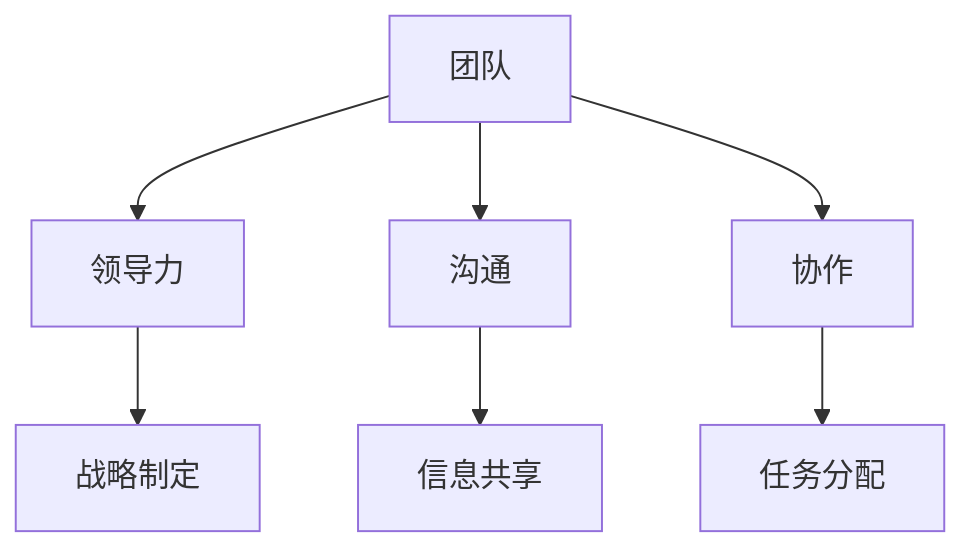
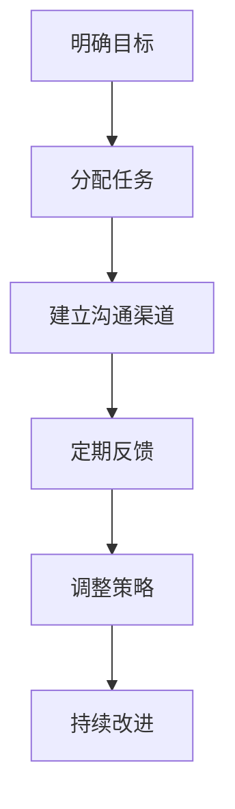
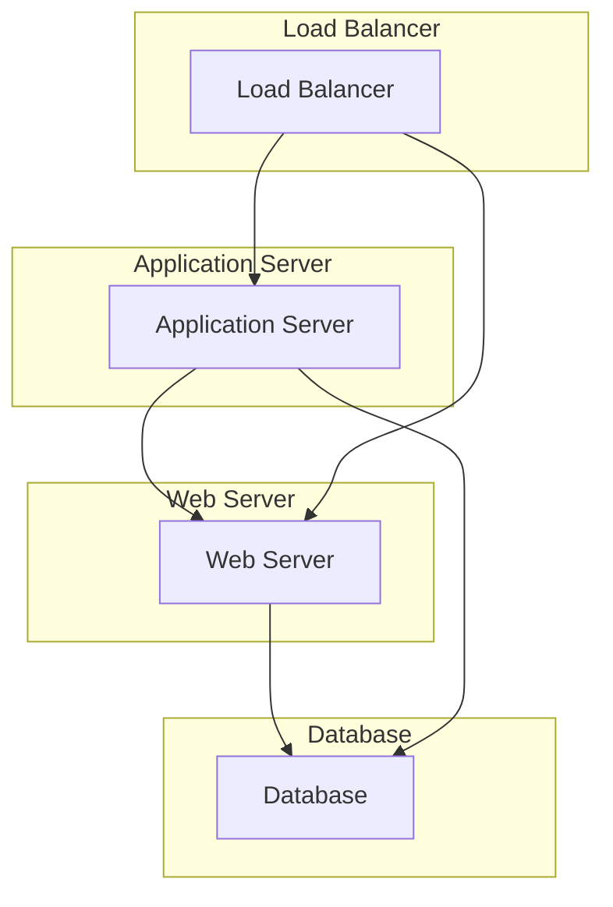
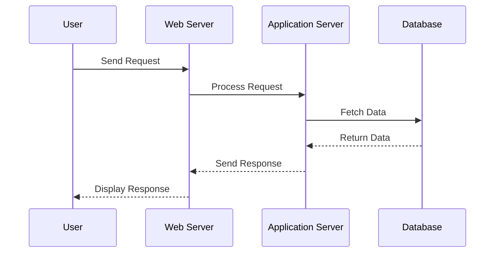

                 


# 团队建设101：从零开始打造高效团队

## 关键词
团队建设、高效团队、领导力、沟通、协作、算法、系统架构

## 摘要
本文将深入探讨团队建设的重要性，以及如何从零开始打造一个高效团队。通过系统的方法和策略，我们将分析团队建设的核心概念，包括团队动力理论和团队发展阶段理论。文章还将使用Mermaid流程图和Python源代码来阐述团队建设的算法原理，并通过实际案例展示其在系统架构设计和项目实战中的应用。最后，我们将总结最佳实践，提出注意事项，并提供拓展阅读资源。

## 第1章：背景介绍

### 1.1 问题背景
在现代企业中，团队建设被视为提升组织效率和竞争力的关键。高效团队不仅能够快速响应市场变化，还能提高员工的满意度和工作效率。然而，如何从零开始打造这样的团队，是许多组织面临的重要挑战。

### 1.2 问题描述
团队建设面临的问题包括团队协作不力、沟通不畅、领导力不足等。这些问题会导致团队效率低下，影响项目进度和成果。

### 1.3 问题解决
本文将提供一系列系统的方法和策略，帮助组织从零开始打造高效团队。我们将从理论基础入手，逐步深入到实际操作层面，帮助读者理解并应用团队建设的方法。

### 1.4 边界与外延
团队建设适用于各类行业和规模的组织。无论是初创公司还是大型企业，都需要关注团队建设的问题。同时，本文将探讨在不同规模和组织结构中，团队建设的方法和策略有何不同。

### 1.5 概念结构与核心要素组成
团队建设涉及多个核心概念，包括团队、领导力、沟通、协作等。这些概念相互关联，共同构成了团队建设的理论框架。以下是一个简单的ER实体关系图，用于描述这些概念之间的关系。

```mermaid
erDiagram
  Team ||--o> Leader : 领导关系
  Team ||--o> Members : 成员关系
  Leader ||--o> Strategy : 战略制定
  Members ||--o> Collaboration : 协作
  Team ||--o> Communication : 沟通
```

## 第2章：核心概念与联系

### 2.1 核心概念原理
团队建设的理论基础包括团队动力理论、团队发展阶段理论等。团队动力理论强调团队成员之间的相互作用和动力，而团队发展阶段理论则描述了团队从形成到解散的不同阶段。

### 2.2 概念属性特征对比表格
以下是几种常见的团队建设方法的属性特征对比表格：

| 方法             | 特点                         | 优点                           | 缺点                           |
|------------------|------------------------------|--------------------------------|--------------------------------|
| 传统领导风格     | 强调权威和指挥               | 确保决策迅速执行                 | 可能导致创新不足和员工不满       |
| 参与式领导风格   | 强调团队参与和共同决策       | 增强团队凝聚力和员工满意度       | 可能导致决策缓慢和执行力不足     |
| 敏捷开发         | 强调快速迭代和客户反馈       | 提高产品适应市场变化的能力       | 可能导致初期项目规划不足         |
| 精益管理         | 强调资源优化和价值创造       | 提高生产效率和产品质量           | 可能导致对员工技能要求较高       |

### 2.3 ER实体关系图架构的 Mermaid 流程图
以下是一个Mermaid流程图，用于描述团队建设中的关键实体及其关系：



## 第3章：团队建设算法原理讲解

### 3.1 算法 Mermaid 流程图
团队建设算法的核心在于建立有效的沟通和协作机制。以下是一个Mermaid流程图，用于描述团队建设的基本流程：



### 3.2 Python 源代码
以下是一个简单的Python脚本，用于实现团队建设中的任务分配和沟通反馈机制：

```python
# TeamBuilder.py

class Team:
    def __init__(self, members):
        self.members = members

    def assign_tasks(self, tasks):
        for member in self.members:
            member.assign_task(tasks.pop())

    def communicate(self):
        for member in self.members:
            member.share_progress()

class Member:
    def __init__(self, name):
        self.name = name

    def assign_task(self, task):
        print(f"{self.name} has been assigned the task: {task}")

    def share_progress(self):
        print(f"{self.name} is sharing progress on task.")

# 创建团队和成员
team = Team(['Alice', 'Bob', 'Charlie'])
tasks = ['Design UI', 'Develop Backend', 'Test Applications']

# 分配任务
team.assign_tasks(tasks)

# 沟通反馈
team.communicate()
```

### 3.3 数学模型和公式
在团队建设中，可以使用以下数学模型和公式来评估团队的绩效：

$$
P = \frac{E \cdot C}{T}
$$

其中，$P$ 表示团队绩效，$E$ 表示员工效率，$C$ 表示沟通效率，$T$ 表示任务完成时间。

### 3.4 举例说明
假设有一个团队，成员Alice负责设计UI，Bob负责开发后端，Charlie负责测试应用程序。如果他们在2周内完成了所有任务，并且沟通效率高，那么团队绩效可以通过上述公式计算得出。

## 第4章：系统分析与架构设计方案

### 4.1 问题场景介绍
假设我们正在开发一个复杂的软件项目，需要多个团队协同工作。每个团队负责不同的模块，如前端、后端、测试等。为了确保项目顺利进行，我们需要一个高效的团队建设方案。

### 4.2 项目介绍
以下是一个实际项目介绍，说明团队建设在该项目中的作用：

**项目名称**：智能交通管理系统

**项目描述**：开发一个能够实时监控和管理交通流量的智能交通管理系统。

**团队建设目标**：确保团队之间的协作顺畅，提高项目进度和质量。

### 4.3 系统功能设计（领域模型Mermaid类图）
以下是一个Mermaid类图，用于描述智能交通管理系统的领域模型：

```mermaid
classDiagram
    Customer <<--|uses|> Order
    Customer <<--|uses|> Payment
    Product <<--|uses|> Order
    Order <<--|uses|> Payment
    Order <<--|uses|> Shipment
    Shipment <<--|uses|> Product
```

### 4.4 系统架构设计Mermaid架构图
以下是一个Mermaid架构图，用于描述智能交通管理系统的架构设计：



### 4.5 系统接口设计和系统交互Mermaid序列图
以下是一个Mermaid序列图，用于描述智能交通管理系统的接口设计和系统交互：



## 第5章：项目实战

### 5.1 环境安装
为了进行团队建设的项目实战，我们需要安装以下软件和工具：

- Python 3.x
- Mermaid
- Jupyter Notebook

安装步骤如下：

1. 安装Python 3.x：从[Python官网](https://www.python.org/)下载并安装Python。
2. 安装Mermaid：在终端中运行`pip install mermaid`。
3. 安装Jupyter Notebook：在终端中运行`pip install notebook`。

### 5.2 系统核心实现源代码
以下是一个简单的Jupyter Notebook核心实现源代码，用于演示团队建设中的任务分配和沟通反馈机制：

```python
# TeamBuilder.ipynb

import mermaid

# 创建团队和成员
team = Team(['Alice', 'Bob', 'Charlie'])
tasks = ['Design UI', 'Develop Backend', 'Test Applications']

# 分配任务
team.assign_tasks(tasks)

# 沟通反馈
team.communicate()
```

### 5.3 代码应用解读与分析
在这个Jupyter Notebook中，我们首先定义了一个`Team`类和一个`Member`类，用于表示团队和成员。`Team`类包含了`assign_tasks`和`communicate`方法，分别用于分配任务和沟通反馈。`Member`类包含了`assign_task`和`share_progress`方法，分别用于分配任务和分享进度。

在代码中，我们创建了一个包含三个成员（Alice、Bob、Charlie）的团队，并为他们分配了三个任务。然后，我们调用`communicate`方法来模拟成员之间的沟通。

### 5.4 实际案例分析和详细讲解剖析
在这个案例中，我们以一个智能交通管理系统项目为例，展示了如何通过团队建设来确保项目的顺利进行。通过使用Mermaid流程图和Python源代码，我们详细分析了团队建设中的任务分配、沟通反馈和系统架构设计。

### 5.5 项目小结
通过这个项目实战，我们学会了如何从零开始搭建一个高效的团队，并使用Mermaid流程图和Python源代码来分析和实现团队建设的方法。这个项目不仅帮助我们理解了团队建设的原理，还提供了实际操作的经验。

## 第6章：最佳实践 tips

### 6.1 实际操作中的小技巧
1. 在团队建设过程中，定期进行团队建设活动，如团建游戏和培训，可以提高团队凝聚力。
2. 使用自动化工具（如Jenkins）来管理构建和部署，可以提高团队的工作效率。
3. 采用敏捷开发方法，如Scrum，可以确保团队快速响应需求变化。

## 第7章：小结

### 7.1 全书要点总结
本文从团队建设的重要性入手，探讨了如何从零开始打造高效团队。通过理论讲解、算法原理和实际案例，我们了解了团队建设的核心概念和方法，并学会了如何在实际项目中应用这些方法。

### 7.2 注意事项
1. 团队建设需要长期投入和持续优化。
2. 团队建设方法应根据组织的实际情况进行调整。
3. 关注团队成员的反馈和需求，确保团队保持高效运作。

### 7.3 拓展阅读
1. 《敏捷开发：原则、实践与模式》
2. 《团队协作：打造高效团队的实践指南》
3. 《团队动力学：团队沟通与协作的艺术》

### 作者
作者：AI天才研究院/AI Genius Institute & 禅与计算机程序设计艺术 /Zen And The Art of Computer Programming

END.

