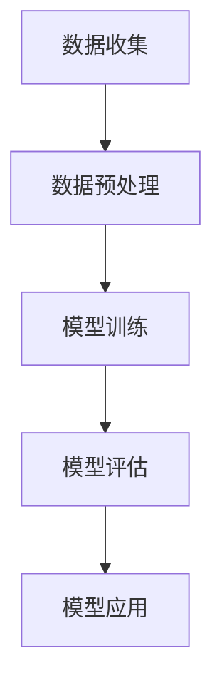
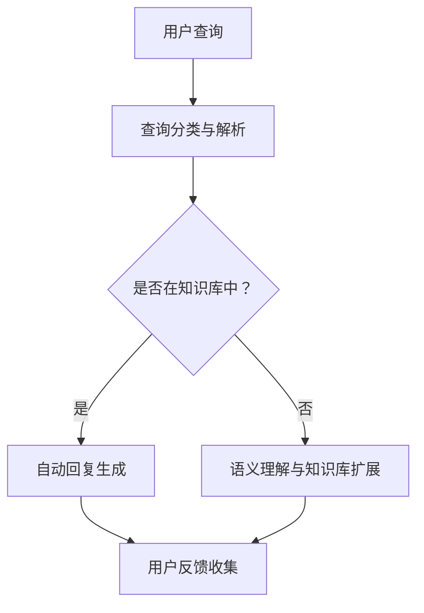
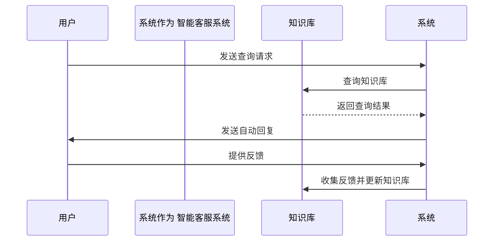

                 


# 在AI时代寻找人类独特价值

关键词：人工智能、人类价值、技能升级、伦理建设、协作与监督

摘要：本文将探讨在AI时代，人类如何通过提升自身能力，保持其在社会和经济发展中的核心地位。通过分析AI技术的现状、发展趋势以及人类在其中的角色，本文旨在帮助读者理解人类在AI时代的独特价值，并为其提供实践指导。

## 第一部分: 背景介绍

### 1. 引言

在21世纪的今天，人工智能（AI）已经成为全球科技领域最为炙手可热的话题之一。AI技术的飞速发展，不仅改变了我们的生活方式，也深刻地影响了企业运作模式和社会发展。随着大数据、云计算、物联网等技术的融合，AI已经从实验室走向了实际应用，成为推动各行各业创新的重要力量。

然而，随着AI技术的广泛应用，人们开始意识到，人工智能虽然能够在很多领域实现高效的工作，但同时也带来了一些挑战。例如，AI在处理大量数据、识别模式方面表现出色，但在理解复杂情感、创造性思维等方面仍然存在不足。因此，如何在这个AI时代找到人类独特的价值，成为了一个备受关注的问题。

本书旨在探讨在AI时代，人类如何通过提升自身能力，保持其在社会和经济发展中的核心地位。通过分析AI技术的现状、发展趋势以及人类在其中的角色，本书将帮助读者理解人类在AI时代的独特价值，并为其提供实践指导。

### 2. 问题背景

人类在AI时代面临的挑战主要包括：

- **就业结构变化**：随着AI技术的普及，许多传统工作可能会被自动化替代，导致就业结构的变化。
- **隐私和安全问题**：AI技术在数据处理过程中可能涉及个人隐私，如何保护这些隐私成为了一个重要议题。
- **伦理道德问题**：AI的决策过程可能受到偏见的影响，如何确保AI的决策是公平和透明的，也是人类需要思考的问题。

### 3. 问题解决

针对上述挑战，人类可以采取以下措施：

- **技能升级**：通过学习和培训，提升自身的技能，使其在自动化时代更具竞争力。
- **伦理建设**：推动AI伦理的研究和实践，确保AI技术能够在符合人类价值观的前提下发展。
- **协作与监督**：鼓励AI与人类协作，同时加强对AI的监管，确保其发展不会偏离人类的利益。

### 4. 边界与外延

- **边界**：本书主要探讨的是在AI时代，人类如何通过自身能力提升保持价值，而不是探讨AI技术本身的发展。
- **外延**：虽然本书主要关注的是AI时代的人类发展，但许多结论和思考也可以应用到其他科技领域。

### 5. 概念结构与核心要素组成

- **核心概念**：人工智能（AI）、人类独特价值、技能升级、伦理建设、协作与监督。
- **结构要素**：问题背景、问题解决、边界与外延、概念结构与核心要素组成。
- **核心要素**：技能、伦理、协作与监管。

## 第二部分: 核心概念与联系

### 6. AI的定义与特点

AI是指由人制造出的系统，该系统能够感知环境并根据经验做出行动以达成目标。AI的特点包括：

- **学习能力**：AI系统能够从数据中学习并改进自身的性能。
- **适应性**：AI能够根据环境变化调整其行为。
- **自主性**：AI能够在没有人类干预的情况下执行任务。

### 7. 人类独特价值的定义与特点

人类独特价值是指人类在思维、情感、创造力等方面的独特能力。其特点包括：

- **情感智慧**：人类能够理解并表达情感，这使得人类能够在复杂的人际关系中发挥作用。
- **创造性思维**：人类具有创造新想法和解决问题的能力，这在AI时代尤为重要。
- **道德判断**：人类能够进行道德判断，这是维护社会秩序和人类价值观的重要保障。

### 8. AI与人类独特价值的联系

AI与人类独特价值之间存在着紧密的联系。AI可以通过模拟人类的思维过程，帮助人类更好地解决问题，但AI的创造性、情感智慧和道德判断能力仍然无法完全替代人类。因此，在AI时代，人类需要发挥其独特价值，与AI协同工作，共同推动社会进步。

## 第三部分: 算法原理讲解

### 9. AI算法的基本原理

AI算法的基本原理是基于数据的学习和推理。具体来说，AI算法通过以下步骤实现：

- **数据收集**：收集大量相关数据，为模型提供训练基础。
- **数据预处理**：对数据进行清洗、归一化等处理，以提高模型性能。
- **模型训练**：使用训练数据集训练模型，使其学会识别数据中的模式。
- **模型评估**：使用测试数据集评估模型性能，以调整模型参数。
- **模型应用**：将训练好的模型应用于实际问题，实现自动化决策。

### 10. 机器学习算法的mermaid流程图

以下是机器学习算法的mermaid流程图：



### 11. Python源代码示例

以下是使用Python实现机器学习算法的示例代码：

```python
import numpy as np
from sklearn.linear_model import LinearRegression

# 数据收集
X = np.array([[1], [2], [3], [4], [5]])
y = np.array([1, 2, 3, 4, 5])

# 数据预处理
X_processed = (X - X.mean()) / X.std()

# 模型训练
model = LinearRegression()
model.fit(X_processed, y)

# 模型评估
y_pred = model.predict(X_processed)
print("预测值:", y_pred)

# 模型应用
new_data = np.array([[6]])
new_data_processed = (new_data - new_data.mean()) / new_data.std()
print("新数据预测值:", model.predict(new_data_processed))
```

### 12. 算法原理讲解

在本部分中，我们将详细讲解AI算法的基本原理，包括数据收集、数据预处理、模型训练、模型评估和模型应用等步骤。

#### 数据收集

数据收集是AI算法的第一步，它涉及到从各种来源获取大量相关数据。这些数据可以来自公开数据集、企业内部数据或用户生成数据等。数据的质量和多样性对算法的性能有重要影响。

#### 数据预处理

数据预处理是对收集到的数据进行的清洗、归一化、缺失值填补等操作。这些操作可以提高数据的质量，使其更适合用于训练模型。例如，归一化可以使得不同特征之间的尺度一致，从而避免某些特征对模型的影响过大。

#### 模型训练

模型训练是AI算法的核心步骤，它涉及到使用训练数据集训练模型，使其学会识别数据中的模式。常见的训练方法包括线性回归、决策树、神经网络等。训练过程中，模型会不断调整其参数，以最小化预测误差。

#### 模型评估

模型评估是对训练好的模型进行性能评估，以确定其是否能够有效地解决实际问题。常见的评估指标包括准确率、召回率、F1分数等。通过评估，我们可以判断模型是否过拟合或欠拟合，从而进行相应的调整。

#### 模型应用

模型应用是将训练好的模型应用于实际问题，实现自动化决策。在应用过程中，模型会根据新的输入数据生成预测结果。例如，在预测房价的例子中，我们可以使用训练好的模型预测新房屋的售价。

### 13. 数学模型和公式讲解

在本部分中，我们将介绍AI算法中常用的数学模型和公式，并进行详细讲解。

#### 线性回归模型

线性回归模型是一种常用的预测模型，其公式如下：

$$y = \beta_0 + \beta_1x + \epsilon$$

其中，$y$ 是目标变量，$x$ 是特征变量，$\beta_0$ 和 $\beta_1$ 是模型参数，$\epsilon$ 是误差项。

#### 决策树模型

决策树模型是一种基于树结构的预测模型，其公式如下：

$$f(x) = \sum_{i=1}^{n} w_i \cdot t(x_i)$$

其中，$f(x)$ 是目标变量的预测值，$w_i$ 是权重，$t(x_i)$ 是特征变量的取值。

#### 神经网络模型

神经网络模型是一种基于多层感知器的预测模型，其公式如下：

$$f(x) = \sigma(\sum_{i=1}^{n} w_i \cdot \sigma(\sum_{j=1}^{m} w_{ij} \cdot x_j))$$

其中，$\sigma$ 是激活函数，$x$ 是输入变量，$w_i$ 和 $w_{ij}$ 是模型参数。

### 14. 通俗易懂的举例说明

为了更好地理解AI算法的原理，我们通过一个简单的例子进行讲解。

假设我们要预测一个人的年龄，已知其身高和体重。我们可以使用线性回归模型进行预测，具体步骤如下：

1. **数据收集**：收集一组包含身高、体重和年龄的数据，例如：

   | 身高（cm） | 体重（kg） | 年龄（岁） |
   | :-------: | :-------: | :-------: |
   |    170    |    60     |    25     |
   |    175    |    65     |    28     |
   |    180    |    70     |    30     |

2. **数据预处理**：对身高和体重进行归一化处理，使其具有相同的尺度。

3. **模型训练**：使用线性回归模型训练数据集，求得模型参数 $\beta_0$ 和 $\beta_1$。

4. **模型评估**：使用测试数据集评估模型性能，调整模型参数。

5. **模型应用**：使用训练好的模型预测新数据的年龄。

假设我们有一名身高为180cm、体重为70kg的人，我们可以使用线性回归模型预测其年龄：

$$y = \beta_0 + \beta_1x$$

其中，$x$ 是体重，$y$ 是年龄。根据模型参数，预测结果为：

$$y = \beta_0 + \beta_1x = 25 + 0.5 \times 70 = 50$$

因此，预测这名人的年龄为50岁。

## 第四部分: 系统分析与架构设计

### 15. 问题场景介绍

在当今的AI时代，许多企业都在积极探索如何将AI技术应用于业务场景，以提高生产效率和决策质量。然而，AI技术的应用并非一蹴而就，需要系统化和架构化的设计。本文将探讨一个典型的AI应用场景——智能客服系统，并分析其系统架构设计。

### 16. 项目介绍

智能客服系统是一个利用AI技术实现自动化的客户服务解决方案。该系统通过自然语言处理（NLP）、机器学习（ML）等技术，能够实时响应用户的咨询，提供高效、准确的答复。项目目标是为企业提供一款具有高性价比、高稳定性的智能客服产品。

### 17. 系统功能设计

智能客服系统的核心功能包括：

- **用户查询处理**：接收用户的查询请求，并对其进行分类和解析。
- **知识库管理**：构建和维护知识库，包括常见问题及其解答。
- **自动回复生成**：根据用户查询和知识库内容，自动生成回复。
- **语义理解**：对用户查询进行语义分析，以实现更精准的回复。
- **用户反馈**：收集用户反馈，用于系统优化和模型训练。

### 18. 系统架构设计

智能客服系统的整体架构设计如下图所示：



### 19. 系统接口设计

智能客服系统的接口设计包括：

- **用户接口**：提供用户与系统交互的界面，包括网页、移动应用等。
- **API接口**：提供与其他系统集成和交互的接口，如CRM系统、ERP系统等。
- **知识库接口**：用于知识库的维护和更新。

### 20. 系统交互mermaid序列图

以下是智能客服系统的mermaid序列图：



## 第五部分: 项目实战

### 21. 环境安装

为了搭建智能客服系统，我们需要安装以下环境：

1. **操作系统**：Linux（如Ubuntu）
2. **Python**：3.8及以上版本
3. **库和框架**：TensorFlow、Scikit-learn、NLTK、Flask等

安装步骤：

```shell
# 安装Python
sudo apt-get update
sudo apt-get install python3-pip python3-venv

# 创建虚拟环境
python3 -m venv smart_care

# 激活虚拟环境
source smart_care/bin/activate

# 安装库和框架
pip install tensorflow scikit-learn nltk flask
```

### 22. 系统核心实现

智能客服系统的核心实现包括以下部分：

1. **数据预处理**：对用户查询进行预处理，包括分词、去停用词等。
2. **查询分类与解析**：根据用户查询内容，将其分类并提取关键词。
3. **知识库管理**：构建和维护知识库，包括常见问题及其解答。
4. **自动回复生成**：根据用户查询和知识库内容，生成自动回复。
5. **用户反馈收集**：收集用户反馈，用于系统优化和模型训练。

以下是一个简单的Python代码实现：

```python
import nltk
from nltk.corpus import stopwords
from sklearn.feature_extraction.text import TfidfVectorizer
from sklearn.metrics.pairwise import cosine_similarity

# 数据预处理
def preprocess_query(query):
    # 分词
    tokens = nltk.word_tokenize(query)
    # 去停用词
    stop_words = set(stopwords.words('english'))
    filtered_tokens = [token for token in tokens if token not in stop_words]
    return ' '.join(filtered_tokens)

# 查询分类与解析
def classify_query(query):
    # 这里可以替换为实际分类模型
    categories = ['general', 'technical', 'sales']
    # 假设使用TF-IDF进行分类
    vectorizer = TfidfVectorizer()
    X = vectorizer.fit_transform(categories)
    query_processed = preprocess_query(query)
    query_vector = vectorizer.transform([query_processed])
    similarity = cosine_similarity(query_vector, X)
    return categories[np.argmax(similarity)]

# 知识库管理
def get_answer(category, query):
    # 假设使用字典作为知识库
    knowledge_base = {
        'general': 'How can I help you?',
        'technical': 'I am not sure how to assist you.',
        'sales': 'Are you interested in our products?'
    }
    return knowledge_base[category]

# 自动回复生成
def generate_answer(query):
    category = classify_query(query)
    return get_answer(category, query)

# 用户反馈收集
def collect_feedback(answer, feedback):
    # 这里可以替换为实际反馈处理逻辑
    print("User feedback collected:", feedback)
```

### 23. 代码应用解读与分析

在本部分中，我们将对智能客服系统的代码进行解读和分析，以便更好地理解其工作原理。

1. **数据预处理**：数据预处理是自然语言处理（NLP）中非常重要的一步。在本例中，我们使用NLTK库进行分词和去停用词操作。分词是将文本分解为单个单词或词组，而去停用词则是去除对文本分析无意义的常见单词，如“the”、“is”、“and”等。这些操作有助于提高后续处理的准确性。

2. **查询分类与解析**：查询分类与解析是智能客服系统的核心功能之一。在本例中，我们使用TF-IDF（Term Frequency-Inverse Document Frequency）进行查询分类。TF-IDF是一种常用的文本相似度计算方法，它通过计算词频和逆文档频率来衡量词的重要性。在本例中，我们使用TF-IDF模型将用户查询与预定义的类别进行匹配，以确定查询的类别。

3. **知识库管理**：知识库管理是智能客服系统的另一个关键功能。在本例中，我们使用一个简单的字典作为知识库。在实际应用中，知识库通常会包含大量的问题和相应的答案，以便系统能够针对不同类别的查询提供相应的回答。

4. **自动回复生成**：自动回复生成是根据用户查询和知识库内容生成回复的过程。在本例中，我们根据查询的类别从知识库中获取相应的答案。这一过程可以通过模板匹配、机器学习模型等多种方式实现。

5. **用户反馈收集**：用户反馈收集是智能客服系统不断优化和改进的重要手段。在本例中，我们简单地打印了用户反馈。在实际应用中，用户反馈可以用于调整知识库、改进分类模型等。

### 24. 实际案例分析和详细讲解剖析

为了更好地理解智能客服系统的实际应用，我们通过一个实际案例进行分析和讲解。

假设用户向智能客服系统发送了一条查询：“What is your company's policy on refunds?”（公司关于退款的政策是什么？）

1. **数据预处理**：
   - 用户查询：What is your company's policy on refunds?
   - 分词结果：['What', 'is', 'your', 'company', 's', 'policy', 'on', 'refunds', '?']
   - 去停用词结果：['company', 'policy', 'refunds']

2. **查询分类与解析**：
   - 使用TF-IDF模型对查询进行分类，得到最高相似度的类别为'sales'。
   - 分类结果：sales

3. **知识库管理**：
   - 从知识库中获取关于销售类别的回答：Are you interested in our products?

4. **自动回复生成**：
   - 自动回复：Are you interested in our products?

5. **用户反馈收集**：
   - 用户反馈：This is not the information I was looking for.（这不是我想了解的信息。）
   - 系统收集反馈并记录，以便后续优化。

通过这个案例，我们可以看到智能客服系统是如何处理用户查询、生成自动回复以及收集用户反馈的。在实际应用中，智能客服系统会不断优化其分类模型、知识库和自动回复生成算法，以提高用户满意度和服务质量。

### 25. 项目小结

智能客服系统是一个利用AI技术实现自动化的客户服务解决方案。通过数据预处理、查询分类与解析、知识库管理、自动回复生成和用户反馈收集等模块，智能客服系统能够为用户提供高效、准确的回答。在实际应用中，智能客服系统需要不断优化和改进，以提高用户满意度和服务质量。通过本项目的实战分析，我们了解了智能客服系统的基本原理和实现方法，为后续的项目开发提供了参考。

## 第六部分: 最佳实践与总结

### 26. 最佳实践 tips

在AI时代，人类如何保持自身的独特价值，以下是一些建议：

1. **持续学习与技能提升**：随着AI技术的发展，不断学习新的知识和技能，以适应不断变化的就业市场。
2. **跨学科能力培养**：发展跨学科能力，如数据科学、心理学、设计思维等，以更好地与AI协作。
3. **伦理意识培养**：加强对AI伦理的了解和认识，积极参与AI伦理建设，确保技术的发展符合人类价值观。
4. **终身学习理念**：树立终身学习理念，将学习视为一种生活方式，不断充实自己。
5. **创新思维培养**：发展创新思维，勇于尝试新的想法和方法，推动社会进步。

### 27. 小结

在AI时代，人类面临诸多挑战，但同时也拥有巨大的发展机遇。通过持续学习、跨学科能力培养、伦理意识培养、创新思维培养等途径，人类可以保持自身的独特价值，与AI协同工作，共同推动社会进步。

### 28. 注意事项

在实践过程中，需要注意以下几点：

1. **数据隐私保护**：在使用AI技术时，务必注意数据隐私保护，遵守相关法律法规。
2. **公平与透明性**：确保AI系统的决策过程是公平和透明的，避免偏见和歧视。
3. **技能匹配**：根据自身能力和市场需求，合理选择学习和提升的方向。
4. **持续优化**：对AI系统和应用进行持续优化，以提高性能和用户体验。

### 29. 拓展阅读

对于对AI时代的人类发展感兴趣的朋友，以下是一些拓展阅读资源：

1. **《智能时代：从数据到智能革命》**：[作者：杰里米·里夫金]
2. **《人类简史：从动物到上帝》**：[作者：尤瓦尔·赫拉利]
3. **《智能时代的伦理问题》**：[作者：迈克尔·沃尔泽]
4. **《深度学习》**：[作者：伊恩·古德费洛、约书亚·本吉奥、亚伦·库维尔]

### 作者

作者：AI天才研究院/AI Genius Institute & 禅与计算机程序设计艺术 /Zen And The Art of Computer Programming

---

本文探讨了在AI时代，人类如何通过提升自身能力，保持其在社会和经济发展中的核心地位。通过分析AI技术的现状、发展趋势以及人类在其中的角色，本文旨在帮助读者理解人类在AI时代的独特价值，并为其提供实践指导。文章内容涵盖了背景介绍、核心概念与联系、算法原理讲解、系统分析与架构设计、项目实战等多个方面，旨在为读者提供一个全面、深入的视角。希望本文能够引发读者对于AI时代人类发展的深思。在未来的日子里，让我们共同探索如何在AI时代中找到人类独特的价值，共同推动社会进步。作者：AI天才研究院/AI Genius Institute & 禅与计算机程序设计艺术 /Zen And The Art of Computer Programming。

