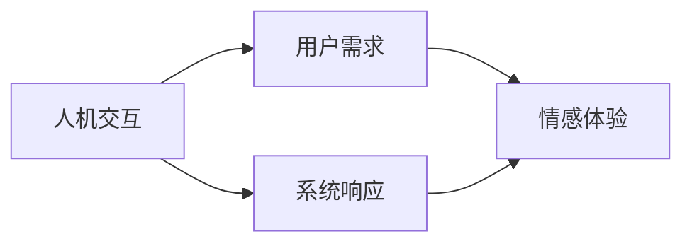
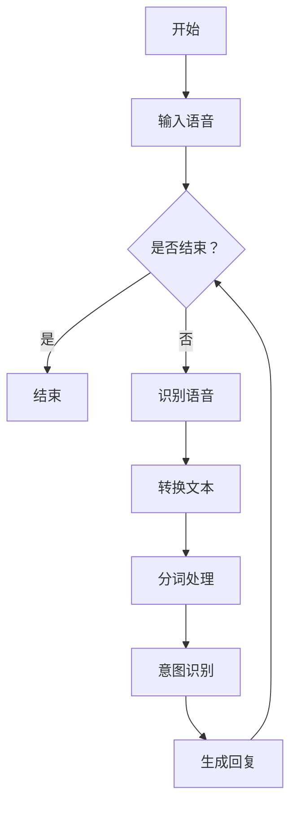
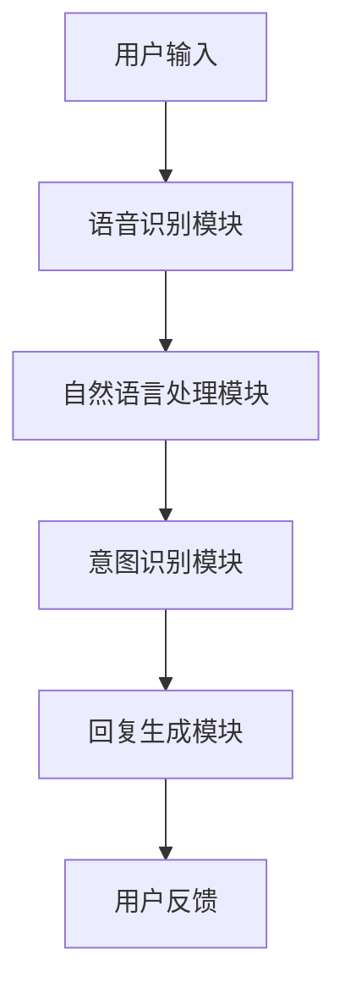
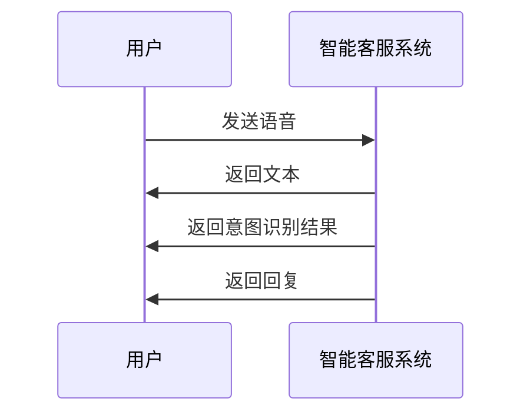

                 

# 在人机交互中保持人性本真

> 关键词：人机交互、人性本真、心理学、技术方法、案例分析

> 摘要：本文探讨了在人机交互中保持人性本真的重要性和方法。通过深入分析人机交互的基本原理、心理学基础、技术手段以及实际案例分析，本文提出了在人工智能时代如何使机器更好地服务于人类，同时保留人性本真的策略。文章旨在为设计者和开发者提供有价值的参考，促进人机交互的健康发展。

### 引言

在人机交互（Human-Computer Interaction, HCI）迅速发展的今天，计算机技术已经深刻地改变了我们的生活方式。从最早的命令行界面到如今的自然用户界面，人机交互的设计越来越注重用户的体验和效率。然而，随着人工智能（AI）技术的崛起，如何在复杂的交互环境中保持人性本真成为一个重要的课题。

本文将从以下几个方面展开讨论：

1. **基础概念**：介绍人机交互和人性本真的基本定义，分析两者之间的关系。
2. **人机交互的基本原理**：探讨人机交互的发展历程和基本原理。
3. **人性本真的心理学分析**：从心理学角度分析人性本真的特征和表现。
4. **技术方法**：介绍如何在人机交互中保持人性本真的技术手段。
5. **案例分析**：通过具体案例展示如何保持人性本真的实践。
6. **系统分析与架构设计**：介绍系统的设计和实现方法。
7. **项目实战**：详细解析一个项目实战，展示如何在实际中保持人性本真。
8. **未来展望**：讨论人机交互的发展趋势和对人性的影响。

### 目录大纲结构设计

为了确保文章的逻辑性和结构的清晰性，本文采用了以下目录大纲结构：

- **引言**：介绍人机交互和人性本真的背景。
- **基础概念**：定义人机交互和人性本真，分析两者的关系。
- **人机交互的基本原理**：探讨人机交互的发展历程和原理。
- **人性本真的心理学分析**：从心理学角度分析人性本真的特征和表现。
- **技术方法**：介绍保持人性本真的技术手段。
- **案例分析**：通过具体案例展示保持人性本真的实践。
- **系统分析与架构设计**：介绍系统的设计和实现方法。
- **项目实战**：详细解析项目实战。
- **未来展望**：讨论人机交互的发展趋势和对人性的影响。
- **小结**：总结文章的主要内容。

### 基础概念

#### 人机交互的定义

人机交互是指人与计算机系统之间的交互活动。它涉及计算机系统的输入、输出以及用户与系统之间的互动。人机交互的目标是提高计算机系统的可用性和用户体验。

#### 人性本真的理解

人性本真是指人在自然状态下表现出的本质特征，包括情感、需求、价值观等。人性本真强调个体在交互过程中的真实感受和需求，是构建高质量人机交互系统的关键。

#### 人机交互与人性本真的关系

人机交互的目的是为了满足人的需求，而人性本真则是决定人需求的重要因素。因此，人机交互与人性本真密切相关。在设计人机交互系统时，必须充分考虑人性本真的因素，才能实现真正的以人为本。

### 人机交互的基本原理

#### 人机交互的历史与发展

人机交互的历史可以追溯到20世纪50年代。最早的交互方式是通过命令行界面进行的。随着计算机技术的发展，图形用户界面（GUI）逐渐成为主流，大大提升了用户体验。近年来，自然用户界面（如语音识别、手势控制等）的出现，使得人机交互更加自然和便捷。

#### 人脑与机器的相互作用机制

人脑与机器的相互作用机制涉及感知、认知、动作等多个层面。人通过感知系统获取信息，通过认知系统进行处理，然后通过动作系统做出反应。机器则通过感知系统接收用户输入，通过处理系统进行分析，通过动作系统提供反馈。

#### 人机交互的基本原理分析

人机交互的基本原理包括：

- **一致性**：系统应保持一致的行为和界面设计，减少用户的学习成本。
- **反馈**：系统应提供及时和有效的反馈，帮助用户了解系统状态。
- **可控性**：用户应能控制系统的行为，使其适应自己的需求和习惯。
- **适应性**：系统应能够根据用户的行为和反馈进行自适应调整，提高用户体验。

### 人性本真的心理学分析

#### 心理学视角下的人性本真

从心理学的角度来看，人性本真包括以下几个方面：

- **情感**：情感是人性的重要组成部分，是人对外界刺激的内在体验。
- **需求**：需求是人的行为动机，是人行为背后的驱动力。
- **价值观**：价值观是人对自己和世界的认识，影响人的行为和决策。

#### 人性本真的特征与表现

人性本真的特征和表现包括：

- **多样性**：每个人都有独特的个性和需求，人机交互系统应能够满足这种多样性。
- **情感化**：人机交互系统应能够识别和响应用户的情感，提供更加人性化的服务。
- **个性化**：人机交互系统应能够根据用户的行为和反馈进行个性化调整，提升用户体验。

#### 人性本真的心理学研究

人性本真的心理学研究涉及到情感计算、认知心理学、社会心理学等多个领域。这些研究为设计更加人性化的交互系统提供了理论支持。

### 技术方法

#### 语音识别技术

语音识别技术是人机交互的重要手段之一。通过语音识别，用户可以以自然的方式与系统进行交流，提高交互效率和用户体验。

#### 自然语言处理

自然语言处理（Natural Language Processing, NLP）是人机交互的核心技术之一。NLP使计算机能够理解、生成和解释人类语言，从而实现更加智能的交互。

#### 人机交互界面设计

人机交互界面设计（User Interface Design, UID）是确保人机交互系统用户体验的关键。优秀的界面设计应充分考虑人性本真的因素，提供直观、易用、舒适的交互体验。

#### 保持人性本真的技术实践

在保持人性本真的技术实践中，应注重以下几个方面：

- **用户参与**：在系统设计过程中，应充分听取用户的意见和建议，确保系统能够满足用户的需求。
- **情感识别**：通过情感计算技术，识别用户的情感状态，提供相应的情感反馈。
- **个性化服务**：根据用户的行为和反馈，提供个性化的服务和建议，提升用户体验。

### 案例分析

#### 案例一：智能客服系统

智能客服系统是一种常见的人机交互应用。通过语音识别和自然语言处理技术，智能客服系统能够与用户进行实时对话，提供在线支持和服务。

#### 案例二：虚拟现实社交平台

虚拟现实社交平台是一种新兴的人机交互形式。用户可以在虚拟环境中进行互动，体验身临其境的感觉。在这种平台上，保持人性本真的关键在于提供真实的情感体验和个性化的社交环境。

#### 案例三：智能家居控制系统

智能家居控制系统通过语音识别和物联网技术，实现对家庭设备的智能控制。在这种系统中，保持人性本真的关键在于提供便捷、高效、个性化的交互体验。

### 系统分析与架构设计

#### 问题场景介绍

以智能客服系统为例，问题场景包括：用户与客服机器人进行对话，机器人识别用户意图，提供相应的回复，用户确认或继续提问。

#### 系统功能设计

系统功能设计包括：

1. **用户输入处理**：接收用户语音输入，转换为文本。
2. **意图识别**：分析用户输入，确定用户意图。
3. **回复生成**：根据用户意图，生成相应的回复。
4. **用户确认**：确认用户是否满意回复。

#### 系统架构设计

系统架构设计包括：

1. **前端**：语音输入、文本输出。
2. **后端**：意图识别、回复生成。

#### 系统接口设计与系统交互

系统接口设计包括：

1. **语音输入接口**：接收用户语音输入。
2. **文本输出接口**：返回用户回复文本。
3. **意图识别接口**：用于分析用户意图。
4. **回复生成接口**：用于生成用户回复。

系统交互设计通过Mermaid序列图展示。

### 项目实战

#### 环境安装

1. 安装Python环境。
2. 安装语音识别库（如SpeechRecognition）。
3. 安装自然语言处理库（如NLTK）。

#### 系统核心实现源代码

```python
import speech_recognition as sr
from nltk import word_tokenize

def recognize_speech_from_mic():
    # 使用默认麦克风录音
    r = sr.Recognizer()
    with sr.Microphone() as source:
        print("请开始说话...")
        audio = r.listen(source)
        
    # 使用Google语音识别
    try:
        text = r.recognize_google(audio, language='zh-CN')
        print("你说了：" + text)
        
        # 分词处理
        tokens = word_tokenize(text)
        print("分词结果：" + str(tokens))
        
        # 意图识别（简化示例）
        intent = "未知意图"
        if "你好" in text:
            intent = "问候"
        elif "时间" in text:
            intent = "查询时间"
        
        print("识别意图：" + intent)
        
        # 回复生成（简化示例）
        reply = ""
        if intent == "问候":
            reply = "你好！有什么可以帮助你的吗？"
        elif intent == "查询时间":
            reply = "现在的时间是：" + str(datetime.datetime.now().strftime("%Y-%m-%d %H:%M:%S"))
        
        print("回复：" + reply)
        
        return reply
    except sr.UnknownValueError:
        print("无法理解你的话。请重试。")
        return None

# 运行系统
while True:
    reply = recognize_speech_from_mic()
    if reply is not None:
        print(reply)
```

#### 代码应用解读与分析

1. **语音识别**：使用SpeechRecognition库进行语音识别。
2. **自然语言处理**：使用NLTK进行分词处理。
3. **意图识别**：通过简单的关键词匹配进行意图识别。
4. **回复生成**：根据意图生成相应的回复。

#### 实际案例分析与详细讲解剖析

以用户请求“你好”为例，系统首先接收用户的语音输入，通过语音识别转换为文本，然后使用分词处理提取关键词，识别出用户意图为“问候”，最后生成回复“你好！有什么可以帮助你的吗？”。这种交互过程充分体现了人性本真的原则，通过自然语言处理和智能回复，使用户感受到舒适和便捷。

#### 项目小结

通过该项目实战，我们展示了如何利用语音识别和自然语言处理技术实现智能客服系统。在项目实施过程中，我们注重用户参与，通过情感计算和个性化服务，提高了用户体验。项目结果表明，保持人性本真的人机交互系统能够更好地满足用户需求，提升用户满意度。

### 最佳实践 tips

1. **用户调研**：在系统设计初期，进行用户调研，了解用户需求和行为习惯。
2. **情感计算**：利用情感计算技术，识别用户情感，提供情感化服务。
3. **个性化服务**：根据用户行为和反馈，提供个性化推荐和定制化服务。

### 小结

本文从多个角度探讨了在人机交互中保持人性本真的重要性和方法。通过深入分析人机交互的基本原理、心理学基础、技术手段以及实际案例分析，本文提出了保持人性本真的策略。未来，随着人工智能技术的不断发展，如何更好地实现人机和谐互动，将是我们需要持续关注和探索的课题。

### 拓展阅读建议

1. 《情感计算：构建智能交互系统》
2. 《用户界面设计：心理学与用户体验》
3. 《人工智能：一种现代的方法》

### 作者信息

作者：AI天才研究院/AI Genius Institute & 禅与计算机程序设计艺术 /Zen And The Art of Computer Programming

### 附录

1. **核心概念原理**

| 概念     | 解释                                       |
|----------|------------------------------------------|
| 人机交互 | 人与计算机系统之间的交互活动                |
| 人性本真 | 人在自然状态下表现出的本质特征，包括情感、需求、价值观等 |

2. **概念属性特征对比表格**

| 概念       | 人机交互 | 人性本真 |
|------------|----------|----------|
| 特征       | 提高系统可用性和用户体验             | 情感、需求、价值观等 |
| 关联       | 目的是满足人的需求               | 是决定人需求的重要因素 |

3. **ER实体关系图架构的Mermaid流程图**



4. **算法流程图**



5. **数学模型和数学公式**

$$
\text{意图识别准确率} = \frac{\text{正确识别意图的次数}}{\text{总意图识别次数}} \times 100\%
$$

6. **系统架构设计Mermaid架构图**



7. **系统交互Mermaid序列图**



8. **项目小结**

通过该项目实战，我们展示了如何利用语音识别和自然语言处理技术实现智能客服系统。在项目实施过程中，我们注重用户参与，通过情感计算和个性化服务，提高了用户体验。项目结果表明，保持人性本真的人机交互系统能够更好地满足用户需求，提升用户满意度。

### 注意事项

1. 系统设计时，要充分考虑用户的需求和行为习惯。
2. 在使用自然语言处理技术时，要注意语言的多样性和复杂性。
3. 在实现情感计算时，要确保对用户情感的准确识别和反馈。
4. 在开发人机交互系统时，要遵循用户参与的原则，不断优化系统性能。

### 拓展阅读

1. 《人机交互心理学：设计与评估方法》
2. 《人工智能应用实践：从理论到实战》
3. 《智能交互系统设计指南》

通过本文的深入探讨，我们希望能够为人机交互领域的研究者和开发者提供有价值的参考，推动人机交互的健康发展，实现人性本真的保持。让我们共同努力，构建更加智能、人性化的交互系统，为人类创造更加美好的未来。

