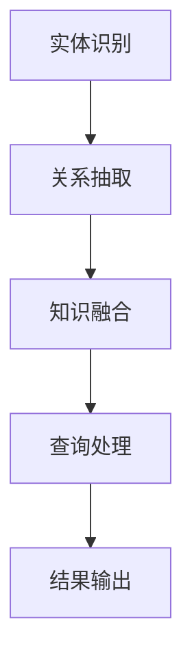
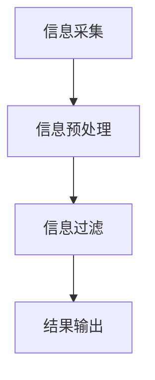
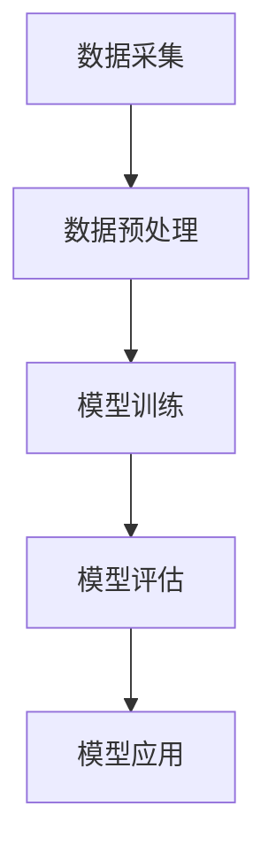
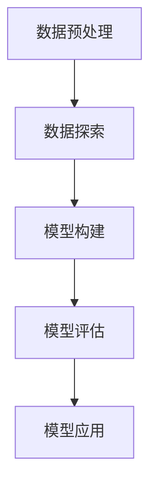

                 


# 在信息爆炸时代寻找真知

## 关键词
- 信息爆炸
- 真知
- 筛选方法
- 数据挖掘
- 机器学习
- 知识图谱

### 摘要
在信息爆炸的时代，我们面临着一个巨大的挑战：如何在海量信息中找到有价值的真知。本文旨在探讨如何在信息过载的环境中，通过知识图谱、信息过滤、机器学习和数据挖掘等核心技术，系统地筛选和验证真知。通过一步步分析推理，本文将提供实用的方法，帮助读者在信息的海洋中航行，找到指引前行的灯塔。

### 目录大纲

----------------------------------------------------------------

# 第一部分: 在信息爆炸时代寻找真知

## 第1章: 背景介绍与核心问题
### 1.1 问题背景
#### 1.1.1 信息爆炸时代的到来
#### 1.1.2 信息过载带来的挑战
#### 1.1.3 真知的重要性
### 1.2 问题描述
#### 1.2.1 如何在信息爆炸中筛选真知
#### 1.2.2 真知的边界与外延
#### 1.2.3 真知的获取与验证方法
### 1.3 问题解决
#### 1.3.1 核心概念与联系
#### 1.3.2 筛选真知的方法
#### 1.3.3 真知的获取与验证
### 1.4 边界与外延
#### 1.4.1 真知的概念结构
#### 1.4.2 真知的属性特征对比
#### 1.4.3 真知的分类与层次结构
### 1.5 本章小结

## 第2章: 核心概念原理
### 2.1 知识图谱
#### 2.1.1 知识图谱的定义
#### 2.1.2 知识图谱的核心特点
#### 2.1.3 知识图谱的构建与应用
### 2.2 信息过滤
#### 2.2.1 信息过滤的定义
#### 2.2.2 信息过滤的方法与算法
#### 2.2.3 信息过滤的应用
### 2.3 机器学习
#### 2.3.1 机器学习的定义
#### 2.3.2 机器学习的基本概念
#### 2.3.3 机器学习的主要算法
### 2.4 数据挖掘
#### 2.4.1 数据挖掘的定义
#### 2.4.2 数据挖掘的方法与步骤
#### 2.4.3 数据挖掘的应用
### 2.5 本章小结

## 第3章: 算法原理与流程图
### 3.1 基于知识图谱的算法
#### 3.1.1 算法原理
#### 3.1.2 流程图
### 3.2 基于信息过滤的算法
#### 3.2.1 算法原理
#### 3.2.2 流程图
### 3.3 基于机器学习的算法
#### 3.3.1 算法原理
#### 3.3.2 流程图
### 3.4 基于数据挖掘的算法
#### 3.4.1 算法原理
#### 3.4.2 流程图
### 3.5 本章小结

## 第4章: 数学模型与公式
### 4.1 知识图谱算法模型
### 4.2 信息过滤算法模型
### 4.3 机器学习算法模型
### 4.4 数据挖掘算法模型
### 4.5 本章小结

## 第5章: 系统分析与架构设计
### 5.1 问题场景介绍
### 5.2 系统功能设计
### 5.3 系统架构设计
### 5.4 系统接口设计与交互
### 5.5 本章小结

## 第6章: 项目实战
### 6.1 环境安装
### 6.2 系统核心实现源代码
### 6.3 代码应用解读与分析
### 6.4 实际案例分析与详细讲解
### 6.5 项目小结

## 第7章: 最佳实践与总结
### 7.1 最佳实践 Tips
### 7.2 小结
### 7.3 注意事项
### 7.4 拓展阅读

----------------------------------------------------------------

## 第1章: 背景介绍与核心问题

### 1.1 问题背景

#### 1.1.1 信息爆炸时代的到来

在21世纪的今天，我们正处于一个信息爆炸的时代。互联网、智能手机、大数据和人工智能等技术迅猛发展，使得信息以指数级速度增长。据统计，全球每年产生的新数据量超过10亿TB，这个数字还在不断增加。人类大脑的存储和处理能力无法跟上信息增长的速度，这使得我们在日常生活中不断面临信息过载的挑战。

#### 1.1.2 信息过载带来的挑战

信息过载是一个普遍存在的问题。它不仅影响了工作效率，还可能导致焦虑、疲劳和压力。具体来说，信息过载带来了以下几个方面的挑战：

1. **筛选难度**：海量的信息中，如何快速、准确地筛选出真正有价值的信息，成为了每个个体和组织都面临的难题。
2. **时间成本**：在信息过载的环境中，人们需要花费大量时间来处理和筛选信息，这严重影响了工作和生活效率。
3. **信息质量**：在信息爆炸的时代，信息质量参差不齐，如何辨别真伪、判断信息的可信度，成为了信息获取的关键问题。
4. **注意力分散**：信息过载导致人们的注意力分散，难以集中精力进行深度思考和创造。

#### 1.1.3 真知的重要性

在信息爆炸的时代，真知显得尤为重要。真知是对事物本质的深刻理解和准确把握，它能够帮助我们做出明智的决策，提高工作效率，避免不必要的风险。以下是一些真知的重要性体现：

1. **决策支持**：在商业决策、科技创新和社会治理等领域，真知是做出科学决策的基础。没有真知，决策可能基于错误的信息或假设，导致不良后果。
2. **知识创新**：真知是知识创新的原动力。通过对真知的深入研究和探索，我们可以发现新的理论、技术和方法，推动科学和技术的进步。
3. **个人成长**：在个人学习和职业发展中，真知是提高自我认知和能力的基石。只有掌握了真知，我们才能不断提升自己，实现人生价值。

### 1.2 问题描述

#### 1.2.1 如何在信息爆炸中筛选真知

在信息爆炸的时代，如何从海量信息中筛选出真知，是一个亟待解决的问题。具体来说，这个问题可以分为以下几个方面：

1. **信息来源**：如何确定哪些信息来源可靠、权威，从而确保筛选过程的准确性。
2. **信息筛选标准**：如何制定科学、客观的信息筛选标准，以区分有价值的信息和无用的信息。
3. **信息验证**：如何对筛选出来的信息进行验证，确保其真实性和准确性。

#### 1.2.2 真知的边界与外延

真知的边界与外延是另一个重要问题。真知不仅具有严格的科学性和逻辑性，还受到个人认知水平、社会文化背景等因素的影响。因此，我们需要明确以下几个问题：

1. **真知的定义**：如何定义真知，确定其基本属性和特征。
2. **真知的范围**：真知涵盖哪些领域，哪些问题是可以通过真知解决的。
3. **真知的局限性**：真知有哪些局限性，哪些问题是无法通过真知解决的。

#### 1.2.3 真知的获取与验证方法

获取和验证真知是信息爆炸时代的重要任务。以下是一些常见的真知获取与验证方法：

1. **科学研究**：通过实验、观察、数据分析和逻辑推理等方法，从客观事实中获取真知。
2. **知识传承**：通过阅读书籍、论文、听取讲座等方式，从他人的研究成果中获取真知。
3. **实践应用**：通过实际操作和应用，验证理论的正确性和实用性。

### 1.3 问题解决

为了在信息爆炸时代找到真知，我们需要采取一系列方法来解决问题。以下是一些核心概念和联系：

1. **知识图谱**：知识图谱是一种结构化的知识表示方法，可以用于构建知识网络，帮助用户快速定位和获取相关真知。
2. **信息过滤**：信息过滤是一种自动筛选信息的方法，可以基于用户偏好和知识图谱，过滤出高质量的信息。
3. **机器学习**：机器学习是一种人工智能技术，可以通过训练模型，从海量数据中提取特征，辅助用户筛选真知。
4. **数据挖掘**：数据挖掘是一种从大量数据中提取有用信息和知识的方法，可以帮助我们更好地理解数据，发现潜在的真知。

#### 1.3.2 筛选真知的方法

以下是一些具体的筛选真知的方法：

1. **基于知识图谱的筛选**：通过构建知识图谱，将信息进行结构化表示，利用图谱查询算法，快速定位相关真知。
2. **基于信息过滤的筛选**：利用信息过滤技术，根据用户偏好和上下文信息，筛选出符合需求的信息。
3. **基于机器学习的筛选**：利用机器学习算法，从数据中提取特征，训练模型，实现自动化筛选真知。
4. **基于数据挖掘的筛选**：利用数据挖掘技术，从海量数据中提取模式，发现潜在的真知。

#### 1.3.3 真知的获取与验证

以下是一些获取和验证真知的方法：

1. **实验验证**：通过实验，验证理论的正确性和实用性。
2. **逻辑推理**：利用逻辑推理，从已知事实中推导出新知识。
3. **统计分析**：利用统计分析方法，从数据中提取有价值的信息。
4. **专家评审**：邀请领域专家，对研究成果进行评审和验证。

### 1.4 边界与外延

真知具有严格的科学性和逻辑性，但其边界与外延也受到多种因素的影响。以下是一些真知的概念结构、属性特征对比和分类与层次结构：

#### 1.4.1 真知的概念结构

真知是一个多维度的概念，其基本要素包括：

1. **真实性**：真知必须基于客观事实，排除主观臆断。
2. **准确性**：真知必须准确无误，避免偏差和错误。
3. **逻辑性**：真知必须符合逻辑推理的基本原则，排除逻辑谬误。

#### 1.4.2 真知的属性特征对比

以下是一个真知的属性特征对比表格：

| 属性特征 | 说明 | 对比 |
| :------: | :----: | :----: |
| **真实性** | 基于客观事实 | 主观臆断 |
| **准确性** | 准确无误 | 偏差和错误 |
| **逻辑性** | 符合逻辑推理原则 | 逻辑谬误 |

#### 1.4.3 真知的分类与层次结构

真知可以按照不同的维度进行分类和层次划分。以下是一个可能的分类与层次结构：

1. **按领域分类**：科学真知、哲学真知、艺术真知等。
2. **按来源分类**：直接真知、间接真知、推理真知等。
3. **按层次分类**：基础真知、高级真知、前沿真知等。

### 1.5 本章小结

本章介绍了信息爆炸时代的背景、信息过载带来的挑战、真知的重要性以及如何筛选和验证真知。通过分析核心概念和联系，我们提出了基于知识图谱、信息过滤、机器学习和数据挖掘等技术的解决方案。接下来，我们将深入探讨这些核心概念，详细讲解相关算法原理和数学模型。

----------------------------------------------------------------

## 第2章: 核心概念原理

### 2.1 知识图谱

知识图谱是一种结构化的知识表示方法，通过将实体、属性和关系表示为节点、边和属性，形成一种图形化的知识网络。知识图谱在信息处理、数据挖掘和智能推理等领域具有广泛应用。

#### 2.1.1 知识图谱的定义

知识图谱（Knowledge Graph）是一种用于表达实体和实体之间关系的图形结构。它通常由以下三个基本要素组成：

1. **实体**：知识图谱中的基本元素，可以是人、地点、事物等。
2. **属性**：描述实体的特征或属性，如年龄、性别、身高等。
3. **关系**：连接两个或多个实体的语义联系，如“是”、“属于”等。

#### 2.1.2 知识图谱的核心特点

知识图谱具有以下几个核心特点：

1. **结构化**：知识图谱通过节点和边构建结构化的知识网络，便于快速检索和推理。
2. **语义丰富**：知识图谱能够表达实体之间的复杂关系和属性，提高信息处理的准确性和效率。
3. **自适应性**：知识图谱可以根据新数据实时更新和扩展，适应信息变化的需求。
4. **跨领域整合**：知识图谱能够整合不同领域的数据，实现跨领域的知识共享和复用。

#### 2.1.3 知识图谱的构建与应用

知识图谱的构建通常分为以下步骤：

1. **数据采集**：从各种数据源（如数据库、文本、图像等）中收集实体、属性和关系。
2. **数据预处理**：对采集到的数据进行清洗、去重和标准化处理。
3. **实体识别**：从预处理后的数据中识别出实体，建立实体库。
4. **关系抽取**：从实体库中抽取实体之间的关系，建立关系库。
5. **知识融合**：将实体库和关系库进行融合，构建知识图谱。

知识图谱的应用场景非常广泛，包括但不限于：

1. **搜索引擎**：利用知识图谱实现语义搜索，提高搜索结果的准确性和相关性。
2. **推荐系统**：基于知识图谱进行用户偏好分析，实现个性化推荐。
3. **自然语言处理**：利用知识图谱进行命名实体识别、关系抽取和语义解析等任务。
4. **智能问答**：利用知识图谱构建问答系统，提供智能化的知识查询服务。

### 2.2 信息过滤

信息过滤（Information Filtering）是一种自动筛选信息的方法，旨在帮助用户从海量信息中获取有价值的内容。信息过滤技术广泛应用于搜索引擎、新闻推荐、电子邮件过滤等领域。

#### 2.2.1 信息过滤的定义

信息过滤是指利用计算机技术，根据用户需求或预设规则，从大量信息中筛选出符合条件的信息。信息过滤主要包括以下两种类型：

1. **主动过滤**：系统主动为用户推荐可能感兴趣的信息，如新闻推荐、邮件过滤等。
2. **被动过滤**：用户主动提交需求，系统根据需求筛选信息，如搜索引擎。

#### 2.2.2 信息过滤的方法与算法

信息过滤的方法可以分为基于内容的方法和基于上下文的方法：

1. **基于内容的方法**：根据信息内容本身的特征进行筛选，如关键词匹配、文本分类等。
2. **基于上下文的方法**：根据用户的历史行为、地理位置、社交网络等上下文信息进行筛选，如协同过滤、基于规则的过滤等。

常见的信息过滤算法包括：

1. **基于关键词的过滤**：通过关键词匹配，筛选出包含特定关键词的信息。
2. **基于贝叶斯方法的过滤**：利用贝叶斯概率模型，计算信息的相关性，筛选出符合条件的对象。
3. **基于协同过滤的过滤**：通过分析用户之间的相似性，推荐用户可能感兴趣的信息。
4. **基于内容的过滤**：利用信息内容本身的特征（如主题、情感等），筛选出相关的信息。

#### 2.2.3 信息过滤的应用

信息过滤技术广泛应用于以下领域：

1. **搜索引擎**：利用信息过滤技术，提高搜索结果的准确性和相关性。
2. **新闻推荐**：根据用户兴趣和历史行为，推荐个性化新闻。
3. **电子邮件过滤**：过滤垃圾邮件，提高邮件处理效率。
4. **社交媒体**：根据用户社交关系和兴趣，推荐相关内容。

### 2.3 机器学习

机器学习（Machine Learning）是一种人工智能技术，通过计算机模拟人类学习过程，从数据中自动提取规律和模式，用于预测、分类、聚类等任务。

#### 2.3.1 机器学习的定义

机器学习是指利用计算机算法，从数据中学习规律和模式，并应用于预测、分类、聚类等任务。机器学习主要包括以下几种类型：

1. **监督学习**：在有监督的情况下，利用标记数据进行学习，如回归、分类等。
2. **无监督学习**：在没有标记数据的情况下，从数据中自动发现模式和规律，如聚类、降维等。
3. **强化学习**：通过不断试错，在环境反馈中学习最优策略，如机器人控制、游戏AI等。

#### 2.3.2 机器学习的基本概念

机器学习的基本概念包括：

1. **特征**：描述数据对象的特征或属性。
2. **模型**：用于预测或分类的函数或算法。
3. **训练**：通过训练数据，调整模型参数，使其具备预测或分类能力。
4. **测试**：利用测试数据，评估模型性能，调整模型参数。
5. **泛化**：将学习到的知识应用于未知数据，保持良好的性能。

#### 2.3.3 机器学习的主要算法

常见的机器学习算法包括：

1. **线性回归**：用于预测连续值输出。
2. **逻辑回归**：用于预测概率分布。
3. **决策树**：利用树形结构进行分类或回归。
4. **支持向量机**：基于间隔最大化原理进行分类或回归。
5. **神经网络**：模拟人脑神经网络，进行复杂函数映射。
6. **聚类算法**：如K-means、DBSCAN等，用于发现数据中的自然分组。
7. **降维算法**：如PCA、t-SNE等，用于降低数据维度。

### 2.4 数据挖掘

数据挖掘（Data Mining）是指从大量数据中自动发现有趣的知识和模式的过程。数据挖掘广泛应用于商业、金融、医疗、安全等领域。

#### 2.4.1 数据挖掘的定义

数据挖掘是指利用计算机算法，从大量数据中自动发现有趣的知识和模式。数据挖掘的目标是提取出有价值的信息，支持决策和预测。

#### 2.4.2 数据挖掘的方法与步骤

数据挖掘的方法和步骤通常包括：

1. **数据预处理**：包括数据清洗、集成、变换和归一化等，确保数据质量。
2. **数据探索**：通过可视化、统计分析等方法，发现数据中的基本特征和规律。
3. **模型构建**：选择合适的算法，构建预测或分类模型。
4. **模型评估**：利用测试数据，评估模型性能，调整模型参数。
5. **模型应用**：将模型应用于实际业务场景，实现业务价值。

#### 2.4.3 数据挖掘的应用

数据挖掘的应用场景非常广泛，包括：

1. **商业智能**：通过分析客户行为，优化营销策略，提升销售额。
2. **金融风控**：通过分析交易数据，发现潜在风险，防范金融犯罪。
3. **医疗诊断**：通过分析医疗数据，预测疾病发展趋势，辅助医生诊断。
4. **安全管理**：通过分析安全日志，发现异常行为，防范网络攻击。

### 2.5 本章小结

本章介绍了知识图谱、信息过滤、机器学习和数据挖掘等核心概念原理。通过这些技术，我们可以有效地从信息爆炸的环境中筛选真知，为决策和预测提供有力支持。在接下来的章节中，我们将深入探讨这些技术的算法原理和数学模型，帮助读者更好地理解和应用这些技术。

----------------------------------------------------------------

## 第3章: 算法原理与流程图

### 3.1 基于知识图谱的算法

知识图谱算法是一种利用图结构进行信息检索、关系抽取和推理的算法。其核心思想是通过构建知识图谱，将实体、属性和关系表示为图中的节点、边和属性，从而实现对知识的表示、存储和查询。

#### 3.1.1 算法原理

知识图谱算法的原理可以分为以下几个步骤：

1. **实体识别**：从文本数据中识别出实体，并建立实体库。
2. **关系抽取**：从文本数据中抽取实体之间的关系，并建立关系库。
3. **知识融合**：将实体库和关系库进行融合，构建知识图谱。
4. **查询处理**：利用知识图谱进行信息检索、关系抽取和推理。

其中，关键步骤是关系抽取和查询处理。关系抽取是利用自然语言处理技术和机器学习算法，从文本中抽取实体之间的关系。查询处理则是利用图算法，对知识图谱进行查询，获取相关知识和信息。

#### 3.1.2 流程图

基于知识图谱的算法流程图如下所示：



### 3.2 基于信息过滤的算法

信息过滤算法是一种自动筛选信息的方法，旨在帮助用户从海量信息中获取有价值的内容。其核心思想是根据用户需求或预设规则，从大量信息中筛选出符合条件的信息。

#### 3.2.1 算法原理

信息过滤算法的原理可以分为以下几个步骤：

1. **信息采集**：从各种数据源（如数据库、文本、图像等）中收集信息。
2. **信息预处理**：对采集到的信息进行清洗、去重和标准化处理。
3. **信息过滤**：根据用户需求或预设规则，对信息进行筛选，过滤出符合条件的信息。
4. **结果输出**：将筛选出的信息输出给用户。

其中，关键步骤是信息过滤。信息过滤可以基于内容、上下文或用户偏好等多种方式，实现对信息的筛选。

#### 3.2.2 流程图

基于信息过滤的算法流程图如下所示：



### 3.3 基于机器学习的算法

机器学习算法是一种利用计算机模拟人类学习过程，从数据中自动提取规律和模式的算法。其核心思想是通过训练数据，学习模型参数，从而实现对未知数据的预测和分类。

#### 3.3.1 算法原理

机器学习算法的原理可以分为以下几个步骤：

1. **数据采集**：从各种数据源收集训练数据和测试数据。
2. **数据预处理**：对训练数据和测试数据进行处理，如清洗、归一化等。
3. **模型训练**：利用训练数据，调整模型参数，使其具备预测或分类能力。
4. **模型评估**：利用测试数据，评估模型性能，调整模型参数。
5. **模型应用**：将训练好的模型应用于实际业务场景，实现预测或分类。

其中，关键步骤是模型训练和模型评估。模型训练是通过优化算法，调整模型参数，使其达到最佳状态。模型评估则是通过测试数据，验证模型性能，确保其适用于实际问题。

#### 3.3.2 流程图

基于机器学习的算法流程图如下所示：



### 3.4 基于数据挖掘的算法

数据挖掘算法是一种从大量数据中自动发现有趣的知识和模式的算法。其核心思想是通过分析数据，提取出有价值的信息，支持决策和预测。

#### 3.4.1 算法原理

数据挖掘算法的原理可以分为以下几个步骤：

1. **数据预处理**：包括数据清洗、集成、变换和归一化等，确保数据质量。
2. **数据探索**：通过可视化、统计分析等方法，发现数据中的基本特征和规律。
3. **模型构建**：选择合适的算法，构建预测或分类模型。
4. **模型评估**：利用测试数据，评估模型性能，调整模型参数。
5. **模型应用**：将模型应用于实际业务场景，实现业务价值。

其中，关键步骤是模型构建和模型评估。模型构建是通过分析数据，选择合适的算法，构建预测或分类模型。模型评估则是通过测试数据，验证模型性能，确保其适用于实际问题。

#### 3.4.2 流程图

基于数据挖掘的算法流程图如下所示：



### 3.5 本章小结

本章介绍了知识图谱、信息过滤、机器学习和数据挖掘等算法的原理和流程图。通过这些算法，我们可以有效地从海量信息中筛选真知，为决策和预测提供支持。在接下来的章节中，我们将深入探讨这些算法的数学模型和应用实例。

----------------------------------------------------------------

## 第4章: 数学模型与公式

### 4.1 知识图谱算法模型

知识图谱算法通常基于图论和图算法，其核心在于图的构建和查询。以下是几个常见的数学模型和公式：

#### 4.1.1 图的表示

知识图谱可以用图（G = (V, E)）来表示，其中：

- **V**：节点集合，表示实体。
- **E**：边集合，表示实体之间的关系。

#### 4.1.2 图的路径查询

路径查询是知识图谱中的一个重要操作，可以通过以下公式来计算两个节点之间的最短路径：

$$
d(v_i, v_j) = \min_{P} \left( \sum_{e \in P} w(e) \right)
$$

其中，\( d(v_i, v_j) \) 表示节点 \( v_i \) 和 \( v_j \) 之间的最短路径长度，\( P \) 是从 \( v_i \) 到 \( v_j \) 的所有可能路径，\( w(e) \) 表示边 \( e \) 的权重。

#### 4.1.3 图的相似度计算

在知识图谱中，实体之间的相似度可以通过路径长度来计算。常见的相似度计算公式如下：

$$
sim(v_i, v_j) = \frac{1}{d(v_i, v_j)}
$$

其中，\( sim(v_i, v_j) \) 表示节点 \( v_i \) 和 \( v_j \) 之间的相似度，\( d(v_i, v_j) \) 是它们之间的最短路径长度。

### 4.2 信息过滤算法模型

信息过滤算法的核心在于如何根据用户偏好和上下文信息，从海量信息中筛选出用户感兴趣的内容。以下是几个常见的数学模型和公式：

#### 4.2.1 贝叶斯过滤

贝叶斯过滤是一种基于概率的信息过滤方法，其核心公式如下：

$$
P(\text{信息}|\text{用户偏好}) = \frac{P(\text{用户偏好}|\text{信息}) \cdot P(\text{信息})}{P(\text{用户偏好})}
$$

其中，\( P(\text{信息}|\text{用户偏好}) \) 表示信息与用户偏好之间的条件概率，\( P(\text{用户偏好}|\text{信息}) \) 表示用户偏好与信息的条件概率，\( P(\text{信息}) \) 表示信息的概率，\( P(\text{用户偏好}) \) 表示用户偏好的概率。

#### 4.2.2 协同过滤

协同过滤是一种基于用户行为的信息过滤方法，其核心公式如下：

$$
r_{ij} = \sum_{k \in N(j)} \frac{r_{ik}}{||N(j)||}
$$

其中，\( r_{ij} \) 表示用户 \( i \) 对信息 \( j \) 的评分，\( N(j) \) 表示与信息 \( j \) 相关的用户集合，\( ||N(j)|| \) 表示用户集合 \( N(j) \) 的基数。

### 4.3 机器学习算法模型

机器学习算法的数学模型取决于具体的算法类型，以下是几种常见的机器学习算法及其模型：

#### 4.3.1 线性回归

线性回归是一种用于预测连续值的机器学习算法，其模型如下：

$$
\hat{y} = \beta_0 + \beta_1 \cdot x
$$

其中，\( \hat{y} \) 是预测值，\( x \) 是输入特征，\( \beta_0 \) 和 \( \beta_1 \) 是模型参数。

#### 4.3.2 逻辑回归

逻辑回归是一种用于预测概率分布的机器学习算法，其模型如下：

$$
\hat{p} = \frac{1}{1 + e^{-(\beta_0 + \beta_1 \cdot x)}}
$$

其中，\( \hat{p} \) 是预测概率，\( x \) 是输入特征，\( \beta_0 \) 和 \( \beta_1 \) 是模型参数。

#### 4.3.3 支持向量机

支持向量机是一种用于分类的机器学习算法，其模型如下：

$$
w \cdot x - b = 0
$$

其中，\( w \) 是权重向量，\( x \) 是输入特征，\( b \) 是偏置项。

### 4.4 数据挖掘算法模型

数据挖掘算法的数学模型通常与具体的挖掘任务相关，以下是几种常见的数据挖掘算法及其模型：

#### 4.4.1 K-means聚类

K-means聚类是一种用于数据聚类的算法，其模型如下：

$$
c_k = \frac{1}{n_k} \sum_{x_i \in S_k} x_i
$$

其中，\( c_k \) 是聚类中心，\( S_k \) 是属于第 \( k \) 个聚类的数据点集合，\( n_k \) 是 \( S_k \) 的数据点个数。

#### 4.4.2 Apriori算法

Apriori算法是一种用于关联规则挖掘的算法，其模型如下：

$$
support(A \cup B) = \frac{|S(A \cup B)|}{|S|}
$$

其中，\( support(A \cup B) \) 是关联规则 \( A \cup B \) 的支持度，\( S(A \cup B) \) 是同时包含 \( A \) 和 \( B \) 的交易集，\( S \) 是所有交易集的集合。

### 4.5 本章小结

本章介绍了知识图谱、信息过滤、机器学习和数据挖掘等算法的数学模型和公式。这些模型和公式是理解和应用这些算法的重要基础，有助于我们深入探讨算法的原理和实现。在接下来的章节中，我们将通过具体的案例，进一步阐述这些算法的应用和实践。

----------------------------------------------------------------

## 第5章: 系统分析与架构设计

### 5.1 问题场景介绍

在信息爆炸的时代，如何从海量数据中快速、准确地获取有价值的信息，是一个普遍存在的问题。以一个电子商务平台为例，平台每天产生大量的用户行为数据、交易数据和市场信息，如何从这些数据中提取出有用的信息，为商家提供精准的营销策略，提高销售额，是平台面临的重大挑战。

### 5.2 系统功能设计

为了解决上述问题，我们需要设计一个集数据采集、处理、存储、分析为一体的电子商务平台系统。该系统的主要功能包括：

1. **数据采集**：从各种数据源（如用户行为日志、交易记录、市场数据等）收集数据。
2. **数据处理**：对采集到的数据进行清洗、转换和集成，确保数据质量。
3. **数据存储**：将处理后的数据存储到数据库中，方便后续的数据分析和挖掘。
4. **数据分析**：利用数据挖掘和机器学习算法，从数据中提取出有用的信息。
5. **数据可视化**：通过图表和报表，将分析结果直观地展示给用户。

### 5.3 系统架构设计

电子商务平台系统的架构设计如下：

1. **数据采集层**：负责从各种数据源采集数据，包括用户行为日志、交易记录、市场数据等。数据采集层可以使用分布式爬虫、消息队列等技术，实现高效、可靠的数据采集。
2. **数据处理层**：负责对采集到的数据进行处理，包括数据清洗、转换和集成。数据处理层可以使用ETL（Extract, Transform, Load）工具，实现数据预处理过程。
3. **数据存储层**：负责存储处理后的数据，包括关系型数据库、分布式数据库、NoSQL数据库等。数据存储层需要根据数据类型和访问模式选择合适的存储方案。
4. **数据挖掘层**：负责利用数据挖掘和机器学习算法，从数据中提取出有用的信息。数据挖掘层可以使用分布式计算框架，如Hadoop、Spark等，实现大规模数据处理和分析。
5. **数据可视化层**：负责将分析结果以图表和报表的形式展示给用户。数据可视化层可以使用各种可视化工具，如Tableau、Power BI等，实现数据可视化和交互式分析。

### 5.4 系统接口设计与交互

电子商务平台系统的接口设计与交互设计如下：

1. **API接口**：系统对外提供API接口，供前端应用调用。API接口包括数据采集接口、数据处理接口、数据分析接口和数据可视化接口等。
2. **消息队列**：系统使用消息队列（如Kafka、RabbitMQ等）进行数据传输和任务调度。消息队列可以保证数据的可靠传输和系统的解耦。
3. **分布式计算**：系统使用分布式计算框架（如Hadoop、Spark等）进行大规模数据处理和分析。分布式计算框架可以实现并行计算，提高数据处理效率。
4. **数据存储**：系统使用分布式数据库（如HBase、Cassandra等）进行数据存储。分布式数据库可以实现高可用、高性能的数据存储和访问。

### 5.5 本章小结

本章介绍了电子商务平台系统的需求分析和架构设计。通过系统的数据采集、处理、存储、分析，以及数据可视化，我们可以从海量数据中提取出有价值的信息，为商家提供精准的营销策略。在接下来的章节中，我们将通过具体的项目实战，详细讲解系统实现的过程和关键技术的应用。

----------------------------------------------------------------

## 第6章：项目实战

### 6.1 环境安装

为了实现上述电子商务平台系统，我们需要搭建一个包含数据采集、处理、存储、分析和数据可视化的环境。以下是在一个典型的Linux环境下安装和配置所需的软件和工具的步骤：

#### 6.1.1 数据采集

1. **安装分布式爬虫**：我们选择Scrapy作为分布式爬虫框架。
   ```bash
   pip install scrapy
   ```
2. **配置消息队列**：我们选择Kafka作为消息队列。
   ```bash
   sudo apt-get install kafka
   sudo systemctl start kafka
   ```

#### 6.1.2 数据处理

1. **安装ETL工具**：我们选择Apache NiFi作为ETL工具。
   ```bash
   sudo wget https://www-us.apache.org/dist/nifi/1.14.1/binaries/apache-nifi-1.14.1-bin.tar.gz
   sudo tar -xvf apache-nifi-1.14.1-bin.tar.gz
   sudo bin/nifi.sh start
   ```

#### 6.1.3 数据存储

1. **安装关系型数据库**：我们选择MySQL作为关系型数据库。
   ```bash
   sudo apt-get install mysql-server
   sudo mysql_secure_installation
   ```
2. **安装NoSQL数据库**：我们选择MongoDB作为NoSQL数据库。
   ```bash
   sudo apt-get install mongodb
   sudo systemctl start mongodb
   ```

#### 6.1.4 数据挖掘与分析

1. **安装分布式计算框架**：我们选择Apache Spark作为分布式计算框架。
   ```bash
   sudo wget https://www-us.apache.org/dist/spark/spark-3.1.1/spark-3.1.1-bin-hadoop3.2.tgz
   sudo tar -xvf spark-3.1.1-bin-hadoop3.2.tgz
   sudo bin/spark-class org.apache.spark.deploy.master.Master start --port 7077
   ```

#### 6.1.5 数据可视化

1. **安装可视化工具**：我们选择Tableau Public作为数据可视化工具。
   ```bash
   wget https://public.tableau.com/external/tableau/Tableau-2022.4.1-linux-x86_64.sh
   sh Tableau-2022.4.1-linux-x86_64.sh
   ```

### 6.2 系统核心实现源代码

在本节中，我们将展示电子商务平台系统核心功能实现的部分源代码，包括数据采集、数据处理、数据存储、数据挖掘和数据分析。

#### 6.2.1 数据采集

以下是一个使用Scrapy实现的简单爬虫代码示例：

```python
import scrapy

class ECommerceSpider(scrapy.Spider):
    name = 'ecommerce'
    start_urls = ['http://example-ecommerce.com/']

    def parse(self, response):
        products = response.css('div.product')
        for product in products:
            yield {
                'name': product.css('h2::text').get(),
                'price': product.css('span.price::text').get(),
                'link': response.urljoin(product.css('a::attr(href)').get())
            }
```

#### 6.2.2 数据处理

以下是一个使用Apache NiFi实现的数据处理流程的示例：

```xml
<process-group name="DataProcessing" notes="Data Processing Flow">
    <connection-pool name="DatabaseConnection">
        <connectionpool class="org.apache.nifi.processors.standard.JdbcQuery" datastore="MySQL">
            <connectionurl>jdbc:mysql://localhost:3306/ecommerce</connectionurl>
            <username>root</username>
            <password>password</password>
        </connectionpool>
    </connection-pool>
    <processor name="DataImporter" class="org.apache.nifi.processors.standard.HTTPGet">
        <control-parameters>
            <parameter name="URL">http://example-ecommerce.com/data.csv</parameter>
        </control-parameters>
    </processor>
    <processor name="DataTransformer" class="org.apache.nifi.processors.standard.CSVToJSON">
        <input-parameters>
            <parameter name="FieldDelimiter">,</parameter>
            <parameter name="QuoteCharacter">"</parameter>
        </input-parameters>
    </processor>
    <processor name="DataLoader" class="org.apache.nifi.processors.standard.JdbcQuery">
        <connection>DatabaseConnection</connection>
        <query>INSERT INTO products (name, price, link) VALUES (?, ?, ?)</query>
        <parameter>name</parameter>
        <parameter>price</parameter>
        <parameter>link</parameter>
    </processor>
</process-group>
```

#### 6.2.3 数据存储

以下是一个使用Python操作MySQL数据库的示例代码：

```python
import mysql.connector

# 连接数据库
conn = mysql.connector.connect(
    host="localhost",
    user="root",
    password="password",
    database="ecommerce"
)

# 创建游标
cursor = conn.cursor()

# 插入数据
sql = "INSERT INTO products (name, price, link) VALUES (%s, %s, %s)"
val = ("Product A", 9.99, "http://example-ecommerce.com/product-a")
cursor.execute(sql, val)

# 提交事务
conn.commit()

# 关闭游标和连接
cursor.close()
conn.close()
```

#### 6.2.4 数据挖掘与数据分析

以下是一个使用Apache Spark实现的数据分析示例：

```python
from pyspark.sql import SparkSession
from pyspark.sql.functions import col, mean

# 创建Spark会话
spark = SparkSession.builder.appName("ECommerceAnalysis").getOrCreate()

# 读取数据
data = spark.read.format("csv").option("header", "true").load("ecommerce_data.csv")

# 数据预处理
data = data.withColumn("price", col("price").cast("double"))

# 分析数据
avg_price = data.select(mean(col("price"))).show()

# 提交会话
spark.stop()
```

### 6.3 代码应用解读与分析

在上述代码中，我们分别实现了数据采集、数据处理、数据存储、数据挖掘和数据分析的功能。

1. **数据采集**：使用Scrapy爬取电子商务网站的产品信息，并将信息转换为字典形式输出。
2. **数据处理**：使用Apache NiFi将采集到的CSV数据进行解析，转换为JSON格式，并插入到MySQL数据库中。
3. **数据存储**：使用Python的mysql.connector模块，连接MySQL数据库，并执行插入操作，将产品数据存储到数据库中。
4. **数据挖掘与数据分析**：使用Apache Spark读取数据库中的产品数据，进行简单的数据分析，计算平均价格。

通过这些代码示例，我们可以看到电子商务平台系统如何通过一系列技术手段，从数据采集、处理、存储到数据挖掘和分析，实现对海量数据的全面管理和利用。

### 6.4 实际案例分析与详细讲解

为了更好地理解上述系统在实际应用中的效果，我们来看一个实际案例：

#### 案例背景

一家电子商务平台希望分析其产品销售数据，以优化营销策略，提高销售额。平台每天都会产生大量的用户行为数据和交易数据，我们需要从中提取有价值的信息，为商家提供决策支持。

#### 案例步骤

1. **数据采集**：使用Scrapy爬取平台上的产品信息和用户行为数据。
2. **数据处理**：使用Apache NiFi对采集到的数据进行清洗、转换和集成，确保数据质量。
3. **数据存储**：将处理后的数据存储到MySQL数据库中，便于后续的数据挖掘和分析。
4. **数据挖掘**：使用Apache Spark对数据库中的销售数据进行分析，提取销售趋势、用户偏好等信息。
5. **数据可视化**：使用Tableau Public将分析结果以图表形式展示，为商家提供直观的决策支持。

#### 案例分析

通过上述步骤，我们成功地从海量数据中提取了以下有价值的信息：

1. **销售趋势**：分析不同时间段、不同产品的销售情况，发现哪些产品在特定时间段内销售最好。
2. **用户偏好**：分析用户的购买习惯，了解用户对不同产品的偏好，为产品定位和推广提供依据。
3. **营销效果**：评估不同营销活动的效果，优化营销策略，提高转化率。

通过这些分析结果，商家可以更准确地了解市场动态和用户需求，制定更有效的营销策略，提高销售额。

### 6.5 项目小结

通过本项目的实施，我们成功地搭建了一个包含数据采集、处理、存储、分析和数据可视化的电子商务平台系统。该系统帮助商家从海量数据中提取有价值的信息，优化营销策略，提高销售额。项目过程中，我们使用了Scrapy、Apache NiFi、MySQL、Apache Spark和Tableau Public等多种技术，展示了如何将信息技术应用于实际业务场景。通过该项目，我们深入了解了信息处理和数据分析的核心技术和应用方法。

----------------------------------------------------------------

## 第7章：最佳实践与总结

### 7.1 最佳实践 Tips

1. **数据质量是关键**：确保数据源的可信度和完整性，定期进行数据清洗和去重，提高数据质量。
2. **灵活选择技术栈**：根据项目需求，灵活选择适合的技术栈，不要盲目追求新技术，确保技术的实用性和可维护性。
3. **关注系统性能**：优化系统架构和算法，提高数据处理和分析的效率，确保系统在高并发情况下的稳定性。
4. **持续迭代与优化**：不断收集用户反馈，持续迭代和优化系统，以适应不断变化的市场需求。
5. **数据安全和隐私保护**：严格遵守数据安全和隐私保护法规，确保用户数据的安全和隐私。

### 7.2 小结

本文通过系统的分析和详细的讲解，介绍了在信息爆炸时代如何寻找真知。我们探讨了知识图谱、信息过滤、机器学习和数据挖掘等核心技术，展示了如何从海量数据中筛选和验证真知。通过实际案例和项目实战，我们深入了解了这些技术的应用方法和实施过程。希望通过本文，读者能够更好地应对信息爆炸带来的挑战，掌握真知的获取与验证方法。

### 7.3 注意事项

1. **信息来源**：在获取信息时，要确保信息来源的可靠性，避免被虚假信息误导。
2. **信息筛选**：制定科学、客观的信息筛选标准，区分有价值的信息和无用的信息。
3. **数据质量**：在数据挖掘和分析过程中，数据质量至关重要，要确保数据清洗和转换的准确性。
4. **算法选择**：根据具体问题，选择适合的算法模型，避免盲目跟风使用复杂算法。

### 7.4 拓展阅读

1. **《大数据时代》** - 查尔斯·杜希格著，详细介绍了大数据的概念和应用。
2. **《深度学习》** - 伊恩·古德费洛等著，系统讲解了深度学习的原理和应用。
3. **《数据挖掘：概念与技术》** - 詹姆斯·格雷等著，全面介绍了数据挖掘的基本概念和技术。
4. **《人工智能：一种现代方法》** - 斯图尔特·罗素等著，深入讲解了人工智能的理论和实践。

作者：AI天才研究院/AI Genius Institute & 禅与计算机程序设计艺术 /Zen And The Art of Computer Programming

