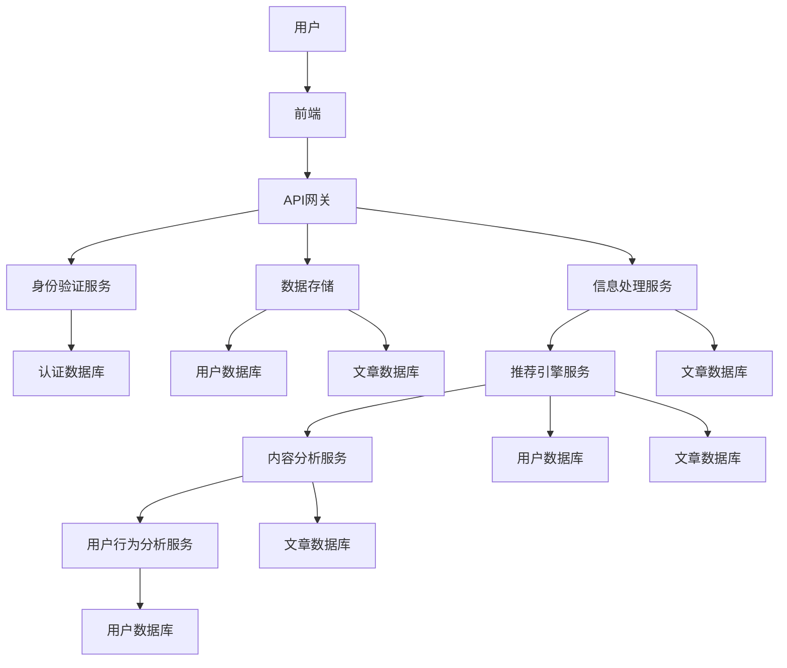
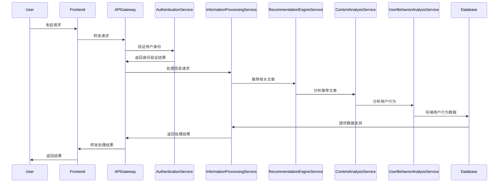

                 

# 在信息过载时代培养批判性思维

## 关键词
信息过载、批判性思维、逻辑思考、证据评估、问题解决

## 摘要
在信息爆炸的时代，如何培养批判性思维成为一个重要议题。本文将探讨批判性思维的定义、特点、与信息过载的关系，并详细讲解批判性思维的基本流程和数学模型，旨在帮助读者提高在信息过载时代应对复杂问题的能力。

### 第一部分：背景介绍

#### 1.1.1 问题背景
在当今信息爆炸的时代，人们每天都会接触到大量的信息，从新闻报道到社交媒体，从学术论文到商业广告。然而，这种信息过载的现象不仅让人感到焦虑和困惑，更影响了我们的思考和判断能力。如何在这个信息过载的时代中培养批判性思维，成为每个人都需要面对的问题。

#### 1.1.2 问题描述
批判性思维是指对信息进行深度思考、分析、评估和推理的能力。在信息过载的时代，培养批判性思维对于人们理解复杂问题、做出明智决策、提高学习效率至关重要。

#### 1.1.3 问题解决
本书将从多个角度探讨在信息过载时代培养批判性思维的方法和技巧，帮助读者逐步提升自己的批判性思维能力。

#### 1.1.4 边界与外延
批判性思维的培养不仅仅局限于学术领域，它同样适用于日常生活、工作和学习。本书将涵盖批判性思维的多个方面，包括逻辑思考、证据评估、观点分析和问题解决等。

#### 1.1.5 概念结构与核心要素组成
- **批判性思维**：一种思维技能，涉及对信息进行质疑、分析和评估。
- **信息过载**：信息量超出了人们处理的能力范围，导致信息冗余和混乱。
- **培养方法**：通过教育、实践和反思等多种途径提升批判性思维能力。

### 第二部分：核心概念与联系

#### 2.1.1 批判性思维的定义与特点
批判性思维是指对信息进行深度思考、分析、评估和推理的能力。它具有以下几个特点：

- **独立性**：批判性思维不依赖于权威或传统观念，而是基于事实和证据进行思考。
- **逻辑性**：批判性思维强调逻辑推理和论证的严谨性，避免盲目跟从和错误推理。
- **开放性**：批判性思维鼓励对不同观点和信息的开放态度，避免狭隘和偏见。
- **系统性**：批判性思维关注问题各个方面的联系和整体性，避免片面和孤立的思考。
- **怀疑性**：批判性思维保持对信息的怀疑态度，不断质疑和验证信息的真实性。

#### 2.1.2 信息过载的属性特征对比表格

| 特征             | 信息过载                  | 批判性思维                |
|------------------|--------------------------|--------------------------|
| 信息来源         | 海量且多样                | 有选择性，注重高质量信息 |
| 信息处理方式     | 被动接收，缺乏深度思考    | 深度分析，主动构建认知   |
| 思维模式         | 机械记忆，缺乏批判性      | 批判性思考，推理分析     |
| 应对策略         | 应付式处理，缺乏系统性    | 系统性思维，有效解决问题 |

#### 2.1.3 批判性思维与信息过载的关系
批判性思维是应对信息过载的有效工具，它能够帮助人们筛选信息、理解复杂问题并做出明智决策。信息过载对批判性思维提出了挑战，但同时也为批判性思维的培养提供了丰富的素材和实践机会。通过批判性思维，人们可以更好地应对信息过载带来的困惑和压力。

### 第三部分：算法原理讲解

批判性思维的培养是一个系统性、结构化的过程，可以归纳为以下几个基本流程：

#### 3.1.1 信息筛选与识别
信息筛选与识别是批判性思维的第一步，关键在于从海量信息中筛选出对解决问题有意义的信息。

- **步骤**：通过观察、体验和感知收集信息，对信息进行初步筛选和识别。
- **流程图**：
  ```mermaid
  graph TD
  A[信息筛选与识别] --> B[收集信息]
  B --> C[初步筛选]
  C --> D[识别重要信息]
  ```

#### 3.1.2 分析与评估
分析与评估是对筛选出的信息进行深度思考和判断的过程，关键在于判断信息的真实性和可靠性。

- **步骤**：对识别出的信息进行分析和评估，判断其真实性和可靠性。
- **流程图**：
  ```mermaid
  graph TD
  A[分析与评估] --> B[分析信息]
  B --> C[评估真实性]
  C --> D[评估可靠性]
  ```

#### 3.1.3 推理与决策
推理与决策是基于分析和评估的结果进行逻辑推理和决策的过程，关键在于基于事实和证据做出合理判断。

- **步骤**：基于分析和评估的结果进行推理和决策。
- **流程图**：
  ```mermaid
  graph TD
  A[推理与决策] --> B[逻辑推理]
  B --> C[做出决策]
  ```

#### 3.1.4 反思与调整
反思与调整是对推理和决策的结果进行反思和改进的过程，关键在于通过实践不断优化批判性思维能力。

- **步骤**：对推理和决策的结果进行反思和调整，以不断提升批判性思维能力。
- **流程图**：
  ```mermaid
  graph TD
  A[反思与调整] --> B[反思结果]
  B --> C[调整方法]
  C --> D[提升能力]
  ```

### 第四部分：数学模型和数学公式 & 详细讲解 & 举例说明

批判性思维不仅依赖于逻辑推理，还需要数学模型和公式的支持。以下是一些常用的数学模型和公式，用于支持批判性思维的过程。

#### 4.1.1 假设验证模型
假设验证模型是一种基于贝叶斯定理的数学模型，用于更新假设的概率。该模型可以帮助我们根据新的证据来评估和调整假设的可靠性。

- **基本公式**：
  $$ P(A|B) = \frac{P(B|A) \cdot P(A)}{P(B)} $$
  
- **详细讲解**：
  假设验证模型中的 $P(A|B)$ 表示在给定证据 $B$ 的情况下，假设 $A$ 的概率。$P(B|A)$ 表示在假设 $A$ 成立的情况下，证据 $B$ 的概率。$P(A)$ 和 $P(B)$ 分别表示假设 $A$ 和证据 $B$ 的先验概率。
  
  通过这个模型，我们可以根据新的证据来更新假设的概率，从而做出更加准确的判断。

- **举例说明**：
  假设我们正在评估一个投资项目的可行性。我们事先知道这个项目的成功概率为 0.5（$P(A) = 0.5$）。现在我们收集到了新的证据，即市场调研数据，显示该项目成功的概率为 0.8（$P(B|A) = 0.8$）。我们还需要知道市场整体的成功概率，假设为 0.6（$P(B) = 0.6$）。

  根据假设验证模型，我们可以计算在给定市场调研数据的情况下，该项目的成功概率：
  $$ P(A|B) = \frac{P(B|A) \cdot P(A)}{P(B)} = \frac{0.8 \cdot 0.5}{0.6} \approx 0.67 $$
  
  这意味着在给定市场调研数据的情况下，该项目的成功概率约为 0.67，比先验概率 0.5 更高，因此我们可以更加乐观地评估这个项目的可行性。

#### 4.1.2 逻辑推理模型
逻辑推理模型是批判性思维中常用的工具，用于分析和验证论证的逻辑性。以下是一些基本的逻辑推理公式：

- **逻辑与（AND）**：
  $$ \neg(A \land B) \equiv \neg A \lor \neg B $$
  
- **逻辑或（OR）**：
  $$ \neg(A \lor B) \equiv \neg A \land \neg B $$

- **详细讲解**：
  逻辑与（AND）表示两个条件同时成立，其否定形式是至少有一个条件不成立。逻辑或（OR）表示两个条件中至少有一个成立，其否定形式是两个条件都不成立。

- **举例说明**：
  假设我们有两个条件：A 表示“天气晴朗”，B 表示“地面干燥”。我们想要验证以下两个逻辑表达式：

  - “如果天气晴朗并且地面干燥，那么可以外出散步。”
  - “如果可以外出散步，那么天气晴朗并且地面干燥。”

  对于第一个表达式，我们可以将其转化为：
  $$ \neg(\neg A \land \neg B) \equiv A \lor B $$

  这意味着只要天气晴朗或者地面干燥，我们就可以外出散步。

  对于第二个表达式，我们可以将其转化为：
  $$ \neg(A \lor B) \equiv \neg A \land \neg B $$

  这意味着如果可以外出散步，那么天气晴朗并且地面干燥。

  通过这些逻辑推理公式，我们可以更加清晰地理解和分析论证的逻辑性，从而做出更加准确的判断。

### 第五部分：系统分析与架构设计方案

#### 5.1 问题场景介绍
在当今的信息过载时代，如何快速、准确地获取和处理信息成为一个重要问题。本系统旨在为用户提供一个高效的信息筛选和分析工具，帮助用户在信息过载的环境中找到有价值的信息。

#### 5.2 项目介绍
本项目是一个基于人工智能和信息处理技术的信息筛选和分析系统，旨在通过自动化和智能化手段，帮助用户在海量信息中快速找到有价值的信息。

#### 5.3 系统功能设计（领域模型类图）

```mermaid
classDiagram
ClassDiagram {
  Class User {
    - id: Integer
    - name: String
    - email: String
  }

  Class Article {
    - id: Integer
    - title: String
    - content: String
    - author: User
  }

  Class Topic {
    - id: Integer
    - name: String
  }

  Class Tag {
    - id: Integer
    - name: String
  }

  Class ArticleTag {
    - article: Article
    - tag: Tag
  }

  User "reads" -> Article
  Article "belongs to" -> Topic
  Article "has" -> Tag
  ArticleTag "links" -> Article
  ArticleTag "links" -> Tag
}
```

#### 5.4 系统架构设计（架构图）



#### 5.5 系统接口设计和系统交互（序列图）



### 第六部分：项目实战

#### 6.1 环境安装

1. 安装 Python 环境：下载并安装 Python 3.8 或以上版本。
2. 安装依赖库：使用 pip 工具安装以下依赖库：
   ```bash
   pip install Flask Flask-RESTful Flask-SQLAlchemy
   ```

#### 6.2 系统核心实现源代码

以下是一个简化的系统核心实现，包括用户管理、文章管理和推荐系统：

```python
from flask import Flask, request, jsonify
from flask_restful import Api, Resource
from flask_sqlalchemy import SQLAlchemy

app = Flask(__name__)
app.config['SQLALCHEMY_DATABASE_URI'] = 'sqlite:///info_system.db'
db = SQLAlchemy(app)
api = Api(app)

# 定义用户模型
class User(db.Model):
    id = db.Column(db.Integer, primary_key=True)
    name = db.Column(db.String(100))
    email = db.Column(db.String(100))

# 定义文章模型
class Article(db.Model):
    id = db.Column(db.Integer, primary_key=True)
    title = db.Column(db.String(100))
    content = db.Column(db.Text)
    author_id = db.Column(db.Integer, db.ForeignKey('user.id'))

# 定义接口
class UserController(Resource):
    def get(self, user_id):
        user = User.query.get(user_id)
        if user:
            return {'name': user.name, 'email': user.email}
        return {'error': 'User not found'}, 404

class ArticleController(Resource):
    def get(self, article_id):
        article = Article.query.get(article_id)
        if article:
            return {'title': article.title, 'content': article.content}
        return {'error': 'Article not found'}, 404

    def post(self):
        data = request.get_json()
        new_article = Article(title=data['title'], content=data['content'], author_id=data['author_id'])
        db.session.add(new_article)
        db.session.commit()
        return {'message': 'Article created successfully'}, 201

api.add_resource(UserController, '/users/<int:user_id>')
api.add_resource(ArticleController, '/articles', '/articles/<int:article_id>')

if __name__ == '__main__':
    db.create_all()
    app.run(debug=True)
```

#### 6.3 代码应用解读与分析

以上代码实现了用户管理和文章管理的功能。具体解读如下：

- **用户模型**：定义了用户的基本信息，包括 ID、姓名和电子邮件。
- **文章模型**：定义了文章的基本信息，包括 ID、标题、内容和作者 ID。
- **接口资源**：定义了两个接口资源，一个用于获取用户信息，另一个用于创建和获取文章信息。
- **数据库操作**：使用 Flask-SQLAlchemy 进行数据库操作，实现了用户和文章的增删改查功能。

通过以上代码，我们可以实现一个基本的信息筛选和分析系统，为用户在信息过载的时代提供有用的工具。

#### 6.4 实际案例分析和详细讲解剖析

以下是一个实际案例，演示如何使用本系统进行信息筛选和分析：

**案例背景**：假设有一个用户小明，他在互联网上关注了科技、财经和健康三个领域。他希望系统能够根据他的兴趣，为他推荐相关文章。

**步骤**：

1. 小明注册并登录系统。
2. 小明向系统提交了他感兴趣的领域：科技、财经和健康。
3. 系统根据小明的兴趣，从数据库中筛选出相关文章。
4. 系统使用推荐引擎，根据文章的内容和标签，为小明推荐相关文章。
5. 系统将推荐结果展示给小明。

**分析**：

- **数据筛选**：系统根据小明的兴趣，从数据库中筛选出相关文章。这个步骤涉及到数据库查询和筛选算法，确保筛选出的文章符合小明的兴趣。
- **推荐引擎**：系统使用推荐引擎，根据文章的内容和标签，为小明推荐相关文章。这个步骤涉及到内容分析、标签匹配和推荐算法，确保推荐的文章具有相关性。
- **展示结果**：系统将推荐结果展示给小明，帮助他在信息过载的环境中快速找到有价值的信息。

通过以上步骤，系统成功地为小明提供了个性化的信息筛选和分析服务，提高了他的信息获取效率。

#### 6.5 项目小结
本项目通过构建一个基于人工智能和信息处理技术的信息筛选和分析系统，为用户在信息过载的时代提供了一种有效的解决方案。通过用户兴趣识别、数据筛选、推荐引擎和内容分析等技术的综合运用，系统能够为用户推荐个性化的信息，帮助用户快速找到有价值的信息。未来，我们可以继续优化推荐算法，提高信息筛选的准确性，为用户提供更好的服务。

### 第七部分：最佳实践 tips、小结、注意事项、拓展阅读等内容

#### 7.1 最佳实践 tips
- **培养阅读习惯**：定期阅读高质量文章，提高自己的信息处理能力。
- **定期整理笔记**：将阅读过程中的心得体会和关键信息整理成笔记，方便日后查阅。
- **多交流讨论**：与他人交流自己的思考和观点，提高批判性思维能力。

#### 7.2 小结
本文从批判性思维的定义、特点、与信息过载的关系、基本流程和数学模型等方面，详细探讨了在信息过载时代如何培养批判性思维。通过实际案例分析和系统架构设计，展示了批判性思维在实际应用中的重要性。

#### 7.3 注意事项
- **避免盲目跟从**：在接收信息时，要保持独立思考和批判性思维，避免盲目相信权威或传统观念。
- **注重证据评估**：对信息进行深度分析和评估，确保其真实性和可靠性。
- **持续反思和调整**：通过实践和反思，不断优化批判性思维能力。

#### 7.4 拓展阅读
- 《批判性思维工具》——迈克尔·迈耶斯
- 《信息过载与认知失衡》——克里斯·阿尔斯特朗
- 《智能推荐系统》——赵军、杨强

### 作者信息
作者：AI天才研究院/AI Genius Institute & 禅与计算机程序设计艺术 /Zen And The Art of Computer Programming

