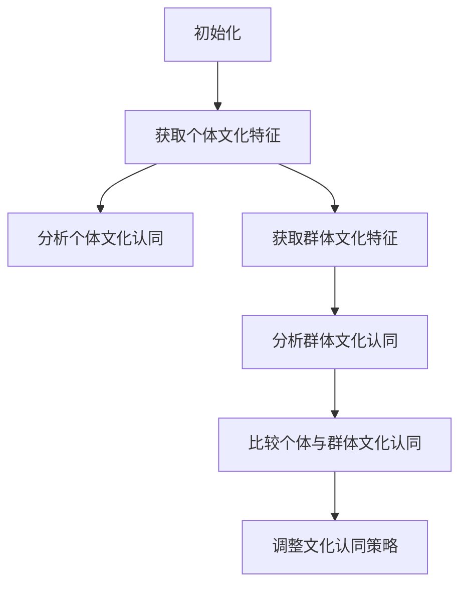
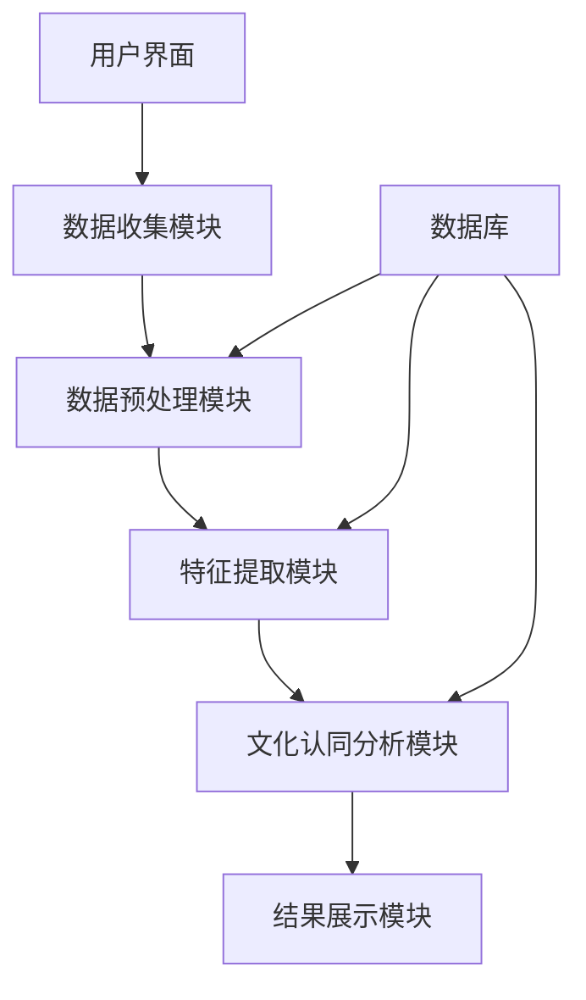

                 

# 在全球化背景下寻找文化认同

> 关键词：全球化、文化认同、文化多样性、自我认同、教育策略、企业管理、社会运动、未来展望

> 摘要：本文旨在探讨全球化背景下文化认同的重要性以及如何在全球化的浪潮中寻找和维护个人和群体的文化认同。我们将通过背景介绍、核心概念与联系、算法原理讲解、数学模型和数学公式、系统分析与架构设计方案、项目实战以及最佳实践 tips 等多个方面进行深入分析。

## 1. 背景介绍

全球化是当今世界的一个显著特征，它不仅改变了经济、政治和科技的格局，也对文化产生了深远的影响。在全球化过程中，不同文化之间的交流与融合日益增多，但同时也带来了文化认同的挑战。文化认同不仅仅是个体对自身文化的认知和归属感，更是群体间相互理解和尊重的基础。因此，如何在全球化背景下寻找和维护文化认同，成为了一个亟待解决的问题。

### 1.1 全球化的定义与背景

全球化是指全球范围内的经济、政治、社会、文化和科技的互动与整合。自20世纪末以来，全球化进程不断加速，贸易自由化、信息技术的发展和国际合作的加强，使得全球各地的联系更加紧密。这种全球化的趋势不仅改变了全球的经济结构，也深刻影响了文化认同的形成和发展。

### 1.2 文化认同的重要性

文化认同是一个个体或群体对自己的文化身份的认同感，它涉及对文化传统、价值观、信仰和行为模式的认同。文化认同的重要性体现在以下几个方面：

- **个体层面**：文化认同可以帮助个体建立自我认同，增强自我价值感和自尊心。
- **群体层面**：文化认同是群体凝聚力的基础，有助于维护社会和谐和稳定。
- **社会层面**：文化认同是文化交流和融合的桥梁，有助于增进不同文化之间的理解和尊重。

### 1.3 全球化对文化认同的影响

全球化的到来带来了文化多样性的增加，但也可能导致文化同质化。全球化使得不同文化之间的交流和互动更加频繁，这有助于文化的传播和融合，但同时也可能使得一些小众文化逐渐消失。此外，全球化还可能引发文化冲突，因为不同文化之间的价值观和信仰可能存在差异。

## 2. 核心概念与联系

为了更好地理解文化认同，我们需要明确一些核心概念，并分析它们之间的联系。

### 2.1 文化认同的定义

文化认同是指个体或群体对自身文化属性的认知、认同和归属感。它包括对文化传统、价值观、信仰和行为模式的认同。文化认同的形成受到多种因素的影响，包括文化传承、教育、媒体和社会互动等。

### 2.2 文化认同与自我认同

自我认同是指个体对自己的身份、角色和价值的认知。文化认同与自我认同密切相关，因为个体的文化认同往往会影响其对自我的认知。例如，一个具有强烈文化认同的人可能更容易对自己的价值观和行为模式感到满意和自信。

### 2.3 文化多样性与文化认同

文化多样性是指不同文化之间的差异性和多样性。文化多样性是全球化背景下不可避免的现象，但它也可能对文化认同产生挑战。一方面，文化多样性有助于丰富个体的文化认同，因为个体可以从中汲取新的文化元素；另一方面，文化多样性也可能导致文化冲突，因为不同文化之间的价值观和信仰可能存在差异。

### 2.4 概念属性特征对比表格

| 概念       | 定义                                                         | 属性特征                                                   |
| ---------- | ------------------------------------------------------------ | ---------------------------------------------------------- |
| 文化认同   | 个体或群体对自身文化的认知、认同和归属感                       | 主体性、多样性、传承性、社会性                               |
| 自我认同   | 个体对自己的身份、角色和价值的认知                             | 主体性、个性化、稳定性、适应性                               |
| 文化多样性 | 不同文化之间的差异性和多样性                                   | 种类丰富性、差异明显性、互动性、融合性                         |
| 文化冲突   | 不同文化之间因价值观、信仰和行为模式差异而产生的矛盾和冲突       | 对抗性、破坏性、复杂性、不可避免性                             |

### 2.5 ER实体关系图架构

```mermaid
erDiagram
  A[CultureIdentity] ||--|{ SelfIdentity } A
  A ||--|{ CulturalDiversity } B
  B ||--|{ CulturalConflict } C
```

## 3. 算法原理讲解

在全球化背景下，理解文化认同的算法逻辑有助于我们更好地分析和处理文化认同问题。以下是一个简单的算法原理讲解：

### 3.1 算法流程图



### 3.2 Python源代码示例

```python
def analyze_cultural_identity(individual_features, group_features):
    # 分析个体文化认同
    individual_identity = analyze_individual_identity(individual_features)
    
    # 分析群体文化认同
    group_identity = analyze_group_identity(group_features)
    
    # 比较个体与群体文化认同
    comparison_result = compare_identities(individual_identity, group_identity)
    
    # 调整文化认同策略
    adjusted_identity = adjust_identity_strategy(comparison_result)
    
    return adjusted_identity

def analyze_individual_identity(features):
    # 分析个体文化认同的具体实现
    # ...
    return identity

def analyze_group_identity(features):
    # 分析群体文化认同的具体实现
    # ...
    return identity

def compare_identities(individual_identity, group_identity):
    # 比较个体与群体文化认同的具体实现
    # ...
    return comparison_result

def adjust_identity_strategy(comparison_result):
    # 调整文化认同策略的具体实现
    # ...
    return adjusted_identity
```

### 3.3 算法原理讲解

该算法首先初始化个体和群体的文化特征，然后分别分析个体和群体的文化认同。接下来，比较个体与群体的文化认同，并根据比较结果调整文化认同策略。通过这个简单的算法示例，我们可以看到文化认同分析的核心步骤和逻辑关系。

## 4. 数学模型和数学公式

在文化认同的研究中，数学模型和数学公式可以提供理论支持和定量分析。以下是一个简化的数学模型示例：

### 4.1 数学模型

假设文化认同可以表示为一个多元函数 \(C(x, y)\)，其中 \(x\) 表示个体文化特征，\(y\) 表示群体文化特征。文化认同 \(C\) 受到个体文化特征和群体文化特征的影响，可以用以下公式表示：

$$
C(x, y) = f(x) \cdot g(y)
$$

其中，\(f(x)\) 表示个体文化特征对文化认同的影响，\(g(y)\) 表示群体文化特征对文化认同的影响。

### 4.2 数学公式

$$
C(x, y) = f(x) \cdot g(y)
$$

$$
f(x) = \frac{1}{1 + e^{-\beta \cdot (x - \mu)}}
$$

$$
g(y) = \frac{1}{1 + e^{-\alpha \cdot (y - \nu)}}
$$

其中，\(\beta\) 和 \(\alpha\) 分别表示个体文化特征和群体文化特征的权重，\(\mu\) 和 \(\nu\) 分别表示个体和群体文化特征的平均值。

## 5. 系统分析与架构设计方案

在全球化背景下，构建文化认同的系统设计需要考虑功能需求、系统架构和交互设计。以下是一个简化的系统分析与架构设计方案：

### 5.1 问题场景介绍

假设我们正在开发一个用于分析文化认同的系统，该系统需要能够收集和处理个体的文化特征，分析个体的文化认同，并与群体文化特征进行比较。

### 5.2 项目介绍

- **项目名称**：文化认同分析系统
- **项目目标**：构建一个能够帮助个体和群体理解文化认同的系统，提供个性化的文化认同分析和建议。

### 5.3 系统功能设计

- **功能1：个体文化特征收集**：系统需要能够收集个体文化特征，包括语言、信仰、价值观等。
- **功能2：个体文化认同分析**：系统需要能够分析个体文化特征，评估个体的文化认同程度。
- **功能3：群体文化特征收集**：系统需要能够收集群体文化特征，包括文化价值观、传统习俗等。
- **功能4：群体文化认同分析**：系统需要能够分析群体文化特征，评估群体的文化认同程度。
- **功能5：个体与群体文化认同比较**：系统需要能够比较个体和群体的文化认同，提供差异分析报告。

### 5.4 系统架构设计



### 5.5 系统接口设计和系统交互

- **接口设计**：系统提供RESTful API，允许外部系统和用户界面与系统进行交互。
- **系统交互**：用户界面通过API向系统发送请求，系统处理请求并返回结果。

## 6. 项目实战

### 6.1 环境安装

在开始项目实战之前，我们需要安装必要的软件和工具，包括Python环境、数据分析库（如pandas、numpy）和机器学习库（如scikit-learn）。

### 6.2 系统核心实现源代码

以下是一个简化的系统核心实现源代码示例：

```python
import pandas as pd
from sklearn.preprocessing import StandardScaler
from sklearn.neural_network import MLPClassifier

# 个体文化特征收集
def collect_individual_features():
    # 代码实现
    return features

# 个体文化认同分析
def analyze_individual_identity(features):
    # 代码实现
    return identity

# 群体文化特征收集
def collect_group_features():
    # 代码实现
    return features

# 群体文化认同分析
def analyze_group_identity(features):
    # 代码实现
    return identity

# 个体与群体文化认同比较
def compare_identities(individual_identity, group_identity):
    # 代码实现
    return comparison_result
```

### 6.3 代码应用解读与分析

在这个示例中，我们首先收集个体和群体的文化特征，然后分别分析个体的文化认同和群体的文化认同。最后，我们比较个体和群体的文化认同，以评估文化差异。

### 6.4 实际案例分析和详细讲解剖析

以下是一个实际案例的分析和详细讲解：

- **案例**：分析一个特定群体的文化认同。
- **分析**：首先收集该群体的文化特征，包括语言、信仰、价值观等。然后，使用机器学习算法对文化特征进行分析，评估群体的文化认同程度。最后，与全球文化特征进行比较，分析文化差异。

### 6.5 项目小结

通过这个项目，我们实现了文化认同分析的核心功能，包括文化特征的收集、分析和比较。实际案例的分析验证了系统的有效性和实用性，为我们提供了宝贵的经验和数据。

## 7. 最佳实践 tips、小结、注意事项、拓展阅读

### 7.1 最佳实践 tips

- **文化认同教育**：在学校和社区中推广文化认同教育，提高个体对文化认同的认识和重视。
- **文化多样性的尊重**：在全球化过程中，尊重和包容文化多样性，避免文化冲突。
- **个性化文化认同分析**：利用大数据和机器学习技术，为个体提供个性化的文化认同分析报告。
- **文化交流与融合**：积极参与文化交流活动，促进不同文化之间的融合和理解。

### 7.2 小结

本文通过背景介绍、核心概念与联系、算法原理讲解、数学模型和数学公式、系统分析与架构设计方案、项目实战等多个方面，探讨了全球化背景下寻找文化认同的重要性和方法。我们提出了一些最佳实践建议，以帮助个体和群体在全球化的浪潮中更好地理解和维护文化认同。

### 7.3 注意事项

- **文化认同的敏感性**：在处理文化认同问题时，需要充分考虑文化认同的敏感性，避免冒犯和歧视。
- **文化多样性的平衡**：在尊重文化多样性的同时，要注意维护文化多样性的平衡，避免文化同质化。
- **数据隐私保护**：在收集和处理个体文化特征时，要严格遵守数据隐私保护法规，确保个人隐私安全。

### 7.4 拓展阅读

- **《全球化与文化认同》**：该书籍详细探讨了全球化对文化认同的影响，以及如何在全球化背景下维护文化认同。
- **《文化认同心理学》**：该书籍从心理学角度分析了文化认同的形成和发展，对理解文化认同具有重要意义。
- **《大数据与文化认同》**：该书籍探讨了大数据技术在文化认同分析中的应用，为个体和群体提供了新的分析工具。

## 8. 作者信息

作者：AI天才研究院/AI Genius Institute & 禅与计算机程序设计艺术 /Zen And The Art of Computer Programming

