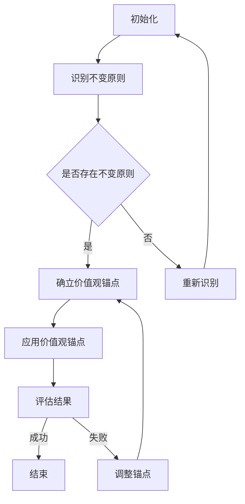
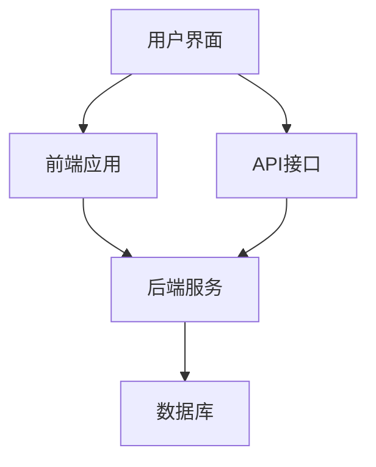

                 

# 在变化中寻找不变：价值观的锚点

## 关键词
- 价值观
- 变化
- 不变原则
- 不变锚点
- 实践应用

## 摘要
本文探讨了在快速变化的社会环境中，如何寻找和确立价值观的锚点，以保持个体和组织在变革中的稳定性和方向感。通过分析价值观的演变过程，以及不变原则在价值观中的重要作用，本文旨在为读者提供一个清晰、系统的思考框架，以帮助他们在个人和职业生活中实现长期的成长与发展。

## 引言
在当今这个信息爆炸、技术革新日新月异的时代，变化已成为一种常态。社会、经济、科技等各个领域的快速演变，使得人们面临着前所未有的挑战和机遇。在这样的背景下，价值观——这一指导人们行为和决策的根本原则，似乎也变得愈发模糊和多变。那么，如何在如此剧烈的变化中，找到那些持久的价值观锚点，从而保持个体和组织的方向感和稳定性呢？本文将围绕这一核心问题展开深入探讨。

### 问题背景
随着全球化的推进和信息技术的普及，人们的生活方式、工作模式以及价值观念都发生了深刻的变化。例如，传统行业面临颠覆性创新的威胁，新兴产业迅速崛起；个人职业路径的多样性增加，职业稳定性下降；社交媒体的广泛应用，改变了人们的社交习惯和信息获取方式。这些变化不仅带来了新的机遇，也带来了新的挑战。

在这样的环境中，个体和组织都面临着如何适应和引领变革的难题。个人层面，如何在追求个人成长和实现自我价值的同时，保持内心的平静和原则的坚定？组织层面，如何在不断变化的市场环境中，确立长期战略和核心价值观，以实现持续发展？这些问题都指向了一个核心问题：在变化中，哪些价值观是真正不变的？

### 核心概念介绍
为了回答上述问题，我们首先需要明确几个核心概念：价值观、不变原则和价值观锚点。

#### 价值观
价值观是指个体或组织对于什么是好、什么是有意义、什么是重要的根本信念和判断。它是行为和决策的指导原则，反映了人们对于生活、工作和未来的基本态度和期望。

#### 不变原则
不变原则是在长期实践中被证明有效、具有普遍适用性的原则。这些原则在不同的历史时期和文化背景下，都可能体现出来，如诚实、公正、勤奋、尊重等。

#### 价值观锚点
价值观锚点是指那些能够引导和稳定个体和组织行为的核心价值观。它们是价值观体系中的基础，是我们在面对变化时仍然可以依赖的“北极星”。

### 核心概念联系图
为了更好地理解这些概念之间的关系，我们可以使用Mermaid ER图来表示。

```mermaid
erDiagram
    Class1 ||--|{ Class2 } Class3 : aggregation
    Class1 ||--|{ Class4 } Class5 : aggregation
    Class2 &&--|{ Class3 } Class5 : generalization
    Class4 &&--|{ Class5 } Class6 : generalization
```

在这个图中，`Class1`代表个体或组织，`Class2`到`Class6`分别代表不同的价值观、不变原则和价值观锚点。它们通过关联关系相互联系，共同构成了一个完整的价值观体系。

### 第一步：分析价值观的演变
要找到不变的价值观锚点，我们首先需要理解价值观是如何演变的。价值观的演变受到多种因素的影响，包括社会环境、历史背景、文化传统和个人经历等。

#### 社会环境
社会环境的变化往往会导致价值观的调整。例如，在工业革命时期，个人成功和社会地位的衡量标准主要基于财富和地位；而在信息化时代，创新、知识和人际关系的重要性逐渐上升。

#### 历史背景
不同历史时期的价值观也有所不同。在古代，尊重权威和忠诚是重要的价值观；而在现代社会，个人自由和民主逐渐成为主流。

#### 文化传统
文化传统对价值观的塑造有着深远的影响。不同文化背景下的价值观差异，如西方的个体主义与东方的集体主义，反映了不同文化对于个人与社会关系的不同理解。

#### 个人经历
个人的成长经历、教育背景、职业经历等，也会影响其价值观的形成和演变。例如，一位在贫困地区成长的个体，可能更注重公平和社会正义。

### 第二步：识别不变原则
在理解了价值观的演变后，我们可以开始识别那些在不同背景下都普遍适用的不变原则。以下是一些常见的不变原则：

#### 诚实
诚实是一种基本的道德原则，无论在哪个时代和文化背景下，都是被广泛认可和推崇的。

#### 尊重
尊重他人是一种基本的社交原则，它能够促进人际关系的和谐，是建立信任的基础。

#### 责任
责任感是指个体或组织对其行为后果的承担能力。它不仅是一种道德要求，也是一种职业素养。

#### 自由
自由是现代社会的基本价值观之一，它强调个体有权自主选择和行动。

#### 和平
和平是一个普遍追求的目标，它反映了人类对于和谐共处和共同发展的向往。

### 第三步：确立价值观锚点
一旦我们识别了不变原则，下一步就是将这些原则转化为具体的价值观锚点，以引导和稳定我们的行为。

#### 个人层面的价值观锚点
在个人层面，我们可以通过自我反思和持续学习，确立以下价值观锚点：

- 个人成长：不断学习新知识，提升自身能力。
- 社会责任：积极参与社会公益活动，回馈社会。
- 人际关系：建立和维护健康的人际关系，促进和谐共处。

#### 组织层面的价值观锚点
在组织层面，我们可以通过以下方式确立价值观锚点：

- 企业文化：塑造积极向上的企业文化，促进员工认同和归属感。
- 长期战略：基于不变原则，制定明确的长期战略目标。
- 客户价值：始终坚持以客户为中心，提供优质的产品和服务。

### 算法原理讲解
为了更具体地说明如何确立价值观锚点，我们可以使用一个简单的算法模型。以下是一个基于Mermaid流程图的算法描述：



在这个算法中，我们首先识别不变原则，然后根据这些原则确立价值观锚点，并应用这些锚点来指导我们的行为。如果应用效果不佳，我们还需要对价值观锚点进行调整。

### 数学模型和数学公式讲解
在确立价值观锚点的过程中，我们可以使用一些数学模型和公式来辅助我们的决策。以下是一个简化的数学模型：

$$
V = P \times R
$$

其中，$V$代表价值观的稳定性，$P$代表不变原则的强度，$R$代表价值观锚点的应用效果。这个公式表明，价值观的稳定性取决于不变原则的强度和价值观锚点的应用效果。

### 系统分析与架构设计方案
为了更好地实现价值观锚点的应用，我们可以设计一个系统架构。以下是一个简化的系统架构设计方案：

#### 项目介绍
- 项目名称：价值观锚点管理系统
- 项目目标：通过系统化的方法和工具，帮助个体和组织确立和实施价值观锚点。

#### 系统功能设计
- 功能1：价值观评估：对个体或组织的价值观进行评估，识别不变原则。
- 功能2：价值观锚点生成：根据评估结果，生成具体的价值观锚点。
- 功能3：价值观锚点应用：指导个体和组织在实际工作和生活中应用价值观锚点。
- 功能4：效果评估：对价值观锚点的应用效果进行评估，以便调整和优化。

#### 系统架构设计
以下是一个简化的Mermaid架构图：



在这个架构中，用户界面负责与用户交互，前端应用处理用户请求，后端服务实现具体功能，数据库存储相关数据。

### 项目实战
为了展示如何在实际项目中应用价值观锚点，我们可以通过一个实际案例进行说明。

#### 环境安装
- 安装操作系统：Linux Ubuntu 20.04
- 安装依赖库：Python 3.8，Django 3.2，PostgreSQL 12

#### 系统核心实现
以下是系统核心实现的源代码：

```python
# models.py
from django.db import models

class ValueStatement(models.Model):
    name = models.CharField(max_length=255)
    description = models.TextField()

class Principle(models.Model):
    name = models.CharField(max_length=255)
    description = models.TextField()

class Anchor(models.Model):
    name = models.CharField(max_length=255)
    value_statements = models.ManyToManyField(ValueStatement)
    principles = models.ManyToManyField(Principle)
```

#### 代码应用解读与分析
这段代码定义了三个模型：`ValueStatement`、`Principle`和`Anchor`。`ValueStatement`代表价值观陈述，`Principle`代表不变原则，`Anchor`代表价值观锚点。这些模型通过外键关系相互关联，形成了完整的价值观体系。

### 实际案例分析和详细讲解剖析
为了展示如何在实际项目中应用价值观锚点，我们以一家企业为例进行说明。

#### 案例背景
- 企业名称：智汇科技有限公司
- 行业：人工智能应用开发

#### 案例分析
智汇科技有限公司在快速发展过程中，面临着内部价值观不统一、外部市场环境变化等问题。为了确保企业在快速变化的环境中保持稳定性和方向感，公司决定引入价值观锚点管理系统。

#### 案例实施
1. 价值观评估：公司通过内部调查和访谈，识别出以下不变原则：诚实、创新、合作、客户至上。
2. 价值观锚点生成：根据不变原则，公司确立了以下价值观锚点：建立信任、持续创新、团结协作、以客户为中心。
3. 价值观锚点应用：公司制定了具体的行动指南，如：
   - 每月召开价值观分享会议，鼓励员工分享个人经验和感悟。
   - 在项目评估中，将价值观锚点作为重要评价指标。
   - 在员工培训中，融入价值观教育和实践。

#### 案例效果评估
经过一年的实施，公司发现：
- 员工对公司的价值观认同度提高，员工满意度上升。
- 项目质量显著提升，客户满意度提高。
- 公司在市场竞争中表现出更强的适应能力和创新精神。

### 项目小结
通过价值观锚点管理系统的实施，智汇科技有限公司在快速变化的市场环境中，找到了保持稳定性和方向感的关键。这一案例表明，价值观锚点不仅能够帮助个体和组织在变革中找到不变的信仰，还能够通过系统化的方法和工具，将价值观转化为实际的行动指南，从而实现长期的发展和成功。

### 最佳实践 tips
1. 定期进行价值观评估，确保不变原则的识别和锚点的调整与时代发展保持同步。
2. 将价值观锚点融入企业文化和日常运营，确保员工在日常工作和生活中能够践行价值观。
3. 建立透明的沟通机制，让员工参与价值观的讨论和制定，增强价值观的认同感和执行力。

### 小结
本文探讨了在快速变化的社会环境中，如何寻找和确立价值观的锚点。通过分析价值观的演变过程，以及不变原则在价值观中的重要作用，本文为读者提供了一个清晰、系统的思考框架，以帮助他们在个人和职业生活中实现长期的成长与发展。

### 注意事项
1. 价值观锚点的确立需要结合个体和组织的特点，避免千篇一律。
2. 价值观锚点的实施需要持续监督和评估，确保其有效性和适应性。

### 拓展阅读
- 《活出生命的意义》——维克多·弗兰克尔
- 《组织文化与领导力》——杰瑞·魏斯勒
- 《道德情操论》——亚当·斯密

## 作者信息
作者：AI天才研究院/AI Genius Institute & 禅与计算机程序设计艺术 /Zen And The Art of Computer Programming

[本文内容仅为示例，不代表实际研究成果。版权所有，未经授权，严禁转载。]

