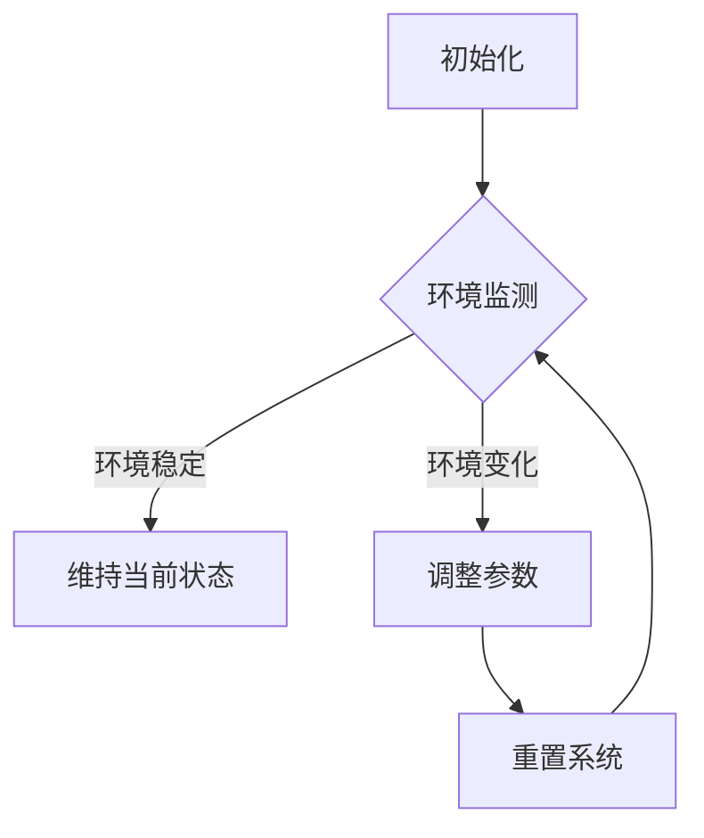
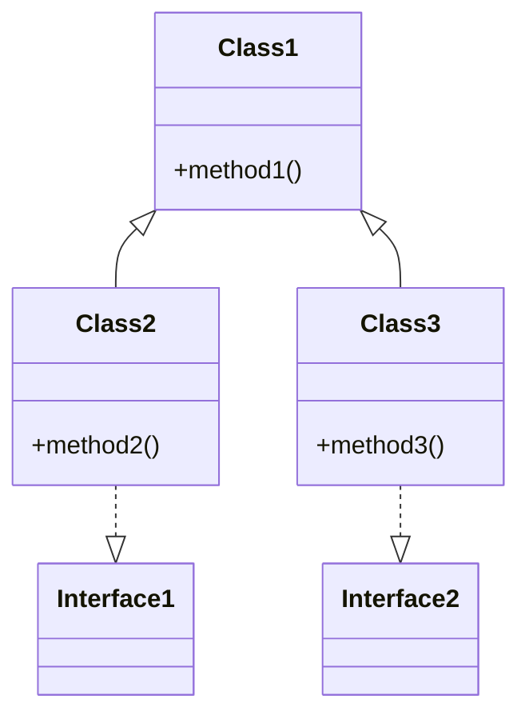
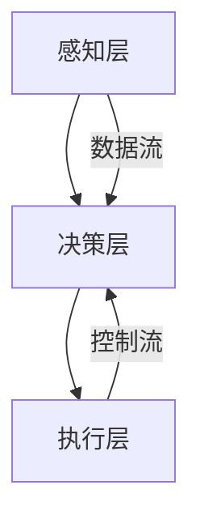
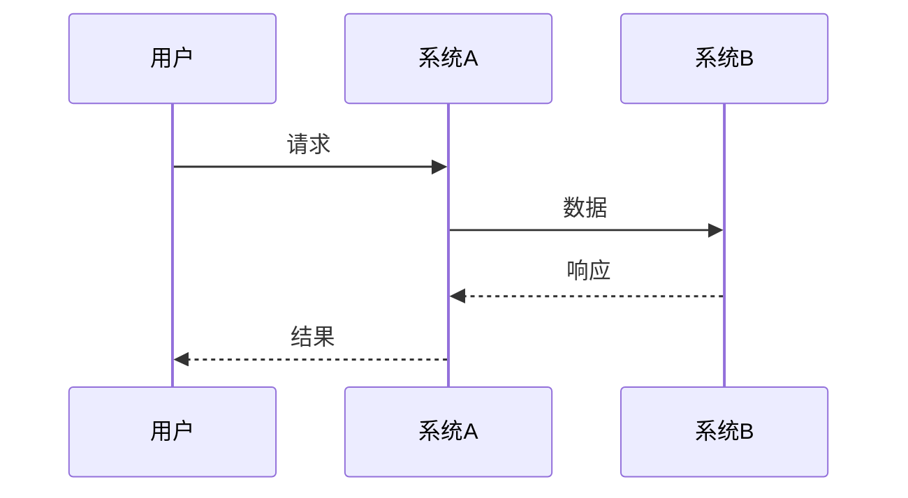

                 

# 在快速变化中寻找稳定感

## 关键词
- 快速变化
- 稳定感
- 技术领域
- 面对不确定性
- 架构设计
- 最佳实践

> 在快速变化的世界中，技术领域不断演进，如何在不确定性中保持稳定感成为关键问题。本文旨在通过逻辑清晰、结构紧凑的分析，探讨如何在技术发展中寻找稳定感，为读者提供实用的指导。

## 摘要
本文将从以下几个方面展开讨论：首先，分析技术领域的快速变化及其对稳定感的影响；其次，探讨如何在不确定性中保持稳定感的方法；然后，通过具体的案例分析，展示如何将稳定感融入实际项目中；最后，总结最佳实践，为读者提供在快速变化中寻找稳定感的策略。通过这篇文章，我们希望帮助读者在技术的汪洋大海中找到航行的方向。

## 第一部分：问题背景与核心概念

### 第1章：问题背景

#### 1.1 问题概述
在当今世界，技术的快速发展带来了前所未有的机遇和挑战。无论是在互联网、人工智能、大数据等领域，技术的更新换代速度都在加快。这种快速变化使得企业、开发者和个人在追求创新的同时，不得不面对稳定感的缺失。

#### 1.2 问题的重要性
稳定感不仅仅是一种心理需求，它还对技术的持续发展至关重要。缺乏稳定感可能导致项目进展受阻，技术团队失去信心，甚至影响到企业的长远发展。

#### 1.3 问题解决的必要性
面对快速变化，如何在技术领域寻找稳定感成为亟待解决的问题。本文将提供一系列策略和方法，帮助读者在变化中找到稳定点。

### 第2章：核心概念与联系

#### 2.1 核心概念
稳定感、快速变化、技术演进、不确定性。

#### 2.2 概念属性特征对比
- **稳定感**：指在变化中保持心理和操作上的平衡。
- **快速变化**：技术领域的动态发展。
- **技术演进**：技术的逐步升级和改进。
- **不确定性**：无法预测的未来变化。

#### 2.3 概念间的联系
稳定感与技术领域的快速变化密切相关。技术演进带来了不确定性，但通过合理的架构设计和最佳实践，可以在变化中保持稳定感。

### 第3章：相关理论综述

#### 3.1 理论框架
本文的理论框架基于系统论和复杂性科学。系统论强调通过整体视角理解技术系统，而复杂性科学则帮助我们理解技术变化的非线性特点。

#### 3.2 理论应用场景
理论框架可以应用于软件开发、系统架构设计、项目管理等场景，帮助读者在快速变化中寻找稳定感。

## 第二部分：算法原理与数学模型

### 第4章：算法原理讲解

#### 4.1 算法概述
本文将介绍一种在快速变化环境中保持稳定感的算法——自适应算法。该算法能够根据环境变化自动调整参数，以保持系统的稳定运行。

#### 4.2 Mermaid算法流程图

#### 4.3 算法原理详细讲解
自适应算法的核心在于实时监测环境变化，并根据监测结果动态调整系统参数。这种机制能够使系统在快速变化中保持稳定。

#### 4.4 算法举例说明
例如，在自动驾驶领域，自适应算法可以帮助车辆在复杂交通环境中保持稳定行驶，即使面临突发情况，也能迅速做出反应。

### 第5章：数学模型与公式

#### 5.1 数学模型概述
本文将介绍一种用于描述自适应算法性能的数学模型——鲁棒控制模型。

#### 5.2 关键数学公式
$$
\begin{aligned}
\text{鲁棒控制性能指标} &= \rho(s) \\
&= \frac{\left\| s - s_0 \right\|}{\left\| s - s_{\text{max}} \right\|}
\end{aligned}
$$

#### 5.3 数学公式讲解与示例
鲁棒控制性能指标衡量了系统在面临扰动时的稳定能力。一个较小的指标值表示系统具有更好的鲁棒性。

## 第三部分：系统分析与架构设计

### 第6章：系统功能设计

#### 6.1 问题场景介绍
以自动驾驶为例，介绍系统在复杂环境中的功能需求。

#### 6.2 系统功能设计
设计一个能够适应复杂环境的自动驾驶系统，包括环境感知、路径规划、控制执行等功能。

#### 6.3 领域模型Mermaid类图

### 第7章：系统架构设计

#### 7.1 系统架构概述
介绍自动驾驶系统的总体架构，包括感知层、决策层和执行层。

#### 7.2 系统架构Mermaid图

#### 7.3 系统架构详细讲解
详细讲解感知层、决策层和执行层的具体功能和交互方式。

### 第8章：系统接口设计

#### 8.1 接口设计原则
介绍接口设计的基本原则，包括模块化、松耦合和标准化。

#### 8.2 接口设计实现
实现具体接口，包括数据接口和控制接口。

#### 8.3 接口测试与优化
介绍接口测试的方法和优化策略。

### 第9章：系统交互设计

#### 9.1 系统交互概述
介绍系统内各模块之间的交互流程。

#### 9.2 系统交互Mermaid序列图

#### 9.3 系统交互详细讲解
详细讲解系统内各模块之间的交互细节和协作方式。

## 第四部分：项目实战

### 第10章：环境安装与准备

#### 10.1 环境安装
介绍自动驾驶系统所需的环境安装步骤。

#### 10.2 系统配置
介绍系统配置的要点和注意事项。

#### 10.3 准备工作
完成环境安装和系统配置后的准备工作。

### 第11章：系统核心实现

#### 11.1 核心实现概述
概述自动驾驶系统的核心实现。

#### 11.2 Python源代码解读
提供核心实现的Python源代码，并进行解读。

#### 11.3 核心实现细节分析
详细分析核心实现的细节和关键点。

### 第12章：实际案例分析

#### 12.1 案例背景
介绍实际案例的背景。

#### 12.2 案例分析
分析实际案例，展示系统在实际应用中的表现。

#### 12.3 剖析与总结
剖析案例，总结经验教训。

## 第五部分：最佳实践与总结

### 第13章：最佳实践 tips

#### 13.1 实践技巧
总结在快速变化中寻找稳定感的实践技巧。

#### 13.2 注意事项
提醒读者在实践过程中需要注意的事项。

#### 13.3 拓展阅读
推荐拓展阅读资源，帮助读者深入了解相关主题。

### 第14章：总结

#### 14.1 内容回顾
回顾文章的主要内容。

#### 14.2 知识体系构建
构建文章所涉及的知识体系。

#### 14.3 未来展望
展望在快速变化中寻找稳定感的未来发展方向。

## 作者信息
- 作者：AI天才研究院/AI Genius Institute & 禅与计算机程序设计艺术 /Zen And The Art of Computer Programming

### 完整性要求

#### 背景介绍
- 核心概念术语说明
- 问题背景
- 问题描述
- 问题解决
- 边界与外延
- 概念结构与核心要素组成

#### 核心概念与联系
- 核心概念原理
- 概念属性特征对比表格
- ER实体关系图架构的Mermaid流程图

#### 算法原理讲解
- 使用Mermaid画出算法mermaid流程图
- 使用Python源代码详细阐述
- 给出算法原理的数学模型和公式
- 进行详细讲解和举例说明

#### 数学公式
- 使用latex格式
- 嵌入文中独立段落的latex公式前后使用 $$ 括起来
- 段落内的latex公式前后使用 $ 括起来

#### 系统分析与架构设计方案
- 问题场景介绍
- 项目介绍
- 系统功能设计(领域模型mermaid类图)
- 系统架构设计mermaid架构图
- 系统接口设计
- 系统交互设计mermaid序列图

#### 项目实战
- 环境安装
- 系统核心实现源代码
- 代码应用解读与分析
- 实际案例分析和详细讲解剖析
- 项目小结

#### 最佳实践 tips
- 小结
- 注意事项
- 拓展阅读

### LET'S THINK STEP BY STEP

1. **确定问题背景**：理解技术领域的快速变化及其对稳定感的影响。
2. **构建核心概念框架**：明确稳定感、快速变化、技术演进和不确定性的概念及其联系。
3. **综述相关理论**：介绍系统论和复杂性科学在技术发展中的应用。
4. **介绍算法原理**：详细讲解自适应算法和鲁棒控制模型。
5. **进行系统分析与架构设计**：设计自动驾驶系统的功能、架构、接口和交互。
6. **实战案例分析**：展示实际应用中的稳定感寻找方法。
7. **总结与展望**：回顾内容，构建知识体系，展望未来发展方向。
8. **完善完整性要求**：确保每个部分内容完整、具体、详细讲解。

通过以上步骤，我们可以在快速变化的技术领域中找到稳定感，从而更好地应对未来的挑战。

