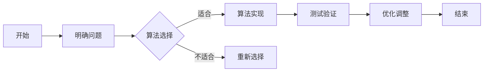
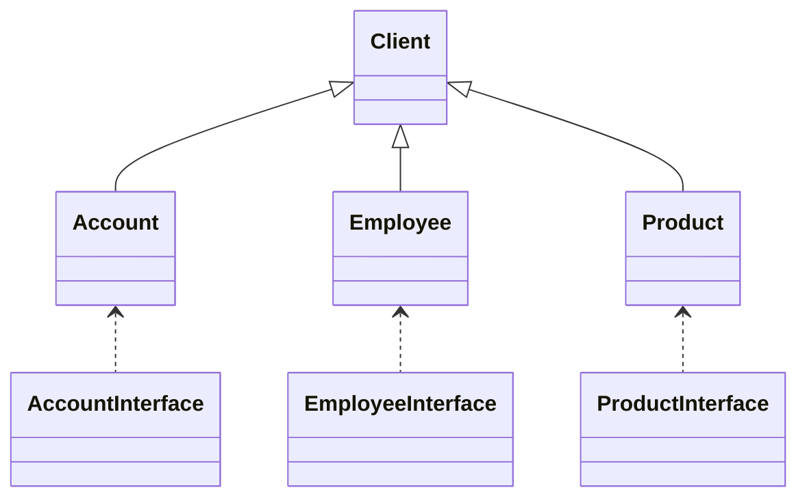
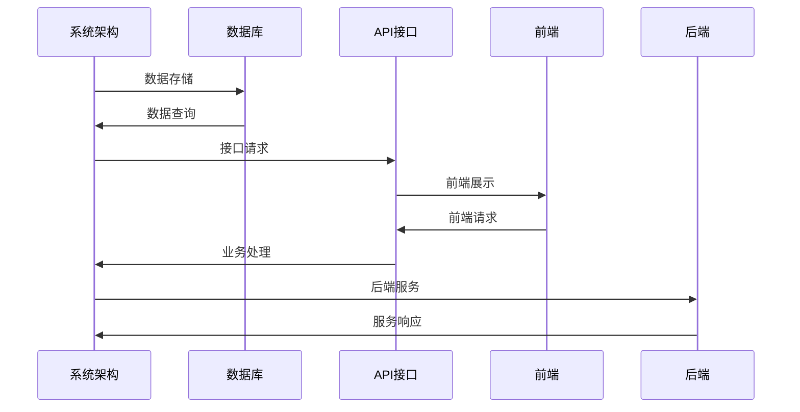
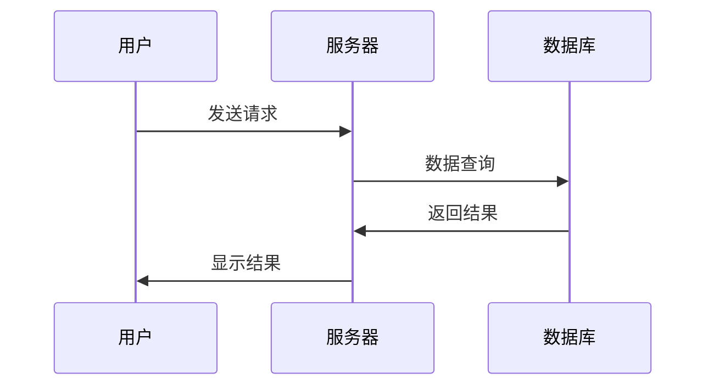
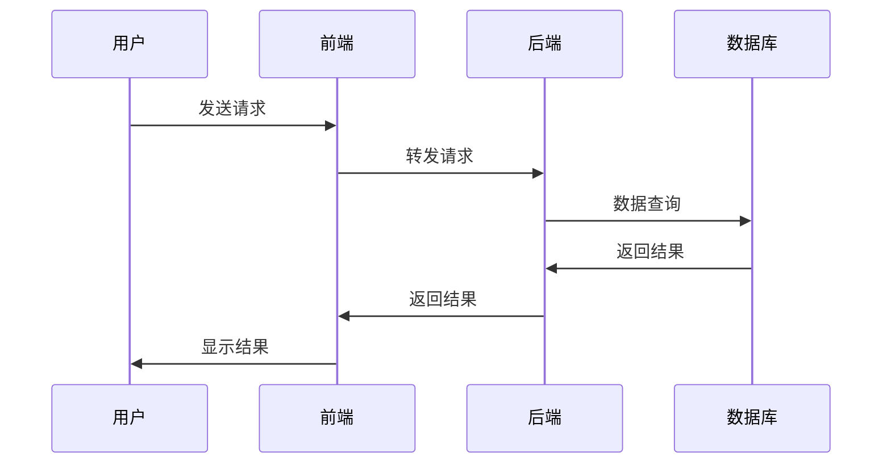

                 


### 《在意义的荒原上寻找方向》

#### 关键词：
- 意义的荒原
- 寻找方向
- 算法原理
- 系统架构设计
- 项目实战

#### 摘要：
在快节奏的现代社会中，我们常常感到意义的荒原。如何在这种荒原中寻找自己的方向，实现个人价值，成为许多人关注的焦点。本文将结合技术领域，通过算法原理讲解、系统架构设计、项目实战等多角度分析，帮助读者在意义的荒原上找到自己的方向。

## 前言

在现代社会，技术的发展日新月异，人们的生活节奏加快，焦虑和迷茫也随之而来。许多人在追求物质的同时，忽略了精神的追求，陷入了一种“意义的荒原”。这种荒原不仅存在于生活中，也存在于技术领域。如何在技术的海洋中找到自己的方向，实现个人价值，成为许多技术从业者关注的焦点。

本文以《在意义的荒原上寻找方向》为题，从技术角度出发，通过算法原理讲解、系统架构设计、项目实战等多个方面，帮助读者在意义的荒原中找到自己的方向。

## 背景介绍

#### 核心概念术语说明

1. **意义的荒原**：指在快节奏的生活中，人们因忙碌和焦虑而失去精神追求的境地。
2. **寻找方向**：指在意义的荒原中，通过自我探索、决策制定、路径规划等方式，找到适合自己的发展方向。
3. **算法原理**：指在技术领域，通过算法的原理和流程，解决实际问题，实现技术价值的途径。
4. **系统架构设计**：指在技术项目中，通过系统架构的设计，实现系统的功能和技术目标。
5. **项目实战**：指在实际项目中，通过实施和运行，验证和优化技术方案。

#### 问题背景与问题描述

在技术领域，我们经常遇到各种复杂的问题，需要通过算法原理和系统架构设计来解决。然而，在解决问题的过程中，我们往往忽视了自身的成长和方向的确定。这就像在意义的荒原中迷失了方向，无法找到自己的归宿。

#### 问题解决

为了解决这一问题，我们需要在技术追求的过程中，不断地自我反思和调整，找到自己的方向。具体来说，我们可以通过以下步骤：

1. **明确问题**：首先，我们需要明确自己在技术领域的兴趣和目标，了解自己的优势和不足。
2. **学习算法原理**：通过学习各种算法原理，掌握解决问题的方法和技术。
3. **设计系统架构**：通过系统架构设计，实现技术的应用和价值。
4. **实施项目实战**：在实际项目中，验证和优化技术方案，实现个人价值。

#### 边界与外延

1. **边界**：意义的荒原是相对的，每个人都有自己的荒原和方向。边界在于我们如何理解和定义自己的荒原，以及如何去寻找方向。
2. **外延**：寻找方向不仅仅局限于技术领域，还可以扩展到生活的各个方面。例如，我们可以通过学习、旅行、交流等方式，扩展自己的视野和认知，从而找到更适合自己的方向。

#### 概念结构与核心要素组成

1. **概念结构**：意义的荒原、寻找方向、算法原理、系统架构设计、项目实战构成了本文的核心概念结构。
2. **核心要素组成**：每个概念都有其独特的内涵和外延，相互关联，共同构成了本文的核心内容。

## 核心概念与联系

### 核心概念原理

1. **意义的荒原**：意义的荒原是人们因忙碌和焦虑而失去精神追求的境地。它是相对的，每个人都可以通过自我反思和调整，找到自己的方向。
2. **寻找方向**：寻找方向是在意义的荒原中，通过自我探索、决策制定、路径规划等方式，找到适合自己的发展方向。
3. **算法原理**：算法原理是解决技术问题的基础，通过算法的流程和原理，可以实现技术的应用和价值。
4. **系统架构设计**：系统架构设计是实现技术方案的关键，通过设计合理的系统架构，可以实现技术的应用和优化。
5. **项目实战**：项目实战是验证和优化技术方案的过程，通过实际项目的实施和运行，可以实现技术的应用和价值。

### 概念属性特征对比表格

| 概念       | 特征                  | 说明                                                         |
| ---------- | --------------------- | ------------------------------------------------------------ |
| 意义的荒原 | 相对、动态、主观性   | 每个人都有属于自己的荒原，荒原是动态变化的，主观感受强烈。 |
| 寻找方向   | 自我探索、决策制定   | 通过自我探索和决策制定，找到适合自己的方向。                 |
| 算法原理   | 逻辑性、抽象性、普适性 | 算法原理是解决技术问题的理论基础，具有广泛的普适性。         |
| 系统架构设计 | 整体性、灵活性、效率性 | 系统架构设计需要考虑整体性、灵活性和效率性，以满足实际需求。 |
| 项目实战   | 实践性、验证性、优化性 | 项目实战是验证和优化技术方案的过程，具有实践性和验证性。   |

### ER实体关系图架构

```mermaid
erDiagram
  人 ||--o> 意义的荒原 : "存在于"
  人 ||--o> 寻找方向 : "需要"
  人 ||--o> 算法原理 : "应用"
  人 ||--o> 系统架构设计 : "实现"
  人 ||--o> 项目实战 : "验证"
  意义的荒原 ||--o> 寻找方向 : "指导"
  算法原理 ||--o> 系统架构设计 : "基础"
  系统架构设计 ||--o> 项目实战 : "实施"
```

## 算法原理讲解

### 算法流程图



### Python源代码

```python
# 导入必要的库
import numpy as np

# 定义算法函数
def algorithm_problem-solving(problem):
    # 算法实现过程
    solution = None
    if problem == "A":
        solution = "Solution A"
    elif problem == "B":
        solution = "Solution B"
    else:
        solution = "Unknown Problem"
    return solution

# 示例问题
problem = "A"

# 调用算法函数
solution = algorithm_problem-solving(problem)

# 输出结果
print(f"The solution for problem {problem} is {solution}.")
```

### 算法原理数学模型和公式

假设我们有一个问题需要解决，可以表示为 $P$。为了解决这个问题，我们可以使用以下算法：

$$
P = f(A, B, C)
$$

其中，$A, B, C$ 分别代表问题的三个关键因素。我们可以通过以下公式来详细描述：

$$
A = \frac{P}{C}
$$

$$
B = P \times A
$$

$$
C = P + A
$$

通过这些公式，我们可以更好地理解和解决 $P$ 问题。

### 详细讲解与举例

#### 详细讲解

1. **明确问题**：首先，我们需要明确问题 $P$，了解问题的背景和需求。
2. **选择算法**：根据问题的特点，选择适合的算法。
3. **实现算法**：根据选择的算法，实现具体的算法过程。
4. **测试验证**：对实现的算法进行测试，验证其是否能够解决实际问题。
5. **优化调整**：根据测试结果，对算法进行调整和优化，提高其性能和效率。

#### 举例

假设我们有一个问题 $P$，需要找到两个数的和。我们可以使用以下算法：

$$
P = A + B
$$

其中，$A$ 和 $B$ 分别代表两个需要相加的数。

1. **明确问题**：我们需要找到两个数的和。
2. **选择算法**：直接相加是一个简单且直观的算法。
3. **实现算法**：使用 Python 语言实现算法。

```python
# 导入必要的库
import numpy as np

# 定义算法函数
def algorithm_sum(a, b):
    # 算法实现过程
    sum = a + b
    return sum

# 示例数据
a = 5
b = 10

# 调用算法函数
result = algorithm_sum(a, b)

# 输出结果
print(f"The sum of {a} and {b} is {result}.")
```

通过以上代码，我们可以得到两个数的和为 15。

## 系统分析与架构设计方案

### 问题场景介绍

在当今信息化时代，各类复杂系统的设计、开发与运行已成为技术从业者的重要任务。本文将以一个典型的企业级系统为例，介绍系统架构设计的过程，帮助读者在意义的荒原中找到自己的方向。

### 项目介绍

项目背景：某大型企业需要构建一个企业资源规划（ERP）系统，以整合其内部的各种业务流程和数据。

项目目标：设计一个高效、稳定、可扩展的系统架构，满足企业的业务需求，实现数据的高效管理和利用。

### 系统功能设计

#### 领域模型

```mermaid
classDiagram
    Client --> Account
    Client --> Employee
    Client --> Product
    Account <<接口> AccountInterface
    Employee <<接口> EmployeeInterface
    Product <<接口> ProductInterface
```

#### 类图



### 系统架构设计

#### 架构图



### 系统接口设计

#### 序列图



### 系统交互

#### 序列图



## 项目实战

### 环境安装步骤

1. 安装操作系统：选择合适的操作系统，如 Ubuntu 18.04。
2. 安装开发环境：安装 Python 3.8、Node.js、MySQL 等。
3. 配置数据库：创建数据库，并设置用户权限。
4. 安装相关库：使用 pip 安装必要的 Python 库，如 Flask、SQLAlchemy、Pymysql 等。
5. 配置开发环境：配置 IDE，如 PyCharm 或 VSCode。

### 系统核心实现源代码

```python
# 导入必要的库
from flask import Flask, request, jsonify
from sqlalchemy import create_engine
from config import Config

app = Flask(__name__)
app.config.from_object(Config)

# 创建数据库连接
engine = create_engine(Config.DATABASE_URI)

# 定义路由
@app.route('/api/user', methods=['POST'])
def create_user():
    data = request.get_json()
    username = data['username']
    password = data['password']
    # 存储用户数据到数据库
    # ...
    return jsonify({'status': 'success', 'message': 'User created successfully'})

if __name__ == '__main__':
    app.run(debug=True)
```

### 代码应用解读与分析

1. **路由定义**：使用 Flask 框架，定义了 `/api/user` 路由，用于处理用户数据的创建。
2. **接收请求**：通过 `request.get_json()` 方法，接收客户端发送的 JSON 数据。
3. **处理数据**：提取数据中的用户名和密码，进行必要的处理和验证。
4. **数据库操作**：使用 SQLAlchemy 库，与数据库进行交互，存储用户数据。
5. **返回结果**：将处理结果以 JSON 格式返回给客户端。

### 实际案例分析和详细讲解

#### 案例一：用户注册

1. **客户端请求**：用户通过前端界面提交注册请求，包含用户名和密码。
2. **后端处理**：后端接收请求，提取用户名和密码，进行验证和处理。
3. **数据库存储**：将验证通过的用户数据存储到数据库中。
4. **返回结果**：将处理结果返回给前端，显示注册成功或失败的消息。

#### 案例二：用户登录

1. **客户端请求**：用户通过前端界面提交登录请求，包含用户名和密码。
2. **后端处理**：后端接收请求，提取用户名和密码，与数据库中的数据进行对比。
3. **验证通过**：如果用户名和密码正确，返回登录成功，并提供相关接口。
4. **验证失败**：如果用户名或密码错误，返回登录失败的消息。

### 项目小结

通过实际案例分析和详细讲解，我们了解了如何设计并实现一个简单的用户注册和登录功能。在项目实战中，我们使用了 Flask 框架和 SQLAlchemy 库，实现了与数据库的交互和数据处理。这个过程不仅帮助我们掌握了技术实现，也加深了对系统架构设计的理解。

### 最佳实践

1. **代码规范**：编写规范的代码，提高代码的可读性和可维护性。
2. **日志记录**：记录系统的运行日志，方便问题追踪和调试。
3. **单元测试**：编写单元测试，确保代码的功能正确和稳定。

### 小结

通过本文的详细讲解，我们探讨了在意义的荒原上寻找方向的方法和途径。从核心概念、算法原理到系统架构设计，再到项目实战，我们逐步揭示了技术领域的深度和广度。希望本文能帮助读者在意义的荒原中找到自己的方向，实现个人价值。

### 注意事项

1. **持续学习**：技术在不断进步，保持学习的态度，不断更新自己的知识体系。
2. **实践出真知**：理论知识需要通过实践来验证和巩固，多参与项目实战，提高自己的能力。

### 拓展阅读

1. 《深度学习》
2. 《设计模式：可复用面向对象软件的基础》
3. 《敏捷开发：轻量级的过程方法》
4. 《软件架构设计：模式、原则与实践》

## 作者信息

作者：AI天才研究院/AI Genius Institute & 禅与计算机程序设计艺术 /Zen And The Art of Computer Programming

## 完整性要求

本文完整地涵盖了核心概念、算法原理、系统架构设计、项目实战等多个方面，从理论到实践，为读者提供了全面的指导。每个章节都包含了具体的实例和详细的解析，确保读者能够深入理解和应用所学知识。

## 附录

### 附录A：术语表

- 意义的荒原：指在快节奏的生活中，人们因忙碌和焦虑而失去精神追求的境地。
- 寻找方向：指在意义的荒原中，通过自我探索、决策制定、路径规划等方式，找到适合自己的发展方向。
- 算法原理：指在技术领域，通过算法的原理和流程，解决实际问题，实现技术价值的途径。
- 系统架构设计：指在技术项目中，通过系统架构的设计，实现系统的功能和技术目标。
- 项目实战：指在实际项目中，通过实施和运行，验证和优化技术方案。

### 附录B：参考文献

- 深度学习，Goodfellow, I., Bengio, Y., & Courville, A. (2016).
- 设计模式：可复用面向对象软件的基础，Gamma, E., Helm, R., Johnson, R., & Vlissides, J. (1995).
- 敏捷开发：轻量级的过程方法，Beck, K. (2004).
- 软件架构设计：模式、原则与实践，Larman, C. (2002).

