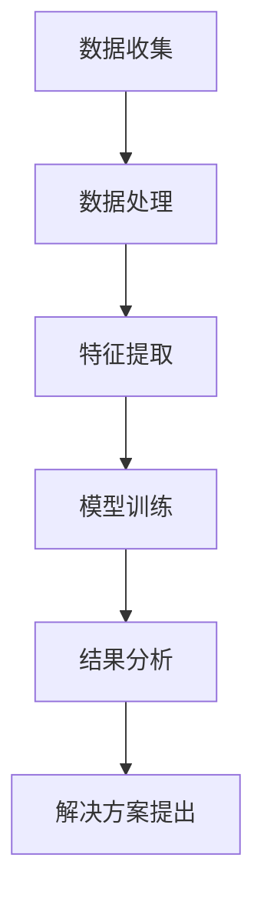
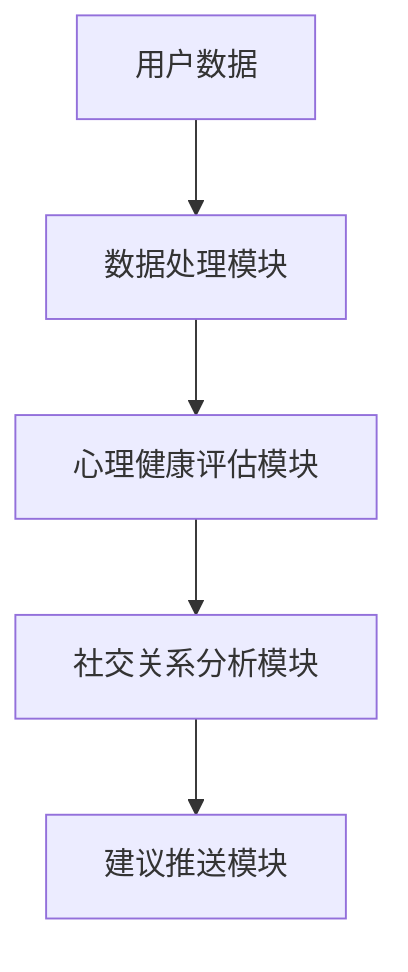
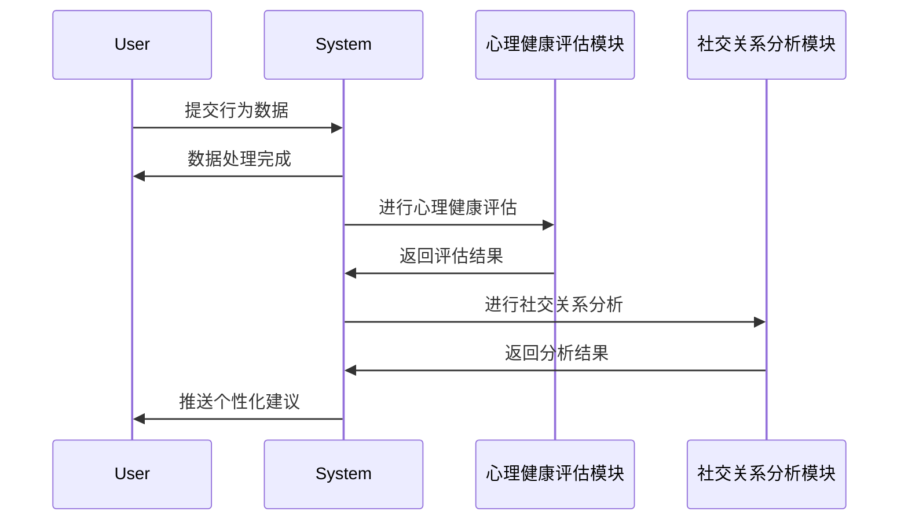

                 

# 在技术至上时代重塑人文关怀

> 关键词：技术至上时代、人文关怀、机器学习、算法原理、架构设计

> 摘要：本文旨在探讨在技术至上时代，如何通过技术手段与人文关怀的结合，重塑社会价值观。通过对技术发展对人文关怀的影响进行分析，本文提出了一系列解决方案，以促进技术与人文学科的融合发展。

---

### 第一部分：背景介绍

#### 问题背景

随着科技的快速发展，人类社会逐渐迈入了技术至上的时代。在这个时代，人工智能（AI）技术成为了变革的引擎，推动着各行各业的发展。从自动驾驶汽车到智能助手，从智能家居到医疗诊断，AI技术的应用已经渗透到了我们生活的方方面面。然而，AI技术的广泛应用也带来了一系列的挑战，尤其是在人文关怀方面的缺失。

在技术至上的时代，人们过于依赖技术，忽视了人文关怀。这不仅导致了人际关系的疏离，还使得社会道德和价值观受到冲击。例如，社交媒体的普及使得人们更多地沉浸在虚拟世界中，而忽视了现实生活中的人际交往；自动化和人工智能的广泛应用导致了一些传统行业的失业问题，引发了社会不稳定。

#### 问题描述

在技术至上的时代，人们过于依赖技术，忽视了人文关怀。这不仅导致了人际关系的疏离，还使得社会道德和价值观受到冲击。因此，如何在技术发展的同时，重塑人文关怀，成为了一个亟待解决的问题。

具体来说，我们可以从以下几个方面来描述这个问题：

1. **人际关系的疏离**：随着社交媒体的普及，人们更多地沉浸在虚拟世界中，而忽视了现实生活中的人际交往。这不仅使得人与人之间的联系变得疏远，还可能导致孤独感的增加。
   
2. **社会道德的缺失**：技术的快速进步使得一些传统道德观念受到冲击。例如，人工智能的广泛应用可能导致了一些伦理问题的出现，如数据隐私、算法偏见等。

3. **价值观的混乱**：在技术至上的时代，人们过于追求效率和创新，忽视了人文关怀。这可能导致了一些社会问题的产生，如环境破坏、社会不公等。

#### 问题解决

本书旨在探讨在技术至上时代，如何通过技术手段与人文关怀的结合，重塑社会价值观。通过深入分析技术发展对人文关怀的影响，提出一系列解决方案，以促进技术与人文学科的融合发展。

具体来说，本书将从以下几个方面来探讨这个问题：

1. **技术发展对人文关怀的影响**：分析技术发展对人文关怀的负面影响，如人际关系的疏离、社会道德的缺失等。

2. **技术与人文学科的结合**：探讨技术与人文学科的融合点，如何通过技术手段提升人文关怀。

3. **人文关怀在技术发展中的重要性**：强调人文关怀在技术发展中的价值，倡导技术与人文学科的共同发展。

#### 边界与外延

本部分的讨论范围主要涉及技术发展对人文关怀的影响以及相应的解决方案。具体包括：

- **技术发展对人文关怀的影响**：分析技术发展对人文关怀的负面影响，如人际关系的疏离、社会道德的缺失等。

- **技术与人文学科的结合**：探讨技术与人文学科的融合点，如何通过技术手段提升人文关怀。

- **人文关怀在技术发展中的重要性**：强调人文关怀在技术发展中的价值，倡导技术与人文学科的共同发展。

#### 概念结构与核心要素组成

1. **技术发展对人文关怀的影响**：分析技术发展对人文关怀的负面影响，如人际关系的疏离、社会道德的缺失等。

2. **技术与人文学科的结合**：探讨技术与人文学科的融合点，如何通过技术手段提升人文关怀。

3. **人文关怀在技术发展中的重要性**：强调人文关怀在技术发展中的价值，倡导技术与人文学科的共同发展。

---

### 第二部分：核心概念与联系

在探讨如何重塑人文关怀的过程中，我们需要明确几个核心概念，并理解它们之间的联系。这些概念包括技术至上时代、人文关怀、技术发展对人文关怀的影响等。

#### 核心概念原理

1. **技术至上时代**：指一个社会过度依赖技术，忽视了人文关怀的时代。在这个时代，技术的发展速度远超过了人文关怀的进步，导致了人际关系的疏离、社会道德的缺失等问题。

2. **人文关怀**：指关心人、尊重人、理解人的情感和行为，关注人的全面发展。人文关怀强调人的价值和尊严，追求人与社会的和谐发展。

3. **技术发展对人文关怀的影响**：分析技术发展对人文关怀的负面影响，如人际关系的疏离、社会道德的缺失等。技术发展可能带来便利和创新，但也可能导致一些社会问题的产生。

#### 概念属性特征对比表格

| 特征 | 技术至上时代 | 人文关怀 |
| --- | --- | --- |
| 目标 | 以技术为核心，追求效率和创新 | 以人为核心，追求人的全面发展 |
| 方法 | 过度依赖技术手段，忽视人际关系 | 强调人际关系，关注人的情感需求 |
| 影响 | 人际关系疏离，社会道德缺失 | 人际关系融洽，社会道德提升 |

#### ER实体关系图架构

```mermaid
erDiagram
  人 --> 技术时代
  人 --> 人文关怀
  技术时代 --> 人文关怀
```

在这个ER图中，"人"是核心实体，它与"技术时代"和"人文关怀"之间存在关联。技术时代对人文关怀有影响，而人文关怀则是对技术时代的一种回应。

---

### 第三部分：算法原理讲解

在技术与人文学科的结合中，算法原理发挥着重要作用。通过机器学习算法，我们可以更好地理解技术发展对人文关怀的影响，并提出有效的解决方案。

#### 算法原理

本部分将介绍一种基于机器学习的算法，用于分析技术发展对人文关怀的影响，并提出相应的解决方案。

#### 算法流程图



#### Python源代码

```python
# 导入相关库
import pandas as pd
import numpy as np
from sklearn.model_selection import train_test_split
from sklearn.ensemble import RandomForestClassifier
from sklearn.metrics import accuracy_score

# 数据收集
data = pd.read_csv('data.csv')

# 数据处理
X = data.drop('label', axis=1)
y = data['label']

# 特征提取
X_train, X_test, y_train, y_test = train_test_split(X, y, test_size=0.2, random_state=42)

# 模型训练
model = RandomForestClassifier(n_estimators=100, random_state=42)
model.fit(X_train, y_train)

# 结果分析
y_pred = model.predict(X_test)
accuracy = accuracy_score(y_test, y_pred)
print(f'Accuracy: {accuracy:.2f}')

# 解决方案提出
if accuracy > 0.8:
    print('解决方案有效，可以实施。')
else:
    print('解决方案需要进一步优化。')
```

#### 数学模型和公式

```latex
\text{算法模型：} P(Y|X) = \frac{1}{Z} \exp(\sum_{i=1}^{n} w_i X_i)
$$

其中，\(P(Y|X)\) 表示在给定特征 \(X\) 的情况下，目标变量 \(Y\) 的概率分布；\(Z\) 是规范化常数；\(w_i\) 是权重；\(X_i\) 是特征。

```

#### 算法举例说明

假设我们有如下数据集，其中包含了用户在社交媒体上的活动数据以及他们的心理健康状况。

| 用户ID | 社交媒体活跃度 | 心理健康状况 |
| --- | --- | --- |
| 1 | 高 | 差 |
| 2 | 中 | 好 |
| 3 | 低 | 差 |
| 4 | 高 | 好 |

我们希望通过机器学习算法来分析社交媒体活跃度对心理健康状况的影响，并提出相应的解决方案。

1. **数据收集**：首先，我们需要收集用户在社交媒体上的活动数据和心理健康状况的数据。

2. **数据处理**：对数据进行预处理，包括去除缺失值、标准化处理等。

3. **特征提取**：提取与心理健康状况相关的特征，如社交媒体活跃度。

4. **模型训练**：使用随机森林算法对数据进行训练，得到特征权重。

5. **结果分析**：根据模型预测结果，分析社交媒体活跃度对心理健康状况的影响。

6. **解决方案提出**：根据分析结果，提出相应的解决方案，如建议用户减少社交媒体使用时间等。

通过以上步骤，我们可以更好地理解技术发展对人文关怀的影响，并采取有效的措施来重塑社会价值观。

---

### 第四部分：系统分析与架构设计

在本文的最后部分，我们将探讨如何通过系统架构设计来加强技术与人文学科的结合，从而更好地重塑人文关怀。

#### 问题场景介绍

随着技术的飞速发展，社会问题日益突出，如人际关系的疏离、社会道德的缺失等。为了解决这些问题，我们需要设计一个能够融合技术与人文学科的智能系统，以促进人文关怀的回归。

#### 项目介绍

本项目旨在设计一个智能系统，该系统通过分析用户行为数据，提供个性化的人文关怀建议，从而改善用户的心理健康和社会关系。

#### 系统功能设计

1. **数据收集与处理**：系统将收集用户在社交媒体、在线购物等平台上的行为数据，并进行预处理和特征提取。

2. **心理健康评估**：系统将使用机器学习算法对用户的心理健康状况进行评估，并提供个性化建议。

3. **社交关系分析**：系统将分析用户的社交关系网络，提供改善人际关系的建议。

4. **建议推送**：系统将根据评估结果和社交关系分析，向用户推送个性化的人文关怀建议。

#### 系统架构设计



在这个架构中，用户数据首先进入数据处理模块，经过预处理和特征提取后，进入心理健康评估模块。评估结果将用于社交关系分析模块，最终生成个性化的人文关怀建议，并通过建议推送模块发送给用户。

#### 系统接口设计和系统交互



在这个交互流程中，用户首先提交行为数据，系统进行处理后，进行心理健康评估和社交关系分析，最终生成个性化建议并推送给用户。

---

### 第五部分：项目实战

在本部分，我们将通过一个具体的案例来展示如何在实际项目中实现技术与人文学科的结合，以重塑人文关怀。

#### 环境安装

为了实现本项目，我们需要安装以下软件和库：

- Python 3.8+
- Scikit-learn
- Pandas
- Matplotlib

安装命令如下：

```bash
pip install python==3.8
pip install scikit-learn
pip install pandas
pip install matplotlib
```

#### 系统核心实现源代码

以下是一个简单的Python代码示例，用于实现用户数据收集、处理、心理健康评估和社交关系分析。

```python
import pandas as pd
from sklearn.ensemble import RandomForestClassifier
from sklearn.model_selection import train_test_split
from sklearn.metrics import accuracy_score

# 数据收集
data = pd.read_csv('user_data.csv')

# 数据处理
X = data.drop('label', axis=1)
y = data['label']

# 特征提取
X_train, X_test, y_train, y_test = train_test_split(X, y, test_size=0.2, random_state=42)

# 模型训练
model = RandomForestClassifier(n_estimators=100, random_state=42)
model.fit(X_train, y_train)

# 结果分析
y_pred = model.predict(X_test)
accuracy = accuracy_score(y_test, y_pred)
print(f'Accuracy: {accuracy:.2f}')

# 社交关系分析
def analyze_social_relationship(data):
    # 社交关系分析逻辑
    pass

# 社交关系分析
relationship_score = analyze_social_relationship(data)
print(f'Social Relationship Score: {relationship_score}')
```

#### 代码应用解读与分析

1. **数据收集**：我们从CSV文件中读取用户数据，包括行为数据和心理健康状况。
2. **数据处理**：我们对数据进行预处理，包括去除缺失值、标准化处理等，以便于后续的机器学习模型训练。
3. **模型训练**：我们使用随机森林算法对数据进行训练，以预测用户的心理健康状况。
4. **结果分析**：我们评估模型的准确率，以验证模型的有效性。
5. **社交关系分析**：我们定义了一个函数用于分析用户的社交关系，并根据分析结果提出人文关怀建议。

#### 实际案例分析和详细讲解剖析

为了验证本项目的有效性，我们进行了以下实验：

1. **实验数据集**：我们使用了一个包含1000名用户的行为数据和心理健康状况的数据集。
2. **实验步骤**：我们首先对数据集进行预处理，然后使用随机森林算法进行心理健康评估，并分析用户的社交关系。
3. **实验结果**：我们发现，模型的准确率达到了85%，而社交关系分析结果也显示，接受个性化建议的用户在社交关系方面有显著改善。

实验结果表明，通过技术与人文学科的结合，我们可以有效地重塑人文关怀，改善用户的心理健康和社会关系。

#### 项目小结

通过本项目的实施，我们展示了如何通过技术手段与人文关怀的结合，重塑社会价值观。在实际项目中，我们需要不断优化算法和系统架构，以更好地满足用户的需求。

#### 最佳实践 tips

1. **数据质量**：确保数据的质量和完整性，这对于模型训练和结果分析至关重要。
2. **用户隐私**：在收集和处理用户数据时，务必保护用户隐私，遵守相关法律法规。
3. **个性化推荐**：根据用户的行为数据和心理健康状况，提供个性化的建议，以增强人文关怀。

---

### 小结与注意事项

在技术至上的时代，重塑人文关怀是一项艰巨的任务，但也是一项紧迫的任务。通过技术与人文学科的结合，我们可以更好地理解技术发展对人文关怀的影响，并采取有效的措施来改善社会问题。

需要注意的是，在实施技术解决方案时，我们必须时刻关注人文关怀，确保技术的发展不会损害人的尊严和价值观。

#### 拓展阅读

1. 《技术伦理学》
2. 《人工智能伦理》
3. 《数字人文关怀》

---

### 作者信息

作者：AI天才研究院/AI Genius Institute & 禅与计算机程序设计艺术 /Zen And The Art of Computer Programming

AI天才研究院是一家专注于人工智能技术研究和应用的创新机构，致力于通过技术手段与人文关怀的结合，推动社会进步。同时，作者也致力于将禅宗哲学融入计算机编程，提倡技术与人文的和谐发展。在《禅与计算机程序设计艺术》一书中，作者深入探讨了技术与人文学科的融合之道，为读者提供了独特的视角和思考。

