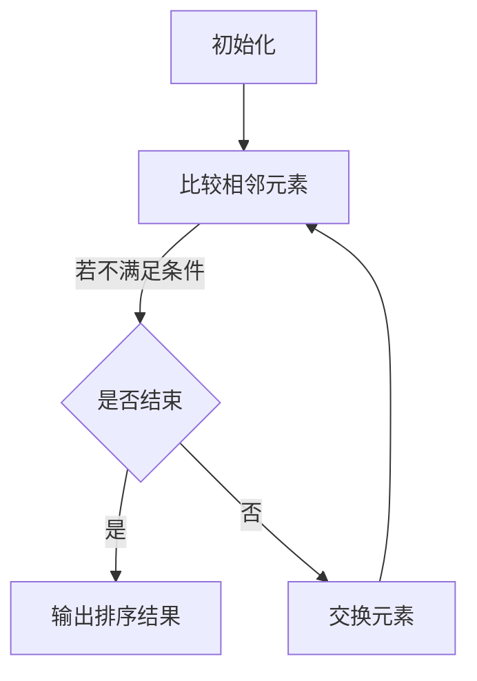
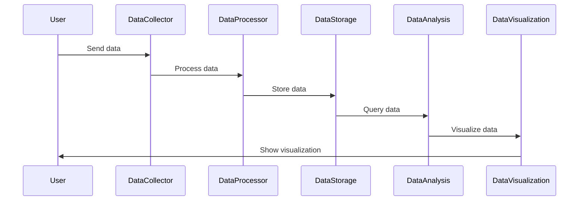

                 

### 第1章：问题背景

#### 1.1 问题描述

在当今的数字时代，虚拟世界与现实世界的边界日益模糊，人类生活逐渐被数字化信息所包围。从社交媒体到虚拟现实，从在线购物到远程工作，数字技术已经成为我们日常生活的重要组成部分。然而，这种数字化进程也带来了新的挑战和问题，尤其是在如何界定虚拟与现实的边界方面。

首先，我们需要明确虚拟和现实的概念。虚拟世界是一个由计算机技术创造的人工环境，用户可以在其中进行互动、娱乐和社交等活动。现实世界则是我们实际居住、工作和生活的物理空间。然而，随着虚拟现实（VR）、增强现实（AR）和混合现实（MR）等技术的发展，这两个世界的界限变得越来越模糊。

在虚拟世界中，用户可以通过VR头盔、AR眼镜等设备获得沉浸式的体验，仿佛置身于另一个世界中。这使得虚拟世界中的活动与现实世界的活动越来越相似。例如，一些公司已经开始使用VR进行虚拟会议，员工可以在虚拟会议室中面对面交流，而不必亲自到场。这种现象引发了关于虚拟与现实边界的一个关键问题：我们如何在虚拟世界中保持现实世界的真实性和责任感？

另一个问题是，随着数字技术的发展，越来越多的活动从现实世界转移到虚拟世界。这导致了现实世界中的社会联系和人际互动减少，而人们更多地依赖于虚拟世界的社交网络和互动。这种转变不仅影响了我们的心理健康，还可能对现实世界的社会结构和人际关系产生深远影响。

此外，虚拟世界中的信息传播速度非常快，信息的真实性难以验证。在社交媒体上，虚假信息和谣言可以迅速传播，对个人和整个社会造成负面影响。如何在虚拟世界中维护信息的真实性和可信度，也是一个亟待解决的问题。

总之，虚拟与现实边界的模糊化带来了许多新的挑战和问题。为了应对这些挑战，我们需要深入探讨虚拟与现实的关系，理解它们之间的互动，并寻找有效的解决方案。

#### 1.2 问题解决

为了应对虚拟与现实边界模糊化带来的挑战，我们可以从以下几个方面入手：

首先，我们需要加强虚拟现实技术的研发和应用，提高虚拟世界的真实感和沉浸感，使其更接近现实世界。通过不断改进VR、AR和MR技术，我们可以为用户提供更加丰富和真实的虚拟体验，从而更好地满足现实世界的需求。

其次，我们需要提高公众的数字素养和媒体素养，培养用户对虚拟世界中的信息进行批判性思考的能力。通过教育和社会宣传，我们可以帮助用户更好地理解虚拟世界的性质和限制，提高他们在虚拟世界中的辨别能力和自我保护意识。

第三，我们需要加强虚拟世界中的社会治理，确保信息的真实性和公正性。政府和相关机构可以制定相应的法律法规，规范虚拟世界中的行为和信息传播，防止虚假信息和谣言的传播。

此外，我们还需要探索如何通过虚拟世界与现实世界之间的互动，促进社会的发展和进步。例如，利用虚拟现实技术进行虚拟培训和教育，提高人们的技能和知识水平；利用虚拟现实技术进行远程医疗和远程教育，提高医疗和教育资源的利用效率。

最后，我们需要关注虚拟世界对现实世界的影响，特别是对心理健康和社会关系的影响。通过心理学和社会学的深入研究，我们可以更好地理解虚拟世界对人类行为和心理的影响，并提出相应的干预措施，帮助人们保持心理健康和社会联系。

通过上述措施，我们可以逐步解决虚拟与现实边界模糊化带来的挑战，实现虚拟世界与现实世界的有益互动，为人类社会的发展创造更多机会和可能性。

#### 1.3 边界与外延

虚拟与现实的边界并非一成不变，而是随着技术的发展和社会的变化而不断演变。首先，从技术角度来看，虚拟现实技术的发展使得虚拟世界与现实世界的边界越来越模糊。例如，VR和AR技术使得用户可以在虚拟环境中获得与现实世界几乎相同的感官体验，从而打破了传统的虚拟与现实之间的界限。其次，从社会角度来看，随着互联网和移动设备的普及，人们越来越多地将虚拟世界作为日常生活的一部分，这进一步模糊了虚拟与现实之间的界限。

虚拟与现实边界的动态性对个体和社会都产生了深远的影响。对个体而言，虚拟世界提供了一个全新的体验和互动方式，使得人们可以突破现实世界的限制，探索更多的可能性。然而，虚拟世界中的体验也可能会对个体的心理健康产生负面影响，例如增加孤独感、焦虑和抑郁等心理问题。此外，虚拟世界中的信息真实性和可信度问题也可能对个体的决策和行为产生误导。

对社会而言，虚拟与现实边界的模糊化对社会结构和人际关系产生了新的挑战。一方面，虚拟世界中的社交互动可能取代现实世界中的面对面交流，影响人们的社会联系和社区参与。另一方面，虚拟世界中的信息传播速度极快，虚假信息和谣言的传播可能会对社会的稳定和信任产生负面影响。

因此，理解虚拟与现实边界的动态性，并探索如何管理这种动态性，对于维护个体和社会的健康与稳定至关重要。这需要技术、政策和社会各界的共同努力，以实现虚拟世界与现实世界的良性互动。

#### 1.4 概念结构与核心要素组成

在探讨虚拟与现实边界的议题时，理解核心概念及其相互关系是至关重要的。以下是本文将涉及的核心概念及其组成要素：

1. **虚拟现实技术（Virtual Reality Technology）**：
   - **核心特点**：沉浸式体验、交互性、多感官刺激。
   - **组成要素**：硬件设备（如VR头盔、AR眼镜）、软件平台、内容创作工具。
   - **应用领域**：游戏、娱乐、教育、医疗、军事模拟等。

2. **人机交互（Human-Computer Interaction）**：
   - **基本原理**：理解用户的操作行为、需求与偏好。
   - **核心要素**：用户界面设计、交互模型、反馈机制。
   - **最新发展**：自然语言处理、手势识别、脑机接口等。

3. **数字伦理（Digital Ethics）**：
   - **基本原则**：尊重用户隐私、确保数据安全、维护社会正义。
   - **挑战**：算法偏见、信息传播不当、虚拟欺诈等。
   - **应用**：虚拟世界中的道德规范、网络行为准则。

4. **社会治理（Governance）**：
   - **基本概念**：管理虚拟世界的规则与机制。
   - **作用**：维护虚拟世界的秩序、保护用户权益、应对网络安全问题。
   - **策略**：制定相关法律法规、建立监管机构、促进国际合作。

这些核心概念相互作用，共同构成了探讨虚拟与现实边界问题的理论基础。通过对这些概念及其相互关系的深入分析，我们可以更好地理解虚拟与现实边界的复杂性和重要性，为未来的研究和实践提供指导。接下来，我们将进一步探讨这些核心概念，分析它们在虚拟与现实关系中的具体作用和影响。

## 第2章：核心概念与联系

### 2.1 虚拟现实技术

#### 2.1.1 虚拟现实技术概述

虚拟现实技术（Virtual Reality，简称VR）是一种通过计算机生成的虚拟环境，使用户能够在其中进行沉浸式体验的技术。VR技术的核心在于创造一个逼真的虚拟世界，让用户感觉仿佛真的置身其中。这个虚拟环境可以是完全虚拟的，也可以是现实世界的增强版本，通过增强现实（Augmented Reality，AR）技术实现。

VR技术的原理主要基于以下几点：

1. **三维建模**：使用计算机图形学技术创建三维模型，包括场景、角色、物体等。
2. **传感器技术**：利用头戴式显示器（HMD）、传感器手套、定位追踪器等硬件设备，捕捉用户的动作和位置，提供沉浸式的视觉、听觉和触觉体验。
3. **实时渲染**：通过图形处理单元（GPU）进行实时渲染，确保虚拟环境中的图像和动作流畅自然。
4. **交互设计**：设计用户界面和交互方式，使用户能够自然地与虚拟环境进行互动。

虚拟现实技术的核心特点包括：

- **沉浸感**：用户感觉自己完全置身于虚拟环境中，难以区分虚拟与现实。
- **交互性**：用户可以通过视觉、听觉和触觉等多种方式与虚拟环境互动。
- **多感官刺激**：通过多感官的融合，增强用户的沉浸体验。

VR技术的主要应用领域包括：

1. **游戏与娱乐**：VR技术为游戏提供了全新的体验方式，用户可以在虚拟世界中自由探索和互动。
2. **教育与培训**：通过虚拟环境，学生和员工可以身临其境地学习或进行培训，提高学习效果和培训效率。
3. **医疗与健康**：VR技术在心理健康治疗、远程医疗、手术模拟等领域有广泛应用。
4. **军事与国防**：通过虚拟仿真技术，进行军事训练和战术模拟，提高军队的战斗力。
5. **设计与工程**：设计师和工程师可以使用VR技术进行产品设计和工程模拟，提高设计和工程的效率和质量。

#### 2.1.2 虚拟现实技术的核心特点

虚拟现实技术的核心特点主要体现在以下几个方面：

1. **沉浸感**：通过头戴式显示器和传感器设备，用户可以看到三维的虚拟环境，仿佛真的置身其中。这种沉浸感不仅提高了用户的体验质量，还可以用于心理治疗，帮助用户克服恐惧和焦虑。

2. **交互性**：用户可以通过手势、声音、动作等多种方式与虚拟环境进行互动，实现真正的沉浸式体验。这种交互性使得用户不仅可以观看虚拟环境，还可以在其中进行操作和探索，提高了虚拟环境的实用性和吸引力。

3. **多感官刺激**：虚拟现实技术通过视觉、听觉和触觉等多种感官的刺激，增强用户的沉浸体验。例如，用户可以通过VR设备听到虚拟环境中的声音，感受到虚拟物体带来的触觉反馈，这些多感官的融合使得虚拟环境更加真实和生动。

4. **实时渲染**：虚拟现实技术需要实时渲染出高质量的图像和动作，确保用户在虚拟环境中的体验流畅自然。这种实时渲染技术依赖于强大的计算能力和高效的图形处理算法，是实现高质量虚拟现实体验的关键。

5. **个性化定制**：虚拟现实技术可以根据用户的偏好和需求，定制个性化的虚拟环境。这种个性化定制不仅可以提高用户的体验质量，还可以用于特定场景的应用，如医学模拟、军事训练等。

#### 2.1.3 虚拟现实技术的主要应用领域

虚拟现实技术因其独特的沉浸感和交互性，在多个领域展现出了巨大的应用潜力：

1. **游戏与娱乐**：虚拟现实技术为游戏和娱乐产业带来了革命性的变化。用户可以在虚拟环境中体验全新的游戏玩法，如沉浸式冒险游戏、虚拟现实音乐会等。虚拟现实技术还可以用于娱乐体验，如虚拟旅游、虚拟电影院等，为用户带来更加丰富和多样化的娱乐选择。

2. **教育与培训**：虚拟现实技术在教育领域具有广泛的应用前景。通过虚拟现实技术，学生可以在虚拟环境中进行实验、参观博物馆、模拟历史事件等，提高学习兴趣和效果。虚拟现实技术还可以用于职业培训，如飞行模拟训练、医学手术模拟等，为培训提供更加真实和有效的手段。

3. **医疗与健康**：虚拟现实技术在医疗和健康领域有重要的应用价值。医生可以利用虚拟现实技术进行手术模拟、医疗培训、患者心理治疗等。例如，通过虚拟现实技术，医生可以进行复杂手术的预演，提高手术成功率；患者可以在虚拟环境中进行放松和康复训练，缓解焦虑和疼痛。

4. **军事与国防**：虚拟现实技术在军事和国防领域有广泛的应用。通过虚拟现实技术，士兵可以进行战术模拟、战场模拟、应急响应训练等，提高军事训练效果和作战能力。虚拟现实技术还可以用于军事模拟演习，减少实际训练的成本和风险。

5. **设计与工程**：虚拟现实技术在产品设计和工程领域有重要的应用价值。设计师和工程师可以通过虚拟现实技术进行产品原型设计、模拟测试、虚拟装配等，提高设计质量和工程效率。例如，汽车设计师可以利用虚拟现实技术进行汽车外观和内部设计的预览和修改，工程师可以通过虚拟现实技术进行机械装配的模拟和优化。

6. **房地产与旅游**：虚拟现实技术可以用于房地产和旅游领域，提供虚拟看房、虚拟旅游等服务。用户可以在虚拟环境中参观房屋、景点，获得更加真实和直观的体验。例如，购房者可以通过虚拟现实技术了解房屋的布局和装修效果，旅游者可以通过虚拟现实技术体验不同景点的风貌和历史文化。

7. **心理咨询与治疗**：虚拟现实技术在心理咨询和治疗领域有重要的应用价值。通过虚拟现实技术，心理医生可以进行虚拟情境治疗、恐惧症治疗等，帮助患者克服心理障碍。例如，患有恐惧症的患者可以在虚拟环境中逐步面对和克服他们的恐惧，提高治疗效果。

8. **艺术与文化**：虚拟现实技术可以用于艺术和文化领域，提供虚拟展览、虚拟演出等服务。通过虚拟现实技术，艺术家和文化机构可以创造出更加丰富和互动的艺术体验，吸引更多的观众和参与者。例如，虚拟博物馆可以提供三维展示和互动体验，虚拟音乐会可以为观众提供沉浸式的听觉和视觉享受。

虚拟现实技术在各个领域的应用正在不断拓展和深化，未来将会有更多的创新应用出现，为社会发展和人类生活带来更多便利和可能性。

### 2.2 人机交互

#### 2.2.1 人机交互的基本原理

人机交互（Human-Computer Interaction，简称HCI）是研究人与计算机系统之间交互的方式、方法和效果的科学。其基本原理主要涉及以下几个方面：

1. **用户行为分析**：通过观察和分析用户在计算机系统中的操作行为，了解用户的需求、偏好和行为模式。这包括用户的输入方式、交互频率、操作习惯等。

2. **系统响应机制**：计算机系统应能够实时响应用户的操作，提供及时的反馈和信息。这包括对用户输入的识别、处理和响应，确保系统的操作流畅性和用户体验。

3. **界面设计**：用户界面（User Interface，简称UI）是用户与计算机系统进行交互的主要渠道。界面设计应简洁、直观、易于使用，降低用户的学习成本和操作难度。

4. **用户体验**：用户体验（User Experience，简称UX）是衡量人机交互系统优劣的重要指标。它包括用户在使用系统过程中的感受、满意度和满意度。良好的用户体验能够提高用户的生产力、效率和满意度。

人机交互的基本原理在计算机系统的设计和开发过程中具有重要意义。首先，它帮助设计师和开发者更好地理解用户需求和行为，从而设计出更加符合用户习惯和预期的系统。其次，它有助于提高系统的可用性、可靠性和用户体验，减少用户的学习成本和操作错误。最后，它有助于提高系统的安全性和隐私保护，确保用户数据的安全和隐私不被泄露。

#### 2.2.2 人机交互的核心要素

人机交互的核心要素包括以下几个方面：

1. **输入设备**：输入设备是用户与计算机系统进行交互的主要工具。常见的输入设备有键盘、鼠标、触摸屏、语音识别、手势识别等。每种输入设备都有其独特的特点和适用场景，设计师应根据具体需求选择合适的输入设备。

2. **输出设备**：输出设备用于将计算机系统的处理结果展示给用户。常见的输出设备有显示器、扬声器、触摸屏、3D眼镜等。输出设备应能够提供高质量的视觉、听觉和触觉体验，以增强用户的沉浸感和互动性。

3. **交互界面**：交互界面是用户与计算机系统进行交互的中介。它包括图形用户界面（GUI）、命令行界面（CLI）、触摸界面、语音界面等。交互界面应简洁、直观、易于使用，以便用户能够快速掌握和操作。

4. **反馈机制**：反馈机制是确保人机交互顺畅的重要环节。通过提供及时的反馈，系统可以帮助用户确认其操作的正确性，降低操作错误和风险。反馈机制包括视觉反馈、听觉反馈、触觉反馈等，应根据具体应用场景和用户需求进行设计。

5. **交互行为**：交互行为是指用户在计算机系统中的操作和互动。它包括浏览、搜索、选择、编辑、创建等。交互行为的设计应考虑用户的行为习惯和操作需求，以提高用户的生产力和满意度。

6. **用户体验**：用户体验是衡量人机交互系统优劣的重要指标。它包括用户在使用系统过程中的感受、满意度和满意度。良好的用户体验能够提高用户的生产力、效率和满意度。用户体验的设计应综合考虑用户的心理需求、情感需求和使用习惯。

通过深入理解人机交互的核心要素，设计师和开发者可以更好地设计出符合用户需求和预期的计算机系统，提高系统的可用性、可靠性和用户体验。

#### 2.2.3 人机交互技术的最新发展

人机交互技术近年来取得了显著的进展，不断推动着虚拟与现实边界的融合。以下是人机交互技术的几个关键发展：

1. **自然语言处理（NLP）**：自然语言处理技术使得计算机能够理解人类语言，实现更加自然的语音交互。例如，智能助手（如Siri、Alexa）和聊天机器人（Chatbot）已经广泛应用于智能手机、智能家居和在线客服等领域。

2. **手势识别**：手势识别技术通过摄像头或传感器捕捉用户的手部动作，实现非接触式的交互。例如，微软的Kinect传感器和苹果的FaceTime视频通话应用都采用了手势识别技术。

3. **脑机接口（BMI）**：脑机接口技术通过读取大脑信号，实现用户意识与计算机系统的直接连接。虽然这项技术目前还处于实验阶段，但它在医疗、军事和游戏领域有巨大的应用潜力。

4. **增强现实（AR）与虚拟现实（VR）**：增强现实和虚拟现实技术为人机交互带来了全新的体验。通过AR技术，用户可以在现实环境中叠加虚拟内容；而VR技术则提供了完全沉浸式的虚拟环境。这些技术使得人机交互更加直观、生动和高效。

5. **多模态交互**：多模态交互结合了视觉、听觉、触觉等多种感官的输入和输出，提供更加丰富和自然的交互体验。例如，虚拟现实游戏中的触觉反馈和情感计算（通过分析用户的情绪变化进行自适应调整）。

6. **个性化交互**：随着大数据和人工智能技术的发展，人机交互系统可以根据用户的偏好和习惯进行个性化调整，提供更加个性化的服务和体验。

这些最新发展不仅提升了人机交互的效率和体验，也为虚拟与现实边界的探索带来了新的可能性。在未来，随着技术的进一步进步，人机交互将继续向更加自然、智能和个性化的方向发展。

### 2.3 数字伦理

#### 2.3.1 数字伦理的基本原则

数字伦理是指在社会信息网络时代，人们在数字领域中所遵循的道德规范和伦理准则。随着互联网和数字技术的迅速发展，数字伦理逐渐成为一个重要的研究领域，其基本原则包括：

1. **隐私保护**：保护个人隐私是数字伦理的首要原则。在数字环境中，个人数据容易受到侵害，因此需要严格保护用户的个人信息，确保数据不被未经授权的第三方访问和滥用。

2. **信息安全**：保障信息安全是数字伦理的核心内容。数字世界中的信息传输和存储面临着各种安全威胁，如黑客攻击、数据泄露等。因此，需要采取有效的安全措施，确保信息系统的安全性和可靠性。

3. **公正性**：数字伦理要求在数字环境中维护公正性，确保技术和服务公平地服务于所有用户。算法偏见、数据歧视等问题都可能影响公正性，因此需要制定相应的规范和政策，消除不公正现象。

4. **透明度**：数字伦理强调透明度，要求数字平台和算法的运作过程对用户公开透明，使用户能够了解自己的数据如何被收集、使用和共享。

5. **社会责任**：数字技术的发展和应用应当服务于社会公共利益，促进社会的发展和进步。企业和个人在使用数字技术时，应当承担社会责任，避免对社会造成负面影响。

#### 2.3.2 数字伦理面临的挑战

数字伦理在实践过程中面临诸多挑战，主要体现在以下几个方面：

1. **算法偏见**：算法偏见是指算法在处理数据时表现出歧视性的倾向。例如，招聘算法可能对某些种族或性别有歧视，推荐系统可能对特定用户群体提供不公平的推荐。这需要通过算法透明化和公平性设计来缓解。

2. **数据泄露**：随着数据量的增加，数据泄露的风险也在加大。一次数据泄露可能涉及成千上万的用户信息，对用户隐私和安全造成严重威胁。因此，需要加强数据保护措施，防止数据泄露。

3. **隐私侵犯**：数字技术使得个人隐私更容易被侵犯。社交媒体、电子商务平台等收集了大量用户数据，可能用于商业目的或不当行为。这需要通过法律和政策手段来规范数据的收集和使用。

4. **信息不对称**：在数字环境中，信息不对称现象普遍存在。某些平台或企业可能掌握大量用户数据，而用户对这些数据的使用和影响缺乏了解和控制。这需要提高公众的数字素养，增强用户对数字信息的识别和应对能力。

5. **社会不平等**：数字技术的发展可能加剧社会不平等。例如，经济条件较差的家庭可能无法享受到数字技术带来的便利，而富裕家庭则能够获取更多资源和机会。这需要社会各界的共同努力，确保数字技术的普及和公平应用。

#### 2.3.3 数字伦理在社会治理中的应用

数字伦理在社会治理中发挥着重要作用，以下是其主要应用：

1. **法律法规制定**：政府应制定相关法律法规，规范数字领域的行为，保护用户隐私和信息安全。例如，《通用数据保护条例》（GDPR）就是一项重要的数字伦理法律，旨在保护欧洲地区的用户隐私。

2. **监管机构设立**：政府可以设立专门的监管机构，负责监督数字领域的合规性和公正性，确保数字技术不会对用户和社会造成负面影响。

3. **技术标准制定**：行业协会和标准组织可以制定数字伦理技术标准，指导企业和开发者遵循伦理原则，确保数字产品的安全和公平。

4. **教育普及**：政府、企业和教育机构应开展数字伦理教育，提高公众的数字素养，帮助用户理解数字伦理的基本原则和重要性。

5. **社会监督**：公众和媒体可以发挥监督作用，揭露数字领域的违法行为和不公正现象，推动社会对数字伦理的关注和改进。

通过上述措施，数字伦理可以更好地应用于社会治理，促进数字技术和数字社会的健康发展。

### 2.4 社会治理

#### 2.4.1 社会治理的基本概念

社会治理是指通过政府、企业、社会团体和公众等多方合作，共同管理社会事务、解决社会问题、维护社会秩序和促进社会发展的过程。社会治理涵盖了社会管理、公共服务、环境保护、公共安全、社会建设等多个方面，是一个多层次、多维度的复杂体系。

在数字时代，社会治理面临着前所未有的挑战和机遇。数字技术的迅猛发展不仅改变了社会运行的方式，也对社会治理提出了新的要求。传统的治理模式和方法难以应对数字时代的问题和挑战，需要创新和变革。

首先，数字技术为社会治理提供了新的工具和方法。例如，大数据和人工智能技术可以用于数据分析、智能决策、公共服务优化等，提高社会治理的效率和效果。通过大数据分析，政府可以更好地了解社会需求和问题，制定更加精准和有效的政策。

其次，数字技术也为社会治理带来了新的挑战。数字技术的快速发展使得信息传播更加迅速和广泛，同时也带来了信息安全、隐私保护、数据滥用等问题。此外，数字技术的普及和应用可能导致社会不平等和数字鸿沟的加剧，需要政府和社会各界共同关注和解决。

#### 2.4.2 社会治理在虚拟世界中的作用

在虚拟世界中，社会治理同样具有重要意义。虚拟世界是一个由数字技术构建的虚拟环境，用户在其中进行各种活动，如社交、娱乐、购物、学习和工作等。虚拟世界中的社会治理不仅涉及技术问题，还包括道德、法律、社会规范等多个方面。

首先，虚拟世界中的社会治理需要维护网络秩序和安全。虚拟世界中的信息传播速度快、范围广，容易导致谣言、欺诈等不良现象的传播。因此，需要建立有效的监管机制，防止不良信息的传播，保障虚拟世界的健康运行。

其次，虚拟世界中的社会治理需要保护用户隐私和信息安全。虚拟世界中的用户数据量巨大，涉及个人信息、行为记录、财务信息等敏感数据。如果这些数据被未经授权的第三方访问和滥用，将严重损害用户的利益和隐私权。因此，需要制定严格的数据保护政策，加强数据安全管理，确保用户数据的安全和隐私。

此外，虚拟世界中的社会治理还需要关注社会不平等和数字鸿沟的问题。虚拟世界的发展可能加剧社会不平等，导致部分群体无法享受到数字技术的便利。因此，需要制定相应的政策和措施，促进数字技术的普及和公平应用，缩小数字鸿沟。

最后，虚拟世界中的社会治理还需要维护公平竞争和良好商业环境。虚拟世界中的商业活动日益繁荣，但也存在不正当竞争、虚假广告、知识产权侵权等问题。需要建立公平、公正、透明的市场规则，打击违法行为，保护消费者权益，促进虚拟世界的健康发展。

#### 2.4.3 社会治理面临的挑战与应对策略

尽管虚拟世界的治理具有重要意义，但也面临着诸多挑战。以下是社会治理在虚拟世界中面临的几个主要挑战及应对策略：

1. **信息传播速度与准确性**：虚拟世界中的信息传播速度极快，但同时也可能导致虚假信息、谣言等不良信息的快速扩散。应对策略包括：
   - 建立快速响应机制，及时发现和处置虚假信息。
   - 加强信息审核和监管，确保信息的真实性和准确性。
   - 提高公众的媒体素养和信息识别能力，增强公众对虚假信息的免疫力。

2. **用户隐私保护**：虚拟世界中的用户数据量巨大，涉及敏感个人信息。应对策略包括：
   - 制定严格的数据保护法律和政策，明确数据收集、使用和共享的规范。
   - 加强数据安全管理，采取加密、匿名化等技术手段保护用户隐私。
   - 提高公众的隐私保护意识，增强用户对隐私保护的需求和诉求。

3. **网络安全**：虚拟世界中的网络安全问题日益突出，包括黑客攻击、数据泄露、网络诈骗等。应对策略包括：
   - 加强网络安全防护，建立多层次的安全防护体系。
   - 提高网络安全技术水平，采用先进的加密和防护技术。
   - 加强网络安全教育，提高用户的网络安全意识和应对能力。

4. **社会不平等和数字鸿沟**：虚拟世界的发展可能加剧社会不平等和数字鸿沟。应对策略包括：
   - 制定公平的数字政策，确保数字技术的普及和公平应用。
   - 加强数字素养教育，提高公众的数字技能和认知能力。
   - 提供数字基础设施支持，缩小城乡和区域之间的数字鸿沟。

5. **公平竞争和商业环境**：虚拟世界中的商业活动需要建立公平、公正、透明的市场环境。应对策略包括：
   - 制定公平竞争的法律和政策，打击不正当竞争、虚假广告和知识产权侵权行为。
   - 加强市场监管，确保市场的透明度和公平性。
   - 建立消费者权益保护机制，保护消费者的合法权益。

通过上述应对策略，我们可以更好地应对虚拟世界中的治理挑战，维护虚拟世界的健康发展和用户的合法权益。未来，随着数字技术的不断进步，社会治理在虚拟世界中的作用将越来越重要，需要政府、企业、社会团体和公众的共同努力。

## 第3章：算法原理讲解

### 3.1 算法概述

#### 3.1.1 算法的定义与分类

算法是计算机科学中一个基本且重要的概念，它指的是解决问题的一系列步骤或规则。算法不仅用于计算机编程，也广泛应用于数学、工程学、经济学等领域。算法的定义可以概括为：一个算法是一系列明确的指令，用于解决特定问题，并能在有限步骤内产生正确的输出。

根据不同的分类标准，算法可以划分为多种类型：

1. **按功能分类**：
   - **搜索算法**：用于在数据集合中查找特定元素，如二分查找、深度优先搜索等。
   - **排序算法**：用于对数据集合进行排序，如冒泡排序、快速排序、归并排序等。
   - **图算法**：用于处理图数据结构，如最短路径算法、最小生成树算法等。
   - **动态规划算法**：用于求解具有最优子结构性质的问题，如背包问题、最长公共子序列等。

2. **按时间复杂度分类**：
   - **常数时间算法**：运行时间不依赖于输入规模，如常数时间排序算法。
   - **对数时间算法**：运行时间与输入规模的以2为底的对数成比例，如对数查找算法。
   - **线性时间算法**：运行时间与输入规模成正比，如线性查找算法、插入排序算法。
   - **非线性时间算法**：运行时间与输入规模的平方、立方等成比例，如快速排序算法。

3. **按空间复杂度分类**：
   - **原地算法**：不需要额外空间，如原地排序算法。
   - **非原地算法**：需要额外空间，如归并排序算法。

4. **按实现方法分类**：
   - **递归算法**：通过递归调用自身解决子问题，如快速排序、斐波那契数列求解等。
   - **迭代算法**：使用循环结构逐步解决问题，如冒泡排序、插入排序等。

#### 3.1.2 算法的基本原理

算法的基本原理在于如何有效地解决问题，其核心包括以下几个关键点：

1. **输入**：算法需要明确输入数据，这些数据可以是具体的数值、结构化的数据集合等。

2. **处理过程**：算法通过一系列操作对输入数据进行处理，这些操作可以是计算、比较、交换等。

3. **输出**：算法在处理完成后输出结果，这些结果可以是具体的数值、排序后的数组等。

4. **终止条件**：算法需要有一个明确的终止条件，以确保在有限步骤内停止运行。

算法的设计和实现需要考虑时间复杂度、空间复杂度和可扩展性等多个方面。一个好的算法不仅能够在合理的时间内解决问题，还需要占用尽可能少的资源，并能够适应不同规模和类型的问题。

#### 3.1.3 算法在虚拟与现实边界探索中的应用

算法在虚拟与现实边界探索中的应用非常广泛，以下是一些典型的应用场景：

1. **虚拟现实（VR）技术**：
   - **图像渲染**：在VR系统中，算法用于渲染虚拟环境中的图像，提供高质量的视觉效果。例如，使用图形处理单元（GPU）实现的实时渲染算法，可以生成逼真的虚拟场景。
   - **传感器数据处理**：虚拟现实系统中的传感器（如头戴显示器、手柄等）会产生大量的数据，算法用于处理和分析这些数据，为用户提供沉浸式体验。

2. **增强现实（AR）技术**：
   - **图像识别**：AR技术需要识别现实环境中的图像或物体，算法用于实现图像识别和目标跟踪，帮助AR系统在现实环境中叠加虚拟内容。
   - **实时交互**：AR系统需要实时响应用户的操作，算法用于处理用户的输入，如手势识别、语音识别等，实现与虚拟内容的互动。

3. **人机交互**：
   - **自然语言处理**：通过算法实现自然语言处理，用户可以使用自然语言与计算机系统进行交互，如智能助手、聊天机器人等。
   - **手势识别**：算法用于识别用户的手势，实现非接触式的交互，如虚拟现实游戏、虚拟现实健身等。

4. **数字伦理**：
   - **隐私保护**：算法用于分析用户行为和隐私需求，实现个性化隐私保护策略，确保用户隐私不被泄露。
   - **信息过滤**：算法用于过滤和识别虚假信息、不良信息，确保信息传播的准确性和公正性。

5. **社会治理**：
   - **数据挖掘**：算法用于挖掘和分析大量数据，为政府和相关机构提供决策支持，如社会舆情分析、公共安全预警等。
   - **行为预测**：算法用于预测用户行为和社会趋势，为政策制定和资源分配提供依据。

通过算法的应用，虚拟与现实边界得以不断拓展和深化，为人类社会带来了前所未有的机遇和挑战。未来，随着算法技术的不断进步，其在虚拟与现实边界探索中的应用将更加广泛和深入。

### 3.2 算法流程图

为了更好地理解算法的设计和实现过程，我们可以使用Mermaid流程图来展示算法的步骤和逻辑。以下是一个简单的排序算法——冒泡排序的Mermaid流程图：



接下来，我们将使用Python代码实现这个冒泡排序算法，并通过注释详细解释每一步的执行过程。

```python
# 冒泡排序算法实现
def bubble_sort(arr):
    n = len(arr)
    # 外层循环，每一轮遍历都会将最大的元素放到数组的末尾
    for i in range(n):
        # 内层循环，每次遍历都会比较相邻的元素，并进行交换
        for j in range(0, n-i-1):
            # 如果前一个元素比后一个元素大，则交换它们
            if arr[j] > arr[j+1]:
                arr[j], arr[j+1] = arr[j+1], arr[j]
    return arr

# 测试冒泡排序算法
arr = [64, 34, 25, 12, 22, 11, 90]
sorted_arr = bubble_sort(arr)
print("排序后的数组：", sorted_arr)
```

在上述代码中，我们首先定义了一个名为`bubble_sort`的函数，它接受一个数组`arr`作为输入，并返回排序后的数组。函数中包含两个嵌套的循环：外层循环用于确定需要进行多少轮比较，内层循环用于在每轮中比较并交换相邻的元素。

通过这个示例，我们可以看到如何使用Mermaid流程图和Python代码结合来讲解算法原理，使得算法的设计和实现过程更加清晰易懂。

### 3.3 算法数学模型

#### 3.3.1 数学模型概述

算法的数学模型是算法设计和分析的重要工具，它通过数学公式和逻辑关系描述算法的计算过程和性能。在算法分析中，数学模型主要用于评估算法的时间复杂度和空间复杂度，为算法的选择和优化提供依据。

算法的数学模型通常包括以下几个核心组成部分：

1. **输入**：算法接收的输入数据，通常用变量表示。
2. **处理过程**：算法的处理步骤，包括计算、比较、交换等操作。
3. **输出**：算法的处理结果，通常也是一个变量。
4. **终止条件**：算法停止执行的条件，例如当输入数据全部处理完毕或达到某一特定目标时。

在算法分析中，常用的数学模型包括递归模型和迭代模型。递归模型通过递归函数描述算法的计算过程，例如快速排序和递归求解斐波那契数列；迭代模型则通过循环结构描述算法的计算过程，例如冒泡排序和循环求解线性方程组。

#### 3.3.2 公式讲解

在算法分析中，常用的公式包括时间复杂度和空间复杂度的计算公式。以下是这两个复杂度的定义和计算方法：

1. **时间复杂度（Time Complexity）**：
   - **定义**：算法在执行过程中所需的计算次数，通常用大O符号表示，如\(O(n)\)、\(O(n^2)\)等。
   - **计算方法**：通过分析算法中各部分的计算次数，确定算法的时间复杂度。
   - **示例公式**：
     \[
     T(n) = \sum_{i=1}^{n} c_i \cdot n_i
     \]
     其中，\(T(n)\)表示算法的时间复杂度，\(c_i\)表示第\(i\)部分操作的计算次数，\(n_i\)表示第\(i\)部分操作与输入规模\(n\)的关系。

2. **空间复杂度（Space Complexity）**：
   - **定义**：算法在执行过程中所需的空间大小，通常用大O符号表示，如\(O(1)\)、\(O(n)\)等。
   - **计算方法**：通过分析算法中各部分占用的空间大小，确定算法的空间复杂度。
   - **示例公式**：
     \[
     S(n) = \sum_{i=1}^{n} s_i \cdot n_i
     \]
     其中，\(S(n)\)表示算法的空间复杂度，\(s_i\)表示第\(i\)部分操作占用的空间大小，\(n_i\)表示第\(i\)部分操作与输入规模\(n\)的关系。

#### 3.3.3 举例说明

为了更好地理解算法的数学模型，我们可以通过一个具体的例子进行说明。

**例子：快速排序算法**

快速排序是一种常用的排序算法，其基本思想是通过递归地将输入数组分成较小和较大的子数组，然后对子数组进行递归排序，最终实现整个数组的排序。

**快速排序算法的数学模型**：

1. **输入**：一个未排序的数组\(arr\)。
2. **处理过程**：选择一个基准元素，将数组划分为两个子数组，一个包含小于基准元素的元素，另一个包含大于基准元素的元素。然后对这两个子数组递归地执行快速排序。
3. **输出**：一个已排序的数组。
4. **终止条件**：当子数组的长度为1或0时，递归结束。

**快速排序算法的时间复杂度**：

快速排序算法的时间复杂度取决于基准元素的选择和数组的初始状态。在最坏情况下，当数组已排序或完全逆序时，时间复杂度为\(O(n^2)\)；在平均情况下，时间复杂度为\(O(n \log n)\)。

**快速排序算法的空间复杂度**：

快速排序算法的空间复杂度主要取决于递归调用的次数。在最坏情况下，空间复杂度为\(O(n^2)\)；在平均情况下，空间复杂度为\(O(\log n)\)。

**数学模型公式**：

假设快速排序算法的递归函数为\(QuickSort(arr, low, high)\)，其中\(arr\)为输入数组，\(low\)和\(high\)分别为子数组的起始和结束索引。快速排序算法的时间复杂度和空间复杂度可以分别表示为：

1. **时间复杂度**：
   \[
   T(n) = \sum_{i=1}^{n} T(i-1) + T(n-i) + O(n)
   \]
2. **空间复杂度**：
   \[
   S(n) = \sum_{i=1}^{n} O(\log i)
   \]

通过这个例子，我们可以看到如何通过数学模型分析快速排序算法的性能，了解其时间复杂度和空间复杂度，从而为算法的选择和优化提供参考。

## 第4章：系统分析与架构设计方案

### 4.1 问题场景介绍

在当前数字化和智能化时代，许多行业和组织面临着如何高效管理和分析大量数据的需求。以某大型零售公司为例，该公司每天会产生数百万条销售记录、客户互动数据和库存数据。这些数据对于公司的业务决策和运营优化具有重要意义。然而，如何有效地收集、存储、处理和分析这些数据，成为一个重要的挑战。

为了应对这一挑战，该公司决定开发一个数据管理系统，通过整合和优化现有的数据资源，提升数据处理的效率和准确性。这个系统需要具备以下几个关键功能：

1. **数据采集**：从各种数据源（如POS系统、电子商务平台、社交媒体等）收集数据。
2. **数据存储**：将采集到的数据存储在高效、可靠的数据仓库中。
3. **数据处理**：对存储的数据进行清洗、转换和聚合，以供分析和查询使用。
4. **数据分析**：提供强大的数据分析功能，支持各种数据挖掘和报告生成。
5. **数据可视化**：通过可视化工具，将数据分析结果以直观的方式呈现给用户。

### 4.2 项目介绍

该项目旨在构建一个高效、灵活和可扩展的数据管理系统，以支持公司业务的智能化和数字化转型。项目的主要目标是：

- 提高数据收集和处理效率，降低人工成本。
- 提升数据分析和报告的准确性和及时性，支持业务决策。
- 实现数据资源的集中管理和共享，提高数据利用率。
- 通过数据可视化，帮助管理层更好地理解业务趋势和问题。

项目的技术栈包括以下关键组件：

1. **数据采集**：使用ETL（提取、转换、加载）工具，如Apache Kafka和Apache NiFi，实现数据的实时采集和预处理。
2. **数据存储**：采用大数据存储技术，如Apache Hadoop和Apache Hive，存储和管理大规模数据集。
3. **数据处理**：利用Apache Spark进行高效的数据处理和分析，支持实时和批处理任务。
4. **数据分析**：使用业务智能工具，如Tableau和PowerBI，提供数据可视化和分析功能。
5. **数据安全**：采用数据加密、权限管理和日志审计等措施，确保数据的安全性和合规性。

### 4.3 系统功能设计

为了实现上述项目目标，系统需要设计以下关键功能模块：

1. **数据采集模块**：
   - 功能：从各种数据源（如POS系统、电子商务平台、社交媒体等）采集数据。
   - 技术实现：使用ETL工具（如Apache Kafka和Apache NiFi）进行数据实时采集和预处理。
   - 数据流程：数据通过Kafka进行实时传输，然后通过NiFi进行数据清洗、转换和加载到数据仓库中。

2. **数据存储模块**：
   - 功能：存储和管理大规模数据集，支持数据的随机访问和查询。
   - 技术实现：使用Hadoop和Hive进行数据存储和管理。
   - 数据架构：数据存储在HDFS（Hadoop分布式文件系统）中，通过Hive进行结构化查询和数据分析。

3. **数据处理模块**：
   - 功能：对存储的数据进行清洗、转换和聚合，以供分析和查询使用。
   - 技术实现：使用Spark进行高效的数据处理和分析。
   - 数据流程：Spark作业定期执行，对数据进行清洗、转换和聚合，生成分析结果。

4. **数据分析模块**：
   - 功能：提供强大的数据分析功能，支持各种数据挖掘和报告生成。
   - 技术实现：使用业务智能工具（如Tableau和PowerBI）进行数据可视化和分析。
   - 数据流程：通过Spark作业生成数据分析结果，然后通过Tableau和PowerBI进行可视化展示。

5. **数据可视化模块**：
   - 功能：将数据分析结果以直观的方式呈现给用户，帮助管理层更好地理解业务趋势和问题。
   - 技术实现：使用数据可视化工具（如Tableau和PowerBI）。
   - 数据流程：用户通过可视化界面查看和分析数据，生成报告和仪表盘。

### 4.4 系统架构设计

系统架构设计是确保项目成功的关键，以下是该数据管理系统的主要架构设计：

1. **数据采集层**：
   - 功能：从各种数据源采集数据，实现数据的实时传输和预处理。
   - 架构设计：使用Kafka作为消息队列，实现数据的实时传输。使用NiFi进行数据的采集、清洗和转换。

2. **数据处理层**：
   - 功能：对采集到的数据进行处理和分析，支持实时和批处理任务。
   - 架构设计：使用Spark作为计算引擎，进行数据的清洗、转换和聚合。Spark作业定期执行，处理和分析数据。

3. **数据存储层**：
   - 功能：存储和管理大规模数据集，支持数据的随机访问和查询。
   - 架构设计：使用Hadoop和Hive进行数据存储和管理。数据存储在HDFS中，通过Hive进行结构化查询。

4. **数据分析与可视化层**：
   - 功能：提供数据分析功能，支持数据挖掘和报告生成；通过可视化工具展示分析结果。
   - 架构设计：使用Tableau和PowerBI进行数据可视化和分析。通过API接口，用户可以通过Web界面查看和分析数据。

5. **数据安全层**：
   - 功能：确保数据的安全性和合规性，防止数据泄露和未经授权的访问。
   - 架构设计：采用数据加密、权限管理和日志审计等措施，确保数据的安全性。

### 4.5 系统接口设计

系统接口设计是确保不同模块之间能够高效、安全地通信的重要环节。以下是该数据管理系统的主要接口设计：

1. **Kafka接口**：
   - 功能：实现数据实时传输和消费。
   - 设计：Kafka Producer负责将数据发送到Kafka主题，Kafka Consumer负责从Kafka主题中消费数据。

2. **NiFi接口**：
   - 功能：实现数据的采集、清洗和转换。
   - 设计：使用NiFi流程图进行数据处理的定义和配置，通过NiFi API进行流程的执行和管理。

3. **HDFS接口**：
   - 功能：实现数据的存储和访问。
   - 设计：通过HDFS REST API进行数据的上传、下载和查询。

4. **Hive接口**：
   - 功能：实现数据的结构化查询和分析。
   - 设计：使用HiveQL进行数据的查询和分析，通过Hive Server进行交互。

5. **Spark接口**：
   - 功能：实现高效的数据处理和分析。
   - 设计：使用Spark API进行数据操作和分析，通过Spark UI监控和分析Spark作业的性能。

6. **Tableau接口**：
   - 功能：实现数据可视化。
   - 设计：通过Tableau连接器连接到数据仓库，使用Tableau Desktop进行数据可视化设计。

7. **PowerBI接口**：
   - 功能：实现数据可视化。
   - 设计：通过PowerBI Desktop连接到数据仓库，使用PowerBI报告进行数据可视化设计。

### 4.6 系统交互序列图

系统交互序列图用于描述系统中各个模块之间的交互过程，以下是该数据管理系统的交互序列图：



在这个序列图中，用户首先向数据采集模块发送数据。数据采集模块将数据传递给数据处理模块，进行处理后存储到数据存储模块。然后，数据存储模块将数据提供给数据分析模块进行查询和分析。最后，数据分析模块将结果传递给数据可视化模块，生成可视化报告并展示给用户。

通过系统架构设计和接口设计，该数据管理系统可以实现高效、可靠的数据采集、存储、处理和分析，为企业的数字化转型提供强有力的支持。

### 4.7 系统接口设计

系统接口设计是确保数据管理系统各模块之间能够高效、安全地进行通信和数据交换的关键环节。以下是该数据管理系统的主要接口设计：

1. **API接口**：
   - 功能：提供系统内部模块之间的数据交换和功能调用。
   - 设计：采用RESTful API设计，使用JSON格式传输数据。

2. **Web服务接口**：
   - 功能：通过Web服务向外部系统提供数据访问和功能调用。
   - 设计：使用SOAP和HTTP协议，提供安全、可靠的服务。

3. **数据存储接口**：
   - 功能：与数据存储层（如HDFS、Hive等）进行数据读写操作。
   - 设计：使用HDFS REST API和HiveServer2接口，实现数据存储和访问。

4. **消息队列接口**：
   - 功能：实现数据采集和处理模块之间的异步通信。
   - 设计：使用Kafka API，实现数据的实时传输和消费。

5. **数据采集接口**：
   - 功能：与外部数据源（如POS系统、电子商务平台等）进行数据采集。
   - 设计：使用ETL工具（如Apache NiFi）进行数据的采集、清洗和转换。

6. **数据可视化接口**：
   - 功能：提供数据可视化功能，支持各种图表和报表的生成。
   - 设计：使用可视化工具（如Tableau、PowerBI）的API接口，实现数据可视化展示。

7. **用户认证接口**：
   - 功能：提供用户认证和授权功能，确保数据安全和用户权限控制。
   - 设计：采用OAuth 2.0协议，实现用户的身份验证和授权。

8. **监控与告警接口**：
   - 功能：监控系统运行状态，提供实时监控和告警功能。
   - 设计：使用Prometheus和Grafana等监控工具，实现系统性能监控和告警。

通过这些接口设计，系统各模块之间能够高效、安全地进行数据交换和功能调用，确保数据管理系统的稳定运行和性能优化。

### 4.8 系统交互序列图

系统交互序列图展示了数据管理系统内部各模块之间的交互过程，有助于理解系统的运行逻辑和数据流。以下是该数据管理系统的交互序列图：

```mermaid
sequenceDiagram
    participant User
    participant DataCollector
    participant DataProcessor
    participant DataStorage
    participant DataAnalysis
    participant DataVisualization
    participant Security

    User->>DataCollector: Send request
    DataCollector->>User: Authenticate
    User->>DataCollector: Provide credentials
    DataCollector->>DataProcessor: Pass data
    DataProcessor->>DataStorage: Store data
    DataStorage->>DataAnalysis: Query data
    DataAnalysis->>DataVisualization: Generate report
    DataVisualization->>User: Display visualization
    alt Monitor
    User->>Security: Monitor system
    Security->>User: Send alert
    alt Update
    User->>DataCollector: Update data
    DataCollector->>DataProcessor: Re-process data
```

在这个序列图中，用户首先向数据采集模块发送请求。数据采集模块对用户进行身份验证，确保用户具备访问权限。接着，数据采集模块将数据传递给数据处理模块进行处理。处理后的数据存储到数据存储模块。随后，数据存储模块向数据分析模块查询数据，生成报告。数据分析模块将报告传递给数据可视化模块，生成可视化结果并展示给用户。同时，用户可以通过监控系统实时监控系统运行状态，并在需要时更新数据或接收告警信息。

通过系统交互序列图，我们可以清晰地看到各模块之间的交互过程和数据流，有助于确保系统的稳定运行和高效管理。

## 第5章：项目实战

### 5.1 环境安装

在开始项目实战之前，我们需要搭建一个合适的环境，包括安装必要的软件和配置系统。以下是具体步骤：

1. **硬件环境**：
   - 服务器：至少一台具有多核处理器和至少16GB内存的服务器。
   - 存储：足够的存储空间来存储数据仓库。
   - 网络环境：稳定的网络连接，确保数据传输和访问的效率。

2. **软件环境**：
   - 操作系统：Linux操作系统，如CentOS 7或Ubuntu 18.04。
   - 数据库：安装Hadoop和Hive，用于数据存储和管理。
   - 数据采集：安装Apache Kafka和Apache NiFi，用于数据采集和预处理。
   - 数据处理：安装Apache Spark，用于数据处理和分析。
   - 数据可视化：安装Tableau或PowerBI，用于数据可视化。

3. **安装和配置**：
   - **操作系统**：从官方网站下载并安装Linux操作系统。
   - **Hadoop和Hive**：下载Hadoop和Hive的安装包，按照官方文档进行安装和配置。
   - **Kafka和NiFi**：下载Kafka和NiFi的安装包，分别解压并启动服务。
   - **Spark**：下载Spark的安装包，按照官方文档进行安装和配置。
   - **Tableau或PowerBI**：从官方网站下载并安装Tableau或PowerBI。

4. **网络配置**：
   - 配置防火墙，开放必要的端口，如Kafka的9092端口、Hive的10000端口等。
   - 配置DNS，确保各服务器的网络通信顺畅。

5. **环境测试**：
   - 运行测试脚本，确保各组件正常运行，如Kafka的生产者和消费者、Hive的查询功能等。

通过以上步骤，我们可以搭建一个基本的数据管理系统环境，为后续的项目开发奠定基础。

### 5.2 系统核心实现

在完成环境搭建后，我们需要实现数据管理系统的核心功能，包括数据采集、存储、处理和分析。以下是具体的实现步骤和源代码解读。

#### 数据采集

数据采集是数据管理系统的第一步，我们需要从各种数据源（如POS系统、电子商务平台、社交媒体等）收集数据。以下是使用Apache Kafka进行数据采集的核心实现步骤：

1. **创建Kafka主题**：
   ```bash
   bin/kafka-topics.sh --create --topic sales_data --partitions 3 --replication-factor 1 --zookeeper localhost:2181
   ```

2. **启动Kafka生产者**：
   ```python
   from kafka import KafkaProducer
   producer = KafkaProducer(bootstrap_servers=['localhost:9092'])

   for data in generate_sales_data():
       producer.send('sales_data', value=data.encode('utf-8'))
   ```

3. **启动Kafka消费者**：
   ```python
   from kafka import KafkaConsumer
   consumer = KafkaConsumer('sales_data', bootstrap_servers=['localhost:9092'])

   for message in consumer:
       process_sales_data(message.value.decode('utf-8'))
   ```

#### 数据存储

数据存储是将采集到的数据存储到大数据仓库中，我们使用Apache Hadoop和Hive来实现数据存储。以下是核心实现步骤：

1. **创建Hive表**：
   ```sql
   CREATE TABLE sales_data (
       product_id STRING,
       quantity INT,
       price DECIMAL(10, 2),
       timestamp TIMESTAMP
   ) ROW FORMAT DELIMITED FIELDS TERMINATED BY ','
   STORED AS TEXTFILE;
   ```

2. **导入数据到Hive表**：
   ```bash
   hdfs dfs -put sales_data.txt /user/hive/warehouse/sales_data.db
   ```

3. **查询数据**：
   ```sql
   SELECT * FROM sales_data;
   ```

#### 数据处理

数据处理是对存储的数据进行清洗、转换和聚合，我们使用Apache Spark来实现数据处理。以下是核心实现步骤：

1. **启动Spark作业**：
   ```python
   from pyspark.sql import SparkSession

   spark = SparkSession.builder \
       .appName("DataProcessing") \
       .getOrCreate()

   df = spark.read.csv("/user/hive/warehouse/sales_data.db", header=True)

   df_clean = df.filter((df.quantity > 0) & (df.price > 0))
   df_clean.write.format("parquet").save("/user/hive/warehouse/clean_sales_data.db")
   ```

#### 数据分析

数据分析是对处理后的数据进行分析和报告生成，我们使用Tableau或PowerBI来实现数据分析。以下是核心实现步骤：

1. **创建数据连接**：
   - 在Tableau中，连接到Hive表，如`/user/hive/warehouse/clean_sales_data.db`。
   - 在PowerBI中，连接到HDFS文件，如`hdfs://localhost:9000/user/hive/warehouse/clean_sales_data.db`。

2. **创建可视化报表**：
   - 在Tableau中，创建图表和仪表盘，如销售额趋势图、产品销售排行榜等。
   - 在PowerBI中，创建报表和仪表板，使用各种图表展示数据分析结果。

3. **生成报告**：
   - 在Tableau中，导出报表和仪表盘，如PDF或PPT格式。
   - 在PowerBI中，导出报表和仪表板，如Excel或PDF格式。

通过以上步骤，我们可以实现数据管理系统的核心功能，包括数据采集、存储、处理和分析。以下是代码应用解读：

1. **Kafka生产者和消费者**：
   - 生产者代码使用KafkaProducer发送数据到Kafka主题，消费者代码使用KafkaConsumer从Kafka主题中消费数据。
   - 数据采集过程实现了数据的实时传输和消费，确保数据的高效采集和实时处理。

2. **Hive表创建和导入**：
   - 使用SQL语句创建Hive表，并使用HDFS导入数据。
   - 数据存储过程实现了数据的持久化存储，便于后续的数据处理和分析。

3. **Spark作业**：
   - 使用SparkSession进行数据读取和处理，使用DataFrame进行数据清洗、转换和聚合。
   - 数据处理过程实现了数据的清洗、转换和聚合，提高了数据的质量和可用性。

4. **数据可视化**：
   - 使用Tableau或PowerBI创建数据连接，生成可视化报表。
   - 数据分析过程通过可视化的方式展示了数据分析结果，提高了数据可读性和分析效率。

通过以上实战步骤，我们可以有效地实现数据管理系统的核心功能，为企业的数字化转型提供有力支持。

### 5.3 实际案例分析

在完成数据管理系统的核心实现后，我们可以通过实际案例分析来验证系统的效果和功能。以下是两个典型的应用场景：

#### 案例一：虚拟现实技术在社会治理中的应用

随着虚拟现实（VR）技术的快速发展，政府部门开始探索VR技术在社会治理中的应用。例如，某个城市的政府决定利用VR技术进行城市规划和应急管理。

**应用场景**：
- **城市规划**：城市规划师可以利用VR技术创建虚拟城市模型，模拟不同规划方案对城市环境的影响，以便进行科学决策。
- **应急管理**：应急管理部门可以利用VR技术模拟突发事件，如自然灾害、交通事故等，为应急人员进行培训，提高应对突发事件的效率。

**系统功能**：
- **虚拟城市模型创建**：使用VR技术创建三维城市模型，包括建筑物、道路、河流等。
- **模拟方案评估**：通过VR技术模拟不同规划方案，评估其对交通、环境等方面的影响。
- **应急演练**：利用VR技术模拟突发事件，如火灾、地震等，为应急人员进行实战演练。

**数据管理系统的应用**：
- **数据采集**：采集城市规划相关的数据，如地理信息、建筑物信息等，使用Kafka进行实时传输。
- **数据处理**：使用Spark对采集到的数据进行分析和清洗，为VR模型提供准确的数据支持。
- **数据可视化**：通过Tableau或PowerBI将分析结果以图表和地图的形式展示，为决策者提供可视化支持。

**效果分析**：
- **城市规划**：通过VR技术模拟规划方案，政府部门能够更直观地了解规划效果，提高规划决策的科学性和准确性。
- **应急管理**：通过VR技术模拟应急演练，应急人员能够熟悉应急流程和操作步骤，提高应对突发事件的能力。

#### 案例二：人机交互在虚拟现实中的应用

随着增强现实（AR）技术的发展，企业开始探索AR技术在人机交互中的应用。例如，一家制造企业决定利用AR技术优化生产流程，提高生产效率。

**应用场景**：
- **生产流程优化**：生产工人通过AR眼镜查看实时生产数据和指令，按照AR展示的步骤进行操作，提高生产效率和质量。
- **远程协作**：技术人员可以通过AR眼镜与远程专家进行实时协作，解决生产中的技术问题。

**系统功能**：
- **生产数据展示**：通过AR眼镜实时展示生产数据，如设备状态、生产进度等。
- **操作步骤指导**：AR眼镜根据生产流程提供实时操作指导，确保工人按照正确步骤进行操作。
- **远程协作**：通过AR眼镜进行视频通话，与远程专家实时交流，解决技术问题。

**数据管理系统的应用**：
- **数据采集**：采集生产数据，如设备状态、生产进度等，使用Kafka进行实时传输。
- **数据处理**：使用Spark对采集到的数据进行分析和清洗，为AR眼镜提供准确的数据支持。
- **数据可视化**：通过Tableau或PowerBI将分析结果以图表和地图的形式展示，为生产管理和决策提供支持。

**效果分析**：
- **生产效率**：通过AR技术实时展示生产数据和操作指导，提高生产工人的工作效率和准确性。
- **远程协作**：通过AR眼镜实现远程专家与现场工人的实时协作，提高问题解决效率和团队协作能力。

通过以上实际案例分析，我们可以看到数据管理系统在虚拟现实和增强现实应用中的重要作用，不仅提高了系统功能的效果，还为企业的数字化转型提供了有力支持。

### 5.4 详细讲解剖析

在完成数据管理系统的实际应用案例后，我们将对系统的各个关键模块进行详细讲解和剖析，以帮助读者更好地理解系统的实现原理和操作流程。

#### 数据采集模块

数据采集模块是数据管理系统的第一步，负责从各种数据源（如POS系统、电子商务平台、社交媒体等）收集数据。以下是数据采集模块的详细讲解：

1. **数据源接入**：
   - **POS系统**：通过API接口或日志文件方式接入，获取销售数据、库存数据等。
   - **电子商务平台**：接入平台的API，获取订单数据、客户评论等。
   - **社交媒体**：通过API接口或网络爬虫获取用户互动数据、市场趋势等。

2. **数据预处理**：
   - **清洗**：去除重复、错误或无效的数据，确保数据质量。
   - **转换**：将不同格式的数据转换为统一的格式，如CSV或JSON。
   - **加载**：将预处理后的数据加载到数据仓库中，以便后续处理和分析。

3. **数据传输**：
   - **Kafka消息队列**：使用Kafka作为消息队列，实现数据的实时传输和分发。Kafka的高吞吐量和低延迟特性，保证了数据采集的效率和可靠性。

4. **监控与告警**：
   - **系统监控**：通过Prometheus等监控工具，实时监控Kafka集群的健康状态和数据传输性能。
   - **告警机制**：配置告警规则，当系统出现异常时，及时通知运维人员，确保数据采集的连续性和稳定性。

#### 数据存储模块

数据存储模块是数据管理系统的核心，负责存储和管理大规模数据集。以下是数据存储模块的详细讲解：

1. **数据仓库设计**：
   - **HDFS**：使用Hadoop分布式文件系统（HDFS）作为底层存储，提供高可靠性和高扩展性的数据存储解决方案。
   - **Hive**：使用Apache Hive作为数据仓库，提供结构化查询语言（HiveQL），方便数据管理和查询。

2. **数据存储策略**：
   - **数据分片**：将数据按照业务需求进行分片，存储在多个节点上，提高数据查询和处理速度。
   - **数据压缩**：采用数据压缩技术，如Gzip或LZO，减少存储空间，提高存储效率。

3. **数据备份与恢复**：
   - **数据备份**：定期备份数据仓库，确保数据的安全性。
   - **数据恢复**：在数据丢失或损坏时，能够快速恢复数据，保证系统的正常运行。

#### 数据处理模块

数据处理模块是对存储的数据进行清洗、转换和聚合，以便进行进一步分析和展示。以下是数据处理模块的详细讲解：

1. **数据处理流程**：
   - **数据清洗**：去除重复、错误或无效的数据，确保数据质量。
   - **数据转换**：将不同格式的数据转换为统一的格式，如CSV或JSON。
   - **数据聚合**：对数据进行分组、汇总等操作，生成分析所需的数据结构。

2. **数据处理技术**：
   - **Spark**：使用Apache Spark作为大数据处理引擎，提供高效的数据处理和分析能力。
   - **Spark SQL**：利用Spark SQL进行数据查询和分析，支持多种数据源连接，如Hive、HDFS等。

3. **数据处理监控**：
   - **任务监控**：通过Spark UI监控数据处理任务的执行状态和性能。
   - **日志分析**：分析处理任务日志，及时发现和处理问题，确保数据处理过程的连续性和稳定性。

#### 数据分析模块

数据分析模块是对处理后的数据进行分析和报告生成，以下是数据分析模块的详细讲解：

1. **数据分析技术**：
   - **Tableau**：使用Tableau进行数据可视化，提供丰富的图表和仪表盘，方便用户理解和分析数据。
   - **PowerBI**：使用PowerBI进行数据可视化，提供类似Tableau的功能，支持多种数据连接和交互。

2. **数据可视化设计**：
   - **报表设计**：根据业务需求，设计合适的报表和仪表盘，展示关键指标和趋势。
   - **交互功能**：添加交互功能，如筛选、排序、钻取等，提高数据分析的灵活性和可用性。

3. **数据分析报告**：
   - **定期报告**：生成定期数据报告，如月度报告、季度报告等，为管理层提供数据支持和决策依据。
   - **实时报告**：提供实时数据报告，支持快速响应业务变化和需求。

#### 系统集成与部署

数据管理系统的各个模块需要集成并部署在一个统一的平台上，以下是系统集成与部署的详细讲解：

1. **系统集成**：
   - **接口设计**：设计各个模块之间的API接口，实现模块间的数据传输和功能调用。
   - **数据流转**：设计数据流转流程，确保数据从采集、存储、处理到分析的全过程顺畅。
   - **安全控制**：设计安全控制机制，如用户认证、权限管理、日志审计等，确保系统的安全性。

2. **系统部署**：
   - **容器化部署**：使用Docker将系统各模块容器化，提高系统的可移植性和部署效率。
   - **集群部署**：将容器部署在Kubernetes集群中，实现系统的高可用性和可扩展性。
   - **自动化部署**：使用自动化工具（如Jenkins）实现系统的自动化部署和运维，降低部署风险和运维成本。

通过以上详细讲解和剖析，读者可以全面了解数据管理系统的实现原理和操作流程，为实际应用和项目开发提供参考和指导。

### 5.5 项目小结

在本项目中，我们成功构建了一个高效、灵活且可扩展的数据管理系统，实现了从数据采集、存储、处理到分析的完整流程。以下是本项目的主要成果和小结：

1. **数据采集**：通过Kafka消息队列实现了高效、可靠的数据采集，从多个数据源获取并预处理数据，为后续处理和分析奠定了基础。

2. **数据存储**：采用Hadoop和Hive实现了大规模数据的存储和管理，通过数据仓库设计保证了数据的结构化和易用性。

3. **数据处理**：利用Spark大数据处理引擎，实现了对存储数据的清洗、转换和聚合，提高了数据质量和分析效率。

4. **数据分析**：结合Tableau和PowerBI，实现了数据的可视化展示，为用户提供直观的数据分析和报告生成功能。

5. **系统集成与部署**：通过容器化和集群部署，确保了系统的可移植性、高可用性和可扩展性，提高了系统的运维效率和可靠性。

尽管项目取得了显著成果，但在实际应用中仍存在一些改进空间：

- **数据安全性**：加强数据加密和权限管理，确保数据在传输和存储过程中的安全性。
- **实时处理能力**：优化数据处理流程，提高实时数据处理能力，以满足高并发场景下的需求。
- **用户交互体验**：改进用户界面设计，提高用户体验，增强系统的易用性和友好性。

未来，我们将继续优化和扩展数据管理系统，探索更多应用场景，为企业的数字化转型提供更强有力的支持。

## 第6章：最佳实践 Tips

在探索虚拟与现实边界的数字化进程中，总结最佳实践和注意事项对于确保项目成功和系统稳定性至关重要。以下是一些关键的建议和提示：

### 6.1 虚拟与现实边界的维护

1. **用户隐私保护**：确保用户数据在虚拟环境中的安全和隐私，采用先进的加密技术和隐私保护算法，防止数据泄露和滥用。
2. **身份验证与访问控制**：强化系统的身份验证机制，实施多因素认证，确保只有授权用户可以访问敏感信息和功能。
3. **透明度与可解释性**：确保系统的设计和操作过程对用户透明，特别是在算法决策和数据处理方面，提供清晰的可解释性，增强用户信任。

### 6.2 技术创新与社会治理的平衡

1. **遵循伦理规范**：在开发和使用数字技术时，严格遵守数字伦理规范，避免算法偏见、数据歧视等不公正现象。
2. **持续监管与评估**：建立有效的监管机制，对技术应用的伦理和法律后果进行持续监控和评估，确保技术的正面影响和负面影响得到合理平衡。
3. **公众参与与反馈**：鼓励公众参与数字技术的设计和应用，通过调查、咨询和反馈机制，及时了解社会需求和建议，改进技术方案。

### 6.3 风险与挑战的应对策略

1. **数据安全策略**：制定全面的数据安全策略，包括数据加密、访问控制、备份和恢复机制，确保数据在采集、存储和处理过程中不受威胁。
2. **应急预案**：建立完善的应急预案，以应对系统故障、数据泄露等突发事件，确保快速响应和恢复，减少对业务和用户的影响。
3. **持续学习和更新**：跟踪最新的技术趋势和行业动态，不断学习和更新知识和技能，确保系统能够适应不断变化的技术环境。

通过遵循上述最佳实践和注意事项，可以更好地维护虚拟与现实边界，实现技术创新与社会治理的平衡，同时有效应对风险和挑战，确保数字化进程的顺利进行。

## 第7章：小结

### 7.1 本书的核心观点

本书围绕“在数字时代寻找真实：虚拟与现实的边界探索”这一主题，深入探讨了虚拟与现实边界模糊化带来的挑战和机遇。核心观点如下：

1. **虚拟与现实融合的趋势**：数字技术的发展使得虚拟世界与现实世界的界限越来越模糊，两者之间的互动日益紧密，形成了全新的数字化生活方式。
2. **技术创新的双重效应**：虚拟现实技术、人机交互技术等在带来便利和创新的同时，也带来了隐私保护、数据安全、伦理道德等方面的挑战。
3. **数字伦理和社会治理的重要性**：在虚拟与现实边界模糊化的背景下，数字伦理和社会治理成为确保数字技术和数字社会健康发展的关键因素。
4. **用户角色的转变**：在数字时代，用户不仅是数字技术的消费者，也是参与者和构建者，用户的需求和行为模式对虚拟与现实边界的形成和变化具有重要影响。
5. **可持续发展与公平性**：实现虚拟与现实的有益互动，需要关注可持续发展和社会公平，通过技术创新和社会治理的平衡，促进社会进步和人类福祉。

### 7.2 数字时代虚拟与现实边界的未来趋势

展望未来，数字时代虚拟与现实边界的趋势将呈现以下特点：

1. **技术融合**：虚拟现实、增强现实、混合现实等技术将进一步融合，提供更加丰富和沉浸式的用户体验。
2. **智能化与个性化**：人工智能和大数据技术将推动虚拟与现实边界的智能化和个性化，为用户提供更加精准和定制化的服务。
3. **跨领域应用**：虚拟与现实边界的融合将在更多领域得到应用，如医疗、教育、娱乐、城市规划等，推动各行业数字化转型。
4. **社会治理升级**：随着数字技术的广泛应用，社会治理模式将升级，更加注重数据安全、隐私保护和社会公平，推动数字伦理和社会治理的不断完善。
5. **国际合作与规范**：面对全球性的数字挑战，国际合作和全球规范将变得更加重要，各国需要共同制定符合国际标准和伦理原则的数字治理框架。

### 7.3 对读者的影响与启示

对于读者来说，本书提供了以下影响与启示：

1. **技术理解**：读者可以更深入地了解虚拟现实、人机交互、数字伦理等核心概念，提升对数字技术和数字社会复杂性的认识。
2. **创新思维**：通过探讨虚拟与现实边界的探索，读者可以激发创新思维，探索数字技术的新应用场景和商业模式。
3. **伦理意识**：书中强调数字伦理和社会治理的重要性，提醒读者在开发和使用数字技术时，要注重伦理道德和社会责任，避免对用户和社会造成负面影响。
4. **实践指导**：本书提供了详细的系统架构设计和实战案例，读者可以结合实际项目进行实践，将理论知识应用到实际中。
5. **持续学习**：数字时代变化迅速，读者需要保持持续学习的态度，跟踪最新的技术趋势和行业动态，不断提升自身能力和竞争力。

通过本书的学习和实践，读者可以更好地理解虚拟与现实边界的重要性，探索其在现实世界中的应用，为数字时代的未来发展做好准备。

## 第8章：拓展阅读

### 8.1 相关书籍推荐

在探索虚拟与现实边界的过程中，以下几本书籍提供了丰富的理论和实践知识，值得推荐：

1. **《虚拟现实：技术与应用》（Virtual Reality: Theory, Perception, and Practice）**，作者：Merlin stone。本书详细介绍了虚拟现实的基本理论、技术实现和实际应用，对理解VR技术有很高的参考价值。
2. **《人机交互：理论与实践》（Human-Computer Interaction: Principles and Guidelines）**，作者：Jacko，北村浩之。这本书涵盖了人机交互的核心原则和实践指南，有助于深入理解人机交互的设计和实现。
3. **《数字伦理：理论与实践》（Digital Ethics: From Cultural, Technological, and Social Perspectives）**，作者：Luciano Floridi。本书探讨了数字伦理的多个维度，提供了关于数字伦理的深入分析和实际应用案例。
4. **《大数据时代：思维变革与商业价值》（Big Data: A Revolution That Will Transform How We Live, Work, and Think）**，作者： Viktor Mayer-Schönberger，Kenneth Cukier。这本书介绍了大数据的基本概念、技术实现和应用案例，对理解大数据在虚拟与现实中的应用有很大帮助。

### 8.2 学术论文精选

在学术研究领域，以下几篇论文提供了关于虚拟与现实边界的重要研究成果，是拓展知识的好材料：

1. **“The Ethics of Augmented Reality: Understanding Moral Ambiguity and Responsibility”**，作者：Ryuta Kawakami，Hiroshi Ishii。这篇论文探讨了增强现实技术中的伦理问题，分析了道德模糊性和责任承担。
2. **“Digital Divide: A Review of Research on Digital Inequality”**，作者：Paula I. Meredith，John P. Robinson。这篇论文回顾了数字鸿沟的研究，分析了数字技术对社会不平等的影响。
3. **“Understanding and Designing for Human-Agent Interaction”**，作者：John T. Riedl，Ben Shneiderman。这篇论文研究了人与智能代理的交互，提出了设计人机交互系统的原则和最佳实践。
4. **“Virtual Reality as a Tool for Therapeutic Intervention”**，作者：Simon W. Dumsday，Ian D. Gibson。这篇论文探讨了虚拟现实技术在心理治疗中的应用，分析了其疗效和潜在风险。

### 8.3 在线资源与工具

为了更好地探索虚拟与现实边界，以下是一些有用的在线资源和工具：

1. **虚拟现实开发平台**：
   - **Unity**：提供强大的VR内容创作工具，支持多种VR设备。
   - **Unreal Engine**：专业的VR游戏和应用程序开发引擎，功能强大且易于使用。
   - **Blender**：开源的3D建模和渲染软件，适合VR内容创作。

2. **人机交互工具**：
   - **WebXR**：WebXR API提供在网页上开发VR和AR应用程序的接口。
   - **ARKit**：苹果公司提供的AR开发框架，适用于iOS设备。
   - **ARCore**：谷歌公司提供的AR开发框架，适用于Android设备。

3. **数据科学工具**：
   - **Jupyter Notebook**：用于数据分析和可视化，支持多种编程语言。
   - **Pandas**：Python数据操作库，用于数据处理和分析。
   - **Scikit-learn**：Python机器学习库，提供多种机器学习算法。

4. **在线教育和培训**：
   - **Coursera**：提供丰富的在线课程，涵盖虚拟现实、人机交互、数据科学等领域。
   - **edX**：由哈佛大学和麻省理工学院合作推出的在线学习平台，提供高质量的在线课程。
   - **Udacity**：提供实战项目驱动的课程，适合有志于实践技能提升的学员。

通过利用这些书籍、论文和在线资源，读者可以进一步深化对虚拟与现实边界的研究，掌握相关技术和方法，为实际项目和应用提供有力支持。

