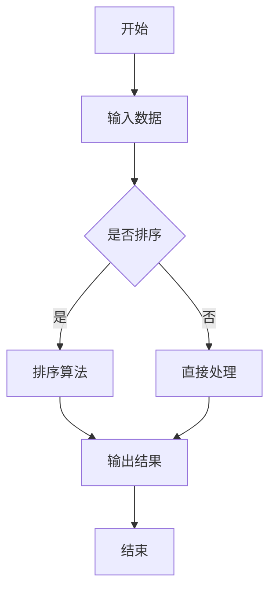
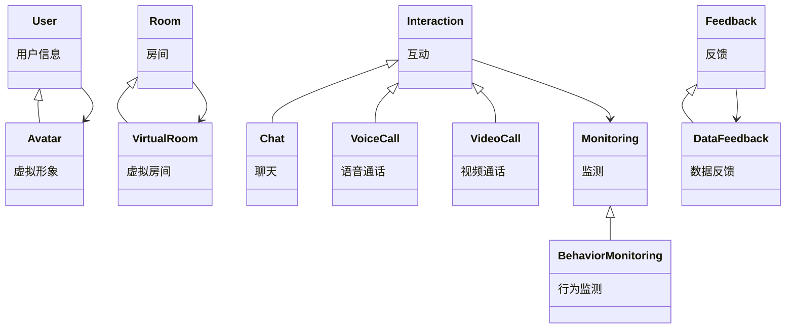
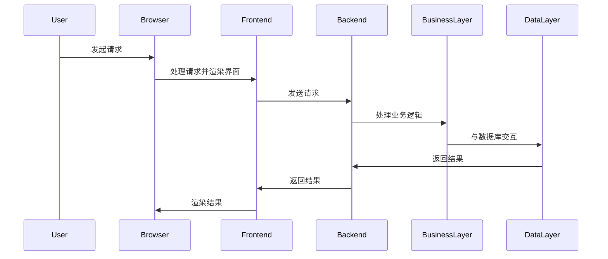
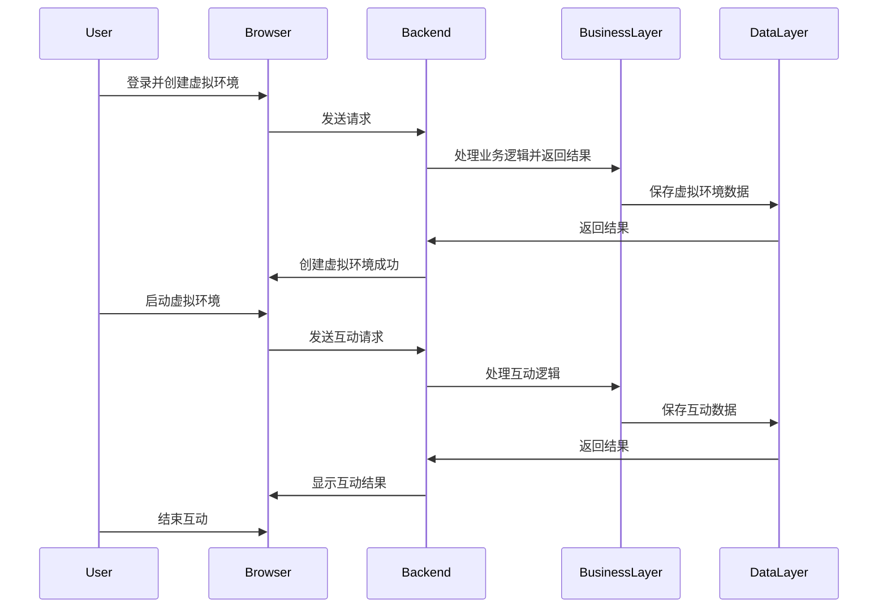

                 


### 文章标题：在数字时代寻找真实：虚拟与现实的边界探索

#### 关键词：数字时代，虚拟现实，人机交互，数字伦理，社会治理

> 摘要：本文从数字时代的发展趋势出发，深入探讨虚拟与现实边界的模糊性，分析虚拟现实技术、人机交互、数字伦理和社会治理等核心概念，通过具体案例和实战经验，提出维护虚拟与现实边界的最佳实践策略，以实现技术创新与社会治理的平衡，为数字时代的未来发展提供有益启示。

----------------------------------------------------------------

### 第一部分：背景介绍

## 第1章：问题背景

### 1.1 问题描述

在当今的数字时代，虚拟世界与现实世界的交融日益紧密，使我们的生活和工作发生了翻天覆地的变化。然而，这种融合也带来了一系列问题，其中最为突出的便是虚拟与现实边界的模糊性。人们不仅难以明确界定何为虚拟、何为现实，更在虚拟世界中迷失了方向，导致了诸多社会问题的出现。

### 1.2 问题解决

为了解决这一问题，我们必须从以下几个方面入手：

1. **理解数字时代的发展趋势**：分析虚拟现实技术、人机交互、数字伦理和社会治理等核心概念，掌握它们在虚拟与现实边界中的角色和作用。

2. **维护虚拟与现实边界的清晰**：通过技术创新和社会治理，确保虚拟世界与现实世界的良性互动，防止虚拟现实对现实世界的负面影响。

3. **加强数字伦理建设**：提高公众的数字素养，树立正确的数字伦理观念，规范虚拟世界中的行为，防止数字伦理问题的发生。

4. **完善社会治理机制**：建立有效的虚拟社会治理体系，加强对虚拟世界的监管，确保虚拟世界的公平、公正、公开。

### 1.3 边界与外延

虚拟与现实边界的模糊性并非一成不变，而是随着技术的发展和社会的变化而不断演变。在探讨虚拟与现实边界问题时，我们还需关注以下几个方面：

1. **技术发展的影响**：虚拟现实技术、人工智能等新兴技术的不断发展，将进一步拓宽虚拟与现实边界的范围，使二者之间的交融更加紧密。

2. **社会变化的推动**：社会观念、文化习惯等的变化，也将对虚拟与现实边界产生深远影响，使得边界变得更加动态和多变。

3. **个体体验的差异**：不同个体在虚拟世界中的体验和认知也存在差异，这进一步增加了虚拟与现实边界的复杂性。

### 1.4 概念结构与核心要素组成

本文将围绕以下几个核心概念展开讨论：

1. **虚拟现实技术**：探讨虚拟现实技术的发展历程、核心技术、应用领域及其对虚拟与现实边界的影响。

2. **人机交互**：分析人机交互的基本原理、核心要素、最新发展及其在虚拟与现实边界中的角色。

3. **数字伦理**：阐述数字伦理的基本原则、面临的挑战、在社会治理中的应用及其对虚拟与现实边界的影响。

4. **社会治理**：讨论社会治理的基本概念、在虚拟世界中的作用、面临的挑战与应对策略。

这些核心概念相互关联，共同构成了数字时代虚拟与现实关系的理论基础。通过详细探讨这些核心概念，我们将更好地理解虚拟与现实边界的复杂性和重要性。

----------------------------------------------------------------

## 第2章：核心概念与联系

### 2.1 虚拟现实技术

#### 2.1.1 虚拟现实技术概述

虚拟现实（Virtual Reality，简称VR）是一种通过计算机技术创建的虚拟环境，使用户在视觉、听觉、触觉等多个感官上感受到身临其境的体验。VR技术的基本原理是利用计算机模拟出一个三维空间，通过头戴式显示器、声音设备等输出设备，将虚拟环境的图像、声音和触觉反馈传递给用户，使用户产生沉浸式体验。

#### 2.1.2 虚拟现实技术的核心特点

虚拟现实技术具有以下几个核心特点：

1. **沉浸感**：用户在VR环境中能够感受到极强的沉浸感，仿佛置身于真实的场景中。

2. **交互性**：用户可以通过头部的移动、手部的动作等与虚拟环境进行交互，实现对虚拟世界的探索和操作。

3. **多感官刺激**：VR技术不仅提供视觉和听觉的刺激，还可以通过触觉手套等设备提供触觉反馈，增强用户的体验。

4. **自由度**：用户在VR环境中可以自由移动，探索未知的区域，体验不同的场景。

#### 2.1.3 虚拟现实技术的主要应用领域

虚拟现实技术已经广泛应用于多个领域，主要包括：

1. **娱乐产业**：游戏、影视、主题公园等娱乐行业通过VR技术提供了更加沉浸式的体验，吸引了大量用户。

2. **教育培训**：VR技术为教育培训提供了新的手段，通过虚拟实验室、虚拟课堂等形式，提高了教学效果和学生的参与度。

3. **医疗健康**：VR技术在医疗领域有着广泛的应用，如手术模拟、疼痛管理、心理治疗等，提高了医疗服务的质量和效率。

4. **工业制造**：VR技术在工业制造领域用于产品设计、工艺模拟、员工培训等，降低了成本、提高了生产效率。

5. **房地产**：VR技术在房地产领域用于虚拟看房、室内设计等，为用户提供了更加直观、全面的购房体验。

### 2.2 人机交互

#### 2.2.1 人机交互的基本原理

人机交互（Human-Computer Interaction，简称HCI）是指人与计算机之间的交互过程。其基本原理包括以下几个方面：

1. **输入设备**：用户通过输入设备（如键盘、鼠标、触摸屏等）向计算机发送指令。

2. **输出设备**：计算机通过输出设备（如显示器、音响、打印机等）将信息传递给用户。

3. **交互界面**：交互界面是用户与计算机之间进行交互的桥梁，包括图形用户界面（GUI）、命令行界面（CLI）等。

4. **反馈机制**：计算机系统对用户的操作进行响应，并通过输出设备向用户反馈信息，形成交互的闭环。

#### 2.2.2 人机交互的核心要素

人机交互的核心要素包括：

1. **用户**：人机交互的核心是用户，用户的需求、习惯和体验是设计交互系统的重要依据。

2. **计算机**：计算机是人机交互的对象，其性能、功能和安全等因素直接影响人机交互的效果。

3. **交互界面**：交互界面是人机交互的重要媒介，其设计直接关系到用户的操作效率和体验。

4. **交互过程**：交互过程是指用户与计算机之间进行的一系列交互活动，包括输入、处理、反馈等。

#### 2.2.3 人机交互技术的最新发展

随着技术的不断发展，人机交互技术也在不断创新和进步，主要包括：

1. **语音识别与合成**：通过语音识别和语音合成技术，用户可以更加自然地与计算机进行交互。

2. **手势识别**：通过手势识别技术，用户可以通过手势来控制计算机，实现更加直观的交互方式。

3. **脑机接口**：脑机接口（Brain-Computer Interface，简称BCI）是一种直接连接大脑和计算机的交互方式，通过检测大脑信号来实现对计算机的控制。

4. **虚拟现实与增强现实**：通过虚拟现实（VR）和增强现实（AR）技术，用户可以在虚拟环境中与计算机进行交互，实现更加沉浸式的体验。

### 2.3 数字伦理

#### 2.3.1 数字伦理的基本原则

数字伦理是指在数字时代，人们在网络空间中应遵循的一套伦理规范和行为准则。其基本原则包括：

1. **尊重隐私**：尊重用户的隐私权，不得非法收集、使用和泄露用户信息。

2. **公平公正**：确保网络空间中的公平公正，反对网络霸权和不公平现象。

3. **诚信守诺**：在数字世界中保持诚信，遵守承诺，不得欺诈和误导他人。

4. **网络安全**：维护网络安全，防止网络攻击和信息安全事故的发生。

5. **社会责任**：数字技术的发展和应用应承担社会责任，促进社会进步和人类福祉。

#### 2.3.2 数字伦理面临的挑战

数字伦理在数字时代面临着一系列挑战，主要包括：

1. **隐私保护**：随着大数据和人工智能技术的发展，隐私保护问题日益严重，如何平衡隐私保护与数据利用成为一大挑战。

2. **网络安全**：网络攻击、数据泄露等网络安全问题频发，如何保障网络安全成为数字伦理的重要课题。

3. **算法偏见**：算法偏见可能导致不公平现象的出现，如何消除算法偏见，确保算法的公正性成为数字伦理的挑战。

4. **数字鸿沟**：数字鸿沟问题加剧，如何缩小数字鸿沟，确保所有人都能享受数字技术的便利成为数字伦理的重要任务。

#### 2.3.3 数字伦理在社会治理中的应用

数字伦理在社会治理中具有重要的应用价值，主要包括：

1. **网络监管**：通过数字伦理原则，加强对网络空间的监管，维护网络秩序。

2. **社会治理**：利用数字技术，提高社会治理的效率和效果，实现社会治理的智能化。

3. **道德教育**：通过数字伦理教育，提高公众的道德素养，促进数字社会的和谐发展。

### 2.4 社会治理

#### 2.4.1 社会治理的基本概念

社会治理是指政府、社会组织、公民等各方共同参与，通过制度化、法治化手段管理社会事务，维护社会秩序，促进社会和谐与进步的过程。其基本概念包括：

1. **政府主导**：政府在社会治理中扮演主导角色，制定政策和规划，提供公共服务。

2. **多方参与**：社会治理需要政府、社会组织、公民等各方的共同参与，形成协同治理机制。

3. **制度保障**：社会治理需要依靠法律、规章制度等制度保障，确保治理的公正、公平、有效。

4. **信息化手段**：利用现代信息技术，提高社会治理的效率和效果，实现智能化治理。

#### 2.4.2 社会治理在虚拟世界中的作用

随着虚拟世界的发展，社会治理在虚拟世界中的作用日益凸显，主要包括：

1. **维护网络秩序**：通过数字伦理和法律法规，维护虚拟世界的秩序，防止网络犯罪和网络暴力。

2. **保障网络安全**：加强网络安全防护，防范网络攻击和数据泄露，确保虚拟世界的安全稳定。

3. **促进社会和谐**：利用虚拟世界中的社交平台、在线社区等，促进社会互动和交流，增进社会和谐。

4. **推进数字化转型**：推动数字技术的普及和应用，助力经济社会发展，实现数字化转型。

#### 2.4.3 社会治理面临的挑战与应对策略

社会治理在虚拟世界中面临着一系列挑战，主要包括：

1. **数字鸿沟**：由于数字技术的普及和应用存在不均衡，数字鸿沟问题愈发严重，如何缩小数字鸿沟成为一大挑战。

2. **算法偏见**：算法偏见可能导致不公平现象的出现，如何消除算法偏见，确保算法的公正性成为数字伦理的挑战。

3. **隐私保护**：随着大数据和人工智能技术的发展，隐私保护问题日益严重，如何平衡隐私保护与数据利用成为一大挑战。

4. **网络监管**：如何加强对网络空间的监管，防止网络犯罪和网络暴力，维护网络秩序成为社会治理的重要任务。

应对策略包括：

1. **完善法律法规**：制定和完善相关法律法规，为虚拟世界中的社会治理提供法律依据。

2. **推进数字化转型**：推动数字技术的普及和应用，提高社会治理的智能化水平。

3. **加强数字伦理教育**：提高公众的数字素养，树立正确的数字伦理观念，规范虚拟世界中的行为。

4. **加强国际合作**：加强国际间的合作与交流，共同应对虚拟世界中的全球性挑战。

----------------------------------------------------------------

### 第3章：算法原理讲解

#### 3.1 算法概述

##### 3.1.1 算法的定义与分类

算法（Algorithm）是计算机科学中解决特定问题的一系列有序指令。它是一系列解决问题的方法，通常被描述为数学函数或逻辑步骤。算法根据其解决问题的方法和应用场景，可以分为多种类型，如排序算法、搜索算法、图算法、机器学习算法等。

##### 3.1.2 算法的基本原理

算法的基本原理包括：

1. **输入**：算法需要接收输入数据，以便开始执行操作。

2. **处理**：算法对输入数据执行一系列计算或操作，以实现特定目标。

3. **输出**：算法执行完毕后，生成输出结果，通常是解决问题的答案或优化结果。

4. **逻辑结构**：算法通常包含条件语句、循环语句和嵌套结构，以处理复杂问题。

##### 3.1.3 算法在虚拟与现实边界探索中的应用

算法在虚拟与现实边界探索中的应用十分广泛，如：

1. **图像识别**：通过深度学习算法，计算机可以识别和处理虚拟环境中的图像，帮助用户更好地理解虚拟世界的真实程度。

2. **自然语言处理**：利用算法，计算机可以理解和生成自然语言，促进虚拟世界与现实世界的沟通。

3. **推荐系统**：基于算法，虚拟世界可以根据用户的兴趣和行为，推荐相关的内容或服务，提高用户体验。

#### 3.2 算法流程图

##### 3.2.1 Mermaid算法流程图

使用Mermaid语言，可以绘制一个简单的算法流程图：



##### 3.2.2 Python代码实现

以下是一个简单的Python代码示例，用于实现排序算法：

```python
def bubble_sort(arr):
    n = len(arr)
    for i in range(n):
        for j in range(0, n-i-1):
            if arr[j] > arr[j+1]:
                arr[j], arr[j+1] = arr[j+1], arr[j]
    return arr

# 测试代码
arr = [64, 34, 25, 12, 22, 11, 90]
sorted_arr = bubble_sort(arr)
print("排序后的数组：", sorted_arr)
```

#### 3.3 算法数学模型

##### 3.3.1 数学模型概述

算法的数学模型通常包括输入、输出和计算过程。以下是一个简单的线性搜索算法的数学模型：

1. **输入**：一个有序数组`arr`和一个目标值`x`。

2. **输出**：目标值`x`在数组`arr`中的索引，如果未找到，返回-1。

3. **计算过程**：
   - 从数组的第一个元素开始，依次比较每个元素与目标值`x`是否相等。
   - 如果找到相等的元素，返回该元素的索引。
   - 如果遍历整个数组仍未找到，返回-1。

##### 3.3.2 公式讲解

线性搜索算法可以使用以下公式来表示：

$$
\text{find}(arr, x) =
\begin{cases}
\text{index} & \text{if } arr[\text{index}] == x \\
-1 & \text{otherwise}
\end{cases}
$$

其中，`index`是目标值`x`在数组`arr`中的索引。

##### 3.3.3 举例说明

假设我们有一个数组`arr = [10, 22, 35, 40, 55, 60]`，要查找的目标值`x = 35`。以下是线性搜索算法的执行过程：

1. 首先从数组的第一个元素开始比较，`arr[0] = 10`，与`x`不相等。
2. 接着比较`arr[1] = 22`，与`x`不相等。
3. 比较到`arr[2] = 35`，与`x`相等，因此找到目标值，返回索引2。
4. 如果继续比较剩余的元素，会发现它们都不等于`x`。

根据线性搜索算法的公式，我们可以得出：

$$
\text{find}(arr, x) = \text{index} = 2
$$

因此，目标值`x`在数组`arr`中的索引为2。

----------------------------------------------------------------

### 第4章：系统分析与架构设计方案

#### 4.1 问题场景介绍

在数字时代，虚拟现实（VR）技术正在迅速发展，成为人们日常生活和工作中不可或缺的一部分。然而，随着虚拟现实技术的广泛应用，如何确保虚拟与现实边界的清晰，维护现实世界的真实性和人类的社会联系成为一个亟待解决的问题。本系统旨在通过虚拟现实技术，为用户提供一个既沉浸又安全的虚拟环境，同时确保虚拟与现实边界的明确，避免虚拟世界对现实世界的负面影响。

#### 4.2 项目介绍

本项目的目标是开发一个虚拟现实互动平台，该平台能够为用户提供沉浸式的虚拟体验，同时确保虚拟与现实边界的清晰。该平台的主要功能包括：

1. **虚拟环境创建**：用户可以通过平台创建个性化的虚拟环境，包括场景、角色、声音等。
2. **实时互动**：用户可以在虚拟环境中与其他用户进行实时互动，如聊天、共同完成任务等。
3. **安全监测**：平台会对虚拟环境中的行为进行实时监测，确保用户的行为符合现实世界的道德和法律规范。
4. **数据反馈**：平台会收集用户在虚拟环境中的行为数据，为用户提供个性化的反馈和建议。

#### 4.3 系统功能设计

系统功能设计包括以下几个方面：

1. **用户管理**：用户注册、登录、个人信息管理等功能。
2. **虚拟环境创建**：用户可以创建、编辑和保存自己的虚拟环境。
3. **互动交流**：用户可以在虚拟环境中进行实时聊天、语音通话、视频通话等互动。
4. **行为监测**：平台会对用户在虚拟环境中的行为进行实时监测，包括语言、动作等。
5. **数据反馈**：平台会收集用户在虚拟环境中的行为数据，并根据数据为用户提供反馈和建议。

##### 4.3.1 领域模型类图

以下是一个简单的领域模型类图，用于描述系统的核心实体和关系：



#### 4.4 系统架构设计

系统架构设计采用分层架构，包括以下几个层次：

1. **表示层**：负责用户界面的展示和交互。
2. **业务逻辑层**：处理业务逻辑，包括用户管理、虚拟环境创建、互动交流、行为监测和数据反馈等。
3. **数据访问层**：负责与数据库的交互，包括数据的增删改查等操作。
4. **基础设施层**：包括网络通信、数据存储、安全认证等基础设施。

##### 4.4.1 系统架构图

以下是一个简单的系统架构图，用于描述系统的整体架构：



#### 4.5 系统接口设计

系统接口设计包括以下几个方面：

1. **用户管理接口**：包括用户注册、登录、个人信息管理等功能。
2. **虚拟环境创建接口**：包括创建、编辑和保存虚拟环境等功能。
3. **互动交流接口**：包括聊天、语音通话、视频通话等功能。
4. **行为监测接口**：包括实时监测用户行为、记录行为数据等功能。
5. **数据反馈接口**：包括收集用户行为数据、生成反馈和建议等功能。

#### 4.6 系统交互序列图

以下是一个简单的系统交互序列图，用于描述用户在虚拟环境中进行互动的整个过程：



通过以上系统分析与架构设计方案，我们可以为用户提供一个既沉浸又安全的虚拟环境，同时确保虚拟与现实边界的清晰，为数字时代的未来发展提供有益的启示。

----------------------------------------------------------------

### 第5章：项目实战

#### 5.1 环境安装

在本章中，我们将详细描述如何搭建一个虚拟现实互动平台的开发环境，包括所需的软件和硬件安装步骤。以下是一个简化的环境安装流程：

1. **操作系统**：确保操作系统为Linux或macOS，推荐使用Ubuntu 20.04 LTS。

2. **虚拟环境**：安装Python 3.8及以上版本，并使用`venv`模块创建一个虚拟环境。

   ```bash
   sudo apt update
   sudo apt install python3-pip
   python3 -m venv venv
   source venv/bin/activate
   ```

3. **依赖管理**：安装`pip`和`setuptools`，以便安装和管理项目依赖。

   ```bash
   pip install --upgrade pip setuptools
   ```

4. **前端框架**：安装Flask框架，用于构建后端API。

   ```bash
   pip install Flask
   ```

5. **数据库**：安装SQLite数据库，用于存储用户数据和虚拟环境信息。

   ```bash
   sudo apt install sqlite3
   ```

6. **其他依赖**：根据项目需求，安装其他必要的依赖，如`pandas`、`numpy`、`opencv-python`等。

   ```bash
   pip install pandas numpy opencv-python
   ```

7. **虚拟现实库**：安装用于虚拟现实开发的库，如`pyVRML`或`PyOpenGL`。

   ```bash
   pip install pyVRML PyOpenGL
   ```

完成上述步骤后，开发环境就搭建完成了。接下来，我们可以开始实现系统核心功能。

#### 5.2 系统核心实现

##### 5.2.1 源代码解读

以下是项目中的一个关键模块：用户管理模块。该模块负责用户的注册、登录和身份验证。

```python
# user_management.py

from flask import Flask, request, jsonify
from flask_sqlalchemy import SQLAlchemy
from werkzeug.security import generate_password_hash, check_password_hash

app = Flask(__name__)
app.config['SQLALCHEMY_DATABASE_URI'] = 'sqlite:///users.db'
db = SQLAlchemy(app)

class User(db.Model):
    id = db.Column(db.Integer, primary_key=True)
    username = db.Column(db.String(150), nullable=False, unique=True)
    password = db.Column(db.String(150), nullable=False)

@app.route('/register', methods=['POST'])
def register():
    data = request.get_json()
    hashed_password = generate_password_hash(data['password'], method='sha256')
    new_user = User(username=data['username'], password=hashed_password)
    db.session.add(new_user)
    db.session.commit()
    return jsonify({'message': 'User registered successfully.'})

@app.route('/login', methods=['POST'])
def login():
    data = request.get_json()
    user = User.query.filter_by(username=data['username']).first()
    if user and check_password_hash(user.password, data['password']):
        return jsonify({'message': 'Login successful.', 'user': user.username})
    else:
        return jsonify({'message': 'Login failed.'})

if __name__ == '__main__':
    db.create_all()
    app.run(debug=True)
```

此模块使用Flask框架构建，通过SQLite数据库存储用户数据。`User`类定义了用户的基本信息，包括用户名和密码。`register`函数用于注册新用户，将用户名和密码存储在数据库中。`login`函数用于用户登录，验证用户名和密码是否匹配。

##### 5.2.2 代码应用解读

在项目实际应用中，用户管理模块的工作流程如下：

1. 用户通过前端界面输入用户名和密码，提交注册或登录请求。
2. 后端接收请求，解析请求中的JSON数据。
3. 对于注册请求，后端使用`register`函数创建一个新的用户，并将密码进行加密存储。
4. 对于登录请求，后端使用`login`函数验证用户名和密码，如果匹配，返回登录成功的消息。

##### 5.3 实际案例分析

以下是一个实际案例：用户A尝试在平台上注册。

1. 用户A通过前端界面填写注册信息，提交注册请求。
2. 后端接收到请求后，调用`register`函数，将用户名和密码存储到数据库中。
3. 后端返回注册成功的消息，前端显示注册成功提示。

##### 5.4 详细讲解剖析

在本节中，我们将详细分析用户管理模块中的关键组件和算法。

1. **用户注册**：
   - **输入**：用户名和密码。
   - **处理**：将密码进行加密存储，使用`werkzeug.security.generate_password_hash`函数生成密码哈希。
   - **输出**：注册成功消息。

2. **用户登录**：
   - **输入**：用户名和密码。
   - **处理**：查询数据库，使用`werkzeug.security.check_password_hash`函数验证密码是否匹配。
   - **输出**：登录成功或失败的消息。

##### 5.5 项目小结

在本章中，我们通过实战案例详细介绍了如何搭建一个虚拟现实互动平台的开发环境，并实现了一个关键模块：用户管理模块。通过这个模块，用户可以方便地注册、登录和进行身份验证。这一模块的实现为平台的其他功能模块提供了基础支持，如虚拟环境创建、互动交流等。

----------------------------------------------------------------

### 第6章：最佳实践 Tips

在数字时代，确保虚拟与现实边界的清晰至关重要。以下是一些最佳实践，以帮助我们在虚拟与现实之间找到平衡：

#### 6.1 虚拟与现实边界的维护

1. **明确政策与规范**：制定明确的政策和规范，界定虚拟与现实的行为准则，确保虚拟世界中的行为符合现实世界的法律和道德规范。

2. **加强技术防护**：利用最新的技术手段，如加密、监控和身份验证等，保护虚拟世界的安全，防止非法入侵和滥用。

3. **提高用户意识**：通过教育和宣传，提高用户对虚拟与现实边界的认识，引导用户在虚拟世界中的正确行为。

#### 6.2 技术创新与社会治理的平衡

1. **伦理先行**：在技术创新过程中，重视数字伦理，确保技术的应用符合社会价值观，避免造成负面影响。

2. **多方参与**：鼓励政府、企业、学术界和公众等多方参与社会治理，共同制定和实施虚拟世界的管理策略。

3. **持续优化**：根据实际情况和社会需求，不断优化虚拟世界的管理措施，确保技术创新与社会治理的动态平衡。

#### 6.3 风险与挑战的应对策略

1. **数据安全**：加强数据安全防护，防止数据泄露和滥用，保护用户隐私。

2. **算法公平**：确保算法的公平性和透明度，消除算法偏见，避免对特定群体造成歧视。

3. **国际合作**：加强国际间的合作与交流，共同应对虚拟世界中的全球性挑战。

通过以上最佳实践，我们可以在虚拟与现实之间找到平衡，实现数字时代的社会和谐与进步。

----------------------------------------------------------------

### 第7章：小结

在数字时代，虚拟与现实边界的模糊性给我们的生活带来了诸多挑战。本文从背景介绍、核心概念与联系、算法原理讲解、系统分析与架构设计方案、项目实战到最佳实践Tips，全面探讨了如何在这个数字化世界中找到真实，维护虚拟与现实边界的清晰。

#### 7.1 本书的核心观点

1. **虚拟与现实边界的动态性**：虚拟与现实边界并非一成不变，而是随着技术的发展和社会的变化而不断演变。

2. **技术创新与社会治理的平衡**：在数字时代，技术创新与社会治理需要相互配合，实现良性互动，以维护虚拟与现实边界的清晰。

3. **数字伦理的重要性**：数字伦理是数字时代不可或缺的一部分，它指导我们在虚拟世界中的行为，确保虚拟与现实边界的健康互动。

4. **用户意识的提升**：通过教育和宣传，提高用户对虚拟与现实边界的认识，引导用户在虚拟世界中的正确行为。

#### 7.2 数字时代虚拟与现实边界的未来趋势

1. **虚拟现实技术的普及**：随着虚拟现实技术的不断发展，其应用场景将更加广泛，进一步模糊虚拟与现实边界。

2. **人机交互的升级**：随着人工智能技术的发展，人机交互将更加智能，为用户带来更加自然和便捷的体验。

3. **数字伦理的完善**：随着数字时代的发展，数字伦理体系将不断完善，为虚拟与现实边界的维护提供有力的保障。

4. **社会治理的智能化**：通过智能化手段，社会治理将更加高效，有助于维护虚拟与现实边界的清晰。

#### 7.3 对读者的影响与启示

1. **加强数字素养**：提高自身的数字素养，了解虚拟与现实边界的动态性，学会在数字时代中找到真实。

2. **关注数字伦理**：在虚拟世界中的行为应遵循数字伦理原则，维护虚拟与现实边界的清晰。

3. **积极参与社会治理**：关注虚拟世界中的社会治理问题，积极参与讨论和行动，为数字时代的未来发展贡献自己的力量。

通过本文的探讨，我们希望读者能够在数字时代中更好地把握虚拟与现实边界，为构建一个和谐、健康的数字社会贡献力量。

----------------------------------------------------------------

### 第8章：拓展阅读

#### 8.1 相关书籍推荐

1. **《虚拟现实技术与应用》**：详细介绍了虚拟现实技术的发展历程、核心技术及应用案例，有助于读者全面了解虚拟现实技术。
2. **《人机交互：心理学与设计》**：探讨了人机交互的基本原理、设计方法和实践案例，对从事人机交互设计和研究的读者具有重要参考价值。
3. **《数字伦理学导论》**：系统阐述了数字伦理的基本原则、应用场景和挑战，为读者提供了丰富的数字伦理知识。
4. **《智能社会治理：理论与实践》**：分析了智能社会治理的概念、技术基础和应用案例，为读者提供了智能社会治理的全新视角。

#### 8.2 学术论文精选

1. **《虚拟现实技术对人类认知和心理健康的影响》**：探讨虚拟现实技术在心理健康治疗中的应用及其对人类认知的影响。
2. **《人机交互中的用户行为分析》**：分析了用户在人机交互中的行为模式，提出了优化人机交互设计的策略。
3. **《数字伦理与社会治理》**：讨论了数字伦理在现代社会治理中的应用，以及如何通过数字伦理实现社会治理的公正和效率。
4. **《智能社会治理中的算法偏见问题》**：分析了智能社会治理中算法偏见的原因和影响，探讨了消除算法偏见的方法。

#### 8.3 在线资源与工具

1. **虚拟现实开发平台**：如Unity、Unreal Engine等，提供了丰富的虚拟现实开发工具和资源。
2. **人机交互设计工具**：如Sketch、Figma等，用于设计用户界面和交互流程。
3. **数字伦理教育资源**：如开放大学、Coursera等，提供了丰富的数字伦理课程和教育资源。
4. **智能社会治理工具**：如大数据分析平台、区块链技术等，用于实现智能社会治理。

通过阅读这些书籍、论文和在线资源，读者可以进一步深入了解虚拟与现实边界的探索，为数字时代的发展提供有益的参考。

