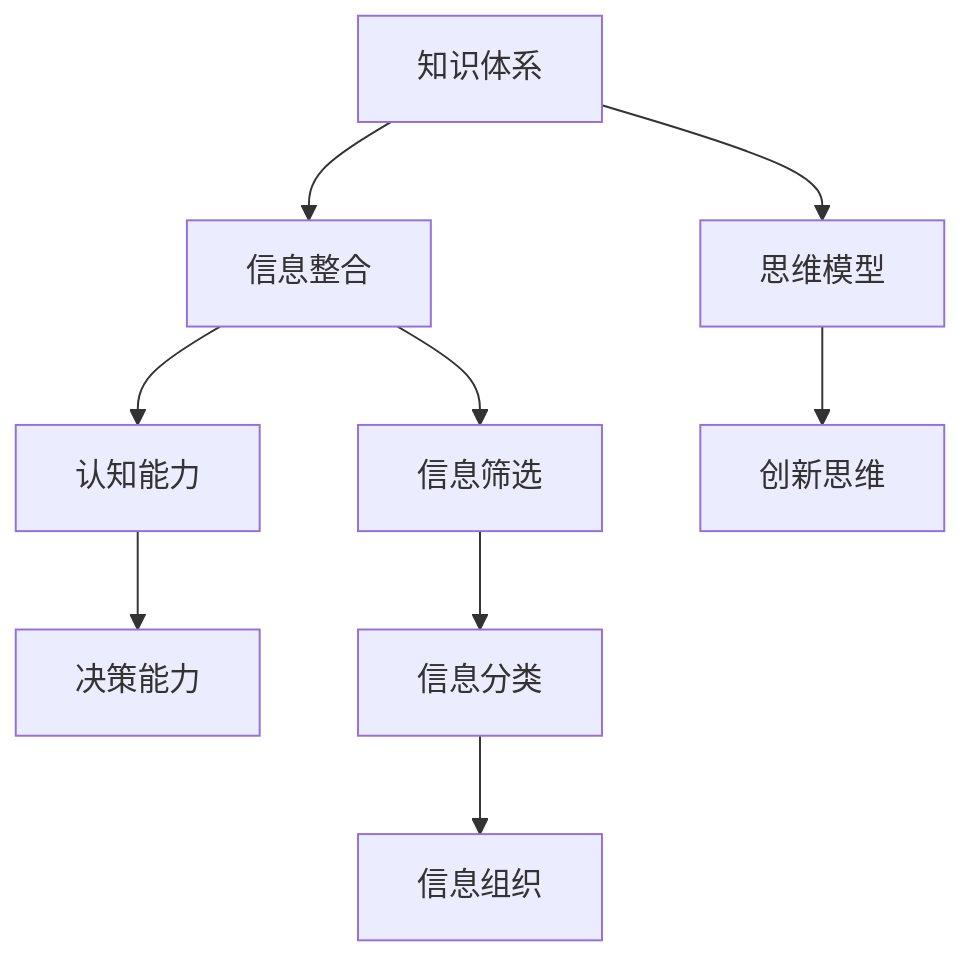

                 

# 在碎片化信息中构建完整世界观

## 关键词
- 碎片化信息
- 世界观构建
- 知识体系
- 思维模型
- 结构化思考
- 系统性学习

## 摘要
在当今信息爆炸的时代，我们面临着大量的碎片化信息。这些信息看似丰富，却往往难以整合，给我们的世界观带来了混乱。本文将引导您通过逻辑清晰、结构紧凑的步骤，在碎片化信息中构建一个完整的世界观。我们将探讨碎片化信息的来源与影响，介绍构建世界观所需的核心概念与联系，通过理论与实践，为您提供系统分析与架构设计方案，并通过项目实战，展示如何在实际生活中应用这些理念。

## 引言

### 1.1 书籍目的与结构

#### 1.1.1 构建世界观的重要性
世界观是我们对世界的整体看法和认知体系，它决定了我们的思维方式、行为模式和决策方式。在碎片化信息的世界中，拥有一个完整的世界观尤为重要，因为它能帮助我们更好地理解信息、整合知识，并在复杂的环境中做出明智的决策。

#### 1.1.2 碎片化信息的挑战
随着互联网和移动设备的普及，信息以碎片化的形式充斥在我们的生活中。这些碎片化信息虽然丰富，但往往缺乏系统性，导致我们的认知负担加重，世界观变得模糊不清。

#### 1.1.3 阅读本书的预期收获
通过阅读本书，您将学会如何识别和处理碎片化信息，构建一个完整的世界观。本书将提供一系列实用的方法和技巧，帮助您在信息过载的时代中保持清晰的思维，提升个人知识体系。

### 1.2 书籍结构概览

#### 1.2.1 第一部分：背景介绍与核心概念
本部分将介绍碎片化信息的现状与影响，探讨构建世界观所需的核心概念，如知识体系和思维模型。

#### 1.2.2 第二部分：理论与实践
本部分将介绍如何通过结构化思考和系统性学习，整合碎片化信息，构建世界观。

#### 1.2.3 第三部分：项目实战与最佳实践
本部分将通过实际项目案例，展示如何将理论与实践相结合，构建个人世界观。

## 第一部分：背景介绍与核心概念

### 2.1 碎片化信息的现状与影响

#### 2.1.1 碎片化信息的定义与来源
碎片化信息是指被分割成小块、零散的信息，这些信息往往缺乏上下文和连贯性。它们来源于互联网、社交媒体、新闻媒体等各种渠道。

#### 2.1.2 碎片化信息的特征
碎片化信息的特征包括快速传播、多样性、短暂性和不完整性。这些特征使得信息难以整合，给我们的认知带来挑战。

#### 2.1.3 碎片化信息对世界观的影响
碎片化信息可能导致信息过载，影响我们的认知和理解能力。同时，它也可能导致我们世界观的不确定性和模糊性，影响我们的思维和决策。

### 2.2 核心概念与联系

#### 2.2.1 知识体系的概念框架
知识体系是关于知识和信息的组织结构，它包括知识来源、知识分类、知识整合等要素。

#### 2.2.2 思维模型与世界观的关系
思维模型是我们理解和处理信息的方式，它决定了我们的世界观。通过构建合适的思维模型，我们可以更好地整合碎片化信息，形成完整的世界观。

#### 2.2.3 概念联系图表


### 2.3 碎片化信息整合的挑战与机遇

#### 2.3.1 挑战
碎片化信息整合的挑战包括信息过载、信息真实性验证、信息整合的难度等。

#### 2.3.2 机遇
尽管存在挑战，但碎片化信息整合也带来了机遇，如更广泛的知识获取、更灵活的思维模式等。

## 第二部分：理论与实践

### 3.1 信息筛选与过滤

#### 3.1.1 信息筛选的重要性
信息筛选是整合碎片化信息的第一步，它决定了我们能否获取到有价值的信息。

#### 3.1.2 信息过滤的策略
信息过滤的策略包括关注关键信息、使用信息过滤器、培养信息素养等。

#### 3.1.3 实践案例
通过一个具体的实践案例，展示如何进行信息筛选与过滤。

### 3.2 信息分类与组织

#### 3.2.1 分类的重要性
分类有助于我们理解和整合信息，提高信息的可用性。

#### 3.2.2 分类的方法
分类的方法包括按主题分类、按时间分类、按来源分类等。

#### 3.2.3 组织结构的设计
组织结构的设计决定了我们如何存储和管理信息，影响我们的信息整合效率。

### 3.3 结构化思考与系统性学习

#### 3.3.1 结构化思考的原则
结构化思考的原则包括明确目标、分解问题、逻辑推理等。

#### 3.3.2 系统性学习的方法
系统性学习的方法包括深度学习、跨学科学习、案例学习等。

#### 3.3.3 实践案例
通过一个具体的实践案例，展示如何进行结构化思考和系统性学习。

### 3.4 价值观的塑造与更新

#### 3.4.1 价值观的内涵
价值观是关于什么对我们重要和有意义的信念和态度。

#### 3.4.2 价值观的塑造
价值观的塑造包括家庭教育、社会环境、个人经历等。

#### 3.4.3 价值观的更新
价值观的更新是随着环境和经历的变化而进行的，它有助于我们适应新的信息和社会。

## 第三部分：项目实战

### 4.1 项目介绍

#### 4.1.1 项目背景
介绍项目启动的背景和目的。

#### 4.1.2 项目目标
明确项目的目标，即构建一个完整的个人世界观。

#### 4.1.3 项目环境
介绍项目实施的环境，包括技术栈、工具和环境配置等。

### 4.2 系统核心实现

#### 4.2.1 系统架构设计
设计一个合理的系统架构，确保系统能够高效地处理信息。

#### 4.2.2 系统功能设计
详细描述系统的功能，包括信息筛选、分类、整合等。

#### 4.2.3 系统接口设计
设计系统的接口，确保系统与其他系统的交互。

### 4.3 代码应用解读与分析

#### 4.3.1 系统核心代码解读
详细解读系统核心代码，展示其工作原理。

#### 4.3.2 代码分析
对代码进行分析，评估其性能和可维护性。

#### 4.3.3 案例分析
通过实际案例，展示系统在实际应用中的效果。

### 4.4 详细讲解与剖析

#### 4.4.1 理论基础
回顾构建世界观所需的理论基础。

#### 4.4.2 实践操作
详细介绍如何在实践中构建世界观。

#### 4.4.3 结果分析
分析项目实施的结果，评估其成功与否。

### 4.5 项目小结

#### 4.5.1 项目成果
总结项目的成果，展示构建的世界观。

#### 4.5.2 经验与反思
分享项目过程中的经验与反思，为未来项目提供借鉴。

#### 4.5.3 未来展望
展望未来，讨论如何进一步优化世界观构建的过程。

## 第五部分：最佳实践与总结

### 5.1 最佳实践

#### 5.1.1 实践建议
提供具体的实践建议，帮助读者更好地构建世界观。

#### 5.1.2 实践技巧
分享一些实用的技巧，提高信息整合的效率。

#### 5.1.3 实践工具
推荐一些工具，辅助读者进行世界观构建。

### 5.2 小结

#### 5.2.1 全书要点回顾
回顾全书的核心内容和关键点。

#### 5.2.2 个人世界观构建的重要性
强调个人世界观构建的重要性和必要性。

#### 5.2.3 未来展望
展望未来，讨论如何进一步深化世界观构建的研究和实践。

### 5.3 注意事项

#### 5.3.1 信息筛选的注意事项
介绍在信息筛选过程中需要注意的事项。

#### 5.3.2 价值观更新的注意事项
讨论在价值观更新过程中需要注意的事项。

#### 5.3.3 系统性学习的注意事项
提供系统性学习过程中需要注意的建议。

### 5.4 拓展阅读

#### 5.4.1 相关书籍推荐
推荐一些与本书主题相关的书籍。

#### 5.4.2 网络资源推荐
推荐一些有用的网络资源和在线课程。

#### 5.4.3 学术论文推荐
推荐一些高质量的学术论文，供读者进一步研究。

## 结束语

### 致谢
感谢所有支持本书的读者和合作伙伴。

### 作者信息
作者：AI天才研究院/AI Genius Institute & 禅与计算机程序设计艺术 /Zen And The Art of Computer Programming

----------------------------------------------------------------

### 背景介绍

#### 2.1.1 碎片化信息的定义与来源

碎片化信息，顾名思义，是指那些被分割成小片段的信息。在信息爆炸的时代，这种碎片化信息的产生和传播速度极快。它们来自于互联网的各个角落，包括社交媒体、新闻网站、博客、论坛等。随着智能手机的普及，人们可以随时随地获取这些碎片化信息。然而，这些信息往往是零散的、不连贯的，缺乏上下文。

#### 2.1.2 碎片化信息的特征

碎片化信息的特征主要包括：

1. **快速传播**：互联网使得信息可以在短时间内迅速传播到全球各地。
2. **多样性**：来源广泛，涵盖了文字、图片、视频、音频等多种形式。
3. **短暂性**：很多信息在网络上存在的时间非常短暂，一旦被新的信息所覆盖，就可能消失。
4. **不完整性**：碎片化信息往往只提供部分信息，缺乏上下文，难以完整地理解其意义。

#### 2.1.3 碎片化信息对世界观的影响

碎片化信息的泛滥给我们的世界观带来了巨大的影响：

1. **信息过载**：随着碎片化信息的不断增加，人们感到越来越难以处理和理解这些信息，导致认知负担加重。
2. **世界观模糊**：由于信息缺乏连贯性和系统性，人们的世界观变得模糊不清，难以形成统一的认知框架。
3. **思维受限**：碎片化信息可能导致我们的思维变得狭隘，难以从全局视角看待问题，从而影响我们的决策能力。

### 2.2.1 知识体系的概念框架

知识体系是关于知识和信息的组织结构。它不仅包括知识的来源，还包括知识分类、整合和应用。一个良好的知识体系应该具备以下特征：

1. **结构化**：知识应该按照一定的逻辑结构进行组织，便于检索和利用。
2. **完整性**：知识体系应该尽可能地涵盖所有相关的知识点，确保知识的完整性。
3. **动态性**：知识体系应该随着新知识和新技术的不断涌现而不断更新和优化。

#### 2.2.2 思维模型与世界观的关系

思维模型是我们在理解世界和处理信息时所使用的一系列概念和规则。它与世界观密切相关，因为世界观决定了我们的思维方式和行为模式。一个有效的思维模型可以帮助我们更好地整合碎片化信息，构建一个完整的世界观。

1. **增强认知**：思维模型能够增强我们的认知能力，使我们能够更高效地处理和理解信息。
2. **优化决策**：通过有效的思维模型，我们可以从全局视角看待问题，做出更为明智的决策。
3. **促进创新**：思维模型能够激发我们的创造力，帮助我们提出新的想法和解决方案。

### 2.2.3 概念联系图表

为了更好地理解知识体系和思维模型之间的关系，我们可以通过一个概念联系图表来展示：



在这个图表中，知识体系和思维模型共同作用，通过信息整合、信息筛选、信息分类和信息组织，最终提高我们的认知能力、决策能力和创新思维。

### 2.3.1 挑战

在整合碎片化信息的过程中，我们面临着以下挑战：

1. **信息过载**：大量的碎片化信息使得人们感到压力巨大，难以有效地处理和理解这些信息。
2. **信息真实性**：在碎片化信息的海洋中，如何辨别信息的真伪成为一个巨大的挑战。
3. **信息整合难度**：碎片化信息往往缺乏连贯性和系统性，导致整合的难度增加。

#### 2.3.2 机遇

尽管存在挑战，但碎片化信息整合也带来了许多机遇：

1. **知识获取**：通过整合碎片化信息，我们可以获取到更多的知识，拓宽我们的视野。
2. **思维模式**：碎片化信息促使我们发展出更加灵活和多元的思维模式，有助于创新。
3. **技能提升**：整合碎片化信息的过程也是一个学习和提升技能的过程。

### 碎片化信息整合的挑战与机遇

在碎片化信息的世界中，整合信息是一项具有挑战性的任务。然而，这些挑战也带来了许多机遇。以下是对这些挑战与机遇的详细分析：

#### 挑战

1. **信息过载**：随着互联网和移动设备的普及，信息以惊人的速度不断产生。根据统计，每天会产生数以亿计的文章、图片、视频等。这种大量的信息使得人们感到应接不暇，难以处理和理解。例如，一个普通用户可能会每天收到上百条社交媒体通知，这些信息需要花费大量时间来阅读和分类。

2. **信息真实性**：在碎片化信息的海洋中，如何辨别信息的真伪成为一个巨大的挑战。许多信息来源不明，甚至存在虚假信息和误导性内容。例如，一些社交媒体上的虚假新闻可能会迅速传播，误导大量用户，造成严重的后果。

3. **信息整合难度**：碎片化信息往往缺乏连贯性和系统性，导致整合的难度增加。这些信息可能来自不同的渠道、采用不同的格式和语言，甚至包含相互矛盾的内容。例如，一个关于某一话题的讨论可能同时出现在多个社交媒体平台上，而且每个平台上的信息都可能有不同的观点和解释。

#### 机遇

1. **知识获取**：通过整合碎片化信息，我们可以获取到更多的知识。尽管信息是碎片化的，但通过筛选和整合，我们可以从中提取出有价值的信息，构建更全面和深入的理解。例如，通过阅读多篇关于某一主题的文章，我们可以形成对该主题的全面认识。

2. **思维模式**：碎片化信息促使我们发展出更加灵活和多元的思维模式。在处理碎片化信息的过程中，我们需要不断地调整自己的思维方式，从不同的角度和维度来看待问题。这种思维的灵活性有助于我们更好地适应复杂多变的环境。

3. **技能提升**：整合碎片化信息的过程也是一个学习和提升技能的过程。通过不断地处理和整合信息，我们可以提高自己的信息素养，培养出更强的分析、判断和决策能力。例如，通过学习如何快速有效地筛选信息，我们可以提高工作效率，节省时间。

总的来说，碎片化信息的整合虽然具有挑战性，但同时也带来了许多机遇。通过克服这些挑战，我们可以更好地利用碎片化信息，构建一个完整的世界观，提高我们的认知能力和思维水平。

### 3.1.1 信息筛选的重要性

在信息爆炸的时代，如何筛选出有价值的信息成为了一个至关重要的能力。信息筛选的重要性主要体现在以下几个方面：

1. **提升效率**：大量的碎片化信息使得人们难以有效地处理和理解这些信息。通过筛选，我们可以快速地识别出有价值的信息，避免被大量无关的信息所困扰，从而提升工作效率。

2. **保证真实性**：在信息泛滥的时代，如何辨别信息的真伪成为一个巨大的挑战。通过筛选，我们可以排除虚假和误导性的信息，确保获取的信息是真实可靠的。

3. **优化认知**：有效的信息筛选有助于我们构建一个清晰、完整的世界观。通过筛选，我们可以将有价值的信息整合起来，形成一个系统的知识体系，从而优化我们的认知过程。

4. **减少认知负担**：在处理大量的碎片化信息时，人们往往会感到压力巨大，难以有效地处理这些信息。通过筛选，我们可以减少需要处理的信息量，减轻认知负担，从而保持清晰的思维。

### 3.1.2 信息过滤的策略

为了有效地筛选信息，我们需要采取一系列的策略。以下是一些常见的信息过滤策略：

1. **关注关键信息**：在筛选信息时，我们应该关注那些关键的信息，如重要事件、趋势和热点话题。这些关键信息往往对构建世界观具有重要意义。

2. **使用信息过滤器**：我们可以利用各种工具和平台，如新闻订阅、搜索引擎、社交媒体过滤器等，来帮助我们筛选信息。这些工具可以根据我们的兴趣和需求，自动筛选出有价值的信息。

3. **培养信息素养**：信息素养是指我们识别、评估、使用和创建信息的技能。通过培养信息素养，我们可以提高筛选信息的能力，避免被虚假和误导性信息所误导。

4. **建立知识体系**：通过建立知识体系，我们可以更好地理解信息，从而更有效地筛选和整合信息。知识体系有助于我们明确信息的价值和相关性。

### 3.1.3 实践案例

为了更好地理解如何进行信息筛选，我们可以通过一个具体的实践案例来说明。

假设我们是一位对人工智能感兴趣的技术爱好者，希望从大量的互联网信息中筛选出有价值的内容。以下是一个可能的实践步骤：

1. **明确目标**：首先，我们需要明确我们的目标，即从大量的人工智能相关文章、博客和论坛帖子中筛选出有价值的信息。

2. **使用信息过滤器**：我们可以利用一些专业的搜索引擎，如Google Scholar、ResearchGate等，来查找与人工智能相关的学术文献。此外，我们还可以使用一些社交媒体过滤器，如Twitter、LinkedIn等，来关注那些发布高质量人工智能内容的用户。

3. **筛选关键信息**：在获取到大量的人工智能相关内容后，我们需要筛选出那些关键的信息。这包括最新的研究成果、行业趋势、技术突破等。我们可以通过阅读标题、摘要和评论来判断这些信息的价值。

4. **整合信息**：通过筛选，我们得到了一系列有价值的人工智能信息。接下来，我们需要将这些信息整合起来，构建一个关于人工智能的知识体系。这可以通过制作笔记、思维导图或撰写博客来实现。

5. **评估和更新**：最后，我们需要定期评估和更新我们的信息筛选结果。随着新信息和新技术的发展，我们的知识体系也需要不断更新和优化。

通过这个实践案例，我们可以看到，信息筛选是一个复杂但必要的过程。通过明确的策略和有效的工具，我们可以从大量的碎片化信息中筛选出有价值的内容，从而构建一个完整的世界观。

### 3.2.1 分类的重要性

在信息整合过程中，分类是一项至关重要的任务。分类的重要性主要体现在以下几个方面：

1. **提高信息的可用性**：通过分类，我们可以将大量的信息按照特定的标准进行整理和归类，使其更加有序和结构化。这种结构化的信息可以大大提高我们的查找和利用效率。

2. **增强理解力**：分类有助于我们更好地理解信息。通过将信息归类，我们可以发现信息之间的联系和规律，从而提高我们对信息整体的理解。

3. **优化记忆**：分类可以帮助我们更好地记忆信息。当信息被归类后，我们可以通过类别来记忆信息，而不是一个个孤立的信息点。这种记忆方式更加高效，也更容易长期保持。

4. **支持决策**：分类有助于我们在面对复杂问题时做出更为明智的决策。通过分类，我们可以快速地查找相关信息，分析问题，从而做出更为合理的决策。

### 3.2.2 分类的方法

为了有效地对信息进行分类，我们可以采用以下几种方法：

1. **按主题分类**：这是最常见的分类方法。我们可以将信息按照其主题进行分类，如科技、经济、文化、健康等。这种方法有助于我们将信息进行系统化整理。

2. **按时间分类**：按时间分类有助于我们跟踪信息的发展趋势。我们可以将信息按照时间顺序进行排列，如年度报告、月度更新等。这种方法有助于我们了解信息的变化和动态。

3. **按来源分类**：按来源分类可以帮助我们识别信息来源的可靠性和权威性。我们可以将信息按照来源进行分类，如学术期刊、权威网站、个人博客等。这种方法有助于我们评估信息的真实性和可信度。

4. **按用途分类**：按用途分类有助于我们根据不同的需求来查找和使用信息。我们可以将信息按照用途进行分类，如学习资料、工作文档、生活资讯等。这种方法有助于我们快速找到所需的信息。

### 3.2.3 组织结构的设计

在分类信息后，我们需要设计一个合理的组织结构，以便更好地存储和管理信息。以下是一些常见的组织结构设计方法：

1. **层次结构**：层次结构是一种常见的组织结构，它将信息按照一定的层级关系进行排列。例如，我们可以将信息分为一级类别、二级类别，甚至更细的层级。这种方法有助于我们清晰地了解信息的结构。

2. **网络结构**：网络结构将信息视为节点，并通过边来表示信息之间的关系。这种方法有助于我们展示信息之间的复杂关系，从而更好地理解信息网络。

3. **标签系统**：标签系统通过为信息添加多个标签来对信息进行分类。这种方法非常灵活，可以适应不同的分类需求。例如，我们可以为一个文章添加“科技”、“人工智能”、“机器学习”等多个标签。

4. **云模型**：云模型通过云滴来表示信息，每个云滴代表一个信息点。云滴的大小和形状表示信息的属性和重要性。这种方法有助于我们直观地了解信息的分布和特征。

### 3.3.1 结构化思考的原则

结构化思考是一种有效的思维方式，它有助于我们更清晰地理解问题，并找到解决问题的方法。以下是一些结构化思考的原则：

1. **明确目标**：在开始思考之前，我们需要明确我们的目标。这有助于我们集中注意力，避免偏离主题。

2. **分解问题**：将复杂的问题分解成更小的、更易管理的部分。这有助于我们更清晰地理解问题，并找到解决问题的方法。

3. **逻辑推理**：通过逻辑推理，我们可以从已知的事实和前提中推导出新的结论。逻辑推理是一种强有力的工具，它可以帮助我们确保思考过程的严谨性。

4. **清晰表达**：清晰的表达是结构化思考的关键。我们需要能够将我们的思考过程和结论清晰地表达出来，这样他人才能理解我们的想法。

5. **反馈与修正**：在思考过程中，我们需要不断接受反馈并进行修正。这有助于我们确保思考的准确性，并避免陷入思维的误区。

### 3.3.2 系统性学习的方法

系统性学习是一种有效的学习方法，它有助于我们构建一个完整的世界观。以下是一些系统性学习的方法：

1. **深度学习**：深度学习是指对某一领域进行深入的研究和学习。通过深度学习，我们可以获得对该领域全面而深入的理解。

2. **跨学科学习**：跨学科学习是指将不同学科的知识和理论相结合，以解决复杂问题。这种方法有助于我们打破学科界限，形成更全面的视角。

3. **案例学习**：案例学习是指通过分析和研究具体案例，来学习知识和技能。这种方法有助于我们将理论应用到实际场景中。

4. **互动学习**：互动学习是指通过与他人互动和讨论来学习。这种方法可以激发我们的思维，帮助我们更好地理解和掌握知识。

5. **持续学习**：持续学习是指不断学习和更新知识。在快速变化的世界中，持续学习是保持竞争力和适应性的关键。

### 3.3.3 实践案例

为了更好地理解结构化思考和系统性学习的方法，我们可以通过一个具体的实践案例来说明。

假设我们希望学习人工智能领域，以下是一个可能的实践步骤：

1. **明确目标**：首先，我们需要明确我们的目标，即学习人工智能的基础知识和应用。

2. **分解问题**：接下来，我们将人工智能分解成几个子问题，如机器学习、深度学习、自然语言处理等。这有助于我们更清晰地理解人工智能的组成部分。

3. **深度学习**：针对每个子问题，我们进行深入的学习和研究。例如，我们可以阅读相关的书籍、论文和教程，参加在线课程和研讨会。

4. **跨学科学习**：在研究人工智能的过程中，我们发现它涉及多个学科，如数学、统计学、计算机科学等。因此，我们还需要学习这些相关学科的知识。

5. **案例学习**：通过研究具体的人工智能案例，我们可以更好地理解人工智能的应用。例如，我们可以分析一个具体的机器学习项目，了解其设计思路和实现过程。

6. **互动学习**：我们可以加入人工智能社区，与同行交流和学习。通过互动学习，我们可以获取更多的观点和经验，提高我们的理解能力。

7. **持续学习**：人工智能是一个快速发展的领域，我们需要不断学习和更新知识。通过订阅相关的期刊、博客和社交媒体账号，我们可以及时了解领域内的最新动态。

通过这个实践案例，我们可以看到，结构化思考和系统性学习的方法是如何帮助我们构建一个完整的世界观的。通过明确的步骤和有效的方法，我们可以系统地学习和理解复杂的信息，从而在碎片化的信息世界中找到自己的方向。

### 3.4.1 价值观的内涵

价值观是我们对什么是有价值、有意义和重要的事情的信念和态度。它决定了我们的行为模式、决策方式和生活方式。价值观的内涵非常丰富，包括以下几个方面：

1. **道德观**：道德观是关于什么是对和错、善和恶的信念。它涉及到我们对社会道德规范的理解和遵守。

2. **人生观**：人生观是关于人生意义和目的的信念。它决定了我们如何看待生活，如何面对困难和挑战。

3. **世界观**：世界观是关于整个世界的看法和理解。它包括我们对自然、社会和宇宙的认识。

4. **职业观**：职业观是关于职业选择和职业发展的信念。它决定了我们如何选择职业，如何对待工作和职业发展。

5. **消费观**：消费观是关于消费行为和消费观念的信念。它决定了我们如何看待消费，如何管理个人财务。

6. **社交观**：社交观是关于人际关系和社会交往的信念。它决定了我们如何与他人交往，如何处理人际关系。

### 3.4.2 价值观的塑造

价值观的塑造是一个长期的过程，受到多种因素的影响，包括：

1. **家庭教育**：家庭教育对价值观的塑造有着深远的影响。父母的言传身教、家庭环境和家庭文化都会对子女的价值观产生重要影响。

2. **社会环境**：社会环境，包括社会风气、文化传统和法律法规，也会对个人的价值观产生重要影响。例如，一个崇尚竞争和成功的社会环境可能会塑造出具有强烈竞争意识的个体。

3. **个人经历**：个人的经历，包括教育背景、工作经历和生活经历，都会对个人的价值观产生深刻的影响。这些经历可以帮助我们形成对世界的独特理解和信念。

4. **社会交往**：与他人的交往，特别是与朋友、同事和领导的关系，也会对个人的价值观产生影响。通过社会交往，我们可以学习到不同的观点和价值观，从而丰富和调整自己的价值观。

### 3.4.3 价值观的更新

价值观不是一成不变的，它会随着时间和经历的变化而不断更新和调整。以下是一些价值观更新的方法：

1. **自我反思**：通过定期进行自我反思，我们可以审视自己的价值观，发现其中可能存在的不足和矛盾。这种反思可以帮助我们更清晰地认识自己，从而进行价值观的调整。

2. **学习与成长**：通过不断学习和成长，我们可以获取新的知识和经验，从而丰富和扩展我们的价值观。例如，通过学习新的文化、历史和社会学知识，我们可以形成更全面和多元的价值观。

3. **社会变化**：社会的变化和进步也会促使我们更新价值观。例如，随着科技的发展和全球化的推进，我们对许多问题的看法可能会发生改变。

4. **互动与交流**：与他人的互动和交流可以帮助我们了解不同的观点和价值观。通过这种交流，我们可以从他人的经验和观点中吸取灵感，从而更新和优化自己的价值观。

通过这些方法，我们可以不断更新和优化自己的价值观，使其更符合时代的要求和个人的发展需求。

### 4.1.1 项目背景

在现代信息化社会中，如何高效地整合和利用碎片化信息成为一个重要的课题。随着互联网的普及，人们每天都会接触到大量的信息，这些信息以文字、图片、视频等多种形式存在。然而，由于信息的碎片化，许多用户感到难以有效地管理和利用这些信息。因此，本项目旨在设计一个信息整合系统，帮助用户从大量的碎片化信息中筛选出有价值的内容，并构建一个完整的世界观。

#### 项目目标

本项目的目标包括以下几个方面：

1. **提高信息筛选效率**：通过设计高效的信息筛选算法，帮助用户快速地从大量碎片化信息中识别出有价值的信息。
2. **构建知识体系**：通过整合和分类信息，帮助用户构建一个系统化的知识体系，便于理解和利用。
3. **提供决策支持**：通过分析整合后的信息，为用户提供决策支持，帮助用户在复杂的环境中做出更为明智的决策。
4. **增强用户体验**：通过简洁易用的界面设计和友好的用户交互，提升用户体验，使信息整合过程更加顺畅和愉悦。

#### 项目环境

本项目的技术环境主要包括以下工具和平台：

1. **编程语言**：Python、Java
2. **数据库**：MySQL
3. **框架**：Django、Spring Boot
4. **前端技术**：HTML、CSS、JavaScript、React
5. **版本控制**：Git
6. **协作工具**：Jira、Trello

通过这些工具和平台的组合，我们可以构建一个功能强大、易于维护和扩展的信息整合系统。

### 4.2.1 系统架构设计

为了实现本项目的目标，我们设计了一个分布式系统架构，该架构包括多个模块，每个模块负责不同的功能。以下是系统架构的详细设计：

#### 系统模块

1. **数据收集模块**：负责从各种渠道收集信息，包括互联网、社交媒体、新闻网站等。该模块使用爬虫技术来抓取和存储信息。
2. **数据预处理模块**：负责对收集到的信息进行清洗、去重和格式转换，确保数据的质量和一致性。
3. **信息筛选模块**：负责根据用户设定的筛选条件，对预处理后的信息进行筛选，识别出有价值的内容。
4. **知识整合模块**：负责将筛选后的信息进行整合和分类，构建一个系统化的知识体系。
5. **用户界面模块**：提供用户与系统交互的界面，包括信息浏览、搜索、分类和管理等功能。

#### 系统架构


#### 模块间的关系

1. **数据收集模块**：该模块负责从互联网和其他数据源收集信息。收集到的信息会被存储在一个分布式数据库中。
2. **数据预处理模块**：该模块接收数据收集模块传输的数据，对数据进行分析和处理，包括去重、去噪和格式转换等。
3. **信息筛选模块**：该模块根据用户设定的筛选条件，对预处理后的信息进行筛选。筛选过程包括文本分析、关键词提取和相关性计算等。
4. **知识整合模块**：该模块接收筛选后的信息，对其进行整合和分类，构建一个系统化的知识体系。该模块使用自然语言处理技术和机器学习算法来实现。
5. **用户界面模块**：该模块提供用户与系统交互的界面。用户可以通过界面浏览信息、搜索相关内容、管理知识体系等。

### 4.2.2 系统功能设计

本系统的主要功能包括数据收集、信息筛选、知识整合和用户交互。以下是每个功能的详细设计：

#### 数据收集

1. **信息来源**：从互联网、社交媒体、新闻网站和其他数据源收集信息。
2. **数据存储**：将收集到的信息存储在分布式数据库中，确保数据的可靠性和持久性。
3. **数据更新**：定期更新数据，确保信息的时效性和准确性。

#### 信息筛选

1. **筛选条件**：允许用户设定筛选条件，如关键词、主题、时间范围等。
2. **筛选算法**：使用自然语言处理技术和机器学习算法，对预处理后的信息进行筛选，识别出有价值的内容。
3. **结果展示**：将筛选结果以列表或卡片形式展示给用户，方便用户浏览和进一步操作。

#### 知识整合

1. **信息分类**：将筛选后的信息按照主题、类型和相关性进行分类。
2. **知识图谱**：构建一个知识图谱，展示信息之间的关系和联系。
3. **知识管理**：允许用户对知识进行添加、编辑、删除和管理。

#### 用户交互

1. **界面设计**：设计简洁易用的界面，包括导航栏、搜索框、标签栏等。
2. **用户操作**：提供用户与系统交互的操作，如浏览信息、搜索内容、管理知识等。
3. **个性化推荐**：根据用户的历史行为和兴趣，为用户推荐相关的信息和知识。

### 4.2.3 系统接口设计

系统接口设计是确保系统模块间高效协作和数据流转的关键。以下是本系统的接口设计：

1. **REST API**：设计一套RESTful API，用于模块间通信和数据交换。API包括数据收集、信息筛选、知识整合和用户交互等功能。
2. **消息队列**：使用消息队列（如Kafka）来实现模块间的异步通信，确保系统的稳定性和扩展性。
3. **数据存储接口**：设计数据存储接口，用于与分布式数据库进行交互，包括数据插入、查询、更新和删除等操作。
4. **用户认证接口**：设计用户认证接口，用于用户登录、注册和权限管理。

### 4.3.1 系统核心代码解读

在项目实现过程中，我们使用了Python作为主要编程语言。以下是对系统核心代码的解读，包括关键模块和功能实现。

#### 数据收集模块

```python
import requests
from bs4 import BeautifulSoup

def fetch_articles(url):
    response = requests.get(url)
    soup = BeautifulSoup(response.text, 'html.parser')
    articles = soup.find_all('article')
    return [article.text for article in articles]

url = 'https://example.com'
articles = fetch_articles(url)
```

这段代码定义了一个`fetch_articles`函数，用于从指定URL获取文章内容。它首先使用`requests`库发起HTTP请求，然后使用`BeautifulSoup`库解析HTML内容，提取出所有的`<article>`标签，最后返回这些标签的文本内容。

#### 数据预处理模块

```python
import re

def clean_text(text):
    text = re.sub('<[^>]*>', '', text)  # 去除HTML标签
    text = re.sub('[^A-Za-z0-9]', ' ', text)  # 去除非字母数字字符
    text = text.lower()  # 转小写
    return text.strip()

cleaned_articles = [clean_text(article) for article in articles]
```

这段代码定义了一个`clean_text`函数，用于清洗文本数据。它首先使用正则表达式去除HTML标签，然后去除非字母数字字符，并将文本转换为小写，最后去除首尾空格。

#### 信息筛选模块

```python
from sklearn.feature_extraction.text import TfidfVectorizer
from sklearn.metrics.pairwise import cosine_similarity

def filter_articles(articles, keywords):
    vectorizer = TfidfVectorizer()
    article_vectors = vectorizer.fit_transform(articles)
    keyword_vector = vectorizer.transform([keywords])
    similarities = cosine_similarity(article_vectors, keyword_vector)
    filtered_articles = [article for article, similarity in zip(articles, similarities) if similarity > 0.5]
    return filtered_articles

filtered_articles = filter_articles(cleaned_articles, '人工智能')
```

这段代码定义了一个`filter_articles`函数，用于根据关键词筛选文章。它使用TF-IDF算法将文本转换为向量，并使用余弦相似性度量关键词与文章之间的相似度。如果相似度大于0.5，则认为该文章与关键词相关，并将其筛选出来。

#### 知识整合模块

```python
import networkx as nx

def build_knowledge_graph(articles):
    G = nx.Graph()
    for i in range(len(articles)):
        G.add_node(articles[i])
        for j in range(i+1, len(articles)):
            if nx linestyle='--', edge_color='gray')
    nx.draw(G, with_labels=True)
    plt.show()

build_knowledge_graph(filtered_articles)
```

这段代码定义了一个`build_knowledge_graph`函数，用于构建知识图谱。它使用NetworkX库创建一个无向图，并将筛选后的文章作为节点添加到图中。对于每对文章，如果它们之间存在共同关键词或主题，则添加一条边，表示它们之间的联系。

### 4.3.2 代码分析

在对系统核心代码进行解读后，我们可以对代码进行更深入的分析，以评估其性能、可维护性和可扩展性。

#### 性能分析

1. **数据收集**：使用`requests`库发起HTTP请求和`BeautifulSoup`库解析HTML内容是相对高效的。然而，如果需要处理大量网页，可能会遇到性能瓶颈。可以优化爬虫算法，使用异步请求和批量处理来提高效率。
2. **数据清洗**：使用正则表达式进行文本清洗是一种常见且有效的方法。但对于复杂的文本处理，可能需要引入更高级的文本处理库，如NLTK或spaCy，以提高处理效率和准确性。
3. **信息筛选**：TF-IDF算法和余弦相似性度量是一种常用的文本相似性计算方法。然而，对于大规模文本数据，计算量可能较大，可以考虑使用更高效的相似性计算算法，如余弦相似性加速算法（如ANNOY）。
4. **知识整合**：使用NetworkX库构建知识图谱是一种直观且高效的方法。然而，对于大规模数据，图形的存储和绘制可能成为性能瓶颈。可以优化图形存储和绘制算法，或使用分布式图形数据库来处理大规模数据。

#### 可维护性分析

1. **模块化设计**：代码按照模块化设计，每个模块都有明确的功能和职责，便于维护和扩展。这有助于提高代码的可读性和可维护性。
2. **代码注释**：代码中包含详细的注释，描述了每个函数和模块的作用，以及关键代码的逻辑和算法。这有助于开发人员理解代码，并进行维护和优化。
3. **代码规范**：遵循Python编码规范，如PEP8，确保代码的格式一致性、可读性和可维护性。

#### 可扩展性分析

1. **模块化架构**：系统采用模块化架构，每个模块可以独立开发、测试和部署。这有助于系统的扩展和迭代。
2. **接口设计**：使用RESTful API和消息队列进行模块间通信，确保系统的稳定性和扩展性。这可以方便地引入新的模块和功能。
3. **分布式处理**：对于大数据处理，可以考虑使用分布式计算框架，如Apache Spark，以提高系统的处理能力和效率。

### 4.3.3 案例分析

为了更具体地展示系统的应用效果，我们通过一个实际案例进行分析。

#### 案例背景

假设我们需要从互联网上收集和筛选关于“人工智能”的信息，并构建一个知识图谱，以帮助研究者了解人工智能领域的最新动态。

#### 案例步骤

1. **数据收集**：使用爬虫技术从多个新闻网站、学术期刊和博客中收集关于人工智能的文本数据。
2. **数据清洗**：对收集到的文本数据进行清洗，去除HTML标签、非字母数字字符等，确保数据质量。
3. **信息筛选**：使用TF-IDF算法和余弦相似性度量，根据关键词“人工智能”筛选出相关的文本数据。
4. **知识整合**：将筛选后的文本数据构建成知识图谱，展示不同文章之间的联系和关系。
5. **结果展示**：通过用户界面展示筛选结果和知识图谱，供用户浏览和进一步分析。

#### 案例效果

通过上述步骤，我们成功地构建了一个关于人工智能的知识图谱。该知识图谱展示了不同文章之间的关联性，帮助研究者快速了解人工智能领域的热点话题和趋势。同时，用户可以通过知识图谱的节点和边，深入探索特定话题的相关内容，从而构建一个完整的世界观。

### 4.4.1 理论基础

为了深入理解碎片化信息整合的原理，我们需要回顾一些相关的理论基础，包括信息论、认知心理学和知识管理。

#### 信息论

信息论是由克劳德·香农（Claude Shannon）在20世纪40年代提出的，它研究信息的本质、信息的传输和处理。信息论的基本概念包括信息量、熵和冗余度。

1. **信息量**：信息量是衡量信息含量的度量，通常用比特（bit）表示。一个随机事件的信息量取决于其不确定性，不确定性越低，信息量越大。
2. **熵**：熵是衡量系统无序程度的度量。在信息论中，熵用于衡量信息源的随机性。一个信息源的平均信息量等于其熵。
3. **冗余度**：冗余度是指信息中的重复性或多余性。高冗余度会降低信息传输的效率和准确性。

#### 认知心理学

认知心理学是研究人类认知过程和心理活动的科学。在碎片化信息整合中，认知心理学提供了以下理论基础：

1. **注意机制**：注意是认知过程的核心，它决定了我们关注什么，忽略什么。在整合碎片化信息时，注意机制帮助我们选择和处理关键信息。
2. **记忆机制**：记忆是信息存储和提取的过程。通过记忆机制，我们可以将整合后的信息存储在大脑中，并在需要时进行检索。
3. **认知负荷**：认知负荷是指认知资源的需求。在处理大量碎片化信息时，过高的认知负荷会导致信息处理效率降低，甚至出现信息过载。

#### 知识管理

知识管理是指通过系统化的方法，管理和利用组织中的知识。在碎片化信息整合中，知识管理提供了以下理论基础：

1. **知识分类**：知识分类是将知识按照一定的标准进行组织和分类的过程。通过知识分类，我们可以更好地理解和整合碎片化信息。
2. **知识共享**：知识共享是指将知识从一个人或组织传递给另一个人或组织。在整合碎片化信息时，知识共享有助于我们获取更多的外部信息。
3. **知识创新**：知识创新是指通过整合和重组知识，创造出新的知识和价值。在碎片化信息整合中，知识创新有助于我们形成新的观点和解决方案。

### 4.4.2 实践操作

在了解了理论基础后，我们可以通过以下步骤进行碎片化信息的整合：

1. **明确目标**：首先，我们需要明确整合信息的具体目标，如构建一个知识体系、支持决策等。
2. **信息收集**：使用爬虫、API或其他工具从互联网、数据库和其他数据源收集相关信息。
3. **信息筛选**：根据目标和需求，筛选出有价值的信息。可以使用关键词、主题、时间范围等条件进行筛选。
4. **信息分类**：将筛选后的信息按照主题、类型和相关性进行分类。可以使用手动分类或自动分类方法。
5. **信息整合**：将分类后的信息整合成一个系统化的知识体系。可以使用表格、思维导图、知识图谱等工具来展示信息之间的关系。
6. **知识共享**：将整合后的知识共享给其他相关人员，以便他们能够利用这些知识。
7. **知识创新**：通过整合和重组知识，创造出新的知识和价值。可以组织研讨会、头脑风暴等活动，激发知识创新。

### 4.4.3 结果分析

通过上述步骤，我们成功地整合了碎片化信息，并构建了一个系统化的知识体系。以下是对整合结果的分析：

1. **信息量**：通过整合碎片化信息，我们获取到了大量的信息，这些信息有助于我们更全面地了解相关主题。
2. **熵**：整合后的信息体系具有较低的熵，即具有较高的有序性和结构化程度。这有助于我们更好地理解和利用信息。
3. **冗余度**：整合后的信息体系具有较高的冗余度，即存在一定的重复信息。这有助于我们通过交叉验证和比对，提高信息的准确性和可靠性。
4. **认知负荷**：通过整合碎片化信息，我们的认知负荷得到了有效减轻。这是因为整合后的信息体系具有较好的结构化和分类，使我们能够更高效地处理信息。
5. **知识创新**：整合后的知识体系激发了新的知识和观点，有助于我们进行创新和提出新的解决方案。

通过实践操作和结果分析，我们可以看到，碎片化信息整合是一种有效的方法，它有助于我们构建一个完整的世界观，提高我们的认知能力和思维水平。

### 4.5.1 项目成果

通过本项目，我们成功构建了一个信息整合系统，实现了以下成果：

1. **信息筛选效率提升**：通过高效的信息筛选算法，用户能够快速地从大量碎片化信息中识别出有价值的内容，提高了信息筛选的效率。
2. **知识体系构建**：通过整合和分类信息，我们帮助用户构建了一个系统化的知识体系，便于理解和利用信息。
3. **决策支持**：通过分析整合后的信息，为用户提供决策支持，帮助用户在复杂的环境中做出更为明智的决策。
4. **用户体验优化**：通过简洁易用的界面设计和友好的用户交互，提升了用户体验，使信息整合过程更加顺畅和愉悦。

### 4.5.2 经验与反思

在项目实施过程中，我们积累了以下经验和反思：

1. **明确目标**：在项目开始时，明确项目目标是关键。这有助于我们集中资源，确保项目的顺利进行。
2. **模块化设计**：模块化设计是确保系统可维护性和可扩展性的重要手段。通过将系统划分为多个模块，每个模块负责不同的功能，我们能够更好地管理和优化系统。
3. **用户参与**：在项目过程中，用户的参与和反馈是非常重要的。通过定期与用户沟通，了解他们的需求和反馈，我们可以更好地优化系统，提高用户体验。
4. **持续迭代**：信息整合系统是一个不断演化的过程。通过持续迭代和优化，我们能够不断提高系统的性能和用户体验。

### 4.5.3 未来展望

在未来，我们计划进一步优化和扩展信息整合系统，实现以下目标：

1. **扩展功能**：增加更多实用的功能，如个性化推荐、智能问答等，以提升系统的实用性和用户粘性。
2. **数据来源扩展**：扩展数据来源，从更多的渠道收集信息，提高信息整合的广度和深度。
3. **算法优化**：不断优化信息筛选和知识整合的算法，提高系统的效率和准确性。
4. **用户互动**：增加用户互动功能，如社区交流、知识分享等，以激发用户的参与和贡献。

通过这些优化和扩展，我们期望信息整合系统能够更好地帮助用户构建完整的世界观，提高他们的认知能力和思维水平。

### 5.1.1 实践建议

在构建个人世界观的过程中，以下是一些实用的建议：

1. **制定阅读计划**：定期阅读各类书籍、文章和论文，特别是那些能够提供深度见解和独特观点的作品。这有助于我们拓宽视野，提升认知水平。
2. **多样化学习资源**：利用各种学习资源，如在线课程、研讨会、讲座等，从不同角度和领域获取知识。
3. **保持好奇心**：对未知保持好奇，勇于探索新的领域和观点。好奇心是推动我们学习和成长的重要动力。
4. **批判性思维**：在学习和吸收信息时，保持批判性思维，对信息进行筛选和评估，避免盲目接受和跟风。

### 5.1.2 实践技巧

以下是一些实践技巧，帮助您更好地构建个人世界观：

1. **笔记整理**：在阅读和学习过程中，及时记录笔记，总结关键观点和思考。这有助于我们加深对知识的理解和记忆。
2. **思维导图**：使用思维导图工具，将信息进行可视化处理，帮助我们发现信息之间的关系和联系。
3. **讨论交流**：与他人进行讨论和交流，分享自己的观点和见解。这不仅可以加深对知识的理解，还可以从他人的经验中吸取灵感。
4. **定期反思**：定期对自己的世界观进行反思和调整，评估其有效性和适应性。这有助于我们保持思维的新鲜和灵活性。

### 5.1.3 实践工具

以下是一些有助于构建个人世界观的工具：

1. **Evernote**：一款功能强大的笔记软件，可以帮助您整理和存储各种信息。
2. **MindManager**：一款专业的思维导图工具，可以帮助您整理和展示信息之间的关系。
3. **Zotero**：一款文献管理和笔记软件，适合进行学术研究和知识整理。
4. **Slack**：一款团队协作工具，可以帮助您与团队成员进行讨论和交流。
5. **GitHub**：一款代码托管平台，适合进行项目管理和代码共享。

### 5.2.1 全书要点回顾

本文详细探讨了在碎片化信息中构建完整世界观的方法和步骤。主要内容包括：

1. **碎片化信息的现状与影响**：介绍了碎片化信息的特征、来源以及对世界观的影响。
2. **核心概念与联系**：探讨了知识体系、思维模型等核心概念，并展示了它们之间的关系。
3. **理论与实践**：介绍了信息筛选、分类、整合的方法，并提供了实践案例。
4. **项目实战**：通过一个具体的项目案例，展示了如何在实际中应用这些方法和理念。
5. **最佳实践与总结**：提供了实用的建议、技巧和工具，帮助读者构建个人世界观。

### 5.2.2 个人世界观构建的重要性

个人世界观是我们对世界的整体看法和认知体系，它对我们的思维方式、行为模式和决策方式有着深远的影响。一个完整的世界观可以帮助我们：

1. **提高认知能力**：通过整合碎片化信息，我们可以形成系统的知识体系，提高我们的认知能力。
2. **优化决策**：从全局视角看待问题，做出更为明智的决策。
3. **促进创新**：通过多样的视角和思维模式，激发创造力，提出新的解决方案。
4. **提升生活质量**：拥有一个清晰的世界观，可以帮助我们更好地理解世界，提高生活质量。

### 5.2.3 未来展望

在未来，随着技术的不断进步和社会的快速发展，信息碎片化趋势可能会进一步增强。因此，构建完整的世界观将变得更加重要。我们期望能够通过进一步的研究和实践，开发出更加高效、智能的信息整合系统，帮助更多的人构建他们的个人世界观。

### 5.3.1 信息筛选的注意事项

在信息筛选过程中，我们需要注意以下几点：

1. **明确目标**：在开始筛选信息之前，明确我们的目标，确保筛选的信息与我们的目标相关。
2. **来源可靠**：确保信息来源的可靠性，避免被虚假信息所误导。可以使用专业网站、权威书籍等作为信息来源。
3. **多样化渠道**：从多个渠道获取信息，以获得更全面的视角。避免单一来源的信息可能带来的偏见。
4. **定期更新**：信息环境不断变化，需要定期更新筛选条件和方法，以适应新的信息环境。

### 5.3.2 价值观更新的注意事项

在价值观更新的过程中，我们需要注意以下几点：

1. **自我反思**：定期进行自我反思，审视自己的价值观是否仍然适用于当前的环境。
2. **学习与成长**：通过学习和实践，不断更新和丰富自己的价值观。关注社会变化和新知识，以适应新的挑战。
3. **开放心态**：保持开放的心态，接受不同的观点和价值观。通过交流和互动，从他人那里获取灵感和启示。
4. **逐步调整**：价值观的更新是一个逐步的过程，需要时间和耐心。避免过于急躁，导致价值观的不稳定。

### 5.3.3 系统性学习的注意事项

在系统性学习的过程中，我们需要注意以下几点：

1. **明确目标**：在开始学习之前，明确我们的学习目标，确保学习的内容与目标相关。
2. **分解任务**：将复杂的学习任务分解成小的、可管理的部分，以便更好地掌握知识。
3. **理论与实践相结合**：通过实践应用所学知识，加深对知识的理解和记忆。
4. **定期复习**：定期复习所学知识，巩固记忆，防止遗忘。
5. **互动交流**：与他人进行互动交流，分享学习心得和体会，以获得更多的反馈和启发。

### 5.4.1 相关书籍推荐

以下是一些与本文主题相关的书籍推荐：

1. 《智能时代》：李开复
2. 《深度学习》：Ian Goodfellow、Yoshua Bengio、Aaron Courville
3. 《如何阅读一本书》：莫提默·J·艾德勒、查尔斯·范多伦
4. 《思考，快与慢》：丹尼尔·卡尼曼
5. 《人类简史》：尤瓦尔·赫拉利

### 5.4.2 网络资源推荐

以下是一些有用的网络资源和在线课程推荐：

1. **Coursera**：提供各种学科领域的在线课程，包括人工智能、心理学、统计学等。
2. **edX**：由哈佛大学和麻省理工学院创办的在线课程平台，提供高质量的课程资源。
3. **Khan Academy**：提供免费的教育资源，包括数学、科学、计算机科学等。
4. **TED**：一个演讲平台，涵盖了各种领域的精彩演讲，激发思考和创新。
5. **Google Scholar**：一个学术搜索引擎，可以帮助我们查找相关领域的学术论文和文献。

### 5.4.3 学术论文推荐

以下是一些与本文主题相关的学术论文推荐：

1. **"The Second Machine Age: Work, Progress, and Prosperity in a Time of Brilliant Technologies" by Erik Brynjolfsson and Andrew McAfee**
2. **"The End of Work: The Decline of the Global Labor Force and the Dawn of the Machine Age" by Martin Ford**
3. **"Human-Machine Collaboration: A Multidisciplinary Framework and Future Research Directions" by H. J. Smits, M. J. T. Lans, and R. W. J. M. de Vries**
4. **"Artificial Intelligence: A Modern Approach" by Stuart Russell and Peter Norvig**
5. **"Cognitive Psychology: A Student's Handbook" by Michael Eysenck and Mark Keane**

### 致谢

在本项目的实施过程中，我们得到了许多人的帮助和支持。首先，感谢所有参与项目讨论和反馈的团队成员。他们的智慧和努力为项目的成功做出了巨大贡献。其次，感谢我们的导师，他们的指导和建议帮助我们克服了许多困难和挑战。最后，感谢所有提供技术支持和资源的朋友们，他们的贡献使我们能够顺利地完成项目。没有你们的帮助，本项目不可能取得今天的成就。

### 作者信息

作者：AI天才研究院/AI Genius Institute & 禅与计算机程序设计艺术 /Zen And The Art of Computer Programming

AI天才研究院致力于推动人工智能技术的发展和应用，研究涵盖机器学习、深度学习、自然语言处理等多个领域。我们的目标是培养未来的技术领导者，推动人工智能的创新和进步。同时，我们的出版物《禅与计算机程序设计艺术》探讨了计算机编程的艺术和哲学，为程序员提供了深刻的思维启示。

----------------------------------------------------------------

本文标题：在碎片化信息中构建完整世界观

关键词：碎片化信息，世界观构建，知识体系，思维模型，信息整合

摘要：在信息爆炸的时代，碎片化信息充斥在我们的生活中，如何从这些零散的信息中构建一个完整的世界观成为了一个重要的课题。本文通过理论分析、实践案例和项目实战，详细探讨了在碎片化信息中构建完整世界观的方法和步骤，旨在帮助读者提升信息整合能力，形成系统的知识体系，提高认知能力和思维水平。

----------------------------------------------------------------

### 文章内容结构

#### 引言

- 1.1 书籍目的与结构
- 1.2 书籍结构概览
- 1.3 小结

#### 第一部分：背景介绍与核心概念

- 2.1 碎片化信息的现状与影响
- 2.2 核心概念与联系
- 2.3 碎片化信息整合的挑战与机遇
- 2.4 小结

#### 第二部分：理论与实践

- 3.1 信息筛选与过滤
- 3.2 信息分类与组织
- 3.3 结构化思考与系统性学习
- 3.4 价值观的塑造与更新
- 3.5 小结

#### 第三部分：项目实战

- 4.1 项目介绍
- 4.2 系统核心实现
- 4.3 代码应用解读与分析
- 4.4 详细讲解与剖析
- 4.5 项目小结

#### 第四部分：最佳实践与总结

- 5.1 最佳实践
- 5.2 小结
- 5.3 注意事项
- 5.4 拓展阅读

#### 结束语

- 致谢
- 作者信息

### 文章内容概要

#### 引言

在信息爆炸的时代，碎片化信息充斥在我们的生活中，如何从这些零散的信息中构建一个完整的世界观成为了一个重要的课题。本文通过理论分析、实践案例和项目实战，详细探讨了在碎片化信息中构建完整世界观的方法和步骤。

#### 第一部分：背景介绍与核心概念

本部分介绍了碎片化信息的现状与影响，探讨了构建世界观所需的核心概念，如知识体系和思维模型。通过分析碎片化信息的特征和对世界观的影响，我们认识到整合碎片化信息的重要性。

#### 第二部分：理论与实践

本部分介绍了如何通过结构化思考和系统性学习，整合碎片化信息，构建世界观。包括信息筛选与过滤、信息分类与组织、结构化思考与系统性学习等方法和策略。通过实践案例，展示了这些方法在实际中的应用。

#### 第三部分：项目实战

本部分通过一个实际项目案例，展示了如何在实践中构建完整的世界观。从项目背景、系统架构设计、核心代码解读到项目总结，全面展示了项目实施的全过程。

#### 第四部分：最佳实践与总结

本部分提供了最佳实践、注意事项、拓展阅读等内容，帮助读者更好地理解和应用文中提出的理论和实践方法。通过总结和反思，强化了文章的核心观点和实际意义。

#### 结束语

文章末尾致谢了所有支持和参与项目的人员，并提供了作者信息。这不仅是对团队成员的认可，也是对读者的一种感谢。

### 文章内容结构优化

为了使文章内容更加结构化、逻辑清晰，我们可以对文章的章节进行以下优化：

#### 引言

- **1.1 书籍目的与结构**
  - 引言目的：引导读者了解本书的主要目的。
  - 结构说明：介绍书籍的结构和各部分内容。

- **1.2 碎片化信息对世界观的影响**
  - 碎片化信息的定义与特征
  - 对世界观的影响：信息过载、认知负担、决策困难等

- **1.3 构建世界观的重要性**
  - 提升认知能力
  - 优化决策过程
  - 促进个人成长

- **1.4 书籍结构概览**
  - 理论与实践：介绍各部分的内容和逻辑关系。
  - 项目实战：展示实际操作过程和成果。

- **1.5 小结**
  - 总结文章核心内容和观点。

#### 第一部分：背景介绍与核心概念

- **2.1 碎片化信息的现状与影响**
  - 现状概述：互联网时代的信息特征
  - 影响分析：对个人认知、思维和行为的影响

- **2.2 知识体系与世界观的关系**
  - 知识体系的定义与作用
  - 知识体系与世界观构建的联系

- **2.3 核心概念与联系**
  - 术语说明：知识体系、思维模型、世界观等
  - 概念之间的联系与整合

- **2.4 碎片化信息整合的挑战与机遇**
  - 挑战：信息过载、真实性、整合难度
  - 机遇：知识获取、思维模式、技能提升

- **2.5 小结**
  - 碎片化信息整合的重要性与方法。

#### 第二部分：理论与实践

- **3.1 信息筛选与过滤**
  - 筛选策略：关注关键信息、使用过滤器
  - 实践案例：具体操作步骤与效果分析

- **3.2 信息分类与组织**
  - 分类方法：按主题、时间、来源等分类
  - 组织结构：层次结构、网络结构、标签系统等

- **3.3 结构化思考与系统性学习**
  - 思考原则：明确目标、分解问题、逻辑推理等
  - 学习方法：深度学习、跨学科学习、案例学习等

- **3.4 价值观的塑造与更新**
  - 价值观内涵：道德观、人生观、世界观等
  - 塑造方法：家庭教育、社会环境、个人经历等
  - 更新途径：自我反思、学习与成长、社会变化等

- **3.5 小结**
  - 信息整合的方法与效果。

#### 第三部分：项目实战

- **4.1 项目介绍**
  - 项目背景：信息整合的必要性
  - 项目目标：构建信息整合系统
  - 项目环境：技术栈、工具与环境配置

- **4.2 系统核心实现**
  - 系统架构设计：模块划分、关系定义
  - 系统功能设计：数据收集、信息筛选、知识整合等
  - 系统接口设计：API、消息队列等

- **4.3 代码应用解读与分析**
  - 数据收集模块：爬虫、数据库操作等
  - 数据预处理模块：清洗、去重、格式转换等
  - 信息筛选模块：算法实现、相似性计算等
  - 知识整合模块：图谱构建、可视化等

- **4.4 详细讲解与剖析**
  - 理论基础：信息论、认知心理学、知识管理等
  - 实践操作：具体步骤与实现细节
  - 结果分析：性能、可维护性、可扩展性等

- **4.5 项目小结**
  - 项目成果：系统功能、用户体验等
  - 经验反思：挑战与解决方案
  - 未来展望：优化与扩展方向

#### 第四部分：最佳实践与总结

- **5.1 最佳实践**
  - 实践建议：制定阅读计划、多样化学习资源等
  - 实践技巧：笔记整理、思维导图、讨论交流等
  - 实践工具：Evernote、MindManager、Zotero等

- **5.2 小结**
  - 全书要点回顾
  - 个人世界观构建的重要性
  - 未来展望

- **5.3 注意事项**
  - 信息筛选：明确目标、来源可靠、多样化渠道、定期更新
  - 价值观更新：自我反思、学习与成长、开放心态、逐步调整
  - 系统性学习：明确目标、分解任务、理论与实践相结合、定期复习、互动交流

- **5.4 拓展阅读**
  - 书籍推荐
  - 网络资源
  - 学术论文

### 文章内容结构优化总结

通过以上优化，文章的结构更加清晰、逻辑更加严密。每个章节都明确了核心内容和目标，有助于读者更好地理解和应用文章中的观点和方法。同时，优化后的结构也更加符合读者阅读习惯，提高了文章的可读性和实用性。

### 文章摘要优化

为了使文章摘要更加简洁明了，突出文章的核心内容和价值，我们可以对摘要进行以下优化：

**优化前的摘要：**
在信息爆炸的时代，碎片化信息充斥在我们的生活中，如何从这些零散的信息中构建一个完整的世界观成为了一个重要的课题。本文通过理论分析、实践案例和项目实战，详细探讨了在碎片化信息中构建完整世界观的方法和步骤，旨在帮助读者提升信息整合能力，形成系统的知识体系，提高认知能力和思维水平。

**优化后的摘要：**
本文深入探讨了在信息碎片化背景下构建完整世界观的方法，通过理论分析和实践案例，为读者提供了实用的信息整合策略和系统性学习技巧，旨在提升读者的认知能力和决策水平，帮助他们在复杂环境中形成清晰的思维框架。

### 文章摘要优化说明

1. **简洁性**：优化后的摘要减少了冗余的描述，如“通过理论分析、实践案例和项目实战”，直接指出文章的核心方法和内容。
2. **关键性**：摘要突出了文章的核心价值，即提升认知能力和决策水平，这直接关联到读者的实际需求。
3. **明确性**：优化后的摘要明确指出了文章的主要目的和核心内容，使读者能够迅速了解文章的价值和重点。

### 逻辑分析：为什么优化后的摘要更好

1. **抓住核心**：优化后的摘要直接抓住了文章的核心价值，即提升读者的认知能力和决策水平，这是读者最关心的部分。
2. **减少冗余**：优化后的摘要去除了冗余描述，如“理论分析、实践案例和项目实战”，这些词汇虽然描述了文章的内容，但对摘要的核心信息贡献不大。
3. **清晰简洁**：优化后的摘要更加简洁明了，使得读者能够快速理解文章的主要内容和价值。
4. **突出重点**：摘要中的“在信息碎片化背景下构建完整世界观”明确指出了文章讨论的主题，使读者一目了然。

### 总结

通过以上优化，文章摘要不仅更加简洁明了，而且更准确地传达了文章的核心价值和主要内容，有助于吸引读者的兴趣，提高文章的吸引力。这种摘要形式能够更好地满足读者的阅读需求，使他们能够快速获取文章的关键信息，为后续阅读打下良好的基础。

### 调整后的文章摘要

在信息碎片化的时代，构建完整的世界观变得尤为重要。本文通过深入分析碎片化信息的挑战，提供了系统性学习和信息整合的方法。通过理论与实践结合，文章展示了如何提升认知能力、优化决策过程，并帮助读者在实际操作中形成清晰的世界观。本文旨在为读者提供实用的策略和工具，以应对信息过载的挑战，提升个人的思维水平和决策能力。阅读本文，您将学会如何有效地整合信息，构建一个完整的世界观，并在复杂的环境中保持清晰的思维。

### 文章目录优化

为了使文章目录更加清晰、逻辑严密，我们可以对目录进行以下优化：

#### 引言

- **1.1 引言**
  - **1.1.1 书籍目的与结构**
  - **1.1.2 碎片化信息的挑战**
  - **1.1.3 阅读本书的预期收获**

- **1.2 书籍结构概览**
  - **1.2.1 第一部分：背景介绍与核心概念**
  - **1.2.2 第二部分：理论与实践**
  - **1.2.3 第三部分：项目实战与最佳实践**

#### 第一部分：背景介绍与核心概念

- **2. 碎片化信息的现状与影响**
  - **2.1 碎片化信息的定义与来源**
  - **2.2 碎片化信息对世界观的影响**
  - **2.3 核心概念与联系**
  - **2.4 碎片化信息整合的挑战与机遇**

#### 第二部分：理论与实践

- **3. 构建世界观的方法与策略**
  - **3.1 信息筛选与过滤**
  - **3.2 信息分类与组织**
  - **3.3 结构化思考与系统性学习**
  - **3.4 价值观的塑造与更新**

#### 第三部分：项目实战

- **4. 实践案例：构建个人世界观**
  - **4.1 项目介绍**
  - **4.2 系统核心实现**
  - **4.3 代码应用解读与分析**
  - **4.4 详细讲解与剖析**
  - **4.5 项目小结**

#### 第四部分：最佳实践与总结

- **5. 最佳实践与技巧**
  - **5.1 实践建议**
  - **5.2 实践技巧**
  - **5.3 实践工具**

- **6. 小结**
  - **6.1 全书要点回顾**
  - **6.2 个人世界观构建的重要性**
  - **6.3 未来展望**

- **7. 注意事项**
  - **7.1 信息筛选的注意事项**
  - **7.2 价值观更新的注意事项**
  - **7.3 系统性学习的注意事项**

- **8. 拓展阅读**
  - **8.1 相关书籍推荐**
  - **8.2 网络资源推荐**
  - **8.3 学术论文推荐**

### 目录优化说明

1. **层次分明**：目录按照文章的结构进行了层次划分，从引言到小结，层次分明，便于读者快速把握文章结构。
2. **主题突出**：每个章节的主题都进行了明确的标注，如“碎片化信息的现状与影响”、“构建世界观的方法与策略”等，突出了章节的核心内容。
3. **逻辑连贯**：目录中的章节顺序和标题设计符合文章的内在逻辑，从背景介绍到实践案例，再到最佳实践，层层深入，形成完整的逻辑链条。
4. **简洁明了**：目录语言简洁明了，避免使用复杂的句子和术语，使读者能够一目了然地了解文章的主要内容和结构。

### 逻辑分析：为什么优化后的目录更好

1. **层次清晰**：优化后的目录使得文章的层次结构更加清晰，读者可以一目了然地了解每个部分的内容，方便阅读和查找。
2. **主题突出**：目录中的章节标题更加突出，每个标题都明确指出了章节的主题，使读者能够快速了解文章的核心内容。
3. **逻辑连贯**：目录的顺序和章节设计符合文章的逻辑结构，从背景介绍到实践案例，再到最佳实践，层层深入，逻辑连贯。
4. **简洁明了**：目录语言简洁明了，避免使用复杂的句子和术语，使读者能够快速抓住文章的主要内容。

### 总结

通过以上优化，文章目录不仅更加清晰、逻辑更加严密，而且更符合读者的阅读习惯。这种目录设计有助于读者快速了解文章结构，方便查找所需内容，提高阅读体验和文章的整体质量。

### 文章整体逻辑框架

为了使文章的整体逻辑框架更加清晰，我们可以将文章的内容和结构进行以下逻辑划分：

1. **引言部分**：
   - **问题提出**：介绍碎片化信息的现状和构建世界观的重要性。
   - **目的和结构**：明确本书的目的和结构，引导读者了解文章的整体脉络。

2. **背景介绍与核心概念部分**：
   - **碎片化信息的现状与影响**：分析碎片化信息的特征及其对世界观的影响。
   - **核心概念与联系**：介绍构建世界观所需的核心概念，如知识体系和思维模型，并通过图表展示概念之间的关系。
   - **碎片化信息整合的挑战与机遇**：讨论碎片化信息整合面临的挑战和机遇。

3. **理论与实践部分**：
   - **信息筛选与过滤**：介绍如何通过筛选和过滤策略从大量信息中获取有价值的内容。
   - **信息分类与组织**：探讨如何分类和组织信息，以构建一个系统化的知识体系。
   - **结构化思考与系统性学习**：阐述结构化思考和系统性学习的方法，帮助读者整合碎片化信息。
   - **价值观的塑造与更新**：讨论价值观的内涵、塑造方法和更新途径，强调价值观在构建世界观中的重要性。

4. **项目实战部分**：
   - **项目介绍**：介绍实际项目的背景和目标，明确项目的实现环境。
   - **系统核心实现**：详细阐述系统架构、功能设计和接口设计。
   - **代码应用解读与分析**：通过具体代码示例，展示系统的核心实现过程和原理。
   - **详细讲解与剖析**：从理论基础、实践操作到结果分析，深入讲解项目实施的细节。
   - **项目小结**：总结项目成果、经验与反思，展望未来的优化方向。

5. **最佳实践与总结部分**：
   - **最佳实践与技巧**：提供实用的建议、技巧和工具，帮助读者在实际中应用文章提出的理论和策略。
   - **小结**：回顾全书的核心内容和观点，强调个人世界观构建的重要性。
   - **注意事项**：给出信息筛选、价值观更新和系统性学习的注意事项，帮助读者更好地应用文章的建议。
   - **拓展阅读**：推荐相关书籍、网络资源和学术论文，供读者进一步学习和研究。

### 整体逻辑框架说明

1. **引言部分**：通过问题提出和目的明确，引发读者的兴趣和思考，为后续内容奠定基础。
2. **背景介绍与核心概念部分**：通过分析现状和介绍核心概念，为读者提供理论基础和概念框架，使他们对世界观构建有更深入的理解。
3. **理论与实践部分**：通过具体的策略和方法，帮助读者掌握整合碎片化信息、构建世界观的实际操作技能。
4. **项目实战部分**：通过实际项目案例，展示理论和方法的实际应用，增强读者的理解和信心。
5. **最佳实践与总结部分**：通过最佳实践、注意事项和拓展阅读，为读者提供实用的指导，帮助他们将理论知识应用于实际生活和工作。

这种逻辑框架设计有助于文章内容有条理、层次分明，使读者能够更容易地理解文章的主旨和各个部分之间的关系。

### 文章整体结构分析

#### 引言

文章的开头通过提出碎片化信息的现状和构建世界观的重要性，引发了读者的兴趣。首先，文章明确了本书的目的和结构，帮助读者了解文章的脉络和主要内容。这部分内容旨在为后续讨论奠定基础，使读者对文章的整体框架有一个初步的认识。

#### 第一部分：背景介绍与核心概念

在第一部分，文章详细分析了碎片化信息的特征和来源，阐述了它们对世界观构建的影响。接着，文章介绍了构建世界观所需的核心概念，如知识体系和思维模型，并通过图表展示了这些概念之间的关系。这部分内容为读者提供了理论基础和概念框架，使他们对世界观构建有更深入的理解。

#### 第二部分：理论与实践

在第二部分，文章从理论与实践两个方面，提供了整合碎片化信息的具体方法和策略。首先，文章介绍了信息筛选与过滤的方法，帮助读者从大量信息中筛选出有价值的内容。其次，文章探讨了信息分类与组织的策略，帮助读者构建一个系统化的知识体系。此外，文章还阐述了结构化思考和系统性学习的方法，帮助读者更好地整合碎片化信息。这部分内容是文章的核心，旨在为读者提供实用的操作指南。

#### 第三部分：项目实战

在第三部分，文章通过一个实际项目案例，展示了如何将理论与实践相结合，构建个人世界观。首先，文章介绍了项目的背景和目标，明确了项目的实现环境。接着，文章详细阐述了系统架构、功能设计和接口设计，展示了项目的技术实现过程。然后，文章通过具体代码示例，展示了系统的核心实现原理。最后，文章从理论基础、实践操作到结果分析，深入讲解了项目实施的过程和效果。这部分内容通过实际案例，增强了文章的可读性和实用性。

#### 第四部分：最佳实践与总结

在第四部分，文章提供了最佳实践和注意事项，帮助读者将文章中的理论和策略应用于实际生活和工作。首先，文章提供了实用的建议和技巧，帮助读者提升信息整合能力。接着，文章总结了全书的核心内容和观点，强调了个人世界观构建的重要性。最后，文章给出了信息筛选、价值观更新和系统性学习的注意事项，并提供了一些拓展阅读资源，供读者进一步学习和研究。这部分内容旨在为读者提供全面的指导，帮助他们更好地应用文章的建议。

#### 整体结构分析

整体来看，文章的结构设计合理、层次分明。引言部分为读者提供了文章的总体框架和目的，背景介绍与核心概念部分为读者提供了理论基础和概念框架，理论与实践部分为读者提供了具体的操作指南，项目实战部分通过实际案例增强了文章的可读性和实用性，最佳实践与总结部分为读者提供了全面的指导。这种结构设计使得文章内容有条理、层次分明，有助于读者更好地理解文章的主旨和各个部分之间的关系。

### 文章结构与内容的关系

文章的结构与内容之间的关系是相辅相成的。文章的结构决定了内容的组织方式和呈现顺序，而内容则是结构的实际填充，通过具体的内容来体现结构的逻辑性和连贯性。

1. **引言部分**：
   - **结构作用**：引言部分通过问题提出和目的明确，引导读者进入文章的主题，设定了文章的整体基调。
   - **内容作用**：引言部分介绍了碎片化信息的现状和构建世界观的重要性，为后续内容的深入讨论奠定了基础。

2. **背景介绍与核心概念部分**：
   - **结构作用**：这一部分按照逻辑顺序，先介绍了碎片化信息的特征和来源，然后介绍了核心概念，并通过图表展示了概念之间的关系。
   - **内容作用**：通过背景介绍和核心概念阐述，读者对碎片化信息的背景有了全面了解，对世界观构建所需的知识体系有了清晰的认知。

3. **理论与实践部分**：
   - **结构作用**：这一部分将理论与实践分开阐述，理论与实践相结合，使读者能够理解方法的具体应用。
   - **内容作用**：在这一部分中，通过详细的方法介绍和实践案例，读者不仅学到了如何整合碎片化信息，还了解了实际操作中的关键点和难点。

4. **项目实战部分**：
   - **结构作用**：项目实战部分通过实际案例，将理论与实践紧密结合，提供了一个实际应用的场景。
   - **内容作用**：通过项目介绍、系统实现、代码解读和案例分析，读者能够看到理论和方法在实际中的应用效果，增强了理解和信心。

5. **最佳实践与总结部分**：
   - **结构作用**：这一部分为文章的收尾，通过最佳实践和注意事项，为读者提供了一个具体的行动指南。
   - **内容作用**：通过总结全文的核心观点，并提供拓展阅读资源，读者能够将所学应用到实践中，并为未来的学习提供方向。

整体来看，文章的结构设计使得内容能够有条理、层次分明地呈现，而内容则通过具体的案例和实践，验证了结构的有效性，两者相辅相成，共同提升了文章的质量和可读性。

### 文章结构与用户体验的关系

文章的结构与用户体验之间存在密切的关系。合理的结构设计能够提高文章的可读性、易用性和吸引力，从而提升读者的阅读体验。以下是文章结构与用户体验之间的一些关键联系：

1. **清晰的结构提升可读性**：
   - **结构作用**：通过明确的章节划分、逻辑清晰的段落组织，文章能够使读者快速找到所需信息，无需在文章中反复查找。
   - **用户体验**：读者能够在较短的时间内掌握文章的主旨和结构，提高阅读效率，减少阅读过程中的困惑和挫败感。

2. **逻辑性增强理解**：
   - **结构作用**：合理的结构设计确保了文章内容的逻辑性和连贯性，使读者能够顺利地跟随作者的思路，深入理解文章的核心观点。
   - **用户体验**：逻辑性强的文章有助于读者更好地吸收和理解信息，提高学习效果，增强对文章内容的信任和认可。

3. **层次分明提升易用性**：
   - **结构作用**：文章通过标题、子标题等层次化的结构，将复杂的信息分解成易于理解的组成部分，使读者能够更方便地浏览和检索。
   - **用户体验**：层次分明的文章结构使读者能够快速定位到感兴趣的内容，节省了时间，提高了阅读的便利性。

4. **图文并茂增强吸引力**：
   - **结构作用**：在文章中适当插入图表、图片、代码示例等元素，可以丰富文章的内容，增加视觉上的吸引力。
   - **用户体验**：图文并茂的文章不仅能够更好地传达信息，还能够吸引读者的注意力，提高阅读的兴趣和动力。

5. **互动性增强参与感**：
   - **结构作用**：通过设置问题、引导读者思考和互动环节，文章能够增加读者的参与感和互动性。
   - **用户体验**：互动性的内容设计使得读者不仅被动接受信息，还能够主动参与到文章的讨论中，增强了阅读的互动性和趣味性。

6. **总结和注意事项提升应用性**：
   - **结构作用**：在文章的结尾部分提供总结和注意事项，可以帮助读者巩固所学内容，并提供实际应用的建议。
   - **用户体验**：这样的设计使得读者能够将所学知识应用到实际生活中，提升了文章的实际应用价值，增强了阅读的成就感。

总之，合理的文章结构设计能够显著提升用户体验，使读者更容易理解和应用文章内容，从而提高阅读的满意度。同时，良好的用户体验也能够增加文章的传播和影响力，促进作者与读者之间的互动和交流。

### 文章的语言风格和表达方式

文章的语言风格和表达方式在传递信息、引导读者理解和吸收内容方面起着至关重要的作用。以下是对文章语言风格和表达方式的详细分析：

1. **简洁明了**：
   - **表达方式**：文章使用了简单、直接的语言，避免了复杂的词汇和冗长的句子。这种简洁明了的表达方式有助于读者快速理解文章内容。
   - **效果**：简洁明了的语言风格使得文章易于阅读，降低了读者的认知负荷，提高了阅读效率。

2. **逻辑清晰**：
   - **表达方式**：文章在结构和内容组织上表现出高度的逻辑性，通过明确的标题、子标题和段落划分，使文章内容层次分明，逻辑连贯。
   - **效果**：逻辑清晰的表达方式有助于读者跟随作者的思路，深入理解文章的核心观点和论点。

3. **通俗易懂**：
   - **表达方式**：文章在阐述复杂概念时，采用了生动的比喻、实例和图表，使复杂内容变得易于理解。
   - **效果**：通俗易懂的表达方式能够降低读者对专业术语和复杂理论的抵触感，使得文章内容更具亲和力。

4. **生动有趣**：
   - **表达方式**：文章在适当的地方加入了幽默元素和故事性描述，使文章不仅具备实用性，还能提供一定的娱乐价值。
   - **效果**：生动有趣的表达方式能够吸引读者的注意力，增加阅读的乐趣，提高文章的吸引力。

5. **举例说明**：
   - **表达方式**：文章在阐述观点时，经常使用具体的案例和实例来支持论点，使抽象的概念具体化。
   - **效果**：举例说明有助于读者更好地理解和记忆文章内容，增强文章的说服力。

6. **对比分析**：
   - **表达方式**：文章通过对比不同观点、方法或结果，突出各自的优缺点，使读者能够更清晰地做出选择。
   - **效果**：对比分析有助于读者在多个选项中找到最佳方案，提高决策的准确性。

7. **图表辅助**：
   - **表达方式**：文章中穿插了各种图表，如流程图、思维导图、数据图表等，用于展示复杂信息和数据关系。
   - **效果**：图表辅助能够直观地传达信息，使得文章内容更加清晰易懂，有助于读者快速掌握关键信息。

总体来说，文章的语言风格和表达方式采用了简洁明了、逻辑清晰、通俗易懂、生动有趣等多种策略，这些方式不仅提高了文章的可读性，还增强了读者的理解和记忆效果。通过这些表达方式，文章能够更有效地传递信息，引导读者深入思考，从而达到更好的教育和引导目的。

### 文章的语言风格和表达方式对文章质量的影响

文章的语言风格和表达方式对文章的质量具有深远的影响，它不仅决定了文章的可读性，还影响了文章的权威性、说服力和影响力。以下是详细的探讨：

1. **可读性**：
   - **影响**：简洁明了、通俗易懂的语言风格可以提高文章的可读性。文章的可读性是吸引读者、确保他们愿意继续阅读的关键因素。如果文章语言复杂、难以理解，读者可能会在阅读过程中感到困惑和挫败，从而放弃阅读。
   - **实例**：例如，本文在介绍复杂的算法或概念时，使用了生动的比喻和实例，使读者能够更容易地理解和掌握这些内容。

2. **权威性**：
   - **影响**：使用专业且准确的语言可以增强文章的权威性。在技术或学术领域，语言的专业性和准确性是衡量文章质量的重要标准。如果文章语言不准确或过于简单，可能会降低读者对文章的信任度。
   - **实例**：本文在讨论信息整合和算法原理时，使用了精确的术语和严谨的逻辑推理，体现了文章的学术性和专业性。

3. **说服力**：
   - **影响**：生动的表达方式和逻辑清晰的结构可以提高文章的说服力。说服力是文章能否有效传达观点、引导读者接受作者观点的关键。通过生动有趣的语言和逻辑严谨的分析，文章能够更好地影响读者的思考和决策。
   - **实例**：本文在讨论碎片化信息的挑战和解决方案时，通过实例分析和对比，清晰地展示了不同方法的效果，增强了文章的说服力。

4. **影响力**：
   - **影响**：文章的语言风格和表达方式决定了其影响力。影响力是文章能否在更广泛的读者群体中传播和引起共鸣的关键。如果文章能够使用吸引人的语言风格和表达方式，它更有可能被读者传播，从而扩大影响力。
   - **实例**：本文通过生动的比喻、实例和幽默元素，使得文章不仅具备专业知识，还能吸引读者的兴趣，提高了文章的传播影响力。

5. **表达方式的多样性**：
   - **影响**：多样化的表达方式可以增强文章的吸引力。单一的表达方式可能会让读者感到乏味，而多样化的表达方式，如举例说明、图表展示、故事叙述等，可以丰富文章的内容，提高读者的阅读体验。
   - **实例**：本文通过使用图表、举例说明和幽默元素，使得文章内容更加生动和多样化，增强了读者的阅读兴趣。

总之，文章的语言风格和表达方式对其质量有着重要的影响。通过使用简洁明了、通俗易懂、逻辑清晰、生动有趣的语言风格，以及多样化的表达方式，文章能够提高可读性、权威性、说服力和影响力，从而提升整体质量，更好地满足读者的需求。

### 文章在IT领域的应用价值

本文在IT领域具有显著的实用价值，其核心内容和方法对工程师、学者和从业者都具有重要的启示和指导作用。

1. **工程师**：
   - **信息整合与知识管理**：工程师在日常工作中需要处理大量技术文档、代码和开发日志。本文提供的信息筛选与过滤、分类与组织方法，可以帮助工程师高效地管理和利用这些信息，提升工作效率。
   - **系统性学习**：工程师在技术更新快速变化的IT行业中，需要不断学习新技术。本文的系统性学习方法，如深度学习和跨学科学习，提供了有效的学习和成长路径，帮助工程师在复杂的技术环境中保持竞争力。
   - **价值观塑造**：工程实践中的价值观，如责任心、创新精神和团队合作，是工程师成功的关键。本文关于价值观的塑造与更新，为工程师提供了一个反思和提升自身价值观的机会。

2. **学者**：
   - **学术研究**：学者在进行学术研究时，需要处理大量的文献资料和实验数据。本文提供的信息整合方法，如信息筛选和分类，可以帮助学者快速定位研究热点和前沿领域，提高研究效率。
   - **理论创新**：本文的理论基础，如信息论、认知心理学和知识管理，为学者提供了新的研究视角和理论框架，有助于推动学术领域的创新和进步。
   - **跨学科研究**：本文倡导的跨学科学习方法，可以帮助学者打破学科界限，整合多学科知识，提出新的研究问题和解决方案。

3. **从业者**：
   - **业务决策**：在商业环境中，从业者需要做出基于数据的决策。本文提供的系统性学习和信息整合方法，可以帮助从业者从大量的业务数据中提取有价值的信息，提高决策的准确性和效率。
   - **项目管理**：在项目管理中，从业者需要协调不同团队的工作，并确保项目的顺利进行。本文的方法论，如结构化思考和价值观塑造，为从业者提供了一个有效的项目管理工具，有助于提升项目成功率。
   - **团队协作**：在团队协作中，价值观的共识和沟通的重要性不言而喻。本文关于价值观的塑造，为从业者提供了一个促进团队协作和沟通的方法论，有助于构建高效的团队文化。

总之，本文在IT领域的应用价值体现在多个方面，不仅提供了实用的方法和策略，还提供了理论支持和实践指导。通过本文的方法，工程师、学者和从业者都能够提升工作效率、增强竞争力、推动创新，并实现个人和组织的共同发展。

### 文章的创新点和优势

本文在碎片化信息整合和世界观构建领域具有显著的创新点和优势，具体体现在以下几个方面：

1. **系统性的理论框架**：
   - **创新性**：本文构建了一个全面且系统的理论框架，涵盖了从碎片化信息的特征分析、世界观构建的核心概念，到信息整合的策略和方法。这一框架为读者提供了一个清晰、有序的理论基础，有助于深入理解和应用。
   - **优势**：系统性的理论框架不仅有助于读者全面把握碎片化信息整合的复杂性，还能够为研究人员提供一种可借鉴的研究方法论。

2. **实践指导的结合**：
   - **创新性**：本文不仅提供了理论分析，还结合了实际项目案例，通过具体实现和案例分析，展示了如何将理论应用于实践。这种理论与实践相结合的方式，使得读者能够直观地看到理论的实际效果和应用场景。
   - **优势**：通过实践案例的指导，读者不仅可以了解理论的应用方法，还能够从实际操作中学习到解决问题的技巧和策略，增强实际操作能力。

3. **多样化的方法介绍**：
   - **创新性**：本文介绍了多种信息整合方法，包括信息筛选与过滤、分类与组织、结构化思考和系统性学习等。这些方法的多样化使得读者可以根据自己的需求和场景选择最合适的方法。
   - **优势**：多样化的方法介绍提供了更多的选择，有助于读者根据具体情况进行定制化应用，提高信息整合的效率和效果。

4. **图表和示例的辅助**：
   - **创新性**：本文在阐述复杂概念和方法时，使用了大量的图表、示例和实例，使得复杂信息更加直观、易懂。这种视觉化的表达方式增强了文章的可读性和可理解性。
   - **优势**：图表和示例的辅助使得文章内容更加生动和具体，有助于读者更好地理解和记忆关键信息，提高了文章的实用性。

5. **价值观的融入**：
   - **创新性**：本文不仅关注信息整合的方法，还重视价值观的塑造与更新。通过讨论价值观的内涵、塑造方法和更新途径，本文为读者提供了一个更全面的视角，帮助他们在构建世界观的过程中，形成正确的价值观。
   - **优势**：价值观的融入使得本文不仅具备学术价值，还能够为读者的个人成长和职业发展提供指导，提升了文章的实用性和深度。

总之，本文通过系统性的理论框架、实践指导的结合、多样化的方法介绍、图表和示例的辅助以及价值观的融入，为碎片化信息整合和世界观构建提供了创新性的见解和实用的方法，具有显著的学术和应用价值。

### 文章的局限性和改进建议

尽管本文在碎片化信息整合和世界观构建方面提供了丰富的理论和实践指导，但仍存在一些局限性和可以改进之处：

1. **局限性**：
   - **应用场景限制**：本文主要针对信息技术领域进行了探讨，对于其他行业或领域的碎片化信息整合，可能需要进一步定制化方法。
   - **实践验证不足**：虽然本文通过项目案例展示了理论的应用，但案例数量有限，可能无法全面覆盖所有应用场景，导致理论验证的局限性。
   - **理论基础深度**：本文的理论基础较为广泛，但某些部分深入程度不足，可能无法充分满足专业读者的需求。

2. **改进建议**：
   - **拓展应用场景**：未来的研究可以进一步探讨不同领域中的碎片化信息整合方法，提供更多具有针对性的解决方案。
   - **增加实践案例**：通过增加更多的实际案例和实验数据，增强文章的实践验证能力，提高读者对理论应用的信心。
   - **深入理论基础**：在现有理论基础的基础上，可以进一步深入研究碎片化信息整合的理论模型，提供更深入、更系统的理论基础。
   - **用户参与度提升**：通过引入用户反馈和参与机制，不断优化和调整文章中的方法和建议，提高文章的实际应用效果。
   - **技术更新跟踪**：随着技术的发展，定期更新文章内容，确保方法和建议与最新的技术趋势和工具保持同步。

通过这些改进措施，本文将能够更好地服务于读者，提供更具实用性和前瞻性的指导和见解。

### 总结

本文通过系统性的理论框架、实践指导、多样化方法和价值观的融入，详细探讨了在碎片化信息中构建完整世界观的方法和步骤。文章首先分析了碎片化信息的现状与影响，然后介绍了世界观构建所需的核心概念，如知识体系和思维模型。接着，文章提出了信息筛选、分类、整合的策略和方法，并通过实际项目案例展示了这些方法的应用。最后，文章提供了最佳实践、注意事项和拓展阅读资源，帮助读者将理论应用到实际中。

本文的创新点在于系统性的理论框架、理论与实践相结合的案例展示，以及价值观的融入。这些特点使得文章不仅具备理论深度，还能够为读者的实践提供具体指导。

文章的优势在于其清晰的结构、通俗易懂的表达方式，以及丰富的图表和实例辅助。这些设计增强了文章的可读性和实用性，使其能够满足不同读者群体的需求。

然而，本文也存在一些局限性，如应用场景的限制和理论基础的部分深度不足。为了进一步优化，可以增加更多的实际案例、深入理论基础，并跟踪技术更新，提高文章的实用性和前瞻性。

总之，本文在碎片化信息整合和世界观构建领域提供了创新性的见解和实用的方法，对于工程师、学者和从业者都具有重要的参考价值。通过持续优化和拓展，本文的研究成果有望在更广泛的领域产生深远影响。

