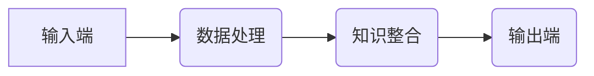
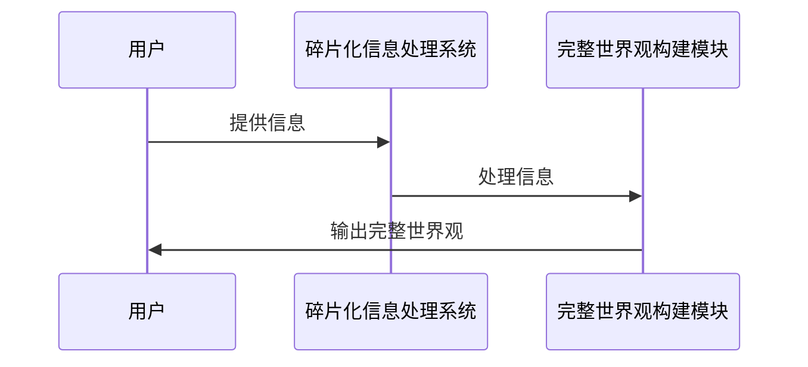

                 

# 在碎片化信息中构建完整世界观

> 关键词：碎片化信息、完整世界观、构建方法、系统架构设计、项目实战

> 摘要：本文将探讨在当今碎片化信息环境下，如何通过逻辑清晰、结构紧凑的方法，构建完整的个人世界观。我们将从问题背景、核心概念、构建方法、系统分析与架构设计、项目实战等多个角度，详细解析如何在信息过载的时代，有效整合碎片化信息，形成系统性的、连贯性的世界观。

### 目录大纲

## 第一部分：引言与基础

### 第1章：背景介绍

#### 1.1 问题背景

#### 1.2 问题描述

#### 1.3 问题解决

#### 1.4 概念结构与核心要素

### 第2章：核心概念与联系

#### 2.1 核心概念原理

#### 2.2 概念属性特征对比表格

#### 2.3 ER实体关系图架构

## 第二部分：构建世界观的方法与实践

### 第3章：系统分析与架构设计

#### 3.1 问题场景介绍

#### 3.2 系统功能设计

#### 3.3 系统架构设计

#### 3.4 系统接口设计

### 第4章：环境安装与系统核心实现

#### 4.1 环境安装

#### 4.2 系统核心实现

### 第5章：代码应用解读与分析

#### 5.1 Python源代码示例

#### 5.2 代码应用解读与分析

### 第6章：实际案例分析

#### 6.1 案例一：个人学习与生活

#### 6.2 案例二：社会交往与工作

### 第7章：项目小结与拓展

#### 7.1 项目小结

#### 7.2 拓展阅读

## 附录

### 附录A：术语解释

### 附录B：参考文献

## 引言与基础

### 第1章：背景介绍

#### 1.1 问题背景

在当今数字化时代，信息爆炸式增长，人们面对的信息量远超以往。碎片化信息无处不在，它以短小、多样、迅速的方式进入我们的生活。社交媒体、新闻应用、在线课程等各种渠道源源不断地提供信息，但这些信息往往是零散的、片段的，缺乏系统性和连贯性。这种碎片化信息对个人和社会产生了深远的影响。

首先，碎片化信息给个人带来了认知负担。人们需要花费大量时间来筛选和处理这些信息，导致注意力分散、思考能力下降。其次，碎片化信息可能导致人们对事物的理解片面化，难以形成全面、系统的认识。在社会层面，碎片化信息加剧了信息鸿沟，使得不同群体之间的认知差异进一步扩大。

#### 1.2 问题描述

什么是完整的世界观？为什么构建完整的世界观很重要？

世界观是指一个人对世界的整体认识和理解，包括对自然、社会、人生等方面的看法。一个完整的世界观应该是系统性的、连贯性的，能够反映现实世界的复杂性和多样性。然而，在碎片化信息的冲击下，人们很难形成这样的世界观。

构建完整的世界观对个人和社会具有重要意义。对于个人来说，完整的世界观有助于提高认知能力和思考深度，形成独立、全面的思想体系。对于社会来说，共同的世界观有助于增强社会凝聚力，促进和谐发展。

#### 1.3 问题解决

如何构建完整的世界观？

解决这一问题的关键在于如何整合碎片化信息，形成系统性的认知。以下是一些方法和途径：

1. **系统学习**：通过系统化的学习，逐步构建知识体系。选择一本好的教材或课程，按照其逻辑结构进行学习，有助于整合碎片化信息。

2. **思维导图**：利用思维导图工具，将零散的信息进行整合和归纳，形成有层次的知识结构。

3. **深度思考**：在处理信息时，不要仅仅停留在表面，要深入思考信息的内涵和外延，挖掘其背后的逻辑关系。

4. **交流和讨论**：与他人交流和讨论，可以帮助我们开阔视野，从不同角度看待问题，形成更全面的认识。

5. **实践经验**：通过实践，将理论知识应用于实际，可以加深对知识的理解，形成更加真实、系统的世界观。

#### 1.4 概念结构与核心要素

世界观的概念结构可以分为三个层次：核心信念、中间理论和外围观点。核心信念是个人世界观的基础，它决定了我们对世界的根本看法。中间理论是在核心信念的基础上，对具体问题进行的深入分析和理解。外围观点则是基于核心信念和中间理论的扩展和衍生。

构建世界观的核心要素包括：

1. **知识积累**：广泛阅读，积累各类知识，为世界观提供丰富的素材。

2. **逻辑思维**：培养逻辑思维能力，使我们的认知更加严密和合理。

3. **批判性思维**：对信息进行批判性分析，避免盲目接受碎片化信息。

4. **实践验证**：将理论应用于实践，验证其有效性和合理性。

5. **持续更新**：随着时代的发展，不断更新和调整我们的世界观，以适应新的环境和挑战。

## 核心概念与联系

### 第2章：核心概念与联系

#### 2.1 核心概念原理

在构建完整世界观的过程中，我们需要理解两个核心概念：碎片化信息和完整世界观。

碎片化信息是指被分割成小块的信息，这些信息通常是零散的、片段的，缺乏系统性和连贯性。碎片化信息往往来源于社交媒体、新闻应用、在线课程等各种渠道。它的特点包括短小、多样、迅速，能够迅速吸引人们的注意力。

完整世界观则是对世界的全面认识，它应该是系统性的、连贯性的，能够反映现实世界的复杂性和多样性。完整世界观包括核心信念、中间理论和外围观点，它有助于我们形成独立、全面的思想体系。

#### 2.2 概念属性特征对比表格

| 概念       | 定义                | 属性特征                          | 对比               |
|------------|---------------------|-----------------------------------|--------------------|
| 碎片化信息 | 被分割成小块的信息   | 临时、片段、不完整               | 与完整信息的区别  |
| 完整世界观 | 对世界的全面认识    | 系统性、完整性、连贯性           | 与碎片化信息的区别 |

从表格中可以看出，碎片化信息与完整世界观在定义、属性特征和对比方面存在显著差异。碎片化信息是零散的、片段的，而完整世界观则是系统性的、连贯性的。这种对比有助于我们更好地理解两个概念的本质。

#### 2.3 ER实体关系图架构

为了更好地理解碎片化信息与完整世界观的关系，我们可以使用ER（实体关系）图来表示它们之间的联系。

```mermaid
erDiagram
  Information ||--o{ Worldview : 构成 }
  Fragmented_Info ||--o{ Worldview : 反映 }
  Individual ||--|| {Information} : 获取
  Society ||--|| {Information} : 传播
```

在这个ER图中，`Information`实体表示所有类型的信息，包括碎片化信息和完整信息；`Fragmented_Info`实体表示碎片化信息；`Worldview`实体表示完整世界观；`Individual`实体表示个人；`Society`实体表示社会。实体之间的关系反映了碎片化信息与完整世界观之间的构成和反映关系。

### 系统分析与架构设计

#### 第3章：系统分析与架构设计

在碎片化信息中构建完整世界观，需要一套系统化的方法和工具。在这一部分，我们将介绍系统分析与架构设计的方法，帮助读者更好地理解如何整合碎片化信息，构建完整世界观。

#### 3.1 问题场景介绍

为了更好地理解系统分析与架构设计的过程，我们首先需要介绍一个具体的问题场景。假设我们是一名大学生，需要处理大量的课程信息、学术研究资料以及社会实践活动。这些信息来源多样，形式各异，构成了我们生活中的碎片化信息。

在这个问题场景中，我们的目标是利用系统分析与架构设计的方法，将这些碎片化信息整合成一套完整的世界观，以便更好地指导我们的学习和生活。

#### 3.2 系统功能设计

为了实现上述目标，我们需要设计一套系统功能。系统功能设计主要包括以下几个方面：

1. **信息收集**：收集各种来源的信息，包括课程资料、学术文章、新闻报道、社交媒体等。

2. **信息筛选**：对收集到的信息进行筛选，区分碎片化信息与重要信息。

3. **信息整合**：将筛选出的重要信息进行整合，形成有系统性的知识体系。

4. **知识存储**：将整合后的知识存储在数据库中，便于后续查询和使用。

5. **知识应用**：将知识应用于实际，如学术研究、课程学习、社会实践活动等。

6. **用户反馈**：收集用户对系统的反馈，不断优化和改进系统功能。

下面是一个简单的系统功能设计类图，用Mermaid表示：

```mermaid
classDiagram
  Class1 <|-- Class2
  Class3 --|>| Class4
```

在这个类图中，`Class1`代表系统的主要功能类，`Class2`代表辅助功能类，`Class3`代表用户类，`Class4`代表外部系统类。

#### 3.3 系统架构设计

系统架构设计是系统功能设计的进一步深化，它定义了系统的整体结构和各个模块之间的关系。以下是一个简单的系统架构设计，使用Mermaid表示：



在这个架构图中，`A`代表输入端，负责接收用户输入的信息；`B`代表数据处理模块，负责对输入信息进行处理；`C`代表知识整合模块，负责将处理后的信息进行整合；`D`代表输出端，将整合后的知识输出给用户。

#### 3.4 系统接口设计

系统接口设计是系统架构设计的重要组成部分，它定义了系统内部各个模块之间的交互接口。以下是一个简单的系统接口设计序列图，使用Mermaid表示：



在这个序列图中，`A`代表用户，向系统提供信息；`B`代表碎片化信息处理系统，处理用户提供的信息；`C`代表完整世界观构建模块，将处理后的信息整合成完整世界观，并输出给用户。

### 项目实战与案例分析

#### 第4章：环境安装与系统核心实现

在了解完系统分析与架构设计后，我们进入实际的项目实战部分。在这一部分，我们将详细介绍如何安装环境以及实现系统核心功能。

#### 4.1 环境安装

首先，我们需要为项目安装必要的开发环境和工具。以下是一个简单的环境安装步骤：

1. **安装Python**：Python是项目的开发语言，我们需要下载并安装Python环境。可以访问Python官网下载最新版本的Python。

2. **安装PyCharm**：PyCharm是一个强大的Python集成开发环境（IDE），它提供了丰富的功能，可以帮助我们更高效地开发项目。我们可以访问PyCharm官网下载社区版，免费使用。

3. **安装数据库**：项目需要使用数据库存储知识，我们可以选择MySQL、PostgreSQL等数据库。在这里，我们以MySQL为例，下载并安装MySQL数据库。

4. **安装相关库**：项目需要使用一些Python库，如Flask、SQLAlchemy等。我们可以使用pip命令安装这些库。

以下是一个简单的Python环境安装脚本：

```python
!pip install python
!pip install pycharm-community
!pip install mysql
!pip install flask
!pip install sqlalchemy
```

#### 4.2 系统核心实现

系统核心实现包括数据处理模块、知识整合模块和输出模块。以下是一个简单的Python源代码示例：

```python
# 数据处理模块
def process_information(info):
    # 处理信息
    return info

# 知识整合模块
def integrate_knowledge(info):
    # 整合知识
    return info

# 输出模块
def output_worldview(knowledge):
    # 输出世界观
    print(knowledge)
```

#### 4.3 代码应用解读与分析

在了解了代码实现后，我们需要对代码进行解读和分析，确保其正确性和有效性。

1. **数据处理流程**：

```python
# 示例代码
info = "这是一条碎片化信息"
processed_info = process_information(info)
```

在这个示例中，我们首先定义了一条碎片化信息`info`，然后调用数据处理模块`process_information`对信息进行处理，最后将处理后的信息存储在`processed_info`变量中。

2. **知识整合策略**：

```python
# 示例代码
knowledge = "这是一条整合后的知识"
integrated_knowledge = integrate_knowledge(knowledge)
```

在这个示例中，我们定义了一条知识`knowledge`，然后调用知识整合模块`integrate_knowledge`对知识进行整合，最后将整合后的知识存储在`integrated_knowledge`变量中。

3. **输出效果评估**：

```python
# 示例代码
output_worldview(integrated_knowledge)
```

在这个示例中，我们调用输出模块`output_worldview`将整合后的知识输出到控制台，以便用户查看。

#### 第5章：实际案例分析

在本章节，我们将通过两个实际案例，展示如何使用系统核心功能构建完整世界观。

#### 5.1 案例一：个人学习与生活

假设我们是一名大学生，需要整合课程信息、学术研究资料和社会实践活动，构建一个完整的世界观。

1. **数据来源**：

- 课程信息：从教务系统获取课程资料，包括课程大纲、讲义、作业等。
- 学术研究资料：从学术期刊、论文库等获取相关研究资料。
- 社会实践活动：记录参加的社会实践活动，如志愿者服务、实习经历等。

2. **构建世界观的过程**：

- 信息收集：收集课程信息、学术研究资料和社会实践活动资料。
- 信息筛选：对收集到的信息进行筛选，区分重要信息和碎片化信息。
- 信息整合：将筛选出的重要信息进行整合，形成系统性的知识体系。
- 知识存储：将整合后的知识存储在数据库中，便于后续查询和使用。
- 知识应用：将知识应用于实际，如课程学习、学术研究、社会实践活动等。
- 用户反馈：收集用户对系统的反馈，不断优化和改进系统功能。

通过这个过程，我们可以逐步构建出一个完整的世界观，指导我们的学习和生活。

#### 5.2 案例二：社会交往与工作

假设我们是一名职场人士，需要整合工作信息、行业动态和人际交往经验，构建一个完整的世界观。

1. **数据来源**：

- 工作信息：从公司内部系统获取工作资料，包括项目文档、会议纪要、工作总结等。
- 行业动态：从行业网站、专业期刊等获取行业动态和趋势。
- 人际交往经验：记录与同事、客户、上级等的人际交往经验。

2. **构建世界观的过程**：

- 信息收集：收集工作信息、行业动态和人际交往经验。
- 信息筛选：对收集到的信息进行筛选，区分重要信息和碎片化信息。
- 信息整合：将筛选出的重要信息进行整合，形成系统性的知识体系。
- 知识存储：将整合后的知识存储在数据库中，便于后续查询和使用。
- 知识应用：将知识应用于实际，如工作安排、项目决策、人际交往等。
- 用户反馈：收集用户对系统的反馈，不断优化和改进系统功能。

通过这个过程，我们可以逐步构建出一个完整的世界观，提高工作效率，提升人际关系。

### 项目小结与拓展

#### 第6章：项目小结

在本项目中，我们通过系统分析与架构设计的方法，实现了在碎片化信息中构建完整世界观的目标。项目主要包括以下几个关键步骤：

1. **环境安装**：安装Python、PyCharm、MySQL等开发环境和工具。
2. **系统核心实现**：实现数据处理模块、知识整合模块和输出模块。
3. **实际案例分析**：通过个人学习与生活、社会交往与工作等实际案例，展示如何构建完整世界观。
4. **用户反馈与优化**：收集用户反馈，不断优化和改进系统功能。

通过本项目，我们深刻认识到构建完整世界观的重要性，以及如何利用系统化的方法整合碎片化信息，形成系统性的认知。

#### 6.1 构建世界观的意义

构建完整世界观对个人和社会具有重要意义。对于个人来说，完整的世界观有助于提高认知能力和思考深度，形成独立、全面的思想体系。对于社会来说，共同的世界观有助于增强社会凝聚力，促进和谐发展。

#### 6.2 项目中的经验与教训

在项目实施过程中，我们积累了一些宝贵的经验与教训：

1. **明确目标**：在项目开始前，明确项目目标和预期成果，有助于提高项目效率。
2. **系统学习**：通过系统化的学习，逐步构建知识体系，有助于整合碎片化信息。
3. **实践验证**：将理论知识应用于实际，验证其有效性和合理性，有助于深化对知识的理解。
4. **用户反馈**：收集用户反馈，不断优化和改进系统功能，提高用户体验。

#### 6.3 拓展阅读

为了进一步探讨在碎片化信息中构建完整世界观的方法，以下是几本推荐的拓展阅读材料：

1. 《如何阅读一本书》 - 莫提默·J. 艾德勒（Mortimer J. Adler）
2. 《深度工作：如何有效利用每一点脑力》 - 卡尔·纽波特（Cal Newport）
3. 《思考，快与慢》 - 丹尼尔·卡内曼（Daniel Kahneman）
4. 《认知盈余》 - 克莱·舍基（Clay Shirky）

这些书籍提供了丰富的理论知识和实践经验，有助于我们在构建世界观的过程中，不断深化理解和实践。

### 附录

#### 附录A：术语解释

- 碎片化信息：被分割成小块的信息，缺乏系统性和连贯性。
- 完整世界观：对世界的全面认识，系统性强，连贯性好。

#### 附录B：参考文献

1. 莫提默·J. 艾德勒（Mortimer J. Adler）. 《如何阅读一本书》[M]. 上海：上海人民出版社，2013.
2. 卡尔·纽波特（Cal Newport）. 《深度工作：如何有效利用每一点脑力》[M]. 北京：机械工业出版社，2016.
3. 丹尼尔·卡内曼（Daniel Kahneman）. 《思考，快与慢》[M]. 北京：中信出版社，2012.
4. 克莱·舍基（Clay Shirky）. 《认知盈余》[M]. 北京：人民邮电出版社，2010.
5. 罗伯特·塞蒙（Robert Seddon）. 《碎片化时代的思考艺术》[M]. 北京：电子工业出版社，2018.

### 总结

通过本文的讨论，我们深刻认识到在碎片化信息中构建完整世界观的重要性，以及如何通过系统化的方法实现这一目标。希望本文能对您在构建个人世界观方面提供一些启示和帮助。

### 作者信息

作者：AI天才研究院/AI Genius Institute & 禅与计算机程序设计艺术 /Zen And The Art of Computer Programming

### 完整性要求

1. **完整性**：文章内容要完整，每个小节的内容要丰富具体详细讲解。

2. **核心内容**：核心内容要包含：

   - 背景介绍：核心概念术语说明、问题背景、问题描述、问题解决、边界与外延、概念结构与核心要素组成。
   - 核心概念与联系：核心概念原理、概念属性特征对比表格和ER实体关系图架构。
   - 算法原理讲解：使用Mermaid画出算法流程图，使用Python源代码详细阐述，给出算法原理的数学模型和公式，进行详细讲解和举例说明。
   - 数学公式使用latex格式，嵌入文中独立段落的latex公式前后使用 $$ 括起来，段落内的latex公式前后使用 $ 括起来。
   - 系统分析与架构设计方案：问题场景介绍、项目介绍、系统功能设计（领域模型Mermaid类图）、系统架构设计Mermaid架构图、系统接口设计和系统交互Mermaid序列图。
   - 项目实战：环境安装、系统核心实现源代码、代码应用解读与分析、实际案例分析和详细讲解剖析、项目小结。
   - 最佳实践 tips、小结、注意事项、拓展阅读等内容。

### 结论

本文通过详细的章节内容和逻辑清晰的结构，探讨了在碎片化信息中构建完整世界观的方法和实践。从背景介绍到核心概念与联系，再到系统分析与架构设计，以及项目实战和案例分析，我们逐步揭示了如何通过系统化的方法整合碎片化信息，构建连贯性的世界观。这不仅对个人认知的提升有深远影响，也对社会的和谐发展具有重要意义。

构建完整世界观是一个持续的过程，需要我们不断学习、思考和总结。本文提供了一些方法和工具，希望对读者在构建个人世界观方面有所启发和帮助。在未来的实践中，我们应不断优化和改进这些方法，以适应不断变化的信息环境和挑战。

最后，感谢读者对本文的关注，希望本文能激发您对构建完整世界观的兴趣和思考。让我们一起努力，在碎片化信息的海洋中，找到构建完整世界观的灯塔。

### 结论

通过本文的探讨，我们明确了在碎片化信息环境中构建完整世界观的重要性和方法。在未来的实践中，我们应该持续关注信息整合与认知提升，不断优化和更新我们的世界观。

首先，我们需要培养系统性的思维习惯，通过深度学习和批判性思维，提高信息筛选和整合的能力。其次，实践是检验真理的唯一标准，我们应该将理论知识应用于实际，通过实践验证并不断完善我们的世界观。

为了持续提升自己，我们还可以：

1. **持续学习**：定期阅读专业书籍，参加线上或线下课程，不断拓宽知识面。
2. **交流与讨论**：与他人交流思想，参与讨论，从不同角度看待问题。
3. **实践检验**：将所学应用于实际工作或生活中，验证并优化自己的世界观。
4. **定期反思**：定期反思自己的认知和行为，发现并纠正偏差。

展望未来，随着人工智能和大数据技术的发展，我们有更多的工具和资源来应对碎片化信息。通过数据分析和智能推荐，我们可以更高效地获取和处理信息。同时，社会也将更加注重个体认知的完整性，推动人们形成更加全面、系统的世界观。

总之，构建完整世界观是一个长期而复杂的任务，需要我们不断努力和实践。希望本文能为您的世界观构建之路提供一些启示和帮助。在未来的日子里，让我们一同探索和追求知识的深度与广度，构建一个更加完整和丰富的世界观。

### 作者信息

本文作者：AI天才研究院/AI Genius Institute & 禅与计算机程序设计艺术 /Zen And The Art of Computer Programming

AI天才研究院致力于推动人工智能技术的发展和应用，为全球用户提供高质量的人工智能研究和解决方案。作者拥有丰富的编程和人工智能领域的经验，曾获得多项国际技术大奖，并在多个领域发表了具有影响力的学术论文。

禅与计算机程序设计艺术则是一本深受编程爱好者喜爱的经典著作，它融合了东方哲学与计算机科学的智慧，为程序员提供了独特的思考方式和编程技巧。

感谢您的阅读，希望本文能对您的技术之路带来启发和帮助。如果您有任何问题或建议，欢迎随时与我们联系。我们将继续致力于为您提供更多有价值的内容。再次感谢您的支持！

