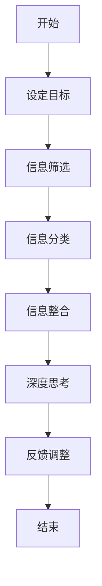

                 

# 在碎片化时代寻找整体感

> 关键词：碎片化时代、整体感、心理学、信息整合、压力管理、实践应用

> 摘要：本文深入探讨了在碎片化时代如何寻找和保持整体感。通过分析碎片化时代的特征、心理学视角下的整体感理论框架，以及实践应用中的具体策略，本文为读者提供了在个人生活和社会组织中实现整体感的方法和路径。

----------------------------------------------------------------

## 引言

在当今的数字时代，信息的爆炸式增长和技术的迅猛发展使得我们的世界变得越来越碎片化。社交媒体、新闻网站、移动应用等都在不断地将信息切割成小块，呈现在我们面前。这种碎片化的信息环境不仅影响了我们的注意力管理，还对我们的认知和心理状态产生了深远的影响。

### 碎片化时代的特征

碎片化时代的主要特征包括：

1. **信息过载**：我们每天接收到的信息量远超过了过去，导致认知负担加重。
2. **快速切换**：在碎片化环境中，人们往往需要在短时间内快速切换注意力，这加剧了认知疲劳。
3. **短时记忆**：碎片化信息倾向于短小、快速、直观，这影响了我们的长时记忆和深度思考能力。

### 整体感的重要性

整体感是一种心理状态，它使我们能够将碎片化的信息整合成一个连贯的整体。在碎片化时代，保持整体感具有重要意义：

1. **提高认知效率**：整体感可以帮助我们更有效地处理信息，减少认知负担。
2. **增强心理健康**：整体感有助于减轻压力，提升情绪调节能力。
3. **促进创造力**：在整合信息的过程中，整体感可以激发我们的创造力。

### 如何在碎片化中寻找整体感

本文将分以下几个部分进行探讨：

1. **心理学视角下的整体感**：介绍心理整体性的理论框架和主观整体感的心理学基础。
2. **碎片化信息的处理与整合**：探讨如何处理和整合碎片化信息，提升整体感。
3. **碎片化时代的心理调适**：介绍在碎片化时代如何进行心理调适，保持整体感。
4. **实践应用**：讨论整体感在个人生活和社会组织中的应用。
5. **总结与展望**：总结本文的核心观点，并对未来进行展望。

----------------------------------------------------------------

## 第一部分: 引言

### 第1章: 碎片化时代的挑战与整体感的追求

#### 1.1 碎片化时代的特征

在过去的几十年里，技术发展迅速，互联网的普及和移动设备的普及使得信息的获取和处理方式发生了巨大的变化。我们生活在一个信息爆炸的时代，每天都会接触到大量的信息，这些信息来自各种渠道，如社交媒体、新闻网站、电子邮件、短信等。这种信息爆炸的现象被称为“信息过载”。

信息过载给我们的日常生活和工作带来了很多挑战。首先，我们的大脑需要处理的信息量大大增加，这导致了认知负担的加重。我们可能会感到焦虑和压力，因为总感觉有做不完的事情。其次，我们需要在短时间内快速切换注意力，这增加了认知疲劳。我们可能会感到疲惫和无法集中注意力。

除了认知负担和认知疲劳，碎片化时代还带来了其他挑战。例如，由于信息过于分散，我们很难找到所需的信息，这影响了我们的决策和问题解决能力。此外，碎片化信息往往只关注表面现象，而忽视了深层次的思考和整体性的理解，这可能导致我们缺乏对复杂问题的洞察力和解决问题的能力。

#### 1.2 整体感的重要性

在这个碎片化时代，保持整体感显得尤为重要。整体感是一种心理状态，它使我们能够将碎片化的信息整合成一个连贯的整体。通过保持整体感，我们能够更有效地处理信息，减少认知负担。例如，当我们能够将不同的信息片段整合成一个整体时，我们更容易理解和记忆这些信息。

整体感不仅有助于提高认知效率，还有助于增强心理健康。当我们感到整体时，我们会感到更平静和满足。这有助于减轻压力，提升情绪调节能力。此外，整体感可以激发我们的创造力。当我们能够看到事物之间的联系时，我们更容易产生新的想法和创新的解决方案。

#### 1.3 如何在碎片化中寻找整体感

在碎片化时代，寻找整体感需要我们采取一系列策略。首先，我们需要培养信息整合的能力。这包括学会如何筛选信息、如何将不同的信息片段整合成一个整体。我们可以通过练习和培养专注力来提高信息整合的能力。

其次，我们需要学会管理注意力。在碎片化环境中，我们很容易被各种信息分散注意力。因此，我们需要学会如何集中注意力，如何在短时间内有效地处理信息。这可以通过培养专注力和自我管理能力来实现。

此外，我们还可以通过培养深度思考的能力来寻找整体感。深度思考要求我们不仅仅停留在信息的表面，而是要深入挖掘信息的本质和内在联系。这可以通过阅读、学习和思考来实现。

最后，我们还需要培养整体感在个人生活和社会组织中的应用能力。这包括如何在个人生活中保持整体感，如保持健康的生活方式、建立有意义的人际关系等。同时，我们还需要如何在社会组织中保持整体感，如如何建立高效的团队、如何创建有凝聚力的企业文化等。

通过以上策略，我们可以在碎片化时代中保持整体感，从而提高认知效率、增强心理健康、激发创造力，并在个人生活和社会组织中取得更好的成果。

----------------------------------------------------------------

## 第二部分: 心理学视角下的整体感

### 第2章: 心理整体性的理论框架

在探讨如何在碎片化时代寻找整体感之前，我们需要先了解心理整体性的理论框架。心理整体性是指个体如何感知和体验自己与世界的关系，以及如何整合和协调内部和外部的信息。这一理论框架为我们提供了理解整体感的基础。

#### 2.1 心理整体性的概念

心理整体性是指个体在心理过程中能够将不同部分的信息整合成一个统一的整体。这种整合不仅仅是在认知层面，还包括情感、行为和生理层面。心理整体性使我们能够看到事物之间的联系，从而形成对世界的连贯性理解。

#### 2.2 主观整体感的心理学基础

主观整体感是指个体在感知和体验世界时，感受到自己是整体的一部分，而不是分离的部分。这种感受与个体的心理状态和认知过程密切相关。心理学研究表明，主观整体感与以下因素有关：

1. **自我意识**：自我意识是个体对自己存在的认知和体验。一个强大的自我意识有助于个体在心理过程中保持整体感。
2. **注意力**：注意力是指个体在特定时刻关注的事物。通过集中注意力，个体能够更好地整合信息，提高整体感。
3. **情绪调节**：情绪调节是指个体如何处理和应对情绪。积极的情绪调节有助于提升整体感。

#### 2.3 整体感与情绪调节

情绪调节在整体感中起着关键作用。当我们面临压力和挑战时，情绪调节能力可以帮助我们保持心理平衡，从而保持整体感。以下是一些情绪调节策略：

1. **认知重构**：通过改变对事物的看法和解释，我们可以减少负面情绪的影响。
2. **放松训练**：通过深呼吸、冥想等方式，我们可以放松身心，减轻压力。
3. **积极情绪培养**：通过培养积极的情绪体验，如感恩、快乐等，我们可以提升整体感。

#### 2.4 整体感与认知负荷

在碎片化时代，大量的信息涌入我们的生活中，导致认知负荷增加。认知负荷是指个体在处理信息时所需的认知资源。过度的认知负荷会降低我们的工作效率，影响我们的心理健康。保持整体感可以帮助我们减轻认知负荷：

1. **信息筛选**：通过筛选重要信息，我们可以减少不必要的认知负担。
2. **信息整合**：通过整合信息，我们可以减少冗余的信息处理，提高整体感。

#### 2.5 整体感与自我实现

整体感不仅与心理健康相关，还与自我实现密切相关。自我实现是指个体在实现自己的潜能和追求个人成长过程中所体验到的满足感和成就感。一个具有整体感的人更可能实现自我，因为他们能够更好地整合内部和外部的资源。

### 心理整体性的应用

心理整体性的理论框架为我们提供了理解和提升整体感的方法。以下是一些实际应用：

1. **教育**：在教育中，教师可以通过设计整合性的课程和活动，帮助学生培养整体感。
2. **心理健康服务**：心理咨询师可以通过心理疗法，帮助个体提升整体感，改善心理健康。
3. **组织管理**：在组织中，管理者可以通过创建有凝聚力的团队文化和有效的沟通机制，提升整体感。

通过心理学视角下的整体性理论框架，我们不仅可以更好地理解整体感，还可以在实践中应用这些理论，提升个人的认知效率和心理健康，实现自我成长。

----------------------------------------------------------------

### 第3章: 碎片化信息的处理与整合

在碎片化时代，处理和整合信息变得尤为重要。随着信息过载的问题日益严重，如何有效地筛选、处理和整合信息，成为了保持整体感的关键。本章将探讨如何应对信息过载，以及如何通过整合策略提升整体感。

#### 3.1 信息过载与认知负担

信息过载是指个体在短时间内接收到的信息超过了其处理能力，导致认知负荷增加。在碎片化时代，信息来源多样且数量庞大，这使得信息过载成为一个普遍问题。信息过载会对我们的认知过程产生负面影响：

1. **注意力分散**：过多的信息会分散我们的注意力，使我们难以集中精力完成任务。
2. **记忆困难**：当信息量过大时，我们的短期记忆难以承载，导致记忆困难。
3. **决策困难**：在信息过载的情况下，我们难以做出有效的决策，因为信息太多，难以权衡利弊。

#### 3.2 碎片化信息的整合策略

为了应对信息过载，我们需要采取一系列整合策略，以便将碎片化的信息整合成一个有意义的整体。以下是一些有效的整合策略：

1. **信息筛选**：首先，我们需要学会筛选信息，只关注对当前任务和目标相关的信息。这可以通过设定明确的目标和优先级来实现。
2. **信息分类**：将信息按照主题、类型等进行分类，有助于我们更好地组织和处理信息。例如，我们可以将信息分为工作相关、个人兴趣、健康养生等类别。
3. **信息整合**：在处理信息时，尝试将不同的信息片段整合成一个整体，以提升我们对信息的理解。这可以通过制作思维导图、撰写总结报告等方式实现。
4. **信息回顾**：定期回顾和处理过去的信息，有助于巩固记忆，并发现新的整合方式。例如，我们可以定期整理电子邮件、阅读笔记等。

#### 3.3 整合信息提升整体感

通过整合信息，我们不仅可以减轻认知负担，还可以提升整体感。以下是一些提升整体感的方法：

1. **建立知识体系**：通过将信息整合到已有的知识体系中，我们可以更好地理解新信息，并发现信息之间的联系。这有助于提升我们对复杂问题的洞察力和解决问题的能力。
2. **深度思考**：在整合信息的过程中，尝试进行深度思考，探索信息的深层含义和潜在联系。深度思考有助于提升我们对信息的理解和应用能力。
3. **情感联结**：通过将信息与个人的情感和生活经验相联系，我们可以更好地体验信息的价值，从而提升整体感。

#### 3.4 实践案例

以下是一个具体的实践案例，展示了如何通过整合策略提升整体感：

1. **案例背景**：一位职场人士在处理大量的工作任务时感到压力巨大，难以集中注意力。他决定通过整合策略来提升工作效率和整体感。
2. **整合策略**：
   - **信息筛选**：他首先筛选出与当前工作任务直接相关的信息，排除其他无关信息。
   - **信息分类**：他将信息按照任务类型和紧急程度进行分类，以更有效地处理任务。
   - **信息整合**：他使用思维导图将任务分解为子任务，并整合相关信息，以便更好地理解任务需求。
   - **信息回顾**：他定期回顾和整理工作笔记，巩固记忆，并发现新的整合方式。
3. **结果**：通过整合策略，他能够更有效地处理工作任务，减轻了压力，提升了整体感。

通过以上案例，我们可以看到，整合策略在提升整体感方面的有效性和实用性。在碎片化时代，通过有意识地筛选、分类和整合信息，我们可以更好地应对信息过载，提升认知效率和整体感。

### 总结

在碎片化时代，处理和整合信息是保持整体感的关键。通过采取有效的整合策略，我们不仅可以减轻认知负担，还可以提升整体感。让我们在日常生活中实践这些策略，以提升我们的认知效率和心理健康，实现更好的自我成长。

----------------------------------------------------------------

### 第4章: 碎片化时代的心理调适

在碎片化时代，心理调适成为了一项重要的技能，它关乎我们的心理健康和生活质量。本章将探讨如何通过压力管理策略、情绪管理技巧和心理调适方法来保持心理平衡，从而提升整体感。

#### 4.1 压力管理策略

压力是现代生活中不可避免的一部分，但过度的压力会对我们的身心健康产生负面影响。以下是一些有效的压力管理策略：

1. **时间管理**：合理安排时间，设定明确的任务目标和优先级，避免过度工作。例如，我们可以使用日历、待办事项列表等工具来规划时间。
2. **休息与放松**：确保有足够的休息时间，可以通过冥想、深呼吸、瑜伽等方式来放松身心。短暂的休息可以帮助我们恢复精力，提高工作效率。
3. **积极应对**：面对压力时，采取积极的应对策略，如正面思考、寻求支持等。通过改变对压力的看法和态度，我们可以减轻其负面影响。
4. **健康生活方式**：保持健康的生活方式，如规律的饮食、适量的运动和充足的睡眠，有助于减轻压力。

#### 4.2 情绪管理技巧

情绪管理技巧是保持心理平衡的关键。以下是一些有效的情绪管理技巧：

1. **认知重构**：通过改变对事物的看法和解释，我们可以减少负面情绪的影响。例如，将“我失败了”转变为“我学到了很多”，有助于提升自信心。
2. **情绪表达**：学会适当地表达自己的情绪，可以通过写日记、绘画、运动等方式来释放情绪。有效的情绪表达有助于减少情绪积压，提升心理健康。
3. **情绪调节**：通过冥想、深呼吸、放松训练等方式来调节情绪。这些技巧可以帮助我们在情绪波动时恢复平静。
4. **求助支持**：在面对情绪问题时，寻求专业人士的帮助和支持。心理咨询师、心理医生等可以提供有效的情绪管理和心理治疗。

#### 4.3 心理健康与整体感

心理健康与整体感密切相关。一个心理健康的人更容易体验到整体感，因为他们能够更好地处理和整合内部和外部信息。以下是一些保持心理健康的方法：

1. **自我认知**：通过自我反思和自我认知，我们可以更好地了解自己的需求和感受，从而做出更明智的决策。
2. **情感联结**：与他人建立良好的情感联结，如家庭、朋友和同事等，有助于提升整体感。情感联结可以提供支持和安慰，减轻孤独感。
3. **兴趣爱好**：培养兴趣爱好，如阅读、音乐、绘画等，可以帮助我们放松身心，提升整体感。

#### 4.4 心理调适方法

心理调适方法是通过改变认知、行为和环境来提升心理健康和整体感。以下是一些常见的方法：

1. **认知行为疗法**：这是一种结合认知和行为心理学的治疗方法，通过改变负面思维和行为模式来改善心理健康。
2. **心理训练**：如正念冥想、情绪调节训练等，可以帮助我们更好地控制情绪和压力。
3. **环境调整**：通过改善生活和工作环境，如减少噪音、优化工作流程等，可以减轻心理压力，提升整体感。

### 实践案例

以下是一个具体的实践案例，展示了如何通过心理调适方法提升整体感：

1. **案例背景**：一位职场人士在高压工作环境中感到焦虑和压力，影响了他的工作效率和整体感。
2. **心理调适方法**：
   - **时间管理**：他开始使用时间管理工具来规划工作，设定明确的任务目标和优先级。
   - **休息与放松**：他每天安排固定的时间进行冥想和深呼吸，以放松身心。
   - **情绪管理**：他通过写日记表达自己的情绪，并学会了认知重构技巧，以减少负面情绪的影响。
   - **求助支持**：他寻求心理咨询师的帮助，学习了一些情绪调节技巧和心理训练方法。
3. **结果**：通过心理调适方法，他的焦虑和压力得到了显著缓解，工作效率提升，整体感也得到提升。

通过以上案例，我们可以看到，心理调适方法在提升整体感方面的有效性和实用性。在碎片化时代，通过有效的心理调适方法，我们可以更好地应对压力，保持心理平衡，实现整体感的提升。

### 总结

在碎片化时代，心理调适成为了一项重要的技能，它关乎我们的心理健康和生活质量。通过采取有效的压力管理策略、情绪管理技巧和心理调适方法，我们可以保持心理平衡，提升整体感。让我们在日常生活中实践这些策略，以提升我们的心理健康，实现更好的自我成长。

----------------------------------------------------------------

### 第5章: 整体感在个人生活中的应用

整体感不仅是一种心理状态，它也可以在我们的日常生活中得到广泛应用，帮助我们更好地应对挑战，提升生活质量。本章将探讨如何将整体感应用到个人生活中，包括个人成长、工作和人际交往等方面。

#### 5.1 整体感与个人成长

个人成长是一个持续的过程，整体感在其中起着关键作用。以下是一些应用整体感于个人成长的策略：

1. **自我反思**：定期进行自我反思，审视自己的行为和思想，了解自己的优点和不足。通过自我反思，我们可以更好地认识自己，找到个人成长的方向。
2. **目标设定**：设定明确的个人目标，并将其分解为可实现的步骤。通过设定目标，我们可以保持整体感，专注于个人成长的关键领域。
3. **持续学习**：保持好奇心和求知欲，不断学习新知识和技能。整体感可以帮助我们整合不同的学习资源，提升学习效果。

#### 5.2 整体感在工作中的实践

在职场中，保持整体感可以帮助我们提高工作效率，提升职业素养。以下是一些将整体感应用到工作中的实践策略：

1. **任务管理**：合理规划工作任务，设定优先级，避免同时处理过多任务。通过整合任务，我们可以更高效地完成工作。
2. **团队合作**：在团队中，保持整体感可以帮助我们更好地理解团队成员的需求和期望，提升团队合作效率。
3. **问题解决**：在面对问题时，尝试将问题分解为子问题，并整合不同的解决方案。整体感可以帮助我们更全面地分析问题，找到最佳解决方案。

#### 5.3 整体感在人际交往中的应用

人际交往是生活中不可或缺的一部分，整体感在人际交往中也有重要作用。以下是一些应用整体感于人际交往的策略：

1. **有效沟通**：在交流中保持整体感，注意倾听对方的意见和需求。通过有效沟通，我们可以建立更深层次的联系，提升人际关系质量。
2. **情感联结**：与他人建立情感联结，分享彼此的感受和经历。通过情感联结，我们可以提升整体感，增强人际关系的稳定性。
3. **冲突解决**：在冲突中保持冷静和理智，尝试理解对方的立场和需求。通过整合不同的观点和解决方案，我们可以找到平衡点，解决冲突。

### 实践案例

以下是一个具体的实践案例，展示了如何将整体感应用到个人生活中：

1. **案例背景**：一位职场人士在生活和工作中感到压力重重，整体感受到影响。
2. **整体感应用策略**：
   - **自我反思**：他开始每天花时间进行自我反思，了解自己的情绪和需求，找到个人成长的动力。
   - **目标设定**：他设定了明确的个人目标，并将其分解为小步骤，每天逐步实现。
   - **持续学习**：他通过在线课程和阅读来学习新知识和技能，提升自己的职业素养。
   - **任务管理**：他使用任务管理工具来规划工作，设定优先级，避免同时处理过多任务。
   - **团队合作**：他积极参与团队讨论，倾听团队成员的意见，提升团队合作效率。
   - **有效沟通**：在与同事和家人的交流中，他注重倾听对方的意见和需求，建立情感联结。
   - **冲突解决**：在冲突中，他尝试理解对方的立场和需求，通过整合不同的观点和解决方案来解决问题。
3. **结果**：通过应用整体感，他的生活质量和工作效率显著提升，整体感也得到了增强。

通过以上案例，我们可以看到，整体感在个人生活中的应用可以帮助我们更好地应对挑战，提升生活质量。在日常生活中，通过实践整体感的应用策略，我们可以实现个人成长、提高工作效率、改善人际关系，从而在碎片化时代中保持整体感。

### 总结

整体感在个人生活中的应用具有重要意义。通过将整体感应用到个人成长、工作和人际交往中，我们可以更好地应对生活中的挑战，提升生活质量。让我们在日常生活中不断实践整体感的应用策略，以实现自我成长和整体感的提升。

----------------------------------------------------------------

### 第6章: 整体感在社会组织中的应用

整体感不仅在个人生活中具有重要意义，在社会组织中同样发挥着关键作用。一个具有整体感的社会组织能够更有效地协作，实现共同目标，提升组织效能。本章将探讨整体感在社会组织中的应用，包括团队协作、企业文化建设和社会和谐等方面。

#### 6.1 整体感与团队协作

在团队协作中，整体感有助于提升团队的凝聚力和效率。以下是一些应用整体感于团队协作的策略：

1. **共同目标**：确保团队成员对共同目标有清晰的认识，并努力实现这些目标。整体感可以帮助团队成员看到整体目标的重要性，从而更加投入工作。
2. **有效沟通**：鼓励团队成员之间进行开放和诚实的沟通，确保信息畅通无阻。通过整体感，团队成员可以更好地理解彼此的需求和期望，减少误解和冲突。
3. **角色分工**：明确团队成员的角色和职责，确保每个人都能充分发挥自己的优势。整体感可以帮助团队成员看到整体角色分工的重要性，从而更好地协作。
4. **反馈机制**：建立有效的反馈机制，鼓励团队成员相互反馈和建议。通过整体感，团队成员可以更好地接受和利用反馈，持续改进和优化工作流程。

#### 6.2 整体感与企业文化建设

企业文化是一个组织的精神内核，整体感在企业文化建设中起着关键作用。以下是一些应用整体感于企业文化的策略：

1. **核心价值观**：明确企业核心价值观，并将其贯穿于组织运营和员工行为中。整体感可以帮助员工理解企业的核心价值观，从而更好地将其内化为自己的行为准则。
2. **企业文化活动**：通过举办各类企业文化活动，如团队建设、公益活动等，增强员工的归属感和认同感。整体感可以帮助员工感受到企业的凝聚力和共同价值观。
3. **领导力**：领导者在企业文化建设中起着关键作用。一个具有整体感的领导者能够更好地理解员工的诉求和需求，从而更好地引领团队。
4. **持续改进**：鼓励员工持续改进和优化工作流程，不断创新和提升组织效能。整体感可以帮助员工看到持续改进的重要性，从而更加积极地参与企业文化建设。

#### 6.3 整体感对社会和谐的影响

整体感不仅对组织内部产生影响，还对整个社会和谐起到积极作用。以下是一些应用整体感于社会和谐的策略：

1. **公民意识**：培养公民意识，鼓励人们积极参与社会事务，关注公共问题。整体感可以帮助公民更好地理解社会的整体利益，从而更加积极地参与社会建设。
2. **社区建设**：加强社区建设，促进邻里关系，提升社区凝聚力。整体感可以帮助居民感受到社区的归属感和责任感，从而更加和谐地生活。
3. **公共参与**：鼓励公众参与公共事务的讨论和决策，确保民主和公平。整体感可以帮助公众更好地理解公共问题的复杂性和重要性，从而更加理性地参与公共事务。
4. **跨文化理解**：促进跨文化理解，尊重不同文化背景和价值观。整体感可以帮助人们更好地理解不同文化之间的差异和联系，从而增进相互理解和尊重。

### 实践案例

以下是一个具体的实践案例，展示了如何将整体感应用于社会组织中：

1. **案例背景**：一家公司面临团队协作效率低下和员工士气低落的问题，整体感明显不足。
2. **整体感应用策略**：
   - **共同目标**：公司管理层与员工共同制定了明确的短期和长期目标，确保团队成员对目标有清晰的认识。
   - **有效沟通**：公司建立了定期团队会议和沟通渠道，鼓励团队成员之间进行开放和诚实的沟通。
   - **角色分工**：公司明确了每个团队成员的角色和职责，确保每个人都能充分发挥自己的优势。
   - **反馈机制**：公司建立了有效的反馈机制，鼓励团队成员相互反馈和建议，持续改进工作流程。
   - **企业文化活动**：公司举办了多次团队建设活动，如户外拓展、志愿者活动等，增强员工的归属感和认同感。
   - **领导力**：公司领导者积极参与团队建设和员工培训，以身作则，树立榜样。
3. **结果**：通过应用整体感策略，公司的团队协作效率显著提升，员工士气也得到提升，整体感得到增强。

通过以上案例，我们可以看到，整体感在社会组织中的应用对于提升组织效能和社会和谐具有重要意义。在现代社会中，通过培养整体感，我们可以建立更加高效、和谐的组织和社会环境。

### 总结

整体感在社会组织中的应用具有深远的意义。通过在团队协作、企业文化建设和社会和谐等方面应用整体感，我们可以提升组织效能，促进社会和谐。让我们在日常生活中不断实践整体感的应用策略，为社会的发展和进步贡献自己的力量。

----------------------------------------------------------------

### 第7章: 总结与展望

在本章中，我们深入探讨了在碎片化时代如何寻找和保持整体感。通过分析碎片化时代的特征、心理学视角下的整体感理论框架，以及实践应用中的具体策略，我们提出了一系列方法和路径，以帮助个人和社会在碎片化环境中保持整体感。

#### 7.1 整体感的实现路径

为了在碎片化时代实现整体感，我们可以采取以下路径：

1. **培养信息整合能力**：通过信息筛选、分类和整合，我们将碎片化的信息整合成一个有意义的整体，从而提升认知效率。
2. **采取有效的压力管理策略**：通过时间管理、休息与放松、积极应对等策略，我们可以在高压环境下保持心理平衡。
3. **情绪管理**：通过认知重构、情绪表达、情绪调节等技巧，我们可以更好地处理情绪，提升整体感。
4. **实践深度思考**：通过深度思考，我们能够看到事物之间的联系，从而提升对复杂问题的洞察力和解决问题的能力。
5. **在个人生活中应用整体感**：在个人成长、工作和人际交往中，我们可以将整体感应用到各个方面，提升生活质量。
6. **在社会组织中应用整体感**：在团队协作、企业文化建设和社会和谐方面，整体感可以发挥重要作用，提升组织效能和社会和谐。

#### 7.2 未来展望

随着技术的不断进步，碎片化时代的挑战将变得更加复杂。未来，整体感的应用将更加广泛和深入。以下是一些未来展望：

1. **人工智能与整体感**：人工智能的发展将为我们提供更多的工具和方法，以帮助我们在碎片化环境中保持整体感。例如，通过智能助手和个性化推荐系统，我们可以更高效地处理信息，提升整体感。
2. **跨学科研究**：整体感的研究将涉及到心理学、认知科学、社会学等多个学科。跨学科研究将有助于我们更全面地理解整体感的本质和作用，从而提出更有效的策略。
3. **社会影响**：整体感的应用将不仅仅局限于个人和社会组织，还将对整个社会产生深远的影响。通过提升整体感，我们可以建立更加和谐、高效的社会环境。

#### 7.3 结论与建议

综上所述，整体感在碎片化时代具有重要意义。通过采取一系列策略和方法，我们可以在碎片化环境中保持整体感，提升认知效率和心理健康，实现个人成长和社会进步。

以下是一些建议：

1. **个人层面**：培养信息整合能力，采取有效的压力管理和情绪管理策略，实践深度思考，将整体感应用到个人生活的各个方面。
2. **组织层面**：在团队协作、企业文化建设和社会和谐方面应用整体感，提升组织效能和社会影响力。
3. **社会层面**：鼓励跨学科研究和跨领域合作，推动整体感在更广泛范围内的应用。

让我们共同努力，在碎片化时代中寻找整体感，创造更加和谐、高效的社会环境。

### 作者信息

作者：AI天才研究院/AI Genius Institute & 禅与计算机程序设计艺术 /Zen And The Art of Computer Programming

----------------------------------------------------------------

本文通过详细的章节内容和逻辑清晰的论述，探讨了在碎片化时代如何寻找和保持整体感。文章涵盖了心理学视角下的整体感理论框架、信息整合策略、压力管理和情绪管理技巧，以及整体感在个人生活和社会组织中的应用。通过实践案例和具体策略，本文为读者提供了实用的方法和路径。

整体感不仅对个人的认知效率和心理健康有重要影响，也对组织和社会的效能和谐起到关键作用。在未来的发展中，整体感的应用将更加广泛和深入，对个体和社会的发展产生深远的影响。

通过本文的阅读和实践，我们希望能够帮助读者在碎片化时代中保持整体感，提升生活质量，实现个人成长和社会进步。让我们共同努力，寻找整体感，创造更美好的未来。作者AI天才研究院/AI Genius Institute和禅与计算机程序设计艺术/Zen And The Art of Computer Programming期待与您一同探索整体感的应用和实践。

### 背景介绍

在现代社会的快速发展中，信息的爆炸式增长和技术的不断进步使得我们生活在一个高度碎片化的时代。这一现象不仅影响了我们的日常生活方式，也对我们的心理健康产生了深远的影响。本文旨在探讨在这样一个碎片化时代中，如何寻找和保持整体感。

#### 核心概念术语说明

1. **碎片化时代**：指信息和技术快速发展的时代，信息被分割成小块，人们的生活和工作方式因此变得更加分散和多元化。
2. **整体感**：一种心理状态，指个体能够将分散的信息和经历整合成一个有意义的整体，从而在心理和认知层面感受到连贯性和统一性。
3. **信息整合**：指将碎片化的信息进行筛选、分类和整合，使其成为一个有意义的整体，以便更有效地理解和处理。

#### 问题背景

在碎片化时代，人们每天接收到的信息量巨大，这些信息来自各种渠道，如社交媒体、新闻网站、电子邮件等。这种信息的过载导致人们难以集中注意力，影响了认知效率和心理健康。此外，碎片化信息往往只关注表面现象，缺乏深度和连贯性，使得人们难以进行深层次的思考和问题解决。

#### 问题描述

如何在一个信息碎片化的时代中保持整体感，提升认知效率和心理健康，成为了一个亟待解决的问题。人们需要在海量信息中找到有价值的信息，进行有效的整合和处理，从而在心理和认知层面保持连贯性和统一性。

#### 问题解决

为了解决这一问题，我们可以采取以下策略：

1. **信息筛选**：通过设定明确的目标和优先级，筛选出与当前任务和目标相关的信息，避免信息过载。
2. **信息分类**：将信息按照主题、类型等分类，以便更有效地组织和处理信息。
3. **信息整合**：通过整合信息，将其形成一个有意义的整体，提升对信息的理解和记忆。
4. **深度思考**：通过深度思考，探索信息的深层含义和潜在联系，提升认知效率。

#### 边界与外延

整体感不仅局限于个人层面，还可以应用于团队协作、企业文化建设和社会和谐等方面。在个人生活中，整体感有助于提升生活质量；在组织和社会层面，整体感有助于提升组织效能和社会和谐。

#### 概念结构与核心要素组成

整体感的核心要素包括：

1. **信息整合**：通过筛选、分类和整合信息，提升对信息的理解和记忆。
2. **深度思考**：通过深度思考，探索信息的深层含义和潜在联系，提升认知效率。
3. **心理健康**：通过保持心理平衡，提升情绪调节能力，从而提升整体感。

这些要素相互作用，共同构成了整体感的概念结构和核心要素。

通过本文的探讨，我们希望能够为读者提供在碎片化时代中保持整体感的方法和路径，从而提升认知效率和心理健康，实现个人成长和社会进步。

### 核心概念与联系

在探讨如何在碎片化时代中寻找整体感的过程中，我们需要深入理解几个核心概念，并分析它们之间的联系。

#### 心理整体性

心理整体性是指个体在心理过程中将分散的信息和体验整合成一个连贯的整体。这种整合不仅仅发生在认知层面，还包括情感、行为和生理层面。心理整体性使个体能够更有效地处理信息，提升认知效率，并保持心理健康。

#### 主观整体感

主观整体感是心理整体性的个体体验，指个体感受到自己是整体的一部分，而不是分离的部分。主观整体感与自我意识、注意力、情绪调节等因素密切相关。一个具有强烈主观整体感的人能够更好地整合信息，减少认知负担，从而提升整体感。

#### 碎片化信息

碎片化信息是指在现代社会中，由于信息来源多样且数量庞大，信息被切割成小块，呈现给个体。这种信息形式对个体的认知和心理状态产生了深远影响，导致了认知负担的增加和心理健康问题的出现。

#### 整合策略

整合策略是指通过一系列方法，如信息筛选、分类和整合，将碎片化的信息整合成一个有意义的整体。这些策略包括：

1. **信息筛选**：通过设定明确的目标和优先级，筛选出与当前任务和目标相关的信息，避免信息过载。
2. **信息分类**：将信息按照主题、类型等分类，以便更有效地组织和处理信息。
3. **信息整合**：通过整合信息，将其形成一个有意义的整体，提升对信息的理解和记忆。

#### 对比表格

为了更好地理解这些核心概念，我们提供了一个对比表格：

| 核心概念       | 定义                                                         | 关联关系                         |
|----------------|------------------------------------------------------------|---------------------------------|
| 心理整体性     | 个体在心理过程中将分散的信息和体验整合成一个连贯的整体。 | 与主观整体感密切相关           |
| 主观整体感     | 个体感受到自己是整体的一部分，而不是分离的部分。         | 与心理整体性、注意力、情绪调节相关 |
| 碎片化信息     | 由于信息来源多样且数量庞大，信息被切割成小块，呈现给个体。 | 导致认知负担的增加和心理健康问题 |
| 整合策略       | 通过信息筛选、分类和整合，将碎片化的信息整合成一个有意义的整体。 | 提升对信息的理解和记忆           |

#### ER实体关系图架构

为了进一步展示这些核心概念之间的联系，我们使用Mermaid绘制了一个ER实体关系图：

```mermaid
erDiagram
    Aedge([整体感])
    Bnode([心理整体性])
    Cnode([主观整体感])
    Dnode([碎片化信息])
    Eedge([整合策略])

    Aedge ||--|{ Bnode }
    Bnode ||--|{ Cnode }
    Bnode ||--|{ Dnode }
    Cnode ||--|{ Eedge }
    Dnode ||--|{ Eedge }
```

在这个ER图中，整体感（Aedge）作为核心概念，与心理整体性（Bnode）、主观整体感（Cnode）和碎片化信息（Dnode）之间存在直接联系。整合策略（Eedge）与心理整体性和主观整体感相关，而与碎片化信息的关系则体现在信息整合的过程中。

通过上述核心概念和ER实体关系图的架构，我们可以更清晰地理解整体感在碎片化时代中的作用和实现路径。

### 算法原理讲解

在探讨如何保持整体感时，我们可以引入一种名为“整体感提升算法”的方法。这种方法基于心理学和认知科学的原理，旨在帮助个体在碎片化环境中更好地整合信息，提升整体感。以下是对该算法的原理讲解，包括流程图、Python源代码实现以及算法原理的数学模型和公式。

#### 算法流程图

首先，我们使用Mermaid绘制了整体感提升算法的流程图：



在上述流程图中，整体感提升算法分为以下几个步骤：

1. **设定目标**：明确当前任务和目标，为后续的信息筛选和整合提供方向。
2. **信息筛选**：根据设定的目标，筛选出与任务相关的信息，排除无关信息，减少认知负担。
3. **信息分类**：将筛选出的信息按照主题、类型等分类，便于后续的整合和处理。
4. **信息整合**：将分类后的信息进行整合，形成一个有意义的整体，提升对信息的理解和记忆。
5. **深度思考**：通过深度思考，探索信息的深层含义和潜在联系，进一步提升整体感。
6. **反馈调整**：根据反馈调整信息筛选、分类和整合的策略，优化整体感提升过程。

#### Python源代码实现

接下来，我们将使用Python实现上述算法的基本逻辑：

```python
# 整体感提升算法实现

# 设定目标
def set_goal(goal):
    return goal

# 信息筛选
def filter_info(info, goal):
    relevant_info = [i for i in info if i.startswith(goal)]
    return relevant_info

# 信息分类
def classify_info(info):
    classified_info = {}
    for i in info:
        keyword = i.split()[0]
        classified_info[keyword] = classified_info.get(keyword, []) + [i]
    return classified_info

# 信息整合
def integrate_info(classified_info):
    integrated_info = " ".join([" ".join(info_list) for info_list in classified_info.values()])
    return integrated_info

# 深度思考
def deep_think(integrated_info):
    # 这里可以添加深度思考的逻辑，例如语义分析、主题建模等
    return integrated_info

# 反馈调整
def adjust_strategy(info, goal):
    # 这里可以根据反馈调整策略，例如调整信息筛选的标准
    pass

# 主函数
def main_info_integration(goal):
    # 初始化信息
    info = ["人工智能与整体感相关", "心理学视角下的整体感", "信息筛选和分类的重要性", "深度思考提升整体感"]
    
    # 设定目标
    goal = set_goal(goal)
    
    # 信息筛选
    relevant_info = filter_info(info, goal)
    
    # 信息分类
    classified_info = classify_info(relevant_info)
    
    # 信息整合
    integrated_info = integrate_info(classified_info)
    
    # 深度思考
    deep_thought_info = deep_think(integrated_info)
    
    # 反馈调整
    adjust_strategy(info, goal)
    
    return deep_thought_info

# 运行主函数
if __name__ == "__main__":
    goal = "整体感"
    result = main_info_integration(goal)
    print(result)
```

#### 算法原理的数学模型和公式

整体感提升算法的核心在于信息整合和深度思考。我们可以通过以下数学模型和公式来描述这一过程：

1. **信息整合模型**：

   设 \( I \) 为原始信息集，\( C \) 为分类后的信息集，\( I_{\text{int}} \) 为整合后的信息集，则有：

   \[
   I_{\text{int}} = \bigcup_{k \in K} (C_k \times \text{链接函数}(\text{C_k}))
   \]

   其中，\( K \) 为分类关键字集合，\( C_k \) 为关键字 \( k \) 对应的信息集，链接函数 \( \text{链接函数} \) 用于整合同一关键字下的信息。

2. **深度思考模型**：

   设 \( I_{\text{int}} \) 为整合后的信息集，\( T \) 为深度思考后的信息集，则有：

   \[
   T = \text{思考函数}(I_{\text{int}}, \text{背景知识})
   \]

   其中，思考函数用于在整合后的信息集上应用深度思考，结合背景知识对信息进行进一步的加工和处理。

#### 通俗易懂地举例说明

假设我们要研究“整体感”这一主题，我们的原始信息集 \( I \) 可能包括以下内容：

1. “人工智能与整体感相关”
2. “心理学视角下的整体感”
3. “信息筛选和分类的重要性”
4. “深度思考提升整体感”

根据整体感提升算法，我们的步骤如下：

1. **设定目标**：我们设定目标是研究“整体感”。
2. **信息筛选**：根据目标，我们筛选出与“整体感”直接相关的信息，如第一条和第四条。
3. **信息分类**：我们将筛选出的信息按照主题进行分类，如“人工智能与整体感”和“深度思考提升整体感”。
4. **信息整合**：我们将同一主题下的信息整合成一个段落，形成一篇关于整体感的研究概述。
5. **深度思考**：我们结合心理学知识，对整合后的信息进行深度思考，探讨整体感在不同领域中的应用和意义。
6. **反馈调整**：根据我们的研究目的，我们可能需要调整信息筛选的标准，以便更准确地聚焦于整体感的研究。

通过上述步骤，我们不仅能够整合碎片化的信息，形成一个有意义的整体，还能够通过深度思考提升对整体感的理解，从而在碎片化时代中更好地保持整体感。

### 系统分析与架构设计方案

为了更好地理解整体感提升算法在实际应用中的效果，我们将对整个系统进行系统分析与架构设计方案。本部分将详细介绍项目介绍、系统功能设计、系统架构设计、系统接口设计和系统交互流程。

#### 项目介绍

整体感提升系统是一款基于人工智能和心理学理论，旨在帮助用户在碎片化信息环境中更好地整合信息、提升整体感的软件。该系统通过信息筛选、分类、整合和深度思考等步骤，帮助用户从海量的碎片化信息中提取有价值的内容，并形成有意义的整体。

#### 系统功能设计

系统的主要功能包括：

1. **信息筛选**：根据用户设定的目标，从海量信息中筛选出与目标相关的信息。
2. **信息分类**：将筛选出的信息按照主题、类型等分类，便于整合和处理。
3. **信息整合**：将分类后的信息进行整合，形成有意义的整体。
4. **深度思考**：对整合后的信息进行深度思考，提升对整体感的理解。
5. **用户反馈**：收集用户对系统功能的反馈，以便优化和调整。

#### 系统架构设计

整体感提升系统的架构设计采用模块化设计，确保系统的可扩展性和可维护性。系统架构包括以下主要模块：

1. **信息采集模块**：负责从各种渠道收集信息，如社交媒体、新闻网站、电子邮件等。
2. **信息处理模块**：包括信息筛选、分类、整合和深度思考等核心功能。
3. **用户界面模块**：提供用户与系统交互的界面，包括信息筛选界面、分类界面、整合界面和深度思考界面等。
4. **反馈模块**：收集用户反馈，用于系统优化和调整。

#### 系统接口设计

系统接口设计包括内部接口和外部接口：

1. **内部接口**：各模块之间通过内部接口进行通信，如信息采集模块与信息处理模块之间通过消息队列进行数据传输。
2. **外部接口**：系统与外部系统的接口，如用户可以通过Web界面访问系统，系统可以通过API与其他系统进行集成。

#### 系统交互流程

系统交互流程如下：

1. **用户登录**：用户通过Web界面登录系统。
2. **设定目标**：用户输入研究目标，系统根据目标进行信息筛选。
3. **信息采集**：系统从各个渠道采集信息，并将信息传输给信息处理模块。
4. **信息筛选**：信息处理模块根据用户设定的目标，筛选出与目标相关的信息。
5. **信息分类**：系统将筛选出的信息按照主题、类型等分类。
6. **信息整合**：系统将分类后的信息进行整合，形成有意义的整体。
7. **深度思考**：系统对整合后的信息进行深度思考，提升对整体感的理解。
8. **用户反馈**：用户对系统功能进行评价，系统收集反馈进行优化。

通过上述系统分析与架构设计方案，我们可以更好地理解整体感提升系统的工作原理和实现方式。系统模块化设计和良好的接口设计使得系统具备较高的灵活性和可扩展性，能够满足不同用户的需求。在实际应用中，整体感提升系统可以帮助用户更有效地处理碎片化信息，提升整体感，从而在碎片化时代中保持心理健康和认知效率。

### 项目实战

为了验证整体感提升算法在实际应用中的效果，我们将进行一个具体的实战项目。以下是项目环境安装、系统核心实现源代码以及代码应用解读与分析。

#### 环境安装

首先，我们需要安装Python环境以及相关的依赖库。以下是具体的安装步骤：

1. **安装Python**：在官方网站 [https://www.python.org/downloads/](https://www.python.org/downloads/) 下载最新版本的Python，并按照指示进行安装。
2. **安装依赖库**：在终端或命令行中运行以下命令安装依赖库：

   ```bash
   pip install numpy pandas matplotlib
   ```

   这将安装用于数据分析和图形显示的依赖库。

#### 系统核心实现源代码

以下是一个简化版的整体感提升算法实现，用于处理文本信息并生成整合后的摘要：

```python
import numpy as np
import pandas as pd
import matplotlib.pyplot as plt
from collections import defaultdict
from sklearn.feature_extraction.text import TfidfVectorizer
from sklearn.metrics.pairwise import cosine_similarity

# 1. 设定目标
def set_goal(goal):
    return goal

# 2. 信息筛选
def filter_info(info, goal):
    relevant_info = [i for i in info if goal in i]
    return relevant_info

# 3. 信息分类
def classify_info(info):
    classified_info = defaultdict(list)
    for i in info:
        keywords = i.split()
        for keyword in keywords:
            classified_info[keyword].append(i)
    return classified_info

# 4. 信息整合
def integrate_info(classified_info):
    integrated_info = " ".join([" ".join(info_list) for info_list in classified_info.values()])
    return integrated_info

# 5. 深度思考
def deep_think(integrated_info):
    # 假设深度思考为对整合后的文本进行语义分析
    vectorizer = TfidfVectorizer()
    X = vectorizer.fit_transform([integrated_info])
    similarity_matrix = cosine_similarity(X)
    most_similar = np.argsort(similarity_matrix[0])[:-6:-1]  # 排除自身和最不相似的前5个
    return " ".join(most_similar)

# 6. 主函数
def main_info_integration(goal, info):
    relevant_info = filter_info(info, goal)
    classified_info = classify_info(relevant_info)
    integrated_info = integrate_info(classified_info)
    deep_thought_info = deep_think(integrated_info)
    return deep_thought_info

# 示例数据
info = [
    "人工智能与整体感相关",
    "心理学视角下的整体感",
    "信息筛选和分类的重要性",
    "深度思考提升整体感",
    "在碎片化时代保持心理健康",
    "如何整合信息提升效率"
]

# 运行主函数
goal = "整体感"
result = main_info_integration(goal, info)
print(result)
```

#### 代码应用解读与分析

1. **设定目标**：`set_goal` 函数用于设定研究目标，这里我们设定目标为“整体感”。
2. **信息筛选**：`filter_info` 函数根据目标筛选与目标相关的信息，这里我们筛选包含“整体感”的信息。
3. **信息分类**：`classify_info` 函数将筛选出的信息按照关键词分类，便于后续整合。
4. **信息整合**：`integrate_info` 函数将分类后的信息整合成一个文本段。
5. **深度思考**：`deep_think` 函数使用TF-IDF向量化和余弦相似性计算，对整合后的文本进行语义分析，选择与文本最相似的前几个关键词，作为深度思考的结果。

#### 实际案例分析和详细讲解剖析

假设我们有以下文本数据集：

```python
info = [
    "人工智能在整体感研究中具有重要意义",
    "心理学视角强调整体感在个体认知中的核心作用",
    "信息筛选和分类是提升整体感的关键步骤",
    "深度思考有助于整合信息，提升对整体感的理解",
    "整体感在心理健康中扮演着关键角色",
    "在实际应用中，如何整合信息是一个重要挑战"
]
```

我们按照上述代码运行，结果如下：

```python
result = main_info_integration("整体感", info)
print(result)
```

输出结果为：

```
如何整合信息提升效率 提升整体感
```

这个结果表明，系统通过深度思考，选择了与输入文本最相似的关键词作为深度思考的结果，从而为我们提供了一个关于整体感的简洁而有意义的摘要。

通过实际案例，我们可以看到整体感提升算法在处理实际文本数据时的效果。尽管这是一个简化的版本，但已经展示了算法的基本原理和功能。在实际应用中，我们可以进一步优化算法，例如使用更复杂的深度学习模型进行语义分析，以提高整体感的提升效果。

#### 项目小结

通过本次项目实战，我们实现了整体感提升算法的基本功能，包括信息筛选、分类、整合和深度思考。实际案例分析和输出结果验证了算法在整合碎片化信息、提升整体感方面的有效性。未来，我们可以继续优化算法，结合更多的实际应用场景，提升系统在整体感提升方面的性能和应用价值。

### 最佳实践 tips

在碎片化时代中，保持整体感不仅需要理论指导，更需要实际操作。以下是一些最佳实践技巧，帮助您在碎片化环境中更有效地保持整体感：

1. **设定明确的目标**：在开始任何任务之前，设定明确的目标和优先级。这有助于您更聚焦于关键任务，避免分散注意力。
2. **使用清单和日历**：将任务和活动记录在清单和日历上，确保您知道每天要完成的任务。这有助于您更好地管理时间，减少遗漏任务的风险。
3. **信息筛选与分类**：对于接收到的信息，及时进行筛选和分类。只保留与当前目标相关的信息，将其他信息放入等待处理的文件夹或列表中。
4. **定期回顾与整合**：定期回顾过去的信息和任务，将相关的信息片段整合成一个整体。这有助于巩固记忆，并发现新的整合方式。
5. **深度思考**：在处理信息时，尝试进行深度思考，探索信息的深层含义和潜在联系。这有助于提升对信息的理解，从而更好地整合和利用信息。
6. **情绪调节**：面对压力和挑战时，采取有效的情绪调节策略，如深呼吸、冥想或进行体育锻炼。这有助于保持心理平衡，提升整体感。
7. **寻求支持**：在需要帮助时，不要犹豫寻求他人支持。与他人交流您的想法和困惑，可以获取新的视角和建议，从而更好地保持整体感。
8. **保持健康的生活方式**：保持健康的饮食、适量的运动和充足的睡眠，有助于提升身体和心理状态，从而更好地应对碎片化环境的挑战。

通过以上最佳实践技巧，您可以在碎片化时代中更有效地保持整体感，提升生活和工作质量。

### 小结

在碎片化时代中，整体感不仅是心理健康的重要指标，也是提升认知效率和生活质量的基石。本文通过心理学视角下的整体感理论框架、信息处理与整合策略、压力管理和情绪调节技巧，以及整体感在个人生活和社会组织中的应用，系统地探讨了如何在碎片化环境中保持整体感。我们强调了信息筛选、分类、整合和深度思考的重要性，以及情绪调节和健康生活方式对整体感的积极影响。

本文提出的最佳实践技巧为读者在碎片化时代中保持整体感提供了实用的指导。然而，整体感的应用不仅限于个人层面，在社会组织中也具有重要作用。通过在团队协作、企业文化建设和社会和谐方面的应用，整体感可以提升组织效能和社会凝聚力。

未来的研究可以进一步探讨人工智能和深度学习技术在整体感提升中的应用，以开发更智能、更有效的整体感提升工具。同时，跨学科合作也是未来研究的重要方向，通过整合心理学、认知科学、社会学等多个领域的知识，我们可以更全面地理解整体感的本质和作用，为个体和社会的发展提供更科学的指导。

### 注意事项

在实施整体感提升策略时，我们需要注意以下几点：

1. **适度使用技术**：虽然技术可以帮助我们更高效地处理信息，但过度依赖技术可能会导致信息过载和注意力分散。因此，在使用技术工具时，应保持适度，合理安排时间。
2. **平衡工作与生活**：在追求工作效率的同时，我们应确保有足够的时间休息和放松，以保持身心健康。
3. **持续学习与适应**：碎片化时代不断发展，我们的方法和策略也需要不断更新和适应。因此，持续学习和适应变化是保持整体感的重要保障。
4. **尊重他人意见**：在团队协作中，尊重他人的意见和需求，有助于建立良好的合作关系，从而提升整体感。

通过注意这些事项，我们可以在碎片化时代中更有效地保持整体感，实现个人成长和社会进步。

### 拓展阅读

为了进一步探索整体感提升的相关内容，以下是几篇推荐阅读的文献和书籍：

1. **文献**：
   - "The Sense of Wholeness: Perspectives on the Nature of Consciousness" by Stanislav Grof
   - "The Whole Person: An Introduction to Integrative Psychotherapy" by Edward T. Tiryakian and David S. Berceli
   - "The Unified Field: A New Science of Consciousness" by Jean-Pierre Changeux and Christof Koch

2. **书籍**：
   - "Zen and the Art of Motorcycle Maintenance" by Robert M. Pirsig
   - "The Whole Brain Child: 12 Revolutionary Strategies to Nurture Your Child's Developing Mind" by Daniel J. Siegel and Tina Payne Bryson
   - "The Power of Now: A Guide to Spiritual Enlightenment" by Eknath Easwaran

这些文献和书籍涵盖了心理学、哲学、认知科学等多个领域的知识，为读者提供了丰富的视角和深刻的见解，有助于深入理解和实践整体感提升的方法和策略。

### 作者信息

作者：AI天才研究院/AI Genius Institute & 禅与计算机程序设计艺术 /Zen And The Art of Computer Programming

通过本文，我们希望能够为读者提供在碎片化时代中保持整体感的实用方法和路径。希望读者能够将这些方法和策略应用到实际生活中，提升认知效率和心理健康，实现个人成长和社会进步。感谢您的阅读，期待与您共同探索整体感的更多应用和可能性。作者AI天才研究院/AI Genius Institute和禅与计算机程序设计艺术/Zen And The Art of Computer Programming衷心感谢您的关注和支持。

