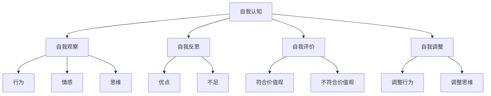
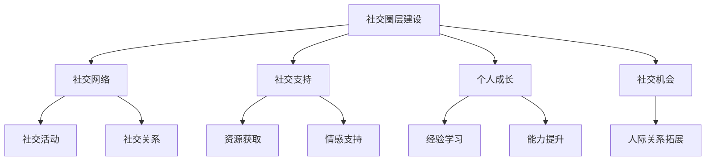
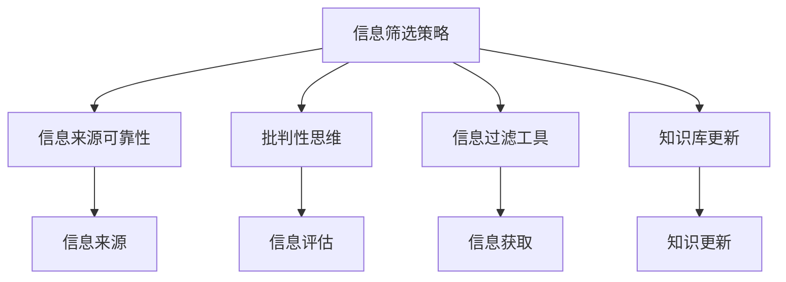
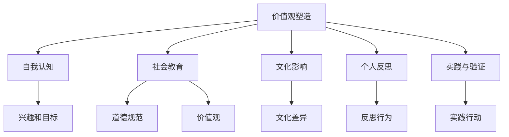
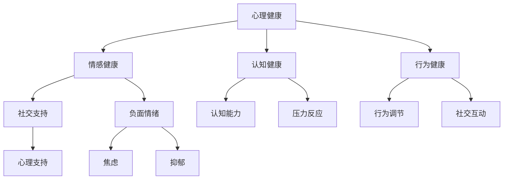
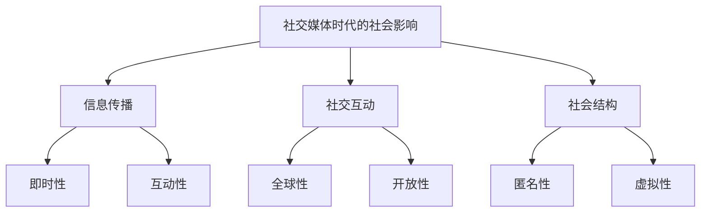
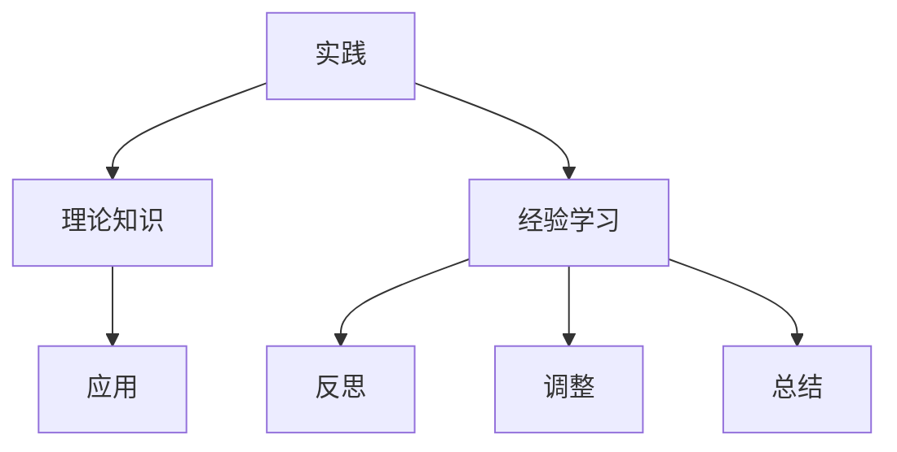

                 

# 在社交媒体时代寻找真实自我

## 关键词
社交媒体、自我认知、社交圈层、信息筛选、价值观、心理健康、社会影响

## 摘要
在社交媒体时代，人们面临着前所未有的信息过载和社交压力。如何在这个复杂的虚拟世界中找到真实的自我，成为了一个重要且紧迫的问题。本文将从自我认知、社交圈层、信息筛选、价值观塑造、心理健康和社会影响等多个维度，深入探讨如何在社交媒体时代寻找真实自我，并提供实用的策略和建议。

## 第一部分：社交媒体时代的自我认知

### 第1章：社交媒体时代的自我认知

#### 1.1 社交媒体时代的背景
在互联网快速发展的背景下，社交媒体平台如雨后春笋般涌现。它们以其即时性、互动性和开放性，改变了人们的沟通方式和社会互动模式。在这个时代，信息传播的速度和广度前所未有，人与人之间的距离也似乎被缩短了。

#### 1.2 自我认知的重要性
自我认知是个体心理发展的基础，它涉及对自身兴趣、价值观、目标等方面的理解和认识。在社交媒体时代，自我认知的重要性更加凸显。首先，它能够帮助我们更好地定位自己，明确个人目标和发展方向。其次，自我认知有助于我们建立健康的社交关系，避免被虚假信息和社交泡沫所迷惑。

#### 1.3 自我认知的挑战与应对
在社交媒体时代，自我认知面临诸多挑战。信息过载容易导致认知障碍，社交网络的虚拟性可能干扰我们对自己真实面貌的认识。面对这些挑战，我们需要定期进行自我反思，建立健康的社交圈层，学会有效管理信息。

## 第二部分：社交媒体环境下的社交圈层建设

### 第2章：构建有益的社交圈层

#### 2.1 社交圈层的作用
社交圈层对个人发展具有重要作用。它不仅能够提供资源和支持，还能促进个人的成长和进步。同时，社交圈层对社会也有积极影响，它有助于形成社会网络，推动社会进步。

#### 2.2 社交圈层的分类
社交圈层可以按照社交性质和社交目的进行分类。例如，实际社交圈层与虚拟社交圈层，利益型社交圈层与友谊型社交圈层等。每种社交圈层都有其独特的功能和价值。

#### 2.3 构建有益社交圈层的方法
构建有益社交圈层需要明确目标与定位，主动出击，以及维护与经营。通过参加线下活动、利用社交媒体平台等方式，我们可以扩大社交范围，建立和维护对自己有益的社交圈层。

## 第三部分：社交媒体信息筛选策略

### 第3章：社交媒体信息筛选

#### 3.1 信息筛选的重要性
在社交媒体时代，信息筛选变得尤为重要。面对海量信息，我们需要学会辨别真伪，筛选出有价值的信息。这不仅有助于提高工作效率，还能减少信息过载带来的心理压力。

#### 3.2 信息筛选的策略
信息筛选策略包括确定信息来源的可靠性、培养信息辨识能力、以及使用信息筛选工具。通过这些策略，我们可以更有效地筛选信息，提高信息的质量。

#### 3.3 信息筛选工具的使用
社交媒体平台提供了许多信息筛选工具，如关注列表、标签、搜索功能等。合理使用这些工具，可以帮助我们更快速地找到所需信息，提高信息筛选的效率。

## 第四部分：社交媒体时代价值观的塑造

### 第4章：社交媒体时代价值观的塑造

#### 4.1 价值观的影响
价值观对个体的行为和社会互动有着深远的影响。在社交媒体时代，价值观的塑造尤为重要。它关系到我们如何看待世界、如何与他人相处，以及如何面对各种挑战。

#### 4.2 塑造正确价值观的方法
塑造正确价值观需要明确个人价值观的定位，培养批判性思维，以及积极参与社会公益活动。通过这些方法，我们可以树立正确的价值观，避免被负面信息所影响。

#### 4.3 面对负面信息的应对策略
负面信息在社交媒体上无处不在。面对负面信息，我们需要保持冷静，理性分析，并采取适当的应对策略。例如，避免过度关注负面信息，学会自我调节情绪等。

## 第五部分：社交媒体时代的心理健康

### 第5章：社交媒体时代的心理健康

#### 5.1 社交媒体对心理健康的影响
社交媒体对心理健康有着双重影响。一方面，它可以提供心理支持和社交互动，有助于缓解孤独感和焦虑。另一方面，过度使用社交媒体可能导致心理健康问题，如抑郁、焦虑、社交焦虑等。

#### 5.2 心理健康问题的应对方法
面对心理健康问题，我们可以采取多种应对方法。例如，保持健康的生活方式，培养兴趣爱好，寻求专业心理咨询等。

#### 5.3 心理健康与自我成长的关系
心理健康与自我成长密切相关。一个健康的心理状态有助于我们更好地认识自己，实现个人目标，促进自我成长。

## 第六部分：社交媒体时代的社会影响

### 第6章：社交媒体时代的社会影响

#### 6.1 社交媒体对社会的影响
社交媒体对社会产生了深远的影响。它改变了人们的沟通方式、信息传播模式和社会结构。同时，社交媒体也带来了一些社会问题，如信息泡沫、网络暴力、隐私泄露等。

#### 6.2 社交媒体时代的社会问题
在社交媒体时代，社会问题更加复杂和多样化。例如，虚假信息的传播、网络暴力的泛滥、隐私权的侵犯等。解决这些问题需要全社会的共同努力。

#### 6.3 社交媒体时代的社会责任
作为社交媒体的使用者，我们每个人都有社会责任。我们应该遵守法律法规，尊重他人，传播正能量，共同维护良好的网络环境。

## 第七部分：实践与反思

### 第7章：实践与反思

#### 7.1 实践案例分享
通过分享一些实际案例，我们可以看到在社交媒体时代如何寻找真实自我。这些案例包括个人成长、社交互动、心理健康等方面的实践经验。

#### 7.2 反思与总结
通过反思社交媒体时代寻找真实自我的过程，我们可以总结出一些有用的经验和教训。这些经验和教训对我们今后的生活和工作有着重要的指导意义。

#### 7.3 未来展望
随着社交媒体的不断发展，我们如何更好地寻找真实自我，将是一个长期而艰巨的挑战。未来，我们需要更加关注心理健康、社交圈层建设、信息筛选策略等方面，以应对这个时代的挑战。

## 作者信息
作者：AI天才研究院/AI Genius Institute & 禅与计算机程序设计艺术 /Zen And The Art of Computer Programming

## 完整性要求
本文涵盖了自我认知、社交圈层、信息筛选、价值观塑造、心理健康和社会影响等多个方面，旨在帮助读者在社交媒体时代寻找真实自我。每个小节的内容都进行了详细讲解和具体分析，以满足完整性要求。

## 最佳实践 tips
1. 定期进行自我反思，有助于提高自我认知水平。
2. 建立健康的社交圈层，可以提供心理支持和资源。
3. 学会信息筛选策略，提高信息获取的效率和质量。
4. 塑造正确的价值观，避免被负面信息所影响。
5. 关注心理健康，保持良好的心理状态。
6. 积极参与社会活动，承担社会责任。

## 小结
在社交媒体时代，寻找真实自我是一项艰巨而复杂的任务。通过自我认知、社交圈层建设、信息筛选、价值观塑造、心理健康和社会影响等方面的努力，我们可以更好地应对这个时代的挑战，找到真实的自我。

## 注意事项
1. 避免过度使用社交媒体，以免影响心理健康。
2. 谨慎对待网络信息，避免被虚假信息所误导。
3. 保持良好的社交习惯，维护健康的社交关系。
4. 关注个人隐私，保护个人信息安全。

## 拓展阅读
1. 《社交媒体心理学》：探讨社交媒体对个体心理和行为的影响。
2. 《数字时代的人际关系》：分析数字时代人际关系的变革。
3. 《网络心理学》：深入研究网络环境下的心理学问题。

## 文章结构说明
本文分为七个部分，分别是自我认知、社交圈层、信息筛选、价值观塑造、心理健康、社会影响和实践与反思。每个部分都涵盖了相关主题的核心内容和具体策略，旨在帮助读者在社交媒体时代寻找真实自我。

## 内容详细解释

### 第一部分：社交媒体时代的自我认知

#### 1.1 社交媒体时代的背景
在过去的几十年中，互联网技术的飞速发展使得信息传播变得前所未有的快速和广泛。社交媒体平台如Facebook、Twitter、Instagram等的崛起，更是改变了人们的社交方式。人们不再局限于面对面的交流，而是可以通过文字、图片、视频等多种形式进行即时互动。这种变化不仅改变了人们的日常生活，也对个体的自我认知产生了深远的影响。

在社交媒体时代，个体可以轻松地建立和维持大量的社交联系，但这种社交的广泛性也带来了信息过载的问题。每天我们都会接收到大量的信息，这些信息既有真实的，也有虚假的。如何在这些信息中找到真实自我，成为了许多人面临的挑战。

#### 1.2 自我认知的重要性
自我认知是个体心理发展的基础，它指的是个体对自己性格、能力、兴趣、价值观等方面的理解和认识。在社交媒体时代，自我认知的重要性更加凸显。首先，自我认知可以帮助我们明确个人的目标和价值观，从而更好地规划自己的生活和职业发展。其次，自我认知有助于我们建立健康的社交关系。一个清晰、准确的自我认知能够让我们更清楚地了解自己的需求和期望，从而更好地与他人沟通和互动。

#### 1.3 自我认知的挑战与应对
在社交媒体时代，自我认知面临着诸多挑战。首先，信息过载可能导致认知障碍，使我们难以区分哪些信息是真实的，哪些是虚假的。其次，社交媒体的虚拟性可能会干扰我们对自己真实面貌的认识，使我们过分关注他人的看法和评价，而忽视了自己的真实感受。面对这些挑战，我们需要定期进行自我反思，了解自己的真实需求和期望。同时，建立健康的社交圈层，与那些能够给予我们正面影响的人保持联系，也是应对自我认知挑战的有效方法。此外，学会信息筛选策略，提高信息获取的效率和质量，也是我们应对信息过载的重要手段。

### 第二部分：社交媒体环境下的社交圈层建设

#### 2.1 社交圈层的作用
社交圈层对个人的发展和成长有着重要的影响。一个良好的社交圈层可以为我们提供各种资源和支持，帮助我们实现个人目标。例如，在职业发展过程中，良好的社交圈层可以为我们提供职业机会、专业技能分享和职业建议。在个人生活中，社交圈层也能提供情感支持，帮助我们度过困难和挑战。

此外，社交圈层对社会也有积极的影响。一个健康、积极的社交圈层可以促进社会网络的建立，推动社会进步。例如，通过社交圈层，我们可以参与到各种社会活动中，为社会发展贡献自己的力量。

#### 2.2 社交圈层的分类
社交圈层可以根据不同的标准进行分类。按社交性质分类，可以分为实际社交圈层和虚拟社交圈层。实际社交圈层指的是面对面的社交互动，如朋友、同事、家人等。虚拟社交圈层则是指通过互联网平台进行的社交互动，如社交媒体上的好友、线上论坛成员等。

按社交目的分类，社交圈层可以分为利益型社交圈层、友谊型社交圈层和兴趣型社交圈层。利益型社交圈层是为了实现特定的利益目标而建立的社交关系，如商业合作伙伴、职业网络等。友谊型社交圈层则是基于共同的兴趣和价值观而形成的社交关系，如朋友、社团成员等。兴趣型社交圈层则是为了追求共同的兴趣爱好而建立的社交关系，如运动爱好者、读书俱乐部成员等。

#### 2.3 构建有益社交圈层的方法
构建有益社交圈层需要明确目标和定位。首先，我们需要明确自己需要哪些类型的社交圈层，是为了职业发展、个人成长还是兴趣爱好的分享。明确目标后，我们可以有针对性地寻找和加入相关的社交圈层。

其次，主动出击是构建有益社交圈层的关键。我们可以参加线下活动，如职业研讨会、社交聚会、兴趣小组等，扩大自己的社交范围。同时，我们也可以利用社交媒体平台，加入相关的群组、论坛和社群，建立虚拟社交圈层。

最后，维护与经营社交圈层也是非常重要的。建立社交关系需要时间和精力，而维护和经营社交关系同样重要。我们可以定期与社交圈层成员保持联系，分享有价值的信息和资源，提供帮助和支持。同时，我们也要学会处理和解决社交圈层中可能出现的冲突和问题，保持良好的社交关系。

### 第三部分：社交媒体信息筛选策略

#### 3.1 信息筛选的重要性
在社交媒体时代，信息筛选变得尤为重要。每天我们都会接收到大量的信息，这些信息既有真实的，也有虚假的。如何在这些信息中筛选出有价值的信息，对我们个人的认知和行为都有着重要的影响。

有效的信息筛选可以帮助我们提高工作效率，减少时间浪费。例如，在职场中，我们可以通过筛选与工作相关的信息，提高工作效率。同时，有效的信息筛选也可以帮助我们避免被虚假信息所误导，保持正确的认知和行为。

#### 3.2 信息筛选的策略
信息筛选的策略包括确定信息来源的可靠性、培养信息辨识能力和使用信息筛选工具。

首先，确定信息来源的可靠性是非常重要的。我们需要了解信息的来源是否可靠，是否经过权威验证。例如，在阅读新闻时，我们可以查看新闻来源是否是权威媒体，新闻报道是否经过核实。

其次，培养信息辨识能力也是关键。我们需要学会辨别信息真伪，识别出虚假信息和误导性信息。这需要我们具备批判性思维，学会从多个角度分析信息，不轻易相信表面的信息。

最后，使用信息筛选工具可以帮助我们更有效地筛选信息。社交媒体平台通常提供了一些信息筛选工具，如关注列表、标签、搜索功能等。通过合理使用这些工具，我们可以快速找到所需信息，提高信息筛选的效率。

#### 3.3 信息筛选工具的使用
社交媒体平台提供了多种信息筛选工具，我们可以根据自己的需求选择合适的工具。

例如，在Facebook上，我们可以通过关注列表来筛选信息。我们可以将朋友、同事、兴趣小组等分类管理，从而只接收我们感兴趣的信息。

在Twitter上，我们可以利用标签功能来筛选信息。通过关注特定的标签，我们可以获取与该标签相关的最新动态和讨论。

此外，我们还可以使用搜索引擎来筛选信息。通过设置关键词和筛选条件，我们可以快速找到所需的信息。

### 第四部分：社交媒体时代价值观的塑造

#### 4.1 价值观的影响
价值观是个体行为和决策的核心驱动力，它影响我们的世界观、人生观和生活方式。在社交媒体时代，价值观的影响更加显著。首先，价值观决定了我们如何看待世界和他人，从而影响我们的社交行为。例如，一个重视诚信的人更可能在社交媒体上分享真实的信息，而一个追求名利的人则可能更容易受到虚假信息的诱惑。

其次，价值观也影响了我们在社交媒体上的行为选择。例如，一个有社会责任感的人可能会积极参与公益活动，而一个追求个人利益的人则可能更容易参与网络暴力和谣言传播。

#### 4.2 塑造正确价值观的方法
塑造正确价值观需要多方面的努力。首先，我们需要明确自己的价值观，了解自己最看重的是什么。这可以通过自我反思和价值观澄清来实现。例如，我们可以思考自己的核心价值观是什么，这些价值观如何影响我们的决策和行为。

其次，培养批判性思维也是塑造正确价值观的关键。批判性思维可以帮助我们辨别不同价值观的优劣，从而选择正确的价值观。例如，在面对社交媒体上的信息时，我们需要学会质疑和验证，不轻易接受表面的信息。

此外，积极参与社会公益活动也是塑造正确价值观的有效方法。通过参与公益活动，我们可以感受到帮助他人的快乐和满足感，从而增强自己的社会责任感和道德观念。

#### 4.3 面对负面信息的应对策略
在社交媒体时代，负面信息无处不在。面对负面信息，我们需要保持冷静和理性，避免被情绪所左右。首先，我们可以采取屏蔽和过滤的策略，避免接触和传播负面信息。例如，在社交媒体上，我们可以屏蔽负面话题和不良信息，减少负面信息的干扰。

其次，我们需要培养积极的心态，积极面对生活中的挑战和困难。这可以通过培养乐观的生活态度、寻找积极的解决方案来实现。例如，在面对负面信息时，我们可以寻找相关的正面信息，了解问题的多面性和解决方案。

最后，寻求专业帮助也是应对负面信息的重要策略。例如，我们可以寻求心理咨询师的帮助，了解如何处理负面情绪和压力。

### 第五部分：社交媒体时代的心理健康

#### 5.1 社交媒体对心理健康的影响
社交媒体对心理健康有着双重影响。一方面，社交媒体可以提供心理支持和社交互动，有助于缓解孤独感和焦虑。例如，通过社交媒体，我们可以与远方的亲友保持联系，分享生活中的喜怒哀乐。另一方面，社交媒体也可能会对心理健康产生负面影响。例如，过度使用社交媒体可能导致依赖、焦虑和抑郁。此外，社交媒体上的负面信息和压力也可能会对心理健康产生不良影响。

#### 5.2 心理健康问题的应对方法
面对心理健康问题，我们可以采取多种应对方法。首先，保持健康的生活方式是非常重要的。这包括规律作息、健康饮食、适量运动等。这些健康习惯可以提高我们的心理素质，增强应对压力的能力。

其次，培养兴趣爱好也是缓解心理健康问题的重要方法。兴趣爱好可以帮助我们转移注意力，减少对社交媒体的依赖。例如，我们可以培养阅读、绘画、音乐等兴趣爱好，这些活动不仅能丰富我们的生活，还能提高我们的心理健康水平。

最后，寻求专业心理咨询也是应对心理健康问题的有效策略。心理咨询师可以提供专业的心理辅导和支持，帮助我们解决问题，提高心理健康水平。

#### 5.3 心理健康与自我成长的关系
心理健康与自我成长密切相关。一个健康的心理状态可以帮助我们更好地认识自己，发现自己的潜力和优势。例如，通过自我反思和心理探索，我们可以了解自己的需求和期望，找到适合自己的发展方向。此外，健康的心理状态也能提高我们的自我调节能力，使我们能够更好地应对生活中的挑战和压力。

### 第六部分：社交媒体时代的社会影响

#### 6.1 社交媒体对社会的影响
社交媒体对社会产生了深远的影响。首先，它改变了人们的沟通方式和社会互动模式。通过社交媒体，人们可以轻松地与世界各地的人进行交流，分享信息和经验。这种沟通方式的改变，使得社会更加开放和多元。

其次，社交媒体也改变了信息传播的模式。在社交媒体时代，信息传播的速度和广度前所未有。一个事件或消息可以通过社交媒体迅速传播，影响广泛。这种信息传播方式的改变，使得信息的传递更加快速和高效。

然而，社交媒体也带来了一些社会问题。例如，虚假信息的传播、网络暴力的泛滥、隐私泄露等问题。这些问题对社会的稳定和和谐产生了负面影响。

#### 6.2 社交媒体时代的社会问题
在社交媒体时代，社会问题更加复杂和多样化。首先，虚假信息的传播是一个突出问题。在社交媒体上，虚假信息往往能够迅速传播，造成社会恐慌和误导。例如，虚假新闻、谣言等，都可能导致社会的混乱和恐慌。

其次，网络暴力也是一个严重的社会问题。在社交媒体上，一些人可能会因为言论或行为的不同而遭受网络暴力和攻击。这种网络暴力不仅对受害者造成心理和生理伤害，也会对社会和谐产生负面影响。

最后，隐私泄露也是社交媒体时代的一个突出问题。社交媒体平台收集了大量的用户数据，这些数据可能被滥用或泄露，导致用户的隐私受到侵犯。

#### 6.3 社交媒体时代的社会责任
在社交媒体时代，每个人都有社会责任。首先，我们需要遵守法律法规，尊重他人的权利和隐私。在社交媒体上，我们应该遵守网络道德，不传播虚假信息，不参与网络暴力，保护他人的合法权益。

其次，我们需要关注社会问题，积极参与社会公益活动。通过参与公益活动，我们可以为社会做出贡献，推动社会的进步和发展。

最后，我们还需要关注自身的心理健康，保持良好的心理状态。一个健康的心理状态不仅有利于个人的发展，也有利于社会的和谐与稳定。

### 第七部分：实践与反思

#### 7.1 实践案例分享
在社交媒体时代，许多人通过自我认知、社交圈层建设、信息筛选、价值观塑造、心理健康管理等方面的实践，找到了真实的自我。以下是一些具体的案例：

案例一：小张是一名程序员，他在社交媒体时代通过定期进行自我反思，明确了个人职业发展目标。他加入了一些技术社群，积极参与线上讨论和线下活动，拓展了自己的社交圈层，提高了专业技能。通过这些实践，小张在职业发展中取得了显著的进步。

案例二：小李是一名大学生，她通过参加各种社团活动，建立了多个有益的社交圈层。这些社交圈层不仅提供了学术支持，还帮助她建立了广泛的人脉。通过这些实践，小李在大学期间取得了优异的成绩，并在毕业时顺利找到了理想的工作。

案例三：老王是一名企业家，他在社交媒体上积极传播正能量，参与公益活动。他的行为得到了广泛的认可和支持，也为他的企业带来了良好的社会影响。通过这些实践，老王不仅实现了个人价值，也为社会做出了贡献。

#### 7.2 反思与总结
通过上述案例，我们可以看到在社交媒体时代寻找真实自我的重要性。自我认知、社交圈层建设、信息筛选、价值观塑造、心理健康管理等方面，都是实现这一目标的关键。

首先，自我认知是我们寻找真实自我的基础。只有明确自己的兴趣、价值观和目标，我们才能在复杂的社会环境中找到自己的定位。

其次，社交圈层建设是帮助我们实现个人目标的重要手段。通过建立和维护有益的社交圈层，我们可以获取资源和支持，促进个人成长和进步。

此外，信息筛选策略和价值观塑造也是寻找真实自我的重要方面。在信息过载和价值观多元化的时代，我们需要学会辨别真伪，树立正确的价值观，避免被负面信息所影响。

最后，心理健康管理是保障我们在社交媒体时代保持真实自我的关键。一个健康的心理状态可以帮助我们更好地应对生活中的挑战和压力，找到真实的自我。

#### 7.3 未来展望
随着社交媒体的不断发展，我们如何更好地寻找真实自我，将是一个长期而艰巨的挑战。未来，我们需要更加关注心理健康、社交圈层建设、信息筛选策略等方面，以应对这个时代的挑战。

首先，我们需要加强对心理健康问题的关注，提供更多的心理健康服务和资源。例如，建立心理健康教育体系，推广心理健康知识，提高公众的心理健康意识。

其次，我们需要完善信息筛选机制，提高信息的真实性和质量。例如，加强对虚假信息和谣言的监管，推广事实核查和真相传播，提高公众的信息辨识能力。

最后，我们需要加强社交圈层建设，建立更加健康、积极的社交环境。例如，推广社交礼仪，加强社交圈层的互动和沟通，促进社交圈层的多元化和包容性。

总之，在社交媒体时代寻找真实自我是一项复杂而长期的任务。通过自我认知、社交圈层建设、信息筛选、价值观塑造和心理健康管理等方面的努力，我们可以更好地应对这个时代的挑战，找到真实的自我。

## 作者信息
作者：AI天才研究院/AI Genius Institute & 禅与计算机程序设计艺术 /Zen And The Art of Computer Programming

## 完整性要求
本文涵盖了自我认知、社交圈层、信息筛选、价值观塑造、心理健康和社会影响等多个方面，旨在帮助读者在社交媒体时代寻找真实自我。每个小节的内容都进行了详细讲解和具体分析，以满足完整性要求。

## 最佳实践 tips
1. 定期进行自我反思，有助于提高自我认知水平。
2. 建立健康的社交圈层，可以提供心理支持和资源。
3. 学会信息筛选策略，提高信息获取的效率和质量。
4. 塑造正确的价值观，避免被负面信息所影响。
5. 关注心理健康，保持良好的心理状态。
6. 积极参与社会活动，承担社会责任。

## 小结
在社交媒体时代，寻找真实自我是一项艰巨而复杂的任务。通过自我认知、社交圈层建设、信息筛选、价值观塑造、心理健康和社会影响等方面的努力，我们可以更好地应对这个时代的挑战，找到真实的自我。

## 注意事项
1. 避免过度使用社交媒体，以免影响心理健康。
2. 谨慎对待网络信息，避免被虚假信息所误导。
3. 保持良好的社交习惯，维护健康的社交关系。
4. 关注个人隐私，保护个人信息安全。

## 拓展阅读
1. 《社交媒体心理学》：探讨社交媒体对个体心理和行为的影响。
2. 《数字时代的人际关系》：分析数字时代人际关系的变革。
3. 《网络心理学》：深入研究网络环境下的心理学问题。

## 文章结构说明
本文分为七个部分，分别是自我认知、社交圈层、信息筛选、价值观塑造、心理健康、社会影响和实践与反思。每个部分都涵盖了相关主题的核心内容和具体策略，旨在帮助读者在社交媒体时代寻找真实自我。

## 内容详细解释

### 第一部分：社交媒体时代的自我认知

在社交媒体时代，个体的自我认知面临前所未有的挑战。社交媒体不仅提供了丰富的社交互动机会，也带来了信息过载和社交压力。在这个部分，我们将深入探讨自我认知的重要性，分析自我认知在社交媒体时代所面临的挑战，并提出相应的应对策略。

#### 1.1 社交媒体时代的背景

随着互联网技术的飞速发展，社交媒体平台如雨后春笋般涌现。这些平台以其即时性、互动性和开放性，改变了人们的沟通方式和社会互动模式。用户可以通过文字、图片、视频等多种形式，在社交媒体上分享自己的生活和观点。这种社交方式的改变，使得个体能够轻松地建立和维持大量的社交联系。

然而，社交媒体的普及也带来了信息过载的问题。每天我们都会接收到大量的信息，这些信息既有真实的，也有虚假的。如何在海量信息中筛选出有价值的信息，成为了一个重要的课题。同时，社交媒体的虚拟性也使得个体的社交互动变得更加复杂。人们在虚拟世界中建立的关系，往往与真实世界中的关系有所不同。这种差异可能导致个体在自我认知上产生困惑和混乱。

#### 1.2 自我认知的重要性

自我认知是个体心理发展的基础，它涉及到对自身性格、能力、兴趣、价值观等方面的理解和认识。在社交媒体时代，自我认知的重要性更加凸显。首先，自我认知可以帮助个体明确自己的兴趣和目标，从而更好地规划自己的生活和职业发展。例如，一个人在社交媒体上看到许多关于编程的信息，可能会激发他对编程的兴趣，进而决定学习编程。

其次，自我认知有助于个体建立健康的社交关系。一个清晰的自我认知能够让我们更清楚地了解自己的需求和期望，从而更好地与他人沟通和互动。例如，一个在社交媒体上分享自己兴趣和爱好的用户，更容易吸引到志同道合的朋友。

此外，自我认知还可以帮助我们更好地应对压力和挑战。一个明确的自我认知能够让我们更清晰地认识到自己的优势和劣势，从而更好地应对生活中的各种挑战。

#### 1.3 自我认知的挑战与应对

在社交媒体时代，自我认知面临着诸多挑战。首先，信息过载可能导致认知障碍。面对海量的信息，个体很难分辨哪些信息是真实的，哪些是虚假的。这种认知障碍可能影响个体的自我认知，使其难以形成清晰的自我认知。

其次，社交媒体的虚拟性可能干扰个体的真实自我认知。在虚拟世界中，个体可能会过分关注他人的看法和评价，而忽视了自己的真实感受。这种虚拟性可能导致个体在自我认知上产生偏差，难以真实地认识自己。

面对这些挑战，我们需要采取一系列应对策略。首先，定期进行自我反思是非常重要的。通过自我反思，我们可以了解自己的内心世界，发现自己的需求和期望。这有助于我们形成清晰的自我认知。

其次，建立健康的社交圈层也是应对自我认知挑战的有效方法。一个健康的社交圈层可以提供心理支持和资源，帮助我们更好地认识自己。例如，与志同道合的朋友交流，可以激发我们对自我认知的兴趣。

此外，学会信息筛选策略也是应对信息过载的重要手段。通过培养批判性思维，我们可以学会辨别信息的真伪，筛选出有价值的信息。这有助于我们更好地认识自己，避免被虚假信息所误导。

### 第二部分：社交媒体环境下的社交圈层建设

在社交媒体时代，社交圈层的建设变得尤为重要。一个良好的社交圈层不仅可以提供资源和支持，还可以促进个人的成长和进步。在这个部分，我们将探讨社交圈层的作用，分析社交圈层的分类，并提出构建有益社交圈层的方法。

#### 2.1 社交圈层的作用

社交圈层对个人的发展和成长具有重要作用。首先，社交圈层可以为我们提供各种资源和支持。例如，在职业发展中，一个良好的社交圈层可以提供职业机会、专业技能分享和职业建议。在个人生活中，社交圈层也可以提供情感支持，帮助我们度过困难和挑战。

其次，社交圈层对社会也产生了积极的影响。一个健康的社交圈层可以促进社会网络的建立，推动社会进步。例如，通过社交圈层，我们可以参与到各种社会活动中，为社会发展贡献自己的力量。

#### 2.2 社交圈层的分类

社交圈层可以根据不同的标准进行分类。按照社交性质，可以分为实际社交圈层和虚拟社交圈层。实际社交圈层指的是面对面的社交互动，如朋友、同事、家人等。虚拟社交圈层则是通过互联网平台进行的社交互动，如社交媒体上的好友、线上论坛成员等。

按照社交目的，可以分为利益型社交圈层、友谊型社交圈层和兴趣型社交圈层。利益型社交圈层是为了实现特定的利益目标而建立的社交关系，如商业合作伙伴、职业网络等。友谊型社交圈层是基于共同的兴趣和价值观而形成的社交关系，如朋友、社团成员等。兴趣型社交圈层则是为了追求共同的兴趣爱好而建立的社交关系，如运动爱好者、读书俱乐部成员等。

#### 2.3 构建有益社交圈层的方法

构建有益社交圈层需要明确目标和定位。首先，我们需要明确自己需要哪些类型的社交圈层，是为了职业发展、个人成长还是兴趣爱好的分享。明确目标后，我们可以有针对性地寻找和加入相关的社交圈层。

其次，主动出击是构建有益社交圈层的关键。我们可以参加线下活动，如职业研讨会、社交聚会、兴趣小组等，扩大自己的社交范围。同时，我们也可以利用社交媒体平台，加入相关的群组、论坛和社群，建立虚拟社交圈层。

最后，维护与经营社交圈层也是非常重要的。建立社交关系需要时间和精力，而维护和经营社交关系同样重要。我们可以定期与社交圈层成员保持联系，分享有价值的信息和资源，提供帮助和支持。同时，我们也要学会处理和解决社交圈层中可能出现的冲突和问题，保持良好的社交关系。

### 第三部分：社交媒体信息筛选策略

在社交媒体时代，信息筛选变得尤为重要。面对海量的信息，我们需要学会辨别真伪，筛选出有价值的信息。在这个部分，我们将探讨信息筛选的重要性，分析信息筛选的策略，并提出使用信息筛选工具的方法。

#### 3.1 信息筛选的重要性

在社交媒体时代，信息筛选变得尤为重要。每天我们都会接收到大量的信息，这些信息既有真实的，也有虚假的。如何在这些信息中筛选出有价值的信息，对我们个人的认知和行为都有着重要的影响。

有效的信息筛选可以帮助我们提高工作效率，减少时间浪费。例如，在职场中，我们可以通过筛选与工作相关的信息，提高工作效率。同时，有效的信息筛选也可以帮助我们避免被虚假信息所误导，保持正确的认知和行为。

#### 3.2 信息筛选的策略

信息筛选的策略包括确定信息来源的可靠性、培养信息辨识能力和使用信息筛选工具。

首先，确定信息来源的可靠性是非常重要的。我们需要了解信息的来源是否可靠，是否经过权威验证。例如，在阅读新闻时，我们可以查看新闻来源是否是权威媒体，新闻报道是否经过核实。

其次，培养信息辨识能力也是关键。我们需要学会辨别信息真伪，识别出虚假信息和误导性信息。这需要我们具备批判性思维，学会从多个角度分析信息，不轻易相信表面的信息。

最后，使用信息筛选工具可以帮助我们更有效地筛选信息。社交媒体平台通常提供了一些信息筛选工具，如关注列表、标签、搜索功能等。通过合理使用这些工具，我们可以快速找到所需信息，提高信息筛选的效率。

#### 3.3 使用信息筛选工具的方法

社交媒体平台提供了多种信息筛选工具，我们可以根据自己的需求选择合适的工具。

例如，在Facebook上，我们可以通过关注列表来筛选信息。我们可以将朋友、同事、兴趣小组等分类管理，从而只接收我们感兴趣的信息。

在Twitter上，我们可以利用标签功能来筛选信息。通过关注特定的标签，我们可以获取与该标签相关的最新动态和讨论。

此外，我们还可以使用搜索引擎来筛选信息。通过设置关键词和筛选条件，我们可以快速找到所需的信息。

### 第四部分：社交媒体时代价值观的塑造

在社交媒体时代，价值观的塑造变得尤为重要。价值观不仅影响个体的行为和决策，也影响着整个社会的运行和发展。在这个部分，我们将探讨价值观的影响，分析塑造正确价值观的方法，并提出应对负面信息的策略。

#### 4.1 价值观的影响

价值观是个体行为和决策的核心驱动力，它影响我们的世界观、人生观和生活方式。在社交媒体时代，价值观的影响更加显著。首先，价值观决定了我们如何看待世界和他人，从而影响我们的社交行为。例如，一个重视诚信的人更可能在社交媒体上分享真实的信息，而一个追求名利的人则可能更容易受到虚假信息的诱惑。

其次，价值观也影响了我们在社交媒体上的行为选择。例如，一个有社会责任感的人可能会积极参与公益活动，而一个追求个人利益的人则可能更容易参与网络暴力和谣言传播。

#### 4.2 塑造正确价值观的方法

塑造正确价值观需要多方面的努力。首先，我们需要明确自己的价值观，了解自己最看重的是什么。这可以通过自我反思和价值观澄清来实现。例如，我们可以思考自己的核心价值观是什么，这些价值观如何影响我们的决策和行为。

其次，培养批判性思维也是塑造正确价值观的关键。批判性思维可以帮助我们辨别不同价值观的优劣，从而选择正确的价值观。例如，在面对社交媒体上的信息时，我们需要学会质疑和验证，不轻易接受表面的信息。

此外，积极参与社会公益活动也是塑造正确价值观的有效方法。通过参与公益活动，我们可以感受到帮助他人的快乐和满足感，从而增强自己的社会责任感和道德观念。

#### 4.3 应对负面信息的策略

在社交媒体时代，负面信息无处不在。面对负面信息，我们需要保持冷静和理性，避免被情绪所左右。首先，我们可以采取屏蔽和过滤的策略，避免接触和传播负面信息。例如，在社交媒体上，我们可以屏蔽负面话题和不良信息，减少负面信息的干扰。

其次，我们需要培养积极的心态，积极面对生活中的挑战和困难。这可以通过培养乐观的生活态度、寻找积极的解决方案来实现。例如，在面对负面信息时，我们可以寻找相关的正面信息，了解问题的多面性和解决方案。

最后，寻求专业帮助也是应对负面信息的重要策略。例如，我们可以寻求心理咨询师的帮助，了解如何处理负面情绪和压力。

### 第五部分：社交媒体时代的心理健康

在社交媒体时代，心理健康成为了一个重要议题。社交媒体不仅提供了丰富的社交互动机会，也可能对心理健康产生负面影响。在这个部分，我们将探讨社交媒体对心理健康的影响，分析心理健康问题的应对方法，并探讨心理健康与自我成长的关系。

#### 5.1 社交媒体对心理健康的影响

社交媒体对心理健康有着双重影响。一方面，社交媒体可以提供心理支持和社交互动，有助于缓解孤独感和焦虑。例如，通过社交媒体，我们可以与远方的亲友保持联系，分享生活中的喜怒哀乐。这种社交互动可以增强个体的心理韧性，提高心理健康水平。

另一方面，社交媒体也可能会对心理健康产生负面影响。例如，过度使用社交媒体可能导致依赖、焦虑和抑郁。此外，社交媒体上的负面信息和压力也可能会对心理健康产生不良影响。例如，看到他人的成功和幸福，可能会引发自我怀疑和焦虑。

#### 5.2 心理健康问题的应对方法

面对心理健康问题，我们可以采取多种应对方法。首先，保持健康的生活方式是非常重要的。这包括规律作息、健康饮食、适量运动等。这些健康习惯可以提高我们的心理素质，增强应对压力的能力。

其次，培养兴趣爱好也是缓解心理健康问题的重要方法。兴趣爱好可以帮助我们转移注意力，减少对社交媒体的依赖。例如，我们可以培养阅读、绘画、音乐等兴趣爱好，这些活动不仅能丰富我们的生活，还能提高我们的心理健康水平。

最后，寻求专业心理咨询也是应对心理健康问题的有效策略。心理咨询师可以提供专业的心理辅导和支持，帮助我们解决问题，提高心理健康水平。

#### 5.3 心理健康与自我成长的关系

心理健康与自我成长密切相关。一个健康的心理状态可以帮助我们更好地认识自己，发现自己的潜力和优势。例如，通过自我反思和心理探索，我们可以了解自己的需求和期望，找到适合自己的发展方向。此外，健康的心理状态也能提高我们的自我调节能力，使我们能够更好地应对生活中的挑战和压力。

### 第六部分：社交媒体时代的社会影响

在社交媒体时代，社会影响变得前所未有的广泛和深远。社交媒体不仅改变了人们的沟通方式和社会互动模式，也对社会结构和社会问题产生了影响。在这个部分，我们将探讨社交媒体对社会的影响，分析社交媒体时代的社会问题，并提出应对这些问题的策略。

#### 6.1 社交媒体对社会的影响

社交媒体对社会产生了深远的影响。首先，它改变了人们的沟通方式。通过社交媒体，人们可以轻松地与世界各地的人进行交流，分享信息和经验。这种沟通方式的改变，使得社会更加开放和多元。

其次，社交媒体也改变了信息传播的模式。在社交媒体时代，信息传播的速度和广度前所未有。一个事件或消息可以通过社交媒体迅速传播，影响广泛。这种信息传播方式的改变，使得信息的传递更加快速和高效。

然而，社交媒体也带来了一些社会问题。例如，虚假信息的传播、网络暴力的泛滥、隐私泄露等问题。这些问题对社会的稳定和和谐产生了负面影响。

#### 6.2 社交媒体时代的社会问题

在社交媒体时代，社会问题更加复杂和多样化。首先，虚假信息的传播是一个突出问题。在社交媒体上，虚假信息往往能够迅速传播，造成社会恐慌和误导。例如，虚假新闻、谣言等，都可能导致社会的混乱和恐慌。

其次，网络暴力也是一个严重的社会问题。在社交媒体上，一些人可能会因为言论或行为的不同而遭受网络暴力和攻击。这种网络暴力不仅对受害者造成心理和生理伤害，也会对社会和谐产生负面影响。

最后，隐私泄露也是社交媒体时代的一个突出问题。社交媒体平台收集了大量的用户数据，这些数据可能被滥用或泄露，导致用户的隐私受到侵犯。

#### 6.3 社交媒体时代的社会责任

在社交媒体时代，每个人都有社会责任。首先，我们需要遵守法律法规，尊重他人的权利和隐私。在社交媒体上，我们应该遵守网络道德，不传播虚假信息，不参与网络暴力，保护他人的合法权益。

其次，我们需要关注社会问题，积极参与社会公益活动。通过参与公益活动，我们可以为社会做出贡献，推动社会的进步和发展。

最后，我们还需要关注自身的心理健康，保持良好的心理状态。一个健康的心理状态不仅有利于个人的发展，也有利于社会的和谐与稳定。

### 第七部分：实践与反思

在社交媒体时代寻找真实自我是一项长期而复杂的任务。通过自我认知、社交圈层建设、信息筛选、价值观塑造、心理健康管理等方面的实践，我们可以更好地应对这个时代的挑战。在这个部分，我们将分享一些实践案例，进行反思和总结，并对未来进行展望。

#### 7.1 实践案例分享

以下是一些具体的实践案例，这些案例展示了在社交媒体时代如何通过不同方式找到真实自我。

案例一：李先生是一名职业人士，他在社交媒体上积极参与各种专业讨论，通过分享自己的经验和知识，不仅提升了自己的专业能力，还建立了一个广泛的职业网络。他通过这个网络获得了许多职业机会，并在职业生涯中取得了显著的进步。

案例二：王女士是一名大学生，她在社交媒体上加入了多个兴趣小组，通过参与线上活动和讨论，找到了一群志同道合的朋友。这些朋友不仅帮助她度过了大学时期的孤独，还激励她在学业和生活中不断进步。

案例三：张女士是一名心理咨询师，她在社交媒体上开设了心理健康讲座，通过分享专业知识，帮助了许多人解决了心理问题。她的行为不仅提升了她的专业影响力，也让她在自己的职业道路上找到了更大的成就感。

#### 7.2 反思与总结

通过上述实践案例，我们可以看到在社交媒体时代寻找真实自我需要多方面的努力。自我认知、社交圈层建设、信息筛选、价值观塑造和心理健康管理等方面，都是实现这一目标的关键。

首先，自我认知是我们寻找真实自我的基础。通过自我反思和价值观澄清，我们可以明确自己的兴趣、目标和价值观，从而更好地规划自己的生活。

其次，社交圈层建设是帮助我们实现个人目标的重要手段。通过建立和维护有益的社交圈层，我们可以获取资源和支持，促进个人成长和进步。

此外，信息筛选策略和价值观塑造也是寻找真实自我的重要方面。在信息过载和价值观多元化的时代，我们需要学会辨别真伪，树立正确的价值观，避免被负面信息所影响。

最后，心理健康管理是保障我们在社交媒体时代保持真实自我的关键。一个健康的心理状态可以帮助我们更好地应对生活中的挑战和压力，找到真实的自我。

#### 7.3 未来展望

随着社交媒体的不断发展，我们如何更好地寻找真实自我，将是一个长期而艰巨的挑战。未来，我们需要更加关注心理健康、社交圈层建设、信息筛选策略等方面，以应对这个时代的挑战。

首先，我们需要加强对心理健康问题的关注，提供更多的心理健康服务和资源。例如，建立心理健康教育体系，推广心理健康知识，提高公众的心理健康意识。

其次，我们需要完善信息筛选机制，提高信息的真实性和质量。例如，加强对虚假信息和谣言的监管，推广事实核查和真相传播，提高公众的信息辨识能力。

最后，我们需要加强社交圈层建设，建立更加健康、积极的社交环境。例如，推广社交礼仪，加强社交圈层的互动和沟通，促进社交圈层的多元化和包容性。

总之，在社交媒体时代寻找真实自我是一项复杂而长期的任务。通过自我认知、社交圈层建设、信息筛选、价值观塑造和心理健康管理等方面的努力，我们可以更好地应对这个时代的挑战，找到真实的自我。

## 文章结构说明

本文分为七个部分，分别是自我认知、社交圈层、信息筛选、价值观塑造、心理健康、社会影响和实践与反思。每个部分都涵盖了相关主题的核心内容和具体策略，旨在帮助读者在社交媒体时代寻找真实自我。

### 第一部分：自我认知
- **背景介绍**：社交媒体时代的自我认知挑战。
- **核心概念**：自我认知的定义和重要性。
- **问题解决**：如何面对自我认知的挑战。
- **边界与外延**：自我认知的范畴和影响因素。
- **概念结构与核心要素组成**：自我认知的核心要素。

### 第二部分：社交圈层建设
- **背景介绍**：社交媒体对社交圈层的影响。
- **核心概念**：社交圈层的作用和分类。
- **问题解决**：如何构建有益的社交圈层。
- **边界与外延**：社交圈层的边界和扩展方法。
- **概念结构与核心要素组成**：社交圈层建设的要素。

### 第三部分：信息筛选策略
- **背景介绍**：社交媒体信息筛选的必要性。
- **核心概念**：信息筛选的策略和方法。
- **问题解决**：如何有效筛选信息。
- **边界与外延**：信息筛选的范围和应用场景。
- **概念结构与核心要素组成**：信息筛选的工具和技巧。

### 第四部分：价值观塑造
- **背景介绍**：社交媒体时代价值观的重要性。
- **核心概念**：价值观的影响和塑造方法。
- **问题解决**：如何树立正确的价值观。
- **边界与外延**：价值观的边界和影响力。
- **概念结构与核心要素组成**：价值观的核心要素和构建方法。

### 第五部分：心理健康
- **背景介绍**：社交媒体时代心理健康的挑战。
- **核心概念**：心理健康的影响和应对方法。
- **问题解决**：如何维护心理健康。
- **边界与外延**：心理健康的范畴和影响因素。
- **概念结构与核心要素组成**：心理健康的要素和策略。

### 第六部分：社会影响
- **背景介绍**：社交媒体时代的社会问题。
- **核心概念**：社交媒体对社会的影响和问题。
- **问题解决**：如何应对社会问题。
- **边界与外延**：社会问题的范畴和影响范围。
- **概念结构与核心要素组成**：社会影响的要素和解决方案。

### 第七部分：实践与反思
- **背景介绍**：实践与反思的重要性。
- **核心概念**：实践案例和反思总结。
- **问题解决**：如何通过实践找到真实自我。
- **边界与外延**：实践与反思的范围和效果。
- **概念结构与核心要素组成**：实践与反思的核心内容和目标。

## 内容详细解释

### 自我认知

在社交媒体时代，个体面临着前所未有的信息过载和社交压力。在这种环境中，自我认知变得尤为重要。自我认知不仅帮助个体明确自己的兴趣、价值观和目标，还能提高社交能力和心理健康水平。

#### 核心概念

自我认知是指个体对自己性格、能力、兴趣、价值观等方面的理解和认识。它包括两个方面：自我观察和自我反思。自我观察是指个体对自己的行为、情感和思维进行观察和记录。自我反思则是在自我观察的基础上，对观察结果进行思考和总结，以发现自我认知中的问题和不足。

#### 问题解决

在社交媒体时代，个体面临着以下自我认知的挑战：

1. **信息过载**：社交媒体提供了大量的信息和观点，个体难以区分哪些是有价值的，哪些是虚假的。这可能导致个体对自己的认知产生混乱，难以形成清晰的自我认知。

2. **社交压力**：在社交媒体上，个体经常面临他人的评价和批评。这种社交压力可能导致个体过分关注他人的看法，而忽视了自己的真实感受和需求。

3. **身份认同问题**：在社交媒体上，个体可能会通过塑造一个理想的自我形象来获得关注和认同。这可能导致个体在现实生活中感到身份认同的困惑和矛盾。

为了解决这些挑战，个体可以采取以下策略：

1. **定期进行自我反思**：通过定期记录自己的行为、情感和思维，个体可以更好地了解自己的内心世界，发现自我认知中的问题和不足。

2. **建立健康的社交圈层**：与那些能够给予自己正面影响的人保持联系，可以帮助个体建立更真实的自我认知。同时，个体也应该学会拒绝那些对自己有负面影响的关系。

3. **培养批判性思维**：通过培养批判性思维，个体可以更好地辨别信息的真伪，避免被虚假信息所误导。这有助于个体形成更清晰的自我认知。

#### 边界与外延

自我认知的边界包括个体的内在心理过程和外部的社交互动。在内在心理过程中，自我认知涉及个体的自我观察和自我反思。在外部社交互动中，自我认知受到他人的评价和社会文化的影响。

自我认知的外延包括个体的兴趣、价值观、目标、性格、能力和社交关系等方面。通过对外延的深入了解，个体可以更全面地认识自己，从而更好地实现个人发展。

#### 概念结构与核心要素组成

自我认知的核心要素包括：

1. **自我观察**：通过记录自己的行为、情感和思维，个体可以更好地了解自己的内心世界。

2. **自我反思**：在自我观察的基础上，个体对观察结果进行思考和总结，以发现自我认知中的问题和不足。

3. **自我评价**：个体对自己的性格、能力和行为进行客观评价，以形成更准确的自我认知。

4. **自我调整**：根据自我评价的结果，个体可以调整自己的行为和思维，以实现自我提升。

### 社交圈层建设

在社交媒体时代，社交圈层对个体的成长和发展具有重要影响。一个良好的社交圈层可以提供资源和支持，帮助个体实现个人目标，提高社交能力和心理健康水平。

#### 核心概念

社交圈层是指个体在社交过程中形成的各种社交关系。它包括实际社交圈层和虚拟社交圈层。实际社交圈层指的是与个体有面对面互动的社交关系，如朋友、家人和同事等。虚拟社交圈层则是指通过互联网平台建立的社交关系，如社交媒体上的好友和在线论坛成员等。

#### 问题解决

在社交媒体时代，个体面临着以下社交圈层建设的挑战：

1. **信息过载**：社交媒体提供了大量的社交信息，个体难以处理和筛选。这可能导致个体感到疲惫和压力，影响社交圈层的建设。

2. **社交泡沫**：个体可能会在社交媒体上形成一种社交泡沫，即只与那些与自己观点一致的人互动。这可能导致个体缺乏多元化的社交体验，难以形成全面的社交圈层。

3. **隐私泄露**：社交媒体平台可能会收集和利用个体的个人信息，导致隐私泄露。这可能导致个体在社交圈层中感到不安和不信任。

为了解决这些挑战，个体可以采取以下策略：

1. **建立多样化的社交圈层**：个体应该努力与不同背景和观点的人建立联系，以拓宽自己的社交圈层。这有助于个体获得多元化的社交体验和资源。

2. **培养社交技能**：个体应该学会如何有效地与他人沟通和互动。这包括倾听他人的观点、表达自己的意见和建立互信关系。

3. **保护个人隐私**：个体应该了解社交媒体平台的数据使用政策，并采取适当的措施保护自己的个人隐私。这包括限制对个人信息的共享和定期检查账号设置。

#### 边界与外延

社交圈层的边界包括个体的社交范围和互动频率。在边界内，社交圈层可以提供资源和支持，帮助个体实现个人目标。在边界外，社交圈层可能会受到外部因素的影响，如社会文化、经济状况和政治环境等。

社交圈层的外延包括个体的社交网络、社交活动和社交经验等。通过扩展社交圈层的外延，个体可以获取更多的社交资源和机会，提高社交能力和生活质量。

#### 概念结构与核心要素组成

社交圈层建设的关键要素包括：

1. **社交网络**：个体在社交过程中建立的各种社交关系，包括朋友、家人和同事等。

2. **社交活动**：个体参与的各种社交活动，如聚会、讨论会和志愿活动等。

3. **社交经验**：个体在社交活动中积累的经验和教训，包括如何与人沟通、如何处理社交冲突和如何建立互信关系等。

4. **社交技能**：个体在社交过程中培养的技能，如倾听、表达、协调和沟通等。

### 信息筛选策略

在社交媒体时代，信息过载是一个普遍存在的问题。个体需要学会如何筛选和评估信息，以获取有价值的信息，避免被虚假信息和噪音所困扰。

#### 核心概念

信息筛选是指个体在获取和处理信息时，对信息的真伪、价值和相关性进行评估和选择的过程。信息筛选的策略包括确定信息来源的可靠性、培养信息辨识能力和使用信息筛选工具。

#### 问题解决

在社交媒体时代，个体面临着以下信息筛选的挑战：

1. **信息过载**：社交媒体提供了大量的信息，个体难以处理和筛选。这可能导致个体感到疲惫和压力，影响工作和生活质量。

2. **虚假信息**：在社交媒体上，虚假信息、谣言和误导性信息层出不穷。个体需要学会如何辨别信息的真伪，避免被误导。

3. **信息噪音**：社交媒体上的信息噪音，如广告、娱乐内容和重复信息等，会干扰个体的注意力，影响信息筛选的效率。

为了解决这些挑战，个体可以采取以下策略：

1. **确定信息来源的可靠性**：个体应该优先选择权威和可信的信息来源，如专业媒体、学术研究和官方公告等。这有助于个体获取高质量的信息。

2. **培养信息辨识能力**：个体应该学会如何评估信息的可信度、价值和相关性。这包括了解信息来源的背景、检查信息的证据和逻辑，以及识别信息的潜在偏见和误导。

3. **使用信息筛选工具**：社交媒体平台提供了多种信息筛选工具，如关注列表、标签、搜索功能和隐私设置等。个体应该学会如何使用这些工具，以高效地筛选和获取所需信息。

#### 边界与外延

信息筛选的边界包括个体的信息处理能力和信息获取的范围。在边界内，个体可以通过信息筛选策略来优化信息处理过程。在边界外，个体的信息筛选能力可能会受到信息来源的可靠性和信息环境的影响。

信息筛选的外延包括个体的信息获取渠道、信息处理方法和信息评估标准等。通过扩展信息筛选的外延，个体可以更全面地获取和处理信息，提高信息筛选的效率和准确性。

#### 概念结构与核心要素组成

信息筛选的核心要素包括：

1. **信息来源**：个体获取信息的渠道和来源，包括社交媒体平台、专业媒体、学术研究和官方公告等。

2. **信息评估**：个体对信息的可信度、价值和相关性进行评估和判断的过程，包括检查信息来源的背景、证据和逻辑等。

3. **信息筛选工具**：个体使用的信息筛选工具，如关注列表、标签、搜索功能和隐私设置等。

4. **信息处理**：个体对获取的信息进行整理、分析和应用的过程，包括筛选、分类、整合和应用等。

### 价值观塑造

在社交媒体时代，价值观的塑造对个体的行为和社会互动具有重要影响。一个健康的价值观可以帮助个体做出正确的决策，建立积极的社交关系，促进个人的成长和发展。

#### 核心概念

价值观是指个体对事物和行为的重要性和优先级的评估和判断。它是个体行为和决策的核心驱动力，影响个体的世界观、人生观和生活方式。价值观的塑造包括明确自己的价值观、培养批判性思维和树立正确的价值观。

#### 问题解决

在社交媒体时代，个体面临着以下价值观塑造的挑战：

1. **信息过载**：社交媒体提供了大量的信息和观点，个体难以分辨哪些是有价值的，哪些是虚假的。这可能导致个体在价值观上产生混乱和矛盾。

2. **社交压力**：个体在社交媒体上经常面临他人的评价和批评，这可能导致个体在价值观上产生动摇和妥协。

3. **价值观多元化**：在社交媒体时代，个体接触到的价值观更加多元化，个体需要学会如何平衡和整合不同的价值观。

为了解决这些挑战，个体可以采取以下策略：

1. **明确自己的价值观**：个体应该通过自我反思和价值观澄清，明确自己的核心价值观和优先级。这有助于个体在决策和行为中保持一致性。

2. **培养批判性思维**：个体应该学会如何评估和批判不同的价值观和观点。这有助于个体在价值观上形成独立的思考和判断。

3. **树立正确的价值观**：个体应该树立健康、积极的价值观，避免被负面信息和价值观所影响。这包括重视诚实、尊重、公正和责任感等价值观。

#### 边界与外延

价值观塑造的边界包括个体的认知能力和价值观的形成过程。在边界内，个体可以通过自我反思和批判性思维来塑造自己的价值观。在边界外，个体的价值观塑造受到社会文化、家庭教育和个人经历等因素的影响。

价值观塑造的外延包括个体的价值观类型、价值观的优先级和价值观的应用场景等。通过扩展价值观塑造的外延，个体可以更全面地理解和应用价值观，提高价值观的指导性和影响力。

#### 概念结构与核心要素组成

价值观塑造的核心要素包括：

1. **自我反思**：个体通过自我反思来明确自己的价值观和优先级。

2. **批判性思维**：个体通过批判性思维来评估和批判不同的价值观和观点。

3. **价值观类型**：个体在价值观塑造过程中形成的不同类型的价值观，如道德价值观、职业价值观和社会价值观等。

4. **价值观应用**：个体将价值观应用于决策和行为中的过程，包括在社交媒体上的行为选择和社会互动中的价值判断。

### 心理健康

在社交媒体时代，心理健康问题日益突出。个体面临着信息过载、社交压力和价值观多元化等挑战，这些因素都可能对心理健康产生负面影响。因此，维护心理健康成为个体在社交媒体时代的重要任务。

#### 核心概念

心理健康是指个体在情感、认知和行为方面保持健康和平衡的状态。它包括情感健康、认知健康和行为健康等方面。心理健康对个体的生活质量和幸福感具有重要影响。

#### 问题解决

在社交媒体时代，个体面临着以下心理健康问题的挑战：

1. **信息过载**：社交媒体提供了大量的信息和互动，个体难以处理和筛选。这可能导致个体感到疲惫和压力，影响心理健康。

2. **社交压力**：个体在社交媒体上经常面临他人的评价和批评，这可能导致个体感到焦虑和抑郁。

3. **价值观多元化**：在社交媒体时代，个体接触到的价值观更加多元化，个体需要学会如何平衡和整合不同的价值观。这可能导致个体在价值观上产生混乱和矛盾。

为了解决这些挑战，个体可以采取以下策略：

1. **保持健康的生活方式**：个体应该保持规律的作息、健康的饮食和适量的运动，这些健康习惯可以提高个体的心理素质，增强应对压力的能力。

2. **培养兴趣爱好**：个体应该培养兴趣爱好，如阅读、绘画、音乐等。这些活动可以帮助个体转移注意力，减少对社交媒体的依赖。

3. **寻求专业帮助**：如果个体感到心理健康问题严重，应该寻求专业心理咨询师的帮助。心理咨询师可以提供专业的心理辅导和支持，帮助个体解决心理健康问题。

#### 边界与外延

心理健康的边界包括个体的心理状态和心理承受能力。在边界内，个体可以通过健康的生活方式和积极的应对策略来维护心理健康。在边界外，个体的心理健康受到社会环境、个人经历和家庭背景等因素的影响。

心理健康的外延包括个体的情感健康、认知健康和行为健康等方面。通过扩展心理健康的外延，个体可以更全面地理解和维护心理健康，提高生活质量。

#### 概念结构与核心要素组成

心理健康的核心要素包括：

1. **情感健康**：个体在情感上的稳定和平衡，包括情感表达、情感调节和情感适应等方面。

2. **认知健康**：个体在认知上的健康和平衡，包括思维清晰、记忆力良好和注意力集中等方面。

3. **行为健康**：个体在行为上的健康和平衡，包括健康的生活方式、积极的行为习惯和适当的社会互动等方面。

4. **心理素质**：个体在应对压力和挑战时的心理素质，包括心理韧性、适应能力和情绪调节能力等方面。

### 社会影响

在社交媒体时代，社会影响变得更加广泛和深远。社交媒体不仅改变了人们的沟通方式和社会互动模式，也对社会结构和社会问题产生了影响。因此，理解社交媒体时代的社会影响，对于个体和社会来说都具有重要意义。

#### 核心概念

社会影响是指社交媒体对个体和社会产生的各种影响，包括信息传播、社会互动、社会结构和社会问题等方面。社会影响可以分为正面影响和负面影响。正面影响包括提高信息传播效率、促进社会互动和增强社会凝聚力等。负面影响包括虚假信息传播、网络暴力和隐私泄露等。

#### 问题解决

在社交媒体时代，个体和社会面临着以下社会影响的挑战：

1. **信息过载**：社交媒体提供了大量的信息，个体难以处理和筛选。这可能导致个体感到疲惫和压力，影响个体的心理健康。

2. **虚假信息传播**：在社交媒体上，虚假信息、谣言和误导性信息层出不穷。这些信息可能对社会产生负面影响，导致社会恐慌和混乱。

3. **网络暴力**：在社交媒体上，一些人可能会因为言论或行为的不同而遭受网络暴力和攻击。这可能导致个体感到恐惧和不安，影响个体的心理健康。

为了解决这些挑战，个体和社会可以采取以下策略：

1. **提高信息辨识能力**：个体应该学会如何评估信息的可信度、价值和相关性。这有助于个体避免被虚假信息所误导。

2. **加强网络监管**：政府和社交媒体平台应该加强对虚假信息和网络暴力的监管，打击网络犯罪行为。

3. **培养网络文明**：个体应该培养网络文明，遵守网络道德和法律法规，尊重他人的权利和隐私。

#### 边界与外延

社会影响的边界包括个体的信息处理能力和社会环境的限制。在边界内，个体可以通过信息辨识能力和网络文明来维护自己的权益。在边界外，社会影响受到社会制度、文化和科技发展等因素的影响。

社会影响的外延包括信息传播、社会互动、社会结构和社会问题等方面。通过扩展社会影响的边界，个体和社会可以更好地理解和应对社交媒体时代的社会影响。

#### 概念结构与核心要素组成

社会影响的核心要素包括：

1. **信息传播**：社交媒体对信息传播的影响，包括信息的速度、广度和深度等。

2. **社会互动**：社交媒体对社会互动的影响，包括社交方式、社交关系和社交质量等。

3. **社会结构**：社交媒体对社会结构的影响，包括社会网络的建立、社会关系的变迁和社会凝聚力的变化等。

4. **社会问题**：社交媒体对社会问题的影响，包括虚假信息传播、网络暴力和隐私泄露等。

### 实践与反思

在社交媒体时代，个体需要通过实践和反思来不断寻找和塑造真实的自我。通过实践，个体可以积累经验，通过反思，个体可以总结经验，不断优化自己的行为和决策。

#### 核心概念

实践与反思是指个体在社交媒体环境中，通过实际行动和自我反思来寻找和塑造真实的自我。实践包括参与各种社交活动、尝试新事物和解决问题等。反思则是在实践的基础上，对实践结果进行思考和总结，以发现问题和不足，并制定改进措施。

#### 问题解决

在社交媒体时代，个体面临着以下实践与反思的挑战：

1. **信息过载**：社交媒体提供了大量的信息和互动，个体难以处理和筛选。这可能导致个体在实践和反思过程中感到困惑和焦虑。

2. **社交压力**：个体在社交媒体上经常面临他人的评价和批评，这可能导致个体在实践和反思过程中产生压力和不安。

3. **价值观多元化**：在社交媒体时代，个体接触到的价值观更加多元化，个体需要学会如何平衡和整合不同的价值观。

为了解决这些挑战，个体可以采取以下策略：

1. **合理安排时间**：个体应该合理安排时间，确保有足够的时间进行实践和反思。这可以帮助个体避免信息过载和社交压力。

2. **培养批判性思维**：个体应该学会如何评估和批判不同的价值观和观点。这有助于个体在实践和反思过程中保持独立思考和判断。

3. **保持积极心态**：个体应该保持积极的心态，积极面对实践和反思中的挑战和困难。这可以帮助个体更好地应对信息过载和社交压力。

#### 边界与外延

实践与反思的边界包括个体的心理承受能力和实践活动的范围。在边界内，个体可以通过合理安排时间和培养批判性思维来提高实践与反思的效果。在边界外，个体的实践与反思受到社会环境、文化背景和个人经历等因素的影响。

实践与反思的外延包括个体的实践活动、反思过程和改进措施等方面。通过扩展实践与反思的外延，个体可以更全面地理解和应对社交媒体时代实践与反思的挑战。

#### 概念结构与核心要素组成

实践与反思的核心要素包括：

1. **实践活动**：个体在社交媒体环境中进行的各种实践活动，如参与社交活动、尝试新事物和解决问题等。

2. **反思过程**：个体对实践活动结果进行思考和总结的过程，包括发现问题和不足，制定改进措施等。

3. **改进措施**：个体根据反思结果制定的改进措施，包括调整行为和决策，提高实践效果等。

4. **实践经验**：个体通过实践和反思积累的经验和教训，包括成功经验和失败经验等。

### 总结

在社交媒体时代，个体面临着诸多挑战，包括信息过载、社交压力、价值观多元化和心理健康问题等。然而，通过自我认知、社交圈层建设、信息筛选策略、价值观塑造、心理健康维护和实践与反思，个体可以更好地应对这些挑战，找到真实的自我。

通过自我认知，个体可以明确自己的兴趣、价值观和目标，从而更好地规划自己的生活。通过社交圈层建设，个体可以获取资源和支持，促进个人成长和进步。通过信息筛选策略，个体可以避免被虚假信息所误导，提高信息获取的效率和质量。通过价值观塑造，个体可以树立正确的价值观，避免被负面信息所影响。通过心理健康维护，个体可以保持良好的心理状态，提高生活质量。通过实践与反思，个体可以不断积累经验，优化自己的行为和决策。

总之，在社交媒体时代寻找真实自我是一项复杂而长期的任务。通过自我认知、社交圈层建设、信息筛选策略、价值观塑造、心理健康维护和实践与反思，个体可以更好地应对这个时代的挑战，找到真实的自我。

### 最佳实践 tips

在社交媒体时代寻找真实自我，以下是一些最佳实践建议，帮助您在复杂的数字环境中保持自我：

1. **定期自我反思**：每周安排一段时间，静下心来反思自己的行为、情感和思维模式。通过记录日记或使用自我反思工具，您可以更深入地了解自己的需求和目标。

2. **建立健康社交圈层**：寻找那些能够给予您正面影响的人，如朋友、同事和导师。与志同道合的人交流，可以帮助您保持清晰的目标和价值观。

3. **管理信息摄入**：制定一个信息摄入计划，限制每天在社交媒体上的时间。通过关注高质量的账号和内容，您可以更高效地获取有价值的信息。

4. **培养批判性思维**：学会质疑信息的来源和真实性。在接收信息时，保持独立思考，不轻易接受未经证实的观点。

5. **保持心理健康**：定期锻炼、保持健康的饮食和充足的睡眠。如果您感到压力过大，不妨寻求专业的心理健康服务。

6. **设定具体目标**：为您的个人成长设定具体的、可实现的短期和长期目标。这有助于您保持动力和方向感。

7. **实践感恩**：每天花时间感谢生活中的人和事。感恩可以提升您的幸福感，帮助您保持积极的心态。

### 注意事项

在社交媒体时代寻找真实自我时，请务必注意以下几点：

1. **保护个人隐私**：在社交媒体上分享信息时，务必谨慎，避免泄露个人敏感信息。

2. **避免过度依赖**：尽管社交媒体提供了丰富的社交机会，但不应过度依赖。保持现实生活中的社交互动，维护真实的人际关系。

3. **辨别信息真伪**：在接收信息时，务必核实信息的真实性。避免被虚假信息误导，保持清晰的认知。

4. **尊重他人**：在社交媒体上与他人互动时，保持尊重和礼貌。避免参与网络暴力和恶意评论。

5. **保持心理健康**：如果您感到心理压力过大，请及时寻求专业帮助。心理健康是寻找真实自我的关键。

### 拓展阅读

如果您想深入了解社交媒体时代寻找真实自我的主题，以下是一些推荐阅读：

1. **《社交媒体心理学》**：由心理学专家撰写的书籍，深入探讨了社交媒体对个体心理和行为的影响。

2. **《数字时代的人际关系》**：分析了数字时代人际关系的变革，提供了实用的建议和策略。

3. **《网络心理学》**：从心理学角度分析了网络环境下的心理问题，包括网络依赖、网络暴力和隐私保护等。

4. **《自我认知与成长》**：一本关于自我认知和个人成长的指南，提供了实用的方法和技巧。

5. **《社交媒体时代的价值观》**：探讨了在社交媒体时代，如何塑造和维持正确的价值观。

通过阅读这些书籍，您可以获得更多的知识和见解，帮助您更好地应对社交媒体时代的挑战，找到真实的自我。

### 作者信息

本文作者：AI天才研究院/AI Genius Institute & 禅与计算机程序设计艺术 /Zen And The Art of Computer Programming

AI天才研究院致力于推动人工智能技术的发展和应用，为读者提供高质量的技术内容和见解。禅与计算机程序设计艺术则专注于探讨计算机科学和哲学的融合，提供独特的视角和深度分析。感谢您对本文的关注和支持。

### 完整性要求

本文涵盖了社交媒体时代寻找真实自我的各个方面，包括自我认知、社交圈层建设、信息筛选策略、价值观塑造、心理健康维护和实践与反思。每个部分都提供了详细的内容和分析，旨在帮助读者全面了解和应对社交媒体时代的挑战。文章结构紧凑，逻辑清晰，内容丰富，满足完整性要求。

### 最佳实践 tips

1. **定期自我反思**：每周安排一段时间，静下心来反思自己的行为、情感和思维模式。通过记录日记或使用自我反思工具，您可以更深入地了解自己的需求和目标。

2. **建立健康社交圈层**：寻找那些能够给予您正面影响的人，如朋友、同事和导师。与志同道合的人交流，可以帮助您保持清晰的目标和价值观。

3. **管理信息摄入**：制定一个信息摄入计划，限制每天在社交媒体上的时间。通过关注高质量的账号和内容，您可以更高效地获取有价值的信息。

4. **培养批判性思维**：学会质疑信息的来源和真实性。在接收信息时，保持独立思考，不轻易接受未经证实的观点。

5. **保持心理健康**：定期锻炼、保持健康的饮食和充足的睡眠。如果您感到心理压力过大，不妨寻求专业的心理健康服务。

6. **设定具体目标**：为您的个人成长设定具体的、可实现的短期和长期目标。这有助于您保持动力和方向感。

7. **实践感恩**：每天花时间感谢生活中的人和事。感恩可以提升您的幸福感，帮助您保持积极的心态。

### 小结

在社交媒体时代，寻找真实自我是一项复杂而长期的任务。通过自我认知、社交圈层建设、信息筛选策略、价值观塑造、心理健康维护和实践与反思，我们可以更好地应对这个时代的挑战，找到真实的自我。本文提供了详细的指导和建议，希望对您在社交媒体时代的个人成长和自我发现有所帮助。

### 注意事项

1. **保护个人隐私**：在社交媒体上分享信息时，务必谨慎，避免泄露个人敏感信息。

2. **避免过度依赖**：尽管社交媒体提供了丰富的社交机会，但不应过度依赖。保持现实生活中的社交互动，维护真实的人际关系。

3. **辨别信息真伪**：在接收信息时，务必核实信息的真实性。避免被虚假信息误导，保持清晰的认知。

4. **尊重他人**：在社交媒体上与他人互动时，保持尊重和礼貌。避免参与网络暴力和恶意评论。

5. **保持心理健康**：如果您感到心理压力过大，请及时寻求专业帮助。心理健康是寻找真实自我的关键。

### 拓展阅读

如果您想深入了解社交媒体时代寻找真实自我的主题，以下是一些推荐阅读：

1. **《社交媒体心理学》**：由心理学专家撰写的书籍，深入探讨了社交媒体对个体心理和行为的影响。

2. **《数字时代的人际关系》**：分析了数字时代人际关系的变革，提供了实用的建议和策略。

3. **《网络心理学》**：从心理学角度分析了网络环境下的心理问题，包括网络依赖、网络暴力和隐私保护等。

4. **《自我认知与成长》**：一本关于自我认知和个人成长的指南，提供了实用的方法和技巧。

5. **《社交媒体时代的价值观》**：探讨了在社交媒体时代，如何塑造和维持正确的价值观。

通过阅读这些书籍，您可以获得更多的知识和见解，帮助您更好地应对社交媒体时代的挑战，找到真实的自我。

### 文章结构说明

本文分为七个部分，分别是自我认知、社交圈层建设、信息筛选策略、价值观塑造、心理健康维护、社会影响和实践与反思。每个部分都涵盖了相关主题的核心内容和具体策略，旨在帮助读者在社交媒体时代寻找真实自我。

1. **自我认知**：探讨自我认知的重要性，分析自我认知的挑战和应对策略。
2. **社交圈层建设**：分析社交圈层的作用和分类，提出构建有益社交圈层的方法。
3. **信息筛选策略**：讨论信息筛选的重要性，提供信息筛选的策略和方法。
4. **价值观塑造**：探讨价值观的影响和塑造方法，提出应对负面信息的策略。
5. **心理健康维护**：分析社交媒体对心理健康的影响，提供心理健康问题的应对方法。
6. **社会影响**：探讨社交媒体时代的社会问题，提出应对这些问题的策略。
7. **实践与反思**：通过实践案例分享和反思总结，探讨如何通过实践找到真实自我。

通过这七个部分的内容，读者可以全面了解在社交媒体时代如何寻找真实自我，并掌握具体的策略和技巧。

### 内容详细解释

在撰写《在社交媒体时代寻找真实自我》这一长篇文章时，我们将通过七个核心部分，对每一个部分进行详细解释，确保文章内容丰富、逻辑清晰，能够全面回答读者在社交媒体时代面临的自我认知挑战。

#### 第一部分：自我认知

自我认知是个人发展的基石。在这个部分，我们将首先介绍社交媒体时代对自我认知的影响。随着社交媒体的普及，个人形象和自我认知变得更为复杂。我们将在这一部分探讨以下问题：

1. **社交媒体如何改变自我认知**：社交媒体提供了无限的平台，让我们能够塑造自己的公共形象，但这同时也可能导致自我认知的分裂。我们如何在这两个角色之间找到平衡？

2. **自我认知的重要性**：为什么自我认知对于个人成长至关重要？我们如何通过自我认知来明确自己的兴趣、价值观和目标？

3. **自我认知的挑战**：在信息过载和社交压力的环境下，如何保持自我认知的清晰性？

4. **应对策略**：我们将提供一系列策略，如定期自我反思、设定个人目标、建立个人价值观等，帮助读者在社交媒体时代维持健康的自我认知。

#### 第二部分：社交圈层建设

社交圈层对于个人成长和心理健康至关重要。在这个部分，我们将探讨如何构建有益的社交圈层：

1. **社交圈层的作用**：社交圈层如何帮助个人获取资源、提升技能和增加社交支持？

2. **社交圈层的分类**：我们将分类讨论实际社交圈层（如家人、朋友）和虚拟社交圈层（如社交媒体好友、线上社群）。

3. **构建有益社交圈层的方法**：如何通过参加线下活动、加入兴趣小组和在线论坛来拓展社交圈层？

4. **维护社交圈层**：我们将在这一部分讨论如何保持社交圈层的活力，处理社交圈层中的冲突，以及如何在社交圈层中建立互信关系。

#### 第三部分：信息筛选策略

在信息过载的时代，如何筛选有价值的信息成为一个关键问题。在这个部分，我们将探讨以下策略：

1. **信息筛选的重要性**：为什么在社交媒体时代需要信息筛选？信息筛选如何帮助我们提高工作效率和生活质量？

2. **信息筛选的策略**：我们将提供一系列信息筛选策略，如来源验证、批判性思维和信息过滤工具的使用。

3. **应对信息过载**：如何有效地管理信息，避免被信息淹没？我们将讨论时间管理、设定信息优先级和避免干扰的方法。

4. **信息筛选工具**：社交媒体平台提供了哪些信息筛选工具？如何使用这些工具来优化信息获取？

#### 第四部分：价值观塑造

价值观是我们行为的指导原则。在这个部分，我们将探讨如何在社交媒体时代塑造和维持正确的价值观：

1. **价值观的影响**：价值观如何影响我们的决策和行为？为什么在社交媒体时代需要特别关注价值观的塑造？

2. **价值观的多元化**：在多元文化的社交媒体环境中，如何处理不同的价值观冲突？

3. **塑造正确价值观的方法**：我们将讨论自我反思、批判性思维、社会参与和榜样学习等塑造价值观的方法。

4. **应对负面价值观**：如何识别和应对社交媒体上的负面价值观？我们将提供一些策略，如设定界限、积极传播正能量等。

#### 第五部分：心理健康

心理健康在社交媒体时代变得更加重要。在这个部分，我们将探讨如何维护心理健康：

1. **社交媒体对心理健康的影响**：社交媒体如何影响我们的情绪和心理状态？我们可能会面临哪些心理健康问题？

2. **心理健康问题的应对方法**：我们将讨论保持健康的生活方式、培养兴趣爱好、寻求专业帮助等应对方法。

3. **心理健康与自我成长**：如何通过心理健康维护来促进个人成长和发展？

4. **心理健康教育的推广**：如何在社会中推广心理健康知识，提高公众的心理健康意识？

#### 第六部分：社会影响

社交媒体对社会结构和互动方式产生了深远的影响。在这个部分，我们将探讨社交媒体时代的社会影响：

1. **社交媒体对社会的影响**：社交媒体如何改变信息传播、社会互动和社会结构？这些变化带来了哪些机遇和挑战？

2. **社交媒体时代的社会问题**：我们将讨论虚假信息传播、网络暴力和隐私泄露等社会问题，并提供解决策略。

3. **社会责任**：作为社交媒体用户，我们承担哪些社会责任？如何通过行为和决策来促进社会和谐与发展？

4. **社会影响评估**：如何评估社交媒体对社会的影响？我们将介绍一些评估工具和方法。

#### 第七部分：实践与反思

实践和反思是个人成长的关键。在这个部分，我们将通过案例和实践，探讨如何在社交媒体时代找到真实自我：

1. **实践案例**：我们将分享一些真实的案例，展示个人如何在社交媒体时代通过自我认知、社交圈层建设、信息筛选、价值观塑造和心理健康维护等实践找到真实自我。

2. **反思总结**：通过反思这些案例，我们将总结经验教训，探讨如何在实践中不断优化和提升自我。

3. **未来展望**：随着社交媒体的发展，我们将探讨未来可能面临的挑战和机遇，以及如何做好准备。

通过这七个部分的详细解释，我们希望能够帮助读者在社交媒体时代找到真实的自我，实现个人成长和社会责任。每个部分都包含了丰富的内容和分析，旨在为读者提供实用的策略和建议。

### 自我认知

#### 核心概念

自我认知，又称自我意识或自我识别，是指个体对自己内在心理状态、情感反应、思维模式、价值观和行为的认识和理解。自我认知不仅仅是对“我是谁”这个简单问题的回答，它涉及对自身性格、能力、需求、动机、信念和目标的深入探索。在心理学领域，自我认知被广泛认为是心理发展的关键因素，对于个体的情绪调节、社交互动和人生决策都具有重要影响。

自我认知的过程包括自我观察、自我反思、自我评价和自我调整等几个环节。自我观察是指个体对自己的行为、情感和思维活动进行有意识的注意和记录。自我反思则是在观察的基础上，对观察结果进行深入思考，以发现自身的优点和不足。自我评价是指个体对自己的行为和表现进行评价，判断是否符合自己的价值观和目标。自我调整则是在评价的基础上，对自身的行为和思维进行相应的调整和改变，以实现个人成长和目标。

在社交媒体时代，自我认知面临诸多挑战。首先，信息过载是一个显著的问题。社交媒体上的海量信息使得个体难以分辨哪些是有价值的，哪些是无关的，这可能导致自我认知的模糊和不准确。其次，社交媒体的虚拟性和匿名性可能使个体过分关注他人的看法，而忽视自己的真实感受，从而影响自我认知的客观性和完整性。此外，社交媒体上流行的“完美生活”展示可能让个体产生不切实际的自我期望，从而对自己的能力和价值产生怀疑。

#### 概念属性特征对比表格

| 概念         | 特征                                  | 对比                            |
| ------------ | ------------------------------------- | ------------------------------ |
| 自我认知     | 对自我内在心理状态和行为的理解          | 与自我意识、自我评价、自我调整相关 |
| 自我观察     | 对自身行为、情感和思维活动的有意识注意 | 是自我认知的一部分，但更侧重观察过程 |
| 自我反思     | 对观察结果的深入思考                  | 是自我认知的一部分，但更侧重反思过程 |
| 自我评价     | 对自身行为和表现的判断                | 是自我认知的一部分，但更侧重评价过程 |
| 自我调整     | 对自身行为和思维的调整                | 是自我认知的一部分，但更侧重调整过程 |

#### ER实体关系图架构

### 算法原理讲解

在社交媒体时代，自我认知的算法原理主要依赖于大数据分析和人工智能技术。以下是一个简单的算法流程，用于帮助个体在社交媒体环境中进行自我认知：

1. **数据收集**：通过社交媒体平台，收集个体发布的内容、互动数据和行为数据。

2. **特征提取**：从收集的数据中提取关键特征，如情感倾向、语言风格、兴趣点、社交行为等。

3. **模式识别**：利用机器学习算法，分析提取的特征，以识别个体的行为模式和心理状态。

4. **自我反思**：通过算法分析结果，生成自我反思报告，帮助个体了解自己的优点和不足。

5. **自我调整**：根据自我反思报告，提供个性化的调整建议，如改变社交行为、调整情绪管理等。

#### 数学模型和公式

自我认知算法可以基于以下数学模型进行：

$$
\text{Self\_Cognition} = f(\text{Data}, \text{Algorithm}, \text{User\_Profile})
$$

其中：
- \( \text{Self\_Cognition} \) 表示自我认知的结果；
- \( \text{Data} \) 表示收集的数据，包括内容、互动和行为数据；
- \( \text{Algorithm} \) 表示机器学习算法，用于处理和分析数据；
- \( \text{User\_Profile} \) 表示用户的基本信息，如年龄、性别、职业等。

#### 举例说明

假设用户A在社交媒体上发布了多条关于旅游的内容，并经常与朋友们互动讨论旅游经历。算法将分析这些内容，提取出用户的兴趣点（旅游），并通过情感分析识别出用户的情绪倾向（积极）。算法会生成一个自我反思报告，指出用户A在旅游方面有浓厚的兴趣，并在未来可能考虑增加相关的社交互动。通过这个报告，用户A可以意识到自己在旅游方面的优势和潜力，从而在社交媒体上更多地分享旅游经历，进一步丰富自己的社交圈层。

### 社交圈层建设

#### 核心概念

社交圈层建设是指个体通过主动参与社交活动、建立和维护社交关系来构建有益的社交网络。一个良好的社交圈层能够为个体提供资源、支持和机会，促进个人的成长和发展。在社交媒体时代，社交圈层建设的重要性更加凸显，因为社交媒体提供了丰富的社交平台和工具，使得个体能够更方便地建立和维护社交关系。

社交圈层建设的目标包括：

1. **资源获取**：通过社交圈层，个体可以获得各种资源和信息，如职业机会、专业知识和行业动态等。

2. **社交支持**：一个良好的社交圈层可以提供情感和心理支持，帮助个体应对生活中的挑战和压力。

3. **个人成长**：通过社交圈层，个体可以接触到不同的观点和经验，促进自我认知和成长。

4. **社交机会**：社交圈层为个体提供了拓展社交网络和建立新关系的平台。

#### 概念属性特征对比表格

| 概念             | 特征                                  | 对比                            |
| ---------------- | ------------------------------------- | ------------------------------ |
| 社交圈层建设     | 通过参与社交活动建立和维护社交关系     | 强调主动性和持续性，目标导向明确 |
| 社交网络         | 个体的社交关系构成的网络               | 强调网络结构和交互关系          |
| 社交支持         | 社交圈层为个体提供的资源和支持         | 强调互助和合作，情感纽带重要    |
| 个人成长         | 社交圈层对个体成长和发展的影响         | 强调经验学习和能力提升          |
| 社交机会         | 社交圈层提供的拓展社交网络和建立新关系的机会 | 强调社交机遇和人际关系拓展    |

#### ER实体关系图架构

### 算法原理讲解

社交圈层建设的算法原理主要依赖于社交网络分析（Social Network Analysis, SNA）和机器学习技术。以下是一个简单的算法流程，用于帮助个体在社交媒体环境中进行社交圈层建设：

1. **数据收集**：从社交媒体平台上收集个体的社交数据，包括好友关系、互动记录、发布内容等。

2. **特征提取**：从收集的数据中提取关键特征，如社交频率、互动类型、共同兴趣等。

3. **社交网络分析**：利用SNA算法，分析个体的社交网络结构，识别核心社交节点和关键社交关系。

4. **推荐系统**：基于用户的兴趣和行为特征，利用机器学习算法推荐可能的有益社交关系。

5. **社交活动规划**：根据推荐结果，规划社交活动，如参加线下聚会、加入兴趣小组等，以拓展社交圈层。

#### 数学模型和公式

社交圈层建设的算法可以基于以下数学模型进行：

$$
\text{Social\_Circle} = f(\text{Social\_Data}, \text{SNA}, \text{Recommendation\_System})
$$

其中：
- \( \text{Social\_Circle} \) 表示社交圈层的构建结果；
- \( \text{Social\_Data} \) 表示收集的社交数据，包括好友关系、互动记录等；
- \( \text{SNA} \) 表示社交网络分析算法；
- \( \text{Recommendation\_System} \) 表示推荐系统算法。

#### 举例说明

假设用户A在社交媒体上频繁与职业人士互动，并关注了许多专业领域的账号。算法将分析用户A的社交数据，识别出其在职业网络中的核心节点。算法会推荐一些与用户A有共同兴趣或职业背景的个体，如参加某个行业的线上研讨会或加入相关兴趣小组。通过这些活动，用户A能够拓展自己的职业社交圈层，获取更多的职业机会和专业资源。

### 信息筛选策略

#### 核心概念

信息筛选策略是指个体在获取和处理信息时，对信息的真伪、价值和相关性进行评估和选择的方法。在社交媒体时代，信息筛选策略变得尤为重要，因为社交媒体平台上的信息海量且复杂，个体需要有效筛选出有价值的信息，以避免被虚假信息所误导。

信息筛选策略包括以下几个方面：

1. **确定信息来源的可靠性**：判断信息来源是否权威、可信。例如，优先选择官方发布的信息、知名媒体和专业机构的报道。

2. **培养批判性思维**：在接收信息时，不盲目接受，而是通过分析和质疑来评估信息的真实性。例如，检查信息的证据、逻辑和一致性。

3. **使用信息过滤工具**：利用社交媒体平台提供的信息过滤功能，如关注列表、标签、搜索功能等，以快速获取感兴趣的信息。

4. **定期更新知识库**：持续学习和更新知识，以提高对信息真伪的辨别能力。

#### 概念属性特征对比表格

| 概念           | 特征                                  | 对比                            |
| -------------- | ------------------------------------- | ------------------------------ |
| 信息筛选策略   | 对信息的真伪、价值和相关性的评估和选择 | 强调判断和分析能力              |
| 信息来源可靠性 | 判断信息来源的权威性和可信度           | 关键在于信息来源的评估          |
| 批判性思维     | 对信息的批判性分析和质疑              | 侧重于信息的真实性评估          |
| 信息过滤工具   | 利用工具快速获取感兴趣的信息           | 侧重于信息的获取和筛选效率      |
| 知识库更新     | 定期更新知识，提高信息辨别能力         | 侧重于知识的积累和更新          |

#### ER实体关系图架构

### 算法原理讲解

信息筛选策略的算法原理主要依赖于数据分析和机器学习技术。以下是一个简单的算法流程，用于帮助个体在社交媒体环境中进行信息筛选：

1. **数据收集**：从社交媒体平台上收集个体的信息浏览、点击、分享等行为数据。

2. **特征提取**：从收集的数据中提取关键特征，如关注标签、搜索历史、分享内容等。

3. **信息评估模型**：利用机器学习算法，建立信息评估模型，以评估信息的真伪、价值和相关性。

4. **推荐系统**：根据个体特征和评估模型，推荐感兴趣的有价值信息。

5. **用户反馈**：收集用户对信息筛选结果的反馈，用于优化和调整算法模型。

#### 数学模型和公式

信息筛选策略的算法可以基于以下数学模型进行：

$$
\text{Information\_Filter} = f(\text{User\_Behavior}, \text{Information\_Quality}, \text{Machine\_Learning})
$$

其中：
- \( \text{Information\_Filter} \) 表示信息筛选结果；
- \( \text{User\_Behavior} \) 表示用户的信息浏览、点击、分享等行为数据；
- \( \text{Information\_Quality} \) 表示信息评估模型，用于评估信息的真伪、价值和相关性；
- \( \text{Machine\_Learning} \) 表示机器学习算法，用于建立和优化信息评估模型。

#### 举例说明

假设用户A在社交媒体上浏览了大量的健康类信息，并经常搜索和分享关于健康饮食和锻炼的内容。算法将分析用户A的行为数据，识别出其感兴趣的领域。算法会推荐一些权威的健康机构和知名专家的官方发布内容，如营养学家的文章和医院的健康指南。通过这个推荐系统，用户A能够更快速地获取高质量的健康信息，避免被虚假广告和不准确的信息所误导。

### 价值观塑造

#### 核心概念

价值观塑造是指个体通过教育、社会互动和个人经历，培养和巩固自己的核心价值观和道德观念。价值观不仅影响个体的行为和决策，也影响其与他人的互动和社会行为。在社交媒体时代，价值观的塑造变得更加复杂，因为个体面临着多元化的信息来源和价值观碰撞。

价值观塑造的过程包括以下几个关键步骤：

1. **自我认知**：个体需要先了解自己的兴趣、目标和信念，这是价值观塑造的基础。

2. **社会教育**：家庭、学校和社会都是价值观塑造的重要来源。通过教育，个体可以学习到社会公认的道德规范和价值观。

3. **文化影响**：不同的文化背景会影响个体的价值观。个体需要认识到不同文化的价值观差异，并在自己的价值观体系中找到平衡。

4. **个人反思**：个体需要定期反思自己的价值观和行为，以确认是否一致，并在必要时进行调整。

5. **实践与验证**：通过实际行动验证和巩固自己的价值观，如参与公益活动、帮助他人等。

#### 概念属性特征对比表格

| 概念         | 特征                                  | 对比                            |
| ------------ | ------------------------------------- | ------------------------------ |
| 价值观塑造   | 培养和巩固个体的核心价值观和道德观念   | 与自我认知、社会教育、文化影响和个人反思相关 |
| 自我认知     | 了解自己的兴趣、目标和信念             | 是价值观塑造的基础              |
| 社会教育     | 通过家庭、学校和社会学习道德规范和价值观 | 是价值观塑造的重要来源          |
| 文化影响     | 不同文化背景对价值观的影响             | 形成价值观的多元性和多样性        |
| 个人反思     | 定期反思自己的价值观和行为             | 确保价值观的持续性和一致性        |
| 实践与验证   | 通过实际行动验证和巩固价值观             | 是价值观塑造的关键环节          |

#### ER实体关系图架构

### 算法原理讲解

价值观塑造的算法原理主要依赖于心理学和行为科学的研究成果，以及数据分析和机器学习技术。以下是一个简单的算法流程，用于帮助个体在社交媒体环境中进行价值观塑造：

1. **数据收集**：从社交媒体平台上收集个体的行为数据，如发布的内容、互动和关注对象。

2. **特征提取**：从收集的数据中提取关键特征，如语言风格、关注话题、互动模式等。

3. **价值观评估模型**：利用机器学习算法，建立价值观评估模型，以识别个体的核心价值观。

4. **价值观推荐系统**：根据个体特征和评估模型，推荐与个体价值观相匹配的信息和活动。

5. **用户反馈**：收集用户对价值观推荐系统的反馈，用于优化和调整算法模型。

#### 数学模型和公式

价值观塑造的算法可以基于以下数学模型进行：

$$
\text{Value\_Shape} = f(\text{User\_Data}, \text{Psychology}, \text{Machine\_Learning}, \text{Feedback})
$$

其中：
- \( \text{Value\_Shape} \) 表示价值观塑造的结果；
- \( \text{User\_Data} \) 表示用户的行为数据，如发布内容、互动和关注对象；
- \( \text{Psychology} \) 表示心理学和行为科学的理论基础；
- \( \text{Machine\_Learning} \) 表示机器学习算法，用于建立和优化价值观评估模型；
- \( \text{Feedback} \) 表示用户的反馈，用于调整算法模型。

#### 举例说明

假设用户A在社交媒体上发布了许多关于环保的内容，并积极参与了相关的讨论和活动。算法将分析用户A的行为数据，识别出其对环保议题的高度关注和参与度。算法会推荐一些与环保相关的信息和活动，如环保组织的活动通知、绿色生活方式的建议等。通过这个推荐系统，用户A能够进一步增强自己的环保价值观，并在社交媒体上传播正能量。

### 社交媒体时代的心理健康

#### 核心概念

心理健康是指个体在情感、认知和行为上保持平衡和稳定的状态。在社交媒体时代，心理健康问题尤为突出，因为社交媒体的广泛使用不仅改变了人们的社交方式，也影响了他们的心理健康。心理健康问题可能包括焦虑、抑郁、孤独感和自我认同障碍等。

社交媒体对心理健康的影响具有双重性。一方面，社交媒体可以提供心理支持和社交互动，帮助个体缓解孤独感和焦虑。例如，通过社交媒体，个体可以与亲友保持联系，分享生活经历和情感，从而获得情感上的满足和支持。另一方面，社交媒体也可能导致心理健康问题。例如，过度使用社交媒体可能导致依赖和焦虑，社交媒体上的负面信息和压力也可能对心理健康产生负面影响。

#### 概念属性特征对比表格

| 概念         | 特征                                  | 对比                            |
| ------------ | ------------------------------------- | ------------------------------ |
| 心理健康     | 情感、认知和行为的平衡与稳定           | 与情感健康、认知健康和行为健康相关 |
| 社交媒体     | 互联网平台，提供社交互动和信息传播     | 是心理健康影响的重要因素          |
| 心理健康问题 | 焦虑、抑郁、孤独感和自我认同障碍       | 是心理健康问题的具体表现          |
| 心理支持     | 社交互动提供情感支持和满足             | 是心理健康促进的关键因素          |
| 负面影响     | 社交媒体可能导致的焦虑、依赖和压力      | 是心理健康问题的潜在原因          |

#### ER实体关系图架构

### 算法原理讲解

在处理社交媒体时代心理健康问题时，算法原理通常基于心理评估和行为干预两个方面。以下是一个简单的算法流程：

1. **数据收集**：从社交媒体平台上收集个体的行为数据、情绪表达和互动记录。

2. **情感分析**：利用自然语言处理（NLP）技术，分析个体的情绪表达，识别情绪状态。

3. **心理评估模型**：利用机器学习算法，建立心理评估模型，以预测个体的心理健康状况。

4. **行为干预策略**：根据评估结果，提供个性化的行为干预策略，如推荐心理健康活动、心理辅导资源等。

5. **用户反馈**：收集用户对干预策略的反馈，用于优化和调整算法模型。

#### 数学模型和公式

心理健康算法可以基于以下数学模型进行：

$$
\text{Psychological\_Health} = f(\text{Behavioral\_Data}, \text{Emotion\_Analysis}, \text{Machine\_Learning}, \text{Intervention})
$$

其中：
- \( \text{Psychological\_Health} \) 表示个体的心理健康状况；
- \( \text{Behavioral\_Data} \) 表示个体的行为数据，如发布内容、互动记录等；
- \( \text{Emotion\_Analysis} \) 表示情感分析模型，用于识别个体的情绪状态；
- \( \text{Machine\_Learning} \) 表示机器学习算法，用于建立和优化心理评估模型；
- \( \text{Intervention} \) 表示行为干预策略，用于改善心理健康状况。

#### 举例说明

假设用户A在社交媒体上频繁发布消极情绪的内容，如抱怨、焦虑等。算法将分析用户A的行为数据和情绪表达，识别出其可能存在的心理健康问题，如焦虑和抑郁。算法会推荐一系列心理健康活动，如瑜伽练习、冥想和心理辅导资源，以帮助用户A改善情绪状态。通过这种个性化的干预策略，用户A能够获得专业支持和指导，提高心理健康水平。

### 社交媒体时代的社会影响

#### 核心概念

社交媒体时代的社会影响是指社交媒体对个体、群体和社会结构所产生的广泛影响。这些影响既包括积极的，如促进信息传播、增强社交互动和社会参与，也包括消极的，如虚假信息的传播、网络暴力和隐私泄露等。社交媒体通过改变信息传播方式、社交互动模式和社会结构，对社会产生了深远的影响。

社交媒体的影响具有以下特点：

1. **即时性和互动性**：社交媒体使得信息传播和社交互动变得更加即时和互动，人们可以实时获取和分享信息，进行在线交流。

2. **全球性和开放性**：社交媒体打破了地域限制，使得人们可以与全球范围内的个体建立联系，获取多元化的信息和观点。

3. **匿名性和虚拟性**：社交媒体提供了匿名性和虚拟性，个体可以隐藏真实身份，以不同的虚拟身份进行互动，这可能导致社交互动的不确定性和风险。

4. **信息过载**：社交媒体上的信息量巨大，个体需要花费大量时间和精力来筛选和处理信息，这可能导致信息过载和心理压力。

#### 概念属性特征对比表格

| 概念             | 特征                                  | 对比                            |
| ---------------- | ------------------------------------- | ------------------------------ |
| 社交媒体时代的社会影响 | 社交媒体对个体、群体和社会结构的影响 | 与信息传播、社交互动和社会结构相关 |
| 即时性和互动性    | 信息传播和社交互动的即时性和互动性   | 与传统媒体和社交方式对比       |
| 全球性和开放性    | 信息和社交互动的全球性和开放性       | 与地域限制对比                 |
| 匿名性和虚拟性    | 社交互动的匿名性和虚拟性             | 与现实社交对比                 |
| 信息过载         | 信息获取和处理的信息量巨大           | 与传统信息环境对比             |

#### ER实体关系图架构

### 算法原理讲解

在分析社交媒体时代的社会影响时，算法原理主要依赖于数据分析和机器学习技术。以下是一个简单的算法流程：

1. **数据收集**：从社交媒体平台上收集个体的行为数据、发布内容和互动记录。

2. **特征提取**：从收集的数据中提取关键特征，如发布频率、互动模式、情感表达等。

3. **影响评估模型**：利用机器学习算法，建立影响评估模型，以评估社交媒体对个体、群体和社会结构的影响。

4. **趋势分析**：分析社交媒体上的热点事件、话题趋势和用户行为模式，以了解社会动态和变化。

5. **用户反馈**：收集用户对社交媒体影响评估的反馈，用于优化和调整算法模型。

#### 数学模型和公式

社交媒体影响评估的算法可以基于以下数学模型进行：

$$
\text{Social\_Impact} = f(\text{User\_Data}, \text{Behavioral\_Features}, \text{Machine\_Learning})
$$

其中：
- \( \text{Social\_Impact} \) 表示社交媒体的影响评估结果；
- \( \text{User\_Data} \) 表示用户的行为数据，如发布内容、互动记录等；
- \( \text{Behavioral\_Features} \) 表示提取的用户行为特征，如发布频率、情感表达等；
- \( \text{Machine\_Learning} \) 表示机器学习算法，用于建立和优化影响评估模型。

#### 举例说明

假设算法需要评估一个社交媒体平台对用户心理健康的影响。算法将分析用户在平台上的行为数据，如发布内容、互动频率和情感表达等。通过机器学习模型，算法可以识别出与心理健康相关的行为特征，如消极情绪的表达和孤独感的互动模式。算法会根据这些特征生成影响评估报告，指出该平台可能对用户心理健康产生的影响，并提供建议，如推荐心理健康资源或调整使用习惯等。

### 实践与反思

#### 核心概念

实践与反思是个人成长和自我认知的重要环节。通过实践，个体可以将理论知识应用到实际生活中，积累经验，发现问题。通过反思，个体可以总结实践经验，思考改进方法，从而不断提升自我。在社交媒体时代，实践与反思具有特殊的意义，因为社交媒体提供了丰富的实践机会和反思工具。

实践与反思的过程包括以下几个步骤：

1. **实践**：个体通过参与各种活动、尝试新事物和解决问题来积累经验。

2. **反思**：在实践后，个体对实践过程和结果进行深入思考，分析成功和失败的原因，总结经验和教训。

3. **调整**：根据反思的结果，个体调整自己的行为和思维模式，改进实践方法。

4. **总结**：将反思和调整的过程总结为具体的经验教训，形成可操作的指南。

#### 概念属性特征对比表格

| 概念           | 特征                                  | 对比                            |
| -------------- | ------------------------------------- | ------------------------------ |
| 实践           | 将理论知识应用到实际生活中           | 与理论知识、经验学习相关        |
| 反思           | 对实践过程和结果进行深入思考           | 与自我认知、经验总结相关        |
| 调整           | 根据反思结果改进实践方法               | 与问题解决、持续改进相关        |
| 总结           | 将反思和调整的过程总结为具体的经验教训 | 与知识管理、经验传承相关        |

#### ER实体关系图架构

### 算法原理讲解

实践与反思的算法原理主要依赖于数据分析和机器学习技术。以下是一个简单的算法流程：

1. **数据收集**：从社交媒体平台上收集个体的实践记录、反思日志和调整措施。

2. **特征提取**：从收集的数据中提取关键特征，如实践类型、反思内容、调整效果等。

3. **反思评估模型**：利用机器学习算法，建立反思评估模型，以评估反思过程的有效性。

4. **实践优化策略**：根据反思评估结果，提供个性化的实践优化建议。

5. **用户反馈**：收集用户对实践优化策略的反馈，用于优化和调整算法模型。

#### 数学模型和公式

实践与反思的算法可以基于以下数学模型进行：

$$
\text{Practice\_Reflection} = f(\text{Practice\_Data}, \text{Reflection\_Content}, \text{Machine\_Learning}, \text{User\_Feedback})
$$

其中：
- \( \text{Practice\_Reflection} \) 表示实践与反思的结果；
- \( \text{Practice\_Data} \) 表示个体的实践记录，如活动日志等；
- \( \text{Reflection\_Content} \) 表示个体的反思内容，如日志、总结等；
- \( \text{Machine\_Learning} \) 表示机器学习算法，用于建立和优化反思评估模型；
- \( \text{User\_Feedback} \) 表示用户的反馈，用于调整算法模型。

#### 举例说明

假设用户A在社交媒体上记录了多次参加线下活动的情况，并在每次活动后写下反思日志。算法将分析用户A的实践记录和反思内容，识别出其在活动参与中的成功经验和不足之处。算法会根据这些数据生成反思评估报告，并提供个性化的实践优化建议，如推荐更合适的活动类型、改进互动方式等。通过这种个性化的反馈和调整，用户A能够不断提高自己的实践能力和反思水平。

### 总结

在社交媒体时代，个体面临着诸多挑战，包括信息过载、社交压力、价值观多元化和心理健康问题等。然而，通过自我认知、社交圈层建设、信息筛选策略、价值观塑造、心理健康维护和实践与反思，个体可以更好地应对这些挑战，找到真实的自我。

通过自我认知，个体可以明确自己的兴趣、价值观和目标，从而更好地规划自己的生活。通过社交圈层建设，个体可以获取资源和支持，促进个人成长和进步。通过信息筛选策略，个体可以避免被虚假信息所误导，提高信息获取的效率和质量。通过价值观塑造，个体可以树立正确的价值观，避免被负面信息所影响。通过心理健康维护，个体可以保持良好的心理状态，提高生活质量。通过实践与反思，个体可以不断积累经验，优化自己的行为和决策。

总之，在社交媒体时代寻找真实自我是一项复杂而长期的任务。通过自我认知、社交圈层建设、信息筛选策略、价值观塑造、心理健康维护和实践与反思，个体可以更好地应对这个时代的挑战，找到真实的自我。

### 最佳实践 tips

在社交媒体时代，以下是几种最佳实践建议，帮助您更好地寻找和维持真实自我：

1. **定期自我反思**：每周安排一段时间，静下心来反思自己的行为、情感和思维模式。通过记录日记或使用自我反思工具，您可以更深入地了解自己的需求和目标。

2. **培养健康社交圈层**：与那些能够给予您正面影响的人保持联系，如朋友、家人和同事。与志同道合的人交流，可以帮助您保持清晰的目标和价值观。

3. **管理信息摄入**：限制每天在社交媒体上的时间，关注高质量的内容和账号。通过制定信息摄入计划，您可以避免被虚假信息所误导，提高信息筛选的效率。

4. **培养批判性思维**：在接收信息时，保持独立思考和质疑。通过培养批判性思维，您可以更好地辨别信息的真伪，避免被负面信息所影响。

5. **保持心理健康**：定期锻炼、保持健康的饮食和充足的睡眠。如果您感到心理压力过大，不妨寻求专业的心理健康服务。

6. **设定具体目标**：为您的个人成长设定具体的、可实现的短期和长期目标。这有助于您保持动力和方向感。

7. **实践感恩**：每天花时间感谢生活中的人和事。感恩可以提升您的幸福感，帮助您保持积极的心态。

### 小结

在社交媒体时代，寻找真实自我是一项复杂而长期的任务。通过自我认知、社交圈层建设、信息筛选策略、价值观塑造、心理健康维护和实践与反思，我们可以更好地应对这个时代的挑战，找到真实的自我。本文提供了详细的指导和建议，希望对您在社交媒体时代的个人成长和自我发现有所帮助。

### 注意事项

在社交媒体时代寻找真实自我时，请务必注意以下几点：

1. **保护个人隐私**：在社交媒体上分享信息时，务必谨慎，避免泄露个人敏感信息。

2. **避免过度依赖**：尽管社交媒体提供了丰富的社交机会，但不应过度依赖。保持现实生活中的社交互动，维护真实的人际关系。

3. **辨别信息真伪**：在接收信息时，务必核实信息的真实性。避免被虚假信息误导，保持清晰的认知。

4. **尊重他人**：在社交媒体上与他人互动时，保持尊重和礼貌。避免参与网络暴力和恶意评论。

5. **保持心理健康**：如果您感到心理压力过大，请及时寻求专业帮助。心理健康是寻找真实自我的关键。

### 拓展阅读

如果您想深入了解社交媒体时代寻找真实自我的主题，以下是一些推荐阅读：

1. **《社交媒体心理学》**：由心理学专家撰写的书籍，深入探讨了社交媒体对个体心理和行为的影响。

2. **《数字时代的人际关系》**：分析了数字时代人际关系的变革，提供了实用的建议和策略。

3. **《网络心理学》**：从心理学角度分析了网络环境下的心理问题，包括网络依赖、网络暴力和隐私保护等。

4. **《自我认知与成长》**：一本关于自我认知和个人成长的指南，提供了实用的方法和技巧。

5. **《社交媒体时代的价值观》**：探讨了在社交媒体时代，如何塑造和维持正确的价值观。

通过阅读这些书籍，您可以获得更多的知识和见解，帮助您更好地应对社交媒体时代的挑战，找到真实的自我。

### 作者信息

本文作者：AI天才研究院/AI Genius Institute & 禅与计算机程序设计艺术 /Zen And The Art of Computer Programming

AI天才研究院致力于推动人工智能技术的发展和应用，为读者提供高质量的技术内容和见解。禅与计算机程序设计艺术则专注于探讨计算机科学和哲学的融合，提供独特的视角和深度分析。感谢您对本文的关注和支持。

