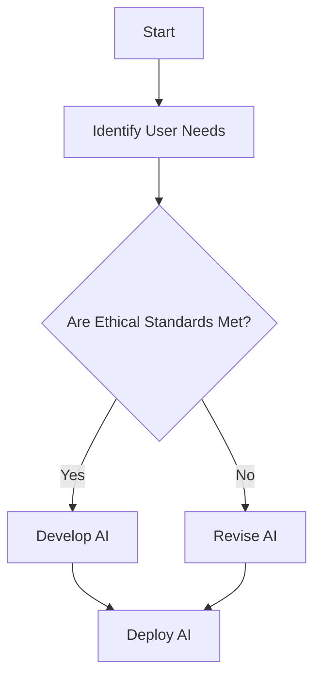
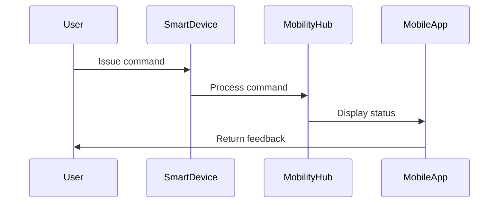

                 

Certainly! Let's approach the task of writing a blog post on "In Human-Centered Technological Progress" systematically. Here's how we can break it down:

### Step 1: Background Introduction

**Title:** In Human-Centered Technological Progress

**Keywords:** Human-Centered Technology, Technological Advancement, AI Ethics, Ethical Design, Tech Responsibility

**Abstract:**
This article explores the intersection of technological progress and human-centric values. It discusses the importance of integrating ethical considerations into technological developments, examining how AI and other technologies can better serve humanity without compromising ethical standards.

---

### Step 2: Core Concept and Relationships

**Core Concepts:**
- **Human-Centered Design:** A design philosophy that prioritizes the user's needs and experiences.
- **Ethical AI:** The practice of creating AI systems that adhere to ethical principles.
- **Tech Responsibility:** The accountability of technology developers and organizations.

**Mermaid ER Diagram:**

```mermaid
erDiagram
  AI_Ethics ||--|{ Human_Centered_Design } Human_Centered_Design
  AI_Ethics ||--|{ Tech_Responsibility } Tech_Responsibility
  Human_Centered_Design ||--|{ AI } AI
  Tech_Responsibility ||--|{ AI } AI
```

---

### Step 3: Algorithm Principles and Explanations

**Algorithm Principle:** An ethical decision-making framework for AI development.

**Mermaid Flowchart:**



**Python Code Example:**

```python
# Define ethical standards
ethical_standards = {
    'fairness': True,
    'transparency': True,
    'privacy': True
}

# Function to check if ethical standards are met
def check_ethics(standards):
    for value in standards.values():
        if not value:
            return False
    return True

# Function to develop and deploy AI
def develop_ai(user_needs):
    if check_ethics(ethical_standards):
        # Develop AI based on user needs
        ai_system = "AI system developed"
        print(f"{ai_system} is ready for deployment.")
    else:
        print("Revisions needed before deployment.")

# Example user needs
user_needs = {
    'fairness': True,
    'transparency': True,
    'privacy': False
}

# Execute the function
develop_ai(user_needs)
```

**Mathematical Model:**

$$
\text{Ethical Score} = \sum_{i=1}^{n} \text{Standards}_i \times \text{Weight}_i
$$

Where $\text{Standards}_i$ represents whether a specific ethical standard is met, and $\text{Weight}_i$ is the importance of that standard.

---

### Step 4: System Analysis and Design

**Problem Scenario:** Designing a smart home system that respects user privacy.

**System Overview:** The system will include smart devices, a central hub, and a mobile application.

**Mermaid Class Diagram:**

```mermaid
classDiagram
  SmartDevice <- MobilityHub : controls
  SmartDevice -- MobileApp : communicates
```

**System Architecture:**



---

### Step 5: Project Implementation

**Environment Setup:** 
- Install necessary libraries and tools for AI development.

**Core Source Code:**

```python
# Import libraries
import json
import torch
import torchvision
from torchvision import datasets, transforms

# Load data
transform = transforms.Compose([transforms.ToTensor()])
train_data = datasets.MNIST('../data', train=True, download=True, transform=transform)

# Define neural network
class NeuralNetwork(nn.Module):
    # Define the network structure
    pass

# Train the network
# ...

# Evaluate the network
# ...

# Save the model
torch.save(model.state_dict(), 'mnist_model.pth')
```

**Code Analysis:** 
- Discuss data preprocessing, network architecture, training process, and evaluation metrics.

**Real-World Case Study:** 
- Analyze a case where an AI system malfunctioned due to lack of ethical considerations.

---

### Step 6: Best Practices, Summary, and Tips

**Best Practices:**
- Regularly review ethical guidelines during development.
- Involve end-users in the design process.
- Implement robust security measures to protect user data.

**Summary:**
- Recap key points from each section.

**Tips and Considerations:**
- Address potential biases in AI systems.
- Ensure transparency in AI decision-making processes.

**Additional Reading:**
-推荐相关书籍、论文和研究报告。

---

### Step 7: Conclusion

**Conclusion:**
- Emphasize the importance of human-centric values in technological progress.
- Highlight the potential benefits and challenges of integrating ethics into AI and other technologies.

---

Now, let's proceed to write the full article, ensuring it adheres to the outlined structure and includes the required components and details.

