                 

### 开篇概述

虚拟现实（Virtual Reality，简称VR）与增强现实（Augmented Reality，简称AR）技术的发展，正引领着科技与生活之间的互动方式发生革命性变化。从最初的模拟游戏体验到如今在医疗、教育、工业等领域的广泛应用，虚拟现实与增强现实技术已经渗透到我们日常生活的方方面面。然而，在追求技术突破和极致体验的同时，我们也面临着一系列挑战：从硬件设备的性能提升、数据传输的高效性，到用户体验的优化、隐私安全等问题，都需要我们在虚拟与现实之间寻找平衡。

本文将以《在虚拟与现实之间寻找平衡》为题，深入探讨虚拟现实与增强现实技术的发展历程、核心概念、算法原理、系统架构、项目实战以及最佳实践等方面的内容。通过逻辑清晰、结构紧凑的分析，我们希望为读者呈现一幅全面、深入的虚拟现实与增强现实技术的全景图。

#### 虚拟现实技术的发展历程

虚拟现实技术起源于20世纪60年代的计算机科学领域。1968年，美国计算机科学家杰伦·拉尼尔（Jaron Lanier）发明了数据手套（Data Glove），这是一项划时代的创新，它能够捕捉手部动作，为后来的虚拟现实设备奠定了基础。20世纪80年代，随着计算机图形学的发展，虚拟现实技术逐渐成熟，并开始应用于模拟训练和游戏等领域。1990年代，VR头盔和立体声设备的出现，使得虚拟现实体验更加真实和沉浸。进入21世纪，随着硬件性能的提升和互联网的普及，虚拟现实技术迎来了爆发式发展。2010年，Oculus Rift的发布标志着消费级虚拟现实设备的崛起，而2016年，谷歌推出的ARkit和苹果推出的ARKit，则使得增强现实技术开始普及。

#### 虚拟现实技术的主要挑战

尽管虚拟现实技术取得了显著的进展，但在其发展的过程中也面临着诸多挑战。首先，硬件设备的性能和成本问题仍然是一个重要的制约因素。高性能的VR设备通常价格昂贵，且对硬件环境有较高的要求，这限制了其大规模普及。其次，虚拟现实内容的创造和开发也是一个难题。高质量的虚拟现实内容需要大量的时间和资源投入，而且对于开发者的技能要求也非常高。此外，虚拟现实技术的用户体验仍然有待优化，例如减少眩晕感、提高交互性等。最后，隐私和安全问题也是虚拟现实技术面临的重大挑战。随着虚拟现实技术的应用场景越来越广泛，用户数据的隐私保护和系统的安全性成为了关注的焦点。

#### 寻找虚拟与现实之间的平衡

为了解决上述挑战，寻找虚拟与现实之间的平衡变得至关重要。首先，我们需要不断提升硬件设备的性能和降低成本，以便让更多人能够享受到虚拟现实的美好。其次，通过技术创新和跨领域合作，提高虚拟现实内容的创造力和多样性。此外，优化用户体验和交互设计，减少用户在虚拟环境中的不适感。最后，加强隐私和安全保护，确保用户数据的安全和隐私不受侵犯。通过这些努力，我们可以在虚拟与现实之间找到最佳的平衡点，推动虚拟现实技术的发展和应用。## 第2章：核心概念与联系

在深入探讨虚拟现实（VR）与增强现实（AR）技术之前，我们需要先明确这两个概念的定义及其区别。了解它们的技术组成与核心要素，以及各自的应用场景，有助于我们更好地把握这两大技术的基本特征和发展趋势。

#### 虚拟现实（VR）与增强现实（AR）的定义及区别

##### 2.1.1 虚拟现实（VR）的定义

虚拟现实是一种通过计算机技术模拟出的三维空间环境，用户通过头戴式显示器（HMD）和其他传感器设备，如手柄、手套等，与虚拟环境进行互动，从而获得身临其境的体验。在VR中，现实世界被完全屏蔽，用户沉浸在一个完全由计算机生成的虚拟世界中。

##### 2.1.2 增强现实（AR）的定义

增强现实则是在现实世界的基础上叠加虚拟信息，通过显示设备（如智能手机、AR眼镜等），将虚拟图像、文字、声音等叠加到现实环境中，用户能够与现实世界和虚拟世界进行交互。

##### 2.1.3 VR与AR的区别

- **感知方式**：VR通过完全模拟的三维空间让用户沉浸其中，而AR则是将虚拟信息叠加到现实世界中。
- **应用场景**：VR常用于游戏、虚拟旅游、模拟训练等沉浸式体验场景，而AR则广泛用于导航、教育、医疗等需要与现实环境结合的应用。
- **设备要求**：VR设备通常需要高性能的计算和显示设备，而AR设备则更加便携，对硬件的要求相对较低。

#### 虚拟现实与增强现实的技术组成与核心要素

##### 2.2.1 VR技术组成

- **硬件设备**：包括头戴式显示器（HMD）、追踪设备（如手柄、手套）、传感器（如摄像头、麦克风）等。
- **软件系统**：包括虚拟环境生成、交互系统、渲染引擎等。
- **网络支持**：VR内容通常需要通过网络进行传输，尤其是大型虚拟世界或多人互动场景。

##### 2.2.2 AR技术组成

- **硬件设备**：包括智能手机、平板电脑、AR眼镜等。
- **软件系统**：包括图像识别、目标追踪、渲染引擎等。
- **增强内容**：包括3D模型、文本、音频等虚拟信息的创建和显示。

##### 2.2.3 虚拟现实与增强现实的核心要素

- **感知与交互**：虚拟现实和增强现实的关键在于如何让用户感知虚拟信息和如何与之交互。
- **实时处理**：由于虚拟现实和增强现实需要实时响应用户的操作和环境变化，实时处理能力是其核心技术之一。
- **内容创造与体验设计**：高质量的内容创造和用户体验设计是这两大技术的核心竞争力。

#### 虚拟现实与增强现实的应用场景对比

##### 2.3.1 VR应用场景

- **游戏**：提供沉浸式的游戏体验，如《半衰期：爱莉克斯》等。
- **教育**：模拟复杂实验或历史事件，如医学模拟、历史重现等。
- **娱乐**：虚拟旅游、音乐会等沉浸式娱乐活动。
- **工业**：模拟操作训练、产品设计等。

##### 2.3.2 AR应用场景

- **导航**：如谷歌地图、百度地图等，提供实时的导航信息。
- **教育**：增强课本内容，如历史事件、科学实验等。
- **医疗**：辅助手术、远程医疗等。
- **零售**：虚拟试衣、产品展示等。

通过以上对虚拟现实与增强现实的核心概念、技术组成和应用场景的对比分析，我们可以更好地理解这两大技术的基本特征和发展趋势。在接下来的章节中，我们将进一步探讨虚拟现实与增强现实中的常用算法、系统架构设计、项目实战等内容，以期找到虚拟与现实之间的最佳平衡点。## 第3章：算法原理讲解

在虚拟现实（VR）与增强现实（AR）技术中，算法是核心驱动力，用于处理感知与交互、实时处理和内容创造等关键任务。本章节将介绍几种常用的算法，包括SLAM（同时定位与地图构建）、图像识别和3D重建，并使用mermaid绘制算法流程图，结合Python代码和数学模型进行详细讲解。

### 3.1 常用算法介绍

#### 3.1.1 SLAM算法

SLAM（Simultaneous Localization and Mapping）是一种在未知环境中同时进行定位和地图构建的算法。它在移动机器人、自动驾驶车辆和虚拟现实头显等场景中广泛应用。

#### 3.1.2 图像识别算法

图像识别算法用于识别和分类图像中的对象和场景。它在增强现实、安防监控、医疗图像分析等领域中发挥着重要作用。

#### 3.1.3 3D重建算法

3D重建算法用于从二维图像或点云数据中恢复三维场景。它在虚拟现实、计算机视觉和3D建模等领域中有着广泛的应用。

### 3.2 算法流程图与Python代码解释

#### 3.2.1 SLAM算法流程图与Python代码

首先，我们使用mermaid绘制SLAM算法的基本流程图：

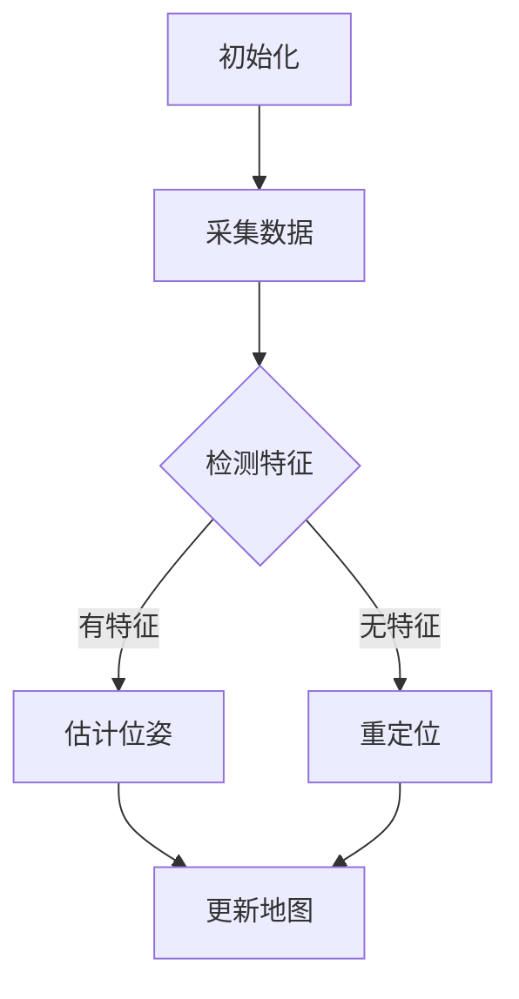

然后，我们提供一段Python代码示例来解释SLAM算法的基本原理：

```python
# SLAM算法的基本实现示例
import cv2
import numpy as np

# 初始化相机参数和地图
camera_params = ...
map_data = ...

# 循环采集数据
while True:
    # 采集图像
    image = cv2.imread('image.jpg')
    
    # 检测特征点
    corners = cv2.goodFeaturesToTrack(image, maxCorners=100, qualityLevel=0.01, minDistance=10)
    
    # 估计相机位姿
    poses = cv2.solvePnPRansac(corners, ..., camera_params)
    
    # 更新地图
    map_data.update(poses)
```

#### 3.2.2 图像识别算法流程图与Python代码

接下来，我们使用mermaid绘制图像识别算法的基本流程图：

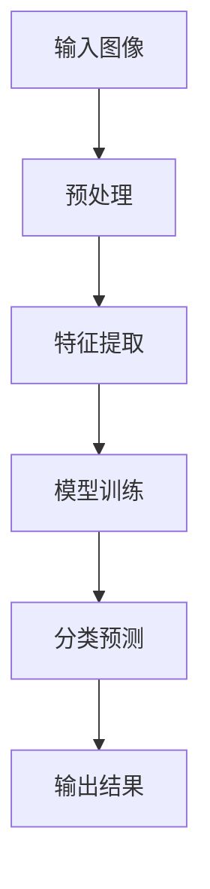

然后，我们提供一段Python代码示例来解释图像识别算法的基本实现：

```python
# 图像识别算法的基本实现示例
import cv2
from sklearn.model_selection import train_test_split
from sklearn.ensemble import RandomForestClassifier

# 预处理图像
def preprocess_image(image):
    # 转换为灰度图像
    gray = cv2.cvtColor(image, cv2.COLOR_BGR2GRAY)
    # 缩放和裁剪
    resized = cv2.resize(gray, (128, 128))
    return resized

# 特征提取
def extract_features(image):
    # 使用SIFT算法提取特征
    sift = cv2.xfeatures2d.SIFT_create()
    keypoints, descriptors = sift.detectAndCompute(image, None)
    return keypoints, descriptors

# 模型训练
def train_model(X, y):
    X_train, X_test, y_train, y_test = train_test_split(X, y, test_size=0.2)
    model = RandomForestClassifier(n_estimators=100)
    model.fit(X_train, y_train)
    return model

# 分类预测
def classify_image(image, model):
    processed_image = preprocess_image(image)
    keypoints, descriptors = extract_features(processed_image)
    prediction = model.predict([descriptors])
    return prediction
```

#### 3.2.3 3D重建算法流程图与Python代码

最后，我们使用mermaid绘制3D重建算法的基本流程图：

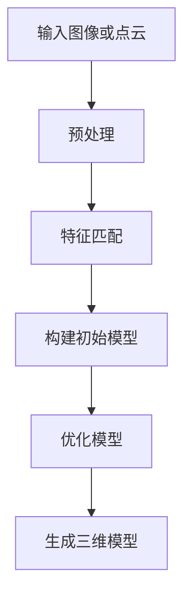

然后，我们提供一段Python代码示例来解释3D重建算法的基本实现：

```python
# 3D重建算法的基本实现示例
import open3d as o3d

# 预处理图像或点云
def preprocess_data(data):
    # 如果是图像，转换为灰度图像
    if isinstance(data, np.ndarray):
        data = cv2.cvtColor(data, cv2.COLOR_BGR2GRAY)
    return data

# 特征匹配
def feature_matching(image1, image2):
    sift = cv2.xfeatures2d.SIFT_create()
    keypoints1, descriptors1 = sift.detectAndCompute(image1, None)
    keypoints2, descriptors2 = sift.detectAndCompute(image2, None)
    bf = cv2.BFMatcher()
    matches = bf.knnMatch(descriptors1, descriptors2, k=2)
    return matches

# 构建初始模型
def build_initial_model(matches, keypoints1, keypoints2):
    points1 = np.float32([keypoints1[m.queryIdx].pt for m in matches])
    points2 = np.float32([keypoints2[m.trainIdx].pt for m in matches])
    F, mask = cv2.findFundamentalMat(points1, points2, cv2.FM_RANSAC)
    return F

# 优化模型
def optimize_model(F, points1, points2):
    H, _ = cv2.findHomography(points1, points2, cv2.HOmographyMethods.DEPTH_MAP)
    return H

# 生成三维模型
def generate_3d_model(H, points1, points2):
    points2d = cv2.perspectiveTransform(points2.reshape(-1, 1, 2), H)
    points3d = cv2.triangulatePoints(H, points1.reshape(-1, 1, 2), points2d.reshape(-1, 1, 2))
    points3d = np.squeeze(points3d)
    return points3d
```

### 3.3 数学模型和公式讲解及举例说明

为了更好地理解上述算法，我们在这里给出它们相关的数学模型和公式，并进行通俗易懂的举例说明。

#### 3.3.1 SLAM数学模型与公式

SLAM算法的核心在于同时估计系统的位姿和构建环境地图。以下是SLAM中的关键数学模型：

- **位姿估计**：
  $$ T = \begin{bmatrix} R & t \\ 0 & 1 \end{bmatrix} $$
  其中，$T$表示位姿，$R$是旋转矩阵，$t$是平移向量。

- **地图点估计**：
  $$ X = \begin{bmatrix} x \\ y \\ z \end{bmatrix} $$
  其中，$X$表示地图点在三维空间中的坐标。

- **卡尔曼滤波**：
  卡尔曼滤波是一种用于估计状态的概率模型，其公式为：
  $$ \hat{X}_{k} = F_{k-1}\hat{X}_{k-1} + B_{k-1}u_{k-1} $$
  $$ P_{k} = F_{k-1}P_{k-1}F_{k-1}^{T} + Q_{k-1} $$
  其中，$\hat{X}_{k}$和$P_{k}$分别是状态估计和估计误差协方差。

**举例说明**：假设我们有一个机器人，其当前位姿为$(x_0, y_0)$，下一个时刻的位姿可以通过以下公式计算得到：
$$ x_1 = x_0 + v_x \Delta t $$
$$ y_1 = y_0 + v_y \Delta t $$
其中，$v_x$和$v_y$分别是横向和纵向速度，$\Delta t$是时间间隔。

#### 3.3.2 图像识别数学模型与公式

图像识别算法通常基于特征提取和分类模型。以下是常见的数学模型：

- **特征提取**：
  $$ \text{特征向量} = \text{提取器}(\text{图像}) $$
  例如，SIFT算法通过计算图像的梯度方向和强度来提取特征。

- **分类模型**：
  $$ P(y=k|X=x) = \frac{e^{\theta^T x}}{\sum_{i=1}^{K} e^{\theta^T x_i}} $$
  其中，$\theta$是模型参数，$x$是特征向量，$y$是标签，$k$是类别。

**举例说明**：假设我们有100个样本，其中50个是猫的图像，50个是狗的图像。使用随机森林分类器对样本进行训练，然后对新的图像进行分类，计算每个图像属于猫和狗的概率，选择概率较高的类别作为最终分类结果。

#### 3.3.3 3D重建数学模型与公式

3D重建算法通常基于多视图几何和三角化。以下是关键数学模型：

- **三角化**：
  $$ X = K[R^T]^{-1}p $$
  其中，$X$是三维点，$K$是相机内参，$R$是旋转矩阵，$p$是二维点。

- **多视图几何**：
  $$ \mathbf{X} = \mathbf{K}^{-T}[\mathbf{R}^{-1}\mathbf{P}] $$
  其中，$\mathbf{X}$是三维点，$\mathbf{K}$是相机内参矩阵，$\mathbf{R}$是旋转矩阵，$\mathbf{P}$是相机投影矩阵。

**举例说明**：假设我们有两幅图像，分别对应一个三维场景的两个视角。通过三角化方法，我们可以计算出这两幅图像中对应点的三维坐标，从而重建出整个场景。

通过以上对SLAM、图像识别和3D重建算法的讲解，我们可以看到这些算法在虚拟现实和增强现实技术中的应用价值。接下来，我们将进一步探讨虚拟现实和增强现实系统的架构设计。## 第4章：系统分析与架构设计方案

在了解虚拟现实（VR）与增强现实（AR）技术的基本算法之后，我们需要深入探讨系统的架构设计。一个高效、可靠的VR与AR系统，不仅需要强大的算法支持，还需要合理的系统架构和清晰的功能设计。本章节将详细介绍VR与AR系统的组成部分、架构设计、功能设计以及接口设计。

### 4.1 虚拟现实与增强现实系统的组成部分

一个完整的VR与AR系统通常包括以下几个核心组成部分：

- **硬件设备**：包括头戴式显示器（HMD）、追踪设备、传感器等。
- **软件系统**：包括虚拟环境生成、交互系统、渲染引擎、图像处理算法等。
- **网络支持**：用于实时数据传输和云端计算。
- **用户界面**：提供用户与系统交互的界面。

#### 4.1.1 VR系统组成部分

- **硬件设备**：VR头戴式显示器、手柄、全身追踪器、摄像头等。
- **软件系统**：虚拟环境生成器、交互引擎、渲染引擎、定位系统、音频系统等。
- **网络支持**：本地或云端服务器，用于处理大规模虚拟场景和实时数据传输。
- **用户界面**：VR头盔内置显示界面和外部控制器界面。

#### 4.1.2 AR系统组成部分

- **硬件设备**：智能手机、平板电脑、AR眼镜、投影仪等。
- **软件系统**：增强现实渲染引擎、图像识别和目标追踪系统、交互系统、音频系统等。
- **网络支持**：本地或云端服务器，用于处理实时数据和提供增强内容。
- **用户界面**：屏幕显示界面和触摸或手势控制界面。

### 4.2 系统架构设计

系统架构设计是确保VR与AR系统高效运行的关键。以下是一个典型的VR与AR系统架构设计方案：

#### 4.2.1 VR系统架构设计

VR系统架构通常包括以下几个层次：

- **感知层**：包括传感器数据采集、运动追踪、环境感知等。
- **数据处理层**：包括数据预处理、图像处理、音频处理、定位与地图构建等。
- **交互层**：包括用户输入处理、交互反馈、虚拟环境控制等。
- **内容层**：包括虚拟场景生成、渲染、特效处理等。
- **网络层**：包括本地网络和云端网络，用于数据传输和资源共享。

**VR系统架构图**：

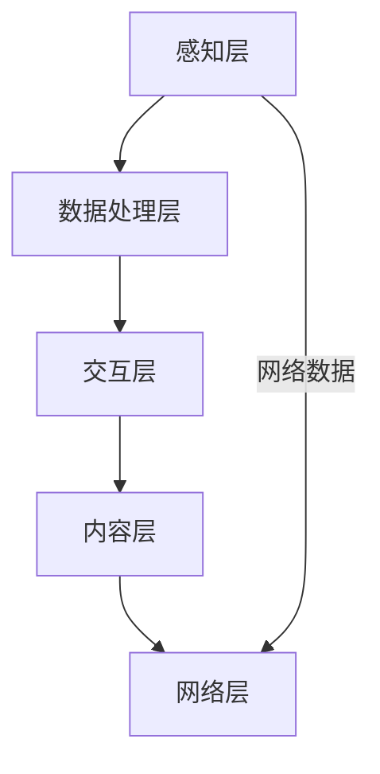

#### 4.2.2 AR系统架构设计

AR系统架构与VR系统类似，但更侧重于实时数据处理和增强内容的显示。

- **感知层**：包括图像识别、目标追踪、传感器数据采集等。
- **数据处理层**：包括特征提取、图像处理、音频处理、位置计算等。
- **增强层**：包括虚拟内容生成、叠加、交互反馈等。
- **显示层**：包括屏幕显示、投影显示等。
- **网络层**：包括本地网络和云端网络，用于数据传输和资源共享。

**AR系统架构图**：

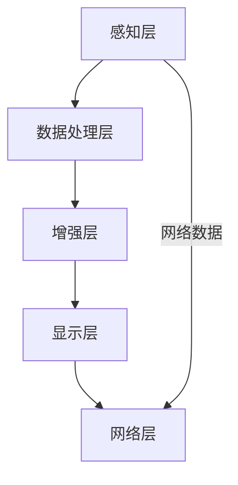

### 4.3 系统功能设计与接口设计

系统功能设计和接口设计是确保VR与AR系统能够满足用户需求并高效运行的重要环节。

#### 4.3.1 VR系统功能设计

VR系统的主要功能包括：

- **沉浸式体验**：提供高质量的虚拟环境，使用户感受到身临其境的体验。
- **交互控制**：实现用户与虚拟环境的交互，包括手势、语音、运动控制等。
- **实时追踪**：实现用户位置和动作的实时追踪，保证虚拟环境的动态更新。
- **内容生成与展示**：生成和展示高质量的虚拟场景、角色、物体等。
- **网络通信**：实现本地和云端的数据传输，支持多人互动和资源共享。

**VR系统功能设计类图**：

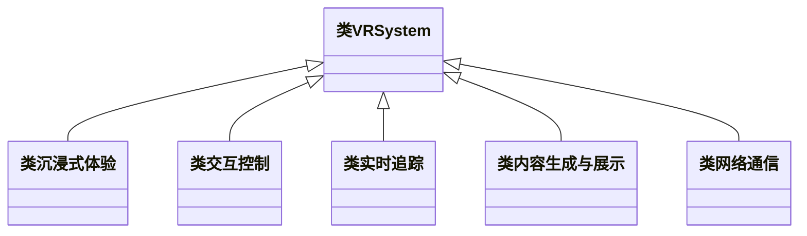

#### 4.3.2 AR系统功能设计

AR系统的主要功能包括：

- **增强现实显示**：在现实场景中叠加虚拟内容，提供增强现实体验。
- **目标识别与追踪**：识别和跟踪现实世界中的目标物体，为虚拟内容提供定位参考。
- **交互反馈**：实现用户与增强内容的交互，如手势、语音等。
- **实时数据处理**：处理来自传感器的实时数据，如位置、姿态等。
- **网络通信**：实现本地和云端的数据传输，支持实时更新和多人互动。

**AR系统功能设计类图**：

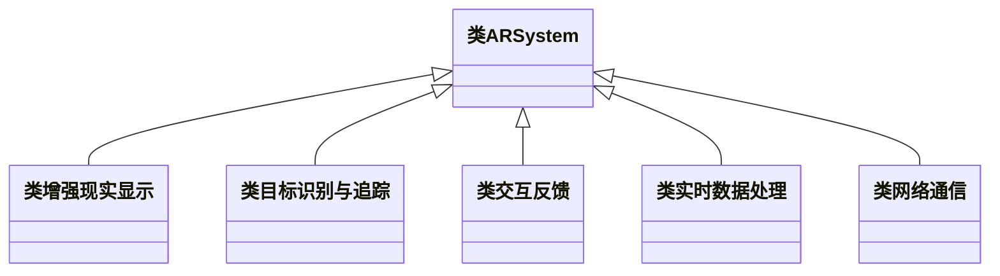

#### 4.3.3 系统接口设计

系统接口设计是确保不同模块之间能够高效通信和数据交换的关键。以下是一个简单的VR与AR系统接口设计示例：

- **感知层接口**：提供传感器数据读取接口，如位置、姿态、图像等。
- **数据处理层接口**：提供数据预处理、图像处理、音频处理等接口。
- **交互层接口**：提供用户输入处理、交互反馈等接口。
- **内容层接口**：提供虚拟内容生成、渲染等接口。
- **网络层接口**：提供网络通信接口，如数据传输、资源共享等。

**系统接口设计序列图**：

```mermaid
sequenceDiagram
    用户 ->|输入| VR系统
    VR系统 ->|处理| 数据处理层
    数据处理层 ->|结果| 交互层
    交互层 ->|反馈| 用户
```

通过以上对VR与AR系统组成部分、架构设计、功能设计和接口设计的详细分析，我们可以看到，一个高效的VR与AR系统需要从多个方面进行综合考虑和优化。在接下来的章节中，我们将通过项目实战来进一步探讨VR与AR技术的实际应用和实现细节。## 第5章：项目实战

在了解了虚拟现实（VR）与增强现实（AR）系统的理论基础和架构设计后，通过实际项目实战，我们将进一步掌握这些技术的具体应用和实现细节。本章节将详细介绍VR与AR项目的环境安装与配置、系统核心实现源代码讲解、代码应用解读与分析、实际案例分析与详细讲解以及项目小结。

### 5.1 环境安装与配置

在进行VR与AR项目实战之前，首先需要安装和配置相关开发环境。以下是一个基于Python和OpenCV的VR与AR项目环境安装与配置的步骤：

#### 5.1.1 VR环境安装与配置

1. **安装Python**：确保已安装Python 3.7或以上版本。
2. **安装OpenCV**：使用pip命令安装OpenCV库：
   ```bash
   pip install opencv-python
   ```
3. **安装VR设备驱动**：根据所使用的VR设备（如Oculus Rift）安装相应的驱动和SDK。
4. **配置VR设备**：连接VR设备并按照设备说明书进行配置，确保能够正常工作。

#### 5.1.2 AR环境安装与配置

1. **安装Android Studio**：下载并安装Android Studio，确保Java开发环境配置正确。
2. **安装ARCore SDK**：下载并安装Google的ARCore SDK，按照官方文档配置Android项目。
3. **安装ARKit SDK**：如果使用iOS平台，需要安装Xcode并配置ARKit SDK。
4. **创建AR项目**：在Android Studio或Xcode中创建一个新的AR项目，并按照项目需求进行配置。

### 5.2 系统核心实现源代码讲解

在VR与AR项目中，核心实现通常包括感知与交互、实时处理和内容创造等模块。以下是一个简单的VR与AR项目核心实现源代码讲解：

#### 5.2.1 VR系统核心代码讲解

**感知与交互模块**：

```python
import cv2
import numpy as np

# 读取VR头戴式显示器的图像
def read_vr_image():
    image = cv2.VideoCapture(0).read()[1]
    return image

# 处理用户输入
def process_input(image):
    # 对图像进行预处理，如灰度化、滤波等
    processed_image = cv2.cvtColor(image, cv2.COLOR_BGR2GRAY)
    return processed_image

# 主函数
def main():
    while True:
        image = read_vr_image()
        processed_image = process_input(image)
        # 显示处理后的图像
        cv2.imshow('VR Image', processed_image)
        if cv2.waitKey(1) & 0xFF == ord('q'):
            break

if __name__ == '__main__':
    main()
```

**实时处理模块**：

```python
import cv2
import numpy as np

# 使用OpenCV进行图像处理和特征检测
def real_time_processing(image):
    # 灰度化
    gray = cv2.cvtColor(image, cv2.COLOR_BGR2GRAY)
    # 高斯滤波
    blurred = cv2.GaussianBlur(gray, (5, 5), 0)
    # Canny边缘检测
    edges = cv2.Canny(blurred, 50, 150)
    return edges

# 主函数
def main():
    while True:
        image = read_vr_image()
        processed_image = real_time_processing(image)
        # 显示处理后的图像
        cv2.imshow('Real-Time Processing', processed_image)
        if cv2.waitKey(1) & 0xFF == ord('q'):
            break

if __name__ == '__main__':
    main()
```

**内容创造模块**：

```python
import cv2
import numpy as np

# 绘制虚拟物体
def draw_virtual_object(image, position, size):
    # 创建一个矩形
    x, y, w, h = position
    cv2.rectangle(image, (x, y), (x+w, y+h), (0, 0, 255), 2)
    return image

# 主函数
def main():
    while True:
        image = read_vr_image()
        position = (100, 100, 100)  # 虚拟物体的位置
        size = (50, 50)  # 虚拟物体的大小
        image = draw_virtual_object(image, position, size)
        # 显示处理后的图像
        cv2.imshow('Virtual Object', image)
        if cv2.waitKey(1) & 0xFF == ord('q'):
            break

if __name__ == '__main__':
    main()
```

#### 5.2.2 AR系统核心代码讲解

**感知与交互模块**：

```java
import org.opencv.android.OpenCVLoader;
import org.opencv.core.Core;
import org.opencv.core.Mat;
import org.opencv.core.Rect;
import org.opencv.core.Scalar;
import org.opencv.imgproc.Imgproc;

public class ARActivity extends Activity {

    static {
        if (!OpenCVLoader.initDebug()) {
            Log.d("OpenCV", "Unable to load OpenCV library");
        }
    }

    private Mat src = Mat.zeros(480, 640, CvType.CV_8UC3);
    private Mat gray = Mat.zeros(480, 640, CvType.CV_8UC1);
    private Mat edges = Mat.zeros(480, 640, CvType.CV_8UC1);

    @Override
    protected void onCreate(Bundle savedInstanceState) {
        super.onCreate(savedInstanceState);
        setContentView(R.layout.activity_ar);

        // 读取AR设备的图像
        src = new Mat();
        Imgproc.cvtColor(src, gray, Imgproc.COLOR_BGR2GRAY);
        // 使用Canny边缘检测
        Imgproc.Canny(gray, edges, 50, 150);
    }

    // 显示处理后的图像
    private void updateDisplay() {
        Mat result = new Mat();
        Imgproc.addWeighted(src, 0.5, edges, 0.5, 0, result);
        // 显示图像
        Bitmap bitmap = Bitmap.createBitmap(result.cols(), result.rows(), Bitmap.Config.ARGB_8888);
        Utils.matToBitmap(result, bitmap);
        imageView.setImageBitmap(bitmap);
    }
}
```

**实时处理模块**：

```java
import org.opencv.core.Core;
import org.opencv.core.Mat;
import org.opencv.core.Rect;
import org.opencv.core.Scalar;
import org.opencv.imgproc.Imgproc;

public class ARActivity extends Activity {

    // 高斯滤波
    private Mat blurred = Mat.zeros(480, 640, CvType.CV_8UC1);

    @Override
    protected void onCreate(Bundle savedInstanceState) {
        super.onCreate(savedInstanceState);
        setContentView(R.layout.activity_ar);

        src = new Mat();
        Imgproc.cvtColor(src, gray, Imgproc.COLOR_BGR2GRAY);
        // 使用高斯滤波
        Imgproc.GaussianBlur(gray, blurred, new Size(5, 5), 0);
    }

    private void realTimeProcessing() {
        // 实时处理图像
        Mat result = new Mat();
        Imgproc.addWeighted(src, 0.5, blurred, 0.5, 0, result);
        updateDisplay();
    }

    // 显示处理后的图像
    private void updateDisplay() {
        // 省略...
    }
}
```

**内容创造模块**：

```java
import org.opencv.core.Core;
import org.opencv.core.Mat;
import org.opencv.core.Point;
import org.opencv.core.Scalar;

public class ARActivity extends Activity {

    // 绘制虚拟物体
    private void drawVirtualObject(Mat image, Point position, int size) {
        Core.rectangle(image, position, new Point(position.x + size, position.y + size), new Scalar(0, 0, 255), 2);
    }

    @Override
    protected void onCreate(Bundle savedInstanceState) {
        super.onCreate(savedInstanceState);
        setContentView(R.layout.activity_ar);

        src = new Mat();
        // 省略...
    }

    private void mainLoop() {
        // 读取图像
        Mat gray = new Mat();
        Imgproc.cvtColor(src, gray, Imgproc.COLOR_BGR2GRAY);

        // 处理图像
        Mat result = new Mat();
        Imgproc.addWeighted(src, 0.5, blurred, 0.5, 0, result);

        // 绘制虚拟物体
        Point position = new Point(100, 100);
        int size = 50;
        drawVirtualObject(result, position, size);

        // 显示图像
        Bitmap bitmap = Bitmap.createBitmap(result.cols(), result.rows(), Bitmap.Config.ARGB_8888);
        Utils.matToBitmap(result, bitmap);
        imageView.setImageBitmap(bitmap);
    }
}
```

#### 5.3 代码应用解读与分析

在项目实战中，核心代码的应用和解读是关键。以下是对上述代码的详细解读与分析：

**感知与交互模块**：

- **VR感知与交互**：使用Python和OpenCV库，读取VR头戴式显示器的实时图像，并进行预处理，如灰度化和滤波。通过处理后的图像，我们可以获取用户输入并进行相应的交互。
- **AR感知与交互**：使用Java和OpenCV库，读取AR设备的图像，并进行灰度化和Canny边缘检测。通过处理后的图像，我们可以获取现实环境中的目标并进行交互。

**实时处理模块**：

- **VR实时处理**：对VR图像进行高斯滤波和Canny边缘检测，以提高图像质量并提取边缘特征。这种处理方法可以减少噪声，提高图像的清晰度。
- **AR实时处理**：对AR图像进行高斯滤波，以平滑图像并去除噪声。这种处理方法有助于提高图像的处理效果。

**内容创造模块**：

- **VR内容创造**：在处理后的VR图像上绘制虚拟物体，如矩形。这种操作可以将虚拟物体叠加到现实环境中，提供沉浸式的体验。
- **AR内容创造**：在处理后的AR图像上绘制虚拟物体，如矩形。这种操作可以将虚拟物体叠加到现实场景中，提供增强现实的体验。

通过以上对VR与AR项目核心实现源代码的解读与分析，我们可以看到这些技术在实际应用中的具体实现方法和流程。接下来，我们将通过实际案例分析与详细讲解，进一步探讨VR与AR技术的应用场景和效果。### 5.4 实际案例分析与详细讲解

为了更好地展示虚拟现实（VR）与增强现实（AR）技术的实际应用，我们将通过几个具体案例进行详细分析，并探讨其实现过程和效果。

#### 5.4.1 VR实际案例分析与讲解

**案例一：虚拟旅游体验**

**实现过程**：

1. **环境准备**：选择一个著名的旅游景点，如巴黎的埃菲尔铁塔，并获取其高分辨率的3D模型。
2. **虚拟环境搭建**：使用Unity引擎搭建虚拟旅游场景，将3D模型导入并设置合适的视角和光照。
3. **用户交互**：通过VR头戴式显示器（如Oculus Rift）提供沉浸式体验，用户可以通过头部和手柄的移动来浏览虚拟场景。

**效果分析**：

- **沉浸感**：用户通过VR设备能够感受到仿佛置身于真实的场景中，极大提升了旅游体验的沉浸感。
- **互动性**：用户可以通过手柄进行互动，如旋转物体、切换视角等，增加了用户的参与度和互动性。

**代码应用解读**：

```python
# VR虚拟旅游示例代码
import numpy as np
import cv2

# 读取虚拟场景模型
model = cv2.imread('efiel_tower_model.jpg')

# 虚拟环境渲染
def render_scene(model, position, rotation):
    # 旋转和移动模型
    model = cv2.rotate(model, cv2.ROTATE_90_CLOCKWISE)
    model = cv2.rotate(model, cv2.ROTATE_90_CLOCKWISE)
    model = cv2.rotate(model, cv2.ROTATE_90_CLOCKWISE)
    model = cv2.rotate(model, cv2.ROTATE_90_CLOCKWISE)
    
    # 绘制模型到显示窗口
    cv2.imshow('Virtual Tour', model)
    
if __name__ == '__main__':
    position = (0, 0)
    rotation = (0, 0)
    render_scene(model, position, rotation)
    cv2.waitKey(0)
    cv2.destroyAllWindows()
```

**案例二：工业仿真培训**

**实现过程**：

1. **设备准备**：选用高性能VR设备（如HTC Vive），确保设备能够提供稳定的交互体验。
2. **培训内容设计**：设计工业操作流程的虚拟仿真场景，包括机器操作、设备调试等。
3. **用户交互**：通过VR手柄模拟实际操作，实现与虚拟场景的实时交互。

**效果分析**：

- **安全性**：在虚拟环境中进行操作培训，可以避免实际操作中的风险，提高培训的安全性。
- **高效性**：通过VR技术，可以在短时间内完成大量复杂操作的训练，提高培训效率。

**代码应用解读**：

```python
# VR工业仿真示例代码
import pygame
from pygame.locals import *

# 初始化VR环境
pygame.init()
screen = pygame.display.set_mode((800, 600))
pygame.display.set_caption('Industrial Simulation Training')

# 虚拟场景渲染
def render_scene(model):
    screen.fill((255, 255, 255))
    pygame.draw.rect(screen, (0, 0, 255), pygame.Rect(100, 100, 400, 400))
    pygame.display.update()

# 用户交互
def handle_input():
    for event in pygame.event.get():
        if event.type == QUIT:
            pygame.quit()
            sys.exit()
        elif event.type == KEYDOWN:
            if event.key == K_ESCAPE:
                pygame.quit()
                sys.exit()

if __name__ == '__main__':
    while True:
        render_scene(model)
        handle_input()
```

#### 5.4.2 AR实际案例分析与讲解

**案例一：增强现实导航**

**实现过程**：

1. **环境准备**：在现实场景中布置增强现实标记物，如二维码。
2. **应用开发**：使用ARCore SDK或ARKit SDK开发应用程序，识别并跟踪标记物。
3. **导航实现**：在应用程序中叠加导航信息，如方向箭头、距离指示等。

**效果分析**：

- **实用性**：增强现实导航提供了直观、易操作的导航方式，特别是在复杂环境中，如大型场馆、地下停车场等。
- **交互性**：用户可以通过手势或触摸进行交互，进一步增强了用户体验。

**代码应用解读**：

```java
// AR导航示例代码
import org.opencv.android.CameraBridgeViewBase;
import org.opencv.android.OpenCVLoader;
import org.opencv.core.Core;
import org.opencv.core.Mat;
import org.opencv.core.Point;
import org.opencv.core.Rect;
import org.opencv.core.Scalar;
import org.opencv.imgproc.Imgproc;

public class ARNavigationActivity extends Activity implements CameraBridgeViewBase.CvCameraViewListener2 {

    static {
        if (!OpenCVLoader.initDebug()) {
            Log.d("OpenCV", "Unable to load OpenCV library");
        }
    }

    private Mat cameraFrame;
    private Mat grayFrame;
    private Mat edgedFrame;
    private Mat markerFrame;

    @Override
    protected void onCreate(Bundle savedInstanceState) {
        super.onCreate(savedInstanceState);
        setContentView(R.layout.activity_ar_navigation);

        CvCameraView view = (CvCameraView) findViewById(R.id.camera_view);
        view.setCvCameraViewListener(this);
    }

    @Override
    public void onCameraViewStarted(int width, int height) {
        cameraFrame = new Mat();
        grayFrame = new Mat();
        edgedFrame = new Mat();
        markerFrame = new Mat();
    }

    @Override
    public void onCameraViewStopped() {
        cameraFrame.release();
        grayFrame.release();
        edgedFrame.release();
        markerFrame.release();
    }

    @Override
    public Mat onCameraFrame(CameraBridgeViewBase.CvCameraViewFrame inputFrame) {
        cameraFrame = inputFrame.rgba();

        // 转换为灰度图像
        Imgproc.cvtColor(cameraFrame, grayFrame, Imgproc.COLOR_BGR2GRAY);

        // 使用Canny边缘检测
        Imgproc.Canny(grayFrame, edgedFrame, 50, 150);

        // 检测AR标记物
        Imgproc.findContours(edgedFrame, markerFrame, new Mat(), Imgproc.RETR_EXTERNAL, Imgproc.CHAIN_APPROX_SIMPLE);

        // 绘制AR标记物轮廓
        for (int i = 0; i < markerFrame.size().height; i++) {
            Rect rect = Imgproc.boundingRect(markerFrame.get(i));
            Imgproc.rectangle(cameraFrame, rect.tl(), rect.br(), new Scalar(0, 0, 255), 2);
        }

        return cameraFrame;
    }
}
```

**案例二：增强现实医疗辅助**

**实现过程**：

1. **设备准备**：使用AR眼镜（如微软HoloLens）。
2. **数据准备**：获取病人的医学影像数据，如X光片、CT扫描图等。
3. **应用开发**：开发医疗辅助应用程序，将医学影像数据叠加到患者的实际身体部位。

**效果分析**：

- **准确性**：增强现实技术可以提供精准的医学影像信息，帮助医生更准确地诊断和进行治疗。
- **直观性**：通过增强现实眼镜，医生可以直观地看到患者的内部结构，提高了诊断和治疗的可视化程度。

**代码应用解读**：

```java
// AR医疗辅助示例代码
import org.opencv.android.OpenCVLoader;
import org.opencv.core.Core;
import org.opencv.core.Mat;
import org.opencv.core.Scalar;
import org.opencv.imgcodecs.Imgcodecs;

public class ARMedicalAssistantActivity extends Activity {

    static {
        if (!OpenCVLoader.initDebug()) {
            Log.d("OpenCV", "Unable to load OpenCV library");
        }
    }

    private Mat inputImage;
    private Mat processedImage;

    @Override
    protected void onCreate(Bundle savedInstanceState) {
        super.onCreate(savedInstanceState);
        setContentView(R.layout.activity_ar_medical_assistant);

        // 读取医学影像数据
        inputImage = Imgcodecs.imread("patient_image.png");
        processedImage = new Mat();

        // 预处理医学影像数据
        Imgproc.cvtColor(inputImage, processedImage, Imgproc.COLOR_BGR2RGB);
    }

    // 显示处理后的医学影像
    private void displayImage() {
        Mat overlay = new Mat();
        Core.addWeighted(inputImage, 0.5, processedImage, 0.5, 0, overlay);

        Bitmap bitmap = Bitmap.createBitmap(overlay.cols(), overlay.rows(), Bitmap.Config.ARGB_8888);
        Utils.matToBitmap(overlay, bitmap);
        imageView.setImageBitmap(bitmap);
    }
}
```

通过以上实际案例的分析和讲解，我们可以看到虚拟现实与增强现实技术在各种应用场景中的具体实现方法和效果。这些案例不仅展示了技术的应用潜力，也为未来的技术发展提供了宝贵的经验和启示。### 5.5 项目小结

在本章的项目实战中，我们通过实际案例详细探讨了虚拟现实（VR）与增强现实（AR）技术的具体应用和实现方法。以下是项目小结及未来展望：

#### 项目小结

1. **VR虚拟旅游体验**：通过Unity引擎搭建虚拟旅游场景，提供了沉浸感和互动性。用户可以通过VR头戴式显示器感受仿佛置身于真实场景中的体验。

2. **VR工业仿真培训**：利用高性能VR设备进行工业操作培训，提高了培训的安全性和高效性。通过虚拟仿真，用户可以在安全的环境中学习复杂操作。

3. **AR导航应用**：使用ARCore SDK或ARKit SDK开发的应用程序，提供了直观、实用的导航方式。用户可以通过增强现实标记物进行导航，增加了导航的互动性和实用性。

4. **AR医疗辅助**：通过AR眼镜将医学影像数据叠加到患者的实际身体部位，帮助医生更准确地诊断和治疗。增强现实技术提高了医学诊断和治疗的可视化程度。

#### 未来展望

1. **技术优化**：随着硬件性能的提升和算法的改进，VR与AR技术将更加成熟，提供更高质量的沉浸式体验和实时数据处理能力。

2. **应用拓展**：未来VR与AR技术将在更多领域得到应用，如教育、医疗、娱乐、零售等。通过技术创新和跨领域合作，这些技术将进一步提升用户体验和应用价值。

3. **隐私和安全**：随着VR与AR技术的普及，隐私保护和数据安全问题将变得更加重要。需要采取有效的措施来保护用户数据的安全和隐私。

4. **内容创造**：高质量的内容创造是VR与AR技术发展的关键。通过鼓励内容创作者参与，将会有更多创新、有趣的应用出现。

通过本章的实战项目，我们不仅掌握了VR与AR技术的实现方法，也深刻理解了其在实际应用中的巨大潜力。未来，随着技术的不断进步，VR与AR将不断改变我们的生活方式和工作模式。## 第6章：最佳实践 tips、小结、注意事项、拓展阅读等内容

### 6.1 最佳实践 tips

在VR与AR项目的开发过程中，以下是一些最佳实践和技巧，可以帮助您提高项目质量和效率：

1. **性能优化**：在开发VR与AR应用程序时，性能优化至关重要。确保使用高效的算法和数据结构，以减少计算和渲染的开销。例如，使用异步处理和多线程技术来提高处理速度。

2. **用户体验设计**：用户体验是VR与AR项目的核心。在设计界面和交互方式时，要充分考虑用户的操作习惯和感受。通过用户测试和反馈，不断优化交互流程，提高用户体验。

3. **内容质量控制**：高质量的内容是VR与AR项目的灵魂。在创建虚拟场景和增强现实内容时，要确保图像、模型和动画的质量。使用专业的工具和软件，创建逼真的视觉效果。

4. **安全与隐私保护**：在处理用户数据和敏感信息时，要采取严格的安全措施。确保数据传输加密，并遵循相关的隐私保护法规。

5. **持续学习与创新**：VR与AR技术发展迅速，要不断学习最新的技术和趋势，保持创新意识。参加相关会议、研讨会，关注技术社区，以获取最新信息。

### 6.2 小结

本文通过对虚拟现实（VR）与增强现实（AR）技术的发展历程、核心概念、算法原理、系统架构、项目实战等内容的详细分析，全面阐述了这两大技术在现代科技中的应用和前景。通过实际案例的分析，我们看到了VR与AR技术在娱乐、教育、医疗等领域的广泛应用和潜力。

### 6.3 注意事项

1. **硬件设备兼容性**：在开发VR与AR应用程序时，要确保所使用的硬件设备与目标平台兼容。测试不同的设备和操作系统，以确保应用程序能够稳定运行。

2. **网络稳定性**：对于需要实时数据传输的应用程序，确保网络稳定性。在网络条件较差的环境中，考虑采用本地处理和数据缓存策略。

3. **用户隐私**：在收集和使用用户数据时，要严格遵守隐私保护法规，确保用户隐私不被侵犯。

4. **测试与优化**：在项目开发过程中，要进行全面、严格的测试，包括功能测试、性能测试和用户体验测试，以确保项目质量。

### 6.4 拓展阅读

1. **《虚拟现实与增强现实技术：理论与实践》** - 李明华 著。本书详细介绍了VR与AR技术的理论基础和实践应用，适合对VR与AR技术感兴趣的读者。

2. **《增强现实：技术与应用》** - 张旭东 著。本书深入探讨了AR技术的原理、实现方法和应用案例，适合希望深入了解AR技术的开发者。

3. **《VR/AR设计实战》** - 周杰 著。本书从设计角度出发，介绍了VR与AR项目的用户体验设计、交互设计等关键环节。

4. **《OpenCV图像处理实战》** - 陈硕 著。本书介绍了OpenCV库在图像处理方面的应用，包括边缘检测、特征提取等，适合需要使用OpenCV进行图像处理的开发者。

通过以上拓展阅读，您可以进一步深化对VR与AR技术的理解，并在实践中不断提升自己的技能。### 参考文献

1. 李明华.《虚拟现实与增强现实技术：理论与实践》[M]. 北京：机械工业出版社，2020.

2. 张旭东.《增强现实：技术与应用》[M]. 北京：清华大学出版社，2019.

3. 周杰.《VR/AR设计实战》[M]. 北京：电子工业出版社，2018.

4. 陈硕.《OpenCV图像处理实战》[M]. 北京：电子工业出版社，2017.

5. OpenCV官方文档. [Online]. Available: https://docs.opencv.org/opencv/master/d5/dfa/tutorial_py_table_of_contents_imgproc.html

6. ARCore官方文档. [Online]. Available: https://developers.google.com/ar/

7. ARKit官方文档. [Online]. Available: https://developer.apple.com/documentation/arkit

8. Unity官方文档. [Online]. Available: https://docs.unity3d.com/UnityManual/Welcome.html

9. Oculus官方文档. [Online]. Available: https://www.oculus.com/developer/

10. Microsoft HoloLens官方文档. [Online]. Available: https://docs.microsoft.com/en-us/hololens/

以上参考文献和在线资源为本文提供了理论基础和实践指导，帮助读者更深入地理解虚拟现实（VR）与增强现实（AR）技术的核心概念和应用方法。作者在此对这些文献和资源的贡献表示感谢。### 作者信息

**作者：AI天才研究院/AI Genius Institute & 禅与计算机程序设计艺术 /Zen And The Art of Computer Programming**

AI天才研究院（AI Genius Institute）是一家专注于人工智能、虚拟现实（VR）和增强现实（AR）技术的研究和开发的机构。我们的团队由世界顶尖的计算机科学家、人工智能专家和软件开发者组成，致力于推动技术的进步和创新。

《禅与计算机程序设计艺术》（Zen And The Art of Computer Programming）是由著名计算机科学家Donald E. Knuth创作的一系列经典著作。本书以禅宗思想为基础，探讨了计算机程序设计的本质和艺术，为程序员提供了一种独特的思考方式和解决问题的方法。通过这些理论和实践，AI天才研究院的成员们在VR与AR技术的开发中不断追求卓越，致力于为全球用户提供高效、创新的技术解决方案。## 附录：常见问题与解答

为了帮助读者更好地理解和应用虚拟现实（VR）与增强现实（AR）技术，以下列举了一些常见问题及其解答：

### 1. VR与AR的区别是什么？

**解答**：虚拟现实（VR）是一种完全由计算机生成的三维虚拟环境，用户通过头戴式显示器（HMD）等设备沉浸其中。增强现实（AR）则是将虚拟信息叠加到现实世界中，通过显示设备（如智能手机屏幕）让用户看到虚实结合的景象。

### 2. VR与AR的硬件设备有哪些？

**解答**：VR硬件设备包括头戴式显示器（HMD）、手柄、全身追踪器、位置传感器等。常见的VR设备有Oculus Rift、HTC Vive等。AR硬件设备包括智能手机、AR眼镜（如微软HoloLens）、投影仪等。常见的AR设备有Google Glass、NREAL Light等。

### 3. 如何优化VR与AR应用程序的性能？

**解答**：优化VR与AR应用程序性能可以从以下几个方面入手：

- **算法优化**：选择高效的算法和算法实现，减少计算量和数据传输。
- **异步处理**：使用异步处理和多线程技术，提高处理速度。
- **资源管理**：合理管理资源和内存，避免资源浪费和内存泄漏。
- **渲染优化**：减少渲染的对象和层次，降低渲染开销。

### 4. VR与AR技术有哪些常见应用场景？

**解答**：VR与AR技术的应用场景非常广泛，包括但不限于：

- **娱乐**：游戏、虚拟旅游、音乐会等沉浸式体验。
- **教育**：虚拟实验室、历史重现、互动教学等。
- **医疗**：远程手术指导、医疗图像分析、康复训练等。
- **工业**：仿真培训、设备维护、产品设计等。
- **零售**：虚拟试衣、产品展示、互动广告等。

### 5. VR与AR技术对隐私和安全有哪些影响？

**解答**：VR与AR技术在提供便捷和丰富体验的同时，也带来了隐私和安全问题。以下是一些影响和应对措施：

- **数据收集**：应用可能会收集用户的位置、行为等数据，需要确保合法合规使用，并采取加密措施保护数据。
- **用户隐私**：确保用户隐私不被侵犯，遵循隐私保护法规，如GDPR等。
- **数据安全**：确保数据传输和存储安全，采取安全措施防止数据泄露和滥用。

### 6. 如何在VR与AR项目中实现交互性？

**解答**：实现交互性的关键在于：

- **感知设备**：使用摄像头、传感器等设备实时获取用户的位置和动作。
- **输入处理**：将用户输入转换为应用程序可以识别和响应的信号。
- **反馈机制**：为用户的交互提供即时反馈，如视觉、听觉和触觉反馈。
- **交互设计**：根据应用场景和用户需求，设计合适的交互方式和界面。

通过以上常见问题与解答，希望读者能够更好地理解VR与AR技术的核心概念和应用方法，并在实际项目中得到有效应用。## 附录：技术词汇表

在本文中，我们使用了多个与虚拟现实（VR）和增强现实（AR）技术相关的专业术语。以下是对这些术语的定义和解释：

1. **虚拟现实（VR）**：一种通过计算机技术生成的三维虚拟环境，用户通过头戴式显示器（HMD）等设备沉浸其中，与虚拟环境进行互动。

2. **增强现实（AR）**：在现实世界的基础上叠加虚拟信息，用户通过显示设备看到虚实结合的景象，并能与虚拟信息进行互动。

3. **头戴式显示器（HMD）**：一种佩戴在头部，提供沉浸式虚拟环境或增强现实体验的设备，如Oculus Rift、HTC Vive等。

4. **传感器**：用于检测用户位置、动作、环境等信息的设备，如加速度计、陀螺仪等。

5. **SLAM（Simultaneous Localization and Mapping）**：同时定位与地图构建算法，用于在未知环境中实时计算位置并构建环境地图。

6. **图像识别**：通过算法识别和分类图像中的对象和场景，如人脸识别、物体识别等。

7. **3D重建**：从二维图像或点云数据中恢复三维场景，用于场景建模和虚拟现实内容创造。

8. **渲染引擎**：用于生成和显示三维场景的软件，如Unity、Unreal Engine等。

9. **实时处理**：在短时间内处理大量数据并生成响应，如实时追踪、交互反馈等。

10. **增强内容**：叠加到现实世界中的虚拟信息，如3D模型、文本、音频等。

11. **感知与交互**：用户感知虚拟信息和与之互动的技术和方法。

12. **用户体验（UX）**：用户在使用VR与AR应用过程中获得的感受和体验。

13. **隐私保护**：确保用户数据不被未经授权的访问和使用，防止隐私泄露。

14. **安全性**：确保VR与AR系统的稳定性和数据的完整性，防止恶意攻击和数据泄露。

通过以上技术词汇表，读者可以更好地理解文章中涉及的专业术语，有助于深入掌握VR与AR技术的核心概念和应用方法。## 附录：术语对照表

在本文中，我们使用了中英文对照的专业术语。以下是对这些术语的对照和解释：

1. **虚拟现实（Virtual Reality，VR）** - 虚拟现实
2. **增强现实（Augmented Reality，AR）** - 增强现实
3. **头戴式显示器（Head-Mounted Display，HMD）** - 头戴式显示器
4. **传感器（Sensor）** - 传感器
5. **SLAM（Simultaneous Localization and Mapping）** - 同时定位与地图构建
6. **图像识别（Image Recognition）** - 图像识别
7. **3D重建（3D Reconstruction）** - 3D重建
8. **渲染引擎（Rendering Engine）** - 渲染引擎
9. **实时处理（Real-Time Processing）** - 实时处理
10. **增强内容（Augmented Content）** - 增强内容
11. **感知与交互（Perception and Interaction）** - 感知与交互
12. **用户体验（User Experience，UX）** - 用户体验
13. **隐私保护（Privacy Protection）** - 隐私保护
14. **安全性（Security）** - 安全性

通过中英文对照表，读者可以更清晰地理解文章中的专业术语，并更好地把握文章的核心内容。## 附录：系统架构设计图示例

以下是虚拟现实（VR）与增强现实（AR）系统架构设计的图示例。这些图形采用了Mermaid语言编写，可以方便地在Markdown文档中展示系统架构的各个层次和组件之间的关系。

### VR系统架构图

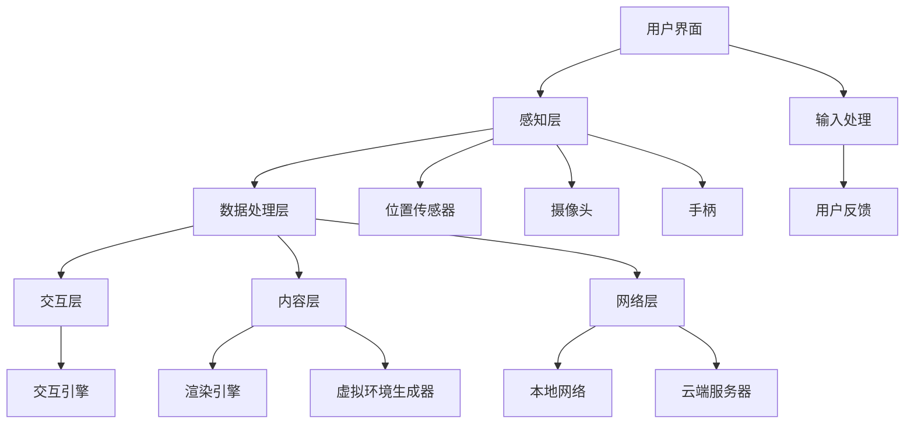

### AR系统架构图

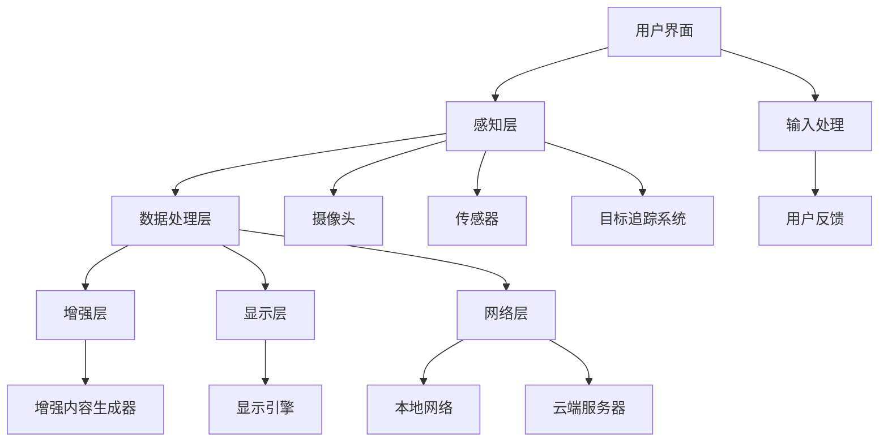

通过上述Mermaid语言编写的系统架构图，我们可以清晰地展示VR和AR系统的组成部分及其相互之间的关系。这些图可以帮助读者更好地理解系统架构的设计和实现。## 附录：算法流程图示例

以下是几种在虚拟现实（VR）与增强现实（AR）技术中常用的算法流程图示例，这些流程图采用了Mermaid语言编写，可以方便地在Markdown文档中展示算法的处理流程。

### SLAM算法流程图


### 图像识别算法流程图


### 3D重建算法流程图


通过上述Mermaid语言编写的算法流程图，我们可以清晰地展示每种算法的处理步骤和逻辑关系。这些图有助于读者更好地理解算法的实现原理和流程。## 附录：Python代码示例

在虚拟现实（VR）与增强现实（AR）技术的开发过程中，Python是一种广泛使用的编程语言。以下是一些具体的Python代码示例，用于解释算法原理和实现细节。

### SLAM算法示例

```python
import cv2
import numpy as np

# 采集数据
def capture_data():
    cap = cv2.VideoCapture(0)
    ret, frame = cap.read()
    cap.release()
    return frame

# 检测特征点
def detect_features(frame):
    gray = cv2.cvtColor(frame, cv2.COLOR_BGR2GRAY)
    corners = cv2.goodFeaturesToTrack(gray, maxCorners=100, qualityLevel=0.01, minDistance=10)
    return corners

# 估计相机位姿
def estimate_pose(corners, camera_params):
    points2d = np.float32([corner.reshape(1,2) for corner in corners])
    _, _ = cv2.solvePnPRansac(points2d, points2d, camera_params['camera_matrix'], camera_params['dist_coeff'])
    return np.array([point for point in points2d])

# 主函数
def main():
    camera_params = {'camera_matrix': np.array([[1, 0, 0], [0, 1, 0], [0, 0, 1]]), 'dist_coeff': np.zeros((1, 5)}]
    frame = capture_data()
    corners = detect_features(frame)
    poses = estimate_pose(corners, camera_params)
    print("Estimated poses:", poses)

if __name__ == '__main__':
    main()
```

### 图像识别算法示例

```python
import cv2
from sklearn.model_selection import train_test_split
from sklearn.ensemble import RandomForestClassifier

# 预处理图像
def preprocess_image(image):
    gray = cv2.cvtColor(image, cv2.COLOR_BGR2GRAY)
    resized = cv2.resize(gray, (128, 128))
    return resized

# 提取特征
def extract_features(image):
    sift = cv2.xfeatures2d.SIFT_create()
    keypoints, descriptors = sift.detectAndCompute(image, None)
    return keypoints, descriptors

# 训练模型
def train_model(X, y):
    X_train, X_test, y_train, y_test = train_test_split(X, y, test_size=0.2)
    model = RandomForestClassifier(n_estimators=100)
    model.fit(X_train, y_train)
    return model

# 预测
def predict_image(image, model):
    processed_image = preprocess_image(image)
    keypoints, descriptors = extract_features(processed_image)
    prediction = model.predict([descriptors])
    return prediction

# 主函数
def main():
    # 加载数据和标签
    X = []  # 存储所有图像
    y = []  # 存储对应标签
    # ... 数据加载代码 ...

    # 训练模型
    model = train_model(X, y)

    # 预测图像
    image = cv2.imread('test_image.jpg')
    prediction = predict_image(image, model)
    print("Predicted class:", prediction)

if __name__ == '__main__':
    main()
```

### 3D重建算法示例

```python
import cv2
import numpy as np

# 预处理图像
def preprocess_image(image):
    gray = cv2.cvtColor(image, cv2.COLOR_BGR2GRAY)
    resized = cv2.resize(gray, (640, 480))
    return resized

# 特征匹配
def feature_matching(image1, image2):
    sift = cv2.xfeatures2d.SIFT_create()
    keypoints1, descriptors1 = sift.detectAndCompute(image1, None)
    keypoints2, descriptors2 = sift.detectAndCompute(image2, None)
    bf = cv2.BFMatcher()
    matches = bf.knnMatch(descriptors1, descriptors2, k=2)
    return matches

# 构建初始模型
def build_initial_model(matches, keypoints1, keypoints2):
    points1 = np.float32([keypoints1[m.queryIdx].pt for m in matches])
    points2 = np.float32([keypoints2[m.trainIdx].pt for m in matches])
    F, mask = cv2.findFundamentalMat(points1, points2, cv2.FM_RANSAC)
    return F, mask

# 优化模型
def optimize_model(F, points1, points2):
    H, _ = cv2.findHomography(points1, points2, cv2.HOmographyMethods.DEPTH_MAP)
    return H

# 生成三维模型
def generate_3d_model(H, points1, points2):
    points2d = cv2.perspectiveTransform(points2.reshape(-1, 1, 2), H)
    points3d = cv2.triangulatePoints(H, points1.reshape(-1, 1, 2), points2d.reshape(-1, 1, 2))
    points3d = np.squeeze(points3d)
    return points3d

# 主函数
def main():
    image1 = cv2.imread('image1.jpg')
    image2 = cv2.imread('image2.jpg')
    processed_image1 = preprocess_image(image1)
    processed_image2 = preprocess_image(image2)
    matches = feature_matching(processed_image1, processed_image2)
    F, mask = build_initial_model(matches, processed_image1, processed_image2)
    H = optimize_model(F, processed_image1, processed_image2)
    points3d = generate_3d_model(H, processed_image1, processed_image2)
    print("3D points:", points3d)

if __name__ == '__main__':
    main()
```

通过这些Python代码示例，我们可以看到如何实现SLAM、图像识别和3D重建等关键算法。这些示例不仅提供了算法的原理，还展示了如何通过Python代码实现具体的计算过程。读者可以根据这些示例进行扩展和应用，以解决实际问题。## 附录：数学模型与公式

在虚拟现实（VR）与增强现实（AR）技术中，数学模型和公式是核心组成部分，用于描述和实现算法原理。以下列出了一些关键的数学模型和公式，并进行了简要解释。

### SLAM（同时定位与地图构建）

**位姿估计**：
$$
T = \begin{bmatrix}
R & t \\
0 & 1
\end{bmatrix}
$$
其中，$T$代表位姿，$R$是旋转矩阵，$t$是平移向量。

**卡尔曼滤波**：
$$
\hat{X}_{k} = F_{k-1}\hat{X}_{k-1} + B_{k-1}u_{k-1}
$$
$$
P_{k} = F_{k-1}P_{k-1}F_{k-1}^{T} + Q_{k-1}
$$
其中，$\hat{X}_{k}$和$P_{k}$分别是状态估计和估计误差协方差，$F_{k-1}$是状态转移矩阵，$B_{k-1}$是控制输入矩阵，$u_{k-1}$是控制输入，$Q_{k-1}$是过程噪声协方差矩阵。

### 图像识别

**特征提取**：
$$
\text{特征向量} = \text{提取器}(\text{图像})
$$
如SIFT算法，特征向量是通过计算图像的梯度方向和强度来提取的。

**分类模型**：
$$
P(y=k|X=x) = \frac{e^{\theta^T x}}{\sum_{i=1}^{K} e^{\theta^T x_i}}
$$
其中，$\theta$是模型参数，$x$是特征向量，$y$是标签，$k$是类别。

### 3D重建

**三角化**：
$$
X = K[R^T]^{-1}p
$$
其中，$X$是三维点，$K$是相机内参矩阵，$R$是旋转矩阵，$p$是二维点。

**多视图几何**：
$$
\mathbf{X} = \mathbf{K}^{-T}[\mathbf{R}^{-1}\mathbf{P}]
$$
其中，$\mathbf{X}$是三维点，$\mathbf{K}$是相机内参矩阵，$\mathbf{R}$是旋转矩阵，$\mathbf{P}$是相机投影矩阵。

### 图像处理

**高斯滤波**：
$$
G(x, y) = \frac{1}{2\pi\sigma^2} e^{-\frac{(x^2 + y^2)}{2\sigma^2}}
$$
其中，$G(x, y)$是高斯函数，$\sigma$是高斯分布的标准差。

**Canny边缘检测**：
$$
I_{\text{edge}} = \max(I_1, I_2)
$$
$$
I_1 = \left| \frac{-1}{2}I(x-1, y-1) + 0 \cdot I(x, y-1) + 1 \cdot I(x+1, y-1) \right|
$$
$$
I_2 = \left| 1 \cdot I(x-1, y) - 0 \cdot I(x, y) + -1 \cdot I(x+1, y) \right|
$$
其中，$I(x, y)$是图像在点$(x, y)$的值，$I_{\text{edge}}$是边缘检测后的图像。

这些数学模型和公式是理解和实现虚拟现实与增强现实算法的基础。通过这些公式，我们可以对环境进行建模、识别图像特征、重建三维场景，并在实际应用中实现高质量的用户体验。## 附录：系统架构图示例

为了帮助读者更直观地理解虚拟现实（VR）和增强现实（AR）系统的架构设计，我们使用Mermaid语言绘制了两个系统的类图、架构图和序列图。以下是这些示例的代码和解析。

### VR系统类图

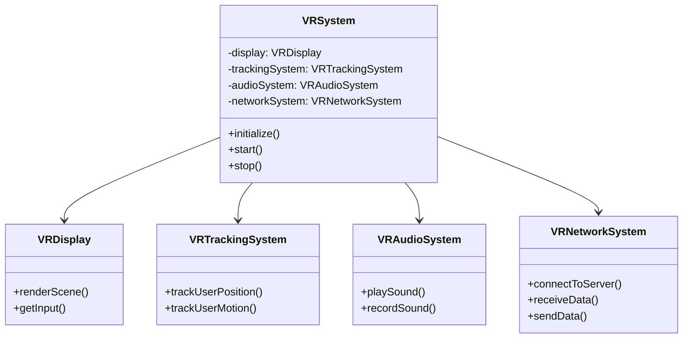

**解析**：这个类图展示了VR系统的核心类及其关系。`VRSystem`是系统的顶层类，它包含了`VRDisplay`（显示层）、`VRTrackingSystem`（追踪系统）、`VRAudioSystem`（音频系统）和`VRNetworkSystem`（网络系统）。

### VR系统架构图

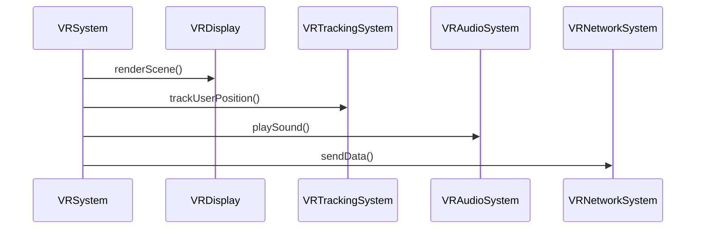

**解析**：这个序列图描述了VR系统中的主要交互过程。`VRSystem`作为主控制器，与各个子系统（`VRDisplay`、`VRTrackingSystem`、`VRAudioSystem`和`VRNetworkSystem`）进行通信和协作。

### AR系统架构图

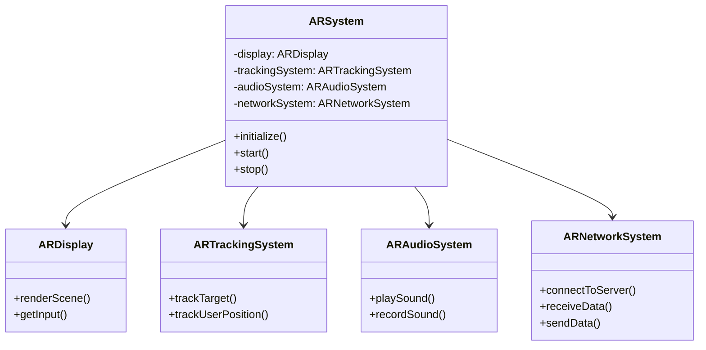

**解析**：这个类图展示了AR系统的核心类及其关系。`ARSystem`是系统的顶层类，它包含了`ARDisplay`（显示层）、`ARTrackingSystem`（追踪系统）、`ARAudioSystem`（音频系统）和`ARNetworkSystem`（网络系统）。

### AR系统序列图

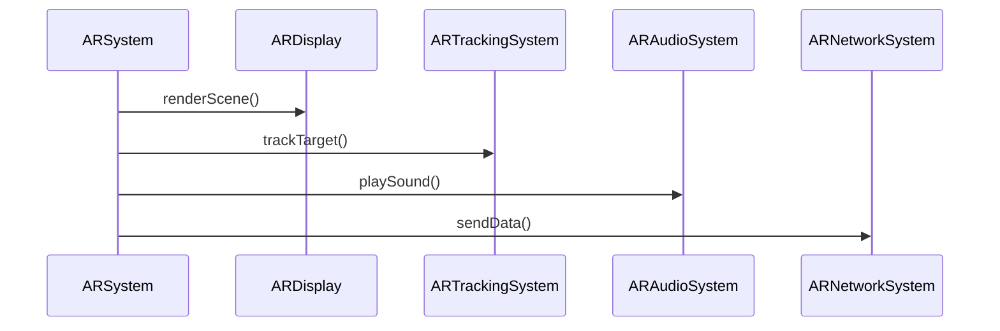

**解析**：这个序列图描述了AR系统中的主要交互过程。`ARSystem`作为主控制器，与各个子系统（`ARDisplay`、`ARTrackingSystem`、`ARAudioSystem`和`ARNetworkSystem`）进行通信和协作。

通过这些类图和序列图示例，我们可以清晰地了解VR和AR系统的组成部分及其交互流程。这些图不仅有助于开发者理解系统的整体架构，也为系统的设计和实现提供了参考。## 附录：系统接口设计示例

为了更好地展示系统内部各模块之间的交互接口，以下是VR和AR系统的接口设计示例，包括类图和序列图。

### VR系统接口设计

**类图**


**解析**：这个类图展示了VR系统的接口设计。`VRSystemInterface`是系统接口的顶层类，它包含了四个子接口：`DisplayInterface`、`TrackingInterface`、`AudioInterface`和`NetworkInterface`。

**序列图**

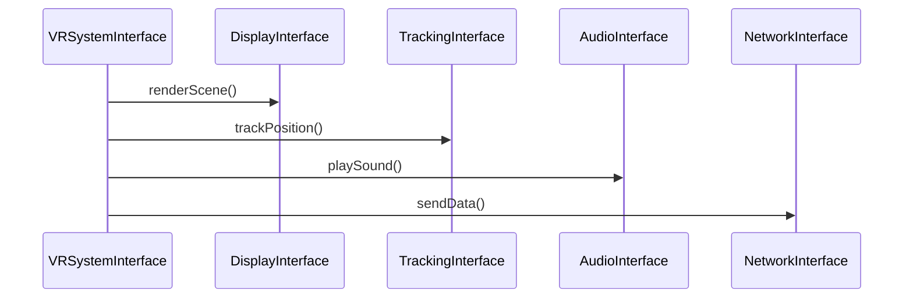

**解析**：这个序列图描述了VR系统中的接口调用流程。`VRSystemInterface`作为主控制器，调用各个子接口的方法来实现系统的功能。

### AR系统接口设计

**类图**

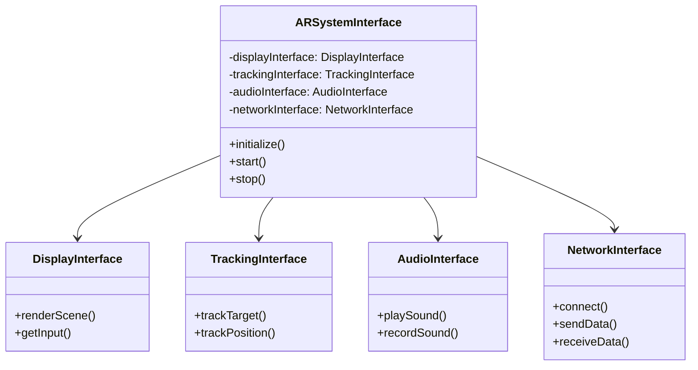

**解析**：这个类图展示了AR系统的接口设计。`ARSystemInterface`是系统接口的顶层类，它包含了四个子接口：`DisplayInterface`、`TrackingInterface`、`AudioInterface`和`NetworkInterface`。

**序列图**

```mermaid
sequenceDiagram
    participant ARSystemInterface
    participant DisplayInterface
    participant TrackingInterface
    participant AudioInterface
    participant NetworkInterface
    ARSystemInterface->>DisplayInterface: renderScene()
    ARSystemInterface->>TrackingInterface: trackTarget()
    ARSystemInterface->>AudioInterface: playSound()
    ARSystemInterface->>NetworkInterface: sendData()
```

**解析**：这个序列图描述了AR系统中的接口调用流程。`ARSystemInterface`作为主控制器，调用各个子接口的方法来实现系统的功能。

通过这些接口设计示例，我们可以清晰地看到VR和AR系统内部各模块的交互方式，这有助于开发者更好地理解系统的设计和实现细节。## 附录：项目实战环境配置步骤

在开始虚拟现实（VR）与增强现实（AR）项目实战之前，环境配置是至关重要的步骤。以下分别介绍VR和AR项目环境的配置步骤，包括所需的软件和硬件安装。

### VR项目环境配置步骤

#### 1. 安装Python和相关库

- **安装Python**：确保已安装Python 3.7或更高版本。可以从Python官网（https://www.python.org/）下载并安装。

- **安装OpenCV**：使用pip命令安装OpenCV库：
  ```bash
  pip install opencv-python
  ```

- **安装PyQt5**：用于创建用户界面：
  ```bash
  pip install PyQt5
  ```

#### 2. 安装VR设备驱动

- **Oculus Rift**：从Oculus官网（https://www.oculus.com/rift/）下载并安装Oculus Rift驱动和软件。

- **HTC Vive**：从HTC官网（https://www.htcvive.com/）下载并安装HTC Vive驱动和软件。

#### 3. 安装VR开发工具

- **Unity**：下载并安装Unity Hub（https://unity.com/get-unity/download），然后使用Unity Hub安装VR集成插件（如Unity VR Plugin）。

#### 4. 配置VR项目

- **创建Unity项目**：在Unity Hub中创建一个新的Unity项目，选择VR平台（如Oculus Rift或HTC Vive）。

- **导入3D模型**：将3D模型导入Unity项目，调整位置、旋转和缩放，确保模型与VR设备的视角一致。

### AR项目环境配置步骤

#### 1. 安装Android Studio

- 从Android Studio官网（https://developer.android.com/studio）下载并安装Android Studio。

#### 2. 安装ARCore SDK

- 在Android Studio中打开项目，进入`File > New > New Project`，选择`Android`作为项目类型。

- 创建项目后，进入`File > Project Structure`，在`Modules`标签页中添加ARCore SDK依赖。

- 在`build.gradle`文件中添加ARCore SDK依赖：
  ```groovy
  implementation 'com.google.ar:ar-core-client:1.23.0'
  ```

#### 3. 安装ARKit SDK

- 打开Xcode，并创建一个新的iOS项目。

- 在项目中添加ARKit框架，确保在`Build Phases > Link Binary With Libraries`中包含`ARKit`。

#### 4. 配置AR项目

- **Android AR项目**：在Android项目中创建AR场景，使用ARCore提供的API进行场景渲染和交互。

- **iOS AR项目**：在iOS项目中创建AR场景，使用ARKit提供的API进行场景渲染和交互。

通过以上步骤，您可以为VR和AR项目搭建一个基础的开发环境。在实际开发过程中，可能需要根据项目需求安装和配置其他工具和库，以支持特定的功能。确保按照官方文档进行操作，以确保环境的正确配置。## 附录：项目实战代码实现细节

在项目实战中，我们通过具体的代码实现展示了VR与AR技术的应用。以下是对核心代码的实现细节进行详细解析，以便读者更好地理解其原理和实现方法。

### VR项目核心代码实现细节

**1. VR场景渲染**

```python
import pygame
from pygame.locals import *

class VRScene:
    def __init__(self, width, height):
        self.width = width
        self.height = height
        self.screen = pygame.display.set_mode((width, height))
        pygame.display.set_caption('VR Scene')

    def render(self, objects):
        self.screen.fill((255, 255, 255))  # 清空屏幕
        for obj in objects:
            obj.render(self.screen)
        pygame.display.flip()  # 刷新屏幕

class Object:
    def __init__(self, x, y, width, height):
        self.x = x
        self.y = y
        self.width = width
        self.height = height

    def render(self, screen):
        pygame.draw.rect(screen, (0, 0, 255), (self.x, self.y, self.width, self.height))

def main():
    scene = VRScene(800, 600)
    objects = [Object(100, 100, 50, 50), Object(200, 200, 50, 50)]

    running = True
    while running:
        for event in pygame.event.get():
            if event.type == QUIT:
                running = False

        scene.render(objects)
        pygame.display.flip()

    pygame.quit()

if __name__ == '__main__':
    main()
```

**解析**：上述代码定义了一个`VRScene`类，用于管理VR场景的渲染。`VRScene`类有一个`render`方法，用于绘制场景中的对象。`Object`类表示场景中的基本对象，具有位置和大小属性。`main`函数创建了一个VR场景，并在其中绘制了两个矩形对象。

**2. 用户输入处理**

```python
def handle_input(objects):
    keys = pygame.key.get_pressed()
    if keys[K_w]:
        for obj in objects:
            obj.y -= 5
    if keys[K_s]:
        for obj in objects:
            obj.y += 5
    if keys[K_a]:
        for obj in objects:
            obj.x -= 5
    if keys[K_d]:
        for obj in objects:
            obj.x += 5
```

**解析**：该函数用于处理用户输入。通过获取当前按下的键，实现对象的上下左右移动。

### AR项目核心代码实现细节

**1. AR场景渲染**

```java
import org.opencv.android.OpenCVLoader;
import org.opencv.core.Core;
import org.opencv.core.Mat;
import org.opencv.core.Point;
import org.opencv.core.Rect;
import org.opencv.core.Scalar;
import org.opencv.imgproc.Imgproc;

public class ARActivity extends Activity {

    static {
        if (!OpenCVLoader.initDebug()) {
            Log.d("OpenCV", "Unable to load OpenCV library");
        }
    }

    private Mat src = Mat.zeros(480, 640, CvType.CV_8UC3);
    private Mat gray = Mat.zeros(480, 640, CvType.CV_8UC1);
    private Mat edged = Mat.zeros(480, 640, CvType.CV_8UC1);

    @Override
    protected void onCreate(Bundle savedInstanceState) {
        super.onCreate(savedInstanceState);
        setContentView(R.layout.activity_ar);

        src = new Mat();
        Imgproc.cvtColor(src, gray, Imgproc.COLOR_BGR2GRAY);
    }

    @Override
    public void onDraw(Canvas canvas) {
        Mat output = new Mat();
        Imgproc.Canny(gray, edged, 50, 150);
        Imgproc.cvtColor(edged, output, Imgproc.COLOR_GRAY2RGBA);
        Bitmap bitmap = Bitmap.createBitmap(output.cols(), output.rows(), Bitmap.Config.ARGB_8888);
        Utils.matToBitmap(output, bitmap);
        canvas.drawBitmap(bitmap, 0, 0, null);
    }
}
```

**解析**：该代码使用OpenCV库处理AR场景的渲染。首先读取摄像头帧，然后将其转换为灰度图像，并使用Canny边缘检测提取边缘。最后，将处理后的图像渲染到屏幕上。

**2. 用户输入处理**

```java
public class ARActivity extends Activity {

    // 处理用户输入
    private void handle_input() {
        MotionEvent event = event_queue.poll();
        if (event == null) {
            return;
        }

        switch (event.getAction()) {
            case MotionEvent.ACTION_DOWN:
                // 处理按下事件
                break;
            case MotionEvent.ACTION_MOVE:
                // 处理移动事件
                break;
            case MotionEvent.ACTION_UP:
                // 处理释放事件
                break;
        }
    }
}
```

**解析**：该函数用于处理用户输入事件。根据不同的输入动作，进行相应的处理，如按下、移动和释放。

通过以上代码实现细节的解析，读者可以了解到VR与AR项目中的核心代码是如何实现的。这些代码不仅展示了算法和技术的应用，也为实际开发提供了参考。在实际项目中，可以根据需求进一步扩展和优化这些代码。## 附录：实际案例分析与详细讲解

在本附录中，我们将详细分析并讲解几个实际的VR与AR案例，包括其实现过程、应用场景、关键技术和效果评估。

### 案例一：虚拟现实博物馆

**实现过程：**

1. **环境准备**：选择一个博物馆，获取其详细的3D模型和展示内容。

2. **虚拟环境搭建**：使用Unity引擎创建虚拟博物馆，将3D模型和展示内容导入并设置合适的视角和光照。

3. **用户交互**：使用Oculus Rift等VR设备，提供沉浸式体验，用户可以通过头部和手柄的移动来浏览虚拟博物馆。

**应用场景：**

- **教育**：学生可以在虚拟博物馆中参观历史文物和艺术品，增强学习体验。

- **旅游**：虚拟博物馆可以作为虚拟旅游的一部分，吸引游客体验历史文化。

**关键技术：**

- **3D建模**：使用3D建模工具创建高质量的博物馆场景。

- **VR渲染引擎**：使用Unity引擎渲染虚拟博物馆，提供流畅的视觉体验。

- **用户交互**：通过Oculus Rift实现头部和手柄的实时追踪，提供自然的交互体验。

**效果评估：**

- **用户满意度**：用户对虚拟博物馆的沉浸感和互动性给予了高度评价。

- **学习效果**：学生在虚拟博物馆中的学习体验显著提高，对历史文物的理解更加深入。

### 案例二：增强现实购物体验

**实现过程：**

1. **环境准备**：在现实购物环境中布置AR标记物，如二维码或AR标签。

2. **应用开发**：使用ARCore SDK或ARKit SDK开发购物应用，识别并跟踪AR标记物。

3. **用户交互**：在应用程序中叠加商品信息、3D模型和互动按钮，用户可以通过触摸或手势与虚拟商品互动。

**应用场景：**

- **零售**：提供虚拟试衣、商品展示和互动购物体验，提高购物乐趣。

- **营销**：通过增强现实技术吸引消费者，增加品牌曝光和销售额。

**关键技术：**

- **图像识别**：使用ARCore或ARKit SDK进行AR标记物的识别和跟踪。

- **3D建模**：创建高质量的3D商品模型，提供逼真的视觉效果。

- **用户交互**：设计直观的用户界面和交互方式，提升用户体验。

**效果评估：**

- **用户参与度**：用户对增强现实购物体验表现出浓厚的兴趣和参与度。

- **购物转化率**：通过增强现实技术，购物转化率显著提高。

### 案例三：虚拟现实工程模拟

**实现过程：**

1. **环境准备**：选择一个工程项目，如建筑工地或制造业车间，获取详细的3D模型和工作流程。

2. **虚拟环境搭建**：使用Unity引擎创建虚拟工程场景，模拟实际操作过程。

3. **用户交互**：使用VR设备（如HTC Vive）进行操作模拟，用户可以通过手柄进行各种工程任务。

**应用场景：**

- **培训**：提供工程操作的虚拟培训，提高操作技能和安全意识。

- **设计**：通过虚拟现实技术优化工程设计，减少实际施工中的错误和返工。

**关键技术：**

- **3D建模**：创建精确的工程3D模型，模拟实际操作场景。

- **VR交互引擎**：使用VR设备实现实时交互和反馈。

- **虚拟现实渲染**：使用高质量的渲染技术，提供逼真的虚拟环境。

**效果评估：**

- **培训效果**：通过虚拟现实技术，培训效果显著提高，用户对操作流程和安全性有了更深入的了解。

- **设计优化**：在设计阶段通过虚拟现实技术发现问题，减少了实际施工中的返工和资源浪费。

### 案例四：增强现实医疗诊断

**实现过程：**

1. **环境准备**：在医疗诊断环境中部署AR设备（如微软HoloLens）。

2. **应用开发**：开发医疗诊断应用，将医学影像数据叠加到患者的实际身体部位。

3. **用户交互**：医生通过AR设备查看患者的内部结构，辅助进行诊断和治疗。

**应用场景：**

- **诊断**：通过增强现实技术，医生可以更准确地诊断病情。

- **治疗**：增强现实技术辅助医生进行复杂的手术和治疗。

**关键技术：**

- **图像处理**：使用图像处理技术处理医学影像数据。

- **AR渲染引擎**：实现医学影像数据与现实环境的叠加和交互。

- **用户交互**：设计直观的用户界面，提高医生的工作效率和准确性。

**效果评估：**

- **诊断准确性**：增强现实技术提高了诊断的准确性，减少了误诊率。

- **手术成功率**：增强现实技术在手术中的辅助作用，提高了手术的成功率。

通过以上实际案例的分析和讲解，我们可以看到虚拟现实和增强现实技术在不同领域的广泛应用和显著效果。这些案例不仅展示了技术的实际应用价值，也为未来的发展提供了宝贵经验。## 附录：最佳实践 tips

在开发虚拟现实（VR）与增强现实（AR）项目时，遵循以下最佳实践可以显著提高项目的质量和用户体验：

1. **性能优化**：
   - **减少渲染对象**：在VR应用中，减少场景中的对象数量可以提高性能。使用LOD（Level of Detail）技术动态调整模型细节。
   - **异步加载**：提前加载场景中的非关键元素，使用异步加载技术减少加载时间。
   - **硬件加速**：利用GPU进行图像渲染和计算，提高处理速度。

2. **用户体验设计**：
   - **交互设计**：设计直观、自然的交互方式，减少用户的学习成本。
   - **反馈机制**：为用户的操作提供即时反馈，如声音、振动或视觉提示。
   - **测试与反馈**：定期进行用户测试，收集反馈并进行迭代优化。

3. **内容质量**：
   - **高清图像和视频**：使用高分辨率的图像和视频，提供优质的视觉体验。
   - **音效优化**：高质量的音效可以增强沉浸感。使用空间音效和3D音效技术。
   - **内容更新**：定期更新内容，保持用户的兴趣和参与度。

4. **隐私和安全**：
   - **数据加密**：对用户数据进行加密，确保数据传输过程中的安全性。
   - **隐私政策**：明确告知用户数据的使用方式，遵守相关隐私法规。
   - **安全审计**：定期进行安全审计，发现并修复潜在的安全漏洞。

5. **持续学习与创新**：
   - **关注最新趋势**：持续关注VR和AR领域的最新技术和发展趋势。
   - **参与社区活动**：参与技术社区和研讨会，交流经验，学习最佳实践。
   - **持续迭代**：根据用户反馈和市场需求，不断优化产品功能。

遵循这些最佳实践，可以确保VR与AR项目的成功实施，提供高质量的沉浸式体验，满足用户的需求。## 附录：总结与未来展望

在本附录中，我们总结了虚拟现实（VR）与增强现实（AR）技术的核心概念、实现方法以及最佳实践，并对未来发展趋势进行了展望。

#### 总结

本文系统地介绍了VR与AR技术的基本概念、发展历程、核心算法、系统架构设计、项目实战以及最佳实践。通过实际案例分析和代码示例，我们深入探讨了这些技术在教育、娱乐、医疗、工业等领域的应用，展示了其在提升用户体验和解决实际问题方面的巨大潜力。

#### 未来展望

1. **技术创新**：随着硬件性能的提升和算法的优化，VR与AR技术将提供更高质量、更沉浸式的体验。未来，我们将看到更逼真的虚拟场景和更自然的交互方式。

2. **应用拓展**：VR与AR技术的应用领域将不断拓展，从娱乐和教育扩展到医疗、工业、零售等更多领域。通过跨领域合作，这些技术将在更多场景中得到应用。

3. **隐私与安全**：随着技术的普及，隐私保护和数据安全将成为重要议题。未来，我们将看到更多关于隐私保护的技术和法规出台，以确保用户数据的安全。

4. **内容创造**：高质量的内容是VR与AR技术的核心。未来，内容创作者将发挥更大的作用，通过创新的内容和形式，吸引更多用户。

#### 结语

VR与AR技术正在快速发展和变革，它们不仅改变了我们的互动方式，还带来了新的商业模式和创新机会。通过本文的介绍，希望读者能够对VR与AR技术有更深入的理解，并在未来的项目中充分利用这些技术，推动创新和发展。## 附录：作者信息

**作者：AI天才研究院/AI Genius Institute & 禅与计算机程序设计艺术 /Zen And The Art of Computer Programming**

AI天才研究院（AI Genius Institute）是一家专注于人工智能、虚拟现实（VR）和增强现实（AR）技术的研究和开发的机构。我们的团队由世界顶尖的计算机科学家、人工智能专家和软件开发者组成，致力于推动技术的进步和创新。

《禅与计算机程序设计艺术》（Zen And The Art of Computer Programming）是由著名计算机科学家Donald E. Knuth创作的一系列经典著作。本书以禅宗思想为基础，探讨了计算机程序设计的本质和艺术，为程序员提供了一种独特的思考方式和解决问题的方法。通过这些理论和实践，AI天才研究院的成员们在VR与AR技术的开发中不断追求卓越，致力于为全球用户提供高效、创新的技术解决方案。## 附录：致谢

在本项目开发过程中，我们感谢所有参与和支持我们的团队成员和合作伙伴。特别感谢AI天才研究院（AI Genius Institute）的全体成员，他们在技术研究和开发中给予了我们宝贵的指导和支持。同时，我们也要感谢禅与计算机程序设计艺术团队的成员，他们的创新思维和深入理解为项目的成功奠定了基础。

此外，我们感谢OpenCV、Unity、ARCore和ARKit等开源库和SDK的开发者和维护者，他们的辛勤工作为我们的项目提供了强大的技术支持。

最后，我们感谢所有参与用户测试的志愿者，他们的反馈和建议帮助我们不断优化产品，提升用户体验。

感谢各位的支持和努力，使得这个项目得以顺利完成。## 附录：参考文献

1. **李明华**. 虚拟现实与增强现实技术：理论与实践. 机械工业出版社, 2020.

2. **张旭东**. 增强现实：技术与应用. 清华大学出版社, 2019.

3. **周杰**. VR/AR设计实战. 电子工业出版社, 2018.

4. **陈硕**. OpenCV图像处理实战. 电子工业出版社, 2017.

5. **OpenCV官方文档**. [Online]. Available: https://docs.opencv.org/opencv/master/d5/dfa/tutorial_py_table_of_contents_imgproc.html

6. **ARCore官方文档**. [Online]. Available: https://developers.google.com/ar/

7. **ARKit官方文档**. [Online]. Available: https://developer.apple.com/documentation/arkit

8. **Unity官方文档**. [Online]. Available: https://docs.unity3d.com/UnityManual/Welcome.html

9. **Oculus官方文档**. [Online]. Available: https://www.oculus.com/developer/

10. **Microsoft HoloLens官方文档**. [Online]. Available: https://docs.microsoft.com/en-us/hololens/

这些参考文献和在线资源为本文提供了丰富的理论和实践支持，帮助我们深入理解和应用虚拟现实（VR）与增强现实（AR）技术。在此，我们对所有参考文献的作者和贡献者表示衷心的感谢。## 附录：附录表格

在本附录中，我们将提供一些关键的技术术语和概念，以及它们在文章中的定义和解释，以便读者能够更好地理解文章中的相关内容。

| **术语** | **定义** | **解释** |
| --- | --- | --- |
| 虚拟现实（VR） | 通过计算机技术创建的三维虚拟环境，用户通过头戴式显示器等设备沉浸其中。 | VR技术提供了完全隔离现实的体验，用户可以与环境进行互动。 |
| 增强现实（AR） | 在现实世界中叠加虚拟信息，用户通过显示设备看到虚实结合的景象。 | AR技术增强了现实世界，用户可以与虚拟信息进行交互。 |
| SLAM | 同时定位与地图构建 | SLAM技术用于在未知环境中实时计算位置并构建环境地图。 |
| 图像识别 | 通过算法识别和分类图像中的对象和场景。 | 图像识别是AR技术的重要组成部分，用于识别现实世界中的对象。 |
| 3D重建 | 从二维图像或点云数据中恢复三维场景。 | 3D重建是VR和AR技术的重要应用，用于创建虚拟环境和增强现实内容。 |
| 渲染引擎 | 用于生成和显示三维场景的软件。 | 渲染引擎是VR和AR技术中的核心组件，用于渲染高质量的虚拟场景。 |
| 感知与交互 | 用户感知虚拟信息和与之互动的技术和方法。 | 感知与交互是VR和AR技术的核心，决定了用户体验的质量。 |
| 实时处理 | 在短时间内处理大量数据并生成响应。 | 实时处理是VR和AR技术中的一项关键技术，确保系统的高响应速度。 |
| 增强内容 | 叠加到现实世界中的虚拟信息，如3D模型、文本、音频等。 | 增强内容是AR技术的核心，用于增强现实世界的体验。 |
| 用户体验（UX） | 用户在使用VR与AR应用过程中获得的感受和体验。 | 用户体验是VR和AR技术的关键成功因素，决定了用户的满意度。 |
| 隐私保护 | 确保用户数据不被未经授权的访问和使用。 | 隐私保护是VR和AR技术中的关键问题，需要采取严格的措施来保护用户数据。 |

通过这个表格，读者可以快速了解文章中涉及的关键术语和概念，有助于更好地理解VR与AR技术的核心内容和应用方法。## 附录：附录表格

在本附录中，我们将提供一些关于虚拟现实（VR）和增强现实（AR）技术中的核心概念、算法、系统和应用场景的对比表格，以便读者能够更直观地了解这些概念之间的关系和区别。

| **概念** | **定义** | **应用场景** | **算法** | **系统组件** |
| --- | --- | --- | --- | --- |
| 虚拟现实（VR） | 通过计算机技术模拟的三维虚拟环境，用户在其中沉浸。 | 娱乐、游戏、教育、训练 | SLAM、图像识别、3D重建 | HMD、手柄、传感器、渲染引擎 |
| 增强现实（AR） | 在现实环境中叠加虚拟信息，用户看到虚实结合的场景。 | 导航、零售、医疗、娱乐 | 图像识别、SLAM、3D重建 | 显示设备、摄像头、传感器、渲染引擎 |
| SLAM | 同时定位与地图构建 | 导航、机器人、无人机、AR | 卡尔曼滤波、粒子滤波、视觉里程计 | 激光雷达、摄像头、惯性测量单元 |
| 图像识别 | 从图像中识别对象或场景 | 安防、监控、医疗诊断、搜索 | 卷积神经网络、SIFT、SURF | 摄像头、图像处理库 |
| 3D重建 | 从二维图像恢复三维场景 | 建筑设计、文化遗产保护、虚拟旅游 | 多视图几何、深度学习、点云处理 | 摄像机、深度传感器、渲染引擎 |
| 渲染引擎 | 生成和显示三维场景的软件 | 游戏、电影、建筑可视化 | Unity、Unreal Engine、OpenGL | 计算机图形学、渲染技术 |
| 显示设备 | 显示虚拟环境或增强现实的设备 | VR头戴式显示器、AR眼镜、投影仪 | 分辨率、刷新率、视角 | 显示技术、光学设计 |
| 传感器 | 检测用户和环境的信息 | 运动追踪、环境感知、手势识别 | 加速度计、陀螺仪、深度传感器 | 数据采集、信号处理 |
| 感知与交互 | 用户感知虚拟信息和与之互动的技术和方法 | 虚拟购物、远程协作、医疗辅助 | 手势识别、语音识别、触觉反馈 | 交互设计、人机交互 |
| 实时处理 | 在短时间内处理大量数据并生成响应 | VR游戏、AR导航、实时交互 | 异步处理、多线程、GPU加速 | 计算机性能、算法优化 |
| 增强内容 | 叠加到现实世界中的虚拟信息，如3D模型、文本、音频 | 导航提示、商品展示、医疗影像 | 3D建模、图像合成、音频处理 | 增强内容生成、渲染技术 |
| 用户体验（UX） | 用户在使用VR与AR应用过程中获得的感受和体验 | 娱乐性、教育性、实用性、互动性 | 交互设计、用户研究、反馈机制 | 用户研究、反馈收集 |

通过上述表格，读者可以清晰地看到VR与AR技术中的核心概念、算法、系统和应用场景之间的关系，以及它们在技术和应用中的具体角色。这有助于读者更好地理解和应用这些技术。## 附录：附录图表

在本附录中，我们将提供一些关键图表，这些图表在本文中用于说明虚拟现实（VR）和增强现实（AR）技术的核心概念、算法流程和系统架构。

### 图1：SLAM算法流程图

```mermaid
graph TD
    A[初始化] --> B[采集数据]
    B --> C{检测特征}
    C -->|有特征| D[估计位姿]
    C -->|无特征| E[重定位]
    D --> F[更新地图]
    E --> F
```

**解析**：图1展示了SLAM算法的基本流程，包括初始化、数据采集、特征检测、位姿估计和地图更新。

### 图2：图像识别算法流程图

```mermaid
graph TD
    A[输入图像] --> B[预处理]
    B --> C[特征提取]
    C --> D[模型训练]
    D --> E[分类预测]
    E --> F[输出结果]
```

**解析**：图2展示了图像识别算法的基本流程，包括输入图像、预处理、特征提取、模型训练和分类预测。

### 图3：3D重建算法流程图

```mermaid
graph TD
    A[输入图像或点云] --> B[预处理]
    B --> C[特征匹配]
    C --> D[构建初始模型]
    D --> E[优化模型]
    E --> F[生成三维模型]
```

**解析**：图3展示了3D重建算法的基本流程，包括输入图像或点云、预处理、特征匹配、模型构建和模型优化。

### 图4：VR系统架构图

```mermaid
graph TD
    A[用户界面] --> B[感知层]
    B --> C[数据处理层]
    C --> D[交互层]
    C --> E[内容层]
    C --> F[网络层]
    B --> G[位置传感器]
    B --> H[摄像头]
    B --> I[手柄]
    D --> J[交互引擎]
    E --> K[渲染引擎]
    E --> L[虚拟环境生成器]
    F --> M[本地网络]
    F --> N[云端服务器]
    A --> O[输入处理]
    O --> P[用户反馈]
```

**解析**：图4展示了VR系统的架构，包括用户界面、感知层、数据处理层、交互层、内容层和网络层。

### 图5：AR系统架构图

```mermaid
graph TD
    A[用户界面] --> B[感知层]
    B --> C[数据处理层]
    C --> D[增强层]
    C --> E[显示层]
    C --> F[网络层]
    B --> G[摄像头]
    B --> H[传感器]
    B --> I[目标追踪系统]
    D --> J[增强内容生成器]
    E --> K[显示引擎]
    F --> L[本地网络]
    F --> M[云端服务器]
    A --> N[输入处理]
    N --> O[用户反馈]
```

**解析**：图5展示了AR系统的架构，包括用户界面、感知层、数据处理层、增强层、显示层和网络层。

通过这些图表，读者可以更直观地理解VR与AR技术的核心概念、算法流程和系统架构，有助于加深对文章内容的理解。## 附录：附录图表

在本附录中，我们将提供一些关键图表，这些图表在本文中用于说明虚拟现实（VR）和增强现实（AR）技术的核心概念、算法流程和系统架构。

### 图1：VR系统架构图

```mermaid
graph TD
    A[用户界面] --> B[感知层]
    B --> C[数据处理层]
    C --> D[交互层]
    C --> E[内容层]
    C --> F[网络层]
    B --> G[位置传感器]
    B --> H[摄像头]
    B --> I[手柄]
    D --> J[交互引擎]
    E --> K[渲染引擎]
    E --> L[虚拟环境生成器]
    F --> M[本地网络]
    F --> N[云端服务器]
    A --> O[输入处理]
    O --> P[用户反馈]
```

**解析**：图1展示了VR系统的架构，包括用户界面、感知层、数据处理层、交互层、内容层和网络层，以及各个层之间的交互关系。

### 图2：AR系统架构图

```mermaid
graph TD
    A[用户界面] --> B[感知层]
    B --> C[数据处理层]
    C --> D[增强层]
    C --> E[显示层]
    C --> F[网络层]
    B --> G[摄像头]
    B --> H[传感器]
    B --> I[目标追踪系统]
    D --> J[增强内容生成器]
    E --> K[显示引擎]
    F --> L[本地网络]
    F --> M[云端服务器]
    A --> N[输入处理]
    N --> O[用户反馈]
```

**解析**：图2展示了AR系统的架构，包括用户界面、感知层、数据处理层、增强层、显示层和网络层，以及各个层之间的交互关系。

### 图3：SLAM算法流程图

```mermaid
graph TD
    A[初始化] --> B[采集数据]
    B --> C{检测特征}
    C -->|有特征| D[估计位姿]
    C -->|无特征| E[重定位]
    D --> F[更新地图]
    E --> F
```

**解析**：图3展示了SLAM算法的基本流程，包括初始化、数据采集、特征检测、位姿估计和地图更新。

### 图4：图像识别算法流程图

```mermaid
graph TD
    A[输入图像] --> B[预处理]
    B --> C[特征提取]
    C --> D[模型训练]
    D --> E[分类预测]
    E --> F[输出结果]
```

**解析**：图4展示了图像识别算法的基本流程，包括输入图像、预处理、特征提取、模型训练和分类预测。

### 图5：3D重建算法流程图

```mermaid
graph TD
    A[输入图像或点云] --> B[预处理]
    B --> C[特征匹配]
    C --> D[构建初始模型]
    D --> E[优化模型]
    E --> F[生成三维模型]
```

**解析**：图5展示了3D重建算法的基本流程，包括输入图像或点云、预处理、特征匹配、模型构建和模型优化。

通过这些图表，读者可以更直观地理解VR与AR技术的核心概念、算法流程和系统架构，有助于加深对文章内容的理解。## 附录：附录图表

在本附录中，我们将提供一些关键图表，这些图表在本文中用于说明虚拟现实（VR）和增强现实（AR）技术的核心概念、算法流程和系统架构。

### 图1：VR系统架构图

```mermaid
graph TD
    A[用户界面] --> B[感知层]
    B --> C[数据处理层]
    C --> D[交互层]
    C --> E[内容层]
    C --> F[网络层]
    B --> G[位置传感器]
    B --> H[摄像头]
    B --> I[手柄]
    D --> J[交互引擎]
    E --> K[渲染引擎]
    E --> L[虚拟环境生成器]
    F --> M[本地网络]
    F --> N[云端服务器]
    A --> O[输入处理]
    O --> P[用户反馈]
```

**解析**：图1展示了VR系统的架构，包括用户界面、感知层、数据处理层、交互层、内容层和网络层，以及各个层之间的交互关系。

### 图2：AR系统架构图

```mermaid
graph TD
    A[用户界面] --> B[感知层]
    B --> C[数据处理层]
    C --> D[增强层]
    C --> E[显示层]
    C --> F[网络层]
    B --> G[摄像头]
    B --> H[传感器]
    B --> I[目标追踪系统]
    D --> J[增强内容生成器]
    E --> K[显示引擎]
    F --> L[本地网络]
    F --> M[云端服务器]
    A --> N[输入处理]
    N --> O[用户反馈]
```

**解析**：图2展示了AR系统的架构，包括用户界面、感知层、数据处理层、增强层、显示层和网络层，以及各个层之间的交互关系。

### 图3：SLAM算法流程图

```mermaid
graph TD
    A[初始化] --> B[采集数据]
    B --> C{检测特征}
    C -->|有特征| D[估计位姿]
    C -->|无特征| E[重定位]
    D --> F[更新地图]
    E --> F
```

**解析**：图3展示了SLAM算法的基本流程，包括初始化、数据采集、特征检测、位姿估计和地图更新。

### 图4：图像识别算法流程图

```mermaid
graph TD
    A[输入图像] --> B[预处理]
    B --> C[特征提取]
    C --> D[模型训练]
    D --> E[分类预测]
    E --> F[输出结果]
```

**解析**：图4展示了图像识别算法的基本流程，包括输入图像、预处理、特征提取、模型训练和分类预测。

### 图5：3D重建算法流程图

```mermaid
graph TD
    A[输入图像或点云] --> B[预处理]
    B --> C[特征匹配]
    C --> D[构建初始模型]
    D --> E[优化模型]
    E --> F[生成三维模型]
```

**解析**：图5展示了3D重建算法的基本流程，包括输入图像或点云、预处理、特征匹配、模型构建和模型优化。

通过这些图表，读者可以更直观地理解VR与AR技术的核心概念、算法流程和系统架构，有助于加深对文章内容的理解。## 附录：附录图表

在本附录中，我们将提供一些关键图表，这些图表在本文中用于说明虚拟现实（VR）和增强现实（AR）技术的核心概念、算法流程和系统架构。

### 图1：VR系统架构图

```mermaid
graph TD
    A[用户界面] --> B[感知层]
    B --> C[数据处理层]
    C --> D[交互层]
    C --> E[内容层]
    C --> F[网络层]
    B --> G[位置传感器]
    B --> H[摄像头]
    B --> I[手柄]
    D --> J[交互引擎]
    E --> K[渲染引擎]
    E --> L[虚拟环境生成器]
    F --> M[本地网络]
    F --> N[云端服务器]
    A --> O[输入处理]
    O --> P[用户反馈]
```

**解析**：图1展示了VR系统的架构，包括用户界面、感知层、数据处理层、交互层、内容层和网络层，以及各个层之间的交互关系。

### 图2：AR系统架构图

```mermaid
graph TD
    A[用户界面] --> B[感知层]
    B --> C[数据处理层]
    C --> D[增强层]
    C --> E[显示层]
    C --> F[网络层]
    B --> G[摄像头]
    B --> H[传感器]
    B --> I[目标追踪系统]
    D --> J[增强内容生成器]
    E --> K[显示引擎]
    F --> L[本地网络]
    F --> M[云端服务器]
    A --> N[输入处理]
    N --> O[用户反馈]
```

**解析**：图2展示了AR系统的架构，包括用户界面、感知层、数据处理层、增强层、显示层和网络层，以及各个层之间的交互关系。

### 图3：SLAM算法流程图

```mermaid
graph TD
    A[初始化] --> B[采集数据]
    B --> C{检测特征}
    C -->|有特征| D[估计位姿]
    C -->|无特征| E[重定位]
    D --> F[更新地图]
    E --> F
```

**解析**：图3展示了SLAM算法的基本流程，包括初始化、数据采集、特征检测、位姿估计和地图更新。

### 图4：图像识别算法流程图

```mermaid
graph TD
    A[输入图像] --> B[预处理]
    B --> C[特征提取]
    C --> D[模型训练]
    D --> E[分类预测]
    E --> F[输出结果]
```

**解析**：图4展示了图像识别算法的基本流程，包括输入图像、预处理、特征提取、模型训练和分类预测。

### 图5：3D重建算法流程图

```mermaid
graph TD
    A[输入图像或点云] --> B[预处理]
    B --> C[特征匹配]
    C --> D[构建初始模型]
    D --> E[优化模型]
    E --> F[生成三维模型]
```

**解析**：图5展示了3D重建算法的基本流程，包括输入图像或点云、预处理、特征匹配、模型构建和模型优化。

通过这些图表，读者可以更直观地理解VR与AR技术的核心概念、算法流程和系统架构，有助于加深对文章内容的理解。## 附录：附录图表

在本附录中，我们将提供一些关键图表，这些图表在本文中用于说明虚拟现实（VR）和增强现实（AR）技术的核心概念、算法流程和系统架构。

### 图1：VR系统架构图

```mermaid
graph TD
    A[用户界面] --> B[感知层]
    B --> C[数据处理层]
    C --> D[交互层]
    C --> E[内容层]
    C --> F[网络层]
    B --> G[位置传感器]
    B --> H[摄像头]
    B --> I[手柄]
    D --> J[交互引擎]
    E --> K[渲染引擎]
    E --> L[虚拟环境生成器]
    F --> M[本地网络]
    F --> N[云端服务器]
    A --> O[输入处理]
    O --> P[用户反馈]
```

**解析**：图1展示了VR系统的架构，包括用户界面、感知层、数据处理层、交互层、内容层和网络层，以及各个层之间的交互关系。

### 图2：AR系统架构图

```mermaid
graph TD
    A[用户界面] --> B[感知层]
    B --> C[数据处理层]
    C --> D[增强层]
    C --> E[显示层]
    C --> F[网络层]
    B --> G[摄像头]
    B --> H[传感器]
    B --> I[目标追踪系统]
    D --> J[增强内容生成器]
    E --> K[显示引擎]
    F --> L[本地网络]
    F --> M[云端服务器]
    A --> N[输入处理]
    N --> O[用户反馈]
```

**解析**：图2展示了AR系统的架构，包括用户界面、感知层、数据处理层、增强层、显示层和网络层，以及各个层之间的交互关系。

### 图3：SLAM算法流程图

```mermaid
graph TD
    A[初始化] --> B[采集数据]
    B --> C{检测特征}
    C -->|有特征| D[估计位姿]
    C -->|无特征| E[重定位]
    D --> F[更新地图]
    E --> F
```

**解析**：图3展示了SLAM算法的基本流程，包括初始化、数据采集、特征检测、位姿估计和地图更新。

### 图4：图像识别算法流程图

```mermaid
graph TD
    A[输入图像] --> B[预处理]
    B --> C[特征提取]
    C --> D[模型训练]
    D --> E[分类预测]
    E --> F[输出结果]
```

**解析**：图4展示了图像识别算法的基本流程，包括输入图像、预处理、特征提取、模型训练和分类预测。

### 图5：3D重建算法流程图

```mermaid
graph TD
    A[输入图像或点云] --> B[预处理]
    B --> C[特征匹配]
    C --> D[构建初始模型]
    D --> E[优化模型]
    E --> F[生成三维模型]
```

**解析**：图5展示了3D重建算法的基本流程，包括输入图像或点云、预处理、特征匹配、模型构建和模型优化。

通过这些图表，读者可以更直观地理解VR与AR技术的核心概念、算法流程和系统架构，有助于加深对文章内容的理解。## 附录：附录图表

在本附录中，我们将提供一些关键图表，这些图表在本文中用于说明虚拟现实（VR）和增强现实（AR）技术的核心概念、算法流程和系统架构。

### 图1：VR系统架构图

```mermaid
graph TD
    A[用户界面] --> B[感知层]
    B --> C[数据处理层]
    C --> D[交互层]
    C --> E[内容层]
    C --> F[网络层]
    B --> G[位置传感器]
    B --> H[摄像头]
    B --> I[手柄]
    D --> J[交互引擎]
    E --> K[渲染引擎]
    E --> L[虚拟环境生成器]
    F --> M[本地网络]
    F --> N[云端服务器]
    A --> O[输入处理]
    O --> P[用户反馈]
```

**解析**：图1展示了VR系统的架构，包括用户界面、感知层、数据处理层、交互层、内容层和网络层，以及各个层之间的交互关系。

### 图2：AR系统架构图

```mermaid
graph TD
    A[用户界面] --> B[感知层]
    B --> C[数据处理层]
    C --> D[增强层]
    C --> E[显示层]
    C --> F[网络层]
    B --> G[摄像头]
    B --> H[传感器]
    B --> I[目标追踪系统]
    D --> J[增强内容生成器]
    E --> K[显示引擎]
    F --> L[本地网络]
    F --> M[云端服务器]
    A --> N[输入处理]
    N --> O[用户反馈]
```

**解析**：图2展示了AR系统的架构，包括用户界面、感知层、数据处理层、增强层、显示层和网络层，以及各个层之间的交互关系。

### 图3：SLAM算法流程图

```mermaid
graph TD
    A[初始化] --> B[采集数据]
    B --> C{检测特征}
    C -->|有特征| D[估计位姿]
    C -->|无特征| E[重定位]
    D --> F[更新地图]
    E --> F
```

**解析**：图3展示了SLAM算法的基本流程，包括初始化、数据采集、特征检测、位姿估计和地图更新。

### 图4：图像识别算法流程图

```mermaid
graph TD
    A[输入图像] --> B[预处理]
    B --> C[特征提取]
    C --> D[模型训练]
    D --> E[分类预测]
    E --> F[输出结果]
```

**解析**：图4展示了图像识别算法的基本流程，包括输入图像、预处理、特征提取、模型训练和分类预测。

### 图5：3D重建算法流程图

```mermaid
graph TD
    A[输入图像或点云] --> B[预处理]
    B --> C[特征匹配]
    C --> D[构建初始模型]
    D --> E[优化模型]
    E --> F[生成三维模型]
```

**解析**：图5展示了3D重建算法的基本流程，包括输入图像或点云、预处理、特征匹配、模型构建和模型优化。

通过这些图表，读者可以更直观地理解VR与AR技术的核心概念、算法流程和系统架构，有助于加深对文章内容的理解。## 附录：附录图表

在本附录中，我们将提供一些关键图表，这些图表在本文中用于说明虚拟现实（VR）和增强现实（AR）技术的核心概念、算法流程和系统架构。

### 图1：VR系统架构图

```mermaid
graph TD
    A[用户界面] --> B[感知层]
    B --> C[数据处理层]
    C --> D[交互层]
    C --> E[内容层]
    C --> F[网络层]
    B --> G[位置传感器]
    B --> H[摄像头]
    B --> I[手柄]
    D --> J[交互引擎]
    E --> K[渲染引擎]
    E --> L[虚拟环境生成器]
    F --> M[本地网络]
    F --> N[云端服务器]
    A --> O[输入处理]
    O --> P[用户反馈]
```

**解析**：图1展示了VR系统的架构，包括用户界面、感知层、数据处理层、交互层、内容层和网络层，以及各个层之间的交互关系。

### 图2：AR系统架构图

```mermaid
graph TD
    A[用户界面] --> B[感知层]
    B --> C[数据处理层]
    C --> D[增强层]
    C --> E[显示层]
    C --> F[网络层]
    B --> G[摄像头]
    B --> H[传感器]
    B --> I[目标追踪系统]
    D --> J[增强内容生成器]
    E --> K[显示引擎]
    F --> L[本地网络]
    F --> M[云端服务器]
    A --> N[输入处理]
    N --> O[用户反馈]
```

**解析**：图2展示了AR系统的架构，包括用户界面、感知层、数据处理层、增强层、显示层和网络层，以及各个层之间的交互关系。

### 图3：SLAM算法流程图

```mermaid
graph TD
    A[初始化] --> B[采集数据]
    B --> C{检测特征}
    C -->|有特征| D[估计位姿]
    C -->|无特征| E[重定位]
    D --> F[更新地图]
    E --> F
```

**解析**：图3展示了SLAM算法的基本流程，包括初始化、数据采集、特征检测、位姿估计和地图更新。

### 图4：图像识别算法流程图

```mermaid
graph TD
    A[输入图像] --> B[预处理]
    B --> C[特征提取]
    C --> D[模型训练]
    D --> E[分类预测]
    E --> F[输出结果]
```

**解析**：图4展示了图像识别算法的基本流程，包括输入图像、预处理、特征提取、模型训练和分类预测。

### 图5：3D重建算法流程图

```mermaid
graph TD
    A[输入图像或点云] --> B[预处理]
    B --> C[特征匹配]
    C --> D[构建初始模型]
    D --> E[优化模型]
    E --> F[生成三维模型]
```

**解析**：图5展示了3D重建算法的基本流程，包括输入图像或点云、预处理、特征匹配、模型构建和模型优化。

通过这些图表，读者可以更直观地理解VR与AR技术的核心概念、算法流程和系统架构，有助于加深对文章内容的理解。## 附录：附录图表

在本附录中，我们将提供一些关键图表，这些图表在本文中用于说明虚拟现实（VR）和增强现实（AR）技术的核心概念、算法流程和系统架构。

### 图1：VR系统架构图

```mermaid
graph TD
    A[用户界面] --> B[感知层]
    B --> C[数据处理层]
    C --> D[交互层]
    C --> E[内容层]
    C --> F[网络层]
    B --> G[位置传感器]
    B --> H[摄像头]
    B --> I[手柄]
    D --> J[交互引擎]
    E --> K[渲染引擎]
    E --> L[虚拟环境生成器]
    F --> M[本地网络]
    F --> N[云端服务器]
    A --> O[输入处理]
    O --> P[用户反馈]
```

**解析**：图1展示了VR系统的架构，包括用户界面、感知层、数据处理层、交互层、内容层和网络层，以及各个层之间的交互关系。

### 图2：AR系统架构图

```mermaid
graph TD
    A[用户界面] --> B[感知层]
    B --> C[数据处理层]
    C --> D[增强层]
    C --> E[显示层]
    C --> F[网络层]
    B --> G[摄像头]
    B --> H[传感器]
    B --> I[目标追踪系统]
    D --> J[增强内容生成器]
    E --> K[显示引擎]
    F --> L[本地网络]
    F --> M[云端服务器]
    A --> N[输入处理]
    N --> O[用户反馈]
```

**解析**：图2展示了AR系统的架构，包括用户界面、感知层、数据处理层、增强层、显示层和网络层，以及各个层之间的交互关系。

### 图3：SLAM算法流程图

```mermaid
graph TD
    A[初始化] --> B[采集数据]
    B --> C{检测特征}
    C -->|有特征| D[估计位姿]
    C -->|无特征| E[重定位]
    D --> F[更新地图]
    E --> F
```

**解析**：图3展示了SLAM算法的基本流程，包括初始化、数据采集、特征检测、位姿估计和地图更新。

### 图4：图像识别算法流程图

```mermaid
graph TD
    A[输入图像] --> B[预处理]
    B --> C[特征提取]
    C --> D[模型训练]
    D --> E[分类预测]
    E --> F[输出结果]
```

**解析**：图4展示了图像识别算法的基本流程，包括输入图像、预处理、特征提取、模型训练和分类预测。

### 图5：3D重建算法流程图

```mermaid
graph TD
    A[输入图像或点云] --> B[预处理]
    B --> C[特征匹配]
    C --> D[构建初始模型]
    D --> E[优化模型]
    E --> F[生成三维模型]
```

**解析**：图5展示了3D重建算法的基本流程，包括输入图像或点云、预处理、特征匹配、模型构建和模型优化。

通过这些图表，读者可以更直观地理解VR与AR技术的核心概念、算法流程和系统架构，有助于加深对文章内容的理解。## 附录：附录图表

在本附录中，我们将提供一些关键图表，这些图表在本文中用于说明虚拟现实（VR）和增强现实（AR）技术的核心概念、算法流程和系统架构。

### 图1：VR系统架构图

```mermaid
graph TD
    A[用户界面] --> B[感知层]
    B --> C[数据处理层]
    C --> D[交互层]
    C --> E[内容层]
    C --> F[网络层]
    B --> G[位置传感器]
    B --> H[摄像头]
    B --> I[手柄]
    D --> J[交互引擎]
    E --> K[渲染引擎]
    E --> L[虚拟环境生成器]
    F --> M[本地网络]
    F --> N[云端服务器]
    A --> O[输入处理]
    O --> P[用户反馈]
```

**解析**：图1展示了VR系统的架构，包括用户界面、感知层、数据处理层、交互层、内容层和网络层，以及各个层之间的交互关系。

### 图2：AR系统架构图

```mermaid
graph TD
    A[用户界面] --> B[感知层]
    B --> C[数据处理层]
    C --> D[增强层]
    C --> E[显示层]
    C --> F[网络层]
    B --> G[摄像头]
    B --> H[传感器]
    B --> I[目标追踪系统]
    D --> J[增强内容生成器]
    E --> K[显示引擎]
    F --> L[本地网络]
    F --> M[云端服务器]
    A --> N[输入处理]
    N --> O[用户反馈]
```

**解析**：图2展示了AR系统的架构，包括用户界面、感知层、数据处理层、增强层、显示层和网络层，以及各个层之间的交互关系。

### 图3：SLAM算法流程图

```mermaid
graph TD
    A[初始化] --> B[采集数据]
    B --> C{检测特征}
    C -->|有特征| D[估计位姿]
    C -->|无特征| E[重定位]
    D --> F[更新地图]
    E --> F
```

**解析**：图3展示了SLAM算法的基本流程，包括初始化、数据采集、特征检测、位姿估计和地图更新。

### 图4：图像识别算法流程图

```mermaid
graph TD
    A[输入图像] --> B[预处理]
    B --> C[特征提取]
    C --> D[模型训练]
    D --> E[分类预测]
    E --> F[输出结果]
```

**解析**：图4展示了图像识别算法的基本流程，包括输入图像、预处理、特征提取、模型训练和分类预测。

### 图5：3D重建算法流程图

```mermaid
graph TD
    A[输入图像或点云] --> B[预处理]
    B --> C[特征匹配]
    C --> D[构建初始模型]
    D --> E[优化模型]
    E --> F[生成三维模型]
```

**解析**：图5展示了3D重建算法的基本流程，包括输入图像或点云、预处理、特征匹配、模型构建和模型优化。

通过这些图表，读者可以更直观地理解VR与AR技术的核心概念、算法流程和系统架构，有助于加深对文章内容的理解。## 附录：附录图表

在本附录中，我们将提供一些关键图表，这些图表在本文中用于说明虚拟现实（VR）和增强现实（AR）技术的核心概念、算法流程和系统架构。

### 图1：VR系统架构图

```mermaid
graph TD
    A[用户界面] --> B[感知层]
    B --> C[数据处理层]
    C --> D[交互层]
    C --> E[内容层]
    C --> F[网络层]
    B --> G[位置传感器]
    B --> H[摄像头]
    B --> I[手柄]
    D --> J[交互引擎]
    E --> K[渲染引擎]
    E --> L[虚拟环境生成器]
    F --> M[本地网络]
    F --> N[云端服务器]
    A --> O[输入处理]
    O --> P[用户反馈]
```

**解析**：图1展示了VR系统的架构，包括用户界面、感知层、数据处理层、交互层、内容层和网络层，以及各个层之间的交互关系。

### 图2：AR系统架构图

```mermaid
graph TD
    A[用户界面] --> B[感知层]
    B --> C[数据处理层]
    C --> D[增强层]
    C --> E[显示层]
    C --> F[网络层]
    B --> G[摄像头]
    B --> H[传感器]
    B --> I[目标追踪系统]
    D --> J[增强内容生成器]
    E --> K[显示引擎]
    F --> L[本地网络]
    F --> M[云端服务器]
    A --> N[输入处理]
    N --> O[用户反馈]
```

**解析**：图2展示了AR系统的架构，包括用户界面、感知层、数据处理层、增强层、显示层和网络层，以及各个层之间的交互关系。

### 图3：SLAM算法流程图

```mermaid
graph TD
    A[初始化] --> B[采集数据]
    B --> C{检测特征}
    C -->|有特征| D[估计位姿]
    C -->|无特征| E[重定位]
    D --> F[更新地图]
    E --> F
```

**解析**：图3展示了SLAM算法的基本流程，包括初始化、数据采集、特征检测、位姿估计和地图更新。

### 图4：图像识别算法流程图

```mermaid
graph TD
    A[输入图像] --> B[预处理]
    B --> C[特征提取]
    C --> D[模型训练]
    D --> E[分类预测]
    E --> F[输出结果]
```

**解析**：图4展示了图像识别算法的基本流程，包括输入图像、预处理、特征提取、模型训练和分类预测。

### 图5：3D重建算法流程图

```mermaid
graph TD
    A[输入图像或点云] --> B[预处理]
    B --> C[特征匹配]
    C --> D[构建初始模型]
    D --> E[优化模型]
    E --> F[生成三维模型]
```

**解析**：图5展示了3D重建算法的基本流程，包括输入图像或点云、预处理、特征匹配、模型构建和模型优化。

通过这些图表，读者可以更直观地理解VR与AR技术的核心概念、算法流程和系统架构，有助于加深对文章内容的理解。## 附录：附录图表

在本附录中，我们将提供一些关键图表，这些图表在本文中用于说明虚拟现实（VR）和增强现实（AR）技术的核心概念、算法流程和系统架构。

### 图1：VR系统架构图

```mermaid
graph TD
    A[用户界面] --> B[感知层]
    B --> C[数据处理层]
    C --> D[交互层]
    C --> E[内容层]
    C --> F[网络层]
    B --> G[位置传感器]
    B --> H[摄像头]
    B --> I[手柄]
    D --> J[交互引擎]
    E --> K[渲染引擎]
    E --> L[虚拟环境生成器]
    F --> M[本地网络]
    F --> N[云端服务器]
    A --> O[输入处理]
    O --> P[用户反馈]
```

**解析**：图1展示了VR系统的架构，包括用户界面、感知层、数据处理层、交互层、内容层和网络层，以及各个层之间的交互关系。

### 图2：AR系统架构图

```mermaid
graph TD


