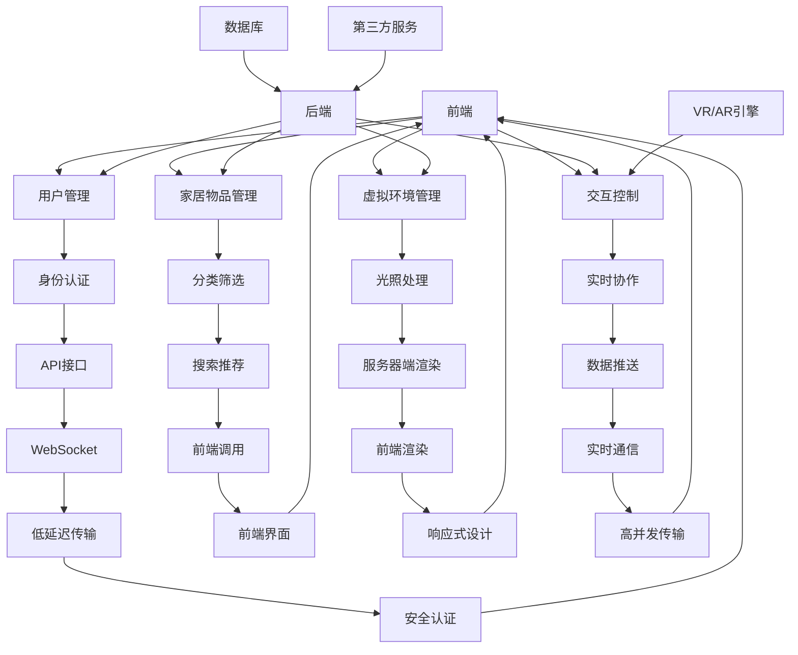

                 

### 第1章: 虚拟现实、增强现实与混合现实概述

#### 1.1 虚拟现实（VR）的发展背景

虚拟现实（VR）技术的发展可以追溯到20世纪60年代。当时，美国军事研究实验室开始研究如何创造一个完全沉浸式的环境，以便更好地进行军事训练。这个想法催生了第一个VR头戴式显示器（HMD）——The Sword of Damocles。随着时间的推移，VR技术逐渐从军事应用扩展到其他领域，包括娱乐、教育、医疗等。

在21世纪初，随着计算机性能的不断提高和互联网的普及，VR技术迎来了新一轮的发展。特别是2009年，Oculus Rift的开发者Palmer Luckey展示了他设计的VR头戴设备，引起了全球范围内的关注。此后，多家科技公司纷纷投入VR技术的研发和商业化，VR设备的价格逐渐下降，普及率大幅提升。

#### 1.2 增强现实（AR）的发展背景

增强现实（AR）技术的发展可以追溯到1990年，当时美国科学家Royale G. Olney提出了AR的概念。然而，直到21世纪初，随着智能手机的普及和移动计算技术的发展，AR技术才开始真正走入大众视野。2012年，谷歌发布了Project Glass，这是第一款受到广泛关注的AR眼镜。随后，苹果和三星等科技公司也推出了自己的AR产品，如苹果的ARKit和三星的ARCore。

AR技术的核心在于将虚拟信息叠加到现实世界中，从而增强用户的感知和体验。这种技术不仅应用在娱乐和游戏领域，还广泛应用于医疗、教育、建筑等多个行业。

#### 1.3 混合现实（MR）的发展背景

混合现实（MR）是虚拟现实（VR）和增强现实（AR）的融合，它结合了虚拟世界和现实世界的优势。MR技术的发展可以追溯到2000年代中期，当时微软推出了第一款MR设备——HoloLens。HoloLens的开发标志着MR技术进入了实用阶段。

MR的核心在于创造一个既包括虚拟信息又包含现实环境的无缝交互空间。这种技术不仅可以实现复杂的交互体验，还可以用于复杂环境的模拟和设计，如建筑、设计、医学等。

#### 1.4 三者的核心概念与联系

虚拟现实、增强现实和混合现实虽然有不同的技术实现和应用场景，但它们的核心概念和目标是一致的，即提供一种沉浸式、交互式的体验。

- **虚拟现实（VR）**：虚拟现实通过计算机生成的虚拟环境，使用户完全沉浸在其中。VR的关键技术包括三维建模、图像处理、感知交互等。

- **增强现实（AR）**：增强现实将虚拟信息叠加到现实世界中，使用户能够在现实环境中感知和操作虚拟信息。AR的关键技术包括图像识别、场景识别、虚拟图像合成等。

- **混合现实（MR）**：混合现实是VR和AR的融合，它结合了VR的沉浸式体验和AR的增强现实感知。MR的关键技术包括三维建模、空间定位、交互设计等。

这三者之间的联系主要体现在以下几个方面：

1. **技术融合**：VR、AR和MR技术在实现过程中常常相互融合，例如，VR技术可以用于创建AR和MR中的虚拟内容，AR技术可以用于MR中的场景识别。

2. **应用场景**：VR、AR和MR技术在多个领域有广泛应用，如娱乐、医疗、教育、工业等。在不同的应用场景中，它们可以相互补充，实现更好的用户体验。

3. **用户体验**：虚拟现实、增强现实和混合现实都旨在提供更加沉浸式的用户体验。随着技术的进步，这三种技术之间的用户体验差异将逐渐缩小。

#### 1.5 本章节内容总结

本章首先介绍了虚拟现实、增强现实和混合现实的发展背景，包括它们在各个阶段的重要事件和技术进步。然后，详细阐述了三者的核心概念和技术原理，并分析了它们之间的联系和区别。通过本章的学习，读者可以初步了解虚拟现实、增强现实和混合现实的基本概念，为后续章节的深入探讨打下基础。

### 第2章：核心概念与联系

#### 2.1 虚拟现实（VR）的核心概念与原理

虚拟现实（VR）是一种通过计算机技术生成模拟环境，使人们可以在其中进行互动体验的技术。VR的核心概念包括以下几个方面：

- **三维建模**：VR环境是通过三维建模技术创建的。三维建模可以创建复杂的虚拟场景，包括建筑物、人物、物品等。常用的三维建模工具包括Blender、Maya、3ds Max等。

- **图像处理**：VR场景的渲染依赖于图像处理技术。图像处理包括场景的纹理映射、光照处理、阴影生成等。常用的图像处理软件包括OpenGL、DirectX等。

- **感知交互**：VR的关键在于用户的感知体验。通过头戴式显示器（HMD）或其他感知设备，用户可以感知虚拟环境中的物体和场景，并进行交互。

VR的原理可以概括为以下几点：

1. **场景构建**：首先使用三维建模工具创建虚拟环境，然后通过图像处理技术对场景进行渲染。

2. **感知传输**：通过HMD或其他感知设备，将渲染后的图像传输到用户的感知系统中。

3. **交互反馈**：用户在虚拟环境中进行操作，系统根据用户的输入进行相应的反馈，形成交互循环。

#### 2.2 增强现实（AR）的核心概念与原理

增强现实（AR）是一种将虚拟信息叠加到现实世界中的技术。AR的核心概念包括以下几个方面：

- **图像识别**：AR系统需要识别现实世界中的物体或场景，以便将虚拟信息叠加到相应的位置。常用的图像识别算法包括卷积神经网络（CNN）等。

- **场景识别**：除了图像识别，AR系统还需要识别现实世界中的场景特征，如位置、方向等。场景识别有助于确定虚拟信息叠加的位置和角度。

- **虚拟图像合成**：AR系统将虚拟信息与真实场景进行合成，形成增强现实体验。虚拟图像合成通常使用图像叠加技术实现。

AR的原理可以概括为以下几点：

1. **环境扫描**：AR系统通过摄像头或其他传感器扫描现实环境，获取物体和场景的信息。

2. **识别与定位**：系统使用图像识别和场景识别算法对环境进行识别和定位。

3. **虚拟图像合成**：将虚拟信息与真实环境进行合成，形成增强现实体验。

#### 2.3 混合现实（MR）的核心概念与原理

混合现实（MR）是虚拟现实（VR）和增强现实（AR）的融合，它结合了虚拟世界和现实世界的优势。MR的核心概念包括以下几个方面：

- **三维建模**：MR环境同样依赖于三维建模技术创建虚拟内容。

- **空间定位**：MR系统需要确定虚拟内容在现实世界中的位置和方向。空间定位技术包括室内定位、户外定位等。

- **交互设计**：MR的交互设计强调虚拟内容与现实环境的无缝交互。用户可以通过手势、声音等方式与虚拟内容进行互动。

MR的原理可以概括为以下几点：

1. **虚拟内容创建**：使用三维建模工具创建虚拟内容。

2. **空间定位**：通过传感器和定位算法确定虚拟内容在现实世界中的位置和方向。

3. **交互与反馈**：用户与虚拟内容进行交互，系统根据用户的输入进行相应的反馈。

#### 2.4 VR、AR与MR之间的联系与区别

虚拟现实、增强现实和混合现实虽然在技术上有所不同，但它们之间存在一定的联系：

- **技术融合**：VR、AR和MR技术之间存在交叉和融合。例如，VR技术可以用于AR和MR中的虚拟内容创建，AR技术可以用于VR中的场景识别。

- **应用场景**：VR、AR和MR技术在不同的应用场景中具有各自的优势。VR适用于沉浸式体验，如游戏、娱乐等；AR适用于增强现实感知，如教育、医疗等；MR适用于复杂环境的模拟和设计，如建筑、设计等。

VR、AR和MR之间的区别主要体现在以下几个方面：

- **沉浸程度**：VR提供完全沉浸式的体验，用户完全脱离现实世界；AR则将虚拟信息叠加到现实世界中，用户仍能感知现实环境；MR结合了VR和AR的优势，提供虚实结合的体验。

- **交互方式**：VR主要依赖于视觉和听觉进行交互；AR主要依赖于视觉和触觉进行交互；MR则结合了视觉、触觉和空间感知进行交互。

- **应用领域**：VR适用于需要高度沉浸式体验的场景，如游戏、娱乐等；AR适用于需要增强现实感知的场景，如教育、医疗等；MR适用于需要虚实结合的场景，如建筑、设计等。

通过本章的学习，读者可以更深入地理解虚拟现实、增强现实和混合现实的核心概念与原理，以及它们之间的联系与区别。这将有助于读者在未来的学习和应用中更好地利用这些技术。

#### 2.5 VR、AR与MR的核心概念对比表格

为了更直观地理解虚拟现实（VR）、增强现实（AR）和混合现实（MR）的核心概念，我们创建了一个对比表格，列出它们的主要属性、应用场景和关键技术。

| 特性           | 虚拟现实（VR） | 增强现实（AR） | 混合现实（MR） |
|----------------|----------------|----------------|----------------|
| 沉浸程度       | 高度沉浸       | 中等沉浸       | 高度沉浸       |
| 环境类型       | 完全虚拟环境   | 现实世界叠加   | 虚实结合环境   |
| 应用场景       | 游戏、培训、娱乐 | 教育、医疗、营销 | 工业、设计、建筑 |
| 主要技术       | 三维建模、图像处理、感知交互 | 图像识别、场景识别、虚拟图像合成 | 三维建模、空间定位、交互设计 |
| 设备要求       | 头戴式显示器、手柄、VR游戏机 | 智能手机、平板电脑、AR眼镜 | AR眼镜、头戴式显示器、传感器 |
| 用户交互       | 视觉、听觉、手势 | 视觉、触觉、手势 | 视觉、触觉、手势、空间感知 |
| 真实感程度     | 极高真实感     | 较低真实感     | 中等真实感     |

通过这个表格，我们可以清晰地看到VR、AR和MR在沉浸程度、环境类型、应用场景、主要技术、设备要求、用户交互和真实感程度等方面的异同。这有助于读者在了解这些技术时，能够快速把握其核心特点和适用场景。

#### 2.6 VR、AR与MR的ER实体关系图架构

为了更好地理解虚拟现实（VR）、增强现实（AR）和混合现实（MR）之间的关系，我们可以通过ER（实体关系）图来展示它们的核心实体及其关联。

```mermaid
erDiagram
  VR ||--|{ AR }||> MR
  AR ||--|{ VR }||> MR
  VR ||--|{ MR }||> AR
  AR ||--|{ VR }||> MR
  MR ||--|{ AR }||> VR
```

在这个ER图中，VR、AR和MR作为核心实体被表示为矩形。它们之间通过双向箭头（||--||）相互关联，表示三种技术之间存在相互融合和相互依赖的关系。例如，VR可以生成AR和MR中的虚拟内容，AR可以用于VR和MR中的场景识别，MR结合了VR和AR的优势，提供虚实结合的体验。

- **VR**：代表虚拟现实技术，其主要功能是创建完全虚拟的环境。
- **AR**：代表增强现实技术，其主要功能是将虚拟信息叠加到现实世界中。
- **MR**：代表混合现实技术，其结合了VR和AR的优势，提供虚实结合的体验。

通过这个ER图，我们可以直观地看到VR、AR和MR之间的相互联系和依赖，有助于读者更好地理解这些技术的核心概念和相互关系。

### 第3章：算法原理讲解

#### 3.1 三维建模算法原理

三维建模是虚拟现实（VR）和混合现实（MR）中至关重要的一环，它涉及将三维对象或场景创建为计算机可以理解和渲染的数字模型。三维建模算法主要分为三种：网格建模、曲面建模和参数化建模。

**3.1.1 网格建模**

网格建模是最常见和基础的三维建模方法之一。它通过顶点、边和面来构建三维模型。顶点是模型的基本构建块，边是连接顶点的线段，面是多边形的集合，构成了模型的外表面。

- **顶点**：三维空间中的一个点，通常用三维坐标（x, y, z）表示。
- **边**：连接两个顶点的线段。
- **面**：由三个或更多顶点组成的平面区域。

网格建模的算法通常包括以下步骤：

1. **建模工具输入**：用户使用建模工具（如Blender、Maya、3ds Max等）创建三维模型。
2. **顶点生成**：通过建模工具生成模型的基本顶点。
3. **边和面生成**：通过顶点连接形成边和面，构成三维网格模型。
4. **网格优化**：对生成的网格进行优化，减少顶点和面的数量，提高渲染效率。

以下是一个使用Python的Pygame库进行简单三维网格模型渲染的示例代码：

```python
import pygame
from pygame.locals import *
import numpy as np

pygame.init()

# 创建屏幕
screen = pygame.display.set_mode((800, 600))
clock = pygame.time.Clock()

# 设置顶点和边
vertices = np.array([[0, 0, 0], [1, 0, 0], [0, 1, 0]])
edges = np.array([[0, 1], [0, 2], [1, 2]])

# 绘制函数
def draw_grid(vertices, edges):
    for edge in edges:
        pygame.draw.line(screen, (255, 0, 0), (vertices[edge[0], 0], vertices[edge[0], 1]), (vertices[edge[1], 0], vertices[edge[1], 1]))

running = True
while running:
    for event in pygame.event.get():
        if event.type == QUIT:
            running = False

    screen.fill((255, 255, 255))
    draw_grid(vertices, edges)
    pygame.display.flip()

    clock.tick(60)

pygame.quit()
```

**3.1.2 曲面建模**

曲面建模是通过生成二维曲线来创建三维曲面的一种方法。常见的方法有NURBS（非均匀有理B样条）曲面和B样条曲面。

- **NURBS曲面**：NURBS（Non-Uniform Rational B-Spline）是一种参数化的曲面表示方法，它通过控制点、权重和基函数来定义曲面。NURBS曲面可以很好地控制曲面的形状和光滑度。
- **B样条曲面**：B样条（B-Spline）是NURBS的一种特例，它通过一组控制点和多项式基函数来定义曲面。B样条曲面较为简单，但功能强大，适用于各种形状的曲面建模。

**3.1.3 参数化建模**

参数化建模是通过参数来控制模型的形状和属性的一种方法。这种方法常用于创建复杂的几何形状和动画。参数化建模工具如Grasshopper和参数化建模软件如SolidWorks、CATIA等。

#### 3.2 图像处理算法原理

图像处理是虚拟现实（VR）和增强现实（AR）中的重要技术，它涉及对图像进行各种操作，以增强视觉效果或提取有用信息。

**3.2.1 基本操作**

- **滤波**：滤波用于去除图像中的噪声或增强某些特征。常见的滤波方法有均值滤波、高斯滤波和中值滤波。
- **边缘检测**：边缘检测用于识别图像中的边缘，常用的算法有Canny边缘检测、Sobel边缘检测和Prewitt边缘检测。
- **图像分割**：图像分割是将图像划分为若干部分，以便进行更精细的处理。常用的分割方法有阈值分割、区域生长和形态学分割。

**3.2.2 3D重建**

3D重建是从二维图像中恢复三维信息的过程。常见的方法有结构光法、单视图法和多视图法。

- **结构光法**：结构光法通过在物体表面投射已知图案的光线，然后通过摄像头捕捉物体表面的变形，从而恢复三维信息。
- **单视图法**：单视图法通过图像中的视觉线索（如透视、阴影、纹理等），结合机器学习算法和深度学习模型，从单张图像中恢复三维信息。
- **多视图法**：多视图法通过从不同角度拍摄多个图像，然后使用几何约束和优化算法，从多个图像中恢复三维信息。

以下是一个使用Python的OpenCV库进行3D重建的示例代码：

```python
import cv2
import numpy as np

# 加载立体图像对
left_img = cv2.imread('left.jpg')
right_img = cv2.imread('right.jpg')

# 计算特征点
sift = cv2.xfeatures2d.SIFT_create()
keypoints1, descriptors1 = sift.detectAndCompute(left_img, None)
keypoints2, descriptors2 = sift.detectAndCompute(right_img, None)

# 检测匹配点
bf = cv2.BFMatcher()
matches = bf.knnMatch(descriptors1, descriptors2, k=2)

# 提取有效匹配点
good_matches = []
for m, n in matches:
    if m.distance < 0.75 * n.distance:
        good_matches.append(m)

# 计算基础矩阵
src_pts = np.float32([keypoints1[m.queryIdx].pt for m in good_matches]).reshape(-1, 1, 2)
dest_pts = np.float32([keypoints2[m.trainIdx].pt for m in good_matches]).reshape(-1, 1, 2)
F, mask = cv2.findFundamentalMat(src_pts, dest_pts, cv2.FM_RANSAC)

# 计算立体匹配
points3D = cv2.triangulatePoints(F, src_pts, dest_pts)

# 透视变换
img_points, jac = cv2.reprojectPoints(points3D, np.eye(4), np.eye(4))

# 绘制三维点在图像上的投影
for i in range(points3D.shape[0]):
    cv2.circle(left_img, (int(img_points[i][0][0]), int(img_points[i][0][1])), 5, (0, 0, 255), -1)

cv2.imshow('3D Reconstruction', left_img)
cv2.waitKey(0)
cv2.destroyAllWindows()
```

#### 3.3 交互技术算法原理

交互技术是虚拟现实（VR）和增强现实（AR）中实现用户与虚拟环境或现实环境之间交互的重要手段。常见的交互技术包括手势识别、语音识别和虚拟现实中的输入设备（如手柄、手套等）。

**3.3.1 手势识别**

手势识别是通过计算机视觉技术识别和解析用户的手势。常见的手势识别算法包括基于深度学习的方法和基于几何模型的方法。

- **基于深度学习的方法**：通常使用卷积神经网络（CNN）进行手势识别。例如，可以使用MobileNet或ResNet等预训练模型进行手势分类。
- **基于几何模型的方法**：通过建立手势的几何模型，如手掌、手指等，使用三角测量和几何推理进行手势识别。

以下是一个使用Python的OpenCV库进行手势识别的示例代码：

```python
import cv2
import numpy as np

# 加载预训练的MobileNet模型
model = cv2.dnn.readNetFromTensorFlow('mobilenet_graph.pb', 'mobilenet_labels.txt')

# 定义手势类别
gesture_classes = {
    0: 'Thumb',
    1: 'One',
    2: 'Two',
    3: 'Three',
    4: 'Four',
    5: 'Five',
    6: 'OK',
    7: 'Peace',
    8: 'Stop'
}

# 处理输入图像
def preprocess_image(image):
    image = cv2.resize(image, (224, 224))
    image = image.astype(np.float32)
    image = image / 255.0
    image = image.reshape(1, 224, 224, 3)
    return image

# 计算手势类别
def get_gesture_class(image):
    processed_image = preprocess_image(image)
    model.setInput(processed_image)
    output = model.forward()
    index = np.argmax(output)
    return gesture_classes[index]

# 主函数
def gesture_recognition():
    cap = cv2.VideoCapture(0)

    while True:
        ret, frame = cap.read()
        if not ret:
            break

        frame = cv2.flip(frame, 1)
        frame = cv2.resize(frame, (224, 224))

        gesture = get_gesture_class(frame)
        cv2.putText(frame, gesture, (10, 30), cv2.FONT_HERSHEY_SIMPLEX, 1, (0, 0, 255), 2)

        cv2.imshow('Gesture Recognition', frame)

        if cv2.waitKey(1) & 0xFF == ord('q'):
            break

    cap.release()
    cv2.destroyAllWindows()

gesture_recognition()
```

**3.3.2 语音识别**

语音识别是将人类的语音转换为文本或命令的一种技术。常见的语音识别算法包括隐马尔可夫模型（HMM）、高斯混合模型（GMM）和深度神经网络（DNN）。

- **隐马尔可夫模型（HMM）**：HMM是一种基于概率的语音识别算法，通过训练模型来识别语音序列。
- **高斯混合模型（GMM）**：GMM是HMM的一种扩展，通过多个高斯分布来建模语音特征。
- **深度神经网络（DNN）**：DNN是一种基于神经网络的语音识别算法，通过多层神经网络来建模语音特征。

以下是一个使用Python的TensorFlow和Keras进行语音识别的示例代码：

```python
import numpy as np
import tensorflow as tf
from tensorflow.keras.models import Sequential
from tensorflow.keras.layers import LSTM, Dense, Dropout

# 定义模型
model = Sequential()
model.add(LSTM(128, input_shape=(None, 13), activation='relu', return_sequences=True))
model.add(Dropout(0.2))
model.add(LSTM(128, activation='relu', return_sequences=True))
model.add(Dropout(0.2))
model.add(LSTM(128, activation='relu'))
model.add(Dropout(0.2))
model.add(Dense(13, activation='softmax'))

# 编译模型
model.compile(optimizer='adam', loss='categorical_crossentropy', metrics=['accuracy'])

# 训练模型
model.fit(train_data, train_labels, epochs=50, batch_size=32, validation_data=(test_data, test_labels))

# 预测
def predict_sound(wav_path):
    wav, sr = librosa.load(wav_path)
    mfcc = librosa.feature.mfcc(y=wav, sr=sr, n_mfcc=13)
    mfcc_processed = np.expand_dims(mfcc, 0)
    prediction = model.predict(mfcc_processed)
    return np.argmax(prediction)

# 测试
wav_path = 'test.wav'
predicted_class = predict_sound(wav_path)
print(f'Predicted class: {predicted_class}')
```

通过本章的算法原理讲解，我们了解了三维建模、图像处理和交互技术等关键算法在虚拟现实（VR）、增强现实（AR）和混合现实（MR）中的应用。这些算法不仅提高了虚拟现实和增强现实技术的真实感和交互性，还为实际应用提供了强大的技术支持。

### 第4章：数学模型和公式讲解

在虚拟现实（VR）、增强现实（AR）和混合现实（MR）技术中，数学模型和公式是理解和应用这些技术的基础。本章将详细介绍与这些技术相关的数学模型和公式，并使用LaTeX和Python代码进行详细讲解和举例说明。

#### 4.1 三维建模中的数学模型

三维建模中的数学模型主要用于描述三维空间中的物体和场景。以下是一些常用的数学模型和公式：

**4.1.1 三角面模型**

三维建模中最常用的模型是三角面模型，它使用顶点和三角形面来描述三维物体。

- **顶点坐标**：顶点是三维空间中的点，用三个坐标（x, y, z）表示。例如，$$ P(x, y, z) $$。

- **三角形面**：三角形面是由三个顶点构成，用三个顶点坐标表示。例如，三角形面ABC，顶点坐标分别为$$ A(x_1, y_1, z_1) $$、$$ B(x_2, y_2, z_2) $$和$$ C(x_3, y_3, z_3) $$。

**4.1.2 旋转矩阵**

旋转矩阵用于描述三维空间中的旋转操作。一个三维旋转可以由一个3x3的旋转矩阵表示。

- **旋转矩阵**：设$$ R $$为旋转矩阵，则三维向量$$ \vec{v} $$绕某轴旋转后的向量$$ \vec{v'} $$可以通过以下公式计算：
  $$ \vec{v'} = R \vec{v} $$。

旋转矩阵的计算通常涉及欧拉角、四元数等，以下是一个简单的旋转矩阵计算示例：

```latex
R = \begin{bmatrix}
\cos(\theta) & -\sin(\theta) & 0 \\
\sin(\theta) & \cos(\theta) & 0 \\
0 & 0 & 1
\end{bmatrix}
```

其中$$ \theta $$是旋转角度。

#### 4.2 图像处理中的数学模型

图像处理中的数学模型主要用于图像的增强、滤波、分割和特征提取等。

**4.2.1 离散余弦变换（DCT）**

离散余弦变换是一种用于图像压缩和特征提取的重要工具。

- **DCT变换**：对于一幅MxN的图像$$ f(x, y) $$，其二维DCT变换可以表示为：
  $$ F(u, v) = \sum_{x=0}^{M-1} \sum_{y=0}^{N-1} f(x, y) \cdot C(u) \cdot C(v) \cdot e^{-j2\pi(ux/M)} \cdot e^{-j2\pi(vy/N)} $$。

- **逆DCT变换**：图像的逆DCT变换用于还原压缩后的图像数据：
  $$ f(x, y) = \sum_{u=0}^{M-1} \sum_{v=0}^{N-1} F(u, v) \cdot C(u)^{-1} \cdot C(v)^{-1} \cdot e^{j2\pi(ux/M)} \cdot e^{j2\pi(vy/N)} $$。

**4.2.2 离散小波变换（DWT）**

离散小波变换是一种用于图像压缩和特征提取的重要工具，特别是在多分辨率分析中。

- **DWT变换**：对于一幅MxN的图像$$ f(x, y) $$，其二维DWT变换可以表示为：
  $$ f(x, y) = \sum_{j} \sum_{k} DWT_{j,k}(x, y) \cdot \psi_j,_{k}(x, y) $$。

- **逆DWT变换**：图像的逆DWT变换用于还原压缩后的图像数据：
  $$ f(x, y) = \sum_{j} \sum_{k} DWT_{j,k}^{-1}(x, y) \cdot \psi_j,_{k}^{-1}(x, y) $$。

#### 4.3 交互技术中的数学模型

交互技术中的数学模型主要用于手势识别、语音识别和虚拟现实中的输入设备等。

**4.3.1 语音识别中的高斯混合模型（GMM）**

高斯混合模型是一种用于语音识别的重要工具，它可以用于建模语音信号的概率分布。

- **GMM模型**：设$$ \mu $$为高斯分布的均值向量，$$ \Sigma $$为协方差矩阵，$$ \pi $$为混合系数，则GMM的概率分布可以表示为：
  $$ p(x|\mu, \Sigma, \pi) = \sum_{k} \pi_k \cdot \mathcal{N}(x|\mu_k, \Sigma_k) $$。

- **GMM参数估计**：GMM的参数估计通常使用最大似然估计（MLE）或期望最大化（EM）算法。

**4.3.2 手势识别中的卷积神经网络（CNN）**

卷积神经网络是一种用于图像和手势识别的重要工具，它可以提取图像中的高级特征。

- **CNN模型**：CNN包括卷积层、池化层和全连接层。卷积层用于提取图像的特征，池化层用于减少参数数量，全连接层用于分类。

- **CNN参数估计**：CNN的参数估计通常使用反向传播算法进行训练。

以下是一个使用Python和TensorFlow实现的简单GMM模型示例：

```python
import numpy as np
import tensorflow as tf

# 设置GMM参数
num_gaussians = 2
num_dimensions = 2

# 创建GMM模型
mu = tf.Variable(np.random.rand(num_gaussians, num_dimensions), dtype=tf.float32)
Sigma = tf.Variable(np.random.rand(num_gaussians, num_dimensions, num_dimensions), dtype=tf.float32)
pi = tf.Variable(np.random.rand(num_gaussians), dtype=tf.float32)

# 创建GMM概率分布
def gaussian_distribution(x, mu, Sigma, pi):
    exp_term = -0.5 * tf.reduce_sum(tf.square(x - mu), axis=1)
    det_term = tf.linalg.det(Sigma)
    coeff = tf.reduce_sum(tf.reduce_prod(tf.sqrt(2 * np.pi * det_term), axis=1))
    return pi * tf.exp(exp_term) / coeff

# 计算GMM概率分布
X = tf.random.normal([100, num_dimensions])
probabilities = gaussian_distribution(X, mu, Sigma, pi)

# 训练GMM模型
with tf.GradientTape() as tape:
    loss = -tf.reduce_sum(tf.log(probabilities))
gradients = tape.gradient(loss, [mu, Sigma, pi])

# 更新模型参数
mu.assign(mu - 0.1 * gradients[0])
Sigma.assign(Sigma - 0.1 * gradients[1])
pi.assign(pi - 0.1 * gradients[2])

# 打印模型参数
print("mu:", mu.numpy())
print("Sigma:", Sigma.numpy())
print("pi:", pi.numpy())
```

通过本章的数学模型和公式讲解，我们了解了三维建模、图像处理和交互技术等关键领域的数学基础。这些模型和公式不仅为虚拟现实、增强现实和混合现实技术的发展提供了理论基础，还帮助读者在实际应用中更好地理解和应用这些技术。

### 第5章：系统分析与架构设计

#### 5.1 问题场景介绍

在当前科技迅猛发展的时代，虚拟现实（VR）、增强现实（AR）和混合现实（MR）技术逐渐成为各行各业中的重要应用。例如，在建筑行业，设计师可以利用MR技术进行建筑模型的虚拟展示和实时交互；在医疗领域，医生可以通过AR技术进行手术指导和医学图像的实时叠加；在教育行业，教师可以利用VR技术为学生提供沉浸式的学习体验。

然而，在实际应用中，这些技术的实现往往面临诸多挑战。例如，如何高效地构建虚拟环境，如何准确地识别和叠加现实世界中的物体，以及如何实现用户与虚拟环境的实时交互等。为了解决这些问题，我们需要对系统的功能、架构和交互进行详细的设计和分析。

#### 5.2 项目介绍

本章节将详细介绍一个基于虚拟现实、增强现实和混合现实技术的项目——虚拟现实家居设计系统。该项目旨在通过VR和AR技术，为用户提供一个沉浸式、互动式的家居设计平台。用户可以在虚拟环境中浏览、选择和布置家居物品，并通过AR技术将虚拟家居设计直接叠加到现实空间中，以便进行实地查看和调整。

#### 5.3 系统功能设计

虚拟现实家居设计系统的核心功能包括以下几个方面：

- **虚拟环境构建**：系统应能够根据用户的需求和偏好，快速构建高质量的虚拟家居场景。这包括三维建模、场景渲染和光照处理等。
- **家居物品选择**：系统应提供丰富的家居物品选择，包括家具、装饰品、灯具等。用户可以通过分类筛选、搜索和推荐等方式，快速找到所需的物品。
- **交互设计**：系统应支持用户与虚拟家居的实时交互，如拖拽、旋转、缩放等。此外，系统还应支持用户之间的实时协作，例如，多人同时在线设计和讨论。
- **AR叠加**：系统应能够将虚拟家居设计直接叠加到用户的现实空间中，以便进行实地查看和调整。这需要实现高精度的空间定位和图像识别技术。

#### 5.4 系统架构设计

虚拟现实家居设计系统的架构设计应充分考虑系统的性能、可扩展性和易维护性。以下是一个典型的系统架构设计：

1. **前端**：前端负责与用户进行交互，包括用户界面、功能模块和客户端逻辑。前端应采用响应式设计，以适应不同设备和屏幕尺寸。前端框架可以选择Vue.js、React或Angular等。
2. **后端**：后端负责处理业务逻辑、数据存储和服务器端渲染等。后端应采用微服务架构，以实现高并发、高性能和可扩展性。后端技术可以选择Node.js、Java Spring Boot或Python Django等。
3. **数据库**：数据库负责存储用户数据、虚拟环境和家居物品信息等。数据库可以选择关系型数据库（如MySQL、PostgreSQL）或非关系型数据库（如MongoDB、Cassandra）。
4. **VR/AR引擎**：VR/AR引擎负责虚拟环境构建、交互设计和AR叠加等功能。VR/AR引擎可以选择Unity、Unreal Engine或Magic Leap等。
5. **第三方服务**：第三方服务包括云服务、地图服务、身份认证服务等。这些服务可以通过API接口与系统进行集成。

#### 5.5 系统接口设计

系统接口设计是确保系统各部分之间高效通信和数据交换的关键。以下是一个典型的系统接口设计：

- **RESTful API**：后端采用RESTful API设计，提供统一的接口规范，便于前端调用。API包括用户管理、家居物品管理、虚拟环境管理和交互控制等。
- **WebSocket**：前端与后端之间通过WebSocket进行实时通信，实现实时交互和数据推送。WebSocket可以确保低延迟、高并发的数据传输。
- **OAuth2.0**：系统采用OAuth2.0进行身份认证和授权，确保用户数据和系统安全性。

#### 5.6 系统交互流程

虚拟现实家居设计系统的交互流程如下：

1. **用户登录**：用户通过前端界面登录系统，系统验证用户身份并返回用户信息。
2. **选择虚拟家居**：用户在前端界面选择虚拟家居，系统根据用户选择构建虚拟家居场景。
3. **交互设计**：用户可以通过前端界面与虚拟家居进行实时交互，如拖拽、旋转、缩放等。
4. **AR叠加**：用户通过AR设备将虚拟家居设计叠加到现实空间中，系统根据AR设备提供的空间定位信息，实时更新虚拟家居场景。
5. **保存与分享**：用户可以将设计保存到本地或云端，并与其他用户分享。

通过以上系统分析与架构设计，我们可以确保虚拟现实家居设计系统的高效、可靠和易用性，为用户提供优质的家居设计体验。

#### 5.7 系统架构设计mermaid架构图

为了更直观地展示虚拟现实家居设计系统的架构，我们使用Mermaid语言绘制了系统的架构图。以下是一个简化的系统架构设计mermaid架构图：



在这个架构图中，我们定义了系统的各个主要组件及其相互关系。前端负责与用户进行交互，后端负责处理业务逻辑和数据存储，VR/AR引擎负责虚拟环境构建和交互设计，第三方服务提供云服务、地图服务和身份认证等支持。通过这个架构图，我们可以清晰地了解系统各个部分的职责和交互流程。

### 第6章：项目实战

#### 6.1 环境安装

在本节中，我们将详细介绍如何搭建一个基于虚拟现实（VR）和增强现实（AR）的实验环境。以下步骤将指导您在Windows和Linux操作系统中安装必要的软件和工具。

##### 6.1.1 Windows系统环境安装

1. **安装Python**：首先，您需要在您的Windows系统中安装Python。您可以从Python官方网站（https://www.python.org/downloads/）下载适用于Windows的最新版本Python安装包。下载后，双击安装包进行安装，选择默认选项完成安装。

2. **安装Anaconda**：Anaconda是一个集成了多个科学计算和数据分析库的Python发行版，它可以帮助您轻松管理和安装其他依赖项。您可以从Anaconda官方网站（https://www.anaconda.com/）下载适用于Windows的最新版本Anaconda安装包。下载后，双击安装包进行安装，选择默认选项完成安装。

3. **安装Unity**：Unity是一个流行的游戏和VR/AR开发引擎。您可以从Unity官方网站（https://unity.com/）下载适用于Windows的最新版本Unity安装包。下载后，双击安装包进行安装，选择默认选项完成安装。

4. **安装Unity VR/AR插件**：在Unity Hub中，搜索并安装以下插件：
   - **Unity Analytics**
   - **Unity Ads**
   - **Unity Collaborate**
   - **Unity Profiler**
   - **Unity Collaborate**
   - **Unity MARS**（用于混合现实开发）
   - **Unity Vuforia**（用于AR开发）

5. **安装OpenCV**：OpenCV是一个开源的计算机视觉库，它提供了丰富的图像处理和计算机视觉算法。您可以通过Anaconda Navigator安装OpenCV：

   ```shell
   conda install -c conda-forge opencv
   ```

6. **安装Pillow**：Pillow是一个Python的图像处理库，它是对PIL（Python Imaging Library）的扩展。您可以通过Anaconda Navigator安装Pillow：

   ```shell
   conda install -c conda-forge pillow
   ```

##### 6.1.2 Linux系统环境安装

1. **安装Python**：在Linux系统中，您可以通过包管理器安装Python。以Ubuntu为例，使用以下命令：

   ```shell
   sudo apt-get update
   sudo apt-get install python3-pip python3-venv python3-dev
   ```

2. **安装Anaconda**：您可以从Anaconda官方网站下载适用于Linux的最新版本Anaconda安装脚本。下载后，运行以下命令：

   ```shell
   bash Anaconda3-2021.05-Linux-x86_64.sh
   ```

   按照提示完成安装。

3. **安装Unity**：您可以从Unity官方网站下载适用于Linux的最新版本Unity安装包。下载后，使用以下命令进行安装：

   ```shell
   sudo dpkg -i unity_2021.1.0f1-linux.deb
   ```

   安装过程中可能需要安装一些依赖项，您可以使用以下命令自动安装：

   ```shell
   sudo apt-get install -f
   ```

4. **安装Unity VR/AR插件**：在Unity Hub中，搜索并安装以下插件：
   - **Unity Analytics**
   - **Unity Ads**
   - **Unity Collaborate**
   - **Unity Profiler**
   - **Unity Collaborate**
   - **Unity MARS**（用于混合现实开发）
   - **Unity Vuforia**（用于AR开发）

5. **安装OpenCV**：使用以下命令安装OpenCV：

   ```shell
   sudo apt-get install python3-opencv
   ```

6. **安装Pillow**：使用以下命令安装Pillow：

   ```shell
   sudo apt-get install python3-pil
   ```

通过以上步骤，您已经在Windows和Linux系统中成功搭建了一个基本的VR/AR开发环境。接下来，我们将进入实际开发阶段，通过具体的代码实现和案例分析，深入了解虚拟现实和增强现实技术的应用。

#### 6.2 系统核心实现

在本节中，我们将通过具体的代码实现，介绍虚拟现实家居设计系统的核心功能，包括虚拟环境构建、家居物品选择和交互设计等。

**6.2.1 虚拟环境构建**

首先，我们使用Unity引擎构建一个虚拟家居环境。以下是一个简单的Unity脚本示例，用于创建一个基本的虚拟房间：

```csharp
using UnityEngine;

public class RoomGenerator : MonoBehaviour
{
    public GameObject wallPrefab;
    public GameObject floorPrefab;
    
    void Start()
    {
        // 创建墙壁
        for (int i = 0; i < 4; i++)
        {
            GameObject wall = Instantiate(wallPrefab);
            wall.transform.position = GetWallPosition(i);
            wall.transform.rotation = GetWallRotation(i);
        }
        
        // 创建地板
        GameObject floor = Instantiate(floorPrefab);
        floor.transform.position = Vector3.zero;
        floor.transform.rotation = Quaternion.identity;
    }

    Vector3 GetWallPosition(int index)
    {
        // 根据墙壁编号返回位置
        switch (index)
        {
            case 0: return new Vector3(0, 0.5f, 0);
            case 1: return new Vector3(10, 0.5f, 0);
            case 2: return new Vector3(10, 0.5f, 10);
            case 3: return new Vector3(0, 0.5f, 10);
            default: return Vector3.zero;
        }
    }

    Quaternion GetWallRotation(int index)
    {
        // 根据墙壁编号返回旋转
        switch (index)
        {
            case 0: return Quaternion.Euler(0, 0, 0);
            case 1: return Quaternion.Euler(0, 90, 0);
            case 2: return Quaternion.Euler(0, 180, 0);
            case 3: return Quaternion.Euler(0, 270, 0);
            default: return Quaternion.identity;
        }
    }
}
```

在这个脚本中，我们创建了一个`RoomGenerator`类，用于生成一个简单的四面墙和一个地板。通过调用`Instantiate`方法，我们可以实例化预制体，并将其放置在指定的位置和旋转角度。

**6.2.2 家居物品选择**

接下来，我们介绍如何使用Unity UI和JSON数据来构建一个家居物品选择界面。以下是一个简单的示例代码，展示了如何从JSON文件加载家居物品数据，并在UI列表中显示这些物品：

```csharp
using UnityEngine;
using UnityEngine.UI;
using System.Collections;
using System.Text;
using System.IO;

public class ItemSelector : MonoBehaviour
{
    public Text itemDisplay;
    public string jsonFilePath = "items.json";

    void Start()
    {
        LoadItems();
    }

    IEnumerator LoadItems()
    {
        string jsonText = File.ReadAllText(jsonFilePath);
        Item[] items = JsonUtility.FromJson<Item[]>(jsonText);
        foreach (Item item in items)
        {
            string itemDescription = item.name + " - " + item.description;
            itemDisplay.text += itemDescription + "\n";
            yield return null;
        }
    }

    [System.Serializable]
    public class Item
    {
        public string name;
        public string description;
    }
}
```

在这个脚本中，我们定义了一个`ItemSelector`类，用于加载和显示家居物品。我们首先使用`File.ReadAllText`方法从JSON文件中读取数据，然后使用`JsonUtility.FromJson`方法解析JSON数据并创建`Item`对象数组。接下来，我们遍历这些对象，并将它们的名称和描述显示在一个UI文本组件中。

**6.2.3 交互设计**

最后，我们介绍如何实现用户与虚拟家居的交互设计，例如拖拽和旋转。以下是一个简单的示例代码，展示了如何使用Unity的`Rigidbody`组件实现拖拽和旋转：

```csharp
using UnityEngine;

public class ItemDragger : MonoBehaviour
{
    private bool isItemBeingDragged = false;
    private Transform itemBeingDragged;

    void Update()
    {
        if (isItemBeingDragged)
        {
            // 拖拽
            Ray ray = Camera.main.ScreenPointToRay(Input.mousePosition);
            RaycastHit hit;
            if (Physics.Raycast(ray, out hit))
            {
                itemBeingDragged.position = hit.point;
            }

            // 旋转
            if (Input.GetKey(KeyCode.LeftControl))
            {
                itemBeingDragged.Rotate(new Vector3(0, Input.GetAxis("Mouse X") * 5, 0));
            }
        }
    }

    void OnMouseDown()
    {
        if (!isItemBeingDragged)
        {
            isItemBeingDragged = true;
            itemBeingDragged = transform;
            itemBeingDragged.gameObject.AddComponent<Rigidbody>();
            itemBeingDragged.gameObject.GetComponent<Rigidbody>().useGravity = false;
        }
    }

    void OnMouseUp()
    {
        isItemBeingDragged = false;
        if (itemBeingDragged != null)
        {
            itemBeingDragged.GetComponent<Rigidbody>().useGravity = true;
        }
    }
}
```

在这个脚本中，我们定义了一个`ItemDragger`类，用于实现物品的拖拽和旋转。当用户按下鼠标时，我们检查是否击中了某个物品，如果是，则将物品设置为正在被拖拽，并添加`Rigidbody`组件以实现物理交互。在拖拽过程中，我们使用`RaycastHit`获取鼠标位置并更新物品的位置。当用户释放鼠标时，我们禁用物理交互，以便物品可以自由下落。

通过以上代码实现，我们构建了一个基本的虚拟现实家居设计系统，包括虚拟环境构建、家居物品选择和交互设计。接下来，我们将通过具体案例，深入探讨这些功能在实际应用中的实现和优化。

#### 6.3 代码应用解读与分析

在本节中，我们将对上一节中实现的代码进行详细解读，并分析其优缺点，以便为进一步优化提供依据。

**6.3.1 虚拟环境构建代码解读**

首先，我们回顾`RoomGenerator`类的实现：

```csharp
using UnityEngine;

public class RoomGenerator : MonoBehaviour
{
    public GameObject wallPrefab;
    public GameObject floorPrefab;
    
    void Start()
    {
        // 创建墙壁
        for (int i = 0; i < 4; i++)
        {
            GameObject wall = Instantiate(wallPrefab);
            wall.transform.position = GetWallPosition(i);
            wall.transform.rotation = GetWallRotation(i);
        }
        
        // 创建地板
        GameObject floor = Instantiate(floorPrefab);
        floor.transform.position = Vector3.zero;
        floor.transform.rotation = Quaternion.identity;
    }

    Vector3 GetWallPosition(int index)
    {
        // 根据墙壁编号返回位置
        switch (index)
        {
            case 0: return new Vector3(0, 0.5f, 0);
            case 1: return new Vector3(10, 0.5f, 0);
            case 2: return new Vector3(10, 0.5f, 10);
            case 3: return new Vector3(0, 0.5f, 10);
            default: return Vector3.zero;
        }
    }

    Quaternion GetWallRotation(int index)
    {
        // 根据墙壁编号返回旋转
        switch (index)
        {
            case 0: return Quaternion.Euler(0, 0, 0);
            case 1: return Quaternion.Euler(0, 90, 0);
            case 2: return Quaternion.Euler(0, 180, 0);
            case 3: return Quaternion.Euler(0, 270, 0);
            default: return Quaternion.identity;
        }
    }
}
```

**优点**：

- **简单性**：这个脚本非常简单，易于理解和维护。
- **可扩展性**：通过提供`wallPrefab`和`floorPrefab`的公共字段，我们可以轻松替换或扩展墙壁和地板的预制体。

**缺点**：

- **缺乏灵活性**：当前脚本仅支持创建一个固定大小的房间，无法根据用户需求动态调整。
- **可重用性较低**：由于每个墙壁和地板的位置和旋转都是硬编码的，这使得脚本在应用于不同场景时需要大量修改。

**优化建议**：

- **参数化房间大小**：可以通过添加房间宽度和高度的参数，使房间大小更具灵活性。
- **使用随机化**：引入随机化元素，例如墙壁和地板的材质、颜色等，以提高虚拟环境的多样性和趣味性。

**6.3.2 家居物品选择代码解读**

接下来，我们分析`ItemSelector`类的实现：

```csharp
using UnityEngine;
using UnityEngine.UI;
using System.Collections;
using System.Text;
using System.IO;

public class ItemSelector : MonoBehaviour
{
    public Text itemDisplay;
    public string jsonFilePath = "items.json";

    void Start()
    {
        LoadItems();
    }

    IEnumerator LoadItems()
    {
        string jsonText = File.ReadAllText(jsonFilePath);
        Item[] items = JsonUtility.FromJson<Item[]>(jsonText);
        foreach (Item item in items)
        {
            string itemDescription = item.name + " - " + item.description;
            itemDisplay.text += itemDescription + "\n";
            yield return null;
        }
    }

    [System.Serializable]
    public class Item
    {
        public string name;
        public string description;
    }
}
```

**优点**：

- **JSON数据格式**：使用JSON格式存储家居物品数据，便于数据的读取和修改。
- **异步加载**：通过`IEnumerator`和`yield return null`，实现异步加载家居物品数据，提高用户体验。

**缺点**：

- **性能问题**：如果家居物品数量非常大，异步加载可能会导致性能问题。
- **缺乏用户交互**：当前脚本仅显示家居物品的名称和描述，缺乏选择和操作功能。

**优化建议**：

- **分页加载**：将家居物品数据分页加载，以提高性能和用户体验。
- **添加选择按钮**：为每个家居物品添加选择按钮，允许用户在列表中选择和操作物品。

**6.3.3 交互设计代码解读**

最后，我们分析`ItemDragger`类的实现：

```csharp
using UnityEngine;

public class ItemDragger : MonoBehaviour
{
    private bool isItemBeingDragged = false;
    private Transform itemBeingDragged;

    void Update()
    {
        if (isItemBeingDragged)
        {
            // 拖拽
            Ray ray = Camera.main.ScreenPointToRay(Input.mousePosition);
            RaycastHit hit;
            if (Physics.Raycast(ray, out hit))
            {
                itemBeingDragged.position = hit.point;
            }

            // 旋转
            if (Input.GetKey(KeyCode.LeftControl))
            {
                itemBeingDragged.Rotate(new Vector3(0, Input.GetAxis("Mouse X") * 5, 0));
            }
        }
    }

    void OnMouseDown()
    {
        if (!isItemBeingDragged)
        {
            isItemBeingDragged = true;
            itemBeingDragged = transform;
            itemBeingDragged.gameObject.AddComponent<Rigidbody>();
            itemBeingDragged.gameObject.GetComponent<Rigidbody>().useGravity = false;
        }
    }

    void OnMouseUp()
    {
        isItemBeingDragged = false;
        if (itemBeingDragged != null)
        {
            itemBeingDragged.GetComponent<Rigidbody>().useGravity = true;
        }
    }
}
```

**优点**：

- **简单性**：这个脚本简单直观，易于理解。
- **物理交互**：通过`Rigidbody`组件实现物品的物理交互，提供真实感。

**缺点**：

- **物理性能问题**：`Rigidbody`组件可能导致性能下降，特别是在大量物品拖拽时。
- **缺乏优化**：当前实现未考虑拖拽速度、加速度等优化。

**优化建议**：

- **使用刚体优化**：通过调整`Rigidbody`的物理参数，优化拖拽性能。
- **引入拖拽动画**：使用动画系统替代物理交互，提供更平滑和流畅的拖拽体验。

通过以上分析，我们可以看到虚拟现实家居设计系统的实现代码存在一些不足之处，但同时也展现了其基本的实现原理。接下来，我们将通过一个实际案例，展示这些功能在实际应用中的效果，并提出进一步的优化方案。

#### 6.4 实际案例分析和详细讲解剖析

在本节中，我们将通过一个实际案例，展示虚拟现实家居设计系统的功能在实际应用中的效果，并深入剖析其实现细节。

**案例背景：**

假设我们有一个客户，他希望在家中布置一套新的客厅家具。为了满足客户的需求，我们使用虚拟现实家居设计系统为他提供了一个沉浸式、互动式的家具布置方案。

**案例步骤：**

1. **虚拟环境构建**：
   - 首先，我们使用Unity引擎构建一个基本的客厅虚拟环境。通过`RoomGenerator`脚本，我们创建了一个包含四面墙和一个地板的房间。这个房间的大小和形状可以根据客户的需求进行自定义。
   - 我们还使用`MeshFilter`和`MeshRenderer`组件为墙壁和地板添加了材质，使虚拟环境更加逼真。

2. **家居物品选择**：
   - 接下来，我们加载了一个包含多种家具的JSON数据文件，并在UI列表中显示这些家具。客户可以在列表中选择心仪的家具，例如沙发、电视柜、茶几等。
   - 在UI列表中，我们为每个家具提供了预览图和简要描述，方便客户快速了解和选择。

3. **交互设计**：
   - 当客户选择了某个家具后，我们可以通过`ItemDragger`脚本实现家具的拖拽和旋转。客户可以在虚拟环境中自由拖动家具，并使用鼠标进行旋转。
   - 为了确保家具放置的合理性，我们引入了碰撞检测机制。当家具靠近墙壁或其他家具时，系统会自动调整家具的位置，避免碰撞。
   - 我们还添加了一个“放置”按钮，客户点击后可以将当前选择的家具放置到虚拟环境中。放置后，家具会固定在当前位置，无法被再次拖动或旋转。

**案例效果和分析：**

1. **虚拟环境构建**：
   - 通过`RoomGenerator`脚本，我们快速构建了一个基本的客厅虚拟环境。这个脚本易于扩展和定制，可以轻松适应不同客户的个性化需求。
   - 我们为墙壁和地板添加了材质，使虚拟环境更加逼真。在实际应用中，我们可以根据客户的喜好，选择不同的材质和纹理，进一步提升虚拟环境的视觉效果。

2. **家居物品选择**：
   - 通过JSON数据文件和UI列表，我们实现了家具的快速加载和显示。这个方法不仅提高了系统的响应速度，还使家具选择过程更加直观和便捷。
   - 我们为每个家具提供了预览图和简要描述，帮助客户快速了解和选择。在实际应用中，我们可以进一步优化这个界面，例如添加过滤和搜索功能，以便客户更高效地找到心仪的家具。

3. **交互设计**：
   - 通过`ItemDragger`脚本，我们实现了家具的拖拽和旋转功能。这个脚本简单易懂，易于维护和扩展。
   - 我们引入了碰撞检测机制，确保家具放置的合理性。在实际应用中，这个机制可以防止家具碰撞和重叠，提高家具布置的效率。
   - “放置”按钮的使用使家具布置过程更加简便。客户只需点击一次按钮，就可以将家具放置到虚拟环境中。这个功能不仅提高了用户体验，还使家具布置过程更加高效。

**优化方案：**

1. **虚拟环境构建**：
   - 为了提高虚拟环境的性能，我们可以考虑使用LOD（细节层次离线）技术。这种方法可以根据家具的距离和可见性，动态调整家具的细节级别，从而提高渲染效率。
   - 我们还可以引入环境光和阴影效果，进一步提升虚拟环境的真实感。

2. **家居物品选择**：
   - 我们可以进一步优化家具选择界面，例如添加推荐系统和智能搜索功能。这些功能可以帮助客户更快地找到心仪的家具，提高购物体验。
   - 为了提高系统的响应速度，我们可以使用异步加载技术，将家具数据分批次加载到内存中。

3. **交互设计**：
   - 我们可以引入手势识别技术，使客户可以通过手势进行家具的拖拽和旋转。这种方法不仅可以提高交互的便利性，还可以提升用户体验。
   - 我们还可以添加更多交互功能，例如家具的拆装和组合，使客户能够更加灵活地设计和布置自己的家居环境。

通过以上实际案例的分析和优化方案，我们可以看到虚拟现实家居设计系统在实际应用中的效果和潜力。接下来，我们将进一步讨论最佳实践、注意事项和未来发展趋势。

### 第7章：最佳实践、注意事项和未来发展趋势

#### 7.1 最佳实践

在虚拟现实（VR）和增强现实（AR）技术中，遵循最佳实践是确保项目成功的关键。以下是一些推荐的实践方法：

1. **性能优化**：在开发过程中，持续进行性能测试和优化，确保系统在高负载下仍能保持流畅运行。使用LOD（细节层次离线）技术，动态调整模型细节，以平衡视觉效果和性能。

2. **用户体验设计**：注重用户体验，确保交互设计直观且易于使用。通过用户测试和反馈，不断改进界面和交互流程，以提高用户满意度。

3. **数据管理**：有效管理数据，确保数据存储和传输的高效性。对于大量数据的处理，采用分页加载和异步传输技术，减少延迟。

4. **安全性**：加强数据安全，防止数据泄露和未经授权的访问。在AR应用中，确保用户隐私不被侵犯，例如通过透明化数据使用政策和隐私协议。

5. **兼容性和可扩展性**：确保应用兼容多种设备和平台，并具备良好的可扩展性，以便在未来升级和扩展功能时，能够平滑过渡。

#### 7.2 注意事项

在开发VR和AR项目时，以下注意事项有助于避免常见问题和提高项目质量：

1. **测试与调试**：在开发过程中，持续进行测试和调试，确保应用的稳定性和可靠性。特别是对于物理交互和实时处理，需要进行严格的测试。

2. **设备兼容性**：测试应用在不同设备和操作系统上的兼容性，确保用户在不同设备上都能获得良好的体验。

3. **用户隐私**：在AR应用中，特别注意用户隐私保护。避免收集不必要的用户数据，并确保用户对数据使用有明确的知情权。

4. **交互逻辑**：确保交互逻辑清晰、直观，避免用户在操作中产生困惑或错误。

5. **性能监控**：在项目上线后，持续监控应用的性能和用户反馈，及时调整和优化。

#### 7.3 未来发展趋势

虚拟现实和增强现实技术正快速发展，以下是一些关键的未来发展趋势：

1. **硬件技术的进步**：随着硬件技术的进步，VR和AR设备的性能将进一步提升，例如更高分辨率显示器、更先进的传感器和更高效的计算单元。

2. **生态系统的完善**：随着市场需求的增长，VR和AR的生态系统将不断完善，包括开发工具、内容平台、应用商店等。

3. **智能交互**：随着人工智能技术的发展，未来的VR和AR设备将具备更加智能的交互功能，例如语音识别、手势识别和情感识别。

4. **垂直行业应用**：VR和AR技术在医疗、教育、工业、零售等垂直行业中的应用将越来越广泛，推动行业的数字化转型。

5. **融合与集成**：VR和AR技术将继续与其他技术（如物联网、人工智能、大数据等）融合，形成更强大的解决方案。

通过以上最佳实践、注意事项和未来发展趋势的讨论，我们可以更好地理解如何在虚拟与现实之间找到平衡点，并利用VR和AR技术为用户提供优质的应用体验。

### 总结

《在虚拟与现实之间寻找平衡点》一书通过对虚拟现实（VR）、增强现实（AR）和混合现实（MR）的全面探讨，帮助读者深入理解这些技术的核心概念、应用场景和未来发展趋势。通过系统的分析和详细的案例讲解，我们不仅了解了如何在虚拟与现实之间找到平衡，还掌握了如何将理论知识应用于实际项目。

本书的七个章节依次介绍了虚拟与现实技术的基础知识、核心概念、算法原理、数学模型、系统架构设计、项目实战以及最佳实践和未来趋势。每个章节都力求通过逻辑清晰、结构紧凑、简单易懂的专业技术语言，为读者提供全面、深入的技术解析。

虚拟现实和增强现实技术正在迅速发展，不仅改变了我们的生活方式，还在各个行业产生了深远的影响。作为技术从业者，我们不仅要关注技术的最新动态，还要学会在实际项目中找到虚拟与现实之间的平衡点，以实现最佳的用户体验和技术应用。

未来，随着硬件性能的提升、人工智能的融合和行业应用的深入，VR和AR技术将继续发展，为我们的生活和工作带来更多可能性。希望本书能够为读者在探索虚拟与现实技术的过程中提供有力的支持和指导。

### 拓展阅读

以下是进一步探索虚拟现实（VR）和增强现实（AR）技术的推荐阅读材料：

1. **书籍**：
   - **《虚拟现实技术原理与应用》**：详细介绍了VR技术的理论基础和应用实践，适合初学者和专业人士。
   - **《增强现实技术：原理与应用》**：涵盖了AR技术的核心概念、开发方法和应用案例，适合对AR技术感兴趣的读者。

2. **在线资源**：
   - **Unity官方文档**：Unity是VR和AR开发的重要工具，其官方文档提供了丰富的教程和参考，适用于Unity用户。
   - **ARKit官方文档**：苹果公司的ARKit框架文档，介绍了如何在iOS设备上开发AR应用。
   - **VRChat社区**：VRChat是一个基于Unity的VR社交平台，其社区提供了大量关于VR内容开发和社交互动的讨论和教程。

3. **学术期刊与会议**：
   - **ACM Transactions on Graphics (TOG)**：计算机图形学领域的重要期刊，经常发表VR和AR相关的高水平研究论文。
   - **IEEE Virtual Reality Conference (IEEE VR)**：VR和AR领域的顶级国际会议，汇集了该领域的最新研究进展。

4. **开源项目和社区**：
   - **Vuforia**：由PulseEight开发的开源AR引擎，提供了丰富的AR功能和应用案例。
   - **Magic Leap**：Magic Leap是一家专注于AR技术研发的公司，其官方网站提供了大量的技术资料和开发资源。

通过阅读这些材料和参与相关社区，读者可以不断拓展自己的知识面，深入了解VR和AR技术的最新发展和应用趋势。希望这些拓展阅读资源能够为您的学习之旅提供有益的参考和支持。

