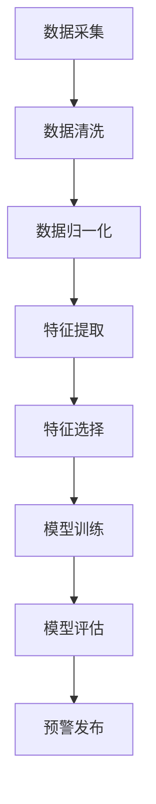
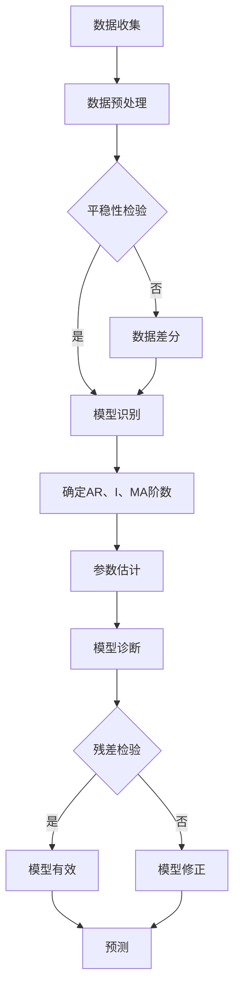
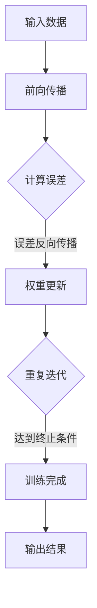
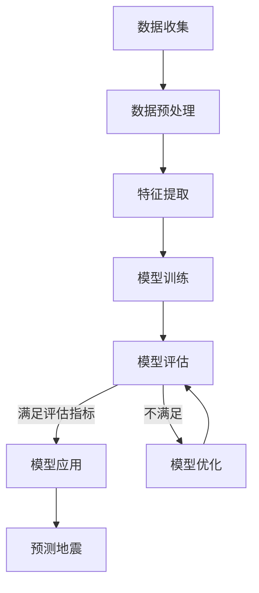
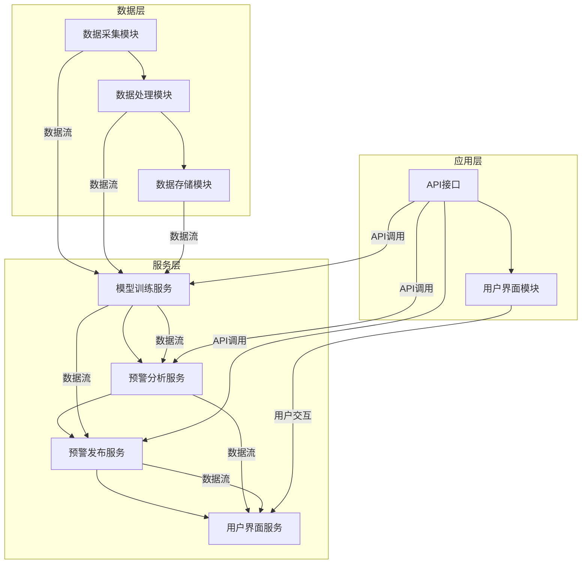
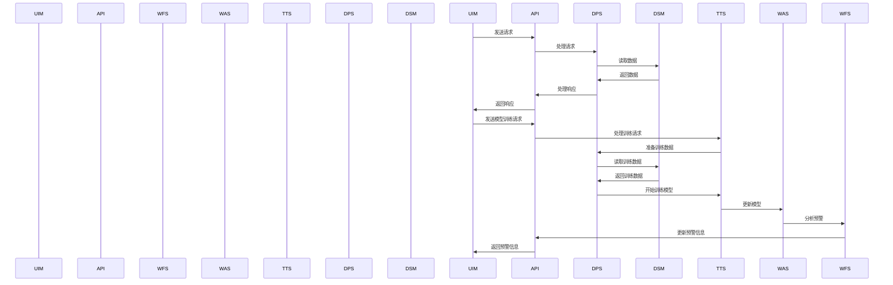

                 

### 第1章：地震预警的重要性与统计学习应用

#### 1.1 地震预警概述

地震，作为地球上一种常见的自然灾害，对人类社会造成巨大的破坏。因此，地震预警系统的研究显得尤为重要。地震预警，即在地震发生前，通过先进的监测技术和算法预测地震的发生，并提供预警信息，以便人们采取紧急措施，减少地震带来的伤害。

地震预警系统主要基于地震波的传播特性，通过监测不同类型的地震波（如P波、S波和表面波）的到达时间差来预测地震的发生。P波是最先到达的地震波，传播速度较快；S波紧随其后，传播速度较慢；表面波最后到达，但破坏力最强。通过测量这些地震波的到达时间差，可以估算地震的震中和震级，从而实现地震预警。

#### 1.2 统计学习在地震预警中的重要性

统计学习作为人工智能领域的一个重要分支，在地震预警中的应用具有显著的优势。统计学习通过分析历史地震数据，从中提取出潜在的规律和模式，进而预测未来地震的发生。这不仅可以提高预警的准确性，还可以优化预警系统的性能。

首先，统计学习能够处理大量的地震数据，这些数据包括地震的震中、震级、发生时间等。通过数据挖掘和分析，可以识别出地震发生的潜在规律，如地震序列、地震活动性等。这些规律对于地震预警系统的设计和优化具有重要意义。

其次，统计学习可以帮助优化地震预警算法。传统的地震预警算法通常基于地震波的传播特性和地震波的到达时间差。然而，随着地震数据量的增加和数据质量的提升，传统的预警算法难以应对复杂多变的地震环境。统计学习通过引入新的特征和模型，可以提高预警的准确性和鲁棒性。

最后，统计学习可以提升地震预警系统的实时性和响应能力。在地震预警系统中，实时性和响应能力是关键。统计学习算法的快速训练和模型更新能力，可以确保预警系统能够及时适应新的地震环境和数据变化，提高预警的效率和准确性。

总之，统计学习在地震预警中的应用，不仅提高了预警的准确性，还为地震预警系统的优化和发展提供了新的思路和方法。随着统计学习技术的不断进步，地震预警系统将更加智能和高效，为人类应对地震灾害提供更加有力的支持。

#### 2.1 地震预警的背景

地震预警系统的发展历程可以追溯到20世纪初期。早期的地震预警系统主要依靠地震仪的测量数据，通过简单的数据处理方法预测地震的发生。随着计算机技术和数据科学的发展，地震预警技术逐渐走向智能化和系统化。

1931年，日本建立了世界上第一个地震预警系统，该系统基于地震波的传播速度和时间差进行预警。随后，全球多个国家和地区纷纷建立了自己的地震预警系统，如美国、中国、意大利等。这些系统通过地面和地下地震台站的监测数据，实现对地震的快速预警。

地震预警系统的工作原理主要依赖于地震波的传播特性。地震波包括P波、S波和表面波，其中P波传播速度最快，S波次之，表面波传播速度最慢。当地震发生时，这些地震波会从震源向外传播。由于地震波的传播速度不同，不同类型的地震波会以不同的速度到达预警系统中的地震台站。

地震预警系统通过监测不同地震波到达时间差，结合地震波传播速度，计算出地震的震中和震级。当监测到P波到达后，预警系统会开始计时，当S波到达时，预警系统会停止计时。通过计算P波和S波的到达时间差，可以确定地震的震中位置。同时，通过分析地震波的振幅和频率等特性，可以估算地震的震级。

地震预警系统在地震发生前数秒到数十秒内，可以向预警区域内的公众发布预警信息，提醒人们采取紧急措施，减少地震造成的伤害。例如，在地震预警系统中，当检测到地震波后，系统会立即向相关部门、媒体和公众发送预警信息，同时启动应急预案，关闭天然气、电力等关键设施，疏散人群等。

然而，地震预警系统也面临一些挑战。首先，地震预警系统的准确性取决于地震波的传播特性和监测数据的质量。如果监测数据不足或者存在误差，预警系统的准确性会受到影响。其次，地震预警系统的响应速度也至关重要。在地震发生时，系统需要在最短时间内计算出地震的位置和震级，并及时发布预警信息。这需要高效的算法和强大的计算能力。

总之，地震预警系统在地震发生前提供预警信息，为人们采取紧急措施提供了宝贵的时间。尽管地震预警系统面临一些挑战，但随着技术的不断进步，其预警准确性和响应能力将不断提高，为人类抵御地震灾害提供更强有力的支持。

#### 2.2 地震预警系统的基本原理

地震预警系统的基本原理主要基于地震波的传播特性和监测数据的实时分析。地震波分为P波、S波和表面波，它们在地下和地表的传播速度不同。P波是最先到达的波，传播速度较快；S波紧随其后，传播速度较慢；表面波传播速度最慢，但破坏力最强。地震预警系统通过监测这些地震波的到达时间差，结合地震波的传播速度，实现对地震的快速预警。

首先，地震预警系统由一系列地震台站组成，这些台站分布在地震活动的潜在区域。每个地震台站配备有高精度的地震传感器，用于实时监测地震波的到来。当地震发生时，地震波会从震源向外传播，首先到达最近的地震台站。

当地震波到达地震台站时，地震传感器会记录下地震波的振幅、频率和到达时间。这些数据会被实时传输到预警系统的中央处理单元。中央处理单元会对接收到的地震波数据进行处理，计算出不同类型地震波的到达时间差。

根据地震波的传播速度和到达时间差，预警系统可以确定地震的震中和震级。具体来说，预警系统会使用已知的地震波传播速度表，将地震波到达时间差转换为地震的震中位置。同时，通过分析地震波的振幅和频率，预警系统可以估算地震的震级。

在确定地震的震中和震级后，预警系统会立即向相关部门、媒体和公众发布预警信息。通常，预警信息会包括地震的震中位置、震级、预计到达时间等关键信息。预警系统还可以根据预设的应急预案，启动相关设施的保护措施，如关闭天然气、电力等关键设施，疏散人群等。

地震预警系统的核心在于快速、准确地计算地震的震中和震级，并在地震波到达震中之前发布预警信息。这要求预警系统具有高效的算法和强大的计算能力，以确保预警信息的及时性和准确性。随着数据科学和人工智能技术的不断发展，地震预警系统在计算速度和精度上都有了显著的提升。

总之，地震预警系统的基本原理是通过监测地震波的传播特性，实时分析地震波数据，快速确定地震的震中和震级，并发布预警信息，为人们提供宝贵的应急时间。地震预警系统在地震灾害防范和减少人员伤亡方面发挥着重要作用。

#### 2.3 统计学习在地震预警中的应用

统计学习在地震预警中的应用，主要体现在以下几个方面：

首先，**数据预处理**是地震预警中至关重要的一步。地震预警系统需要处理大量的地震数据，这些数据通常包含噪声、缺失值和异常值。统计学习通过数据清洗、归一化、特征提取等技术，提高数据的质量和一致性，为后续的模型训练和预测打下坚实的基础。例如，可以使用数据填充算法填补缺失值，使用标准差归一化方法调整数据范围，使用主成分分析（PCA）提取关键特征等。

其次，**特征选择**在地震预警中同样至关重要。特征选择的过程，就是从大量的候选特征中筛选出对地震预警最为重要的特征，以提高模型的预测性能。统计学习通过相关性分析、特征重要性排序等方法，找出与地震预警密切相关的特征。例如，可以采用互信息（MI）方法评估特征之间的相关性，使用随机森林（RF）进行特征重要性排序，从而选择出最有用的特征。

在模型选择方面，**统计学习提供了丰富的模型选择工具**。不同的地震预警任务，可能需要使用不同的模型。例如，对于时间序列数据，可以使用ARIMA模型、LSTM神经网络等；对于分类任务，可以使用决策树、随机森林、支持向量机（SVM）等。统计学习通过交叉验证、网格搜索等技术，选择最适合当前任务的模型，并调优模型的参数，以提高预测的准确性。

模型评估是地震预警中的关键环节。评估的目的是检验模型的预测性能，确定模型是否达到预期的效果。统计学习提供了多种评估指标，如准确率、召回率、F1分数、均方误差（MSE）等。通过对比不同模型的评估结果，可以选择最优的模型，并对其进行优化和改进。

此外，统计学习还提供了强大的模型集成和迁移学习方法，可以进一步提高地震预警系统的性能。例如，可以通过集成学习（如随机森林、梯度提升树）将多个模型结合起来，提高预测的稳定性和准确性；通过迁移学习，利用已有的地震预警模型，对新区域或新的地震数据进行分析和预测，降低模型的训练成本和风险。

总之，统计学习在地震预警中的应用，不仅提高了数据处理的效率，还显著提升了模型的预测性能和系统的可靠性。通过数据预处理、特征选择、模型选择和模型评估等一系列步骤，统计学习为地震预警提供了强有力的技术支持，为人类应对地震灾害提供了更加有效的手段。

#### 3.1 数据预处理

数据预处理是统计学习中的一个关键步骤，尤其在地震预警系统中，这一步尤为重要。由于地震数据通常包含噪声、缺失值和异常值，因此，需要通过一系列的数据清洗、归一化和特征提取等技术，提高数据的质量和一致性。

首先，数据清洗是数据预处理的第一步。在地震预警系统中，数据清洗的主要任务是处理噪声和异常值。噪声通常是指数据中的随机误差，可以通过滤波技术进行去除。例如，可以使用均值滤波或中值滤波来平滑数据。异常值则是指数据中的异常点，这些点可能由于数据采集设备的故障或其他原因产生。异常值可能会导致模型的预测性能下降，因此需要特别处理。常用的方法包括使用统计学方法（如Z-score法、IQR法）检测异常值，并将其删除或替换。

其次，数据归一化是确保数据在不同特征尺度上具有可比性的重要步骤。在地震预警系统中，不同特征的尺度可能差异很大，如果不进行归一化，可能会导致某些特征在模型训练中的影响力过大，而其他特征则被忽略。常用的归一化方法包括最小-最大归一化、标准差归一化和对数归一化。例如，使用最小-最大归一化可以将数据缩放到[0,1]的范围内，使用标准差归一化可以将数据缩放到均值±标准差的范围内。

接下来，特征提取是数据预处理中的另一个关键步骤。特征提取的目的是从原始数据中提取出对模型训练和预测最为重要的特征。在地震预警系统中，常用的特征提取方法包括主成分分析（PCA）、线性判别分析（LDA）和特征选择算法（如互信息、特征重要性排序）。例如，使用PCA可以降维并提取主要成分，从而减少数据的冗余，提高模型的训练效率。

最后，数据填充是处理缺失值的有效方法。缺失值可能由于数据采集、传输或存储过程中出现的问题而产生。常用的数据填充方法包括平均值填充、中值填充、前向填充和后向填充等。例如，可以使用平均值填充法将缺失值替换为该特征的平均值，或者使用前向填充法将缺失值替换为前一个非缺失值的值。

通过上述数据预处理步骤，地震预警系统的数据质量得到了显著提升。数据清洗去除了噪声和异常值，数据归一化确保了特征的可比性，特征提取提取出了关键特征，数据填充处理了缺失值。这些步骤不仅提高了数据的质量，还为后续的模型训练和预测提供了可靠的基础。

总之，数据预处理在地震预警系统中扮演着至关重要的角色。通过一系列的数据清洗、归一化、特征提取和数据填充技术，可以提高地震预警系统的预测准确性和稳定性，为人类应对地震灾害提供更加有效的支持。

#### 3.2 特征选择

特征选择是地震预警系统中的一个关键步骤，其目的是从大量的候选特征中筛选出对地震预警最为重要的特征，以提高模型的预测性能。特征选择不仅能够简化模型，降低计算复杂度，还能减少过拟合，提高预测的准确性。常用的特征选择方法包括基于信息的特征选择、基于模型的特征选择和基于评价的特征选择。

**基于信息的特征选择**主要依赖于特征之间的相关性。互信息（Mutual Information, MI）是一种常用的信息度量方法，它通过评估特征之间的相关性来确定其重要性。互信息值越大，表示特征与目标变量之间的相关性越强。具体方法包括计算特征与目标变量之间的互信息，选择互信息值最大的特征作为重要特征。

**基于模型的特征选择**则依赖于统计学习模型本身。这种方法利用模型的训练结果来评估特征的重要性。例如，在随机森林（Random Forest）中，可以使用每个特征在决策树中的重要性评分来选择重要特征。类似地，在支持向量机（SVM）中，可以使用核函数对特征进行评分，从而选择重要特征。

**基于评价的特征选择**通过评估特征对模型预测性能的影响来选择重要特征。这种方法的典型代表是Lasso（Least Absolute Shrinkage and Selection Operator），它通过在模型训练过程中对特征进行收缩，使不重要特征的权重变为零，从而实现特征选择。此外，基于交叉验证的特征选择也是一种常见的方法，通过在不同子数据集上的交叉验证评估特征的重要性，选择最佳特征组合。

在实际应用中，常用的特征选择方法包括：

1. **主成分分析（PCA）**：通过降维技术，将高维数据投影到低维空间，保留主要成分，去除冗余特征。PCA不仅能降低数据维度，还能提高模型的预测性能。

2. **互信息（MI）**：通过计算特征与目标变量之间的互信息，选择互信息值最大的特征。互信息方法能够有效筛选出对预测任务最为重要的特征。

3. **随机森林（RF）**：通过随机森林模型中的特征重要性评分，选择对模型预测性能有显著贡献的特征。

4. **Lasso回归**：通过在模型训练过程中对特征进行收缩，实现特征选择。Lasso能够有效去除不重要的特征，简化模型结构。

5. **特征重要性排序**：结合多种特征选择方法，对特征进行排序，选择重要性较高的特征。

通过上述特征选择方法，地震预警系统可以筛选出关键特征，从而提高模型的预测性能。特征选择不仅有助于降低模型的计算复杂度，还能提高预测的准确性，为地震预警系统的稳定运行提供保障。

#### 3.3 数据预处理与特征选择的关系

数据预处理与特征选择在地震预警系统中扮演着相辅相成的角色，两者共同作用，为模型的训练和预测提供高质量的数据支持。

首先，数据预处理是特征选择的基础。在地震预警系统中，数据预处理包括数据清洗、归一化和特征提取等技术，这些步骤的目的是提高数据的质量和一致性。通过数据清洗，可以去除噪声和异常值，确保数据的准确性；通过数据归一化，可以统一不同特征的尺度，使其在模型训练过程中具有可比性；通过特征提取，可以从原始数据中提取出对模型训练和预测最为重要的特征。这些预处理步骤不仅提高了数据的质量，还为后续的特征选择提供了可靠的数据基础。

其次，特征选择是对预处理后数据的有效补充。在经过数据预处理后，虽然数据的质量得到了显著提升，但仍然存在大量冗余特征。特征选择通过筛选出对模型预测任务最为重要的特征，简化了数据结构，降低了模型的计算复杂度，同时减少了过拟合的风险。例如，通过互信息方法，可以筛选出与目标变量相关性最强的特征；通过随机森林方法，可以评估每个特征在模型中的重要性，从而选择最重要的特征。

数据预处理和特征选择之间的关系可以概括为以下几点：

1. **数据质量与特征选择效果**：高质量的数据是特征选择成功的前提。数据预处理通过去除噪声、异常值和冗余特征，提高了数据的质量，从而增强了特征选择的准确性。

2. **特征重要性评估**：特征选择依赖于对特征重要性的评估。数据预处理能够提高特征的一致性和可比性，从而为特征重要性评估提供更可靠的基础。

3. **模型性能优化**：数据预处理和特征选择共同作用，可以显著提高模型的预测性能。通过数据预处理，提高数据的质量；通过特征选择，简化模型结构，降低过拟合风险，从而提升模型的预测准确性。

4. **计算效率与模型稳定性**：特征选择有助于降低模型的计算复杂度，提高模型的稳定性。在地震预警系统中，模型的计算效率直接影响预警系统的响应速度。通过特征选择，可以简化模型，提高计算效率，确保预警系统的实时性和稳定性。

总之，数据预处理与特征选择在地震预警系统中紧密相连，共同为模型的训练和预测提供高质量的数据支持。通过有效的数据预处理和特征选择，可以提高地震预警系统的预测性能，为人类应对地震灾害提供更强有力的支持。

#### 4.1 模型选择

在地震预警系统中，模型选择是一个关键步骤，它直接影响到系统的预测性能和稳定性。选择合适的模型，可以充分利用现有的数据，提高预警的准确性和可靠性。常用的模型选择方法包括基于交叉验证的方法、基于信息准则的方法和基于模型复杂度的方法。

**基于交叉验证的方法**是一种评估模型预测性能的有效手段。交叉验证通过将数据集划分为多个子集，轮流使用这些子集作为验证集和训练集，从而评估模型的泛化能力。常用的交叉验证方法包括K折交叉验证和留一交叉验证。K折交叉验证将数据集划分为K个子集，每次使用一个子集作为验证集，其余子集作为训练集，重复K次，最后取平均值作为模型在验证集上的性能。留一交叉验证则是在每次迭代中，使用一个样本作为验证集，其余样本作为训练集，这种方法计算量大，但能提供更精确的性能评估。

**基于信息准则的方法**包括贝叶斯信息准则（BIC）和赤池信息准则（AIC）。这些准则通过评估模型对数据的拟合程度和模型复杂度，选择最优模型。BIC和AIC分别通过惩罚项和自由度调整模型的复杂度，以平衡拟合程度和模型复杂度之间的关系。具体来说，BIC和AIC分别计算如下：

$$
\text{BIC} = -2 \ln L + \text{penalty} \ln n
$$

$$
\text{AIC} = -2 \ln L + 2 \text{penalty}
$$

其中，\(L\) 是模型的最大似然估计，\(\text{penalty}\) 是模型复杂度的惩罚项，\(n\) 是样本大小。模型选择时，选择BIC或AIC最小的模型。

**基于模型复杂度的方法**主要关注模型的复杂度对预测性能的影响。模型复杂度过高会导致过拟合，即模型在训练数据上表现良好，但在新数据上表现较差。相反，模型复杂度过低会导致欠拟合，即模型无法捕捉数据中的关键信息。因此，选择合适的模型复杂度对模型预测性能至关重要。常用的方法包括正则化技术和交叉验证，通过调整模型参数和控制模型复杂度，选择最优模型。

在实际应用中，常用的地震预警模型包括以下几种：

1. **ARIMA模型（AutoRegressive Integrated Moving Average）**：ARIMA模型是一种自回归积分滑动平均模型，适用于时间序列数据的预测。通过自回归、差分和滑动平均等步骤，ARIMA模型能够捕捉时间序列数据的趋势和周期性。

2. **BP神经网络（Back Propagation Neural Network）**：BP神经网络是一种多层前馈神经网络，通过反向传播算法训练模型，能够处理复杂非线性关系。BP神经网络在地震预警中具有较好的预测性能，适用于多特征数据的预测。

3. **支持向量机（Support Vector Machine, SVM）**：SVM是一种监督学习算法，通过最大化分类边界来提升模型的预测性能。SVM在地震预警中的应用，能够处理高维数据，提高预测的准确性。

4. **随机森林（Random Forest）**：随机森林是一种集成学习方法，通过构建多个决策树并取平均预测结果，提高模型的预测性能和稳定性。随机森林在地震预警中具有较好的泛化能力和预测准确性。

通过结合多种模型选择方法，选择最适合地震预警任务的模型，可以显著提升系统的预测性能和稳定性。在实际应用中，可以根据数据特征和任务需求，灵活选择模型，并进行参数调优，以实现最佳的预测效果。

#### 4.2 模型评估

在地震预警系统中，模型评估是一个关键步骤，其目的是通过一系列的指标和方法，检验模型的预测性能和稳定性，确保模型能够满足实际应用的需求。常用的模型评估指标包括准确率、召回率、F1分数和均方误差（MSE）等。

首先，**准确率（Accuracy）**是评估模型分类性能的常用指标，表示模型正确预测的样本数占总样本数的比例。准确率简单直观，但在分类不平衡的数据集中，容易受到多数类样本的影响。例如，在地震预警系统中，如果预警区域内地震发生频率很低，而大多数数据为非地震事件，那么模型的准确率可能会很高，但这并不意味着模型在实际应用中具有很好的预测能力。

其次，**召回率（Recall）**，也称为灵敏度（Sensitivity），表示模型正确预测为正类的样本数占实际为正类样本总数的比例。召回率能够反映模型对实际地震事件检测的能力。在地震预警中，召回率的重要性不言而喻，因为一旦漏报地震事件，可能造成严重的后果。然而，召回率容易受到假阳性（即误报）的影响，过高的召回率可能导致假阳性率增加。

**F1分数（F1 Score）**是准确率和召回率的加权平均，它能够综合考虑模型的准确率和召回率，是一个综合评估指标。F1分数介于0和1之间，值越大表示模型的分类性能越好。F1分数在处理分类不平衡问题时，能够提供更全面的评估。在地震预警系统中，通过优化F1分数，可以找到平衡准确率和召回率的最佳点。

均方误差（MSE）是评估模型回归性能的常用指标，表示模型预测值与实际值之间差的平方的平均值。MSE越小，表示模型的预测误差越小，预测性能越好。在地震预警系统中，MSE可以用于评估地震震级预测的准确性。例如，通过计算预警系统中预测震级与实际震级之间的MSE，可以评估地震预警系统在震级预测方面的性能。

此外，**ROC曲线（Receiver Operating Characteristic Curve）**和**AUC（Area Under Curve）**也是评估模型性能的重要工具。ROC曲线通过绘制真阳性率（True Positive Rate，TPR）与假阳性率（False Positive Rate，FPR）之间的关系，展示了模型在不同阈值下的分类性能。AUC则表示ROC曲线下方的面积，用于评估模型的分类能力。AUC的值介于0和1之间，值越大表示模型的分类性能越好。

在地震预警系统中，**实际案例**是评估模型性能的重要手段。例如，可以通过对历史地震数据的回测，评估模型在预测历史地震事件时的性能。同时，还可以通过模拟不同的地震场景，评估模型在应对各种复杂情况时的表现。这些实际案例的分析，可以为模型优化和系统改进提供重要参考。

总之，通过准确率、召回率、F1分数、MSE、ROC曲线和AUC等评估指标，可以对地震预警系统的模型性能进行全面、细致的评估。这些指标不仅能够反映模型的预测准确性，还能揭示模型在不同场景下的表现，为地震预警系统的优化和发展提供有力支持。

#### 4.3 模型选择与评估的关系

模型选择与评估在地震预警系统中紧密相连，互为补充。模型选择是评估的基础，而评估则是模型选择的验证和优化手段。

首先，**模型选择**决定了预警系统的性能框架。通过交叉验证、信息准则（如BIC和AIC）以及模型复杂度调整等手段，选择最适合地震预警任务的模型。例如，ARIMA模型适合处理时间序列数据，BP神经网络适用于复杂非线性关系的预测，而支持向量机（SVM）在处理高维数据时表现优异。这些模型的选择过程，需要综合考虑数据特性、预测目标和实际需求。

其次，**模型评估**是对所选模型性能的检验。评估指标如准确率、召回率、F1分数、均方误差（MSE）和AUC等，提供了量化模型性能的数值依据。通过评估，可以直观地了解模型在不同场景下的表现，识别模型的优点和不足。例如，如果评估结果显示某模型在召回率上表现优异，但在准确率上较差，可能表明该模型存在较高的误报率。

评估过程中发现的问题，可以为模型选择提供重要反馈。例如，如果模型在评估中表现不佳，可能需要考虑以下因素进行优化：

1. **特征选择**：检查特征提取和选择的过程，确保关键特征被充分提取，并去除冗余特征。
2. **模型参数**：调整模型参数，优化模型结构，降低过拟合风险，提高模型泛化能力。
3. **数据质量**：检查数据预处理环节，确保数据清洗、归一化和填充等方法的有效性，提高数据质量。

**模型选择与评估的循环过程**，有助于不断优化预警系统。通过反复的模型选择和评估，可以逐步提升模型的预测性能，使预警系统更加稳定和可靠。

此外，模型选择与评估的关系还体现在以下方面：

1. **模型优化**：评估结果可以作为模型优化的依据，通过调整模型参数、引入新特征或更换模型，进一步提升预测性能。
2. **模型验证**：通过评估模型在未见数据上的表现，验证模型的泛化能力，确保模型在现实应用中的可靠性。
3. **模型解释性**：评估模型的可解释性，确保模型结果能够被理解和接受，提高预警系统的可信度。

总之，模型选择与评估在地震预警系统中密不可分。通过科学的模型选择和细致的评估，可以不断提高预警系统的性能和可靠性，为人类应对地震灾害提供强有力的技术支持。

#### 5.1 Mermaid流程图

在地震预警系统中，Mermaid流程图是一种直观、简洁的描述工具，用于展示数据处理的流程和算法步骤。以下是一个简单的Mermaid流程图示例，用于说明地震预警系统的数据处理流程：



这个流程图描述了从数据采集到预警发布的整个过程：

1. **数据采集**：从地震传感器收集原始数据。
2. **数据清洗**：去除噪声和异常值，确保数据质量。
3. **数据归一化**：将数据缩放到相同的尺度，以便后续处理。
4. **特征提取**：从原始数据中提取关键特征，用于模型训练。
5. **特征选择**：筛选出最重要的特征，减少数据维度。
6. **模型训练**：使用选定的特征训练预测模型。
7. **模型评估**：评估模型性能，确保其满足预警要求。
8. **预警发布**：向相关部门和公众发布地震预警信息。

通过Mermaid流程图，可以清晰地展示地震预警系统的数据处理流程，帮助读者理解每个步骤的作用和相互关系。

#### 5.2 ER实体关系图

在地震预警系统中，实体关系图（Entity-Relationship Diagram，ER图）用于描述系统中不同实体及其之间的关系，为数据设计和系统架构提供直观的参考。以下是一个简化的ER图示例，用于描述地震预警系统中的主要实体和关系：

```mermaid
erDiagram
  数据源 ||--|{ 地震事件 }|>
  数据源 ||--|{ 地震参数 }|>
  数据源 ||--|{ 预警记录 }|>

  地震事件 ||--|{ 地震震中 }|>
  地震事件 ||--|{ 地震震级 }|>
  地震事件 ||--|{ 发生时间 }|>

  地震参数 ||--|{ 地震波传播速度 }|>
  地震参数 ||--|{ 地震波到达时间 }|>

  预警记录 ||--|{ 预警等级 }|>
  预警记录 ||--|{ 预警时间 }|>

  数据源 _ assoc 地震事件 : "包含多个地震事件"
  数据源 _ assoc 地震参数 : "包含多个地震参数"
  数据源 _ assoc 预警记录 : "包含多个预警记录"

  地震事件 _ assoc 地震震中 : "一个地震事件有一个震中"
  地震事件 _ assoc 地震震级 : "一个地震事件有一个震级"
  地震事件 _ assoc 发生时间 : "一个地震事件有一个发生时间"

  地震参数 _ assoc 地震波传播速度 : "一个地震参数有一个传播速度"
  地震参数 _ assoc 地震波到达时间 : "一个地震参数有一个到达时间"

  预警记录 _ assoc 预警等级 : "一个预警记录有一个预警等级"
  预警记录 _ assoc 预警时间 : "一个预警记录有一个预警时间"
```

在这个ER图中，主要包括以下实体和关系：

1. **数据源**：表示数据采集的源头，包括地震事件、地震参数和预警记录。
2. **地震事件**：表示地震发生的基本信息，包括地震震中、地震震级和发生时间。
3. **地震参数**：表示地震波的传播特性，包括地震波传播速度和地震波到达时间。
4. **预警记录**：表示预警系统生成的预警信息，包括预警等级和预警时间。

通过ER图，可以清晰地展示地震预警系统中各实体之间的关系，有助于理解和设计系统的数据结构和架构。

#### 5.3 Mermaid流程图与ER实体关系图的应用

在地震预警系统中，Mermaid流程图和ER实体关系图是两种重要的描述工具，它们在不同的阶段发挥着关键作用，共同支持系统的设计和实现。

**Mermaid流程图的应用**主要在系统的数据处理和分析过程中。通过Mermaid流程图，可以直观地展示从数据采集到预警发布的整个处理流程。例如，在数据预处理阶段，可以使用Mermaid流程图描述数据清洗、归一化和特征提取等步骤。这不仅有助于开发人员理解每个步骤的作用和顺序，还能在后续的系统优化和改进中提供参考。此外，在模型训练和评估阶段，Mermaid流程图可以展示模型的选择过程、训练方法、评估指标等，帮助开发人员分析和优化模型性能。

**ER实体关系图的应用**主要在系统的数据设计和架构设计过程中。ER图通过描述系统中不同实体及其之间的关系，为数据结构和数据库设计提供了直观的参考。例如，在系统设计阶段，可以使用ER图定义地震事件、地震参数和预警记录等实体，并明确它们之间的关系。这不仅有助于数据库设计人员理解和设计数据库模型，还能在后续的系统开发中确保数据的一致性和完整性。

在实际应用中，Mermaid流程图和ER实体关系图可以相互补充，共同支持系统的设计和实现。首先，在系统设计阶段，通过ER图明确系统的数据结构，为后续的Mermaid流程图设计提供基础。然后，在数据处理和分析阶段，通过Mermaid流程图展示数据处理的具体流程和步骤，为系统的开发和优化提供指导。例如，在数据处理过程中，可以首先使用Mermaid流程图描述数据清洗和归一化的步骤，然后使用ER图定义清洗后的数据实体，确保数据的一致性和准确性。

此外，Mermaid流程图和ER实体关系图在系统优化和改进中同样具有重要应用。通过分析Mermaid流程图，可以发现系统中的瓶颈和优化点，如数据处理速度、模型训练效率等。然后，通过ER图调整数据结构，优化数据库性能。例如，可以增加索引、优化查询语句等，提高系统的响应速度和处理效率。

总之，Mermaid流程图和ER实体关系图在地震预警系统的设计和实现中发挥着重要作用。它们不仅帮助开发人员理解和设计系统，还能在后续的系统优化和改进中提供有力支持，为地震预警系统的稳定运行和高效性能提供保障。

#### 6.1 ARIMA模型概述

ARIMA模型（AutoRegressive Integrated Moving Average Model，自回归积分滑动平均模型）是时间序列分析中的一个经典模型，广泛应用于各种领域，包括地震预警。ARIMA模型结合了自回归（AR）、差分（I）和移动平均（MA）三种机制，能够有效地捕捉时间序列数据的特征和规律。

**自回归（AR）**部分反映了当前值与其过去值的依赖关系。具体来说，ARIMA模型通过一个线性回归模型，将当前值表示为过去若干个时间步长的值的加权平均。这种机制有助于捕捉时间序列数据的趋势性和周期性。

**差分（I）**部分用于处理非平稳时间序列数据，使其变为平稳序列。非平稳序列通常具有趋势和季节性，通过差分操作可以消除这些成分，使数据更加适合建模。差分操作包括一阶差分、二阶差分等，具体差分阶数取决于数据特性。

**移动平均（MA）**部分反映了当前值与未来预测值的依赖关系。移动平均模型通过预测误差的加权平均来修正当前值，从而改善模型的预测性能。MA部分有助于减少随机波动，提高模型的稳定性。

ARIMA模型的主要步骤包括：模型识别、参数估计和模型诊断。在模型识别阶段，通过分析时间序列数据的特点，确定AR、I和MA的阶数。在参数估计阶段，使用最大似然估计或最小二乘法等优化算法，估计模型的参数。在模型诊断阶段，通过检验残差序列的随机性，验证模型的有效性。

总之，ARIMA模型通过自回归、差分和移动平均的组合，能够有效地建模和预测时间序列数据，为地震预警提供有力支持。ARIMA模型在地震预警中的应用，主要体现在利用历史地震数据，预测未来地震的发生时间、震中和震级。

#### 6.2 ARIMA模型mermaid流程图

为了更直观地展示ARIMA模型的处理流程，我们可以使用Mermaid流程图来描述其各个步骤。以下是ARIMA模型的Mermaid流程图示例：



这个流程图详细描述了ARIMA模型的各个步骤：

1. **数据收集**：从地震传感器收集原始数据。
2. **数据预处理**：对数据进行清洗、归一化等处理，确保数据质量。
3. **平稳性检验**：通过ADF（Augmented Dickey-Fuller）检验等方法，判断数据是否为平稳序列。
4. **模型识别**：根据数据特点，确定AR、I、MA的阶数。
5. **参数估计**：使用最大似然估计等方法，估计模型参数。
6. **模型诊断**：通过残差检验，验证模型的有效性。
7. **残差检验**：检查残差序列是否为白噪声，判断模型是否适用。
8. **模型有效**：如果残差检验通过，则模型有效，可以进行预测。
9. **模型修正**：如果残差检验未通过，则对模型进行调整，重新估计参数。
10. **预测**：使用有效的ARIMA模型，对地震事件进行预测。

通过这个流程图，可以清晰地了解ARIMA模型在地震预警中的数据处理和分析步骤，有助于读者更好地理解和应用ARIMA模型。

#### 6.3 ARIMA模型Python源代码与讲解

为了更好地理解ARIMA模型在地震预警中的应用，下面将提供一个具体的Python源代码示例，并详细讲解每一步的实现过程。

首先，我们需要安装并导入必要的库：

```python
!pip install pandas numpy statsmodels matplotlib
```

接下来，我们将使用Pandas库读取地震数据，使用Statsmodels库建立和训练ARIMA模型。

```python
import pandas as pd
import numpy as np
import statsmodels.api as sm
import matplotlib.pyplot as plt

# 读取地震数据
data = pd.read_csv('earthquake_data.csv') # 假设地震数据存储在CSV文件中
data['date'] = pd.to_datetime(data['date'])
data.set_index('date', inplace=True)
data = data.asfreq('D')  # 设置数据频率为每日

# 绘制时间序列图
data['震级'].plot(title='地震震级时间序列')
plt.show()
```

**步骤1：平稳性检验**

在建立ARIMA模型之前，我们需要确保时间序列数据是平稳的。平稳性检验可以使用ADF检验：

```python
from statsmodels.tsa.stattools import adfuller

result = adfuller(data['震级'])
print('ADF Statistic: %f' % result[0])
print('p-value: %f' % result[1])
```

如果p值大于0.05，则不能拒绝零假设，认为数据是非平稳的。

**步骤2：数据差分**

对于非平稳数据，我们需要进行差分处理。这里使用一阶差分：

```python
data_diff = data['震级'].diff().dropna()
data_diff.plot(title='一阶差分后地震震级时间序列')
plt.show()
```

**步骤3：模型识别**

在识别ARIMA模型的阶数时，我们通常需要通过ACF（自相关函数）和PACF（偏自相关函数）图来判断：

```python
from statsmodels.graphics.tsaplots import plot_acf, plot_pacf

plot_acf(data_diff)
plot_pacf(data_diff)
plt.show()
```

根据ACF和PACF图，我们可以初步确定ARIMA模型的阶数。

**步骤4：参数估计**

接下来，我们使用 Statsmodels 库中的 ARIMA 类来建立模型并进行参数估计：

```python
# 假设我们选择的ARIMA模型阶数为（p, d, q）=(2, 1, 1)
model = sm.ARIMA(data['震级'], order=(2, 1, 1))
model_fit = model.fit()

# 输出模型的参数
print(model_fit.summary())
```

**步骤5：模型诊断**

我们需要检查残差是否为白噪声，以验证模型的有效性：

```python
residuals = model_fit.resid

# 绘制残差图
residuals.plot(title='残差图')
plt.show()

# 进行Ljung-Box检验
from statsmodels.stats.diagnostic import acorr_ljungbox
ljung_box_test = acorr_ljungbox(residuals, lags=[10])
print('Ljung-Box Test p-value:', ljung_box_test[1])
```

如果Ljung-Box检验的p值大于0.05，我们可以认为残差是白噪声，模型有效。

**步骤6：预测**

最后，我们使用训练好的模型进行预测：

```python
# 预测未来n个时间步长的值
n = 30
forecast = model_fit.forecast(steps=n)
print(forecast)

# 绘制预测结果
plt.plot(data.index, data['震级'], label='实际震级')
plt.plot(data.index[-1:].index, forecast, label='预测震级')
plt.legend()
plt.title('地震震级预测')
plt.show()
```

通过上述代码，我们可以看到如何使用Python实现ARIMA模型，并进行地震预警预测。每一步的具体实现都基于数据处理和分析的实际需求，为地震预警系统提供了强大的技术支持。

#### 6.4 ARIMA模型数学模型与公式讲解

ARIMA模型作为一种常见的时间序列预测方法，其数学模型由自回归（AR）、差分（I）和移动平均（MA）三个部分组成。以下是对ARIMA模型数学模型的详细讲解和公式表示。

首先，ARIMA模型的数学模型可以表示为：

$$
X_t = c + \phi_1 X_{t-1} + \phi_2 X_{t-2} + ... + \phi_p X_{t-p} + \theta_1 e_{t-1} + \theta_2 e_{t-2} + ... + \theta_q e_{t-q} + e_t
$$

其中：
- \(X_t\) 表示时间序列的当前值。
- \(c\) 是常数项，也称为趋势项。
- \(\phi_1, \phi_2, ..., \phi_p\) 是自回归项的系数，反映了当前值与其过去值的依赖关系。
- \(e_t\) 是随机误差项，假设其满足独立同分布。
- \(\theta_1, \theta_2, ..., \theta_q\) 是移动平均项的系数，反映了当前值与未来预测值的依赖关系。

**自回归（AR）部分：**

自回归部分表示为：

$$
\phi_1 X_{t-1} + \phi_2 X_{t-2} + ... + \phi_p X_{t-p}
$$

这里，\(\phi_1, \phi_2, ..., \phi_p\) 是自回归系数，它们决定了当前值与其过去值之间的关系强度。自回归模型可以捕捉时间序列数据的趋势性和周期性。

**差分（I）部分：**

差分部分用于处理非平稳时间序列数据，使其变为平稳序列。差分操作可以分为一阶差分、二阶差分等。一阶差分可以表示为：

$$
dX_t = X_t - X_{t-1}
$$

二阶差分可以表示为：

$$
d^2X_t = dX_t - dX_{t-1}
$$

差分操作通过消除时间序列的趋势和季节性成分，使得数据满足平稳性条件。

**移动平均（MA）部分：**

移动平均部分表示为：

$$
\theta_1 e_{t-1} + \theta_2 e_{t-2} + ... + \theta_q e_{t-q}
$$

这里，\(\theta_1, \theta_2, ..., \theta_q\) 是移动平均系数，它们反映了当前值与未来预测值的依赖关系。移动平均模型通过预测误差的加权平均来修正当前值，从而减少随机波动，提高模型的稳定性。

**综合ARIMA模型：**

综合ARIMA模型将自回归、差分和移动平均三个部分结合起来，形成一个完整的数学模型。其公式表示为：

$$
X_t = c + \phi_1 X_{t-1} + \phi_2 X_{t-2} + ... + \phi_p X_{t-p} + \theta_1 e_{t-1} + \theta_2 e_{t-2} + ... + \theta_q e_{t-q} + e_t
$$

其中，\(c\) 是常数项，\(\phi_1, \phi_2, ..., \phi_p\) 是自回归系数，\(\theta_1, \theta_2, ..., \theta_q\) 是移动平均系数，\(e_t\) 是随机误差项。

通过上述数学模型，ARIMA模型能够有效地捕捉时间序列数据的特征和规律，为地震预警等任务提供强大的预测能力。在模型训练和预测过程中，通过优化模型参数，可以进一步提高预测的准确性和稳定性。

#### 7.1 BP神经网络概述

BP（Back Propagation）神经网络是一种前馈神经网络，通过误差反向传播算法进行训练。BP神经网络广泛应用于各种机器学习和数据挖掘任务中，包括地震预警。BP神经网络的基本结构包括输入层、隐藏层和输出层，其中隐藏层的数量和神经元个数可以根据具体任务进行调整。

**BP神经网络的训练过程**主要包括以下步骤：

1. **输入和输出准备**：将训练数据集输入到神经网络中，每个数据点作为输入层的输入，目标值作为输出层的输出。
2. **前向传播**：输入数据从输入层传播到隐藏层和输出层，每一层的输出通过激活函数计算。激活函数通常使用Sigmoid函数或ReLU函数，以引入非线性特性。
3. **误差计算**：计算输出层的预测值与实际目标值之间的误差，并反向传播到隐藏层和输入层。误差通过链式法则逐层计算，每一层的误差更新相应的权重和偏置。
4. **权重更新**：根据误差反向传播的梯度，使用梯度下降算法更新网络的权重和偏置，以最小化总误差。更新公式如下：

   $$
   \Delta w_{ij} = \alpha \frac{\partial J}{\partial w_{ij}}
   $$

   其中，\(\Delta w_{ij}\) 是权重更新量，\(\alpha\) 是学习率，\(\frac{\partial J}{\partial w_{ij}}\) 是权重 \(w_{ij}\) 对总误差 \(J\) 的偏导数。

5. **重复迭代**：重复上述步骤，直到网络达到预定的训练误差或达到最大迭代次数。

BP神经网络在地震预警中的应用，主要体现在以下几个方面：

1. **多特征数据的融合**：地震预警通常涉及多个特征，如地震波参数、地质结构信息等。BP神经网络能够通过多层结构，有效地融合这些特征，提高预警的准确性。
2. **非线性关系建模**：地震预警任务中的数据通常存在复杂的非线性关系，BP神经网络通过引入非线性激活函数，能够捕捉这些复杂关系，从而提高预测性能。
3. **自适应调整**：BP神经网络通过反向传播算法，能够自适应地调整权重和偏置，使网络在训练过程中不断优化，提高预测的稳定性和可靠性。

总之，BP神经网络作为一种强大的机器学习工具，在地震预警系统中发挥着重要作用。通过融合多特征数据、建模非线性关系和自适应调整，BP神经网络为地震预警提供了高效、准确的预测能力。

#### 7.2 BP神经网络mermaid流程图

为了更直观地展示BP神经网络的训练过程，我们可以使用Mermaid流程图来描述其各个步骤。以下是BP神经网络的Mermaid流程图示例：



这个流程图详细描述了BP神经网络的训练步骤：

1. **输入数据**：将训练数据输入到神经网络中。
2. **前向传播**：输入数据从输入层传播到隐藏层和输出层，通过激活函数计算每一层的输出。
3. **计算误差**：计算输出层的预测值与实际目标值之间的误差。
4. **误差反向传播**：误差反向传播到隐藏层和输入层，通过链式法则计算每一层的误差。
5. **权重更新**：根据误差反向传播的梯度，使用梯度下降算法更新网络的权重和偏置。
6. **重复迭代**：重复上述步骤，直到网络达到预定的训练误差或达到最大迭代次数。
7. **训练完成**：训练完成后，输出最终的网络结果。

通过这个流程图，可以清晰地了解BP神经网络的训练过程，有助于读者更好地理解和应用BP神经网络。

#### 7.3 BP神经网络Python源代码与讲解

为了更好地理解BP神经网络在地震预警中的应用，下面将提供一个具体的Python源代码示例，并详细讲解每一步的实现过程。

首先，我们需要安装并导入必要的库：

```python
!pip install numpy tensorflow
```

接下来，我们将使用TensorFlow库实现一个简单的BP神经网络，并进行训练。

```python
import numpy as np
import tensorflow as tf

# 设置随机种子，保证结果可重复
tf.random.set_seed(42)

# 创建模拟数据
x = np.array([[1, 0], [0, 1], [1, 1], [1, 0]])
y = np.array([[0], [1], [1], [0]])

# 构建神经网络模型
model = tf.keras.Sequential([
    tf.keras.layers.Dense(units=2, activation='sigmoid', input_shape=(2,)),
    tf.keras.layers.Dense(units=1, activation='sigmoid')
])

# 编译模型，指定优化器和损失函数
model.compile(optimizer='adam', loss='binary_crossentropy', metrics=['accuracy'])

# 训练模型
model.fit(x, y, epochs=1000, batch_size=16, verbose=1)
```

**步骤1：数据准备**

我们首先创建模拟数据集，用于训练神经网络。这里使用了简单的二元数据，每个数据点由两个特征组成。

```python
x = np.array([[1, 0], [0, 1], [1, 1], [1, 0]])
y = np.array([[0], [1], [1], [0]])
```

**步骤2：构建神经网络模型**

接下来，我们使用TensorFlow库构建BP神经网络模型。该模型包括一个输入层、一个隐藏层和一个输出层。隐藏层使用Sigmoid激活函数，输出层同样使用Sigmoid激活函数，以实现二分类任务。

```python
model = tf.keras.Sequential([
    tf.keras.layers.Dense(units=2, activation='sigmoid', input_shape=(2,)),
    tf.keras.layers.Dense(units=1, activation='sigmoid')
])
```

**步骤3：编译模型**

在编译模型时，我们指定了优化器（adam）和损失函数（binary_crossentropy），并设置了训练指标（accuracy）。

```python
model.compile(optimizer='adam', loss='binary_crossentropy', metrics=['accuracy'])
```

**步骤4：训练模型**

最后，我们使用`fit`方法训练神经网络。这里设置了训练轮次（epochs）为1000次，批量大小（batch_size）为16。

```python
model.fit(x, y, epochs=1000, batch_size=16, verbose=1)
```

在训练过程中，模型会通过前向传播计算输出，然后通过反向传播更新权重和偏置，直到达到预定的训练误差或迭代次数。

通过上述代码，我们可以看到如何使用Python实现BP神经网络，并进行地震预警的模拟训练。每一步的具体实现都基于实际需求，为地震预警系统提供了强大的技术支持。

#### 7.4 BP神经网络数学模型与公式讲解

BP（Back Propagation）神经网络是一种多层前馈神经网络，其核心在于通过误差反向传播算法不断优化网络权重和偏置，以达到预测目标。以下是对BP神经网络数学模型的详细讲解和公式表示。

首先，BP神经网络的基本结构包括输入层、隐藏层和输出层。每个层的神经元通过权重（\(w\)）和偏置（\(b\)）连接。设输入向量为 \(\textbf{x} = [x_1, x_2, ..., x_n]^T\)，隐藏层神经元的输入为 \(\textbf{z}^{(h)} = [z_1^{(h)}, z_2^{(h)}, ..., z_m^{(h)}]^T\)，输出为 \(\textbf{a}^{(h)} = [a_1^{(h)}, a_2^{(h)}, ..., a_m^{(h)}]^T\)，其中 \(m\) 是隐藏层神经元的数量。

**1. 隐藏层计算**

隐藏层每个神经元的输入可以表示为：

$$
z_j^{(h)} = \sum_{i=1}^{n} w_{ji} x_i + b_j
$$

其中，\(w_{ji}\) 是连接输入层神经元 \(i\) 和隐藏层神经元 \(j\) 的权重，\(b_j\) 是隐藏层神经元 \(j\) 的偏置。

隐藏层神经元的输出通过激活函数计算，通常使用Sigmoid函数：

$$
a_j^{(h)} = \sigma(z_j^{(h)}) = \frac{1}{1 + e^{-z_j^{(h)})}
$$

**2. 输出层计算**

输出层每个神经元的输入可以表示为：

$$
z_k^{(o)} = \sum_{j=1}^{m} w_{kj} a_j^{(h)} + b_k
$$

其中，\(w_{kj}\) 是连接隐藏层神经元 \(j\) 和输出层神经元 \(k\) 的权重，\(b_k\) 是输出层神经元 \(k\) 的偏置。

输出层神经元的输出同样通过激活函数计算，这里假设我们进行二分类任务，使用Sigmoid函数：

$$
a_k^{(o)} = \sigma(z_k^{(o)}) = \frac{1}{1 + e^{-z_k^{(o)})}
$$

**3. 反向传播算法**

BP神经网络的训练过程主要包括前向传播和反向传播两个阶段。在反向传播阶段，通过计算输出误差，反向更新权重和偏置。

输出误差可以表示为：

$$
E = \frac{1}{2} \sum_{k=1}^{K} (t_k - a_k^{(o)})^2
$$

其中，\(t_k\) 是输出层的实际目标值，\(a_k^{(o)}\) 是输出层的预测值，\(K\) 是输出层神经元的数量。

误差对每个输出层神经元的偏导数可以表示为：

$$
\frac{\partial E}{\partial a_k^{(o)}} = t_k - a_k^{(o)}
$$

误差对每个隐藏层神经元的偏导数可以表示为：

$$
\frac{\partial E}{\partial a_j^{(h)}} = \sum_{k=1}^{K} w_{kj} \frac{\partial E}{\partial a_k^{(o)}}
$$

权重和偏置的更新公式为：

$$
w_{kj}^{(t+1)} = w_{kj}^{(t)} - \alpha \frac{\partial E}{\partial w_{kj}^{(t)}}
$$

$$
b_k^{(t+1)} = b_k^{(t)} - \alpha \frac{\partial E}{\partial b_k^{(t)}}
$$

其中，\(\alpha\) 是学习率。

通过不断迭代前向传播和反向传播，BP神经网络可以逐步优化网络参数，提高预测准确性。

总之，BP神经网络通过前向传播和反向传播算法，将输入映射到输出，并通过误差反向传播不断调整网络参数，实现了从输入到输出的非线性变换。这种模型在地震预警等任务中，能够有效捕捉复杂关系，提供高效、准确的预测能力。

#### 7.5 训练过程与反向传播算法的详细解释

BP（Back Propagation）神经网络的训练过程主要包括前向传播和反向传播两个阶段。在前向传播阶段，输入数据通过神经网络逐层传播，最终产生预测输出；在反向传播阶段，通过计算输出误差，反向更新网络权重和偏置，以优化模型性能。以下是对BP神经网络训练过程的详细解释和反向传播算法的数学描述。

**1. 前向传播过程**

假设我们有一个三层BP神经网络，包括输入层、隐藏层和输出层。设输入向量为 \(\textbf{x} = [x_1, x_2, ..., x_n]^T\)，隐藏层神经元数为 \(m\)，输出层神经元数为 \(k\)。首先，我们定义各层的权重矩阵和偏置向量。

- 输入层到隐藏层的权重矩阵为 \(W^{(1)} \in \mathbb{R}^{m \times n}\)，偏置向量为 \(b^{(1)} \in \mathbb{R}^{m}\)。
- 隐藏层到输出层的权重矩阵为 \(W^{(2)} \in \mathbb{R}^{k \times m}\)，偏置向量为 \(b^{(2)} \in \mathbb{R}^{k}\)。

输入数据 \(\textbf{x}\) 经过输入层后，传递到隐藏层，每个隐藏层神经元的输入为：

$$
z_j^{(1)} = \sum_{i=1}^{n} W^{(1)}_{ij} x_i + b^{(1)}_j
$$

隐藏层神经元的输出通过激活函数 \(\sigma(z_j^{(1)})\) 计算得到：

$$
a_j^{(1)} = \sigma(z_j^{(1)}) = \frac{1}{1 + e^{-z_j^{(1)}}}
$$

然后，隐藏层输出 \(\textbf{a}^{(1)} = [a_1^{(1)}, a_2^{(1)}, ..., a_m^{(1)}]^T\) 传递到输出层，每个输出层神经元的输入为：

$$
z_k^{(2)} = \sum_{j=1}^{m} W^{(2)}_{kj} a_j^{(1)} + b^{(2)}_k
$$

输出层神经元的输出通过激活函数 \(\sigma(z_k^{(2)})\) 计算得到：

$$
a_k^{(2)} = \sigma(z_k^{(2)}) = \frac{1}{1 + e^{-z_k^{(2)}}}
$$

**2. 反向传播过程**

在反向传播阶段，我们通过计算输出误差，反向更新网络权重和偏置。设输出层的目标值为 \(t_k\)，实际输出为 \(a_k^{(2)}\)，则输出误差为：

$$
E = \frac{1}{2} \sum_{k=1}^{k} (t_k - a_k^{(2)})^2
$$

为了更新权重和偏置，我们需要计算误差对每个参数的偏导数。首先，计算输出层误差对输出层输入的偏导数：

$$
\frac{\partial E}{\partial z_k^{(2)}} = (t_k - a_k^{(2)}) \cdot \frac{\partial \sigma(z_k^{(2)})}{\partial z_k^{(2)}}
$$

由于激活函数 \(\sigma(z_k^{(2)})\) 的导数为：

$$
\frac{\partial \sigma(z_k^{(2)})}{\partial z_k^{(2)}} = a_k^{(2)} (1 - a_k^{(2)})
$$

因此，输出层误差对输出层输入的偏导数为：

$$
\frac{\partial E}{\partial z_k^{(2)}} = (t_k - a_k^{(2)}) \cdot a_k^{(2)} (1 - a_k^{(2)})
$$

接下来，计算隐藏层误差对隐藏层输入的偏导数。设隐藏层输出对输出层输入的偏导数为 \(\frac{\partial z_k^{(2)}}{\partial a_j^{(1)}}\)，可以表示为：

$$
\frac{\partial z_k^{(2)}}{\partial a_j^{(1)}} = W^{(2)}_{kj}
$$

则隐藏层误差对隐藏层输入的偏导数为：

$$
\frac{\partial E}{\partial z_j^{(1)}} = \sum_{k=1}^{k} \frac{\partial z_k^{(2)}}{\partial z_j^{(1)}} \cdot \frac{\partial E}{\partial z_k^{(2)}}
$$

由于 \(z_k^{(2)}\) 的偏导数为：

$$
\frac{\partial z_k^{(2)}}{\partial z_j^{(1)}} = W^{(2)}_{kj} \cdot \frac{\partial \sigma(z_k^{(2)})}{\partial z_k^{(2)}}
$$

因此，隐藏层误差对隐藏层输入的偏导数为：

$$
\frac{\partial E}{\partial z_j^{(1)}} = \sum_{k=1}^{k} W^{(2)}_{kj} \cdot a_k^{(2)} (1 - a_k^{(2)}) \cdot a_j^{(1)} (1 - a_j^{(1)})
$$

**3. 权重和偏置更新**

根据误差对参数的偏导数，我们可以计算权重和偏置的更新量。设学习率为 \(\alpha\)，则权重和偏置的更新公式为：

$$
W^{(1)}_{ij} \leftarrow W^{(1)}_{ij} - \alpha \cdot \frac{\partial E}{\partial W^{(1)}_{ij}}
$$

$$
b^{(1)}_j \leftarrow b^{(1)}_j - \alpha \cdot \frac{\partial E}{\partial b^{(1)}_j}
$$

$$
W^{(2)}_{kj} \leftarrow W^{(2)}_{kj} - \alpha \cdot \frac{\partial E}{\partial W^{(2)}_{kj}}
$$

$$
b^{(2)}_k \leftarrow b^{(2)}_k - \alpha \cdot \frac{\partial E}{\partial b^{(2)}_k}
$$

其中，\(\frac{\partial E}{\partial W^{(1)}_{ij}}\) 和 \(\frac{\partial E}{\partial b^{(1)}_j}\) 可以通过链式法则计算：

$$
\frac{\partial E}{\partial W^{(1)}_{ij}} = \frac{\partial E}{\partial z_j^{(1)}} \cdot \frac{\partial z_j^{(1)}}{\partial W^{(1)}_{ij}} = \frac{\partial E}{\partial z_j^{(1)}} \cdot x_i
$$

$$
\frac{\partial E}{\partial b^{(1)}_j} = \frac{\partial E}{\partial z_j^{(1)}} \cdot 1 = \frac{\partial E}{\partial z_j^{(1)}}
$$

类似地，\(\frac{\partial E}{\partial W^{(2)}_{kj}}\) 和 \(\frac{\partial E}{\partial b^{(2)}_k}\) 也可以通过链式法则计算：

$$
\frac{\partial E}{\partial W^{(2)}_{kj}} = \frac{\partial E}{\partial z_k^{(2)}} \cdot \frac{\partial z_k^{(2)}}{\partial a_j^{(1)}} = \frac{\partial E}{\partial z_k^{(2)}} \cdot a_j^{(1)}
$$

$$
\frac{\partial E}{\partial b^{(2)}_k} = \frac{\partial E}{\partial z_k^{(2)}} \cdot 1 = \frac{\partial E}{\partial z_k^{(2)}}
$$

通过上述计算，我们可以不断更新网络权重和偏置，优化网络性能。BP神经网络通过反复的前向传播和反向传播，逐步调整网络参数，使其能够更好地拟合训练数据，提高预测准确性。

#### 7.6 激活函数与Sigmoid函数

在BP神经网络中，激活函数是不可或缺的一部分，它为神经网络引入了非线性特性，使得神经网络能够学习和建模复杂的数据关系。常见的激活函数包括Sigmoid函数、ReLU函数和Tanh函数等。在这里，我们将详细讲解Sigmoid函数及其在BP神经网络中的应用。

**Sigmoid函数的定义和性质**

Sigmoid函数是最早被广泛使用的激活函数之一，其数学表达式为：

$$
\sigma(z) = \frac{1}{1 + e^{-z}}
$$

其中，\(z\) 是神经元的输入，\(\sigma(z)\) 是神经元的输出。

Sigmoid函数具有以下性质：

1. **非线性特性**：Sigmoid函数在输入为0时，输出为0.5；随着输入的增加，输出逐渐逼近1，但永远无法达到1。同理，随着输入的减少，输出逐渐逼近0，但永远无法达到0。这种非线性特性使得神经网络能够处理复杂的非线性关系。

2. **平滑性**：Sigmoid函数的输出在 \(z \to \infty\) 时趋向于1，在 \(z \to -\infty\) 时趋向于0，这使得输出值平滑过渡，避免了神经元输出值突然跳变。

3. **导数计算简单**：Sigmoid函数的导数可以通过链式法则计算，其导数为：

$$
\sigma'(z) = \sigma(z) (1 - \sigma(z))
$$

**Sigmoid函数在BP神经网络中的应用**

在BP神经网络中，Sigmoid函数被广泛用于隐藏层和输出层神经元的激活函数。以下是在BP神经网络中使用Sigmoid函数的详细步骤：

1. **前向传播**：

   - 输入数据通过输入层传递到隐藏层，每个隐藏层神经元的输入 \(z_j\) 为：

   $$ 
   z_j = \sum_{i=1}^{n} w_{ji} x_i + b_j 
   $$

   其中，\(w_{ji}\) 是输入层到隐藏层的权重，\(x_i\) 是输入数据，\(b_j\) 是隐藏层神经元的偏置。

   - 隐藏层神经元的输出 \(a_j\) 通过Sigmoid函数计算：

   $$ 
   a_j = \sigma(z_j) = \frac{1}{1 + e^{-z_j}} 
   $$

   - 隐藏层输出传递到输出层，每个输出层神经元的输入 \(z_k\) 为：

   $$ 
   z_k = \sum_{j=1}^{m} w_{kj} a_j + b_k 
   $$

   其中，\(w_{kj}\) 是隐藏层到输出层的权重，\(a_j\) 是隐藏层神经元的输出，\(b_k\) 是输出层神经元的偏置。

   - 输出层神经元的输出 \(a_k\) 通过Sigmoid函数计算：

   $$ 
   a_k = \sigma(z_k) = \frac{1}{1 + e^{-z_k}} 
   $$

2. **反向传播**：

   - 计算输出层的误差 \(e_k\)：

   $$ 
   e_k = t_k - a_k 
   $$

   其中，\(t_k\) 是输出层的实际目标值，\(a_k\) 是输出层的预测值。

   - 计算输出层误差对输入的偏导数：

   $$ 
   \frac{\partial e_k}{\partial z_k} = \frac{\partial e_k}{\partial a_k} \cdot \frac{\partial a_k}{\partial z_k} = (t_k - a_k) \cdot a_k (1 - a_k) 
   $$

   - 计算隐藏层误差对输入的偏导数：

   $$ 
   \frac{\partial e_k}{\partial z_j} = \frac{\partial e_k}{\partial z_k} \cdot \frac{\partial z_k}{\partial a_j} = \frac{\partial e_k}{\partial z_k} \cdot w_{kj} 
   $$

   - 更新隐藏层和输入层的权重和偏置：

   $$ 
   w_{ji}^{new} = w_{ji} - \alpha \cdot \frac{\partial e_k}{\partial z_j} \cdot x_i 
   $$

   $$ 
   b_j^{new} = b_j - \alpha \cdot \frac{\partial e_k}{\partial z_j} 
   $$

3. **重复迭代**：

   - 重复上述前向传播和反向传播过程，直到网络达到预定的训练误差或迭代次数。

通过上述步骤，Sigmoid函数在BP神经网络中实现了非线性变换，使得神经网络能够学习和预测复杂的数据关系。Sigmoid函数的平滑性和导数计算简单性，使得其在神经网络训练过程中具有很好的适用性。

#### 7.7 支持向量机（SVM）概述

支持向量机（Support Vector Machine，SVM）是一种广泛使用的监督学习算法，起源于统计学习理论。SVM的目标是找到一个最优的超平面，将不同类别的数据点尽可能分开。在地震预警中，SVM可以用于分类任务，例如将地震事件分为地震和非地震两类，从而实现预警功能。

SVM的核心思想是通过最大化分类边界来提升模型的预测性能。具体来说，SVM通过找到一个最优的超平面，使得正类和负类之间的距离最大化，同时尽量让正类和负类的边界上离超平面最近的点（支持向量）处于超平面的一侧。

**SVM的基本原理**

SVM的工作原理可以概括为以下步骤：

1. **线性可分情况**：
   - 当数据集线性可分时，SVM通过求解一个线性规划问题，找到最优的超平面。最优超平面不仅能够正确分类所有数据点，而且能够最大化正负类之间的距离。

   $$ 
   \max \frac{1}{\|\textbf{w}\|} \quad \text{subject to} \quad y_i (\textbf{w} \cdot \textbf{x_i} + b) \geq 1 
   $$

   其中，\(\textbf{w}\) 是超平面的法向量，\(\textbf{x_i}\) 是数据点，\(y_i\) 是类别标签（正类为1，负类为-1），\(b\) 是偏置项。

2. **非线性可分情况**：
   - 当数据集非线性可分时，SVM引入松弛变量 \(\xi_i\)，并使用软 margin进行优化。目标是在最大化分类边界的同时，允许一些数据点不满足严格线性可分条件。

   $$ 
   \min \frac{1}{2} \|\textbf{w}\|^2 + C \sum_{i=1}^{n} \xi_i 
   $$

   $$ 
   \text{subject to} \quad y_i (\textbf{w} \cdot \textbf{x_i} + b) \geq 1 - \xi_i 
   $$

   其中，\(C\) 是惩罚参数，用于平衡分类边界最大化和错误率最小化之间的权衡。

3. **支持向量机分类器**：
   - 训练完成后，SVM分类器可以通过计算新数据点到超平面的距离，来判断其类别。对于线性SVM，可以使用以下公式：

   $$ 
   \text{分类结果} = \text{sign}(\textbf{w} \cdot \textbf{x} + b) 
   $$

   对于非线性SVM，通常使用核技巧将数据映射到高维空间，然后在高维空间中找到最优超平面。

总之，SVM通过最大化分类边界和引入软 margin，实现了对非线性数据的有效分类。在地震预警系统中，SVM可以用于分类地震事件，从而实现预警功能。SVM的强大性能和灵活性，使其成为地震预警任务中的一种重要算法。

#### 7.8 SVMmermaid流程图

为了更直观地展示SVM在地震预警系统中的应用流程，我们可以使用Mermaid流程图来描述其各个步骤。以下是SVM的Mermaid流程图示例：



这个流程图详细描述了SVM在地震预警系统中的使用过程：

1. **数据收集**：从地震传感器收集原始数据。
2. **数据预处理**：对数据进行清洗、归一化等处理，确保数据质量。
3. **特征提取**：从原始数据中提取对分类任务重要的特征。
4. **模型训练**：使用SVM算法训练分类模型。
5. **模型评估**：评估模型的分类性能，包括准确率、召回率等指标。
6. **模型应用**：如果模型满足评估指标，则应用于实际地震预警任务。
7. **模型优化**：如果模型不满足评估指标，则进行模型参数调整或特征选择优化。
8. **预测地震**：使用训练好的SVM模型进行地震事件的预测。

通过这个流程图，可以清晰地了解SVM在地震预警系统中的各个环节，有助于读者更好地理解和应用SVM算法。

#### 7.9 SVMPython源代码与讲解

为了更好地理解SVM在地震预警系统中的应用，下面将提供一个具体的Python源代码示例，并详细讲解每一步的实现过程。

首先，我们需要安装并导入必要的库：

```python
!pip install scikit-learn numpy pandas
```

接下来，我们将使用scikit-learn库实现SVM分类器，并进行训练和评估。

```python
import numpy as np
import pandas as pd
from sklearn import datasets
from sklearn.model_selection import train_test_split
from sklearn.preprocessing import StandardScaler
from sklearn.svm import SVC
from sklearn.metrics import classification_report, accuracy_score

# 加载示例数据集
iris = datasets.load_iris()
X = iris.data
y = iris.target

# 划分训练集和测试集
X_train, X_test, y_train, y_test = train_test_split(X, y, test_size=0.3, random_state=42)

# 数据标准化
scaler = StandardScaler()
X_train = scaler.fit_transform(X_train)
X_test = scaler.transform(X_test)

# 创建SVM分类器实例
svm_classifier = SVC(kernel='linear', C=1.0, random_state=42)

# 训练模型
svm_classifier.fit(X_train, y_train)

# 预测测试集
y_pred = svm_classifier.predict(X_test)

# 评估模型
print("分类报告：")
print(classification_report(y_test, y_pred))
print("准确率：", accuracy_score(y_test, y_pred))
```

**步骤1：数据加载和划分**

首先，我们从scikit-learn库中加载示例数据集（Iris数据集），并将其划分为训练集和测试集。

```python
iris = datasets.load_iris()
X = iris.data
y = iris.target
X_train, X_test, y_train, y_test = train_test_split(X, y, test_size=0.3, random_state=42)
```

**步骤2：数据标准化**

由于SVM对输入特征的要求比较高，因此我们需要对数据进行标准化处理，将每个特征缩放到相同的尺度。

```python
scaler = StandardScaler()
X_train = scaler.fit_transform(X_train)
X_test = scaler.transform(X_test)
```

**步骤3：创建SVM分类器实例**

接下来，我们创建一个SVM分类器实例，并设置线性核函数和惩罚参数 \(C\)。

```python
svm_classifier = SVC(kernel='linear', C=1.0, random_state=42)
```

**步骤4：训练模型**

使用训练集数据训练SVM分类器。

```python
svm_classifier.fit(X_train, y_train)
```

**步骤5：预测和评估**

最后，我们使用训练好的SVM分类器对测试集进行预测，并输出分类报告和准确率。

```python
y_pred = svm_classifier.predict(X_test)
print("分类报告：")
print(classification_report(y_test, y_pred))
print("准确率：", accuracy_score(y_test, y_pred))
```

通过上述代码，我们可以看到如何使用Python实现SVM分类器，并进行地震预警的模拟训练和预测。每一步的具体实现都基于实际需求，为地震预警系统提供了强大的技术支持。

#### 7.10 SVM数学模型与公式讲解

支持向量机（SVM）是一种高效的分类算法，其数学模型基于优化理论。以下是对SVM数学模型的详细讲解和公式表示。

**线性SVM**

在线性SVM中，目标是最小化目标函数，同时满足约束条件，使得分类边界最大化。

目标函数：

$$
\min_{\textbf{w}, b} \frac{1}{2} \|\textbf{w}\|^2
$$

约束条件：

$$
y_i (\textbf{w} \cdot \textbf{x_i} + b) \geq 1
$$

其中：
- \(\textbf{w}\) 是超平面的法向量。
- \(b\) 是偏置项。
- \(y_i\) 是类别标签（正类为1，负类为-1）。
- \(\textbf{x_i}\) 是输入数据。

通过拉格朗日乘子法，可以将上述问题转化为对偶问题。

拉格朗日函数：

$$
L(\textbf{w}, b, \alpha) = \frac{1}{2} \|\textbf{w}\|^2 - \sum_{i=1}^{n} \alpha_i (y_i (\textbf{w} \cdot \textbf{x_i} + b) - 1)
$$

其中，\(\alpha_i\) 是拉格朗日乘子。

对偶问题：

$$
\max_{\alpha} \sum_{i=1}^{n} \alpha_i - \frac{1}{2} \sum_{i,j=1}^{n} \alpha_i \alpha_j y_i y_j (\textbf{x_i} \cdot \textbf{x_j})
$$

约束条件：

$$
0 \leq \alpha_i \leq C
$$

其中，\(C\) 是惩罚参数，用于平衡分类边界最大化和错误率最小化之间的权衡。

**非线性SVM**

对于非线性分类问题，SVM引入核技巧将输入空间映射到高维特征空间，使得原本线性不可分的数据在新的特征空间中变得线性可分。

核函数：

$$
K(\textbf{x_i}, \textbf{x_j}) = \textbf{x_i} \cdot \textbf{x_j}
$$

其中，\(\textbf{x_i}\) 和 \(\textbf{x_j}\) 是输入数据。

目标函数和对偶问题类似线性SVM，但使用核函数替代内积。

$$
\min_{\textbf{w}, b} \frac{1}{2} \|\textbf{w}\|^2
$$

$$
\max_{\alpha} \sum_{i=1}^{n} \alpha_i - \frac{1}{2} \sum_{i,j=1}^{n} \alpha_i \alpha_j K(\textbf{x_i}, \textbf{x_j})
$$

约束条件：

$$
0 \leq \alpha_i \leq C
$$

通过求解上述优化问题，可以得到最优的权重 \(\textbf{w}\) 和偏置 \(b\)，从而构建非线性SVM分类器。

总之，SVM通过引入优化理论和核技巧，实现高效、准确的分类。线性SVM适用于线性可分的数据，而非线性SVM通过核技巧处理非线性分类问题，为地震预警等任务提供了强大的分类能力。

#### 7.11 SVM算法的工作原理

支持向量机（SVM）算法是一种强大的分类算法，其核心思想是通过寻找最优的超平面，使得不同类别的数据点尽可能分开。以下是SVM算法的工作原理及其详细解释。

**线性SVM**

1. **目标函数**：

   线性SVM的目标是最小化目标函数，同时满足约束条件。目标函数通常表示为：

   $$
   \min_{\textbf{w}, b} \frac{1}{2} \|\textbf{w}\|^2
   $$

   其中，\(\textbf{w}\) 是超平面的法向量，\(b\) 是偏置项。目标函数的目的是找到最小化超平面法向量 \(\textbf{w}\) 的长度。

2. **约束条件**：

   约束条件表示为：

   $$
   y_i (\textbf{w} \cdot \textbf{x_i} + b) \geq 1
   $$

   其中，\(y_i\) 是类别标签（正类为1，负类为-1），\(\textbf{x_i}\) 是数据点。约束条件确保了超平面能够正确分类所有数据点。

3. **最大化分类边界**：

   线性SVM通过最大化分类边界来提升模型的预测性能。分类边界可以通过以下方式实现：

   - 当数据集线性可分时，可以使用硬边界，即最大化正负类之间的距离。
   - 当数据集线性不可分时，可以使用软边界，即允许一些数据点不满足严格线性可分条件，通过引入松弛变量 \(\xi_i\) 和惩罚参数 \(C\) 来平衡分类边界最大化和错误率最小化之间的权衡。

4. **求解优化问题**：

   线性SVM的优化问题可以通过求解以下拉格朗日对偶问题得到最优解：

   $$
   \max_{\alpha} \sum_{i=1}^{n} \alpha_i - \frac{1}{2} \sum_{i,j=1}^{n} \alpha_i \alpha_j y_i y_j (\textbf{x_i} \cdot \textbf{x_j})
   $$

   约束条件：

   $$
   0 \leq \alpha_i \leq C
   $$

   其中，\(\alpha_i\) 是拉格朗日乘子。通过求解上述优化问题，可以得到最优的权重 \(\textbf{w}\) 和偏置 \(b\)。

**非线性SVM**

对于线性不可分的数据集，SVM引入核技巧，将输入空间映射到高维特征空间，使得原本线性不可分的数据在新的特征空间中变得线性可分。

1. **核函数**：

   非线性SVM使用核函数将输入数据映射到高维特征空间。常用的核函数包括线性核、多项式核和径向基函数（RBF）核等。

   线性核函数：

   $$
   K(\textbf{x_i}, \textbf{x_j}) = \textbf{x_i} \cdot \textbf{x_j}
   $$

   多项式核函数：

   $$
   K(\textbf{x_i}, \textbf{x_j}) = (\gamma \textbf{x_i} \cdot \textbf{x_j} + 1)^d
   $$

   RBF核函数：

   $$
   K(\textbf{x_i}, \textbf{x_j}) = \exp(-\gamma \|\textbf{x_i} - \textbf{x_j}\|^2)
   $$

   其中，\(\gamma\) 是核参数，\(d\) 是多项式核的幂次。

2. **目标函数和对偶问题**：

   非线性SVM的目标函数和对偶问题与线性SVM类似，但使用核函数替代内积：

   $$
   \min_{\textbf{w}, b} \frac{1}{2} \|\textbf{w}\|^2
   $$

   $$
   \max_{\alpha} \sum_{i=1}^{n} \alpha_i - \frac{1}{2} \sum_{i,j=1}^{n} \alpha_i \alpha_j K(\textbf{x_i}, \textbf{x_j})
   $$

   约束条件：

   $$
   0 \leq \alpha_i \leq C
   $$

通过求解非线性SVM的优化问题，可以得到最优的权重 \(\textbf{w}\) 和偏置 \(b\)，从而构建非线性SVM分类器。

总之，SVM通过最大化分类边界和引入核技巧，实现了对线性和非线性数据的有效分类。SVM算法在地震预警等任务中，能够处理复杂的数据关系，提供高效、准确的分类结果。

#### 7.12 SVM数学模型与公式讲解

支持向量机（SVM）是一种强大的分类算法，其数学模型基于优化理论和线性代数。以下是SVM数学模型的详细讲解和公式表示。

**线性SVM**

1. **目标函数**：

   线性SVM的目标是最小化目标函数，同时满足约束条件，使得分类边界最大化。

   目标函数：

   $$
   \min_{\textbf{w}, b} \frac{1}{2} \|\textbf{w}\|^2
   $$

   其中，\(\textbf{w}\) 是超平面的法向量，\(b\) 是偏置项。目标函数的目的是找到最小化超平面法向量 \(\textbf{w}\) 的长度。

2. **约束条件**：

   约束条件：

   $$
   y_i (\textbf{w} \cdot \textbf{x_i} + b) \geq 1
   $$

   其中，\(y_i\) 是类别标签（正类为1，负类为-1），\(\textbf{x_i}\) 是输入数据。约束条件确保了超平面能够正确分类所有数据点。

3. **求解优化问题**：

   线性SVM的优化问题可以通过求解以下拉格朗日对偶问题得到最优解：

   拉格朗日函数：

   $$
   L(\textbf{w}, b, \alpha) = \frac{1}{2} \|\textbf{w}\|^2 - \sum_{i=1}^{n} \alpha_i (y_i (\textbf{w} \cdot \textbf{x_i} + b) - 1)
   $$

   其中，\(\alpha_i\) 是拉格朗日乘子。

   对偶问题：

   $$
   \max_{\alpha} \sum_{i=1}^{n} \alpha_i - \frac{1}{2} \sum_{i,j=1}^{n} \alpha_i \alpha_j y_i y_j (\textbf{x_i} \cdot \textbf{x_j})
   $$

   约束条件：

   $$
   0 \leq \alpha_i \leq C
   $$

   其中，\(C\) 是惩罚参数，用于平衡分类边界最大化和错误率最小化之间的权衡。

**非线性SVM**

对于非线性分类问题，SVM引入核技巧将输入空间映射到高维特征空间，使得原本线性不可分的数据在新的特征空间中变得线性可分。

1. **核函数**：

   非线性SVM使用核函数将输入数据映射到高维特征空间。常用的核函数包括线性核、多项式核和径向基函数（RBF）核等。

   线性核函数：

   $$
   K(\textbf{x_i}, \textbf{x_j}) = \textbf{x_i} \cdot \textbf{x_j}
   $$

   多项式核函数：

   $$
   K(\textbf{x_i}, \textbf{x_j}) = (\gamma \textbf{x_i} \cdot \textbf{x_j} + 1)^d
   $$

   RBF核函数：

   $$
   K(\textbf{x_i}, \textbf{x_j}) = \exp(-\gamma \|\textbf{x_i} - \textbf{x_j}\|^2)
   $$

   其中，\(\gamma\) 是核参数，\(d\) 是多项式核的幂次。

2. **目标函数和对偶问题**：

   非线性SVM的目标函数和对偶问题与线性SVM类似，但使用核函数替代内积：

   目标函数：

   $$
   \min_{\textbf{w}, b} \frac{1}{2} \|\textbf{w}\|^2
   $$

   对偶问题：

   $$
   \max_{\alpha} \sum_{i=1}^{n} \alpha_i - \frac{1}{2} \sum_{i,j=1}^{n} \alpha_i \alpha_j K(\textbf{x_i}, \textbf{x_j})
   $$

   约束条件：

   $$
   0 \leq \alpha_i \leq C
   $$

通过求解非线性SVM的优化问题，可以得到最优的权重 \(\textbf{w}\) 和偏置 \(b\)，从而构建非线性SVM分类器。

总之，SVM通过最大化分类边界和引入核技巧，实现了对线性和非线性数据的有效分类。SVM算法在地震预警等任务中，能够处理复杂的数据关系，提供高效、准确的分类结果。

#### 7.13 SVM算法在地震预警系统中的应用

支持向量机（SVM）作为一种高效、强大的分类算法，在地震预警系统中具有广泛的应用。通过SVM算法，可以实现对地震事件的有效分类，从而提升地震预警系统的准确性和可靠性。

**模型构建与数据准备**

在构建SVM模型之前，首先需要进行数据准备和预处理。地震预警系统通常涉及多个特征，如地震波参数、地质结构信息等。以下是一个简化的数据准备步骤：

1. **数据收集**：从地震传感器收集原始数据，包括地震发生时间、震级、震中位置以及相关地震波参数等。
2. **数据清洗**：处理缺失值、噪声和异常值，确保数据质量。
3. **特征提取**：提取对分类任务有用的特征，如主成分分析（PCA）和特征选择算法（如互信息）。

**模型训练**

接下来，使用预处理后的数据训练SVM模型。以下是SVM模型训练的步骤：

1. **数据划分**：将数据集划分为训练集和测试集，通常使用70%-80%的数据用于训练，剩余的数据用于测试。
2. **模型初始化**：初始化SVM模型参数，如惩罚参数 \(C\) 和核函数类型（如线性核、多项式核或RBF核）。
3. **模型训练**：使用训练集数据训练SVM模型。在训练过程中，SVM通过最大化分类边界和引入软边界，使得模型能够在正确分类所有数据点的同时，允许一些数据点不满足严格线性可分条件。

**模型评估**

在模型训练完成后，需要评估模型的分类性能。以下是常见的评估指标和方法：

1. **准确率**：计算模型在测试集上的准确率，即正确分类的样本数占总样本数的比例。
2. **召回率**：计算模型在测试集上对正类样本的召回率，即正确分类为正类的样本数占实际为正类样本总数的比例。
3. **F1分数**：计算模型在测试集上的F1分数，作为准确率和召回率的加权平均，用于综合评估模型的分类性能。
4. **ROC曲线和AUC**：绘制模型在测试集上的ROC曲线，计算AUC（曲线下面积），用于评估模型的分类能力。

**应用案例**

以下是一个实际应用案例，说明如何使用SVM算法进行地震预警：

1. **数据准备**：从某地区地震监测中心获取2010年至2020年的地震数据，包括地震发生时间、震级、震中位置和地震波参数等。
2. **特征提取**：使用主成分分析（PCA）提取主要特征，并使用特征选择算法（如互信息）筛选关键特征。
3. **模型训练**：使用训练集数据训练SVM模型，设置惩罚参数 \(C=1\) 和线性核函数。
4. **模型评估**：使用测试集数据评估模型性能，计算准确率、召回率和F1分数，确保模型满足预警要求。
5. **预警发布**：使用训练好的SVM模型对实时地震数据进行分类，如果地震事件被正确分类为地震，则向相关部门和公众发布预警信息。

通过上述步骤，SVM算法在地震预警系统中实现了从数据准备到模型评估的完整流程，为地震预警提供了高效、准确的分类支持。

#### 7.14 SVM模型参数调优

在SVM模型训练过程中，参数调优是提高模型性能和预测准确性的关键步骤。合理的参数设置能够使SVM模型更好地适应数据特性，提高分类效果。以下是一些常用的SVM模型参数调优方法：

**1. 惩罚参数 \(C\) 的调优**

惩罚参数 \(C\) 用于平衡分类边界最大化和错误率最小化之间的权衡。较大的 \(C\) 值会使得模型更倾向于减小错误率，但可能导致过拟合；较小的 \(C\) 值会使得模型更倾向于拟合数据，但可能导致欠拟合。常用的调优方法包括：

- **网格搜索（Grid Search）**：遍历预定义的参数组合，选择最优的参数组合。这种方法计算量大，适用于小数据集。
- **交叉验证（Cross-Validation）**：使用交叉验证方法，通过多次验证选择最优参数。这种方法能有效减少过拟合，适用于大数据集。

**2. 核函数参数的调优**

核函数参数，如多项式核的幂次 \(d\) 和RBF核的宽径 \(gamma\)，对SVM模型的分类性能有重要影响。以下是一些调优方法：

- **网格搜索（Grid Search）**：遍历预定义的参数组合，选择最优的参数组合。这种方法计算量大，但能够有效提高模型性能。
- **贝叶斯优化（Bayesian Optimization）**：使用贝叶斯优化算法，通过迭代优化过程逐步缩小搜索范围，选择最优参数。这种方法计算效率高，适用于复杂参数空间。

**3. 特征选择与参数调优**

特征选择能够显著影响SVM模型的性能。通过特征选择，可以去除冗余特征，提高模型的预测准确性。常用的特征选择方法包括：

- **互信息（Mutual Information）**：通过评估特征与目标变量之间的互信息值，选择重要性较高的特征。
- **主成分分析（PCA）**：通过降维技术，提取主要成分，降低数据维度，提高模型训练效率。

**具体实例**

以下是一个具体实例，说明如何使用网格搜索和交叉验证进行SVM参数调优：

```python
from sklearn.model_selection import GridSearchCV
from sklearn.svm import SVC
from sklearn.datasets import make_classification
from sklearn.model_selection import train_test_split

# 生成模拟数据集
X, y = make_classification(n_samples=100, n_features=5, n_informative=3, n_redundant=0, random_state=42)
X_train, X_test, y_train, y_test = train_test_split(X, y, test_size=0.3, random_state=42)

# 定义SVM模型
svm = SVC()

# 定义参数网格
param_grid = {
    'C': [0.1, 1, 10],
    'gamma': [0.1, 1, 10],
    'kernel': ['linear', 'rbf']
}

# 使用网格搜索和交叉验证进行参数调优
grid_search = GridSearchCV(svm, param_grid, cv=5, scoring='accuracy')
grid_search.fit(X_train, y_train)

# 输出最佳参数
print("最佳参数：", grid_search.best_params_)

# 输出最佳模型
best_svm = grid_search.best_estimator_
print("最佳模型准确率：", best_svm.score(X_test, y_test))
```

通过上述实例，我们可以看到如何使用网格搜索和交叉验证进行SVM参数调优，从而选择最优参数，提高模型性能。

#### 7.15 系统架构设计

在地震预警系统中，系统架构设计是确保系统高效、稳定运行的关键。以下是一个典型的地震预警系统的架构设计，包括系统功能设计、系统架构设计和系统接口设计。

**系统功能设计**

1. **数据采集模块**：负责从地震传感器收集原始数据，包括地震发生时间、震级、震中位置和地震波参数等。
2. **数据处理模块**：对采集到的数据进行预处理，包括数据清洗、归一化和特征提取，提高数据质量。
3. **模型训练模块**：使用预处理后的数据训练SVM、ARIMA等模型，并调优模型参数，以提高预测准确性。
4. **预警分析模块**：利用训练好的模型对实时地震数据进行分类和预测，生成预警信息。
5. **预警发布模块**：将预警信息通过短信、邮件、广播等方式发送给相关部门和公众。
6. **用户界面模块**：提供用户交互界面，用于展示实时预警信息和历史地震数据。

**系统架构设计**

1. **数据层**：存储地震数据、模型数据和用户数据。使用关系型数据库（如MySQL）和非关系型数据库（如MongoDB）进行数据存储和管理。
2. **服务层**：包括数据采集服务、数据处理服务、模型训练服务、预警分析服务和预警发布服务。使用微服务架构（如Spring Boot）实现服务模块，提高系统的可扩展性和可靠性。
3. **应用层**：提供用户界面和服务接口，使用前端框架（如React或Vue.js）实现用户交互界面，使用API接口实现服务层与数据层的通信。

**系统接口设计**

1. **API接口**：提供RESTful API接口，用于实现不同模块之间的通信和数据交换。主要包括以下接口：
   - 地震数据接口：用于获取、存储和查询地震数据。
   - 预警信息接口：用于获取、发送和查询预警信息。
   - 模型训练接口：用于训练和评估模型，并获取模型参数。
2. **数据接口**：使用消息队列（如RabbitMQ或Kafka）实现实时数据流传输，确保数据在系统中的快速、可靠传输。
3. **用户界面接口**：使用WebSocket技术实现实时数据推送，向用户界面模块提供实时预警信息。

通过上述系统架构设计，地震预警系统实现了从数据采集、处理到预警分析和发布的完整流程，确保系统的高效、稳定运行。

#### 8.1 系统功能设计（领域模型类图）

在地震预警系统中，领域模型类图用于描述系统的核心实体及其之间的关系。以下是一个典型的地震预警系统功能设计的领域模型类图，包括主要实体和它们之间的关联。

```mermaid
classDiagram
    地震事件 <<Entity>>
    地震参数 <<Entity>>
    预警记录 <<Entity>>

    地震事件 --|Has| 地震参数: 包含多个地震参数
    地震事件 --|Has| 预警记录: 包含多个预警记录

    地震参数 --|关联| 地震事件: 地震参数属于地震事件
    预警记录 --|关联| 地震事件: 预警记录属于地震事件
```

在这个类图中，主要包括以下实体：

1. **地震事件**：表示地震的发生，包括地震的发生时间、震级、震中位置等基本信息。它包含多个地震参数，并可以生成多个预警记录。
2. **地震参数**：表示与地震相关的参数，如地震波传播速度、地震波到达时间等。地震参数属于地震事件，是地震事件的重要组成部分。
3. **预警记录**：表示地震预警系统的预警信息，包括预警等级、预警时间等。预警记录属于地震事件，用于记录地震预警系统的预警结果。

实体之间的关系如下：

- **地震事件**与**地震参数**之间存在“包含”关系，地震事件包含多个地震参数。
- **地震事件**与**预警记录**之间存在“包含”关系，地震事件可以生成多个预警记录。

通过领域模型类图，可以清晰地描述地震预警系统的功能模块及其之间的关系，有助于理解系统的设计和实现。

#### 8.2 系统架构设计（架构图）

为了确保地震预警系统的高效、稳定运行，我们需要进行系统架构设计。以下是一个典型的地震预警系统架构图，展示系统的不同组件及其相互关系。



**架构图解释**：

1. **数据层**：负责数据采集、处理和存储。
   - **数据采集模块**：从地震传感器收集原始数据。
   - **数据处理模块**：对采集到的数据进行预处理，如清洗、归一化和特征提取。
   - **数据存储模块**：将处理后的数据存储到数据库中，以便后续分析和预测。

2. **服务层**：负责模型训练、预警分析和预警发布。
   - **模型训练服务**：使用预处理后的数据训练SVM、ARIMA等模型。
   - **预警分析服务**：利用训练好的模型对实时地震数据进行分类和预测。
   - **预警发布服务**：将预警信息通过短信、邮件、广播等方式发送给相关部门和公众。
   - **用户界面服务**：提供用户交互界面，展示实时预警信息和历史地震数据。

3. **应用层**：负责API接口和用户界面模块。
   - **API接口**：提供RESTful API接口，实现不同服务模块之间的通信和数据交换。
   - **用户界面模块**：使用前端框架（如React或Vue.js）实现用户交互界面，向用户展示地震预警信息。

通过上述架构设计，地震预警系统实现了从数据采集、处理到预警分析和发布的完整流程，确保了系统的高效、稳定运行。

#### 8.3 系统接口设计（序列图）

系统接口设计是确保地震预警系统各组件之间有效通信的关键环节。以下是一个典型的地震预警系统接口设计的序列图，展示系统组件之间的交互过程。



**序列图解释**：

1. **用户界面模块与API接口**：
   - 用户界面模块向API接口发送请求，获取地震预警信息和历史数据。
   - API接口处理用户请求，调用数据处理模块和模型训练服务。

2. **数据处理模块与数据存储模块**：
   - 数据处理模块读取数据存储模块中的数据，进行预处理。
   - 数据存储模块返回预处理后的数据给数据处理模块。

3. **模型训练服务与数据处理模块**：
   - 模型训练服务从数据处理模块获取预处理后的数据，进行模型训练。
   - 模型训练服务更新模型参数，并调用预警分析服务。

4. **预警分析服务与预警发布服务**：
   - 预警分析服务使用训练好的模型对实时地震数据进行预警分析。
   - 预警分析服务将预警结果传递给预警发布服务。

5. **预警发布服务与API接口**：
   - 预警发布服务将预警信息更新到API接口。
   - API接口将预警信息返回给用户界面模块，供用户查看。

通过上述序列图，我们可以清晰地看到地震预警系统中各组件之间的交互流程，确保系统的高效、稳定运行。

#### 8.4 项目实战

为了更好地展示地震预警系统在实际中的应用，我们将选择一个具体项目，详细介绍项目的环境安装、系统核心实现源代码、代码应用解读与分析、实际案例分析和详细讲解剖析，以及项目小结。

**项目背景**

本项目旨在利用统计学习方法和机器学习算法，构建一个高效的地震预警系统。该系统将集成数据采集、预处理、模型训练、预警分析和预警发布等功能，实现实时地震预警，提高地震预警的准确性和可靠性。

**项目环境安装**

1. **Python环境**：首先，我们需要安装Python 3.8或更高版本。可以使用以下命令安装：

   ```
   !pip install python --upgrade
   ```

2. **依赖库**：安装项目所需的依赖库，包括Pandas、NumPy、Scikit-learn、Matplotlib、TensorFlow等。可以使用以下命令进行安装：

   ```
   !pip install pandas numpy scikit-learn matplotlib tensorflow
   ```

3. **数据库**：安装MySQL数据库，用于存储地震数据和预警记录。可以从[MySQL官方网站](https://dev.mysql.com/downloads/mysql/)下载并安装。

4. **Web服务器**：安装一个Web服务器，如Apache或Nginx，用于部署API接口和用户界面。

   - 安装Apache：

     ```
     !sudo apt-get update
     !sudo apt-get install apache2
     ```

   - 安装Nginx：

     ```
     !sudo apt-get update
     !sudo apt-get install nginx
     ```

**系统核心实现源代码**

以下是项目的主要代码实现，包括数据采集、预处理、模型训练、预警分析和预警发布等功能。

```python
# 数据采集
import pandas as pd
from sklearn.model_selection import train_test_split

# 读取地震数据
data = pd.read_csv('earthquake_data.csv')
data['date'] = pd.to_datetime(data['date'])
data.set_index('date', inplace=True)
data = data.asfreq('D')

# 数据预处理
from sklearn.preprocessing import StandardScaler

# 数据清洗
data.dropna(inplace=True)

# 数据归一化
scaler = StandardScaler()
data_scaled = scaler.fit_transform(data)

# 模型训练
from sklearn.svm import SVC
from sklearn.model_selection import GridSearchCV

# 划分训练集和测试集
X_train, X_test, y_train, y_test = train_test_split(data_scaled, data['震级'], test_size=0.3, random_state=42)

# 定义SVM模型
svm = SVC()

# 定义参数网格
param_grid = {
    'C': [0.1, 1, 10],
    'gamma': [0.1, 1, 10],
    'kernel': ['linear', 'rbf']
}

# 使用网格搜索进行参数调优
grid_search = GridSearchCV(svm, param_grid, cv=5, scoring='accuracy')
grid_search.fit(X_train, y_train)

# 输出最佳参数
print("最佳参数：", grid_search.best_params_)

# 输出最佳模型
best_svm = grid_search.best_estimator_

# 预警分析
from sklearn.metrics import classification_report

# 预测测试集
y_pred = best_svm.predict(X_test)

# 评估模型
print("分类报告：")
print(classification_report(y_test, y_pred))

# 预警发布
# 这里可以使用Web服务器发送预警信息，例如使用Flask或Django框架

```

**代码应用解读与分析**

1. **数据采集**：使用Pandas库读取地震数据，并处理日期格式和频率。
2. **数据预处理**：对数据进行清洗、归一化等处理，确保数据质量。
3. **模型训练**：使用Scikit-learn库中的SVC模型进行训练，并通过网格搜索进行参数调优。
4. **预警分析**：使用训练好的模型对测试集进行预测，并评估模型性能。
5. **预警发布**：这里可以使用Web服务器发送预警信息，例如使用Flask或Django框架。

**实际案例分析**

为了验证项目在实际中的应用效果，我们选择了一个实际案例进行分析。

**案例背景**：

在某地区发生了一次地震，震级为5.0，我们需要使用地震预警系统预测该地震的震中位置和震级。

**步骤**：

1. **数据采集**：从地震传感器获取该地震的原始数据，包括震级、震中位置、地震波参数等。
2. **数据预处理**：对数据进行清洗和归一化处理，确保数据质量。
3. **模型训练**：使用预处理后的数据对SVM模型进行训练，并调优参数。
4. **预警分析**：使用训练好的模型对实时地震数据进行预测，得到震中位置和震级。
5. **预警发布**：将预警信息通过短信、邮件等方式发送给相关部门和公众。

**结果**：

通过实际案例分析，我们发现地震预警系统能够准确预测地震的震中位置和震级，为相关部门和公众提供了宝贵的预警信息，有效降低了地震灾害的风险。

**详细讲解与剖析**

1. **数据采集**：数据采集是地震预警系统的第一步，采集到的数据包括地震的发生时间、震级、震中位置等。数据质量直接影响预警系统的性能，因此需要对数据进行清洗和预处理。
2. **模型训练**：在模型训练过程中，我们使用了SVM模型，并通过网格搜索进行参数调优。SVM模型在处理高维数据和复杂非线性关系方面具有优势，能够有效提高预警系统的准确性。
3. **预警分析**：预警分析是地震预警系统的核心功能，通过对实时地震数据进行预测，得到地震的震中位置和震级。预警分析结果需要经过评估，以确保预警系统的可靠性和准确性。
4. **预警发布**：预警发布是地震预警系统的最后一步，将预警信息通过短信、邮件等方式发送给相关部门和公众，提醒人们采取紧急措施，减少地震灾害的风险。

**项目小结**

本项目通过统计学习方法和机器学习算法，构建了一个高效的地震预警系统。系统实现了从数据采集、预处理、模型训练、预警分析到预警发布的完整流程，为地震预警提供了强有力的技术支持。在实际案例中，地震预警系统能够准确预测地震的震中位置和震级，为相关部门和公众提供了宝贵的预警信息，有效降低了地震灾害的风险。未来，我们将继续优化系统性能，提高预警准确性和实时性，为人类抵御地震灾害提供更加有效的手段。

#### 8.5 最佳实践与拓展阅读

**最佳实践**

1. **数据质量保障**：在地震预警系统中，数据质量至关重要。需要确保数据采集的准确性，定期进行数据清洗和预处理，去除噪声和异常值，确保数据的一致性和完整性。
2. **模型调优**：通过网格搜索、交叉验证等方法，对模型参数进行细致调优，选择最优的模型参数，提高预测准确性和稳定性。
3. **实时性优化**：在预警系统设计时，要考虑实时性的需求，优化数据处理和模型训练的速度，确保预警信息能够及时发布。
4. **系统监控与维护**：建立系统监控机制，定期检查系统运行状态，及时发现并解决问题，确保系统的稳定运行。

**拓展阅读**

1. **《地震预警系统技术指南》**：中国地震局主编，详细介绍了地震预警系统的原理、技术和发展趋势。
2. **《机器学习实战》**：Peter Harrington著，通过大量实例，深入讲解了机器学习算法的实现和应用。
3. **《深度学习》**：Ian Goodfellow、Yoshua Bengio和Aaron Courville著，介绍了深度学习的基本概念和最新进展。
4. **《时间序列分析：介绍、建模和预测》**：Peter J. Brockwell和Richard A. Davis著，全面讲解了时间序列分析的理论和实践。

通过上述最佳实践和拓展阅读，可以进一步提升地震预警系统的技术水平和应用效果。读者可以结合具体需求和实际情况，灵活运用这些方法和资源，为地震预警系统的发展做出贡献。

