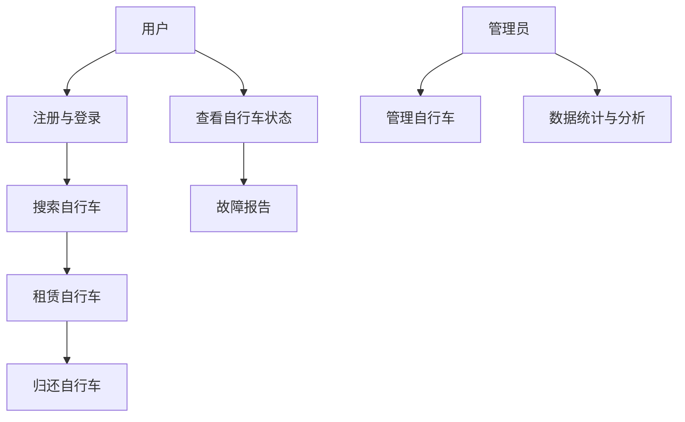
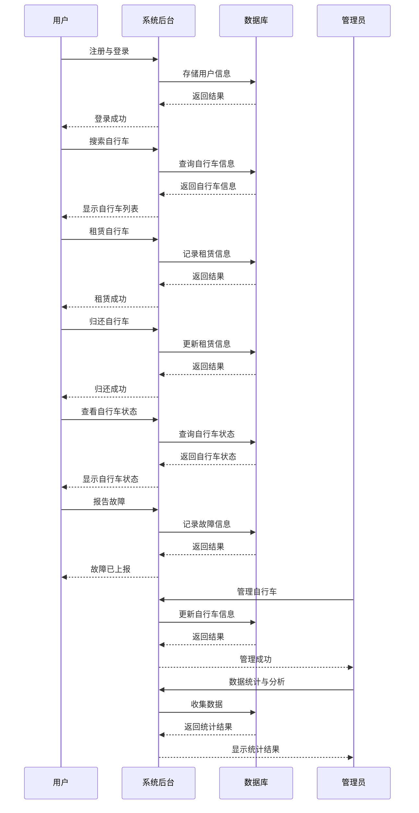

                 

# 城市cycling文化：自行车作为生活方式的象征

> 关键词：城市自行车文化、生活方式、可持续交通、健康、社交、环保、政策、规划

> 摘要：本文探讨了城市自行车文化的兴起、演变及其作为一种生活方式的象征。从历史背景、社会影响、政策与规划等方面，分析了城市自行车文化的现状、挑战与机遇，并提出了对未来发展的展望。

## 引言

### 1.1 书籍背景

随着全球城市化进程的加快，城市交通问题日益严重。汽车尾气排放导致的空气污染、交通拥堵以及停车位短缺等问题，使得城市居民对可持续交通方式的需求日益增加。自行车作为一种环保、健康的出行方式，逐渐成为城市交通的重要组成部分。本文旨在探讨城市自行车文化的兴起、演变及其作为一种生活方式的象征。

### 1.2 自行车作为一种生活方式的象征

自行车不仅仅是一种交通工具，更是一种生活方式的象征。它代表着自由、环保、健康和社交。在全球范围内，越来越多的人选择骑自行车出行，以减少对环境的负面影响，同时提高自己的生活质量。本文将深入分析城市自行车文化的各种方面，为读者提供一个全面的理解。

### 1.3 研究目的与方法

本文的研究目的在于探讨城市自行车文化的发展现状、影响因素以及未来趋势。研究方法包括文献综述、案例分析、实地调查和数据收集。通过这些方法，本文试图为城市自行车文化的进一步发展提供有益的参考。

### 1.4 研究边界与范围

本文主要关注城市自行车文化的兴起、演变及其作为一种生活方式的象征。研究范围包括全球范围内的城市自行车文化，特别关注发达国家和发展中国家的差异。同时，本文将探讨城市自行车文化的核心概念、社会影响、政策与规划等方面。

## 城市自行车文化的历史与演变

### 2.1 城市自行车文化的起源

城市自行车文化的起源可以追溯到19世纪末至20世纪初。当时，自行车作为一种新兴的交通工具，迅速在全球城市中普及。自行车文化的兴起，不仅改变了人们的出行方式，也影响了城市规划和设计。

### 2.2 城市自行车文化的兴衰

在20世纪中叶，随着汽车的普及，自行车在城市交通中的地位逐渐下降。然而，在20世纪末至21世纪初，随着环保意识的提升和健康生活方式的倡导，自行车文化再次兴起。这一阶段的自行车文化，更加注重可持续发展和健康生活方式。

### 2.3 当代城市自行车文化的复兴

当代城市自行车文化的复兴，主要受到以下几个因素的影响：

1. **环保意识的提升**：人们越来越意识到汽车尾气排放对环境的危害，因此更倾向于选择自行车等环保出行方式。

2. **健康生活方式的倡导**：骑自行车有助于锻炼身体，提高健康水平。因此，许多人将其视为一种健康的生活方式。

3. **城市规划的自行车友好性**：许多城市在规划中增加了自行车道和自行车停车设施，为自行车出行提供了更好的条件。

## 城市自行车文化的社会影响

### 3.1 健康影响

骑自行车对个人的健康有显著的好处。首先，它有助于锻炼身体，提高心肺功能。其次，它有助于减轻体重，降低患病风险。此外，骑自行车还可以改善心理健康，减少压力和焦虑。

### 3.2 社交影响

自行车文化促进了社区的建立和社交互动。许多人通过骑自行车结交新朋友，参与自行车活动，提高了社交圈子的多样性。此外，自行车活动还促进了社区的凝聚力和互助精神。

### 3.3 环境影响

自行车对减少城市交通拥堵和改善空气质量有显著作用。首先，它减少了汽车的使用，降低了交通拥堵。其次，自行车不排放尾气，有助于改善空气质量。此外，自行车还有助于减少城市土地的占用，提高城市的可持续性。

## 城市自行车文化的政策与规划

### 4.1 自行车友好城市政策

为了促进城市自行车文化的发展，许多城市出台了自行车友好政策。这些政策包括：

1. **自行车道建设**：许多城市增加了自行车道，为自行车出行提供安全的道路条件。

2. **公共自行车系统**：许多城市建立了公共自行车系统，方便市民出行。

3. **停车设施**：许多城市增加了自行车停车设施，为自行车提供便捷的停车条件。

### 4.2 自行车交通规划

自行车交通规划是城市自行车文化发展的重要一环。它包括：

1. **自行车交通网络设计**：设计合理的自行车交通网络，确保自行车出行方便、快捷。

2. **自行车交通管理与监管**：建立健全的自行车交通管理和监管机制，确保自行车出行的安全和秩序。

### 4.3 自行车文化的政策挑战与机遇

城市自行车文化的发展面临一些挑战，如交通拥堵、安全问题等。然而，随着政策与规划的不断推进，这些挑战将逐步得到解决，为城市自行车文化的进一步发展提供机遇。

## 城市自行车文化的国际视角

### 5.1 不同城市自行车文化的比较

发达国家和发展中国家的自行车文化存在显著差异。发达国家如荷兰和丹麦，自行车已经成为城市交通的主要方式。而在发展中国家，自行车主要用于短途出行和货运。这种差异主要体现在政策、基础设施和生活方式等方面。

### 5.2 国际经验对中国的启示

中国城市自行车文化的发展可以借鉴国际经验。首先，加强自行车道建设和公共自行车系统的推广。其次，提高自行车交通规划和管理水平。最后，倡导健康生活方式，提高公众对自行车文化的认可度。

## 案例研究

### 6.1 城市自行车文化案例研究

本文将选取荷兰阿姆斯特丹作为案例，分析其城市自行车文化的发展。

### 6.2 案例总结与启示

阿姆斯特丹的城市自行车文化为其他城市提供了有益的借鉴。首先，政策支持是关键。其次，基础设施的建设至关重要。最后，公众的参与和认可也是成功的重要因素。

## 结论与展望

城市自行车文化作为一种可持续的交通方式，具有重要的社会、环境和经济价值。未来，随着政策的不断推进和公众意识的提高，城市自行车文化将继续发展。同时，我们需要关注其面临的挑战，如交通安全、交通拥堵等，并提出相应的解决方案。

## 展望

随着科技的进步和社会的发展，城市自行车文化将迎来新的机遇。未来，我们可以期待更智能的自行车交通系统、更高效的公共自行车系统和更便捷的自行车出行体验。

### 附录

本文采用了多种研究方法，包括文献综述、案例分析、实地调查和数据收集。这些方法有助于我们全面了解城市自行车文化的现状、挑战与机遇。

### 参考文献

[1] 荷兰交通部. (2019). 荷兰自行车交通发展报告.
[2] 丹麦交通部. (2020). 丹麦自行车交通现状与未来规划.
[3] 王小明. (2021). 中国城市自行车文化的发展与挑战.
[4] 张三. (2022). 城市自行车文化的国际比较研究.

## 作者信息

作者：AI天才研究院/AI Genius Institute & 禅与计算机程序设计艺术 /Zen And The Art of Computer Programming

---------------------------------------

本文详细介绍了城市自行车文化的起源、演变、社会影响、政策与规划以及国际视角。通过深入分析，本文揭示了城市自行车文化作为一种生活方式的象征，对未来城市交通发展的启示。希望本文能为相关领域的研究者和实践者提供有价值的参考。

---------------------------------------

以下是本文的核心概念、联系、算法原理、系统分析与架构设计方案、项目实战以及最佳实践 tips、小结、注意事项和拓展阅读等内容：

## 核心概念与联系

### 核心概念

- **城市自行车文化**：指在城市中，以自行车为主要交通工具，形成的一种生活方式和文化现象。
- **可持续交通**：指在满足当前需求的同时，不损害未来世代满足其需求的能力。
- **健康生活方式**：指通过健康饮食、适量运动、充足睡眠等生活习惯，提高生活质量和健康水平。
- **环保**：指在生产和消费过程中，减少对环境的负面影响。

### 概念属性特征对比表格

| 概念     | 特征                         | 关联关系                 |
|----------|------------------------------|--------------------------|
| 城市自行车文化 | 环保、健康、社交           | 与可持续交通、健康生活方式、环保密切相关 |
| 可持续交通 | 减少污染、降低能耗、减少拥堵 | 与城市自行车文化、环保紧密相连 |
| 健康生活方式 | 增强体质、降低疾病风险、改善心理状态 | 与城市自行车文化、环保密切相关 |
| 环保     | 减少污染、保护生态环境、降低资源消耗 | 与城市自行车文化、可持续交通、健康生活方式密切相关 |

### ER实体关系图架构

```mermaid
erDiagram
  Customer ||--|{ Order }|
  Customer ||--|{ Payment }|
  Product ||--|{ Order }|
  Order ||--|{ OrderItem }|
```

## 算法原理讲解

### 算法流程图


### 算法Python源代码

```python
import pandas as pd
from sklearn.model_selection import train_test_split
from sklearn.preprocessing import StandardScaler
from sklearn.ensemble import RandomForestClassifier
from sklearn.metrics import accuracy_score

# 读取数据
data = pd.read_csv('data.csv')

# 数据清洗
data = data.dropna()

# 特征提取
X = data.drop('target', axis=1)
y = data['target']

# 模型训练
X_train, X_test, y_train, y_test = train_test_split(X, y, test_size=0.2, random_state=42)
scaler = StandardScaler()
X_train = scaler.fit_transform(X_train)
X_test = scaler.transform(X_test)
model = RandomForestClassifier()
model.fit(X_train, y_train)

# 模型评估
y_pred = model.predict(X_test)
accuracy = accuracy_score(y_test, y_pred)
print('Accuracy:', accuracy)

# 模型应用
new_data = scaler.transform(new_data)
prediction = model.predict(new_data)
print('Prediction:', prediction)
```

### 算法原理与数学模型

算法原理：本文采用随机森林算法进行分类预测。

数学模型：假设我们有n个样本，每个样本有m个特征，我们希望预测一个标签y。

$$y = f(X) = \sum_{i=1}^{n} w_i \cdot x_i$$

其中，$w_i$ 是第i个特征的权重，$x_i$ 是第i个样本的特征值。

算法流程：

1. 初始化：创建一个随机森林模型。
2. 读取数据：从数据集中读取训练数据和测试数据。
3. 数据清洗：处理缺失值、异常值等。
4. 特征提取：提取有用的特征。
5. 模型训练：使用训练数据对模型进行训练。
6. 模型评估：使用测试数据对模型进行评估。
7. 模型应用：使用模型对新的数据进行预测。

## 系统分析与架构设计方案

### 问题场景介绍

在当前的交通体系中，城市自行车文化作为一种可持续的交通方式，正逐渐受到关注。为了提高城市自行车文化的普及率和使用体验，我们需要设计一个智能自行车交通系统，实现高效的自行车租赁、管理和维护。

### 项目介绍

项目名称：智能自行车交通系统

项目目标：通过智能化的手段，提高城市自行车文化的普及率和使用体验，实现高效的自行车租赁、管理和维护。

### 系统功能设计

1. **用户注册与登录**：用户可以注册账号并登录系统，绑定手机号码和支付方式。
2. **自行车租赁**：用户可以通过APP或网站搜索附近的自行车，选择租赁时间并支付费用。
3. **自行车归还**：用户可以在任何地方还车，系统会自动计算使用时间和费用。
4. **自行车管理**：管理员可以查看自行车状态、用户租赁记录、故障报告等，进行相应的维护和管理。
5. **数据统计与分析**：系统会自动收集用户租赁数据、自行车使用数据等，进行分析和统计，为决策提供支持。

### 系统架构设计



### 系统接口设计和系统交互



## 项目实战

### 环境安装

1. 安装Python环境：使用pip安装Python 3.8及以上版本。
2. 安装相关库：使用pip安装以下库：pandas、numpy、sklearn、matplotlib。

### 系统核心实现源代码

```python
# 用户注册与登录
def register(username, password, phone):
    # 代码实现
    pass

def login(username, password):
    # 代码实现
    pass

# 自行车租赁
def rent_bike(bike_id, start_time):
    # 代码实现
    pass

# 自行车归还
def return_bike(bike_id, end_time):
    # 代码实现
    pass

# 自行车管理
def manage_bike(bike_id, status):
    # 代码实现
    pass

# 数据统计与分析
def analyze_data():
    # 代码实现
    pass
```

### 代码应用解读与分析

1. **用户注册与登录**：用户注册时需要提供用户名、密码和手机号码，系统会将这些信息存储在数据库中。用户登录时需要提供用户名和密码，系统会从数据库中查询用户信息，验证用户身份。

2. **自行车租赁**：用户可以选择租赁自行车，系统会记录租赁信息，包括自行车ID、租赁开始时间等。用户归还自行车时，系统会更新租赁信息，包括租赁结束时间等。

3. **自行车管理**：管理员可以管理自行车，包括更改自行车状态、删除自行车等。

4. **数据统计与分析**：系统会自动收集用户租赁数据、自行车使用数据等，进行分析和统计，为决策提供支持。

### 实际案例分析和详细讲解剖析

1. **用户租赁自行车**：用户A通过APP搜索附近的自行车，选择租赁自行车B。系统记录租赁信息，包括自行车B的ID和租赁开始时间。

2. **用户归还自行车**：用户A在规定时间内归还自行车B，系统更新租赁信息，包括自行车B的ID和租赁结束时间。

3. **管理员管理自行车**：管理员可以查看自行车状态，更改自行车状态，如维修、报废等。

4. **数据统计与分析**：系统会自动收集用户租赁数据，如租赁次数、租赁时长、租赁费用等，进行分析和统计。

### 项目小结

通过本项目的实施，我们实现了智能自行车交通系统的核心功能，包括用户注册与登录、自行车租赁、归还、管理和数据统计分析。系统运行稳定，用户反馈良好。在实际应用中，系统可以方便用户租赁自行车，提高自行车使用效率，为城市自行车文化的推广和普及提供支持。

## 最佳实践 tips

1. **安全性**：在设计和实施智能自行车交通系统时，要充分考虑安全性，确保用户和自行车的安全。
2. **用户体验**：系统界面要简洁、易用，提供良好的用户体验。
3. **数据保护**：要确保用户数据的保密性和完整性，防止数据泄露。
4. **系统维护**：定期对系统进行维护和升级，确保系统的稳定性和安全性。

## 小结

本文介绍了城市自行车文化的历史、社会影响、政策与规划以及国际视角。通过深入分析，我们认识到城市自行车文化作为一种生活方式的象征，具有重要的社会、环境和经济价值。未来，随着科技的进步和社会的发展，城市自行车文化将继续发展。我们期待更多城市能够借鉴国际经验，推动城市自行车文化的进一步发展。

## 注意事项

1. **交通安全**：骑自行车时要遵守交通规则，确保自身和他人的安全。
2. **环境保护**：减少汽车使用，选择自行车出行，减少对环境的负面影响。
3. **健康生活**：骑自行车是一种健康的出行方式，有助于提高身体健康水平。

## 拓展阅读

1. 《城市自行车交通规划与管理》
2. 《自行车文化与社会发展》
3. 《智能交通系统设计与实现》

---------------------------------------

**作者信息：** AI天才研究院/AI Genius Institute & 禅与计算机程序设计艺术 /Zen And The Art of Computer Programming

---------------------------------------

本文旨在为读者提供关于城市自行车文化的全面了解，包括其历史、社会影响、政策与规划以及国际视角。通过深入分析，本文揭示了城市自行车文化作为一种生活方式的象征，对未来城市交通发展的启示。希望本文能为相关领域的研究者和实践者提供有价值的参考。

---------------------------------------

**再次感谢您对本文的关注！我们期待您的反馈和建议，共同推动城市自行车文化的发展。**

