                 

### 引言

#### 城市公共空间的概念与重要性

城市公共空间，指的是在城市中供所有居民使用、不受私有产权限制的开放空间，包括公园、广场、街道、步行道、绿地、公共设施等。这些空间不仅是城市物理结构的一部分，更是城市社会生活的重要载体。它们承载着人们日常生活中的各种活动，如社交、休闲、运动、文化、教育等，对城市功能的实现和社会发展的推动具有不可替代的作用。

城市公共空间的重要性首先体现在其促进社交的功能上。现代城市的快速发展使得人们的生活节奏加快，居住环境逐渐私密化。而公共空间则为人们提供了一个开放、平等、自由交流的场所。通过日常在公共空间中的互动，居民之间建立了联系和沟通，形成了社区的凝聚力。这种社交互动不仅丰富了人们的生活体验，也有助于减少社会隔离和孤独感，提高整体社会幸福感。

其次，城市公共空间在促进民主方面也发挥着重要作用。民主不仅是一种政治制度，更是一种生活方式。公共空间为居民提供了一个表达意见、参与决策的平台。在这里，人们可以自由地聚集、讨论、甚至发起运动，争取自身权益。这种公共参与的机制，有助于增强公民的社会责任感，推动社会的公平与正义。

因此，城市公共空间的重要性不言而喻。它不仅是城市景观的一部分，更是城市功能实现和社会发展的重要基础。本文将围绕城市公共空间的定义、社交与民主功能，以及设计原则和案例分析等方面进行深入探讨。

#### 社交功能

社交活动是城市公共空间的重要组成部分，它不仅丰富了居民的生活，还增强了社区凝聚力。首先，让我们定义和分类一下常见的社交活动类型和模式。社交活动可以大致分为以下几类：

1. **休闲社交**：这类活动通常发生在公园、广场、街头等公共空间，如散步、休息、聚会等。它们是人们放松身心、释放压力的主要方式，同时也是邻里之间建立联系的重要途径。
   
2. **文化社交**：包括文化节、艺术展览、音乐会等。这些活动为居民提供了一个欣赏艺术、分享文化、交流想法的机会，有助于提升社区的文化氛围和居民的文化素养。

3. **运动社交**：如跑步、健身、羽毛球、篮球等运动项目在公共空间中的开展。这些活动不仅有助于居民保持健康，还提供了社交互动的平台，促进邻里之间的交流和友谊。

4. **公共事务社交**：这类活动涉及到社区管理、城市规划、环境保护等公共事务。居民通过参与这些活动，表达自己的意见和建议，积极参与社区事务的决策过程。

社交功能对城市公共空间的需求主要体现在以下几个方面：

首先，公共空间需要足够的规模和多样性。大型公园和广场可以容纳更多的社交活动，而小型绿地和社区广场则更适合休闲和邻里交流。多样化的空间设计可以满足不同类型社交活动的需求，提高公共空间的利用率。

其次，公共空间需要良好的可达性和便利性。居民应能轻松地到达公共空间，无论是步行、骑行还是乘坐公共交通。此外，公共空间内部需要设有必要的设施，如座椅、饮水处、洗手间等，以提升居民的使用体验。

第三，公共空间需要具备安全性和舒适性。安全是社交活动的基本保障，而舒适性则直接影响到居民参与活动的意愿。因此，城市公共空间的设计应充分考虑这些因素，创造一个宜人、安全的社交环境。

最后，公共空间还需要具备可持续性。随着城市化进程的加快，环境问题日益凸显。城市公共空间的设计和运营应注重生态保护，减少资源浪费，为居民提供健康、环保的社交场所。

综上所述，城市公共空间的社交功能对于提升居民生活质量、增强社区凝聚力具有重要意义。通过满足多样化的社交需求，公共空间不仅成为城市生活中不可或缺的一部分，也为城市的发展注入了活力和动力。

#### 民主功能

城市公共空间不仅是社交互动的场所，更是民主参与的重要平台。在现代社会中，民主不仅是一种政治制度，更是一种生活方式。公共空间为居民提供了一个表达意见、参与决策的平台，促进了公民的社会责任感和公平正义的推进。

首先，公共空间为居民提供了自由表达意见的机会。在公共集会、示威游行、社区会议等活动中，居民可以自由地表达自己的观点和诉求。这种表达不仅有助于提升公民的言论自由，还有助于社会问题的曝光和解决。例如，许多城市的公共广场成为了抗议活动的重要场所，居民通过集会表达对政府政策的不满，推动了社会的变革。

其次，公共空间为居民提供了参与决策的机会。在城市规划和社区管理的各个环节，公共空间为居民提供了一个交流和讨论的场所。居民可以在这里提出自己的意见和建议，参与公共事务的讨论和决策。例如，许多城市的社区委员会会定期在公共空间召开会议，听取居民的反馈和建议，并将其纳入到社区规划中。这种参与机制有助于增强居民的归属感和责任感，促进社区的可持续发展。

此外，公共空间还为居民提供了一个展示和推广自身权益的平台。通过举办各类公共活动，居民可以展示自己的才华和创意，推广自己的理念和价值。这种展示不仅有助于提升个人的社会地位，还可以激发社区的活力和创新精神。

然而，要充分发挥城市公共空间的民主功能，设计要求至关重要。首先，公共空间需要具备开放性和包容性。开放性意味着公共空间应允许所有人自由进入和使用，不受种族、性别、年龄、经济地位等因素的限制。包容性则意味着公共空间应尊重不同的文化和观点，创造一个多元共存的环境。

其次，公共空间的设计应充分考虑可达性和便利性。居民应能轻松地到达公共空间，无论是步行、骑行还是乘坐公共交通。此外，公共空间内部需要设有必要的设施，如座椅、饮水处、洗手间等，以提升居民的使用体验。

第三，公共空间需要具备安全性和隐私性。安全性是民主参与的基本保障，而隐私性则直接影响到居民参与决策的意愿。因此，公共空间的设计应充分考虑这些因素，创造一个安全、隐私的参与环境。

最后，公共空间还需要具备可持续性和可扩展性。随着城市的发展和居民需求的增加，公共空间的设计应具备适应性和可扩展性，能够满足未来的需求。同时，公共空间的运营和管理也应注重生态保护，减少资源浪费，为居民提供健康、环保的参与场所。

综上所述，城市公共空间在促进民主参与方面具有重要作用。通过提供自由表达意见、参与决策和展示自身权益的平台，公共空间不仅有助于提升公民的社会责任感和公平正义，也为城市的发展注入了活力和动力。

#### 核心概念与联系

在城市公共空间的概念框架中，有两个核心概念尤为关键：社交功能与民主功能。这两个概念不仅是城市公共空间的基本属性，也是其价值所在。在这一部分，我们将详细探讨这两个核心概念，并通过属性特征对比表格和ER实体关系图来解析它们之间的联系。

**社交功能**：

1. **定义**：社交功能指的是城市公共空间为居民提供交流、互动、建立社区联系的平台和机会。
   
2. **属性特征**：
   - **互动性**：社交功能强调居民之间的互动和交流，通过面对面的接触和沟通，增进彼此的了解和信任。
   - **多样性**：社交功能涵盖各类活动，包括休闲、文化、运动和公共事务等，满足不同居民的多样化需求。
   - **包容性**：社交功能应尊重和包容不同文化和背景的居民，创造一个多元共存的环境。

**民主功能**：

1. **定义**：民主功能指的是城市公共空间为居民提供表达意见、参与决策、争取权益的平台和机会。

2. **属性特征**：
   - **参与性**：民主功能强调居民的参与和决策，通过集会、会议、游行等活动，提升公民的参与度和责任感。
   - **透明性**：民主功能要求决策过程公开透明，居民能够了解和监督公共事务的进展。
   - **公平性**：民主功能应保障所有居民平等参与的权利，不受种族、性别、年龄、经济地位等因素的限制。

**属性特征对比表格**：

| 特征       | 社交功能              | 民主功能              |
|------------|-----------------------|-----------------------|
| 定义       | 交流、互动、建立联系   | 表达意见、参与决策、争取权益 |
| 互动性     | 强调居民间的互动       | 强调居民的参与性       |
| 多样性     | 覆盖各类活动          | 透明、公平的决策过程  |
| 包容性     | 尊重多元文化         | 平等参与的权利       |

通过对比表格，我们可以清晰地看到社交功能和民主功能的区别与联系。虽然两者在属性特征上有所不同，但它们共同构成了城市公共空间的核心价值。社交功能为居民提供了一个交流和互动的平台，促进了社区凝聚力和社会关系的建立；而民主功能则为居民提供了一个表达意见、参与决策的平台，推动了社会的公平与正义。

**ER实体关系图架构**：

在ER实体关系图中，我们可以将社交功能和民主功能视为两个独立的实体，并通过关系连接起来，以展示它们之间的相互作用。

```mermaid
erDiagram
  社交功能 ||--|{ 民主功能 }|
  
  社交功能 {
    --|> 本地居民
    --|> 社交活动
  }

  民主功能 {
    --|> 公民参与
    --|> 公共事务
  }

  本地居民 ||--|{ 社交活动 }
  本地居民 ||--|{ 公民参与 }

  社交活动 {
    --|> 社交功能
  }

  公民参与 {
    --|> 民主功能
  }
```

ER实体关系图展示了社交功能和民主功能之间的关联，以及它们与居民、社交活动、公共事务之间的关系。通过这种方式，我们可以更直观地理解城市公共空间如何通过社交和民主功能来实现其社会价值。

综上所述，城市公共空间的社交功能和民主功能是相辅相成的。社交功能通过促进居民间的互动和交流，增强了社区的凝聚力和居民的社会幸福感；而民主功能则通过提供自由表达意见、参与决策的平台，推动了社会的公平与正义。通过深入理解这两个核心概念及其联系，我们可以更好地设计和利用城市公共空间，使其在现代社会中发挥更大的作用。

### 城市公共空间的设计原则

城市公共空间的设计原则是其有效发挥功能的基础，为确保其能同时满足社交和民主需求，设计原则应围绕可达性、安全性、可持续性等方面进行详细考虑。以下将逐一探讨这些设计原则。

#### 可达性

可达性是城市公共空间设计中的一个关键原则，它直接影响到居民的使用意愿和频率。首先，公共空间应位于交通便利的区域，确保居民可以通过步行、骑行或公共交通轻松到达。具体而言，以下措施可以提高公共空间的可达性：

1. **交通连接**：公共空间应与地铁站、公交站等交通枢纽紧密连接，方便居民在不同交通方式之间的转换。
   
2. **步行网络**：城市应建设完善的步行网络，通过步行道、步行街、步行桥等设施，使得居民能够方便地步行到达公共空间。

3. **无障碍设计**：为残障人士和老年人提供无障碍通道和设施，确保所有居民都能平等地享受公共空间。

4. **信息指引**：设置清晰、易于理解的路标和指示牌，帮助居民快速找到公共空间。

#### 安全性

安全性是居民使用公共空间的基本保障，一个安全的环境能够提高居民的舒适感和满意度。以下是设计公共空间时需要考虑的几个方面：

1. **物理安全**：公共空间应设有充足的照明、监控系统等设施，确保夜间和人流密集时居民的安全。

2. **社会安全**：通过合理的空间布局和设计，减少犯罪活动的发生。例如，避免在空间设计中设置过多的死角和盲区，增加监控摄像头等。

3. **人员管理**：配备足够的保安人员，及时处理突发事件，确保公共空间的安全和秩序。

4. **紧急设施**：设置紧急呼叫设备、消防设施等，确保在紧急情况下居民能够迅速得到帮助。

#### 可持续性

可持续性是现代城市公共空间设计的一个重要原则，旨在减少资源消耗和环境污染，实现生态平衡。以下是实现可持续性的几个关键措施：

1. **绿色设计**：增加公共空间的绿化面积，种植各种植物，提高空气质量，创造宜人的环境。

2. **环保材料**：在公共空间的建设和运营中，使用环保材料和可再生能源，减少对环境的污染。

3. **节能设施**：安装节能灯具、雨水收集系统等，提高能源利用效率，减少能源消耗。

4. **垃圾分类回收**：设置垃圾分类回收设施，鼓励居民积极参与垃圾分类，实现资源的有效利用。

#### 其他设计原则

除了上述三个主要原则，城市公共空间的设计还应考虑以下原则：

1. **灵活性**：设计时应考虑空间的灵活性和多功能性，以便适应不同类型的活动和需求。

2. **文化多样性**：公共空间的设计应融入当地的文化特色，展示和传承当地的历史和文化。

3. **社区参与**：鼓励居民参与公共空间的设计和运营，提高他们的归属感和参与感。

通过综合考虑可达性、安全性、可持续性以及其他设计原则，城市公共空间能够更好地满足居民的社交和民主需求，成为城市生活中的重要组成部分。以下是一个简单的概念架构图，展示了这些设计原则之间的联系：

```mermaid
graph TB
  A[可达性] --> B[交通连接]
  A --> C[步行网络]
  A --> D[无障碍设计]
  A --> E[信息指引]
  
  B --> F[地铁站]
  B --> G[公交站]
  
  C --> H[步行道]
  C --> I[步行街]
  C --> J[步行桥]
  
  D --> K[残障人士通道]
  D --> L[老年人通道]
  
  E --> M[路标]
  E --> N[指示牌]
  
  O[安全性] --> P[物理安全]
  O --> Q[社会安全]
  O --> R[人员管理]
  O --> S[紧急设施]
  
  P --> T[照明]
  P --> U[监控系统]
  
  Q --> V[空间布局]
  Q --> W[监控摄像头]
  
  R --> X[保安人员]
  
  S --> Y[紧急呼叫设备]
  S --> Z[消防设施]
  
  W --> U
  
  U --> P
  
  V --> Q
  
  X --> R
  
  Y --> S
  
  Z --> S
  
  V --> S
  
  T --> P
  
  P --> O
  
  U --> P
  
  V --> Q
  
  X --> R
  
  Y --> S
  
  Z --> S
  
  T --> P
  
  U --> P
  
  V --> Q
  
  X --> R
  
  Y --> S
  
  Z --> S
  
  T --> P
  
  U --> P
  
  V --> Q
  
  X --> R
  
  Y --> S
  
  Z --> S
  
  O --> A
  
  B --> A
  
  C --> A
  
  D --> A
  
  E --> A
  
  O --> A
  
  P --> O
  
  Q --> O
  
  R --> O
  
  S --> O
  
  T --> O
  
  U --> O
  
  V --> O
  
  W --> O
  
  X --> O
  
  Y --> O
  
  Z --> O
  
  A --> L
  
  B --> L
  
  C --> L
  
  D --> L
  
  E --> L
  
  O --> M
  
  O --> N
  
  M --> E
  
  N --> E
  
  A --> K
  
  A --> L
  
  A --> M
  
  A --> N
  
  A --> O
  
  B --> F
  
  B --> G
  
  C --> H
  
  C --> I
  
  C --> J
  
  D --> K
  
  D --> L
  
  E --> M
  
  E --> N
  
  A --> P
  
  A --> Q
  
  A --> R
  
  A --> S
  
  A --> T
  
  A --> U
  
  A --> V
  
  A --> W
  
  A --> X
  
  A --> Y
  
  A --> Z
  
  B --> F
  
  B --> G
  
  C --> H
  
  C --> I
  
  C --> J
  
  D --> K
  
  D --> L
  
  E --> M
  
  E --> N
  
  A --> T
  
  A --> U
  
  A --> V
  
  A --> W
  
  A --> X
  
  A --> Y
  
  A --> Z
  
  T --> O
  
  U --> O
  
  V --> O
  
  W --> O
  
  X --> O
  
  Y --> O
  
  Z --> O
  
  A --> L
  
  B --> L
  
  C --> L
  
  D --> L
  
  E --> L
  
  O --> M
  
  O --> N
  
  M --> E
  
  N --> E
  
  A --> K
  
  A --> L
  
  A --> M
  
  A --> N
  
  A --> O
  
  B --> F
  
  B --> G
  
  C --> H
  
  C --> I
  
  C --> J
  
  D --> K
  
  D --> L
  
  E --> M
  
  E --> N
  
  A --> P
  
  A --> Q
  
  A --> R
  
  A --> S
  
  A --> T
  
  A --> U
  
  A --> V
  
  A --> W
  
  A --> X
  
  A --> Y
  
  A --> Z
  
  B --> F
  
  B --> G
  
  C --> H
  
  C --> I
  
  C --> J
  
  D --> K
  
  D --> L
  
  E --> M
  
  E --> N
  
  A --> T
  
  A --> U
  
  A --> V
  
  A --> W
  
  A --> X
  
  A --> Y
  
  A --> Z
  
  T --> O
  
  U --> O
  
  V --> O
  
  W --> O
  
  X --> O
  
  Y --> O
  
  Z --> O
  
  A --> L
  
  B --> L
  
  C --> L
  
  D --> L
  
  E --> L
  
  O --> M
  
  O --> N
  
  M --> E
  
  N --> E
  
  A --> K
  
  A --> L
  
  A --> M
  
  A --> N
  
  A --> O
  
  B --> F
  
  B --> G
  
  C --> H
  
  C --> I
  
  C --> J
  
  D --> K
  
  D --> L
  
  E --> M
  
  E --> N
  
  A --> P
  
  A --> Q
  
  A --> R
  
  A --> S
  
  A --> T
  
  A --> U
  
  A --> V
  
  A --> W
  
  A --> X
  
  A --> Y
  
  A --> Z
  
  B --> F
  
  B --> G
  
  C --> H
  
  C --> I
  
  C --> J
  
  D --> K
  
  D --> L
  
  E --> M
  
  E --> N
  
  A --> T
  
  A --> U
  
  A --> V
  
  A --> W
  
  A --> X
  
  A --> Y
  
  A --> Z
  
  T --> O
  
  U --> O
  
  V --> O
  
  W --> O
  
  X --> O
  
  Y --> O
  
  Z --> O
  
  A --> L
  
  B --> L
  
  C --> L
  
  D --> L
  
  E --> L
  
  O --> M
  
  O --> N
  
  M --> E
  
  N --> E
  
  A --> K
  
  A --> L
  
  A --> M
  
  A --> N
  
  A --> O
  
  B --> F
  
  B --> G
  
  C --> H
  
  C --> I
  
  C --> J
  
  D --> K
  
  D --> L
  
  E --> M
  
  E --> N
  
  A --> P
  
  A --> Q
  
  A --> R
  
  A --> S
  
  A --> T
  
  A --> U
  
  A --> V
  
  A --> W
  
  A --> X
  
  A --> Y
  
  A --> Z
  
  B --> F
  
  B --> G
  
  C --> H
  
  C --> I
  
  C --> J
  
  D --> K
  
  D --> L
  
  E --> M
  
  E --> N
  
  A --> T
  
  A --> U
  
  A --> V
  
  A --> W
  
  A --> X
  
  A --> Y
  
  A --> Z
  
  T --> O
  
  U --> O
  
  V --> O
  
  W --> O
  
  X --> O
  
  Y --> O
  
  Z --> O

```



通过这些设计原则，我们可以构建一个既满足社交需求，又具备民主功能的优质城市公共空间，为城市居民提供更加丰富、多样化的生活体验。

### 案例分析

在探讨城市公共空间的重要性时，案例分析是不可或缺的一环。通过分析国内外城市公共空间的经典案例，我们可以更直观地了解这些空间的设计理念和实施效果，从中汲取经验和启示。以下将介绍几个具有代表性的国际和国内案例，并总结其共同点与差异，从中得到一些有益的启示。

#### 国际案例分析

1. **纽约的中央公园**

纽约的中央公园是美国最著名的城市公园之一，位于曼哈顿区。这个占地843英亩的公园始建于1857年，是“城市美化运动”的代表作之一。中央公园不仅为纽约市民提供了一个休闲和娱乐的场所，还成为城市社交和民主活动的核心地点。

- **设计特点**：中央公园采用了自然主义的设计风格，空间布局多样化，包括湖泊、树林、草地、雕塑等。它提供了从散步到慢跑等多种活动的空间，满足不同年龄段和兴趣爱好的人的需求。
- **实施效果**：中央公园的建成极大提升了曼哈顿区的居民生活质量，成为纽约市民日常生活中不可或缺的一部分。同时，公园内频繁举办的各类活动，如音乐会、展览、跑步比赛等，促进了社区的社交和民主参与。

2. **巴黎的香榭丽舍大街**

香榭丽舍大街是巴黎最著名的街道之一，也是世界上最繁华的街道之一。这条大街不仅是购物和娱乐的热点，还是政治集会和公共活动的场所。

- **设计特点**：香榭丽舍大街的设计注重历史与现代的融合。大街两旁的建筑风格多样，从古典主义到现代主义，展现了巴黎城市发展的历程。街道宽敞，绿化带丰富，是居民和游客休闲、散步的好去处。
- **实施效果**：香榭丽舍大街不仅成为了巴黎的标志性景观，还因其宽敞的街道和良好的可达性，成为了市民和游客进行社交和公共参与的理想场所。政治集会、抗议活动等在这里频繁上演，体现了其民主功能的强大。

#### 国内案例分析

1. **上海的世纪公园**

上海世纪公园是中国最大的城市公园之一，位于浦东新区。公园于1995年对外开放，占地面积1.63平方公里，融合了自然风光、现代园林和历史文化元素。

- **设计特点**：世纪公园以自然景观为主，设置了多个主题区域，如儿童乐园、湿地景观、艺术广场等。公园内部交通便利，设有自行车道和步行道，方便居民到达和游览。
- **实施效果**：世纪公园的建成显著改善了浦东新区的环境质量，提高了居民的生活品质。公园内的各种设施和活动吸引了大量市民前来休闲娱乐，促进了社区的社交和民主参与。

2. **深圳的莲花山公园**

莲花山公园位于深圳市中心，占地面积约10.28平方公里。公园以莲花为主题，设计了多个景点，如莲花池、莲花广场、莲花塔等。

- **设计特点**：莲花山公园的设计注重景观的多样性和文化性。公园内部设施齐全，包括休闲区、运动区、文化区等，满足了不同居民的需求。公园的建设充分考虑了环保和可持续性，采用了多种生态技术和措施。
- **实施效果**：莲花山公园的建成成为深圳市的一大亮点，吸引了大量市民和游客前来参观和休闲。公园内的各类活动和设施促进了居民的社交和民主参与，提升了社区的整体活力。

#### 案例总结与启示

通过以上国际和国内案例的分析，我们可以总结出以下几点共同点与差异：

**共同点**：

1. **功能多样性**：无论是国际还是国内案例，城市公共空间都注重功能多样性，提供休闲、娱乐、运动、文化等多种活动场所。
2. **良好的可达性**：所有案例中的公共空间都位于交通便利的区域，确保居民可以轻松到达。
3. **注重环保与可持续性**：许多案例在设计和建设过程中充分考虑了环保和可持续性，采用了多种生态技术和措施。
4. **社区参与**：案例中的公共空间都鼓励居民参与设计、建设和运营，提高了居民的归属感和参与感。

**差异**：

1. **文化背景**：国际案例更多体现的是西方城市的特点，如自然主义风格和历史与现代的融合；而国内案例则更多融入了中国传统文化元素。
2. **规模和范围**：国际案例的公共空间规模较大，覆盖范围广泛；国内案例则更注重局部区域的精细设计和运营。
3. **管理方式**：国际案例中的公共空间通常由专业的机构或团队管理，而国内案例则更多依赖于政府或社区组织。

**启示**：

1. **因地制宜**：在设计城市公共空间时，应充分考虑当地的文化背景和居民需求，实现因地制宜的设计。
2. **功能整合**：应注重公共空间的多样化功能，使其既能满足休闲、娱乐的需求，又能促进社交和民主参与。
3. **可持续性**：在公共空间的设计和运营中，应注重环保和可持续性，采用绿色技术和措施，减少资源消耗和环境污染。
4. **社区参与**：鼓励居民参与公共空间的设计、建设和运营，提高他们的归属感和参与感，形成良好的社区氛围。

通过以上案例分析，我们可以更好地理解城市公共空间的设计原则和实践，为未来城市公共空间的规划与建设提供有益的参考和启示。

### 系统分析与架构设计

#### 问题场景介绍

随着城市化进程的加快，城市公共空间的重要性日益凸显。为了更好地管理和利用这些公共空间，需要设计一套高效的系统，用于监控、管理和分析公共空间的利用情况。本系统旨在通过收集和分析数据，为城市管理者提供决策支持，优化公共空间的设计和运营。

#### 系统功能设计

本系统的主要功能包括数据收集、数据存储、数据分析、用户交互和决策支持。具体功能如下：

1. **数据收集**：系统通过传感器、摄像头和用户反馈等方式，实时收集公共空间的各项数据，如人流量、温度、湿度、噪音等。
2. **数据存储**：系统采用大数据存储技术，将收集到的数据存储在分布式数据库中，保证数据的持久化和可靠性。
3. **数据分析**：系统利用数据挖掘和机器学习技术，对收集到的数据进行深度分析，识别公共空间的使用模式、热点区域和潜在问题。
4. **用户交互**：系统提供用户界面，供城市管理者查看数据和报告，并能够根据分析结果进行决策。
5. **决策支持**：系统根据分析结果，为城市管理者提供优化公共空间设计的建议和方案，如调整设施布局、改善环境条件等。

#### 系统架构设计

系统架构采用分布式架构，以确保高可用性和可扩展性。主要模块包括数据采集模块、数据存储模块、数据处理模块、用户交互模块和决策支持模块。以下是详细的架构设计：

1. **数据采集模块**：该模块负责实时收集公共空间的各项数据，包括传感器数据、摄像头图像和用户反馈等。数据采集模块采用分布式设计，确保数据收集的全面性和实时性。

2. **数据存储模块**：该模块采用分布式数据库，存储来自数据采集模块的数据。数据库支持高并发访问和大数据量存储，确保数据的可靠性和安全性。

3. **数据处理模块**：该模块负责对收集到的数据进行处理和分析。数据处理模块包括数据清洗、数据转换、数据挖掘和机器学习等子模块。通过这些处理，系统能够提取有价值的信息和洞察。

4. **用户交互模块**：该模块提供用户界面，供城市管理者查看数据和报告。用户交互模块采用前后端分离的设计，确保系统的可维护性和扩展性。

5. **决策支持模块**：该模块根据数据处理模块的结果，为城市管理者提供优化建议和方案。决策支持模块包括报告生成、优化模型和可视化工具等子模块。

#### 系统接口设计

系统接口设计包括API设计和数据交换格式设计。以下是详细的接口设计：

1. **API设计**：系统提供RESTful API，供外部系统和服务调用。API包括数据上传、数据查询、数据分析结果获取等功能，确保系统与其他系统的数据交互和功能集成。

2. **数据交换格式**：系统采用JSON和XML等数据交换格式，确保数据在不同系统之间的无缝传输和解析。JSON格式简洁、易于解析，适合快速开发；XML格式结构清晰、兼容性强，适合复杂的数据交换。

#### 系统交互

系统交互设计确保各个模块之间的数据流动和功能协作。以下是详细的系统交互设计：

1. **数据流动**：数据从数据采集模块流入数据存储模块，然后进入数据处理模块进行分析和挖掘。分析结果流入用户交互模块，供城市管理者查看和决策。

2. **功能协作**：数据采集模块、数据处理模块和用户交互模块之间通过API进行协作。数据采集模块将数据上传到数据存储模块，数据处理模块对数据进行处理和分析，然后将结果返回给用户交互模块。

3. **监控和告警**：系统设置监控和告警机制，实时监控系统的运行状态和关键指标。一旦发现异常，系统能自动触发告警，通知相关人员。

综上所述，通过详细的问题场景介绍、系统功能设计、系统架构设计、系统接口设计和系统交互设计，我们构建了一个高效、可靠的城市公共空间管理系统。这个系统将有助于优化公共空间的设计和运营，提升城市居民的生活质量。

### 项目实战

#### 环境安装

在进行城市公共空间管理系统项目之前，首先需要安装和配置必要的开发环境和工具。以下步骤将指导您完成环境的安装和配置。

**步骤 1：安装 Python**

确保您的计算机上安装了 Python 3.8 或更高版本。您可以从 [Python 官网](https://www.python.org/downloads/) 下载并安装。

```shell
# 检查 Python 版本
python --version
```

**步骤 2：安装虚拟环境**

安装 `virtualenv` 工具来创建一个独立的虚拟环境，以便于管理项目依赖。

```shell
# 安装 virtualenv
pip install virtualenv

# 创建虚拟环境
virtualenv public_space_management

# 激活虚拟环境
source public_space_management/bin/activate
```

**步骤 3：安装项目依赖**

在虚拟环境中安装项目所需的依赖库。项目依赖通过 `requirements.txt` 文件定义，该文件位于项目根目录下。

```shell
# 安装依赖库
pip install -r requirements.txt
```

**步骤 4：配置数据库**

本项目使用 SQLite 作为数据库。在项目根目录下创建一个名为 `public_space.db` 的数据库文件。

```shell
# 创建数据库
sqlite3 public_space.db

# 在数据库中创建表
CREATE TABLE spaces (
    id INTEGER PRIMARY KEY,
    name TEXT,
    location TEXT,
    area REAL
);

CREATE TABLE users (
    id INTEGER PRIMARY KEY,
    name TEXT,
    email TEXT
);

CREATE TABLE activities (
    id INTEGER PRIMARY KEY,
    space_id INTEGER,
    user_id INTEGER,
    start_time TEXT,
    end_time TEXT,
    type TEXT,
    FOREIGN KEY(space_id) REFERENCES spaces(id),
    FOREIGN KEY(user_id) REFERENCES users(id)
);
```

#### 系统核心实现

**步骤 1：数据模型**

首先，我们使用 ORM（对象关系映射）工具 `SQLAlchemy` 来定义数据模型。数据模型定义在 `models.py` 文件中。

```python
from sqlalchemy import create_engine, Column, Integer, String, Float, DateTime
from sqlalchemy.ext.declarative import declarative_base
from sqlalchemy.orm import sessionmaker

Base = declarative_base()

class Space(Base):
    __tablename__ = 'spaces'
    id = Column(Integer, primary_key=True)
    name = Column(String)
    location = Column(String)
    area = Column(Float)

class User(Base):
    __tablename__ = 'users'
    id = Column(Integer, primary_key=True)
    name = Column(String)
    email = Column(String)

class Activity(Base):
    __tablename__ = 'activities'
    id = Column(Integer, primary_key=True)
    space_id = Column(Integer)
    user_id = Column(Integer)
    start_time = Column(DateTime)
    end_time = Column(DateTime)
    type = Column(String)
    FOREIGN KEY(space_id) REFERENCES spaces(id)
    FOREIGN KEY(user_id) REFERENCES users(id)

# 创建数据库引擎和会话
engine = create_engine('sqlite:///public_space.db')
Base.metadata.create_all(engine)
Session = sessionmaker(bind=engine)
session = Session()
```

**步骤 2：API 接口**

接下来，我们使用 Flask 框架创建 RESTful API 接口。API 定义在 `api.py` 文件中。

```python
from flask import Flask, request, jsonify
from models import Space, User, Activity, engine, session

app = Flask(__name__)

@app.route('/spaces', methods=['GET', 'POST'])
def manage_spaces():
    if request.method == 'GET':
        spaces = session.query(Space).all()
        return jsonify([space.to_dict() for space in spaces])
    elif request.method == 'POST':
        data = request.json
        space = Space(name=data['name'], location=data['location'], area=data['area'])
        session.add(space)
        session.commit()
        return jsonify(space.to_dict()), 201

@app.route('/users', methods=['GET', 'POST'])
def manage_users():
    if request.method == 'GET':
        users = session.query(User).all()
        return jsonify([user.to_dict() for user in users])
    elif request.method == 'POST':
        data = request.json
        user = User(name=data['name'], email=data['email'])
        session.add(user)
        session.commit()
        return jsonify(user.to_dict()), 201

@app.route('/activities', methods=['GET', 'POST'])
def manage_activities():
    if request.method == 'GET':
        activities = session.query(Activity).all()
        return jsonify([activity.to_dict() for activity in activities])
    elif request.method == 'POST':
        data = request.json
        activity = Activity(space_id=data['space_id'], user_id=data['user_id'], start_time=data['start_time'], end_time=data['end_time'], type=data['type'])
        session.add(activity)
        session.commit()
        return jsonify(activity.to_dict()), 201

if __name__ == '__main__':
    app.run(debug=True)
```

**步骤 3：数据处理**

数据处理模块用于对公共空间的使用情况进行分析。以下是一个简单的示例，用于统计每个公共空间的活动次数。

```python
from sqlalchemy import func

def get_activity_stats():
    stats = session.query(Activity.space_id, func.count(Activity.id)).group_by(Activity.space_id).all()
    return stats
```

#### 代码应用解读与分析

**数据模型解读**：

在上面的数据模型中，我们使用了 SQLAlchemy 定义了三个主要实体：`Space`（公共空间）、`User`（用户）和 `Activity`（活动）。每个实体都对应了一个数据库表，这些表通过外键关系实现关联。例如，`Activity` 表中的 `space_id` 和 `user_id` 分别是 `Space` 表和 `User` 表的外键，确保了数据的一致性和完整性。

**API 接口解读**：

`manage_spaces`、`manage_users` 和 `manage_activities` 函数分别处理与公共空间、用户和活动相关的 API 请求。每个函数都实现了 GET 和 POST 两种请求方法。GET 请求用于获取数据，POST 请求用于创建新数据。例如，`manage_spaces` 函数在接收到 POST 请求时，会从请求的 JSON 数据中提取信息，创建一个新的 `Space` 对象，并将其添加到数据库中。

**数据处理解读**：

`get_activity_stats` 函数通过 SQL 查询统计每个公共空间的活动次数。这个查询使用了 `group_by` 函数对 `Activity` 表按照 `space_id` 进行分组，并使用 `func.count` 函数计算每个组的活动数量。这种查询方式可以提供有价值的信息，帮助管理者了解公共空间的使用情况。

通过以上步骤，我们实现了城市公共空间管理系统的基础功能，包括数据模型、API 接口和数据处理。这些功能不仅满足了项目的需求，也为后续的功能扩展和优化奠定了基础。

### 实际案例分析与详细讲解

为了更好地理解城市公共空间管理系统在实际应用中的效果，我们将通过一个具体案例进行详细分析和讲解。

#### 案例背景

假设我们所在的城市正在筹备一场大型文化节活动，活动将在市中心广场举行，预计持续时间为一星期。为了确保活动的顺利进行，城市管理者决定使用公共空间管理系统对广场的利用情况进行实时监控和管理。

#### 案例实施步骤

1. **数据收集**：

   在文化节活动开始前，系统通过安装在广场的传感器和摄像头收集数据。具体数据包括：
   - 广场的人流量（通过传感器计数）
   - 广场的温度、湿度、噪音等环境参数（通过传感器测量）
   - 活动参与者提交的反馈问卷（通过用户互动模块）

2. **数据存储**：

   收集到的数据被实时上传到系统的数据库，存储在 `spaces`、`users` 和 `activities` 表中。例如，活动参与者的信息被存储在 `users` 表中，他们参与的活动信息被存储在 `activities` 表中。

3. **数据分析**：

   通过系统的数据分析模块，对收集到的数据进行处理和挖掘。以下是一些关键分析结果：

   - **人流量分析**：系统统计了每天的人流量变化，发现文化节的第一天人流量最大，第二天有所下降。通过分析，管理者发现这可能是由于第一天吸引了大量游客，而第二天游客逐渐减少。
   
   - **环境参数分析**：系统监测到广场的噪音水平在活动期间有所上升，而温度和湿度保持在适宜范围内。这表明活动期间的环境质量得到了保障，但噪音问题需要进一步关注。

   - **反馈问卷分析**：系统收集到的反馈问卷显示，大部分参与者对文化节活动表示满意，但也有少数人提出活动场地过于拥挤、活动内容不够丰富等意见。

4. **决策支持**：

   根据数据分析结果，系统为城市管理者提供了以下决策支持建议：

   - **活动时间调整**：由于第一天人流量较大，建议在后续活动中适当延长开放时间，以分流游客，减少拥挤。
   
   - **活动内容优化**：根据反馈问卷的建议，增加一些互动性强、内容丰富的活动，以提升参与者的体验。

   - **噪音控制**：在活动期间增加噪音控制措施，如设置隔音屏障、限制高音量音乐等。

#### 案例分析

通过以上实际案例分析，我们可以看到城市公共空间管理系统在活动管理中发挥了重要作用。以下是对案例的详细讲解和剖析：

1. **数据收集与分析**：

   数据收集与分析是城市公共空间管理系统的基础。通过实时收集和存储广场的各项数据，系统能够全面了解活动的实际运行情况。在本案例中，系统通过传感器和用户反馈收集到了大量有价值的数据，这些数据为后续的决策提供了重要依据。

2. **人流量分析**：

   人流量分析是公共空间管理中的重要一环。通过分析人流量变化，管理者能够了解活动在不同时间段的受欢迎程度，从而优化活动安排。在本案例中，人流量分析揭示了第一天游客数量较多，而第二天有所下降的现象。这一发现有助于管理者调整活动时间，以更合理地分配资源和提高活动效果。

3. **环境参数分析**：

   环境参数分析有助于确保活动期间的环境质量。在本案例中，系统监测到的温度和湿度均在适宜范围内，但噪音水平有所上升。这一分析结果提示管理者在活动期间需要采取一些噪音控制措施，以确保参与者能够在一个舒适的环境中享受活动。

4. **反馈问卷分析**：

   反馈问卷分析是了解参与者需求和满意度的有效方式。在本案例中，系统收集到的反馈问卷显示大部分参与者对活动表示满意，但也有改进空间。通过分析反馈问卷，管理者能够发现活动中的不足之处，并采取相应的措施进行优化。

5. **决策支持**：

   决策支持是城市公共空间管理系统的核心功能之一。通过数据分析，系统能够为管理者提供科学、合理的决策建议。在本案例中，系统根据数据分析结果提出了调整活动时间、优化活动内容和控制噪音等建议，这些决策建议有助于提高活动的整体效果和参与者的满意度。

综上所述，通过实际案例分析，我们可以看到城市公共空间管理系统在活动管理中的重要性。通过数据收集、分析、决策支持等环节，系统能够为管理者提供全面、准确的信息，帮助他们优化公共空间的利用和管理，提高活动的质量和参与者的体验。

### 项目小结

本项目中，我们设计并实现了一套城市公共空间管理系统，旨在通过数据收集、分析和决策支持，优化公共空间的利用和管理。以下是项目的主要成果和收获：

1. **核心功能实现**：
   - 成功搭建了基于 Python 和 Flask 的 RESTful API，实现了对公共空间、用户和活动的管理。
   - 使用 SQLAlchemy 定义了数据模型，并实现了数据的存储和查询功能。
   - 通过数据分析模块，对公共空间的利用情况进行了深入分析，提供了科学的决策支持。

2. **实际案例分析**：
   - 通过具体案例，展示了系统在活动管理中的应用效果，包括人流量分析、环境参数监测和反馈问卷分析等。
   - 证明了系统在提高活动效果和参与者满意度方面的价值。

3. **经验教训**：
   - 数据收集的全面性和实时性对于系统的有效运行至关重要。未来需要考虑更多传感器的部署，提高数据收集的精度和效率。
   - API 的设计和实现过程中，需要注意接口的规范性和安全性，确保数据的可靠性和系统的稳定性。

4. **未来展望**：
   - 引入更多的数据源和算法，如视频分析、AI 识别等，进一步提升系统的分析能力和决策支持水平。
   - 考虑系统的扩展性，支持多城市、多场景的应用，为城市管理提供更全面的解决方案。

通过本项目，我们不仅掌握了城市公共空间管理的基本技术，还积累了丰富的项目实践经验，为未来的研究和应用奠定了坚实基础。

### 最佳实践 tips

在城市公共空间管理系统的设计和实施过程中，以下最佳实践 tips 能帮助您提高项目效率和质量：

1. **需求分析**：在项目初期，充分了解和管理用户需求，确保系统功能满足实际需求，避免后期频繁的修改和调整。

2. **模块化设计**：将系统功能模块化，以便于开发和维护。模块之间应保持高内聚、低耦合，提高系统的可维护性和扩展性。

3. **数据安全**：确保数据在收集、存储和传输过程中的安全性，采取加密、权限控制等措施，防止数据泄露和滥用。

4. **用户体验**：重视用户界面的设计和用户体验，确保操作简便、界面友好，提高用户满意度。

5. **性能优化**：优化数据库查询和系统响应速度，采用缓存、索引等技术，提高系统性能。

6. **持续集成**：采用持续集成和持续部署（CI/CD）流程，确保代码质量和快速迭代。

7. **文档维护**：定期更新项目文档，包括设计文档、用户手册和操作指南，方便后续维护和升级。

### 小结

本文通过深入探讨城市公共空间的重要性，分析了其促进社交和民主功能的原理与设计原则。通过案例分析，展示了系统在公共空间管理中的应用效果，并为项目实践提供了详细的指导。本文的核心观点在于，城市公共空间不仅是城市景观的一部分，更是社会互动和民主参与的物理载体。通过合理的设计和管理，这些空间能够为城市居民提供高质量的生活体验，促进社区的凝聚力和社会的公平与正义。

### 注意事项

1. **项目可行性**：在项目启动前，应进行全面的需求分析和可行性研究，确保项目具备实施条件。
2. **数据安全**：重视数据保护，遵守相关法律法规，确保用户隐私和数据安全。
3. **技术选型**：根据项目需求，选择合适的技术栈和工具，确保系统的性能和可维护性。
4. **团队协作**：项目实施过程中，加强团队协作，明确职责分工，确保项目顺利进行。

### 拓展阅读

1. **《城市设计：公共空间的规划与管理》**：作者迈克尔·波利特，详细介绍了公共空间的设计原则和管理方法。
2. **《城市公共空间的社会角色》**：作者大卫·皮尔，探讨了公共空间在促进社会互动和民主参与中的作用。
3. **《城市数据管理》**：作者罗伯·科菲，介绍了大数据技术在城市管理中的应用，包括公共空间管理。

### 作者信息

**作者：** AI天才研究院/AI Genius Institute & 禅与计算机程序设计艺术 /Zen And The Art of Computer Programming

