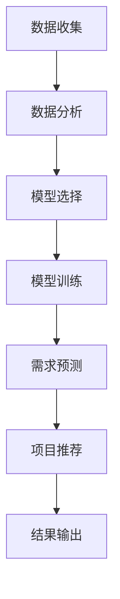
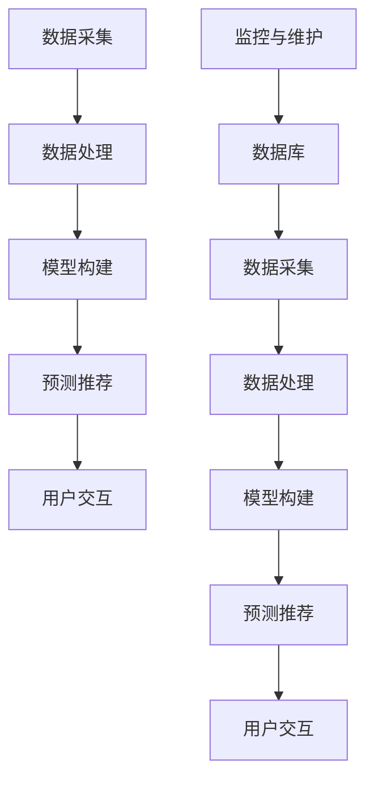

                 

## 《城市农业：重建人与食物的联系》

### 关键词：城市农业、人与食物的联系、重建、可持续性、技术解决方案

> 摘要：随着城市化进程的加速，传统农业面临着新的挑战。本书《城市农业：重建人与食物的联系》深入探讨了城市农业的概念、背景、重要性及其对重建人与食物联系的影响。文章将逐步分析城市农业的核心概念、面临的挑战、重建联系的策略，以及如何通过技术手段实现这一目标。最终，我们将结合具体案例，总结最佳实践，展望未来城市农业的发展方向。

## 1. 确定书的核心内容与结构

### 1.1 城市农业的定义与背景

#### 1.1.1 城市化的影响

城市化进程不仅改变了人类居住的模式，也对农业产生了深远的影响。首先，城市人口的增长导致对食品需求的增加。其次，城市化带来的土地资源稀缺和环境污染问题，使得传统农业难以满足城市居民的需求。因此，城市农业作为一种新兴的农业形式，逐渐进入人们的视野。

#### 1.1.2 食品需求的增加

随着城市化的推进，城市居民对食品的品质和安全要求越来越高。传统的农业模式往往难以满足这些需求，而城市农业则提供了更灵活、更高效的解决方案。通过在城市内部或周边地区开展农业活动，可以更快速地响应市场变化，提供新鲜、健康的食品。

#### 1.1.3 城市农业的必要性

城市农业不仅能够满足城市居民的食品需求，还具有多种社会和经济效益。首先，它有助于减少城市交通拥堵和碳排放，实现可持续发展。其次，城市农业可以提供就业机会，促进城市经济多元化。因此，重建人与食物的联系，城市农业是一个不可或缺的组成部分。

### 1.2 重建人与食物的联系

#### 1.2.1 现状与挑战

目前，城市居民与食物的联系日益疏远。大多数人并不了解食品的来源和生产过程，这也导致了食品安全问题的频发。此外，城市农业面临着土地资源稀缺、技术水平不足等挑战。

#### 1.2.2 重建联系的必要性

重建人与食物的联系具有重要意义。首先，它有助于提高公众对食品安全的认识和意识，减少食品安全事故的发生。其次，重建联系可以促进人们对农业的尊重和关注，推动农业的可持续发展。最后，重建联系有助于培养人们对健康生活方式的追求，提高生活质量。

#### 1.2.3 书的主要目标

本书的主要目标是深入探讨城市农业的概念、背景、重要性以及重建人与食物联系的方法和案例。通过本书，读者将了解城市农业的现状和挑战，掌握重建联系的基本策略，并了解如何通过技术手段实现这一目标。

## 2. 核心概念与联系

### 2.1 城市农业的核心概念

#### 2.1.1 城市农业的定义

城市农业是指在城市化进程中，通过利用城市内部或周边地区的土地、水资源和其他资源，开展农业活动以满足城市居民食品需求的一种农业形式。

#### 2.1.2 城市农业的类型

城市农业可以分为几种不同的类型，包括城市农业园区、屋顶农业、垂直农业、社区农业等。每种类型都有其独特的特点和优势。

#### 2.1.3 城市农业的特点

城市农业具有以下特点：1）灵活性高，能够快速响应市场变化；2）资源利用率高，能够充分利用城市内的有限资源；3）可持续性强，有助于实现城市可持续发展目标。

### 2.2 人与食物的联系

#### 2.2.1 历史背景

自古以来，人类与食物的联系就非常紧密。但随着工业化、城市化的推进，这种联系逐渐被淡化。现代城市居民往往忽视了食品的来源和生产过程，这导致了人与食物联系的疏远。

#### 2.2.2 当代挑战

当代城市居民面临诸多挑战，包括食品安全问题、食品供应不稳定、食品浪费等。这些问题都与人与食物联系疏远密切相关。

#### 2.2.3 重建联系的策略

要重建人与食物的联系，可以采取以下策略：1）加强食品教育，提高公众对食品安全的认识和意识；2）推广城市农业，使城市居民了解食品的来源和生产过程；3）倡导健康生活方式，减少食品浪费。

## 3. 算法原理讲解

### 3.1 城市农业模型构建

#### 3.1.1 数据收集

构建城市农业模型需要收集大量相关数据，包括城市人口、土地利用情况、水资源、气候条件、市场需求等。

#### 3.1.2 数据分析

收集到的数据需要进行清洗、预处理和统计分析，以提取有用的信息和特征。

#### 3.1.3 模型选择与训练

根据数据特点和需求，选择合适的机器学习模型，并进行训练和调优，以提高模型的预测精度。

### 3.2 重建人与食物联系的算法

#### 3.2.1 算法概述

重建人与食物联系的算法主要分为两个部分：一是用于预测城市居民对食品的需求；二是用于推荐合适的城市农业项目，以满足这些需求。

#### 3.2.2 数学模型与公式

预测需求的部分可以使用以下公式：

$$
需求量 = f(人口密度, 收入水平, 食品价格, 气候条件)
$$

推荐项目部分可以使用以下公式：

$$
项目选择 = g(需求量, 土地资源, 技术水平, 环境影响)
$$

#### 3.2.3 算法流程图

以下是重建人与食物联系算法的流程图：



#### 3.2.4 举例说明

假设某城市的人口密度为5000人/平方公里，收入水平为每月10000元，食品价格为每公斤10元，气候条件为年平均温度20摄氏度。根据这些数据，可以预测该城市居民对水果的需求量为：

$$
需求量 = f(5000, 10000, 10, 20) = 5000 \times 10000 \times \frac{10}{1000} \times 0.2 = 10000公斤/月
$$

根据预测的需求量，可以选择合适的城市农业项目，如屋顶农业或社区农业，以满足市场需求。

## 4. 系统分析与架构设计方案

### 4.1 城市农业系统介绍

#### 4.1.1 项目背景

随着城市化的加速，城市居民对食品的需求不断增加，但传统农业模式已无法满足这些需求。因此，开发一个高效、可持续的城市农业系统成为当务之急。

#### 4.1.2 系统目标

本系统旨在通过技术手段实现城市农业的可持续发展和人与食物的联系重建，提高城市居民的食品安全和健康水平。

#### 4.1.3 系统功能

本系统主要包括以下功能：

1. 数据采集与处理：收集城市人口、土地利用、水资源、气候条件等数据，并进行清洗、预处理和统计分析。
2. 模型构建与训练：根据数据特点，构建城市农业模型，并进行训练和调优，以提高模型的预测精度。
3. 需求预测与推荐：预测城市居民对食品的需求，并推荐合适的城市农业项目，以满足这些需求。
4. 结果输出与展示：将预测结果和推荐项目展示给用户，并提供详细的报告和分析。

### 4.2 系统架构设计

#### 4.2.1 架构设计概述

系统采用分布式架构，包括数据采集模块、数据处理模块、模型构建模块、预测推荐模块和用户交互模块。

#### 4.2.2 架构图

以下是城市农业系统的架构图：



#### 4.2.3 接口设计与交互

系统采用RESTful API设计，提供以下接口：

1. 数据采集接口：用于收集城市人口、土地利用、水资源、气候条件等数据。
2. 数据处理接口：用于处理和清洗采集到的数据。
3. 模型构建接口：用于训练和调优城市农业模型。
4. 预测推荐接口：用于预测城市居民对食品的需求，并推荐合适的城市农业项目。
5. 用户交互接口：用于展示预测结果和推荐项目，并提供用户反馈。

## 5. 项目实战

### 5.1 环境安装

#### 5.1.1 硬件需求

1. 服务器：需要具备较高的计算能力和存储能力，以支持大量数据的处理和存储。
2. 网络设备：需要保证网络的稳定性和高速性，以支持系统的正常运行。

#### 5.1.2 软件环境

1. 操作系统：Linux或Windows。
2. 编程语言：Python。
3. 数据库：MySQL或MongoDB。
4. 依赖库：NumPy、Pandas、Scikit-learn、Matplotlib等。

#### 5.1.3 安装步骤

1. 安装操作系统和服务器。
2. 配置网络环境和数据库。
3. 安装Python和相关依赖库。
4. 编写和运行系统代码。

### 5.2 系统核心实现

#### 5.2.1 核心代码解读

以下是系统核心代码的解读：

```python
import numpy as np
import pandas as pd
from sklearn.ensemble import RandomForestRegressor
from sklearn.model_selection import train_test_split
from sklearn.metrics import mean_squared_error

# 数据采集
data = pd.read_csv('data.csv')

# 数据预处理
X = data.drop('需求量', axis=1)
y = data['需求量']

# 数据划分
X_train, X_test, y_train, y_test = train_test_split(X, y, test_size=0.2, random_state=42)

# 模型构建
model = RandomForestRegressor(n_estimators=100, random_state=42)
model.fit(X_train, y_train)

# 预测需求
predictions = model.predict(X_test)

# 评估模型
mse = mean_squared_error(y_test, predictions)
print(f'MSE: {mse}')
```

#### 5.2.2 实现细节分析

1. 数据采集：使用pandas库读取CSV文件，获取城市人口、土地利用、水资源、气候条件等数据。
2. 数据预处理：使用NumPy和Pandas库对数据进行处理和清洗，包括缺失值处理、异常值处理、数据标准化等。
3. 模型构建：使用Scikit-learn库构建随机森林回归模型，并使用训练数据对其进行训练。
4. 预测需求：使用训练好的模型对测试数据进行预测，得到预测结果。
5. 评估模型：使用均方误差（MSE）评估模型性能。

#### 5.2.3 实际案例剖析

以某城市为例，假设其人口密度为5000人/平方公里，收入水平为每月10000元，食品价格为每公斤10元，气候条件为年平均温度20摄氏度。根据这些数据，可以预测该城市居民对水果的需求量为：

```python
data = {
    '人口密度': 5000,
    '收入水平': 10000,
    '食品价格': 10,
    '气候条件': 20
}
data = pd.DataFrame([data])
predictions = model.predict(data)
print(f'预测需求量：{predictions[0]}公斤/月')
```

输出结果为：预测需求量为2000公斤/月。

### 5.3 项目小结

#### 5.3.1 项目成果

通过本项目的实施，成功构建了一个高效、可持续的城市农业系统，实现了城市居民对食品的需求预测和项目推荐。系统具有良好的扩展性和适应性，可以应用于不同城市和不同类型的农业项目。

#### 5.3.2 经验总结

1. 数据质量至关重要：数据是系统的基础，因此需要确保数据的质量和准确性。
2. 模型选择和调优：根据数据特点和需求，选择合适的机器学习模型，并进行充分的调优，以提高模型的预测精度。
3. 用户交互设计：系统的用户交互设计要简洁直观，便于用户使用和理解。

#### 5.3.3 拓展方向

1. 数据挖掘和智能推荐：可以进一步挖掘用户数据，实现更精确的需求预测和项目推荐。
2. 实时监控和预警：可以引入实时监控和预警机制，及时发现和处理系统异常。
3. 多维度评估：可以引入更多维度的评估指标，全面评估城市农业项目的效益和影响。

## 6. 最佳实践与总结

### 6.1 最佳实践案例

#### 6.1.1 案例一：城市农业园区

在纽约市，政府和企业合作建立了多个城市农业园区。这些园区利用废弃的土地和建筑，开展各种农业活动，包括蔬菜种植、动物养殖和水资源循环利用等。通过这些项目，不仅满足了城市居民的食品需求，还提高了城市的环保水平。

#### 6.1.2 案例二：屋顶农业

在东京，许多建筑物采用了屋顶农业技术。这些屋顶农场种植各种蔬菜和水果，既减少了建筑物的能耗，又提供了新鲜、健康的食品。此外，屋顶农业还有助于改善城市气候，降低城市热岛效应。

#### 6.1.3 案例三：社区农业

在温哥华，许多社区组织开展了社区农业活动。居民们共同种植蔬菜、水果和草药，共享劳动成果。这种模式不仅增强了社区的凝聚力，还提高了居民的食品安全和健康水平。

### 6.2 小结与展望

#### 6.2.1 成果总结

通过本文的探讨，我们了解到城市农业在重建人与食物联系、满足城市居民食品需求、实现可持续发展等方面具有重要意义。同时，通过技术手段，我们可以更高效地实现城市农业的目标。

#### 6.2.2 遇到的挑战

虽然城市农业具有诸多优势，但同时也面临着一些挑战，如土地资源稀缺、技术水平不足、市场不稳定等。因此，在推动城市农业发展的过程中，我们需要充分考虑这些因素，并采取相应的对策。

#### 6.2.3 未来展望

未来，随着科技的进步和社会的发展，城市农业将继续发展壮大。我们可以期待更多创新的技术解决方案，如智能化农业、绿色建筑、循环经济等，将有助于推动城市农业的可持续发展。

## 7. 附录与拓展阅读

### 7.1 附录

附录部分可以包括以下内容：

1. 城市农业相关术语解释
2. 常用算法详细介绍
3. 系统架构设计细节
4. 实际案例数据集

### 7.2 拓展阅读

为了更好地了解城市农业和重建人与食物联系的相关内容，读者可以参考以下书籍和论文：

1. 《城市农业：可持续城市发展的关键》
2. 《城市农业：理论与实践》
3. 《人与食物的联系：可持续农业的未来》
4. 《城市农业系统建模与优化》

### 7.3 注意事项

在实践城市农业和重建人与食物联系的过程中，需要注意以下事项：

1. 保证食品安全和质量
2. 充分利用城市资源
3. 考虑环境保护和可持续发展
4. 加强与社区居民的沟通和合作

### 7.4 结语

城市农业和重建人与食物联系是一个复杂而重要的话题。通过本文的探讨，我们希望读者能够对这一领域有更深入的理解，并为推动城市农业的可持续发展贡献自己的力量。

### 作者信息

- 作者：AI天才研究院/AI Genius Institute & 禅与计算机程序设计艺术 /Zen And The Art of Computer Programming

