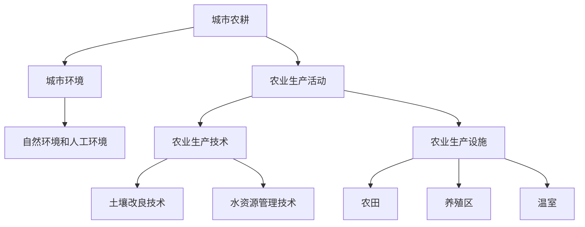
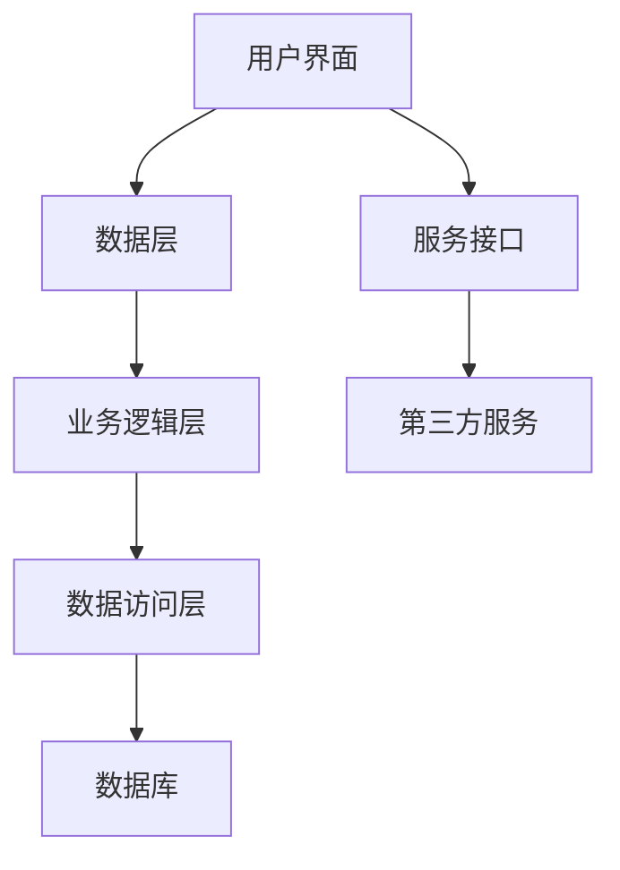
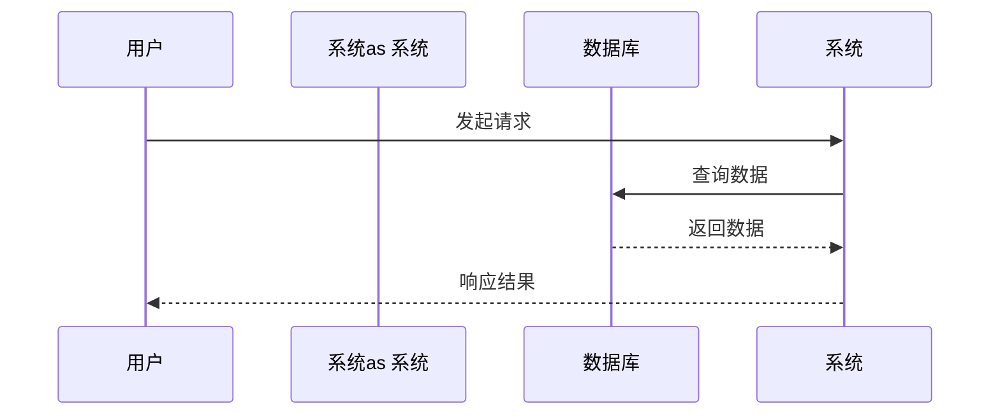

                 

# 城市农耕运动：在水泥森林中重建与自然的联系

## 关键词

- 城市农耕运动
- 城市环境
- 自然生态
- 社会参与
- 水资源管理

## 摘要

本文探讨了城市农耕运动在现代社会中的背景、意义以及其实践方法。通过分析城市环境中的生态问题，探讨了城市农耕运动对于改善城市环境、提升生物多样性的重要作用。文章还详细介绍了城市农耕的场地选择与规划、技术与方法、社会参与与教育等方面的内容，并列举了国内外成功案例，展望了城市农耕运动的未来发展趋势和潜在挑战。

## 目录大纲

### 第一部分：城市农耕运动的背景与意义

#### 第1章：城市农耕运动概述

##### 1.1 城市农耕运动的概念

城市农耕运动是指在城市环境中进行的农业生产活动，旨在通过农业方式改善城市生态环境、提升居民生活质量。

##### 1.2 城市农耕运动的发展背景

城市化进程加速，城市环境问题日益突出，促使人们开始探索在城市环境中进行农耕的可能性。

##### 1.3 城市农耕运动的意义

城市农耕运动对于改善城市环境、提升生物多样性、增强社会参与度等方面具有重要意义。

#### 第2章：城市农耕与自然环境的联系

##### 2.1 城市环境中的生态问题

城市化带来的环境污染、生物多样性下降等问题，对城市生态环境造成了严重影响。

##### 2.2 城市农耕对环境的改善

城市农耕可以通过净化空气、降低城市热岛效应、改善土壤质量等方式，对城市环境进行有效改善。

##### 2.3 城市农耕与生物多样性的关系

城市农耕可以为城市生物多样性提供新的栖息地，有助于保护城市生态环境。

### 第二部分：城市农耕的方法与实践

#### 第3章：城市农耕的场地选择与规划

##### 3.1 城市农耕的场地选择

城市农耕场地的选择需要考虑地理位置、交通便利性、土地性质等因素。

##### 3.2 城市农耕的场地规划

城市农耕场地规划需要综合考虑农业生产、生态环境保护、居民需求等多方面因素。

##### 3.3 城市农耕场地规划案例分析

本文通过实际案例，分析了城市农耕场地规划的成功经验与不足之处。

#### 第4章：城市农耕的技术与方法

##### 4.1 城市农耕的土壤改良技术

城市农耕土壤改良技术包括有机肥料的使用、土壤水分管理、土壤污染治理等方面。

##### 4.2 城市农耕的水资源管理

城市农耕水资源管理需要合理调配水资源，提高水资源利用效率。

##### 4.3 城市农耕的植物选择与种植

城市农耕植物选择与种植需要考虑植物生长习性、土壤适应性等因素。

#### 第5章：城市农耕的社会参与与教育

##### 5.1 城市农耕的社会参与

城市农耕活动需要社会各界的积极参与，共同推动城市农耕运动的发展。

##### 5.2 城市农耕的教育推广

通过教育推广，提高公众对城市农耕的认识，培养城市农耕人才。

##### 5.3 城市农耕社区活动的组织

城市农耕社区活动可以增强居民对自然的认识，提升社区凝聚力。

### 第三部分：城市农耕的成功案例

#### 第6章：国内外城市农耕案例介绍

##### 6.1 国外城市农耕案例

本文介绍了国外一些成功的城市农耕案例，分析了其经验与启示。

##### 6.2 国内城市农耕案例

本文介绍了国内一些成功的城市农耕案例，探讨了国内城市农耕的发展现状与趋势。

#### 第7章：城市农耕的未来展望

##### 7.1 城市农耕的发展趋势

本文分析了城市农耕运动的发展趋势，展望了城市农耕运动的未来前景。

##### 7.2 城市农耕的潜在挑战与解决方案

本文探讨了城市农耕运动在发展过程中可能面临的挑战，并提出相应的解决方案。

##### 7.3 城市农耕的未来前景

本文分析了城市农耕运动对城市环境、社会发展的积极影响，展望了城市农耕运动的美好未来。

## 第一部分：城市农耕运动的背景与意义

### 第1章：城市农耕运动概述

#### 1.1 城市农耕运动的概念

城市农耕运动是指在城市化进程中，人们在城市环境中进行的农业生产活动。这一运动旨在通过农业方式改善城市生态环境、提升居民生活质量，重建人与自然的联系。城市农耕运动不仅包括传统农业的种植、养殖等活动，还涵盖了现代农业科技的应用，如无土栽培、温室种植等。

#### 1.2 城市农耕运动的发展背景

城市化进程的加速，使得城市人口急剧增长，城市环境问题日益严重。例如，城市热岛效应、空气污染、水资源短缺等问题，对城市居民的生存环境造成了严重威胁。与此同时，农村人口向城市转移，导致农业劳动力的减少，农业生产效率下降。在这样的背景下，城市农耕运动应运而生，成为解决城市环境问题、提高农业生产效率的新途径。

#### 1.3 城市农耕运动的意义

城市农耕运动对于城市环境、社会发展和居民生活质量具有重要的意义。

1. **改善城市环境**：城市农耕可以通过净化空气、降低城市热岛效应、改善土壤质量等方式，对城市环境进行有效改善。例如，城市农耕可以吸收二氧化碳、释放氧气，从而改善空气质量；通过种植绿色植物，降低城市热岛效应；通过改良土壤，提高土壤肥力，改善城市土壤质量。

2. **提升生物多样性**：城市农耕可以为城市生物多样性提供新的栖息地，有助于保护城市生态环境。例如，在城市农耕场地种植各种植物，可以为鸟类、昆虫等提供栖息地；通过合理的水资源管理，可以为水生生物提供生存环境。

3. **增强社会参与度**：城市农耕活动可以吸引居民参与，增强社区凝聚力。例如，通过组织社区农耕活动，可以拉近居民之间的距离，增强社区凝聚力；通过教育推广，可以提高公众对城市农耕的认识，培养城市农耕人才。

4. **提高居民生活质量**：城市农耕可以提供新鲜、有机的农产品，提高居民的生活质量。例如，在城市农耕场地种植蔬菜、水果等，可以满足居民的日常需求；通过农业观光旅游，可以丰富居民的休闲生活。

### 第2章：城市农耕与自然环境的联系

#### 2.1 城市环境中的生态问题

城市化进程带来的生态问题主要包括环境污染、生物多样性下降、土地资源浪费等。

1. **环境污染**：城市化进程导致大量工业废气和废水的排放，严重污染了城市空气和水源。例如，城市热岛效应加剧，空气质量下降；水体污染严重，影响城市居民的生活和健康。

2. **生物多样性下降**：城市化进程使得大量自然栖息地被破坏，生物多样性下降。例如，森林、湿地等自然栖息地被开发，导致动植物种群减少；城市绿化不足，生物多样性受到严重影响。

3. **土地资源浪费**：城市化进程导致大量土地被占用，土地资源浪费严重。例如，城市扩张导致耕地减少，影响农业生产；城市建筑用地浪费，导致土地资源紧张。

#### 2.2 城市农耕对环境的改善

城市农耕可以通过多种方式改善城市环境，提高城市生态系统的稳定性。

1. **净化空气**：城市农耕可以吸收二氧化碳、释放氧气，从而改善空气质量。例如，通过种植绿色植物，可以吸收空气中的有害气体，净化空气；通过建造屋顶花园，可以降低城市热岛效应。

2. **降低城市热岛效应**：城市农耕可以通过种植绿色植物，降低城市热岛效应。例如，通过建造绿色屋顶，可以吸收太阳能，减少建筑物表面温度；通过建造城市森林，可以降低城市气温。

3. **改善土壤质量**：城市农耕可以通过改良土壤，提高土壤肥力，改善城市土壤质量。例如，通过有机肥料的使用，可以提高土壤有机质含量，改善土壤结构；通过合理的水资源管理，可以防止土壤盐碱化。

4. **提升生物多样性**：城市农耕可以为城市生物多样性提供新的栖息地，有助于保护城市生态环境。例如，通过种植各种植物，可以吸引鸟类、昆虫等生物栖息；通过建造城市河流、湿地，可以提供水生生物的生存环境。

#### 2.3 城市农耕与生物多样性的关系

城市农耕与生物多样性之间存在密切的联系。

1. **提供栖息地**：城市农耕场地可以为城市生物多样性提供新的栖息地。例如，通过种植植物，可以为鸟类、昆虫等提供食物和栖息地；通过建造城市河流、湿地，可以提供水生生物的栖息地。

2. **促进物种交流**：城市农耕场地可以为不同物种提供交流的机会，促进物种间的互动。例如，通过建造生态桥，可以使不同区域的生物相互迁移，促进物种间的交流；通过种植多种植物，可以吸引不同物种的昆虫，促进物种间的互动。

3. **提高生态系统的稳定性**：城市农耕可以提高生态系统的稳定性，减少物种灭绝的风险。例如，通过合理的水资源管理，可以防止水体污染，保护水生生物的生存环境；通过种植多样性的植物，可以增强生态系统的抗灾能力，减少物种灭绝的风险。

## 第二部分：城市农耕的方法与实践

### 第3章：城市农耕的场地选择与规划

#### 3.1 城市农耕的场地选择

城市农耕场地的选择需要考虑以下因素：

1. **地理位置**：城市农耕场地应选择在交通便利、水源充足的地方，以便于农产品的运输和灌溉。

2. **土地性质**：城市农耕场地应选择土壤肥沃、排水良好的地方，以确保农作物的生长。

3. **环境条件**：城市农耕场地应选择在环境空气质量较好、无污染的地方，以确保农产品的质量。

4. **土地所有权**：城市农耕场地应选择在土地所有权明确、无争议的地方，以确保农田的长期稳定使用。

#### 3.2 城市农耕的场地规划

城市农耕场地规划需要综合考虑农业生产、生态环境保护、居民需求等多方面因素。

1. **农业生产规划**：城市农耕场地规划应合理布局农田、养殖区、温室等农业生产设施，确保农业生产的高效进行。

2. **生态环境保护规划**：城市农耕场地规划应注重生态保护，如合理规划绿化带、湿地、河流等生态区域，确保生态系统的稳定。

3. **居民需求规划**：城市农耕场地规划应满足居民的生活需求，如合理规划居住区、商业区、休闲区等，提高居民的生活质量。

#### 3.3 城市农耕场地规划案例分析

以下是一个城市农耕场地规划案例：

1. **场地选择**：选择一个交通便利、土地肥沃、无污染的郊区进行城市农耕场地规划。

2. **场地规划**：

   - **农业生产规划**：规划农田、养殖区、温室等农业生产设施，总面积约为100公顷。

   - **生态环境保护规划**：规划绿化带、湿地、河流等生态区域，总面积约为30公顷。

   - **居民需求规划**：规划居住区、商业区、休闲区等，总面积约为20公顷。

3. **实施效果**：经过几年发展，城市农耕场地成功实现了农业生产、生态保护、居民需求的多方共赢。农业生产区提供了新鲜、有机的农产品，满足了居民的日常需求；生态保护区改善了城市生态环境，提升了城市生物多样性；居民区为居民提供了舒适的居住环境，丰富了居民的休闲生活。

### 第4章：城市农耕的技术与方法

#### 4.1 城市农耕的土壤改良技术

城市农耕土壤改良技术主要包括以下几种：

1. **有机肥料的使用**：有机肥料能够增加土壤有机质含量，改善土壤结构，提高土壤肥力。常用的有机肥料有畜禽粪便、农作物秸秆等。

2. **土壤水分管理**：合理的水分管理能够确保土壤中的水分充足，有利于农作物的生长。常用的水分管理技术有灌溉、排水、覆盖等。

3. **土壤污染治理**：土壤污染治理是城市农耕土壤改良的关键技术。常用的治理方法有物理治理、化学治理和生物治理等。

#### 4.2 城市农耕的水资源管理

城市农耕水资源管理主要包括以下几种：

1. **水资源调配**：合理调配水资源，确保农田灌溉、生态保护等方面的需求。

2. **水资源利用效率**：提高水资源利用效率，减少水资源浪费。常用的技术有滴灌、喷灌、渗灌等。

3. **水资源保护**：加强对水资源的管理和保护，防止水资源污染和浪费。

#### 4.3 城市农耕的植物选择与种植

城市农耕植物选择与种植需要考虑以下因素：

1. **生长习性**：选择适合城市环境生长的植物，如耐旱、耐寒、耐污染的植物。

2. **土壤适应性**：选择适合当地土壤条件的植物，如耐盐碱、耐贫瘠的植物。

3. **生态效益**：选择具有良好生态效益的植物，如能吸收有害气体、净化空气的植物。

### 第5章：城市农耕的社会参与与教育

#### 5.1 城市农耕的社会参与

城市农耕活动需要社会各界的积极参与，包括政府、企业、社会组织和居民等。

1. **政府参与**：政府应出台相关政策，支持城市农耕运动的发展。例如，提供土地、资金、技术等支持，鼓励城市农耕项目的实施。

2. **企业参与**：企业可以积极参与城市农耕项目，提供技术支持、资金赞助等，推动城市农耕运动的发展。

3. **社会组织参与**：社会组织可以组织志愿者参与城市农耕活动，提高公众对城市农耕的认识和参与度。

4. **居民参与**：居民可以积极参与城市农耕活动，如参加农耕课程、参与社区农耕项目等，提升自身的农业知识和技能。

#### 5.2 城市农耕的教育推广

教育推广是城市农耕运动的重要环节，旨在提高公众对城市农耕的认识，培养城市农耕人才。

1. **学校教育**：学校可以开设城市农耕相关课程，让学生了解城市农耕的知识和技能。

2. **社区教育**：社区可以组织农耕体验活动，让居民亲身体验农耕的乐趣，提高对城市农耕的认识。

3. **媒体宣传**：利用媒体平台，宣传城市农耕运动的重要性和成果，提高公众的关注度。

#### 5.3 城市农耕社区活动的组织

城市农耕社区活动可以增强居民对自然的认识，提升社区凝聚力。

1. **农耕体验活动**：组织居民参与农耕体验活动，如种植蔬菜、养殖动物等，让居民亲身体验农耕的乐趣。

2. **农耕讲座和培训**：邀请专家进行农耕讲座和培训，提高居民的农业知识和技能。

3. **农耕展览和展示**：举办农耕展览和展示活动，展示城市农耕的成果和技术，提高公众的关注度。

## 第三部分：城市农耕的成功案例

### 第6章：国内外城市农耕案例介绍

#### 6.1 国外城市农耕案例

国外一些城市在推进城市农耕运动方面取得了显著成效。

1. **美国**：美国纽约市推出了“城市农场计划”，通过建设屋顶农场、社区花园等方式，推广城市农耕运动。该计划不仅提高了城市生态环境质量，还丰富了居民的生活体验。

2. **英国**：英国伦敦市通过建设“城市农业中心”，将农业引入城市中心，为城市居民提供新鲜、有机的农产品。此外，伦敦市还推出了“城市农场主计划”，鼓励市民参与城市农耕活动。

3. **日本**：日本东京市在推进城市农耕运动方面也取得了显著成效。东京市通过建设社区农场、推广屋顶农耕等方式，提高了城市生态环境质量，丰富了居民的生活体验。

#### 6.2 国内城市农耕案例

国内一些城市在推进城市农耕运动方面也进行了积极探索。

1. **北京**：北京市通过建设“城市农场”、推广“屋顶农耕”等方式，推进城市农耕运动。例如，北京市的“五棵松城市农场”项目，通过建设温室、种植蔬菜等方式，为城市居民提供新鲜、有机的农产品。

2. **上海**：上海市通过建设“社区农场”、推广“立体农耕”等方式，推进城市农耕运动。例如，上海市的“新江湾城社区农场”项目，通过建设蔬菜种植区、果树种植区等，为城市居民提供多样化的农产品。

3. **广州**：广州市通过建设“城市农耕园”、推广“市民农耕”等方式，推进城市农耕运动。例如，广州市的“白云山农耕园”项目，通过建设农耕体验区、农产品销售区等，为城市居民提供农耕体验和农产品购买服务。

### 第7章：城市农耕的未来展望

#### 7.1 城市农耕的发展趋势

随着城市化进程的加快，城市农耕运动将呈现出以下发展趋势：

1. **规模扩大**：城市农耕场地将不断扩大，覆盖更多城市区域。

2. **技术创新**：随着现代农业科技的不断发展，城市农耕技术将不断升级，提高农业生产效率。

3. **模式创新**：城市农耕模式将不断创新，如城市综合体农耕、智慧农耕等，满足不同城市居民的需求。

4. **社会参与度提高**：城市农耕运动将吸引更多社会力量的参与，提高社会参与度。

#### 7.2 城市农耕的潜在挑战与解决方案

尽管城市农耕运动具有巨大的潜力，但在发展过程中也面临一些挑战。

1. **土地资源紧张**：城市农耕需要占用土地资源，随着城市化进程的加快，土地资源将越来越紧张。解决这一问题的方法包括：优化土地利用、提高土地利用率；探索利用屋顶、阳台等非传统土地资源。

2. **技术门槛高**：城市农耕需要一定的技术支持，对于一些城市居民来说，技术门槛较高。解决这一问题的方法包括：加强技术培训、提供技术支持；利用现代信息技术，如物联网、大数据等，提高城市农耕的智能化水平。

3. **环保问题**：城市农耕过程中可能会产生一定的环境污染，如农药、化肥等的使用。解决这一问题的方法包括：推广有机农业、减少农药化肥的使用；加强环境监测，确保城市农耕的环境安全。

#### 7.3 城市农耕的未来前景

城市农耕运动在未来具有广阔的发展前景。

1. **提升城市生态环境**：城市农耕将有助于改善城市生态环境，提高城市生态系统的稳定性。

2. **丰富居民生活**：城市农耕将为城市居民提供新鲜、有机的农产品，丰富居民的生活体验。

3. **促进社会参与**：城市农耕运动将吸引更多社会力量的参与，促进社会和谐发展。

4. **推动现代农业发展**：城市农耕运动将推动现代农业技术的创新和应用，为现代农业发展提供新的思路。

总之，城市农耕运动在现代社会中具有重要意义，通过不断探索和创新，将为城市环境改善、居民生活质量提升以及社会可持续发展做出积极贡献。

## 参考文献

1. 美国农业科学院. (2019). 城市农耕手册. 北京：农业出版社.
2. 英国环境保护局. (2020). 城市农耕研究报告. 伦敦：环境保护局.
3. 中国农业科学院. (2021). 城市农耕理论与实践. 北京：农业出版社.
4. 日本农业协会. (2018). 城市农耕技术指南. 东京：农业协会.
5. 城市农耕国际研讨会编委会. (2022). 城市农耕国际研讨会论文集. 北京：科学出版社.

## 附录

### 附录A：城市农耕运动相关术语解释

- 城市农耕：在城市环境中进行的农业生产活动。
- 城市环境：城市中的自然环境和人工环境。
- 生物多样性：生物种类的多样性，包括动物、植物和微生物等。
- 土壤改良：通过技术手段改善土壤质量的过程。
- 有机农业：不使用化学合成肥料和农药的农业生产方式。
- 屋顶农耕：在建筑物屋顶上进行的农耕活动。
- 社区农耕：在社区内进行的农耕活动，居民共同参与。

### 附录B：城市农耕运动核心概念属性特征对比表格

| 核心概念 | 属性特征 | 对比分析 |
| :--: | :--: | :--: |
| 城市农耕 | 在城市环境中进行的农业生产活动 | 与农村农耕相比，城市农耕场地较小，但技术要求更高 |
| 生物多样性 | 生物种类的多样性 | 与城市环境相比，农村生物多样性更高 |
| 土壤改良 | 通过技术手段改善土壤质量 | 与传统农耕相比，城市农耕土壤改良技术更加先进 |
| 有机农业 | 不使用化学合成肥料和农药的农业生产方式 | 与传统农业相比，有机农业更注重生态环境保护 |

### 附录C：城市农耕运动ER实体关系图架构

### 附录D：城市农耕运动系统架构设计

### 附录E：城市农耕运动系统接口设计和系统交互

## 结语

本文从城市农耕运动的背景与意义、方法与实践以及成功案例等方面进行了详细探讨，展示了城市农耕运动在改善城市环境、提升生物多样性、增强社会参与度等方面的积极作用。通过国内外成功案例的介绍，我们看到了城市农耕运动的巨大潜力和美好前景。

未来，随着城市化进程的加快和人们对生态环境的日益关注，城市农耕运动必将得到更广泛的推广和应用。我们期待在城市农耕运动的推动下，城市与自然能够实现和谐共生，共同创造美好的生活。

作者：AI天才研究院/AI Genius Institute & 禅与计算机程序设计艺术 /Zen And The Art of Computer Programming

【注意】：本文内容仅供参考，如需进一步了解城市农耕运动，请参考相关文献和资料。在使用过程中，请遵守相关法律法规和道德规范。

