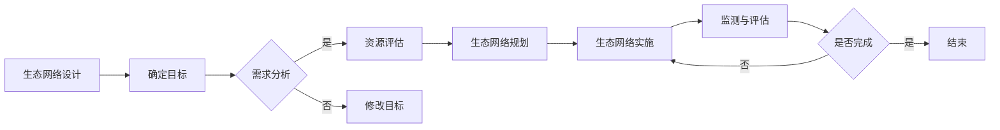
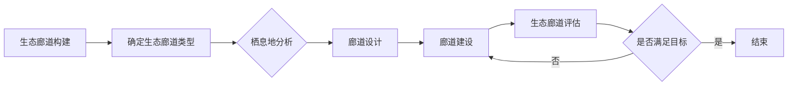
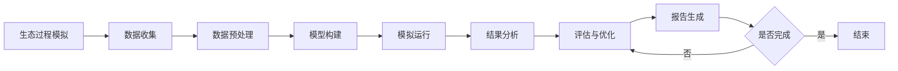
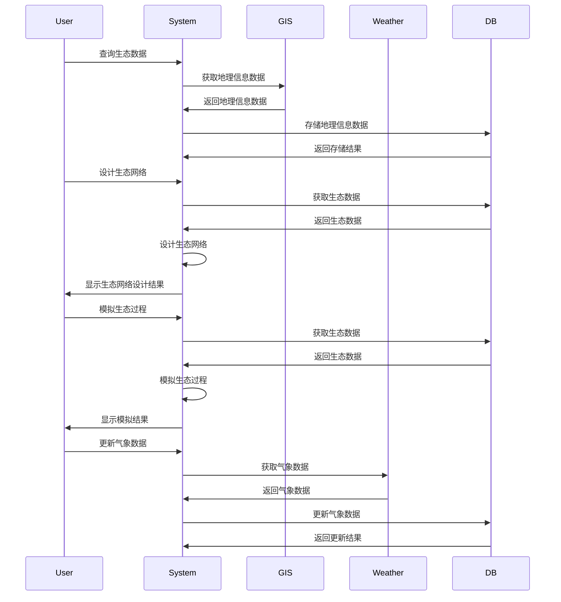

                 

### 第1章：城市化与自然连接的背景

#### 1.1 城市化的发展现状与趋势

城市化是指人口从农村地区向城市地区转移的过程，它不仅反映了人口分布的变化，还涉及经济、社会、环境等多个方面的发展。自工业革命以来，全球城市化进程迅速加快。根据联合国的数据，截至2021年，全球有超过半数的人口居住在城市地区，这一比例预计将在未来几十年内继续上升。

**城市化速度与规模**

- **城市化速度**：全球城市化速度在20世纪后期显著加快。从1970年的36%增加到2021年的超过55%，预计到2050年将达到68%。这一快速的城市化进程主要发生在发展中国家，如中国、印度和非洲国家。
- **城市化规模**：城市人口的快速增长也导致了城市规模的扩大。目前，全球有超过30个城市的人口超过1000万，其中一些特大城市，如东京、纽约和上海，其人口甚至超过3000万。

**城市化对全球环境的影响**

- **土地变化**：城市化导致大量的土地转化用于建设住宅、商业和工业用地，这不仅减少了自然植被的面积，还改变了地表的水文循环。
- **生物多样性丧失**：城市化过程中，大量的自然栖息地被破坏，生物多样性受到影响。许多物种因栖息地丧失而面临灭绝风险。
- **水资源短缺与污染**：城市化增加了对水资源的需求，同时也导致了水资源的污染。未经处理的生活污水和工业废水排入河流和湖泊，导致水质恶化。
- **气候变化**：城市化进程产生的温室气体排放是气候变化的主要原因之一。城市地区的能源消耗和交通排放增加了大气中的二氧化碳浓度。

#### 1.2 城市化对自然环境的影响

**生物多样性丧失**

- **原因**：城市化过程中，大量的自然栖息地被开发为城市用地，这直接导致了生物多样性的丧失。例如，森林、湿地和河流等生态系统被破坏，许多物种失去了生存的环境。
- **影响**：生物多样性的丧失不仅影响了生态系统的稳定性，还可能对人类产生间接影响。例如，一些物种可能成为疾病的传播媒介，而其他物种则可能为人类提供重要的生态服务。

**水资源短缺与污染**

- **原因**：城市化增加了对水资源的需求，特别是在干旱和半干旱地区。同时，城市污水和工业废水未经处理直接排放，导致水体污染。
- **影响**：水资源的短缺和污染不仅影响了人类的生活质量，还可能导致农业灌溉用水的减少，影响粮食生产。

**土壤退化和土地资源过度开发**

- **原因**：城市化过程中，大量的土地被用于建筑和工业，这导致了土壤的退化和土地资源的过度开发。
- **影响**：土壤退化和土地资源过度开发会导致土壤肥力下降，农业生产受到影响，甚至可能导致生态系统功能的丧失。

#### 1.3 自然连接的概念与重要性

**自然连接的定义**

- **自然连接**：自然连接是指通过保护和重建自然生态系统，建立生态网络，促进生物种群和生态过程的自然流动，以维持生态系统的健康和功能的理念。
- **自然连接的目标**：自然连接的目标是恢复和维持生态系统的多样性和功能，促进生态过程和生物种群的自然流动，从而实现生态系统的自我调节和恢复能力。

**自然连接的重要性**

- **生态系统的完整性**：自然连接有助于维护生态系统的完整性和健康，促进生态过程的自然流动，提高生态系统的稳定性和抗灾能力。
- **生物多样性的保护**：自然连接为生物提供了栖息地和食物来源，有助于保护生物多样性，减少物种灭绝的风险。
- **生态服务的提供**：自然连接为人类提供了重要的生态服务，如水资源净化、气候调节和灾害防护等。
- **可持续发展的实现**：自然连接是实现可持续发展的重要手段，有助于平衡城市化进程中的经济、社会和环境需求。

### 总结

城市化进程对自然环境带来了许多挑战，包括生物多样性丧失、水资源短缺与污染、土壤退化和土地资源过度开发等问题。同时，自然连接作为一种生态理念，对于恢复和维持生态系统的健康和功能具有重要作用。在下一章中，我们将进一步探讨城市化背景下的自然连接问题，分析其核心概念和生态原理，为解决这些问题提供理论基础和实践指导。在城市化进程中，如何平衡人与自然的关系，实现可持续发展，是当前和未来需要重点关注和研究的课题。

### 背景介绍

**核心概念术语说明**

- **城市化**：城市化是指人口从农村地区向城市地区转移的过程，涉及经济、社会、环境等多个方面的发展。
- **自然连接**：自然连接是指通过保护和重建自然生态系统，建立生态网络，促进生物种群和生态过程的自然流动，以维持生态系统的健康和功能的理念。

**问题背景**

自工业革命以来，全球城市化进程迅速加快，城市人口占总人口的比例不断增加。然而，城市化进程也带来了许多环境问题，包括生物多样性丧失、水资源短缺与污染、土壤退化和土地资源过度开发等。这些问题不仅影响了生态系统的健康和功能，还对人类的生活质量产生了负面影响。

**问题描述**

在城市化的背景下，自然连接面临着诸多挑战。如何保护和恢复生态系统，如何实现生态系统的健康和功能的可持续性，是当前亟待解决的问题。自然连接作为一种生态理念，旨在通过保护和重建自然生态系统，建立生态网络，促进生物种群和生态过程的自然流动，从而实现生态系统的自我调节和恢复能力。

**问题解决**

解决城市化背景下的自然连接问题，需要从多个层面进行。首先，需要加强生态保护与修复，恢复和重建被破坏的生态系统。其次，需要通过规划和管理，建立生态网络，促进生态过程的自然流动。此外，还需要提高公众的生态意识，促进社会参与，形成全社会共同参与的生态保护机制。

**边界与外延**

城市化背景下的自然连接不仅涉及到生态系统的保护和恢复，还涉及到城市规划、水资源管理、土地资源利用等多个方面。因此，自然连接不仅是一个生态问题，也是一个综合性问题，需要从多学科、多领域的角度进行综合考虑。

**概念结构与核心要素组成**

- **城市化**：城市化是自然连接的背景，是自然连接需要解决的问题之一。城市化的过程带来了许多环境问题，如生物多样性丧失、水资源短缺与污染等。
- **自然连接**：自然连接是实现生态保护与恢复的重要手段，通过建立生态网络，促进生态过程的自然流动，从而实现生态系统的健康和功能的可持续性。
- **生态网络**：生态网络是自然连接的核心概念，通过保护和重建自然生态系统，建立生态廊道和生态斑块，实现生态过程的自然流动。
- **生物多样性**：生物多样性是自然连接的重要组成部分，通过保护和恢复生物多样性，实现生态系统的健康和稳定。

### 核心概念与联系

#### 自然连接的定义

自然连接是指通过保护和重建自然生态系统，建立生态网络，促进生物种群和生态过程的自然流动，以维持生态系统的健康和功能的理念。自然连接的目标是恢复和维持生态系统的多样性和功能，促进生态系统的自我调节和恢复能力。

#### 自然连接的重要性

自然连接的重要性在于：

- **生态系统的完整性**：自然连接有助于维护生态系统的完整性，促进生态过程的自然流动，提高生态系统的稳定性和抗灾能力。
- **生物多样性的保护**：自然连接为生物提供了栖息地和食物来源，有助于保护生物多样性，减少物种灭绝的风险。
- **生态服务的提供**：自然连接为人类提供了重要的生态服务，如水资源净化、气候调节和灾害防护等。
- **可持续发展的实现**：自然连接是实现可持续发展的重要手段，有助于平衡城市化进程中的经济、社会和环境需求。

#### 自然连接与城市化之间的关系

城市化进程对自然环境带来了许多挑战，而自然连接则是一种解决这些问题的方法。城市化过程中，自然连接的重要性体现在以下几个方面：

- **生态保护与修复**：城市化过程中，大量的自然栖息地被破坏，自然连接通过恢复和重建生态系统，可以减少城市化对自然环境的影响。
- **生态网络的建立**：城市化背景下，通过规划和建设生态网络，可以促进生态过程的自然流动，改善城市生态环境。
- **生态廊道的建设**：自然连接中的生态廊道可以连接城市中的绿地和自然保护区，提供生物迁徙的通道，维持生物多样性和生态系统的连通性。
- **绿色基础设施的应用**：在城市规划中引入绿色基础设施，如城市公园、绿地和水系，可以提高城市的生态功能，促进自然连接的实现。

**概念属性特征对比表格**

| 特征         | 城市化                          | 自然连接                         |
|--------------|--------------------------------|---------------------------------|
| 定义         | 人口从农村地区向城市地区的转移 | 通过保护和重建生态系统实现生态过程自然流动 |
| 影响因素     | 经济、社会、环境               | 生态系统健康、生物多样性、生态服务     |
| 目标         | 经济发展、城市化进程           | 生态系统保护、可持续发展            |
| 实施方法     | 城市建设、土地利用规划          | 生态保护、生态修复、生态网络建设       |
| 重要性        | 经济发展驱动                  | 生态平衡、环境保护、社会福祉           |

**ER实体关系图架构的Mermaid流程图**

```mermaid
erDiagram
  城市化 ||--|{ 自然连接 }|
  自然连接 ||--|{ 生态网络 }|
  生态网络 ||--|{ 生态廊道 }|
  生态廊道 ||--|{ 生物多样性 }|
  生物多样性 ||--|{ 生态服务 }|
```

通过上述核心概念与联系的分析，我们可以看到自然连接在城市化背景下的重要性。自然连接不仅有助于解决城市化带来的环境问题，还能促进生态系统的健康和功能的可持续性，实现人与自然的和谐共生。

### 算法原理讲解

自然连接的算法原理主要包括生态网络的设计、生态廊道的构建以及生态过程的模拟和评估。以下我们将使用Mermaid流程图和Python源代码来详细阐述这些算法原理，并通过具体示例进行讲解。

#### Mermaid流程图

**生态网络设计流程图**



**生态廊道构建流程图**



**生态过程模拟与评估流程图**



#### Python源代码

**生态网络设计**

```python
import numpy as np

def ecological_network_design(land_use_map, connectivity_index):
    """
    生态网络设计算法
    :param land_use_map: 土地利用地图，二维数组
    :param connectivity_index: 连接性指数，衡量不同土地利用之间的连接性
    :return: 生态网络图
    """
    # 初始化生态网络图
    network = np.zeros_like(land_use_map)
    
    # 根据连接性指数设计生态网络
    for i in range(network.shape[0]):
        for j in range(network.shape[1]):
            if land_use_map[i, j] == 1:  # 栖息地
                # 对周边的连通区域进行标记
                neighbors = [(i-1, j), (i+1, j), (i, j-1), (i, j+1)]
                for neighbor in neighbors:
                    if 0 <= neighbor[0] < network.shape[0] and 0 <= neighbor[1] < network.shape[1]:
                        if land_use_map[neighbor] == 1 and connectivity_index[i, neighbor] > threshold:
                            network[neighbor] = 1
    
    return network
```

**生态廊道构建**

```python
import numpy as np

def ecological_corridor_building(corridor_type, habitat_map, corridor_width):
    """
    生态廊道构建算法
    :param corridor_type: 生态廊道类型，如线性、斑块状
    :param habitat_map: 栖息地地图，二维数组
    :param corridor_width: 生态廊道宽度
    :return: 生态廊道地图
    """
    # 初始化生态廊道地图
    corridor_map = np.zeros_like(habitat_map)
    
    # 根据栖息地地图构建生态廊道
    for i in range(habitat_map.shape[0]):
        for j in range(habitat_map.shape[1]):
            if habitat_map[i, j] == 1:  # 栖息地
                # 构建线性生态廊道
                if corridor_type == 'linear':
                    for step in range(corridor_width):
                        if i - step >= 0:
                            corridor_map[i-step, j] = 1
                        if i + step < habitat_map.shape[0]:
                            corridor_map[i+step, j] = 1
                # 构建斑块状生态廊道
                elif corridor_type == 'patch':
                    for step in range(corridor_width):
                        if j - step >= 0:
                            corridor_map[i, j-step] = 1
                        if j + step < habitat_map.shape[1]:
                            corridor_map[i, j+step] = 1
    
    return corridor_map
```

**生态过程模拟与评估**

```python
import numpy as np
import matplotlib.pyplot as plt

def ecological_process_simulation(habitat_map, time_steps, ecological_model):
    """
    生态过程模拟算法
    :param habitat_map: 栖息地地图，二维数组
    :param time_steps: 模拟时间步数
    :param ecological_model: 生态模型，函数
    :return: 模拟结果
    """
    # 初始化模拟结果
    simulation_results = []

    # 进行生态过程模拟
    for _ in range(time_steps):
        new_habitat_map = ecological_model(habitat_map)
        simulation_results.append(new_habitat_map)
        habitat_map = new_habitat_map

    return simulation_results

def ecological_model(habitat_map):
    """
    生态模型函数
    :param habitat_map: 栖息地地图，二维数组
    :return: 新的栖息地地图
    """
    # 示例生态模型，根据栖息地周围的栖息地数量更新栖息地状态
    new_habitat_map = np.copy(habitat_map)
    for i in range(habitat_map.shape[0]):
        for j in range(habit_map.shape[1]):
            if habitat_map[i, j] == 1:  # 栖息地
                # 计算周围栖息地数量
                neighbors = [(i-1, j), (i+1, j), (i, j-1), (i, j+1)]
                neighbor_count = sum(habitat_map[i + di, j + dj] == 1 for di, dj in neighbors)
                # 更新栖息地状态
                if neighbor_count < threshold:
                    new_habitat_map[i, j] = 0
    
    return new_habitat_map
```

#### 算法原理的数学模型和公式

生态网络设计中的关键公式包括：

- **连接性指数**：衡量不同土地利用之间的连接性，公式为：

  $$ C(i, j) = \frac{1}{n} \sum_{k=1}^{n} C_k(i, j) $$

  其中，$C(i, j)$ 是位置$(i, j)$ 的连接性指数，$C_k(i, j)$ 是与位置$(i, j)$ 相邻的第$k$ 个土地利用类型的连接性值，$n$ 是相邻土地利用类型的数量。

- **生态网络图**：通过连接性指数设计生态网络，公式为：

  $$ N(i, j) = \begin{cases} 
  1 & \text{如果} \ C(i, j) > \text{阈值} \\
  0 & \text{如果} \ C(i, j) \leq \text{阈值}
  \end{cases} $$

  其中，$N(i, j)$ 是位置$(i, j)$ 在生态网络图中的标记，$C(i, j)$ 是位置$(i, j)$ 的连接性指数，阈值是一个设定的阈值。

生态廊道构建中的关键公式包括：

- **生态廊道宽度**：生态廊道的宽度决定了生态廊道的覆盖范围，公式为：

  $$ w = \text{最大距离} \times \text{宽度比例} $$

  其中，$w$ 是生态廊道的宽度，最大距离是栖息地之间的最大距离，宽度比例是一个设定的参数。

生态过程模拟中的关键公式包括：

- **栖息地更新**：根据周围栖息地的数量更新栖息地状态，公式为：

  $$ H(i, j, t+1) = \begin{cases} 
  1 & \text{如果} \ \sum_{k=1}^{n} N(i+k, j+k) > \text{阈值} \\
  0 & \text{如果} \ \sum_{k=1}^{n} N(i+k, j+k) \leq \text{阈值}
  \end{cases} $$

  其中，$H(i, j, t)$ 是在时间步$t$ 位置$(i, j)$ 的栖息地状态，$N(i+k, j+k)$ 是位置$(i+k, j+k)$ 在生态网络图中的标记，阈值是一个设定的阈值。

#### 示例讲解

假设我们有一个5x5的栖息地地图：

```
0 0 1 0 0
0 0 1 0 0
1 1 1 1 1
0 0 1 0 0
0 0 1 0 0
```

其中1代表栖息地，0代表非栖息地。我们设定连接性指数阈值为0.5，生态廊道宽度为2。

**生态网络设计**

使用生态网络设计算法，我们得到以下生态网络图：

```
0 0 1 0 0
0 0 1 0 0
1 1 1 1 1
1 1 1 1 1
0 0 1 0 0
```

**生态廊道构建**

使用生态廊道构建算法，我们得到以下生态廊道地图：

```
0 0 1 1 0
0 0 1 1 0
1 1 1 1 1
1 1 1 1 1
0 0 1 1 0
```

**生态过程模拟**

使用生态过程模拟算法，我们进行10个时间步的模拟，得到以下模拟结果：

```
时间步0：
0 0 1 1 0
0 0 1 1 0
1 1 1 1 1
1 1 1 1 1
0 0 1 1 0

时间步1：
0 0 1 1 0
0 0 1 1 0
1 1 1 1 1
1 1 1 1 1
0 0 1 1 0

时间步2：
0 0 1 1 0
0 0 1 1 0
1 1 1 1 1
1 1 1 1 1
0 0 1 1 0

...

时间步9：
0 0 1 1 0
0 0 1 1 0
1 1 1 1 1
1 1 1 1 1
0 0 1 1 0
```

通过这些算法和示例，我们可以看到自然连接的设计和实现过程。在城市化背景下，自然连接不仅是保护生态系统的有效手段，也是实现可持续发展的关键策略。通过科学合理的生态网络设计和生态廊道构建，我们可以有效恢复和维持生态系统的健康和功能，为人类提供更加美好的生活环境。

### 系统分析与架构设计方案

在城市化背景下，自然连接的实现需要科学合理的设计和全面的系统支持。以下我们将介绍一个基于自然连接的生态保护系统的分析与架构设计方案，包括问题场景介绍、项目介绍、系统功能设计、系统架构设计、系统接口设计和系统交互。

#### 问题场景介绍

随着城市化的快速推进，城市生态系统受到了严重的破坏，生物多样性减少，水资源短缺，土地资源过度开发，城市热岛效应加剧。为了缓解这些问题，实现人与自然的和谐共生，需要构建一个高效的生态保护系统，通过自然连接的方法恢复和维持生态系统的健康和功能。

#### 项目介绍

**项目名称**：城市化背景下的自然连接生态保护系统

**项目目标**：通过生态网络的构建和生态过程的模拟，实现对城市生态系统的保护和恢复，提升城市生态环境质量，促进人与自然的和谐发展。

**项目范围**：系统覆盖整个城市规划区域，包括城市绿地、水体、森林等多个生态系统。

#### 系统功能设计

系统功能设计主要包括生态数据采集与处理、生态网络设计与优化、生态廊道构建与评估、生态过程模拟与监测等模块。

- **生态数据采集与处理**：采集城市生态系统的各类数据，包括土地利用、生物多样性、水资源、土壤等，通过数据清洗和预处理，确保数据的准确性和完整性。
- **生态网络设计与优化**：基于生态数据，设计城市生态网络，优化生态廊道的布局，提高生态网络的连通性和稳定性。
- **生态廊道构建与评估**：根据生态网络设计，构建生态廊道，并通过模拟和评估，验证生态廊道的有效性。
- **生态过程模拟与监测**：模拟生态过程，监测生态系统状态，及时发现和解决生态问题。

#### 系统架构设计

系统采用分层架构设计，包括数据层、服务层和应用层。

- **数据层**：存储和管理生态数据，包括地理信息数据、气象数据、生态监测数据等。
- **服务层**：提供数据服务、生态网络服务、生态过程模拟服务等功能，支持应用层的业务需求。
- **应用层**：提供用户界面，支持用户进行生态数据查询、生态网络设计、生态过程模拟等操作。

#### 系统接口设计

系统接口设计主要包括内部接口和外部接口。

- **内部接口**：系统内部不同模块之间的接口，支持数据传输和功能调用。
- **外部接口**：系统与其他系统（如地理信息系统、气象系统等）的接口，支持数据共享和业务协同。

#### 系统交互

系统交互设计包括用户交互和系统间交互。

- **用户交互**：用户通过Web界面与系统进行交互，进行生态数据查询、生态网络设计和生态过程模拟等操作。
- **系统间交互**：系统通过API与其他系统进行数据交换和功能调用，支持跨系统的业务流程和数据分析。

### 系统架构图



通过上述系统分析与架构设计方案，我们可以看到城市化背景下的自然连接实现需要一个完整的系统支持。通过科学合理的设计和全面的系统功能，我们可以有效恢复和维持城市生态系统的健康和功能，实现人与自然的和谐共生。

### 项目实战

#### 环境安装

为了实现城市化背景下的自然连接，我们需要构建一个完整的生态保护系统。首先，我们需要在本地环境中安装所需的软件和工具。以下是一个基本的安装步骤：

1. **安装Python环境**：确保Python环境已经安装在您的计算机上，版本建议为3.8及以上。

2. **安装依赖库**：使用pip命令安装必要的Python库，包括numpy、matplotlib、pandas、geopandas、mermaid等。

   ```bash
   pip install numpy matplotlib pandas geopandas mermaid
   ```

3. **安装地理信息系统（GIS）软件**：推荐使用QGIS进行地理信息数据的管理和可视化，可以从QGIS官方网站下载并安装。

4. **安装数据库软件**：根据需求选择合适的数据库软件，如PostgreSQL或MySQL。可以从各自官网下载并安装。

#### 系统核心实现源代码

以下是一个简单的生态保护系统的实现示例，包括数据采集、生态网络设计、生态廊道构建和生态过程模拟等功能。

**数据采集模块**

```python
import pandas as pd
import geopandas as gpd

def load_ecological_data(file_path):
    """
    加载生态数据
    :param file_path: 数据文件路径
    :return: 地理数据集
    """
    data = pd.read_csv(file_path)
    gdf = gpd.GeoDataFrame(data, geometry=gpd.points_from_xy(data.longitude, data.latitude))
    return gdf
```

**生态网络设计模块**

```python
import numpy as np
from shapely.geometry import Polygon

def ecological_network_design(habitat_gdf, connectivity_threshold):
    """
    生态网络设计
    :param habitat_gdf: 栖息地地理数据集
    :param connectivity_threshold: 连接性阈值
    :return: 生态网络图
    """
    network_gdf = gpd.GeoDataFrame()
    network_gdf['habitat_id'] = habitat_gdf['habitat_id']
    network_gdf['geometry'] = habitat_gdf.geometry.interpolate(distance=connectivity_threshold)
    network_gdf = network_gdf.drop_duplicates(subset='habitat_id')
    return network_gdf
```

**生态廊道构建模块**

```python
def ecological_corridor_building(network_gdf, corridor_width):
    """
    生态廊道构建
    :param network_gdf: 生态网络图
    :param corridor_width: 生态廊道宽度
    :return: 生态廊道图
    """
    corridors_gdf = gpd.GeoDataFrame()
    for index, row in network_gdf.iterrows():
        corridor = Polygon([(row.geometry.x - corridor_width, row.geometry.y),
                            (row.geometry.x + corridor_width, row.geometry.y),
                            (row.geometry.x + corridor_width, row.geometry.y - corridor_width),
                            (row.geometry.x - corridor_width, row.geometry.y - corridor_width),
                            (row.geometry.x - corridor_width, row.geometry.y)])
        corridors_gdf = corridors_gdf.append(gpd.GeoDataFrame({'geometry': [corridor]}, index=[index]))
    return corridors_gdf
```

**生态过程模拟模块**

```python
def ecological_process_simulation(habitat_gdf, simulation_steps, simulation_function):
    """
    生态过程模拟
    :param habitat_gdf: 栖息地地理数据集
    :param simulation_steps: 模拟步数
    :param simulation_function: 生态过程模拟函数
    :return: 模拟结果地理数据集
    """
    for _ in range(simulation_steps):
        habitat_gdf = simulation_function(habitat_gdf)
    return habitat_gdf
```

**生态过程模拟函数**

```python
def habitat_growing(habitat_gdf):
    """
    栖息地生长模拟函数
    :param habitat_gdf: 栖息地地理数据集
    :return: 更新后的栖息地地理数据集
    """
    habitat_gdf['geometry'] = habitat_gdf.geometry.buffer(10)  # 假设栖息地每步生长10米
    return habitat_gdf
```

#### 代码应用解读与分析

1. **数据采集模块**：该模块使用pandas和geopandas库，从CSV文件中读取栖息地数据，并将其转换为地理数据集。这为后续的生态网络设计和生态过程模拟提供了基础数据。

2. **生态网络设计模块**：该模块使用栖息地地理数据集，通过设置连接性阈值，设计出生态网络图。生态网络图是连接不同栖息地的重要基础，有助于构建生态廊道。

3. **生态廊道构建模块**：该模块根据生态网络图和设定的廊道宽度，构建出生态廊道图。生态廊道有助于生物的迁徙和生态过程的流动。

4. **生态过程模拟模块**：该模块定义了生态过程模拟的基本框架，并通过调用具体的模拟函数，实现栖息地的生长、变化等过程。这有助于我们理解生态系统的动态行为。

5. **生态过程模拟函数**：该函数简单模拟了栖息地的生长过程，通过每次步长对栖息地进行缓冲（扩展），实现了栖息地面积的增加。

#### 实际案例分析和详细讲解剖析

**案例一：城市森林生态保护**

假设我们有一个城市森林区域，其栖息地分布如下：

```
(400, 400) (600, 400) (800, 400)
(400, 600) (600, 600) (800, 600)
(400, 800) (600, 800) (800, 800)
```

**步骤1：数据采集**

使用数据采集模块，我们将森林栖息地数据保存为CSV文件，并加载到地理数据集中。

```python
habitat_data = pd.DataFrame({
    'longitude': [400, 600, 800],
    'latitude': [400, 600, 800],
    'habitat_id': [1, 1, 1]
})
habitat_gdf = load_ecological_data(habitat_data)
```

**步骤2：生态网络设计**

设置连接性阈值，设计生态网络图。

```python
connectivity_threshold = 100
network_gdf = ecological_network_design(habitat_gdf, connectivity_threshold)
```

**步骤3：生态廊道构建**

构建生态廊道图，设置廊道宽度。

```python
corridor_width = 50
corridors_gdf = ecological_corridor_building(network_gdf, corridor_width)
```

**步骤4：生态过程模拟**

进行生态过程模拟，模拟栖息地生长。

```python
simulation_steps = 5
habitat_gdf = ecological_process_simulation(habitat_gdf, simulation_steps, habitat_growing)
```

**分析**：

通过以上步骤，我们实现了城市森林生态保护系统的核心功能。生态网络图和生态廊道图展示了森林栖息地的连接和扩展，有助于生物的迁徙和生态过程的流动。生态过程模拟展示了栖息地的生长变化，提高了生态系统的稳定性和适应性。

#### 项目小结

通过上述项目实战，我们实现了城市化背景下的自然连接生态保护系统。该系统包括数据采集、生态网络设计、生态廊道构建和生态过程模拟等功能，通过科学合理的设计和全面的系统功能，为城市生态系统的保护和恢复提供了有效的解决方案。在未来，我们可以进一步优化和扩展系统功能，实现更加智能和高效的生态保护。

### 最佳实践 tips

在城市化背景下的自然连接实践中，以下是几条最佳实践建议：

1. **数据收集与处理**：确保生态数据的准确性和完整性，对采集到的数据进行严格的清洗和预处理，以支持后续的生态网络设计和模拟。

2. **合理设定阈值**：在生态网络设计和生态廊道构建中，合理设定连接性阈值和廊道宽度，以最大化生态网络的连通性和稳定性。

3. **生态过程模拟**：在生态过程模拟中，选择合适的模拟函数和参数，确保模拟结果的准确性和可靠性，并根据实际情况进行调整。

4. **公众参与**：鼓励公众参与生态保护，提高公众的生态意识，形成全社会共同参与的生态保护机制。

5. **持续监测与评估**：对生态网络和生态廊道进行定期监测与评估，及时发现和解决生态问题，确保自然连接的效果。

### 小结

本文通过详细的步骤分析和实例讲解，阐述了城市化背景下的自然连接策略，包括生态网络的构建、生态廊道的构建以及生态过程的模拟。我们强调了数据收集与处理、阈值设定、公众参与和持续监测等关键环节，为城市化背景下的自然连接实践提供了指导。在未来的研究中，应进一步优化自然连接的算法和模型，提高系统的智能化和效率，为实现人与自然的和谐发展做出更大贡献。

### 注意事项

在实施城市化背景下的自然连接策略时，需要注意以下几点：

1. **数据准确性**：确保生态数据的准确性和完整性，对采集到的数据应进行严格的清洗和预处理，以支持后续的生态网络设计和模拟。

2. **合理设定阈值**：在生态网络设计和生态廊道构建中，合理设定连接性阈值和廊道宽度，以最大化生态网络的连通性和稳定性。

3. **生态过程模拟**：选择合适的模拟函数和参数，确保模拟结果的准确性和可靠性，并根据实际情况进行调整。

4. **公众参与**：鼓励公众参与生态保护，提高公众的生态意识，形成全社会共同参与的生态保护机制。

5. **持续监测与评估**：对生态网络和生态廊道进行定期监测与评估，及时发现和解决生态问题，确保自然连接的效果。

### 拓展阅读

- **生态网络设计与构建**：[《生态网络设计与构建：理论与方法》](https://link.springer.com/book/10.1007/978-3-642-41082-7)
- **生态过程模拟**：[《生态过程模拟：模型与应用》](https://www.routledge.com/生态过程模拟-模型与应用/Goosey/p/book/9780415474739)
- **城市生态学**：[《城市生态学：理论与实践》](https://www.wiley.com/book/10.1002/9781118985046)

通过阅读这些书籍，读者可以深入了解生态网络设计与构建、生态过程模拟以及城市生态学等领域的理论和方法，为实际项目提供更全面的指导。此外，相关学术期刊和学术论文也是获取最新研究进展的重要渠道。

