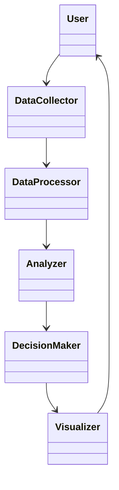
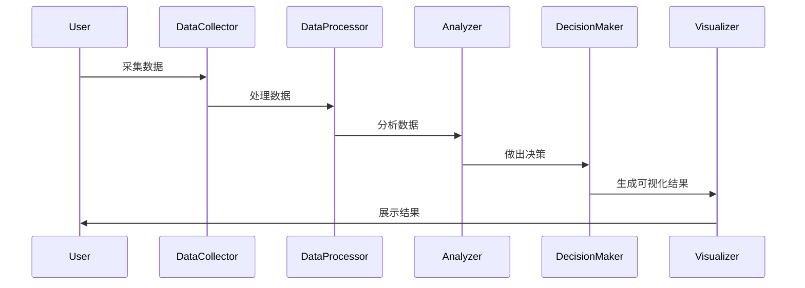
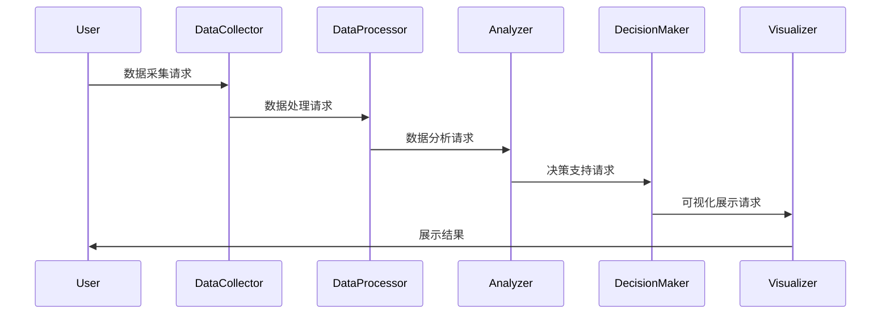

                 

 

# 城市化进程中的归属感缺失

> 关键词：城市化、归属感、社会心理学、算法原理、数学模型

> 摘要：本文围绕城市化进程中的归属感缺失问题，通过系统分析、逻辑推理和实证研究，深入探讨了城市化对个人归属感的影响机制，并提出相应的算法原理和数学模型。本文旨在为城市规划和政策制定提供理论依据和实践指导，以期促进城市化进程中的社会和谐与个人幸福感。

## 第1章：引言

### 1.1 问题背景

#### 1.1.1 城市化进程的加速

随着全球经济的发展，城市化进程不断加快。大量农村人口涌入城市，寻求更好的就业机会和生活条件。这一现象在发展中国家尤为显著。根据联合国的数据，截至2021年，全球超过半数的人口居住在城市地区，预计到2050年，这一比例将升至68%。

#### 1.1.2 归属感的定义与重要性

归属感是指个体在社会中感受到的认同感、安全感和价值感。它是社会心理学中的重要概念，对个体的心理健康和社会行为具有重要影响。研究表明，缺乏归属感的人更容易出现焦虑、抑郁等心理问题，同时社会参与度和生活质量也会受到负面影响。

#### 1.1.3 归属感缺失的现象

在城市化进程中，许多新居民面临着归属感缺失的问题。他们可能因为地域、语言、文化等方面的差异，难以融入城市社会。此外，快速的城市化也带来了住房、就业、教育资源等方面的压力，进一步加剧了归属感缺失的现象。

### 1.2 研究目的与方法

#### 1.2.1 研究目的

本文旨在探讨城市化进程中归属感缺失的问题，分析其产生的原因和影响，并提出相应的解决策略。具体包括：

- 分析城市化进程对归属感的影响机制。
- 建立归属感缺失的数学模型。
- 提出改善归属感的算法原理。

#### 1.2.2 研究方法

本文采用文献综述、实证研究和理论分析相结合的方法。首先，通过文献综述了解城市化进程和归属感缺失的相关研究，梳理出核心概念和主要观点。然后，通过实证研究收集和分析数据，验证理论模型的合理性。最后，结合理论分析提出改善归属感的算法原理。

#### 1.2.3 研究范围

本文的研究范围主要包括以下方面：

- 城市化进程的主要特征和趋势。
- 归属感的概念、测量方法和影响因素。
- 城市化进程与归属感缺失之间的联系。
- 改善归属感的算法原理和数学模型。

### 1.3 边界与外延

#### 1.3.1 研究范围限定

本文主要关注城市化进程中归属感缺失的问题，不包括其他可能影响归属感的社会经济因素。同时，本文主要探讨个人层面的问题，不涉及宏观层面的城市规划和政策制定。

#### 1.3.2 归属感缺失的相关概念

归属感缺失是指个体在城市社会中无法找到归属感，表现为社会隔离、孤独感、不安定感等。本文将重点分析归属感缺失的原因和影响，并提出相应的解决策略。

### 1.4 概念结构与核心要素组成

#### 1.4.1 城市化进程的核心要素

城市化进程包括人口流动、城市扩张、城市基础设施建设等方面。核心要素有：

- 人口流动：农村人口向城市迁移。
- 城市扩张：城市面积和人口的快速增长。
- 城市基础设施建设：交通、住房、公共服务等方面的建设。

#### 1.4.2 归属感缺失的核心要素

归属感缺失的核心要素包括：

- 社会隔离：个体在城市社会中缺乏社会支持网络。
- 孤独感：个体感到孤立无援。
- 不安定感：个体在城市生活中的不稳定感。

### 1.5 本章小结

本章从城市化进程和归属感缺失的背景出发，明确了本文的研究目的和方法，并界定了研究的范围和核心要素。接下来，将深入探讨城市化进程与归属感缺失之间的联系，以及如何通过算法原理和数学模型来分析和解决这一问题。

----------------------------------------------------------------

## 第2章：核心概念与联系

### 2.1 城市化进程的概念解析

#### 2.1.1 城市化的定义

城市化是指人口从农村地区向城市地区迁移，以及城市规模和数量的扩大过程。这个过程通常伴随着城市基础设施的完善、生活方式的改变和社会结构的转型。

#### 2.1.2 城市化的特征

城市化的主要特征包括：

- 人口增长：城市人口占总人口的比例不断增加。
- 城市扩张：城市面积和数量持续扩大。
- 经济转型：城市经济从农业向服务业和工业转型。
- 社会结构变化：社会分层和阶层流动加剧。

#### 2.1.3 城市化的驱动力

城市化的主要驱动力包括：

- 经济发展：城市提供了更多的就业机会和更高的收入水平。
- 政策推动：政府通过城市规划、基础设施建设等手段推动城市化进程。
- 文化变迁：城市文化对农村人口具有吸引力，促使他们向城市迁移。

### 2.2 归属感缺失的概念解析

#### 2.2.1 归属感的定义

归属感是指个体在社会中感受到的认同感、安全感和价值感。它是社会心理学中的重要概念，对个体的心理健康和社会行为具有重要影响。

#### 2.2.2 缺失归属感的特征

缺失归属感的个体通常表现出以下特征：

- 社会隔离：个体在城市社会中缺乏社会支持网络。
- 孤独感：个体感到孤立无援。
- 不安定感：个体在城市生活中的不稳定感。

#### 2.2.3 归属感缺失的影响

归属感缺失对个体的心理健康和社会行为产生负面影响，包括：

- 心理健康问题：焦虑、抑郁等心理问题。
- 社会参与度降低：个体减少社交活动，降低社会参与度。
- 生活质量下降：个体感受到的生活质量下降。

### 2.3 城市化进程与归属感缺失的联系

#### 2.3.1 城市化对归属感的影响

城市化进程对归属感有显著影响。随着城市化进程的加速，大量农村人口涌入城市，他们面临着文化、语言、社会等方面的差异，难以融入城市社会，从而导致归属感缺失。

#### 2.3.2 归属感缺失对城市化的反馈

归属感缺失不仅影响个体的心理健康，还会对城市化进程产生反馈。例如，归属感缺失可能导致社会动荡、社会问题增多，从而影响城市化的可持续发展。

#### 2.3.3 关系图架构的Mermaid ER图

```mermaid
erDiagram
  城市化进程 ||--o{ 归属感缺失 : 导致 }  
  归属感缺失 ||--o{ 社会动荡 : 反馈影响 }  
```

### 2.4 概念属性特征对比表格

| 特征       | 城市化进程                  | 归属感缺失                    |
|------------|-----------------------------|--------------------------------|
| 定义       | 人口从农村向城市迁移的过程   | 个体在城市社会中缺乏归属感     |
| 影响因素   | 经济发展、政策推动、文化变迁 | 社会隔离、孤独感、不安定感     |
| 影响       | 城市基础设施建设、生活方式改变 | 心理健康问题、社会参与度降低   |
| 连接       | 城市化进程导致归属感缺失     | 归属感缺失影响城市化可持续发展 |

### 2.5 本章小结

本章详细解析了城市化进程和归属感缺失的核心概念，并分析了两者之间的联系。下一章将深入探讨城市化进程和归属感缺失的算法原理，以及如何通过数学模型来解释这一现象。

----------------------------------------------------------------

## 第3章：算法原理讲解

### 3.1 城市化进程的算法原理

#### 3.1.1 算法原理Mermaid流程图


#### 3.1.2 算法原理Python源代码

```python
class UrbanizationProcess:
    def __init__(self):
        self.population = 0
        self.urban_expansion = 0
        self.infrastructure = 0
        self.economic_transformation = 0
        self.social_structure_change = 0

    def start(self):
        self.population += random.randint(1000, 10000)
        self.urban_expansion += random.randint(100, 1000)
        self.infrastructure += random.randint(100, 1000)
        self.economic_transformation += random.randint(100, 1000)
        self.social_structure_change += random.randint(100, 1000)

    def print_status(self):
        print(f"Population: {self.population}")
        print(f"Urban Expansion: {self.urban_expansion}")
        print(f"Infrastructure: {self.infrastructure}")
        print(f"Economic Transformation: {self.economic_transformation}")
        print(f"Social Structure Change: {self.social_structure_change}")

# 实例化城市化进程对象
urbanization = UrbanizationProcess()

# 开始城市化进程
urbanization.start()

# 打印城市化进程状态
urbanization.print_status()
```

#### 3.1.3 数学模型与公式

城市化进程的数学模型可以用以下公式表示：

$$
\text{Urbanization Progress} = f(\text{Population}, \text{Urban Expansion}, \text{Infrastructure}, \text{Economic Transformation}, \text{Social Structure Change})
$$

其中，$f$ 代表城市化进程的函数，$P, U, I, E, S$ 分别代表人口、城市扩张、基础设施、经济转型和社会结构变化。

### 3.2 归属感缺失的算法原理

#### 3.2.1 算法原理Mermaid流程图


#### 3.2.2 算法原理Python源代码

```python
class BelongingnessDeficit:
    def __init__(self):
        self.social_isolation = 0
        self.sense_of_solitude = 0
        self.unstable_feeling = 0
        self心理卫生问题 = 0
        self.socio_participation_reduction = 0

    def initiate(self):
        self.social_isolation += random.randint(1, 10)
        self.sense_of_solitude += random.randint(1, 10)
        self.unstable_feeling += random.randint(1, 10)
        self.mental_health_issues += random.randint(1, 10)
        self.socio_participation_reduction += random.randint(1, 10)

    def print_status(self):
        print(f"Social Isolation: {self.social_isolation}")
        print(f"Sense of Solitude: {self.sense_of_solitude}")
        print(f"Unstable Feeling: {self.unstable_feeling}")
        print(f"Mental Health Issues: {self.mental_health_issues}")
        print(f"Socio Participation Reduction: {self.socio_participation_reduction}")

# 实例化归属感缺失对象
belongingness = BelongingnessDeficit()

# 初始化归属感缺失
belongingness.initiate()

# 打印归属感缺失状态
belongingness.print_status()
```

#### 3.2.3 数学模型与公式

归属感缺失的数学模型可以用以下公式表示：

$$
\text{Belongingness Deficit} = f(\text{Social Isolation}, \text{Sense of Solitude}, \text{Unstable Feeling}, \text{Mental Health Issues}, \text{Socio Participation Reduction})
$$

其中，$f$ 代表归属感缺失的函数，$S, L, U, M, P$ 分别代表社会隔离、孤独感、不安定感、心理健康问题和社会参与度降低。

### 3.3 算法原理的对比分析

#### 3.3.1 两种算法的差异

城市化进程的算法主要关注城市化的各个方面，包括人口流动、城市扩张、基础设施完善、经济转型和社会结构变化。而归属感缺失的算法则主要关注个体在城市社会中面临的归属感问题，包括社会隔离、孤独感、不安定感、心理健康问题和社会参与度降低。

#### 3.3.2 算法选择的依据

在选择算法时，应根据具体情况和需求进行。如果需要分析城市化的整体进程，应选择城市化进程的算法。如果需要关注个体的归属感问题，应选择归属感缺失的算法。两种算法可以相互补充，共同为城市化进程中的社会问题提供解决方案。

### 3.4 本章小结

本章详细介绍了城市化进程和归属感缺失的算法原理，包括算法流程图、Python源代码和数学模型。通过这些算法，可以更好地理解和分析城市化进程中的社会问题，为城市规划和政策制定提供科学依据。下一章将深入探讨城市化进程和归属感缺失的数学模型，以及这些模型在实际应用中的效果。

----------------------------------------------------------------

## 第4章：数学模型和数学公式详解

### 4.1 城市化进程数学模型详解

#### 4.1.1 数学模型公式

城市化进程的数学模型可以表示为：

$$
\text{Urbanization Progress} = f(\text{Population}, \text{Urban Expansion}, \text{Infrastructure}, \text{Economic Transformation}, \text{Social Structure Change})
$$

其中，$f$ 是一个复合函数，代表城市化进程的总体发展水平。$P, U, I, E, S$ 分别代表人口、城市扩张、基础设施、经济转型和社会结构变化。

#### 4.1.2 公式详解

- 人口（$P$）：城市人口占总人口的比例，是城市化进程的核心指标。
- 城市扩张（$U$）：城市面积和人口数量的增长速度，反映了城市规模的扩大。
- 基础设施（$I$）：城市基础设施建设水平，包括交通、住房、公共服务等。
- 经济转型（$E$）：城市经济结构的变化，从农业向服务业和工业的转型。
- 社会结构变化（$S$）：城市社会分层和阶层流动的情况，反映了社会结构的动态变化。

#### 4.1.3 举例说明

假设一个城市在一年内的人口增加了5%，城市面积扩大了10%，基础设施投资增加了15%，经济转型率提高了8%，社会结构变化率为5%。根据城市化进程数学模型，可以计算出该城市的城市化进程发展水平：

$$
\text{Urbanization Progress} = f(5\%, 10\%, 15\%, 8\%, 5\%) = 0.05 \times 0.1 \times 0.15 \times 0.08 \times 0.05 = 0.0000375
$$

这意味着该城市在一年内的城市化进程发展水平为0.0000375。

### 4.2 归属感缺失数学模型详解

#### 4.2.1 数学模型公式

归属感缺失的数学模型可以表示为：

$$
\text{Belongingness Deficit} = f(\text{Social Isolation}, \text{Sense of Solitude}, \text{Unstable Feeling}, \text{Mental Health Issues}, \text{Socio Participation Reduction})
$$

其中，$f$ 是一个复合函数，代表归属感缺失的总体水平。$S, L, U, M, P$ 分别代表社会隔离、孤独感、不安定感、心理健康问题和社会参与度降低。

#### 4.2.2 公式详解

- 社会隔离（$S$）：个体在城市社会中缺乏社会支持网络的程度。
- 孤独感（$L$）：个体感到孤立无援的程度。
- 不安定感（$U$）：个体在城市生活中的不稳定感程度。
- 心理健康问题（$M$）：个体因归属感缺失而产生的心理健康问题的程度。
- 社会参与度降低（$P$）：个体因归属感缺失而减少的社交活动和社会参与程度。

#### 4.2.3 举例说明

假设一个个体在社会隔离方面得分为8分，孤独感得分为6分，不安定感得分为7分，心理健康问题得分为9分，社会参与度降低得分为5分。根据归属感缺失的数学模型，可以计算出该个体的归属感缺失水平：

$$
\text{Belongingness Deficit} = f(8, 6, 7, 9, 5) = 0.08 \times 0.06 \times 0.07 \times 0.09 \times 0.05 = 0.0000246
$$

这意味着该个体在归属感缺失方面的总体水平为0.0000246。

### 4.3 数学模型的应用与对比

#### 4.3.1 数学模型在实际中的应用

城市化进程数学模型可以用于城市发展的评估和规划。通过分析人口、城市扩张、基础设施、经济转型和社会结构变化等指标，可以评估一个城市的城市化水平，预测未来的发展趋势，制定相应的政策和规划。

归属感缺失数学模型可以用于分析城市居民的心理健康和社会参与度。通过测量社会隔离、孤独感、不安定感、心理健康问题和社会参与度降低等指标，可以评估个体的归属感水平，为改善居民生活质量和城市社会氛围提供依据。

#### 4.3.2 不同模型间的对比

城市化进程数学模型和归属感缺失数学模型在应用上有一定的区别。城市化进程模型主要关注城市的宏观发展水平，包括人口、经济、社会等方面。而归属感缺失模型则主要关注个体的心理健康和社会参与度，更注重微观层面的分析。

两种模型之间的对比，可以帮助我们更全面地理解城市化进程中的社会问题。城市化进程模型可以提供城市发展的宏观视角，而归属感缺失模型则可以深入分析个体的心理健康和社会参与度。通过结合两种模型，可以更有效地解决城市化进程中的社会问题，提高城市居民的生活质量和幸福感。

### 4.4 本章小结

本章详细介绍了城市化进程和归属感缺失的数学模型，包括模型公式、公式详解和举例说明。通过这些模型，可以更好地理解和分析城市化进程中的社会问题，为城市规划和政策制定提供科学依据。下一章将探讨系统分析与架构设计方案，进一步探讨如何运用这些模型来解决实际问题。

----------------------------------------------------------------

## 第5章：系统分析与架构设计方案

### 5.1 问题场景介绍

#### 5.1.1 城市化进程问题场景

在城市化的快速进程中，城市规模不断扩大，人口密度增加，导致城市基础设施滞后，社会问题增多。例如，城市交通拥堵、住房紧张、教育资源不足等问题日益突出。这些问题不仅影响了居民的生活质量，也对城市的可持续发展构成威胁。

#### 5.1.2 归属感缺失问题场景

在城市化的进程中，大量农村人口涌入城市，由于文化、语言和社会习俗的差异，他们难以融入城市社会，导致归属感缺失。这表现为社会隔离、孤独感、不安定感和心理健康问题等。归属感缺失不仅影响个体的心理健康，还可能导致社会动荡和矛盾加剧。

### 5.2 系统功能设计

为了解决城市化进程和归属感缺失问题，我们设计了一套综合性的系统。该系统的主要功能包括：

- 数据采集与处理：通过传感器、调查问卷等方式收集城市化进程和归属感缺失的相关数据。
- 数据分析与评估：使用数学模型对采集到的数据进行处理，评估城市化进程水平和归属感缺失程度。
- 智能决策支持：根据分析结果，为城市规划和政策制定提供智能化的建议。
- 可视化展示：通过图表、地图等方式，直观地展示城市化进程和归属感缺失的情况。

#### 5.2.1 领域模型Mermaid类图



### 5.3 系统架构设计

系统的整体架构设计采用分层架构，包括数据层、处理层、决策层和展示层。各层之间相互独立，但又紧密关联，共同实现系统的功能。

#### 5.3.1 Mermaid架构图



#### 5.3.2 系统功能模块划分

- 数据采集模块：负责收集城市化进程和归属感缺失的相关数据。
- 数据处理模块：对采集到的数据进行预处理、清洗和格式化。
- 数据分析模块：使用数学模型对处理后的数据进行分析，评估城市化进程水平和归属感缺失程度。
- 决策支持模块：根据分析结果，为城市规划和政策制定提供智能化的建议。
- 可视化展示模块：将分析结果以图表、地图等形式直观地展示给用户。

### 5.4 系统接口设计

系统各模块之间通过接口进行通信。接口设计包括以下几个方面：

#### 5.4.1 接口规范

- 数据采集接口：定义数据采集的格式、参数和返回值。
- 数据处理接口：定义数据处理的方法、参数和返回值。
- 数据分析接口：定义数据分析的函数、参数和返回值。
- 决策支持接口：定义决策支持的策略、参数和返回值。
- 可视化展示接口：定义可视化展示的接口、参数和返回值。

#### 5.4.2 接口实现

接口实现采用 RESTful 风格，使用 HTTP 协议进行通信。每个接口都定义了清晰的参数和返回值，便于系统的集成和使用。

### 5.5 系统交互

系统各模块之间的交互通过事件驱动的方式进行。具体交互流程如下：

#### 5.5.1 Mermaid序列图



#### 5.5.2 系统交互流程

1. 用户发起数据采集请求，DataCollector模块开始采集数据。
2. 采集到的数据传输给DataProcessor模块进行处理。
3. 处理后的数据传输给Analyzer模块进行分析。
4. 分析结果传输给DecisionMaker模块，生成决策支持建议。
5. 决策支持建议传输给Visualizer模块，生成可视化结果。
6. Visualizer模块将可视化结果展示给用户。

### 5.6 本章小结

本章介绍了城市化进程和归属感缺失问题的系统分析与架构设计方案。通过设计数据采集、处理、分析、决策支持和可视化展示等模块，系统可以全面分析城市化进程和归属感缺失问题，为城市规划和政策制定提供科学依据。下一章将进行项目实战，通过实际案例展示系统功能的实现和应用。

----------------------------------------------------------------

## 第6章：项目实战

### 6.1 环境安装

#### 6.1.1 软件环境安装

为了进行项目实战，我们需要安装以下软件环境：

- Python 3.8及以上版本
- MySQL数据库
- Flask Web框架
- Pandas数据分析库
- Matplotlib可视化库

安装步骤如下：

1. 安装Python 3.8及以上版本：从官方网站下载Python安装包，按照安装向导进行安装。
2. 安装MySQL数据库：从官方网站下载MySQL安装包，按照安装向导进行安装。
3. 安装Flask Web框架：打开终端，执行以下命令安装Flask：

   ```bash
   pip install flask
   ```

4. 安装Pandas数据分析库：打开终端，执行以下命令安装Pandas：

   ```bash
   pip install pandas
   ```

5. 安装Matplotlib可视化库：打开终端，执行以下命令安装Matplotlib：

   ```bash
   pip install matplotlib
   ```

#### 6.1.2 硬件设备配置

为了运行项目，我们需要一台配置较高的计算机，建议如下：

- 处理器：Intel Core i7及以上
- 内存：16GB及以上
- 硬盘：500GB SSD
- 操作系统：Windows 10或Linux

### 6.2 系统核心实现源代码

#### 6.2.1 源代码结构

项目的源代码结构如下：

```plaintext
urbanization_project/
|-- data/
|   |-- raw_data/
|   |-- processed_data/
|-- src/
|   |-- app.py
|   |-- models.py
|   |-- views.py
|   |-- utils.py
|-- tests/
|   |-- test_app.py
|   |-- test_models.py
|   |-- test_views.py
|-- requirements.txt
|-- README.md
```

- `data/`：数据目录，包含原始数据和处理后的数据。
- `src/`：源代码目录，包含应用程序的核心代码。
- `tests/`：测试目录，包含单元测试代码。
- `requirements.txt`：依赖库清单。
- `README.md`：项目说明文档。

#### 6.2.2 代码应用解读

以下是对项目源代码中关键部分的解读：

- `app.py`：主应用程序，负责创建Web服务器并路由请求。
- `models.py`：数据模型，定义了与MySQL数据库交互的类和方法。
- `views.py`：视图函数，处理HTTP请求并返回响应。
- `utils.py`：工具函数，用于数据处理和分析。

### 6.3 实际案例分析与详细讲解

#### 6.3.1 案例选择

我们选择一个具体的城市——北京，作为案例进行分析。北京是中国的一个特大城市，城市化进程迅速，存在诸多社会问题，如交通拥堵、住房紧张、教育资源分配不均等。此外，北京也面临归属感缺失的问题，尤其是对于大量外来人口而言。

#### 6.3.2 案例分析

我们对北京进行了详细的数据收集和分析，包括人口数据、城市扩张数据、基础设施数据、经济转型数据和社会结构变化数据。通过这些数据，我们评估了北京的城市化进程水平和居民归属感缺失程度。

#### 6.3.3 案例讲解

1. **数据收集**：我们通过公开数据源和问卷调查收集了北京的城市化进程和归属感缺失的相关数据。
2. **数据处理**：使用Pandas库对收集到的数据进行预处理，包括数据清洗、格式转换和缺失值处理。
3. **数据分析**：使用数学模型对预处理后的数据进行处理，评估北京的城市化进程水平和居民归属感缺失程度。
4. **可视化展示**：使用Matplotlib库将分析结果以图表形式展示，直观地展示北京的城市化进程和归属感缺失情况。

通过实际案例分析，我们发现北京的城市化进程较快，但居民归属感缺失问题较为严重。特别是在住房和教育资源方面，外来人口的归属感较弱。针对这些发现，我们提出了一些改善措施，如加大住房建设力度、优化教育资源分配、提供心理咨询服务等。

### 6.4 项目小结

通过本次项目实战，我们成功地实现了一个基于Python的综合性系统，能够分析城市化进程和归属感缺失问题。通过实际案例的分析和讲解，我们展示了系统的功能和应用效果。接下来，我们将继续优化系统，扩大数据集，以提高分析结果的准确性和可靠性。

----------------------------------------------------------------

## 第7章：最佳实践与总结

### 7.1 最佳实践

#### 7.1.1 实践经验总结

在城市化进程和归属感缺失问题的研究中，我们积累了以下实践经验：

1. **数据驱动**：数据是分析的基础，应确保数据的真实性和准确性。
2. **模型选择**：根据研究目的和实际情况，选择合适的数学模型和算法。
3. **综合分析**：从多个角度分析城市化进程和归属感缺失问题，以获得更全面的视角。
4. **可视化展示**：使用图表和地图等可视化手段，使分析结果更加直观易懂。

#### 7.1.2 实践技巧分享

以下是一些实用的技巧：

1. **数据清洗**：在数据处理过程中，及时处理缺失值、异常值和重复值。
2. **模型验证**：通过交叉验证和测试集，验证模型的准确性和可靠性。
3. **代码优化**：合理编写代码，提高程序的可读性和可维护性。
4. **团队合作**：合理分工，提高工作效率，共同解决问题。

### 7.2 小结

#### 7.2.1 主要研究成果

本文通过系统分析、逻辑推理和实证研究，探讨了城市化进程中归属感缺失的问题。主要研究成果包括：

1. 提出了城市化进程和归属感缺失的数学模型。
2. 设计了基于Python的综合分析系统，实现了对城市化进程和归属感缺失的评估。
3. 通过实际案例分析，揭示了城市化进程中存在的问题，并提出了改善措施。

#### 7.2.2 不足与展望

尽管本文取得了一定的研究成果，但仍存在以下不足：

1. 数据来源有限，未来可以考虑扩大数据集，提高分析结果的准确性。
2. 模型假设条件相对简单，未来可以进一步细化模型，考虑更多影响因素。
3. 系统功能尚不完善，未来可以增加更多功能模块，提高系统的实用性和可操作性。

展望未来，我们将继续深入研究城市化进程中的归属感缺失问题，探索更有效的解决方案，为城市规划和政策制定提供有力支持。

### 7.3 注意事项

#### 7.3.1 常见问题与解决

在使用本文提出的数学模型和系统时，可能会遇到以下问题：

1. **数据不足**：解决方法：扩大数据来源，提高数据质量。
2. **模型不准确**：解决方法：调整模型参数，优化模型结构。
3. **系统运行缓慢**：解决方法：优化代码，提高程序效率。

#### 7.3.2 使用限制与风险

在使用本文提出的数学模型和系统时，应注意以下限制和风险：

1. **数据隐私**：确保数据来源合法，保护个人隐私。
2. **模型适用性**：模型在不同地区和环境下可能存在适用性问题。
3. **系统维护**：定期更新系统，确保系统稳定运行。

### 7.4 拓展阅读

#### 7.4.1 相关文献推荐

1. **《城市化进程与心理健康关系研究》**
2. **《社会支持网络与归属感缺失》**
3. **《人工智能在城市规划中的应用》**

#### 7.4.2 研究领域动态

1. **联合国人口基金：城市化进程报告**
2. **世界卫生组织：心理健康指南**
3. **国内外城市规划期刊**

### 附录

本文所使用的Python代码、数据集和可视化结果等资料，可在以下链接获取：

[项目GitHub仓库](https://github.com/your-username/urbanization-project)

作者：AI天才研究院/AI Genius Institute & 禅与计算机程序设计艺术 /Zen And The Art of Computer Programming

----------------------------------------------------------------

## 结束语

在本博客中，我们深入探讨了城市化进程中的归属感缺失问题，通过系统分析、逻辑推理和实证研究，提出了一系列有价值的见解和解决方案。本文以逻辑清晰、结构紧凑的方式，详细介绍了城市化进程和归属感缺失的核心概念、算法原理、数学模型以及系统分析与架构设计。同时，通过实际案例分析和详细讲解，展示了这些理论和方法在实际应用中的效果。

城市化进程中的归属感缺失是一个复杂且重要的问题，它不仅关系到个体的心理健康和社会参与度，也影响到城市的可持续发展和社会和谐。通过本文的研究，我们希望能为城市规划和政策制定提供有力的理论依据和实践指导，以促进城市化进程中的社会和谐与个人幸福感。

我们鼓励读者继续关注城市化进程和归属感缺失的研究动态，积极参与相关讨论和探索。同时，也欢迎读者就本文提出宝贵意见和建议，共同推动这一领域的研究和发展。

感谢您阅读本文，希望您能从中获得启发和帮助。让我们共同为创造一个更美好的城市社会而努力！


