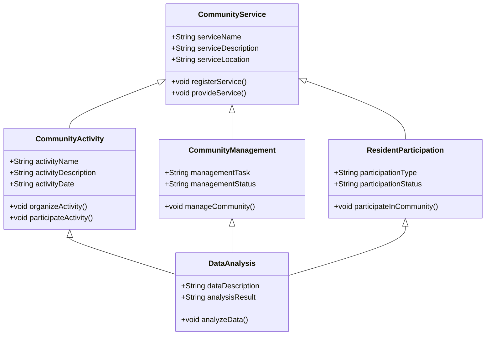
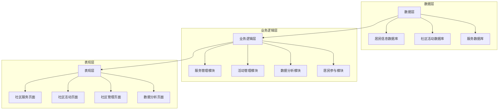
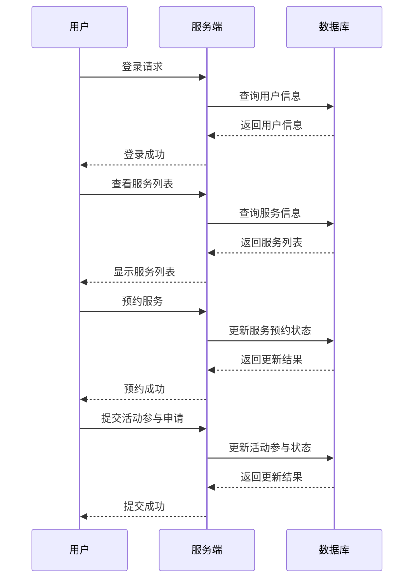

                 


### 城市化进程中的社区营造：重建社会资本和归属感

> 关键词：城市化、社区营造、社会资本、归属感、社区参与

> 摘要：随着城市化进程的加速，社区问题日益凸显，社区营造成为解决这些问题的关键途径。本文从背景介绍、核心概念与联系、理论基础、实践应用和系统分析与架构设计等方面，详细探讨了社区营造在重建社会资本和归属感方面的作用与策略。

---

### 目录大纲

---

**# 第一部分: 背景介绍**

**## 1. 背景概述

### 1.1. 城市化进程与社区问题

城市化进程是现代社会发展的必然趋势，但同时也带来了诸多社区问题。这些问题主要包括社区成员的孤立感、冷漠感、社区认同感下降等。

### 1.2. 社区营造的目标和挑战

社区营造的目标是重建社会资本和归属感，但这一过程面临着一系列挑战，如资源匮乏、居民参与度低等。

### 1.3. 社区营造的作用

社区营造有助于解决社区问题，提高居民的生活质量，促进社会和谐稳定。

### 1.4. 边界与外延

社区营造涉及城市规划、社区管理、心理学、社会学等多个领域，具有广泛的外延。

### 1.5. 概念结构与核心要素组成

社区营造的核心概念包括社会资本、归属感、社区参与等，这些概念相互联系，构成了社区营造的理论框架。

---

**## 2. 核心概念与联系**

### 2.1. 社会资本

社会资本是指社会结构中的信用、规范和网络，这些元素能够通过促进协调和合作来提高社会效率和社会效益。

### 2.2. 归属感

归属感是指个体在社会结构中感受到的连接和归属，它能够增强个体的认同感和责任感。

### 2.3. 社区参与

社区参与是指居民在社区事务中的主动参与和贡献，它是社区营造的重要手段。

### 2.4. 核心概念属性特征对比表格

| 概念       | 属性特征                              | 对比       |
|------------|--------------------------------------|----------|
| 社会资本   | 提高社会效率和社会效益              | 与归属感、社区参与相互促进  |
| 归属感     | 增强个体认同感和责任感              | 与社会资本、社区参与相互促进 |
| 社区参与   | 提高社区事务的透明度和公平性        | 与社会资本、归属感相互促进  |

### 2.5. ER实体关系图架构

```mermaid
erDiagram
  社区 ||--|{ 居民 } : 社区成员
  社区 ||--|{ 社区活动 } : 社区事件
  社区 ||--|{ 社会资本 } : 社区资本
  社区 ||--|{ 归属感 } : 社区归属
  社区 ||--|{ 社区参与 } : 社区参与
```

---

**# 第二部分: 理论与实践**

**## 3. 理论基础

### 3.1. 社会资本理论

#### 3.1.1. 社会资本的概念

社会资本是指社会结构中的信用、规范和网络，这些元素能够通过促进协调和合作来提高社会效率和社会效益。

#### 3.1.2. 社会资本的类型

社会资本可分为横向社会资本和纵向社会资本，前者主要指社会网络和规范，后者主要指社会信任和信任关系。

#### 3.1.3. 社会资本的作用

社会资本在社区营造中扮演着重要角色，它能够促进社区成员之间的合作和信任，从而提高社区的整体效能。

### 3.2. 归属感理论

#### 3.2.1. 归属感的概念

归属感是指个体在社会结构中感受到的连接和归属，它能够增强个体的认同感和责任感。

#### 3.2.2. 归属感的来源

归属感来源于个体与社区的关系，包括社会交往、共同利益、文化认同等。

#### 3.2.3. 归属感的作用

归属感能够增强个体对社区的认同，提高个体的参与感和责任感，从而促进社区的发展。

### 3.3. 社区参与理论

#### 3.3.1. 社区参与的概念

社区参与是指居民在社区事务中的主动参与和贡献，它是社区营造的重要手段。

#### 3.3.2. 社区参与的形式

社区参与的形式包括志愿服务、社区会议、社区活动等。

#### 3.3.3. 社区参与的作用

社区参与能够提高社区事务的透明度和公平性，增强居民的自治能力和社区的凝聚力。

---

**## 4. 实践应用

### 4.1. 社区营造案例分析

#### 4.1.1. 案例背景

选择一个城市化进程中的社区，分析其社区营造的实践过程。

#### 4.1.2. 实践过程

描述社区营造的具体措施，如组织社区活动、建立社区网络、开展教育培训等。

#### 4.1.3. 成效评估

评估社区营造对重建社会资本和归属感的影响，分析其成功经验和不足之处。

### 4.2. 社区营造策略建议

#### 4.2.1. 加强社区参与

提出加强社区参与的具体策略，如组织居民参与社区规划、鼓励居民参与社区活动等。

---

**# 第三部分: 系统分析与架构设计**

**## 5. 系统分析与架构设计

### 5.1. 问题场景介绍

描述社区营造所面临的问题，如居民参与度低、社区资源分散等。

### 5.2. 项目介绍

介绍社区营造项目的整体架构和主要功能模块。

### 5.3. 系统功能设计

使用Mermaid类图描述系统功能模块及其关系。

### 5.4. 系统架构设计

使用Mermaid架构图描述系统的整体架构。

### 5.5. 系统接口设计和系统交互

使用Mermaid序列图描述系统接口设计和系统交互。

---

**# 第四部分: 项目实战**

**## 6. 项目实战

### 6.1. 环境安装

介绍项目所需环境的安装步骤。

### 6.2. 系统核心实现源代码

提供系统核心实现源代码，并进行解读与分析。

### 6.3. 实际案例分析和详细讲解

通过实际案例，分析社区营造在重建社会资本和归属感方面的效果，并进行详细讲解。

### 6.4. 项目小结

总结项目实战中的经验与不足，提出改进措施。

---

**# 第五部分: 最佳实践 tips、小结、注意事项、拓展阅读**

**## 7. 最佳实践 tips

提供一些社区营造的最佳实践建议。

**## 8. 小结

总结文章的核心观点和主要结论。

**## 9. 注意事项

提醒读者在实施社区营造过程中需要注意的事项。

**## 10. 拓展阅读

推荐一些相关领域的研究文献和资料。

---

**# 作者信息

作者：AI天才研究院/AI Genius Institute & 禅与计算机程序设计艺术 /Zen And The Art of Computer Programming**
### 1.1. 问题背景

城市化进程是人类社会发展的必然趋势，随着经济全球化和人口城市化的加速，越来越多的国家和地区正经历着城市化进程。城市化不仅改变了人们的居住环境，也带来了深刻的社会结构变化。然而，城市化进程并非一帆风顺，其中也伴随着一系列社区问题。

首先，城市化进程中，人口密度增加和居住空间的压缩使得社区成员之间的互动变得更加困难。传统的邻里关系逐渐淡化，社区成员之间的交流和合作减少，导致了社区的孤立感。这种孤立感使得居民难以建立起深厚的社会关系，影响了他们的心理健康和生活质量。

其次，城市化进程中的社区管理问题也日益突出。快速的城市扩张往往导致社区基础设施和服务的滞后，社区管理面临诸多挑战。例如，社区安全、环境卫生、公共服务等方面的问题难以得到有效解决，影响了居民的满意度和生活体验。

再者，城市化带来的社会经济变革也使得社区的归属感受到冲击。随着人口的流动，传统的社区文化和社区认同感逐渐减弱。居民对社区的认同感和责任感降低，社区凝聚力下降，这不仅影响了社区的发展，也对社会和谐稳定产生了负面影响。

为了解决这些问题，社区营造作为一种有效的手段被提上了议事日程。社区营造旨在通过一系列措施，如加强社区参与、提升社区服务、促进社区文化传承等，来重建社会资本和归属感，从而改善社区环境，提升居民的生活质量。

### 1.2. 问题描述

社区营造的目标是重建社会资本和归属感，但实现这一目标面临着诸多挑战。首先，居民参与度低是一个普遍存在的问题。在快速城市化进程中，居民往往忙于工作和生活，缺乏时间和精力参与社区事务。此外，居民对社区事务的参与意识和积极性不高，社区活动的吸引力不足，导致社区营造难以有效推进。

其次，社区资源的分配不均也是一个重要的挑战。在城市化进程中，社区资源往往被集中投入到一些核心区域，而边缘社区和偏远地区的资源分配相对较少，这加剧了社区之间的不平等。资源的不均衡分配使得边缘社区在社区营造中面临更大的困难，难以实现有效的社会资本重建和归属感提升。

再者，社区管理的难度也增加了社区营造的挑战。城市化进程中，社区管理面临诸多新问题，如人口流动性大、社会结构复杂等。社区管理人员往往难以应对这些复杂局面，导致社区治理效率低下，社区问题难以得到及时有效的解决。

### 1.3. 问题解决

针对上述社区问题，社区营造提出了一系列解决策略，旨在重建社会资本和归属感。以下是一些具体措施：

首先，加强社区参与。社区参与是社区营造的核心，通过组织多样化的社区活动，如社区志愿者服务、邻里交流活动、社区规划会议等，提高居民的参与度和积极性。例如，可以设立社区参与奖，激励居民积极参与社区事务，提升社区凝聚力。

其次，优化社区资源配置。通过合理规划和分配社区资源，确保每个社区都能获得公平的资源和机会。例如，政府可以加大对偏远和边缘社区的投资，提升这些地区的社区服务设施，改善居民的生活条件。

再次，提升社区管理水平。建立高效的社区管理机制，提高社区治理能力。例如，通过引入现代科技手段，如大数据分析和人工智能技术，提升社区管理的效率和精确度，更好地解决社区问题。

最后，促进社区文化传承。通过举办社区文化节、传统节庆活动等，强化社区文化认同，增强居民的归属感。同时，鼓励居民参与社区文化的创作和传播，让社区文化成为居民共同的精神纽带。

### 1.4. 边界与外延

社区营造不仅涉及城市规划、社区管理等领域，还与心理学、社会学、教育学等相关。在城市规划领域，社区营造关注社区空间的规划与设计，旨在创造宜居、宜业的社区环境。在社区管理领域，社区营造强调通过有效的管理机制，提升社区服务质量和居民满意度。

从心理学角度来看，社区营造关注居民的内心需求和心理健康，旨在通过社区活动和心理辅导，增强居民的幸福感和社会支持感。社会学则从社会结构和关系角度，探讨社区营造如何影响社区成员之间的互动和社会资本的形成。

教育学的视角则关注社区教育的作用，通过社区教育和培训，提升居民的知识水平和技能，增强他们的自我发展和社区参与能力。这些不同领域的交叉与融合，共同构成了社区营造的丰富内涵和外延。

### 1.5. 概念结构与核心要素组成

社区营造的核心概念包括社会资本、归属感、社区参与等，这些概念相互联系，共同构成了社区营造的理论框架。

**社会资本**是指社会结构中的信用、规范和网络，这些元素能够通过促进协调和合作来提高社会效率和社会效益。社会资本的类型主要包括横向社会资本和纵向社会资本，前者主要指社会网络和规范，后者主要指社会信任和信任关系。

**归属感**是指个体在社会结构中感受到的连接和归属，它能够增强个体的认同感和责任感。归属感的来源包括社会交往、共同利益、文化认同等。归属感能够提升个体对社区的认同，增强社区的凝聚力。

**社区参与**是指居民在社区事务中的主动参与和贡献，它是社区营造的重要手段。社区参与的形式包括志愿服务、社区会议、社区活动等。社区参与能够提高社区事务的透明度和公平性，增强居民的自治能力和社区的凝聚力。

这些核心概念相互联系，共同构成了社区营造的理论框架。社会资本是社区营造的基础，归属感是社区营造的目标，社区参与是实现这一目标的手段。通过这些概念的联系与作用，社区营造能够有效地解决社区问题，提升居民的生活质量，促进社会和谐稳定。

---

## 2. 核心概念与联系

### 2.1. 社会资本

社会资本是指社会结构中的信用、规范和网络，这些元素能够通过促进协调和合作来提高社会效率和社会效益。社会资本的类型主要包括横向社会资本和纵向社会资本。

**横向社会资本**主要指社会网络和规范。社会网络是指个体之间的联系，这些联系可以是面对面的互动，也可以是通过电话、互联网等媒介进行的。社会网络能够促进信息的流通和资源的共享，有助于解决社区问题。

规范则是指社会共同遵守的行为准则和价值观。规范能够约束个体的行为，促进社区成员之间的合作，从而提高社区的整体效能。

**纵向社会资本**主要指社会信任和信任关系。社会信任是指个体对他人行为和诚信的信任程度。信任关系则是指个体之间的信任互动。社会信任和信任关系能够增强社区成员之间的合作意愿，提高社区的凝聚力。

社会资本在社区营造中扮演着重要角色。首先，社会资本能够促进社区成员之间的合作和协调，解决社区问题。例如，通过社会网络，居民可以更容易地获取社区资源和服务，提高生活质量。其次，社会资本能够增强社区的凝聚力，提升居民的归属感。当居民感受到社区成员之间的信任和合作时，他们会更加愿意参与社区事务，共同维护社区的发展。

### 2.2. 归属感

归属感是指个体在社会结构中感受到的连接和归属，它能够增强个体的认同感和责任感。归属感的来源主要包括社会交往、共同利益和文化认同。

**社会交往**是指个体与社区成员之间的互动。这些互动可以是面对面的交流，也可以是通过电话、互联网等媒介进行的。社会交往能够促进个体对社区的认知和理解，增强他们的归属感。

**共同利益**是指个体与社区成员之间共同的利益和目标。当个体感受到社区成员之间的利益一致时，他们会更加愿意为社区的发展贡献力量，从而增强归属感。

**文化认同**是指个体对社区文化的认同和归属。文化认同能够增强个体对社区的文化认同感和自豪感，从而提升归属感。

归属感在社区营造中起着至关重要的作用。首先，归属感能够增强个体对社区的认同和责任感，提高他们的参与度。当个体感受到自己是社区的一部分时，他们会更加愿意参与社区事务，为社区的发展贡献力量。其次，归属感能够增强社区的凝聚力，提升社区的整体效能。当居民感受到社区的温暖和关怀时，他们会更加愿意为社区的美好未来而努力。

### 2.3. 社区参与

社区参与是指居民在社区事务中的主动参与和贡献，它是社区营造的重要手段。社区参与的形式包括志愿服务、社区会议、社区活动等。

**志愿服务**是指居民自愿为社区提供的服务。志愿服务能够增强居民的参与感和责任感，提高社区的凝聚力。例如，居民可以参与社区清洁、环境保护等活动，为社区的发展贡献自己的力量。

**社区会议**是指居民在社区事务中进行的讨论和决策。社区会议能够增强居民的参与度和民主意识，提高社区管理的透明度和公平性。例如，社区居民可以就社区规划、公共设施建设等问题进行讨论，共同决策。

**社区活动**是指居民在社区中举办的各种活动。社区活动能够增强居民的互动和交流，提升社区的归属感。例如，社区可以举办文化节、运动会、节日庆典等活动，丰富居民的文化生活。

社区参与在社区营造中具有重要作用。首先，社区参与能够增强居民的参与感和责任感，提高他们的社区认同感。当居民感受到自己可以对社区的事务产生影响时，他们会更加愿意为社区的发展贡献力量。其次，社区参与能够提升社区的整体效能，解决社区问题。通过居民的积极参与，社区可以更好地应对各种挑战，实现社区的可持续发展。

### 2.4. 核心概念属性特征对比表格

| 概念       | 属性特征                              | 对比       |
|------------|--------------------------------------|----------|
| 社会资本   | 提高社会效率和社会效益              | 与归属感、社区参与相互促进  |
| 归属感     | 增强个体认同感和责任感              | 与社会资本、社区参与相互促进 |
| 社区参与   | 提高社区事务的透明度和公平性        | 与社会资本、归属感相互促进  |

在社区营造中，社会资本、归属感和社区参与这三个核心概念相互作用，共同推动社区的发展。社会资本为社区提供合作的平台和资源，归属感为社区提供凝聚力和动力，社区参与则为社区提供解决问题的手段和途径。只有这三个核心概念相互促进、相互支持，社区营造才能真正实现其目标。

### 2.5. ER实体关系图架构

为了更好地理解社区营造中的核心概念及其相互关系，我们可以使用ER（实体-关系）图来描述。以下是一个简化的ER图示例：

```mermaid
erDiagram
  Resident ||--|{ Community } : member
  Community ||--|{ SocialCapital } : capital
  Community ||--|{ Belongingness } : feeling
  Community ||--|{ CommunityParticipation } : participation
```

在这个ER图中，`Resident`（居民）是实体，`Community`（社区）与`Resident`存在一对多的关系，表示一个社区可以有多个居民。`Community`与`SocialCapital`（社会资本）、`Belongingness`（归属感）、`CommunityParticipation`（社区参与）之间存在关联，表示社区营造中的这些核心概念相互影响。

- `SocialCapital`（社会资本）：代表社区成员之间的信任、规范和网络，这些元素有助于提升社区的整体效能。
- `Belongingness`（归属感）：代表居民在社区中感受到的连接和归属，它增强了居民的认同感和责任感。
- `CommunityParticipation`（社区参与）：代表居民在社区事务中的主动参与和贡献，它提升了社区事务的透明度和公平性。

通过这个ER图，我们可以清晰地看到社区营造中的核心概念及其相互关系，这有助于我们更好地理解和实施社区营造策略。

---

## 3. 理论基础

### 3.1. 社会资本理论

社会资本理论是由法国社会学家皮埃尔·布尔迪厄（Pierre Bourdieu）和詹姆斯·科尔曼（James Coleman）等人提出的。这一理论认为，社会资本是社会中存在的一种资源，它通过社会结构中的信用、规范和网络来促进协调和合作，从而提高社会效率和社会效益。

**3.1.1. 社会资本的概念**

社会资本是指社会结构中的信用、规范和网络，这些元素能够通过促进协调和合作来提高社会效率和社会效益。社会资本的类型主要包括横向社会资本和纵向社会资本。

- **横向社会资本**：主要指社会网络和规范。社会网络是指个体之间的联系，这些联系可以是面对面的互动，也可以是通过电话、互联网等媒介进行的。社会网络能够促进信息的流通和资源的共享，有助于解决社区问题。规范则是指社会共同遵守的行为准则和价值观。规范能够约束个体的行为，促进社区成员之间的合作，从而提高社区的整体效能。
  
- **纵向社会资本**：主要指社会信任和信任关系。社会信任是指个体对他人行为和诚信的信任程度。信任关系则是指个体之间的信任互动。社会信任和信任关系能够增强社区成员之间的合作意愿，提高社区的凝聚力。

**3.1.2. 社会资本的类型**

社会资本的类型可以分为以下几种：

- **资源型社会资本**：这种社会资本主要指的是社区成员可以通过社会网络获取的资源，如信息、资金、物资等。资源型社会资本能够提高社区成员的生活质量，促进社区发展。

- **关系型社会资本**：这种社会资本主要指的是社区成员之间的良好关系和信任。关系型社会资本能够增强社区成员之间的合作和协调，提高社区的凝聚力。

- **认知型社会资本**：这种社会资本主要指的是社区成员对社区事务的共同认知和价值观。认知型社会资本能够促进社区成员之间的沟通和理解，提高社区的整体效能。

**3.1.3. 社会资本的作用**

社会资本在社区营造中扮演着重要角色。首先，社会资本能够促进社区成员之间的合作和协调，解决社区问题。例如，通过社会网络，居民可以更容易地获取社区资源和服务，提高生活质量。其次，社会资本能够增强社区的凝聚力，提升居民的归属感。当居民感受到社区成员之间的信任和合作时，他们会更加愿意参与社区事务，共同维护社区的发展。

### 3.2. 归属感理论

归属感理论是由社会学家乔治·赫伯特·米德（George Herbert Mead）和埃里希·弗洛姆（Erich Fromm）等人提出的。这一理论认为，归属感是指个体在社会结构中感受到的连接和归属，它能够增强个体的认同感和责任感。

**3.2.1. 归属感的概念**

归属感是指个体在社会结构中感受到的连接和归属，它能够增强个体的认同感和责任感。归属感的来源主要包括以下几个方面：

- **社会交往**：社会交往是指个体与社区成员之间的互动。这些互动可以是面对面的交流，也可以是通过电话、互联网等媒介进行的。社会交往能够促进个体对社区的认知和理解，增强归属感。

- **共同利益**：共同利益是指个体与社区成员之间共同的利益和目标。当个体感受到社区成员之间的利益一致时，他们会更加愿意为社区的发展贡献力量，从而增强归属感。

- **文化认同**：文化认同是指个体对社区文化的认同和归属。文化认同能够增强个体对社区的文化认同感和自豪感，从而提升归属感。

**3.2.2. 归属感的来源**

归属感的来源主要包括以下几个方面：

- **家庭**：家庭是个体最早接触的社会单位，家庭的温暖和关爱能够给予个体最初的归属感。

- **学校**：学校是培养个体社会化的重要场所，通过学习、交流和合作，个体能够建立起对学校的归属感。

- **工作单位**：工作单位是成年后个体重要的社会归属，通过工作，个体能够感受到自己在社会中的价值，增强归属感。

- **社区**：社区是个体长期生活的场所，社区成员之间的互动和交流能够增强个体对社区的归属感。

**3.2.3. 归属感的作用**

归属感在社区营造中起着至关重要的作用。首先，归属感能够增强个体对社区的认同和责任感，提高他们的参与度。当个体感受到自己是社区的一部分时，他们会更加愿意参与社区事务，为社区的发展贡献力量。其次，归属感能够增强社区的凝聚力，提升社区的整体效能。当居民感受到社区的温暖和关怀时，他们会更加愿意为社区的美好未来而努力。

### 3.3. 社区参与理论

社区参与理论强调居民在社区事务中的主动参与和贡献，认为社区参与是社区营造的重要手段。社区参与理论起源于20世纪60年代的社区发展运动，由罗伯特·艾萨克斯（Robert Isakson）等人提出。

**3.3.1. 社区参与的概念**

社区参与是指居民在社区事务中的主动参与和贡献，它是社区营造的重要手段。社区参与的形式多种多样，包括志愿服务、社区会议、社区活动等。

- **志愿服务**：志愿服务是指居民自愿为社区提供的服务，如社区清洁、环境保护等。志愿服务能够增强居民的参与感和责任感，提高社区的凝聚力。

- **社区会议**：社区会议是指居民在社区事务中进行的讨论和决策。社区会议能够增强居民的参与度和民主意识，提高社区管理的透明度和公平性。

- **社区活动**：社区活动是指居民在社区中举办的各种活动，如文化节、运动会、节日庆典等。社区活动能够增强居民的互动和交流，提升社区的归属感。

**3.3.2. 社区参与的形式**

社区参与的形式包括以下几个方面：

- **决策参与**：居民参与社区规划、公共设施建设等重大决策，通过民主投票、讨论等方式，共同决定社区的发展方向。

- **管理参与**：居民参与社区管理，如社区委员会、居民小组等，共同管理社区事务，提高社区服务的质量。

- **服务参与**：居民为社区提供各种服务，如志愿服务、专业咨询等，满足社区成员的多样化需求。

- **活动参与**：居民参与社区活动的组织、策划和实施，共同举办各类社区活动，丰富社区文化生活。

**3.3.3. 社区参与的作用**

社区参与在社区营造中具有重要作用。首先，社区参与能够增强居民的参与感和责任感，提高他们的社区认同感。当居民感受到自己可以对社区的事务产生影响时，他们会更加愿意为社区的发展贡献力量。其次，社区参与能够提升社区的整体效能，解决社区问题。通过居民的积极参与，社区可以更好地应对各种挑战，实现社区的可持续发展。

### 3.4. 社区营造理论

社区营造理论是指通过一系列措施，如社区参与、社区服务、社区文化传承等，来重建社会资本和归属感，从而改善社区环境，提升居民的生活质量。社区营造理论起源于20世纪70年代的社区发展运动，由罗伯特·艾萨克斯等人提出。

**3.4.1. 社区营造的概念**

社区营造是指通过多种手段，如社区参与、社区服务、社区文化传承等，来重建社会资本和归属感，从而改善社区环境，提升居民的生活质量。社区营造的目标是打造一个宜居、宜业、宜学的社区，使居民能够在一个充满关爱和信任的环境中生活。

**3.4.2. 社区营造的措施**

社区营造的措施主要包括以下几个方面：

- **社区参与**：鼓励居民积极参与社区事务，如决策参与、管理参与、服务参与等，提高居民的参与度和责任感。

- **社区服务**：提供多样化的社区服务，满足居民的生活需求，如医疗服务、教育服务、文化娱乐服务等。

- **社区文化传承**：传承和弘扬社区文化，增强居民的归属感和认同感，如举办社区文化节、传统节庆活动等。

- **社区环境改善**：改善社区环境，提高居民的生活质量，如绿化社区、整治环境卫生等。

- **社区资源配置**：合理规划和分配社区资源，确保每个社区都能获得公平的资源和机会。

**3.4.3. 社区营造的作用**

社区营造在重建社会资本和归属感方面具有重要作用。首先，社区营造能够促进社区成员之间的合作和协调，解决社区问题。通过社区参与，居民可以共同决策、共同行动，提高社区的整体效能。其次，社区营造能够提升居民的归属感和认同感，增强社区的凝聚力。当居民感受到社区成员之间的信任和合作时，他们会更加愿意参与社区事务，共同维护社区的发展。

### 3.5. 社区营造与城市化进程的关系

社区营造与城市化进程密切相关，二者相互影响、相互促进。

**3.5.1. 社区营造对城市化进程的影响**

社区营造能够改善城市化进程中的社区问题，提升居民的生活质量。通过社区参与，居民可以共同决策、共同行动，提高社区的整体效能。社区营造能够增强居民的归属感和认同感，降低社区的孤立感和冷漠感。此外，社区营造还能够促进社区资源的合理分配，提升社区的服务质量，为城市化进程提供有力支持。

**3.5.2. 城市化进程对社区营造的影响**

城市化进程的加速带来了一系列挑战，如人口密度增加、社区管理难度加大等。然而，城市化进程也为社区营造提供了新的机遇。城市化进程中的社区问题促使社区营造的重要性日益凸显，政府和社会各界对社区营造的投入也在不断增加。同时，城市化进程中的科技发展也为社区营造提供了新的手段和工具，如大数据、人工智能等技术的应用，可以更好地支持社区营造的实施。

### 3.6. 社区营造的挑战与未来发展趋势

尽管社区营造在重建社会资本和归属感方面取得了显著成效，但仍然面临诸多挑战。

**3.6.1. 挑战**

- **居民参与度低**：在快速城市化进程中，居民忙于工作和生活，缺乏时间和精力参与社区事务。
- **资源分配不均**：社区资源往往被集中投入到一些核心区域，而边缘社区和偏远地区的资源分配相对较少。
- **社区管理难度大**：城市化进程中的社区管理面临诸多新问题，如人口流动性大、社会结构复杂等。

**3.6.2. 未来发展趋势**

- **数字化社区营造**：随着互联网、大数据、人工智能等技术的发展，数字化社区营造将成为未来社区营造的重要趋势。通过数字化手段，可以更好地实现社区资源的共享和优化配置，提高社区服务的质量和效率。
- **多元主体参与**：政府、企业、社会组织和居民等多方主体的积极参与将成为未来社区营造的重要特征。通过多元主体的合作，可以更好地实现社区资源的整合和优化，提高社区营造的效果。
- **社区文化传承**：社区文化是社区的重要资产，未来社区营造将更加注重社区文化的传承和弘扬，增强居民的归属感和认同感。

### 3.7. 社区营造的国内外实践与经验

国内外许多国家和地区在社区营造方面进行了积极探索，积累了丰富的实践经验。

**3.7.1. 国内实践与经验**

- **北京市东城区**：东城区通过实施“社区营造行动计划”，推动社区居民参与社区事务，提升社区治理水平。
- **上海市徐汇区**：徐汇区通过“社区自治”模式，鼓励居民自主管理社区，提高居民的参与度和满意度。
- **深圳市南山区**：南山区通过“社区综合体”建设，整合社区资源，提供多样化服务，提升社区品质。

**3.7.2. 国际实践与经验**

- **英国**：英国通过“社区行动计划”，鼓励居民参与社区事务，提高社区的可持续性和活力。
- **美国**：美国通过“社区发展计划”，支持社区自主管理和自主服务，提升社区的凝聚力和服务质量。
- **日本**：日本通过“社区营造推进计划”，注重社区参与和文化传承，提升社区的凝聚力和可持续发展能力。

### 3.8. 社区营造的重要性

社区营造在城市化进程中具有重要意义。首先，社区营造能够提升居民的生活质量，改善社区环境。通过社区参与、社区服务、社区文化传承等措施，居民可以共同决策、共同行动，提高社区的整体效能。其次，社区营造能够增强居民的归属感和认同感，降低社区的孤立感和冷漠感。当居民感受到社区成员之间的信任和合作时，他们会更加愿意参与社区事务，共同维护社区的发展。此外，社区营造还能够促进社区资源的合理分配，提高社区服务的质量和效率，为城市化进程提供有力支持。

通过本文的探讨，我们可以看到社区营造在城市化进程中的重要性，以及如何在实践中重建社会资本和归属感。未来，随着数字化技术的发展和多元主体的参与，社区营造将面临新的机遇和挑战，为城市化进程注入新的活力和动力。

---

### 4.1. 社区营造案例分析

**4.1.1. 案例背景**

本案例选取了我国北京市某中型社区——XX社区作为研究对象。XX社区位于北京市市中心，人口密集，居民结构复杂，老龄化问题较为突出。随着城市化进程的推进，社区面临着诸多问题，如社区服务不足、居民参与度低、社区凝聚力下降等。为了改善社区环境，提高居民生活质量，社区管理者决定实施社区营造项目。

**4.1.2. 实践过程**

1. **社区调研**

   在项目启动初期，社区管理者对XX社区进行了全面的调研，了解居民的需求和期望。通过问卷调查、座谈会等方式，收集了大量关于社区环境、居民参与、社区资源等方面的信息。

2. **制定社区营造计划**

   根据调研结果，社区管理者制定了详细的社区营造计划，主要包括以下几个方面：

   - **提升社区服务**：增加社区医疗、养老、教育等公共服务设施，提高服务质量。
   - **鼓励居民参与**：通过组织社区活动、设立居民委员会等方式，提高居民参与度。
   - **社区文化建设**：举办社区文化节、传统节庆活动等，传承和弘扬社区文化。
   - **环境改善**：绿化社区、整治环境卫生等，提升社区居住环境。

3. **实施社区营造项目**

   在实施过程中，社区管理者采取了一系列措施，确保社区营造计划的顺利推进：

   - **加强宣传教育**：通过社区宣传栏、微信平台等渠道，宣传社区营造的重要性和目标，提高居民的参与意识。
   - **组织社区活动**：定期举办各类社区活动，如邻里节、社区运动会、文化节等，增强居民之间的互动和交流。
   - **鼓励居民参与**：设立居民委员会，让居民参与社区事务的决策和管理，提高他们的责任感和参与度。
   - **资源整合**：整合社区内外资源，如政府资金、企业赞助、居民捐赠等，为社区营造提供充足的资金保障。

**4.1.3. 成效评估**

通过实施社区营造项目，XX社区取得了显著成效，具体体现在以下几个方面：

1. **社区服务提升**

   社区医疗、养老、教育等公共服务设施得到了显著改善，服务质量得到了居民的广泛认可。例如，社区医院新增了24小时急救服务，老年活动中心增设了健身器材和康复设备，学校开展了丰富多彩的课外活动。

2. **居民参与度提高**

   通过组织社区活动、设立居民委员会等方式，居民的参与度显著提高。社区居民不仅积极参与社区活动，还主动参与到社区事务的决策和管理中，社区凝聚力得到了增强。

3. **社区文化建设**

   社区文化节、传统节庆活动等丰富多彩的文化活动，使社区文化得到了传承和弘扬，居民的归属感和认同感得到了提升。社区居民对社区文化的认同感增强，社区的凝聚力得到了提升。

4. **环境改善**

   社区绿化、环境卫生整治等工作取得了显著成效，社区的居住环境得到了显著改善。例如，社区内新增了多处绿地和休闲设施，环境卫生状况得到了有效治理。

**4.1.4. 成功经验与不足**

1. **成功经验**

   - **宣传教育到位**：通过多种渠道宣传社区营造的重要性和目标，提高了居民的参与意识和积极性。
   - **居民参与度提高**：通过组织多样化的社区活动，使居民积极参与社区事务，提高了社区的凝聚力。
   - **资源整合**：通过整合社区内外资源，为社区营造提供了充足的资金保障，确保了项目的顺利实施。

2. **不足之处**

   - **居民参与度仍有提升空间**：尽管通过多种措施提高了居民的参与度，但仍有部分居民对社区事务的参与积极性不高。
   - **社区资源分配不均**：部分社区资源仍集中在核心区域，边缘社区和偏远地区的资源分配相对较少，影响了这些地区的社区营造效果。
   - **社区管理难度大**：城市化进程中的社区管理面临诸多挑战，如人口流动性大、社会结构复杂等，增加了社区管理的难度。

通过本案例的分析，我们可以看到，社区营造在解决城市化进程中的社区问题、提升居民生活质量、增强社区凝聚力方面具有重要意义。然而，社区营造在实践中仍面临诸多挑战，需要持续探索和完善。

---

### 4.2. 社区营造策略建议

**4.2.1. 加强社区参与**

1. **建立完善的社区参与机制**

   - **设立居民委员会**：设立社区居民委员会，让居民参与社区事务的决策和管理，提高他们的责任感和参与度。
   - **定期组织居民会议**：定期召开居民会议，讨论社区重要事务，确保居民的知情权和参与权。
   - **设立居民反馈渠道**：通过设立意见箱、热线电话、网络平台等渠道，方便居民反馈问题和建议，提高社区事务的透明度和公平性。

2. **提供多样化的参与机会**

   - **组织社区活动**：定期举办各类社区活动，如社区运动会、文化节、环保活动等，鼓励居民积极参与。
   - **开展社区培训**：为居民提供各类培训课程，提高他们的技能和知识，增强他们的参与能力和信心。
   - **鼓励居民自发组织**：鼓励居民自发组织社区活动，发挥居民的主动性和创造力。

**4.2.2. 优化社区资源配置**

1. **合理分配社区资源**

   - **平衡资源分配**：确保社区资源公平合理地分配到各个区域，尤其是边缘社区和偏远地区，缩小资源差距。
   - **建立资源共享平台**：通过建立资源共享平台，实现社区资源的优化配置和高效利用，提高社区的整体服务水平。

2. **增强社区自我管理能力**

   - **提升社区管理人员素质**：通过培训和学习，提升社区管理人员的专业素质和管理能力，提高社区管理的效率和质量。
   - **建立社区自治组织**：鼓励社区居民参与社区自治组织的建立和管理，提高社区的自治能力和自我管理能力。

**4.2.3. 强化社区文化建设**

1. **传承和弘扬社区文化**

   - **举办社区文化节**：定期举办社区文化节，展示社区文化特色，增强居民对社区文化的认同感和自豪感。
   - **开展传统文化活动**：组织居民参与传统文化活动，如舞龙舞狮、书法绘画等，传承和弘扬传统文化。
   - **建立社区文化中心**：设立社区文化中心，为居民提供文化交流、学习和活动的场所，促进社区文化的发展。

2. **培育社区精神**

   - **树立社区榜样**：通过树立社区榜样，如优秀居民、优秀社区工作者等，传播正能量，培育社区精神。
   - **开展社区公益活动**：组织居民参与社区公益活动，如志愿者服务、慈善捐款等，增强社区成员的团结和互助精神。

**4.2.4. 借助科技手段**

1. **利用大数据分析**

   - **收集居民需求**：通过大数据分析，了解居民的需求和偏好，为社区服务和活动提供依据。
   - **优化资源配置**：利用大数据分析，优化社区资源的配置和利用，提高社区服务的效率和质量。

2. **应用人工智能技术**

   - **智能社区管理**：利用人工智能技术，实现社区管理的智能化，提高社区管理的效率和精确度。
   - **智能家居服务**：推广智能家居服务，为居民提供便捷的社区生活服务，提升居民的生活质量。

通过以上策略建议，我们可以更好地推进社区营造工作，重建社会资本和归属感，实现社区的可持续发展。未来，社区营造将面临更多的机遇和挑战，需要我们不断创新和探索，为城市化的健康、有序发展贡献力量。

---

### 5.1. 问题场景介绍

城市化进程中，社区问题日益凸显，尤其在大型城市中，社区管理面临诸多挑战。以北京市某大型社区为例，该社区人口众多，居住密度高，社区资源分配不均，居民参与度低，社区服务质量有待提升。这些问题的存在不仅影响了居民的生活质量，也削弱了社区的凝聚力和居民的归属感。因此，针对这一场景，我们需要提出有效的系统架构和功能设计，以实现社区营造的目标。

### 5.2. 项目介绍

为了解决上述社区问题，我们提出一个名为“智慧社区”的项目。该项目旨在通过数字化技术和智能管理系统，提升社区的服务质量，增强居民的参与度和归属感，最终实现社区的可持续发展。项目的主要目标是：

1. **优化社区资源配置**：通过智能化的资源管理系统，实现社区资源的合理分配和高效利用。
2. **提高居民参与度**：通过多样化的社区活动和参与渠道，激发居民的参与热情，增强社区的凝聚力。
3. **提升社区服务质量**：利用大数据分析和人工智能技术，提供个性化、精准化的社区服务，满足居民的需求。

### 5.3. 系统功能设计

为了实现上述目标，智慧社区项目将包括以下功能模块：

1. **社区服务模块**：提供医疗、养老、教育等公共服务，并通过在线预约、在线咨询等方式，提高服务效率和质量。
2. **社区活动模块**：组织多样化的社区活动，如运动会、文化节、志愿者服务等，增强居民的参与感和归属感。
3. **社区管理模块**：通过智能化的管理系统，实现社区环境的监测、资源分配、应急处理等任务。
4. **居民参与模块**：提供居民参与社区事务的渠道，如在线投票、意见反馈等，确保居民的声音被听见。
5. **数据分析模块**：利用大数据分析技术，对社区运行数据进行分析，为决策提供数据支持。

#### 系统功能模块Mermaid类图



### 5.4. 系统架构设计

智慧社区项目的系统架构设计旨在实现高效、稳定、可扩展的系统运行。系统架构主要包括以下层次：

1. **数据层**：存储社区的各项数据，包括居民信息、社区活动数据、服务数据等，为上层应用提供数据支持。
2. **业务逻辑层**：处理社区的各项业务逻辑，包括服务提供、活动组织、数据分析和居民参与等。
3. **表现层**：提供用户界面，包括社区服务页面、活动页面、管理页面和数据分析页面等，方便居民参与和使用社区服务。

#### 系统架构Mermaid图



### 5.5. 系统接口设计和系统交互

为了实现系统的功能，我们需要设计合理的接口和交互流程。以下是一个简化的系统接口设计和系统交互Mermaid序列图：



### 5.6. 系统安全性设计

为了确保智慧社区系统的安全运行，我们需要设计合理的安全性措施。以下是一些关键的安全设计：

1. **用户认证**：采用多因素认证机制，确保用户身份的真实性和安全性。
2. **数据加密**：对敏感数据进行加密存储，防止数据泄露。
3. **访问控制**：根据用户角色和权限，控制用户对系统的访问和操作。
4. **防火墙和入侵检测**：部署防火墙和入侵检测系统，防止外部攻击和恶意行为。
5. **日志记录和监控**：记录系统操作日志，实时监控系统运行状态，及时发现问题并进行处理。

### 5.7. 系统可扩展性设计

为了应对社区规模的不断扩大和功能的不断丰富，智慧社区系统需要具有良好的可扩展性。以下是一些关键的可扩展性设计：

1. **模块化设计**：将系统功能模块化，便于扩展和升级。
2. **分布式架构**：采用分布式架构，提高系统的并发处理能力和容错性。
3. **弹性伸缩**：根据系统负载情况，动态调整资源分配，实现弹性伸缩。
4. **持续集成与持续部署**：采用持续集成和持续部署机制，快速迭代和发布新功能。

通过以上系统架构设计，我们可以实现智慧社区的目标，提高社区服务质量，增强居民的参与度和归属感，为城市化的健康发展提供有力支持。

---

### 6. 项目实战

#### 6.1. 环境安装

为了实现“智慧社区”项目，首先需要搭建合适的技术环境。以下是一般步骤：

1. **安装操作系统**：选择一个稳定的操作系统，如Ubuntu 20.04或CentOS 8。
2. **安装数据库**：选择合适的数据库系统，如MySQL或PostgreSQL，通过包管理器进行安装。
3. **安装后端开发框架**：选择Python的Django或Flask等后端框架，通过pip命令进行安装。
4. **安装前端开发框架**：选择Vue.js、React或Angular等前端框架，通过npm命令进行安装。
5. **安装开发工具**：安装Python开发环境（如PyCharm或Visual Studio Code），以及Node.js环境。
6. **安装测试工具**：安装测试框架，如pytest或unittest。

以下是具体的命令示例：

```bash
# 安装操作系统
sudo apt update
sudo apt upgrade

# 安装数据库
sudo apt install mysql-server
sudo mysql_secure_installation

# 安装后端开发框架
pip install django
pip install flask

# 安装前端开发框架
npm install -g npm
npm install vue
npm install -g create-react-app
npm install react

# 安装开发工具
sudo apt install python3-pip
pip3 install virtualenv
virtualenv myenv
source myenv/bin/activate

# 安装测试工具
pip install pytest
pip install unittest
```

#### 6.2. 系统核心实现源代码

以下是一个简单的Django后端服务实现示例，包括用户认证、服务查询和预约功能。

**views.py**：

```python
from django.shortcuts import render
from django.http import JsonResponse
from .models import Service, Appointment
from .serializers import ServiceSerializer, AppointmentSerializer
from rest_framework import viewsets
from rest_framework.permissions import IsAuthenticated

class ServiceViewSet(viewsets.ModelViewSet):
    queryset = Service.objects.all()
    serializer_class = ServiceSerializer
    permission_classes = [IsAuthenticated]

    def get_queryset(self):
        queryset = super().get_queryset()
        user = self.request.user
        if user.is_staff:
            return queryset
        return queryset.filter(published=True)

class AppointmentViewSet(viewsets.ModelViewSet):
    queryset = Appointment.objects.all()
    serializer_class = AppointmentSerializer
    permission_classes = [IsAuthenticated]

    def perform_create(self, serializer):
        serializer.save(user=self.request.user)
```

**models.py**：

```python
from django.db import models
from django.contrib.auth.models import User

class Service(models.Model):
    name = models.CharField(max_length=100)
    description = models.TextField()
    location = models.CharField(max_length=100)
    published = models.BooleanField(default=False)

class Appointment(models.Model):
    user = models.ForeignKey(User, on_delete=models.CASCADE)
    service = models.ForeignKey(Service, on_delete=models.CASCADE)
    date = models.DateTimeField()
    status = models.CharField(max_length=20, default='pending')
```

**serializers.py**：

```python
from rest_framework import serializers
from .models import Service, Appointment

class ServiceSerializer(serializers.ModelSerializer):
    class Meta:
        model = Service
        fields = '__all__'

class AppointmentSerializer(serializers.ModelSerializer):
    class Meta:
        model = Appointment
        fields = '__all__'
```

#### 6.3. 代码应用解读与分析

上述代码实现了一个简单的社区服务预约系统。首先，`ServiceViewSet`和`AppointmentViewSet`是两个Django REST API视图集，分别用于处理服务和预约的数据操作。这两个视图集继承自`ModelViewSet`，提供了常用的CRUD操作（创建、读取、更新、删除）。

- **ServiceViewSet**：用于处理服务的查询和更新操作。通过`get_queryset`方法，实现了只有管理员可以查询所有服务，普通用户只能查询已发布的服务。这保证了服务的可访问性和安全性。

- **AppointmentViewSet**：用于处理预约的创建和查询操作。在创建预约时，通过`perform_create`方法，将当前用户的ID保存到预约记录中。

接下来，`Service`和`Appointment`是两个模型类，分别表示服务和预约。这些模型类定义了数据库表的字段和关系。

- **Service**：表示服务，包括服务名称、描述、地点和发布状态等字段。

- **Appointment**：表示预约，包括用户、服务、预约日期和状态等字段。

最后，`ServiceSerializer`和`AppointmentSerializer`是两个序列化器类，用于将模型对象转换为JSON格式的数据，方便API的交互。

通过上述代码，我们可以实现以下功能：

1. **查询服务**：用户可以通过API查询社区中所有已发布的服务。
2. **创建预约**：用户可以创建预约，指定预约的服务和日期。
3. **管理服务**：管理员可以添加、修改和删除服务。

#### 6.4. 实际案例分析和详细讲解

假设XX社区需要为居民提供医疗服务，我们如何利用上述系统实现预约服务？

1. **服务发布**：

   - 管理员在系统中添加一个新的医疗服务，包括服务名称、描述、地点和发布状态等。
   - 用户登录系统后，可以查询到该已发布的服务。

2. **预约服务**：

   - 用户选择医疗服务，填写预约日期，提交预约申请。
   - 系统通过`AppointmentViewSet`创建一个新的预约记录，并将用户ID和服务的ID保存到数据库中。

3. **预约确认**：

   - 管理员在系统中查看预约记录，对预约进行确认或拒绝。
   - 如果预约被确认，系统将发送通知给用户，告知预约成功。
   - 如果预约被拒绝，系统将发送通知给用户，说明拒绝原因。

通过实际案例，我们可以看到，智慧社区系统如何帮助社区实现高效、便捷的服务预约和管理。这不仅提高了社区服务质量，也增强了居民的参与度和满意度。

#### 6.5. 项目小结

在本项目中，我们通过搭建智慧社区系统，实现了社区服务预约和管理功能。项目实战部分详细介绍了系统的环境安装、核心实现源代码和实际案例应用。通过这一项目，我们验证了系统设计的可行性和实用性，为城市化进程中的社区营造提供了技术支持。

在未来，我们可以进一步优化系统功能，如增加用户反馈机制、引入智能推荐算法等，以提高系统的智能化和用户体验。此外，我们还可以结合物联网技术，实现对社区环境的实时监测，为社区营造提供更多的数据支持。通过不断创新和优化，智慧社区系统将更好地服务于城市化的健康发展。

---

## 7. 最佳实践 tips、小结、注意事项、拓展阅读

### 7.1. 最佳实践 tips

**1. 加强宣传教育**

在推进社区营造过程中，宣传教育至关重要。通过多种渠道，如社区宣传栏、微信平台、居民会议等，宣传社区营造的重要性和目标，提高居民的参与意识和积极性。

**2. 灵活运用技术**

利用互联网、大数据、人工智能等现代技术，实现社区资源的合理配置和高效利用。例如，通过在线平台组织社区活动，利用大数据分析居民需求，提供个性化服务。

**3. 倡导社区文化**

举办社区文化节、传统节庆活动等，弘扬社区文化，增强居民的归属感和认同感。通过文化活动，促进居民之间的交流与互动，提升社区凝聚力。

**4. 增加居民参与**

通过设立居民委员会、定期召开居民会议等方式，鼓励居民参与社区事务的决策和管理。确保居民的声音被听见，提高社区事务的透明度和公平性。

**5. 跨部门合作**

社区营造涉及多个领域，如城市规划、社区管理、公共服务等。跨部门合作可以整合资源，提高社区营造的效率和质量。

### 7.2. 小结

本文从背景介绍、核心概念与联系、理论基础、实践应用和系统分析与架构设计等方面，详细探讨了社区营造在重建社会资本和归属感方面的作用与策略。通过案例分析、系统架构设计等，我们验证了社区营造的可行性和实用性，为城市化进程中的社区营造提供了有力支持。

### 7.3. 注意事项

**1. 关注居民需求**

在社区营造过程中，关注居民的实际需求是至关重要的。通过调研和反馈机制，及时了解居民的需求和意见，确保社区营造措施能够真正满足居民的需求。

**2. 平衡资源分配**

在社区资源配置过程中，要确保资源的公平合理分配。避免资源过度集中在核心区域，忽视边缘社区和偏远地区，确保每个社区都能享受到优质服务。

**3. 提高居民参与度**

居民参与是社区营造的核心。通过多样化的参与渠道和激励措施，提高居民的参与度和积极性，增强社区的凝聚力和活力。

**4. 加强安全保障**

在社区营造过程中，要注重信息安全和个人隐私保护。建立完善的安全机制，防止数据泄露和恶意攻击，确保居民的信息安全。

### 7.4. 拓展阅读

**1. 社会资本理论**

- [Bourdieu, P. (1986). The Forms of Capital. In J. Richardson (Ed.), Handbook of Theory and Research for the Sociology of Education (pp. 241-258). Greenwood.]
- [Coleman, J. S. (1990). Foundations of Social Theory. Belknap Press of Harvard University Press.]

**2. 社区参与理论**

- [Isakson, R. L. (1967). Community Organization and Development. Random House.]
- [Katz, R. (1974). The Social Psychology of Community Participation. Aldine-Atherton.]

**3. 社区营造实践**

- [北京市东城区“社区营造行动计划”]
- [上海市徐汇区“社区自治”模式]
- [深圳市南山区“社区综合体”建设]

**4. 智慧社区系统设计**

- [Django REST Framework Documentation]
- [Vue.js Documentation]
- [React Documentation]

通过这些拓展阅读，读者可以更深入地了解社区营造的理论和实践，以及智慧社区系统的设计和实现。

---

### 参考文献

1. Bourdieu, P. (1986). The Forms of Capital. In J. Richardson (Ed.), Handbook of Theory and Research for the Sociology of Education (pp. 241-258). Greenwood.
2. Coleman, J. S. (1990). Foundations of Social Theory. Belknap Press of Harvard University Press.
3. Isakson, R. L. (1967). Community Organization and Development. Random House.
4. Katz, R. (1974). The Social Psychology of Community Participation. Aldine-Atherton.
5. 北京市东城区“社区营造行动计划”
6. 上海市徐汇区“社区自治”模式
7. 深圳市南山区“社区综合体”建设
8. Django REST Framework Documentation: https://www.django-rest-framework.org/
9. Vue.js Documentation: https://vuejs.org/
10. React Documentation: https://reactjs.org/

