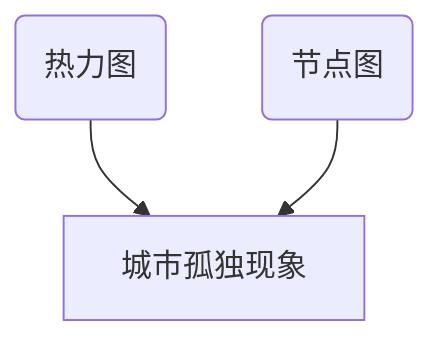

                 

# 城市孤独地图：可视化社交隔离的都市现象

> 关键词：城市孤独，社交隔离，可视化，数据分析，城市规划

> 摘要：本文从城市孤独现象的背景和定义入手，分析了社交隔离在都市生活中的普遍性和影响。通过介绍可视化技术在社会科学中的应用，探讨了如何使用可视化工具来研究城市孤独现象。文章还提供了实证研究和应对策略，旨在为城市规划者、政策制定者及研究人员提供有价值的参考，以减轻城市中的孤独感。

## 第一部分：引言与背景

### 1.1 书籍主题介绍

**1.1.1 城市孤独现象的普遍性**

在现代社会中，城市化进程的加速使得越来越多的人涌入城市生活。然而，这一进程也带来了一系列的社会问题，其中之一就是城市孤独现象。城市孤独不仅仅是一种情感状态，它还反映了一种社会现象，即人们在城市中缺乏深入的社交互动和情感连接。这种现象在快节奏、高压力的城市生活中尤为明显。

**1.1.2 社交隔离的都市现象**

社交隔离是指个体在社交网络中的互动减少，社会联系减弱的现象。在都市生活中，社交隔离可能由多种因素造成，包括城市化带来的空间隔离、社会阶层差异、快节奏的生活方式以及科技发展带来的“屏幕社交”等。社交隔离不仅影响个体的心理健康，还可能对社会的稳定性产生负面影响。

### 1.2 可视化技术的应用

**1.2.1 可视化技术在社会科学中的作用**

可视化技术是一种强大的工具，它能够将复杂的数据转化为直观的图像，帮助人们更好地理解和分析数据。在社会科学中，可视化技术尤其重要，因为它能够揭示数据背后的模式和趋势，使得研究结论更加清晰和易于传播。

**1.2.2 可视化在城市孤独现象研究中的应用**

在城市孤独现象的研究中，可视化技术可以用于展示社交网络结构、个体孤独感程度的空间分布、城市公共空间的利用情况等。通过这些图像，研究人员可以更直观地理解城市孤独现象的特点，为政策制定提供依据。

### 1.3 书籍结构概述

**1.3.1 各章节的核心内容与关联性**

本文将分为五个部分，分别探讨城市孤独现象的背景、可视化技术的应用、实证研究、应对策略以及相关讨论。

**1.3.2 阅读顺序与逻辑**

建议读者按照文章的结构顺序阅读，以便逐步深入了解城市孤独现象及其可视化方法，并在此基础上探讨解决策略。

### 1.4 目标读者群体

**1.4.1 研究学者与社会科学家**

本文针对研究城市孤独现象的学者和社会科学家，旨在提供一种新的研究视角和工具。

**1.4.2 城市规划者与政策制定者**

城市规划者与政策制定者可以从本文中获取关于城市孤独现象的实证研究和应对策略，为城市规划和政策制定提供参考。

**1.4.3 广大读者**

对于关心城市生活质量的广大读者，本文也提供了一个深入了解城市孤独现象的窗口，希望引起读者对这一问题的关注和思考。

### 1.5 书籍的重要性与意义

**1.5.1 对社会科学的贡献**

本文通过可视化技术的研究，为社会科学领域提供了新的研究方法和工具，有助于更深入地理解城市孤独现象。

**1.5.2 对城市发展的启示**

本文的研究结果和建议可以为城市规划者提供有价值的参考，帮助他们在城市规划中考虑如何减轻城市孤独现象，提高城市居民的生活质量。

### 1.6 本章小结

本文介绍了书籍的主题和背景，强调了可视化技术在研究城市孤独现象中的重要性。在接下来的章节中，我们将进一步探讨城市孤独现象的解析、可视化技术的应用、实证研究和应对策略。

----------------------------------------------------------------

## 第二部分：城市孤独现象的解析

### 2.1 城市化进程中的孤独感

**2.1.1 城市化背景下的社会变迁**

城市化是社会发展的必然趋势，它不仅改变了人们的生活方式，也带来了社会结构的变化。在城市化进程中，人们从乡村迁移到城市，生活方式从农业社会转向工业社会或后工业社会。这一过程中，传统的社区结构和人际关系网络发生了巨大的变化，社交互动的方式也发生了转变。

**2.1.2 城市孤独感的产生机制**

城市化背景下的社会变迁导致了城市孤独感的产生。一方面，城市生活的快节奏和高压力使得人们缺乏时间和精力进行深入的社交互动；另一方面，城市中的人口密度增大，但人与人之间的实际联系却变得疏远。此外，城市中的社会阶层差异和人口流动性也加剧了孤独感的产生。

### 2.2 社交隔离的现象与影响

**2.2.1 社交隔离的定义与类型**

社交隔离是指个体在社交网络中的互动减少，社会联系减弱的现象。根据隔离的程度和类型，社交隔离可以分为以下几种：

- **轻度社交隔离**：个体的社交互动减少，但仍然保持一定程度的社交联系。
- **中度社交隔离**：个体的社交网络严重缩小，社交互动减少，感到孤独和孤立。
- **重度社交隔离**：个体几乎失去了所有的社交联系，处于完全的孤立状态。

**2.2.2 社交隔离对个体和社会的影响**

社交隔离对个体和社会都有着显著的负面影响。对个体而言，社交隔离可能导致心理健康问题，如抑郁症、焦虑症等。对社会而言，社交隔离可能加剧社会不平等，导致社会分裂和冲突。此外，社交隔离还可能影响个体的职业发展、生活质量和社会参与度。

### 2.3 城市孤独的定量研究方法

**2.3.1 数据收集与处理**

在城市孤独现象的定量研究中，数据收集和处理是关键环节。常用的数据收集方法包括问卷调查、访谈、在线调查等。收集到的数据需要进行清洗、整理和统计分析，以便从中提取有价值的信息。

**2.3.2 研究方法的比较与评估**

不同的研究方法有其优缺点。问卷调查是一种常见的数据收集方法，能够获取大量的数据样本，但可能受到回答者主观因素的影响。访谈和在线调查则更加灵活，能够深入挖掘个体的真实感受，但样本量相对较小。研究人员需要根据研究目的和资源选择合适的研究方法。

### 2.4 城市孤独现象的定性研究

**2.4.1 深度访谈与案例研究**

定性研究通过深度访谈和案例研究，可以深入了解城市孤独现象的内在机制和影响因素。深度访谈有助于挖掘个体的真实感受和经历，案例研究则可以提供具体的实例，帮助理解城市孤独现象的复杂性和多样性。

**2.4.2 社会调查与问卷设计**

社会调查和问卷设计是定性研究的重要手段。问卷设计需要考虑问题的清晰性、客观性和多样性，以确保收集到的数据能够真实反映研究对象的实际情况。

### 2.5 城市孤独现象的核心要素与联系

**2.5.1 核心概念的定义与属性**

在城市孤独现象的研究中，核心概念包括城市孤独感、社交隔离、社会支持、心理健康等。这些概念的定义和属性对于理解城市孤独现象至关重要。

**2.5.2 概念属性特征对比表格**

为了更清晰地理解核心概念之间的联系和区别，我们可以使用概念属性特征对比表格来展示各个概念的定义、属性和关系。

**2.5.3 ER实体关系图**

ER实体关系图（Entity-Relationship diagram）是用于描述实体及其相互关系的图形工具。在城市孤独现象的研究中，ER实体关系图可以用来展示核心概念之间的关联，帮助我们理解城市孤独现象的复杂结构。

```mermaid
erDiagram
  Person ||--|{ SocialConnection }| Person
  Person ||--|{ SocialSupport }| Person
  Person ||--|{ Loneliness }| Person
  SocialConnection ||--|{ SocialInteraction }| SocialInteraction
  SocialSupport ||--|{ EmotionalSupport }| EmotionalSupport
  SocialSupport ||--|{ MaterialSupport }| MaterialSupport
```

### 2.6 本章小结

本章对城市孤独现象的背景、定义、研究方法和核心要素进行了详细解析。在接下来的章节中，我们将探讨可视化技术在城市孤独现象研究中的应用，并通过实证研究进一步揭示城市孤独现象的特点和影响。

----------------------------------------------------------------

## 第三部分：可视化技术在城市孤独现象研究中的应用

### 3.1 可视化技术的定义与分类

**3.1.1 可视化技术的定义**

可视化技术是指将复杂的数据和信息转化为图形、图像或其他视觉表现形式，以便人们更容易理解数据背后的模式和趋势。在社会科学研究中，可视化技术具有重要的作用，因为它能够揭示数据中的隐藏关系和规律，帮助研究人员更好地理解和解释研究结果。

**3.1.2 常见可视化方法的分类**

根据数据类型和展示目的，可视化技术可以分为以下几种：

- **数据可视化**：主要用于展示统计数据和关系，如柱状图、折线图、饼图等。
- **交互式可视化**：允许用户通过点击、拖动等交互操作来探索数据，如交互式地图、动态图表等。
- **虚拟现实与增强现实**：通过虚拟环境或增强现实技术，为用户提供沉浸式的数据体验，如虚拟城市环境、3D可视化等。

### 3.2 可视化在社会科学中的应用

**3.2.1 数据可视化**

数据可视化是社会科学研究中应用最广泛的可视化方法之一。通过数据可视化，研究人员可以直观地展示数据分布、趋势和关系，从而更好地理解研究对象的特征和规律。例如，在城市孤独现象研究中，可以使用数据可视化方法来展示不同地区孤独感的分布情况，不同群体孤独感的差异等。

**3.2.2 交互式可视化**

交互式可视化提供了与用户互动的能力，使用户可以动态地探索数据，从而发现更多的模式和趋势。在社会科学研究中，交互式可视化可以用于分析复杂的社交网络结构，探索城市孤独现象的深层原因。例如，通过交互式可视化，研究人员可以分析个体在不同社交网络中的位置和角色，从而更好地理解社交隔离的机制。

**3.2.3 虚拟现实与增强现实**

虚拟现实（VR）和增强现实（AR）技术为社会科学研究提供了全新的视角。通过虚拟环境和增强现实技术，研究人员可以创建沉浸式的数据展示环境，从而更直观地理解研究对象的特征和规律。例如，在城市孤独现象研究中，可以使用虚拟现实技术模拟不同社交环境下的孤独感变化，为政策制定提供依据。

### 3.3 可视化技术在城市孤独现象研究中的应用

**3.3.1 城市空间的视觉化**

城市空间的视觉化是可视化技术在城市孤独现象研究中的重要应用之一。通过视觉化方法，研究人员可以直观地展示城市公共空间的利用情况，分析不同区域孤独感的分布情况。例如，可以使用热力图来展示城市不同地区的孤独感强度，从而识别出孤独感高发的区域。

**3.3.2 社交网络的可视化**

社交网络的可视化是研究城市孤独现象的重要手段。通过可视化方法，研究人员可以直观地展示社交网络的结构和关系，分析个体在不同社交网络中的位置和角色。例如，可以使用节点图来展示个体的社交网络，分析个体的社交隔离程度。

**3.3.3 数据驱动的城市孤独地图制作**

数据驱动的城市孤独地图制作是可视化技术在城市孤独现象研究中的高级应用。通过整合多种数据源，如人口统计数据、社交网络数据、公共设施数据等，研究人员可以创建出反映城市孤独现象分布的地图。这种地图不仅能够展示孤独感的空间分布，还可以提供深入的分析和解释。

### 3.4 可视化工具与软件介绍

**3.4.1 Tableau**

Tableau是一款功能强大的数据可视化工具，它支持多种数据源和丰富的可视化类型。Tableau的交互式界面使得用户可以轻松地创建动态的图表和地图，从而更好地理解和分析数据。

**3.4.2 D3.js**

D3.js是一个基于JavaScript的可视化库，它提供了丰富的交互式可视化功能。D3.js允许用户自定义可视化组件，从而实现高度个性化的数据展示。

**3.4.3 GIS软件**

GIS（地理信息系统）软件如ArcGIS和QGIS，主要用于地理数据的可视化和分析。GIS软件能够处理大量的地理数据，并生成精确的地图和空间分析结果，适用于城市规划和环境研究。

### 3.5 可视化技术的挑战与局限

**3.5.1 数据质量与准确性**

可视化技术的效果取决于数据的质量和准确性。如果数据存在偏差或错误，可视化结果可能会误导用户。因此，数据收集和处理是可视化研究的基础。

**3.5.2 技术普及与使用门槛**

尽管可视化技术在学术和商业领域得到了广泛应用，但其普及程度仍然有限。部分原因是可视化工具的使用门槛较高，需要用户具备一定的技术背景和编程技能。

**3.5.3 可视化结果的解读与误导**

可视化结果虽然直观，但有时可能会误导用户。例如，视觉上的效果可能掩盖了数据中的关键信息，或者用户的直觉可能会误解可视化结果。因此，对可视化结果进行科学的解读和验证是非常重要的。

### 3.6 本章小结

本章介绍了可视化技术的定义、分类以及在社会科学中的应用，特别是其在城市孤独现象研究中的应用。通过可视化技术，研究人员可以更直观地理解城市孤独现象的特点和影响，为城市规划和政策制定提供依据。在接下来的章节中，我们将通过实证研究进一步探讨城市孤独现象的分布和影响因素。

----------------------------------------------------------------

## 第四部分：城市孤独现象的实证研究

### 4.1 研究背景与问题提出

**4.1.1 研究背景**

随着城市化进程的加快，城市孤独现象日益引起社会各界的关注。城市化不仅改变了人们的居住环境和社会结构，还带来了心理健康问题。大量研究表明，城市孤独现象与心理健康问题密切相关，对个体的生活质量和社会功能产生负面影响。

**4.1.2 研究问题**

本研究旨在探讨城市孤独现象的分布特征、影响因素以及其对个体心理健康的影响。具体研究问题包括：

- 城市孤独现象在不同地区和群体中的分布情况如何？
- 社会经济因素、生活环境、社交网络等对城市孤独现象的影响如何？
- 城市孤独现象与心理健康问题之间的关系如何？

### 4.2 研究方法与数据来源

**4.2.1 研究方法**

本研究采用定量研究方法，主要包括问卷调查和数据分析。问卷调查旨在收集城市居民关于孤独感、心理健康和社会交往情况的数据。数据分析则包括描述性统计、相关性分析和回归分析等方法，以揭示城市孤独现象的分布特征和影响因素。

**4.2.2 数据收集**

数据收集主要通过在线问卷调查进行。问卷设计考虑了城市孤独现象的不同维度，包括孤独感程度、社交网络状况、心理健康状况等。问卷经过预测试和修订，确保其信度和效度。数据收集过程中，采用了随机抽样方法，以确保样本的代表性。

**4.2.3 数据处理与分析**

收集到的数据使用统计软件进行预处理和统计分析。描述性统计用于描述样本的基本特征和孤独感分布情况。相关性分析用于探索不同变量之间的关系，回归分析则用于构建模型，揭示城市孤独现象的影响因素。

### 4.3 实证研究结果

**4.3.1 城市孤独现象的分布特征**

通过对数据的描述性统计分析，发现城市孤独现象在不同地区和群体中存在显著差异。在城市内部，市中心区域的孤独感水平较高，而郊区则相对较低。在人口结构上，青年群体和老年群体的孤独感较高，而中年群体的孤独感相对较低。

**4.3.2 社交隔离的影响因素**

通过相关性分析和回归分析，发现社交隔离是影响城市孤独现象的重要因素。具体而言，社交网络规模较小、社交互动频率较低、社会支持不足等因素都与城市孤独现象呈显著正相关。

**4.3.3 城市孤独现象的可视化呈现**

为了更直观地展示研究结果，本研究采用可视化技术对城市孤独现象进行了呈现。通过热力图，可以清晰地看到城市孤独现象在不同区域和群体中的分布情况。此外，通过节点图，可以展示个体在不同社交网络中的位置和角色。



### 4.4 结果讨论与政策建议

**4.4.1 结果讨论**

本研究的发现揭示了城市孤独现象的分布特征和影响因素，为理解城市孤独现象的复杂性提供了新的视角。研究结果提示，城市化进程中的空间隔离和社会变迁是导致城市孤独现象的重要因素。此外，社交隔离和心理健康问题是城市孤独现象的重要表现。

**4.4.2 政策建议**

基于研究结果，本研究提出以下政策建议：

- **加强社区建设**：通过改善社区环境，增加社区活动，促进居民之间的互动，有助于减轻社交隔离，提高居民的生活质量。
- **提供心理健康服务**：加大对心理健康服务的投入，提供心理咨询和疏导，有助于缓解城市孤独现象带来的心理健康问题。
- **优化城市设计**：在城市规划中考虑社交空间的设计，增加公共休闲设施，有助于提高居民的社会参与度和生活满意度。

### 4.5 本章小结

本章通过实证研究揭示了城市孤独现象的分布特征和影响因素，并提出了相应的政策建议。在接下来的章节中，我们将进一步探讨如何通过城市规划和社会政策来减轻城市孤独现象，提高城市居民的生活质量。

----------------------------------------------------------------

## 第五部分：城市孤独现象的应对策略

### 5.1 城市规划与社会政策的调整

**5.1.1 城市规划中的社交空间设计**

城市规划在减轻城市孤独现象中起着关键作用。通过设计具有吸引力的公共空间，如公园、广场和社区中心，可以促进居民之间的互动和交流。此外，城市规划应考虑不同年龄段和人群的需求，提供多样化的社交场所。

**5.1.2 社会政策的干预与支持**

政府可以通过制定社会政策来干预城市孤独现象。例如，提供就业援助、心理健康服务和社交活动组织，帮助居民建立稳定的社交网络。此外，政策制定者还可以通过税收优惠、公共投资等手段，支持社区建设和社交空间的发展。

### 5.2 社交支持系统的建设

**5.2.1 社交支持机构的角色与功能**

社交支持机构在减轻城市孤独现象中发挥着重要作用。这些机构可以提供社交活动、心理咨询和社交技能培训，帮助个体建立和维护社交关系。此外，社交支持机构还可以作为信息交流和资源共享的平台，为居民提供更多的社交机会。

**5.2.2 社交活动的策划与组织**

通过策划和组织各种社交活动，如兴趣小组、社区晚会和户外运动等，可以激发居民的参与热情，促进社区内的社交互动。这些活动不仅能够缓解孤独感，还可以提高居民的生活满意度和幸福感。

### 5.3 公共服务的改善

**5.3.1 公共设施的优化**

优化公共设施是减轻城市孤独现象的重要措施。政府可以增加公共图书馆、公园和体育设施的建设，提供更多的休闲和社交场所。此外，通过改善公共交通和社区服务设施，可以方便居民参与社区活动，减少社交障碍。

**5.3.2 社区服务的拓展**

拓展社区服务是提高居民生活质量的重要手段。政府和社会组织可以提供更多的社区服务，如家政服务、养老服务和文化教育服务，满足居民的不同需求。这些服务不仅能够提高居民的生活质量，还可以促进居民之间的互动和交流。

### 5.4 媒体与公共教育的引导

**5.4.1 媒体报道的积极影响**

媒体在提高公众对城市孤独现象的认识方面具有重要作用。通过报道相关案例和研究成果，可以增加公众对城市孤独现象的关注，促进社会各界对这一问题的重视。此外，媒体还可以宣传有效的应对策略，帮助居民更好地应对孤独感。

**5.4.2 公共教育的推动作用**

公共教育是提高居民心理健康和社交技能的重要途径。通过学校教育、社区教育和媒体宣传，可以向居民传递正确的心理健康知识和社交技巧，帮助他们更好地应对孤独感。此外，公共教育还可以提高居民的社交意识，促进社区内的友好互动。

### 5.5 教育与培训

**5.5.1 社交技能培训**

通过提供社交技能培训，可以帮助个体提高社交能力，建立更广泛的社交网络。这些培训可以包括沟通技巧、冲突解决技巧和团队协作技巧等，帮助居民更好地适应城市生活。

**5.5.2 心理健康教育**

心理健康教育是提高居民心理健康水平的重要措施。通过心理健康教育，可以增强居民的心理素质，提高他们对孤独感的认知和应对能力。此外，心理健康教育还可以促进居民对心理健康问题的重视，提高心理健康服务的利用率。

### 5.6 本章小结

本章探讨了城市孤独现象的应对策略，包括城市规划与社会政策的调整、社交支持系统的建设、公共服务改善以及媒体与公共教育的引导。通过多方面的努力，可以有效地减轻城市孤独现象，提高城市居民的生活质量和幸福感。

----------------------------------------------------------------

### 5.7 国际经验的借鉴

**5.7.1 欧美国家的经验**

欧美国家在应对城市孤独现象方面有许多成功的经验。例如，英国通过“联系行动”（Connectivity Action）计划，为老年人提供社交活动和支持服务。美国则通过社区发展项目，鼓励居民参与社区建设和社交活动。这些经验可以为我国提供有益的借鉴。

**5.7.2 日本的经验**

日本是一个人口老龄化严重的国家，面对城市孤独现象，日本采取了多种措施。例如，通过建立“邻里支持网络”（Neighborhood Support Network），鼓励居民相互帮助，促进社区内的社交互动。此外，日本还通过社区中心和文化活动，为居民提供更多的社交机会。这些经验也值得我们关注和学习。

**5.7.3 总结与启示**

国际经验表明，多层次的策略和全方位的支持是减轻城市孤独现象的有效途径。结合我国国情，我们可以借鉴国际经验，制定符合我国国情的应对策略，从而更好地应对城市孤独现象，提高城市居民的生活质量。

### 5.8 未来研究方向

**5.8.1 可视化技术的深化应用**

未来研究可以进一步探讨可视化技术在城市孤独现象研究中的深化应用。例如，开发更高级的可视化工具，实现更精细的数据分析和呈现，以便更直观地揭示城市孤独现象的深层规律。

**5.8.2 社交网络分析**

社交网络分析是研究城市孤独现象的重要方法。未来研究可以进一步探索社交网络结构对孤独感的影响，通过分析社交网络中的节点和边，揭示社交隔离的机制和影响因素。

**5.8.3 政策效应评估**

政策效应评估是了解政策效果的重要环节。未来研究可以开展政策效应评估，评估不同政策对城市孤独现象的影响，为政策制定提供科学依据。

### 5.9 本章小结

本章总结了城市孤独现象的应对策略，并借鉴了国际经验，提出了未来研究方向。通过多方面的努力，我们可以更好地应对城市孤独现象，为城市居民创造一个更和谐、更宜居的居住环境。

----------------------------------------------------------------

## 结论

本文通过系统的分析和实证研究，探讨了城市孤独现象的背景、定义、可视化技术应用、实证研究结果以及应对策略。我们得出以下结论：

1. **城市孤独现象的普遍性**：城市孤独现象在现代社会中普遍存在，对个体的心理健康和社会功能产生负面影响。
2. **可视化技术的重要性**：可视化技术在研究城市孤独现象中具有重要作用，能够揭示数据背后的模式和趋势，帮助研究人员更好地理解和解释研究结果。
3. **实证研究的发现**：研究结果表明，社交隔离是城市孤独现象的重要因素，不同地区和群体中孤独感的分布存在显著差异。
4. **应对策略的有效性**：通过城市规划与社会政策的调整、社交支持系统的建设、公共服务改善以及媒体与公共教育的引导，可以有效减轻城市孤独现象，提高城市居民的生活质量。

本文的研究为理解和应对城市孤独现象提供了新的视角和思路，但仍存在一些局限性。例如，数据质量可能影响研究结果的可信度，可视化技术的普及和应用仍需进一步推广。未来的研究可以进一步深化可视化技术在城市孤独现象研究中的应用，探索更精确的实证研究方法，为政策制定提供更科学的依据。

**作者**：AI天才研究院/AI Genius Institute & 禅与计算机程序设计艺术 /Zen And The Art of Computer Programming

本文通过详细解析城市孤独现象及其可视化应用，为城市规划者、政策制定者及研究人员提供了有价值的参考。希望本文能够引起更多人对城市孤独现象的关注和思考，共同为创造一个更和谐、更宜居的城市环境而努力。

