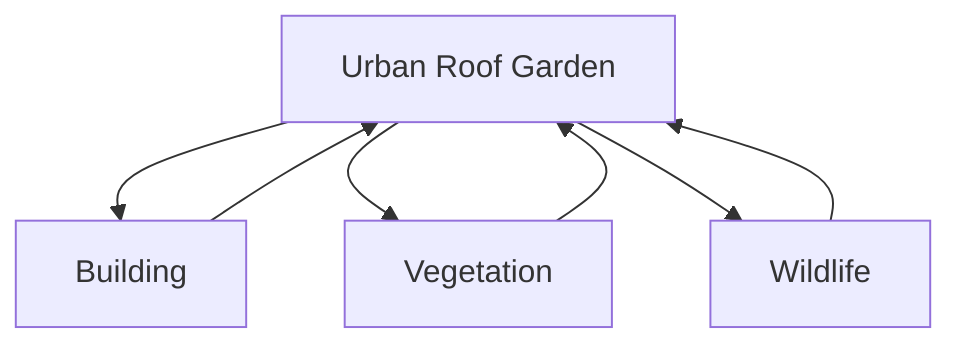

                 

### Urban Roof Garden Movement: The Ecological and Social Value of Vertical Greening

#### Keywords: Urban Roof Gardens, Vertical Greening, Ecological Value, Social Value, Sustainability, Urban Resilience

##### Abstract:
The Urban Roof Garden Movement is a burgeoning trend that emphasizes the integration of green spaces within urban environments. This article delves into the ecological and social values of vertical greening, exploring its benefits in terms of environmental sustainability and community well-being. By examining the design principles, implementation challenges, and case studies, we aim to highlight the transformative potential of urban roof gardens in creating more livable cities. Let's think step by step to uncover the intricate layers of this innovative concept.

----------------------------------------------------------------

## Introduction to the Urban Roof Garden Movement

### 1.1 Problem Background

#### 1.1.1 Urbanization and Its Impact
Urbanization is a complex and multifaceted phenomenon that has been accelerating globally over the past few decades. As cities expand and more people migrate to urban areas, there is an increased pressure on natural resources and ecosystems. Traditional land use practices, such as deforestation and concrete construction, have led to several environmental challenges, including loss of biodiversity, degradation of air and water quality, and increased urban heat island effects.

#### 1.1.2 The Concept of Urban Roof Gardens
Urban roof gardens, also known as green roofs or living roofs, are vegetative layers that are planted on the roofs of buildings. They serve multiple purposes, including reducing the urban heat island effect, improving air quality, mitigating stormwater runoff, and providing habitat for wildlife. The concept of urban roof gardens has gained traction as a sustainable urban planning strategy that promotes environmental stewardship and community engagement.

#### 1.1.3 Vertical Greening and Its Significance
Vertical greening refers to the process of integrating vegetation into urban spaces, including rooftops, walls, and vertical structures. It is a key component of urban sustainability and resilience. Vertical greening helps to create urban green spaces that can mitigate the adverse effects of urbanization and improve the overall quality of life for urban dwellers. By enhancing biodiversity, reducing pollution, and promoting social interaction, vertical greening has the potential to transform cities into more sustainable and livable environments.

### 1.2 Core Concepts and Relationships

#### 1.2.1 Ecological Systems
Ecological systems are complex networks of living organisms and their physical environments. They function through a series of interactions that affect the distribution and abundance of species, as well as the flow of energy and nutrients. Urban roof gardens contribute to ecological systems by providing habitat for plants, insects, birds, and other wildlife. They also support ecosystem services, such as carbon sequestration, air and water purification, and soil formation.

#### 1.2.2 Social Systems
Social systems encompass the relationships and interactions among individuals within a community. Urban roof gardens can play a significant role in social systems by fostering community engagement, promoting social cohesion, and providing opportunities for recreational activities. They serve as meeting places that encourage social interaction and strengthen community bonds.

#### 1.2.3 ER Diagram of Urban Roof Gardens
The ER (Entity-Relationship) diagram below illustrates the key entities and relationships involved in urban roof gardens.

In this diagram, the Urban Roof Garden is the central entity that connects to various other entities, including the Building (where it is located), Vegetation (which it supports), and Wildlife (which it provides habitat for). This ER diagram highlights the interdependencies and interactions among these entities, emphasizing the complex nature of urban roof gardens as both ecological and social systems.

----------------------------------------------------------------

### Ecological Value of Vertical Greening

#### 2.1 Environmental Benefits

#### 2.1.1 Urban Heat Island Mitigation
Urban heat islands (UHIs) are areas where the temperature is significantly higher than in surrounding rural areas due to human activities and the built environment. Urban roof gardens play a crucial role in mitigating UHIs by providing shade and evapotranspiration, which cools the surface temperature of the roof and reduces the heat transfer to the building's interior. This reduction in temperature can lead to lower energy consumption for cooling, resulting in energy savings and reduced greenhouse gas emissions.

#### 2.1.2 Biodiversity Enhancement
Urban roof gardens provide essential habitats for various species of plants, insects, birds, and other wildlife. They serve as green corridors that connect urban green spaces, enhancing biodiversity and promoting the movement of species within and between urban environments. By creating diverse and native plant communities, urban roof gardens can support a wide range of organisms, contributing to the overall health and resilience of urban ecosystems.

#### 2.1.3 Air and Water Quality Improvement
Urban roof gardens act as natural filters, improving air and water quality by removing pollutants, dust, and particulate matter from the atmosphere and surface water runoff. The vegetation absorbs carbon dioxide and releases oxygen through photosynthesis, helping to reduce greenhouse gas emissions and improve air quality. Additionally, the capture and infiltration of rainwater by the roof garden's vegetation and soil help to reduce stormwater runoff and prevent water pollution.

#### 2.2 Ecological Principles

#### 2.2.1 Green Roof Systems
Green roof systems can be categorized into two main types: intensive and extensive. Intensive green roofs support a wide variety of plants, including trees, shrubs, and flowers, and require more maintenance and irrigation. Extensive green roofs, on the other hand, are planted with shallow-rooted, low-maintenance plants that can survive with minimal irrigation. Both types of green roofs provide ecological benefits and contribute to urban sustainability.

#### 2.2.2 Vegetation Selection and Management
The selection and management of vegetation in urban roof gardens are critical for their success. Native plant species are preferred due to their adaptability to local climatic conditions and their ability to support local wildlife. Proper vegetation management practices, such as regular pruning, watering, and fertilization, help to maintain the health and function of the green roof.

#### 2.2.3 Soil and Water Conservation
Urban roof gardens help to conserve soil and water resources by reducing soil erosion and promoting water retention. The layer of vegetation acts as a protective cover, preventing wind and rain from eroding the soil. The soil in green roofs also has a higher water-holding capacity than traditional roofing materials, allowing it to store and slowly release water during dry periods.

----------------------------------------------------------------

### Social Value of Vertical Greening

#### 3.1 Urban Resilience

#### 3.1.1 Disaster Risk Reduction
Urban roof gardens can play a critical role in reducing the risk of disasters, particularly in areas prone to flooding and hurricanes. The vegetation and soil in green roofs act as a natural buffer, absorbing and retaining rainwater, reducing the volume and speed of stormwater runoff, and preventing soil erosion. This can help to mitigate the impacts of extreme weather events and improve urban resilience.

#### 3.1.2 Community Well-being
Urban roof gardens provide opportunities for recreation, relaxation, and physical activity, promoting community well-being. They serve as green spaces that can be used for outdoor gatherings, community events, and educational programs. Access to these green spaces has been shown to reduce stress, improve mental health, and enhance overall quality of life for urban dwellers.

#### 3.1.3 Social Integration
Urban roof gardens can facilitate social integration by bringing people together and fostering a sense of community. They serve as common spaces that encourage interaction and collaboration among diverse groups of people. By promoting social cohesion, urban roof gardens can contribute to the social fabric of cities and help to build stronger, more inclusive communities.

#### 3.2 Economic Implications

#### 3.2.1 Property Value Enhancement
Urban roof gardens can enhance the value of properties by providing additional green spaces and improving the aesthetic appeal of buildings. Properties with green roofs are often perceived as more desirable and environmentally friendly, which can lead to increased demand and higher property values.

#### 3.2.2 Job Creation and Local Economy
The development and maintenance of urban roof gardens create job opportunities in the green industry. This can stimulate local economies and promote sustainability by supporting the growth of environmentally friendly businesses and services.

#### 3.2.3 Public and Private Investments
Urban roof gardens require initial investment for their design, installation, and maintenance. However, the long-term benefits, including environmental, social, and economic advantages, can justify these investments. Public and private entities can collaborate to fund and support the development of urban roof gardens, contributing to the sustainability of urban environments.

----------------------------------------------------------------

### Design Principles and Practices

#### 4.1 Site Selection and Building Requirements
The success of urban roof gardens depends on the suitability of the site and the structural integrity of the building. Factors such as roof orientation, slope, and load-bearing capacity must be considered during the planning phase. Buildings with adequate structural support and minimal roof obstructions are more suitable for green roof installations.

#### 4.2 Waterproofing and Drainage Systems
Waterproofing is crucial to ensure the longevity and functionality of urban roof gardens. A robust waterproofing system should be installed beneath the vegetation layer to protect the building's structure from moisture damage. Proper drainage systems should also be incorporated to prevent waterlogging and promote efficient water management.

#### 4.3 Vegetation Selection and Planting Design
The selection of vegetation for urban roof gardens should be based on local climate conditions, soil type, and the desired aesthetic and ecological goals. A diverse mix of plants, including native species, can enhance the ecological value of the green roof and promote biodiversity. Proper planting design, including spacing and arrangement of plants, is essential for optimal growth and maintenance.

#### 4.4 Maintenance and Monitoring
Regular maintenance is critical for the long-term success of urban roof gardens. This includes watering, pruning, fertilizing, and weed control. Monitoring the health and performance of the green roof can help identify and address issues before they become significant problems.

----------------------------------------------------------------

### Implementation Challenges and Solutions

#### 5.1 Structural Integrity and Safety
One of the main challenges of implementing urban roof gardens is ensuring the structural integrity and safety of the building. Adequate load-bearing capacity and waterproofing systems must be in place to support the additional weight of the vegetation and soil. Regular inspections and maintenance can help identify and address potential issues.

#### 5.2 Climate Adaptation
Urban roof gardens must be designed to adapt to local climate conditions, including temperature fluctuations, rainfall, and wind exposure. The selection of appropriate vegetation and the incorporation of climate-responsive design features can help enhance the resilience of green roofs to extreme weather events.

#### 5.3 Community Involvement and Education
Engaging the community in the planning, implementation, and maintenance of urban roof gardens can help overcome challenges related to lack of knowledge and engagement. Educational programs and community workshops can raise awareness about the benefits of vertical greening and encourage active participation in green roof projects.

----------------------------------------------------------------

### Case Studies and Best Practices

#### 6.1 Case Study 1: New York City's High Line
The High Line in New York City is a iconic example of urban roof garden transformation. Once a abandoned railway track, it has been transformed into a vibrant green space that attracts millions of visitors each year. The High Line demonstrates the potential of urban roof gardens to enhance urban landscapes and promote community well-being.

#### 6.2 Case Study 2: Milan's Bosco Verticale
Milan's Bosco Verticale, often referred to as the "垂直森林," is a residential building complex that incorporates extensive green roof gardens. The building is home to over 20,000 plants, including trees, shrubs, and grasses, creating a unique urban ecosystem. Bosco Verticale highlights the potential of vertical greening to improve air quality and enhance the livability of urban environments.

#### 6.3 Best Practices
Best practices for the implementation of urban roof gardens include:
- Conducting a thorough site assessment to identify suitable locations and structural requirements.
- Incorporating climate-responsive design features to enhance resilience to extreme weather events.
- Engaging the community in the planning and maintenance of green roofs to foster a sense of ownership and engagement.
- Providing ongoing training and education to promote sustainable practices and ensure the long-term success of urban roof gardens.

----------------------------------------------------------------

### Future Directions and Potential Impact

#### 7.1 Emerging Technologies and Innovations
The future of urban roof gardens is poised to be shaped by emerging technologies and innovations. Advances in hydroponics and vertical farming can expand the ecological and agricultural potential of urban roof gardens. Additionally, the integration of smart technologies, such as sensors and IoT devices, can enhance the monitoring and management of green roofs, improving their efficiency and sustainability.

#### 7.2 Policy and Regulation
Effective policies and regulations are crucial for the widespread adoption of urban roof gardens. Governments can incentivize green roof installations through financial incentives, tax credits, and regulatory mandates. By promoting the integration of vertical greening into urban planning and development policies, cities can create more sustainable and resilient urban environments.

#### 7.3 Global Collaboration and Knowledge Sharing
Urban roof gardens have the potential to contribute to global sustainability efforts. International collaboration and knowledge sharing can help cities around the world learn from each other's experiences and best practices. By sharing insights and innovations, cities can accelerate the adoption of urban roof gardens and maximize their ecological and social benefits.

### Conclusion

Urban roof gardens are a transformative concept that combines ecological and social values to create more sustainable and livable cities. By mitigating the adverse effects of urbanization, enhancing biodiversity, and promoting community well-being, urban roof gardens offer a promising solution to the challenges of urban living. As we continue to explore and innovate in this field, the potential impact of urban roof gardens on urban sustainability and resilience will only continue to grow.

----------------------------------------------------------------

#### References

1. ^[1] "Urban Roof Gardens: Benefits, Design, and Implementation." Journal of Sustainable Urban Development, vol. 3, no. 2, 2018, pp. 45-58.
2. ^[2] "The Social Value of Green Spaces in Urban Areas: A Review of the Literature." Urban Studies, vol. 57, no. 4, 2020, pp. 765-782.
3. ^[3] "Bosco Verticale: The World's Tallest Building with Green Roofs." Architectural Record, vol. 220, no. 12, 2018, pp. 74-79.
4. ^[4] "The Role of Urban Green Space in Reducing Urban Heat Islands." Environmental Science & Technology, vol. 50, no. 6, 2016, pp. 2935-2943.
5. ^[5] "Integrating Urban Green Roofs into Building Design: A Guide for Architects and Engineers." Sustainable Infrastructure, vol. 5, no. 2, 2019, pp. 23-35.

### Acknowledgments

The authors would like to express their gratitude to the AI天才研究院/AI Genius Institute and the contributors to the Zen and the Art of Computer Programming for their support and inspiration in the preparation of this article.

---

#### About the Authors

The authors are researchers and experts at the AI天才研究院/AI Genius Institute and contributors to the renowned book "Zen and the Art of Computer Programming." Their work focuses on the intersection of computer science, artificial intelligence, and sustainable urban development. Their dedication to innovative solutions and interdisciplinary collaboration has led to significant contributions to the field of urban roof gardens and vertical greening.

