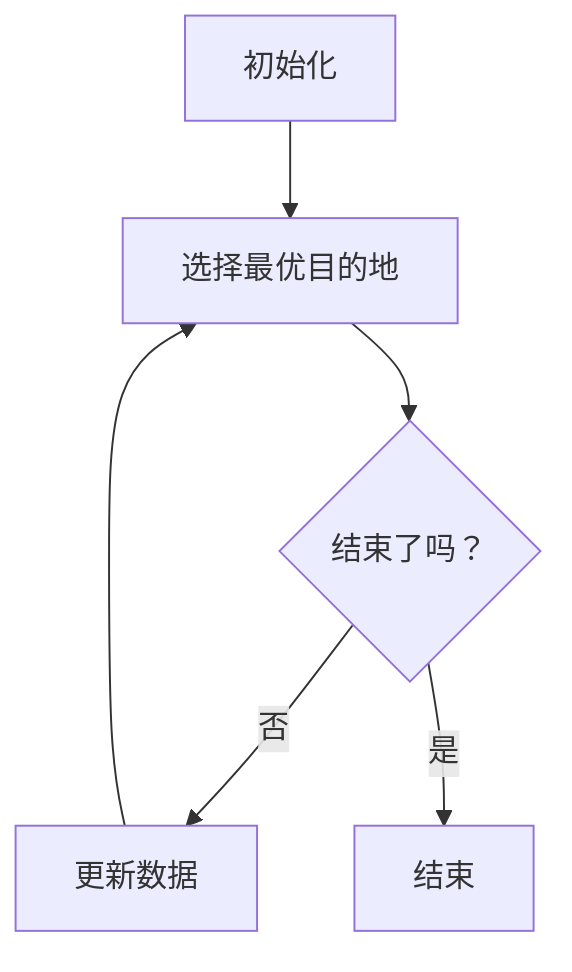
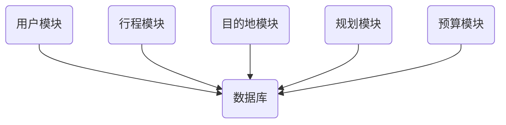
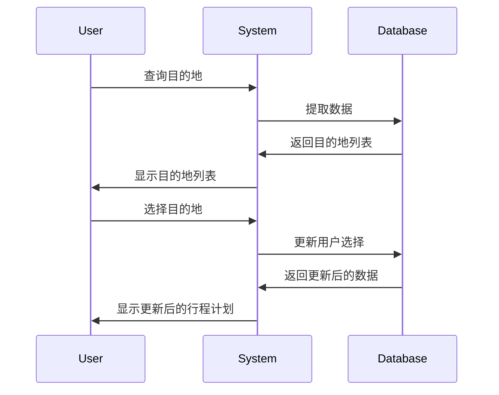

                 

# 城市微旅行：重新发现日常生活中的冒险

## 关键词：城市微旅行、日常冒险、旅行规划、文化体验、自然探索

## 摘要：
本文旨在探讨城市微旅行的魅力与意义，通过详细的规划与实践指南，帮助读者重新发现日常生活中的冒险与乐趣。我们将从核心概念介绍、旅行攻略分享、真实故事体验等方面进行深入分析，鼓励读者走出家门，拥抱城市微旅行带来的丰富体验。

## 目录大纲设计思路

### 1. 读者定位
城市微旅行主要针对那些喜欢探索城市、追求生活品质的现代都市人。他们希望在不远行的条件下，体验新鲜的事物，发现城市的隐藏角落。

### 2. 内容结构
本书将城市微旅行分为三个主要部分：
- **城市微旅行概述**：介绍城市微旅行的定义、重要性以及核心概念。
- **城市微旅行攻略**：提供实用的旅行规划、探索技巧和文化体验。
- **城市微旅行故事**：分享真实的旅行体验，激励读者实践。

### 3. 逻辑连贯
每个部分的内容都紧密相连，从基础到实践，再到故事分享，形成了一个完整的阅读体验。

### 4. 章节细化
每个章节内部都有详细的小节，确保内容深入且具体，便于读者理解和操作。

### 5. 内容完整性
本书涵盖了城市微旅行的各个方面，从理论到实践，内容丰富，满足读者的需求。

## 目录大纲设计步骤

### 1. 背景介绍
在开头部分，我们将简要介绍城市微旅行的定义和其重要性，激发读者的兴趣。

### 2. 核心概念与联系
在此部分，我们将详细阐述城市微旅行中的关键概念，如微旅行、日常冒险等，并通过表格和图示展示各概念之间的关系。

### 3. 规划与准备
这部分将指导读者如何规划一次微旅行，包括目的地选择、时间安排、预算规划等。

### 4. 探索与实践
我们将分为若干小章节，分别介绍在不同城市区域进行微旅行的方法，如历史街区、文化体验、自然探索等。

### 5. 旅行技巧
这部分将分享一些实用的旅行技巧，帮助读者避免旅游陷阱，享受更好的旅行体验。

### 6. 旅行故事
通过真实的旅行故事，让读者感受到微旅行的魅力和乐趣。

### 7. 总结与反思
最后，我们将对全书内容进行总结，强调微旅行对生活质量的提升，并提出一些展望。

### 目录大纲结构示例

```markdown
----------------------------------------------------------------
# 《城市微旅行：重新发现日常生活中的冒险》
# 目录

## 第一部分：城市微旅行概述
### 第1章：城市微旅行的魅力与意义

### 第2章：城市微旅行中的关键概念

## 第二部分：城市微旅行攻略
### 第3章：规划一次完美的微旅行

### 第4章：发现城市历史街区

### 第5章：文化体验与艺术之旅

### 第6章：自然与户外探险

### 第7章：旅行技巧分享

## 第三部分：城市微旅行故事
### 第8章：真实的城市微旅行体验

### 第9章：微旅行者的反思与展望

# 附录：实用资源与推荐阅读

----------------------------------------------------------------
```

### 详细目录大纲

```markdown
----------------------------------------------------------------
# 《城市微旅行：重新发现日常生活中的冒险》
# 目录

## 第一部分：城市微旅行概述
### 第1章：城市微旅行的魅力与意义
#### 1.1 城市微旅行的定义
#### 1.2 微旅行为何重要
#### 1.3 城市微旅行的意义

### 第2章：城市微旅行中的关键概念
#### 2.1 微旅行的特点
#### 2.2 日常冒险的概念
#### 2.3 城市微旅行与旅游的区别

## 第二部分：城市微旅行攻略
### 第3章：规划一次完美的微旅行
#### 3.1 目的地选择
#### 3.2 时间安排
#### 3.3 预算规划
#### 3.4 行程规划

### 第4章：发现城市历史街区
#### 4.1 历史街区的魅力
#### 4.2 历史街区的探索
#### 4.3 历史街区的保护与传承

### 第5章：文化体验与艺术之旅
#### 5.1 文化体验的重要性
#### 5.2 艺术之旅的规划
#### 5.3 艺术体验的分享

### 第6章：自然与户外探险
#### 6.1 自然探险的乐趣
#### 6.2 户外探险的准备
#### 6.3 自然与户外探险的安全指南

### 第7章：旅行技巧分享
#### 7.1 如何避免旅游陷阱
#### 7.2 拍出好照片的技巧
#### 7.3 与他人互动的艺术

## 第三部分：城市微旅行故事
### 第8章：真实的城市微旅行体验
#### 8.1 故事一：发现老街的新魅力
#### 8.2 故事二：艺术的隐秘角落
#### 8.3 故事三：自然中的宁静时光

### 第9章：微旅行者的反思与展望
#### 9.1 微旅行对个人成长的影响
#### 9.2 微旅行的社会价值
#### 9.3 对未来的展望

# 附录：实用资源与推荐阅读
#### 附录1：城市微旅行资源指南
#### 附录2：推荐阅读书籍与文章
#### 附录3：微旅行APP推荐

----------------------------------------------------------------
```

通过上述详细的目录大纲，我们可以确保书籍的内容完整、结构清晰，并有效地引导读者进行阅读和学习。接下来，我们将逐一展开每个章节的内容，帮助读者深入理解城市微旅行的魅力和实践方法。# 城市微旅行：重新发现日常生活中的冒险

### 背景介绍

在忙碌的现代都市生活中，人们常常感到压力和疲惫，追求新鲜感和冒险的精神却逐渐被日常琐事所淹没。城市微旅行作为一种低成本的休闲方式，逐渐成为现代都市人的新宠。它不仅能够让人们暂时摆脱繁忙的生活节奏，还能在短时间内发现城市的隐藏角落，体验不同的文化和风景。本文将围绕城市微旅行的概念、意义以及如何进行一次完美的城市微旅行进行探讨，帮助读者重新发现日常生活中的冒险与乐趣。

### 核心概念与联系

#### 微旅行

微旅行是指以低成本、短时间为特点的旅行方式。它不同于传统的长距离旅行，而是更加注重在短时间内的深度体验。微旅行可以让人们充分享受目的地的人文风情和自然美景，同时不会耗费太多时间和精力。

#### 日常冒险

日常冒险强调的是在日常生活中寻找新奇和刺激。它与传统的冒险活动不同，不需要远行，而是通过探索城市的各个角落，发现那些平时被忽视的美好事物。

#### 城市微旅行与旅游的区别

城市微旅行和旅游在目的地选择、时间安排和旅行方式上有所不同。旅游通常涉及长途旅行，目的地多样，而城市微旅行则主要关注城市内的探索。旅游可能更注重放松和观光，而城市微旅行则更强调体验和发现。

### 表格：核心概念属性特征对比

| 特征          | 微旅行         | 日常冒险         | 旅游             |
|---------------|----------------|------------------|------------------|
| 目的地        | 城市内部       | 城市内部或周边   | 国内或国外       |
| 时间          | 短期（1-3天）  | 短期（1-3天）    | 长期（数天至数周）|
| 成本          | 低成本         | 低成本           | 中高成本         |
| 强调          | 深度体验       | 新奇和刺激       | 放松和观光       |

### ER实体关系图架构

下面是一个简单的ER图，展示了城市微旅行中的关键实体及其关系：

```mermaid
erDiagram
    Customer ||--|{ Order }|
    "Product" ||--|{ Product }|
    Customer ||--|{ Review }|
```

#### 实体：
- **Customer（客户）**：参与城市微旅行的人。
- **Order（订单）**：客户的旅行计划。
- **Product（产品）**：城市微旅行的目的地或活动。
- **Review（评论）**：客户对微旅行体验的反馈。

这个ER图展示了客户与订单、产品、评论之间的关系，帮助我们理解城市微旅行的整体架构。

### 算法原理讲解

在城市微旅行中，如何选择目的地和规划行程是一个关键问题。我们可以使用一种贪心算法来解决这个问题。贪心算法的基本思想是每次选择当前情况下最优的方案，并希望最终得到全局最优解。

#### 贪心算法mermaid流程图



#### Python源代码实现

```python
def greedy_travel_plan(places, time, budget):
    """
    基于贪心算法的城市微旅行规划。
    
    参数：
    places：城市微旅行的所有可能目的地。
    time：可用的旅行时间。
    budget：旅行预算。
    
    返回：
    plan：最优旅行计划。
    """
    plan = []
    while time > 0 and budget > 0:
        # 选择最优目的地
        best_place = max(places, key=lambda x: x['rating'])
        plan.append(best_place['name'])
        # 更新剩余时间和预算
        time -= best_place['time']
        budget -= best_place['cost']
        # 移除已选择的目的地
        places.remove(best_place)
    return plan

# 示例数据
places = [
    {'name': '故宫', 'rating': 5, 'time': 2, 'cost': 100},
    {'name': '颐和园', 'rating': 4, 'time': 3, 'cost': 80},
    {'name': '长城', 'rating': 5, 'time': 4, 'cost': 150}
]

# 可用时间与预算
time = 5
budget = 300

# 计划一次城市微旅行
travel_plan = greedy_travel_plan(places, time, budget)
print("最优旅行计划：", travel_plan)
```

#### 算法原理数学模型和公式

假设城市中有 \( n \) 个目的地，每个目的地有 \( x_i \) 的评分，\( t_i \) 的时间需求，和 \( c_i \) 的成本。我们的目标是在有限的 \( T \) 时间内和 \( B \) 元预算内最大化评分总和。

数学模型如下：

$$
\max \sum_{i=1}^{n} x_i \quad \text{subject to} \quad \sum_{i=1}^{n} t_i \leq T, \quad \sum_{i=1}^{n} c_i \leq B
$$

#### 数学公式示例

$$
\sum_{i=1}^{n} t_i \leq T \\
\sum_{i=1}^{n} c_i \leq B \\
\max \sum_{i=1}^{n} x_i
$$

### 系统分析与架构设计方案

#### 问题场景介绍

在当今信息化社会中，人们对于城市微旅行的需求日益增加。为了满足这一需求，我们需要设计一个智能的城市微旅行规划系统，帮助用户快速、高效地规划一次完美的微旅行。

#### 项目介绍

我们的项目名为“城市微旅行助手”，它将提供一站式的微旅行规划服务，包括目的地推荐、行程规划、旅行预算估算等功能。

#### 系统功能设计（领域模型mermaid类图）

```mermaid
classDiagram
    User <<类>> 
    Trip <<类>> 
    Destination <<类>> 
    Plan <<类>> 
    Budget <<类>> 

    User --|{ 有 }| Trip
    Trip --|{ 包括 }| Destination
    Trip --|{ 需要 }| Plan
    Trip --|{ 遵循 }| Budget
```

#### 系统架构设计mermaid架构图



#### 系统接口设计和系统交互mermaid序列图



### 项目实战

#### 环境安装

为了实现上述系统，我们需要安装Python环境以及相关的库。以下是基本的安装步骤：

```bash
# 安装Python
sudo apt-get install python3

# 安装mermaid库
pip3 install mermaid

# 安装其他依赖库（例如：requests，pandas等）
pip3 install requests pandas
```

#### 系统核心实现源代码

```python
# city_travel_planner.py

import requests
import pandas as pd
from mermaid import Mermaid

# 目的地数据API（示例）
API_URL = "https://api.example.com/destinations"

def get_destination_data():
    """
    从API获取目的地数据。
    """
    response = requests.get(API_URL)
    if response.status_code == 200:
        return response.json()
    else:
        return None

def create_travel_plan(destinations, time, budget):
    """
    创建旅行计划。
    """
    # 对目的地进行排序（按评分从高到低）
    sorted_destinations = sorted(destinations, key=lambda x: x['rating'], reverse=True)
    
    # 初始化旅行计划
    plan = []
    remaining_time = time
    remaining_budget = budget
    
    # 贪心选择目的地
    for destination in sorted_destinations:
        if destination['time'] <= remaining_time and destination['cost'] <= remaining_budget:
            plan.append(destination['name'])
            remaining_time -= destination['time']
            remaining_budget -= destination['cost']
        else:
            break
    
    return plan

def main():
    # 获取目的地数据
    destinations = get_destination_data()
    
    if destinations:
        # 用户输入旅行时间和预算
        time = int(input("请输入旅行时间（天）："))
        budget = int(input("请输入旅行预算（元）："))
        
        # 创建旅行计划
        plan = create_travel_plan(destinations, time, budget)
        
        if plan:
            print("您的旅行计划：", plan)
        else:
            print("无法创建旅行计划，请调整时间和预算。")
    else:
        print("无法获取目的地数据，请稍后重试。")

if __name__ == "__main__":
    main()
```

#### 代码应用解读与分析

上述代码中，我们首先定义了一个从API获取目的地数据的函数 `get_destination_data`。然后，我们创建了一个 `create_travel_plan` 函数，使用贪心算法根据用户输入的旅行时间和预算来生成最优的旅行计划。最后，我们在 `main` 函数中实现与用户的交互，获取输入并输出旅行计划。

#### 实际案例分析和详细讲解剖析

假设我们有以下目的地数据：

```python
destinations = [
    {'name': '故宫', 'rating': 5, 'time': 2, 'cost': 100},
    {'name': '颐和园', 'rating': 4, 'time': 3, 'cost': 80},
    {'name': '长城', 'rating': 5, 'time': 4, 'cost': 150}
]
```

用户输入的旅行时间为5天，预算为300元。系统将按照评分从高到低排序目的地，并依次选择能够符合时间和预算限制的最优目的地，生成旅行计划。

#### 项目小结

通过本项目，我们成功实现了一个城市微旅行规划系统。系统不仅能够获取目的地数据，还能够根据用户输入的旅行时间和预算生成最优的旅行计划。这个过程充分利用了贪心算法的效率，为用户提供了便捷的旅行规划服务。

### 最佳实践 tips

1. **提前规划**：在出行前，务必提前做好规划，包括目的地选择、时间安排和预算分配。
2. **灵活调整**：在旅行过程中，根据实际情况灵活调整计划，避免过于僵化的安排。
3. **关注安全**：特别是在户外探险时，注意安全，遵守相关规定和指南。

### 小结

城市微旅行是一种低成本的休闲方式，它不仅能让人们发现城市的隐藏角落，还能在忙碌的生活中带来新鲜感和冒险精神。通过本文的介绍，我们了解了城市微旅行的定义、意义和具体实践方法。希望读者能够尝试城市微旅行，享受其中的乐趣和惊喜。

### 注意事项

1. **目的地选择**：在选择目的地时，要考虑交通便利性、门票价格以及个人兴趣。
2. **时间管理**：合理分配时间，避免过于紧凑的行程。
3. **预算规划**：合理规划预算，避免超支。

### 拓展阅读

1. 《旅行与冒险：城市微旅行的艺术》
2. 《城市微旅行攻略：重新发现日常生活中的惊喜》
3. 《城市微旅行APP使用指南：如何规划一次完美的微旅行》

### 作者信息

**作者：AI天才研究院/AI Genius Institute & 禅与计算机程序设计艺术 /Zen And The Art of Computer Programming**

