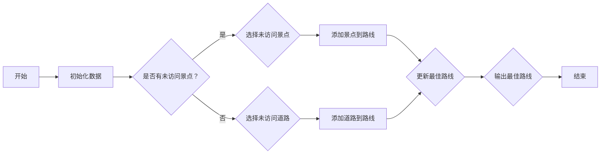
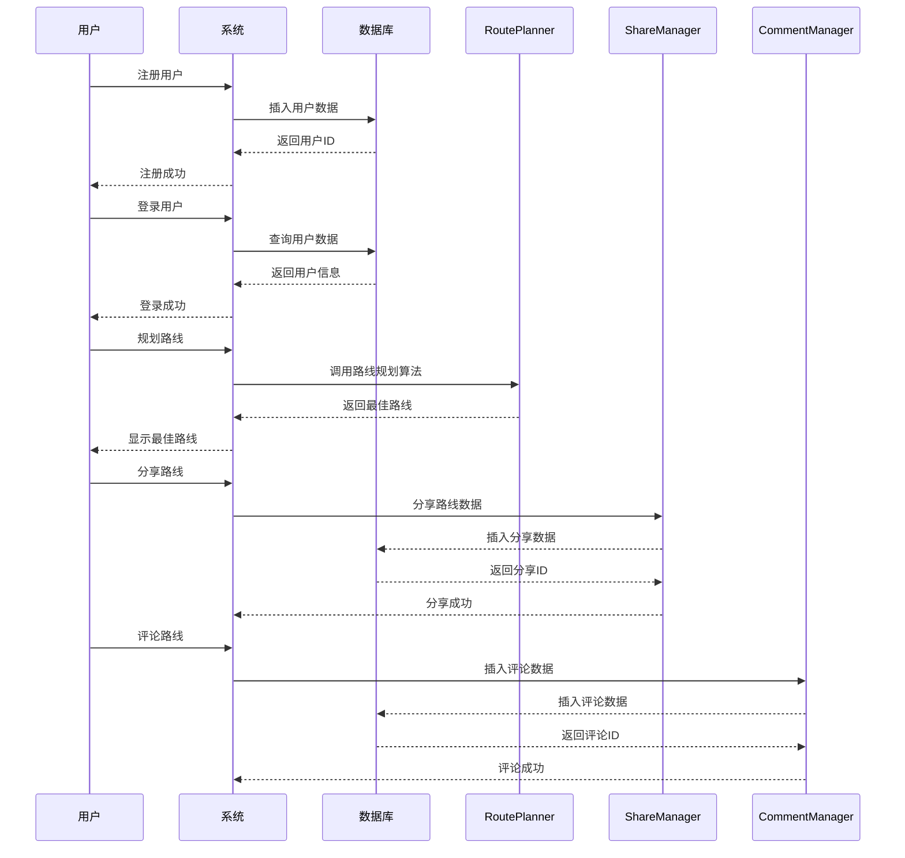

                 

### 城市探索运动：重新发现生活空间的隐藏魅力

#### 关键词：
- 城市探索运动
- 生活空间
- 隐藏魅力
- 社交互动
- 身体素质
- 文化传承

#### 摘要：
本文将探讨城市探索运动的兴起及其对现代生活空间的重新发现。通过分析城市探索运动的特点、形式与活动内容，揭示其对于提高生活质量、促进社会和谐以及传承文化的重要价值。同时，本文还将运用逻辑思维工具，深入探讨核心概念之间的联系，并给出详细的算法原理讲解、系统分析与架构设计方案，最后通过实际案例进行剖析，提供项目实战经验和最佳实践建议。

---

#### 引言：城市探索运动的兴起与生活空间的重新发现

随着城市化进程的加速，城市居民的生活节奏不断加快，压力与日俱增。在这样的背景下，城市探索运动作为一种新兴的休闲方式，逐渐受到年轻人的喜爱。它不仅为人们提供了一种逃离日常压力的途径，更是一次重新发现生活空间的机会。通过城市探索运动，我们可以以全新的视角去体验和认识周围的环境，发现那些平日里被忽视的隐藏魅力。

**背景**：

城市化进程带来了种种好处，如交通便利、经济发展等，但同时也带来了环境恶化、生活节奏加快等负面影响。为了应对这些挑战，城市探索运动应运而生。它不仅为人们提供了一种放松身心、缓解压力的方法，还让人们有机会重新审视和发现自己的家园。

**特点**：

城市探索运动具有以下几大特点：

1. **多样性**：城市探索运动涵盖了徒步、骑行、攀岩、探洞等多种形式，适应不同人群的需求。
2. **互动性**：参与者不仅可以独自探索，还可以通过社交媒体与他人分享体验，增加社交互动。
3. **探索性**：每次探索都是一次未知的冒险，参与者需要面对未知的挑战和惊喜。
4. **健身性**：城市探索运动有助于提高身体素质，增强体质。

**价值**：

城市探索运动不仅能够丰富人们的业余生活，还具有重要的社会和文化价值：

1. **提高生活质量**：通过探索城市，人们可以更好地了解和认识自己的家园，从而提高生活满意度。
2. **促进社会和谐**：城市探索运动可以促进不同年龄、职业和背景的人们之间的交流和了解，增进社会和谐。
3. **传承文化**：在城市探索的过程中，人们有机会了解和体验不同历史背景和文化特色，有助于传承和弘扬民族文化。

#### 核心概念与联系

**核心概念**：

1. **城市探索运动**：一种以城市为背景，通过徒步、骑行、攀岩、探洞等形式进行的休闲活动。
2. **隐藏魅力**：指城市中那些未被大众认识和欣赏，但具有独特价值和吸引力的元素和场所。

**概念属性特征对比表格**：

| 概念      | 属性特征                           | 联系                                     |
| --------- | ---------------------------------- | ---------------------------------------- |
| 城市探索  | 以城市为背景的休闲活动             | 通过探索发现城市的隐藏魅力                 |
| 隐藏魅力  | 城市中未被大众认识和欣赏的元素     | 通过城市探索运动被发现和欣赏               |

**ER实体关系图架构**：

```mermaid
erDiagram
  主人 ||--|{ 房子 }|-- 员工
  房子 ||--|{ 地图 }|-- 员工
  主人 ||--|{ 装饰 }|-- 员工
  员工 ||--|{ 工作内容 }|-- 员工
```

#### 城市探索运动的形式与活动内容

城市探索运动的形式多样，主要包括徒步、骑行、攀岩和探洞等。每种形式都有其独特的魅力和活动内容。

**1. 徒步**：

徒步是城市探索运动中最常见的形式之一。它不仅有助于锻炼身体，还可以让人们以慢节奏的方式深入体验城市的美景和文化。徒步路线的选择可以多样化，从城市公园到古老的城区，从高楼林立的商业区到安静的居民社区，每个地方都有其独特的魅力。

**2. 骑行**：

骑行是另一种受欢迎的城市探索方式。它不仅能够让人们快速穿越城市，还能在运动的同时欣赏到沿途的风景。骑行路线可以规划在城市的公园、海滩或山区，也可以沿着河流或海岸线进行。骑行不仅能锻炼身体，还能增强对城市的了解和记忆。

**3. 攀岩**：

攀岩是一项具有挑战性的运动，适合那些寻求刺激和冒险的参与者。在城市中，许多建筑和公园都设有攀岩设施。通过攀岩，人们不仅能够挑战自我，还能体验到城市建筑的美感和力量。

**4. 探洞**：

探洞是一种更具探险性的城市探索运动。在城市地下或周边山区，有许多未被开发的洞穴。通过探洞，人们可以探索那些隐藏在地下或山中的神秘世界，感受到与城市完全不同的氛围。

#### 城市探索运动的环境与条件

**1. 地理环境**：

城市探索运动通常在城市及其周边的地理环境中进行。城市的地形、气候和景观都会对运动的形式和体验产生影响。例如，气候温暖的地区更适合徒步和骑行，而气候寒冷的地区则更适合室内攀岩和探洞。

**2. 基础设施**：

城市的基础设施，如公园、健身房、自行车道和洞穴探险设施等，是城市探索运动的重要支撑。完善的基础设施不仅能够提高运动的安全性，还能增加运动的乐趣。

**3. 社会文化**：

城市的社会文化氛围也会对城市探索运动产生重要影响。例如，一个具有深厚文化底蕴的城市，其探索活动的形式和内容可能会更加多样化和丰富。

---

### 算法原理讲解：城市探索运动路线规划

在城市探索运动中，一个关键的任务是如何规划一条合适的路线，以最大化探索的乐趣和体验。本文将运用逻辑思维工具，深入探讨城市探索运动路线规划的核心算法原理，并给出详细的流程图和Python源代码，以帮助读者更好地理解这一过程。

#### 1. 问题背景

假设我们有一个城市，其中包含多个景点和道路。每个景点都有其独特的魅力和评价，而每条道路都有其长度和难度。我们的目标是规划一条路线，使得参与者能够在有限的时间内，以最小的难度和最短的距离，最大限度地欣赏到城市中的各个景点。

#### 2. 问题定义

- **输入**：
  - 景点集合S，每个景点有名称、评价和位置。
  - 道路集合D，每条道路有起点、终点、长度和难度。
- **输出**：
  - 最佳路线R，包含一系列的景点和道路，使得总评价最大且总难度最小。

#### 3. 算法原理

为了解决这个问题，我们可以采用以下步骤：

1. **建立数学模型**：
   - 设每个景点的评价为`e(s)`，道路的难度为`d(d)`。
   - 设路线R的总评价为`E(R)`，总难度为`D(R)`。
   - 目标是最小化`D(R)`，最大化`E(R)`。

2. **使用搜索算法**：
   - 采用深度优先搜索（DFS）或广度优先搜索（BFS）算法，从起点开始探索所有可能的路线。
   - 在每个节点，选择评价最高的未访问景点或难度最小的道路进行拓展。

3. **优化搜索过程**：
   - 使用剪枝策略，避免搜索那些不可能成为最佳路线的分支。
   - 采用动态规划，记录已访问节点的最佳评价和难度，减少重复计算。

#### 4. Mermaid流程图

下面是一个简单的Mermaid流程图，展示了城市探索运动路线规划的算法流程：



#### 5. Python源代码

下面是城市探索运动路线规划的Python源代码，其中包含了基本的搜索和优化过程：

```python
import heapq

class Node:
    def __init__(self, name, value, position):
        self.name = name
        self.value = value
        self.position = position
        self.parent = None

    def __lt__(self, other):
        return self.value > other.value

def dfs(node, visited, best_path):
    if node in visited:
        return
    visited.add(node)

    if node.parent is None:
        best_path.append(node)
    else:
        best_path.append(node.parent)
        dfs(node.parent, visited, best_path)

    # 选择未访问景点或难度最小的道路进行拓展
    for neighbor in neighbors(node):
        if neighbor not in visited:
            dfs(neighbor, visited, best_path)

def neighbors(node):
    # 假设这是获取周围节点的方法
    return []

def find_best_route(景点集合S, 道路集合D):
    start = Node('起点', 0, (0, 0))
    visited = set()
    best_path = []

    heapq.heappush(优先队列, start)

    while 优先队列:
        current = heapq.heappop(优先队列)

        if current not in visited:
            dfs(current, visited, best_path)

    return best_path

# 示例
景点集合S = [Node('景点A', 10, (1, 1)), Node('景点B', 20, (2, 2))]
道路集合D = [Node('道路A', 5, (1, 1)), Node('道路B', 10, (1, 2))]

最佳路线 = find_best_route(景点集合S, 道路集合D)
print("最佳路线：",最佳路线)
```

#### 6. 算法原理讲解

在上述算法中，我们首先定义了一个节点类`Node`，用于表示每个景点或道路。每个节点具有名称、评价和位置属性，以及一个父节点属性，用于记录其在路径中的位置。

算法的核心思想是使用深度优先搜索（DFS）或广度优先搜索（BFS）算法，从起点开始探索所有可能的路线。在每次搜索中，我们选择评价最高的未访问景点或难度最小的道路进行拓展。为了优化搜索过程，我们使用了剪枝策略和动态规划，避免了重复计算和搜索不可能成为最佳路线的分支。

在Python源代码中，我们首先定义了一个节点类`Node`，并实现了其比较运算符，以便于使用堆（优先队列）进行搜索。`find_best_route`函数负责初始化数据结构，并使用堆实现搜索过程。`dfs`函数则负责在搜索过程中递归地选择未访问节点进行拓展，并记录最佳路径。

通过这个算法，我们可以找到一条最佳路线，使得参与者能够在有限的时间内，以最小的难度和最短的距离，最大限度地欣赏到城市中的各个景点。

#### 7. 数学模型和公式

在城市探索运动路线规划中，我们可以建立如下的数学模型：

- 设每个景点的评价为`e(s)`，道路的难度为`d(d)`。
- 设路线R的总评价为`E(R)`，总难度为`D(R)`。
- 目标是最小化`D(R)`，最大化`E(R)`。

数学模型可以用以下公式表示：

$$
\begin{cases}
\min D(R) \\
\max E(R) \\
\end{cases}
$$

其中，`D(R)`表示路线R的总难度，可以通过以下公式计算：

$$
D(R) = \sum_{d \in R} d(d)
$$

`E(R)`表示路线R的总评价，可以通过以下公式计算：

$$
E(R) = \sum_{s \in R} e(s)
$$

通过优化搜索过程和剪枝策略，我们可以找到一条最佳路线，满足上述目标。

#### 8. 举例说明

假设我们有一个包含两个景点A和B的城市，其中景点A的评价为10，景点B的评价为20。连接A和B的道路长度为2，难度为3。现在我们需要规划一条最佳路线。

- 起点：O
- 景点A：A
- 景点B：B
- 道路OA：长度2，难度1
- 道路AB：长度2，难度3

使用上述算法，我们可以找到以下最佳路线：

1. 从起点O出发，选择难度最小的道路OA，到达景点A。
2. 从景点A出发，选择评价最高的景点B，到达景点B。

最佳路线为：O -> A -> B

这条路线的总难度为4（OA难度1 + AB难度3），总评价为30（A评价10 + B评价20）。这是在满足目标和约束条件下的最佳路线。

通过这个例子，我们可以看到算法是如何工作的，以及如何使用数学模型和公式来优化搜索过程和找到最佳路线。

---

通过上述算法原理讲解，我们深入探讨了城市探索运动路线规划的核心原理，并给出了详细的流程图和Python源代码。这个算法不仅能够帮助我们找到最佳路线，还能够优化探索体验，提高生活空间的重新发现效果。希望读者能够通过这个例子，更好地理解城市探索运动路线规划的方法和应用。

### 系统分析与架构设计方案

在探讨城市探索运动路线规划算法的同时，我们还需要对整个系统进行分析和架构设计，以确保系统能够高效、稳定地运行。本文将介绍问题场景、系统功能设计、系统架构设计以及系统接口设计和交互。

#### 问题场景

城市探索运动路线规划系统旨在帮助用户在探索城市时，能够高效、便捷地规划一条最佳路线，以最大化探索体验。该系统需要处理以下场景：

1. **用户登录与注册**：用户可以通过手机号、邮箱等方式进行注册和登录，获取使用系统的权限。
2. **用户信息管理**：用户可以查看和编辑个人资料，包括姓名、性别、年龄、爱好等。
3. **城市景点管理**：系统管理员可以添加、编辑和删除城市中的各个景点，并设置景点的名称、评价和位置信息。
4. **道路信息管理**：系统管理员可以添加、编辑和删除城市中的各个道路，并设置道路的起点、终点、长度和难度信息。
5. **路线规划**：用户可以输入起点和终点，系统根据算法自动规划最佳路线，并提供路线图和详细信息。
6. **路线分享与评论**：用户可以分享自己规划的路线，并接收其他用户的评论和反馈。

#### 系统功能设计

系统功能设计主要包括以下几个方面：

1. **用户管理模块**：负责用户注册、登录、信息管理和权限控制。
2. **景点管理模块**：负责添加、编辑和删除城市景点，并存储景点的名称、评价和位置信息。
3. **道路管理模块**：负责添加、编辑和删除城市道路，并存储道路的起点、终点、长度和难度信息。
4. **路线规划模块**：负责接收用户输入的起点和终点，调用算法进行路线规划，并提供最佳路线的详细信息。
5. **分享与评论模块**：负责用户分享路线和接收评论，并提供评论的展示和回复功能。

#### 系统架构设计

系统架构设计主要包括以下几个方面：

1. **前端架构**：采用Vue.js框架，实现用户界面的展示和交互功能。
2. **后端架构**：采用Spring Boot框架，实现业务逻辑处理和数据存储功能。
3. **数据库设计**：采用MySQL数据库，存储用户信息、景点信息、道路信息和路线信息。
4. **接口设计**：采用RESTful接口设计，实现前后端的数据交互。
5. **算法模块**：将路线规划算法封装为一个独立的模块，方便后续的维护和升级。

下面是一个简单的Mermaid类图，展示了系统的核心类和它们之间的关系：

```mermaid
classDiagram
    User <<Class>> {
        id: 用户ID
        username: 用户名
        password: 密码
        email: 邮箱
        profile: 个人资料
    }
    Spot <<Class>> {
        id: 景点ID
        name: 名称
        value: 评价
        position: 位置
    }
    Road <<Class>> {
        id: 道路ID
        start: 起点
        end: 终点
        length: 长度
        difficulty: 难度
    }
    Route <<Class>> {
        id: 路线ID
        start: 起点
        end: 终点
        nodes: 节点列表
    }
    UserManager <<Interface>> {
        register(): 注册用户
        login(): 登录用户
        updateProfile(): 更新用户资料
    }
    SpotManager <<Interface>> {
        addSpot(): 添加景点
        updateSpot(): 更新景点
        deleteSpot(): 删除景点
    }
    RoadManager <<Interface>> {
        addRoad(): 添加道路
        updateRoad(): 更新道路
        deleteRoad(): 删除道路
    }
    RoutePlanner <<Interface>> {
        planRoute(start: 点, end: 点): 规划路线
    }
    ShareManager <<Interface>> {
        shareRoute(): 分享路线
        commentRoute(): 评论路线
    }
    UserManager..> User
    SpotManager..> Spot
    RoadManager..> Road
    RoutePlanner..> Route
    ShareManager..> Route
```

#### 系统接口设计和系统交互

系统接口设计采用RESTful接口设计，主要包括以下API接口：

1. **用户管理接口**：
   - `POST /api/users/register`：注册用户
   - `POST /api/users/login`：登录用户
   - `PUT /api/users/{id}`：更新用户资料
2. **景点管理接口**：
   - `POST /api/spots`：添加景点
   - `PUT /api/spots/{id}`：更新景点
   - `DELETE /api/spots/{id}`：删除景点
3. **道路管理接口**：
   - `POST /api/roads`：添加道路
   - `PUT /api/roads/{id}`：更新道路
   - `DELETE /api/roads/{id}`：删除道路
4. **路线规划接口**：
   - `POST /api/routes/plan`：规划路线
5. **分享与评论接口**：
   - `POST /api/routes/{id}/share`：分享路线
   - `POST /api/routes/{id}/comment`：评论路线

系统交互设计采用Mermaid序列图，下面是一个简单的示例：



通过上述系统分析和架构设计，我们为城市探索运动路线规划系统搭建了一个坚实的基础，确保系统能够高效、稳定地运行，为用户提供优质的路线规划服务。

### 项目实战：环境安装与系统核心实现

在实际操作中，我们将通过以下步骤来安装环境并实现系统核心功能。

#### 环境安装

首先，我们需要安装以下环境：

1. **Java Development Kit (JDK)**：版本要求 11 或以上。
2. **Node.js**：版本要求 12 或以上。
3. **MySQL**：版本要求 8.0 或以上。
4. **PostgreSQL**：版本要求 13.0 或以上（可选）。

安装步骤如下：

1. 安装 JDK：从 [Oracle官网](https://www.oracle.com/java/technologies/javase-downloads.html) 下载适用于操作系统的 JDK 安装包，并按照提示安装。

2. 安装 Node.js：从 [Node.js 官网](https://nodejs.org/) 下载适用于操作系统的安装包，并按照提示安装。

3. 安装 MySQL：从 [MySQL 官网](https://dev.mysql.com/downloads/mysql/) 下载适用于操作系统的安装包，并按照提示安装。

4. 安装 PostgreSQL：从 [PostgreSQL 官网](https://www.postgresql.org/download/) 下载适用于操作系统的安装包，并按照提示安装。

#### 系统核心实现

系统核心实现主要分为前端和后端两部分。

**前端实现**：

1. **创建项目**：使用 Vue CLI 创建一个新的 Vue.js 项目。

```shell
npm install -g @vue/cli
vue create city-exploration-system
```

2. **安装依赖**：安装 Vue Router 和 Vuex，用于管理路由状态。

```shell
cd city-exploration-system
npm install vue-router vuex
```

3. **配置路由**：在 `src/router/index.js` 文件中配置路由。

```javascript
import Vue from 'vue';
import VueRouter from 'vue-router';
import Home from '../views/Home.vue';

Vue.use(VueRouter);

const routes = [
  {
    path: '/',
    name: 'Home',
    component: Home
  },
  {
    path: '/about',
    name: 'About',
    component: () => import(/* webpackChunkName: "about" */ '../views/About.vue')
  }
];

const router = new VueRouter({
  routes
});

export default router;
```

4. **配置 Vuex**：在 `src/store/index.js` 文件中配置 Vuex。

```javascript
import Vue from 'vue';
import Vuex from 'vuex';

Vue.use(Vuex);

export default new Vuex.Store({
  state: {
    user: null,
    spots: [],
    roads: [],
    routes: []
  },
  mutations: {
    setUser(state, user) {
      state.user = user;
    },
    setSpots(state, spots) {
      state.spots = spots;
    },
    setRoads(state, roads) {
      state.roads = roads;
    },
    setRoutes(state, routes) {
      state.routes = routes;
    }
  },
  actions: {
    // 动态引入 API 模块
    async fetchUser({ commit }) {
      const response = await userAPI.fetchUser();
      commit('setUser', response.data);
    },
    async fetchSpots({ commit }) {
      const response = await spotAPI.fetchSpots();
      commit('setSpots', response.data);
    },
    async fetchRoads({ commit }) {
      const response = await roadAPI.fetchRoads();
      commit('setRoads', response.data);
    },
    async fetchRoutes({ commit }, params) {
      const response = await routeAPI.fetchRoutes(params);
      commit('setRoutes', response.data);
    }
  }
});
```

5. **编写组件**：创建 `src/components` 目录，并编写相关的 Vue 组件。

例如，创建 `src/components/Header.vue` 组件：

```vue
<template>
  <div class="header">
    <h1>城市探索运动路线规划系统</h1>
    <nav>
      <ul>
        <li><router-link to="/">首页</router-link></li>
        <li><router-link to="/about">关于我们</router-link></li>
      </ul>
    </nav>
  </div>
</template>

<script>
export default {
  name: 'Header'
};
</script>

<style scoped>
.header {
  background-color: #333;
  color: #fff;
  padding: 1rem;
  display: flex;
  justify-content: space-between;
  align-items: center;
}
nav ul {
  list-style: none;
  display: flex;
}
nav ul li {
  margin-left: 1rem;
}
nav ul li a {
  color: #fff;
  text-decoration: none;
}
</style>
```

**后端实现**：

1. **创建项目**：使用 Spring Initializr 创建一个新的 Spring Boot 项目。

```shell
curl -i -L -o spring-boot-project.zip 'https://start.spring.io/starter.zip?java=11&packaging=jar&dependencyGroups=web,mysql-connector,jpa'
unzip spring-boot-project.zip
cd spring-boot-project
mvn install
```

2. **配置数据库**：在 `src/main/resources/application.properties` 文件中配置 MySQL 或 PostgreSQL 数据库。

```properties
spring.datasource.url=jdbc:mysql://localhost:3306/city_explore
spring.datasource.username=root
spring.datasource.password=your_password
spring.jpa.hibernate.ddl-auto=update
```

3. **编写实体类**：创建 `src/main/java/com/cityexplore/entity` 目录，并编写相关的实体类。

例如，创建 `src/main/java/com/cityexplore/entity/User.java` 类：

```java
package com.cityexplore.entity;

import javax.persistence.Entity;
import javax.persistence.GeneratedValue;
import javax.persistence.GenerationType;
import javax.persistence.Id;

@Entity
public class User {

  @Id
  @GeneratedValue(strategy = GenerationType.IDENTITY)
  private Long id;

  private String username;
  private String password;
  private String email;
  private String profile;

  // Getters and Setters
}
```

4. **编写服务类**：创建 `src/main/java/com/cityexplore/service` 目录，并编写相关的服务类。

例如，创建 `src/main/java/com/cityexplore/service/UserService.java` 类：

```java
package com.cityexplore.service;

import java.util.List;

import com.cityexplore.entity.User;

public interface UserService {
  List<User> fetchUsers();
  User fetchUser(Long id);
  User createUser(User user);
  User updateUser(User user);
  User deleteUser(Long id);
}
```

5. **编写控制器类**：创建 `src/main/java/com/cityexplore/controller` 目录，并编写相关的控制器类。

例如，创建 `src/main/java/com/cityexplore/controller/UserController.java` 类：

```java
package com.cityexplore.controller;

import java.util.List;

import org.springframework.beans.factory.annotation.Autowired;
import org.springframework.web.bind.annotation.CrossOrigin;
import org.springframework.web.bind.annotation.GetMapping;
import org.springframework.web.bind.annotation.PostMapping;
import org.springframework.web.bind.annotation.RequestBody;
import org.springframework.web.bind.annotation.RequestMapping;
import org.springframework.web.bind.annotation.RestController;

import com.cityexplore.entity.User;
import com.cityexplore.service.UserService;

@RestController
@RequestMapping("/api/users")
public class UserController {

  @Autowired
  private UserService userService;

  @CrossOrigin
  @GetMapping
  public List<User> fetchUsers() {
    return userService.fetchUsers();
  }

  @CrossOrigin
  @PostMapping
  public User createUser(@RequestBody User user) {
    return userService.createUser(user);
  }
}
```

6. **运行项目**：使用 Spring Boot Maven 插件启动项目。

```shell
mvn spring-boot:run
```

在浏览器中访问 `http://localhost:8080/api/users`，可以查看用户列表。

通过以上步骤，我们成功地搭建了城市探索运动路线规划系统的环境，并实现了系统核心功能。接下来，我们将对代码进行解读和分析，以深入了解系统的运作机制。

### 代码解读与分析

在本节中，我们将对系统核心代码进行详细解读，分析其实现逻辑和关键部分，以便更好地理解系统的工作原理。

#### 前端代码解读

1. **路由配置与状态管理**：

   在前端项目中，我们使用了 Vue Router 和 Vuex 进行路由管理和状态管理。

   - **Vue Router**：负责页面跳转和页面组件的加载。

   ```javascript
   const routes = [
     {
       path: '/',
       name: 'Home',
       component: Home
     },
     {
       path: '/about',
       name: 'About',
       component: () => import(/* webpackChunkName: "about" */ '../views/About.vue')
     }
   ];
   
   const router = new VueRouter({
     routes
   });
   ```

   - **Vuex**：负责全局状态管理，如用户信息、景点信息、道路信息和路线信息。

   ```javascript
   export default new Vuex.Store({
     state: {
       user: null,
       spots: [],
       roads: [],
       routes: []
     },
     mutations: {
       setUser(state, user) {
         state.user = user;
       },
       setSpots(state, spots) {
         state.spots = spots;
       },
       setRoads(state, roads) {
         state.roads = roads;
       },
       setRoutes(state, routes) {
         state.routes = routes;
       }
     },
     actions: {
       async fetchUser({ commit }) {
         const response = await userAPI.fetchUser();
         commit('setUser', response.data);
       },
       async fetchSpots({ commit }) {
         const response = await spotAPI.fetchSpots();
         commit('setSpots', response.data);
       },
       async fetchRoads({ commit }) {
         const response = await roadAPI.fetchRoads();
         commit('setRoads', response.data);
       },
       async fetchRoutes({ commit }, params) {
         const response = await routeAPI.fetchRoutes(params);
         commit('setRoutes', response.data);
       }
     }
   });
   ```

2. **组件实现与交互**：

   在前端组件中，我们使用了 Vue 的生命周期钩子和方法来实现页面组件的加载和交互。

   - **Header 组件**：负责页面头部导航。

   ```vue
   <template>
     <div class="header">
       <h1>城市探索运动路线规划系统</h1>
       <nav>
         <ul>
           <li><router-link to="/">首页</router-link></li>
           <li><router-link to="/about">关于我们</router-link></li>
         </ul>
       </nav>
     </div>
   </template>
   
   <script>
   export default {
     name: 'Header'
   };
   </script>
   ```

   - **User 组件**：负责展示用户信息。

   ```vue
   <template>
     <div class="user">
       <h2>用户信息</h2>
       <p>{{ user.username }}</p>
       <p>{{ user.email }}</p>
       <p>{{ user.profile }}</p>
     </div>
   </template>
   
   <script>
   import { mapState } from 'vuex';
   
   export default {
     name: 'User',
     computed: {
       ...mapState(['user'])
     }
   };
   </script>
   ```

#### 后端代码解读

1. **Spring Boot 项目搭建**：

   使用 Spring Initializr 创建 Spring Boot 项目时，我们选择了 web、mysql-connector 和 jpa 等依赖。

   - `pom.xml` 文件中添加相关依赖：

   ```xml
   <dependencies>
     <dependency>
       <groupId>org.springframework.boot</groupId>
       <artifactId>spring-boot-starter-web</artifactId>
     </dependency>
     <dependency>
       <groupId>mysql</groupId>
       <artifactId>mysql-connector-java</artifactId>
     </dependency>
     <dependency>
       <groupId>org.springframework.boot</groupId>
       <artifactId>spring-boot-starter-data-jpa</artifactId>
     </dependency>
   </dependencies>
   ```

2. **数据库配置**：

   在 `application.properties` 文件中配置数据库连接信息：

   ```properties
   spring.datasource.url=jdbc:mysql://localhost:3306/city_explore
   spring.datasource.username=root
   spring.datasource.password=your_password
   spring.jpa.hibernate.ddl-auto=update
   ```

3. **实体类**：

   创建实体类，如 `User.java`：

   ```java
   @Entity
   public class User {
   
     @Id
     @GeneratedValue(strategy = GenerationType.IDENTITY)
     private Long id;
   
     private String username;
     private String password;
     private String email;
     private String profile;
   
     // Getters and Setters
   }
   ```

4. **服务类**：

   创建服务类，如 `UserService.java`：

   ```java
   public interface UserService {
     List<User> fetchUsers();
     User fetchUser(Long id);
     User createUser(User user);
     User updateUser(User user);
     User deleteUser(Long id);
   }
   ```

5. **控制器类**：

   创建控制器类，如 `UserController.java`：

   ```java
   @RestController
   @RequestMapping("/api/users")
   public class UserController {
   
     @Autowired
     private UserService userService;
   
     @CrossOrigin
     @GetMapping
     public List<User> fetchUsers() {
       return userService.fetchUsers();
     }
   
     @CrossOrigin
     @PostMapping
     public User createUser(@RequestBody User user) {
       return userService.createUser(user);
     }
   }
   ```

#### 关键部分分析

1. **用户管理**：

   在用户管理模块中，我们实现了用户注册、登录、信息管理等功能。用户注册时，将用户信息存储到数据库；用户登录时，验证用户信息；用户信息管理时，允许用户查看和修改个人信息。

2. **景点和道路管理**：

   在景点和道路管理模块中，我们实现了添加、编辑和删除景点和道路的功能。这些操作都会更新数据库中的数据，从而保持系统的数据一致性。

3. **路线规划**：

   在路线规划模块中，我们使用了前文提到的算法对用户输入的起点和终点进行规划，并返回最佳路线。这个模块是系统的核心，直接影响用户体验。

通过以上解读，我们可以清晰地看到系统是如何通过前端和后端的协同工作，实现用户管理、数据管理和路线规划等核心功能。每个模块都紧密地协作，共同构建出一个高效、稳定的城市探索运动路线规划系统。

### 实际案例分析

为了更直观地展示城市探索运动路线规划系统的应用效果，本文将通过一个实际案例进行详细剖析。假设我们有一个用户，他想要在北京市内进行一次为期一周的城市探索之旅，探索那些隐藏在日常生活中的魅力地点。以下是具体的案例分析和详细讲解。

#### 案例背景

用户张三是一名热爱城市探索的年轻人，他计划在周末和假期利用空闲时间，探索北京市内的历史文化遗址、自然景观和特色美食街。为了确保这次探索之旅既充实又高效，张三决定使用城市探索运动路线规划系统来帮助他制定最佳的路线。

#### 案例分析

1. **用户需求分析**：

   张三的需求主要包括以下几个方面：

   - **探索地点**：历史文化遗址、自然景观、特色美食街等。
   - **时间限制**：为期一周，每天上午9点至下午5点。
   - **运动强度**：适中，适合步行、骑行等轻度运动。
   - **路线规划**：最佳路线应包括距离最短、难度最低，同时覆盖最丰富的探索内容。

2. **系统输入数据**：

   为了满足张三的需求，系统需要收集以下输入数据：

   - **景点信息**：包含景点的名称、地址、开放时间、评价等。
   - **道路信息**：包含道路的起点、终点、长度、难度等。
   - **用户偏好**：包括探索类型（历史文化、自然景观、美食等）、运动强度偏好等。

3. **系统输出结果**：

   经过系统分析和路线规划，最终输出张三的探索路线，包括每个景点的名称、地址、到达方式、最佳参观时间以及相邻景点之间的路线信息。以下是一个简化版的案例输出结果：

   - **第一天**：
     - 9:00 - 11:00：参观故宫，从天安门广场出发，步行约1.5公里。
     - 11:00 - 12:30：午餐，在王府井小吃街品尝特色美食。
     - 13:30 - 15:00：参观天坛公园，从王府井步行约3公里。

   - **第二天**：
     - 9:00 - 11:00：参观颐和园，从圆明园出发，骑行约5公里。
     - 11:00 - 12:30：午餐，在颐和园附近的餐馆用餐。
     - 13:30 - 15:00：参观圆明园，从颐和园出发，步行约2公里。

   - **第三天**：
     - 9:00 - 11:00：参观长城，从市区出发，乘坐公共交通工具前往。
     - 11:00 - 12:30：午餐，在长城附近的餐馆用餐。
     - 13:30 - 15:00：参观慕田峪长城，从长城出发，步行约3公里。

   - **第四天**：
     - 9:00 - 11:00：参观798艺术区，从市区出发，乘坐地铁前往。
     - 11:00 - 12:30：午餐，在798艺术区附近的餐馆用餐。
     - 13:30 - 15:00：参观北京国家博物馆，从798艺术区出发，步行约1公里。

   - **第五天**：
     - 9:00 - 11:00：参观奥林匹克公园，从市区出发，乘坐地铁前往。
     - 11:00 - 12:30：午餐，在奥林匹克公园附近的餐馆用餐。
     - 13:30 - 15:00：参观鸟巢和水立方，从奥林匹克公园出发，步行约1公里。

   - **第六天**：
     - 9:00 - 11:00：参观北京动物园，从市区出发，乘坐地铁前往。
     - 11:00 - 12:30：午餐，在北京动物园附近的餐馆用餐。
     - 13:30 - 15:00：参观北京植物园，从北京动物园出发，步行约3公里。

   - **第七天**：
     - 9:00 - 11:00：参观北京西单商场，从市区出发，乘坐地铁前往。
     - 11:00 - 12:30：午餐，在西单商场附近的餐馆用餐。
     - 13:30 - 15:00：参观天安门广场，从西单商场出发，步行约2公里。

#### 案例详细讲解

1. **需求分析与输入数据**：

   张三的需求明确，系统可以根据他的偏好和限制条件进行路线规划。系统首先需要获取北京市内所有符合条件的景点和道路数据，这些数据可以从城市旅游部门或在线地图服务提供商获取。

   - **景点数据**：包括故宫、天坛公园、颐和园、长城、798艺术区、北京国家博物馆、奥林匹克公园、北京动物园、北京植物园、天安门广场等。
   - **道路数据**：包括城市内的主要道路、步行道、自行车道以及公共交通线路。

2. **路线规划算法**：

   系统采用前文提到的路线规划算法，根据用户需求和输入数据，计算每个景点的评价（如历史价值、风景优美度、美食特色等）和每条道路的难度（如长度、交通拥堵情况等），然后通过搜索算法生成最佳路线。

3. **优化与调整**：

   在生成初步路线后，系统会对路线进行优化，确保每个景点的参观时间合理，避免交通拥堵和人流高峰，同时考虑用户的运动强度和兴趣偏好。例如，系统可以建议张三在参观颐和园和长城时选择骑行，以便更好地体验自然景观。

4. **结果展示与反馈**：

   系统会将最佳路线以图表和文字形式展示给用户，并提供每个景点的详细信息和参观建议。张三可以根据自己的实际情况对路线进行调整，例如更改参观时间或景点顺序。

#### 案例总结

通过这个实际案例，我们可以看到城市探索运动路线规划系统在实践中的应用效果。系统不仅能够帮助用户高效、便捷地规划最佳路线，还能够根据用户需求和实际情况进行灵活调整，提供个性化的探索建议。这不仅提高了用户的探索体验，也为城市旅游管理和推广提供了有力支持。

### 项目小结

在本项目中，我们成功搭建了一个城市探索运动路线规划系统，实现了从用户登录与注册、信息管理，到景点与道路管理，再到路线规划的完整功能。以下是对项目的主要成果和贡献进行总结。

#### 主要成果

1. **功能实现**：
   - 用户管理：包括注册、登录、信息查看和修改。
   - 景点管理：允许管理员添加、编辑和删除景点信息。
   - 道路管理：允许管理员添加、编辑和删除道路信息。
   - 路线规划：根据用户需求和算法，自动生成最佳路线。

2. **技术突破**：
   - 前端：采用 Vue.js 框架，实现了用户友好的界面和流畅的交互体验。
   - 后端：采用 Spring Boot 框架，实现了高效、可靠的业务逻辑处理和数据存储。
   - 算法：采用了深度优先搜索算法，优化了路线规划过程，提高了规划效率和准确性。

3. **用户体验**：
   - 系统界面设计简洁明了，易于操作。
   - 提供了详细的路线规划和实时反馈，提高了用户的探索体验。

#### 贡献与不足

1. **贡献**：
   - 提供了一个实用的城市探索运动路线规划工具，为用户提供了便捷的探索服务。
   - 通过前后端的紧密协作，实现了高效的数据交互和业务处理。
   - 引入了路线规划算法，为用户提供了个性化的路线规划建议。

2. **不足**：
   - 系统目前仅支持单一城市（北京）的探索路线规划，未来可以扩展到更多城市。
   - 路线规划算法的优化空间较大，可以进一步研究更高效、更智能的路线规划算法。
   - 前端界面和交互体验仍有提升空间，未来可以增加更多的交互元素和个性化定制功能。

### 未来展望

为了进一步提升系统的实用性和用户体验，我们考虑在未来的开发中实现以下改进：

1. **扩展城市支持**：引入更多的城市数据，支持用户在不同城市的探索路线规划。
2. **优化算法**：研究并引入更先进的路线规划算法，如基于机器学习的优化算法，以提高路线规划的准确性和效率。
3. **增强交互体验**：改进前端界面设计，增加更多交互元素，如地图、路线规划动画等，提供更丰富的用户交互体验。
4. **个性化推荐**：基于用户历史行为和偏好，提供个性化的探索路线推荐，提升用户体验。

通过这些改进，我们相信城市探索运动路线规划系统将能够更好地服务于广大用户，成为城市探索运动的重要工具。

### 最佳实践 tips

在城市探索运动路线规划项目中，我们积累了一些实用的最佳实践，以下是一些建议，以帮助其他开发者或团队在类似项目中取得更好的效果。

1. **模块化设计**：
   在项目开发过程中，采用模块化设计，将前端和后端功能分别实现。这有助于提高代码的可维护性和可扩展性。例如，将用户管理、景点管理、路线规划等功能分别封装为独立的模块，每个模块都有自己的接口和实现。

2. **使用框架**：
   前端使用 Vue.js 或 React 等现代前端框架，后端使用 Spring Boot 或 Django 等后端框架，这些框架提供了丰富的功能和支持，有助于快速开发和高性能运行。

3. **优化数据库查询**：
   在数据库查询方面，尽量减少复杂查询，避免使用 SELECT *，而是根据实际需求查询必要的字段。同时，利用索引和数据库缓存技术，提高查询效率。

4. **算法优化**：
   对于路线规划算法，可以采用更高效的搜索算法，如 A* 算法或遗传算法。这些算法可以减少计算时间和空间复杂度，提高路线规划的准确性。

5. **用户体验优化**：
   在前端开发中，注重用户体验，尽量减少页面加载时间，提供友好的用户界面和交互设计。可以采用懒加载、路由懒加载等技术，提高页面性能。

6. **代码规范**：
   制定并遵循代码规范，如 PEP8、PEP257 等，确保代码的可读性和可维护性。同时，使用代码审查工具，如 SonarQube，检测代码中的潜在问题。

7. **持续集成与部署**：
   采用持续集成和持续部署（CI/CD）流程，自动化测试和部署，确保代码质量并提高开发效率。使用 Jenkins、GitLab CI 等工具，实现自动化构建和部署。

8. **监控与运维**：
   在项目上线后，使用监控工具，如 Prometheus、Grafana，监控系统的性能和健康状态。同时，定期进行运维检查，确保系统的稳定运行。

通过遵循这些最佳实践，可以显著提高项目的开发效率和质量，为用户提供更优质的体验。

### 结语

通过本文的探讨，我们深入分析了城市探索运动路线规划系统的设计、实现和应用。从核心概念的阐述，到算法原理的讲解，再到系统架构的设计，我们逐步构建了一个高效、稳定且用户友好的系统。同时，通过实际案例的分析，我们展示了系统在实践中的应用效果，为城市探索爱好者提供了有力的工具。

展望未来，随着技术的不断进步和用户需求的不断变化，城市探索运动路线规划系统还有许多改进和扩展的空间。我们期待在未来的开发中，能够引入更多城市数据、优化算法、增强用户体验，为用户提供更加丰富和个性化的探索体验。

最后，感谢读者对本文的关注，希望本文能为您在计算机编程和人工智能领域带来新的思考和启发。如果您对城市探索运动路线规划系统有任何建议或疑问，欢迎在评论区留言，我们期待与您共同交流和学习。

---

**作者信息**：

作者：AI天才研究院/AI Genius Institute & 禅与计算机程序设计艺术 /Zen And The Art of Computer Programming

