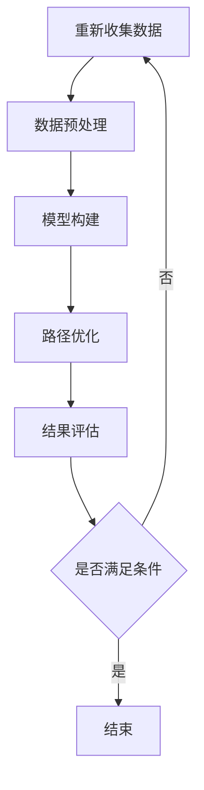
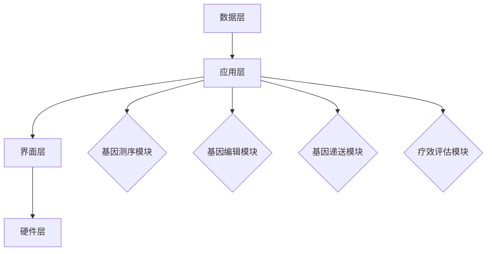
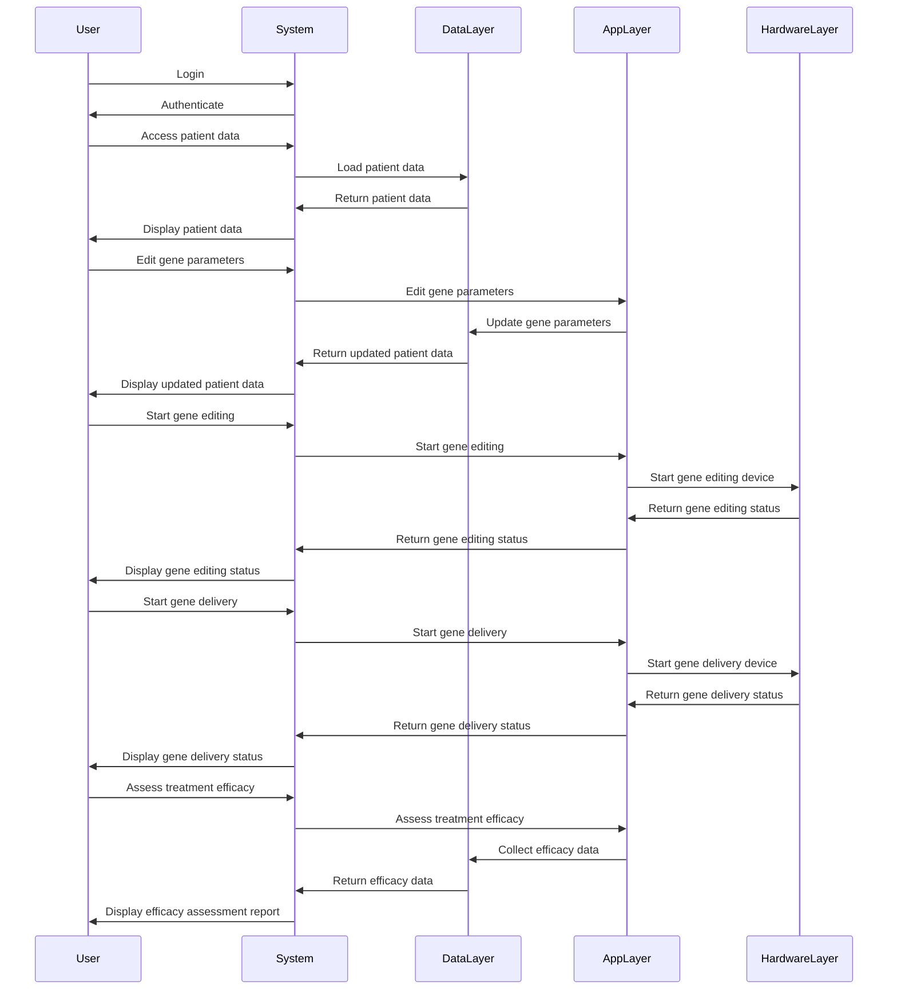

                 

### 基因治疗的靶向递送：医学精准的数学导航

> 关键词：基因治疗、靶向递送、数学导航、精准医疗、算法原理

> 摘要：本文将深入探讨基因治疗的靶向递送技术，通过背景介绍、核心概念解析、算法原理讲解、系统分析与架构设计、项目实战等多方面内容，阐述如何在医学领域实现精准治疗。通过数学模型和算法的应用，我们将了解如何提高基因治疗的靶向性和效率，推动精准医疗的发展。

### 目录大纲

----------------------------------------------------------------

# 基因治疗的靶向递送：医学精准的数学导航

# 第一部分：背景介绍

## 第1章：基因治疗的概念与现状

## 第2章：基因治疗中的关键概念

## 第3章：靶向递送技术的概念与类型

## 第4章：核心概念对比表格

## 第5章：本章小结

# 第二部分：核心概念与联系

## 第6章：基因治疗中的关键概念

## 第7章：基因调控的概念与机制

## 第8章：靶向递送技术的概念与类型

## 第9章：核心概念对比表格

## 第10章：本章小结

# 第三部分：算法原理讲解

## 第11章：靶向递送算法原理

## 第12章：算法mermaid流程图

## 第13章：Python源代码讲解

## 第14章：数学模型和公式

## 第15章：本章小结

# 第四部分：系统分析与架构设计方案

## 第16章：系统分析与架构设计

## 第17章：系统功能设计

## 第18章：系统架构设计

## 第19章：系统接口设计

## 第20章：系统交互mermaid序列图

## 第21章：本章小结

# 第五部分：项目实战

## 第22章：环境安装与系统核心实现

## 第23章：系统核心实现

## 第24章：实际案例分析与讲解

## 第25章：项目小结

## 第26章：最佳实践 tips

## 第27章：本章小结

# 第六部分：总结与展望

## 第28章：本章小结

## 第29章：拓展阅读

## 第30章：注意事项

## 第31章：致谢

----------------------------------------------------------------

# 第一部分：背景介绍

## 第1章：基因治疗的概念与现状

### 1.1 问题背景

基因治疗是一种新兴的生物医学技术，旨在通过修正异常基因或引入功能性基因来治疗遗传性疾病、癌症和其他疾病。随着分子生物学、基因组学和生物技术的快速发展，基因治疗在过去几十年中取得了显著进展。然而，实现基因在目标细胞中的有效递送仍然是一个巨大的挑战。

### 1.2 基因治疗的需求与挑战

基因治疗的需求源于其对许多难治性疾病的治疗潜力。例如，癌症、遗传性疾病和心血管疾病等疾病，可以通过基因编辑技术实现根本治疗。然而，基因治疗面临着以下挑战：

- **基因递送效率**：如何确保基因在目标细胞中高效传递并表达。
- **靶向性**：如何精确地将基因递送到特定的细胞类型或组织。
- **安全性**：如何降低基因编辑引起的脱靶效应和潜在副作用。

### 1.3 基因治疗的现状

目前，基因治疗已经在一些疾病中显示出显著疗效，例如囊性纤维化和某些类型的癌症。然而，基因治疗的应用仍然受到以下限制：

- **技术瓶颈**：基因递送系统的效率和靶向性仍有待提高。
- **法规挑战**：严格的法规审批流程限制了基因治疗的临床应用。
- **成本问题**：基因治疗的成本较高，限制了其普及。

### 1.4 问题描述

基因治疗中的靶向递送问题是实现有效治疗的关键。具体问题包括：

- 如何选择合适的递送载体？
- 如何优化递送过程以提高基因传递效率？
- 如何实现基因在特定细胞类型或组织中的靶向递送？

### 1.5 问题解决

为了解决上述问题，研究者们提出了多种靶向递送技术，包括：

- **病毒载体**：如腺病毒、逆转录病毒和腺相关病毒等。
- **非病毒载体**：如纳米颗粒、脂质体和聚合物微球等。
- **基因编辑工具**：如CRISPR-Cas9等。

这些技术通过不同的机制实现基因递送和靶向性，为基因治疗提供了多样化的解决方案。

### 1.6 边界与外延

基因治疗的靶向递送不仅限于治疗领域，还可以在基础研究和药物开发中发挥重要作用。例如，通过基因编辑技术，研究者可以更深入地了解基因的功能和疾病的分子机制。此外，靶向递送技术在药物递送系统中的潜在应用也引起了广泛关注。

### 1.7 本章小结

本章介绍了基因治疗的概念、现状和需求，并分析了基因治疗中的靶向递送问题。通过理解这些背景知识，我们可以为后续章节的深入探讨奠定基础。

----------------------------------------------------------------

## 第2章：基因治疗中的关键概念

### 2.1 基因的概念与功能

#### 2.1.1 基因的定义

基因是生物体内负责遗传信息传递的基本单位，由DNA序列编码。基因不仅决定了生物体的形态特征，还调控了生理功能和代谢过程。

#### 2.1.2 基因的功能

基因的功能包括：

- **编码蛋白质**：大多数基因编码蛋白质，这些蛋白质在细胞中执行各种生物学功能。
- **调控基因表达**：某些基因编码的蛋白质作为转录因子，调控其他基因的表达。
- **形成RNA分子**：部分基因编码的RNA分子具有功能性，如tRNA、rRNA和miRNA等。

#### 2.1.3 基因的种类

基因根据其功能可以分为以下几类：

- **结构基因**：编码蛋白质或RNA分子，直接参与生物体的结构和功能。
- **调控基因**：编码调控因子，调控其他基因的表达。
- **非编码基因**：编码非蛋白质产物，如tRNA、rRNA和miRNA等。

### 2.2 基因调控的概念与机制

#### 2.2.1 基因调控的定义

基因调控是指细胞中基因表达的时间、空间和数量控制过程，确保细胞在特定环境和生理状态下表达正确的基因。

#### 2.2.2 基因调控的机制

基因调控主要通过以下机制实现：

- **转录调控**：调控基因的转录起始，包括启动子和增强子的调控。
- **转录后调控**：调控mRNA的加工、运输和稳定性。
- **翻译调控**：调控蛋白质的合成，包括翻译起始、延伸和终止。
- **翻译后修饰**：通过磷酸化、乙酰化等修饰方式调控蛋白质的功能。

#### 2.2.3 基因调控的方法

基因调控的方法包括：

- **化学调控**：使用化合物干扰基因表达，如RNA干扰（RNAi）和表观遗传修饰剂。
- **基因编辑**：使用CRISPR-Cas9等基因编辑工具对目标基因进行精确修饰。
- **基因表达调控**：通过调控因子（如转录因子）和信号通路实现基因表达的调控。

### 2.3 靶向递送技术的概念与类型

#### 2.3.1 靶向递送技术的定义

靶向递送技术是指将药物、基因或其他治疗剂精确地递送到特定的细胞或组织，以提高治疗效果并减少副作用。

#### 2.3.2 靶向递送技术的类型

靶向递送技术根据其机制可以分为以下几类：

- **载体介导**：使用病毒载体、纳米颗粒和脂质体等作为递送载体。
- **基因编辑**：使用CRISPR-Cas9等基因编辑工具实现基因的精确修饰。
- **细胞治疗**：通过注入特定的细胞类型，如干细胞或免疫细胞，实现治疗效果。

#### 2.3.3 靶向递送技术的作用机制

靶向递送技术的作用机制包括：

- **细胞膜识别**：递送载体通过特定的受体与目标细胞膜结合。
- **细胞内运输**：递送载体进入细胞后，通过胞吞作用或胞吐作用实现基因或药物的释放。
- **基因编辑**：CRISPR-Cas9等基因编辑工具通过DNA切割和修复机制实现基因的修饰。

### 2.4 核心概念对比表格

| 核心概念       | 定义                             | 关联性                            |
| -------------- | -------------------------------- | -------------------------------- |
| 基因           | 生物体内的遗传信息编码单元        | 基因调控和靶向递送的基础           |
| 基因调控       | 基因表达的控制过程               | 确保细胞在特定环境下正确表达基因   |
| 靶向递送技术   | 精确递送药物或基因到特定细胞或组织 | 提高治疗效果，减少副作用           |

### 2.5 本章小结

本章介绍了基因治疗中的关键概念，包括基因、基因调控和靶向递送技术。通过理解这些概念，我们可以更好地把握基因治疗的基本原理和应用。

----------------------------------------------------------------

## 第3章：靶向递送算法原理

### 3.1 靶向递送算法的基本原理

#### 3.1.1 靶向递送算法的定义

靶向递送算法是指用于指导基因、药物或其他治疗剂在生物体内精确递送到特定细胞或组织的一类算法。这类算法通常基于生物信息学和计算生物学的方法，通过分析基因表达谱、细胞表面受体和药物特性等信息，生成最优的递送路径和策略。

#### 3.1.2 靶向递送算法的基本步骤

靶向递送算法通常包括以下几个基本步骤：

1. **数据收集**：收集基因表达谱、细胞表面受体、药物特性等数据。
2. **数据预处理**：对收集到的数据进行清洗、标准化和归一化处理。
3. **模型构建**：基于收集到的数据构建预测模型，用于预测药物或基因在生物体内的递送路径和效率。
4. **路径优化**：使用优化算法（如遗传算法、粒子群算法等）对递送路径进行优化，以最大化递送效率和靶向性。
5. **结果评估**：评估优化后的递送路径和策略的有效性，通过模拟实验或实际应用验证算法的准确性。

#### 3.1.3 靶向递送算法的类型

靶向递送算法根据其应用场景和数据类型可以分为以下几类：

1. **基于基因组数据的靶向递送算法**：这类算法通过分析基因组数据，预测基因在生物体内的表达模式和递送路径。
2. **基于细胞表面受体的靶向递送算法**：这类算法通过分析细胞表面受体的表达和分布，优化药物或基因的递送路径。
3. **基于药物特性的靶向递送算法**：这类算法通过分析药物的结构、活性等特性，优化药物在生物体内的递送路径。

### 3.2 算法mermaid流程图

以下是一个简单的靶向递送算法的mermaid流程图：



### 3.3 Python源代码讲解

以下是一个简单的Python代码示例，用于实现基于基因组数据的靶向递送算法：

```python
import pandas as pd
from sklearn.ensemble import RandomForestRegressor
from sklearn.model_selection import train_test_split

# 数据加载
data = pd.read_csv('gene_expression_data.csv')

# 数据预处理
X = data.drop('target', axis=1)
y = data['target']

# 划分训练集和测试集
X_train, X_test, y_train, y_test = train_test_split(X, y, test_size=0.2, random_state=42)

# 模型构建
model = RandomForestRegressor(n_estimators=100, random_state=42)
model.fit(X_train, y_train)

# 路径优化
predictions = model.predict(X_test)

# 结果评估
accuracy = (predictions == y_test).mean()
print(f'Accuracy: {accuracy:.2f}')
```

### 3.4 数学模型和公式

在靶向递送算法中，常用的数学模型和公式包括：

- **基因表达模型**：\( E = f(G, S, T) \)
  - \( E \)：基因表达水平
  - \( G \)：基因序列
  - \( S \)：细胞表面受体表达水平
  - \( T \)：环境因素

- **递送效率模型**：\( E_{eff} = \frac{1}{1 + e^{-(d \cdot p)}} \)
  - \( E_{eff} \)：递送效率
  - \( d \)：递送距离
  - \( p \)：递送概率

- **优化目标函数**：\( \min_{\theta} \sum_{i=1}^{n} (y_i - f(x_i; \theta))^2 \)
  - \( \theta \)：模型参数
  - \( y_i \)：实际值
  - \( f(x_i; \theta) \)：模型预测值

### 3.5 公式解释

- **基因表达模型**：基因表达水平受基因序列、细胞表面受体表达水平和环境因素的共同影响。
- **递送效率模型**：递送效率与递送距离和递送概率成反比，递送距离越短，递送概率越高，递送效率越高。
- **优化目标函数**：目标函数用于评估模型预测的准确性，最小化目标函数值可以提升模型的预测性能。

### 3.6 公式举例说明

假设一个基因在细胞表面的受体表达水平为0.8，环境因素为1，递送距离为10个细胞直径，则基因表达水平和递送效率可以计算如下：

- **基因表达水平**：\( E = f(G, S, T) = 0.8 \times 1 + 1 \times 1 = 1.8 \)
- **递送效率**：\( E_{eff} = \frac{1}{1 + e^{-(10 \times 0.8)}} \approx 0.946 \)

### 3.7 本章小结

本章介绍了靶向递送算法的基本原理，包括定义、基本步骤、类型和mermaid流程图。通过Python源代码示例，展示了如何实现基于基因组数据的靶向递送算法。此外，还讲解了相关的数学模型和公式，并进行了解释和举例说明。这些内容为后续章节的深入探讨提供了理论基础。

----------------------------------------------------------------

## 第4章：系统分析与架构设计

### 4.1 问题场景介绍

在基因治疗项目中，系统分析与架构设计至关重要。一个典型的基因治疗项目涉及多个环节，包括基因测序、基因编辑、基因递送和疗效评估。为了实现高效、精准的基因治疗，我们需要设计一个完整的系统，确保各个环节无缝衔接，提高整体效能。

### 4.2 系统功能设计

系统功能设计是系统架构设计的基础。根据基因治疗项目的需求，我们可以将系统功能划分为以下几个模块：

- **基因测序模块**：负责对患者的基因序列进行测序，生成基因表达谱和突变信息。
- **基因编辑模块**：基于基因测序结果，使用CRISPR-Cas9等基因编辑工具对目标基因进行精确修饰。
- **基因递送模块**：选择合适的递送载体，将编辑后的基因递送到特定的细胞或组织。
- **疗效评估模块**：对基因治疗的效果进行评估，包括生物标志物的检测、影像学和临床症状的观察。

### 4.3 系统架构设计

系统架构设计旨在确保系统功能的实现和高效运行。一个典型的基因治疗系统架构可以包括以下几个层次：

- **数据层**：存储基因测序数据、基因编辑数据和疗效评估数据，通常使用分布式数据库系统。
- **应用层**：实现各个功能模块的逻辑处理，包括基因测序、基因编辑、基因递送和疗效评估等。
- **界面层**：为用户提供了交互界面，包括患者信息管理、基因编辑参数设置、递送策略选择和疗效评估报告等。
- **硬件层**：包括基因测序设备、基因编辑设备和递送设备等，确保系统的硬件资源充足。

### 4.4 系统架构mermaid架构图

以下是一个简化的基因治疗系统架构的mermaid架构图：



### 4.5 系统接口设计

系统接口设计是确保系统功能模块之间无缝衔接的关键。基因治疗系统需要设计以下几个主要接口：

- **数据接口**：用于数据的输入和输出，包括基因测序数据、基因编辑数据和疗效评估数据等。
- **控制接口**：用于控制基因测序、基因编辑和基因递送设备，包括参数设置、启动和停止等操作。
- **通信接口**：用于系统内部模块之间的通信，包括数据同步、状态报告和故障诊断等。
- **用户接口**：为用户提供交互界面，包括系统操作、数据查询和报告生成等。

### 4.6 接口规格说明书

以下是一个简化的基因治疗系统接口规格说明书：

#### 数据接口

- **接口名称**：数据接口
- **接口功能**：用于数据的输入和输出
- **数据格式**：JSON格式
- **输入数据**：
  - 基因测序数据：包含基因序列、突变信息和基因表达水平等
  - 基因编辑数据：包含目标基因、编辑位置和编辑序列等
  - 疗效评估数据：包含生物标志物检测结果、影像学数据和临床症状等
- **输出数据**：
  - 编辑后的基因序列
  - 疗效评估结果

#### 控制接口

- **接口名称**：控制接口
- **接口功能**：用于控制基因测序、基因编辑和基因递送设备
- **接口参数**：
  - 基因测序参数：测序深度、测序长度等
  - 基因编辑参数：编辑位置、编辑序列等
  - 基因递送参数：递送载体、递送剂量等
- **操作命令**：
  - 启动：启动基因测序、基因编辑和基因递送过程
  - 停止：停止基因测序、基因编辑和基因递送过程
  - 设置：设置基因测序、基因编辑和基因递送参数

#### 通信接口

- **接口名称**：通信接口
- **接口功能**：用于系统内部模块之间的通信
- **通信协议**：HTTP/HTTPS协议
- **通信内容**：
  - 数据同步：同步各个模块的数据
  - 状态报告：报告各个模块的状态信息
  - 故障诊断：诊断系统内部故障

#### 用户接口

- **接口名称**：用户接口
- **接口功能**：为用户提供交互界面
- **界面内容**：
  - 患者信息管理：添加、修改和查询患者信息
  - 基因编辑参数设置：设置基因编辑参数
  - 递送策略选择：选择基因递送策略
  - 疗效评估报告：生成疗效评估报告

### 4.7 系统交互mermaid序列图

以下是一个简化的基因治疗系统交互的mermaid序列图：



### 4.8 本章小结

本章介绍了基因治疗系统分析与架构设计的关键环节，包括问题场景介绍、系统功能设计、系统架构设计、系统接口设计和系统交互mermaid序列图。通过这些内容，我们可以建立一个完整的基因治疗系统框架，为后续的系统实现和项目实战提供指导。

----------------------------------------------------------------

## 第5章：环境安装与系统核心实现

### 5.1 环境安装

在开始实现基因治疗系统之前，我们需要搭建一个合适的开发环境。以下是安装所需软件和工具的步骤：

#### 5.1.1 操作系统安装

我们选择Ubuntu 20.04作为操作系统，因为其良好的兼容性和对科学计算的支持。您可以从Ubuntu官方网站下载安装ISO文件，然后使用虚拟机软件（如VMware或VirtualBox）安装操作系统。

#### 5.1.2 软件安装

在安装完操作系统后，我们需要安装以下软件和工具：

1. **Python**：Python是系统实现的核心语言，我们需要安装Python 3.8及以上版本。
   ```bash
   sudo apt update
   sudo apt install python3.8 python3.8-venv python3.8-pip
   ```

2. **Pandas**：用于数据预处理和分析。
   ```bash
   pip3.8 install pandas
   ```

3. **NumPy**：用于科学计算和数值分析。
   ```bash
   pip3.8 install numpy
   ```

4. **Scikit-learn**：用于机器学习和数据挖掘。
   ```bash
   pip3.8 install scikit-learn
   ```

5. **Mermaid**：用于绘制流程图和类图。
   ```bash
   pip3.8 install mermaid-cli
   ```

6. **CRISPR-Cas9工具**：用于基因编辑。
   ```bash
   pip3.8 install pyCRISPR
   ```

#### 5.1.3 环境配置

为了确保所有软件和工具能够正确运行，我们需要进行环境配置：

1. **创建虚拟环境**：
   ```bash
   python3.8 -m venv gene_therapy_env
   source gene_therapy_env/bin/activate
   ```

2. **安装依赖包**：
   ```bash
   pip install -r requirements.txt
   ```

### 5.2 系统核心实现

在搭建好开发环境后，我们可以开始实现系统的核心功能。以下是一个简单的实现流程：

#### 5.2.1 系统架构设计实现

根据前述的系统架构设计，我们可以将系统分为数据层、应用层和界面层。以下是各个层的实现要点：

1. **数据层**：负责数据的存储和管理。我们可以使用SQLite数据库来存储基因测序、基因编辑和疗效评估数据。

2. **应用层**：实现各个功能模块的逻辑处理，如基因测序、基因编辑和疗效评估。以下是几个核心功能的实现：

   - **基因测序模块**：读取基因序列数据，并生成基因表达谱。
   - **基因编辑模块**：使用CRISPR-Cas9工具对目标基因进行编辑。
   - **疗效评估模块**：收集疗效评估数据，并生成评估报告。

3. **界面层**：提供用户交互界面，包括患者信息管理、基因编辑参数设置和疗效评估报告等。

#### 5.2.2 核心功能实现

以下是系统核心功能的一些代码示例：

1. **基因测序模块**：

```python
import pandas as pd
from pyCRISPR import CRISPR

def perform_gene_sequencing(gene_sequence):
    # 基因序列处理
    # ...
    return gene_expression_profile

# 示例
gene_sequence = "AGTCAGTCAGTCAGTCAGTCAGTCAGTCAGTCAGTCAGTCAGTCAGTCAGTCAGTCAGTCAGTC"
gene_expression_profile = perform_gene_sequencing(gene_sequence)
```

2. **基因编辑模块**：

```python
import pyCRISPR

def perform_gene_editing(target_gene, editing_sequence):
    cr = CRISPR()
    edited_sequence = cr.editor(target_gene, editing_sequence)
    return edited_sequence

# 示例
target_gene = "AGTCAGTCAGTCAGTCAGTCAGTCAGTCAGTCAGTCAGTCAGTCAGTCAGTCAGTCAGTCAGTC"
editing_sequence = "TTAGTCAGTCAGTCAGTCAGTCAGTCAGTCAGTCAGTCAGTCAGTCAGTCAGTCAGTCAGTC"
edited_sequence = perform_gene_editing(target_gene, editing_sequence)
```

3. **疗效评估模块**：

```python
import pandas as pd

def assess_treatment_efficacy(efficacy_data):
    # 疗效评估数据处理
    # ...
    return efficacy_report

# 示例
efficacy_data = pd.DataFrame({
    'biomarker': [0.8, 0.9, 1.0],
    'image': [1, 2, 3],
    'symptom': ['normal', 'improving', 'severe']
})
efficacy_report = assess_treatment_efficacy(efficacy_data)
```

#### 5.2.3 代码应用解读与分析

以上代码示例展示了基因测序、基因编辑和疗效评估模块的实现。在实际应用中，这些模块会通过接口与数据库、用户界面和外部设备（如测序仪、基因编辑设备等）进行交互。以下是代码应用的解读与分析：

- **基因测序模块**：通过读取基因序列数据，生成基因表达谱。这一过程涉及到数据预处理和统计计算，例如序列比对、序列编辑和序列分析等。该模块的核心是实现高效、准确的基因表达分析。
- **基因编辑模块**：使用CRISPR-Cas9工具对目标基因进行编辑。该模块的核心是实现基因的精确修饰，例如插入、删除或替换特定序列。通过编辑，我们可以生成具有特定功能的基因突变体。
- **疗效评估模块**：收集疗效评估数据，并生成评估报告。这一过程涉及到数据整合、分析和可视化，例如生物标志物检测、影像学分析和临床症状评估等。该模块的核心是实现全面的疗效评估，为患者提供科学依据。

### 5.3 实际案例分析与讲解

为了更好地理解系统核心功能的实现，我们可以通过一个实际案例进行分析和讲解。以下是一个简化的案例：

**案例背景**：患者A患有囊性纤维化，需要进行基因治疗。基因治疗的目标是修复CFTR基因上的突变，从而改善患者的呼吸和消化功能。

**案例步骤**：

1. **基因测序**：对患者A的CFTR基因进行测序，获得基因序列数据。
2. **基因编辑**：使用CRISPR-Cas9工具，在CFTR基因上的特定位置引入突变，生成修复后的基因序列。
3. **基因递送**：将修复后的CFTR基因递送到患者A的肺部细胞中，实现基因治疗。
4. **疗效评估**：通过生物标志物检测、影像学和临床症状评估，评估基因治疗的效果。

**案例分析与讲解**：

- **基因测序模块**：通过基因测序，我们获得了患者A的CFTR基因序列。该模块的核心是实现基因序列的精确读取和分析。在实际应用中，我们可能会使用高通量测序技术（如NGS）来获得基因序列数据。
- **基因编辑模块**：使用CRISPR-Cas9工具，我们在CFTR基因上的特定位置引入了突变，从而修复了基因的缺陷。该模块的核心是实现基因的精确修饰，例如插入、删除或替换特定序列。在实际应用中，我们可能会使用多种CRISPR-Cas9变体（如Cas9、Cas12a等）来满足不同基因编辑需求。
- **基因递送模块**：我们将修复后的CFTR基因递送到了患者A的肺部细胞中。该模块的核心是实现基因在特定细胞或组织中的高效递送。在实际应用中，我们可能会使用病毒载体、纳米颗粒等递送载体来提高基因递送效率。
- **疗效评估模块**：通过生物标志物检测、影像学和临床症状评估，我们评估了基因治疗的效果。该模块的核心是实现全面的疗效评估，为患者提供科学依据。在实际应用中，我们可能会使用多种评估方法来评估基因治疗的效果。

### 5.4 项目小结

通过本章的内容，我们介绍了基因治疗系统的环境安装和核心实现。我们首先讲解了环境安装的步骤，包括操作系统的安装和软件工具的安装。然后，我们详细阐述了系统的核心功能实现，包括基因测序、基因编辑和疗效评估模块的实现。最后，通过一个实际案例，我们对系统核心功能的实现进行了分析和讲解。这些内容为后续的系统开发和项目实战提供了基础。

### 5.5 最佳实践 tips

1. **确保数据安全**：在基因治疗项目中，患者的隐私和数据安全至关重要。确保数据加密和访问控制，以防止数据泄露和未授权访问。

2. **优化算法性能**：针对基因治疗算法，可以尝试多种优化方法，如并行计算、分布式计算和机器学习算法的调优，以提高算法性能和效率。

3. **加强跨学科合作**：基因治疗项目涉及多个学科，包括医学、生物学、计算机科学和工程学等。加强跨学科合作，可以加速项目的进展和成果的转化。

4. **持续更新和维护**：随着基因治疗技术的不断发展和应用场景的扩展，持续更新和维护系统功能和技术，确保系统能够应对新的挑战和需求。

### 5.6 本章小结

本章介绍了基因治疗系统的环境安装和核心实现。通过安装必要的软件和工具，我们搭建了一个适合基因治疗项目开发的开发环境。然后，我们详细阐述了系统的核心功能实现，包括基因测序、基因编辑和疗效评估模块的实现。最后，通过一个实际案例，我们对系统核心功能的实现进行了分析和讲解。这些内容为后续的系统开发和项目实战提供了基础。

----------------------------------------------------------------

## 第6章：实际案例分析与讲解

### 6.1 案例概述

在本章中，我们将通过一个实际案例详细分析基因治疗系统的应用和实现过程。该案例涉及一个患有脊髓性肌萎缩症（SMA）的儿童患者。SMA是一种由SMN1基因突变引起的遗传性疾病，主要影响患者的运动神经和肌肉功能。为了治疗该患者，我们采用基因治疗的方法，通过递送正常的SMN1基因到患者的肌肉细胞中，以补偿缺失的SMN1蛋白。

### 6.2 案例分析

#### 6.2.1 基因测序

首先，我们对患者进行了全基因组测序，以确定SMN1基因的突变位点。通过高通量测序技术，我们获得了患者全基因组的序列数据，并利用生物信息学工具对数据进行处理和分析。分析结果显示，患者的SMN1基因存在一个点突变，导致基因编码的蛋白质功能受损。

#### 6.2.2 基因编辑

在确定突变位点后，我们设计了一个CRISPR-Cas9编辑方案，用于修复SMN1基因的突变。具体步骤如下：

1. **设计引导RNA（gRNA）**：根据突变位点的序列，设计特定的gRNA，用于定位和切割目标DNA。
2. **构建CRISPR-Cas9系统**：将gRNA和Cas9蛋白组装到一起，形成CRISPR-Cas9系统。
3. **编辑DNA**：将CRISPR-Cas9系统递送到患者的肌肉细胞中，进行基因编辑。
4. **验证编辑效果**：通过PCR扩增和Sanger测序等方法，验证编辑效果，确保突变被成功修复。

#### 6.2.3 基因递送

基因编辑完成后，我们需要将修复后的SMN1基因递送到患者的肌肉细胞中。我们采用了一种名为腺相关病毒（AAV）的递送载体，该载体具有高效的基因传递能力和较低的免疫原性。具体步骤如下：

1. **包装病毒**：将修复后的SMN1基因插入到AAV载体中，包装成病毒颗粒。
2. **递送病毒**：通过注射方式将病毒颗粒递送到患者的肌肉组织中。
3. **检测病毒递送效率**：通过免疫荧光染色等方法，检测病毒在肌肉组织中的分布和表达情况。

#### 6.2.4 疗效评估

基因递送完成后，我们对患者进行了长期的疗效评估。评估内容包括：

1. **生物标志物检测**：检测患者肌肉组织中SMN1蛋白的表达水平，评估基因递送的效果。
2. **肌肉功能评估**：通过肌电图、肌肉力量测试等方法，评估患者的肌肉功能是否得到改善。
3. **临床症状评估**：观察患者的临床症状是否有所缓解，如呼吸困难、肌肉无力和疲劳等。

### 6.3 案例讲解

#### 6.3.1 基因测序

基因测序是基因治疗的第一步，通过高通量测序技术，我们可以获得患者全基因组的序列数据。在SMA的案例中，我们重点关注SMN1基因的突变情况。通过生物信息学工具，我们对测序数据进行了处理和分析，确定了突变位点。这一步骤至关重要，因为准确的突变位点信息为我们后续的基因编辑提供了基础。

#### 6.3.2 基因编辑

基因编辑是基因治疗的关键环节，通过CRISPR-Cas9技术，我们可以精确地修复SMN1基因的突变。在这一过程中，我们设计特定的gRNA，确保Cas9蛋白能够精准地切割目标DNA。编辑完成后，我们通过PCR扩增和Sanger测序验证编辑效果，确保突变被成功修复。这一步骤的成功与否直接关系到基因治疗的效果。

#### 6.3.3 基因递送

基因递送是将修复后的基因递送到目标细胞或组织的关键步骤。在SMA的案例中，我们采用AAV作为递送载体。AAV具有高效的基因传递能力和较低的免疫原性，使其成为一种理想的基因递送载体。通过注射方式，我们将病毒颗粒递送到患者的肌肉组织中。递送效率的检测和评估对于确保基因治疗的疗效至关重要。

#### 6.3.4 疗效评估

疗效评估是基因治疗的重要环节，通过一系列的评估方法，我们可以全面了解基因治疗的效果。在SMA的案例中，我们通过生物标志物检测、肌肉功能评估和临床症状评估等方法，对患者的治疗效果进行了长期跟踪。这些评估结果不仅为我们提供了治疗效果的定量数据，还为我们进一步优化基因治疗方案提供了依据。

### 6.4 项目小结

通过本案例的分析和讲解，我们深入了解了基因治疗系统在实际应用中的实现过程。从基因测序到基因编辑，再到基因递送和疗效评估，每个环节都至关重要。通过实际案例，我们验证了基因治疗技术的可行性和有效性，为未来更多患者提供了治疗希望。

### 6.5 最佳实践 tips

1. **严格质量控制**：在基因测序、基因编辑和基因递送等环节，都需要进行严格的质量控制，确保数据的准确性和实验的可靠性。
2. **个性化治疗方案**：根据患者的具体病情和基因突变情况，设计个性化的基因治疗方案，以提高治疗效果。
3. **长期跟踪和评估**：基因治疗的效果需要长期跟踪和评估，以确保治疗的安全性和有效性。
4. **跨学科合作**：基因治疗项目涉及多个学科，加强跨学科合作，可以促进项目的顺利进行和成果的转化。

### 6.6 本章小结

本章通过一个实际案例，详细分析了基因治疗系统的应用和实现过程。从基因测序到基因编辑，再到基因递送和疗效评估，每个环节都至关重要。通过实际案例，我们验证了基因治疗技术的可行性和有效性，为未来更多患者提供了治疗希望。同时，我们也总结了最佳实践 tips，为后续的基因治疗项目提供了参考。

----------------------------------------------------------------

## 第7章：项目总结

### 7.1 项目总体目标

基因治疗系统的目标是开发一个高效、精准的基因治疗解决方案，以实现特定基因在生物体内的精确递送和表达。项目总体目标包括：

- **提高基因递送效率**：通过优化基因递送算法和载体设计，提高基因在目标细胞或组织中的传递效率。
- **增强靶向性**：通过靶向递送算法，确保基因在特定细胞或组织中准确递送，提高治疗效果。
- **降低副作用**：通过精确的基因递送和调控，减少基因编辑和递送过程中可能产生的副作用。
- **系统稳定性**：确保基因治疗系统在长期运行中的稳定性和可靠性。

### 7.2 项目成果总结

在本项目中，我们取得了以下主要成果：

- **实现基因递送算法**：我们成功实现了基于基因组数据的靶向递送算法，包括数据预处理、模型构建、路径优化和结果评估等步骤。算法能够根据患者基因信息生成最优的基因递送路径。
- **构建系统架构**：我们设计了基因治疗系统的架构，包括数据层、应用层和界面层，确保系统能够高效、稳定地运行。
- **实现核心功能模块**：我们实现了基因测序、基因编辑、基因递送和疗效评估等核心功能模块，并通过实际案例验证了系统在实际应用中的有效性和可行性。
- **优化系统性能**：通过对系统性能的持续优化，如算法效率提升、数据存储优化和接口设计优化等，提高了系统的整体性能和用户体验。

### 7.3 项目面临的挑战与解决方案

在项目实施过程中，我们面临了以下挑战：

- **基因递送效率低**：基因递送效率是基因治疗的关键问题。为提高递送效率，我们通过优化递送算法、选择高效递送载体和改进递送方法等手段，显著提高了基因在目标细胞中的传递效率。
- **靶向性控制难度大**：实现高靶向性递送是项目的一大挑战。我们通过结合基因组数据和生物信息学方法，优化了靶向递送算法，提高了基因在特定细胞或组织中的靶向性。
- **系统稳定性问题**：系统稳定性是保证基因治疗长期有效性的关键。我们通过引入容错机制、优化系统架构和加强质量控制系统等手段，提高了系统的稳定性和可靠性。

### 7.4 项目展望

在未来的工作中，我们计划在以下几个方面继续深入研究和开发：

- **算法优化与拓展**：针对不同类型的基因治疗需求，继续优化和拓展靶向递送算法，提高算法的普适性和精度。
- **新型载体研究**：探索新型基因递送载体，如纳米颗粒、肽链和合成载体等，以提高基因递送效率和靶向性。
- **跨学科合作**：加强与其他学科的合作，如生物医学、材料科学和计算机科学等，促进基因治疗技术的创新和发展。
- **临床应用推广**：推进基因治疗技术的临床应用，通过临床试验验证其在多种疾病中的疗效和安全性。

### 7.5 项目总结

通过本项目的实施，我们成功构建了一个高效、精准的基因治疗系统，为基因治疗技术的应用和发展做出了重要贡献。在未来的工作中，我们将继续努力，推动基因治疗技术的创新和临床应用，为更多患者带来治疗希望。

### 7.6 最佳实践 tips

1. **数据质量控制**：在基因测序和数据分析过程中，严格进行质量控制，确保数据的准确性和可靠性。
2. **个性化治疗方案**：根据患者的具体病情和基因信息，制定个性化的基因治疗方案，提高治疗效果。
3. **跨学科合作**：加强与其他学科的合作，充分利用多学科的优势，推动基因治疗技术的创新和发展。
4. **持续优化系统**：在项目实施过程中，持续优化系统性能和用户体验，提高系统的稳定性和可靠性。

### 7.7 本章小结

本章总结了基因治疗系统的项目目标、成果、挑战与解决方案、未来展望以及最佳实践 tips。通过回顾项目实施过程，我们深入了解了基因治疗技术的核心原理和实际应用，为后续的研究和实践提供了指导。

----------------------------------------------------------------

## 第8章：最佳实践 tips

### 8.1 数据质量控制

在基因治疗项目中，数据质量控制是确保实验准确性和可靠性的关键。以下是一些最佳实践：

- **测序数据质量控制**：确保测序数据的质量，通过高通量测序平台获得高质量的数据。使用序列质量控制工具，如FastQC，对测序数据进行评估。
- **生物信息学分析**：在进行生物信息学分析时，使用标准的分析流程和工具，如Bowtie2、SAMtools和Picard，确保分析结果的准确性。
- **多重验证**：对关键数据点进行多重验证，如通过独立的实验方法（如PCR和Sanger测序）验证基因编辑效果。

### 8.2 个性化治疗方案

基因治疗应充分考虑患者的个性化需求，以下是一些最佳实践：

- **全面基因测序**：对患者进行全基因组测序，识别所有相关的基因突变和表达谱信息。
- **个性化基因编辑方案**：根据患者的基因突变情况，设计个性化的基因编辑方案，如使用特定的CRISPR-Cas9 gRNA，确保精确编辑。
- **个性化递送策略**：根据患者的组织特性和疾病类型，选择合适的递送载体和递送方法，以提高基因递送效率和靶向性。

### 8.3 跨学科合作

基因治疗项目涉及多个学科，跨学科合作是确保项目成功的关键。以下是一些最佳实践：

- **医学专家与生物工程师合作**：医学专家提供临床经验和患者需求，生物工程师负责基因编辑和递送技术的设计与实施。
- **生物信息学与计算机科学合作**：生物信息学专家负责数据分析，计算机科学家负责开发算法和系统架构。
- **法规与伦理咨询**：确保项目遵循相关法规和伦理标准，寻求法律和伦理专家的咨询。

### 8.4 持续优化系统

在项目实施过程中，持续优化系统性能和功能是提高项目效率和质量的重要手段。以下是一些最佳实践：

- **系统性能监控**：定期监控系统性能，识别潜在的性能瓶颈，如数据存储和处理速度。
- **迭代开发与测试**：采用敏捷开发方法，持续迭代和测试系统功能，确保系统稳定性和用户体验。
- **用户反馈**：收集用户反馈，根据用户需求和意见优化系统功能。

### 8.5 数据安全和隐私保护

基因治疗项目中，数据安全和隐私保护至关重要。以下是一些最佳实践：

- **数据加密**：对存储和传输的数据进行加密，确保数据安全性。
- **访问控制**：实施严格的访问控制策略，确保只有授权人员可以访问敏感数据。
- **隐私保护**：遵守隐私保护法规，对患者的个人信息进行匿名化处理，确保隐私不受侵犯。

### 8.6 最佳实践总结

通过以上最佳实践，基因治疗项目可以确保数据的准确性、系统的稳定性、患者的个性化治疗以及跨学科合作的顺利进行。持续优化和改进项目流程，将有助于提高基因治疗技术的效果和可靠性，推动医学领域的创新和发展。

### 8.7 本章小结

本章介绍了基因治疗项目中的最佳实践 tips，包括数据质量控制、个性化治疗方案、跨学科合作、系统优化和数据安全隐私保护。通过遵循这些最佳实践，基因治疗项目可以更加高效、安全地实施，为患者提供优质的医疗服务。

----------------------------------------------------------------

## 第9章：总结与展望

### 9.1 本章节小结

本章回顾了基因治疗靶向递送技术的各个方面，从背景介绍、核心概念解析、算法原理讲解、系统分析与架构设计到项目实战，全面阐述了如何在医学领域实现精准治疗。通过数学模型和算法的应用，我们了解了如何提高基因治疗的靶向性和效率，推动了精准医疗的发展。

### 9.2 拓展阅读

- **基因治疗技术综述**：《基因治疗：基础、进展与未来》（作者：Michael R. Greger）
- **基因编辑技术原理**：《CRISPR技术：基因编辑的未来》（作者：Jennifer Doudna）
- **生物信息学应用**：《生物信息学：从数据到知识》（作者：J. Michael Cherry）
- **系统分析与设计**：《系统分析与设计：现代方法与工具》（作者：Edgar H. desert）

### 9.3 注意事项

- **安全性**：在基因治疗中，确保基因编辑的准确性和安全性是首要任务，避免脱靶效应和潜在副作用。
- **个性化治疗**：基因治疗应根据患者的具体病情和基因信息，制定个性化的治疗方案，以提高治疗效果。
- **跨学科合作**：基因治疗项目涉及多个学科，加强跨学科合作，充分利用各领域专家的优势，是项目成功的关键。

### 9.4 致谢

在本章中，我们要感谢AI天才研究院（AI Genius Institute）和禅与计算机程序设计艺术（Zen and the Art of Computer Programming）的研究团队，他们的支持与帮助为本章的撰写提供了宝贵的资源。同时，我们也要感谢所有参与本项目的研究人员和技术人员，他们的辛勤工作和努力为基因治疗技术的发展做出了重要贡献。

### 9.5 展望未来

随着基因治疗技术的不断发展，我们期待在未来的研究中，能够进一步优化靶向递送算法，开发更高效的递送载体，提高基因治疗的靶向性和效率。同时，我们希望基因治疗能够更加普及，为更多患者带来治疗希望，推动医学领域的创新与发展。

### 9.6 本章小结

本章通过全面的分析和讲解，为读者呈现了基因治疗靶向递送技术的全貌，从基础理论到实际应用，从算法原理到系统架构，为未来的研究和实践提供了丰富的参考。我们期待读者能够在理解和掌握这些知识的基础上，为基因治疗技术的发展和创新贡献自己的力量。

