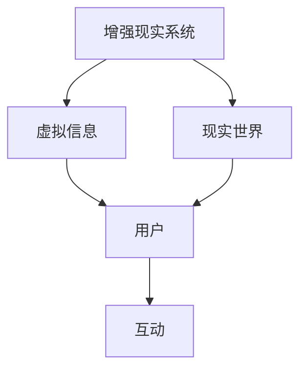

                 

# 增强现实在工业培训中的交互式应用

## 关键词
- 增强现实（AR）
- 工业培训
- 交互式应用
- 技术趋势
- 案例研究

## 摘要
随着工业4.0的推进，工业培训面临着新的挑战，传统的培训方式已经难以满足高效、直观和个性化的需求。本文探讨了增强现实（AR）技术在工业培训中的应用背景、优势、实现方法以及未来发展趋势。通过具体案例分析，揭示了AR技术在提高培训效果、减少培训成本、提升操作技能等方面的显著作用，为工业培训领域提供了一种创新解决方案。

## 目录

----------------------------------------------------------------

# 第一部分: 增强现实技术在工业培训中的应用背景

## 第1章: 增强现实技术概述

### 1.1 增强现实技术定义与核心概念

**核心概念：** 增强现实（Augmented Reality，AR）是一种将虚拟信息叠加到现实场景中的技术。它通过计算机生成的图形、图像、声音等多媒体信息，与现实世界的视觉、听觉等感知信息相结合，使用户能够感受到一个虚实结合的环境。

**概念属性特征对比表格：**
| 特征           | 实体名称       | 描述                                                         |
| -------------- | -------------- | ------------------------------------------------------------ |
| 存在形式       | 虚拟信息       | 通过计算机生成，叠加于现实场景中                             |
| 感知方式       | 视觉、听觉     | 用户通过视觉、听觉感知到虚拟信息与现实的结合                 |
| 技术特点       | 实时性、交互性 | 可实时调整虚拟信息，用户可以与虚拟信息进行互动               |

**ER实体关系图架构：**

### 1.2 增强现实技术的发展历程

**发展历程：** 增强现实技术最早可以追溯到1968年由美国计算机科学家阿尔文·罗伯茨（Alvin Robert）提出的“透视混合器”（Perspecta）概念。随着计算机技术、传感器技术、显示技术的不断进步，增强现实技术逐渐从实验室走向市场。

**关键技术突破：**
- **1990年代：** 波导眼镜的出现使得增强现实技术进入了研究人员的视线。
- **2000年代：** 手持式增强现实设备如“美国队长”头盔的问世，使得增强现实技术逐渐走向公众。
- **2010年代：** 智能手机和平板电脑的普及，推动了增强现实应用的爆发式增长。

### 1.3 增强现实技术的应用领域

**应用领域：** 增强现实技术在教育、医疗、娱乐、军事等多个领域都有广泛应用。特别是在工业培训中，AR技术因其直观、交互性强和易于操作的特点，逐渐成为提高培训效果的重要工具。

### 2章: 工业培训中的挑战与需求

## 第2章: 工业培训中的挑战与需求

### 2.1 工业培训的传统模式

**传统模式：** 工业培训传统上依赖于课堂讲授、操作演示和手册指导等模式。这些方法存在以下问题：
- **培训效果差：** 单一的知识传递方式难以激发学员的主动学习兴趣。
- **成本高：** 需要大量的培训设备和师资力量，成本高昂。
- **实用性弱：** 学员在实际操作中难以将理论知识与实际技能相结合。

### 2.2 工业培训中的痛点

**痛点：**
- **操作技能训练不足：** 传统培训模式难以提供足够的实操机会。
- **安全风险高：** 在实际操作中容易发生安全事故。
- **培训资源分配不均：** 培训资源难以满足大规模、差异化的培训需求。

### 2.3 对交互式培训的需求

**需求：** 为了解决传统培训模式的痛点，工业培训需要更加交互式、直观和个性化的培训方式。增强现实技术因其独特的优势，成为满足这些需求的理想选择。

### 3章: 增强现实技术在工业培训中的应用潜力

## 第3章: 增强现实技术在工业培训中的应用潜力

### 3.1 增强现实技术的优势

**优势：**
- **直观性：** 增强现实技术能够将抽象的知识点直观地呈现给学员。
- **交互性：** 学员可以与虚拟信息进行互动，提高学习参与度。
- **灵活性：** 增强现实培训可以根据不同学员的需求和进度进行个性化定制。
- **安全性：** 通过虚拟环境的模拟，减少了实际操作中的安全风险。

### 3.2 增强现实技术在工业培训中的应用场景

**应用场景：**
- **设备操作培训：** 通过增强现实技术，学员可以在虚拟环境中进行设备操作训练。
- **故障诊断与维修：** 增强现实技术可以帮助学员快速定位故障点，并提供维修指导。
- **技能评估与认证：** 增强现实技术可以实时评估学员的操作技能，并生成认证报告。

### 3.3 增强现实技术对工业培训的影响

**影响：**
- **提高培训效率：** 增强现实技术可以大大缩短培训时间，提高培训效果。
- **降低培训成本：** 通过虚拟环境的模拟，减少了培训设备和场地的投入。
- **提升培训质量：** 增强现实技术使得培训内容更加丰富、生动，有助于提高学员的学习效果。

### 4章: 增强现实技术在工业培训中的实现方法

## 第4章: 增强现实技术在工业培训中的实现方法

### 4.1 技术选型与设备配置

**技术选型：**
- **硬件设备：** 根据应用场景选择合适的增强现实设备，如平板电脑、智能手机、AR眼镜等。
- **软件平台：** 选择功能强大、易于定制的增强现实开发平台，如Unity、ARKit、ARCore等。

**设备配置：**
- **硬件配置：** 确保设备具备足够的性能，以满足增强现实应用的需求。
- **网络环境：** 确保设备连接的网络稳定，以保证数据传输的实时性和可靠性。

### 4.2 应用软件开发流程

**软件开发流程：**
1. **需求分析：** 明确培训需求，制定应用软件的功能清单。
2. **设计阶段：** 设计系统的架构，包括界面设计、模块划分等。
3. **开发阶段：** 根据设计文档进行应用软件的开发。
4. **测试阶段：** 进行功能测试、性能测试等，确保应用软件的质量。
5. **部署阶段：** 将应用软件部署到实际环境中，进行实地测试。

### 4.3 数据采集与处理

**数据采集：**
- **操作数据：** 采集学员在虚拟环境中的操作数据，如操作次数、错误率等。
- **反馈数据：** 采集学员对培训内容的反馈，如满意度、建议等。

**数据处理：**
- **数据分析：** 对采集到的数据进行分析，评估培训效果。
- **优化调整：** 根据数据分析结果，对培训内容进行优化调整。

### 5章: 增强现实在工业培训中的案例研究

## 第5章: 增强现实在工业培训中的案例研究

### 5.1 案例一：某制造企业增强现实培训系统的开发与应用

**案例概述：** 某制造企业为了提高员工的操作技能和故障诊断能力，开发了一套增强现实培训系统。

**实现方法：**
- **需求分析：** 企业明确了培训需求，包括设备操作、故障诊断等。
- **系统设计：** 设计了系统的架构，包括硬件设备、软件平台、数据库等。
- **系统开发：** 开发了增强现实培训应用软件，实现了设备操作模拟、故障诊断等功能。
- **测试与部署：** 进行了严格的测试，确保系统的稳定性和可靠性，最终部署到实际环境中。

**效果评估：**
- **操作技能提高：** 学员的设备操作技能显著提高。
- **故障诊断能力提升：** 学员的故障诊断能力得到加强。
- **培训成本降低：** 通过虚拟环境模拟，减少了培训设备和场地的投入。

### 5.2 案例二：某电力公司增强现实培训项目的实施与效果评估

**案例概述：** 某电力公司为了提高员工的安全意识和操作技能，实施了一项增强现实培训项目。

**实现方法：**
- **需求分析：** 企业明确了培训需求，包括安全意识培养、操作技能提升等。
- **系统设计：** 设计了系统的架构，包括AR眼镜、培训软件、安全数据库等。
- **系统开发：** 开发了增强现实培训软件，实现了安全意识培养、操作技能模拟等功能。
- **测试与部署：** 进行了严格的测试，确保系统的稳定性和可靠性，最终部署到实际环境中。

**效果评估：**
- **安全意识提高：** 学员的安全意识显著增强。
- **操作技能提升：** 学员的操作技能得到加强。
- **培训成本降低：** 通过虚拟环境模拟，减少了培训设备和场地的投入。

### 5.3 案例三：某航空企业增强现实模拟训练的实践与探索

**案例概述：** 某航空企业为了提高飞行员和地勤人员的操作技能和应急处理能力，开展了增强现实模拟训练。

**实现方法：**
- **需求分析：** 企业明确了培训需求，包括操作技能训练、应急处理能力提升等。
- **系统设计：** 设计了系统的架构，包括AR设备、模拟器、数据采集系统等。
- **系统开发：** 开发了增强现实模拟训练软件，实现了飞行操作模拟、应急处理模拟等功能。
- **测试与部署：** 进行了严格的测试，确保系统的稳定性和可靠性，最终部署到实际环境中。

**效果评估：**
- **操作技能提高：** 飞行员和地勤人员的操作技能得到显著提升。
- **应急处理能力增强：** 学员的应急处理能力得到加强。
- **培训成本降低：** 通过虚拟环境模拟，减少了实际飞行训练的成本。

### 6章: 增强现实技术在工业培训中的未来发展趋势

## 第6章: 增强现实技术在工业培训中的未来发展趋势

### 6.1 技术趋势分析

**技术趋势：**
- **硬件性能提升：** 随着硬件技术的不断进步，增强现实设备的性能将得到显著提升。
- **软件功能扩展：** 增强现实软件将更加丰富和多样化，满足不同培训需求。
- **网络环境优化：** 随着5G网络的普及，增强现实培训的实时性和稳定性将得到提高。

### 6.2 市场需求预测

**市场需求预测：**
- **市场规模扩大：** 随着增强现实技术的成熟和应用的普及，工业培训市场对增强现实技术的需求将不断增长。
- **行业覆盖面扩大：** 增强现实技术将在更多行业得到应用，如医疗、物流、金融等。

### 6.3 技术挑战与解决方案

**技术挑战：**
- **设备成本高：** 增强现实设备价格较高，对中小企业造成一定负担。
- **开发难度大：** 增强现实应用开发相对复杂，对开发人员要求较高。

**解决方案：**
- **降低设备成本：** 随着技术的成熟和市场竞争的加剧，增强现实设备的成本将逐渐降低。
- **提高开发效率：** 通过开发工具的改进和开发流程的优化，降低增强现实应用的开发难度。

### 7章: 总结与展望

## 第7章: 总结与展望

### 7.1 全书要点回顾

- **增强现实技术在工业培训中的应用潜力巨大。**
- **增强现实技术具有直观性、交互性、灵活性和安全性等优势。**
- **实现方法包括技术选型、设备配置、软件开发流程和数据采集与处理。**
- **案例研究表明，增强现实技术在提高培训效果、降低培训成本方面具有显著作用。**
- **未来发展趋势包括硬件性能提升、软件功能扩展和网络环境优化。**

### 7.2 对未来工作的建议

- **加强技术研究：** 深入研究增强现实技术的最新进展，探索其在工业培训中的应用。
- **优化培训流程：** 结合实际需求，优化培训流程，提高培训效率和质量。
- **促进产业合作：** 加强产业链上下游企业的合作，共同推动增强现实技术在工业培训中的应用。

### 7.3 进一步研究的方向

- **增强现实技术与虚拟现实（VR）技术的融合应用。**
- **智能增强现实培训系统的设计与实现。**
- **增强现实技术在远程协作培训中的应用研究。**
- **增强现实技术在安全培训与应急处理中的应用研究。**

## 作者

**作者：AI天才研究院/AI Genius Institute & 禅与计算机程序设计艺术 /Zen And The Art of Computer Programming**

