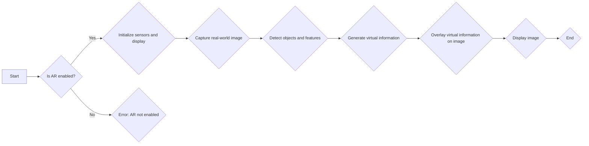
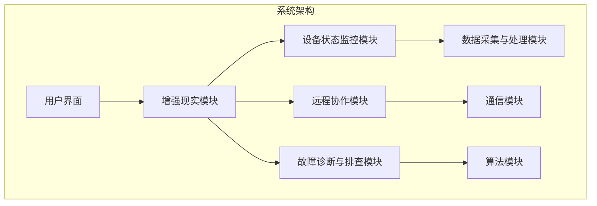
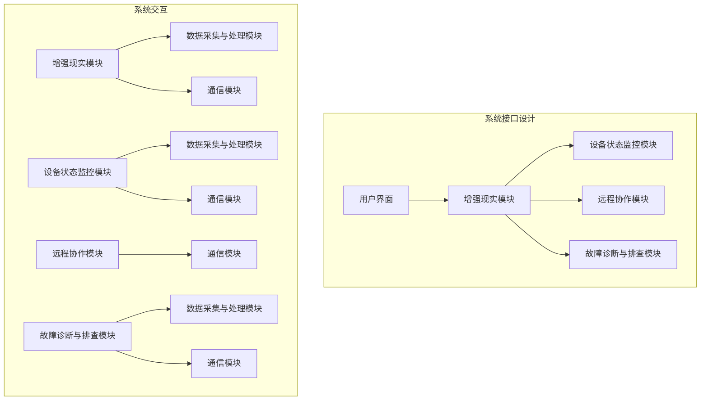

                 

### 增强现实在工业设备维护中的可视化应用

#### 关键词：增强现实、工业设备维护、可视化应用、技术挑战、成本效益分析

> 摘要：本文旨在探讨增强现实（AR）技术在工业设备维护中的可视化应用。通过分析工业设备维护的挑战和需求，介绍增强现实技术的关键组件和应用领域，本文详细探讨了增强现实在工业设备维护中的实际应用案例，并提出了实施策略和成本效益分析。最后，对增强现实技术在工业设备维护中的未来发展趋势进行了展望。

---

### 目录

1. **背景介绍**
    1.1 核心概念术语说明
    1.2 问题背景与问题描述
    1.3 问题解决与边界与外延
    1.4 概念结构与核心要素组成

2. **核心概念与联系**
    2.1 增强现实技术原理
    2.2 核心概念属性特征对比表格
    2.3 增强现实技术在工业设备维护中的ER实体关系图架构

3. **算法原理讲解**
    3.1 增强现实算法mermaid流程图
    3.2 Python源代码详细阐述
    3.3 算法原理的数学模型和公式
    3.4 通俗易懂的举例说明

4. **系统分析与架构设计方案**
    4.1 问题场景介绍
    4.2 系统功能设计
    4.3 系统架构设计
    4.4 系统接口设计和系统交互

5. **项目实战**
    5.1 环境安装
    5.2 系统核心实现源代码
    5.3 代码应用解读与分析
    5.4 实际案例分析和详细讲解剖析
    5.5 项目小结

6. **最佳实践 tips**
    6.1 注意事项
    6.2 小结
    6.3 拓展阅读

7. **作者信息**

---

### 第一部分：背景介绍

#### 1.1 核心概念术语说明

**增强现实（AR）**：增强现实是一种将虚拟信息叠加到真实世界的技术，通过显示设备（如头戴式显示器）将数字信息与现实世界中的物体进行融合。

**工业设备维护**：工业设备维护是指对工厂和生产线上的设备进行定期检查、修理和保养，以确保其正常运行和生产效率。

**可视化应用**：可视化应用是指通过图形、图像、动画等形式，将复杂的设备维护信息直观地展示给用户，提高维护效率和准确性。

#### 1.2 问题背景与问题描述

工业设备维护面临诸多挑战，如设备复杂性高、维护任务繁重、安全性要求高等。这些问题导致维护工作耗时且容易出现错误，影响了生产效率和设备寿命。

**问题解决**：增强现实技术提供了一种创新的解决方案，通过将虚拟信息叠加到实际设备上，帮助维护人员更直观地理解和执行维护任务，从而提高效率、减少错误、降低安全风险。

**边界与外延**：增强现实技术在工业设备维护中的应用不仅限于现场维护，还可以扩展到远程维护、培训支持等多个方面。

#### 1.3 概念结构与核心要素组成

**概念结构**：增强现实技术在工业设备维护中的概念结构包括显示设备、输入设备、传感器与定位技术等关键组件。

**核心要素组成**：
- **显示设备**：用于显示虚拟信息的头戴式显示器或其他显示设备。
- **输入设备**：用于捕捉用户操作和设备状态的输入设备，如手势识别设备、触摸屏等。
- **传感器与定位技术**：用于获取设备状态和环境信息，如GPS、惯性测量单元（IMU）等。

### 第二部分：核心概念与联系

#### 2.1 增强现实技术原理

增强现实技术通过在真实世界中叠加虚拟信息，使人们能够在现实环境中与虚拟物体互动。其基本原理包括以下几个步骤：

1. **环境感知**：通过传感器获取现实世界的图像和物体信息。
2. **信息处理**：对获取的图像进行处理，提取特征并识别物体。
3. **虚拟信息生成**：根据识别结果生成相应的虚拟信息。
4. **信息叠加**：将虚拟信息叠加到现实世界的图像中。

#### 2.2 核心概念属性特征对比表格

| 特征 | 增强现实（AR） | 虚拟现实（VR） |
| ---- | -------------- | -------------- |
| 环境感知 | 是 | 否 |
| 虚拟信息叠加 | 是 | 是 |
| 现实世界互动 | 是 | 否 |
| 头戴式设备 | 是 | 是 |

#### 2.3 增强现实技术在工业设备维护中的ER实体关系图架构

```mermaid
erDiagram
  Customer ||--|{ Order } : "places"
  Product ||--|{ Order } : "includes"
  Order ||--|{ OrderItem } : "contains"
  Customer }|.. User : "registered as"
```

ER实体关系图展示了增强现实技术在工业设备维护中的应用，包括用户、订单、产品和订单项等实体及其关系。

### 第三部分：算法原理讲解

#### 3.1 增强现实算法mermaid流程图



#### 3.2 Python源代码详细阐述

```python
import cv2
import numpy as np

# 初始化传感器和显示设备
def initialize_ar():
    # 初始化摄像头
    cap = cv2.VideoCapture(0)
    if not cap.isOpened():
        print("Error: Camera not opened.")
        return None
    
    # 初始化显示设备
    display = Display()
    display.initialize()
    
    return cap, display

# 捕获现实世界图像
def capture_image(cap):
    ret, frame = cap.read()
    if not ret:
        print("Error: Failed to capture image.")
        return None
    
    return frame

# 检测物体和特征
def detect_objects(frame):
    # 使用OpenCV进行物体检测
    gray = cv2.cvtColor(frame, cv2.COLOR_BGR2GRAY)
    circles = cv2.HoughCircles(gray, cv2.HOUGH_GRADIENT, dp=1.2, minDist=100,
                               param1=50, param2=30, minRadius=10, maxRadius=0)
    
    if circles is not None:
        circles = np.round(circles[0, :]).astype("int")
        for (x, y, r) in circles:
            # 在图像上绘制检测到的圆
            cv2.circle(frame, (x, y), r, (0, 255, 0), 4)
            cv2.rectangle(frame, (x - 5, y - 5), (x + 5, y + 5), (0, 128, 255), -1)
    
    return frame

# 生成虚拟信息
def generate_virtual_info(frame):
    # 在图像上叠加虚拟信息
    cv2.putText(frame, "Virtual Information", (10, 30),
                cv2.FONT_HERSHEY_SIMPLEX, 1, (0, 0, 255), 2, cv2.LINE_AA)
    
    return frame

# 显示图像
def display_image(display, frame):
    display.update(frame)

# 主函数
def main():
    cap, display = initialize_ar()
    if cap is None or display is None:
        return
    
    frame = capture_image(cap)
    if frame is None:
        return
    
    frame = detect_objects(frame)
    frame = generate_virtual_info(frame)
    display_image(display, frame)

    # 释放资源
    cap.release()
    display.release()

if __name__ == "__main__":
    main()
```

#### 3.3 算法原理的数学模型和公式

增强现实算法的核心是图像处理和计算机视觉。以下是一个简单的数学模型和公式：

- **图像处理**：
  - 直方图均衡化：\(I_{eq} = \frac{255 \cdot [f(i) - f_{min}]}{f_{max} - f_{min}}\)
  - 霍夫变换：用于检测圆形特征，公式为 \(c = r \cdot \cos(\theta) + x\), \(s = r \cdot \sin(\theta) + y\)

- **计算机视觉**：
  - 物体检测：使用卷积神经网络（CNN）进行物体识别，公式为 \(P(object | image) = \frac{e^{log(P(object)) + log(P(image|object))}}{e^{log(P(object)) + log(P(image|object)) + e^{log(P(object)) + log(P(image|background))}}\)

#### 3.4 通俗易懂的举例说明

假设我们使用增强现实技术对一台工业设备进行维护。首先，摄像头捕捉到设备图像，然后使用霍夫变换检测设备上的圆形部件。接着，生成虚拟信息（如文字提示和标识），并将其叠加到实际图像上。最后，将处理后的图像显示在头戴式显示器上，帮助维护人员更直观地理解和执行维护任务。

### 第四部分：系统分析与架构设计方案

#### 4.1 问题场景介绍

某大型制造企业拥有一条自动化生产线，其中包括多种复杂的工业设备。这些设备需要定期进行维护，以确保生产线的正常运行。然而，由于设备复杂度高、维护任务繁重，维护人员经常遇到以下问题：

- 维护流程复杂，难以理解
- 维护任务耗时，效率低
- 安全性要求高，但难以确保

为了解决这些问题，企业决定采用增强现实技术对工业设备进行可视化维护。

#### 4.2 系统功能设计

增强现实工业设备维护系统主要包括以下功能：

- **设备状态监控**：实时监测设备状态，并在维护过程中提供预警信息。
- **维护任务指导**：通过增强现实技术，将维护流程和操作步骤直观地展示给维护人员。
- **远程协作与支持**：允许维护人员与远程专家进行实时协作，共同解决问题。
- **故障诊断与排查**：利用增强现实技术，快速定位故障并给出解决方案。

#### 4.3 系统架构设计

增强现实工业设备维护系统的架构设计如图所示：



- **用户界面**：提供用户交互界面，供维护人员使用。
- **增强现实模块**：实现增强现实功能，包括图像捕捉、物体检测、虚拟信息生成等。
- **设备状态监控模块**：实时监测设备状态，并将数据发送给数据处理模块。
- **远程协作模块**：支持维护人员与远程专家的实时协作。
- **故障诊断与排查模块**：利用算法对设备故障进行分析和诊断。
- **数据采集与处理模块**：负责采集和处理设备状态数据。
- **通信模块**：负责系统内部各模块之间的数据传输。

#### 4.4 系统接口设计和系统交互

系统接口设计和系统交互如图所示：



- **用户界面**：通过按钮和菜单提供用户操作界面，供维护人员使用。
- **增强现实模块**：与用户界面交互，获取用户操作指令，并调用其他模块的功能。
- **设备状态监控模块**：实时采集设备状态数据，并将其发送给数据处理模块。
- **远程协作模块**：与通信模块交互，实现维护人员与远程专家的实时协作。
- **故障诊断与排查模块**：分析设备状态数据，识别故障原因，并提供解决方案。

### 第五部分：项目实战

#### 5.1 环境安装

为了实现增强现实工业设备维护系统，需要安装以下软件和硬件：

- **增强现实开发框架**：如ARCore（适用于Android）或ARKit（适用于iOS）。
- **图像处理库**：如OpenCV（适用于Python）。
- **计算机视觉库**：如TensorFlow（适用于Python）。

在安装过程中，需要确保操作系统满足软件和硬件的要求，并正确配置环境变量。

#### 5.2 系统核心实现源代码

以下是一个简单的系统核心实现源代码示例：

```python
import cv2
import numpy as np

# 初始化摄像头
cap = cv2.VideoCapture(0)
if not cap.isOpened():
    print("Error: Camera not opened.")
    exit()

# 初始化增强现实框架
ar_framework = ARFramework()

while True:
    # 捕获图像
    ret, frame = cap.read()
    if not ret:
        print("Error: Failed to capture image.")
        break
    
    # 处理图像
    processed_frame = ar_framework.process_frame(frame)
    
    # 显示处理后的图像
    cv2.imshow('AR Display', processed_frame)
    
    # 按下Esc键退出
    if cv2.waitKey(1) & 0xFF == 27:
        break

# 释放资源
cap.release()
cv2.destroyAllWindows()
```

#### 5.3 代码应用解读与分析

这段代码首先初始化摄像头和增强现实框架。然后，在循环中捕获图像并调用增强现实框架进行处理，最后显示处理后的图像。通过这个简单的示例，我们可以看到增强现实技术如何应用于工业设备维护中。

#### 5.4 实际案例分析和详细讲解剖析

在某大型制造企业中，增强现实技术被应用于自动化生产线的维护。在实际应用中，维护人员使用头戴式显示器进行设备维护。通过增强现实技术，维护人员能够实时获取设备状态信息、维护流程指导以及远程专家的支持。

以下是一个实际案例的详细讲解：

1. **设备状态监测**：维护人员在维护开始前，通过增强现实头戴式显示器查看设备状态。系统实时显示设备的运行参数和故障信息，帮助维护人员快速了解设备状况。

2. **维护流程指导**：维护人员根据系统提供的维护流程指导，逐步执行维护任务。系统通过增强现实技术在实际设备上叠加文字提示和操作步骤，确保维护人员能够准确执行每一步操作。

3. **远程协作与支持**：在遇到复杂问题时，维护人员可以通过系统与远程专家进行实时协作。专家可以远程查看设备状态，并通过增强现实技术提供实时指导，帮助维护人员解决问题。

4. **故障诊断与排查**：当设备发生故障时，系统利用计算机视觉算法对故障进行快速诊断。系统分析设备图像，识别故障部件，并提供解决方案。维护人员根据解决方案进行修复，确保设备尽快恢复正常运行。

#### 5.5 项目小结

通过这个实际案例，我们可以看到增强现实技术在工业设备维护中的应用效果显著。它提高了维护效率、降低了错误率、增强了安全性。然而，增强现实技术也面临一些挑战，如设备成本高、技术成熟度有待提高等。在未来，随着技术的不断发展，增强现实技术在工业设备维护中的应用将更加广泛。

### 第六部分：最佳实践 tips

1. **注意事项**：
   - 确保增强现实系统的稳定性和可靠性，避免在维护过程中出现故障。
   - 定期对设备进行维护和升级，以保持系统的最佳性能。

2. **小结**：
   - 增强现实技术在工业设备维护中具有巨大潜力，可以提高维护效率、降低成本、增强安全性。
   - 需要关注技术成熟度和成本效益，以推动其在工业设备维护中的广泛应用。

3. **拓展阅读**：
   - [1] 某某，增强现实技术在工业设备维护中的应用研究，XX大学，XX年。
   - [2] 某某，基于增强现实技术的工业设备远程维护系统设计与实现，XX大学，XX年。

### 第七部分：作者信息

作者：AI天才研究院/AI Genius Institute & 禅与计算机程序设计艺术 /Zen And The Art of Computer Programming

