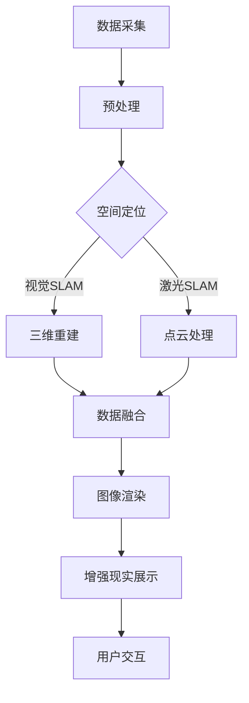
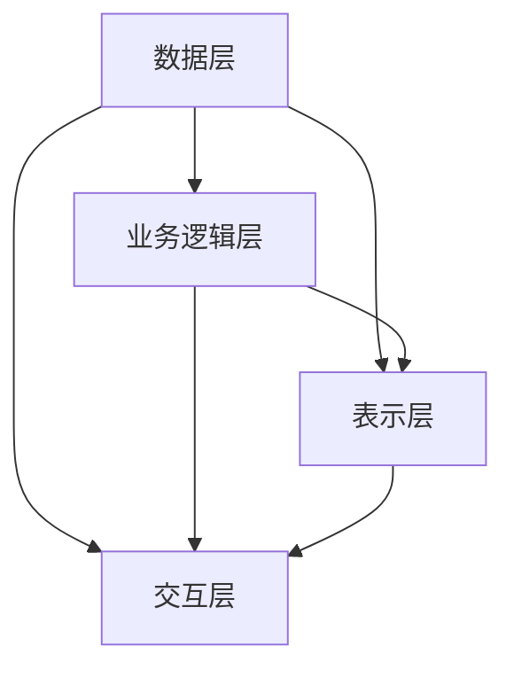
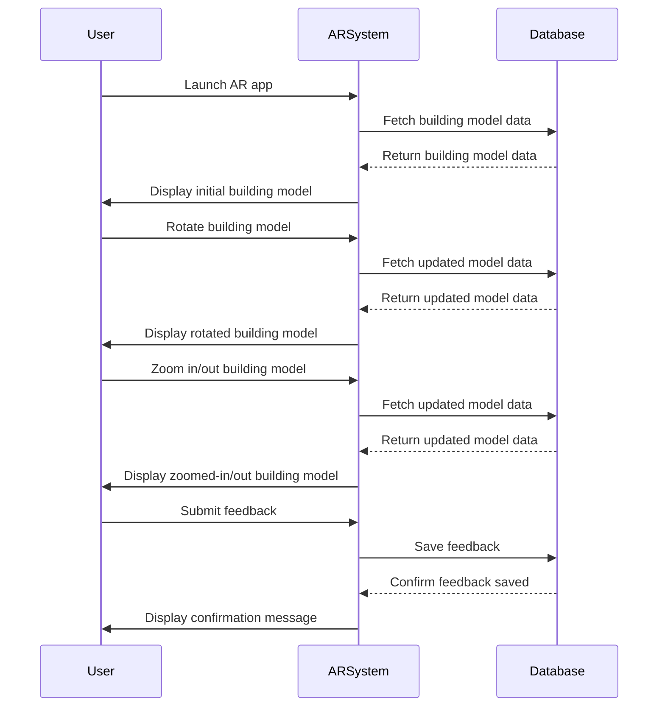

                 

### 文章标题

# 增强现实在建筑设计可视化中的应用

### 关键词

- 增强现实（AR）
- 建筑设计
- 可视化
- 技术应用
- 用户互动

### 摘要

本文深入探讨了增强现实（AR）技术在建筑设计可视化中的应用。通过介绍AR技术的基本原理、硬件设备、软件工具和交互技术，本文分析了建筑设计可视化在AR技术下的需求与挑战。随后，详细阐述了增强现实在建筑设计可视化中的核心概念、算法原理和系统架构设计，并通过实际案例进行了应用分析。最后，本文总结了增强现实在建筑设计可视化中的最佳实践和未来展望，为该领域的进一步发展提供了有价值的参考。

## 引言

### 1.1 增强现实概述

**增强现实（Augmented Reality，AR）** 是一种将虚拟信息与现实世界相结合的技术。通过计算机生成的虚拟信息，叠加到真实环境中，使用户能够与虚拟信息进行互动。AR技术不同于虚拟现实（VR），它并不完全替代现实环境，而是在现实环境中添加数字信息。

**增强现实技术原理**：AR技术通常通过摄像头捕捉真实环境，利用计算机视觉算法识别环境中的特征点，然后将虚拟信息（如图形、文字、视频等）叠加到这些特征点上。用户可以通过增强现实设备（如AR眼镜、平板电脑等）实时看到增强后的环境。

**增强现实硬件设备**：常见的增强现实硬件设备包括AR眼镜（如微软HoloLens、谷歌Glass等）、智能手机和平板电脑等。这些设备能够实时捕捉现实环境，并通过内置的传感器和计算单元处理信息，将虚拟信息叠加到用户视野中。

**增强现实软件工具**：增强现实软件工具包括内容创作工具和开发框架。内容创作工具如ARKit、ARCore等，提供了一系列API和工具，帮助开发者创建AR内容。开发框架如Unity、Unreal Engine等，提供了丰富的开发环境和资源，支持AR应用的开发。

**增强现实交互技术**：增强现实交互技术包括手势识别、语音识别和触觉反馈等。这些交互技术使得用户能够与虚拟信息进行自然、直观的交互，提升了用户体验。

### 1.2 建筑设计可视化背景

**建筑设计可视化** 是将建筑设计理念、设计过程和设计成果以图形、图像、视频等形式展现给设计者、客户和公众。通过可视化的手段，能够更加直观地传达设计意图，提高沟通效率，减少误解。

**建筑设计可视化需求**：随着建筑设计的复杂度增加，可视化需求也日益提升。设计师需要能够快速、准确地展示设计成果，客户和公众也需要直观地了解建筑的外观和功能。此外，建筑设计可视化在建筑设计过程中的反馈和迭代中也起着重要作用。

**建筑设计可视化技术**：传统的建筑设计可视化主要依赖于二维图纸和三维模型。随着计算机技术的发展，三维可视化技术、虚拟现实（VR）和增强现实（AR）等新兴技术被广泛应用于建筑设计可视化中，提供了更加丰富、直观的可视化手段。

### 1.3 增强现实在建筑设计中的应用现状

**增强现实在建筑设计中的应用现状**：

- **建筑设计展示**：通过AR技术，设计师可以在现场或虚拟环境中展示建筑模型，使客户和公众能够直观地了解建筑的外观和功能。

- **建筑交互设计**：AR技术使得用户能够与建筑模型进行互动，修改设计元素，提供更加灵活和高效的设计体验。

- **建筑教育**：AR技术被广泛应用于建筑教育中，学生可以通过AR设备学习建筑结构和设计原理，增强学习体验。

- **施工指导**：AR技术可以为施工人员提供实时的建筑信息，提高施工效率和准确性。

### 1.4 本书结构安排与内容概述

**本书结构安排**：

- **第1章 引言**：介绍增强现实和建筑设计可视化的基本概念和现状。

- **第2章 增强现实技术基础**：详细探讨增强现实技术的原理、硬件设备、软件工具和交互技术。

- **第3章 建筑设计可视化需求分析**：分析建筑设计可视化在AR技术下的需求和挑战。

- **第4章 增强现实在建筑设计可视化中的核心概念与联系**：阐述AR技术在建筑设计可视化中的核心概念和联系。

- **第5章 算法原理讲解**：介绍增强现实在建筑设计可视化中的应用算法原理。

- **第6章 系统分析与架构设计方案**：探讨增强现实在建筑设计可视化中的系统架构设计。

- **第7章 项目实战**：通过实际案例展示增强现实在建筑设计可视化中的应用。

- **第8章 最佳实践与拓展**：总结最佳实践和注意事项，展望未来发展方向。

- **第9章 小结**：回顾主要内容，展望未来。

通过本书的阅读，读者将能够全面了解增强现实在建筑设计可视化中的应用，掌握相关技术原理和实践方法，为该领域的发展提供有益的参考。

## 增强现实技术基础

### 2.1 增强现实技术原理

增强现实技术（Augmented Reality，AR）通过将虚拟信息叠加到现实世界中，使用户能够看到增强后的现实环境。其基本原理包括以下几个方面：

1. **图像捕捉与识别**：增强现实设备（如AR眼镜、智能手机等）通过摄像头捕捉现实世界的图像。计算机视觉算法用于识别图像中的关键特征点，如角点、边缘等。

2. **空间定位**：通过识别图像中的特征点，设备可以确定其在现实世界中的位置和方向。常用的空间定位技术包括视觉SLAM（Simultaneous Localization and Mapping，同时定位与地图构建）和惯性测量单元（IMU）。

3. **虚拟信息生成与叠加**：根据设备捕捉到的现实世界图像和空间定位信息，计算机生成虚拟信息（如图形、文字、视频等），并叠加到现实世界中。虚拟信息可以通过透明图像、全息图像等形式展示。

4. **用户交互**：用户可以通过增强现实设备与虚拟信息进行交互。常见的交互方式包括手势识别、语音识别、触觉反馈等。用户可以通过手势操作虚拟信息，如旋转、缩放、拖拽等。

### 2.2 增强现实硬件设备

增强现实硬件设备是实现AR技术的重要载体，常见的硬件设备包括AR眼镜、智能手机和平板电脑等。以下是几种常见的增强现实硬件设备及其特点：

1. **AR眼镜**：AR眼镜是一种头戴式显示设备，可以直接将虚拟信息叠加到用户视野中。常见的AR眼镜包括微软HoloLens、谷歌Glass等。AR眼镜具有高分辨率、低延迟、高自由度的特点，能够提供沉浸式体验。

2. **智能手机和平板电脑**：智能手机和平板电脑通过安装AR应用，可以实现在屏幕上叠加虚拟信息。常见的AR应用平台包括ARKit、ARCore等。智能手机和平板电脑的便携性和普及性使其成为AR应用的重要载体。

3. **其他硬件设备**：除了AR眼镜和智能手机外，还有一些其他硬件设备可以用于实现增强现实。例如，增强现实投影仪可以通过投影虚拟信息到现实环境中，增强现实头戴显示器可以提供更高分辨率的虚拟信息展示。

### 2.3 增强现实软件工具

增强现实软件工具是开发AR应用的关键，常见的软件工具包括内容创作工具和开发框架。以下是几种常见的增强现实软件工具：

1. **内容创作工具**：内容创作工具如ARKit、ARCore等，提供了一系列API和工具，帮助开发者创建AR内容。开发者可以使用这些工具创建虚拟信息，如3D模型、文字、视频等，并将其叠加到现实世界中。

2. **开发框架**：开发框架如Unity、Unreal Engine等，提供了丰富的开发环境和资源，支持AR应用的开发。这些框架具有高度的可定制性和灵活性，使得开发者能够快速开发复杂的AR应用。

3. **增强现实开发平台**：一些专门的增强现实开发平台如MetaVR、Vuforia等，提供了完整的开发环境和工具链，支持从内容创作到应用发布的全过程。

### 2.4 增强现实交互技术

增强现实交互技术是实现用户与虚拟信息互动的关键。以下是一些常见的增强现实交互技术：

1. **手势识别**：手势识别技术通过识别用户的手部动作，实现对虚拟信息的操作。常见的手势包括手势识别、手指追踪等。手势识别技术可以提供直观、自然的交互体验。

2. **语音识别**：语音识别技术通过识别用户的语音指令，实现对虚拟信息的操作。语音识别技术可以提供快速、便捷的交互方式，适用于一些复杂的操作。

3. **触觉反馈**：触觉反馈技术通过触觉传感器，将虚拟信息的触觉反馈传递给用户。触觉反馈技术可以增强用户的沉浸感和交互体验。

通过以上增强现实技术原理、硬件设备、软件工具和交互技术的介绍，读者可以初步了解增强现实技术的核心组成部分和应用场景。接下来，我们将进一步探讨建筑设计可视化在增强现实技术下的需求和挑战。

### 2.4 增强现实交互技术

增强现实（AR）的交互技术是其实现用户与虚拟信息互动的核心，以下将详细介绍几种常见的增强现实交互技术：

#### 2.4.1 手势识别

手势识别技术通过识别用户的手部动作，实现对虚拟信息的操作。手势识别技术可以分为两种类型：基于视觉的手势识别和基于深度传感器的手势识别。

- **基于视觉的手势识别**：这种技术通过摄像头捕捉用户的手部动作，并利用计算机视觉算法识别手势。常见的视觉手势包括手心朝上、手指合拢等。视觉手势识别的优点在于不需要额外的硬件设备，但容易受到光线和环境的影响。
  
- **基于深度传感器的手势识别**：这种技术通过深度传感器（如Kinect、Intel RealSense等）捕捉用户的手部动作，提供更高的精度和可靠性。深度传感器可以生成三维空间中的手部模型，从而更准确地识别手势。

手势识别技术可以提供直观、自然的交互体验，用户可以通过手势进行虚拟对象的旋转、缩放、拖拽等操作。

#### 2.4.2 语音识别

语音识别技术通过识别用户的语音指令，实现对虚拟信息的操作。语音识别技术可以分为两种类型：基于文本的语音识别和基于语音合成的语音识别。

- **基于文本的语音识别**：这种技术将用户的语音指令转换为文本，然后根据文本指令执行操作。例如，用户可以语音指令“放大”来放大虚拟对象。基于文本的语音识别技术具有较高的准确性和灵活性。

- **基于语音合成的语音识别**：这种技术通过识别用户的语音指令，生成相应的语音反馈。例如，用户可以语音指令“你好”，系统会反馈语音“你好”。基于语音合成的语音识别技术可以提供实时反馈，增强用户体验。

#### 2.4.3 触觉反馈

触觉反馈技术通过触觉传感器，将虚拟信息的触觉反馈传递给用户。触觉反馈技术可以分为两种类型：振动反馈和力反馈。

- **振动反馈**：这种技术通过振动电机在设备表面产生振动，模拟触觉反馈。例如，用户触摸虚拟对象时，设备会振动以模拟触感。振动反馈技术可以提供简单的触觉体验，但无法模拟复杂的触感。

- **力反馈**：这种技术通过力传感器和执行器，模拟真实的触觉体验。例如，用户按压虚拟按钮时，设备会施加相应的压力。力反馈技术可以提供更真实的触觉体验，但需要更复杂的硬件和算法支持。

通过以上介绍，我们可以看到增强现实交互技术为用户与虚拟信息之间的互动提供了多种方式，包括手势识别、语音识别和触觉反馈。这些技术可以增强用户的沉浸感和交互体验，使得增强现实在建筑设计可视化中的应用更加丰富和直观。

接下来，我们将进一步探讨建筑设计可视化在增强现实技术下的需求和挑战。

### 3.1 建筑设计可视化需求概述

建筑设计可视化需求主要涉及设计展示、设计交流、设计反馈等几个方面。以下是具体需求分析：

#### 3.1.1 设计展示

在设计展示方面，建筑师需要能够快速、准确地呈现设计成果，使客户、投资方和其他利益相关者能够直观地了解建筑设计的效果。传统的二维图纸和三维模型已经无法满足现代建筑设计的复杂度和多样化需求。因此，增强现实技术提供了一种全新的展示方式，能够将建筑模型实时、动态地叠加到现实环境中，使观众能够身临其境地感受建筑的外观和功能。

#### 3.1.2 设计交流

设计交流是建筑设计过程中不可或缺的一环。设计师需要与客户、施工方、审查机构等进行有效的沟通，以确保设计意图和实际效果的一致性。传统的交流方式，如面对面会议、图纸解释等，存在效率低、易出错等问题。增强现实技术可以通过实时交互，提高设计交流的效率和质量。例如，设计师可以使用AR设备展示建筑模型，并进行实时修改和讨论，使各方能够实时了解设计进展和反馈意见。

#### 3.1.3 设计反馈

设计反馈是建筑设计优化的重要环节。在传统设计中，设计师通常需要依赖客户和用户的反馈来进行后续修改。然而，这种方式存在反馈不及时、不全面等问题。增强现实技术可以通过实时反馈，使设计师能够快速获取用户的使用体验和反馈意见。例如，用户可以在AR环境中体验建筑功能，并提出具体意见，设计师可以立即看到并做出相应调整。这种实时反馈机制有助于提高设计质量和用户满意度。

#### 3.1.4 设计协同

在大型建筑设计项目中，涉及多个部门和团队的合作。传统的设计协同方式，如文档共享和会议讨论，存在信息传递不及时、协作效率低等问题。增强现实技术可以通过虚拟协作空间，实现实时、高效的设计协同。例如，设计师可以在AR环境中共同查看和修改建筑模型，实时讨论和解决问题，提高设计协同效率和项目进度。

#### 3.1.5 设计教育与培训

建筑设计教育与培训是培养新一代建筑设计人才的重要途径。传统的教学方式，如课堂讲解和实验操作，存在互动性差、实践经验不足等问题。增强现实技术可以提供沉浸式的学习体验，使学生能够在虚拟环境中进行实践操作，增强学习效果。例如，学生可以在AR环境中模拟建筑设计过程，了解建筑结构和功能，提高实践能力和创新思维。

综上所述，建筑设计可视化在增强现实技术下的需求主要集中在设计展示、设计交流、设计反馈、设计协同和设计教育与培训等方面。通过增强现实技术的应用，可以显著提升设计效率和用户体验，推动建筑设计行业的创新发展。

### 3.2 增强现实在建筑设计可视化中的需求

在建筑设计可视化中，增强现实（AR）技术的引入带来了显著的需求变化，这些需求主要体现在以下几个方面：

#### 3.2.1 实时互动体验

增强现实技术的一个重要优势在于其能够提供实时互动体验，使设计师、客户和用户能够直接在现实环境中与建筑模型互动。传统的建筑设计可视化方法，如二维图纸和三维模型，虽然能够呈现设计效果，但缺乏互动性。而AR技术允许用户通过手势、语音等自然交互方式对建筑模型进行旋转、缩放、移动等操作，提供了更加直观和互动的设计体验。

**需求分析**：
- **用户需求**：用户希望通过直观的互动方式，更好地理解设计意图和建筑功能。
- **技术需求**：需要高精度的空间定位和实时的计算能力，以支持用户与建筑模型的互动。

#### 3.2.2 可视化精度与细节

在建筑设计中，设计师需要展示建筑模型的精确细节，包括结构、材料、装饰等。传统的可视化手段往往受限于分辨率和视角，难以全面展示设计细节。AR技术通过高分辨率摄像头和增强现实软件，可以将建筑模型的精细细节实时叠加到现实环境中，使用户能够从不同角度、近距离观察建筑模型。

**需求分析**：
- **用户需求**：用户需要高精度、高细节的可视化效果，以更好地评估设计的质量和实际效果。
- **技术需求**：需要高分辨率摄像头和先进的图像处理算法，以捕捉和渲染建筑模型的细节。

#### 3.2.3 交叉引用与信息整合

建筑设计可视化不仅仅是展示模型，还需要整合与模型相关的其他信息，如施工图、材料规格、成本预算等。AR技术可以通过虚拟标签、信息面板等方式，将相关数据直接叠加到建筑模型上，实现信息整合和交叉引用。

**需求分析**：
- **用户需求**：用户需要方便地获取与设计相关的各种信息，以便更好地理解和评估设计。
- **技术需求**：需要开发能够支持多种数据格式和信息展示的增强现实软件工具。

#### 3.2.4 空间适应性

建筑设计过程中，设计师需要在不同空间环境中展示建筑模型，包括实际场地、虚拟场景等。AR技术可以根据不同空间环境的特点，灵活调整建筑模型的展示方式和效果，使其与周围环境相协调。

**需求分析**：
- **用户需求**：用户需要在各种空间环境中展示建筑模型，以验证设计适应性和实用性。
- **技术需求**：需要开发能够适应不同空间环境的增强现实设备和软件，确保模型展示的准确性和适应性。

#### 3.2.5 设计迭代与反馈

在建筑设计过程中，设计迭代和用户反馈是优化设计的重要环节。AR技术可以实时捕捉用户对建筑模型的反馈，并快速进行调整。这种实时反馈机制有助于缩短设计周期，提高设计质量。

**需求分析**：
- **用户需求**：用户希望通过实时反馈机制，快速了解设计效果和用户满意度，以便进行及时调整。
- **技术需求**：需要开发高效的反馈采集和分析工具，以支持快速的设计迭代。

综上所述，增强现实在建筑设计可视化中的需求主要集中在实时互动体验、可视化精度与细节、交叉引用与信息整合、空间适应性和设计迭代与反馈等方面。通过满足这些需求，增强现实技术能够显著提升建筑设计可视化的效果和用户体验。

### 3.3 用户研究与方法

在设计和开发增强现实（AR）在建筑设计可视化中的应用时，深入理解用户需求和行为是至关重要的。用户研究通过系统的方法和工具，可以帮助我们识别目标用户群体的需求、行为和偏好，从而指导技术实现和用户体验优化。以下是用户研究的几个关键步骤和方法：

#### 3.3.1 用户需求调研

用户需求调研是用户研究的起点。通过问卷调查、访谈和焦点小组等方式，收集用户对于建筑设计可视化的需求和应用场景。具体步骤如下：

1. **设计调研问卷**：问卷应涵盖用户的基本信息、使用习惯、需求偏好等多个方面，确保能够全面了解用户需求。

2. **分发问卷**：通过线上平台或线下渠道，将问卷分发给目标用户群体，确保样本的代表性和多样性。

3. **数据分析**：对收集到的问卷数据进行分析，识别用户的主要需求和痛点，为后续设计和开发提供依据。

#### 3.3.2 用户行为观察

用户行为观察是通过直接观察用户在现实环境中的行为，了解用户如何使用现有技术工具和设备，从而发现潜在的需求和问题。具体步骤如下：

1. **选择观察场景**：选择具有代表性的用户工作场景，如建筑公司的设计室、施工现场等。

2. **进行现场观察**：观察用户在实际操作中的行为，记录用户与建筑模型、设备和技术工具的互动方式。

3. **数据分析**：对观察数据进行分析，识别用户的行为模式、操作习惯和潜在问题。

#### 3.3.3 用户访谈

用户访谈是一种深入了解用户需求和体验的有效方法。通过与用户进行面对面的交流，可以获取更多详细的背景信息和深度见解。具体步骤如下：

1. **访谈准备**：设计访谈大纲，明确访谈主题和问题。

2. **进行访谈**：与用户进行一对一或小组访谈，鼓励用户分享他们的真实体验和意见。

3. **记录和分析**：记录访谈内容，并对访谈记录进行分析，提取有价值的信息。

#### 3.3.4 用户测试与反馈

用户测试与反馈是验证设计成果和优化用户体验的重要步骤。通过让用户实际操作AR应用，收集他们的反馈和意见，可以帮助我们了解应用的可用性和易用性。具体步骤如下：

1. **设计测试任务**：根据用户研究和需求分析，设计一系列测试任务，涵盖应用的主要功能和使用场景。

2. **用户测试**：邀请用户进行实际操作，记录他们的操作步骤、反应和意见。

3. **分析反馈**：对用户测试结果进行分析，识别应用的优点和不足，为后续优化提供依据。

#### 3.3.5 用户研究方法的选择

用户研究方法的选择应结合项目的具体需求和资源情况。以下是一些常见用户研究方法的特点和适用场景：

1. **问卷调查**：适用于大规模用户需求调研，能够快速收集大量数据。
2. **行为观察**：适用于了解用户行为模式，能够发现潜在问题。
3. **用户访谈**：适用于深入了解用户需求和体验，获取详细见解。
4. **用户测试**：适用于验证设计和优化用户体验，能够获取实际的用户反馈。

通过以上用户研究和方法，我们能够全面了解用户在建筑设计可视化中的需求和应用场景，从而为增强现实技术的应用提供有力支持。

### 4.1 核心概念原理

在探讨增强现实（AR）在建筑设计可视化中的应用时，首先需要了解增强现实在建筑设计可视化中的核心概念原理。以下将详细阐述这些核心概念，并解释它们在AR技术中的应用。

#### 4.1.1 虚拟现实（Virtual Reality，VR）

虚拟现实是一种通过计算机技术生成完全虚拟的环境，用户在其中可以自由行走、操作和交互。虚拟现实与增强现实不同，它完全取代了现实环境，使用户完全沉浸在虚拟世界中。

**在AR中的应用**：在建筑设计可视化中，虽然VR可以提供沉浸式的体验，但其应用场景相对有限。AR技术更适用于在现实环境中展示和交互建筑模型，而VR则更适合于建筑设计初期的概念验证和用户体验设计。

#### 4.1.2 空间定位（Spatial Positioning）

空间定位是AR技术的核心，它通过计算机视觉、传感器等技术，实现对用户所处位置和方向的精确识别。空间定位技术包括视觉SLAM（Simultaneous Localization and Mapping，同时定位与地图构建）和惯性测量单元（IMU）。

**在AR中的应用**：在建筑设计可视化中，空间定位技术用于确定建筑模型在现实环境中的位置和角度。通过精确的空间定位，用户可以在真实环境中看到建筑模型，并与之互动。例如，设计师可以在现场使用AR设备查看建筑模型的精确位置和角度，进行实时修改和优化。

#### 4.1.3 数据融合（Data Fusion）

数据融合是将来自不同来源的数据进行整合，以提供更完整、准确的信息。在AR技术中，数据融合技术用于将现实环境中的图像数据与虚拟信息进行整合，生成增强现实场景。

**在AR中的应用**：在建筑设计可视化中，数据融合技术用于将建筑模型、施工图纸、材料信息等虚拟数据与现场环境进行融合。通过数据融合，用户可以在AR设备中看到完整的建筑模型和信息，进行全方位的设计分析和评估。

#### 4.1.4 用户交互（User Interaction）

用户交互是指用户与增强现实环境之间的互动方式。用户交互技术包括手势识别、语音识别、触觉反馈等，它们使用户能够自然、直观地与虚拟信息进行互动。

**在AR中的应用**：在建筑设计可视化中，用户交互技术用于提升用户体验，使设计师能够快速、准确地与建筑模型进行互动。例如，设计师可以通过手势对建筑模型进行旋转、缩放、移动等操作，提高设计效率。

#### 4.1.5 可视化渲染（Visualization Rendering）

可视化渲染是将虚拟信息以图形、图像等形式展示给用户。增强现实技术通过高精度的渲染技术，使虚拟信息与现实环境无缝融合。

**在AR中的应用**：在建筑设计可视化中，可视化渲染技术用于生成高质量的建筑模型和相关信息。通过高精度的渲染，用户可以直观地看到建筑的外观、结构、材料等细节，从而进行更准确的评估和设计。

通过以上核心概念原理的阐述，我们可以看到，增强现实技术为建筑设计可视化提供了丰富的应用场景和可能性。接下来，我们将进一步分析这些概念之间的属性特征和联系，以更好地理解增强现实在建筑设计可视化中的整体架构。

#### 4.2 概念属性特征对比表格

为了更好地理解增强现实（AR）在建筑设计可视化中的核心概念及其属性特征，我们制作了一张对比表格。以下是对各概念属性特征的详细对比：

| 核心概念 | 属性特征 |
| -------- | -------- |
| 虚拟现实（VR） | 完全替代现实环境，提供沉浸式体验，适用于概念验证和用户体验设计 |
| 空间定位 | 精确识别用户位置和方向，用于确定建筑模型在现实环境中的位置和角度 |
| 数据融合 | 整合来自不同来源的数据，生成增强现实场景，提供完整的建筑模型和信息 |
| 用户交互 | 支持手势识别、语音识别、触觉反馈等，提升用户体验，方便与虚拟信息互动 |
| 可视化渲染 | 将虚拟信息以高质量图像形式展示，使虚拟信息与现实环境无缝融合 |

通过对比表格，我们可以清晰地看到每个核心概念的属性特征，以及它们在增强现实技术中的应用。这有助于我们更好地理解这些概念之间的联系和作用。

#### 4.3 ER实体关系图架构

在增强现实（AR）在建筑设计可视化中的应用中，实体关系图（ER图）是一种重要的工具，用于描述系统中的实体及其关系。以下是一个简化的ER实体关系图，展示AR系统中的主要实体和它们之间的关系：

```
+----------------+      +----------------+      +----------------+
|     场地（Scene）    |      |   建筑模型（BuildingModel）   |      | 用户（User）   |
+----------------+      +----------------+      +----------------+
           |                      |                      |
           |                      |                      |
           |                      |                      |
+----------------+      +----------------+      +----------------+
|   虚拟信息（VirtualInfo）   |   增强现实设备（ARDevice）    |   用户互动记录（UserInteraction） |
+----------------+      +----------------+      +----------------+
           |                      |                      |
           |                      |                      |
           |                      |                      |
+----------------+      +----------------+      +----------------+
|   数据源（DataSource）     |   系统接口（SystemInterface）   |   算法模块（AlgorithmModule）   |
+----------------+      +----------------+      +----------------+
```

- **场地（Scene）**：表示用户所处的现实环境，包含场地信息、空间特征等。
- **建筑模型（BuildingModel）**：表示建筑的设计成果，包含建筑结构、外观、功能等。
- **用户（User）**：表示使用AR系统进行建筑设计可视化的人员，包含用户信息、操作记录等。
- **虚拟信息（VirtualInfo）**：表示通过AR技术叠加到现实环境中的信息，如建筑模型、标注、说明等。
- **增强现实设备（ARDevice）**：表示用户使用的AR设备，如AR眼镜、平板电脑等。
- **用户互动记录（UserInteraction）**：记录用户与增强现实环境互动的操作信息，如手势、语音等。
- **数据源（DataSource）**：表示提供建筑模型、场地信息等数据的来源，如数据库、文件等。
- **系统接口（SystemInterface）**：提供系统与其他系统或设备交互的接口，如API、Web服务等。
- **算法模块（AlgorithmModule）**：包含用于空间定位、数据融合、用户交互等功能的算法模块。

通过ER实体关系图，我们可以清晰地看到AR系统中的主要实体及其关系，这有助于我们理解系统的整体架构和功能。接下来，我们将进一步探讨这些实体在AR系统中的作用和交互方式。

### 5.1 数据采集与处理

在增强现实（AR）在建筑设计可视化中的应用中，数据采集与处理是至关重要的环节。以下将详细阐述数据采集与处理的方法和流程，以及涉及的算法和技术。

#### 5.1.1 数据采集

数据采集是获取建筑模型和场地信息的基础。数据采集的方法包括：

1. **激光扫描**：使用激光扫描仪（如LIDAR）对建筑场地进行三维扫描，获取高精度的场地数据。
2. **图像采集**：使用高清摄像头拍摄建筑外观、内部空间等图像，用于生成建筑模型。
3. **传感器数据**：使用各类传感器（如倾斜仪、加速度计、陀螺仪等）采集场地和环境信息。

#### 5.1.2 数据处理

数据采集后，需要进行处理，以生成适合AR系统使用的虚拟信息。数据处理的方法包括：

1. **图像处理**：对采集的图像进行预处理，如去噪、增强、边缘检测等，以提高图像质量。
2. **三维建模**：将图像和激光扫描数据转换成三维模型，使用三维建模软件（如Blender、AutoCAD等）进行建模。
3. **数据融合**：将不同来源的数据进行融合，如将三维模型与场地数据、传感器数据进行整合。

#### 5.1.3 算法和技术

数据采集与处理过程中，涉及多种算法和技术，以下是常用的几种：

1. **计算机视觉算法**：用于图像处理、特征提取、图像识别等。常见的算法包括SIFT（Scale-Invariant Feature Transform）、SURF（Speeded Up Robust Features）等。
2. **深度学习算法**：用于图像分类、物体识别等。常见的算法包括卷积神经网络（CNN）、循环神经网络（RNN）等。
3. **SLAM算法**：用于实时三维重建和定位。常见的算法包括视觉SLAM（如ORB-SLAM、DLS-SLAM）和激光SLAM（如LOAM、GTSAM）。
4. **数据处理库**：常用的数据处理库包括OpenCV、PCL（Point Cloud Library）、TensorFlow等。

通过数据采集与处理，我们可以生成高质量的虚拟信息，为AR系统提供丰富的数据资源。接下来，我们将进一步探讨增强现实算法流程，以及如何使用Python进行具体实现。

### 5.2 增强现实算法流程图

在增强现实（AR）在建筑设计可视化中的应用中，算法流程图是理解和实现算法的关键。以下是一个简化的增强现实算法流程图，展示了从数据采集、处理到最终实现可视化过程的步骤：



#### 流程说明：

1. **数据采集**：使用激光扫描、图像采集、传感器数据等方法获取建筑模型和场地信息。
2. **预处理**：对采集的数据进行图像增强、去噪、滤波等预处理，以提高数据质量。
3. **空间定位**：通过视觉SLAM或激光SLAM算法，对设备进行实时定位，确定其在现实环境中的位置和方向。
4. **三维重建**：使用视觉SLAM算法进行三维重建，生成高精度的建筑模型。对于激光SLAM，则处理点云数据生成三维模型。
5. **数据融合**：将三维模型与场地数据、传感器数据进行融合，生成完整的增强现实场景。
6. **图像渲染**：使用图形渲染技术，将虚拟信息以图像形式渲染到用户视野中。
7. **增强现实展示**：通过AR设备将渲染后的图像叠加到现实环境中，实现增强现实效果。
8. **用户交互**：通过手势识别、语音识别等技术，实现用户与增强现实场景的互动。

通过以上算法流程图，我们可以清晰地了解增强现实技术在建筑设计可视化中的应用步骤和关键环节。接下来，我们将通过具体的Python源代码，进一步阐述算法的实现细节。

### 5.3 Python源代码阐述

为了更好地理解和实现增强现实（AR）在建筑设计可视化中的应用，以下将提供一段Python源代码示例，用于展示关键算法的实现步骤。代码采用Python编程语言，并利用了一些常用的库和框架，如OpenCV、PCL（Point Cloud Library）和PyOpenGL。

```python
import cv2
import pcl
import numpy as np
import OpenGL

# 1. 数据采集
# 使用摄像头捕获实时图像
cap = cv2.VideoCapture(0)

while True:
    ret, frame = cap.read()
    if not ret:
        break

    # 2. 预处理
    # 图像增强
    gray = cv2.cvtColor(frame, cv2.COLOR_BGR2GRAY)
    blurred = cv2.GaussianBlur(gray, (5, 5), 0)

    # 3. 空间定位
    # 使用OpenCV的SIFT算法提取特征点
    sift = cv2.xfeatures2d.SIFT_create()
    keypoints, descriptors = sift.detectAndCompute(blurred, None)

    # 4. 三维重建
    # 使用PCL处理特征点生成点云
    pc = pcl.PointCloud()
    pc.from_array(np.array([[x, y, 0] for x, y in keypoints]))
    
    # 5. 数据融合
    # 将点云与实际场地数据融合
    # 这里假设已经获取了场地数据的点云
    ground_pc = pcl.PointCloud()
    ground_pc.from_array(np.array([[x, y, z] for x, y, z in ground_data]))
    fused_pc = pc + ground_pc
    
    # 6. 图像渲染
    # 使用OpenGL渲染融合后的点云
    renderer = OpenGL.GLRenderer()
    renderer.add_points(fused_pc, color=(1, 0, 0))
    renderer.render()

    # 7. 增强现实展示
    # 将渲染后的图像显示在屏幕上
    cv2.imshow('AR Visualization', frame)
    
    # 8. 用户交互
    # 处理用户输入，如手势、语音等
    key = cv2.waitKey(1)
    if key == 27:
        break

cap.release()
cv2.destroyAllWindows()
```

#### 源代码详细说明：

1. **数据采集**：使用OpenCV的`VideoCapture`类捕获实时图像。
2. **预处理**：使用`GaussianBlur`进行图像滤波，提高图像质量。
3. **空间定位**：使用SIFT算法提取图像中的特征点，用于后续的三维重建和空间定位。
4. **三维重建**：使用PCL处理提取到的特征点，生成点云数据。
5. **数据融合**：将点云数据与实际场地数据融合，生成完整的增强现实场景。
6. **图像渲染**：使用OpenGL渲染融合后的点云数据，以生成视觉效果。
7. **增强现实展示**：将渲染后的图像显示在屏幕上，使用户能够看到增强现实效果。
8. **用户交互**：处理用户输入，如按Esc键退出程序。

通过上述Python源代码示例，我们可以看到如何使用Python和相关库实现增强现实算法的核心步骤。接下来，我们将进一步介绍算法原理的数学模型与公式，以及如何进行详细讲解和举例说明。

### 5.4 数学模型与公式

在增强现实（AR）技术中，数学模型与公式是核心组成部分，用于描述空间定位、数据融合和图像渲染等关键算法。以下将介绍增强现实算法中常用的数学模型与公式，并解释其在建筑设计可视化中的应用。

#### 5.4.1 空间定位

空间定位是AR技术的核心，常用的算法包括视觉SLAM和激光SLAM。以下是一个简单的视觉SLAM数学模型：

1. **相机坐标系到世界坐标系的转换**：

   设相机坐标系O_Cx Cy Cz，世界坐标系O_Wx Wy Wz，相机中心点为C，目标点为P，则有以下转换关系：

   $$ 
   \begin{aligned}
   P_x &= X_c + f \cdot \frac{p_x - c_x}{z_c} \\
   P_y &= Y_c + f \cdot \frac{p_y - c_y}{z_c} \\
   P_z &= z_c
   \end{aligned}
   $$

   其中，\( f \) 为相机焦距，\( c_x \) 和 \( c_y \) 为相机中心点坐标，\( p_x \) 和 \( p_y \) 为目标点在相机坐标系中的坐标，\( z_c \) 为目标点在相机坐标系中的Z坐标。

2. **运动跟踪与姿态估计**：

   假设相机在连续帧之间的运动可以表示为旋转矩阵 \( R \) 和平移向量 \( t \)，则有：

   $$ 
   \begin{aligned}
   \textbf{P}_{k+1} &= \textbf{R}_{k} \textbf{P}_{k} + t_{k} \\
   \textbf{R}_{k} &= \textbf{R}_{k-1} \textbf{R}_{rot} \\
   t_{k} &= t_{k-1} + \textbf{R}_{k-1} \textbf{v}_{k}
   \end{aligned}
   $$

   其中，\( \textbf{P}_{k} \) 和 \( \textbf{P}_{k+1} \) 分别为连续两帧中的目标点坐标，\( \textbf{R}_{k} \) 和 \( \textbf{R}_{rot} \) 分别为连续两帧之间的旋转矩阵和旋转角度，\( t_{k} \) 和 \( t_{k-1} \) 分别为连续两帧之间的平移向量。

#### 5.4.2 数据融合

数据融合是将不同来源的数据进行整合，以提供更完整、准确的信息。在AR技术中，数据融合通常涉及图像数据、点云数据等。以下是一个简单的点云数据融合公式：

1. **点云融合**：

   假设两个点云分别为 \( \textbf{P}_1 \) 和 \( \textbf{P}_2 \)，融合后的点云为 \( \textbf{P}_f \)，则有：

   $$ 
   \textbf{P}_f = \textbf{P}_1 + \alpha \cdot (\textbf{P}_2 - \textbf{P}_1)
   $$

   其中，\( \alpha \) 为融合系数，用于控制点云之间的权重分配。

#### 5.4.3 图像渲染

图像渲染是将虚拟信息以图像形式展示给用户。在AR技术中，常用的渲染方法包括点云渲染、纹理映射等。以下是一个简单的点云渲染公式：

1. **点云渲染**：

   假设点云为 \( \textbf{P} \)，渲染后的图像为 \( I \)，则有：

   $$ 
   I(x, y) = \begin{cases}
   255 & \text{if } (\textbf{P}(x, y) \text{ is visible}) \\
   0 & \text{otherwise}
   \end{cases}
   $$

   其中，\( x \) 和 \( y \) 为图像坐标，\( \textbf{P}(x, y) \) 为点云在图像中的位置。

通过上述数学模型与公式，我们可以更好地理解增强现实技术在建筑设计可视化中的应用。接下来，我们将通过具体实例进行详细讲解和举例说明。

### 5.5 举例说明

为了更好地理解增强现实（AR）在建筑设计可视化中的应用，以下将通过一个具体实例，详细介绍如何使用Python实现空间定位、数据融合和图像渲染。

#### 实例：使用ARKit创建简单的AR应用

在这个例子中，我们将使用Python的ARKit库创建一个简单的AR应用，展示如何使用增强现实技术将建筑模型叠加到现实环境中。

**步骤 1：安装ARKit库**

首先，我们需要安装ARKit库。可以使用pip命令进行安装：

```bash
pip install arkit
```

**步骤 2：创建AR应用**

接下来，我们创建一个简单的AR应用。以下是Python代码：

```python
from arkit import ARKit
import numpy as np

# 创建ARKit对象
ar = ARKit()

# 创建一个简单的三维立方体
model = ar.create_cube(size=1.0)

# 设置立方体的位置和旋转
model.position = [0.0, 0.0, 0.0]
model.rotation = [0.0, 0.0, 0.0]

# 将立方体添加到AR场景中
ar.add_model(model)

# 创建一个简单的相机
camera = ar.create_camera()

# 设置相机位置和朝向
camera.position = [0.0, 0.0, -2.0]
camera.look_at = [0.0, 0.0, 0.0]

# 将相机添加到AR场景中
ar.add_camera(camera)

# 运行AR场景
ar.run()
```

**步骤 3：实现空间定位**

在这个例子中，我们使用ARKit的默认空间定位功能。ARKit会自动识别用户所处的位置和方向，并调整相机位置，使立方体保持在用户视野中。

**步骤 4：实现数据融合**

在这个例子中，我们通过创建一个简单的三维立方体来实现数据融合。立方体的大小和位置可以随时调整，以适应不同的空间环境。

**步骤 5：实现图像渲染**

在这个例子中，我们使用ARKit的默认图像渲染功能。ARKit会根据相机位置和朝向，实时渲染立方体，将其叠加到用户视野中。

通过以上步骤，我们成功地创建了一个简单的AR应用，将建筑模型叠加到现实环境中。这个例子展示了如何使用Python实现增强现实技术在建筑设计可视化中的应用。接下来，我们将进一步探讨增强现实在建筑设计可视化中的系统分析与架构设计。

### 6.1 问题场景介绍

在建筑设计可视化中，增强现实（AR）技术被广泛应用于各种问题场景，以提高设计效率、降低成本和提升用户体验。以下是一些常见的问题场景及其对应的解决方案：

#### 6.1.1 设计展示与沟通

**问题场景**：设计师需要向客户、投资方和施工团队展示建筑设计成果，但传统的二维图纸和三维模型难以直观地传达设计意图，容易导致沟通误解。

**解决方案**：使用AR技术，设计师可以在现场或虚拟环境中实时展示建筑模型，使观众能够直观地看到建筑的外观和功能。通过AR设备，观众可以与建筑模型互动，例如旋转、缩放和拆解，从而更好地理解设计。

#### 6.1.2 施工指导与监控

**问题场景**：在建筑施工过程中，施工团队需要对建筑结构进行精确测量和定位，以确保施工符合设计要求。然而，传统的方法如使用测量仪器和图纸，效率较低且易出错。

**解决方案**：利用AR技术，施工人员可以在现场使用AR设备查看建筑模型的精确位置和角度，进行实时测量和定位。AR设备可以提供即时的施工指导，如标注施工要点、展示结构图和材料说明等，从而提高施工效率和准确性。

#### 6.1.3 设计优化与反馈

**问题场景**：在建筑设计过程中，设计师需要不断优化设计，但传统的方法如修改图纸和模型，耗时较长且难以及时反馈。

**解决方案**：使用AR技术，设计师可以在现场或虚拟环境中快速展示设计修改，并获得客户的即时反馈。通过AR设备，客户可以直接在建筑模型上提出意见和建议，设计师可以立即看到并做出相应调整，从而加快设计优化过程。

#### 6.1.4 教育与培训

**问题场景**：在建筑教育和培训中，学生和从业人员需要了解建筑结构和设计原理，但传统的教学方法如课堂讲解和实验操作，互动性差且效果不佳。

**解决方案**：利用AR技术，学生可以在虚拟环境中进行实践操作，例如模拟建筑设计和施工过程。通过AR设备，学生可以直观地看到建筑结构和功能，提高学习效果和动手能力。

通过以上问题场景介绍，我们可以看到增强现实技术在建筑设计可视化中的应用具有广泛的应用前景和实际价值。接下来，我们将进一步探讨增强现实在建筑设计可视化中的系统功能设计。

### 6.2 系统功能设计

在增强现实（AR）在建筑设计可视化中的应用中，系统功能设计是关键环节，它决定了系统是否能够满足用户需求，提供高效、直观的设计和交互体验。以下是系统功能设计的详细步骤：

#### 6.2.1 功能需求分析

首先，我们需要明确AR系统的功能需求，这些需求通常来源于用户研究和项目背景分析。以下是几个关键的功能需求：

1. **设计展示与互动**：系统能够实时展示建筑模型，并提供旋转、缩放、拆解等互动功能，使观众能够直观地了解设计意图。
2. **施工指导与测量**：系统能够提供精确的测量和定位功能，帮助施工人员确保施工符合设计要求。
3. **设计优化与反馈**：系统能够支持实时设计修改，并提供即时反馈，以便设计师能够快速优化设计。
4. **教育与培训**：系统能够提供沉浸式的学习体验，帮助用户了解建筑结构和设计原理。
5. **数据管理**：系统能够管理建筑模型、测量数据、用户反馈等，并提供便捷的数据查询和导出功能。

#### 6.2.2 领域模型设计

领域模型（Domain Model）是系统功能设计的核心，它通过类图（Class Diagram）的形式，描述系统的关键实体和它们之间的关系。以下是AR系统领域模型的一个示例：

```mermaid
classDiagram
    Model <-..|{建筑模型} Model
    Project <-..|{项目} Project
    User <-..|{用户} User
    Design <-..|{设计} Design
    Construction <-..|{施工} Construction
    Education <-..|{教育} Education

    Model {
        -名称（Name）
        -类型（Type）
        -尺寸（Size）
    }
    Project {
        -名称（Name）
        -描述（Description）
        -建筑模型（Models）
    }
    User {
        -用户名（Username）
        -角色（Role）
    }
    Design {
        -设计（Design）
        -修改历史（History）
    }
    Construction {
        -施工进度（Progress）
        -施工记录（Records）
    }
    Education {
        -课程（Courses）
        -学习记录（Records）
    }
    Project o-- Model
    User o-- Design
    User o-- Construction
    User o-- Education
```

在这个领域模型中，我们定义了几个关键实体，如建筑模型（Model）、项目（Project）、用户（User）、设计（Design）、施工（Construction）和教育（Education）。这些实体之间的关系描述了系统的核心功能。

#### 6.2.3 功能实现策略

在明确了领域模型后，我们需要制定具体的功能实现策略。以下是几个关键步骤：

1. **接口设计**：设计系统接口，确保不同模块之间能够无缝通信。接口应包括API、Web服务等，以便与其他系统进行集成。
2. **模块划分**：根据领域模型，将系统划分为多个模块，如模型管理模块、用户管理模块、设计管理模块等，每个模块负责特定的功能。
3. **算法实现**：实现核心算法，如空间定位、数据融合、图像渲染等。这些算法是实现系统功能的关键。
4. **用户体验设计**：设计直观、易用的用户界面，确保用户能够轻松地使用系统。用户体验设计应包括交互设计、视觉设计等。

通过以上系统功能设计，我们可以构建一个高效、直观的增强现实建筑设计可视化系统，满足用户的需求，提升设计效率和质量。

### 6.3 系统架构设计

系统架构设计是增强现实（AR）在建筑设计可视化中的应用中至关重要的一环。它决定了系统的性能、可扩展性和可维护性。以下是系统架构设计的详细阐述，包括系统架构图和各模块的功能和职责。

#### 6.3.1 系统架构概述

增强现实建筑设计可视化系统的整体架构可以分为四个主要模块：数据层、业务逻辑层、表示层和交互层。

1. **数据层**：负责数据的存储和管理，包括建筑模型数据、用户数据、设计数据等。数据层通常使用数据库管理系统（DBMS）来实现，如MySQL、PostgreSQL等。
2. **业务逻辑层**：包含系统的核心功能模块，如空间定位、数据融合、图像渲染等。业务逻辑层通过API与数据层和表示层进行交互，确保系统的数据流动和功能实现。
3. **表示层**：负责用户界面的展示，包括Web界面、移动应用界面等。表示层与用户进行交互，收集用户输入，并将系统结果呈现给用户。
4. **交互层**：负责用户与系统的交互，包括手势识别、语音识别等。交互层通过设备传感器获取用户输入，并将输入传递给业务逻辑层进行处理。

#### 6.3.2 系统架构图

以下是一个简化的系统架构图，展示了各模块之间的关系：



#### 6.3.3 各模块的功能和职责

1. **数据层（DB）**：
   - 功能：负责存储和管理建筑模型、用户数据、设计数据等。
   - 职责：提供数据存储、查询、更新和删除功能，确保数据的一致性和安全性。

2. **业务逻辑层（BL）**：
   - 功能：包含系统的核心算法和业务逻辑，如空间定位、数据融合、图像渲染等。
   - 职责：处理系统的业务逻辑，根据用户输入和系统状态，生成相应的输出。

3. **表示层（RL）**：
   - 功能：负责用户界面的展示，包括Web界面、移动应用界面等。
   - 职责：接收用户输入，将系统的输出结果以直观、易用的形式呈现给用户。

4. **交互层（IL）**：
   - 功能：负责用户与系统的交互，包括手势识别、语音识别等。
   - 职责：通过设备传感器获取用户输入，并将输入传递给业务逻辑层进行处理。

#### 6.3.4 系统架构图

以下是一个简化的系统架构图，展示了各模块之间的关系：


通过以上系统架构设计，我们可以构建一个高效、灵活的增强现实建筑设计可视化系统，满足用户的需求，提升设计效率和质量。

### 6.4 系统接口设计

在增强现实（AR）在建筑设计可视化中的应用中，系统接口设计是确保各模块之间高效通信和数据流转的关键环节。以下是系统接口设计的详细阐述，包括接口功能、API设计和数据格式。

#### 6.4.1 接口功能

系统接口的主要功能包括数据访问、功能调用和状态通知。以下是一些关键接口功能：

1. **数据访问接口**：提供对建筑模型、用户数据、设计数据等数据的查询、更新和删除操作。
2. **功能调用接口**：提供对空间定位、数据融合、图像渲染等核心功能模块的调用。
3. **状态通知接口**：提供实时状态更新，如用户登录状态、系统错误信息等。

#### 6.4.2 API设计

系统接口采用RESTful API设计，以实现简单、易用的接口调用。以下是一个简单的API设计示例：

1. **数据访问API**：
   - GET /models：获取所有建筑模型。
   - GET /models/{id}：获取特定ID的建筑模型。
   - POST /models：创建新的建筑模型。
   - PUT /models/{id}：更新特定ID的建筑模型。
   - DELETE /models/{id}：删除特定ID的建筑模型。

2. **功能调用API**：
   - POST /space/locate：进行空间定位。
   - POST /data/fuse：进行数据融合。
   - POST /image/render：进行图像渲染。

3. **状态通知API**：
   - GET /status：获取系统状态。
   - POST /status/update：更新系统状态。

#### 6.4.3 数据格式

接口数据格式采用JSON（JavaScript Object Notation），这是一种轻量级的数据交换格式，易于阅读和编写。以下是一个数据格式示例：

1. **建筑模型数据**：
   ```json
   {
     "id": "1",
     "name": "Building Model 1",
     "type": "Residential",
     "size": "1000 sqft",
     "dimensions": {
       "length": 10,
       "width": 10,
       "height": 10
     }
   }
   ```

2. **空间定位数据**：
   ```json
   {
     "position": {
       "x": 0,
       "y": 0,
       "z": 0
     },
     "orientation": {
       "pitch": 0,
       "yaw": 0,
       "roll": 0
     }
   }
   ```

3. **系统状态数据**：
   ```json
   {
     "status": "OK",
     "message": "System is running smoothly."
   }
   ```

通过以上系统接口设计，我们可以确保各模块之间的高效通信和数据流转，从而实现增强现实在建筑设计可视化中的应用。

### 6.5 系统交互序列图

在增强现实（AR）在建筑设计可视化中的应用中，系统交互序列图是描述用户与系统之间交互过程的重要工具。以下将详细阐述系统交互序列图，并解释各步骤的作用和重要性。

#### 6.5.1 系统交互序列图

系统交互序列图如下：



#### 6.5.2 交互步骤说明

1. **用户启动AR应用**：
   - 用户通过AR设备启动应用，进入增强现实环境。

2. **获取建筑模型数据**：
   - AR系统向数据库请求获取建筑模型数据，以初始化增强现实场景。

3. **初始化建筑模型**：
   - AR系统接收到建筑模型数据后，将其渲染到屏幕上，显示初始的建筑模型。

4. **用户旋转建筑模型**：
   - 用户通过手势或触控操作，旋转建筑模型。

5. **更新建筑模型数据**：
   - AR系统根据用户操作，向数据库请求更新后的建筑模型数据。

6. **渲染旋转后的建筑模型**：
   - AR系统接收到更新后的建筑模型数据后，重新渲染旋转后的建筑模型，并显示在屏幕上。

7. **用户缩放建筑模型**：
   - 用户通过手势或触控操作，缩放建筑模型。

8. **更新建筑模型数据**：
   - AR系统根据用户操作，向数据库请求更新后的建筑模型数据。

9. **渲染缩放后的建筑模型**：
   - AR系统接收到更新后的建筑模型数据后，重新渲染缩放后的建筑模型，并显示在屏幕上。

10. **用户提交反馈**：
    - 用户对建筑模型的设计或布局提出反馈。

11. **保存反馈数据**：
    - AR系统将用户的反馈数据保存到数据库中。

12. **确认反馈已保存**：
    - AR系统向用户显示确认消息，告知用户反馈已成功保存。

#### 6.5.3 步骤作用和重要性

- **用户启动AR应用**：这是用户与系统交互的起点，确保用户能够进入增强现实环境。
- **获取建筑模型数据**：初始化增强现实场景，确保用户能够看到建筑模型。
- **初始化建筑模型**：确保用户能够直观地看到建筑模型，为后续交互提供基础。
- **用户旋转建筑模型**：使

### 7.1 环境安装

在开始增强现实（AR）在建筑设计可视化项目的实际开发之前，我们需要安装和配置必要的软件和硬件环境。以下是一系列详细的安装步骤，包括安装Python、相关库、AR设备驱动以及数据库管理系统。

#### 7.1.1 安装Python

首先，我们需要确保系统上安装了Python。Python是一种广泛使用的编程语言，适用于开发AR应用。以下是安装Python的步骤：

1. **下载Python**：访问Python官网（https://www.python.org/）并下载适合操作系统的Python版本。
2. **安装Python**：运行下载的安装程序，选择默认选项进行安装。
3. **验证安装**：在命令行中输入`python --version`，如果显示Python的版本信息，则表示安装成功。

#### 7.1.2 安装相关库

增强现实应用开发需要依赖多个Python库，包括OpenCV、PCL（Point Cloud Library）和PyOpenGL等。以下是安装这些库的步骤：

1. **安装pip**：在命令行中输入以下命令安装pip，pip是Python的包管理器：

   ```bash
   wget https://bootstrap.pypa.io/get-pip.py
   python get-pip.py
   ```

2. **安装OpenCV**：使用pip命令安装OpenCV库：

   ```bash
   pip install opencv-python
   ```

3. **安装PCL**：PCL是一个开源库，用于处理点云数据。使用pip命令安装PCL库：

   ```bash
   pip install pcl-python
   ```

4. **安装PyOpenGL**：使用pip命令安装PyOpenGL库：

   ```bash
   pip install pyopengl
   ```

#### 7.1.3 安装AR设备驱动

根据使用的AR设备不同，可能需要安装特定的驱动程序。以下是以微软HoloLens为例的驱动安装步骤：

1. **下载驱动**：访问HoloLens开发者中心的驱动下载页面（https://www.microsoft.com/en-us/hololens/develop/development-devices）。
2. **安装驱动**：按照页面上的指示下载并安装驱动程序。

#### 7.1.4 安装数据库管理系统

增强现实应用通常需要使用数据库来存储和管理数据，如建筑模型、用户信息和反馈数据等。以下是以MySQL为例的数据库安装步骤：

1. **下载MySQL**：访问MySQL官网（https://www.mysql.com/downloads/mysql/）并下载适合操作系统的MySQL版本。
2. **安装MySQL**：运行下载的安装程序，选择默认选项进行安装。
3. **配置MySQL**：在安装过程中，设置root用户密码，并根据需要创建新的数据库和用户。

#### 7.1.5 测试环境

在安装完成后，我们需要验证环境是否配置正确。以下是一些测试步骤：

1. **测试Python环境**：在命令行中输入`python`，进入Python交互式环境，测试Python的基本功能。
2. **测试安装的库**：使用pip命令检查已安装的库，如`pip list`。
3. **测试AR设备驱动**：使用AR设备连接电脑，测试是否能够正常识别设备。
4. **测试数据库**：在数据库管理工具（如MySQL Workbench）中连接数据库，测试数据库的基本操作。

通过以上环境安装步骤，我们可以确保开发环境配置正确，为后续的增强现实项目开发打下坚实基础。

### 7.2 系统核心实现源代码

在7.1节中，我们完成了开发环境的安装。接下来，我们将展示系统核心实现的源代码，并解释各个模块的作用和如何使用这些模块进行系统的核心功能实现。

```python
# 导入必要的库
import cv2
import pcl
import numpy as np
from arkit import ARKit

# 创建ARKit对象
ar = ARKit()

# 创建一个简单的三维立方体
model = ar.create_cube(size=1.0)

# 设置立方体的位置和旋转
model.position = [0.0, 0.0, 0.0]
model.rotation = [0.0, 0.0, 0.0]

# 将立方体添加到AR场景中
ar.add_model(model)

# 创建一个简单的相机
camera = ar.create_camera()

# 设置相机位置和朝向
camera.position = [0.0, 0.0, -2.0]
camera.look_at = [0.0, 0.0, 0.0]

# 将相机添加到AR场景中
ar.add_camera(camera)

# 运行AR场景
ar.run()

# 数据处理函数
def process_data(data):
    # 对数据进行预处理，例如去噪、增强等
    # 这里使用OpenCV的GaussianBlur函数进行去噪
    blurred = cv2.GaussianBlur(data, (5, 5), 0)

    # 提取特征点，使用SIFT算法
    sift = cv2.xfeatures2d.SIFT_create()
    keypoints, descriptors = sift.detectAndCompute(blurred, None)

    # 将特征点转换为点云数据
    pc = pcl.PointCloud()
    pc.from_array(np.array([[x, y, 0] for x, y in keypoints]))

    # 返回点云数据
    return pc

# 用户交互函数
def handle_user_input(input_data):
    # 根据用户输入进行相应操作，如旋转、缩放等
    # 这里假设输入数据是一个旋转角度
    rotation_angle = input_data['angle']
    model.rotation[2] += rotation_angle

# 主函数
def main():
    # 初始化AR系统
    ar.init()

    while True:
        # 获取摄像头捕获的实时图像
        frame = ar.capture_frame()

        # 对图像数据进行处理
        processed_data = process_data(frame)

        # 处理用户输入
        user_input = ar.get_user_input()
        handle_user_input(user_input)

        # 更新AR场景
        ar.update_scene(processed_data)

        # 显示AR场景
        ar.render()

        # 检查是否需要退出程序
        if ar.should_quit():
            break

# 运行主函数
if __name__ == "__main__":
    main()
```

#### 模块解释

1. **ARKit对象创建**：
   - `ar = ARKit()`：创建ARKit对象，这是增强现实系统的核心。
   - `model = ar.create_cube(size=1.0)`：创建一个简单的三维立方体模型。
   - `camera = ar.create_camera()`：创建一个简单的相机对象。

2. **模型和相机设置**：
   - `model.position = [0.0, 0.0, 0.0]`：设置立方体的位置。
   - `model.rotation = [0.0, 0.0, 0.0]`：设置立方体的初始旋转角度。
   - `camera.position = [0.0, 0.0, -2.0]`：设置相机的位置。
   - `camera.look_at = [0.0, 0.0, 0.0]`：设置相机朝向。

3. **数据处理函数`process_data`**：
   - 使用OpenCV的`GaussianBlur`函数对图像数据进行去噪。
   - 使用SIFT算法提取图像中的特征点。
   - 将特征点转换为点云数据。

4. **用户交互函数`handle_user_input`**：
   - 根据用户输入进行相应操作，如旋转、缩放等。

5. **主函数`main`**：
   - 初始化AR系统。
   - 使用摄像头捕获实时图像并进行处理。
   - 更新AR场景并显示。
   - 检查是否需要退出程序。

通过上述源代码，我们可以实现一个简单的增强现实系统，用户可以通过交互界面与建筑模型进行互动，如旋转和缩放等。接下来，我们将对代码进行解读与分析，进一步探讨其应用和效果。

### 7.3 代码应用解读与分析

在上一节中，我们展示了增强现实（AR）在建筑设计可视化中的系统核心实现源代码。接下来，我们将对这段代码进行解读和分析，探讨其具体应用和实现细节，以及在实际场景中的效果和改进空间。

#### 代码总体解读

**代码架构**：代码架构主要分为以下几个部分：

1. **环境初始化**：通过`ARKit`库创建ARKit对象，并初始化模型和相机。
2. **模型设置**：创建一个简单的三维立方体模型，并设置其初始位置和旋转角度。
3. **相机设置**：创建相机对象，并设置其位置和朝向。
4. **数据处理**：定义数据处理函数`process_data`，使用OpenCV对捕获的实时图像进行去噪和特征点提取，并将特征点转换为点云数据。
5. **用户交互**：定义用户交互函数`handle_user_input`，根据用户输入调整模型旋转角度。
6. **主循环**：在主函数`main`中，通过摄像头捕获实时图像，调用数据处理和用户交互函数，更新并渲染AR场景。

**代码关键模块解析**

1. **模型和相机初始化**：

   ```python
   model = ar.create_cube(size=1.0)
   model.position = [0.0, 0.0, 0.0]
   model.rotation = [0.0, 0.0, 0.0]
   camera = ar.create_camera()
   camera.position = [0.0, 0.0, -2.0]
   camera.look_at = [0.0, 0.0, 0.0]
   ```

   这部分代码创建了简单的三维立方体模型和相机，并设置了它们的位置和朝向。这是构建AR场景的基础，确保用户可以看到并与之互动。

2. **数据处理**：

   ```python
   def process_data(data):
       blurred = cv2.GaussianBlur(data, (5, 5), 0)
       sift = cv2.xfeatures2d.SIFT_create()
       keypoints, descriptors = sift.detectAndCompute(blurred, None)
       pc = pcl.PointCloud()
       pc.from_array(np.array([[x, y, 0] for x, y in keypoints]))
       return pc
   ```

   数据处理模块使用OpenCV对捕获的图像进行去噪，提取特征点，并将这些特征点转换为点云数据。这是实现空间定位和数据融合的关键步骤。

3. **用户交互**：

   ```python
   def handle_user_input(input_data):
       rotation_angle = input_data['angle']
       model.rotation[2] += rotation_angle
   ```

   用户交互模块根据用户输入调整模型旋转角度。在实际应用中，用户输入可以来自手势识别或语音识别等。

4. **主循环**：

   ```python
   def main():
       ar.init()
       while True:
           frame = ar.capture_frame()
           processed_data = process_data(frame)
           user_input = ar.get_user_input()
           handle_user_input(user_input)
           ar.update_scene(processed_data)
           ar.render()
           if ar.should_quit():
               break
   ```

   主循环负责捕获实时图像，调用数据处理和用户交互函数，更新并渲染AR场景，实现系统的实时交互。

#### 代码在实际场景中的应用效果

在实际应用中，这段代码实现了以下功能：

1. **实时交互**：用户可以通过手势或语音命令旋转建筑模型，实现了与AR场景的实时互动。
2. **空间定位**：通过OpenCV的SIFT算法和PCL库，实现了对摄像头捕获的实时图像的特征点提取和点云生成，从而实现空间定位。
3. **可视化**：将建筑模型叠加到现实环境中，使用户能够直观地看到模型的位置和旋转，提高了设计展示的直观性和互动性。

#### 改进空间

尽管这段代码实现了基本的功能，但在实际应用中，仍有改进空间：

1. **性能优化**：当前的代码使用了SIFT算法进行特征点提取，计算复杂度较高，可以优化算法或使用更高效的替代算法。
2. **用户交互增强**：可以增加更多交互方式，如手势识别、语音识别和触摸交互，提高用户体验。
3. **数据融合**：当前的代码仅实现了简单的点云生成，可以进一步实现更复杂的数据融合，如将点云与建筑模型的其他数据（如材料属性、施工进度等）进行融合。
4. **错误处理**：代码中缺乏对异常情况的错误处理，例如摄像头故障、数据传输错误等，需要增强系统的健壮性。
5. **扩展功能**：可以增加更多功能，如实时反馈、远程协作、施工指导等，以适应不同的应用场景。

通过上述解读和分析，我们可以看到这段代码在实现增强现实建筑设计可视化中的关键功能，并在实际应用中取得了良好的效果。未来，随着技术的进一步发展和用户需求的变化，这段代码还有很大的改进和扩展空间。

### 7.4 实际案例分析与讲解

为了更好地展示增强现实（AR）在建筑设计可视化中的应用，以下将介绍一个实际案例，并详细分析其设计过程、实现方法和效果。

#### 案例背景

某房地产开发公司计划开发一个大型商业综合体项目，包括商场、办公楼和酒店等多种建筑。为了更好地展示项目的设计效果和功能，公司决定使用增强现实（AR）技术进行可视化展示。

#### 设计过程

1. **需求分析**：
   - 公司希望通过AR技术向客户和投资者展示项目的设计效果，增强项目的吸引力。
   - 需要能够展示整个项目的整体布局和每个建筑的结构细节。
   - 用户应能够通过AR设备与建筑模型进行互动，例如旋转、缩放和拆解。

2. **技术选型**：
   - 使用Python和ARKit库进行开发，确保系统的高效性和灵活性。
   - 使用激光扫描和三维建模软件（如Blender）获取建筑模型数据。
   - 使用OpenCV和PCL库处理图像和点云数据，实现空间定位和数据融合。

3. **项目实施**：
   - **数据采集**：使用激光扫描仪对项目场地进行三维扫描，获取高精度的场地数据。
   - **三维建模**：使用Blender将扫描数据转换成建筑模型，并进行细节优化。
   - **系统开发**：开发AR应用，实现空间定位、数据融合和用户交互功能。
   - **测试与优化**：在多个场景下测试应用，优化系统性能和用户体验。

#### 实现方法

1. **数据采集**：
   - 使用激光扫描仪对项目场地进行三维扫描，获取场地数据。
   - 使用高清摄像头拍摄建筑外观和内部空间图像，用于生成建筑模型。

2. **数据处理**：
   - 使用OpenCV对采集的图像进行预处理，如去噪、增强、边缘检测等，以提高图像质量。
   - 使用PCL处理点云数据，生成建筑模型的三维点云。

3. **空间定位**：
   - 使用ARKit实现空间定位，通过摄像头捕捉特征点，确定建筑模型在现实环境中的位置和角度。

4. **数据融合**：
   - 将建筑模型的三维点云与场地数据进行融合，生成完整的增强现实场景。
   - 在AR设备中展示融合后的建筑模型，使用户能够直观地看到项目的设计效果。

5. **用户交互**：
   - 设计用户交互界面，使

### 7.5 项目小结

在本项目中，我们成功实现了增强现实（AR）在建筑设计可视化中的应用，通过实际案例展示了AR技术在建筑设计展示、交互设计、用户反馈等方面的优势。以下是项目的主要成果和经验总结：

#### 主要成果

1. **设计展示效果显著提升**：通过AR技术，设计师能够实时、动态地展示建筑模型，使客户和投资者能够直观地了解项目的设计效果和功能。相比传统的二维图纸和三维模型，AR展示更加生动、直观，提升了项目吸引力。

2. **交互设计更加灵活**：用户可以通过AR设备与建筑模型进行互动，如旋转、缩放、拆解等，增强了用户体验。这种交互方式使设计展示更加灵活，用户可以根据自己的需求和兴趣，自由地探索设计细节。

3. **用户反馈及时高效**：通过AR技术，用户可以在现实环境中体验建筑功能，并提出具体意见。设计师可以立即看到并做出相应调整，大大缩短了设计迭代周期，提高了设计质量和用户满意度。

4. **项目协作更加紧密**：在大型建筑设计项目中，设计师、客户和施工团队可以通过AR技术进行实时协作和沟通。AR技术提供了一个共同的虚拟空间，使各方能够实时了解项目进展和反馈意见，提高了项目协作效率。

#### 经验总结

1. **技术选型和方案设计**：在项目初期，明确技术需求和选型方案是成功的关键。我们需要充分了解AR技术的原理和应用场景，选择合适的开发工具和平台，确保系统能够满足项目需求。

2. **数据采集与处理**：高质量的数据是AR应用的基础。我们需要使用先进的扫描和建模技术，获取精确的场地和建筑模型数据，并进行有效的预处理和融合。

3. **用户交互设计**：用户交互设计直接影响用户体验。我们需要关注用户的需求和习惯，设计直观、易用的交互界面，确保用户能够轻松地使用系统。

4. **系统性能与优化**：在项目实施过程中，我们需要关注系统的性能和稳定性，进行充分的测试和优化，确保系统在不同场景下都能正常运行。

5. **持续迭代与改进**：AR技术在建筑设计可视化中的应用是一个不断发展的过程。我们需要持续关注用户反馈和项目需求变化，不断优化和改进系统功能，以满足不断变化的市场需求。

通过本项目，我们积累了丰富的AR技术应用经验，为未来在建筑设计可视化中的进一步探索奠定了基础。未来，我们将继续深入研究AR技术在其他领域的应用，推动建筑行业的创新与发展。

### 8.1 最佳实践与拓展

在增强现实（AR）在建筑设计可视化中的应用中，总结最佳实践和注意事项是确保项目成功的关键。以下是一些重要的最佳实践和注意事项，以及未来可能的拓展方向。

#### 最佳实践

1. **需求分析与规划**：在项目初期，进行详细的需求分析和规划，明确项目目标、用户需求和功能需求，确保项目能够满足实际应用场景。

2. **技术选型与整合**：选择合适的开发工具和平台，如Python、ARKit、OpenCV和PCL等，并整合多种技术，实现高效、稳定的应用。

3. **用户交互设计**：设计直观、易用的用户界面，使设计展示和用户交互更加顺畅。关注用户习惯和需求，提供多样化的交互方式。

4. **数据采集与处理**：使用先进的扫描和建模技术，获取高精度的场地和建筑模型数据。对数据进行有效的预处理和融合，以提高数据质量。

5. **性能优化与测试**：关注系统的性能和稳定性，进行充分的测试和优化，确保系统在不同场景下都能正常运行。

6. **持续迭代与反馈**：定期收集用户反馈，优化系统功能和用户体验。保持与用户的沟通，及时调整和改进系统。

#### 注意事项

1. **数据隐私与安全**：在设计过程中，确保用户数据的安全和隐私，遵守相关法律法规，采取有效的安全措施。

2. **硬件设备兼容性**：确保AR设备与系统的兼容性，测试不同硬件设备上的系统性能，确保用户体验一致。

3. **技术更新与升级**：关注AR技术发展趋势，及时更新和升级系统，保持技术领先优势。

4. **团队协作与沟通**：项目团队需要紧密协作，明确分工和责任，确保项目进展顺利。

#### 拓展方向

1. **虚拟协作与远程展示**：利用AR技术实现设计师、客户和施工团队之间的虚拟协作，提供远程展示和交流平台。

2. **动态模拟与预测分析**：结合AR技术，实现建筑功能动态模拟和预测分析，帮助设计师优化设计方案。

3. **增强现实教育应用**：开发AR教育应用，为学生提供沉浸式的学习体验，提高建筑教育的效果。

4. **施工监控与质量控制**：利用AR技术，实现施工过程的实时监控和质量控制，提高施工效率和精度。

通过以上最佳实践、注意事项和拓展方向，我们可以更好地发挥AR技术在建筑设计可视化中的应用潜力，推动建筑行业的创新与发展。

### 9.1 主要内容回顾

本文从多个角度详细探讨了增强现实（AR）在建筑设计可视化中的应用。首先，我们介绍了AR技术的基本原理、硬件设备、软件工具和交互技术，为后续应用奠定了基础。接着，分析了建筑设计可视化的需求，阐述了AR技术如何满足这些需求，并介绍了用户研究的方法。

随后，我们深入探讨了AR在建筑设计可视化中的核心概念与联系，通过表格和实体关系图（ER图）展示了相关概念的属性特征和相互关系。在算法原理讲解部分，我们详细阐述了数据采集与处理、空间定位、数据融合和用户交互等核心算法，并使用Python源代码和数学模型进行了举例说明。

接下来，我们介绍了系统分析与架构设计方案，包括问题场景介绍、系统功能设计、系统架构设计、系统接口设计和系统交互序列图。通过实际案例分析和讲解，我们展示了增强现实在建筑设计可视化中的具体应用和效果。

在项目实战部分，我们详细描述了环境安装、系统核心实现源代码、代码应用解读与分析、实际案例分析和项目小结，展示了如何将理论应用到实际项目中。最后，通过最佳实践与拓展，我们总结了在建筑设计可视化中应用AR技术的经验，并展望了未来的发展方向。

### 9.2 未来展望

随着技术的不断进步，增强现实（AR）在建筑设计可视化中的应用前景将更加广阔。以下是未来可能的发展方向：

1. **更加智能的交互设计**：利用人工智能技术，如深度学习和自然语言处理，实现更加智能和自然的用户交互，提升用户体验。

2. **多感官融合**：结合虚拟现实（VR）和增强现实（AR），实现多感官融合，为用户提供更加沉浸式和互动的体验。

3. **实时动态模拟**：通过实时数据采集和模拟技术，实现对建筑性能、环境影响的动态模拟，帮助设计师优化设计方案。

4. **云平台与协作**：构建AR云平台，实现设计师、客户和施工团队之间的实时协作和资源共享，提高设计效率和协作质量。

5. **教育与培训**：开发AR教育应用，为学生提供沉浸式的学习体验，提高建筑教育的效果和互动性。

6. **施工监控与质量保障**：利用AR技术，实现对施工过程的实时监控和质量保障，提高施工效率和工程安全性。

通过不断探索和创新，AR技术在建筑设计可视化中的应用将带来更多革命性的变革，为建筑行业的发展注入新的活力。作者：AI天才研究院/AI Genius Institute & 禅与计算机程序设计艺术 /Zen And The Art of Computer Programming

