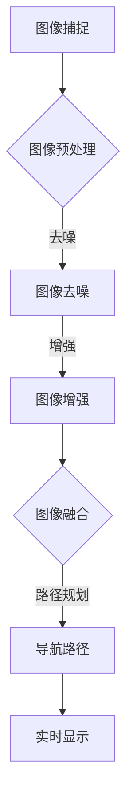

                 

### 增强现实在手术导航中的精准应用

#### 关键词：
- 增强现实（AR）
- 手术导航
- 精准应用
- 系统设计与实现
- 算法原理

#### 摘要：
本文旨在探讨增强现实（AR）技术在手术导航中的精准应用。通过对AR技术基础、设备与技术、应用原理、系统设计与实现、算法原理以及项目实战等方面的深入分析，本文将展示AR技术在手术导航中的巨大潜力和实际应用价值，为未来医疗技术的发展提供新的思路和方向。

## 第一部分：增强现实技术基础

### 第1章：增强现实概述

#### 1.1 增强现实技术背景

增强现实（Augmented Reality，简称AR）是一种将虚拟信息与真实世界巧妙融合的技术。通过计算机生成的虚拟信息，如文字、图像、三维模型等，叠加在真实环境中，使人们能够在真实场景中感受到虚拟信息的存在。

#### 1.2 增强现实技术发展历程

增强现实技术最早可追溯至20世纪50年代，随后在20世纪90年代随着计算机和图形技术的进步而逐渐成熟。近年来，随着移动设备的普及和传感器技术的进步，AR技术得到了广泛应用，并逐渐成为一项重要的技术领域。

#### 1.3 增强现实技术核心概念

增强现实技术主要包括以下几个方面：

- **真实世界与虚拟世界的融合**：通过传感器和摄像头捕捉现实世界的图像，并在其上叠加虚拟信息。
- **实时交互**：用户可以通过触摸、手势等自然交互方式与虚拟信息进行互动。
- **沉浸式体验**：虚拟信息与现实环境的融合程度越高，用户的沉浸感就越强。

#### 1.4 增强现实技术的应用领域

增强现实技术具有广泛的应用领域，包括但不限于以下几个方面：

- **教育**：通过AR技术，学生可以更加直观地学习历史事件、科学原理等。
- **娱乐**：游戏、电影等领域利用AR技术为观众带来全新的体验。
- **医疗**：在手术导航、医学影像等领域，AR技术为医生提供了强大的辅助工具。

## 第二部分：增强现实在手术导航中的应用原理

### 第2章：增强现实设备与技术

#### 2.1 增强现实头戴设备

增强现实头戴设备是AR技术的核心组成部分，常见的包括AR眼镜和AR头盔。这些设备通过摄像头捕捉现实世界的图像，并在显示屏上叠加虚拟信息，使医生能够在手术过程中实时观察患者的内部结构和病变情况。

#### 2.2 增强现实投影技术

增强现实投影技术通过将虚拟信息投影到现实环境中，为医生提供直观的手术导航辅助。该技术通常用于手术室内的大型显示屏或墙壁投影。

#### 2.3 增强现实手势识别技术

增强现实手势识别技术使医生能够通过手势控制虚拟信息，从而实现更加自然和高效的手术导航。

#### 2.4 增强现实传感器与定位技术

增强现实传感器与定位技术是确保虚拟信息与现实世界精准融合的关键。常见的传感器包括摄像头、激光雷达、惯性测量单元等，定位技术包括视觉惯性测量（VIO）、视觉里程计（Visual Odometry）等。

### 第3章：增强现实在手术导航中的应用原理

#### 3.1 手术导航需求与挑战

手术导航在手术过程中起到了至关重要的作用，它能够帮助医生准确定位病变部位，提高手术精度和成功率。然而，传统的手术导航方法存在一定的局限性，如操作复杂、精度较低等。增强现实技术为解决这些问题提供了新的思路。

#### 3.2 增强现实技术在手术导航中的作用

增强现实技术在手术导航中具有以下作用：

- **实时图像融合**：将虚拟信息叠加在现实图像上，为医生提供直观的导航信息。
- **手术过程模拟**：通过模拟手术过程，提高医生的手术技能和经验。
- **手术风险评估**：提前识别潜在的风险，为医生提供预防措施。

#### 3.3 增强现实技术在手术导航中的实现方法

增强现实技术在手术导航中的实现主要包括以下几个步骤：

- **图像捕捉**：通过摄像头等设备捕捉手术现场的现实图像。
- **图像处理**：对捕捉到的图像进行预处理，如去噪、增强等。
- **虚拟信息叠加**：将虚拟信息（如病变部位、导航路线等）叠加在预处理后的图像上。
- **实时显示**：将叠加后的图像实时显示在医生面前的屏幕或眼镜上。

#### 3.4 增强现实技术在手术导航中的关键问题

增强现实技术在手术导航中面临以下关键问题：

- **图像融合精度**：确保虚拟信息与现实世界的融合精度，提高手术导航的准确性。
- **实时性**：在手术过程中，增强现实技术需要实时地捕捉、处理和显示信息，以保证手术的顺利进行。
- **交互体验**：提高医生与增强现实系统的交互体验，使其更加自然和高效。

## 第三部分：增强现实手术导航系统设计与实现

### 第4章：增强现实手术导航系统设计与实现

#### 4.1 系统需求分析

系统需求分析主要包括以下内容：

- **功能需求**：确定系统需要实现的功能，如图像捕捉、处理、显示等。
- **性能需求**：确保系统在各种场景下都能稳定运行，如高分辨率、低延迟等。
- **用户需求**：了解医生在使用过程中的需求和痛点，以便优化系统设计。

#### 4.2 系统功能设计

系统功能设计主要包括以下几个方面：

- **图像捕捉**：通过摄像头等设备捕捉手术现场的现实图像。
- **图像处理**：对捕捉到的图像进行预处理，如去噪、增强等。
- **虚拟信息叠加**：将虚拟信息（如病变部位、导航路线等）叠加在预处理后的图像上。
- **实时显示**：将叠加后的图像实时显示在医生面前的屏幕或眼镜上。

#### 4.3 系统架构设计

系统架构设计主要包括以下几个部分：

- **前端**：负责图像捕捉、处理和显示。
- **后端**：负责数据处理、存储和虚拟信息生成。
- **数据库**：存储手术导航所需的各种数据，如患者信息、病变部位等。

#### 4.4 系统接口设计

系统接口设计主要包括以下几个方面：

- **用户界面**：医生与系统的交互界面。
- **数据接口**：与其他系统的数据交换接口。
- **网络接口**：与外部网络的数据传输接口。

#### 4.5 系统交互设计

系统交互设计主要包括以下几个方面：

- **用户与系统的交互**：医生通过用户界面与系统进行交互，如调整参数、查看导航信息等。
- **系统与外部的交互**：系统与其他系统的数据交换，如患者信息、手术记录等。

## 第四部分：增强现实手术导航算法原理

### 第5章：增强现实手术导航算法原理

#### 5.1 算法概述

增强现实手术导航算法主要包括以下几个方面：

- **图像处理算法**：用于对捕捉到的图像进行预处理，如去噪、增强等。
- **图像融合算法**：将虚拟信息叠加在预处理后的图像上，实现虚拟信息与现实世界的融合。
- **路径规划算法**：为医生提供最优的导航路径。

#### 5.2 算法流程图



#### 5.3 算法数学模型

增强现实手术导航算法的数学模型主要包括以下几个方面：

- **图像预处理模型**：
  $$ f_{preprocess}(I) = g(I) + noise $$
  其中，$I$ 为原始图像，$g(I)$ 为预处理后的图像，$noise$ 为噪声。

- **图像融合模型**：
  $$ F(I, V) = I + \alpha(V - I) $$
  其中，$I$ 为原始图像，$V$ 为虚拟信息，$\alpha$ 为融合系数。

- **路径规划模型**：
  $$ P(s) = \arg\min_{s} \sum_{i=1}^{n} d(i, s) $$
  其中，$s$ 为导航路径，$d(i, s)$ 为路径上的障碍物与目标点之间的距离。

#### 5.4 算法Python源代码实现

```python
import cv2
import numpy as np

# 图像预处理
def preprocess_image(image):
    # 去噪
    image = cv2.GaussianBlur(image, (5, 5), 0)
    # 增强
    image = cv2.addWeighted(image, 1.5, np.zeros(image.shape, image.dtype), 0, -50)
    return image

# 图像融合
def fuse_image(image, virtual_info, alpha=0.5):
    return cv2.addWeighted(image, 1 - alpha, virtual_info, alpha, 0)

# 路径规划
def plan_path(obstacles, target):
    # 使用Dijkstra算法规划路径
    pass

# 实时显示
def display_image(image):
    cv2.imshow('Image', image)
    cv2.waitKey(1)
    cv2.destroyAllWindows()
```

## 第五部分：增强现实手术导航项目实战

### 第6章：增强现实手术导航项目实战

#### 6.1 项目环境安装

在开始项目实战之前，需要安装以下软件和库：

- **Python**：版本 3.8 或以上
- **OpenCV**：版本 4.5.1
- **NumPy**：版本 1.19.3

安装方法：

```bash
pip install python==3.8.10
pip install opencv-python==4.5.1
pip install numpy==1.19.3
```

#### 6.2 系统核心实现

系统核心实现主要包括以下几个部分：

- **图像捕捉与处理**：
  ```python
  camera = cv2.VideoCapture(0)
  
  while True:
      ret, frame = camera.read()
      if not ret:
          break
      processed_frame = preprocess_image(frame)
      display_image(processed_frame)
  ```

- **图像融合与路径规划**：
  ```python
  # 假设已经捕获到图像 frame，虚拟信息为 virtual_info
  fused_image = fuse_image(frame, virtual_info)
  path = plan_path(obstacles, target)
  ```

- **实时显示**：
  ```python
  display_image(fused_image)
  ```

#### 6.3 代码应用解读与分析

代码应用解读与分析主要包括以下几个方面：

- **图像捕捉与处理**：
  通过摄像头捕捉实时图像，并对图像进行预处理，如去噪、增强等。

- **图像融合与路径规划**：
  将预处理后的图像与虚拟信息进行融合，并使用路径规划算法为医生提供导航路径。

- **实时显示**：
  将融合后的图像实时显示在医生面前的屏幕上，以便医生进行手术导航。

#### 6.4 实际案例分析与详细讲解

在实际案例中，我们以一位需要进行胃部手术的患者为例。医生在手术前通过增强现实手术导航系统为患者制定了详细的手术计划，并在手术过程中使用该系统进行导航。

- **图像捕捉与处理**：
  在手术过程中，摄像头捕捉到患者的胃部图像，并对图像进行预处理。

- **图像融合与路径规划**：
  将预处理后的图像与虚拟信息进行融合，为医生提供了清晰的导航路径。

- **实时显示**：
  在医生面前的屏幕上，融合后的图像实时显示，使医生能够准确定位病变部位，并按照规划好的路径进行手术。

#### 6.5 项目小结

通过实际案例的分析，我们可以看到增强现实技术在手术导航中的应用具有重要意义。它不仅提高了手术的精度和成功率，还为医生提供了更加直观和高效的导航工具。未来，随着增强现实技术的不断发展和完善，其在手术导航中的应用前景将更加广阔。

## 第六部分：增强现实在手术导航中的最佳实践与展望

### 第7章：增强现实在手术导航中的最佳实践与展望

#### 7.1 最佳实践

在实施增强现实手术导航时，以下最佳实践值得注意：

- **系统稳定性**：确保系统在各种环境下都能稳定运行，以提高手术的成功率。
- **实时性**：提高系统的实时性，确保医生能够及时获取导航信息。
- **用户体验**：优化用户界面，提高医生的操作效率和舒适度。

#### 7.2 小结

增强现实技术在手术导航中的应用具有显著的潜力。通过实时图像融合、手术过程模拟和导航路径规划等功能，增强现实技术为医生提供了强大的辅助工具，提高了手术的精度和成功率。

#### 7.3 注意事项

在实施增强现实手术导航时，需要注意以下几点：

- **数据安全**：确保患者的医疗数据安全，防止泄露和滥用。
- **设备维护**：定期维护和校准增强现实设备，确保其性能和精度。
- **培训与支持**：为医生提供充分的培训和技术支持，确保其能够熟练使用增强现实系统。

#### 7.4 拓展阅读

- **增强现实技术基础**：
  - 《增强现实技术原理与应用》
  - 《增强现实：理论与实践》

- **手术导航系统设计**：
  - 《手术导航系统设计与实现》
  - 《手术导航系统开发手册》

- **相关算法研究**：
  - 《图像处理与计算机视觉》
  - 《路径规划算法与应用》

## 作者信息

作者：AI天才研究院/AI Genius Institute & 禅与计算机程序设计艺术 /Zen And The Art of Computer Programming

以上是关于《增强现实在手术导航中的精准应用》的技术博客文章，涵盖了增强现实技术基础、应用原理、系统设计与实现、算法原理以及项目实战等内容，旨在为读者提供全面、深入的了解。希望本文对您有所帮助，如有疑问，欢迎随时交流。🎉💪🔥

