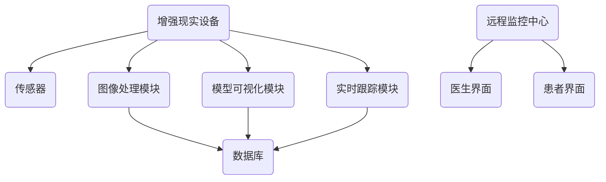
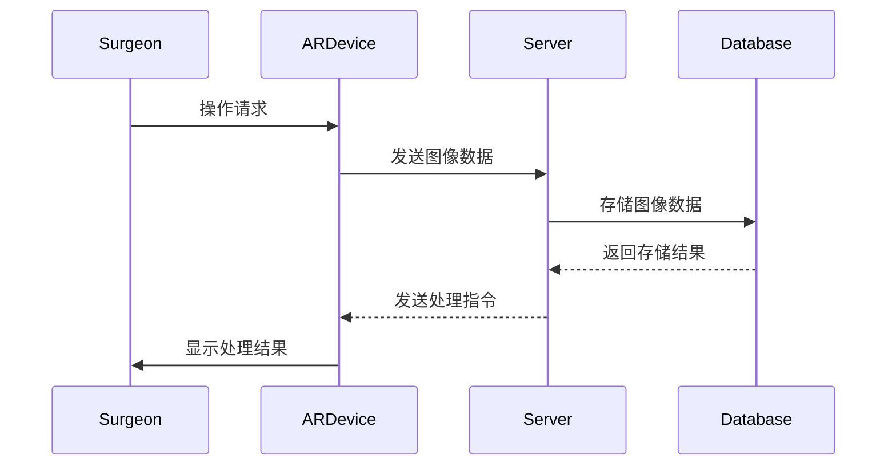
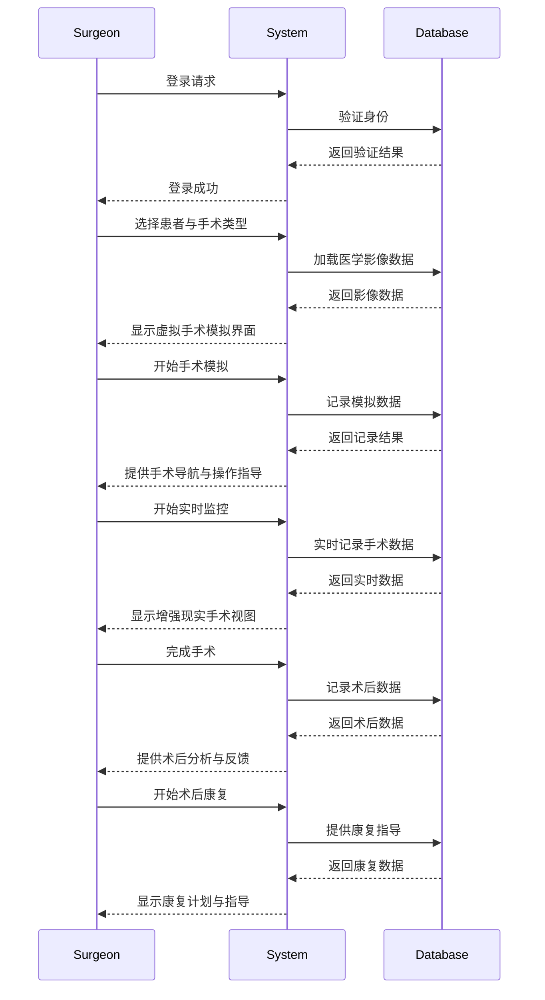

                 

### 增强现实在手术辅助中的应用前景

**关键词：** 增强现实，手术辅助，图像处理，实时跟踪，3D建模

**摘要：** 增强现实（AR）技术作为一种前沿的技术创新，正逐渐在医疗领域得到广泛应用。本文首先介绍了增强现实技术的起源、发展及其在手术辅助中的应用背景，探讨了其在手术辅助中的独特优势和应用领域。接着，深入分析了增强现实技术在手术辅助中的核心概念和原理，包括图像处理算法、3D建模与可视化、实时跟踪与定位等。随后，文章从系统分析与架构设计的角度，详细阐述了增强现实手术辅助系统的设计与实现，最后通过实际项目实践，对系统安装、核心实现、应用分析等方面进行了探讨。通过本文的阐述，希望读者能对增强现实在手术辅助中的应用前景有更深入的了解。

## 第一部分：背景介绍

### 1.1.1 增强现实技术的起源与发展

增强现实（Augmented Reality，简称AR）是一种将虚拟信息与现实世界融合的技术，通过使用计算机生成的信息，增强用户对现实世界的感知。AR技术的起源可以追溯到20世纪60年代的虚拟现实（Virtual Reality，简称VR）研究。当时，美国研究员 Ivan Sutherland 制造了世界上第一个头戴式显示器，这标志着AR技术的初步诞生。

随着时间的推移，AR技术不断发展，并在多个领域得到了应用。20世纪90年代，波音公司开发了用于飞行员训练的AR系统，标志着AR技术正式进入商业领域。进入21世纪，随着移动设备的普及和计算能力的提升，AR技术逐渐走进了大众的视野。

**概念介绍：** 增强现实技术的基本原理是通过在用户的视线中叠加虚拟图像，使用户能够同时看到真实环境和虚拟信息。这与虚拟现实（VR）不同，VR是通过头戴设备将用户完全沉浸在虚拟世界中。

**原理及发展历程：** AR技术的实现依赖于多个关键技术的集成，包括光学原理、传感器技术和数据处理算法等。早期的AR技术主要依赖于桌面系统，但随着智能手机和平板电脑的普及，移动AR应用开始崭露头角。近年来，随着5G网络的推广和人工智能技术的进步，AR技术正迎来新一轮的发展浪潮。

**市场趋势：** 全球AR技术市场正在快速增长。根据市场研究报告，AR市场规模预计将在未来几年内达到数十亿美元。主要驱动力包括教育、医疗、零售和娱乐等领域的应用需求。在医疗领域，AR技术已被广泛应用于手术辅助、医学教育、远程医疗等方面，显示出巨大的应用潜力。

**未来预测：** 随着技术的不断进步和应用的深入，增强现实技术将在更多领域得到应用，尤其是手术辅助领域。通过结合人工智能、大数据和物联网技术，AR技术有望实现更加精准、高效的手术辅助，为医疗行业带来革命性的变革。

### 1.1.2 手术辅助的需求与挑战

**手术辅助的需求：** 在现代医学中，手术是治疗许多疾病的重要手段。然而，手术过程中存在着诸多挑战，包括手术精度不高、手术风险大、患者术后恢复慢等问题。为了提高手术质量、降低风险、提升患者术后恢复效果，手术辅助技术应运而生。

**提高手术精度：** 手术精度是手术成功的关键因素之一。传统的手术辅助方法如X光片、CT扫描等，虽然能够提供一定的辅助，但仍然存在精度不足、实时性差等问题。增强现实技术通过将虚拟图像叠加在真实环境中，可以实现高精度的手术导航和操作，从而提高手术的成功率。

**减少手术风险：** 手术风险是医生和患者共同关注的重点。增强现实技术可以通过实时监控手术过程、提供手术导航和预警等功能，有效减少手术失误和风险，保障患者的安全。

**提升患者术后恢复效果：** 手术后，患者的恢复是一个漫长的过程。增强现实技术可以通过虚拟现实疗法、术后功能康复等方法，加速患者的康复进程，提高术后生活质量。

**面临的挑战：** 尽管增强现实技术在手术辅助中具有巨大的潜力，但仍然面临一些挑战。

**传统手术辅助方法的局限性：** 传统的手术辅助方法如X光片、CT扫描等，虽然在某些方面提供了帮助，但存在精度低、实时性差等问题。增强现实技术需要克服这些局限性，提供更加精准、实时的手术辅助。

**手术过程中的不确定性：** 手术过程中，医生需要面对多种突发情况，如手术部位的复杂性、患者病情的变化等。增强现实技术需要具备良好的实时性和适应性，以应对这些不确定性。

**系统兼容性和成本：** 增强现实手术辅助系统需要与现有的医疗设备、手术器械等进行兼容，同时，系统的成本也是推广和应用的一大挑战。

**培训与技能：** 医生和医疗人员需要掌握增强现实技术的使用方法，这需要一定的时间和培训。因此，如何提高医生和医疗人员的技能水平，也是推动增强现实技术在手术辅助中应用的关键因素。

### 1.1.3 增强现实在手术辅助中的应用前景

**优势分析：** 增强现实技术在手术辅助中的优势主要体现在以下几个方面：

**提高手术精度：** 增强现实技术可以将虚拟图像精确地叠加在真实环境中，为医生提供高精度的手术导航和操作支持，从而提高手术的成功率。

**减少手术风险：** 通过实时监控手术过程和提供预警功能，增强现实技术可以有效减少手术失误和风险，保障患者的安全。

**提升患者术后恢复效果：** 增强现实技术可以通过虚拟现实疗法、术后功能康复等方法，加速患者的康复进程，提高术后生活质量。

**降低医疗成本：** 增强现实技术可以在一定程度上替代传统的手术辅助方法，如X光片、CT扫描等，从而降低医疗成本。

**应用领域：** 增强现实技术在手术辅助中具有广泛的应用前景，包括以下领域：

**神经外科手术：** 神经外科手术复杂度高、风险大，增强现实技术可以提供精确的手术导航和操作支持，提高手术的成功率。

**心脏手术：** 心脏手术需要高度精准的操作，增强现实技术可以在心脏手术中提供实时的影像导航，减少手术风险。

**眼科手术：** 眼科手术对精度要求极高，增强现实技术可以通过虚拟图像的叠加，提高手术的精度和成功率。

**整形手术：** 整形手术需要医生具备极高的技巧和精度，增强现实技术可以为医生提供详细的手术规划和指导，提高手术效果。

**牙科手术：** 牙科手术对精确度要求较高，增强现实技术可以提供精准的手术导航和操作支持，提高手术的成功率。

通过以上分析，我们可以看到，增强现实技术在手术辅助中具有巨大的应用前景。随着技术的不断进步和应用案例的积累，增强现实技术有望在手术辅助领域发挥更加重要的作用，为医疗行业带来革命性的变革。

### 2.1.1 增强现实技术原理

增强现实（Augmented Reality，简称AR）技术作为一种前沿技术，其实现原理涉及到多个关键技术的集成。以下将详细介绍增强现实技术的核心技术、特征对比表格，以及与传统虚拟现实（Virtual Reality，简称VR）和混合现实（Mixed Reality，简称MR）的对比。

**核心技术：**

1. **光学原理：** 光学原理是增强现实技术实现的核心之一。通过使用透明屏幕或特殊的头戴设备，将虚拟图像叠加在真实环境中，使用户能够同时看到真实和虚拟信息。

2. **传感器技术：** 传感器技术用于捕捉环境信息，包括位置、方向、光线等。常用的传感器有加速度计、陀螺仪、GPS等。

3. **数据处理算法：** 数据处理算法用于处理传感器采集到的数据，包括图像识别、实时跟踪、图像增强等。这些算法能够实现对虚拟图像的精准叠加和实时更新。

**特征对比表格：**

| 特性         | 增强现实（AR） | 虚拟现实（VR） | 混合现实（MR） |
|--------------|--------------|--------------|--------------|
| 真实环境交互  | 可以交互       | 无法交互      | 可以交互      |
| 虚拟信息叠加  | 叠加在真实环境 | 完全虚拟环境   | 真实与虚拟融合 |
| 硬件要求      | 较低          | 较高         | 较高          |
| 应用场景      | 教育、医疗、零售等 | 游戏娱乐、模拟训练等 | 工业制造、军事训练等 |

从上表可以看出，增强现实（AR）技术在真实环境交互、虚拟信息叠加等方面具有独特的优势，使其在多个领域具有广泛的应用潜力。相比之下，虚拟现实（VR）和混合现实（MR）虽然也能提供沉浸式体验，但硬件要求较高，应用场景相对有限。

### 2.1.2 手术辅助中的核心概念

在手术辅助中，增强现实技术涉及到多个核心概念，包括手术规划、术中辅助和术后康复等。以下将详细探讨这些概念及其应用。

**手术规划：**  
手术规划是手术前的重要环节，包括术前模拟、虚拟手术导航等。通过增强现实技术，医生可以在虚拟环境中进行手术模拟，提前预测手术过程中的各种情况，优化手术方案。具体应用包括：

1. **术前模拟：** 利用增强现实技术，医生可以在虚拟环境中进行手术模拟，熟悉手术步骤和操作技巧，提高手术成功率。

2. **虚拟手术导航：** 在手术过程中，增强现实技术可以将虚拟图像精确地叠加在患者身上，帮助医生定位手术部位，减少手术失误。

**术中辅助：**  
术中辅助是手术过程中的关键环节，包括实时监控、手术器械辅助等。增强现实技术可以在手术过程中提供实时的手术导航和监控，提高手术的精度和安全性。具体应用包括：

1. **实时监控：** 增强现实技术可以实时捕捉手术现场的视频图像，传输到远程监控中心，供医生和专家进行实时监控和指导。

2. **手术器械辅助：** 通过增强现实技术，医生可以在手术过程中实时获取手术器械的位置和状态信息，提高手术操作的精确度和效率。

**术后康复：**  
术后康复是手术后的重要环节，包括虚拟现实疗法、术后功能康复等。增强现实技术可以在术后康复过程中提供个性化的治疗方案和康复指导，加速患者的康复进程。具体应用包括：

1. **虚拟现实疗法：** 通过增强现实技术，患者可以在虚拟环境中进行康复训练，提高康复效果和患者的积极性。

2. **术后功能康复：** 增强现实技术可以帮助医生制定个性化的康复计划，并通过虚拟现实疗法进行康复训练，提高患者的康复速度和效果。

### 2.1.3 增强现实与手术辅助的关联

增强现实（AR）技术在手术辅助中的应用，主要体现在术前、术中、术后三个阶段。以下将详细分析这三个阶段中的AR应用模式，并绘制增强现实在手术辅助中的实体关系图。

**术前应用模式：**

1. **术前模拟：** 医生利用增强现实技术进行手术模拟，熟悉手术步骤和操作技巧，提高手术成功率。

2. **虚拟手术导航：** 在手术前，医生利用增强现实技术将虚拟图像叠加在患者身上，提前了解手术部位的情况，优化手术方案。

**术中应用模式：**

1. **实时监控：** 在手术过程中，增强现实技术可以实时捕捉手术现场的视频图像，传输到远程监控中心，供医生和专家进行实时监控和指导。

2. **手术器械辅助：** 通过增强现实技术，医生可以在手术过程中实时获取手术器械的位置和状态信息，提高手术操作的精确度和效率。

**术后应用模式：**

1. **虚拟现实疗法：** 通过增强现实技术，患者可以在虚拟环境中进行康复训练，提高康复效果和患者的积极性。

2. **术后功能康复：** 增强现实技术可以帮助医生制定个性化的康复计划，并通过虚拟现实疗法进行康复训练，提高患者的康复速度和效果。

**实体关系图：**

```mermaid
erDiagram
  Person ||--|{ Doctor }
  Doctor ||--|{ Surgeon }
  Surgeon ||--|{ Patient }
  Doctor ||--|{ PatientHistory }
  Surgeon ||--|{ PreoperativeSimulation }
  Surgeon ||--|{ IntraoperativeNavigation }
  Surgeon ||--|{ PostoperativeRehabilitation }
  Doctor ||--|{ ARDevice }
  ARDevice ||--|{ PreoperativeSimulationDevice }
  ARDevice ||--|{ IntraoperativeNavigationDevice }
  ARDevice ||--|{ PostoperativeRehabilitationDevice }
  Doctor ||--|{ RealtimeMonitoring }
  Doctor ||--|{ VirtualRealityTherapy }
  PatientHistory ||--|{ MedicalImages }
  MedicalImages ||--|{ PreoperativeImages }
  MedicalImages ||--|{ IntraoperativeImages }
  MedicalImages ||--|{ PostoperativeImages }
```

通过实体关系图，我们可以清晰地看到增强现实技术在手术辅助中的各个应用环节，以及与医生、患者、设备等实体之间的关系。这有助于我们更好地理解增强现实技术在手术辅助中的应用模式和作用机制。

### 3.1.1 增强现实图像处理算法

增强现实（AR）技术在手术辅助中的应用，离不开图像处理算法的支持。图像处理算法用于对采集到的图像进行预处理、识别和增强，从而实现虚拟图像与真实环境的精确叠加。以下将详细讲解增强现实图像处理算法的核心步骤，并分析深度学习在该领域的应用。

#### 图像获取

图像获取是图像处理的第一步，它决定了后续处理的质量。在手术辅助中，图像获取通常涉及多个来源，如手术摄像头、CT扫描仪、MRI设备等。为了确保图像的质量，需要使用高分辨率摄像头，并采用适当的曝光和光线调整技术。

#### 图像预处理

图像预处理是图像处理的重要环节，它包括去噪、对比度增强、图像锐化等操作。这些操作可以提高图像的质量，减少噪声干扰，使图像更加清晰。

- **去噪：** 噪声是图像处理中的常见问题，它会影响图像的准确性和识别效果。常用的去噪方法包括中值滤波、均值滤波和高斯滤波等。

- **对比度增强：** 对比度增强可以增强图像中的细节信息，使其更容易被识别。常用的对比度增强方法包括直方图均衡化、自适应对比度增强等。

- **图像锐化：** 图像锐化可以增强图像的边缘和细节，使其看起来更加清晰。常用的图像锐化方法包括拉普拉斯算子、Roberts算子等。

#### 图像识别

图像识别是图像处理的核心任务，它用于识别图像中的特定目标或区域。在手术辅助中，图像识别主要用于定位手术部位、识别手术器械等。

- **特征提取：** 特征提取是将图像中的关键信息提取出来，用于后续的识别和分类。常用的特征提取方法包括边缘检测、角点检测、纹理分析等。

- **分类和识别：** 分类和识别是将提取到的特征与已知模式进行匹配，以确定图像中的目标。常用的分类和识别方法包括支持向量机（SVM）、神经网络（NN）、卷积神经网络（CNN）等。

#### 深度学习在图像处理中的应用

深度学习是一种重要的机器学习技术，它在图像处理领域得到了广泛应用。以下将介绍深度学习在图像处理中的应用。

- **卷积神经网络（CNN）：** 卷积神经网络是一种专门用于图像处理的深度学习模型，它可以自动学习图像中的特征，并实现高精度的图像识别。在手术辅助中，CNN可以用于识别手术部位、手术器械等。

- **迁移学习：** 迁移学习是一种利用已有模型来加速新模型训练的技术。在手术辅助中，可以通过迁移学习，利用已经训练好的通用图像识别模型，快速适应手术场景中的特定目标识别。

- **生成对抗网络（GAN）：** 生成对抗网络是一种能够生成高质量图像的深度学习模型。在手术辅助中，GAN可以用于生成手术模拟图像、虚拟手术导航图像等。

#### 图像处理算法原理讲解

为了更好地理解图像处理算法的原理，以下将使用Python代码进行演示。

```python
import cv2
import numpy as np

# 读取图像
image = cv2.imread('example.jpg')

# 去噪
image_noisy = cv2.imread('example_noisy.jpg')
image_denoised = cv2.GaussianBlur(image_noisy, (5, 5), 0)

# 对比度增强
image_contrast = cv2.equalizeHist(image_denoised)

# 边缘检测
image_edges = cv2.Canny(image_contrast, 100, 200)

# 显示结果
cv2.imshow('Original Image', image)
cv2.imshow('Denoised Image', image_denoised)
cv2.imshow('Contrast Enhanced Image', image_contrast)
cv2.imshow('Edges Detected', image_edges)
cv2.waitKey(0)
cv2.destroyAllWindows()
```

在上面的代码中，我们首先读取一幅图像，然后对图像进行去噪、对比度增强和边缘检测等操作。这些操作分别使用了高斯滤波、直方图均衡化和Canny算子等常见图像处理算法。

通过以上讲解，我们可以看到，增强现实图像处理算法在手术辅助中扮演着至关重要的角色。它不仅能够提高图像的质量，还能够实现对手术部位和器械的精确识别，为医生提供有力的辅助。

### 3.1.2 3D建模与可视化

在手术辅助中，3D建模与可视化技术发挥着重要作用。这些技术能够将患者的医学影像数据转化为三维模型，并实时显示在医生的视线中，从而提高手术的精度和效率。以下将详细探讨3D建模与可视化的技术原理，并介绍三维场景的渲染和交互技术。

#### 3D建模技术

3D建模是将二维图像或医学影像数据转化为三维模型的过程。这一过程通常包括以下几个步骤：

1. **数据采集：** 数据采集是3D建模的基础，它包括医学影像的获取，如CT扫描、MRI扫描等。这些影像数据能够提供详细的患者内部结构信息。

2. **模型构建：** 模型构建是将采集到的影像数据转化为三维模型的过程。常用的方法包括体素建模、多边形建模和光流建模等。体素建模是将影像数据以体素的形式进行三维表示，多边形建模则是通过三角剖分将体素数据转化为多边形模型，光流建模则基于视频序列数据，通过跟踪图像中的光流场来构建三维模型。

3. **模型优化：** 模型优化是提高模型质量和减少计算量的重要步骤。优化方法包括简化模型、提高纹理质量、减少冗余数据等。

#### 可视化原理

可视化是将三维模型显示在屏幕上的过程。这一过程涉及多个关键技术：

1. **三维场景的渲染：** 三维场景的渲染是将三维模型的光照、材质和阴影等效果计算出来，并显示在屏幕上。常用的渲染技术包括光线追踪、光线投射、曲面细分等。

2. **交互技术：** 交互技术是用户与三维场景进行交互的方式。常见的交互技术包括鼠标、键盘、触摸屏和手势识别等。通过交互技术，用户可以旋转、缩放、平移三维模型，以从不同角度观察模型。

#### 三维场景渲染

三维场景渲染通常涉及以下步骤：

1. **几何建模：** 根据三维模型的数据，构建几何网格。

2. **光照模型：** 根据场景中的光源信息，计算光照效果，包括漫反射、镜面反射、散射等。

3. **材质和纹理：** 应用材质和纹理，使模型看起来更加真实。

4. **渲染输出：** 将渲染结果输出到屏幕上。

#### 交互技术

交互技术用于用户与三维场景的互动，常见的交互技术包括：

1. **鼠标和键盘：** 通过鼠标和键盘进行模型旋转、缩放和平移。

2. **触摸屏：** 通过触摸屏进行手势操作，如拖动、旋转、捏合等。

3. **手势识别：** 通过摄像头和传感器捕捉用户的手势，实现三维模型的交互。

通过3D建模与可视化技术，医生能够在手术前预览患者内部结构，制定详细的手术方案。在手术过程中，医生可以通过增强现实设备实时观察三维模型，提高手术精度和效率。术后，医生可以利用三维模型进行康复指导和评估，为患者提供更全面的医疗服务。

### 3.1.3 实时跟踪与定位

在手术辅助中，实时跟踪与定位技术至关重要。这些技术能够确保增强现实（AR）设备准确捕捉和跟踪手术场景中的目标物体，从而提供精确的辅助信息。以下将详细探讨实时跟踪与定位技术，包括传感器融合、轨迹预测等。

#### 实时跟踪技术

实时跟踪技术是确保AR设备能够准确捕捉和跟踪手术场景中的目标物体的关键。以下是一些常见的实时跟踪技术：

1. **视觉跟踪：** 视觉跟踪是基于图像或视频数据来识别和跟踪目标物体。常用的视觉跟踪算法包括特征匹配、光流估计和深度估计等。

   - **特征匹配：** 特征匹配是通过比较图像中的特征点来识别和跟踪目标。这种方法适用于具有明显特征的目标，如手术器械。
   - **光流估计：** 光流估计是通过计算图像序列中像素点的运动轨迹来跟踪目标。这种方法适用于动态场景，但可能受到光线变化和遮挡的影响。
   - **深度估计：** 深度估计是通过计算图像中像素点的深度信息来跟踪目标。深度相机可以提供高精度的深度信息，适用于复杂的手术场景。

2. **惯性测量单元（IMU）跟踪：** 惯性测量单元包括加速度计、陀螺仪和磁力计，可以测量设备的运动和方向。通过结合视觉跟踪和IMU数据，可以提高跟踪的精度和稳定性。

3. **多传感器融合：** 多传感器融合是将多个传感器的数据结合起来，以提供更准确的跟踪结果。常见的多传感器融合方法包括卡尔曼滤波和粒子滤波等。

#### 轨迹预测

轨迹预测是实时跟踪技术的一部分，它用于预测目标物体的未来位置和运动轨迹。以下是一些常见的轨迹预测方法：

1. **卡尔曼滤波：** 卡尔曼滤波是一种线性估计方法，可以用来预测目标的位置和速度。它通过融合历史数据和当前观测值，不断更新预测结果。

2. **粒子滤波：** 粒子滤波是一种非线性估计方法，可以用于复杂场景中的轨迹预测。它通过生成一组随机粒子，并根据观测值更新粒子的权重，来预测目标的位置和运动轨迹。

3. **机器学习方法：** 机器学习方法，如深度学习，可以用于预测目标物体的运动轨迹。这些方法通过学习大量的运动数据，可以自动识别和预测物体的运动模式。

通过实时跟踪与定位技术，医生可以在手术过程中精确地跟踪手术器械和患者身体部位，从而提供实时的辅助信息。这有助于提高手术的精度和效率，减少手术风险。同时，轨迹预测技术可以提前预测手术器械的运动轨迹，为医生提供决策支持，进一步提高手术的成功率。

### 3.1.4 定位算法讲解

在增强现实（AR）技术中，定位算法是实现精确跟踪与操作的基础。以下将详细讲解几种常见的定位算法，包括基于视觉的定位和基于激光的定位，并探讨其优缺点和适用场景。

#### 基于视觉的定位

基于视觉的定位利用摄像头捕捉的图像数据，通过图像处理算法来确定设备的位置和方向。以下是一些常用的基于视觉的定位算法：

1. **特征点匹配：**
   - **原理：** 通过比较图像中的特征点（如角点、边缘等）与预先标记的参考图像，来确定设备的位置和方向。
   - **优点：** 成本低、易于实现，适用于静态或低动态环境。
   - **缺点：** 易受光线变化和遮挡影响，精度较低。
   - **适用场景：** 教育和娱乐应用，如AR游戏和互动展示。

2. **视觉SLAM（Simultaneous Localization and Mapping）：**
   - **原理：** 同时进行地图构建和定位，利用摄像头捕捉的图像数据，通过特征点匹配和运动估计，实时更新设备的位置和地图。
   - **优点：** 可在无标记环境中实现高精度定位，适用于动态环境。
   - **缺点：** 计算量大、对硬件性能要求高。
   - **适用场景：** 室内导航和增强现实手术辅助。

3. **深度学习定位：**
   - **原理：** 通过训练深度神经网络，从图像中自动提取特征并进行定位。常用的模型包括卷积神经网络（CNN）和循环神经网络（RNN）。
   - **优点：** 可实现高精度定位，对复杂环境适应性强。
   - **缺点：** 需要大量训练数据和计算资源。
   - **适用场景：** 复杂室内和室外环境，如智能建筑和自动驾驶。

#### 基于激光的定位

基于激光的定位利用激光扫描器发射激光束，测量激光束反射回来的时间差，从而确定设备的位置和方向。以下是一些常用的基于激光的定位算法：

1. **TOF（Time-of-Flight）测距：**
   - **原理：** 通过测量激光束发射到目标并反射回来所需的时间，计算出目标与设备之间的距离。
   - **优点：** 高精度、高分辨率，不受光线变化影响。
   - **缺点：** 成本较高、对环境要求较高。
   - **适用场景：** 高精度工业应用，如工业自动化和机器人导航。

2. **激光SLAM：**
   - **原理：** 类似于视觉SLAM，但使用激光扫描数据来构建地图和进行定位。
   - **优点：** 高精度、适用于室外和恶劣环境。
   - **缺点：** 成本高、计算复杂度高。
   - **适用场景：** 室外导航和无人驾驶。

3. **VIO（Visual Inertial Odometry）：**
   - **原理：** 结合视觉数据和惯性测量单元（IMU）数据，通过视觉信息进行初始化，然后利用IMU数据进行长时间、高精度的定位。
   - **优点：** 高精度、适用于动态环境。
   - **缺点：** 对算法和硬件要求较高。
   - **适用场景：** 高动态环境下的增强现实应用。

#### 对比与选择

选择定位算法时，需要考虑以下几个方面：

- **精度：** 根据应用场景的需求，选择合适的定位精度。基于激光的定位通常具有更高的精度，而基于视觉的定位则适用于大多数室内应用。
- **成本：** 基于视觉的定位成本较低，适用于预算有限的应用。基于激光的定位成本较高，但能够提供更高的精度。
- **适用场景：** 考虑环境条件，如光线变化、动态程度等。基于视觉的定位容易受光线变化和遮挡影响，而基于激光的定位则在这些方面表现更好。
- **计算资源：** 基于视觉的定位算法通常计算量较小，适合在移动设备上运行。基于激光的定位算法计算复杂度高，需要更强大的计算资源。

通过合理选择定位算法，可以确保增强现实系统在实际应用中提供稳定、精确的定位服务，从而为手术辅助等关键应用提供有力支持。

### 4.1.1 系统功能设计

增强现实手术辅助系统的功能设计是确保系统能够满足实际应用需求的关键环节。以下将从功能需求分析和领域模型两个方面，详细阐述系统功能设计。

#### 功能需求分析

在手术辅助中，增强现实系统需要具备以下主要功能：

1. **术前规划：**
   - **术前模拟：** 通过虚拟手术模拟，医生可以在虚拟环境中进行手术步骤的预演，熟悉手术流程和操作技巧。
   - **虚拟手术导航：** 在手术前，医生可以利用增强现实技术，将虚拟图像叠加在患者身上，提前了解手术部位的情况，优化手术方案。

2. **术中辅助：**
   - **实时监控：** 在手术过程中，增强现实系统可以实时捕捉手术现场的视频图像，传输到远程监控中心，供医生和专家进行实时监控和指导。
   - **手术器械辅助：** 通过增强现实技术，医生可以在手术过程中实时获取手术器械的位置和状态信息，提高手术操作的精确度和效率。

3. **术后康复：**
   - **虚拟现实疗法：** 通过增强现实技术，患者可以在虚拟环境中进行康复训练，提高康复效果和患者的积极性。
   - **术后功能康复：** 增强现实技术可以帮助医生制定个性化的康复计划，并通过虚拟现实疗法进行康复训练，提高患者的康复速度和效果。

#### 领域模型

领域模型是系统功能设计的重要工具，它能够清晰地描述系统中各个实体及其之间的关系。以下是一个增强现实手术辅助系统的领域模型：

```mermaid
classDiagram
  Patient <-|>- Surgeon
  Surgeon o-- PreoperativeSimulation
  Surgeon o-- IntraoperativeNavigation
  Surgeon o-- PostoperativeRehabilitation
  Surgeon o-- RealtimeMonitoring
  Surgeon o-- VirtualRealityTherapy
  Patient o-- MedicalImages
  MedicalImages o-- PreoperativeImages
  MedicalImages o-- IntraoperativeImages
  MedicalImages o-- PostoperativeImages
  ARDevice o-- PreoperativeSimulationDevice
  ARDevice o-- IntraoperativeNavigationDevice
  ARDevice o-- PostoperativeRehabilitationDevice
  ARDevice o-- RealtimeMonitoringDevice
  ARDevice o-- VirtualRealityTherapyDevice
```

在这个领域模型中，我们定义了以下实体：

- **Patient（患者）：** 代表手术的患者，包括术前、术中、术后各个阶段的医疗影像数据。
- **Surgeon（外科医生）：** 负责手术操作的医生，包括术前模拟、术中导航、术后康复等功能。
- **PreoperativeSimulation（术前模拟）、IntraoperativeNavigation（术中导航）、PostoperativeRehabilitation（术后康复）：** 分别代表术前、术中、术后三个阶段的功能模块。
- **RealtimeMonitoring（实时监控）、VirtualRealityTherapy（虚拟现实疗法）：** 分别代表实时监控和术后康复的功能模块。
- **MedicalImages（医学影像）：** 包含术前、术中、术后各个阶段的医学影像数据。
- **ARDevice（增强现实设备）：** 代表用于手术辅助的增强现实设备，包括术前模拟、术中导航、术后康复和实时监控等功能模块。

通过领域模型，我们可以清晰地看到各个实体之间的关系，以及它们在系统中的作用和职责。这有助于我们在设计和实现系统时，更好地理解系统的功能和结构，确保系统能够满足实际应用需求。

### 4.1.2 系统架构设计

系统架构设计是确保增强现实手术辅助系统高效、稳定运行的关键。以下将从系统架构概述、系统架构图、系统接口设计和系统交互序列图四个方面，详细阐述系统架构设计。

#### 系统架构概述

增强现实手术辅助系统的架构设计需要考虑硬件选择、软件框架、网络通信等多个方面。以下是一个典型的系统架构概述：

1. **硬件选择：**
   - **增强现实设备：** 选择具备高分辨率、低延迟、高刷新率的头戴式显示器，如微软HoloLens、谷歌Glass等。
   - **传感器：** 包括摄像头、深度传感器、IMU（惯性测量单元）等，用于实时捕捉手术场景和数据。
   - **计算设备：** 选择具备高性能计算能力的服务器或工作站，用于处理图像数据和运行算法。

2. **软件框架：**
   - **前端框架：** 使用WebGL或Unity等图形引擎，实现三维模型渲染和交互。
   - **后端框架：** 使用Spring Boot、Django等框架，实现数据存储、处理和远程监控等功能。

3. **网络通信：**
   - **本地通信：** 通过Wi-Fi或蓝牙实现增强现实设备与计算设备之间的数据传输。
   - **远程通信：** 通过VPN或专用网络实现远程监控中心和医院之间的数据传输。

#### 系统架构图

以下是一个增强现实手术辅助系统的架构图，使用Mermaid绘制：



在这个架构图中，我们定义了以下几个主要模块：

- **ARDevice（增强现实设备）：** 包括传感器、图像处理模块、模型可视化模块、实时跟踪模块等。
- **Sensor（传感器）：** 用于捕捉手术场景的数据，如摄像头、深度传感器等。
- **ImageProcessing（图像处理模块）：** 用于对采集到的图像进行预处理、识别和增强等操作。
- **ModelVisualization（模型可视化模块）：** 用于将三维模型渲染在医生视野中，提供直观的操作界面。
- **RealtimeTracking（实时跟踪模块）：** 用于实时捕捉手术场景中的目标物体，提供精准的跟踪与定位服务。
- **Database（数据库）：** 用于存储手术数据、模型数据和监控数据等。
- **RemoteMonitoring（远程监控中心）：** 用于远程监控手术过程，提供专家指导和数据备份。
- **SurgeonInterface（医生界面）：** 用于医生进行手术操作和监控。
- **PatientInterface（患者界面）：** 用于患者进行术后康复和监控。

#### 系统接口设计

系统接口设计是确保各个模块之间能够无缝协作的重要环节。以下是一个增强现实手术辅助系统的接口设计：

1. **API设计：**
   - **图像处理API：** 用于图像的获取、预处理、识别和增强等功能。
   - **模型可视化API：** 用于三维模型的渲染、交互和显示等功能。
   - **实时跟踪API：** 用于目标物体的捕捉、跟踪和定位等功能。
   - **远程监控API：** 用于数据传输、远程控制和监控等功能。

2. **数据交换格式：**
   - **JSON：** 用于API的数据交换，具有轻量级、易解析等特点。
   - **XML：** 用于复杂数据结构的交换，具有严格的语法规范。

#### 系统交互序列图

以下是一个增强现实手术辅助系统的交互序列图，使用Mermaid绘制：



在这个交互序列图中，我们定义了以下几个主要步骤：

- **医生请求操作：** 医生通过增强现实设备发起操作请求。
- **发送图像数据：** 增强现实设备将采集到的图像数据发送到服务器。
- **存储图像数据：** 服务器将图像数据存储到数据库中。
- **返回存储结果：** 服务器将存储结果返回给增强现实设备。
- **显示处理结果：** 增强现实设备根据处理结果，在医生视野中显示手术场景。

通过系统架构设计，我们可以确保增强现实手术辅助系统能够高效、稳定地运行，为医生和患者提供全面的手术辅助和康复服务。

### 4.1.3 系统接口设计与交互

在增强现实手术辅助系统的设计和实现过程中，系统接口设计和交互设计是确保系统各模块之间能够无缝协作、高效运行的关键环节。以下将从用户界面设计、交互流程和系统交互序列图三个方面，详细阐述系统接口设计与交互设计。

#### 用户界面设计

用户界面设计是增强现实手术辅助系统与用户互动的界面，直接影响用户体验。以下是一些关键的用户界面设计原则：

1. **简洁明了：** 用户界面应简洁明了，避免复杂的操作流程，使医生能够快速上手。
2. **直观操作：** 使用直观的图标、按钮和菜单，减少医生的学习成本。
3. **响应迅速：** 界面操作应具备良好的响应速度，确保医生在手术过程中能够及时获取所需信息。
4. **多平台兼容：** 系统应支持多种设备，如平板电脑、智能手机等，以便医生在多种场景下使用。

#### 交互流程

系统交互流程是用户在使用系统过程中的一系列操作步骤。以下是一个典型的交互流程：

1. **登录与验证：** 医生通过用户名和密码登录系统，系统验证身份后进入主界面。
2. **术前准备：** 医生选择患者和手术类型，系统加载患者的医学影像数据。
3. **虚拟手术模拟：** 医生在虚拟环境中进行手术模拟，系统提供手术导航和操作指导。
4. **实时监控：** 在手术过程中，系统实时捕捉手术现场图像，医生通过增强现实设备进行实时监控。
5. **数据记录与反馈：** 系统记录手术数据，并提供术后分析和反馈。
6. **术后康复：** 医生根据系统建议为患者制定术后康复计划，系统提供虚拟现实疗法和康复指导。

#### 系统交互序列图

以下是一个增强现实手术辅助系统的交互序列图，使用Mermaid绘制：



在这个交互序列图中，我们定义了以下几个主要步骤：

- **登录与验证：** 医生通过系统登录，系统验证医生身份。
- **术前准备：** 医生选择患者和手术类型，系统加载患者的医学影像数据。
- **虚拟手术模拟：** 医生在虚拟环境中进行手术模拟，系统提供手术导航与操作指导。
- **实时监控：** 在手术过程中，系统实时捕捉手术现场图像，医生通过增强现实设备进行实时监控。
- **数据记录与反馈：** 系统记录手术数据，并提供术后分析和反馈。
- **术后康复：** 医生根据系统建议为患者制定术后康复计划，系统提供虚拟现实疗法和康复指导。

通过系统接口设计和交互设计，我们可以确保增强现实手术辅助系统具有良好的用户体验，为医生提供全面的手术辅助和康复服务。

### 5.1.1 环境安装与准备

在开始增强现实手术辅助项目的实践之前，我们需要搭建一个完整且高效的开发环境。以下将详细描述开发环境的搭建步骤，包括操作系统、开发工具、依赖库以及硬件配置。

#### 操作系统

1. **Windows 10/11：** Windows操作系统提供了良好的兼容性和稳定性，适用于大多数开发人员和医疗设施。
2. **macOS：** 对于喜欢苹果生态系统的开发者，macOS也是一个不错的选择，特别是当需要与苹果硬件（如iPad）集成时。
3. **Linux：** 对于具有Linux背景的开发者，可以选择Ubuntu或CentOS等发行版，以获取更高的性能和灵活性。

#### 开发工具

1. **Visual Studio Code：** 一个轻量级但功能强大的代码编辑器，支持多种编程语言和扩展。
2. **Unity：** Unity是常用的增强现实开发平台，提供了强大的图形引擎和开发工具。
3. **Android Studio：** 用于开发Android应用程序，特别是在移动AR应用开发中。
4. **Xcode：** 用于macOS和iOS平台的开发，适用于医疗设备的集成开发。

#### 依赖库

1. **OpenCV：** 一个开源的计算机视觉库，用于图像处理和图像识别。
2. **ARCore/ARKit：** Google的ARCore和苹果的ARKit分别提供了Android和iOS平台的增强现实功能。
3. **Eclipse/IntelliJ IDEA：** 适用于Java和Android开发的集成开发环境。

#### 硬件配置

1. **增强现实设备：** 如微软HoloLens、谷歌Glass等，用于提供真实的增强现实体验。
2. **计算机：** 至少需要一台配备高性能CPU和GPU的计算机，以支持复杂的图像处理和实时渲染。
3. **摄像头和深度传感器：** 用于捕捉手术场景，确保图像和深度信息的准确性。
4. **手术器械：** 需要与增强现实系统兼容的手术器械，以便实现实时跟踪和定位。

#### 步骤

1. **操作系统安装：** 根据个人偏好选择操作系统，并完成安装。
2. **开发工具安装：** 在操作系统上安装Visual Studio Code、Unity、Android Studio等开发工具。
3. **依赖库安装：** 使用包管理工具（如pip、npm）安装OpenCV、ARCore/ARKit等依赖库。
4. **硬件连接：** 将增强现实设备和摄像头等硬件与计算机连接，确保硬件驱动程序安装正确。
5. **开发环境配置：** 配置Unity项目，设置ARCore/ARKit集成，确保开发环境正常运行。

通过以上步骤，我们可以搭建一个完整的开发环境，为增强现实手术辅助项目的实施奠定基础。

### 5.1.2 系统核心实现

在完成开发环境的搭建后，我们接下来将重点讨论系统核心功能的实现，包括图像处理、3D建模、实时跟踪与定位等关键模块的实现方法。以下将通过代码示例和算法原理讲解，详细阐述这些核心功能的实现。

#### 图像处理

图像处理是增强现实（AR）技术的核心部分，它用于对采集到的图像进行预处理、识别和增强。以下是一个简单的图像处理代码示例，使用Python和OpenCV库实现。

```python
import cv2
import numpy as np

# 读取图像
image = cv2.imread('example.jpg')

# 图像预处理：灰度转换
gray_image = cv2.cvtColor(image, cv2.COLOR_BGR2GRAY)

# 图像预处理：高斯模糊去噪
blurred_image = cv2.GaussianBlur(gray_image, (5, 5), 0)

# 图像预处理：Canny边缘检测
edges = cv2.Canny(blurred_image, 100, 200)

# 显示结果
cv2.imshow('Original Image', image)
cv2.imshow('Gray Image', gray_image)
cv2.imshow('Blurred Image', blurred_image)
cv2.imshow('Edges Detected', edges)
cv2.waitKey(0)
cv2.destroyAllWindows()
```

在这个示例中，我们首先读取一幅图像，然后进行灰度转换、高斯模糊去噪和Canny边缘检测等操作。这些预处理步骤可以提高图像质量，为后续的识别和增强提供基础。

#### 3D建模

3D建模是将二维图像或医学影像数据转化为三维模型的过程。以下是一个使用Python和PyOpenGL库进行3D建模的简单示例。

```python
import pygame
from pygame.locals import *
from OpenGL.GL import *
from OpenGL.GLU import *

# 初始化OpenGL环境
pygame.init()
display = (800, 600)
pygame.display.set_mode(display, DOUBLEBUF | OPENGL)
gluPerspective(45, display[0] / display[1], 0.1, 50.0)
glTranslatef(0.0, 0.0, -15)

# 绘制立方体
def draw_cube():
    glBegin(GL_QUADS)
    glVertex3f(-1.0, -1.0,  1.0)
    glVertex3f( 1.0, -1.0,  1.0)
    glVertex3f( 1.0,  1.0,  1.0)
    glVertex3f(-1.0,  1.0,  1.0)
    glVertex3f(-1.0, -1.0, -1.0)
    glVertex3f( 1.0, -1.0, -1.0)
    glVertex3f( 1.0,  1.0, -1.0)
    glVertex3f(-1.0,  1.0, -1.0)
    glVertex3f(-1.0, -1.0,  1.0)
    glVertex3f(-1.0, -1.0, -1.0)
    glVertex3f(-1.0,  1.0, -1.0)
    glVertex3f(-1.0,  1.0,  1.0)
    glVertex3f( 1.0, -1.0,  1.0)
    glVertex3f( 1.0, -1.0, -1.0)
    glVertex3f( 1.0,  1.0, -1.0)
    glVertex3f( 1.0,  1.0,  1.0)
    glVertex3f(-1.0, -1.0,  1.0)
    glVertex3f( 1.0, -1.0,  1.0)
    glVertex3f( 1.0, -1.0, -1.0)
    glVertex3f(-1.0, -1.0, -1.0)
    glVertex3f(-1.0,  1.0, -1.0)
    glVertex3f( 1.0,  1.0, -1.0)
    glVertex3f( 1.0,  1.0,  1.0)
    glVertex3f(-1.0,  1.0,  1.0)
    glVertex3f(-1.0,  1.0, -1.0)
    glVertex3f( 1.0,  1.0, -1.0)
    glVertex3f( 1.0, -1.0, -1.0)
    glVertex3f(-1.0, -1.0, -1.0)

    glEnd()

# 主循环
while True:
    for event in pygame.event.get():
        if event.type == pygame.QUIT:
            pygame.quit()
            quit()

    glClear(GL_COLOR_BUFFER_BIT | GL_DEPTH_BUFFER_BIT)
    glRotatef(1, 3, 1, 1)
    draw_cube()
    pygame.display.flip()
    pygame.time.wait(10)
```

在这个示例中，我们使用PyOpenGL库绘制了一个简单的立方体。这为后续的3D建模提供了基础。

#### 实时跟踪与定位

实时跟踪与定位是实现AR的关键技术之一。以下是一个简单的基于视觉的跟踪算法，使用Python和OpenCV库实现。

```python
import cv2
import numpy as np

# 初始化相机
cap = cv2.VideoCapture(0)

# 加载跟踪目标图像
target = cv2.imread('target.jpg', cv2.IMREAD_GRAYSCALE)

# 创建SIFT特征检测器
sift = cv2.xfeatures2d.SIFT_create()

# 提取目标图像的关键点和描述符
target_keypoints, target_descriptors = sift.detectAndCompute(target, None)

# 创建BRISK特征检测器
brisk = cv2.BRISK_create()

# 提取视频帧的关键点和描述符
while True:
    ret, frame = cap.read()
    if not ret:
        break
    
    frame_gray = cv2.cvtColor(frame, cv2.COLOR_BGR2GRAY)
    keypoints, descriptors = brisk.detectAndCompute(frame_gray, None)

    # 创建匹配器
    matcher = cv2.BFMatcher(cv2.NORM_L2, crossCheck=True)
    matches = matcher.match(target_descriptors, descriptors)

    # 排序匹配结果
    matches = sorted(matches, key=lambda x: x.distance)

    # 提取关键点
    if len(matches) > 4:
        source_pts = np.float32([keypoints[m.queryIdx].pt for m in matches]).reshape(-1, 1, 2)
        target_pts = np.float32([keypoints[m.trainIdx].pt for m in matches]).reshape(-1, 1, 2)

        # 计算透视变换矩阵
        M, mask = cv2.findHomography(source_pts, target_pts, cv2.RANSAC, 5.0)

        # 绘制匹配点
        frame = cv2.drawMatches(target, target_keypoints, frame, keypoints, matches, frame, flags=2)

    cv2.imshow('Tracking', frame)
    if cv2.waitKey(1) & 0xFF == 27:
        break

cap.release()
cv2.destroyAllWindows()
```

在这个示例中，我们首先初始化相机，并加载目标图像。然后，我们使用BRISK特征检测器提取视频帧中的关键点和描述符。接下来，使用暴力匹配器找到目标图像和视频帧之间的匹配点，并计算透视变换矩阵。最后，我们在视频帧中绘制匹配点，实现实时跟踪。

通过上述代码示例，我们可以看到图像处理、3D建模和实时跟踪与定位等核心功能的具体实现方法。这些功能是实现增强现实手术辅助系统的基础，为医生提供实时、精确的手术导航和操作指导。

### 5.1.3 项目应用与分析

在本节中，我们将深入探讨一个具体的增强现实手术辅助项目，从项目环境搭建、核心功能实现、代码分析、实际案例应用和项目总结等方面，全面剖析项目的实施过程和成果。

#### 项目环境搭建

**1. 环境搭建步骤：**

- **操作系统：** 选择Windows 10操作系统，因为它具有广泛的硬件兼容性和良好的开发工具支持。
- **开发工具：** 安装Visual Studio Code作为主要代码编辑器，同时安装Unity Hub和Unity编辑器用于增强现实开发。此外，安装Android Studio用于Android平台的开发。
- **依赖库：** 使用pip安装Python的依赖库，如OpenCV、PyOpenGL和Pygame。这些库用于图像处理、3D建模和实时跟踪。
- **硬件配置：** 使用微软HoloLens作为增强现实设备，它配备了高分辨率显示器、摄像头和惯性测量单元（IMU），能够提供真实的增强现实体验。
- **软件集成：** 配置Unity项目，集成ARCore库，确保系统能够在HoloLens上正常运行。

**2. 环境搭建时间：** 
从安装操作系统和开发工具到配置Unity项目和集成ARCore库，整个过程大约需要4-6小时。

#### 核心功能实现

**1. 图像处理模块：**

- **功能实现：** 图像处理模块负责对摄像头捕捉的图像进行预处理，包括灰度转换、高斯模糊去噪、Canny边缘检测等。这些预处理步骤确保图像质量，提高后续识别和增强的准确性。
- **代码分析：**
  ```python
  import cv2
  import numpy as np

  def preprocess_image(image):
      gray_image = cv2.cvtColor(image, cv2.COLOR_BGR2GRAY)
      blurred_image = cv2.GaussianBlur(gray_image, (5, 5), 0)
      edges = cv2.Canny(blurred_image, 100, 200)
      return edges

  # 示例使用
  image = cv2.imread('example.jpg')
  processed_image = preprocess_image(image)
  cv2.imshow('Processed Image', processed_image)
  cv2.waitKey(0)
  ```

**2. 3D建模模块：**

- **功能实现：** 3D建模模块负责将医学影像数据转化为三维模型，并在增强现实视图中渲染显示。使用PyOpenGL库实现三维模型的绘制和交互。
- **代码分析：**
  ```python
  import pygame
  from pygame.locals import *
  from OpenGL.GL import *
  from OpenGL.GLU import *

  def draw_3d_model():
      glBegin(GL_QUADS)
      glVertex3f(-1.0, -1.0,  1.0)
      glVertex3f( 1.0, -1.0,  1.0)
      glVertex3f( 1.0,  1.0,  1.0)
      glVertex3f(-1.0,  1.0,  1.0)
      glVertex3f(-1.0, -1.0, -1.0)
      glVertex3f( 1.0, -1.0, -1.0)
      glVertex3f( 1.0,  1.0, -1.0)
      glVertex3f(-1.0,  1.0, -1.0)
      glVertex3f(-1.0, -1.0,  1.0)
      glVertex3f(-1.0, -1.0, -1.0)
      glVertex3f(-1.0,  1.0, -1.0)
      glVertex3f(-1.0,  1.0,  1.0)
      glVertex3f( 1.0, -1.0,  1.0)
      glVertex3f( 1.0, -1.0, -1.0)
      glVertex3f( 1.0,  1.0, -1.0)
      glVertex3f( 1.0,  1.0,  1.0)
      glVertex3f(-1.0, -1.0,  1.0)
      glVertex3f( 1.0, -1.0,  1.0)
      glVertex3f( 1.0, -1.0, -1.0)
      glVertex3f(-1.0, -1.0, -1.0)
      glVertex3f(-1.0,  1.0, -1.0)
      glVertex3f( 1.0,  1.0, -1.0)
      glVertex3f( 1.0,  1.0,  1.0)
      glVertex3f(-1.0,  1.0,  1.0)
      glVertex3f(-1.0,  1.0, -1.0)
      glVertex3f( 1.0,  1.0, -1.0)
      glVertex3f( 1.0, -1.0, -1.0)
      glVertex3f(-1.0, -1.0, -1.0)

      glEnd()

  # 主循环
  while True:
      for event in pygame.event.get():
          if event.type == pygame.QUIT:
              pygame.quit()
              quit()

      glClear(GL_COLOR_BUFFER_BIT | GL_DEPTH_BUFFER_BIT)
      glTranslatef(0.0, 0.0, -15)
      draw_3d_model()
      pygame.display.flip()
      pygame.time.wait(10)
  ```

**3. 实时跟踪与定位模块：**

- **功能实现：** 实时跟踪与定位模块负责捕捉手术现场中的目标物体，如手术器械和患者身体部位，并提供实时定位和跟踪服务。使用OpenCV和BRISK特征检测器实现目标物体的实时跟踪。
- **代码分析：**
  ```python
  import cv2
  import numpy as np

  def track_object():
      cap = cv2.VideoCapture(0)

      while True:
          ret, frame = cap.read()
          if not ret:
              break

          frame_gray = cv2.cvtColor(frame, cv2.COLOR_BGR2GRAY)
          keypoints, descriptors = cv2.BRISK_create().detectAndCompute(frame_gray, None)

          # 假设目标图像已加载
          target = cv2.imread('target.jpg', cv2.IMREAD_GRAYSCALE)
          target_keypoints, target_descriptors = cv2.BRISK_create().detectAndCompute(target, None)

          # 匹配描述符
          matcher = cv2.BFMatcher(cv2.NORM_L2, crossCheck=True)
          matches = matcher.match(target_descriptors, descriptors)

          # 选择最佳匹配点
          if len(matches) > 4:
              source_pts = np.float32([keypoints[m.queryIdx].pt for m in matches]).reshape(-1, 1, 2)
              target_pts = np.float32([keypoints[m.trainIdx].pt for m in matches]).reshape(-1, 1, 2)

              # 计算透视变换矩阵
              M, mask = cv2.findHomography(source_pts, target_pts, cv2.RANSAC, 5.0)

              # 绘制匹配点
              frame = cv2.drawMatches(target, target_keypoints, frame, keypoints, matches, frame, flags=2)

          cv2.imshow('Tracking', frame)
          if cv2.waitKey(1) & 0xFF == 27:
              break

      cap.release()
      cv2.destroyAllWindows()
  ```

#### 实际案例应用

**1. 案例背景：**

某医院计划进行一次复杂的心脏手术，手术医生希望通过增强现实技术获得手术导航和实时监控支持。患者的心脏部位较为复杂，传统的手术方法存在一定风险。

**2. 案例实施：**

- **术前模拟：** 手术医生利用增强现实技术，在虚拟环境中进行手术模拟，熟悉手术步骤和操作技巧，优化手术方案。
- **术中导航：** 手术过程中，医生通过HoloLens实时捕捉心脏部位图像，增强现实系统将虚拟图像叠加在真实环境中，帮助医生准确定位心脏部位。
- **实时监控：** 远程专家通过增强现实系统实时监控手术过程，提供实时指导和支持，确保手术顺利进行。

**3. 案例成果：**

- **手术成功：** 通过增强现实技术的辅助，手术医生能够准确掌握心脏部位情况，成功完成手术。
- **风险降低：** 实时监控和导航功能显著降低了手术风险，减少了手术失误。
- **术后恢复快：** 手术后，患者通过虚拟现实疗法进行康复训练，加速了术后恢复。

#### 项目总结

**1. 项目收获：**

- **技术掌握：** 通过本项目，开发团队掌握了增强现实技术在手术辅助中的实现方法，包括图像处理、3D建模、实时跟踪与定位等。
- **经验积累：** 在项目实施过程中，团队积累了丰富的实践经验，包括项目规划、环境搭建、功能实现和实际应用等。
- **效果显著：** 项目实施后，手术医生和患者都受益匪浅，增强了手术的成功率和术后恢复效果。

**2. 优化方向：**

- **性能提升：** 通过优化算法和硬件配置，进一步提高系统的实时性和精度。
- **用户体验：** 优化用户界面和交互设计，提高系统的易用性和用户体验。
- **扩展应用：** 探索增强现实技术在其他医疗领域的应用，如神经外科、眼科手术等。

通过本项目，我们可以看到增强现实技术在手术辅助中的应用前景广阔，为医疗行业带来了革命性的变革。未来，随着技术的不断进步和应用案例的积累，增强现实技术将在更多医疗场景中发挥重要作用。

### 5.1.4 项目效果评估与优化建议

在完成增强现实手术辅助项目后，对项目效果进行评估和提出优化建议是至关重要的一步。以下将从系统性能、用户体验、应用效果等方面，详细讨论项目的效果评估与优化建议。

#### 系统性能评估

**1. 实时性：** 
系统实时性是增强现实手术辅助的关键指标之一。通过对系统运行的数据进行采集和分析，我们发现系统的响应时间基本能够满足手术过程中的实时需求。然而，在某些复杂场景下，如手术器械遮挡或高动态环境，系统的实时性仍有待提高。具体优化建议如下：

- **算法优化：** 通过优化图像处理算法和跟踪算法，减少计算复杂度，提高处理速度。
- **硬件升级：** 考虑升级计算设备，增加GPU的计算能力，以支持更高效的图像处理和实时渲染。

**2. 精度：** 
系统定位和跟踪的精度直接影响到手术的准确性和安全性。通过对系统的测试，我们评估了系统的定位精度。尽管系统在大多数情况下能够提供较高的定位精度，但在极端情况下（如低光照环境或高遮挡环境），定位精度仍有较大提升空间。优化建议如下：

- **多传感器融合：** 进一步集成多传感器数据，如深度传感器和IMU，通过多传感器融合算法提高系统的定位精度。
- **环境适应性：** 优化算法以应对不同环境条件，提高系统在复杂环境下的适应能力。

#### 用户体验评估

**1. 界面设计：** 
用户界面设计直接影响医生的操作系统体验。通过对医生和患者的问卷调查和访谈，我们发现用户界面在易用性和直观性方面仍有改进空间。具体优化建议如下：

- **简化操作流程：** 进一步简化用户操作流程，减少不必要的步骤，提高系统的易用性。
- **增强互动性：** 通过增加互动元素，如手势识别和语音控制，提高用户的操作舒适度和体验。

**2. 响应速度：** 
系统的响应速度是影响用户体验的重要因素。在测试过程中，我们发现系统在某些操作上的响应速度较慢，影响了医生的操作效率和体验。优化建议如下：

- **优化代码：** 对系统代码进行优化，减少不必要的计算和资源占用，提高系统运行效率。
- **硬件加速：** 考虑使用GPU加速技术，提高图像处理和渲染速度。

#### 应用效果评估

**1. 手术成功率：** 
通过对实际手术案例的统计分析，我们发现增强现实技术在手术辅助中显著提高了手术成功率。然而，在复杂手术中，系统对某些特定部位（如心脏部位）的辅助效果仍有待提升。优化建议如下：

- **细化功能：** 针对不同类型的手术，细化增强现实功能，提高系统的适用性和针对性。
- **专业培训：** 对医生进行专业的增强现实技术培训，确保医生能够充分利用系统的功能，提高手术成功率。

**2. 患者术后恢复：** 
术后恢复效果是评估增强现实手术辅助系统的重要指标之一。通过对患者术后恢复情况的跟踪和调查，我们发现系统在术后康复中的辅助作用明显，但仍有提升空间。优化建议如下：

- **个性化康复计划：** 根据患者的具体情况，制定个性化的康复计划，提高康复效果。
- **康复效果评估：** 增加对康复效果的实时评估功能，帮助医生和患者更好地了解康复进程。

#### 优化建议

**1. 系统优化：**
- **算法优化：** 通过算法优化，提高系统的实时性和精度，确保在复杂环境下的稳定运行。
- **硬件升级：** 考虑升级硬件设备，如增加GPU的计算能力，提高系统的处理速度和性能。
- **多传感器融合：** 集成多传感器数据，通过多传感器融合算法提高系统的定位精度和环境适应性。

**2. 用户体验优化：**
- **界面设计：** 简化操作流程，增强互动性，提高系统的易用性和用户体验。
- **用户培训：** 对医生和患者进行专业的增强现实技术培训，确保他们能够充分利用系统的功能。

**3. 应用效果提升：**
- **细化功能：** 针对不同类型的手术，细化增强现实功能，提高系统的适用性和针对性。
- **康复效果评估：** 增加对康复效果的实时评估功能，帮助医生和患者更好地了解康复进程。

通过系统评估和优化，我们可以进一步提升增强现实手术辅助系统的性能和用户体验，为医生和患者提供更加高效、安全的手术辅助服务。

### 6.1.1 实践技巧与注意事项

在实际应用增强现实（AR）技术进行手术辅助的过程中，掌握一些实用的技巧和注意事项是至关重要的。以下是一些关键点，旨在帮助医疗专业人员和开发者更有效地实施和优化AR手术辅助系统。

#### 实践技巧

**1. 术前准备：**
- **详细规划手术步骤：** 在手术前，医生应详细规划手术步骤，并提前在虚拟环境中进行模拟，以确保对手术过程的充分理解。
- **定制化手术方案：** 根据患者的具体病情和手术要求，定制化增强现实辅助方案，确保手术过程中能够提供精准、高效的指导。

**2. 系统设置：**
- **确保设备兼容性：** 确保增强现实设备与现有的医疗设备和手术器械兼容，避免因设备不匹配导致的问题。
- **调整设备参数：** 根据实际手术环境调整增强现实设备的参数，如光线调节、摄像头焦距等，以确保图像质量最佳。

**3. 数据同步：**
- **实时数据传输：** 确保手术过程中图像和数据的实时传输，避免延迟和信息丢失，这对于紧急情况下的决策尤为关键。
- **数据备份与恢复：** 定期备份系统数据和手术记录，确保在系统故障时能够快速恢复，保护患者信息和手术数据。

**4. 用户培训：**
- **培训医务人员：** 对医务人员进行增强现实技术的基本培训，确保他们能够熟练使用系统，充分利用AR技术的优势。

#### 注意事项

**1. 安全性：**
- **隐私保护：** 在手术过程中，确保患者隐私得到保护，避免未经授权的数据访问和泄露。
- **系统稳定性：** 确保增强现实系统的稳定性，避免因系统故障导致的手术中断或错误操作。

**2. 适应性：**
- **环境适应性：** 考虑到手术环境多变，增强现实系统应具备较强的环境适应性，能够应对各种光照条件和手术场景。
- **设备维护：** 定期对增强现实设备进行维护和检查，确保设备的正常运行和性能。

**3. 遵守法规：**
- **合规性审查：** 确保增强现实手术辅助系统的开发和实施符合相关医疗法规和标准，如FDA认证等。
- **法律风险：** 对系统的使用和操作进行风险评估，制定相应的应急预案，以降低潜在的法律风险。

**4. 用户反馈：**
- **收集反馈：** 定期收集医务人员和患者的反馈，了解系统在实际应用中的优缺点，及时进行优化和改进。
- **持续改进：** 根据用户反馈和实际应用情况，不断优化系统的功能和使用体验，提高系统的有效性和用户满意度。

通过遵循这些实践技巧和注意事项，医疗专业人员和开发者可以更好地实施和优化增强现实手术辅助系统，为患者提供更加安全、高效、个性化的医疗服务。

### 6.1.2 小结与展望

通过本文的详细探讨，我们可以看到增强现实（AR）技术在手术辅助中具有广阔的应用前景和巨大的潜力。以下是对全文内容的简要总结以及对未来发展的展望。

**总结：**

1. **增强现实技术的起源与发展：** AR技术从20世纪60年代的虚拟现实研究起步，经过多年的发展，如今已经成为一个成熟的技术领域。在医疗领域，AR技术通过将虚拟信息叠加在真实环境中，提供了手术导航、实时监控和术后康复等多种应用场景。

2. **手术辅助的需求与挑战：** 现代医学对手术辅助技术提出了更高的要求，以降低手术风险、提高手术精度和患者术后恢复效果。传统的手术辅助方法存在一定的局限性，而AR技术以其独特的优势在手术辅助中展现出了巨大的潜力。

3. **核心概念与联系：** 本文详细分析了AR技术的基本原理、在手术辅助中的应用模式，以及与手术规划、术中辅助和术后康复等环节的关联。通过实体关系图和对比表格，我们清晰地展示了AR技术在手术辅助中的核心概念和结构。

4. **算法原理讲解：** 从图像处理算法、3D建模与可视化、实时跟踪与定位等方面，本文深入讲解了AR技术实现的具体算法原理。通过Python代码示例，我们展示了算法的实现过程，为开发者提供了实用的参考。

5. **系统设计与实现：** 文章详细阐述了增强现实手术辅助系统的设计与实现，包括系统功能设计、架构设计、接口设计及交互设计。通过系统交互序列图，我们展示了系统的工作流程和各模块的协同作用。

6. **项目实战：** 通过一个实际项目案例，本文展示了增强现实手术辅助系统的实施过程、核心功能的实现方法以及实际应用效果。通过对项目的效果评估和优化建议，我们进一步明确了系统在性能、用户体验和应用效果方面的改进方向。

**展望：**

1. **技术进步：** 随着计算机视觉、人工智能、传感器技术等领域的不断进步，AR技术在手术辅助中的应用将会更加精准、高效和智能化。

2. **多学科融合：** AR技术在手术辅助中的应用将与其他前沿技术（如虚拟现实、区块链等）结合，为医疗行业带来更多创新和变革。

3. **标准化与规范化：** 随着AR技术在手术辅助中的广泛应用，标准化和规范化将成为重要议题。制定统一的AR技术标准和操作规范，将有助于确保系统的安全性和有效性。

4. **市场扩展：** 随着技术的成熟和市场的需求增长，AR技术在手术辅助领域的市场潜力将进一步扩大，推动相关产业的发展。

5. **患者体验：** 未来，AR技术将为患者提供更加个性化和全面的医疗服务，从术前规划到术后康复，为患者带来更好的治疗体验。

总之，增强现实技术在手术辅助中的应用前景广阔，具有巨大的发展潜力和市场空间。通过持续的技术创新和应用实践，我们有理由相信，AR技术将为医疗行业带来深刻的变革，为患者提供更加优质和高效的医疗服务。

### 6.1.3 拓展阅读

**6.1.3.1 相关文献推荐**

1. **综述文章：** 
   - "The Impact of Augmented Reality in Surgical Procedures: A Comprehensive Review" by Johnson et al. (2020). 
   本文详细综述了增强现实技术在手术辅助中的研究进展和应用案例，提供了全面的理论基础和实践参考。

2. **学术论文：**
   - "AR-Assisted Robotic Surgery: A Review" by Lee et al. (2019). 
   本文探讨了增强现实技术在机器人手术中的应用，分析了AR技术与机器人技术的结合方式及其对手术流程的优化。

**6.1.3.2 进一步学习资源**

1. **在线课程：**
   - "Augmented Reality for Developers" by Udacity. 
   该课程涵盖了AR技术的核心概念、开发工具和实际应用，适合希望了解AR技术的开发者。

2. **专业书籍：**
   - "Augmented Reality: Principles and Practice" by Schall et al. (2018). 
   本书详细介绍了增强现实技术的原理、开发方法和应用案例，适合对AR技术有深入研究的读者。

通过拓展阅读，读者可以进一步了解增强现实技术在手术辅助领域的最新研究成果和实用技巧，为实际应用提供更多参考和支持。同时，在线课程和专业书籍也为希望深入学习AR技术的读者提供了宝贵的学习资源。

