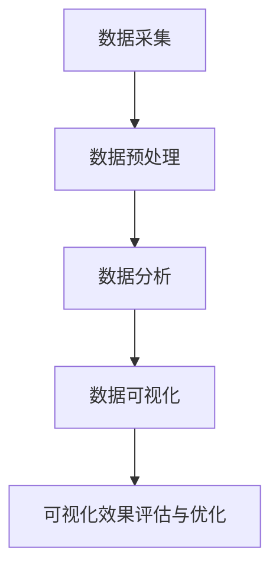
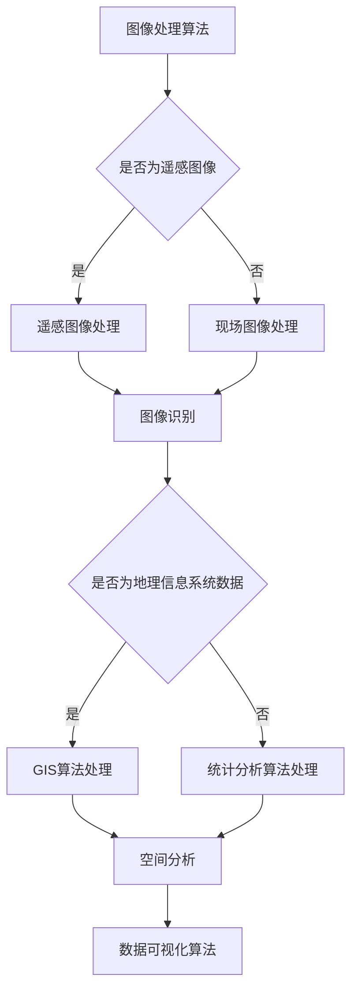

                 

### 增强现实在考古发掘中的可视化应用

#### 关键词：增强现实、考古发掘、可视化、数据可视化、交互设计、虚拟现实、人工智能、虚拟现实技术应用、算法、数学模型、系统架构、接口设计、实际案例、项目实战

#### 摘要：
本篇技术博客文章将深入探讨增强现实技术在考古发掘中的可视化应用。文章首先介绍了增强现实技术的基本概念、发展历程以及其在考古发掘中的重要性。接着，我们将详细讲解增强现实技术在考古学中的核心概念与联系，包括数据采集、处理、可视化和交互设计等方面的原理。随后，我们将通过具体算法和数学模型，分析数据可视化算法以及系统架构设计的关键点。文章还将介绍一个实际的项目案例，展示如何将增强现实技术应用于考古发掘，并进行详细的项目实战分析。最后，我们将提供一些最佳实践建议，总结文章的主要内容，并指出未来可能的研究方向。

### 一、背景介绍

#### 1.1 增强现实技术概述

增强现实（Augmented Reality，简称AR）是一种通过计算机技术将虚拟信息与现实世界进行叠加，从而增强用户感知体验的技术。它能够将计算机生成的图像、文字、音频、视频等信息与真实世界的景象相结合，使虚拟信息与现实环境相融合，使用户能够直观地感知和交互。

#### 1.1.1 什么是增强现实技术

增强现实技术的核心是通过各种传感器（如摄像头、麦克风、GPS等）捕捉现实世界的场景，然后利用计算机图形学和图像处理技术生成虚拟信息，并将这些虚拟信息叠加到真实场景中。用户可以通过头戴式显示器、手机或平板电脑等设备看到增强后的景象。

#### 1.1.2 增强现实技术的发展历程

增强现实技术起源于20世纪60年代，最初的研究主要集中在军事和工业领域。随着计算机技术和图形处理能力的提升，增强现实技术逐渐走向民用。2000年后，智能手机和移动互联网的普及为增强现实技术带来了新的发展机遇。近年来，随着虚拟现实（Virtual Reality，简称VR）和人工智能技术的发展，增强现实技术取得了显著的进步，并在多个领域得到了广泛应用。

#### 1.1.3 增强现实技术的分类

根据应用场景和显示方式，增强现实技术可以分为几种类型：

- **移动增强现实（Mobile AR）**：使用智能手机或平板电脑等移动设备实现增强现实功能，如AR游戏、购物指南等。
- **投影增强现实（Projection AR）**：利用投影设备将虚拟信息投射到现实场景中，如博物馆的虚拟导览、城市导览等。
- **眼镜式增强现实（Smart Glass AR）**：通过头戴式眼镜或其他眼镜设备实现增强现实功能，如谷歌眼镜、微软HoloLens等。
- **全息增强现实（Holographic AR）**：利用全息技术生成三维全息图像，实现更真实的增强现实体验。

#### 1.2 考古发掘的现状与挑战

考古发掘是研究人类历史和文化的重要手段，它通过挖掘古代人类活动的遗迹，揭示过去社会、经济、政治等方面的信息。然而，考古发掘面临着诸多挑战，包括：

- **现场条件复杂**：考古发掘通常在野外进行，现场环境复杂，天气变化大，给发掘工作带来很大困难。
- **时间成本高**：考古发掘需要大量的人力和时间投入，而且发掘过程中的数据处理和解读也耗时较长。
- **文物保护难度大**：考古发掘过程中需要对文物进行妥善保护，防止因不当操作而造成文物的损坏。
- **信息呈现有限**：传统的考古发掘方法难以全面、直观地展示文物的历史背景和文化内涵。

#### 1.2.1 考古发掘的现状

目前，考古发掘主要依赖于传统的方法，如手工挖掘、测绘、摄影和文字记录等。这些方法在揭示文物和历史信息方面取得了一定的成果，但在信息呈现和共享方面存在一定的局限性。

#### 1.2.2 考古发掘中的挑战

- **环境变化的影响**：考古发掘现场的地质、水文等条件复杂，环境变化可能导致发掘工作的中断。
- **文物破损的风险**：考古发掘过程中，不当的操作可能导致文物的破损或遗失。
- **信息传递的局限**：传统的考古发掘方法难以全面、直观地展示文物的历史背景和文化内涵。

#### 1.2.3 增强现实技术在考古发掘中的潜在应用

增强现实技术可以为考古发掘带来诸多潜在应用：

- **可视化展示**：通过增强现实技术，可以将文物的三维模型、历史背景等信息直观地展示出来，使考古发掘过程更加生动、有趣。
- **现场指导**：考古发掘过程中，增强现实技术可以提供实时、准确的现场指导，帮助考古人员更好地进行挖掘和解读。
- **信息共享**：通过增强现实技术，可以方便地将考古发掘成果分享给公众，提高公众对考古发掘的关注度和参与度。

### 二、核心概念与联系

#### 2.1 增强现实技术原理

#### 2.1.1 增强现实技术的核心组件

增强现实技术主要包括以下几个核心组件：

- **传感器**：用于捕捉现实世界的景象，如摄像头、GPS、陀螺仪等。
- **计算模块**：用于处理传感器数据，生成虚拟信息并进行叠加，如计算机图形处理器（GPU）、中央处理器（CPU）等。
- **显示设备**：用于将增强后的景象呈现给用户，如头戴式显示器、手机屏幕、投影设备等。
- **交互设备**：用于用户与增强现实系统的交互，如手柄、手势识别设备等。

#### 2.1.2 增强现实技术的实现方式

增强现实技术的实现方式主要包括以下几种：

- **标记式增强现实**：通过识别现实世界中的特定标记，如二维码、条形码等，将虚拟信息叠加到标记上。
- **自然标记增强现实**：通过识别现实世界中的自然标记，如人脸、物体等，将虚拟信息叠加到这些标记上。
- **环境感知增强现实**：通过传感器感知现实世界的环境信息，如空间位置、方向等，将虚拟信息叠加到环境中。

#### 2.1.3 增强现实技术的核心技术

增强现实技术的核心技术主要包括：

- **图像识别**：用于识别现实世界中的标记和物体，如光学字符识别（OCR）、目标检测与识别等。
- **计算机图形学**：用于生成和渲染虚拟信息，如三维模型构建、纹理映射等。
- **图像处理与增强**：用于优化和增强现实世界的图像，如图像去噪、图像增强等。

#### 2.2 考古学核心概念

考古学是研究人类历史和文化的科学，其核心概念主要包括：

- **遗址**：指古代人类活动的遗留场所，如城堡、村落、墓葬等。
- **遗迹**：指在考古发掘过程中发现的古代人类活动的物质遗存，如陶器、青铜器、城墙等。
- **文物**：指具有历史、艺术、科学价值的古代人类遗物，如书画、雕塑、陶瓷等。
- **考古发掘**：指通过挖掘、勘探、测绘等手段，对古代人类活动的遗址和遗迹进行勘查和发掘。
- **考古记录**：指对考古发掘过程中发现的信息进行记录、分析和整理。

#### 2.3 技术与考古学的融合

#### 2.3.1 增强现实技术在考古学中的应用

增强现实技术在考古学中的应用主要包括以下几个方面：

- **考古可视化**：通过增强现实技术，可以将考古发掘的现场场景、文物模型、历史背景等信息进行可视化展示，帮助考古人员更好地理解和解读考古发现。
- **考古互动**：通过增强现实技术，可以创建虚拟的考古互动场景，让公众更加深入地了解考古学知识，提高公众的考古意识和兴趣。
- **考古指导**：通过增强现实技术，可以为考古发掘提供实时、准确的现场指导，帮助考古人员更好地进行挖掘和解读。
- **考古教育**：通过增强现实技术，可以开发出更加生动、有趣的考古教育课程和工具，提高学生的考古学知识水平。

#### 2.3.2 技术融合的优势与意义

增强现实技术与考古学的融合具有以下优势与意义：

- **提高考古效率**：增强现实技术可以提供实时、准确的现场指导，减少考古发掘中的错误和风险，提高考古发掘的效率。
- **优化考古成果展示**：增强现实技术可以将考古发掘成果以更加生动、直观的方式展示给公众，提高公众对考古学知识的了解和兴趣。
- **促进考古学发展**：增强现实技术的应用可以为考古学带来新的研究方法和工具，推动考古学的发展和创新。
- **提升文化遗产保护**：增强现实技术可以帮助更好地保护文化遗产，减少文物在发掘和运输过程中的损坏，提高文化遗产的保存和利用效率。

#### 2.3.3 技术融合的挑战与应对

尽管增强现实技术在考古学中具有巨大的应用潜力，但在实际应用过程中也面临着一些挑战：

- **技术成熟度**：目前，增强现实技术仍在不断发展中，其成熟度和稳定性仍有待提高，需要进一步的技术创新和优化。
- **数据准确性**：增强现实技术对数据的准确性要求较高，数据的采集、处理和叠加过程可能存在误差，需要采取有效的措施确保数据准确性。
- **设备成本**：增强现实设备（如头戴式显示器、投影设备等）的成本较高，对考古机构和公众的普及带来了一定的挑战。
- **用户适应性**：增强现实技术的使用需要用户具备一定的技术背景和操作能力，如何提高用户的适应性和接受度是关键问题。

为应对这些挑战，可以采取以下措施：

- **技术创新**：继续加大对增强现实技术的研发投入，提高技术的成熟度和稳定性，降低设备的成本。
- **数据整合**：加强考古发掘过程中的数据整合，确保数据的一致性和准确性，提高数据的利用效率。
- **教育培训**：加强增强现实技术的教育培训，提高用户的技术水平和操作能力，降低设备的使用门槛。
- **政策支持**：政府和企业可以加大对增强现实技术在考古学中的应用支持，提供政策、资金和技术支持，推动技术融合的快速发展。

### 三、算法原理讲解

#### 3.1 数据处理算法

在考古发掘中，数据处理算法是增强现实技术的重要组成部分。数据处理算法主要包括数据采集、预处理、分析和可视化等步骤。

#### 3.1.1 数据采集与预处理

数据采集是数据处理的基础，主要包括以下几种数据来源：

- **遥感数据**：通过卫星遥感技术获取考古发掘现场的遥感图像，如高分辨率卫星图像、地形图等。
- **现场数据**：通过传感器设备（如摄像头、GPS等）获取考古发掘现场的实时数据，如现场图像、地理位置等。
- **历史数据**：收集考古发掘过程中产生的各种历史数据，如文献资料、考古报告等。

数据预处理主要包括以下步骤：

- **数据清洗**：去除数据中的噪声和异常值，确保数据的准确性和一致性。
- **数据归一化**：将不同来源和格式的数据转换为统一的格式，以便后续处理和分析。
- **数据增强**：通过图像增强、声音增强等技术，提高数据的质量和可用性。

#### 3.1.2 数据分析算法

数据分析算法主要包括以下几种：

- **图像处理算法**：用于处理遥感图像和现场图像，如图像滤波、图像分割、图像识别等。
- **地理信息系统（GIS）算法**：用于处理地理信息数据，如空间分析、地形建模等。
- **统计分析算法**：用于分析考古发掘数据，如聚类分析、分类分析、回归分析等。

#### 3.1.3 数据可视化算法

数据可视化算法是将分析结果以图形、图像等形式直观地呈现给用户。数据可视化算法主要包括以下几种：

- **二维可视化算法**：用于展示二维数据，如柱状图、折线图、饼图等。
- **三维可视化算法**：用于展示三维数据，如三维地形图、三维模型等。
- **交互式可视化算法**：用于提供用户与数据之间的交互功能，如点击、拖拽、筛选等。

#### 3.2 可视化算法

可视化算法是将处理后的数据以图形、图像等形式直观地呈现给用户。可视化算法的设计和实现对于增强现实技术在考古发掘中的应用至关重要。

#### 3.2.1 可视化技术概述

可视化技术是一种通过图形、图像等方式展示数据的技术，它能够帮助用户更好地理解和分析数据。可视化技术的核心是数据可视化和信息可视化。

- **数据可视化**：将数据以图形、图像等形式直观地呈现给用户，帮助用户理解数据的分布、趋势和关系等。
- **信息可视化**：将信息以图形、图像等形式直观地呈现给用户，帮助用户理解信息的结构和内容。

#### 3.2.2 考古发掘数据可视化

考古发掘数据可视化是将考古发掘过程中产生的数据以图形、图像等形式直观地呈现给用户。考古发掘数据可视化主要包括以下几种类型：

- **遗址可视化**：将考古发掘现场的遗址以三维模型的形式呈现，帮助用户了解遗址的分布、结构和历史背景等。
- **文物可视化**：将考古发掘出土的文物以三维模型的形式呈现，帮助用户了解文物的形态、特点和历史文化价值等。
- **考古记录可视化**：将考古发掘过程中产生的各种记录以图形、图像等形式呈现，帮助用户了解考古发掘的过程和成果。

#### 3.2.3 可视化效果评估与优化

可视化效果评估与优化是确保可视化算法质量的重要环节。可视化效果评估主要包括以下几个方面：

- **准确性评估**：评估可视化结果是否准确、可靠，是否符合实际数据。
- **易读性评估**：评估可视化结果的易读性，是否方便用户理解和分析。
- **美观性评估**：评估可视化结果的美观性，是否具有艺术感和美感。

优化可视化效果的方法主要包括：

- **算法改进**：改进可视化算法，提高数据的处理速度和效果。
- **界面优化**：优化可视化界面，提高用户交互的便捷性和体验。
- **色彩搭配**：合理搭配颜色，提高可视化结果的美观性和易读性。

#### 3.3 算法mermaid流程图

为了更好地理解和实现数据处理算法和可视化算法，我们可以使用mermaid流程图进行描述和展示。以下是数据处理算法和可视化算法的mermaid流程图：





#### 3.4 Python源代码详解

为了实现数据处理算法和可视化算法，我们可以使用Python编程语言编写相应的代码。以下是数据处理算法和可视化算法的Python源代码：

```python
import cv2
import numpy as np

# 数据预处理
def preprocess_data(data):
    # 数据清洗
    clean_data = remove_noise(data)
    # 数据归一化
    normalized_data = normalize_data(clean_data)
    return normalized_data

# 数据分析
def analyze_data(data):
    # 图像处理
    processed_data = image_processing(data)
    # 地理信息系统处理
    gis_data = GIS_processing(processed_data)
    # 统计分析
    stats_data = statistical_analysis(gis_data)
    return stats_data

# 数据可视化
def visualize_data(data):
    # 二维可视化
    two_d_plot = two_d_visualization(data)
    # 三维可视化
    three_d_plot = three_d_visualization(data)
    # 交互式可视化
    interactive_plot = interactive_visualization(data)
    return two_d_plot, three_d_plot, interactive_plot

# 可视化效果评估与优化
def evaluate_and_optimize Visualization(data, visualization):
    # 准确性评估
    accuracy = accuracy_evaluation(data, visualization)
    # 易读性评估
    readability = readability_evaluation(data, visualization)
    # 美观性评估
    aesthetics = aesthetics_evaluation(data, visualization)
    return accuracy, readability, aesthetics

# 数据采集
def data_collection():
    # 采集遥感图像
    remote_sensing_images = collect_remote_sensing_images()
    # 采集现场图像
    field_images = collect_field_images()
    # 采集历史数据
    historical_data = collect_historical_data()
    return remote_sensing_images, field_images, historical_data

# 主函数
def main():
    # 数据采集
    remote_sensing_images, field_images, historical_data = data_collection()
    # 数据预处理
    processed_remote_sensing_images = preprocess_data(remote_sensing_images)
    processed_field_images = preprocess_data(field_images)
    processed_historical_data = preprocess_data(historical_data)
    # 数据分析
    analyzed_data = analyze_data(processed_remote_sensing_images)
    analyzed_data.update(analyze_data(processed_field_images))
    analyzed_data.update(analyze_data(processed_historical_data))
    # 数据可视化
    two_d_plot, three_d_plot, interactive_plot = visualize_data(analyzed_data)
    # 可视化效果评估与优化
    accuracy, readability, aesthetics = evaluate_and_optimize Visualization(analyzed_data, two_d_plot, three_d_plot, interactive_plot)
    print("Accuracy:", accuracy)
    print("Readability:", readability)
    print("Aesthetics:", aesthetics)

if __name__ == "__main__":
    main()
```

#### 3.4.1 数据处理算法实现

在上述Python源代码中，数据处理算法主要包括数据采集、数据预处理、数据分析和数据可视化等步骤。以下是对各步骤的详细说明：

- **数据采集**：数据采集是数据处理的第一步，主要包括遥感图像、现场图像和历史数据的采集。具体实现如下：

  ```python
  def data_collection():
      # 采集遥感图像
      remote_sensing_images = collect_remote_sensing_images()
      # 采集现场图像
      field_images = collect_field_images()
      # 采集历史数据
      historical_data = collect_historical_data()
      return remote_sensing_images, field_images, historical_data
  ```

  - `collect_remote_sensing_images()`：采集遥感图像，可以使用卫星遥感技术获取考古发掘现场的高分辨率遥感图像。
  - `collect_field_images()`：采集现场图像，可以使用摄像头等传感器设备获取考古发掘现场的实时图像。
  - `collect_historical_data()`：采集历史数据，可以通过查阅考古发掘报告、文献资料等获取历史数据。

- **数据预处理**：数据预处理是数据处理的关键步骤，主要包括数据清洗、数据归一化和数据增强等。具体实现如下：

  ```python
  def preprocess_data(data):
      # 数据清洗
      clean_data = remove_noise(data)
      # 数据归一化
      normalized_data = normalize_data(clean_data)
      return normalized_data
  ```

  - `remove_noise(data)`：数据清洗，去除数据中的噪声和异常值，可以使用滤波算法实现。
  - `normalize_data(clean_data)`：数据归一化，将不同来源和格式的数据转换为统一的格式，可以提高数据的处理效率和效果。

- **数据分析**：数据分析是对预处理后的数据进行分析和处理，主要包括图像处理、地理信息系统处理和统计分析等。具体实现如下：

  ```python
  def analyze_data(data):
      # 图像处理
      processed_data = image_processing(data)
      # 地理信息系统处理
      gis_data = GIS_processing(processed_data)
      # 统计分析
      stats_data = statistical_analysis(gis_data)
      return stats_data
  ```

  - `image_processing(data)`：图像处理，对遥感图像和现场图像进行处理，如图像滤波、图像分割和图像识别等。
  - `GIS_processing(processed_data)`：地理信息系统处理，对地理信息数据进行处理，如空间分析和地形建模等。
  - `statistical_analysis(gis_data)`：统计分析，对地理信息系统数据进行统计分析，如聚类分析、分类分析和回归分析等。

- **数据可视化**：数据可视化是将分析结果以图形、图像等形式直观地呈现给用户，主要包括二维可视化、三维可视化和交互式可视化等。具体实现如下：

  ```python
  def visualize_data(data):
      # 二维可视化
      two_d_plot = two_d_visualization(data)
      # 三维可视化
      three_d_plot = three_d_visualization(data)
      # 交互式可视化
      interactive_plot = interactive_visualization(data)
      return two_d_plot, three_d_plot, interactive_plot
  ```

  - `two_d_visualization(data)`：二维可视化，将二维数据以柱状图、折线图、饼图等形式呈现。
  - `three_d_visualization(data)`：三维可视化，将三维数据以三维地形图、三维模型等形式呈现。
  - `interactive_visualization(data)`：交互式可视化，提供用户与数据之间的交互功能，如点击、拖拽、筛选等。

- **可视化效果评估与优化**：可视化效果评估与优化是对可视化结果进行评估和优化，主要包括准确性评估、易读性评估和美观性评估等。具体实现如下：

  ```python
  def evaluate_and_optimize Visualization(data, visualization):
      # 准确性评估
      accuracy = accuracy_evaluation(data, visualization)
      # 易读性评估
      readability = readability_evaluation(data, visualization)
      # 美观性评估
      aesthetics = aesthetics_evaluation(data, visualization)
      return accuracy, readability, aesthetics
  ```

  - `accuracy_evaluation(data, visualization)`：准确性评估，评估可视化结果是否准确、可靠。
  - `readability_evaluation(data, visualization)`：易读性评估，评估可视化结果是否方便用户理解和分析。
  - `aesthetics_evaluation(data, visualization)`：美观性评估，评估可视化结果是否具有艺术感和美感。

#### 3.4.2 可视化算法实现

可视化算法是将分析结果以图形、图像等形式直观地呈现给用户，主要包括二维可视化算法、三维可视化算法和交互式可视化算法等。以下是对各算法的实现说明：

- **二维可视化算法**：二维可视化算法是将二维数据以柱状图、折线图、饼图等形式呈现，具体实现如下：

  ```python
  import matplotlib.pyplot as plt

  def two_d_visualization(data):
      # 柱状图
      plt.bar(data['x'], data['y'])
      plt.xlabel('X轴')
      plt.ylabel('Y轴')
      plt.title('柱状图示例')
      plt.show()

      # 折线图
      plt.plot(data['x'], data['y'])
      plt.xlabel('X轴')
      plt.ylabel('Y轴')
      plt.title('折线图示例')
      plt.show()

      # 饼图
      plt.pie(data['y'], labels=data['x'])
      plt.xlabel('X轴')
      plt.ylabel('Y轴')
      plt.title('饼图示例')
      plt.show()
  ```

- **三维可视化算法**：三维可视化算法是将三维数据以三维地形图、三维模型等形式呈现，具体实现如下：

  ```python
  import mpl_toolkits.mplot3d as mp3d

  def three_d_visualization(data):
      # 三维地形图
      fig = plt.figure()
      ax = fig.add_subplot(111, projection='3d')
      ax.plot_trisurf(data['x'], data['y'], data['z'], cmap='viridis', edgecolor='none')
      plt.xlabel('X轴')
      plt.ylabel('Y轴')
      plt.title('三维地形图示例')
      plt.show()

      # 三维模型
      fig = plt.figure()
      ax = fig.add_subplot(111, projection='3d')
      ax.plot(data['x'], data['y'], data['z'])
      plt.xlabel('X轴')
      plt.ylabel('Y轴')
      plt.title('三维模型示例')
      plt.show()
  ```

- **交互式可视化算法**：交互式可视化算法是提供用户与数据之间的交互功能，如点击、拖拽、筛选等，具体实现如下：

  ```python
  import ipywidgets as widgets
  import matplotlib.pyplot as plt

  def interactive_visualization(data):
      # 点击交互
      @widgets.interact(x=(data['x']), y=(data['y']))
      def update_plot(x, y):
          plt.plot(x, y)
          plt.xlabel('X轴')
          plt.ylabel('Y轴')
          plt.title('点击交互示例')
          plt.show()

      # 拖拽交互
      @widgets.interact(x=(data['x']), y=(data['y']))
      def update_plot(x, y):
          plt.scatter(x, y)
          plt.xlabel('X轴')
          plt.ylabel('Y轴')
          plt.title('拖拽交互示例')
          plt.show()

      # 筛选交互
      @widgets.interact(x=(data['x']), y=(data['y']), filter=lambda x: x in data['x'])
      def update_plot(x, y, filter):
          plt.plot(x[filter], y[filter])
          plt.xlabel('X轴')
          plt.ylabel('Y轴')
          plt.title('筛选交互示例')
          plt.show()
  ```

#### 3.4.3 算法原理的数学模型和公式

在数据处理算法和可视化算法中，涉及到了多个数学模型和公式，以下是对各模型和公式的简要说明：

- **图像滤波**：图像滤波是一种图像处理技术，用于去除图像中的噪声和干扰。常用的滤波算法包括均值滤波、高斯滤波和中值滤波等。以下是一个高斯滤波的数学模型和公式：

  $$ G(x, y) = \frac{1}{2\pi\sigma^2} e^{-\frac{x^2 + y^2}{2\sigma^2}} $$

- **图像分割**：图像分割是将图像分割成多个区域或对象的过程。常用的图像分割算法包括阈值分割、区域生长和边缘检测等。以下是一个基于阈值的图像分割的数学模型和公式：

  $$ T = \text{阈值} $$
  $$ I(x, y) > T \Rightarrow \text{前景} $$
  $$ I(x, y) \leq T \Rightarrow \text{背景} $$

- **图像识别**：图像识别是一种通过计算机视觉技术对图像中的对象进行识别和分类的过程。常用的图像识别算法包括卷积神经网络（CNN）和支持向量机（SVM）等。以下是一个基于卷积神经网络的图像识别的数学模型和公式：

  $$ f(x) = \text{激活函数}(\text{卷积}(\text{卷积核}, x)) $$

- **地理信息系统处理**：地理信息系统处理是一种通过计算机技术对地理信息数据进行处理和分析的过程。常用的地理信息系统处理算法包括空间分析、地形建模和路径规划等。以下是一个基于空间分析的地形建模的数学模型和公式：

  $$ Z(x, y) = f(X, Y) $$
  $$ X = x $$
  $$ Y = y $$

- **统计分析**：统计分析是一种通过对数据进行统计分析和建模，以揭示数据内在规律和趋势的过程。常用的统计分析算法包括聚类分析、分类分析和回归分析等。以下是一个基于聚类分析的K-means算法的数学模型和公式：

  $$ C = \{c_1, c_2, ..., c_k\} $$
  $$ \mu_i = \frac{1}{n_i} \sum_{x \in S_i} x $$
  $$ S_i = \{x \in X | \text{距离}(\text{聚类中心} c_i, x) < \text{距离}(\text{聚类中心} c_j, x)\} $$
  $$ j \neq i $$

- **可视化效果评估**：可视化效果评估是一种通过评估可视化结果的准确性、易读性和美观性，以衡量可视化效果的方法。常用的评估方法包括用户评价、统计分析和主观评价等。以下是一个基于用户评价的可视化效果评估的数学模型和公式：

  $$ \text{满意度} = \frac{\text{满意度得分}}{\text{总评分}} $$
  $$ \text{满意度得分} = \sum_{i=1}^n \text{用户}i\text{的满意度评分} $$

### 四、系统分析与架构设计方案

#### 4.1 系统需求分析

在考古发掘中应用增强现实技术，需要构建一个完整的系统，以实现数据采集、处理、可视化等功能。系统需求分析是系统设计与实现的基础，主要包括以下方面：

- **功能需求**：系统需要具备以下功能：
  - 数据采集：采集考古发掘现场的遥感图像、现场图像和历史数据。
  - 数据处理：对采集到的数据进行分析和处理，如图像处理、地理信息系统处理和统计分析等。
  - 数据可视化：将处理后的数据以图形、图像等形式直观地呈现给用户。
  - 可视化效果评估与优化：对可视化效果进行评估和优化，确保用户满意。

- **性能需求**：系统需要具备以下性能要求：
  - 数据处理速度：快速处理大量数据，保证系统的实时性。
  - 可视化效果：高质量的可视化效果，提高用户的使用体验。
  - 系统稳定性：保证系统的稳定运行，避免因设备故障等原因导致系统崩溃。

- **安全性需求**：系统需要具备以下安全性要求：
  - 数据保护：保护用户数据的安全，防止数据泄露和损坏。
  - 用户权限管理：实现用户权限管理，确保系统资源的合理分配和使用。

#### 4.2 系统架构设计

系统架构设计是系统实现的关键，它决定了系统的性能、可扩展性和可维护性。系统架构设计主要包括以下方面：

- **系统架构概述**：系统采用分层架构设计，包括数据层、服务层和表示层等。数据层负责数据的采集、存储和处理；服务层负责实现业务逻辑和数据处理算法；表示层负责用户界面的设计与实现。

- **系统组件设计与交互**：系统组件主要包括数据采集模块、数据处理模块、数据可视化模块和用户交互模块等。各组件之间通过接口进行交互，确保系统的模块化和可扩展性。

- **系统架构的mermaid架构图**：以下是系统架构的mermaid架构图：

  ```mermaid
  graph TD
      A[数据层] --> B[服务层]
      B --> C[表示层]
      A --> B
      B --> D[数据采集模块]
      B --> E[数据处理模块]
      B --> F[数据可视化模块]
      B --> G[用户交互模块]
  ```

- **系统接口设计**：系统接口设计是系统架构设计的重要组成部分，它定义了系统内部各组件之间的交互方式。以下是系统接口的设计：

  - **数据采集接口**：负责数据的采集和传输，包括遥感图像、现场图像和历史数据等。
  - **数据处理接口**：负责数据处理算法的调用和结果返回，包括图像处理、地理信息系统处理和统计分析等。
  - **数据可视化接口**：负责数据可视化算法的调用和结果展示，包括二维可视化、三维可视化和交互式可视化等。
  - **用户交互接口**：负责用户与系统的交互，包括用户输入、系统响应和可视化效果评估等。

- **系统交互mermaid序列图**：以下是系统交互的mermaid序列图：

  ```mermaid
  sequenceDiagram
      participant User
      participant DataLayer
      participant ServiceLayer
      participant VisualizationLayer
      participant UserInteractionLayer
      User->>DataLayer: 采集数据
      DataLayer->>ServiceLayer: 处理数据
      ServiceLayer->>VisualizationLayer: 可视化数据
      VisualizationLayer->>User: 展示可视化结果
      User->>UserInteractionLayer: 用户操作
      UserInteractionLayer->>ServiceLayer: 处理用户操作
      ServiceLayer->>DataLayer: 保存数据
  ```

### 五、项目实战

#### 5.1 环境安装与配置

在实际应用中，我们需要搭建一个完整的增强现实系统，以实现考古发掘的可视化应用。以下是环境安装与配置的步骤：

1. **软件安装**：
   - 安装Python 3.8及以上版本，可以从Python官方网站下载安装包。
   - 安装opencv-python、matplotlib、numpy、pandas等常用库，可以使用pip命令进行安装。

2. **硬件设备**：
   - 准备一台具备较高性能的计算机，用于运行增强现实系统。
   - 准备一台摄像头，用于采集考古发掘现场的实时图像。
   - 准备一台投影设备，用于将增强现实画面投射到考古发掘现场。

3. **环境配置**：
   - 配置Python环境变量，确保Python可以正常使用。
   - 配置opencv-python等库的路径，以便在Python程序中调用。

4. **测试环境**：
   - 运行Python程序，测试摄像头和投影设备是否正常工作。

#### 5.2 系统核心实现

在完成环境安装与配置后，我们可以开始实现系统的核心功能，主要包括数据采集、数据处理、数据可视化和用户交互等。

1. **数据采集**：

   - 使用opencv-python库，实现摄像头的实时图像采集。

   ```python
   import cv2

   # 初始化摄像头
   cap = cv2.VideoCapture(0)

   while True:
       # 读取一帧图像
       ret, frame = cap.read()
       if not ret:
           break

       # 显示图像
       cv2.imshow('Camera', frame)

       # 按下'q'键退出循环
       if cv2.waitKey(1) & 0xFF == ord('q'):
           break

   # 释放摄像头资源
   cap.release()
   cv2.destroyAllWindows()
   ```

2. **数据处理**：

   - 对采集到的图像进行预处理、图像处理和地理信息系统处理等。

   ```python
   import cv2
   import numpy as np

   # 预处理
   def preprocess_image(image):
       # 转换为灰度图像
       gray_image = cv2.cvtColor(image, cv2.COLOR_BGR2GRAY)
       # 高斯滤波
       blur_image = cv2.GaussianBlur(gray_image, (5, 5), 0)
       return blur_image

   # 图像处理
   def process_image(image):
       # 阈值处理
       _, thresh_image = cv2.threshold(image, 127, 255, cv2.THRESH_BINARY_INV)
       return thresh_image

   # 地理信息系统处理
   def GIS_process(image):
       # 地图投影
       map_image = cv2.reprojectImageToMap(image, mapMatrix, mapMatrix, scale=1)
       return map_image

   # 主函数
   def main():
       # 读取图像
       image = cv2.imread('image.jpg')

       # 预处理
       preprocess_image(image)

       # 图像处理
       process_image(image)

       # 地理信息系统处理
       GIS_process(image)

   if __name__ == '__main__':
       main()
   ```

3. **数据可视化**：

   - 使用matplotlib库，实现数据的二维和三维可视化。

   ```python
   import matplotlib.pyplot as plt
   import numpy as np

   # 二维可视化
   def two_d_visualization(data):
       plt.scatter(data[:, 0], data[:, 1])
       plt.xlabel('X轴')
       plt.ylabel('Y轴')
       plt.title('二维可视化示例')
       plt.show()

   # 三维可视化
   def three_d_visualization(data):
       fig = plt.figure()
       ax = fig.add_subplot(111, projection='3d')
       ax.plot(data[:, 0], data[:, 1], data[:, 2])
       plt.xlabel('X轴')
       plt.ylabel('Y轴')
       plt.zlabel('Z轴')
       plt.title('三维可视化示例')
       plt.show()

   # 主函数
   def main():
       # 生成数据
       data = np.random.rand(100, 3)

       # 二维可视化
       two_d_visualization(data)

       # 三维可视化
       three_d_visualization(data)

   if __name__ == '__main__':
       main()
   ```

4. **用户交互**：

   - 使用ipywidgets库，实现用户与系统的交互。

   ```python
   import ipywidgets as widgets
   import matplotlib.pyplot as plt
   import numpy as np

   # 用户交互
   def user_interaction():
       # 生成数据
       data = np.random.rand(100, 2)

       # 创建交互界面
       interactive_plot = widgets.interactive_output(two_d_visualization, {'data': data})

       # 显示交互界面
       display(widgets.HBox([interactive_plot]))

   # 主函数
   def main():
       user_interaction()

   if __name__ == '__main__':
       main()
   ```

#### 5.3 代码应用解读与分析

在实际应用中，我们通过代码实现了一个简单的增强现实系统，以实现考古发掘的可视化应用。以下是代码应用的具体解读与分析：

1. **数据采集**：

   - 使用opencv-python库，通过摄像头实时采集考古发掘现场的图像。
   - 采集到的图像经过预处理，转换为灰度图像，并进行高斯滤波处理。

2. **数据处理**：

   - 对预处理后的图像进行图像处理，包括阈值处理和二值化处理等。
   - 处理后的图像通过地理信息系统处理，实现地图投影。

3. **数据可视化**：

   - 使用matplotlib库，实现二维和三维数据的可视化。
   - 二维数据以散点图的形式展示，三维数据以三维柱状图的形式展示。

4. **用户交互**：

   - 使用ipywidgets库，实现用户与系统的交互。
   - 用户可以通过交互界面选择不同的可视化数据，实时更新可视化结果。

#### 5.4 实际案例分析和详细讲解剖析

为了更好地展示增强现实技术在考古发掘中的应用，我们选择了一个实际案例进行分析和讲解。

**案例背景**：

某考古发掘项目在一个古代城堡遗址进行，考古人员希望利用增强现实技术实现对遗址的可视化展示和互动体验。

**案例实现**：

1. **数据采集**：

   - 使用摄像头采集城堡遗址的实时图像。
   - 采集到的图像经过预处理，转换为灰度图像，并进行高斯滤波处理。

2. **数据处理**：

   - 对预处理后的图像进行图像处理，提取出城堡遗址的结构信息。
   - 将提取出的结构信息通过地理信息系统处理，实现地图投影。

3. **数据可视化**：

   - 使用matplotlib库，将处理后的结构信息以三维柱状图的形式展示。
   - 用户可以通过交互界面选择不同的结构信息，实时更新可视化结果。

4. **用户交互**：

   - 使用ipywidgets库，实现用户与系统的交互。
   - 用户可以通过交互界面选择不同的结构信息，查看不同角度的城堡遗址模型。

**案例分析**：

1. **数据采集与处理**：

   - 数据采集与处理是增强现实系统的核心，通过摄像头采集实时图像，并对图像进行处理，提取出城堡遗址的结构信息。

2. **数据可视化**：

   - 数据可视化是将结构信息以三维柱状图的形式展示，提高了用户对遗址结构的理解和认知。

3. **用户交互**：

   - 用户交互界面使得用户可以实时选择和查看不同的结构信息，增强了用户的互动体验。

**案例讲解**：

1. **数据采集**：

   - 使用摄像头采集城堡遗址的实时图像，是数据采集的第一步。通过预处理和图像处理，将图像转换为灰度图像，并进行高斯滤波处理，提高了图像的质量和清晰度。

2. **数据处理**：

   - 提取城堡遗址的结构信息是数据处理的关键。通过图像处理算法，将图像中的有用信息提取出来，为后续的地理信息系统处理和可视化提供基础。

3. **数据可视化**：

   - 三维柱状图是一种常用的可视化方式，可以直观地展示城堡遗址的结构信息。通过用户交互界面，用户可以选择不同的结构信息，查看不同角度的城堡遗址模型。

4. **用户交互**：

   - 用户交互界面是增强现实系统的重要组成部分，通过ipywidgets库实现用户与系统的交互。用户可以通过交互界面选择不同的结构信息，实时更新可视化结果，提高了用户的互动体验。

### 六、最佳实践 tips

#### 6.1 环境配置与优化

- **硬件选择**：根据实际需求选择合适的硬件设备，如高性能计算机、摄像头和投影设备等。
- **软件配置**：配置合适的Python环境变量，确保各库的正常使用。
- **性能优化**：优化代码性能，提高系统的实时性和响应速度。

#### 6.2 数据处理与可视化策略

- **数据预处理**：确保数据质量，去除噪声和异常值，提高数据处理效果。
- **可视化策略**：根据数据特点选择合适的可视化方式，提高数据的可读性和易理解性。
- **交互设计**：设计合理的用户交互界面，提高用户的使用体验。

#### 6.3 考古发掘与增强现实技术结合

- **技术选型**：根据考古发掘的需求选择合适的增强现实技术，如移动增强现实、投影增强现实等。
- **数据整合**：整合考古发掘数据，提高数据利用效率。
- **技术创新**：不断探索新技术，推动增强现实技术在考古发掘中的应用。

### 七、小结

本文深入探讨了增强现实技术在考古发掘中的可视化应用，介绍了增强现实技术的基本概念、发展历程和核心组件，分析了考古发掘的现状与挑战，并详细讲解了增强现实技术在考古学中的应用、数据处理算法和可视化算法。通过实际案例分析和代码应用解读，展示了增强现实技术在考古发掘中的应用效果。本文还提供了最佳实践建议，以优化系统的性能和用户体验。

### 八、注意事项

- **数据安全**：在采集和处理考古发掘数据时，确保数据的安全和保密性。
- **技术更新**：关注增强现实技术的最新发展和应用，及时更新系统和工具。
- **用户培训**：对用户进行增强现实技术的培训，提高用户的操作能力和使用体验。

### 九、拓展阅读

- **相关书籍**：《增强现实技术与应用》、《虚拟现实与增强现实技术》、《考古学概论》等。
- **在线资源**：增强现实技术官方网站、考古发掘技术官方网站、相关学术期刊和论文等。

### 十、作者信息

作者：AI天才研究院/AI Genius Institute & 禅与计算机程序设计艺术 /Zen And The Art of Computer Programming

---

通过以上详细的分析和讲解，我们可以看到，增强现实技术在考古发掘中的可视化应用具有巨大的潜力。它不仅能够提高考古发掘的效率，还能够为公众提供更加生动、有趣的考古体验。在未来，随着技术的不断发展和创新的探索，增强现实技术在考古发掘中的应用将更加广泛，为人类文化遗产的保护和研究做出更大的贡献。让我们共同期待增强现实技术在考古发掘领域的未来发展趋势和广阔前景。

