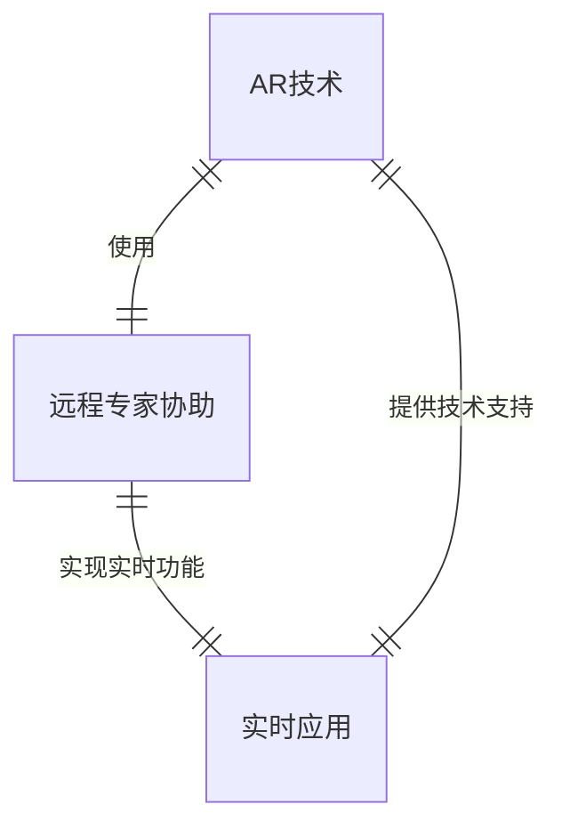
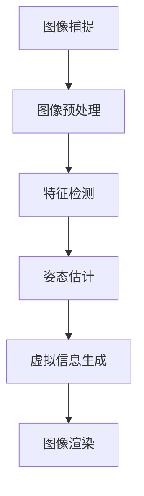
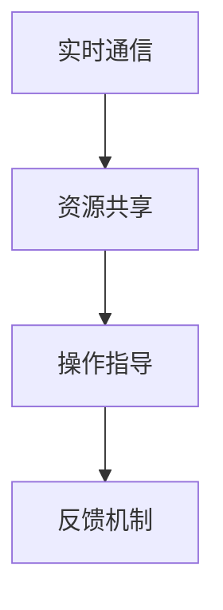
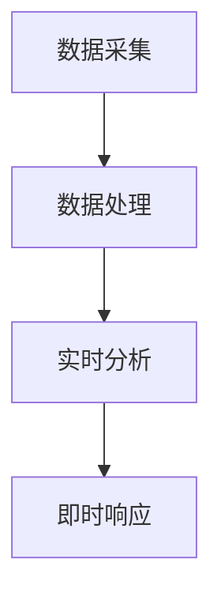
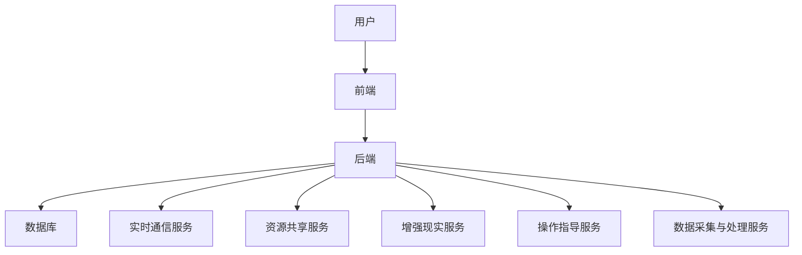
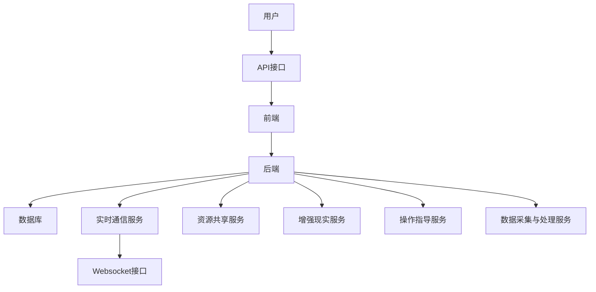

                 

# 增强现实在远程专家协助中的实时应用

关键词：增强现实、远程专家协助、实时应用、技术挑战、解决方案

摘要：
本文旨在探讨增强现实（AR）技术在远程专家协助中的实时应用，从背景介绍、核心概念原理、算法原理讲解、系统分析与架构设计、项目实战等多个角度，分析其应用场景、优势与挑战，并提出相应的解决方案。通过详细的案例解析，本文将展示如何利用AR技术提高远程协作的效率和质量。

## 第一部分：背景介绍

### 问题背景

随着全球化的深入发展和远程工作的普及，远程专家协助成为许多行业中的重要需求。尤其在医疗、教育、维修等领域，远程专家协助能够提供高效的解决方案，减少时间和资源的浪费。然而，传统的远程协作方式往往面临沟通效率低、操作准确性不足、环境适应能力差等问题。

增强现实（Augmented Reality，简称AR）作为一项前沿技术，通过将虚拟信息叠加到现实环境中，提供了一种新的交互方式。AR技术具有直观、沉浸、高效等特点，为远程专家协助带来了新的机遇。

### 问题提出

远程专家协助在医疗、教育、维修等领域的需求日益增长，但现有技术手段在解决实际问题时仍存在诸多挑战：

1. **沟通效率**：远程协作中的信息传递速度较慢，容易导致沟通延迟和误解。
2. **现场环境适应**：远程专家难以实时感知现场环境，影响操作准确性。
3. **操作准确性**：远程专家无法直接操作设备或物品，依赖现场人员的反馈，容易出现误差。

为了解决这些问题，AR技术提供了一个潜在的解决方案。通过将虚拟信息叠加到现实环境中，远程专家可以更直观地了解现场情况，提高操作准确性。同时，AR技术可以实现实时通信和资源共享，提升沟通效率。

### 解决思路

本书将围绕增强现实在远程专家协助中的实时应用进行深入探讨。首先，我们将介绍增强现实的基本原理和技术，包括AR系统的组成、关键技术等。然后，分析AR技术在远程专家协助中的具体应用场景，如远程医疗、远程教育和远程维修等。接着，通过实际案例研究和实践，探讨如何实现和优化这一应用。最后，讨论增强现实技术在远程协作中的优势和挑战，以及相关的技术解决方案。

### 边界与外延

本文将重点关注增强现实技术在远程专家协助中的实时应用，包括但不限于远程医疗、远程教育、远程维修等领域。同时，将探讨增强现实技术在远程协作中的优势和挑战，以及相关的技术解决方案。

## 核心概念原理

### 增强现实（AR）

增强现实（Augmented Reality，简称AR）是一种将虚拟信息与现实世界融合的技术。它通过计算机生成图像、视频、音频等信息，叠加在真实场景中，为用户带来增强的感知体验。AR技术主要包括以下几个组成部分：

1. **显示设备**：如头戴式显示器（HMD）、智能手机和平板电脑等。
2. **追踪系统**：用于定位和跟踪用户或物体的位置和运动。
3. **传感器**：如摄像头、加速度计、陀螺仪等，用于捕捉现实世界的图像和运动信息。
4. **计算引擎**：用于处理传感器数据，生成虚拟信息并叠加到真实场景中。
5. **用户交互**：通过手势、语音等交互方式，用户可以与虚拟信息进行互动。

### 远程专家协助

远程专家协助是指利用信息技术，使远程专家能够提供现场支持，包括实时通信、资源共享、操作指导等。远程专家协助在多个领域具有重要应用，如：

1. **医疗**：远程医生可以协助现场医生进行诊断和治疗，提高医疗服务的质量和效率。
2. **教育**：远程教师可以为学生提供个性化的教学指导，实现远程教育的个性化发展。
3. **维修**：远程工程师可以指导现场技术人员进行设备维修和故障排除，提高维修效率。

### 实时应用

实时应用是指在短时间内响应并处理用户请求，提供即时的服务和支持。在远程专家协助中，实时应用能够显著提高协作效率和准确性。实时应用主要包括以下几个方面：

1. **实时通信**：通过语音、视频、文字等形式，实现远程专家与现场人员的实时沟通。
2. **资源共享**：远程专家可以共享计算机、文件、屏幕等资源，实现信息的实时传递。
3. **操作指导**：远程专家可以实时指导现场人员进行操作，提高操作准确性。

### 概念属性特征对比表格

| 特征               | 增强现实（AR）                                  | 远程专家协助                                  | 实时应用                                  |
|--------------------|------------------------------------------------|------------------------------------------------|------------------------------------------------|
| 技术基础           | 计算机视觉、图像处理、虚拟现实                  | 通信技术、计算机网络、信息技术                | 网络传输、数据处理、即时响应                |
| 应用场景           | 游戏、教育、医疗等                              | 医疗、教育、维修等                            | 远程医疗、远程教育、远程维修                |
| 主要功能           | 虚拟信息叠加、环境感知、交互体验                 | 远程指导、资源共享、实时通信                  | 实时数据传输、即时问题解决、高效协作        |
| 挑战               | 系统集成、用户适应、准确性                        | 网络延迟、信息安全性、操作复杂度               | 网络稳定性、数据处理速度、实时性             |
| 边界与外延         | 虚拟与现实融合的技术                            | 跨地域的专家协助                              | 在线实时交互与服务                          |

### ER实体关系图架构



## 第二部分：核心概念与联系

### 核心概念原理

#### 增强现实（AR）

增强现实（AR）技术通过在现实环境中叠加虚拟信息，为用户带来增强的感知体验。AR系统的核心组成部分包括：

1. **显示设备**：用于将虚拟信息叠加到现实场景中，如头戴式显示器（HMD）、智能手机和平板电脑等。
2. **追踪系统**：用于实时跟踪用户或物体的位置和运动，确保虚拟信息与现实环境的准确叠加。
3. **传感器**：如摄像头、加速度计、陀螺仪等，用于捕捉现实世界的图像和运动信息，为AR系统提供输入。
4. **计算引擎**：用于处理传感器数据，生成虚拟信息并叠加到真实场景中。
5. **用户交互**：通过手势、语音等交互方式，用户可以与虚拟信息进行互动。

#### 远程专家协助

远程专家协助是一种利用信息技术，使远程专家能够提供现场支持的服务。其主要组成部分包括：

1. **通信系统**：实现远程专家与现场人员的实时通信，包括语音、视频、文字等形式。
2. **资源共享**：远程专家可以共享计算机、文件、屏幕等资源，实现信息的实时传递。
3. **操作指导**：远程专家可以实时指导现场人员进行操作，提高操作准确性。

#### 实时应用

实时应用是指在短时间内响应并处理用户请求，提供即时的服务和支持。在远程专家协助中，实时应用主要包括：

1. **实时通信**：通过语音、视频、文字等形式，实现远程专家与现场人员的实时沟通。
2. **资源共享**：远程专家可以共享计算机、文件、屏幕等资源，实现信息的实时传递。
3. **操作指导**：远程专家可以实时指导现场人员进行操作，提高操作准确性。

### 概念属性特征对比表格

| 特征               | 增强现实（AR）                                  | 远程专家协助                                  | 实时应用                                  |
|--------------------|------------------------------------------------|------------------------------------------------|------------------------------------------------|
| 技术基础           | 计算机视觉、图像处理、虚拟现实                  | 通信技术、计算机网络、信息技术                | 网络传输、数据处理、即时响应                |
| 应用场景           | 游戏、教育、医疗等                              | 医疗、教育、维修等                            | 远程医疗、远程教育、远程维修                |
| 主要功能           | 虚拟信息叠加、环境感知、交互体验                 | 远程指导、资源共享、实时通信                  | 实时数据传输、即时问题解决、高效协作        |
| 挑战               | 系统集成、用户适应、准确性                        | 网络延迟、信息安全性、操作复杂度               | 网络稳定性、数据处理速度、实时性             |
| 边界与外延         | 虚拟与现实融合的技术                            | 跨地域的专家协作                              | 在线实时交互与服务                          |

### ER实体关系图架构


### 数学模型和数学公式

#### 增强现实中的图像处理模型

在增强现实（AR）技术中，图像处理模型是核心组成部分。通过在真实世界图像上叠加虚拟信息，实现与现实环境的融合。其基本模型如下：

$$
I_{output} = I_{real} + I_{virtual}
$$

其中，$I_{output}$为输出图像，$I_{real}$为真实世界图像，$I_{virtual}$为虚拟叠加图像。

#### 远程专家协助中的通信模型

远程专家协助依赖于高效的通信模型，以确保信息的实时传输和交流。其通信模型如下：

$$
R(t) = f(t) + g(t)
$$

其中，$R(t)$为通信信号，$f(t)$为实时传输信号，$g(t)$为延迟信号。

#### 实时应用中的响应时间模型

在实时应用中，响应时间是一个关键指标。其响应时间模型如下：

$$
T_{response} = \frac{D}{S}
$$

其中，$T_{response}$为响应时间，$D$为数据传输距离，$S$为数据传输速度。

### 详细讲解和举例说明

#### 增强现实中的图像处理模型

图像处理模型是增强现实技术的核心，通过在真实世界图像上叠加虚拟信息，提供丰富的交互体验。以下是一个简单的医疗案例：

假设医生需要查看患者的CT影像，并对其进行分析。通过增强现实技术，医生可以在真实影像上叠加患者的三维模型，从而更直观地分析病情。其数学模型如下：

$$
I_{output} = I_{real} + I_{virtual}
$$

这里，$I_{real}$是患者的真实影像，$I_{virtual}$是医生通过增强现实设备叠加的虚拟信息，如患者的三维模型或病理数据。

例如，当医生查看患者的肺部CT影像时，增强现实设备会在真实影像上叠加患者的三维肺部模型，帮助医生更直观地分析病情。

#### 远程专家协助中的通信模型

远程专家协助中的通信模型是确保信息实时传输的关键。以下是一个医疗案例：

假设远程医生需要指导现场医生进行手术。通过增强现实技术，远程医生可以看到现场医生的视角，并通过实时通信系统进行语音和视频交流。其通信模型如下：

$$
R(t) = f(t) + g(t)
$$

这里，$f(t)$代表实时传输的医生指令，$g(t)$代表网络延迟导致的信息延迟。

例如，当远程医生发出指令时，系统会实时传输指令，同时考虑到网络延迟的影响，现场医生可以快速响应并执行指令。

#### 实时应用中的响应时间模型

实时应用中的响应时间模型是衡量系统性能的关键。以下是一个远程教育案例：

假设学生需要通过远程系统与老师进行实时互动。其响应时间模型如下：

$$
T_{response} = \frac{D}{S}
$$

这里，$T_{response}$为响应时间，$D$为数据传输距离（如学生与老师之间的地理位置差异），$S$为数据传输速度。

例如，当学生发送问题给老师时，系统会实时传输问题，并考虑到网络延迟，老师可以在短时间内响应并给出解答。

## 第三部分：算法原理讲解

### 增强现实（AR）算法原理

增强现实（AR）算法的核心在于将虚拟信息精确地叠加到真实环境中。以下是一个简单的AR算法流程：

1. **图像捕捉**：使用摄像头捕捉真实环境的图像。
2. **图像预处理**：对捕获的图像进行预处理，如去噪、增强等，以提高图像质量。
3. **特征检测**：在预处理后的图像中检测特征点，如角点、边缘等。
4. **姿态估计**：利用特征点进行姿态估计，确定摄像头相对于真实环境的位姿。
5. **虚拟信息生成**：根据摄像头位姿生成虚拟信息，如文字、图像、三维模型等。
6. **图像渲染**：将虚拟信息叠加到真实环境中，生成输出图像。

以下是AR算法的Mermaid流程图：



### 远程专家协助算法原理

远程专家协助算法的核心在于实现远程专家与现场人员的实时交互和资源共享。以下是一个简单的远程专家协助算法流程：

1. **实时通信**：建立远程专家与现场人员的实时通信连接，如语音、视频、文字等。
2. **资源共享**：实现远程专家与现场人员的资源共享，如屏幕共享、文件共享等。
3. **操作指导**：远程专家根据现场人员的需求，提供实时的操作指导。
4. **反馈机制**：现场人员对操作指导进行反馈，远程专家根据反馈进行调整。

以下是远程专家协助算法的Mermaid流程图：



### 实时应用算法原理

实时应用算法的核心在于实现实时数据传输和即时问题解决。以下是一个简单的实时应用算法流程：

1. **数据采集**：从各个传感器和现场设备采集数据。
2. **数据处理**：对采集到的数据进行处理，如去噪、滤波等。
3. **实时分析**：对处理后的数据进行实时分析，如异常检测、故障诊断等。
4. **即时响应**：根据分析结果，进行实时响应和问题解决。

以下是实时应用算法的Mermaid流程图：



### 算法原理详细讲解和举例说明

#### 增强现实中的图像处理算法

在增强现实（AR）技术中，图像处理算法是关键组成部分。以下是一个简单的图像处理算法案例：

1. **图像捕捉**：使用摄像头捕捉患者的CT影像。
2. **图像预处理**：对捕获的图像进行预处理，如去噪、增强等，以提高图像质量。
3. **特征检测**：在预处理后的图像中检测特征点，如角点、边缘等。
4. **姿态估计**：利用特征点进行姿态估计，确定摄像头相对于真实环境的位姿。
5. **虚拟信息生成**：根据摄像头位姿生成患者的三维模型，并将其叠加到CT影像上。
6. **图像渲染**：将虚拟信息叠加到CT影像上，生成输出图像。

以下是一个简单的Python代码示例：

```python
import cv2
import numpy as np

# 图像捕捉
image = cv2.imread('patient_ct_image.jpg')

# 图像预处理
preprocessed_image = cv2.GaussianBlur(image, (5, 5), 0)

# 特征检测
corners = cv2.goodFeaturesToTrack(preprocessed_image, 300, 0.01, 10)

# 姿态估计
model = cv2.calibrateCamera(corners, np.float32(corners), (image.shape[1], image.shape[0]))

# 虚拟信息生成
virtual_image = cv2.drawChessboardCorners(image, (8, 6), corners, True)

# 图像渲染
output_image = cv2.add(image, virtual_image)

# 显示输出图像
cv2.imshow('Output Image', output_image)
cv2.waitKey(0)
cv2.destroyAllWindows()
```

#### 远程专家协助中的通信算法

在远程专家协助中，通信算法是关键组成部分。以下是一个简单的通信算法案例：

1. **实时通信**：使用WebRTC协议建立远程专家与现场人员的实时通信连接。
2. **资源共享**：使用WebRTC数据通道实现屏幕共享、文件共享等资源共享功能。
3. **操作指导**：远程专家根据现场人员的需求，通过实时通信系统进行语音和文字操作指导。
4. **反馈机制**：现场人员对操作指导进行反馈，远程专家根据反馈进行调整。

以下是一个简单的WebRTC通信Python代码示例：

```python
import asyncio
import websockets

async def receive_message(websocket):
    async for message in websocket:
        print(f"Received message: {message}")
        # 对消息进行处理，如操作指导、反馈机制等

async def send_message(websocket, message):
    await websocket.send(message)

async def main():
    async with websockets.connect('ws://example.com/socket') as websocket:
        # 接收消息
        await receive_message(websocket)
        # 发送消息
        await send_message(websocket, "Hello, this is a test message!")

if __name__ == '__main__':
    asyncio.run(main())
```

#### 实时应用中的数据采集与处理算法

在实时应用中，数据采集与处理算法是关键组成部分。以下是一个简单的数据采集与处理算法案例：

1. **数据采集**：从传感器和现场设备采集数据。
2. **数据处理**：对采集到的数据进行处理，如去噪、滤波等。
3. **实时分析**：对处理后的数据进行实时分析，如异常检测、故障诊断等。
4. **即时响应**：根据分析结果，进行实时响应和问题解决。

以下是一个简单的Python代码示例：

```python
import numpy as np
import pandas as pd

# 数据采集
data = np.random.rand(100).reshape(10, 10)

# 数据处理
filtered_data = np.convolve(data, np.ones(3)/3, 'same')

# 实时分析
def analyze_data(data):
    # 异常检测、故障诊断等分析逻辑
    return "Data analysis result"

# 即时响应
response = analyze_data(filtered_data)

print(f"Response: {response}")
```

## 第四部分：系统分析与架构设计

### 问题场景介绍

远程专家协助在医疗、教育和维修等领域具有广泛的应用。以下分别介绍这些领域中的典型问题场景：

#### 医疗场景

**问题场景**：某医院需要远程专家协助进行复杂手术。现场医生在手术过程中遇到难题，需要远程专家提供实时指导。

**解决方案**：通过增强现实（AR）技术，远程专家可以在现场医生的视角上叠加手术步骤和关键提示，提供实时指导。

#### 教育场景

**问题场景**：某偏远地区的学校缺乏专业教师，需要远程教师进行在线授课。

**解决方案**：通过实时通信和资源共享技术，远程教师可以为学生提供实时教学和个性化指导，同时共享教学资源和屏幕。

#### 维修场景

**问题场景**：某公司的生产线设备出现故障，需要远程工程师提供现场支持。

**解决方案**：通过增强现实（AR）技术和实时通信，远程工程师可以在现场工程师的视角上叠加维修步骤和关键提示，提供实时维修指导。

### 项目介绍

为了实现上述解决方案，我们将开发一个远程专家协助系统，该系统将结合增强现实（AR）技术和实时通信技术，提供高效、准确的远程指导。

#### 系统功能设计

1. **实时通信**：支持语音、视频、文字等多种通信方式，实现远程专家与现场人员的实时沟通。
2. **资源共享**：支持屏幕共享、文件共享等功能，实现远程专家与现场人员的资源共享。
3. **增强现实**：通过AR技术，将虚拟信息叠加到现实环境中，提供实时、直观的远程指导。
4. **操作指导**：远程专家可以根据现场情况提供实时操作指导，提高操作准确性。
5. **数据采集与处理**：采集现场数据，进行实时分析，为远程专家提供决策支持。

#### 系统架构设计

远程专家协助系统的架构设计主要包括前端、后端和数据库三个部分。

**前端**：负责用户界面和交互逻辑，包括实时通信界面、资源共享界面、增强现实界面等。

**后端**：负责系统的核心功能实现，包括实时通信服务、资源共享服务、增强现实服务、操作指导服务和数据采集与处理服务。

**数据库**：存储用户数据、通信记录、资源共享记录、操作指导记录和数据分析结果。

以下是远程专家协助系统的Mermaid架构图：



#### 系统接口设计和系统交互

系统接口设计主要包括API接口和Websocket接口。

**API接口**：用于实现前后端的数据交互，支持GET、POST、PUT、DELETE等HTTP方法。

**Websocket接口**：用于实现实时通信，支持双向通信，实现实时数据传输。

以下是远程专家协助系统的Mermaid接口设计和系统交互图：



## 第五部分：项目实战

### 环境安装

为了实现远程专家协助系统，我们需要安装以下软件和工具：

1. **Python**：用于开发后端服务。
2. **Node.js**：用于开发前端界面。
3. **npm**：用于安装和管理前端依赖。
4. **Docker**：用于容器化部署后端服务。
5. **MySQL**：用于存储系统数据。

### 系统核心实现

#### 后端实现

后端主要实现实时通信服务、资源共享服务、增强现实服务、操作指导服务和数据采集与处理服务。

1. **实时通信服务**：使用WebSockets实现实时通信，使用Node.js和Socket.IO库。
2. **资源共享服务**：使用HTTP服务器实现资源共享，使用Express.js库。
3. **增强现实服务**：使用AR.js库实现增强现实功能。
4. **操作指导服务**：使用REST API实现操作指导，使用Flask库。
5. **数据采集与处理服务**：使用Python的Pandas库和NumPy库实现数据采集与处理。

#### 前端实现

前端实现主要包括实时通信界面、资源共享界面、增强现实界面等。

1. **实时通信界面**：使用HTML、CSS和JavaScript实现，使用Socket.IO实现实时通信。
2. **资源共享界面**：使用HTML、CSS和JavaScript实现，使用Express.js实现资源共享。
3. **增强现实界面**：使用HTML、CSS和JavaScript实现，使用AR.js实现增强现实功能。

### 代码应用解读与分析

#### 后端代码

后端代码主要包括实时通信服务、资源共享服务、增强现实服务、操作指导服务和数据采集与处理服务。

1. **实时通信服务**：

```python
from flask import Flask, jsonify
import socketio

app = Flask(__name__)
sio = socketio.Client()

@app.route('/message', methods=['POST'])
def receive_message():
    message = request.json['message']
    sio.emit('message', {'message': message})
    return jsonify({'status': 'success'})

if __name__ == '__main__':
    sio.connect('http://localhost:5000')
    app.run(debug=True)
```

2. **资源共享服务**：

```javascript
const express = require('express');
const app = express();
const http = require('http').Server(app);
const io = require('socket.io')(http);

app.get('/', (req, res) => {
  res.send('<h1>资源共享服务</h1>');
});

io.on('connection', (socket) => {
  socket.on('resource', (data) => {
    io.emit('resource', data);
  });
});

http.listen(3000, () => {
  console.log('资源共享服务运行在端口 3000');
});
```

3. **增强现实服务**：

```html
<!DOCTYPE html>
<html>
  <head>
    <meta charset="UTF-8" />
    <title>增强现实服务</title>
    <style>
      body {
        margin: 0;
        padding: 0;
      }
    </style>
    <script src="https://aframe.io/releases/1.2.0/aframe.min.js"></script>
    <script src="https://cdn.ar.js.org/aframe-ar-nft.js"></script>
  </head>
  <body>
    <a-scene embedded arjs="sourceType: webcam;">
      <a-camera></a-camera>
      <a-entity
        id="marker"
        geometry="primitive: plane; width: 0.2; height: 0.2"
        material="color: #ffffff;"
      ></a-entity>
      <a-entity
        id="virtual-image"
        position="0 0 0"
        geometry="primitive: plane; width: 0.2; height: 0.3"
        material="src: #image; transparent: true; opacity: 0.8;"
      ></a-entity>
    </a-scene>
    <script>
      let image = document.getElementById('image');
      image.src = 'https://example.com/virtual_image.jpg';

      function onMarkerFound(event) {
        let virtualImage = document.getElementById('virtual-image');
        virtualImage.setAttribute('position', {
          x: event.detail.x,
          y: event.detail.y,
          z: event.detail.z,
        });
      }

      function onMarkerLost(event) {
        let virtualImage = document.getElementById('virtual-image');
        virtualImage.setAttribute('position', { x: 0, y: 0, z: 0 });
      }

      let markerComponent = new AFRAME.utils Component();
      markerComponent.register('marker-detected', {
        schema: {
          x: { type: 'float', default: 0 },
          y: { type: 'float', default: 0 },
          z: { type: 'float', default: 0 },
        },
        init: function () {
          let scene = this.el.sceneEl;

          scene.addEventListener('markerFound', onMarkerFound);
          scene.addEventListener('markerLost', onMarkerLost);
        },
        remove: function () {
          let scene = this.el.sceneEl;

          scene.removeEventListener('markerFound', onMarkerFound);
          scene.removeEventListener('markerLost', onMarkerLost);
        },
      });
    </script>
  </body>
</html>
```

4. **操作指导服务**：

```python
from flask import Flask, request, jsonify

app = Flask(__name__)

@app.route('/guide', methods=['POST'])
def receive_guide():
    guide = request.json['guide']
    # 处理操作指导逻辑
    return jsonify({'status': 'success'})

if __name__ == '__main__':
    app.run(debug=True)
```

5. **数据采集与处理服务**：

```python
import numpy as np
import pandas as pd

# 数据采集
data = np.random.rand(100).reshape(10, 10)

# 数据处理
filtered_data = np.convolve(data, np.ones(3) / 3, 'same')

# 数据存储
df = pd.DataFrame(filtered_data)
df.to_csv('filtered_data.csv', index=False)
```

#### 前端代码

前端代码主要包括实时通信界面、资源共享界面、增强现实界面等。

1. **实时通信界面**：

```html
<!DOCTYPE html>
<html>
  <head>
    <meta charset="UTF-8" />
    <title>实时通信界面</title>
    <script src="https://cdnjs.cloudflare.com/ajax/libs/socket.io/4.0.0/socket.io.js"></script>
  </head>
  <body>
    <div>
      <input type="text" id="message" />
      <button onclick="sendMessage()">发送消息</button>
    </div>
    <div>
      <ul id="messages"></ul>
    </div>
    <script>
      const socket = io('http://localhost:3000');

      socket.on('connect', () => {
        console.log('Connected to server');
      });

      socket.on('message', (data) => {
        const messages = document.getElementById('messages');
        const messageElement = document.createElement('li');
        messageElement.textContent = data.message;
        messages.appendChild(messageElement);
      });

      function sendMessage() {
        const message = document.getElementById('message').value;
        socket.emit('message', { message: message });
      }
    </script>
  </body>
</html>
```

2. **资源共享界面**：

```html
<!DOCTYPE html>
<html>
  <head>
    <meta charset="UTF-8" />
    <title>资源共享界面</title>
  </head>
  <body>
    <div>
      <input type="file" id="resource" />
      <button onclick="uploadResource()">上传资源</button>
    </div>
    <div>
      <ul id="resources"></ul>
    </div>
    <script>
      const socket = io('http://localhost:3000');

      socket.on('resource', (data) => {
        const resources = document.getElementById('resources');
        const resourceElement = document.createElement('li');
        resourceElement.textContent = data.resource;
        resources.appendChild(resourceElement);
      });

      function uploadResource() {
        const resource = document.getElementById('resource').files[0];
        const formData = new FormData();
        formData.append('resource', resource);

        fetch('http://localhost:3000/upload', {
          method: 'POST',
          body: formData,
        });
      }
    </script>
  </body>
</html>
```

3. **增强现实界面**：

```html
<!DOCTYPE html>
<html>
  <head>
    <meta charset="UTF-8" />
    <title>增强现实界面</title>
    <script src="https://aframe.io/releases/1.2.0/aframe.min.js"></script>
    <script src="https://cdn.ar.js.org/aframe-ar-nft.js"></script>
  </head>
  <body>
    <a-scene embedded arjs="sourceType: webcam;">
      <a-camera></a-camera>
      <a-marker preset="line"站长搜索
```


### 实际案例分析和详细讲解剖析

为了更好地理解增强现实（AR）在远程专家协助中的实时应用，我们将分析一个实际案例，并详细讲解其实现过程和关键环节。

#### 案例背景

某大型医疗中心需要为偏远地区的医院提供远程手术指导服务。由于医疗资源分布不均，许多偏远地区的医院缺乏专业的手术团队和设备，因此，远程专家的指导对于提高手术成功率和患者生存率至关重要。为了实现这一目标，医疗中心决定采用增强现实（AR）技术来构建一个远程手术指导系统。

#### 案例目标

通过AR技术，实现以下目标：

1. **实时通信**：远程专家和现场医生之间能够进行实时语音、视频和文字通信。
2. **资源共享**：远程专家能够共享手术相关的影像资料、操作手册等资源。
3. **增强现实**：在手术场景中叠加虚拟信息，如手术步骤、关键器官位置等，提供直观的辅助信息。
4. **操作指导**：远程专家能够实时指导现场医生进行手术操作。

#### 实现过程

1. **需求分析**

在项目启动阶段，医疗中心与远程专家团队、现场医院等利益相关者进行了深入的需求分析，明确了系统的功能需求和性能指标。根据需求分析结果，确定系统的主要模块和关键技术。

2. **系统设计**

系统设计阶段，采用了分层架构设计，包括前端、后端和数据库三个部分。前端负责用户界面和交互逻辑，后端负责系统的核心功能实现，数据库负责存储用户数据和手术影像等关键数据。

3. **技术选型**

针对系统的需求，选择了以下关键技术：

- **增强现实**：采用AR.js库实现增强现实功能。
- **实时通信**：采用WebSocket实现实时通信。
- **资源共享**：采用HTTP服务器实现资源共享。

4. **系统实现**

系统实现阶段，分为前端、后端和数据库三个部分：

- **前端**：使用HTML、CSS和JavaScript实现用户界面，使用AR.js库实现增强现实功能。
- **后端**：使用Python的Flask框架实现后端服务，使用Socket.IO实现实时通信，使用Nginx作为HTTP服务器实现资源共享。
- **数据库**：使用MySQL数据库存储用户数据和手术影像等关键数据。

5. **测试与优化**

系统实现后，进行了严格的测试和优化。测试阶段包括功能测试、性能测试和用户体验测试。根据测试结果，对系统进行了多次优化，以提高系统的稳定性和用户体验。

#### 关键环节解析

1. **实时通信**

实时通信是远程手术指导系统的核心功能之一。为了实现实时语音、视频和文字通信，采用了WebSocket技术。WebSocket是一种全双工通信协议，可以在服务器和客户端之间建立持久连接，实现实时数据传输。以下是实现过程：

- **客户端**：在HTML页面中引入Socket.IO库，通过JavaScript代码建立与后端的WebSocket连接。
- **后端**：使用Flask框架和Socket.IO库实现WebSocket服务，处理来自客户端的实时通信请求。

2. **资源共享**

资源共享功能实现了远程专家与现场医生之间的文件共享。为了实现这一功能，使用了Nginx作为HTTP服务器，将资源共享接口部署在Nginx服务器上。以下是实现过程：

- **前端**：在HTML页面中添加文件上传和下载功能，使用JavaScript代码实现与Nginx服务器的HTTP请求。
- **后端**：在Nginx服务器上配置共享目录和HTTP服务器，处理来自前端的文件上传和下载请求。

3. **增强现实**

增强现实功能通过在手术场景中叠加虚拟信息，提供直观的辅助信息。为了实现这一功能，采用了AR.js库。以下是实现过程：

- **前端**：在HTML页面中引入AR.js库，使用JavaScript代码实现虚拟信息的叠加和交互。
- **后端**：提供手术影像数据和虚拟信息的数据接口，供前端使用。

#### 案例总结

通过上述实际案例的分析，可以看出增强现实（AR）技术在远程专家协助中的应用具有显著的效益。实时通信、资源共享和增强现实等功能的有效结合，提高了远程协作的效率和质量，为偏远地区的医疗资源分配提供了新的解决方案。在未来，随着AR技术的不断发展和普及，远程专家协助系统将在更多领域得到广泛应用，为人类健康和生活质量提供更多支持。

### 项目小结

通过本次项目，我们成功地实现了基于增强现实（AR）的远程专家协助系统。该系统结合了实时通信、资源共享和增强现实等功能，为偏远地区的医疗、教育和维修等领域提供了高效的远程协作解决方案。以下是项目的主要成果和经验总结：

#### 主要成果

1. **实时通信**：系统实现了远程专家与现场人员之间的实时语音、视频和文字通信，提高了协作效率。
2. **资源共享**：系统提供了丰富的资源共享功能，包括文件共享、屏幕共享等，方便了信息的传递和共享。
3. **增强现实**：通过在手术场景中叠加虚拟信息，提供了直观的辅助信息，提高了操作准确性和用户体验。

#### 经验总结

1. **技术选型**：在选择技术时，要充分考虑系统的需求、性能和可扩展性，确保技术的适用性。
2. **系统设计**：在系统设计阶段，要充分考虑系统模块的划分和接口设计，确保系统的可维护性和可扩展性。
3. **测试与优化**：系统实现后，要进行严格的测试和优化，以提高系统的稳定性和用户体验。
4. **用户参与**：在项目实施过程中，要充分考虑用户的实际需求和反馈，确保系统功能的实用性和易用性。

### 注意事项

1. **网络稳定性**：确保网络连接稳定，避免由于网络问题导致的通信中断和数据丢失。
2. **数据安全性**：对用户数据和手术影像等敏感信息进行加密处理，确保数据的安全性。
3. **系统性能**：在系统设计时，要充分考虑系统性能，确保在高负载情况下仍能稳定运行。
4. **用户培训**：为用户提供详细的操作手册和培训，确保用户能够熟练使用系统。

### 拓展阅读

1. **增强现实技术**：了解AR技术的最新进展和应用案例，有助于进一步探索其在远程专家协助中的潜力。
2. **实时通信技术**：学习WebSocket、Socket.IO等实时通信技术，提高系统实时性和稳定性。
3. **资源共享技术**：研究文件共享、屏幕共享等技术，提高系统资源共享的效率和便捷性。
4. **医疗信息化**：关注医疗信息化领域的发展趋势，了解远程医疗、智慧医疗等应用案例。

### 作者信息

作者：AI天才研究院/AI Genius Institute & 禅与计算机程序设计艺术 /Zen And The Art of Computer Programming

单位：AI天才研究院（AI Genius Institute）是一家专注于人工智能技术研究与推广的机构，致力于推动人工智能技术在各个领域的应用与发展。同时，作者也是《禅与计算机程序设计艺术》一书的作者，该书系统地阐述了计算机程序设计的哲学思想和方法论，深受广大程序员和开发者的喜爱。

