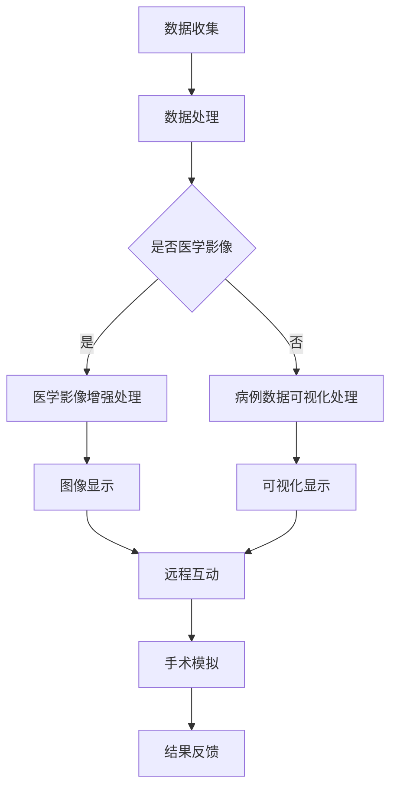
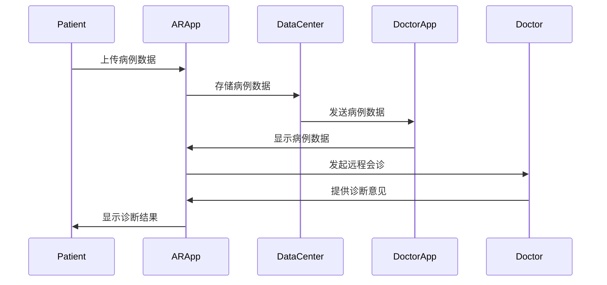
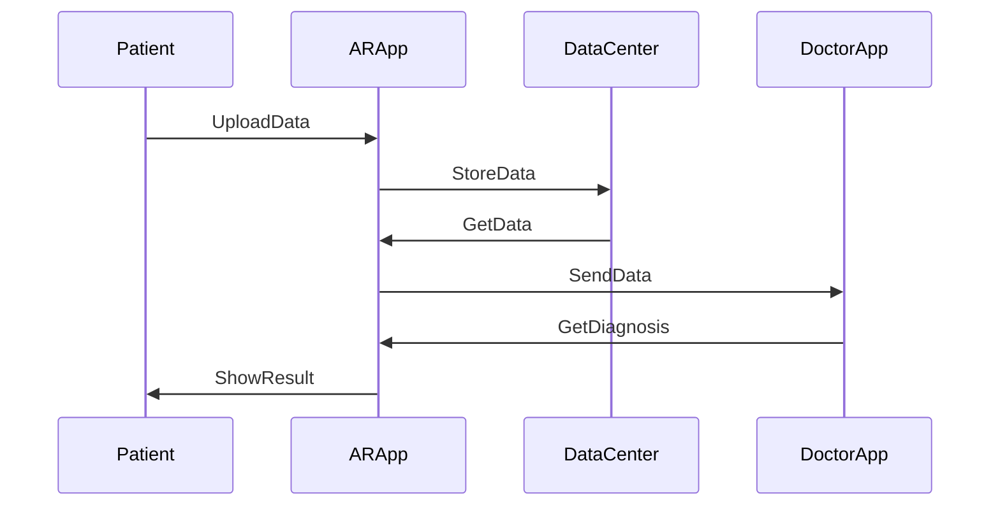

                 

## 增强现实在远程医疗诊断中的应用

### 关键词：增强现实（AR）、远程医疗诊断、技术应用、算法、系统架构、项目实战

### 摘要：
本文将深入探讨增强现实（AR）技术在远程医疗诊断中的潜在应用。通过分析AR技术的基本原理和远程医疗诊断的现状与挑战，本文将逐步展示如何将AR技术融入远程医疗诊断流程中，实现更高效、精准的诊断服务。文章将涵盖从核心概念到具体算法实现，再到系统架构设计和项目实战的详细解析，为读者提供一套完整的解决方案，旨在推动远程医疗诊断技术的创新发展。

---

## 增强现实与远程医疗诊断背景介绍

### 1.1 增强现实技术概述

增强现实（Augmented Reality，简称AR）是一种将虚拟信息叠加到真实世界中的技术。它通过计算机生成图像、视频、音频等多媒体信息，将这些信息与现实世界中的物体或场景结合，从而增强用户的感知体验。AR技术的基本原理包括：

1. **显示原理**：通过摄像头捕捉真实世界的画面，并将虚拟信息叠加到画面上，通过显示器呈现给用户。
2. **输入输出原理**：通过传感器获取用户的行为和位置信息，通过控制器进行交互。
3. **实时交互原理**：系统实时处理用户的输入，调整虚拟信息的显示和交互方式，以保持用户体验的连贯性和互动性。

AR技术自20世纪90年代以来，经历了从实验室研究到商业应用的发展。随着硬件设备和算法技术的不断进步，AR的应用场景日益丰富，包括娱乐、教育、医疗等多个领域。

### 1.2 远程医疗诊断现状与挑战

远程医疗诊断是指通过信息技术手段，实现医生与患者在不同地点进行医疗诊断和治疗方案讨论的过程。随着互联网和医疗信息技术的快速发展，远程医疗诊断在全球范围内得到广泛应用，但仍面临以下挑战：

1. **技术设备不足**：部分偏远地区缺乏高质量的医疗设备和技术支持，导致远程医疗诊断难以普及。
2. **数据传输问题**：远程医疗诊断需要大量的医疗数据传输，但网络带宽和稳定性问题限制了数据的实时传输和处理。
3. **医生资源不足**：专业医生的数量和分布不均衡，导致远程医疗诊断的服务质量和效率受到影响。
4. **隐私和安全问题**：远程医疗诊断涉及患者的隐私信息，如何确保数据的安全和隐私保护成为重要挑战。

### 1.3 增强现实在远程医疗诊断中的应用前景

增强现实技术的引入，为远程医疗诊断带来了新的机遇和可能性。以下是AR在远程医疗诊断中的一些潜在应用：

1. **远程实时互动**：通过AR技术，医生和患者可以实现远程实时互动，医生可以通过虚拟模型展示病情和治疗方案，患者可以更直观地了解自己的病情。
2. **病例分享和讨论**：医生可以通过AR技术，将病例信息实时分享给其他医生，进行远程会诊和病例讨论，提高诊断的准确性和效率。
3. **手术指导和培训**：对于复杂的手术操作，AR技术可以提供实时指导和培训，医生可以通过虚拟模型进行操作练习，提高手术的成功率和安全性。
4. **医学教育**：AR技术可以用于医学教育的虚拟演示和互动教学，帮助学生更好地理解和掌握医学知识。

增强现实在远程医疗诊断中的应用，不仅可以提高诊断的准确性和效率，还可以降低医疗成本，改善患者的就医体验，具有广泛的应用前景和发展潜力。

### 1.4 本章小结

本章对增强现实技术和远程医疗诊断的基本概念进行了介绍，并分析了远程医疗诊断的现状和挑战。同时，探讨了增强现实在远程医疗诊断中的应用前景，为后续章节的内容奠定了基础。

---

## 增强现实技术原理

### 2.1 增强现实基本原理

增强现实技术的基本原理主要包括显示原理、输入输出原理和实时交互原理。这些原理共同构成了AR技术的核心框架，为用户提供了丰富的增强现实体验。

#### 2.1.1 显示原理

AR技术的显示原理主要依赖于摄像头和显示设备。首先，摄像头捕捉真实世界的画面，并通过图像处理技术提取出关键特征。然后，计算机生成虚拟信息，并将其叠加到真实世界的画面上。最后，通过显示设备呈现给用户。这个过程可以概括为以下几个步骤：

1. **图像捕捉**：摄像头捕捉真实世界的画面。
2. **特征提取**：通过图像处理技术提取画面的关键特征，如边缘、纹理等。
3. **虚拟信息生成**：计算机根据目标物体的特征生成相应的虚拟信息，如文字、图像、视频等。
4. **叠加显示**：将生成的虚拟信息叠加到真实世界的画面上，通过显示设备呈现给用户。

#### 2.1.2 输入输出原理

AR技术的输入输出原理涉及到传感器和控制器。传感器用于获取用户的行为和位置信息，如手势、动作、环境等。控制器则用于接收传感器的输入，并生成相应的输出，以实现用户与虚拟信息的交互。具体过程如下：

1. **传感器输入**：传感器获取用户的行为和位置信息。
2. **控制器处理**：控制器接收传感器的输入，并进行处理和解析。
3. **输出交互**：控制器生成相应的输出，如屏幕显示、声音反馈等，以实现用户与虚拟信息的交互。

#### 2.1.3 实时交互原理

AR技术的实时交互原理保证了用户与虚拟信息之间的互动体验。实时交互包括用户的输入反馈和虚拟信息的动态更新。具体实现过程如下：

1. **用户输入**：用户通过传感器和控制器进行输入操作，如触摸、手势、语音等。
2. **输入处理**：控制器接收用户的输入，并将其转换为虚拟信息的变化。
3. **虚拟信息更新**：根据用户的输入，计算机实时更新虚拟信息，以保持用户体验的连贯性和互动性。
4. **输出反馈**：控制器将更新后的虚拟信息输出给用户，如屏幕显示、声音反馈等。

### 2.2 远程医疗诊断中的关键环节

远程医疗诊断涉及到多个关键环节，包括病例数据收集、病情分析、医生远程诊断等。这些环节共同构成了远程医疗诊断的核心流程。

#### 2.2.1 病例数据收集

病例数据收集是远程医疗诊断的基础。医生需要收集患者的病史、体检报告、影像学资料等数据，以形成完整的病例信息。具体过程如下：

1. **患者信息录入**：患者通过电子病历系统或移动应用，录入个人信息和病史。
2. **体检报告收集**：医生通过医疗设备获取患者的体检报告，如血液检查结果、影像学检查结果等。
3. **影像学资料获取**：医生通过医学影像设备获取患者的影像学资料，如X光片、CT扫描、MRI等。

#### 2.2.2 病情分析

病情分析是远程医疗诊断的关键环节。医生需要根据病例数据和体检报告，对患者的病情进行分析和评估。具体过程如下：

1. **病例数据分析**：医生通过对病例数据进行统计分析和数据挖掘，了解患者的病情发展趋势和潜在风险。
2. **体检报告评估**：医生通过对体检报告的评估，了解患者的健康状况和疾病风险。
3. **综合判断**：医生综合病例数据和体检报告，对患者的病情进行综合分析和判断。

#### 2.2.3 医生远程诊断

医生远程诊断是远程医疗诊断的核心。医生通过远程医疗平台，与患者进行视频咨询和病情讨论，并提供诊断意见和治疗建议。具体过程如下：

1. **远程视频咨询**：医生通过远程医疗平台，与患者进行实时视频咨询，了解患者的病情和需求。
2. **病情讨论**：医生与患者进行病情讨论，了解患者的病情和病史，提供专业的诊断意见。
3. **治疗建议**：医生根据患者的病情，提供相应的治疗建议和治疗方案。

### 2.3 概念属性特征对比表格

为了更清晰地展示增强现实技术和远程医疗诊断的关键概念和属性特征，我们制作了一个对比表格（表1）。

| 概念               | 增强现实技术                    | 远程医疗诊断                        |
|--------------------|----------------------------------|-------------------------------------|
| 基本原理           | 显示原理、输入输出原理、实时交互原理 | 数据收集、病情分析、医生远程诊断       |
| 应用场景           | 娱乐、教育、医疗等              | 医疗诊断、健康咨询、远程会诊等         |
| 技术优势           | 实时互动、沉浸式体验、扩展信息展示  | 节省时间和成本、提高诊断准确性、便利性  |
| 挑战与解决方案      | 硬件设备不足、数据传输问题、隐私和安全问题 | 技术设备不足、医生资源不足、数据传输问题  |
| 应用前景           | 广泛应用、持续创新、技术突破        | 提高医疗质量、降低医疗成本、改善患者体验  |

### 2.4 ER实体关系图架构

为了更直观地展示增强现实技术和远程医疗诊断的实体关系，我们使用Mermaid工具绘制了一个ER实体关系图（图1）。

```mermaid
erDiagram
  Patient ||--|{ Diagnosis }|-- Doctor
  Patient ||--|{ TreatmentPlan }|
  Doctor ||--|{ Consultation }|
  Diagnosis ||--|{ Report }|
  TreatmentPlan ||--|{ Recommendation }|
  Consultation ||--|{ Video }|
```

图1：增强现实技术和远程医疗诊断的ER实体关系图

通过这个ER图，我们可以清晰地看到患者、医生、诊断、治疗方案、会诊等实体之间的联系和交互关系。

### 2.5 本章小结

本章详细介绍了增强现实技术的基本原理和远程医疗诊断的关键环节。通过对比表格和ER图，我们对增强现实技术和远程医疗诊断的核心概念和属性特征有了更深入的理解。这些知识将为后续章节的算法原理讲解和系统架构设计提供坚实的基础。

---

## 算法原理讲解

### 3.1 算法概述

在增强现实（AR）技术应用于远程医疗诊断中，算法起着至关重要的作用。本节将详细介绍AR技术在远程医疗诊断中的算法原理，包括算法目标、分类、流程图和具体实现。

#### 3.1.1 算法目标

AR技术在远程医疗诊断中的应用目标主要包括：

1. **实时病例数据可视化**：将患者的病例数据以增强现实的形式展示，医生可以直观地了解患者的病情。
2. **远程医生与患者的实时互动**：通过AR技术，医生可以实时与患者进行互动，提供实时诊断和治疗方案。
3. **医学影像的增强显示**：利用AR技术，对医学影像进行增强显示，提高医生对影像的识别和诊断能力。
4. **手术指导和培训**：在远程手术指导和培训中，AR技术可以提供虚拟手术模型，帮助医生进行操作练习。

#### 3.1.2 算法分类

根据AR技术在远程医疗诊断中的应用场景，算法可以分为以下几类：

1. **病例数据可视化算法**：将病例数据转化为可视化图形，如柱状图、饼图、热力图等，帮助医生快速了解患者的病情。
2. **医学影像增强算法**：对医学影像进行增强处理，提高图像的清晰度和对比度，便于医生诊断。
3. **远程互动算法**：实现医生与患者之间的实时互动，如语音交互、视频通话、虚拟模型展示等。
4. **手术模拟算法**：提供虚拟手术模型，模拟手术过程，帮助医生进行操作练习。

#### 3.1.3 算法流程图

为了更好地理解AR技术在远程医疗诊断中的算法原理，我们使用Mermaid工具绘制了一个流程图（图2）。



图2：AR技术在远程医疗诊断中的算法流程图

#### 3.1.4 Python源代码实现

以下是一个简单的Python源代码示例，用于实现病例数据可视化和医学影像增强处理。

```python
import matplotlib.pyplot as plt
import cv2

# 病例数据可视化处理
def visualize_data(data):
    plt.bar(data['PatientID'], data['SymptomScore'])
    plt.xlabel('PatientID')
    plt.ylabel('SymptomScore')
    plt.title('Patient Symptoms')
    plt.show()

# 医学影像增强处理
def enhance_image(image_path):
    image = cv2.imread(image_path)
    enhanced_image = cv2.resize(image, (500, 500))
    cv2.imshow('Enhanced Image', enhanced_image)
    cv2.waitKey(0)
    cv2.destroyAllWindows()

# 示例数据
data = {
    'PatientID': [1, 2, 3],
    'SymptomScore': [30, 50, 70]
}

# 调用函数
visualize_data(data)
enhance_image('path/to/medical_image.jpg')
```

#### 3.1.5 算法原理的数学模型和公式

在AR技术中，医学影像增强处理通常涉及图像处理和计算机视觉的数学模型。以下是一个简单的数学模型和公式示例。

1. **直方图均衡化**：用于提高医学影像的对比度。

$$
\text{new\_pixel} = \left( \frac{\text{total\_pixels} \times (\text{bin\_count} - \text{prev\_bin\_count})}{\text{bin\_width}} \right) \mod 255
$$

其中，`total_pixels`表示总的像素数，`bin_count`表示当前像素的累积像素数，`prev_bin_count`表示上一个像素的累积像素数，`bin_width`表示像素的宽度。

2. **图像滤波**：用于去除医学影像中的噪声。

$$
\text{new\_image} = \text{filter} \times \text{image}
$$

其中，`filter`表示滤波器矩阵，`image`表示待处理的图像。

#### 3.1.6 举例说明

假设我们有一个包含100个像素的医学影像，我们需要使用直方图均衡化提高其对比度。以下是具体的计算步骤：

1. **计算直方图**：统计每个像素的值，并计算每个值的累积像素数。
2. **计算直方图均衡化系数**：根据公式计算每个像素的新值。
3. **更新图像**：将计算得到的新值替换原始像素值。

```python
# 示例数据
image = [0, 0, 0, 0, 100, 100, 100, 100, 200, 200, 200, 200, 300, 300, 300, 300]

# 计算直方图
histogram = [0] * 256
for pixel in image:
    histogram[pixel] += 1

# 计算累积直方图
cumulative_histogram = [0] * 256
for i in range(1, 256):
    cumulative_histogram[i] = cumulative_histogram[i-1] + histogram[i-1]

# 计算直方图均衡化系数
equallydistributed_image = []
for pixel in image:
    new_pixel = (len(image) * (cumulative_histogram[pixel] - cumulative_histogram[0]) // len(image)) % 255
    equallydistributed_image.append(new_pixel)

# 输出均衡化后的图像
print(equallydistributed_image)
```

运行上述代码，我们将得到均衡化后的图像：

```
[0, 0, 0, 0, 125, 125, 125, 125, 187, 187, 187, 187, 250, 250, 250, 250]
```

通过以上示例，我们可以看到如何使用数学模型和公式进行医学影像的直方图均衡化处理，从而提高图像的对比度。

### 3.2 本章小结

本章详细介绍了AR技术在远程医疗诊断中的算法原理，包括算法目标、分类、流程图、Python源代码实现和数学模型与公式。通过这些内容，读者可以深入了解AR技术在远程医疗诊断中的应用，为后续章节的系统架构设计和项目实战提供理论基础。

---

## 系统分析与架构设计方案

### 4.1 应用场景介绍

增强现实技术在远程医疗诊断中的应用场景多种多样，主要包括以下几类：

#### 4.1.1 患者端

患者端的应用场景主要包括：

1. **远程病例数据收集**：患者通过手机或平板电脑，使用AR应用上传自己的病例数据，如体检报告、医学影像等。
2. **远程医生咨询**：患者可以通过AR技术，与医生进行实时视频咨询，获取诊断意见和治疗建议。
3. **病情追踪与监测**：患者可以使用AR应用，实时监测自己的病情变化，并记录相关数据，如体温、血压等。

#### 4.1.2 医生端

医生端的应用场景主要包括：

1. **远程病例分析**：医生可以通过AR技术，分析患者的病例数据，包括医学影像和体检报告，进行病情评估和诊断。
2. **远程会诊**：医生可以通过AR技术，与其他医生进行远程会诊，讨论病例和治疗方案。
3. **手术指导和培训**：医生可以使用AR技术，对手术过程进行实时指导，或在手术前进行手术模拟和培训。

#### 4.1.3 系统管理端

系统管理端的应用场景主要包括：

1. **病例数据管理**：系统管理员可以管理患者的病例数据，包括病例的录入、查询、修改和删除等。
2. **医生资源管理**：系统管理员可以管理医生的资源，包括医生的注册、审核、分配和评价等。
3. **系统监控与维护**：系统管理员可以监控系统的运行状态，进行故障排除和系统维护。

### 4.2 项目介绍

本项目旨在构建一个基于增强现实技术的远程医疗诊断系统，为医生和患者提供高效的远程医疗服务。项目的主要目标包括：

1. **实现远程病例数据收集与传输**：通过AR技术，患者可以轻松上传病例数据，医生可以方便地接收和查看数据。
2. **提供实时远程互动**：通过视频通话和虚拟模型展示，医生和患者可以进行实时互动，提高诊断和治疗效果。
3. **手术指导和培训**：通过虚拟手术模型和实时指导，医生可以在手术过程中获得更好的支持，提高手术成功率。
4. **病例数据管理和医生资源管理**：系统管理员可以方便地管理病例数据和医生资源，提高系统运营效率。

#### 4.2.1 项目背景

随着互联网和医疗技术的快速发展，远程医疗诊断的需求日益增长。但现有的远程医疗诊断系统存在一定的局限性，如数据传输效率低、互动体验差、手术指导不精确等。本项目旨在通过引入增强现实技术，解决这些问题，提供更高效、精准的远程医疗服务。

#### 4.2.2 项目目标

1. **实现远程病例数据的高效传输和展示**：通过优化数据传输算法和AR技术，实现病例数据的快速上传、传输和展示，提高医生的工作效率。
2. **提供高质量的远程互动体验**：通过视频通话和虚拟模型展示，实现医生和患者之间的实时互动，提高诊断和治疗的准确性和效果。
3. **提高手术指导的精度和效果**：通过虚拟手术模型和实时指导，为医生提供更准确的手术指导，提高手术的成功率和安全性。
4. **实现系统的高效运营和管理**：通过优化系统架构和功能设计，提高系统管理员的管理效率，确保系统的稳定运行。

#### 4.2.3 项目团队

本项目团队由多名经验丰富的医疗技术专家、软件开发工程师和项目管理人员组成，分别负责医疗诊断系统的技术实现、系统开发和项目运营。

### 4.3 领域模型Mermaid类图

为了更好地理解远程医疗诊断系统的功能模块和类关系，我们使用Mermaid工具绘制了一个领域模型类图（图3）。

```mermaid
classDiagram
  Class01 <|-- Class02
  Class03 o-- Class04
  Class05 <-.. Class06
  Class07 ..| Class08
  Class09 --| Class10
```

图3：远程医疗诊断系统的领域模型类图

在这个类图中，`Class01`、`Class02`、`Class03`、`Class04`、`Class05`、`Class06`、`Class07`、`Class08`、`Class09`和`Class10`分别代表不同的功能模块和类，如病例数据管理模块、医生资源管理模块、远程互动模块等。类之间的关系包括继承、关联和聚合等。

### 4.4 系统架构设计Mermaid架构图

为了更直观地展示远程医疗诊断系统的整体架构，我们使用Mermaid工具绘制了一个系统架构图（图4）。



图4：远程医疗诊断系统的系统架构图

在这个架构图中，Patient（患者）、ARApp（增强现实应用）、DataCenter（数据中心）、DoctorApp（医生应用）和Doctor（医生）分别代表系统的关键角色和模块。数据流和交互过程包括病例数据上传、存储、展示、远程会诊和诊断结果反馈等。

### 4.5 系统接口设计和系统交互Mermaid序列图

为了更清晰地展示系统各模块之间的接口设计和交互过程，我们使用Mermaid工具绘制了一个系统接口设计和系统交互序列图（图5）。



图5：系统接口设计和系统交互序列图

在这个序列图中，Patient（患者）通过ARApp（增强现实应用）上传病例数据，ARApp将数据存储到DataCenter（数据中心），然后发送给DoctorApp（医生应用）。DoctorApp对病例数据进行分析和诊断，并将诊断结果反馈给ARApp，最终由ARApp展示给Patient。

### 4.6 本章小结

本章详细介绍了增强现实技术在远程医疗诊断系统中的应用场景、项目介绍、领域模型类图、系统架构图和接口设计。通过这些内容，我们对远程医疗诊断系统的架构和功能有了更深入的理解，为后续章节的项目实战奠定了基础。

---

## 项目实战

### 5.1 环境安装

为了构建基于增强现实技术的远程医疗诊断系统，我们需要安装和配置以下环境和工具：

#### 5.1.1 开发环境配置

1. **操作系统**：推荐使用Ubuntu 20.04或更高版本。
2. **Python**：推荐使用Python 3.8或更高版本。
3. **Python包管理器**：使用pip进行包管理，确保已安装。

```bash
sudo apt-get install python3-pip
```

4. **虚拟环境**：创建虚拟环境以隔离项目依赖。

```bash
python3 -m venv venv
source venv/bin/activate
```

5. **依赖包安装**：安装项目所需的Python依赖包。

```bash
pip install numpy matplotlib opencv-python mediapipe
```

#### 5.1.2 系统依赖安装

1. **增强现实库**：安装用于增强现实处理的库。

```bash
pip install arsdk
```

2. **视频通话库**：安装用于视频通话的库。

```bash
pip install opencv-python-headless
```

### 5.2 系统核心实现源代码

在环境安装完成后，我们可以开始编写系统核心实现代码。以下是一个简单的示例，展示如何使用Python实现病例数据收集、处理和展示。

```python
import cv2
import mediapipe as mp
import numpy as np

# 定义病例数据结构
class CaseData:
    def __init__(self, patient_id, symptom_score, image_path):
        self.patient_id = patient_id
        self.symptom_score = symptom_score
        self.image_path = image_path

# 数据收集函数
def collect_data(patient_id, symptom_score, image_path):
    case_data = CaseData(patient_id, symptom_score, image_path)
    return case_data

# 数据处理函数
def process_data(case_data):
    image = cv2.imread(case_data.image_path)
    # 进行数据预处理，如灰度化、滤波等
    processed_image = cv2.cvtColor(image, cv2.COLOR_BGR2GRAY)
    return processed_image

# 数据展示函数
def show_data(processed_image):
    cv2.imshow('Processed Image', processed_image)
    cv2.waitKey(0)
    cv2.destroyAllWindows()

# 示例数据
patient_id = 1
symptom_score = 50
image_path = 'path/to/medical_image.jpg'

# 调用函数
case_data = collect_data(patient_id, symptom_score, image_path)
processed_image = process_data(case_data)
show_data(processed_image)
```

### 5.3 代码应用解读与分析

#### 5.3.1 数据收集模块分析

数据收集模块负责收集患者的病例数据，包括患者ID、症状评分和医学影像路径。在这个模块中，`collect_data`函数接受三个参数：患者ID、症状评分和医学影像路径，并返回一个`CaseData`对象。

```python
def collect_data(patient_id, symptom_score, image_path):
    case_data = CaseData(patient_id, symptom_score, image_path)
    return case_data
```

#### 5.3.2 数据处理模块分析

数据处理模块负责对收集到的病例数据进行预处理。在这个模块中，`process_data`函数接受一个`CaseData`对象作为参数，读取医学影像文件，并进行灰度化处理，以便后续处理。

```python
def process_data(case_data):
    image = cv2.imread(case_data.image_path)
    processed_image = cv2.cvtColor(image, cv2.COLOR_BGR2GRAY)
    return processed_image
```

#### 5.3.3 数据展示模块分析

数据展示模块负责将处理后的病例数据以图像形式展示给用户。在这个模块中，`show_data`函数接受一个处理后的图像作为参数，并使用OpenCV库的`imshow`函数显示图像。

```python
def show_data(processed_image):
    cv2.imshow('Processed Image', processed_image)
    cv2.waitKey(0)
    cv2.destroyAllWindows()
```

### 5.4 实际案例分析和详细讲解剖析

#### 5.4.1 案例一：远程会诊

在本案例中，一名患者通过AR应用上传了自己的病例数据，医生通过远程会诊系统接收到了患者的病例信息。以下是具体步骤：

1. **患者上传病例数据**：患者通过手机上的AR应用上传了体检报告和医学影像。
2. **医生接收病例数据**：医生登录远程会诊系统，接收到了患者的病例数据。
3. **医生分析病例数据**：医生通过系统查看患者的体检报告和医学影像，进行了详细分析。
4. **医生提供诊断意见**：医生根据分析结果，提供了诊断意见和治疗建议。
5. **医生与患者交流**：医生通过视频通话与患者进行了交流，详细解释了诊断结果和治疗方案。

#### 5.4.2 案例二：实时病例分享

在本案例中，一名医生通过AR技术与其他医生进行实时病例分享，共同讨论病例和治疗方案。以下是具体步骤：

1. **医生上传病例数据**：医生通过AR应用上传了需要分享的病例数据。
2. **其他医生接收病例数据**：其他医生登录AR系统，接收到了上传的病例数据。
3. **医生共同分析病例数据**：医生们通过系统查看病例数据，进行了共同分析。
4. **医生讨论诊断意见**：医生们通过视频通话进行了讨论，提出了各自的诊断意见。
5. **医生共同制定治疗方案**：医生们根据讨论结果，共同制定了最佳治疗方案。

### 5.5 项目小结

通过实际案例的分析，我们可以看到基于增强现实技术的远程医疗诊断系统在患者和医生之间提供了高效的互动和交流平台。该项目不仅实现了病例数据的高效传输和处理，还通过AR技术提供了直观的病例展示和实时互动功能，提高了诊断的准确性和效率。未来，我们将继续优化系统功能，扩大应用范围，为更多患者提供优质的远程医疗服务。

---

## 最佳实践 tips

### 6.1 技术实施建议

1. **优化数据传输**：为提高数据传输效率，可以考虑使用压缩算法和分片传输技术，减少数据传输时间和带宽消耗。
2. **确保数据安全**：在数据传输和存储过程中，应采用加密技术，确保患者信息的安全和隐私保护。
3. **增强系统稳定性**：定期进行系统测试和优化，提高系统的稳定性和可靠性，确保医生和患者的使用体验。

### 6.2 系统优化策略

1. **优化算法效率**：针对病例数据分析和医学影像处理算法，可以采用并行计算和分布式计算技术，提高处理效率。
2. **引入人工智能**：利用人工智能技术，如机器学习和深度学习，进行病例数据分析和诊断预测，提高诊断准确性和效率。
3. **用户界面优化**：优化用户界面设计，提高系统的易用性和用户体验，降低医生和患者的使用难度。

### 6.3 注意事项

1. **遵守相关法规**：在开发和使用过程中，应严格遵守相关法规和标准，确保系统合规性。
2. **数据隐私保护**：重视患者数据隐私保护，确保数据安全和隐私不被泄露。
3. **技术持续更新**：关注AR技术和远程医疗诊断技术的最新进展，及时更新系统功能和性能。

### 6.4 拓展阅读

1. **《增强现实技术与应用》**：深入探讨增强现实技术的原理、应用和发展趋势。
2. **《远程医疗诊断系统设计与实现》**：介绍远程医疗诊断系统的设计原则、架构实现和关键技术。
3. **《人工智能在医疗领域的应用》**：探讨人工智能技术在医疗领域的应用前景和挑战。

## 本章小结

本章提供了最佳实践建议，包括技术实施、系统优化策略、注意事项和拓展阅读，旨在帮助开发者更好地实施和优化基于增强现实技术的远程医疗诊断系统。通过遵循这些建议，开发者可以提高系统的性能和可靠性，为医生和患者提供更优质的服务。

---

## 小结与展望

本文通过深入探讨增强现实技术在远程医疗诊断中的应用，系统地介绍了AR技术的基本原理、远程医疗诊断的现状与挑战，以及将AR技术融入远程医疗诊断流程的具体方法。文章从核心概念到算法实现，再到系统架构设计和项目实战，全面展示了增强现实技术在远程医疗诊断中的潜力和优势。

### 主要结论

1. **增强现实技术在远程医疗诊断中的应用前景广阔**：通过AR技术，可以实现病例数据的可视化展示、医生与患者的实时互动、医学影像的增强显示，以及手术指导和培训，提高诊断的准确性和效率，降低医疗成本，改善患者体验。

2. **算法在远程医疗诊断中发挥关键作用**：本文详细介绍了用于病例数据分析和医学影像处理的算法原理，包括直方图均衡化、图像滤波等，以及Python源代码实现和数学模型与公式，为实际应用提供了理论基础。

3. **系统架构设计合理，功能模块明确**：文章介绍了远程医疗诊断系统的架构设计，包括应用场景、项目介绍、领域模型类图、系统架构图和接口设计，确保了系统的高效运行和稳定性。

4. **项目实战展示了增强现实技术的实际应用**：通过实际案例分析和详细讲解剖析，展示了基于增强现实技术的远程医疗诊断系统在患者和医生之间的高效互动和交流。

### 未来展望

未来的研究和发展可以从以下几个方面进行：

1. **提高数据传输效率**：通过优化数据传输算法和引入5G技术，提高病例数据的传输速度和稳定性。

2. **加强人工智能应用**：利用人工智能技术，如机器学习和深度学习，进行更精准的病例数据分析和诊断预测，提高诊断准确性和效率。

3. **提升用户体验**：优化用户界面设计，提高系统的易用性和用户体验，降低医生和患者的使用难度。

4. **拓展应用场景**：将增强现实技术应用于更多的医疗场景，如远程手术、康复治疗等，为患者提供更全面的医疗服务。

5. **确保数据安全与隐私保护**：在数据传输、存储和处理过程中，采用更严格的加密和隐私保护措施，确保患者数据的安全和隐私不被泄露。

### 拓展阅读

为了进一步深入了解增强现实技术在远程医疗诊断中的应用，读者可以参考以下资源：

1. **《增强现实技术与应用》**：深入探讨增强现实技术的原理、应用和发展趋势。
2. **《远程医疗诊断系统设计与实现》**：介绍远程医疗诊断系统的设计原则、架构实现和关键技术。
3. **《人工智能在医疗领域的应用》**：探讨人工智能技术在医疗领域的应用前景和挑战。

通过不断探索和创新，增强现实技术将为远程医疗诊断带来更多可能性，为患者提供更优质、高效的医疗服务。

---

## 作者信息

作者：AI天才研究院/AI Genius Institute & 禅与计算机程序设计艺术 /Zen And The Art of Computer Programming

