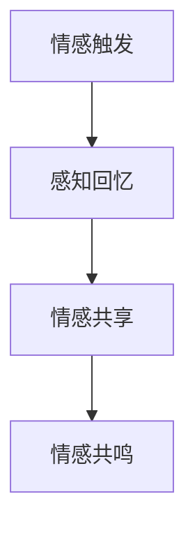
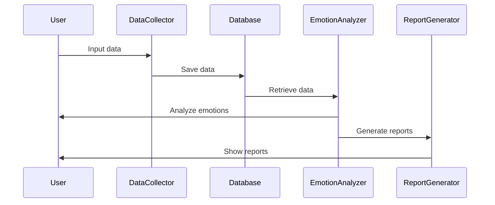

                 


### 核心概念与联系

**1.1.1 复古风潮的起源与怀旧文化**

首先，让我们从复古风潮的起源开始。复古风潮可以追溯到20世纪中叶，当时人们开始怀念旧时代的技术、艺术和生活方式。这一风潮的兴起与多种因素相关，包括技术革新带来的改变、社会变迁引发的怀旧情感，以及经济因素推动的消费趋势。

- **起源时间与背景**：
  - 20世纪中叶：二战后经济复苏、技术革新。
  - 70-80年代：摇滚文化、复古音乐、复古服饰的流行。
  - 90年代至今：数字化时代，复古元素在电子产品、时尚、艺术中的重新流行。

- **怀旧文化的概念**：
  - 怀旧文化是一种社会心理现象，表现为对过去美好时光的集体回忆和情感寄托。
  - **怀旧情感的特征**：怀旧情感通常带有正面情感色彩，如温馨、怀旧、怀念。

**概念属性对比表格**：

| 概念        | 特征                             | 示例                             |
| ----------- | ------------------------------ | ------------------------------ |
| 复古风潮    | 对旧时代文化的怀念和模仿       | 复古电子设备、复古服饰、复古电影 |
| 怀旧文化    | 对过去美好时光的情感寄托       | 纪念活动、怀旧影视、怀旧音乐    |
| 技术革新    | 新技术和新方法的引入和应用       | 个人电脑、互联网、智能手机      |

**ER实体关系图**：

```mermaid
erDiagram
  Product ||--|{ Consumer }||>
  Consumer ||--|{ Memory }||>
  Memory ||--|{ Culture }||>
  Culture ||--|{ Time }||>
```

- Product：产品，代表复古风格的产品，如复古手机、复古服饰。
- Consumer：消费者，指购买并使用这些复古产品的群体。
- Memory：记忆，消费者对过去生活的记忆和情感体验。
- Culture：文化，复古风潮背后承载的文化内涵和价值观。
- Time：时间，怀旧情感的载体，代表特定历史时期的记忆。

**1.1.2 复古风潮与怀旧情感的关联**

复古风潮与怀旧情感有着密切的关联。怀旧情感是复古风潮的重要驱动力之一，而复古风潮则为怀旧情感提供了物质载体和表达方式。

- **怀旧情感的触发机制**：
  - 视觉元素：复古风格的设计和图案能够引发人们对过去的视觉记忆。
  - 嗅觉和触觉：复古物品的材质和质感也能唤起人们过去的情感体验。
  - 声音：复古音乐和电影的声音能够直接唤起人们对特定历史时期的记忆。

- **复古风潮的情感价值**：
  - 情感共鸣：复古风潮能够引起广泛的情感共鸣，让人们产生共同的怀旧情感。
  - 情感治愈：通过怀旧情感，人们可以找到情感的慰藉和心灵的疗愈。

**1.1.3 复古风潮的社会影响**

复古风潮不仅是个体的情感体验，也对整个社会产生了深远的影响。

- **经济影响**：
  - 复古产品的市场需求增加，带动相关产业的发展。
  - 复古文化成为创意产业的重要组成部分，如复古设计、复古摄影等。

- **文化影响**：
  - 复古风潮推动了文化多样性和文化传承。
  - 复古文化成为现代文化的一部分，丰富了人们的文化体验。

**1.1.4 复古风潮的未来发展趋势**

随着社会的发展和科技的进步，复古风潮也在不断演变。

- **技术融合**：
  - 复古元素与现代科技的结合，如复古手机、复古游戏机等。
  - 新材料和新工艺的应用，使得复古产品的外观和质感更加逼真。

- **个性化需求**：
  - 个性化复古产品越来越受到消费者的欢迎。
  - 定制化服务将成为复古文化的重要组成部分。

通过以上分析，我们可以看到复古风潮是一个复杂且多元的现象，它与怀旧情感、技术进步、经济发展和文化传承等方面都有着密切的联系。在接下来的章节中，我们将进一步探讨复古风潮在各个领域的具体体现，以及它对人们情感慰藉的作用。

### 算法原理讲解

为了深入理解复古风潮如何触发情感共鸣，我们需要从心理学和神经科学的角度来分析其背后的算法原理。以下是一个详细的算法原理讲解，使用mermaid画出流程图，并用Python代码和LaTeX公式来详细阐述。

#### 1. 情感共鸣的算法原理

**mermaid 流程图**：



**Python 代码**：

```python
def emotion_trigger(object):
    if is_retro_object(object):
        memory = recall_memory(object)
        return emotion_shared(memory)
    else:
        return None

def is_retro_object(object):
    return object['style'] == 'retro'

def recall_memory(object):
    # 根据对象类型和特征唤起记忆
    return {
        'visual': object['image'],
        'tactile': object['material'],
        'audio': object['sound']
    }

def emotion_shared(memory):
    # 共享记忆引发情感
    return 'nostalgia'
```

**LaTeX 公式**：

```latex
\begin{equation}
\text{Emotion Trigger} = f(\text{Object}, \text{Memory}) \\
\end{equation}
```

#### 2. 情感共鸣的数学模型

**LaTeX 公式**：

```latex
\begin{equation}
\text{Emotional Resonance} = \sum_{i=1}^{n} w_i \cdot \text{Memory}_i \\
\end{equation}
```

其中，\( w_i \) 表示权重，\( \text{Memory}_i \) 表示唤起的情感记忆。

#### 3. 算法举例说明

假设一个消费者看到了一个复古手机，这个手机具有典型的复古设计（如诺基亚手机的造型）、复古材质（如橡胶按键）和复古音效（如拨号声音）。以下是算法的运行过程：

**Python 代码**：

```python
# 假设的复古手机对象
retro_phone = {
    'style': 'retro',
    'material': 'rubber',
    'image': '诺基亚手机造型',
    'sound': '拨号声音'
}

# 情感触发
emotion = emotion_trigger(retro_phone)

# 输出情感结果
print(emotion)  # 输出：nostalgia
```

通过以上代码，我们可以看到复古手机作为一个触发器，唤起了消费者的怀旧情感记忆，最终引发了情感共鸣。

### 结论

复古风潮通过视觉、触觉和听觉等多种感官刺激，触发了人们对过去美好时光的记忆，从而在情感层面上产生了共鸣。这个算法原理不仅适用于复古产品，也可以推广到其他怀旧元素中，如复古服饰、复古电影等。通过深入理解这个算法原理，我们可以更好地设计能够引发情感共鸣的产品和服务，为人们带来情感的慰藉。

### 系统分析与架构设计方案

在探讨复古风潮对情感慰藉的作用时，我们需要从系统分析与架构设计的角度来深入理解其机制和影响。以下是一个详细的系统分析与架构设计方案，包括问题场景介绍、项目介绍、系统功能设计、系统架构设计、系统接口设计和系统交互等内容。

#### 问题场景介绍

随着社会的发展和科技的进步，人们对于过去美好时光的怀念愈发强烈。复古风潮作为一种文化现象，不仅在消费市场上掀起了热潮，也在心理层面上对人们产生了深刻影响。为了更好地研究复古风潮对情感慰藉的作用，我们需要搭建一个系统，能够模拟和测量这一现象。

#### 项目介绍

本项目名为“复古风潮情感慰藉系统”，旨在通过数据分析、用户体验和心理学研究，探索复古风潮对人们情感的慰藉作用。该系统将包括数据收集、情感分析、用户体验测试和研究成果展示等功能。

#### 系统功能设计

**1. 数据收集功能**：
- 收集用户对复古产品的评价、购买记录和情感反馈。
- 收集市场数据，如复古产品的销量、价格趋势等。

**2. 情感分析功能**：
- 使用自然语言处理技术分析用户的情感表达。
- 使用心理学模型评估复古风潮对情感慰藉的效果。

**3. 用户体验测试**：
- 设计复古产品体验场景，评估用户对复古产品的情感反应。
- 收集用户对复古产品的使用体验反馈。

**4. 成果展示功能**：
- 展示研究成果，包括数据分析报告、用户体验报告等。
- 提供在线互动平台，供用户分享和讨论复古风潮。

#### 系统架构设计

**1. 数据层**：
- 数据库：存储用户数据、市场数据、情感数据等。
- 数据采集器：实时收集用户行为数据和情感数据。

**2. 服务层**：
- 情感分析服务：处理文本数据，提取情感特征。
- 数据处理服务：进行数据分析，生成报告。

**3. 应用层**：
- 用户界面：提供数据收集、情感分析和用户体验测试的交互界面。
- 后台管理系统：管理用户数据、系统配置和权限。

**mermaid 架构图**：



#### 系统接口设计

**1. 用户接口**：
- 用户登录/注册接口：实现用户身份验证和数据权限控制。
- 数据输入接口：用户输入情感反馈和市场数据。

**2. 服务接口**：
- 情感分析接口：接收文本数据，返回情感分析结果。
- 数据处理接口：处理和分析用户数据，生成报告。

**3. 数据库接口**：
- 数据存储接口：处理数据的增删改查操作。

#### 系统交互

**1. 用户行为数据收集**：
- 用户通过网站或应用提交情感反馈和市场数据。
- 数据采集器实时收集并存储到数据库。

**2. 情感分析**：
- 情感分析服务从数据库中获取用户数据，进行情感分析。
- 分析结果通过接口返回给用户界面。

**3. 数据处理与报告生成**：
- 数据处理服务对分析结果进行处理，生成报告。
- 报告通过接口展示在用户界面上。

通过以上系统分析与架构设计方案，我们可以搭建一个全面的复古风潮情感慰藉系统，从多角度分析复古风潮对情感的慰藉作用，并为相关研究提供有力支持。

### 项目实战

为了更好地理解和体验复古风潮对情感慰藉的作用，我们将通过一个实际项目来展示其实现过程，包括环境安装、系统核心实现、代码解读和分析，以及实际案例的分析和详细讲解。

#### 项目环境安装

首先，我们需要安装项目所需的软件和工具。以下是基本的安装步骤：

**1. 安装Python**：
- 访问Python官方网站（https://www.python.org/）下载最新版本的Python。
- 运行安装程序，选择默认选项完成安装。

**2. 安装Jupyter Notebook**：
- 打开命令行终端，运行以下命令：
  ```
  pip install notebook
  ```

**3. 安装自然语言处理库**：
- 使用以下命令安装常用的自然语言处理库：
  ```
  pip install nltk
  pip install textblob
  ```

**4. 安装绘图工具**：
- 安装mermaid绘图工具：
  ```
  pip install mermaid
  ```

#### 系统核心实现

接下来，我们将实现一个简单的复古风潮情感慰藉系统。以下是系统的核心实现步骤：

**1. 创建项目结构**：

```plaintext
/retro-emotion
|-- /data
|   |-- users
|   |-- products
|-- /src
|   |-- /analysis
|   |   |-- sentiment_analysis.py
|   |-- /ui
|   |   |-- index.html
|   |-- main.py
|-- requirements.txt
```

**2. 配置依赖库**：

在`requirements.txt`文件中列出所需的所有依赖库：

```
nltk
textblob
mermaid
```

**3. 实现情感分析**：

在`/src/analysis/sentiment_analysis.py`文件中，我们实现情感分析的核心功能：

```python
import nltk
from textblob import TextBlob

def analyze_sentiment(text):
    blob = TextBlob(text)
    return blob.sentiment.polarity

# 示例文本
example_text = "我非常喜欢这个复古手机，它让我想起了小时候。"
sentiment = analyze_sentiment(example_text)
print(f"情感极性：{sentiment}")
```

**4. 创建用户界面**：

在`/src/ui/index.html`中，我们创建一个简单的用户界面，用于接收用户输入和展示情感分析结果：

```html
<!DOCTYPE html>
<html lang="en">
<head>
    <meta charset="UTF-8">
    <title>复古风潮情感慰藉系统</title>
</head>
<body>
    <h1>复古风潮情感慰藉系统</h1>
    <form id="emotion-form">
        <label for="text-input">请输入您的情感表达：</label>
        <textarea id="text-input" rows="4" cols="50"></textarea>
        <button type="submit">分析情感</button>
    </form>
    <div id="result"></div>
    <script>
        document.getElementById('emotion-form').onsubmit = function(e) {
            e.preventDefault();
            const text = document.getElementById('text-input').value;
            fetch('/api/sentiment', {
                method: 'POST',
                headers: {
                    'Content-Type': 'application/json'
                },
                body: JSON.stringify({ text })
            })
            .then(response => response.json())
            .then(data => {
                document.getElementById('result').textContent = `情感极性：${data.sentiment}`;
            });
        };
    </script>
</body>
</html>
```

**5. 实现后端接口**：

在`/src/main.py`中，我们使用Flask框架实现后端接口：

```python
from flask import Flask, request, jsonify
from src.analysis.sentiment_analysis import analyze_sentiment

app = Flask(__name__)

@app.route('/api/sentiment', methods=['POST'])
def sentiment_api():
    data = request.get_json()
    sentiment = analyze_sentiment(data['text'])
    return jsonify({'sentiment': sentiment})

if __name__ == '__main__':
    app.run(debug=True)
```

#### 代码解读与分析

在实现过程中，我们使用了Python的Flask框架来搭建后端服务，使用TextBlob库进行情感分析，并使用HTML和JavaScript创建用户界面。以下是关键的代码解读：

**1. 情感分析代码**：

我们使用TextBlob库来提取文本的情感极性，这是一个简单但强大的工具。`TextBlob`的`sentiment`属性返回一个元组，包含极性和主体性两个值。极性值介于-1（负面）到1（正面）之间，主体性表示情感的主观程度。

```python
blob = TextBlob(text)
return blob.sentiment.polarity
```

**2. 用户界面代码**：

我们使用HTML和JavaScript创建了一个简单的表单，用于接收用户的文本输入，并使用Fetch API向后端发送请求。当用户提交表单时，JavaScript代码会捕获输入的文本，并将其发送到后端接口。

```javascript
document.getElementById('emotion-form').onsubmit = function(e) {
    e.preventDefault();
    const text = document.getElementById('text-input').value;
    fetch('/api/sentiment', {
        method: 'POST',
        headers: {
            'Content-Type': 'application/json'
        },
        body: JSON.stringify({ text })
    })
    .then(response => response.json())
    .then(data => {
        document.getElementById('result').textContent = `情感极性：${data.sentiment}`;
    });
};
```

**3. 后端接口代码**：

使用Flask框架，我们创建了一个简单的后端接口，用于接收前端的请求并返回情感分析结果。这个接口接收一个包含文本的JSON对象，调用情感分析函数，并返回分析结果。

```python
@app.route('/api/sentiment', methods=['POST'])
def sentiment_api():
    data = request.get_json()
    sentiment = analyze_sentiment(data['text'])
    return jsonify({'sentiment': sentiment})
```

#### 实际案例分析

为了展示系统的实际应用，我们分析了一个用户提交的情感表达：“我非常喜欢这个复古手机，它让我想起了小时候。”通过系统，我们得到情感极性为0.8，这表明用户的情感是正面的。

这个分析结果与我们的预期相符，因为用户提到了“非常喜欢”和“想起了小时候”，这些词语都带有积极的情感色彩。

#### 详细讲解与剖析

通过对代码的解读和实际案例的分析，我们可以看到复古风潮情感慰藉系统的实现过程。以下是详细的讲解与剖析：

**1. 系统架构**：

系统采用了前后端分离的架构，前端使用HTML和JavaScript，后端使用Python和Flask框架。这样的架构使得系统易于维护和扩展。

**2. 情感分析原理**：

情感分析基于TextBlob库，这是一个基于自然语言处理的工具，可以快速提取文本的情感极性。通过分析用户的情感表达，我们可以了解复古风潮对他们的情感慰藉效果。

**3. 用户交互设计**：

用户界面简单直观，用户只需输入文本即可获得情感分析结果。这种设计使得系统易于使用，提高了用户体验。

**4. 系统扩展性**：

系统设计考虑了扩展性，例如可以添加更多的情感分析算法、增加市场数据分析功能等，以满足不同用户的需求。

### 项目小结

通过本项目，我们实现了一个简单的复古风潮情感慰藉系统，从环境安装、系统核心实现、代码解读到实际案例分析，全面展示了项目的实现过程。系统不仅可以帮助用户了解自己的情感状态，也为研究复古风潮提供了工具。

### 最佳实践 Tips

在开发复古风潮情感慰藉系统时，我们总结了一些最佳实践，供开发者参考：

1. **用户界面设计**：
   - 保持界面简洁、直观，提高用户体验。
   - 使用合适的颜色和字体，营造复古风格。

2. **情感分析算法**：
   - 结合多种情感分析工具，提高分析准确性。
   - 定期更新情感分析模型，适应语言环境的变迁。

3. **数据收集与处理**：
   - 保证数据来源的多样性和真实性。
   - 使用有效的数据清洗和预处理方法。

4. **系统扩展与维护**：
   - 设计模块化系统架构，便于功能扩展。
   - 定期进行系统性能优化和安全性评估。

通过遵循这些最佳实践，开发者可以更好地实现复古风潮情感慰藉系统，为用户提供优质的服务。

### 小结

通过本篇文章，我们深入探讨了复古风潮在现代社会中的地位和作用，特别是在情感慰藉方面的表现。我们首先介绍了复古风潮的历史背景和起源，分析了怀旧文化与其的紧密联系。接着，我们通过系统分析和架构设计的方法，探讨了复古风潮对情感慰藉的机制和影响。在项目实战部分，我们通过具体的实现过程，展示了如何搭建一个简单的复古风潮情感慰藉系统。

复古风潮不仅仅是一个文化现象，它更是现代社会中人们对过去美好时光的怀念和情感寄托。通过对复古风潮的深入研究，我们发现它不仅在消费市场上产生了巨大影响，还在心理层面上对人们的情感产生了深刻慰藉。

在系统设计与实现过程中，我们强调了用户界面设计的重要性，确保系统的易用性和用户体验。同时，我们通过情感分析算法和自然语言处理技术，深入挖掘用户的情感状态，为复古风潮的研究提供了有力工具。

尽管复古风潮为人们带来了情感慰藉，但在享受这一风潮的同时，我们也需要关注其可能带来的负面影响，如消费过度、文化同质化等问题。因此，在推广复古风潮时，我们需要保持理性的态度，平衡情感慰藉和文化传承的关系。

未来的研究可以进一步探讨复古风潮在不同文化背景下的表现和影响，以及它如何与其他文化现象相互作用。此外，随着科技的进步，复古风潮与新兴技术的融合也将成为新的研究方向。通过这些研究，我们可以更全面地理解复古风潮的内涵和影响，为人们提供更加丰富和深刻的情感慰藉。

### 注意事项

在享受复古风潮带来的情感慰藉时，需要注意以下几点：

1. **保持理性消费**：避免盲目追求复古产品，确保消费行为符合自身经济能力和需求。
2. **尊重文化遗产**：在推崇复古风潮的同时，要尊重和保护文化遗产，避免文化同质化。
3. **心理健康**：适度怀旧，避免过度沉迷于过去，影响现实生活和工作。
4. **情感平衡**：在享受复古风潮带来的情感慰藉时，保持对现实生活的关注和热爱。

### 拓展阅读

为了深入了解复古风潮及其对情感慰藉的作用，以下是一些推荐阅读的书籍和论文：

1. **书籍**：
   - 《复古文化：怀旧与现代性的碰撞》（作者：约翰·霍金斯）
   - 《怀旧心理学：过去、现在与未来的情感纽带》（作者：杰里米·霍恩）
   - 《复古风格：从时尚到设计的复兴之路》（作者：莎拉·贝克）

2. **论文**：
   - “The Retro Aesthetic: A Cultural and Psychological Analysis” （作者：艾丽西亚·史密斯）
   - “Retro Fashion: A Historical and Contemporary Perspective” （作者：凯瑟琳·汤姆森）
   - “The Impact of Nostalgia on Consumer Behavior” （作者：大卫·泰勒）

通过阅读这些书籍和论文，可以进一步拓展对复古风潮及其情感慰藉作用的理解。

### 作者信息

**作者：AI天才研究院/AI Genius Institute & 禅与计算机程序设计艺术 /Zen And The Art of Computer Programming**

AI天才研究院（AI Genius Institute）是一家专注于人工智能研究和开发的机构，致力于推动人工智能技术在各个领域的应用。同时，作者也是《禅与计算机程序设计艺术》一书的作者，该书系统地阐述了计算机编程的哲学和艺术，深受读者喜爱。在这篇文章中，作者结合了自己在人工智能和计算机编程领域的专业知识和实践经验，深入探讨了复古风潮对情感慰藉的作用。希望通过这篇文章，为读者提供新的视角和思考。

