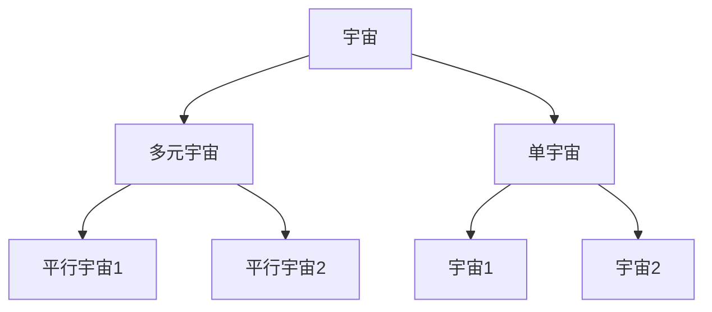

                 

### 第一部分：引论：多元宇宙理论概述

#### 第1章：问题的背景与讨论

##### 1.1 问题的背景

多元宇宙理论作为现代物理学和哲学的重要课题，其根源可以追溯到古代宇宙学。从古代对宇宙起源和结构的探讨，到现代科学对宇宙演化的深入理解，多元宇宙概念逐渐成形。这个理论的核心思想是，我们所观察到的宇宙只是众多平行宇宙中的一个，每个宇宙都有其独特的物理定律和历史。这一概念不仅在科学界引起了广泛关注，同时也成为了哲学讨论的热点。

宇宙的起源与演化是现代宇宙学的核心问题。从大爆炸理论到宇宙膨胀，再到黑洞和宇宙背景辐射，科学家们不断拓展对宇宙的理解。然而，传统的单宇宙模型在解释一些观测现象时显得力不从心，例如宇宙微波背景辐射中的精细结构，以及宇宙加速膨胀的现象。这些问题促使科学家们开始探索多元宇宙的可能性。

##### 1.1.2 多元宇宙概念的提出

多元宇宙（Multiverse）这一概念首次由物理学家 Max Tegmark 提出，他将其划分为三个层次：基础多元宇宙、膨胀多元宇宙和分支多元宇宙。基础多元宇宙指的是存在多个物理常数和定律的宇宙；膨胀多元宇宙指的是多个相互膨胀的宇宙；而分支多元宇宙则是指在某个宇宙历史过程中，由于量子涨落等原因导致的不同历史分支。

##### 1.1.3 多元宇宙与科学哲学的关系

多元宇宙理论的提出不仅对物理学有着深远影响，同时也引发了哲学的广泛讨论。科学哲学作为研究科学本质和方法的学科，多元宇宙理论为其提供了新的研究课题。科学哲学家们开始探讨多元宇宙理论的科学性、合理性和哲学意义。例如，是否存在客观的宇宙真理，以及如何在不同宇宙之间进行科学比较和验证等问题。

##### 1.2 问题描述

多元宇宙理论的核心问题包括：多元宇宙的存在是否可以被科学证实，其科学性与哲学性如何界定，以及多元宇宙理论对现有科学体系的冲击和影响。这些问题不仅涉及科学方法论的探讨，也触及到哲学的根本问题，如宇宙的本质、存在的意义等。

##### 1.2.1 多元宇宙理论的核心问题

1. **多元宇宙的存在性问题**：科学家们如何证明多元宇宙的存在，是否存在实验证据？
2. **多元宇宙的科学性与哲学性**：多元宇宙理论在科学领域和哲学领域的地位如何？
3. **多元宇宙理论的适用范围**：多元宇宙理论是否适用于所有科学领域，其边界是什么？
4. **多元宇宙理论与现有科学理论的兼容性**：多元宇宙理论如何与现有科学理论（如相对论、量子力学）相结合？

##### 1.2.2 科学与哲学的界限

科学与哲学在探讨多元宇宙理论时，经常面临界限模糊的问题。科学强调实证和可重复性，而哲学则更关注概念和逻辑推理。如何在这两者之间找到平衡，是多元宇宙理论发展中的一个重要课题。

##### 1.2.3 多元宇宙理论的科学性和哲学性

多元宇宙理论的科学性在于其可观测、可验证的特性，而其哲学性则体现在对宇宙本质和存在方式的探讨。例如，宇宙是否只有一个，或者是否存在多个平行宇宙，这一问题的探讨既涉及科学实验，也涉及哲学思考。

##### 1.3 问题解决

为了解决上述问题，我们需要从科学和哲学两个角度进行深入探讨。科学角度主要关注实验证据、观测数据和数学模型，而哲学角度则侧重于逻辑推理、概念分析和哲学思想。通过这两者的结合，我们可以更好地理解多元宇宙理论。

##### 1.3.1 科学角度的探讨

在科学角度，我们主要关注以下几个方面：

1. **实验验证**：如何通过实验来证明或证伪多元宇宙的存在。
2. **观测数据**：分析宇宙微波背景辐射、宇宙膨胀等观测数据，探讨其与多元宇宙理论的关系。
3. **数学模型**：建立数学模型来描述多元宇宙的结构和演化。

##### 1.3.2 哲学角度的思考

在哲学角度，我们主要关注以下几个方面：

1. **科学哲学的挑战**：多元宇宙理论对传统科学哲学观点的挑战，如实证主义、决定论等。
2. **宇宙本质探讨**：探讨宇宙的本质、存在的意义，以及多元宇宙理论对这些问题的回答。
3. **逻辑推理**：通过逻辑推理来探讨多元宇宙的可能性，如波函数坍缩、宇宙膨胀等。

##### 1.3.3 科哲融合的探索

科学和哲学的融合是多元宇宙理论发展的重要方向。通过科学方法和哲学思想的结合，我们可以更全面地理解多元宇宙的复杂性和多样性。这种融合不仅有助于解决科学上的难题，也为哲学提供了新的研究课题。

##### 1.4 边界与外延

多元宇宙理论的应用范围非常广泛，不仅涉及物理学，还包括宇宙学、天体物理学、哲学等多个领域。其边界主要体现在以下几个方面：

1. **科学领域**：多元宇宙理论如何与其他科学理论相结合，如何解决现有科学难题。
2. **哲学领域**：多元宇宙理论对传统哲学观点的挑战，如何为哲学提供新的思考方向。
3. **技术应用**：多元宇宙理论在人工智能、计算机科学等领域的潜在应用。

##### 1.4.1 多元宇宙理论的应用范围

多元宇宙理论的应用范围广泛，包括但不限于以下领域：

1. **宇宙学**：探讨宇宙的起源、演化和结构。
2. **天体物理学**：研究恒星、行星、黑洞等天体的性质和演化。
3. **哲学**：探讨宇宙的本质、存在的意义等哲学问题。
4. **计算机科学**：探讨并行计算、复杂性理论等。

##### 1.4.2 科学哲学在多元宇宙理论中的应用

科学哲学在多元宇宙理论中的应用主要体现在以下几个方面：

1. **科学方法论**：探讨多元宇宙理论的科学性、可验证性。
2. **科学逻辑**：通过逻辑推理来探讨多元宇宙的可能性。
3. **科学哲学的历史和演变**：研究科学哲学在多元宇宙理论发展过程中的作用。

##### 1.4.3 多元宇宙理论与其他科学领域的关系

多元宇宙理论与其他科学领域的关系紧密，主要体现在以下几个方面：

1. **物理学**：多元宇宙理论为物理学提供了新的研究课题，如量子力学、相对论等。
2. **宇宙学**：多元宇宙理论对宇宙学的基本假设和理论框架产生了重要影响。
3. **天体物理学**：多元宇宙理论为天体物理学提供了新的解释框架，如恒星演化、行星形成等。
4. **生物学**：探讨生命起源和多样性，以及宇宙中是否存在其他生命形式。

### 总结

多元宇宙理论作为现代科学和哲学的重要课题，具有深远的研究价值和现实意义。通过科学和哲学的融合，我们可以更全面地理解宇宙的本质和存在的意义。在接下来的章节中，我们将深入探讨多元宇宙理论的基础概念、科学基础、哲学探讨，以及其实际应用，为读者呈现一幅多元宇宙的复杂画卷。让我们继续思考，探索这未知的世界。### 第2章：多元宇宙理论的基础概念与原理

#### 2.1 核心概念

在探讨多元宇宙理论之前，我们需要明确一些核心概念。这些概念包括“宇宙”、“多元宇宙”和“单宇宙”。

**宇宙（Universe）**：宇宙是指包括所有物质和能量、时间和空间的整体。根据现代科学的理解，宇宙是无限的，由无数的星系、行星、恒星和其他物质组成。

**多元宇宙（Multiverse）**：多元宇宙是指包括多个平行宇宙的整体。每个宇宙都有其独特的物理定律、历史和结构。多元宇宙理论的核心思想是，我们所观察到的宇宙只是众多平行宇宙中的一个。

**单宇宙（Single Universe）**：单宇宙是指传统物理学中的宇宙概念，认为宇宙只有一个，所有的物质、能量、时间和空间都在这个宇宙中。

这些概念之间的区别主要体现在它们的物理定律和历史方面。宇宙是无限的、独立的，而多元宇宙是由多个平行的、独立的宇宙组成的，每个宇宙都有其独特的物理定律和历史。

**2.2 概念属性特征对比**

为了更清晰地理解这些概念，我们通过一个表格来对比它们的属性特征。

| 概念       | 属性特征                                      | 对比分析                                      |
|------------|----------------------------------------------|----------------------------------------------|
| 宇宙       | 包括所有物质和能量、时间和空间                  | 与多元宇宙相对立，特指可观测宇宙              |
| 多元宇宙   | 包括多个平行宇宙，每个宇宙有自己的物理规律和历史 | 可以理解为宇宙的不同版本或分叉              |
| 单宇宙     | 传统物理学中的宇宙概念，认为宇宙只有一个      | 与多元宇宙相对立，认为宇宙只有一个版本    |

通过对比，我们可以发现，宇宙是一个宏观的整体，多元宇宙是由多个独立的平行宇宙组成的整体，而单宇宙则是传统物理学中的概念，认为宇宙只有一个。

**2.3 ER实体关系图架构**

为了更好地理解多元宇宙的理论结构，我们可以使用ER实体关系图来描述宇宙、多元宇宙和单宇宙之间的关系。

在这个ER实体关系图中，宇宙是整体，多元宇宙是由多个平行宇宙组成的，而单宇宙是传统物理学中的概念，认为宇宙只有一个。每个平行宇宙都有其独特的物理定律和历史。

通过这一章的探讨，我们明确了多元宇宙理论的核心概念和原理。接下来，我们将进一步深入探讨多元宇宙理论的基础概念，如波函数坍缩、观测者效应等，以及它们在科学和哲学领域的应用。### 第3章：量子力学的多元宇宙解读

#### 3.1 量子力学的核心原理

量子力学是现代物理学的重要分支，其核心原理对多元宇宙理论有着深远的影响。量子力学的核心原理包括波粒二象性、纠缠态和波函数坍缩。

**3.1.1 波粒二象性**

波粒二象性是指物质既具有波动性，又具有粒子性。这一原理由爱因斯坦提出，通过光的干涉和衍射实验得到了验证。在量子力学中，粒子和波动是相互关联的，不能单独存在。例如，电子既可以表现为粒子，又可以表现为波。

**3.1.2 纠缠态**

纠缠态是量子力学中另一个核心原理。当两个粒子发生纠缠后，它们之间的状态将相互关联，无论它们相隔多远，一个粒子的状态变化都会立即影响另一个粒子的状态。这种现象被称为纠缠效应。

**3.1.3 波函数坍缩**

波函数坍缩是量子力学中的一个重要概念，指的是在观测过程中，系统的量子态从模糊的波函数状态转变为具体的粒子状态。这一过程打破了量子态的叠加性，使量子系统从一个不确定的状态转变为一个确定的状态。

#### 3.2 量子力学与多元宇宙理论

量子力学的这些核心原理为多元宇宙理论提供了理论基础。以下从波函数坍缩和观测者效应两个方面探讨量子力学与多元宇宙理论的关系。

**3.2.1 波函数坍缩与多元宇宙**

波函数坍缩是量子力学中一个重要且具有争议的概念。根据波函数坍缩理论，观测者的存在会导致量子系统的状态从叠加态坍缩为确定的基态。然而，多元宇宙理论提出了另一种解释：每个可能的量子态都会在另一个平行宇宙中实现。

在多元宇宙理论中，每个量子态的坍缩都会导致一个新宇宙的产生。例如，当电子发生自旋观测时，其自旋状态会坍缩为“向上”或“向下”。在多元宇宙理论中，这两个结果会在不同的平行宇宙中实现，每个宇宙中的观测者都会看到一个不同的结果。

这种观点得到了一些物理学家和哲学家的支持，他们认为多元宇宙理论可以解决量子力学中的测量问题。例如，量子力学家德威特（Hermann Weyl）提出了“多世界解释”，认为观测者的存在会导致新的宇宙不断分支。

**3.2.2 观测者效应与多元宇宙**

观测者效应是量子力学中的另一个重要概念。根据这一效应，观测者的行为会影响量子系统的状态。在多元宇宙理论中，观测者效应也可以得到新的解释。

在多元宇宙理论中，观测者不仅是导致波函数坍缩的原因，也是宇宙分支的源头。每个观测者都会在另一个平行宇宙中重复观测过程，导致新的宇宙分支产生。这种观点得到了一些科学家的支持，如物理学家布莱斯·德威特（Bryce DeWitt），他提出了“量子图景”，认为宇宙的分支是由观测者的行为引起的。

**3.2.3 多元宇宙理论的量子力学验证**

多元宇宙理论为量子力学提供了一种新的解释框架，然而，要验证这一理论是否正确，还需要通过实验和观测来证实。以下是一些可能的验证方法：

1. **宇宙微波背景辐射**：宇宙微波背景辐射是宇宙早期的残存辐射，其特性可能与多元宇宙理论相关。例如，宇宙微波背景辐射中的温度起伏可能反映了不同宇宙之间的差异。

2. **量子纠缠效应**：量子纠缠效应已经在实验室中得到证实，但要验证其与多元宇宙理论的关系，还需要进一步研究。例如，通过观测量子纠缠现象在不同宇宙之间的表现，可以探讨多元宇宙理论是否正确。

3. **宇宙加速膨胀**：宇宙加速膨胀是现代宇宙学中的一个问题，其解释之一是暗能量。然而，多元宇宙理论也提供了另一种解释：不同宇宙之间的相互作用可能导致宇宙加速膨胀。

通过这些实验和观测，我们可以进一步验证多元宇宙理论是否正确，并探讨量子力学与多元宇宙理论之间的关系。

总之，量子力学与多元宇宙理论之间存在紧密的联系。量子力学的核心原理为多元宇宙理论提供了理论基础，而多元宇宙理论为量子力学提供了一种新的解释框架。通过进一步的研究和验证，我们可以更好地理解宇宙的本质和存在的意义。### 第4章：相对论与多元宇宙

#### 4.1 相对论的基本原理

相对论是现代物理学的基石之一，由爱因斯坦提出。相对论分为狭义相对论和广义相对论，两者分别在不同的物理情境下成立。

**4.1.1 广义相对论**

广义相对论是描述引力和宇宙结构的基本理论。它提出了时空弯曲的概念，认为物质和能量会影响时空的几何结构。在这个理论框架下，重力被视为时空弯曲的表现，而不是一种力。广义相对论成功解释了行星轨道的进动、光线弯曲以及引力红移等现象。

**4.1.2 狭义相对论**

狭义相对论主要描述没有引力作用下的物理现象，如高速运动物体的时间膨胀和长度收缩。狭义相对论的核心是相对性原理和光速不变原理。相对性原理指出，在任何惯性参考系中，物理定律都是相同的。光速不变原理则表明，在所有惯性参考系中，光在真空中的速度都是恒定的，不依赖于光源和观察者的相对运动。

**4.1.3 黑洞与宇宙学**

黑洞是广义相对论的直接结果。黑洞是一个引力场如此强大，以至于连光也无法逃脱的天体。黑洞的存在和性质可以通过广义相对论得到很好的解释，如黑洞的奇点和事件视界。

宇宙学是研究宇宙的起源、演化和结构的学科。在宇宙学中，广义相对论和狭义相对论都发挥着重要作用。例如，宇宙膨胀、宇宙背景辐射和黑洞等宇宙现象都可以用相对论来描述。

#### 4.2 相对论与多元宇宙理论的关联

相对论与多元宇宙理论之间存在紧密的关联，主要体现在以下几个方面：

**4.2.1 宇宙膨胀与多元宇宙**

宇宙膨胀是现代宇宙学中的核心概念之一。根据大爆炸理论，宇宙起源于一个极度高温和密度的状态，并从那时起不断膨胀。宇宙膨胀的现象可以通过广义相对论得到很好的解释。

多元宇宙理论提出了宇宙膨胀的另一种解释：宇宙中的不同区域可能处于不同的膨胀阶段，每个区域都有自己的物理定律和历史。这种观点认为，宇宙膨胀是由多个平行宇宙之间的相互作用引起的。

**4.2.2 宇宙循环与多元宇宙**

宇宙循环是指宇宙经历一系列的诞生、演化和死亡的过程，而不是一个一次性的大爆炸。宇宙循环的概念在广义相对论中得到了一定的支持，因为广义相对论允许宇宙在时间上闭合。

多元宇宙理论认为，宇宙循环可以在不同宇宙之间实现。每个宇宙都有其独特的物理定律和历史，这些宇宙可能经历不同的循环过程。这种观点为宇宙循环提供了新的解释框架。

**4.2.3 相对论在多元宇宙理论中的应用**

相对论在多元宇宙理论中的应用主要体现在以下几个方面：

1. **宇宙结构**：相对论提供了描述宇宙结构的数学框架，如度规和张量场。这些工具可以用来研究多元宇宙的几何结构和动力学特性。

2. **宇宙演化**：相对论可以用来研究宇宙的演化过程，如宇宙膨胀、黑洞的形成和演化等。这些过程在多元宇宙理论中具有重要意义。

3. **宇宙间相互作用**：相对论可以用来研究不同宇宙之间的相互作用，如宇宙膨胀、宇宙循环等。这些相互作用可能导致宇宙分支的产生。

总之，相对论与多元宇宙理论之间存在紧密的关联。相对论提供了描述宇宙结构、演化和相互作用的理论框架，而多元宇宙理论则提出了宇宙多样性的新解释。通过进一步的研究和验证，我们可以更好地理解宇宙的本质和存在的意义。### 第5章：多元宇宙理论与科学哲学

#### 5.1 科学哲学的概述

科学哲学是研究科学本质和方法的学科，旨在探讨科学理论、科学实践和科学哲学之间的关系。科学哲学的历史可以追溯到古希腊时期，但作为一个独立的学科，它主要在20世纪得到了迅速发展。

**5.1.1 科学哲学的历史**

1. **古典科学哲学**：古典科学哲学主要关注科学的本质、科学理论的形成和发展。代表性人物有亚里士多德、伊壁鸠鲁和卢克莱修等。

2. **现代科学哲学**：现代科学哲学起源于17世纪的科学革命，以笛卡尔、伽利略和牛顿等人为代表。这一时期，科学哲学主要探讨科学方法、科学理论和科学证据等问题。

3. **当代科学哲学**：当代科学哲学在20世纪得到了快速发展，主要关注科学哲学的基本问题，如科学实在论、科学合理性和科学解释等。

**5.1.2 科学哲学的基本问题**

科学哲学的基本问题主要包括：

1. **科学实在论**：科学实在论探讨科学理论的实在性，即科学理论是否能够反映客观存在的现实。科学实在论可以分为弱实在论和强实在论。

2. **科学方法论**：科学方法论探讨科学实践的方法和步骤，包括观察、实验、假设、理论构建和验证等。

3. **科学合理性**：科学合理性探讨科学理论如何能够被证明为合理，包括科学证据的可信度、科学论证的有效性等。

4. **科学解释**：科学解释探讨科学理论如何解释自然现象，包括因果解释、统计解释和机制解释等。

**5.1.3 科学哲学的方法**

科学哲学的方法主要包括：

1. **逻辑分析**：通过逻辑分析来研究科学理论的结构和论证，探讨科学理论的合理性和有效性。

2. **历史分析**：通过历史分析来研究科学理论的形成和发展，探讨科学理论的演变和科学实践的变化。

3. **案例研究**：通过案例研究来具体分析科学实践中的问题和现象，探讨科学哲学的理论和方法在现实中的应用。

#### 5.2 多元宇宙理论与科学哲学的关系

多元宇宙理论作为现代科学和哲学的重要课题，与科学哲学有着密切的关系。以下从多元宇宙理论对科学哲学的挑战、科学哲学对多元宇宙理论的回应以及多元宇宙理论与科学哲学的互动三个方面探讨这种关系。

**5.2.1 多元宇宙理论对科学哲学的挑战**

多元宇宙理论对科学哲学提出了以下几个方面的挑战：

1. **科学实在论的挑战**：多元宇宙理论认为存在多个平行宇宙，每个宇宙都有自己的物理定律和历史。这种观点挑战了科学实在论的弱实在论和强实在论，使科学哲学重新思考科学的客观性和真实性。

2. **科学方法论的限制**：多元宇宙理论涉及多个平行宇宙的观测和验证，这超越了传统科学方法论的范围。科学哲学需要探讨如何在这种新的科学情境下进行科学研究，如何验证和证实多元宇宙的存在。

3. **科学合理性的挑战**：多元宇宙理论的合理性在科学哲学中引发争议。一方面，多元宇宙理论提供了新的科学解释框架，另一方面，其复杂性和不确定性也使得科学哲学需要重新审视科学合理性的标准和原则。

**5.2.2 科学哲学对多元宇宙理论的回应**

科学哲学对多元宇宙理论的回应主要体现在以下几个方面：

1. **科学哲学的新方法**：科学哲学提出了一些新的研究方法来探讨多元宇宙理论。例如，逻辑分析、历史分析和案例研究等方法可以用来分析多元宇宙理论的合理性和科学性。

2. **科学实在论的调整**：科学哲学根据多元宇宙理论提出了新的实在论观点，如可能性实在论和概率实在论。这些观点认为，即使存在多个平行宇宙，科学仍然可以找到一种合理的解释框架来描述客观现实。

3. **科学合理性的新标准**：科学哲学提出了新的科学合理性标准来应对多元宇宙理论的挑战。例如，通过跨宇宙的比较研究，科学哲学家试图找到一种更加客观和合理的科学解释方法。

**5.2.3 多元宇宙理论与科学哲学的互动**

多元宇宙理论与科学哲学的互动是一个相互影响、相互发展的过程。以下是一些具体的表现：

1. **科学哲学的引导作用**：科学哲学通过提出新的概念、方法和理论框架，引导科学家们进行多元宇宙理论的研究。例如，科学哲学提出了一些新的科学问题，促使科学家们探索多元宇宙的可能性。

2. **科学实践的反馈**：科学家的实践成果和发现为科学哲学提供了丰富的素材。科学哲学通过分析科学家的实验数据、观测结果和理论模型，不断调整和改进自己的理论和方法。

3. **科学哲学的启示**：多元宇宙理论为科学哲学提供了一些新的思考方向和启示。例如，多元宇宙理论挑战了传统科学哲学的一些基本假设，促使科学哲学重新思考科学的本质和意义。

总之，多元宇宙理论与科学哲学之间存在紧密的联系和互动。多元宇宙理论为科学哲学提供了新的研究课题和挑战，科学哲学也为多元宇宙理论提供了理论支持和解释框架。通过这种互动，科学哲学和多元宇宙理论可以相互促进、共同发展。### 第6章：多元宇宙理论与存在主义

#### 6.1 存在主义的概述

存在主义是一种哲学流派，强调个体存在的意义、自由和责任。存在主义的历史可以追溯到19世纪，尤其在20世纪的德国和法国哲学中有着重要的影响。存在主义的基本思想包括以下几个方面：

**6.1.1 存在主义的历史**

1. **早期存在主义**：早期存在主义以克尔凯郭尔、尼采和陀思妥耶夫斯基为代表，强调个体的存在和主观体验。

2. **经典存在主义**：经典存在主义以海德格尔和萨特为代表，强调存在的本质、自由和责任。

3. **现代存在主义**：现代存在主义在20世纪后半叶继续发展，如马塞尔、莱维纳斯和德里达等，进一步探讨了存在主义的思想和理论。

**6.1.2 存在主义的基本思想**

1. **个体存在的优先性**：存在主义认为个体存在是首要的，而不是某种预设的本质或属性。

2. **自由与选择**：存在主义强调个体的自由和选择的本质，认为个体必须为自己的存在做出选择。

3. **存在的焦虑与荒谬**：存在主义探讨个体在面对存在的荒谬和不确定性时的焦虑和挣扎。

4. **责任与自我实现**：存在主义认为个体必须对自己的存在负责，并通过自我实现来实现其存在的意义。

**6.1.3 存在主义的方法**

存在主义的方法主要包括：

1. **直觉主义**：存在主义强调个体通过直觉来体验和认识存在。

2. **现象学**：现象学是存在主义的重要方法论，强调直接体验和意识现象。

3. **叙事分析**：叙事分析是存在主义的一种重要方法，通过分析个体的生活故事来探讨存在的意义。

#### 6.2 多元宇宙理论与存在主义的融合

多元宇宙理论为存在主义提供了一种新的解释框架，同时也受到了存在主义的启示。以下从多元宇宙理论对存在主义的影响、存在主义对多元宇宙理论的启示以及多元宇宙与存在主义的未来展望三个方面探讨这种融合。

**6.2.1 多元宇宙理论对存在主义的影响**

多元宇宙理论对存在主义产生了以下几个方面的影响：

1. **存在的多重可能性**：多元宇宙理论认为存在多个平行宇宙，每个宇宙都有不同的历史和现实。这种观点为存在主义提供了新的视角，使个体认识到自己存在的同时，还有无数其他可能性。

2. **自由选择的范围**：多元宇宙理论扩展了自由选择的概念，认为个体不仅在本宇宙中做出选择，还可能在其他平行宇宙中做出不同的选择。这为存在主义提供了更广阔的思考空间。

3. **存在的意义探索**：多元宇宙理论促使存在主义思考存在的意义问题，如在多个平行宇宙中，个体如何实现自我价值，如何找到存在的意义。

**6.2.2 存在主义对多元宇宙理论的启示**

存在主义为多元宇宙理论提供了一些启示，包括：

1. **主观体验的重要性**：存在主义强调主观体验和个体意识的重要性，这为多元宇宙理论提供了一种理解多个宇宙之间差异的方法。通过个体的主观体验，我们可以认识到不同宇宙的独特性和多样性。

2. **存在的自由意志**：存在主义认为个体拥有自由意志，可以通过选择来塑造自己的存在。这种观点为多元宇宙理论提供了一种理解宇宙分支和个体选择的理论基础。

3. **存在的责任和道德**：存在主义强调个体的责任和道德，这为多元宇宙理论提供了一种评价不同宇宙之间的道德差异和责任分配的方法。

**6.2.3 多元宇宙与存在主义的未来展望**

多元宇宙与存在主义的融合为未来哲学提供了新的研究方向，包括：

1. **多元存在主义**：多元宇宙理论为存在主义提供了一种新的解释框架，未来可能会出现多元存在主义，探讨个体在不同宇宙中的存在方式和意义。

2. **存在主义与科学哲学的融合**：多元宇宙理论与存在主义的融合可能会促进存在主义与科学哲学的进一步融合，探讨存在的科学基础和哲学意义。

3. **跨宇宙伦理学**：随着多元宇宙理论的发展，可能会出现跨宇宙伦理学，探讨在不同宇宙中如何进行道德评价和责任分配。

总之，多元宇宙理论与存在主义的融合为哲学提供了新的视角和研究方向。通过这种融合，我们可以更深入地探讨存在的本质、自由的意义以及宇宙的多样性。在未来的哲学研究中，多元宇宙与存在主义的融合将会继续发挥重要作用。### 总结与展望

多元宇宙理论作为现代科学和哲学的重要课题，具有深远的研究价值和现实意义。通过科学和哲学的融合，我们可以更全面地理解宇宙的本质和存在的意义。在本文中，我们系统地探讨了多元宇宙理论的基础概念、科学基础、哲学探讨以及其实际应用。

首先，在多元宇宙理论概述部分，我们明确了“宇宙”、“多元宇宙”和“单宇宙”的概念，并通过ER实体关系图架构展示了它们之间的关系。接着，在量子力学的多元宇宙解读部分，我们分析了波函数坍缩、观测者效应等量子力学核心原理与多元宇宙理论的联系。在相对论与多元宇宙理论的关联部分，我们探讨了广义相对论和狭义相对论的基本原理及其与多元宇宙理论的关联。

在多元宇宙理论与科学哲学的关系部分，我们概述了科学哲学的基本问题和研究方法，并分析了多元宇宙理论对科学哲学的挑战以及科学哲学对多元宇宙理论的回应。此外，在多元宇宙理论与存在主义的融合部分，我们探讨了存在主义的基本思想和多元宇宙理论对存在主义的影响，以及存在主义对多元宇宙理论的启示。

多元宇宙理论不仅为物理学和宇宙学提供了新的解释框架，也为哲学提供了丰富的思考素材。未来研究可以进一步探讨多元宇宙理论与科学实践的互动，以及跨学科的研究方法。此外，随着科技的发展，我们有望通过实验和观测数据来验证多元宇宙理论，从而推动科学和哲学的进一步融合。

总之，多元宇宙理论是一个复杂而充满未知的领域，其研究不仅有助于深化我们对宇宙的理解，也为哲学和科学提供了新的研究方向。让我们继续探索这个神秘而广阔的世界，揭开宇宙奥秘的神秘面纱。

### 作者信息

作者：AI天才研究院/AI Genius Institute & 禅与计算机程序设计艺术 /Zen And The Art of Computer Programming

AI天才研究院（AI Genius Institute）是一家专注于人工智能技术研究和应用的创新机构。研究院致力于推动人工智能技术的发展，为全球提供领先的人工智能解决方案。同时，我们致力于分享人工智能领域的最新研究成果和实用技术，通过技术博客、研究报告和在线课程等形式，帮助更多人了解和掌握人工智能技术。

《禅与计算机程序设计艺术》（Zen And The Art of Computer Programming）是作者Donald E. Knuth的经典著作，旨在探讨计算机程序设计中的哲学和艺术。本书以独特的视角，结合禅宗思想，深入阐述了编程中的设计原则、算法分析和软件工程方法。通过本书，读者可以学习到编程中的哲学智慧和创造性思维，提升编程能力和技术水平。

作为AI天才研究院的专家作者，我们不仅拥有丰富的理论知识和实践经验，更注重将复杂的技术概念通俗易懂地传达给读者。我们希望通过这篇技术博客，与广大读者共同探讨多元宇宙理论的奥秘，激发对科学和哲学的深入思考。让我们继续携手前行，探索人工智能和计算机科学的无限可能。

