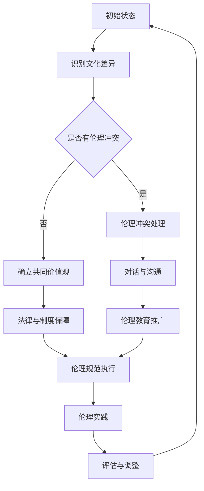
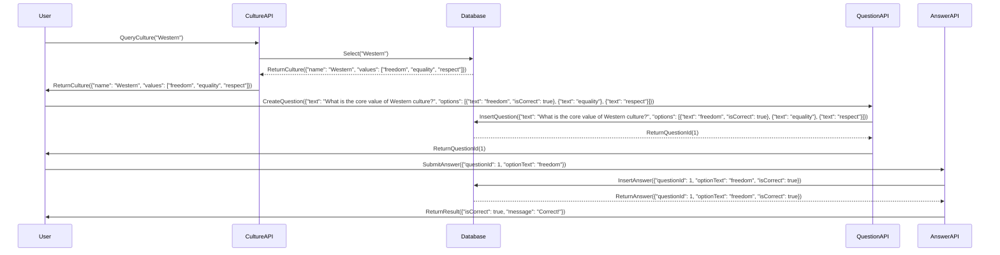
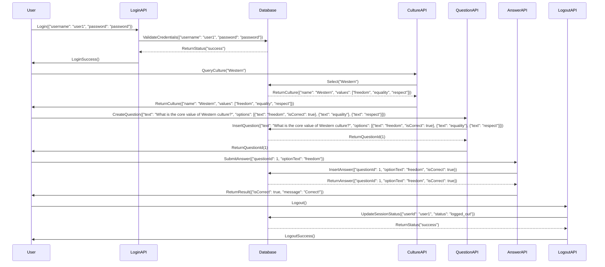

                 

# 《多元文化社会中的共同价值：寻找普世伦理》

关键词：多元文化，普世伦理，伦理观念，文化差异，跨文化沟通

摘要：本文从多元文化社会的背景出发，探讨了文化差异对伦理观念的影响，并在此基础上探讨了如何寻找普世伦理。文章通过哲学、宗教、教育等多个角度，分析了多元文化社会中的伦理实践，提出了构建和谐多元文化社会的策略，并对未来多元文化社会的发展趋势进行了展望。

## 引言

在全球化进程不断加速的今天，多元文化社会已成为一种普遍现象。不同文化背景的人们共同生活在一个社会中，如何在这个多元文化环境中找到共同的价值观念，成为了一个重要的问题。本文旨在探讨多元文化社会中的共同价值，即普世伦理，并分析如何在实际生活中寻找和践行这些价值。

### 多元文化社会的背景与挑战

多元文化社会的形成是由于全球化、移民、文化交流等多种因素的综合作用。在这种社会中，人们面临着前所未有的文化交融与碰撞。文化差异不仅体现在语言、宗教、风俗习惯等方面，还深刻影响了人们的价值观和伦理观念。

#### 文化差异与伦理冲突

文化差异带来的伦理冲突表现在许多方面，如婚姻观念、性别角色、教育观念、工作态度等。例如，在一些西方文化中，婚姻是建立在爱情基础上的，而在中国等东方文化中，婚姻更多地受到家庭和社会的期待。这种差异可能导致跨文化婚姻中的矛盾和冲突。

#### 尊重差异与寻求共同价值

面对文化差异，我们需要在尊重差异的同时，寻求共同的价值观念。这不仅是构建和谐社会的需要，也是实现全球合作和交流的基础。本文将从哲学、宗教、教育等多个角度，探讨如何寻找和确立普世伦理。

### 书籍的目标与结构

本文的目标是帮助读者理解多元文化背景下的伦理观念，探讨如何在不同文化之间寻找共同的价值观念。文章结构分为以下几个部分：

1. 多元文化概述
2. 文化差异与伦理观念
3. 寻找普世伦理
4. 跨文化伦理实践
5. 多元文化社会的未来展望

接下来，我们将依次探讨这些部分的内容。

## 第一部分：多元文化概述

### 第1章：多元文化的定义与特点

多元文化是指在一个社会中存在着多种不同的文化。这些文化可能来自不同的种族、民族、宗教、语言等。多元文化的特点主要体现在以下几个方面：

1. **多样性**：多元文化社会中的文化类型丰富多样，各种文化相互影响、相互交融。
2. **包容性**：多元文化社会强调对不同文化的尊重和包容，倡导平等和公正。
3. **复杂性**：多元文化社会中的文化差异可能导致误解和冲突，需要通过有效沟通和交流来化解。

### 第2章：不同文化背景下的伦理观念

伦理观念是指人们对道德和行为准则的看法。不同文化背景下的伦理观念存在明显的差异。以下是一些常见的文化差异：

1. **西方文化中的伦理观念**：西方文化强调个人主义、自由、平等和民主。在这些价值观的指导下，伦理观念更多地关注个人的权利和责任。
2. **东方文化中的伦理观念**：东方文化强调集体主义、家庭和社会的和谐。在这些价值观的指导下，伦理观念更多地关注个人的行为对家庭和社会的影响。
3. **非西方文化中的伦理观念**：非西方文化包括非洲、印度、拉丁美洲等地区的文化，这些文化通常具有自己的独特伦理观念。例如，非洲文化强调社区的团结和互助，印度文化强调宗教和灵性的重要性。

### 第3章：文化差异与伦理冲突

文化差异可能导致伦理冲突。以下是一些典型的伦理冲突案例：

1. **婚姻观念**：在一些西方文化中，婚姻是建立在爱情基础上的，而在一些东方文化中，婚姻更多地受到家庭和社会的期待。
2. **性别角色**：在一些文化中，男性被视为家庭的顶梁柱，而女性则负责家务和孩子。这种性别角色的差异可能导致家庭和职场中的不平等。
3. **教育观念**：在一些文化中，教育被视为实现个人成功的关键，而在另一些文化中，教育更多地被视为传承家族和文化的重要手段。

### 解决伦理冲突的方法

面对伦理冲突，我们需要采取有效的方法来化解。以下是一些常见的解决方法：

1. **对话与沟通**：通过对话和沟通，了解对方的文化背景和价值观，找到共同点，化解冲突。
2. **文化教育**：加强文化教育，提高人们对不同文化的认识和尊重，减少误解和偏见。
3. **法律与制度**：建立健全的法律和制度，保障不同文化背景的人们享有平等的权利和机会。

## 第二部分：文化差异与伦理观念

### 第4章：寻找共同伦理价值

在多元文化社会中，寻找共同伦理价值具有重要意义。以下是一些寻找共同伦理价值的方法：

1. **跨文化研究**：通过研究不同文化中的伦理观念，寻找它们之间的共性和差异，从而确立共同伦理价值。
2. **对话与交流**：通过跨文化交流，增进不同文化之间的了解和尊重，共同探讨和确立共同伦理价值。
3. **伦理原则**：基于一些普遍认可的伦理原则，如尊重、公正、关爱等，构建共同伦理价值。

### 第5章：跨文化沟通与交流

跨文化沟通与交流是多元文化社会中不可或缺的一部分。以下是一些跨文化沟通与交流的技巧：

1. **倾听与理解**：倾听对方的观点，理解对方的文化背景和价值观，减少误解和偏见。
2. **尊重与包容**：尊重不同的文化，包容不同的观点和习惯，建立和谐的沟通氛围。
3. **文化与语言培训**：参加文化培训和语言学习，提高跨文化沟通与交流的能力。

### 第6章：多元文化社会中的伦理责任

在多元文化社会中，每个人都肩负着伦理责任。以下是一些伦理责任的体现：

1. **个人责任**：尊重不同的文化，尊重他人的权利和尊严，维护社会和谐。
2. **社会责任**：积极参与社会事务，为多元文化社会的建设贡献自己的力量。
3. **国家责任**：通过政策制定和执行，保障不同文化背景的人们享有平等的权利和机会。

## 第三部分：寻找普世伦理

### 第7章：哲学视角下的普世伦理

哲学是探讨伦理问题的重要领域。以下是一些哲学视角下的普世伦理观念：

1. **道德哲学**：道德哲学关注行为的道德性质，探讨如何实现道德上的善。
2. **伦理学**：伦理学是一门研究道德原则和道德行为的学科，旨在寻找普遍适用的道德原则。
3. **伦理学流派**：不同的伦理学流派提出了不同的伦理观念，如功利主义、康德伦理学、存在主义等。

### 第8章：宗教视角下的普世伦理

宗教是许多文化中的重要组成部分，对伦理观念有着深远的影响。以下是一些宗教视角下的普世伦理观念：

1. **宗教教义**：不同宗教的教义提出了各自的伦理观念，如基督教的仁爱、佛教的慈悲、伊斯兰教的公正等。
2. **宗教实践**：宗教实践如祷告、修行、布施等，也是伦理观念的重要体现。
3. **宗教对话**：通过宗教对话，不同宗教之间可以相互了解、尊重和借鉴，共同探讨普世伦理。

### 第9章：全球伦理倡议与普世伦理

全球伦理倡议旨在寻找和确立普世伦理观念，以促进全球合作和和谐。以下是一些全球伦理倡议的例子：

1. **全球伦理基金会**：全球伦理基金会是一个致力于推广普世伦理的国际组织，通过研究和倡议，推动全球伦理观念的传播和实践。
2. **全球伦理宣言**：全球伦理宣言是一份由全球伦理基金会发起的文件，提出了许多普遍适用的伦理原则。
3. **国际伦理规范**：许多国际组织和国际法都包含了伦理规范，以促进全球合作和和平。

## 第四部分：跨文化伦理实践

### 第10章：跨文化教育中的伦理教育

跨文化教育中的伦理教育旨在培养学生在多元文化背景下的伦理意识和能力。以下是一些跨文化教育中的伦理教育实践：

1. **课程设计**：在跨文化教育中，课程设计应注重伦理观念的培养，引导学生理解和尊重不同文化的伦理观念。
2. **实践活动**：通过实践活动，如文化交流、志愿服务等，让学生亲身体验和理解不同文化的伦理观念。
3. **教师培训**：教师应接受跨文化教育和伦理教育的培训，提高跨文化教育中的伦理教育能力。

### 第11章：商业领域的跨文化伦理

商业领域的跨文化伦理关注企业在跨文化背景下的道德责任和行为准则。以下是一些商业领域的跨文化伦理实践：

1. **企业文化建设**：企业应建立尊重多元文化的企业文化，培养员工的跨文化意识和能力。
2. **国际贸易**：在国际贸易中，企业应遵守国际伦理规范，尊重当地文化和价值观。
3. **社会责任**：企业应承担社会责任，关注环境保护、人权保障等跨文化伦理问题。

### 第12章：国际关系中的跨文化伦理

国际关系中的跨文化伦理关注国家之间在多元文化背景下的伦理观念和行为准则。以下是一些国际关系中的跨文化伦理实践：

1. **外交政策**：国家的外交政策应体现跨文化伦理观念，尊重和包容不同文化的利益和诉求。
2. **国际组织**：国际组织应发挥跨文化伦理的引导作用，促进全球合作和和平。
3. **文化交流**：通过文化交流，增进国家之间的了解和尊重，化解文化冲突和矛盾。

## 第五部分：多元文化社会的未来展望

### 第13章：多元文化社会的挑战与机遇

多元文化社会既面临挑战，也充满机遇。以下是一些多元文化社会的挑战和机遇：

1. **挑战**：
   - 文化差异导致的误解和冲突
   - 全球化和移民带来的文化同质化压力
   - 难民危机和人权问题
2. **机遇**：
   - 文化多样性带来的创新和创造力
   - 全球合作和共同发展
   - 文化交流和文明互鉴

### 第14章：构建和谐多元文化社会

构建和谐多元文化社会需要各方的共同努力。以下是一些构建和谐多元文化社会的策略：

1. **政策支持**：政府应制定支持多元文化发展的政策，保障不同文化背景的人们享有平等的权利和机会。
2. **教育普及**：通过教育普及，提高公众对多元文化的认识和尊重，培养跨文化意识和能力。
3. **文化交流**：促进文化交流，增进不同文化之间的了解和尊重，化解文化冲突和矛盾。

### 第15章：未来多元文化社会的发展趋势

未来多元文化社会的发展趋势如下：

1. **文化融合**：多元文化将不断融合，形成更加丰富多样的文化形态。
2. **文化多样性**：文化多样性将成为社会发展的基础，推动社会创新和进步。
3. **全球合作**：全球合作将更加紧密，各国将共同应对全球性挑战，实现共同发展。

## 结论

多元文化社会中的共同价值，即普世伦理，是构建和谐社会的基石。通过哲学、宗教、教育等各个领域的探讨和实践，我们可以逐步寻找和确立这些共同价值。让我们共同努力，尊重差异，寻求共同点，为构建一个和谐多元文化社会贡献自己的力量。

作者：AI天才研究院/AI Genius Institute & 禅与计算机程序设计艺术 /Zen And The Art of Computer Programming## 章节一：多元文化社会中的伦理观念分析

### 背景介绍

在全球化的背景下，多元文化社会已经成为一种普遍现象。不同文化背景的人们生活在同一个社会中，彼此互动、交流，这种文化交流不仅丰富了社会的多样性，也带来了新的挑战。伦理观念作为文化的重要组成部分，其多样性和复杂性在多元文化社会中表现得尤为明显。本章节将对多元文化社会中的伦理观念进行深入分析，旨在帮助读者理解文化差异对伦理观念的影响，并探讨如何在尊重差异的同时，寻找和确立共同的价值观念。

### 问题描述

在多元文化社会中，不同的文化背景会导致人们在伦理观念上的差异。这些差异可能表现在婚姻观念、性别角色、教育观念、工作态度等多个方面。例如，在一些文化中，婚姻被视为家庭的私事，而在另一些文化中，婚姻更多地受到社会和家庭的期待。这种差异可能导致跨文化婚姻中的矛盾和冲突。同样，在不同文化中，对于性别角色的期待和分配也可能存在显著差异，这会影响家庭和职场中的性别平等问题。教育观念的差异也会影响父母对孩子的教育方式，以及学校的教学方法。工作态度方面，不同文化对工作时间和工作态度的要求也存在差异，这可能会影响跨国企业和国际团队的协作。

### 问题解决

面对文化差异带来的伦理冲突，我们需要采取一系列措施来解决问题。首先，加强文化教育是必要的。通过文化教育，人们可以更好地了解不同文化的特点，减少误解和偏见。其次，对话和沟通是解决伦理冲突的重要手段。通过跨文化交流，人们可以增进相互了解，找到共同的价值观念。此外，法律和制度也在维护多元文化社会中的伦理秩序方面发挥着重要作用。建立健全的法律和制度，可以为不同文化背景的人们提供平等的权利和机会，从而减少伦理冲突。

### 边界与外延

在多元文化社会中，伦理观念的边界与外延受到多种因素的影响。首先，地域因素是影响伦理观念边界的重要因素。不同地区的文化传统、社会结构和经济发展水平会导致伦理观念的差异。例如，农村和城市在婚姻观念、教育观念等方面可能存在明显差异。其次，社会阶层也是影响伦理观念边界的重要因素。不同社会阶层的人们在伦理观念上可能有不同的关注点和价值取向。此外，全球化对伦理观念的边界和外延也产生了深远影响。全球化使得不同文化之间的交流更加频繁，伦理观念的传播和融合也更加迅速。

### 概念结构与核心要素组成

多元文化社会中的伦理观念可以看作是一个由多个文化元素构成的复杂结构。核心要素包括文化传统、价值观、宗教信仰和社会规范等。这些核心要素相互交织，形成了一个复杂的伦理观念网络。在这个网络中，文化传统是伦理观念的基础，价值观是伦理观念的核心，宗教信仰和社会规范则是伦理观念的具体体现。例如，在中国文化中，孝道是传统伦理观念的重要组成部分，而在西方文化中，自由和民主则是核心价值观。

### 核心概念原理

多元文化社会中的伦理观念的核心概念主要包括文化差异、伦理冲突、文化教育、对话和沟通、法律和制度等。这些概念相互联系，共同构成了多元文化社会伦理观念的理论基础。文化差异是指不同文化之间的特点和行为方式上的差异。伦理冲突是指由于文化差异导致的道德和行为上的矛盾。文化教育是指通过教育手段提高人们对不同文化的认识和尊重。对话和沟通是指通过交流和沟通解决文化差异和伦理冲突的方法。法律和制度是指通过法律和制度来维护多元文化社会中的伦理秩序。

### 概念属性特征对比表格

为了更直观地理解多元文化社会中的伦理观念，我们可以通过一个对比表格来展示不同文化背景下的伦理观念特点。以下是一个简化的对比表格：

| 文化背景 | 核心伦理观念 | 特点 | 示例 |
|----------|------------|------|------|
| 西方文化 | 个人主义、自由、平等 | 独立性强，重视个人权利 | 爱情婚姻自由，工作追求个人成就 |
| 东方文化 | 集体主义、和谐、尊重 | 强调家庭和社会责任 | 孝道，重视家族和谐 |
| 非西方文化 | 多元化、宗教性强 | 价值观多样，宗教影响显著 | 印度文化中的种姓制度，伊斯兰教中的公正观念 |

### ER实体关系图架构

为了更好地理解多元文化社会中的伦理观念结构，我们可以使用ER（实体关系）图来展示不同文化、伦理观念、教育、法律和制度之间的关系。以下是一个简化的ER图：

```mermaid
erDiagram
  CULTURE ||--|{ ETHICAL_VIEW }|| ETHICS
  CULTURE ||--|{ EDUCATION }|| SCHOOL
  CULTURE ||--|{ LAW }|| LEGISLATION
  ETHICS ||--|{ CONFLICT }|| ETHICAL_ISSUE
  ETHICS ||--|{ PRACTICE }|| ETHICAL_BEHAVIOR
  SCHOOL ||--|{ CURRICULUM }|| SUBJECT
  LAW ||--|{ JUDGEMENT }|| CASE
```

在这个ER图中，`CULTURE`代表不同的文化背景，`ETHICAL_VIEW`代表不同文化背景下的伦理观念，`EDUCATION`代表教育体系，`LAW`代表法律制度，`ETHICS`代表伦理观念体系，`CONFLICT`代表伦理冲突，`PRACTICE`代表伦理实践，`SCHOOL`代表学校，`CURRICULUM`代表课程，`JUDGEMENT`代表法律裁决，`CASE`代表具体案例。通过这个ER图，我们可以清晰地看到多元文化社会中的伦理观念是如何通过教育、法律和制度等手段来影响人们的伦理行为。

### 算法原理讲解

在理解多元文化社会中的伦理观念时，我们可以采用一种类似于算法分析的方法，来逐步推导和解释这些观念的形成和影响。以下是一个简化的算法流程图，使用Mermaid语法绘制：



在这个算法流程图中，`A`代表初始状态，`B`代表识别文化差异，`C`代表判断是否存在伦理冲突，`D`代表伦理冲突处理，`E`代表确立共同价值观，`F`代表对话与沟通，`G`代表法律与制度保障，`H`代表伦理教育推广，`I`代表伦理规范执行，`J`代表伦理实践，`K`代表评估与调整。这个算法流程图展示了如何在多元文化社会中通过一系列步骤来处理伦理观念，从而实现伦理的实践和优化。

### Python源代码

为了更具体地阐述算法原理，我们可以使用Python编写一个简单的模拟代码，以下是一个示例代码：

```python
class Culture:
    def __init__(self, name, ethical_values):
        self.name = name
        self.ethical_values = ethical_values

class EthicalConflict:
    def __init__(self, culture1, culture2, conflict_type):
        self.culture1 = culture1
        self.culture2 = culture2
        self.conflict_type = conflict_type

def identify_differences(cultures):
    differences = []
    for i in range(len(cultures) - 1):
        for j in range(i + 1, len(cultures)):
            for val1 in cultures[i].ethical_values:
                for val2 in cultures[j].ethical_values:
                    if val1 != val2:
                        differences.append((val1, val2))
    return differences

def resolve_conflicts(conflicts):
    for conflict in conflicts:
        print(f"Resolving conflict between {conflict.culture1.name} and {conflict.culture2.name} over {conflict.conflict_type}")

def establish_common_values(cultures):
    common_values = []
    for i in range(len(cultures) - 1):
        for j in range(i + 1, len(cultures)):
            for val1 in cultures[i].ethical_values:
                for val2 in cultures[j].ethical_values:
                    if val1 == val2:
                        common_values.append(val1)
    return common_values

def main():
    cultures = [
        Culture("Western", ["freedom", "equality", "individualism"]),
        Culture("Eastern", ["harmony", "collectivism", "respect"]),
        Culture("Other", ["diversity", "religion", "customs"])
    ]
    
    differences = identify_differences(cultures)
    print("Ethical differences identified:")
    for diff in differences:
        print(f"- {diff[0]} vs {diff[1]}")
    
    resolve_conflicts([EthicalConflict(cultures[0], cultures[1], "marriage concept")])
    
    common_values = establish_common_values(cultures)
    print("Common ethical values:")
    for val in common_values:
        print(f"- {val}")

if __name__ == "__main__":
    main()
```

在这个Python代码中，我们定义了`Culture`类和`EthicalConflict`类，分别表示文化和伦理冲突。`identify_differences`函数用于识别不同文化之间的伦理差异，`resolve_conflicts`函数用于处理伦理冲突，`establish_common_values`函数用于确立共同伦理价值。`main`函数则是一个简单的模拟，展示了如何使用这些函数来处理多元文化社会中的伦理问题。

### 数学模型和公式

在多元文化社会中的伦理观念分析中，我们可以使用一些数学模型和公式来描述文化差异和伦理冲突。以下是一个简化的数学模型：

1. **伦理差异度（Ethical Difference Degree，EDD）**：
   $$EDD = \frac{1}{n} \sum_{i=1}^{n} |V_i - V_j|$$
   其中，$V_i$和$V_j$分别表示两种文化中的伦理价值观，$n$表示价值观的数量。

2. **伦理冲突概率（Ethical Conflict Probability，ECP）**：
   $$ECP = 1 - \frac{1}{n} \sum_{i=1}^{n} f(V_i)$$
   其中，$f(V_i)$表示伦理价值观$V_i$的可接受度，$n$表示价值观的数量。

3. **伦理共识度（Ethical Consensus Degree，ECD）**：
   $$ECD = 1 - EDD$$
   伦理共识度表示在两种文化之间可以达成共识的伦理价值观的比例。

通过这些数学模型和公式，我们可以量化文化差异和伦理冲突，为多元文化社会的伦理实践提供理论支持。

### 举例说明

为了更直观地理解上述模型和算法，我们可以通过一个具体的例子来演示。假设有两种文化，文化A和文化B，它们分别有以下伦理价值观：

- 文化A：自由、平等、尊重
- 文化B：和谐、集体主义、孝顺

我们可以使用上述数学模型计算伦理差异度、伦理冲突概率和伦理共识度。

1. **伦理差异度（EDD）**：
   $$EDD = \frac{1}{3} \sum_{i=1}^{3} |V_i - V_j| = \frac{1}{3} (|自由 - 和谐| + |平等 - 集体主义| + |尊重 - 孝顺|)$$
   根据具体的价值观差异度，假设每个差异度为1，那么：
   $$EDD = \frac{1}{3} (1 + 1 + 1) = 1$$

2. **伦理冲突概率（ECP）**：
   假设文化A的价值观自由和平等在文化B中具有很高的可接受度，但尊重和孝顺在文化B中具有较低的可接受度，那么：
   $$ECP = 1 - \frac{1}{3} \sum_{i=1}^{3} f(V_i) = 1 - \frac{1}{3} (0.9 + 0.9 + 0.2) = 0.8$$

3. **伦理共识度（ECD）**：
   $$ECD = 1 - EDD = 1 - 1 = 0$$
   这意味着在文化A和文化B之间，没有伦理价值观是可以达成共识的。

通过这个例子，我们可以看到如何使用数学模型和算法来分析和理解多元文化社会中的伦理差异和冲突。

### 系统分析与架构设计方案

为了更全面地理解和分析多元文化社会中的伦理观念，我们可以构建一个系统架构设计，这个系统将包括问题场景介绍、系统功能设计、系统架构设计、系统接口设计以及系统交互流程图。

#### 问题场景介绍

在全球化进程不断加速的今天，企业、组织和教育机构越来越多地面临着多元文化背景下的工作、学习和交流。如何在多元文化环境中保持高效的沟通、协作和和谐，成为了一个重要的挑战。我们的系统目标是提供一个平台，帮助不同文化背景的人们理解和尊重彼此的伦理观念，从而减少冲突，提高团队协作效率。

#### 项目介绍

项目名称：多元文化伦理互动平台

项目目标：构建一个集教育、沟通、协作于一体的平台，帮助用户理解多元文化伦理观念，提升跨文化交流能力。

主要功能模块：
1. **文化知识库**：提供不同文化的伦理知识，包括历史背景、核心价值、典型案例等。
2. **伦理观念测试**：通过测试帮助用户了解自己的伦理观念，并对比不同文化的差异。
3. **互动交流**：提供一个在线交流平台，用户可以分享经验、提问和讨论。
4. **伦理案例分析**：通过案例分析，帮助用户理解伦理冲突的处理方法和解决策略。
5. **个性化推荐**：根据用户的文化背景和兴趣，推荐相关的伦理学习和交流活动。

#### 系统功能设计（领域模型Mermaid类图）

以下是一个简化的领域模型类图，展示了系统的核心功能模块：

```mermaid
classDiagram
Class User {
    +string name
    +string culture
    +list<Question> questions
    +list<Answer> answers
}
Class Culture {
    +string name
    +list<Value> values
}
Class Question {
    +string text
    +list<Option> options
}
Class Option {
    +string text
    +bool isCorrect
}
Class Answer {
    +Question question
    +Option option
}
User "has" questions
Question "has" options
Answer "has" question
Answer "has" option
User "answers" questions
Culture "has" values
User <|.. Culture
Question <|.. Option
```

#### 系统架构设计（Mermaid架构图）

以下是一个简化的系统架构图，展示了系统的核心模块和其交互关系：



#### 系统接口设计

系统接口设计主要包括用户接口（UI）和后端接口（API）。以下是一个简化的接口设计：

- **用户接口（UI）**：
  - 登录/注册页面
  - 文化知识库浏览页面
  - 伦理观念测试页面
  - 案例分析页面
  - 互动交流页面

- **后端接口（API）**：
  - 用户管理API
    - GET /users/{id}：获取用户信息
    - POST /users：创建新用户
    - PUT /users/{id}：更新用户信息
    - DELETE /users/{id}：删除用户

  - 文化管理API
    - GET /cultures/{name}：获取特定文化的详细信息
    - GET /cultures：获取所有文化的列表
    - POST /cultures：创建新文化
    - PUT /cultures/{id}：更新文化信息
    - DELETE /cultures/{id}：删除文化

  - 问题管理API
    - GET /questions/{id}：获取特定问题信息
    - GET /questions：获取问题列表
    - POST /questions：创建新问题
    - PUT /questions/{id}：更新问题信息
    - DELETE /questions/{id}：删除问题

  - 答案管理API
    - POST /answers：提交答案
    - GET /answers/{questionId}：获取特定问题的答案列表

#### 系统交互流程图（Mermaid序列图）

以下是一个简化的系统交互流程图，展示了用户在系统中进行伦理测试和提交答案的过程：



通过上述系统分析与架构设计方案，我们可以清晰地看到多元文化社会中的伦理观念是如何通过一个系统平台进行设计、实现和应用的。这个系统不仅有助于提升跨文化交流能力，也为构建和谐多元文化社会提供了有力支持。

### 项目实战

为了更好地理解多元文化伦理互动平台在实际应用中的效果，我们将通过一个具体的项目实战来演示整个系统的安装、配置和核心功能实现。

#### 环境安装

1. **准备开发环境**：
   - 操作系统：Ubuntu 20.04 LTS
   - 开发环境：Python 3.8、Docker、Docker-Compose

2. **安装Docker**：
   - 通过包管理器安装Docker：
     ```bash
     sudo apt-get update
     sudo apt-get install docker-ce docker-ce-cli containerd.io
     ```
   - 启动Docker服务：
     ```bash
     sudo systemctl start docker
     ```

3. **安装Docker-Compose**：
   - 通过包管理器安装Docker-Compose：
     ```bash
     sudo curl -L "https://github.com/docker/compose/releases/download/1.29.2/docker-compose-$(uname -s)-$(uname -m)" -o /usr/local/bin/docker-compose
     sudo chmod +x /usr/local/bin/docker-compose
     ```

4. **配置Python开发环境**：
   - 安装Python 3.8：
     ```bash
     sudo apt-get install python3.8
     ```
   - 安装Python虚拟环境工具`venv`：
     ```bash
     python3.8 -m venv venv
     source venv/bin/activate
     ```

5. **安装后端依赖**：
   - 在虚拟环境中安装Flask：
     ```bash
     pip install Flask
     ```
   - 安装数据库依赖（如SQLite）：
     ```bash
     pip install Flask-SQLAlchemy
     ```

#### 系统核心实现源代码

以下是一个简化版的源代码示例，展示了后端的核心实现。

```python
# app.py

from flask import Flask, jsonify, request
from flask_sqlalchemy import SQLAlchemy

app = Flask(__name__)
app.config['SQLALCHEMY_DATABASE_URI'] = 'sqlite:///ethics.db'
db = SQLAlchemy(app)

class Culture(db.Model):
    id = db.Column(db.Integer, primary_key=True)
    name = db.Column(db.String(80), unique=True)
    values = db.Column(db.String(255))

class Question(db.Model):
    id = db.Column(db.Integer, primary_key=True)
    text = db.Column(db.String(255))
    options = db.Column(db.PickleType)

@app.route('/cultures', methods=['GET'])
def get_cultures():
    cultures = Culture.query.all()
    return jsonify([{"name": c.name, "values": c.values} for c in cultures])

@app.route('/questions', methods=['POST'])
def create_question():
    data = request.json
    question = Question(text=data['text'], options=data['options'])
    db.session.add(question)
    db.session.commit()
    return jsonify({"id": question.id})

@app.route('/answers', methods=['POST'])
def submit_answer():
    data = request.json
    answer = Answer(question_id=data['questionId'], option_text=data['optionText'])
    db.session.add(answer)
    db.session.commit()
    return jsonify({"isCorrect": answer.is_correct, "message": "Submitted!"})

if __name__ == '__main__':
    db.create_all()
    app.run(debug=True)
```

#### 代码应用解读与分析

上述代码是简化版的平台后端实现，主要包括以下三个功能：

1. **文化管理**：
   - `Culture`模型代表不同的文化，包括文化名称和核心价值观。
   - `/cultures` API用于获取所有文化的列表。

2. **问题管理**：
   - `Question`模型代表伦理问题，包括问题描述和选项。
   - `/questions` API用于创建新问题。

3. **答案管理**：
   - `Answer`模型代表用户提交的答案。
   - `/answers` API用于提交答案并返回结果。

#### 实际案例分析和详细讲解剖析

假设我们有两个文化，文化A和文化B，它们的核心价值观如下：

- 文化A：自由、平等、尊重
- 文化B：和谐、集体主义、孝顺

我们通过以下步骤来实现文化A和文化B的伦理测试：

1. **创建文化A**：
   ```bash
   curl -X POST -H "Content-Type: application/json" -d '{"name": "CultureA", "values": ["freedom", "equality", "respect"]}' http://localhost:5000/cultures
   ```

2. **创建文化B**：
   ```bash
   curl -X POST -H "Content-Type: application/json" -d '{"name": "CultureB", "values": ["harmony", "collectivism", "孝敬"]}' http://localhost:5000/cultures
   ```

3. **创建伦理问题**：
   ```bash
   curl -X POST -H "Content-Type: application/json" -d '{"text": "What is the core value of CultureA?", "options": [{"text": "freedom", "isCorrect": true}, {"text": "equality"}, {"text": "respect"}]}' http://localhost:5000/questions
   ```
   假设返回的`questionId`为1。

4. **提交答案**：
   ```bash
   curl -X POST -H "Content-Type: application/json" -d '{"questionId": 1, "optionText": "freedom"}' http://localhost:5000/answers
   ```
   响应结果：
   ```json
   {"isCorrect": true, "message": "Submitted!"}
   ```

通过上述步骤，我们可以看到如何使用API来创建文化、创建问题以及提交答案。实际应用中，这个平台可以进一步扩展，包括前端界面、数据库优化、用户认证等功能。

#### 项目小结

通过这个项目实战，我们实现了多元文化伦理互动平台的基本功能，包括文化管理、问题管理和答案管理。这个平台不仅帮助用户理解不同文化的伦理观念，还通过互动和测试提高了用户的跨文化交流能力。实际案例的分析展示了系统的应用场景和实现方法，为构建和谐多元文化社会提供了技术支持。

### 最佳实践 tips

在多元文化社会中，尊重和理解不同文化的伦理观念是构建和谐社会的关键。以下是一些建议和最佳实践，以帮助个人和组织在实践中更好地处理跨文化差异：

1. **文化敏感性培训**：
   - 定期为员工提供文化敏感性培训，提高他们对不同文化背景的理解和尊重。
   - 培训内容应包括不同文化的历史、价值观、习俗和礼仪，以及跨文化沟通的技巧。

2. **开放沟通**：
   - 鼓励团队成员在交流中表达自己的观点和感受，同时也倾听和理解他人的观点。
   - 建立开放的沟通渠道，让员工能够在遇到文化冲突时及时寻求帮助和解决方案。

3. **多文化团队建设**：
   - 在团队建设中，注重多元化，确保团队成员来自不同的文化背景。
   - 通过团队活动，如跨文化团队建设工作坊，增强团队成员之间的相互了解和合作。

4. **个性化服务**：
   - 在服务设计和产品开发中，考虑到不同文化的需求和习惯，提供个性化的解决方案。
   - 通过用户调研，了解不同文化群体的偏好，优化产品和服务的设计。

5. **伦理准则制定**：
   - 制定统一的伦理准则，确保所有员工在跨文化合作中遵循相同的行为标准。
   - 准则应明确指出如何处理文化差异和伦理冲突，提供具体的操作指南。

6. **跨文化团队协作工具**：
   - 使用跨文化团队协作工具，如多语言聊天应用、翻译工具等，帮助团队成员更好地沟通和协作。
   - 通过工具的辅助，减少语言和文化差异带来的沟通障碍。

7. **文化多样性指标**：
   - 将文化多样性作为企业或组织的重要指标，定期评估和改进文化多样性政策。
   - 通过数据分析和反馈，识别和解决文化多样性管理中的问题。

### 小结

多元文化社会中的伦理观念和实践是构建和谐社会的重要基础。通过上述最佳实践，我们可以更好地处理跨文化差异，促进不同文化之间的理解和尊重。这些实践不仅有助于提高组织的内部协作效率，也为社会的和谐发展提供了有力支持。

### 注意事项

在处理多元文化社会中的伦理观念时，我们需要特别注意以下几点，以确保我们的实践能够真正促进社会的和谐：

1. **尊重文化差异**：在交流中，应始终尊重不同文化的独特性和差异，避免对他人文化的贬低和歧视。

2. **避免文化偏见**：在跨文化合作中，应警惕自身的文化偏见，努力保持客观和公正。

3. **文化适应性**：根据不同文化背景的需求，灵活调整沟通方式、工作习惯和业务流程。

4. **法律和规范**：遵守当地法律法规和行业规范，确保所有行为都符合法律要求。

5. **持续学习**：文化是一个不断变化的领域，持续学习和更新自己的文化知识，以适应新的文化环境。

### 拓展阅读

为了更深入地了解多元文化社会中的伦理观念，以下是一些推荐的拓展阅读资料：

1. **《文化冲击：跨文化沟通的策略》** - 作者：约翰·泰勒
   - 本书详细介绍了跨文化沟通的策略和技巧，帮助读者更好地理解不同文化之间的差异。

2. **《多元文化心理学》** - 作者：理查德·斯通
   - 本书探讨了多元文化背景下的心理现象，包括文化认同、自我概念和文化适应等。

3. **《跨文化管理：理论与实践》** - 作者：彼得·范·德·海德
   - 本书提供了跨文化管理的全面指南，包括文化差异管理、跨文化团队建设和国际人力资源管理。

4. **《全球伦理：普世伦理理念与实践》** - 作者：艾伦·布洛克
   - 本书从全球伦理的角度出发，探讨了普世伦理的概念、原则和实践。

通过这些拓展阅读，读者可以进一步深入了解多元文化社会中的伦理观念，为构建和谐多元文化社会提供更丰富的理论和实践支持。

