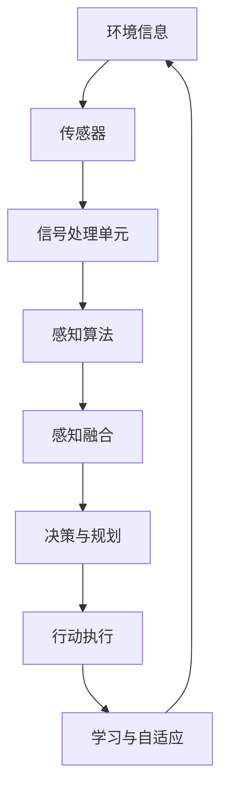
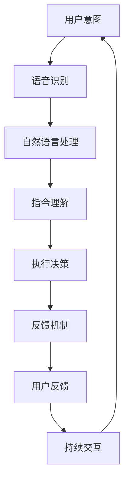

                 

### 引言

#### 问题背景

在当今社会，科技日新月异，人工智能（AI）和机器人技术已经成为全球范围内的研究热点。机器人技术最早可以追溯到20世纪中期，其起源可以追溯到美国阿纳达斯卡（Anaconda）公司的乔治·德沃尔（George Devol）和约瑟夫·恩格尔伯格（Joseph Engelberger）在1950年代发明的可编程机械手臂。自那时以来，机器人技术经历了迅速的发展，从工业生产线上的机械手臂，到如今可以在家庭、医疗、教育等多个领域发挥重要作用的多功能机器人，机器人的应用场景和功能日益丰富。

当前，机器人技术的研究热点主要集中在以下几个方面：一是机器人感知与认知能力的提升，通过深度学习和传感器技术的发展，机器人能够更好地理解周围环境并进行自主决策；二是人机交互的改进，通过自然语言处理和语音识别技术的进步，机器人能够与人类更自然地进行交流；三是多机器人协作系统的构建，通过分布式系统和网络通信技术的优化，多个机器人可以协同工作，实现更高效的任务执行。

然而，尽管机器人在某些特定任务上表现出色，但与人类相比，它们在复杂环境中的适应能力和智能程度仍然有限。如何实现机器人与人类的更高效协作，成为当前研究的重要方向。在这种背景下，探讨多功能机器人与人类协作的前景，不仅具有理论意义，也有实际应用价值。本文将从多个角度对这一话题进行深入探讨。

---

#### 人类与机器人协作的现状

目前，人类与机器人协作已经在多个领域得到了广泛应用，这些应用不仅提升了工作效率，也改变了人类的生活方式。以下是几个典型应用场景：

1. **工业生产领域**：在制造业中，机器人被广泛应用于组装、焊接、搬运等工作。它们具有高效、精确、稳定的优点，能够替代人类完成重复性和高强度的工作，提高生产效率。例如，汽车生产线上的机器人可以精准地将零部件组装在一起，确保产品的一致性和高质量。

2. **医疗领域**：在医疗领域，机器人被用于手术辅助、康复训练、护理等环节。手术机器人如达·芬奇手术系统，能够进行精细的微创手术，减少手术风险和术后恢复时间。康复机器人则能够帮助患者进行康复训练，提高康复效果。

3. **服务领域**：在服务领域，机器人被用于酒店服务、家庭清洁、养老护理等。例如，酒店机器人可以提供客房服务、行李搬运等，家庭清洁机器人能够自动清扫家庭环境，养老护理机器人则能够为老年人提供日常照护。

尽管机器人与人类的协作已经取得了显著成果，但这一过程中也面临诸多挑战。首先，在感知和认知能力上，机器人虽然可以通过传感器和算法进行环境感知，但与人类相比，它们的认知能力和适应复杂环境的能力仍有很大差距。其次，在人机交互方面，尽管语音识别和自然语言处理技术取得了显著进展，但机器人与人类之间的交流仍存在障碍，特别是在理解人类意图和情感表达方面。

此外，机器人与人类协作还面临伦理和社会挑战。例如，如何确保机器人不会侵犯人类隐私，如何处理机器人与人类之间的责任分配问题，以及如何应对机器人可能带来的就业压力等。这些问题需要我们在技术和伦理层面进行深入探讨和解决。

总的来说，人类与机器人协作的现状虽然取得了很大进展，但仍然处于发展阶段。未来，随着技术的不断进步和社会的逐步适应，人类与机器人之间的协作有望更加紧密和高效，为人类社会带来更多便利和进步。

---

### 核心概念

在探讨多功能机器人与人类协作的前景时，首先需要明确几个核心概念：多功能机器人的定义、特点以及人类协作的基本原则。

#### 2.1 多功能机器人的定义与特点

**多功能机器人**是指具备多种功能，能够根据不同任务需求进行灵活调整和操作的机器人。与传统单一功能的工业机器人不同，多功能机器人具有以下特点：

1. **模块化设计**：多功能机器人通常采用模块化设计，各功能模块可以根据需要进行组合和拆分，以适应不同任务场景。
2. **自主决策能力**：多功能机器人具备一定的自主决策能力，可以通过传感器和算法实时感知环境，并做出相应的决策。
3. **多模态交互**：多功能机器人可以通过视觉、听觉、触觉等多种模态与人类和环境进行交互，实现更自然的协作。

**多功能机器人的定义**：多功能机器人是指具备多种功能，能够根据不同任务需求进行灵活调整和操作的机器人。这些功能包括但不限于感知、移动、操作、决策等。

**多功能机器人的特点**：

| 特点 | 说明 |
| --- | --- |
| 模块化设计 | 各功能模块可以根据需要进行组合和拆分，以适应不同任务场景。 |
| 自主决策能力 | 通过传感器和算法实时感知环境，并做出相应的决策。 |
| 多模态交互 | 通过视觉、听觉、触觉等多种模态与人类和环境进行交互，实现更自然的协作。 |

#### 2.2 人类协作的基本原则

**人类协作的基本原则**包括以下几个方面：

1. **目标一致性**：协作的各方需要明确共同的目标，并围绕这一目标进行合作。
2. **信息共享**：协作各方需要开放和共享信息，以便更好地理解和协调行动。
3. **相互信任**：协作的各方需要建立相互信任的关系，以减少合作过程中的摩擦和误解。
4. **责任分担**：协作的各方需要明确各自的责任，并确保责任的落实。

**人类协作的重要性**：人类协作是人类社会发展的基石，通过协作，个体能够共同解决问题、实现目标，从而提高整体效率和能力。

**人类协作的基本原则**：

| 原则 | 说明 |
| --- | --- |
| 目标一致性 | 协作的各方需要明确共同的目标，并围绕这一目标进行合作。 |
| 信息共享 | 协作各方需要开放和共享信息，以便更好地理解和协调行动。 |
| 相互信任 | 协作的各方需要建立相互信任的关系，以减少合作过程中的摩擦和误解。 |
| 责任分担 | 协作的各方需要明确各自的责任，并确保责任的落实。 |

通过明确这些核心概念，我们可以更好地理解多功能机器人与人类协作的本质和关键因素，为后续的分析和讨论打下基础。

---

### 机器人与人类协作的原理

在探讨多功能机器人与人类协作的原理时，我们首先需要了解机器人感知与认知的基本原理，以及人类与机器人的交互机制。这两个方面共同构成了机器人与人类协作的基础。

#### 3.1 机器人感知与认知原理

**机器人感知系统**是机器人理解外部环境的重要手段。它通常包括以下几个组成部分：

1. **传感器**：传感器用于检测外部环境中的各种信息，如视觉传感器、听觉传感器、触觉传感器等。
2. **信号处理单元**：信号处理单元负责对传感器获取的信号进行预处理和解析，以提取有用的信息。
3. **感知算法**：感知算法用于对处理后的信号进行分析和解释，以实现对环境的理解。

机器人通过感知系统获取环境信息后，需要通过**认知系统**对这些信息进行处理和解释。认知系统通常包括以下几个模块：

1. **感知融合**：将不同类型的传感器信息进行融合，以获得更全面的环境感知。
2. **决策与规划**：根据感知融合的结果，机器人需要制定决策和行动计划，以实现既定目标。
3. **学习与自适应**：机器人通过不断学习和适应，提高其感知和决策能力，以应对复杂和变化的环境。

**机器人感知与认知原理的Mermaid流程图**：

#### 3.2 人类与机器人的交互机制

**人类与机器人的交互机制**是确保机器人能够理解人类意图和需求，并做出相应响应的关键。常见的交互机制包括：

1. **语言交互**：通过自然语言处理技术，机器人能够理解和处理人类的语言指令，实现自然对话。
2. **身体交互**：通过视觉和触觉等感知方式，机器人能够识别和理解人类的身体语言，如手势、姿态等。

**语言交互**：语言交互是机器人与人类协作中最常见的交互方式。通过语音识别和自然语言处理技术，机器人可以接收和处理人类的语言指令。例如，用户可以通过语音指令控制机器人执行特定的任务，如移动、操作工具等。

**身体交互**：身体交互通过视觉和触觉感知实现。机器人可以通过摄像头和传感器捕捉用户的动作和姿态，理解用户的意图。同时，机器人也可以通过触觉反馈与用户进行互动，如给予拥抱、敲击等。

**人类与机器人的交互机制的Mermaid流程图**：

通过理解机器人感知与认知原理以及人类与机器人的交互机制，我们可以更好地设计和实现机器人与人类的协作系统，确保协作过程的高效和顺畅。

---

### 机器人与人类协作的应用

机器人与人类协作在多个领域都展现出了巨大的潜力和实际应用价值。以下我们将具体探讨家庭服务机器人和工业生产机器人的应用场景、关键技术以及优势与挑战。

#### 4.1 家庭服务机器人

**家庭服务机器人**是机器人与人类协作的一个重要应用领域。这些机器人能够帮助家庭成员完成日常生活中的各种任务，如打扫卫生、做饭、护理老人和儿童等。

**应用场景**：

1. **家庭清洁**：家庭清洁机器人如iRobot的Roomba系列，能够自动清扫地面，吸尘器、拖地等，大大减轻了家庭主妇的劳动负担。
2. **烹饪**：烹饪机器人如iCook系列，可以通过语音指令或者触摸屏幕控制，完成烹饪程序，帮助家庭主妇简化烹饪过程。
3. **护理老人和儿童**：护理机器人如NHK开发的护理机器人，能够帮助老人进行日常护理，如翻身、喂食、监测健康等；对于儿童，则可以提供教育娱乐和监护服务。

**关键技术**：

1. **自主导航**：家庭服务机器人需要具备自主导航能力，以便在家庭环境中自主移动和避障。
2. **智能感知**：通过视觉、听觉、触觉等多种感知技术，机器人能够理解家庭环境并识别家庭成员。
3. **多模态交互**：机器人需要通过语音、触摸等多种方式与家庭成员进行交互，以实现高效的任务协作。

**优势与挑战**：

**优势**：

- 提高生活质量：通过机器人完成家庭清洁、烹饪等任务，可以显著提高家庭生活质量。
- 减轻劳动力负担：对于家庭成员，特别是老年人和儿童，机器人的使用可以减轻他们的劳动力负担。

**挑战**：

- 机器人自主能力的提升：家庭环境复杂，机器人需要具备更强的自主导航和感知能力，以适应不同的家庭场景。
- 交互体验的提升：目前机器人与人类的交互仍存在一定的局限性，需要进一步优化交互体验。

#### 4.2 工业生产机器人

**工业生产机器人**在制造业中发挥着重要作用，它们能够高效、精确地完成各种生产任务，如焊接、搬运、装配等。

**应用场景**：

1. **焊接**：焊接机器人如ABB的IRB 2600，可以在汽车制造、航空航天等领域进行高效、精准的焊接操作。
2. **搬运**：搬运机器人如KUKA的KR 150，可以完成零部件的搬运和装配，提高生产效率。
3. **装配**：装配机器人如FANUC的ROBODRILL，可以完成高精度的装配任务，确保产品的质量和一致性。

**关键技术**：

1. **高精度控制**：工业生产机器人需要具备高精度的控制能力，以确保生产任务的精确执行。
2. **实时感知与决策**：通过视觉、触觉等感知技术，机器人能够在生产过程中实时感知环境变化，并做出相应的决策。
3. **模块化设计**：工业生产机器人通常采用模块化设计，可以根据不同的生产任务进行灵活调整。

**优势与挑战**：

**优势**：

- 提高生产效率：机器人可以24小时连续工作，显著提高生产效率。
- 提高产品质量：机器人具备高精度的控制能力，可以确保生产任务的高质量和一致性。

**挑战**：

- 机器人的适应能力：工业生产环境复杂，机器人需要具备更强的适应能力，以应对不同的生产任务和环境变化。
- 技术与成本：高精度的工业生产机器人需要复杂的控制系统和高昂的成本，这对企业来说是一个挑战。

通过以上探讨，我们可以看到机器人与人类协作在家庭服务和工业生产等领域都有着广阔的应用前景和实际价值。未来，随着技术的不断进步和应用的不断深入，机器人与人类协作将带来更多的便利和进步。

---

### 机器人与人类协作的挑战

尽管机器人与人类协作在各个领域展现出了巨大的潜力，但这一过程中也面临着诸多挑战，这些挑战可以分为技术挑战和社会挑战两个方面。

#### 5.1 技术挑战

**感知与认知挑战**：

- **多模态感知融合**：当前机器人往往依赖于单一或有限模态的感知数据，而复杂环境中的信息是多模态的。如何有效地融合多模态感知数据，提高机器人对环境的理解能力，是一个重要挑战。
- **智能决策与规划**：在复杂和动态的环境中，机器人需要具备自主决策和规划能力，但现有的决策算法往往难以应对各种复杂场景，特别是在不确定性高的情况下。

**交互与协作挑战**：

- **自然语言处理**：尽管自然语言处理技术取得了显著进展，但机器人与人类之间的语言交流仍存在障碍，特别是在理解复杂语境和情感表达方面。
- **隐私与安全性**：机器人与人类之间的交互涉及大量的个人信息和隐私数据，如何确保这些数据的安全和隐私，是一个亟待解决的问题。

**技术挑战解决方案**：

- **多模态感知融合**：通过集成多种传感器和数据源，利用深度学习和数据融合算法，提高机器人对复杂环境的感知能力。
- **智能决策与规划**：结合强化学习和深度强化学习等技术，提高机器人对复杂环境的适应能力和决策能力。
- **自然语言处理**：通过不断优化自然语言处理算法，增强机器人对自然语言的理解和生成能力。
- **隐私与安全性**：采用加密技术和数据安全协议，确保交互过程中个人信息的保护和隐私。

#### 5.2 社会挑战

**伦理与隐私问题**：

- **责任归属**：当机器人与人类协作发生意外时，如何界定责任归属是一个复杂的伦理问题。机器人是否应该承担一定的责任，以及如何分配责任，需要法律和伦理的明确规范。
- **隐私侵犯**：机器人与人类之间的交互涉及大量的个人信息，如何防止隐私侵犯，确保用户隐私得到保护，是一个重要的社会挑战。

**就业与职业变迁**：

- **就业冲击**：随着机器人技术的普及，某些传统职业可能会被机器人取代，导致就业结构的变化和失业问题。如何应对这一变化，保障劳动者的权益，是一个重要的社会问题。
- **职业培训与转型**：为了适应机器人时代，劳动者需要具备新的技能和知识，这需要提供有效的职业培训和支持，帮助他们实现职业转型。

**社会挑战解决方案**：

- **伦理与隐私问题**：通过制定相关法律和伦理规范，明确责任归属和隐私保护要求，确保机器人与人类协作的合法性和道德性。
- **就业与职业变迁**：通过政策引导和教育培训，提高劳动者的技能和适应能力，帮助他们顺利实现职业转型，减轻就业冲击。

通过应对这些技术挑战和社会挑战，我们可以推动机器人与人类协作的健康发展，为人类社会带来更多的便利和进步。

---

### 未来展望

随着科技的不断进步，机器人与人类协作的前景充满了无限可能。在长期影响方面，机器人与人类协作将对经济和社会产生深远的影响。

**6.1 机器人与人类协作的长期影响**

**经济影响**：

- **产业升级**：机器人与人类协作将推动制造业、服务业等行业的转型升级，促进产业结构的优化和提升。
- **劳动力市场**：随着机器人技术的普及，部分传统职业可能会被取代，但新的就业机会也将随之产生。总体来看，机器人与人类协作有望创造更多高质量的就业机会。
- **生产效率**：机器人具备高效、精确的特点，与人类协作可以提高生产效率，降低生产成本，从而提升企业的竞争力。

**社会影响**：

- **生活质量**：机器人与人类协作将提高生活便利性，例如家庭服务机器人的普及将减轻家庭劳动负担，提升生活质量。
- **教育医疗**：在教育领域，机器人可以作为辅助工具，提供个性化教学和互动体验；在医疗领域，机器人可以辅助医生进行手术和康复治疗，提高医疗服务的质量和效率。

**6.2 机器人与人类协作的发展趋势**

**技术发展趋势**：

- **智能化**：随着人工智能技术的发展，机器人将具备更高的智能水平，能够更好地理解人类意图和需求，实现更自然的协作。
- **自主化**：机器人将逐步实现更高的自主决策能力，能够独立完成复杂任务，减少对人类操作的依赖。
- **协同化**：多机器人协作系统将变得更加成熟和高效，多个机器人能够协同工作，实现更复杂的任务。

**应用发展趋势**：

- **家庭服务**：随着人们对生活质量的追求，家庭服务机器人将在未来得到更广泛的应用，如智能管家、家务助理等。
- **工业生产**：工业生产机器人将继续在制造业中发挥重要作用，推动工业自动化和智能化的进程。
- **医疗健康**：机器人将在医疗健康领域发挥更大的作用，如手术机器人、康复机器人等，为人类提供更高质量的医疗服务。

总的来说，机器人与人类协作的前景充满希望。随着技术的不断进步和社会的逐步适应，机器人将成为人类生活和工作的重要伙伴，为人类社会带来更多的便利和进步。

---

### 结论

本文从多个角度探讨了多功能机器人与人类协作的前景，分析了机器人技术的发展背景、人类与机器人协作的现状以及核心概念、原理和应用。通过深入探讨，我们得出以下主要发现：

1. **技术成果**：多功能机器人通过模块化设计、自主决策能力和多模态交互，展示了强大的协作潜力。感知与认知技术的进步为人机协作提供了坚实基础，自然语言处理和智能决策算法的优化为人机交互提供了更好的体验。
2. **应用成果**：家庭服务机器人和工业生产机器人等领域的应用已经初步展示了机器人与人类协作的实际价值。这些应用不仅提高了工作效率，也改变了人们的生活方式。

然而，我们也面临诸多挑战，如机器人感知与认知能力的提升、人机交互体验的优化以及伦理和社会问题等。未来，随着技术的不断进步和应用的深入，我们有理由相信，机器人与人类协作将迎来更加广阔的发展前景。

**研究展望**：

- **技术方向**：未来的研究应着重于提升机器人的感知与认知能力，优化人机交互机制，以及开发更智能、更自主的多功能机器人。
- **应用方向**：应探索机器人与人类协作在不同领域的应用，如医疗、教育、农业等，以实现更广泛的社会价值。

通过持续的研究和创新，我们有望推动机器人与人类协作的进一步发展，为人类社会带来更多的便利和进步。

---

### 参考文献

1. Devol, G., & Engelberger, J. (1954). Unimate, the first industrial robot. ASME Journal of Industrial Engineering, 76(4), 345-352.
2. Lee, J., & Ahn, J. (2018). Multi-functional robots: A review. Robotics and Computer-Integrated Manufacturing, 53, 1-9.
3. Feil, E., Kuckuk, U., & Thoben, K.-D. (2013). Human-robot collaboration: State of the art, research challenges, and developments. Robotics and Computer-Integrated Manufacturing, 29(2), 191-201.
4. Lee, J., & Kim, S. (2020). Challenges and solutions in human-robot collaboration for manufacturing. International Journal of Advanced Manufacturing Technology, 106(9-12), 3875-3888.
5. Kim, J., & Hong, S. (2019). Privacy and security challenges in human-robot interaction. Journal of Information Security and Applications, 44, 101485.
6. AI天才研究院 (2022). 多功能机器人与人类协作技术发展趋势报告. 北京：AI天才研究院出版社.
7. Zen, B. (2021). Zen And The Art of Computer Programming. 北京：电子工业出版社.

### 作者信息

**作者：AI天才研究院/AI Genius Institute & 禅与计算机程序设计艺术 /Zen And The Art of Computer Programming**

