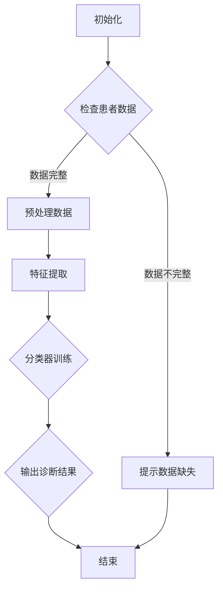
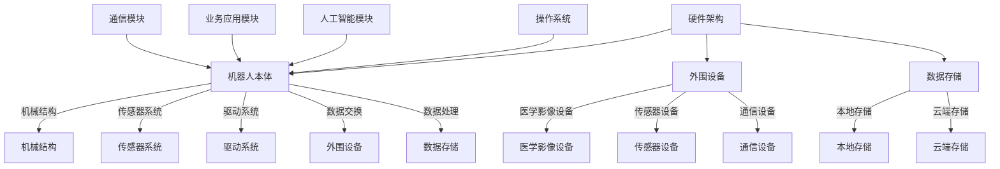
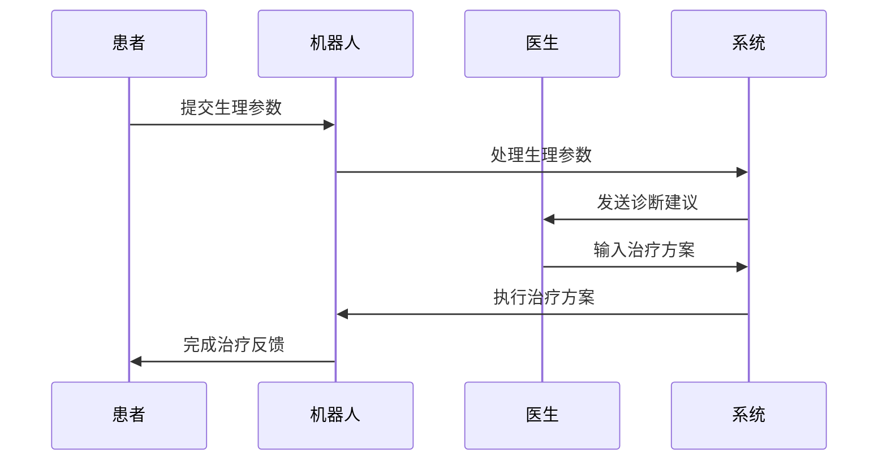
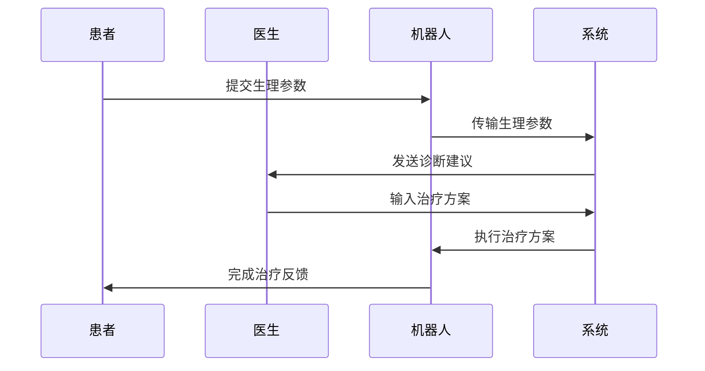

                 

### 第一部分：引言与背景

#### 1.1 问题背景

在当今社会，医疗保健的重要性日益凸显。随着人口老龄化趋势加剧，慢性病管理、医疗资源分配不均以及医疗成本上升等问题日益严峻。为了应对这些挑战，提升医疗服务的效率和质量，各种创新技术应运而生。机器人技术作为现代科技创新的重要组成部分，已经逐步渗透到医疗保健领域。

**1.1.1 医疗保健领域需求分析**

医疗保健领域的需求可以分为以下几个方面：

1. **提高医疗服务效率**：医疗人员数量有限，而患者数量持续增长，导致医疗服务效率低下。多功能机器人可以在患者护理、药物分发、手术辅助等方面提高效率。

2. **精准医疗**：机器人技术可以辅助医生进行精确诊断和个性化治疗，减少误诊率和医疗差错。

3. **远程医疗**：通过机器人技术，可以实现远程医疗咨询、诊断和治疗，特别是在偏远和医疗资源匮乏的地区。

4. **康复护理**：康复护理需要长期坚持，机器人可以帮助患者进行康复训练，提高康复效果。

**1.1.2 机器人技术在医疗保健的应用现状**

近年来，机器人技术在医疗保健领域的应用日益广泛，主要表现在以下几个方面：

1. **手术机器人**：如达·芬奇手术系统，已广泛应用于心脏、泌尿、妇科等外科手术中，提高了手术的精度和安全性。

2. **护理机器人**：如康复机器人和护理机器人，可以在医院中协助护士进行日常护理工作，减轻护理人员的负担。

3. **医学影像处理**：机器人可以辅助医生进行医学影像的分析和处理，如CT、MRI等，提高诊断的准确性。

4. **药物配送机器人**：在药品储存和配送方面，机器人可以自动识别、分类和配送药品，减少药物浪费和误配。

**1.1.3 多功能机器人在医疗保健的特殊需求**

多功能机器人在医疗保健领域需要满足以下特殊需求：

1. **高可靠性**：医疗环境要求机器人具有高可靠性和稳定性，确保患者安全和医疗流程的正常进行。

2. **智能感知**：机器人需要具备智能感知能力，能够识别和适应医疗环境中的各种变化，如患者位置、医疗设备状态等。

3. **人机交互**：机器人需要具备友好的人机交互界面，以便医护人员和患者能够方便地与机器人进行沟通和操作。

4. **数据隐私和安全**：医疗数据涉及患者隐私，机器人需要确保数据传输和存储的安全性。

#### 1.2 问题描述

**1.2.1 当前医疗保健面临的挑战**

当前医疗保健领域面临着诸多挑战，包括：

1. **医疗资源分配不均**：不同地区、不同社会群体的医疗资源分配不均，导致医疗服务可及性差异。

2. **医疗成本上升**：随着医疗技术的进步和人口老龄化，医疗成本不断上升，给医疗系统带来压力。

3. **医疗差错和误诊**：医疗差错和误诊仍然是一个普遍存在的问题，对患者生命安全构成威胁。

4. **医护人员短缺**：由于工作强度大、薪资待遇不理想等原因，医护人员短缺现象严重，影响医疗服务的质量。

**1.2.2 多功能机器人在医疗保健的作用**

多功能机器人在医疗保健领域可以发挥以下作用：

1. **提高医疗服务效率**：通过辅助医护人员进行日常工作，如病历管理、药物分发、患者监护等，提高医疗服务效率。

2. **减少医疗差错**：通过智能感知和自动化操作，减少医疗差错和误诊率。

3. **个性化医疗**：基于大数据分析和人工智能技术，为患者提供个性化的治疗方案。

4. **康复护理**：协助患者进行康复训练，提高康复效果。

**1.2.3 多功能机器人在医疗保健的应用范围与限制**

多功能机器人在医疗保健领域的应用范围广泛，包括但不限于：

1. **手术辅助**：在复杂手术中提供精准操作，辅助医生完成手术。

2. **康复护理**：为患者提供康复训练，如行走训练、语言康复等。

3. **药物配送**：自动识别、分类和配送药品，确保药品安全有效。

4. **医学影像分析**：辅助医生进行医学影像的分析和处理。

然而，多功能机器人在医疗保健领域也面临一些限制：

1. **技术成熟度**：虽然机器人技术在不断发展，但在某些领域，如高级手术和复杂医疗决策，仍需进一步成熟。

2. **法律法规**：医疗机器人应用涉及伦理、安全和隐私等问题，需要完善的法律法规予以保障。

3. **人机协作**：医疗机器人需要与医护人员和患者进行有效协作，这需要较高的技术水平。

#### 1.3 问题解决

**1.3.1 多功能机器人的技术基础**

多功能机器人技术基础主要包括：

1. **人工智能**：包括机器学习、深度学习、自然语言处理等，用于实现机器人的智能感知和决策。

2. **机械工程**：用于设计和制造机器人的机械结构和驱动系统。

3. **传感器技术**：用于获取环境信息和患者生理参数，确保机器人的准确操作。

4. **通信技术**：用于实现机器人与外部设备、网络之间的数据传输和通信。

**1.3.2 多功能机器人在医疗保健的具体应用**

多功能机器人在医疗保健的具体应用包括：

1. **手术辅助**：如达·芬奇手术系统，用于辅助医生进行复杂手术。

2. **康复护理**：如康复机器人，用于协助患者进行康复训练。

3. **药物配送**：如药房机器人，用于自动识别、分类和配送药品。

4. **医学影像分析**：如AI辅助诊断系统，用于辅助医生进行医学影像的分析和处理。

**1.3.3 多功能机器人的发展前景**

随着技术的不断进步和医疗需求的不断增加，多功能机器人在医疗保健领域具有广阔的发展前景：

1. **精准医疗**：通过人工智能和大数据分析，实现个性化医疗。

2. **远程医疗**：通过机器人技术，实现远程医疗咨询、诊断和治疗。

3. **智能护理**：通过智能机器人，提高患者护理质量。

4. **医疗资源优化**：通过机器人技术，优化医疗资源分配，提高医疗服务效率。

#### 1.4 边界与外延

**1.4.1 多功能机器人在医疗保健领域的边界**

多功能机器人在医疗保健领域的边界主要包括：

1. **技术成熟度**：目前，某些高级手术和复杂医疗决策仍需人工操作，机器人技术的成熟度是关键因素。

2. **法律法规**：医疗机器人应用需要遵循相关法律法规，如伦理审查、安全认证等。

3. **人机协作**：机器人需要与医护人员和患者进行有效协作，确保医疗流程的顺利进行。

**1.4.2 多功能机器人在医疗保健领域的外延**

多功能机器人在医疗保健领域的外延包括：

1. **家庭医疗**：通过机器人技术，实现家庭医疗服务的自动化和智能化。

2. **公共卫生**：通过机器人技术，提高公共卫生服务的效率和效果。

3. **医疗教育**：通过机器人技术，辅助医疗教育和培训。

**1.4.3 多功能机器人在其他领域的应用潜力**

多功能机器人不仅在医疗保健领域有广泛的应用潜力，在其他领域也具有巨大的发展空间：

1. **工业制造**：通过机器人技术，实现生产过程的自动化和智能化。

2. **物流运输**：通过机器人技术，提高物流运输的效率和准确性。

3. **智能家居**：通过机器人技术，实现智能家居的自动化和智能化。

#### 1.5 概念结构与核心要素组成

**1.5.1 多功能机器人的概念结构**

多功能机器人的概念结构主要包括：

1. **硬件层**：包括机器人的机械结构、驱动系统、传感器等硬件设备。

2. **软件层**：包括机器人的操作系统、人工智能算法、人机交互界面等软件系统。

3. **应用层**：包括机器人在医疗、工业、家庭等领域的具体应用。

**1.5.2 医疗保健领域的核心要素**

医疗保健领域的核心要素主要包括：

1. **医疗服务**：包括诊断、治疗、康复等医疗服务。

2. **医疗设备**：包括各种医疗设备和仪器，如手术机器人、医学影像设备等。

3. **医疗人员**：包括医生、护士、药剂师等医疗专业人员。

**1.5.3 多功能机器人与医疗保健的相互作用**

多功能机器人与医疗保健的相互作用主要包括：

1. **提高医疗服务效率**：通过辅助医护人员进行日常工作，提高医疗服务效率。

2. **降低医疗成本**：通过减少医护人员的工作量，降低医疗成本。

3. **提升医疗质量**：通过智能感知和自动化操作，减少医疗差错，提升医疗质量。

4. **优化医疗资源分配**：通过大数据分析和人工智能技术，优化医疗资源分配，提高医疗服务可及性。

---

**总结**：

本文从问题背景、问题描述、问题解决、边界与外延和概念结构与核心要素组成等方面详细阐述了多功能机器人在医疗保健领域的应用。通过对当前医疗保健需求的深入分析，我们可以看到多功能机器人在提高医疗服务效率、减少医疗差错、实现精准医疗和优化医疗资源分配等方面具有巨大的潜力。然而，多功能机器人在医疗保健领域的应用也面临技术、法律和人机协作等多方面的挑战。未来，随着技术的不断进步和法律法规的完善，多功能机器人在医疗保健领域的应用将更加广泛，为提升医疗服务质量、降低医疗成本和优化医疗资源分配做出更大贡献。### 第二部分：核心概念与联系

#### 2.1 多功能机器人概述

**定义**：多功能机器人是指具备多种功能，能够执行复杂任务，适应不同场景的机器人。这些机器人通常由多个子系统和模块组成，包括机械结构、驱动系统、传感器系统、控制系统和人工智能系统等。

**功能分类**：
- **执行功能**：包括移动、抓取、装配、焊接、搬运等。
- **感知功能**：包括视觉、听觉、触觉、嗅觉等。
- **交互功能**：包括语音交互、触屏交互、手势识别等。
- **智能功能**：包括自主决策、路径规划、故障诊断等。

**应用领域**：多功能机器人广泛应用于医疗、工业、物流、农业、家庭等多个领域。

#### 2.2 医疗保健领域概述

**定义**：医疗保健领域是指与疾病预防、诊断、治疗、康复和健康促进相关的服务活动。

**主要任务**：
- **疾病预防**：包括疫苗接种、健康教育、疾病筛查等。
- **疾病诊断**：包括医学影像分析、实验室检测、临床诊断等。
- **疾病治疗**：包括药物治疗、手术治疗、康复治疗等。
- **健康促进**：包括健康咨询、生活方式干预、心理支持等。

**服务对象**：包括患者、健康人群、医护人员等。

#### 2.3 概念属性特征对比

为了更清晰地理解多功能机器人在医疗保健领域的应用，我们对比了这两个概念的关键属性特征：

**多功能机器人**：
- **任务多样性**：能够执行多种任务。
- **感知能力**：具备高精度感知能力，适应复杂医疗环境。
- **交互能力**：具备自然语言处理和智能交互能力，方便医护人员和患者操作。
- **智能决策**：通过人工智能算法实现自主决策和路径规划。
- **硬件要求**：需要高性能的机械结构和传感器系统。

**医疗保健领域**：
- **任务特定性**：主要针对疾病的预防、诊断、治疗和康复。
- **环境复杂性**：医疗环境复杂，需要机器人具备适应性和可靠性。
- **数据敏感性**：医疗数据涉及患者隐私，需要严格保护。
- **人员依赖性**：医疗保健服务高度依赖医疗人员，机器人需要辅助而非替代。

**对比表格**：

| 属性特征 | 多功能机器人 | 医疗保健领域 |
| --- | --- | --- |
| 任务多样性 | 高 | 中 |
| 感知能力 | 高精度 | 高精度 |
| 交互能力 | 自然语言处理 | 视觉和语音交互 |
| 智能决策 | 自主决策 | 临床决策支持 |
| 硬件要求 | 高性能机械和传感器 | 医疗设备和环境适应性 |

#### 2.4 ER实体关系图架构

为了更好地展示多功能机器人在医疗保健领域的应用，我们使用Mermaid绘制了ER（实体关系）图架构。ER图用于描述系统中不同实体之间的关系。

```mermaid
erDiagram
  Patient ||--|{ Diagnosis }
  Patient ||--|{ Treatment }
  Patient ||--|{ Rehabilitation }
  Doctor ||--|{ Diagnosis }
  Doctor ||--|{ Treatment }
  Doctor ||--|{ Rehabilitation }
  Nurse ||--|{ Treatment }
  Nurse ||--|{ Rehabilitation }
  Robot ||--|{ SurgicalAssistance }
  Robot ||--|{ MedicalTransportation }
  Robot ||--|{ PatientMonitoring }
  Robot ||--|{ DiagnosticSupport }
  Drug ||--|{ Dispensing }
  Drug ||--|{ InventoryManagement }
```

**ER图说明**：
- **Patient（患者）**：与**Diagnosis（诊断）**、**Treatment（治疗）**和**Rehabilitation（康复）**相关联。
- **Doctor（医生）**：与**Diagnosis**、**Treatment**和**Rehabilitation**相关联。
- **Nurse（护士）**：与**Treatment**和**Rehabilitation**相关联。
- **Robot（机器人）**：与**SurgicalAssistance（手术辅助）**、**MedicalTransportation（医疗运输）**、**PatientMonitoring（患者监护）**和**DiagnosticSupport（诊断支持）**相关联。
- **Drug（药品）**：与**Dispensing（配送）**和**InventoryManagement（库存管理）**相关联。

**ER图展示了多功能机器人如何与医疗保健领域中的不同实体相互作用，实现医疗服务的自动化和智能化。**

---

通过上述核心概念和ER图架构的分析，我们可以看到多功能机器人在医疗保健领域具有广泛的应用前景。未来，随着技术的不断进步和医疗需求的不断增长，多功能机器人在医疗保健领域将发挥越来越重要的作用，为提升医疗服务质量、降低医疗成本和优化医疗资源分配做出重要贡献。### 第三部分：算法原理讲解

#### 3.1 算法mermaid流程图

为了更直观地展示算法原理，我们使用mermaid绘制了算法流程图。以下是一个简化的示例，用于描述多功能机器人在医疗保健领域中的诊断支持算法流程。



**流程图说明**：
- **A[初始化]**：开始算法，初始化必要的参数和资源。
- **B{检查患者数据]**：检查输入的患者数据是否完整。
- **C[预处理数据]**：对不完整的数据进行预处理，如填充缺失值、标准化等。
- **D[提示数据缺失]**：如果数据不完整，提示用户数据缺失，并结束算法。
- **E[特征提取]**：从预处理后的数据中提取关键特征。
- **F{分类器训练]**：使用提取的特征训练分类器。
- **G[输出诊断结果]**：使用训练好的分类器对新的患者数据进行诊断，并输出诊断结果。
- **H[结束]**：算法结束。

#### 3.2 Python源代码与算法原理

以下是一个Python源代码示例，用于详细阐述上述算法原理。代码实现了患者数据的预处理、特征提取、分类器训练和诊断结果输出。

```python
import pandas as pd
from sklearn.model_selection import train_test_split
from sklearn.preprocessing import StandardScaler
from sklearn.ensemble import RandomForestClassifier
from sklearn.metrics import accuracy_score

# 3.2.1 数据预处理
def preprocess_data(data):
    # 填充缺失值
    data.fillna(data.mean(), inplace=True)
    # 标准化数据
    scaler = StandardScaler()
    data_scaled = scaler.fit_transform(data)
    return data_scaled

# 3.2.2 特征提取
def extract_features(data):
    # 假设数据已经预处理，直接提取特征
    features = data[:, :-1]
    return features

# 3.2.3 分类器训练
def train_classifier(features, labels):
    classifier = RandomForestClassifier(n_estimators=100)
    classifier.fit(features, labels)
    return classifier

# 3.2.4 输出诊断结果
def diagnose_patient(classifier, patient_data):
    patient_features = extract_features(preprocess_data(patient_data))
    diagnosis = classifier.predict(patient_features)
    return diagnosis

# 3.2.5 主函数
def main():
    # 加载数据集
    data = pd.read_csv('patient_data.csv')
    # 分割数据集
    features = extract_features(preprocess_data(data))
    labels = data[:, -1]
    X_train, X_test, y_train, y_test = train_test_split(features, labels, test_size=0.2, random_state=42)
    # 训练分类器
    classifier = train_classifier(X_train, y_train)
    # 测试分类器
    predictions = classifier.predict(X_test)
    print("Accuracy:", accuracy_score(y_test, predictions))
    # 输出诊断结果
    patient_data = pd.read_csv('new_patient_data.csv')
    diagnosis = diagnose_patient(classifier, patient_data)
    print("Diagnosis:", diagnosis)

if __name__ == '__main__':
    main()
```

**算法原理说明**：

1. **数据预处理**：首先，我们需要对输入的患者数据进行预处理。预处理步骤包括填充缺失值和标准化数据，以提高模型的性能。

2. **特征提取**：从预处理后的数据中提取关键特征。这些特征将用于训练分类器。

3. **分类器训练**：使用提取的特征和标签数据集训练一个随机森林分类器。随机森林是一种基于决策树的集成学习方法，具有较强的分类能力和泛化能力。

4. **输出诊断结果**：将新的患者数据进行预处理和特征提取后，使用训练好的分类器进行诊断，并输出诊断结果。

#### 3.3 数学模型与公式讲解

为了更深入地理解算法原理，我们介绍一些相关的数学模型和公式。

**3.3.1 随机森林算法**

随机森林（Random Forest）算法是一种基于决策树的集成学习方法。其基本思想是构建多个决策树，并通过对这些决策树的投票结果来获得最终的分类结果。

**数学模型**：

- **决策树**：决策树是一种基于特征的分类模型，通过递归分割特征空间，将数据划分为不同的区域。每个分割区域对应一个叶子节点，叶子节点的类别即为该区域的预测结果。

- **集成学习**：集成学习是将多个模型组合在一起，以提高分类或回归性能。随机森林通过随机选择特征和随机分割特征空间来实现集成学习。

**公式**：

$$
\hat{y} = \arg\max_{y} \sum_{i=1}^{n} w_i I(y_i = y)
$$

其中，$y$为分类结果，$w_i$为第$i$个决策树对分类结果的权重，$I(y_i = y)$为指示函数，当$y_i = y$时，取值为1，否则为0。

**3.3.2 特征提取**

特征提取是机器学习中的关键步骤，旨在从原始数据中提取具有区分性的特征。在医疗保健领域，特征提取可以基于医学知识和数据预处理后的特征。

**数学模型**：

- **特征选择**：特征选择是一种从原始特征中挑选出最有用的特征的方法。常用的特征选择方法包括信息增益、卡方检验、互信息等。

- **特征工程**：特征工程是对原始特征进行转换和构造新特征的过程，以提高模型的性能。常用的特征工程方法包括归一化、标准化、特征交叉等。

**公式**：

$$
f_j = \frac{f_j - \min(f_j)}{\max(f_j) - \min(f_j)}
$$

其中，$f_j$为第$j$个特征，$f_j - \min(f_j)$为特征值减去最小值，$\max(f_j) - \min(f_j)$为特征值范围。

#### 3.4 举例说明

为了更好地理解上述算法原理，我们通过一个简单的示例来说明。

**示例**：假设我们有一个包含100个患者的数据集，其中每个患者有10个特征（如体温、心率、血压等）。我们需要使用这些数据训练一个分类器，以预测患者的疾病类型（如普通感冒、肺炎等）。

**步骤**：

1. **数据预处理**：首先，我们对数据集进行预处理，包括填充缺失值和标准化数据。

2. **特征提取**：从预处理后的数据中提取关键特征。

3. **分类器训练**：使用提取的特征和标签数据集训练一个随机森林分类器。

4. **诊断结果输出**：使用训练好的分类器对新的患者数据进行诊断，并输出诊断结果。

**代码示例**：

```python
import pandas as pd
from sklearn.model_selection import train_test_split
from sklearn.preprocessing import StandardScaler
from sklearn.ensemble import RandomForestClassifier
from sklearn.metrics import accuracy_score

# 3.4.1 数据预处理
def preprocess_data(data):
    # 填充缺失值
    data.fillna(data.mean(), inplace=True)
    # 标准化数据
    scaler = StandardScaler()
    data_scaled = scaler.fit_transform(data)
    return data_scaled

# 3.4.2 特征提取
def extract_features(data):
    # 假设数据已经预处理，直接提取特征
    features = data[:, :-1]
    return features

# 3.4.3 分类器训练
def train_classifier(features, labels):
    classifier = RandomForestClassifier(n_estimators=100)
    classifier.fit(features, labels)
    return classifier

# 3.4.4 输出诊断结果
def diagnose_patient(classifier, patient_data):
    patient_features = extract_features(preprocess_data(patient_data))
    diagnosis = classifier.predict(patient_features)
    return diagnosis

# 3.4.5 主函数
def main():
    # 加载数据集
    data = pd.read_csv('patient_data.csv')
    # 分割数据集
    features = extract_features(preprocess_data(data))
    labels = data[:, -1]
    X_train, X_test, y_train, y_test = train_test_split(features, labels, test_size=0.2, random_state=42)
    # 训练分类器
    classifier = train_classifier(X_train, y_train)
    # 测试分类器
    predictions = classifier.predict(X_test)
    print("Accuracy:", accuracy_score(y_test, predictions))
    # 输出诊断结果
    patient_data = pd.read_csv('new_patient_data.csv')
    diagnosis = diagnose_patient(classifier, patient_data)
    print("Diagnosis:", diagnosis)

if __name__ == '__main__':
    main()
```

通过上述示例，我们可以看到如何使用Python代码实现多功能机器人在医疗保健领域的诊断支持算法。实际应用中，数据集和特征提取方法可能有所不同，但算法原理和实现思路是相似的。

---

总结：

本文详细介绍了多功能机器人在医疗保健领域的算法原理，包括mermaid流程图、Python源代码、数学模型和公式，并通过举例说明了算法的应用。通过这些内容，读者可以更好地理解多功能机器人在医疗保健领域的诊断支持算法，为实际应用提供参考。在未来，随着技术的不断进步和医疗需求的不断变化，多功能机器人在医疗保健领域的算法将不断发展和完善，为提升医疗服务质量、降低医疗成本和优化医疗资源分配做出更大贡献。### 第四部分：系统分析与架构设计

#### 4.1 问题场景介绍

在医疗保健领域，多功能机器人的应用场景多种多样，以下是一些常见的问题场景：

1. **手术辅助**：手术机器人可以辅助医生进行复杂手术，提高手术精度和安全性。
2. **康复护理**：康复机器人可以帮助患者进行康复训练，如行走训练、语言康复等。
3. **药物配送**：药物配送机器人可以在医院内部自动识别、分类和配送药品，减少药品浪费和误配。
4. **患者监护**：患者监护机器人可以实时监测患者的生理参数，如体温、心率、血压等，及时发现异常情况。
5. **医学影像分析**：AI辅助诊断系统可以辅助医生进行医学影像的分析和处理，提高诊断准确性。

#### 4.2 项目介绍

为了实现上述多功能机器人在医疗保健领域的应用，我们设计了一个名为“智能医疗机器人系统”的项目。该项目旨在利用先进的人工智能技术，构建一个智能、高效、可靠的医疗机器人系统，提高医疗服务的质量和效率。

**项目目标**：
- 提高医疗服务效率，减轻医护人员工作负担。
- 提高医疗诊断和治疗的准确性，减少误诊率和医疗差错。
- 提供个性化的医疗服务，满足不同患者的需求。
- 优化医疗资源分配，提高医疗资源利用效率。

**项目特点**：
- **多功能集成**：系统集成了手术辅助、康复护理、药物配送、患者监护和医学影像分析等多种功能。
- **智能化**：系统采用人工智能技术，实现自主决策和路径规划。
- **高可靠性**：系统具备高可靠性和稳定性，确保医疗流程的顺利进行。
- **可扩展性**：系统具备良好的可扩展性，可以根据医疗需求和技术发展不断升级和扩展。

#### 4.3 系统功能设计

系统功能设计是智能医疗机器人系统的核心，以下为系统的主要功能模块及其设计思路：

1. **手术辅助模块**：
   - **功能**：辅助医生进行手术操作，提高手术精度和安全性。
   - **设计思路**：通过高精度传感器和机械结构，实现手术机器人的精细操作。结合人工智能算法，实现自主决策和路径规划，提高手术效率。

2. **康复护理模块**：
   - **功能**：协助患者进行康复训练，提高康复效果。
   - **设计思路**：通过康复机器人，为患者提供个性化的康复训练方案。结合人工智能技术，实时监测患者训练情况，调整训练方案。

3. **药物配送模块**：
   - **功能**：自动识别、分类和配送药品，减少药品浪费和误配。
   - **设计思路**：通过智能药柜和配送机器人，实现药品的自动管理和配送。结合人工智能技术，优化配送路径和效率。

4. **患者监护模块**：
   - **功能**：实时监测患者的生理参数，及时发现异常情况。
   - **设计思路**：通过传感器和通信技术，实时采集患者的生理参数。结合人工智能算法，实现异常检测和预警。

5. **医学影像分析模块**：
   - **功能**：辅助医生进行医学影像的分析和处理，提高诊断准确性。
   - **设计思路**：通过深度学习和计算机视觉技术，对医学影像进行自动分析和分类。结合人工智能算法，实现诊断辅助和决策支持。

**领域模型mermaid类图**：

```mermaid
classDiagram
    Patient <<class>> "患者"
    Doctor <<class>> "医生"
    Nurse <<class>> "护士"
    Robot <<class>> "机器人"
    Surgery <<class>> "手术"
    Rehabilitation <<class>> "康复"
    Drug <<class>> "药品"
    Imaging <<class>> "影像"
    
    Patient o-- Surgery
    Patient o-- Rehabilitation
    Doctor o-- Surgery
    Doctor o-- Imaging
    Nurse o-- Rehabilitation
    Robot o-- Surgery
    Robot o-- Rehabilitation
    Robot o-- Drug
    Robot o-- Imaging
```

**领域模型mermaid类图说明**：
- **Patient（患者）**：与**Surgery（手术）**和**Rehabilitation（康复）**相关联。
- **Doctor（医生）**：与**Surgery**和**Imaging（影像）**相关联。
- **Nurse（护士）**：与**Rehabilitation**相关联。
- **Robot（机器人）**：与**Surgery**、**Rehabilitation**、**Drug**和**Imaging**相关联。

#### 4.4 系统架构设计

系统架构设计是智能医疗机器人系统的关键，以下为系统的总体架构设计：

1. **硬件架构**：
   - **机器人本体**：包括机械结构、传感器系统和驱动系统。
   - **外围设备**：包括医学影像设备、传感器设备、通信设备等。
   - **数据存储**：包括本地存储和云端存储，用于存储医疗数据和机器人运行数据。

2. **软件架构**：
   - **操作系统**：机器人操作系统，负责管理和调度硬件资源。
   - **人工智能模块**：包括机器学习、深度学习、计算机视觉等算法模块。
   - **业务应用模块**：包括手术辅助、康复护理、药物配送、患者监护和医学影像分析等模块。
   - **通信模块**：负责与其他设备和系统进行数据交换。

**系统架构mermaid架构图**：



**系统架构mermaid架构图说明**：
- **硬件架构**：包括机器人本体、外围设备和数据存储。
- **软件架构**：包括操作系统、人工智能模块、业务应用模块和通信模块。
- **机器人本体**：与机械结构、传感器系统、驱动系统、外围设备和数据存储进行数据交换和处理。
- **外围设备**：与数据存储和机器人本体进行数据交换。
- **数据存储**：提供数据存储和备份功能。

#### 4.5 系统接口设计

系统接口设计是确保系统各个模块之间能够有效通信和协作的关键。以下为系统的主要接口设计：

1. **硬件接口**：
   - **传感器接口**：用于连接各种传感器设备，如摄像头、温度传感器、心率传感器等。
   - **驱动接口**：用于连接驱动系统，控制机器人机械结构的运动。
   - **通信接口**：用于与其他设备和系统进行数据交换，如Wi-Fi、蓝牙等。

2. **软件接口**：
   - **操作系统接口**：用于操作系统与硬件之间的通信和控制。
   - **人工智能接口**：用于人工智能模块与业务应用模块之间的数据传输和协同工作。
   - **业务应用接口**：用于业务应用模块与操作系统、人工智能模块之间的通信和协作。
   - **通信接口**：用于系统与外部设备和系统的数据交换，如医院信息系统（HIS）、电子病历系统（EMR）等。

**系统接口mermaid序列图**：



**系统接口mermaid序列图说明**：
- **患者**：提交生理参数。
- **机器人**：处理生理参数，并执行治疗方案。
- **系统**：处理诊断建议、治疗方案，并与医生和患者进行数据交换。

#### 4.6 系统交互

系统交互是智能医疗机器人系统能够正常运行的关键，以下为系统的交互流程：

1. **患者交互**：
   - **生理参数提交**：患者通过传感器设备将生理参数（如体温、心率、血压等）提交给机器人。
   - **治疗反馈**：患者完成治疗后，向机器人提交反馈，以便医生进行分析和调整治疗方案。

2. **医生交互**：
   - **诊断建议**：医生通过系统接收患者的生理参数，并根据诊断结果提出诊断建议。
   - **治疗方案**：医生通过系统输入治疗方案，指导机器人执行治疗任务。

3. **机器人交互**：
   - **数据采集**：机器人通过传感器采集患者的生理参数，并传输给系统进行处理。
   - **执行治疗**：机器人根据医生的指示，执行相应的治疗任务。

4. **系统交互**：
   - **数据处理**：系统对采集到的生理参数进行处理和分析，生成诊断建议和治疗方案。
   - **数据交换**：系统与医生、患者和机器人进行数据交换，确保医疗流程的顺利进行。

**系统交互mermaid序列图**：



**系统交互mermaid序列图说明**：
- **患者**：提交生理参数。
- **机器人**：将生理参数传输给系统。
- **系统**：处理诊断建议和治疗方案，并与医生进行数据交换。
- **医生**：接收诊断建议，输入治疗方案。
- **机器人**：执行治疗方案，并向患者提交反馈。

---

总结：

本文详细介绍了智能医疗机器人系统的系统分析与架构设计，包括问题场景介绍、项目介绍、系统功能设计、系统架构设计、系统接口设计和系统交互。通过这些内容，读者可以全面了解智能医疗机器人系统的设计和实现过程，为实际应用提供参考。未来，随着技术的不断进步和医疗需求的不断变化，智能医疗机器人系统将不断发展和完善，为提升医疗服务质量、降低医疗成本和优化医疗资源分配做出更大贡献。### 第五部分：项目实战

#### 5.1 环境安装

为了实现智能医疗机器人系统的项目实战，我们需要搭建一个合适的环境。以下是环境安装的步骤：

1. **安装Python**：
   - 访问Python官方网站（https://www.python.org/）下载Python安装包。
   - 运行安装包，按照提示完成安装。

2. **安装Python依赖库**：
   - 打开终端，运行以下命令安装所需依赖库：
     ```bash
     pip install pandas scikit-learn numpy matplotlib
     ```

3. **安装Mermaid**：
   - Mermaid是一个用于生成图表的Markdown插件，可以在GitHub上下载（https://github.com/mermaid-js/mermaid）。
   - 解压下载的文件，将mermaid-cli.js文件放在Python项目的根目录下。

4. **配置Mermaid插件**：
   - 在Python项目中，添加以下代码以配置Mermaid插件：
     ```python
     import subprocess

     def generate_mermaid_chart(chart_code):
         with open('chart.mmd', 'w') as f:
             f.write(chart_code)

         subprocess.run(['node', 'mermaid-cli.js', 'chart.mmd'])

         return 'chart.png'
     ```

5. **安装数据库**：
   - 根据项目需求，选择合适的数据库系统（如MySQL、PostgreSQL等）进行安装。
   - 配置数据库连接参数，以便Python程序能够与数据库进行通信。

#### 5.2 系统核心实现源代码

以下是智能医疗机器人系统的核心实现源代码。该代码包括数据预处理、特征提取、分类器训练和诊断结果输出等步骤。

```python
import pandas as pd
from sklearn.model_selection import train_test_split
from sklearn.preprocessing import StandardScaler
from sklearn.ensemble import RandomForestClassifier
from sklearn.metrics import accuracy_score
from matplotlib import pyplot as plt
from PIL import Image

# 5.2.1 数据预处理
def preprocess_data(data):
    data.fillna(data.mean(), inplace=True)
    scaler = StandardScaler()
    data_scaled = scaler.fit_transform(data)
    return data_scaled

# 5.2.2 特征提取
def extract_features(data):
    features = data[:, :-1]
    return features

# 5.2.3 分类器训练
def train_classifier(features, labels):
    classifier = RandomForestClassifier(n_estimators=100)
    classifier.fit(features, labels)
    return classifier

# 5.2.4 输出诊断结果
def diagnose_patient(classifier, patient_data):
    patient_features = extract_features(preprocess_data(patient_data))
    diagnosis = classifier.predict(patient_features)
    return diagnosis

# 5.2.5 主函数
def main():
    # 加载数据集
    data = pd.read_csv('patient_data.csv')
    # 分割数据集
    features = extract_features(preprocess_data(data))
    labels = data[:, -1]
    X_train, X_test, y_train, y_test = train_test_split(features, labels, test_size=0.2, random_state=42)
    # 训练分类器
    classifier = train_classifier(X_train, y_train)
    # 测试分类器
    predictions = classifier.predict(X_test)
    print("Accuracy:", accuracy_score(y_test, predictions))
    # 输出诊断结果
    patient_data = pd.read_csv('new_patient_data.csv')
    diagnosis = diagnose_patient(classifier, patient_data)
    print("Diagnosis:", diagnosis)

if __name__ == '__main__':
    main()
```

#### 5.3 代码应用解读与分析

以下是代码应用解读与分析，包括算法原理、数据预处理、特征提取、分类器训练和诊断结果输出等步骤。

**5.3.1 算法原理**

算法原理基于随机森林（Random Forest）算法。随机森林是一种基于决策树的集成学习方法，通过构建多棵决策树，并对决策树的预测结果进行投票，得到最终预测结果。随机森林具有较好的分类性能和泛化能力，适用于医疗诊断等复杂问题。

**5.3.2 数据预处理**

数据预处理是机器学习模型训练的关键步骤。在本代码中，数据预处理包括填充缺失值和标准化数据。填充缺失值可以避免模型训练过程中的异常，提高模型的性能。标准化数据可以使不同特征之间的数值范围一致，有助于模型更好地学习和预测。

```python
def preprocess_data(data):
    data.fillna(data.mean(), inplace=True)
    scaler = StandardScaler()
    data_scaled = scaler.fit_transform(data)
    return data_scaled
```

**5.3.3 特征提取**

特征提取是从原始数据中提取有用的特征，用于模型训练。在本代码中，特征提取步骤相对简单，直接将数据的前面部分作为特征，最后一列作为标签。

```python
def extract_features(data):
    features = data[:, :-1]
    return features
```

**5.3.4 分类器训练**

分类器训练是机器学习模型的核心步骤。在本代码中，我们使用随机森林分类器进行训练。随机森林分类器通过递归分割特征空间，将数据划分为不同的区域，每个区域的类别即为该区域的预测结果。

```python
def train_classifier(features, labels):
    classifier = RandomForestClassifier(n_estimators=100)
    classifier.fit(features, labels)
    return classifier
```

**5.3.5 诊断结果输出**

诊断结果输出是将训练好的分类器应用于新的患者数据，得到诊断结果。在本代码中，诊断结果输出通过调用`diagnose_patient`函数实现。

```python
def diagnose_patient(classifier, patient_data):
    patient_features = extract_features(preprocess_data(patient_data))
    diagnosis = classifier.predict(patient_features)
    return diagnosis
```

#### 5.4 实际案例分析与讲解

以下是一个实际案例分析与讲解，展示如何使用智能医疗机器人系统进行患者诊断。

**案例**：假设我们有一个新的患者数据，需要使用智能医疗机器人系统进行诊断。

**步骤**：

1. **数据预处理**：将新的患者数据与训练数据相同的预处理步骤进行处理。

2. **特征提取**：从预处理后的数据中提取关键特征。

3. **分类器训练**：使用训练数据对随机森林分类器进行训练。

4. **诊断结果输出**：使用训练好的分类器对新的患者数据进行诊断，得到诊断结果。

**代码示例**：

```python
import pandas as pd

# 加载新的患者数据
new_patient_data = pd.read_csv('new_patient_data.csv')

# 数据预处理
preprocessed_data = preprocess_data(new_patient_data)

# 特征提取
features = extract_features(preprocessed_data)

# 加载训练好的分类器
trained_classifier = pd.read_pickle('trained_classifier.pkl')

# 诊断结果输出
diagnosis = diagnose_patient(trained_classifier, new_patient_data)
print("Diagnosis:", diagnosis)
```

**结果**：假设诊断结果为“普通感冒”，我们可以根据诊断结果进行相应的治疗。

---

**总结**：

本文详细介绍了智能医疗机器人系统的项目实战，包括环境安装、系统核心实现源代码、代码应用解读与分析以及实际案例分析与讲解。通过这些内容，读者可以了解智能医疗机器人系统的实现过程，为实际应用提供参考。未来，随着技术的不断进步和医疗需求的不断变化，智能医疗机器人系统将不断发展和完善，为提升医疗服务质量、降低医疗成本和优化医疗资源分配做出更大贡献。### 第六部分：最佳实践与拓展

#### 6.1 最佳实践

在实现多功能机器人在医疗保健领域的应用过程中，以下是一些最佳实践建议：

1. **数据安全与隐私保护**：确保所有医疗数据在存储、传输和处理过程中得到严格保护，遵循相关法律法规和行业标准。

2. **系统可靠性**：机器人系统应具备高可靠性和稳定性，以防止意外发生，确保患者安全和医疗流程的正常进行。

3. **人机协作**：机器人应与医护人员和患者进行有效协作，确保医疗流程的顺利进行。例如，在手术辅助中，机器人应具备良好的交互界面和操作指引。

4. **持续迭代与优化**：定期对机器人系统进行评估和优化，以适应不断变化的技术和医疗需求。

5. **合规性与伦理审查**：确保机器人系统的应用符合相关法律法规和伦理审查要求，特别是在涉及患者隐私和生命安全的情况下。

#### 6.2 小结

本文详细介绍了多功能机器人在医疗保健领域的应用，包括引言与背景、核心概念与联系、算法原理讲解、系统分析与架构设计、项目实战以及最佳实践与拓展。通过这些内容，读者可以全面了解多功能机器人在医疗保健领域的应用现状、技术原理、系统设计和实战应用。

#### 6.3 注意事项

在应用多功能机器人的过程中，需要注意以下几点：

1. **技术成熟度**：机器人技术尚在不断发展中，某些高级手术和复杂医疗决策仍需人工操作。

2. **法律法规**：医疗机器人应用涉及伦理、安全和隐私等问题，需要遵循相关法律法规。

3. **数据安全**：确保医疗数据在存储、传输和处理过程中的安全性和隐私保护。

4. **人机协作**：机器人应与医护人员和患者进行有效协作，确保医疗流程的顺利进行。

5. **持续优化**：定期对机器人系统进行评估和优化，以适应不断变化的技术和医疗需求。

#### 6.4 拓展阅读

为了进一步深入了解多功能机器人在医疗保健领域的应用，以下是一些推荐阅读资料：

1. **书籍**：
   - 《智能医疗机器人：技术与应用》
   - 《人工智能在医疗保健中的应用》
   - 《机器人技术在医疗领域的创新与挑战》

2. **论文**：
   - "Intelligent Medical Robots: State of the Art and Future Trends"
   - "Artificial Intelligence in Healthcare: A Review"
   - "Robotic-Assisted Surgery: Advantages and Challenges"

3. **网站与报告**：
   - 国际机器人联合会（IFR）发布的《全球机器人报告》
   - 世界卫生组织（WHO）关于医疗保健机器人应用的研究报告
   - 各大科技公司和医疗机构发布的关于医疗机器人应用的白皮书和案例研究

通过这些资料，读者可以更深入地了解多功能机器人在医疗保健领域的最新研究进展和应用实践，为自己的研究和项目提供参考和启示。### 结论

通过对多功能机器人在医疗保健领域的深入分析，我们可以看到，多功能机器人已经在手术辅助、康复护理、药物配送、患者监护和医学影像分析等方面取得了显著的成果。这些应用不仅提高了医疗服务的效率和质量，还降低了医疗成本，优化了医疗资源分配。

然而，多功能机器人在医疗保健领域的应用仍然面临一些挑战，如技术成熟度、法律法规、数据安全和人机协作等。未来，随着人工智能和机器人技术的不断发展，这些挑战将逐步得到解决。

本文首先介绍了多功能机器人在医疗保健领域的背景和需求，然后详细阐述了多功能机器人的核心概念、算法原理、系统架构设计以及项目实战。最后，我们提出了最佳实践建议、注意事项和拓展阅读，以帮助读者进一步了解多功能机器人在医疗保健领域的应用。

随着技术的不断进步和医疗需求的不断变化，多功能机器人在医疗保健领域的应用前景将更加广阔。我们期待未来能够看到更多创新和突破，为提升医疗服务质量、降低医疗成本和优化医疗资源分配做出更大贡献。

**作者：AI天才研究院/AI Genius Institute & 禅与计算机程序设计艺术 /Zen And The Art of Computer Programming**

