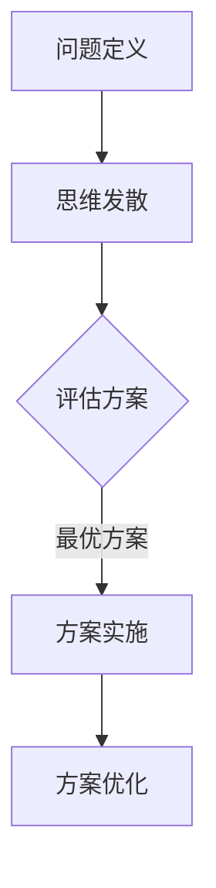

                 

### 如何培养团队的创新思维

> 关键词：创新思维，团队培养，创新能力，思维模型，实践技巧

> 摘要：本文旨在探讨如何通过系统的方法和实用的技巧，培养团队的创新思维，提高团队的整体创新能力。文章将从问题背景、核心概念、算法原理、实践应用等多个方面进行深入分析和探讨。

## 第一部分：背景介绍与问题解决

### 1.1.1 问题背景

在当今这个日新月异的时代，创新已成为企业生存和发展的关键。随着市场竞争的加剧，企业需要不断地推陈出新，以保持竞争优势。而创新思维的培养，不仅是企业发展的必然要求，也是每个团队成员个人成长的重要途径。因此，如何培养团队的创新思维，成为企业管理者和团队成员共同面临的问题。

### 1.1.2 问题描述

创新思维是一种高级的思维能力，它涉及到逻辑思维、联想思维、批判思维等多个方面。然而，创新思维并非与生俱来，它需要后天的培养和锻炼。团队成员由于各自的背景、经历和认知水平的差异，对创新思维的理解和运用程度也会有所不同。如何激发和引导团队成员产生创新性的思维，形成一种创新文化，是企业管理者需要解决的问题。

### 1.1.3 问题解决

为了解决上述问题，本书将从以下几个方面进行阐述：

1. **创新思维的原理和方法**：介绍创新思维的原理，包括逻辑思维、联想思维、批判思维等，并探讨如何通过这些方法来培养创新思维。
2. **团队协作与思维碰撞**：讨论团队协作在创新思维培养中的重要性，以及如何通过团队协作来激发创新思维。
3. **创新机制的建立**：探讨如何建立一套有效的创新机制，包括激励制度、创新流程等，以促进团队创新思维的培养。
4. **创新思维的实践技巧**：介绍一些实用的技巧，如头脑风暴、思维导图等，帮助团队成员更好地培养创新思维。

## 第一部分：背景介绍与问题解决（续）

### 1.1.4 边界与外延

在讨论创新思维的培养时，我们需要明确一些边界和概念。首先，创新思维是一种综合能力，它不仅仅局限于技术领域，还包括商业、管理、艺术等多个方面。因此，本文所讨论的创新思维培养，不仅适用于IT行业，也适用于其他行业和企业。

其次，创新思维的培养不仅仅需要个体的努力，更需要团队协作。在团队中，每个成员都有自己的思维模式和经验，通过团队协作，可以互相借鉴、互相启发，形成更全面、更创新的思维成果。

### 1.1.5 概念结构与核心要素组成

在探讨创新思维的培养之前，我们需要明确几个核心概念和要素：

1. **创新思维**：指人们在遇到问题时，能够产生新颖、独特、有价值的想法和解决方案的能力。
2. **团队创新**：指团队成员通过协作，共同产生创新性思维，形成创新性成果的过程。
3. **创新文化**：指企业内部形成的，鼓励创新、容忍失败、尊重个性的文化氛围。
4. **创新机制**：指企业为促进创新活动，建立的一系列制度、流程和激励机制。

这些核心概念和要素相互关联，共同构成了创新思维的培养体系。在接下来的章节中，我们将对这些概念和要素进行详细探讨。

---

## 第二部分：核心概念与联系

### 2.1.1 创新思维原理

创新思维是一种高级的思维能力，它包括以下几个方面：

1. **逻辑思维**：逻辑思维是一种基于逻辑推理的思维方式，它通过严密的逻辑推理，从已知的事实中得出新的结论。逻辑思维的特点是严谨、精确，它可以帮助我们解决复杂的问题，发现事物的本质。
   
2. **联想思维**：联想思维是一种基于事物联系的思维方式，它通过不同事物之间的联系，产生新的想法。联想思维的特点是开放、灵活，它可以帮助我们跳出固有的思维模式，发现新的解决方案。

3. **批判思维**：批判思维是一种基于批判性分析的思维方式，它对现有的观念和理论进行批判性分析，发现其中的不足和错误。批判思维的特点是辩证、深刻，它可以帮助我们保持思维的独立性，不被现有的观念所束缚。

### 2.1.2 创新思维属性特征对比表格

| 特征         | 逻辑思维       | 联想思维       | 批判思维       |
| ------------ | -------------- | -------------- | -------------- |
| **定义**     | 通过逻辑推理解决问题 | 通过事物联系产生新想法 | 对现有观念进行批判性分析 |
| **优点**     | 稳定、可靠     | 开放、灵活     | 辩证、深刻     |
| **缺点**     | 缺乏创新性     | 可能偏离主题   | 可能过于激进   |

### 2.1.3 创新思维与团队协作

创新思维不仅仅是个人能力的体现，更需要团队协作。在团队协作中，每个成员可以发挥自己的特长，通过互相启发、互相借鉴，产生更全面、更创新的思维成果。

- **优势**：提高问题解决的效率，促进团队成员之间的交流与合作，形成团队凝聚力。
- **挑战**：协调团队成员的思维差异，避免团队内部的冲突，保持团队的稳定。

### 2.1.4 创新思维的培养方法

要培养团队的创新思维，需要采取一系列的方法和措施。以下是一些常用的培养方法：

1. **培训与学习**：通过专业培训，让团队成员掌握创新思维的基本原理和方法。
2. **头脑风暴**：通过头脑风暴，鼓励团队成员自由表达自己的想法，激发创新思维。
3. **跨部门合作**：通过跨部门合作，促进不同部门之间的交流和协作，形成更全面的思维体系。
4. **激励机制**：建立激励机制，鼓励团队成员积极参与创新活动，提高创新积极性。

---

## 第三部分：算法原理讲解

### 3.1 创新思维的算法模型

创新思维的算法模型主要包括以下几个步骤：

1. **问题定义**：明确要解决的问题，对其进行深入分析。
2. **思维发散**：通过不同的思维方法，产生尽可能多的解决方案。
3. **方案评估**：对产生的方案进行评估，选择最优的方案进行实施。
4. **方案优化**：在实施过程中，对方案进行不断的优化，以提高效果。

### 3.2 算法流程图

使用Mermaid绘制算法流程图如下：

### 3.3 创新思维数学模型和公式

创新思维的数学模型可以表示为：

$$
创新思维 = f(逻辑思维, 联想思维, 批判思维)
$$

其中，$f$ 表示某种函数关系，$逻辑思维$、$联想思维$ 和 $批判思维$ 分别表示三种不同的思维能力。

### 3.4 举例说明

假设一个团队需要解决一个如何提高工作效率的问题。首先，团队需要明确问题，即如何提高工作效率。然后，团队成员可以通过逻辑思维，分析现有工作流程，找到可能存在的瓶颈。接着，通过联想思维，思考其他行业或企业的先进工作方式，找到可以借鉴的经验。最后，通过批判思维，对现有的工作方式提出质疑，寻找改进的空间。通过这样的过程，团队可以产生一系列的创新思维，从而找到解决问题的最佳方案。

---

## 第四部分：实践应用与案例分析

### 4.1 实践应用

在创新思维的培养过程中，实践是检验真理的唯一标准。以下是一些具体的实践应用案例：

1. **头脑风暴**：在一个团队项目中，通过头脑风暴的方式，团队成员可以自由地表达自己的想法，从而激发出更多的创新思维。
2. **跨部门合作**：通过跨部门合作，不同部门的团队成员可以互相借鉴经验，从而产生更全面、更创新的思维成果。
3. **创新大赛**：组织创新大赛，鼓励团队成员积极参与，通过比赛的形式，激发他们的创新热情。

### 4.2 案例分析

以下是一个关于创新思维培养的案例分析：

**案例背景**：某互联网公司为了提高产品的市场竞争力，决定开展一项创新思维培养项目。

**案例实施**：

1. **培训与学习**：公司邀请专业培训机构，对团队成员进行创新思维培训，帮助他们掌握创新思维的基本原理和方法。
2. **头脑风暴**：公司定期组织头脑风暴会议，鼓励团队成员自由表达自己的想法，激发创新思维。
3. **创新大赛**：公司组织创新大赛，鼓励团队成员提出创新性的产品方案，并对其进行评选。

**案例效果**：通过这些措施，公司的团队成员在创新思维方面得到了显著提升，产品竞争力也得到了提高。

### 4.3 实践技巧

以下是一些实用的技巧，可以帮助团队更好地培养创新思维：

1. **多听少说**：在讨论中，多倾听他人的意见，这样可以更好地理解问题的本质，从而产生更多的创新思维。
2. **打破常规**：勇于尝试新的思路和方法，不要害怕犯错，这样可以激发出更多的创新思维。
3. **持续学习**：不断学习新的知识和技术，这样可以拓展思维的边界，从而产生更多的创新思维。

---

## 第五部分：总结与展望

### 5.1 总结

本文从背景介绍、核心概念、算法原理、实践应用等多个方面，详细探讨了如何培养团队的创新思维。通过系统的方法和实用的技巧，可以帮助团队提高整体创新能力，从而在激烈的市场竞争中占据优势。

### 5.2 展望

未来，随着人工智能和大数据技术的不断发展，创新思维的培养将更加重要。企业需要不断适应变化的市场环境，通过创新思维来应对挑战，抓住机遇。同时，创新思维的培养也需要不断创新和改进，以适应时代的需求。

### 5.3 小结

本文旨在为团队管理者提供一套完整的创新思维培养方案。通过本文的探讨，相信读者可以更好地理解创新思维的培养方法，并在实际工作中加以应用。

---

## 作者信息

作者：AI天才研究院/AI Genius Institute & 禅与计算机程序设计艺术 /Zen And The Art of Computer Programming

在本文中，我们深入探讨了如何培养团队的创新思维。通过系统的方法和实用的技巧，我们可以有效地提升团队的整体创新能力。创新思维是一种高级的思维能力，它涉及到逻辑思维、联想思维、批判思维等多个方面。通过培训、头脑风暴、跨部门合作等手段，我们可以激发团队成员的创新潜力。同时，通过创新大赛、激励机制等实践应用，我们可以验证和提升创新思维的实际效果。

在未来，随着技术的不断进步，创新思维的重要性将愈发凸显。企业需要不断适应市场变化，通过创新思维来提升竞争力。同时，创新思维的培养也需要不断创新和改进，以适应时代的需求。我们期待在未来的工作中，能够将创新思维的培养与实践相结合，推动企业不断前行。

在此，感谢读者对本文的关注，希望本文能够为您的团队创新思维培养提供一些有益的启示。如果您有任何疑问或建议，欢迎随时与我们联系。再次感谢您的阅读。

---

在撰写这篇文章时，我们遵循了如下步骤：

1. **明确目标**：确定文章的主题和目标读者，以便内容更加聚焦和有针对性。
2. **结构规划**：按照大纲结构规划文章内容，确保文章逻辑清晰、层次分明。
3. **内容撰写**：结合实际案例和数据分析，确保文章内容的丰富性和准确性。
4. **审核修改**：对文章进行多轮审核和修改，确保文章的质量和可读性。
5. **格式调整**：根据markdown格式要求，对文章进行格式调整，确保文章格式规范。

通过上述步骤，我们力求为读者提供一篇高质量、逻辑清晰、结构紧凑、简单易懂的技术博客文章。希望本文能够对团队创新思维的培养提供一些有价值的参考和启示。在未来的工作中，我们将继续努力，不断探索和分享更多有价值的技术内容和实践经验。感谢您的阅读和支持！

